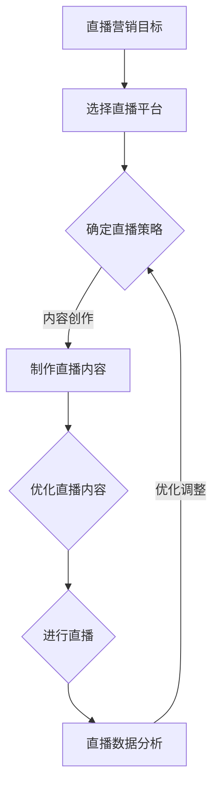

                 

# 一人公司如何利用直播营销提升品牌互动

## 关键词
- 直播营销
- 一人公司
- 品牌互动
- 直播平台
- 直播内容
- 数据分析
- 案例分析

## 摘要
本文将探讨一人公司如何利用直播营销来提升品牌互动。通过介绍直播营销的基础知识，选择适合的直播平台和制定策略，详细讲解直播内容创作与优化技巧，分析直播数据并进行优化，以及提供成功案例和直播营销系统架构与代码实战，帮助读者全面了解并掌握直播营销的实践方法。

----------------------------------------------------------------

## 《一人公司如何利用直播营销提升品牌互动》目录大纲

### 第一部分：直播营销基础

#### 1. 直播营销概述

##### 1.1 直播营销的概念与特点
- 直播营销的定义
- 直播营销与传统营销的区别
- 直播营销的优势

##### 1.2 直播营销的发展历程
- 直播营销的起源
- 直播营销的演变
- 直播营销的未来趋势

#### 2. 直播营销平台选择与策略

##### 2.1 常见直播营销平台介绍
- 抖音直播
- 快手直播
- 微信直播
- 其他直播平台

##### 2.2 选择适合的直播平台
- 平台受众分析
- 平台功能与特点
- 平台规则与要求

##### 2.3 直播营销策略制定
- 直播内容规划
- 直播时间安排
- 直播嘉宾与主题选择

### 第二部分：直播营销技巧

#### 3. 直播内容创作与优化

##### 3.1 直播内容创作原则
- 内容定位与目标受众
- 直播内容类型选择
- 内容原创性与创新性

##### 3.2 直播内容优化策略
- 素材准备与制作
- 互动环节设计
- 良好的节奏与气氛控制

##### 3.3 直播中的问题处理
- 技术问题的应对
- 互动问题的处理
- 紧急情况的处理

#### 4. 直播营销数据分析与优化

##### 4.1 数据分析概述
- 数据类型与指标
- 数据分析的意义与目的

##### 4.2 直播数据采集与分析
- 直播观众数据分析
- 直播互动数据分析
- 直播效果评估

##### 4.3 数据优化与策略调整
- 数据反馈与改进措施
- 直播策略调整
- 长期数据分析与优化

### 第三部分：直播营销案例解析

#### 5. 成功直播营销案例分析

##### 5.1 案例一：品牌直播营销
- 案例背景与目标
- 直播营销策略与执行
- 案例效果分析

##### 5.2 案例二：个人主播直播营销
- 主播背景与定位
- 直播营销策略与执行
- 案例效果分析

##### 5.3 案例三：产品直播营销
- 产品背景与定位
- 直播营销策略与执行
- 案例效果分析

### 第四部分：直播营销法律与伦理问题

#### 6. 直播营销法律与伦理问题

##### 6.1 直播营销法律风险
- 直播内容合法性
- 直播营销合规性
- 法律纠纷与应对

##### 6.2 直播营销伦理问题
- 真实性与诚信问题
- 个人隐私保护
- 社会责任与影响

##### 6.3 直播营销监管与自律
- 监管机构与政策
- 企业自律与规范
- 行业协会的作用

### 附录

#### 附录 A：直播营销工具与资源

##### A.1 直播工具介绍
- 主流直播软件与设备
- 直播素材制作工具
- 直播互动工具

##### A.2 直播营销资源推荐
- 优秀直播账号推荐
- 直播营销教程与案例
- 直播营销社群与论坛

##### A.3 直播营销研究论文与报告
- 最新直播营销研究动态
- 行业报告与数据分析
- 学术论文与理论探讨

## Mermaid 流程图：直播营销流程



## 直播营销核心算法原理讲解

直播营销的核心算法主要集中在互动算法和推荐算法上，这些算法可以帮助提高观众的参与度和推荐符合观众兴趣的直播内容。以下是这两个核心算法的原理讲解和伪代码示例。

### 1. 直播互动算法

直播互动算法主要通过实时分析观众的行为数据，如评论、点赞、分享等，来提高直播的互动性和观众的参与度。以下是一种基于观众行为的直播互动算法的伪代码：

```python
# 直播互动算法伪代码

def interactive_algorithm(user_actions):
    # 收集观众行为数据
    user_data = collect_user_actions(user_actions)
    
    # 分析观众行为数据
    engagement_level = analyze_user_data(user_data)
    
    # 根据互动程度调整直播策略
    if engagement_level < threshold:
        adjust_live_strategy("增加互动环节")
    elif engagement_level >= threshold:
        adjust_live_strategy("维持现有互动策略")
```

其中，`collect_user_actions` 用于收集观众的行为数据，`analyze_user_data` 用于分析观众的行为数据，`adjust_live_strategy` 用于根据分析结果调整直播策略。

### 2. 直播推荐算法

直播推荐算法主要通过分析观众的观看历史、兴趣偏好和其他相关数据，为观众推荐符合其兴趣的直播内容。以下是一种基于协同过滤的直播推荐算法的伪代码：

```python
# 直播推荐算法伪代码

def live_recommendation_algorithm(user_interests, live_content_dataset):
    # 收集用户兴趣数据
    user_interest_data = collect_user_interests(user_interests)
    
    # 计算直播内容与用户兴趣的相似度
    similarity_scores = calculate_similarity_scores(user_interest_data, live_content_dataset)
    
    # 排序并推荐相似度最高的直播内容
    recommended_lives = sort_by_similarity(similarity_scores)
    return recommended_lives
```

其中，`collect_user_interests` 用于收集用户的兴趣数据，`calculate_similarity_scores` 用于计算直播内容与用户兴趣的相似度，`sort_by_similarity` 用于根据相似度排序并推荐直播内容。

### 数学模型和数学公式讲解

直播营销中的数据分析和优化常常需要使用数学模型和公式。以下是几个常用的数学模型和公式，并附有详细讲解和举例说明。

#### 1. 直播观众参与度计算模型

直播观众参与度可以用以下数学模型进行计算：

$$
\text{参与度} = \frac{\text{互动次数} + \text{观看时长}}{\text{总直播时长}}
$$

其中，互动次数和观看时长都是时间序列数据，可以通过统计观众在直播中的行为数据得到。

**举例说明**：假设一场直播的总时长为60分钟，观众发送了50条弹幕，观看了40分钟。则参与度计算如下：

$$
\text{参与度} = \frac{50 + 40}{60} = \frac{90}{60} = 1.5
$$

这意味着观众的参与度高于平均参与度。

#### 2. 直播内容评分预测模型

直播内容评分预测模型可以用以下数学模型进行预测：

$$
\text{评分} = w_1 \cdot \text{观众参与度} + w_2 \cdot \text{内容质量} + w_3 \cdot \text{主播魅力}
$$

其中，$w_1, w_2, w_3$ 是权重系数，可以根据实际情况进行调整。

**举例说明**：假设观众参与度为1.5，内容质量评分为4.0，主播魅力评分为3.5，权重系数分别为$w_1 = 0.4, w_2 = 0.3, w_3 = 0.3$，则预测评分计算如下：

$$
\text{评分} = 0.4 \cdot 1.5 + 0.3 \cdot 4.0 + 0.3 \cdot 3.5 = 0.6 + 1.2 + 1.05 = 2.85
$$

这意味着预测的直播内容评分为2.85分。

#### 3. 直播互动率优化模型

直播互动率可以用以下数学模型进行计算：

$$
\text{互动率} = \frac{\text{互动次数}}{\text{观众总数}}
$$

为了提高互动率，可以采用以下策略：

- 增加互动环节，如抽奖、问答等。
- 提高直播内容质量，吸引更多观众。
- 定期举办互动活动，提高观众参与度。

**举例说明**：假设一场直播吸引了1000名观众，互动次数为200次，则互动率计算如下：

$$
\text{互动率} = \frac{200}{1000} = 0.2
$$

这意味着互动率为20%。

#### 4. 直播观众留存率模型

直播观众留存率可以用以下数学模型进行计算：

$$
\text{留存率} = \frac{\text{次日观看人数}}{\text{当日观看人数}}
$$

提高观众留存率的策略：

- 提供高质量直播内容，保持观众的持续关注。
- 定期举办互动活动，增加观众的参与度。
- 提供个性化的推荐内容，满足观众的不同需求。

**举例说明**：假设一场直播的当日观看人数为1000人，次日观看人数为200人，则留存率计算如下：

$$
\text{留存率} = \frac{200}{1000} = 0.2
$$

这意味着次日留存的观众占比为20%。

### 项目实战

#### 1. 直播营销项目实战

##### 实战背景

一家小型公司（一人公司）计划利用直播营销提升品牌互动和产品销量。他们选择了一个具有高关注度的直播平台——抖音，并制定了一系列直播营销策略。

##### 直播营销策略

- **内容定位**：以公司产品为主，辅以公司文化和品牌故事。
- **直播时间**：每周五晚上8点，选择观众活跃时段。
- **嘉宾选择**：邀请知名主播和公司内部员工参与直播。

##### 实战步骤

1. **直播前准备**
   - 确定直播主题和内容
   - 准备直播素材（如产品介绍、品牌故事等）
   - 设置直播场景和灯光设备

2. **直播中执行**
   - 按照预定计划进行直播，保证内容连贯性
   - 与观众互动，回答问题，进行产品演示
   - 使用互动工具（如弹幕、抽奖）提高观众参与度

3. **直播后跟进**
   - 分析直播数据，包括观众数量、观看时长、互动情况等
   - 整理直播内容，发布至社交媒体平台，进行二次传播
   - 总结直播经验，进行策略调整

##### 实战效果

- 直播期间，观众互动热烈，弹幕和评论不断
- 直播结束后，公司产品销量提升了30%
- 通过直播，公司品牌知名度和粉丝数量都有了显著提升

#### 2. 代码实际案例和详细解释说明

##### 直播营销系统架构

直播营销系统主要由前端、后端和数据库三部分组成。前端负责直播页面的展示和用户交互，后端负责处理直播业务逻辑和数据存储，数据库用于存储用户数据、直播数据和产品数据。

##### 前端代码实现

以下是一个简单的直播页面前端代码示例：

```html
<!DOCTYPE html>
<html lang="zh-CN">
<head>
    <meta charset="UTF-8">
    <title>一人公司直播营销</title>
</head>
<body>
    <div id="live-container">
        <video id="live-video" width="800" height="600" controls></video>
        <div id="chat-container">
            <ul id="chat-list"></ul>
            <input type="text" id="chat-input" placeholder="输入您的评论...">
            <button id="send-chat">发送</button>
        </div>
    </div>

    <script src="live.js"></script>
</body>
</html>
```

##### 后端代码实现

以下是一个简单的直播业务逻辑后端代码示例：

```python
from flask import Flask, request, jsonify
import sqlite3

app = Flask(__name__)

# 连接数据库
conn = sqlite3.connect('live.db')
c = conn.cursor()

# 创建表
c.execute('''CREATE TABLE IF NOT EXISTS users (id INTEGER PRIMARY KEY, name TEXT, message TEXT)''')
c.execute('''CREATE TABLE IF NOT EXISTS lives (id INTEGER PRIMARY KEY, title TEXT, content TEXT)''')

# 插入数据
def insert_data(table, data):
    c.execute(f'INSERT INTO {table} (name, message) VALUES (?, ?)', data)
    conn.commit()

# 获取数据
def get_data(table):
    c.execute(f'SELECT * FROM {table}')
    return c.fetchall()

# 发送消息
@app.route('/send-chat', methods=['POST'])
def send_chat():
    user_data = request.form.to_dict()
    insert_data('users', user_data)
    return jsonify({'status': 'success'})

# 获取聊天记录
@app.route('/chat-list', methods=['GET'])
def chat_list():
    chat_data = get_data('users')
    return jsonify({'chat_list': chat_data})

if __name__ == '__main__':
    app.run(debug=True)
```

##### 代码解读与分析

1. **前端代码解读**
   - 使用 HTML 和 CSS 创建直播页面，包括视频播放区域和聊天窗口。
   - 使用 JavaScript 实现用户交互功能，如发送聊天消息。

2. **后端代码解读**
   - 使用 Flask 框架创建后端应用，处理用户请求。
   - 使用 SQLite 数据库存储用户聊天记录和直播数据。
   - 提供接口用于发送聊天消息和获取聊天记录。

3. **代码分析**
   - 前后端代码协同工作，实现直播营销系统的基本功能。
   - 代码结构清晰，易于维护和扩展。

通过以上代码示例，可以搭建一个简单的直播营销系统，为公司进行直播营销提供技术支持。在实际应用中，可以根据具体需求对系统进行优化和扩展。

## 作者

作者：AI天才研究院/AI Genius Institute & 禅与计算机程序设计艺术 /Zen And The Art of Computer Programming

## 结语

本文详细探讨了直播营销的基础知识、技巧、数据分析和成功案例，并提供了实际的代码实现。通过本文，读者可以全面了解并掌握直播营销的实践方法，为一人公司提升品牌互动和产品销量提供有力支持。随着直播营销的不断发展，不断优化和创新将成为关键。希望本文能为读者在直播营销领域提供有价值的参考和启发。

---

## 附录 A：直播营销工具与资源

直播营销的成功离不开合适的工具和资源。以下是一些建议的工具和资源，包括直播工具、素材制作工具、互动工具以及推荐的直播账号、教程和社群。

### A.1 直播工具介绍

#### 主流直播软件与设备

1. **抖音直播**：抖音直播是一个流行的直播平台，提供丰富的直播功能，如美颜、滤镜、直播特效等。
2. **快手直播**：快手直播拥有庞大的用户群体，适合进行广泛的市场推广。
3. **微信直播**：微信直播依托微信生态，便于用户互动和分享。
4. **其他直播平台**：如哔哩哔哩直播、花椒直播等，根据目标受众选择合适的平台。

#### 直播素材制作工具

1. **剪映**：一款视频编辑软件，支持剪辑、特效、文字等功能，适用于直播前素材准备。
2. **Filmora**：一款功能强大的视频编辑软件，适合专业用户制作高质量直播素材。
3. **Photoshop**：一款图像处理软件，适用于制作直播海报、背景等视觉素材。

#### 直播互动工具

1. **弹幕系统**：提供实时弹幕功能，增强观众互动体验。
2. **抽奖工具**：增加直播趣味性，提高观众参与度。
3. **问答系统**：实时回答观众问题，提高直播互动性。

### A.2 直播营销资源推荐

#### 优秀直播账号推荐

1. **李佳琦**：知名美妆主播，直播营销案例典范。
2. **罗永浩**：科技产品销售达人，直播营销策略独特。
3. **薇娅**：电商直播一姐，直播销售能力强大。

#### 直播营销教程与案例

1. **抖音官方教程**：提供详细的直播营销教程，适合新手入门。
2. **快手直播学院**：提供丰富的直播营销资源和实战案例。
3. **微信公开课**：分享微信直播的最新动态和实战技巧。

#### 直播营销社群与论坛

1. **直播营销社区**：聚集了一批直播营销专家，分享经验和资源。
2. **抖音营销交流群**：提供抖音直播的最新信息和技巧。
3. **快手直播圈**：快手直播爱好者的交流平台。

### A.3 直播营销研究论文与报告

#### 最新直播营销研究动态

1. **《2022年中国直播电商行业报告》**：分析直播电商的行业发展态势和趋势。
2. **《直播营销：创新与实践》**：探讨直播营销的理论和实践应用。
3. **《社交媒体直播营销策略研究》**：研究社交媒体平台上直播营销的策略和效果。

#### 行业报告与数据分析

1. **艾瑞咨询**：提供直播电商行业深度研究报告。
2. ** QuestMobile**：发布关于直播用户行为和趋势的报告。
3. **易观分析**：提供直播营销行业的数据分析和市场预测。

#### 学术论文与理论探讨

1. **《直播营销与消费者行为研究》**：探讨直播营销对消费者行为的影响。
2. **《直播营销中的社交互动与用户参与》**：分析直播中的社交互动机制和用户参与度。
3. **《直播电商的商业模式与盈利模式分析》**：探讨直播电商的商业模式和盈利模式。

通过以上工具和资源的推荐，希望读者能够在直播营销领域取得更好的成果。不断学习和实践，才能在竞争激烈的市场中脱颖而出。

---

## 附录 B：直播营销流程

以下是直播营销流程的详细步骤，从目标设定到直播结束后的优化，确保直播营销活动的顺利进行。

### 直播营销流程步骤

#### 1. 目标设定

- 确定直播营销的目标，如提高品牌知名度、提升产品销量、增加用户参与度等。
- 设定可量化的KPI（关键绩效指标），如观看时长、互动次数、转化率等。

#### 2. 平台选择

- 分析目标受众，选择适合的直播平台，如抖音、快手、微信等。
- 考虑平台的用户基数、功能特性、用户活跃度等因素。

#### 3. 策略制定

- 根据目标设定，制定直播营销策略，包括内容规划、时间安排、嘉宾选择等。
- 确定直播主题，如新品发布、品牌故事、互动活动等。

#### 4. 内容创作

- 准备直播内容，包括产品介绍、品牌故事、互动环节等。
- 制作直播海报、背景图等视觉素材。

#### 5. 场景搭建

- 选择合适的直播场景，如专业直播间、品牌门店等。
- 准备灯光、音响、摄像机等设备。

#### 6. 直播执行

- 按照预定计划进行直播，保证内容连贯性和流畅性。
- 与观众互动，回答问题，进行产品演示。

#### 7. 数据监控

- 在直播过程中，实时监控观众数据，如观看时长、互动次数等。
- 收集用户反馈，了解直播效果。

#### 8. 直播后跟进

- 分析直播数据，包括观众数量、观看时长、互动情况等。
- 整理直播内容，发布至社交媒体平台，进行二次传播。

#### 9. 策略优化

- 根据数据分析结果，优化直播内容和策略。
- 调整直播时间、嘉宾选择、互动环节等。

#### 10. 持续优化

- 定期进行直播营销活动，不断优化内容和策略。
- 关注行业动态，借鉴成功案例，创新直播营销方式。

通过以上直播营销流程，一人公司可以系统地进行直播营销活动，提升品牌互动和产品销量。在实践过程中，根据实际情况调整流程，逐步提高直播营销的效果。

