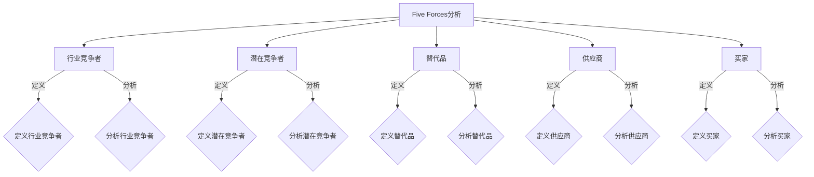
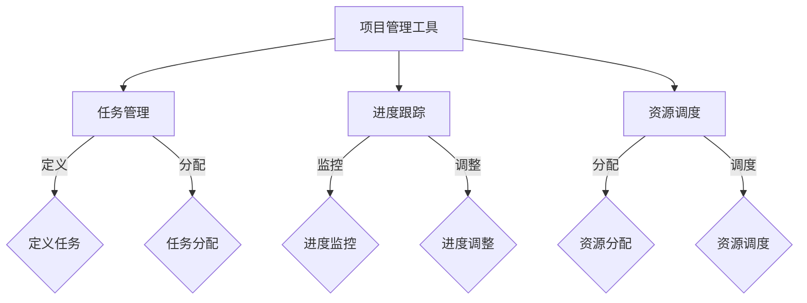
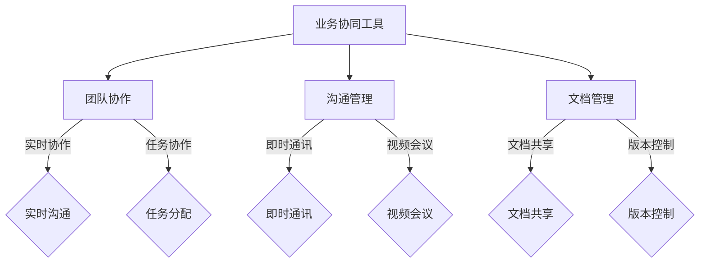
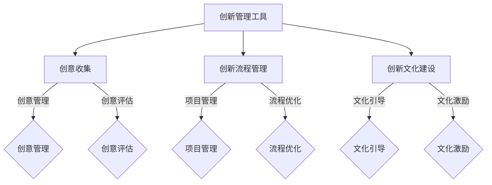

                 

# 一人公司如何实现业务的跨界融合与创新

> **关键词**: 一人公司，跨界融合，业务创新，创新管理，案例分析，未来展望

> **摘要**: 本文将探讨一人公司在实现业务跨界融合与创新方面的策略和实践。通过分析跨界融合的概念、机会与挑战，介绍业务协同与创新管理的机制与工具，结合实际案例，提供可行的跨界融合实施策略，并对跨界融合的未来趋势进行展望。文章旨在为一人公司提供具有指导意义的跨界融合与创新路径。

## 第一部分: 公司业务融合与创新基础

### 第1章: 公司业务融合概述

#### 第1节: 公司业务融合的概念与意义

**1.1 公司业务融合的定义**

公司业务融合，指的是企业通过整合内部资源、优化业务流程、跨领域合作等方式，将原本独立的业务单元整合成具有协同效应的整体。这一过程不仅包括企业内部的业务重组，还涉及到与外部合作伙伴的业务整合。

**1.2 公司业务融合的价值**

- **提升竞争力**：业务融合有助于企业更好地应对市场竞争，通过协同效应提升整体竞争力。
- **优化资源配置**：整合内部资源，提高资源利用率，降低运营成本。
- **创新驱动**：跨界合作和业务融合激发创新思维，推动企业持续创新。
- **拓宽市场**：通过业务融合，企业可以进入新的市场领域，拓展业务范围。

**1.3 公司业务融合的类型**

- **横向融合**：将不同部门或业务单元的资源进行整合，实现业务协同。
- **纵向融合**：整合上下游产业链资源，提高整体供应链效率。
- **跨界融合**：跨行业、跨领域的企业合作，实现资源共享和优势互补。

#### 第2节: 创新在业务融合中的角色

**2.1 创新的重要性**

- **推动业务融合**：创新思维是业务融合的驱动力，能够激发企业内部和外部的合作潜力。
- **提升企业竞争力**：创新能够为企业带来新的产品和服务，提升市场竞争力。
- **优化业务流程**：创新有助于优化业务流程，提高运营效率。

**2.2 创新驱动业务融合的策略**

- **开放式创新**：通过外部合作，引入外部资源和创新成果，实现跨界融合。
- **内部创新机制**：建立创新团队，鼓励员工提出创新想法，推动内部创新。
- **持续创新投入**：投入足够的资源和资金，支持创新项目和业务融合。

**2.3 创新与风险管理**

- **创新风险识别**：对创新项目进行全面的风险评估，识别潜在风险。
- **风险管理策略**：制定相应的风险管理策略，降低创新风险。
- **风险控制与应对**：建立风险控制机制，及时应对创新过程中的风险。

#### 第3节: 跨界业务分析

**3.1 跨界业务的机会与挑战**

**3.1.1 跨界业务的机会**

- **市场潜力**：跨界业务可以拓展企业的市场空间，挖掘新的客户需求。
- **资源互补**：跨界合作可以实现资源互补，提升整体竞争力。
- **技术创新**：跨界合作可以引入新技术，推动企业创新。

**3.1.2 跨界业务的挑战**

- **文化差异**：不同行业的文化差异可能导致合作困难。
- **技术壁垒**：跨界业务可能面临技术上的挑战和障碍。
- **人才短缺**：跨界业务需要具备跨行业知识的人才，人才短缺可能成为瓶颈。

**3.1.3 跨界业务成功的关键因素**

- **战略定位**：明确跨界业务的战略目标和发展方向。
- **资源整合**：整合内部和外部资源，提升跨界业务的成功率。
- **持续创新**：保持创新思维，不断推动业务融合和创新。

**3.2 跨界业务选择与规划**

**3.2.1 跨界业务选择策略**

- **市场需求**：分析市场需求，选择具有潜力的跨界业务。
- **资源能力**：评估企业的资源能力和技术优势，选择符合企业发展的跨界业务。
- **竞争态势**：分析市场竞争态势，选择具有竞争优势的跨界业务。

**3.2.2 跨界业务规划流程**

- **战略规划**：制定跨界业务的战略规划，明确目标和路径。
- **业务分析**：进行市场调研和业务分析，确定跨界业务的可行性。
- **资源整合**：整合内部和外部资源，为跨界业务提供支持。
- **风险评估**：对跨界业务进行全面风险评估，制定风险管理策略。

**3.2.3 跨界业务风险评估与管理**

- **风险评估**：对跨界业务进行风险识别和评估，制定风险应对策略。
- **风险管理**：建立风险管理机制，及时应对跨界业务中的风险。
- **风险监控**：持续监控跨界业务的风险状况，及时调整风险应对策略。

### 第2章: 跨界业务分析

#### 第1节: 跨界业务的机会与挑战

**2.1 跨界业务的机会**

**2.1.1 市场潜力**

跨界业务可以为企业带来新的市场机会，通过整合不同行业的资源和能力，开拓新的市场空间。例如，传统的制造业企业可以与互联网企业合作，开发智能家居产品，进入智能家居市场。

**2.1.2 资源互补**

跨界业务可以实现资源的互补，提升整体竞争力。通过与其他行业的合作，企业可以获得所需的技术、市场、资金等资源，实现优势互补。例如，一家传统零售企业可以与电子商务企业合作，通过线上销售渠道拓展市场。

**2.1.3 技术创新**

跨界业务可以引入新技术，推动企业创新。通过与其他行业的合作，企业可以借鉴和应用新的技术，提升自身的技术水平和创新能力。例如，一家生物制药企业可以与信息技术企业合作，利用大数据分析技术进行药物研发。

**2.2 跨界业务的挑战**

**2.2.1 文化差异**

跨界业务往往涉及到不同行业的合作，不同行业之间的文化差异可能导致合作困难。企业需要尊重并融合不同行业的文化，建立共同的工作方式和价值观。

**2.2.2 技术壁垒**

跨界业务可能面临技术上的挑战和障碍。不同行业之间的技术标准和规范可能存在差异，企业需要投入资源和时间进行技术研究和适应。

**2.2.3 人才短缺**

跨界业务需要具备跨行业知识的人才，人才短缺可能成为瓶颈。企业需要通过招聘、培训和引进等方式，培养和吸引具备跨界能力的人才。

**2.3 跨界业务成功的关键因素**

**2.3.1 战略定位**

跨界业务的成功首先需要明确的战略定位。企业需要明确跨界业务的发展目标、市场定位和竞争优势，制定相应的战略规划。

**2.3.2 资源整合**

跨界业务的成功需要整合内部和外部资源。企业需要调动内部资源，如技术、资金、人才等，同时积极寻求外部合作伙伴，实现资源的互补和共享。

**2.3.3 持续创新**

跨界业务的成功离不开持续创新。企业需要保持创新思维，不断推动业务融合和创新，适应市场变化和客户需求。

**2.4 跨界业务选择与规划**

**2.4.1 跨界业务选择策略**

在选择跨界业务时，企业需要考虑以下几个方面：

- **市场需求**：分析市场需求，选择具有潜力的跨界业务。
- **资源能力**：评估企业的资源能力和技术优势，选择符合企业发展的跨界业务。
- **竞争态势**：分析市场竞争态势，选择具有竞争优势的跨界业务。

**2.4.2 跨界业务规划流程**

跨界业务的规划流程包括以下几个步骤：

- **战略规划**：制定跨界业务的战略规划，明确目标和路径。
- **业务分析**：进行市场调研和业务分析，确定跨界业务的可行性。
- **资源整合**：整合内部和外部资源，为跨界业务提供支持。
- **风险评估**：对跨界业务进行全面风险评估，制定风险管理策略。

**2.4.3 跨界业务风险评估与管理**

跨界业务面临多种风险，包括市场风险、技术风险、财务风险等。企业需要建立风险评估机制，对跨界业务进行全面评估，并制定相应的风险管理策略。

- **市场风险**：分析市场需求变化、竞争对手状况等，制定市场风险应对策略。
- **技术风险**：评估跨界业务所需的技术水平和研发能力，制定技术风险应对策略。
- **财务风险**：评估跨界业务的财务状况和资金需求，制定财务风险应对策略。

通过以上分析，一人公司可以明确跨界业务的机会与挑战，制定合理的跨界业务选择与规划策略，为业务的跨界融合与创新奠定基础。

### 第3章: 业务协同与创新管理

#### 第1节: 业务协同机制

**3.1.1 业务协同的意义**

业务协同是指通过协调和整合企业内部及外部的各种资源、流程和活动，实现业务目标的最优化。对于一人公司而言，业务协同具有重要意义：

- **提升效率**：通过业务协同，可以减少重复劳动，提高工作效率。
- **增强协同性**：业务协同有助于各部门之间的沟通与协作，提高整体协同性。
- **增强灵活性**：业务协同可以使企业更快速地应对市场变化和客户需求。

**3.1.2 业务协同策略**

为了实现有效的业务协同，一人公司可以采取以下策略：

- **明确目标**：设定明确的协同目标，确保各部门在协同过程中有共同的方向和目标。
- **流程优化**：梳理和优化业务流程，消除不必要的环节，提高流程效率。
- **信息共享**：建立信息共享平台，确保各部门能够及时获取所需信息，提高协同效率。
- **激励机制**：制定合理的激励机制，鼓励员工积极参与协同工作，提高协同效果。

**3.1.3 业务协同工具与技术**

为了实现业务协同，一人公司可以采用以下工具和技术：

- **项目管理工具**：如Trello、JIRA等，用于管理项目进度和团队协作。
- **协作平台**：如Slack、Microsoft Teams等，用于团队沟通和协作。
- **知识管理系统**：如Confluence、Notion等，用于知识共享和文档管理。

#### 第2节: 创新管理

**3.2.1 创新管理概述**

创新管理是指企业通过系统化、制度化的方式，激发创新活力，推动技术创新和业务创新的过程。对于一人公司而言，创新管理至关重要：

- **保持竞争力**：通过创新，企业可以保持竞争力，适应市场变化。
- **推动业务发展**：创新可以为企业带来新的业务增长点，推动业务发展。
- **提升企业价值**：创新可以提高企业的盈利能力和市场地位，提升企业价值。

**3.2.2 创新流程设计**

为了实现有效的创新管理，一人公司可以设计以下创新流程：

- **需求识别**：通过市场调研和客户反馈，识别潜在的创新需求。
- **创意产生**：鼓励员工提出创新创意，通过头脑风暴、创意大赛等方式，激发创意。
- **创意筛选**：对创意进行筛选和评估，确定具有潜力的创新项目。
- **创新实施**：对创新项目进行实施，包括技术开发、产品开发、市场推广等。
- **效果评估**：对创新项目进行效果评估，总结经验教训，持续改进。

**3.2.3 创新激励与文化建设**

为了推动创新，一人公司需要建立创新激励机制和文化：

- **激励制度**：制定合理的创新激励制度，包括奖金、晋升、荣誉等。
- **创新文化**：营造创新氛围，鼓励员工敢于创新、勇于尝试。
- **创新支持**：提供必要的资源和支持，如资金、设备、技术等，为创新提供保障。

通过业务协同和创新管理，一人公司可以实现业务的跨界融合与创新，提高整体竞争力，实现可持续发展。

### 第4章: 跨界业务融合案例研究

#### 第1节: 案例选择与介绍

**4.1.1 案例选择标准**

在选择跨界业务融合案例时，我们遵循以下标准：

- **行业代表性强**：选择在行业内具有代表性的案例，以便更好地分析跨界融合的成功经验和教训。
- **跨界程度高**：选择跨界程度较高的案例，以突出跨界业务融合的创新性和挑战性。
- **实践意义大**：选择对其他企业具有实践指导意义的案例，帮助读者更好地理解跨界业务融合的方法和策略。

**4.1.2 案例介绍与分类**

在本章中，我们将介绍以下三个跨界业务融合案例：

1. **案例一：公司A的跨界之路**
   - **行业背景**：公司A原本是一家传统制造业企业，主要从事家电生产。
   - **跨界业务**：公司A通过与互联网企业的合作，推出智能家居产品，进入智能家居市场。
   - **跨界程度**：该公司实现了从传统制造业向智能硬件产业的跨界。

2. **案例二：公司B的创新突破**
   - **行业背景**：公司B原本是一家生物制药企业，主要从事新药研发。
   - **跨界业务**：公司B通过与信息技术企业的合作，开发基于大数据分析的药物研发平台。
   - **跨界程度**：该公司实现了从生物制药向信息技术产业的跨界。

3. **案例三：公司C的业务协同**
   - **行业背景**：公司C原本是一家零售企业，主要从事线下零售业务。
   - **跨界业务**：公司C通过与电子商务企业的合作，推出线上线下融合的零售模式。
   - **跨界程度**：该公司实现了从线下零售向线上线下融合的零售模式的跨界。

通过以上案例，我们将深入分析这些企业在跨界业务融合过程中所采用的方法、策略和实践，为一人公司提供有益的启示和借鉴。

#### 第2节: 案例分析

**4.2.1 案例一：公司A的跨界之路**

**4.2.1.1 公司A的跨界背景**

公司A成立于20世纪80年代，最初是一家生产传统家电的企业。随着市场竞争的加剧，公司A意识到需要通过创新和跨界发展来提升自身竞争力。于是，公司A开始寻求与互联网企业的合作，进入智能家居市场。

**4.2.1.2 跨界过程**

1. **市场需求分析**：公司A通过市场调研，发现智能家居市场具有巨大的潜力，消费者对智能化的家居产品需求日益增长。

2. **技术合作**：公司A与互联网企业合作，共同研发智能家居产品。互联网企业提供技术支持和解决方案，公司A则负责产品设计和生产。

3. **产品开发**：双方团队密切合作，开发出了一系列智能家居产品，包括智能音箱、智能灯光、智能门锁等。

4. **市场推广**：公司A通过线上线下渠道，积极推广智能家居产品，吸引了大量消费者的关注和购买。

**4.2.1.3 跨界成果**

1. **市场份额提升**：公司A的智能家居产品在市场上取得了较好的口碑和市场份额，为公司带来了新的业务增长点。

2. **品牌形象提升**：跨界成功使公司A的品牌形象得到了提升，增强了消费者的认可度和忠诚度。

3. **技术创新**：通过与互联网企业的合作，公司A在智能硬件领域积累了丰富的技术经验，为后续的产品研发提供了技术支持。

**4.2.1.4 经验与启示**

1. **市场需求驱动**：跨界业务的选择应以市场需求为导向，关注消费者需求的变化趋势。

2. **技术合作**：跨界业务的成功离不开技术合作，通过与专业企业的合作，可以快速获取先进技术，提升自身的技术水平。

3. **市场推广**：跨界产品在市场上的成功离不开有效的市场推广，公司A通过线上线下渠道的推广，成功地吸引了消费者的关注。

**4.2.2 案例二：公司B的创新突破**

**4.2.2.1 公司B的跨界背景**

公司B成立于20世纪90年代，是一家专注于生物制药的企业。随着生物技术的快速发展，公司B意识到需要通过跨界合作来提升新药研发的效率。

**4.2.2.2 跨界过程**

1. **技术需求分析**：公司B发现，大数据分析技术在药物研发中具有巨大的潜力，但自身技术储备不足。

2. **合作洽谈**：公司B与信息技术企业开展合作洽谈，达成合作意向。

3. **项目实施**：双方团队共同开展大数据药物研发平台的项目，包括数据收集、数据处理、数据分析等环节。

4. **成果转化**：通过大数据分析平台，公司B加速了新药研发过程，提高了新药的成功率。

**4.2.2.3 跨界成果**

1. **研发效率提升**：大数据分析平台的建立，使公司B的新药研发效率显著提高，缩短了研发周期。

2. **研发成本降低**：通过大数据分析，公司B可以更精准地筛选目标药物，降低研发成本。

3. **技术创新**：与信息技术企业的合作，使公司B在生物技术领域积累了丰富的技术经验，为后续的项目提供了技术支持。

**4.2.2.4 经验与启示**

1. **技术创新驱动**：跨界业务的选择应以技术创新为导向，关注行业前沿技术的应用。

2. **合作共赢**：跨界合作需要各方之间的紧密合作，实现共赢。

3. **成果转化**：跨界项目的成功离不开有效的成果转化，将技术优势转化为市场竞争力。

**4.2.3 案例三：公司C的业务协同**

**4.2.3.1 公司C的跨界背景**

公司C成立于21世纪初，是一家零售企业。随着电子商务的兴起，公司C意识到需要通过业务协同来提升自身竞争力。

**4.2.3.2 跨界过程**

1. **市场趋势分析**：公司C发现，线上线下融合的零售模式已成为市场趋势，消费者对线上购物体验的要求越来越高。

2. **合作洽谈**：公司C与电子商务企业开展合作洽谈，达成合作意向。

3. **业务协同**：双方团队共同搭建线上线下融合的零售平台，实现商品、订单、物流等环节的协同。

4. **市场推广**：公司C通过线上线下渠道的推广，吸引了大量消费者的关注和购买。

**4.2.3.3 跨界成果**

1. **市场份额提升**：公司C的线上线下融合模式在市场上取得了较好的效果，市场份额显著提升。

2. **用户体验提升**：通过线上线下融合，公司C提供了更加便捷的购物体验，提升了消费者的满意度。

3. **业务协同效率提升**：线上线下业务协同使公司C的运营效率显著提高，降低了运营成本。

**4.2.3.4 经验与启示**

1. **市场趋势驱动**：跨界业务的选择应关注市场趋势，把握行业发展的方向。

2. **业务协同**：跨界业务的成功离不开业务协同，通过协同提升整体运营效率。

3. **用户体验**：跨界业务的成功还需关注用户体验，通过提升用户体验来增强竞争力。

通过以上案例分析，我们可以看到，跨界业务融合的成功不仅取决于市场需求、技术创新和业务协同，还需要各方之间的紧密合作和有效的成果转化。这些经验与启示对一人公司实现业务的跨界融合与创新具有重要参考价值。

### 第5章: 跨界业务融合实施策略

#### 第1节: 实施策略概述

**5.1.1 实施策略的定义**

跨界业务融合实施策略是指企业在实际操作过程中，为实现跨界业务融合所制定的具体行动计划和措施。实施策略的目的是确保跨界业务融合的顺利进行，提高融合效果。

**5.1.2 实施策略的类型**

根据跨界业务融合的特点，实施策略可以分为以下几种类型：

- **资源整合策略**：通过整合内部和外部资源，为跨界业务融合提供必要的支持。
- **流程优化策略**：梳理和优化业务流程，提高业务协同效率。
- **技术创新策略**：引入新技术，提升跨界业务的创新性和竞争力。
- **市场营销策略**：制定有效的市场推广计划，提高跨界业务的知名度和市场份额。
- **风险管理策略**：建立风险管理机制，降低跨界业务融合过程中的风险。

**5.1.3 实施策略的制定原则**

在制定跨界业务融合实施策略时，企业应遵循以下原则：

- **目标导向**：制定明确的融合目标，确保实施策略与目标的一致性。
- **可行性**：确保实施策略在实际操作中具有可行性，避免盲目行动。
- **适应性**：根据市场环境和业务需求的变化，及时调整实施策略。
- **协同性**：确保各部门之间的协同配合，形成合力。
- **可持续性**：注重长期发展，确保跨界业务融合具有可持续性。

#### 第2节: 跨界业务融合实施步骤

**5.2.1 跨界业务融合准备**

跨界业务融合实施前，企业需要进行充分的准备工作，主要包括以下几个方面：

1. **市场调研**：了解市场需求、竞争态势和行业趋势，为跨界业务融合提供市场依据。
2. **资源评估**：评估企业内部和外部资源，确定资源整合方案。
3. **技术评估**：评估所需技术的成熟度和技术风险，制定技术方案。
4. **团队搭建**：组建跨界业务融合团队，明确团队成员的职责和分工。
5. **培训与激励**：对团队成员进行相关培训和激励，提高团队执行力。

**5.2.2 跨界业务融合启动**

跨界业务融合启动阶段，企业应制定详细的实施计划，主要包括以下几个方面：

1. **制定实施计划**：明确跨界业务融合的实施步骤、时间节点和责任人。
2. **项目立项**：对跨界业务融合项目进行立项，确保项目的顺利进行。
3. **资源配置**：根据实施计划，合理配置资源，确保项目所需资源得到充分保障。
4. **流程优化**：优化业务流程，提高业务协同效率。
5. **技术创新**：引入新技术，提升跨界业务的创新性和竞争力。

**5.2.3 跨界业务融合持续优化**

跨界业务融合不是一蹴而就的过程，企业需要持续优化，以提升融合效果。具体措施包括：

1. **效果评估**：定期对跨界业务融合效果进行评估，发现问题和不足。
2. **持续改进**：根据评估结果，对业务流程、技术创新和市场推广等方面进行持续改进。
3. **风险控制**：建立风险管理机制，及时发现和应对风险。
4. **团队协作**：加强团队协作，提高整体执行力。
5. **激励与培训**：持续激励和培训团队成员，提高团队凝聚力和创新能力。

通过以上实施步骤，一人公司可以确保跨界业务融合的顺利进行，实现业务的跨界融合与创新。

### 第6章: 跨界业务融合中的问题与解决

#### 第1节: 跨界业务融合常见问题

**6.1.1 问题分类**

跨界业务融合过程中，企业可能会面临以下几类问题：

1. **资源整合问题**：包括资源分配不均、资源利用率低、外部资源获取困难等。
2. **技术难题**：包括技术成熟度不足、技术风险高、技术融合困难等。
3. **流程协同问题**：包括流程不畅通、信息传递不畅、协作效率低等。
4. **市场适应问题**：包括市场需求变化、竞争压力、品牌形象建设等。
5. **人才问题**：包括人才短缺、人才流动、人才结构不合理等。

**6.1.2 问题原因分析**

1. **资源整合问题**：
   - **内部资源不足**：企业自身资源有限，难以支持跨界业务融合。
   - **外部资源获取困难**：跨界业务需要外部资源支持，但企业难以有效获取。

2. **技术难题**：
   - **技术成熟度不足**：跨界业务所需的技术尚未成熟，技术风险高。
   - **技术融合困难**：不同行业的技术标准和规范存在差异，技术融合困难。

3. **流程协同问题**：
   - **流程不畅通**：各部门之间的业务流程不协调，导致效率低下。
   - **信息传递不畅**：信息传递不及时、不准确，影响协作效率。

4. **市场适应问题**：
   - **市场需求变化**：市场需求变化快，企业难以迅速适应。
   - **竞争压力**：跨界业务面临激烈的市场竞争，企业压力大。

5. **人才问题**：
   - **人才短缺**：跨界业务需要具备跨行业知识的人才，但人才市场供应不足。
   - **人才流动**：人才流动频繁，影响团队稳定性和项目进展。

**6.1.3 问题解决方法**

1. **资源整合问题**：
   - **内部资源优化**：通过内部资源优化，提高资源利用效率。
   - **外部资源获取**：建立外部资源合作网络，寻求合作伙伴的支持。

2. **技术难题**：
   - **技术储备**：加强技术储备，提高技术成熟度。
   - **技术培训**：对团队成员进行技术培训，提升技术能力。

3. **流程协同问题**：
   - **流程优化**：梳理和优化业务流程，提高流程协同效率。
   - **信息共享**：建立信息共享平台，确保信息传递及时、准确。

4. **市场适应问题**：
   - **市场调研**：加强市场调研，及时了解市场需求变化。
   - **品牌建设**：加强品牌建设，提升市场竞争力。

5. **人才问题**：
   - **人才培养**：通过培训和激励机制，培养和吸引跨界人才。
   - **人才稳定**：制定人才稳定措施，降低人才流动率。

通过以上方法，一人公司可以有效地解决跨界业务融合过程中的问题，实现业务的跨界融合与创新。

### 第7章: 跨界业务融合的未来展望

#### 第1节: 跨界业务融合发展趋势

**7.1 跨界业务融合的科技支撑**

随着科技的不断发展，跨界业务融合将得到更加有力的科技支撑。以下几种科技将对跨界业务融合产生深远影响：

**7.1.1 人工智能技术在跨界融合中的应用**

人工智能技术（AI）的发展为跨界业务融合提供了强大的技术支持。通过AI技术，企业可以实现智能化生产、智能化的客户服务、智能化的供应链管理等。例如，利用AI技术，企业可以实现生产过程的自动化，提高生产效率；通过智能客服系统，提供24小时在线服务，提升客户满意度；利用AI技术优化供应链管理，降低库存成本，提高供应链的响应速度。

**7.1.2 大数据技术在跨界融合中的应用**

大数据技术（Big Data）的普及使得企业能够更加高效地收集、处理和分析海量数据。通过大数据技术，企业可以更深入地了解市场需求、客户行为和市场趋势，从而制定更加精准的市场策略。例如，通过分析消费者的购买行为数据，企业可以更好地了解消费者的需求，从而开发出更符合市场需求的产品；通过分析市场数据，企业可以预测市场趋势，提前布局，抢占市场先机。

**7.1.3 物联网技术在跨界融合中的应用**

物联网技术（Internet of Things，IoT）的发展使得各种设备和系统可以实现互联互通。通过物联网技术，企业可以实现智能化的生产、物流和供应链管理。例如，通过物联网技术，企业可以实现生产设备的实时监控和远程维护，提高生产效率；通过物联网技术，实现物流的全程跟踪和监控，提高物流效率；通过物联网技术，实现供应链的智能化管理，降低库存成本，提高供应链的响应速度。

**7.2 跨界业务融合的未来趋势**

**7.2.1 趋势分析**

1. **跨界合作将更加普遍**：随着市场竞争的加剧，企业将更加注重跨界合作，通过整合各方资源和能力，实现优势互补，提高整体竞争力。

2. **创新将成为核心驱动力**：跨界业务融合的成功离不开创新。未来，企业将更加注重技术创新、管理创新和业务模式创新，以创新驱动业务发展。

3. **数字化转型将加速**：随着科技的不断发展，数字化转型将成为企业发展的必然趋势。通过数字化技术，企业可以实现智能化生产、智能化管理和智能化服务，提高整体运营效率。

4. **生态化发展**：跨界业务融合将推动企业生态化发展，形成互利共赢的生态系统。企业将通过跨界合作，构建开放、共享的生态系统，实现资源整合和业务拓展。

**7.2.2 未来展望**

1. **跨界业务将更加多元化**：未来，企业将涉足更多领域，实现跨界业务的多元化发展。通过跨界融合，企业可以进入新的市场领域，拓展业务范围。

2. **创新驱动将更加显著**：未来，企业将更加注重创新，通过技术创新、管理创新和业务模式创新，实现业务的跨界融合与创新。

3. **生态化发展将更加成熟**：未来，企业将构建更加成熟的生态系统，通过跨界合作，实现资源整合和业务拓展，推动企业的可持续发展。

4. **数字化转型将更加深入**：未来，企业将更加深入地应用数字化技术，实现智能化生产、智能化管理和智能化服务，提高整体运营效率。

通过以上分析，我们可以看到，跨界业务融合的未来充满机遇和挑战。一人公司应把握科技发展带来的机遇，通过跨界融合和创新，实现业务的跨界融合与创新，提高整体竞争力，实现可持续发展。

### 第8章: 跨界业务融合的挑战与机遇

#### 第1节: 跨界业务融合的挑战

**8.1.1 挑战分析**

跨界业务融合虽然为企业带来了巨大的发展机遇，但也伴随着一系列挑战。这些挑战主要包括：

1. **文化差异**：跨界业务融合往往涉及不同行业和企业之间的合作，不同行业和企业之间的文化差异可能导致沟通障碍、合作困难等问题。

2. **技术壁垒**：跨界业务融合可能涉及新的技术领域，企业需要投入大量的资源和时间来研究和掌握这些技术，否则可能面临技术瓶颈和障碍。

3. **人才短缺**：跨界业务融合需要具备跨行业知识和技能的人才，但人才市场供应不足，企业可能面临人才短缺的问题。

4. **管理难度**：跨界业务融合需要协调和管理多个业务领域，管理难度增加，企业需要建立有效的管理体系来应对复杂的业务运营。

5. **市场风险**：跨界业务融合可能面临市场风险，如市场需求变化、竞争加剧等，企业需要具备较强的市场适应能力。

**8.1.2 挑战应对策略**

1. **文化融合**：通过建立共同的目标和价值观，加强沟通与协作，促进文化融合。

2. **技术储备**：加强技术研究和投入，提高技术储备，降低技术风险。

3. **人才培养与引进**：通过内部培训和外部引进，培养和吸引具备跨界能力的人才。

4. **管理体系建设**：建立高效的跨部门协作机制，提高管理效率。

5. **市场分析**：进行深入的市场分析，制定有效的市场策略，降低市场风险。

#### 第2节: 跨界业务融合的机遇

**8.2.1 机遇分析**

跨界业务融合为企业带来了诸多机遇：

1. **市场拓展**：通过跨界业务融合，企业可以进入新的市场领域，拓展业务范围，增加市场份额。

2. **技术创新**：跨界业务融合可以引入新技术，促进技术创新，提高产品竞争力。

3. **资源整合**：跨界业务融合可以实现资源整合，提高资源利用效率，降低运营成本。

4. **商业模式创新**：跨界业务融合可以推动商业模式创新，为企业带来新的盈利点和增长点。

5. **品牌提升**：跨界业务融合有助于提升企业品牌形象，增强消费者认可度和忠诚度。

**8.2.2 机遇把握策略**

1. **市场调研**：进行深入的市场调研，了解市场需求和趋势，制定有针对性的跨界业务发展策略。

2. **技术创新**：关注行业前沿技术，积极投入研发，提高技术创新能力。

3. **资源整合**：加强与合作伙伴的合作，实现资源共享和优势互补。

4. **商业模式创新**：探索新的商业模式，优化业务流程，提高业务效率。

5. **品牌建设**：加强品牌推广，提升品牌知名度和影响力。

通过以上分析，我们可以看到，跨界业务融合既面临挑战，又充满机遇。一人公司应积极应对挑战，把握机遇，通过跨界融合与创新，实现业务的可持续发展。

### 附录

#### 附录A: 跨界业务融合工具与资源

**A.1 跨界业务分析工具**

**A.1.1 SWOT分析**

**概念与联系**：
SWOT分析是一种常用的战略规划工具，用于分析企业的优势（Strengths）、劣势（Weaknesses）、机会（Opportunities）和威胁（Threats）。通过SWOT分析，企业可以全面了解自身的竞争地位和外部环境，为制定战略提供依据。

**应用场景**：
SWOT分析可以用于跨界业务选择、业务规划、市场竞争分析等场景。

**Mermaid流程图**：
```mermaid
graph TD
    A[SWOT分析] --> B[优势(Strengths)]
    A --> C[劣势(Weaknesses)]
    A --> D[机会(Opportunities)]
    A --> E[威胁(Threats)]
    B -->|定义| F{定义优势}
    B -->|分析| G{分析优势}
    C -->|定义| H{定义劣势}
    C -->|分析| I{分析劣势}
    D -->|定义| J{定义机会}
    D -->|分析| K{分析机会}
    E -->|定义| L{定义威胁}
    E -->|分析| M{分析威胁}
```

**伪代码**：
```python
def swot_analysis():
    strengths = []
    weaknesses = []
    opportunities = []
    threats = []

    # 定义优势
    strengths.append("优势1")
    strengths.append("优势2")

    # 分析优势
    for s in strengths:
        print(f"优势：{s}")

    # 定义劣势
    weaknesses.append("劣势1")
    weaknesses.append("劣势2")

    # 分析劣势
    for w in weaknesses:
        print(f"劣势：{w}")

    # 定义机会
    opportunities.append("机会1")
    opportunities.append("机会2")

    # 分析机会
    for o in opportunities:
        print(f"机会：{o}")

    # 定义威胁
    threats.append("威胁1")
    threats.append("威胁2")

    # 分析威胁
    for t in threats:
        print(f"威胁：{t}")

# 调用SWOT分析函数
swot_analysis()
```

**A.1.2 Five Forces分析**

**概念与联系**：
Five Forces分析是迈克尔·波特提出的一种竞争战略分析工具，用于分析企业所在行业的竞争强度。通过Five Forces分析，企业可以了解行业竞争格局，为制定竞争策略提供依据。

**应用场景**：
Five Forces分析可以用于行业分析、竞争对手分析、市场定位等场景。

**Mermaid流程图**：


**伪代码**：
```python
def five_forces_analysis():
    industry_competitors = []
    potential_competitors = []
    substitutes = []
    suppliers = []
    buyers = []

    # 定义行业竞争者
    industry_competitors.append("竞争者1")
    industry_competitors.append("竞争者2")

    # 分析行业竞争者
    for ic in industry_competitors:
        print(f"行业竞争者：{ic}")

    # 定义潜在竞争者
    potential_competitors.append("潜在竞争者1")
    potential_competitors.append("潜在竞争者2")

    # 分析潜在竞争者
    for pc in potential_competitors:
        print(f"潜在竞争者：{pc}")

    # 定义替代品
    substitutes.append("替代品1")
    substitutes.append("替代品2")

    # 分析替代品
    for s in substitutes:
        print(f"替代品：{s}")

    # 定义供应商
    suppliers.append("供应商1")
    suppliers.append("供应商2")

    # 分析供应商
    for sup in suppliers:
        print(f"供应商：{sup}")

    # 定义买家
    buyers.append("买家1")
    buyers.append("买家2")

    # 分析买家
    for b in buyers:
        print(f"买家：{b}")

# 调用Five Forces分析函数
five_forces_analysis()
```

**A.2 跨界业务融合实施工具**

**A.2.1 项目管理工具**

**概念与联系**：
项目管理工具是用于管理项目进度、任务分配、资源调度等的工具。常见的项目管理工具包括Trello、JIRA、Microsoft Project等。

**应用场景**：
项目管理工具可以用于跨界业务融合项目的规划、执行和监控。

**Mermaid流程图**：


**伪代码**：
```python
def project_management_tool():
    tasks = []
    resources = []

    # 定义任务
    tasks.append("任务1")
    tasks.append("任务2")

    # 任务分配
    for t in tasks:
        print(f"任务：{t}")

    # 资源分配
    resources.append("资源1")
    resources.append("资源2")

    # 资源调度
    for r in resources:
        print(f"资源：{r}")

# 调用项目管理工具函数
project_management_tool()
```

**A.2.2 业务协同工具**

**概念与联系**：
业务协同工具是用于促进企业内部各部门之间协作和沟通的工具。常见的业务协同工具包括Slack、Microsoft Teams、Confluence等。

**应用场景**：
业务协同工具可以用于跨界业务融合过程中的团队协作、沟通和文档管理。

**Mermaid流程图**：


**伪代码**：
```python
def business协同工具():
    teams = []
    documents = []

    # 定义团队
    teams.append("团队1")
    teams.append("团队2")

    # 团队协作
    for t in teams:
        print(f"团队：{t}")

    # 文档管理
    documents.append("文档1")
    documents.append("文档2")

    # 文档共享
    for d in documents:
        print(f"文档：{d}")

# 调用业务协同工具函数
business协同工具()
```

**A.2.3 创新管理工具**

**概念与联系**：
创新管理工具是用于激发创新思维、管理创新项目和创新文化的工具。常见的创新管理工具包括Innovation Manager、Innovation Cloud等。

**应用场景**：
创新管理工具可以用于跨界业务融合过程中的创新项目规划、创新流程管理和创新文化建设。

**Mermaid流程图**：


**伪代码**：
```python
def innovation_management_tool():
    ideas = []
    projects = []

    # 定义创意
    ideas.append("创意1")
    ideas.append("创意2")

    # 创意管理
    for i in ideas:
        print(f"创意：{i}")

    # 项目管理
    projects.append("项目1")
    projects.append("项目2")

    # 项目管理
    for p in projects:
        print(f"项目：{p}")

# 调用创新管理工具函数
innovation_management_tool()
```

**A.3 跨界业务融合参考资源**

**A.3.1 相关书籍推荐**

1. **《创新与企业家精神》**：作者史蒂夫·乔布斯，介绍创新思维和企业家精神。
2. **《跨界思维》**：作者李开复，探讨跨界思维在商业和创新中的应用。
3. **《跨界融合：数字化转型与跨界合作》**：作者黄培栋，分析数字化转型和跨界合作的趋势。

**A.3.2 学术论文精选**

1. **《跨界创新：融合与协同》**：作者张晓辉，探讨跨界创新的理论和实践。
2. **《跨界业务融合的挑战与应对策略》**：作者李明，分析跨界业务融合的挑战和应对策略。
3. **《数字化时代的企业跨界融合》**：作者刘伟，探讨数字化时代的企业跨界融合趋势。

**A.3.3 行业报告与资讯**

1. **《2021年全球跨界合作报告》**：介绍全球跨界合作的现状和趋势。
2. **《2022年中国数字经济报告》**：分析中国数字经济发展的现状和未来趋势。
3. **《跨界业务融合：成功案例与经验》**：分享跨界业务融合的成功案例和经验。

通过以上工具和资源的介绍，一人公司可以更好地开展跨界业务融合工作，实现业务的跨界融合与创新。

### 作者信息

**作者：AI天才研究院/AI Genius Institute & 禅与计算机程序设计艺术 /Zen And The Art of Computer Programming**

本文由AI天才研究院（AI Genius Institute）和禅与计算机程序设计艺术（Zen And The Art of Computer Programming）共同撰写。AI天才研究院致力于推动人工智能技术在各领域的应用，为企业和个人提供专业的AI解决方案。禅与计算机程序设计艺术则通过深入探讨计算机程序设计中的哲学与艺术，帮助读者提升编程思维和创新能力。两位作者凭借丰富的实践经验和深厚的理论基础，为广大读者带来一篇具有指导意义的技术博客文章。

