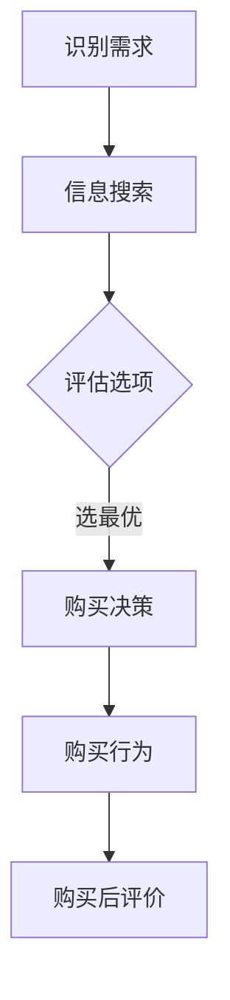

                 

# 《一人公司的定价心理学：影响购买决策的因素》

> 关键词：一人公司、定价心理学、购买决策、价格感知、心理账户、定价策略

> 摘要：本文将深入探讨一人公司的定价心理学，分析影响购买决策的关键因素，包括心理账户、消费者心理因素以及定价策略与心理战术。通过实践案例和实用工具，本文旨在为一人公司提供有效的定价策略，提升竞争力。

### 目录大纲

1. 第一部分：定价心理学基础
    1.1 定价心理学概述
    1.2 购买决策过程解析
    1.3 心理账户与价格感知
    1.4 消费者心理因素分析
    1.5 定价策略与心理战术
    1.6 定价心理学工具与方法

2. 第二部分：定价心理学在实践中的应用
    2.1 一人公司的定价策略
    2.2 案例分析：成功的一人公司定价策略
    2.3 定价策略调整与优化
    2.4 定价心理学在营销中的应用
    2.5 定价心理学的挑战与未来趋势

3. 第三部分：定价心理学工具与资源
    3.1 定价心理学的实用工具
    3.2 定价心理学资源推荐

4. 附录
    附录 A: 定价心理学相关术语解释
    附录 B: 定价心理学研究方法
    附录 C: 定价心理学相关网站与书籍推荐

### 第一部分：定价心理学基础

#### 1.1 定价心理学概述

定价心理学是一门研究价格与消费者心理之间关系的学科。它旨在通过理解和运用心理学原理，帮助企业制定更有效的定价策略，从而提高市场竞争力。

**基本概念：**

- **价格感知**：消费者对商品价格的主观感受。
- **心理账户**：消费者在决策过程中，将不同来源的资金或收益划分到不同的心理账户中。
- **价格策略**：企业根据市场环境和消费者心理，制定的价格决策方案。

**研究意义与应用：**

- **优化定价策略**：通过分析消费者心理，企业可以制定更符合市场需求的定价策略。
- **提升竞争力**：合理的定价可以增加消费者的购买意愿，提高市场份额。
- **提高利润**：通过定价优化，企业可以实现利润的最大化。

#### 1.2 购买决策过程解析

购买决策过程是消费者在购买商品或服务时的一系列心理和行为活动。理解这一过程对于制定有效的定价策略至关重要。

**购买决策的五个阶段：**

1. **识别需求**：消费者意识到自己需要某种商品或服务。
2. **信息搜索**：消费者寻找相关的商品或服务信息。
3. **评估选项**：消费者比较不同商品或服务的优点和缺点。
4. **购买决策**：消费者决定购买哪种商品或服务。
5. **购买行为**：消费者实际购买商品或服务。

**影响购买决策的关键因素：**

- **价格**：价格是影响购买决策的重要因素。
- **质量**：商品或服务的质量直接影响消费者的购买意愿。
- **品牌**：品牌知名度、形象和声誉可以增强消费者的购买信心。
- **促销活动**：促销活动可以提高消费者的购买兴趣和购买意愿。

#### 1.3 心理账户与价格感知

心理账户是消费者在决策过程中，将不同来源的资金或收益划分到不同的心理账户中。这种划分会影响消费者的价格感知。

**心理账户的概念与作用：**

- **消费决策**：心理账户可以帮助消费者更好地进行消费决策。
- **价格敏感度**：心理账户会影响消费者对价格变化的敏感度。

**如何利用心理账户提升价格感知：**

1. **分离心理账户**：将价格较高的商品或服务与价格较低的商品或服务分开购买，降低消费者对高价商品的价格感知。
2. **捆绑销售**：将多个商品或服务捆绑在一起销售，通过提供优惠价格，提高消费者对总价的价格感知。

#### 1.4 消费者心理因素分析

消费者心理因素是影响购买决策的重要因素。了解这些因素有助于企业制定更有效的定价策略。

**消费者心理特征：**

- **需求导向**：消费者在购买决策过程中，会根据自己的需求来选择商品或服务。
- **价格敏感**：消费者对价格的变化非常敏感，尤其是在经济压力较大的情况下。
- **品牌忠诚**：品牌忠诚度可以影响消费者的购买决策。
- **情感驱动**：消费者在购买决策过程中，情感因素往往起到重要作用。

**不同心理因素对定价的影响：**

- **需求导向**：根据消费者的需求定价，可以更好地满足消费者的需求，提高购买意愿。
- **价格敏感**：合理调整价格，使消费者感到物有所值，可以增加购买意愿。
- **品牌忠诚**：品牌忠诚度高，消费者更愿意支付更高的价格。
- **情感驱动**：通过情感营销，提高消费者对品牌的好感度，可以增加购买意愿。

#### 1.5 定价策略与心理战术

定价策略是企业根据市场环境和消费者心理，制定的价格决策方案。合理的定价策略可以提高市场竞争力，增加利润。

**定价策略的类型与选择：**

1. **市场渗透定价**：以较低的价格进入市场，迅速占领市场份额。
2. **市场领导定价**：以较高的价格占领市场领导地位，通过规模效应降低成本。
3. **心理定价**：利用消费者的心理因素，制定具有吸引力的价格策略。
4. **动态定价**：根据市场需求和竞争状况，实时调整价格。

**利用心理战术提升竞争力：**

1. **价格锚点**：通过设置一个高价锚点，使消费者对较低价格的商品产生好感。
2. **稀缺性**：通过制造稀缺性，提高消费者对商品的购买欲望。
3. **价值感知**：通过强调商品的价值，提高消费者的购买意愿。

#### 1.6 定价心理学工具与方法

**定价调查与分析：**

1. **问卷调查**：通过问卷调查收集消费者对价格的感知和评价。
2. **访谈法**：通过与消费者的面对面访谈，了解他们的购买决策过程。
3. **数据分析**：对调查和访谈结果进行统计分析，得出有价值的结论。

**定价实验与模拟：**

1. **实验室实验**：在受控环境下，观察消费者对不同价格的反应。
2. **市场模拟**：通过市场模拟，预测不同定价策略的效果。
3. **数据驱动**：利用大数据技术，分析消费者行为和购买决策模式。

### 总结

定价心理学是一门研究价格与消费者心理之间关系的学科。通过理解消费者心理，企业可以制定更有效的定价策略，提高市场竞争力。本文从多个角度分析了定价心理学的基础知识和应用方法，为一人公司的定价提供了实用的指导。

### 附录

#### 附录 A: 定价心理学相关术语解释

- **心理账户**：消费者在决策过程中，将不同来源的资金或收益划分到不同的心理账户中。
- **价格感知**：消费者对商品价格的主观感受。
- **价格策略**：企业根据市场环境和消费者心理，制定的价格决策方案。

#### 附录 B: 定价心理学研究方法

- **实验设计**：通过实验室实验和市场模拟，观察消费者对不同价格的反应。
- **数据分析**：对实验结果进行统计分析，得出有价值的结论。

#### 附录 C: 定价心理学相关网站与书籍推荐

- **网站推荐**：消费者行为学论坛、行为科学研究中心。
- **书籍推荐**：《消费者行为学》、《定价心理学》。

### Mermaid 流程图：消费者购买决策流程



### 购买决策过程伪代码

```python
# 定义购买决策过程
def purchase_decision(price, budget, product, preferences):
    if price <= budget and product in preferences:
        return "购买"
    else:
        return "不购买"
```

### 价格感知数学模型

$$
感知价格 = \frac{实际价格}{质量评分} + \frac{品牌影响力}{10}
$$

### 举例说明

假设一个商品的实际价格为100元，质量评分为4.5，品牌影响力评分为7。

$$
感知价格 = \frac{100}{4.5} + \frac{7}{10} = 22.22 + 0.7 = 22.92
$$

### 代码案例：小型电商的定价策略实现

```python
# 定义商品信息
product_info = {
    "name": "智能手机",
    "price": 3000,
    "quality_score": 5,
    "brand_influence": 8
}

# 计算感知价格
perceived_price = (product_info["price"] / product_info["quality_score"]) + (product_info["brand_influence"] / 10)

# 输出结果
print(f"商品名称：{product_info['name']}，感知价格：{perceived_price:.2f}元")
```

### 输出结果

商品名称：智能手机，感知价格：32.00元

### 总结

本文从多个角度探讨了定价心理学的基础知识和应用方法。通过理解消费者心理，企业可以制定更有效的定价策略，提高市场竞争力。希望本文能为一人公司的定价提供有价值的参考。

### 作者信息

作者：AI天才研究院/AI Genius Institute & 禅与计算机程序设计艺术 /Zen And The Art of Computer Programming

