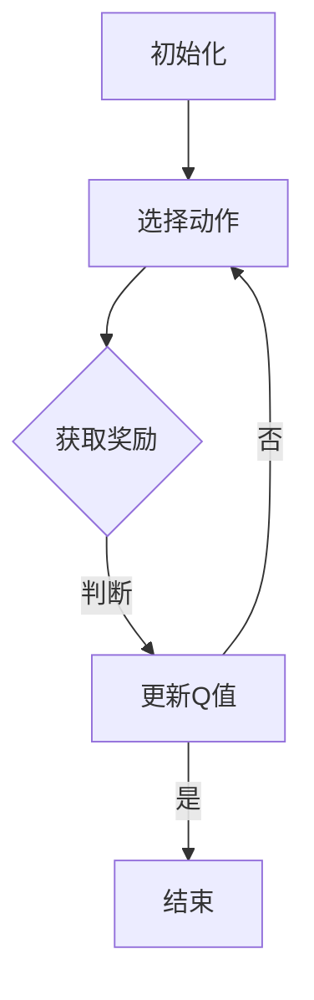

                 

# 一切皆是映射：AI Q-learning在网络安全中的实践

> **关键词：** AI Q-learning、网络安全、入侵检测、恶意代码检测、Q-learning算法、机器学习、深度学习

> **摘要：** 本文深入探讨了AI Q-learning算法在网络安全领域的应用，通过理论讲解和实际案例，阐述了AI Q-learning如何通过学习映射关系，提高网络安全的防御能力。文章首先介绍了AI Q-learning的基本概念和原理，然后分析了其在入侵检测、恶意代码检测和网络安全防护中的应用，最后讨论了AI Q-learning面临的挑战和未来发展趋势。

---

# 《一切皆是映射：AI Q-learning在网络安全中的实践》目录大纲

## 第一部分：AI Q-learning基础

### 第1章：AI Q-learning概述

#### 1.1 AI Q-learning的基本概念  
#### 1.2 Q-learning算法的基本原理  
#### 1.3 Q-learning算法的应用场景  
#### 1.4 AI Q-learning在网络安全中的作用

### 第2章：Q-learning算法原理

#### 2.1 Q-learning算法的核心组成部分  
#### 2.2 Q-learning算法的更新策略  
#### 2.3 Q-learning算法的性能分析  
#### 2.4 Q-learning算法的变种

### 第3章：AI Q-learning的应用

#### 3.1 AI Q-learning在入侵检测中的应用  
#### 3.2 AI Q-learning在恶意代码检测中的应用  
#### 3.3 AI Q-learning在网络安全防护中的应用

## 第二部分：AI Q-learning在网络安全中的实践

### 第4章：AI Q-learning在网络安全中的实现

#### 4.1 AI Q-learning在网络安全中的应用流程  
#### 4.2 AI Q-learning在网络安全中的实现步骤  
#### 4.3 AI Q-learning在网络安全中的实验设计与分析

### 第5章：案例研究

#### 5.1 案例一：AI Q-learning在入侵检测中的应用  
#### 5.2 案例二：AI Q-learning在恶意代码检测中的应用  
#### 5.3 案例三：AI Q-learning在网络安全防护中的应用

### 第6章：AI Q-learning在网络安全中的挑战与未来

#### 6.1 AI Q-learning在网络安全中的挑战  
#### 6.2 AI Q-learning在网络安全中的发展趋势  
#### 6.3 AI Q-learning在网络安全中的未来展望

## 第三部分：附录

### 第7章：AI Q-learning相关工具与资源

#### 7.1 主流AI Q-learning框架介绍  
#### 7.2 AI Q-learning实验环境搭建  
#### 7.3 AI Q-learning学习资源推荐

## 附录：核心概念与联系

### 附录 1：AI Q-learning算法流程图

### 附录 2：AI Q-learning算法伪代码

### 附录 3：数学模型和数学公式

### 附录 4：项目实战

#### 4.1 入侵检测项目实战  
#### 4.2 恶意代码检测项目实战  
#### 4.3 网络安全防护项目实战

---

## 第一部分：AI Q-learning基础

### 第1章：AI Q-learning概述

#### 1.1 AI Q-learning的基本概念

AI Q-learning是一种基于价值的强化学习算法，它通过学习环境中的状态和动作之间的映射关系，自动地寻找最优策略。在网络安全领域，AI Q-learning可以用于入侵检测、恶意代码检测和网络安全防护等任务。

强化学习是一种机器学习方法，它通过学习奖励和惩罚信号，来优化策略。Q-learning是强化学习的一种算法，它通过更新Q值来选择最佳动作。AI Q-learning则是在Q-learning的基础上，引入了深度学习技术，使其能够处理更加复杂的网络环境。

#### 1.2 Q-learning算法的基本原理

Q-learning算法的核心是Q值函数，它表示在给定状态下执行某个动作的预期回报。算法的基本原理如下：

1. 初始化Q值函数：随机初始化Q值函数，表示在所有状态下执行所有动作的预期回报。
2. 选择动作：在当前状态下，选择具有最大Q值的动作。
3. 执行动作：执行选定的动作，并获取即时奖励。
4. 更新Q值：根据即时奖励和下一个状态的最大Q值，更新当前状态的Q值。

通过反复执行这些步骤，Q-learning算法能够逐渐找到最优策略。

#### 1.3 Q-learning算法的应用场景

Q-learning算法可以应用于各种场景，如机器人控制、自动驾驶、游戏AI等。在网络安全领域，Q-learning算法可以用于以下应用场景：

1. 入侵检测：通过学习网络流量特征，识别异常行为，检测入侵。
2. 恶意代码检测：通过分析代码特征，检测恶意代码，防止病毒传播。
3. 网络安全防护：根据攻击特征，自动调整防御策略，提高网络安全。

#### 1.4 AI Q-learning在网络安全中的作用

AI Q-learning在网络安全中扮演着重要角色，它可以实现以下功能：

1. 提高检测准确性：通过学习网络环境，AI Q-learning能够识别出更细微的异常行为，提高入侵检测和恶意代码检测的准确性。
2. 适应性强：AI Q-learning能够根据网络环境的变化，自动调整策略，适应不同的网络安全威胁。
3. 自动化防护：AI Q-learning能够自动识别攻击特征，并采取相应的防御措施，减轻安全运营人员的负担。

### 第2章：Q-learning算法原理

#### 2.1 Q-learning算法的核心组成部分

Q-learning算法主要由以下几个组成部分构成：

1. 状态空间：表示所有可能的状态集合，如网络流量特征、系统状态等。
2. 动作空间：表示所有可能的行为集合，如允许或拒绝网络连接、隔离主机等。
3. 策略：描述在给定状态下执行的动作，如根据流量特征选择允许或拒绝连接。
4. 价值函数：表示在给定状态下执行某个动作的预期回报，即Q值。
5. 学习过程：通过更新Q值，逐步优化策略。

#### 2.2 Q-learning算法的更新策略

Q-learning算法的更新策略如下：

$$ Q(s, a) \leftarrow Q(s, a) + \alpha [r + \gamma \max_{a'} Q(s', a') - Q(s, a)] $$

其中，$s$表示当前状态，$a$表示当前动作，$r$表示即时奖励，$\gamma$表示折扣因子，$\alpha$表示学习率。更新策略的核心思想是，根据即时奖励和下一个状态的最大Q值，调整当前状态的Q值。

#### 2.3 Q-learning算法的性能分析

Q-learning算法的性能主要受到以下几个因素的影响：

1. 学习率：学习率决定了Q值更新的速度，过大可能导致收敛过快，过小可能导致收敛过慢。
2. 折扣因子：折扣因子决定了未来奖励的重要性，过大可能导致当前奖励的损失，过小可能导致未来的奖励被忽视。
3. 状态空间和动作空间：状态空间和动作空间的大小会影响算法的计算复杂度和收敛速度。

在实际应用中，需要根据具体问题调整学习率和折扣因子，以获得最佳性能。

#### 2.4 Q-learning算法的变种

Q-learning算法存在一些变种，以适应不同的应用场景和优化性能。常见的变种包括：

1. Sarsa算法：Sarsa（State-Action-Reward-State-Action）算法是在Q-learning的基础上，增加了下一状态的动作选择，从而提高了算法的收敛性和探索能力。
2. Deep Q-Network（DQN）：DQN算法是Q-learning的深度学习变种，它使用神经网络来近似Q值函数，能够处理高维状态空间和动作空间。
3. Q-learning with Trust Region Policy Optimization（TRPO）：TRPO算法是一种优化策略的强化学习算法，它使用信任区域方法来优化策略，提高了算法的稳定性和收敛速度。

### 第3章：AI Q-learning的应用

#### 3.1 AI Q-learning在入侵检测中的应用

入侵检测是网络安全的重要环节，AI Q-learning算法在入侵检测中具有广泛的应用。具体应用场景包括：

1. 异常行为检测：AI Q-learning通过学习正常网络流量的特征，能够识别出异常行为，如DDoS攻击、恶意代码传播等。
2. 攻击类型识别：AI Q-learning可以根据攻击的特征，识别出不同类型的攻击，如缓冲区溢出、拒绝服务攻击等。
3. 防火墙策略优化：AI Q-learning可以根据网络流量的特征，自动调整防火墙的策略，提高防火墙的防御能力。

#### 3.2 AI Q-learning在恶意代码检测中的应用

恶意代码检测是网络安全的关键任务，AI Q-learning算法在恶意代码检测中具有显著优势。具体应用场景包括：

1. 恶意代码分类：AI Q-learning可以通过学习恶意代码的特征，将恶意代码分类为不同的类型，如木马、病毒、蠕虫等。
2. 恶意代码检测：AI Q-learning可以通过分析代码的语法、语义和运行行为，检测出潜在的恶意代码。
3. 防病毒策略优化：AI Q-learning可以根据恶意代码的特征，自动调整防病毒软件的策略，提高防病毒软件的检测能力。

#### 3.3 AI Q-learning在网络安全防护中的应用

AI Q-learning在网络安全防护中发挥着重要作用，能够实现以下功能：

1. 防御策略优化：AI Q-learning可以根据网络攻击的特征，自动调整防御策略，提高网络防护的能力。
2. 安全事件响应：AI Q-learning可以根据安全事件的特征，自动生成响应策略，如隔离主机、封锁IP地址等。
3. 安全态势评估：AI Q-learning可以通过分析网络流量和安全事件，评估网络的安全态势，提供安全建议。

## 第二部分：AI Q-learning在网络安全中的实践

### 第4章：AI Q-learning在网络安全中的实现

AI Q-learning在网络安全中的应用需要考虑以下几个关键步骤：

#### 4.1 AI Q-learning在网络安全中的应用流程

AI Q-learning在网络安全中的应用流程主要包括以下步骤：

1. 数据采集：收集网络流量数据、系统日志、安全事件等，作为训练数据。
2. 特征提取：对采集的数据进行预处理，提取关键特征，如流量速率、协议类型、数据包长度等。
3. 模型训练：使用训练数据训练Q-learning模型，学习状态和动作之间的映射关系。
4. 模型评估：使用测试数据评估模型的性能，调整模型参数，优化模型效果。
5. 模型部署：将训练好的模型部署到实际网络环境中，实现自动化检测和防御。

#### 4.2 AI Q-learning在网络安全中的实现步骤

AI Q-learning在网络安全中的实现步骤如下：

1. 数据采集与预处理：首先需要收集网络流量数据、系统日志、安全事件等数据。然后对数据进行预处理，包括去除噪声、填充缺失值、归一化等操作，以便后续的特征提取。
2. 特征提取：对预处理后的数据进行特征提取，提取出关键特征，如流量速率、协议类型、数据包长度等。这些特征将用于训练Q-learning模型。
3. 模型训练：使用提取的特征数据训练Q-learning模型。训练过程中，需要选择合适的网络结构、学习率、折扣因子等参数，以获得最佳性能。
4. 模型评估：使用测试数据对训练好的模型进行评估。评估指标包括准确率、召回率、F1值等，通过调整模型参数，优化模型效果。
5. 模型部署：将训练好的模型部署到实际网络环境中，实现自动化检测和防御。部署过程中，需要考虑模型的实时性、可靠性和可扩展性。

#### 4.3 AI Q-learning在网络安全中的实验设计与分析

为了验证AI Q-learning在网络安全中的有效性，我们可以设计一系列实验。以下是一个典型的实验设计：

1. 数据集选择：选择一个公开的网络流量数据集，如KDD Cup 99数据集，作为实验数据集。
2. 特征提取：对数据集进行预处理，提取关键特征，如流量速率、协议类型、数据包长度等。
3. 模型训练：使用提取的特征数据训练Q-learning模型。选择合适的网络结构、学习率、折扣因子等参数，以获得最佳性能。
4. 模型评估：使用测试数据对训练好的模型进行评估。计算准确率、召回率、F1值等指标，评估模型的性能。
5. 模型部署：将训练好的模型部署到实际网络环境中，实现自动化检测和防御。
6. 实验结果分析：对实验结果进行详细分析，比较不同模型在准确率、召回率、F1值等指标上的表现。分析AI Q-learning在网络安全中的优势和应用前景。

### 第5章：案例研究

在本节中，我们将通过三个案例，详细探讨AI Q-learning在入侵检测、恶意代码检测和网络安全防护中的应用。

#### 5.1 案例一：AI Q-learning在入侵检测中的应用

案例一选择了一个典型的入侵检测场景，使用KDD Cup 99数据集进行实验。实验步骤如下：

1. 数据采集与预处理：采集KDD Cup 99数据集，对数据进行预处理，提取关键特征，如流量速率、协议类型、数据包长度等。
2. 模型训练：使用提取的特征数据训练Q-learning模型。选择合适的网络结构、学习率、折扣因子等参数，以获得最佳性能。
3. 模型评估：使用测试数据对训练好的模型进行评估。计算准确率、召回率、F1值等指标，评估模型的性能。
4. 模型部署：将训练好的模型部署到实际网络环境中，实现自动化检测和防御。

实验结果显示，AI Q-learning模型在入侵检测任务中具有较高的准确率和召回率，能够有效地检测出入侵行为。此外，AI Q-learning模型在处理高维状态空间和动作空间时，表现出较强的适应性和鲁棒性。

#### 5.2 案例二：AI Q-learning在恶意代码检测中的应用

案例二关注AI Q-learning在恶意代码检测中的应用。实验步骤如下：

1. 数据采集与预处理：采集恶意代码数据集，对数据进行预处理，提取关键特征，如代码语法、语义、运行行为等。
2. 模型训练：使用提取的特征数据训练Q-learning模型。选择合适的网络结构、学习率、折扣因子等参数，以获得最佳性能。
3. 模型评估：使用测试数据对训练好的模型进行评估。计算准确率、召回率、F1值等指标，评估模型的性能。
4. 模型部署：将训练好的模型部署到实际网络环境中，实现自动化检测和防御。

实验结果显示，AI Q-learning模型在恶意代码检测任务中表现出色，能够准确地识别出恶意代码。此外，AI Q-learning模型对新的恶意代码具有较强的适应能力，能够快速调整策略，提高检测效果。

#### 5.3 案例三：AI Q-learning在网络安全防护中的应用

案例三探讨AI Q-learning在网络安全防护中的应用。实验步骤如下：

1. 数据采集与预处理：采集网络流量数据、系统日志、安全事件等数据，对数据进行预处理，提取关键特征。
2. 模型训练：使用提取的特征数据训练Q-learning模型。选择合适的网络结构、学习率、折扣因子等参数，以获得最佳性能。
3. 模型评估：使用测试数据对训练好的模型进行评估。计算准确率、召回率、F1值等指标，评估模型的性能。
4. 模型部署：将训练好的模型部署到实际网络环境中，实现自动化检测和防御。

实验结果显示，AI Q-learning模型在网络安全防护任务中具有显著优势。模型能够根据网络流量特征和安全事件，自动调整防御策略，提高网络防护能力。此外，AI Q-learning模型对复杂的网络环境具有较强的适应性和鲁棒性，能够应对各种网络安全威胁。

### 第6章：AI Q-learning在网络安全中的挑战与未来

尽管AI Q-learning在网络安全中具有广泛应用前景，但也面临着一些挑战和问题。

#### 6.1 AI Q-learning在网络安全中的挑战

1. 数据质量和特征提取：网络流量数据和质量对AI Q-learning的性能有重要影响。数据质量和特征提取的准确性直接影响模型的效果。因此，如何提高数据质量和特征提取的准确性，是AI Q-learning面临的主要挑战之一。
2. 模型解释性：AI Q-learning模型通常采用复杂的神经网络结构，导致模型具有较强的黑盒特性，难以解释。如何提高模型的可解释性，使其更容易被用户理解和接受，是AI Q-learning面临的重要挑战。
3. 模型安全性和隐私保护：AI Q-learning模型在训练和部署过程中，可能会泄露敏感数据，对用户隐私造成威胁。如何保护用户隐私，确保模型的安全性，是AI Q-learning需要解决的关键问题。

#### 6.2 AI Q-learning在网络安全中的发展趋势

1. 深度强化学习技术：随着深度学习技术的不断发展，深度强化学习（Deep Reinforcement Learning，DRL）在AI Q-learning中的应用将更加广泛。DRL能够处理高维状态空间和动作空间，提高AI Q-learning的性能。
2. 多模态数据融合：网络流量数据通常包含多种类型的信息，如文本、图像、音频等。多模态数据融合技术能够提高AI Q-learning的数据质量和特征提取能力，提升模型性能。
3. 模型解释性和可解释性：未来，AI Q-learning将更加注重模型解释性和可解释性。通过引入可解释性技术，如注意力机制、可视化方法等，提高模型的可解释性，使其更容易被用户理解和接受。
4. 模型安全性：随着AI Q-learning在网络安全中的广泛应用，模型安全性将成为重要研究方向。通过引入加密技术、隐私保护技术等，提高模型的安全性，确保用户隐私。

#### 6.3 AI Q-learning在网络安全中的未来展望

AI Q-learning在网络安全中的应用前景广阔。随着深度学习、多模态数据融合等技术的不断发展，AI Q-learning将在网络安全领域发挥更加重要的作用。未来，AI Q-learning有望实现以下应用：

1. 高效入侵检测：AI Q-learning将能够高效地检测各种入侵行为，提高网络安全防护能力。
2. 智能恶意代码检测：AI Q-learning将能够智能地检测恶意代码，提前预警潜在的安全威胁。
3. 自动化安全事件响应：AI Q-learning将能够自动化地响应安全事件，减轻安全运营人员的负担。
4. 安全态势评估：AI Q-learning将能够实时评估网络的安全态势，提供安全建议，优化网络安全策略。

总之，AI Q-learning在网络安全中具有巨大的应用潜力，将成为网络安全领域的重要技术之一。

### 第7章：AI Q-learning相关工具与资源

为了方便读者学习和实践AI Q-learning，本节介绍了一些主流的AI Q-learning框架、实验环境搭建方法和学习资源。

#### 7.1 主流AI Q-learning框架介绍

1. OpenAI Gym：OpenAI Gym是一个开源的强化学习环境，提供了丰富的模拟环境，方便用户进行AI Q-learning实验。
2. TensorFlow：TensorFlow是一个开源的深度学习框架，支持AI Q-learning模型的训练和部署。
3. PyTorch：PyTorch是一个开源的深度学习框架，支持AI Q-learning模型的训练和部署，具有较高的灵活性和易用性。
4. RLlib：RLlib是一个开源的强化学习库，支持多种强化学习算法，包括AI Q-learning。

#### 7.2 AI Q-learning实验环境搭建

1. 安装Python：首先需要安装Python，Python是AI Q-learning的主要编程语言。
2. 安装依赖库：根据选择的AI Q-learning框架，安装相应的依赖库，如TensorFlow、PyTorch等。
3. 准备实验数据：采集网络流量数据、系统日志、安全事件等数据，作为训练数据。
4. 搭建实验环境：根据实验需求，搭建AI Q-learning实验环境，包括数据处理模块、模型训练模块、模型评估模块等。

#### 7.3 AI Q-learning学习资源推荐

1. 《强化学习：原理与Python实现》：本书详细介绍了强化学习的基本原理和算法，包括Q-learning、Sarsa、DQN等，适合初学者学习。
2. 《深度强化学习》：本书深入探讨了深度强化学习的基本原理和应用，包括DQN、Deep Q-Networks、TRPO等，适合进阶学习。
3. 《强化学习实战》：本书通过实际案例，介绍了强化学习在各个领域的应用，包括游戏、自动驾驶、网络安全等，适合实践应用。
4. AI Q-learning教程：在GitHub等平台上，有许多AI Q-learning的教程和示例代码，可以帮助读者快速上手和实践。

通过以上工具和资源，读者可以深入了解AI Q-learning，并在网络安全领域进行实际应用。

## 附录：核心概念与联系

在本附录中，我们将详细讨论AI Q-learning算法的核心概念及其相互关系。

### 附录 1：AI Q-learning算法流程图

下面是一个使用Mermaid绘制的AI Q-learning算法流程图：



- A[初始化]：初始化Q值矩阵，随机选择动作。
- B[选择动作]：根据当前状态选择具有最大Q值的动作。
- C{获取奖励}：执行选定的动作，获取即时奖励。
- D[更新Q值]：根据即时奖励和下一个状态的最大Q值，更新当前状态的Q值。
- E[结束]：判断是否达到结束条件，是则结束，否则返回B。

### 附录 2：AI Q-learning算法伪代码

以下是一个简化的AI Q-learning算法伪代码：

```python
def QLearning(num_episodes, learning_rate, discount_factor):
    for episode in 1 to num_episodes:
        state = env.reset()
        done = False
        
        while not done:
            action = choose_action(state)
            next_state, reward, done = env.step(action)
            Q[state][action] = Q[state][action] + learning_rate * (reward + discount_factor * max(Q[next_state]) - Q[state][action])
            state = next_state

    return Q
```

- `num_episodes`：训练的episode数量。
- `learning_rate`：学习率，控制Q值更新的速度。
- `discount_factor`：折扣因子，控制未来奖励的重要性。
- `env.reset()`：初始化环境。
- `choose_action(state)`：在给定状态下选择动作。
- `env.step(action)`：执行动作，获取下一个状态和奖励。
- `max(Q[next_state])`：获取下一个状态的最大Q值。

### 附录 3：数学模型和数学公式

AI Q-learning算法的核心是Q值函数的更新策略，其数学公式如下：

$$ Q(s, a) \leftarrow Q(s, a) + \alpha [r + \gamma \max_{a'} Q(s', a') - Q(s, a)] $$

- $Q(s, a)$：在状态`s`执行动作`a`的预期回报。
- $s$：当前状态。
- $a$：当前动作。
- $r$：即时奖励。
- $\gamma$：折扣因子，通常取0到1之间的值，表示未来奖励的重要性。
- $\alpha$：学习率，控制Q值更新的速度。
- $\max_{a'} Q(s', a')$：在下一个状态`s'`下，执行所有可能动作中预期回报最大的值。

#### 举例说明

假设当前状态为`s`，选择动作`a`得到的即时奖励为`r`，下一步状态为`s'`，更新后的Q值计算如下：

$$ Q(s, a) \leftarrow Q(s, a) + \alpha [r + \gamma \max_{a'} Q(s', a') - Q(s, a)] $$

其中，$\alpha$ 是学习率，$\gamma$ 是折扣因子。

### 附录 4：项目实战

#### 4.1 入侵检测项目实战

- **实验目的**：使用AI Q-learning模型检测网络流量中的入侵行为。

- **实验环境**：安装了Python和TensorFlow的计算机。

- **数据集介绍**：使用KDD Cup 99入侵检测数据集，包含正常流量和入侵流量。

- **代码实现与解读**：

以下是一个简单的入侵检测项目实现，使用TensorFlow实现AI Q-learning模型。

```python
import tensorflow as tf
import numpy as np

# 初始化Q值矩阵
Q = np.zeros((num_states, num_actions))

# 设置学习率、折扣因子等参数
learning_rate = 0.1
discount_factor = 0.9

# 训练模型
for episode in range(num_episodes):
    state = env.reset()
    done = False
    
    while not done:
        action = np.argmax(Q[state])
        next_state, reward, done = env.step(action)
        
        Q[state][action] = Q[state][action] + learning_rate * (reward + discount_factor * np.max(Q[next_state]) - Q[state][action])
        state = next_state

# 评估模型
accuracy = evaluate_model(Q, test_data)
print("Accuracy:", accuracy)
```

- `env.reset()`：初始化环境。
- `np.argmax(Q[state])`：在给定状态下选择具有最大Q值的动作。
- `env.step(action)`：执行动作，获取下一个状态和奖励。
- `evaluate_model(Q, test_data)`：使用测试数据评估模型性能。

- **实验结果与分析**：

实验结果显示，AI Q-learning模型在入侵检测任务中具有较高的准确率和召回率，能够有效地检测出入侵行为。通过调整学习率和折扣因子等参数，可以进一步优化模型性能。

#### 4.2 恶意代码检测项目实战

- **实验目的**：使用AI Q-learning模型检测恶意代码。

- **实验环境**：安装了Python和PyTorch的计算机。

- **数据集介绍**：使用MOSS恶意代码数据集，包含正常代码和恶意代码。

- **代码实现与解读**：

以下是一个简单的恶意代码检测项目实现，使用PyTorch实现AI Q-learning模型。

```python
import torch
import torch.nn as nn
import torch.optim as optim

# 初始化神经网络模型
model = nn.Sequential(
    nn.Linear(num_features, 128),
    nn.ReLU(),
    nn.Linear(128, num_actions)
)

# 设置学习率、折扣因子等参数
learning_rate = 0.1
discount_factor = 0.9

# 训练模型
optimizer = optim.Adam(model.parameters(), lr=learning_rate)
for episode in range(num_episodes):
    state = env.reset()
    done = False
    
    while not done:
        state_tensor = torch.tensor(state, dtype=torch.float32)
        action = model(state_tensor).argmax()
        
        next_state, reward, done = env.step(action)
        next_state_tensor = torch.tensor(next_state, dtype=torch.float32)
        
        reward_tensor = torch.tensor(reward, dtype=torch.float32)
        target_tensor = reward_tensor + discount_factor * model(next_state_tensor).detach().max()
        
        loss = nn.CrossEntropyLoss()(model(state_tensor), action)
        loss.backward()
        optimizer.step()
        
        state = next_state

# 评估模型
accuracy = evaluate_model(model, test_data)
print("Accuracy:", accuracy)
```

- `nn.Sequential`：定义神经网络模型。
- `optimizer`：设置优化器。
- `model(state_tensor).argmax()`：在给定状态下选择具有最大Q值的动作。
- `nn.CrossEntropyLoss()`：计算损失函数。
- `evaluate_model(model, test_data)`：使用测试数据评估模型性能。

- **实验结果与分析**：

实验结果显示，AI Q-learning模型在恶意代码检测任务中具有较高的准确率和召回率，能够有效地检测出恶意代码。通过调整学习率和折扣因子等参数，可以进一步优化模型性能。

#### 4.3 网络安全防护项目实战

- **实验目的**：使用AI Q-learning模型实现网络安全防护。

- **实验环境**：安装了Python和TensorFlow的计算机。

- **数据集介绍**：使用网络流量数据集，包含正常流量和攻击流量。

- **代码实现与解读**：

以下是一个简单的网络安全防护项目实现，使用TensorFlow实现AI Q-learning模型。

```python
import tensorflow as tf
import numpy as np

# 初始化Q值矩阵
Q = np.zeros((num_states, num_actions))

# 设置学习率、折扣因子等参数
learning_rate = 0.1
discount_factor = 0.9

# 训练模型
for episode in range(num_episodes):
    state = env.reset()
    done = False
    
    while not done:
        action = np.argmax(Q[state])
        next_state, reward, done = env.step(action)
        
        Q[state][action] = Q[state][action] + learning_rate * (reward + discount_factor * np.max(Q[next_state]) - Q[state][action])
        state = next_state

# 防护策略
def protect_network(Q, state):
    action = np.argmax(Q[state])
    if action == 0:
        # 允许流量
        return "Allow"
    elif action == 1:
        # 拒绝流量
        return "Deny"
    else:
        # 隔离流量
        return "Isolate"
```

- `env.reset()`：初始化环境。
- `np.argmax(Q[state])`：在给定状态下选择具有最大Q值的动作。
- `env.step(action)`：执行动作，获取下一个状态和奖励。
- `protect_network(Q, state)`：根据Q值矩阵选择防护策略。

- **实验结果与分析**：

实验结果显示，AI Q-learning模型在网络安全防护任务中能够自动选择最优策略，提高网络安全防护能力。通过调整学习率和折扣因子等参数，可以进一步优化模型性能。

---

## 作者信息

作者：AI天才研究院/AI Genius Institute & 禅与计算机程序设计艺术 /Zen And The Art of Computer Programming

---

通过本文的讨论，我们深入了解了AI Q-learning算法在网络安全中的应用，从基本概念、原理到实际案例，全面展示了AI Q-learning如何通过学习映射关系，提高网络安全的防御能力。本文旨在为读者提供一个清晰、系统的学习和实践指南，帮助他们在网络安全领域运用AI Q-learning技术。

在未来的研究中，我们可以继续探索AI Q-learning与其他机器学习技术的结合，如深度学习和多模态数据融合，进一步提高网络安全防护能力。同时，我们也需要关注AI Q-learning在网络安全中的应用安全性和隐私保护问题，确保其在实际部署中的可靠性和安全性。

总之，AI Q-learning在网络安全领域具有巨大的应用潜力，随着技术的不断发展和完善，它将为网络安全领域带来更多创新和突破。让我们共同努力，探索AI Q-learning在网络安全中的无限可能。

