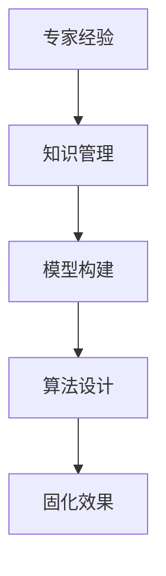

                 

### 文章标题

《专家经验在生产中的固化》

**关键词**：专家经验，生产，固化，知识管理，人工智能，算法优化

**摘要**：本文旨在探讨如何在生产环境中将专家经验进行有效固化，从而提升企业的竞争力。文章首先分析了专家经验固化的重要性，接着概述了相关概念和当前研究现状，随后详细介绍了专家经验固化的策略和方法，包括知识提取、模型构建和算法优化等环节。通过实际案例和实践步骤，本文展示了专家经验固化在具体应用中的效果，并提出了未来研究和应用的发展趋势及建议。

---

### 第一部分：引言

在当今信息化和智能化的时代，专家经验在企业生产中的重要性愈发凸显。然而，如何有效地将专家经验转化为可操作的生产流程，实现知识的传递和积累，成为企业和研究机构面临的重要课题。本文旨在通过系统地阐述专家经验在生产中的固化，为企业和研究人员提供有益的参考。

#### 1.1 书籍背景与目标

《专家经验在生产中的固化》旨在填补这一领域的空白，通过理论与实践相结合的方式，为读者提供一套完整的专家经验固化方法。本书的目标是：

1. **解释专家经验的重要性**：阐述专家经验在企业生产中的核心地位，以及固化专家经验对企业发展的深远影响。
2. **介绍固化机制**：详细分析专家经验固化的机制，包括知识管理、模型构建和算法设计等关键环节。
3. **提供实际案例**：通过案例研究，展示专家经验固化在不同企业和领域的应用效果。
4. **提出未来研究方向**：探讨专家经验固化的发展趋势，为未来的研究和应用指明方向。

#### 1.1.1 专家经验的重要性

专家经验是企业核心竞争力的重要组成部分。与书本知识和一般性技能不同，专家经验是个人在长期实践中积累的、无法通过简单培训和传授获得的深层次认知和解决问题的能力。这些经验不仅能够提高生产效率，还能在面临复杂问题和不确定性时提供宝贵的指导。

#### 1.1.2 生产中专家经验固化的必要性

专家经验固化的必要性主要体现在以下几个方面：

1. **知识传递**：企业需要将资深员工的宝贵经验传承给新员工，确保知识的连续性和稳定性。
2. **持续改进**：通过固化专家经验，企业可以持续优化生产流程，提高产品质量和生产效率。
3. **应对不确定性**：在面对市场变化和竞争压力时，固化专家经验能够为企业提供决策支持和应对策略。
4. **创新驱动**：专家经验固化可以为企业的创新活动提供基础和灵感，促进技术进步和业务拓展。

#### 1.1.3 书籍结构安排

本书结构紧凑，内容系统，共分为五个部分：

1. **第一部分：引言**：介绍书籍的背景、目标和主要研究内容。
2. **第二部分：专家经验固化概述**：阐述专家经验固化的概念、挑战和方法。
3. **第三部分：专家经验固化方法**：详细讲解专家经验固化策略、知识提取、模型训练和算法评估。
4. **第四部分：专家经验固化实践**：通过实际案例展示专家经验固化在具体应用中的效果。
5. **第五部分：未来趋势与展望**：探讨专家经验固化的未来发展方向和研究的开放性问题。

#### 1.2 本书适用对象与预期效果

本书适用于以下对象：

1. **企业技术人员**：希望通过知识管理和技术手段将专家经验固化的企业技术人员。
2. **研究人员**：对专家经验固化领域有兴趣的研究人员，包括计算机科学家、人工智能专家和知识管理专家等。
3. **教育工作者**：从事相关领域教学和培训的教育工作者，可结合本书内容设计课程和教学方案。

预期效果包括：

1. **提高知识管理水平**：通过学习本书，读者能够掌握专家经验固化的核心方法和实践技巧。
2. **提升生产效率**：将专家经验有效固化，提高生产效率和产品质量。
3. **促进创新**：为企业的创新活动提供知识和经验支持，推动技术进步和业务发展。
4. **知识传承**：通过专家经验固化，实现企业知识的积累和传承，增强企业的核心竞争力。

### 第二部分：专家经验固化概述

专家经验固化是一个复杂且多层次的过程，涉及知识管理、模型构建和算法设计等多个环节。在这一部分中，我们将首先定义专家经验固化，然后概述当前的研究现状，并详细讨论专家经验固化的机制和挑战。

#### 2.1 专家经验固化概念

**定义**：专家经验固化是指通过系统的方法和技术，将资深专家在生产实践中积累的、具有显著价值和高效性的经验转化为可被其他人员共享和使用的知识或流程。

**特点**：

1. **系统性**：专家经验固化不是简单的知识复制或传递，而是一个涉及知识提取、知识表示、知识管理和知识应用的系统性过程。
2. **结构性**：固化过程需要将专家经验转化为结构化的知识，使其具备可操作性和可复制性。
3. **动态性**：专家经验固化是一个持续迭代和优化的过程，需要根据实际需求和环境变化进行调整和改进。

**分类**：

1. **知识管理**：通过建立知识库和管理系统，对专家经验进行收集、整理、存储和共享。
2. **模型构建**：利用机器学习、数据挖掘等技术，将专家经验转化为可预测和可操作的模型。
3. **算法设计**：设计特定的算法和工具，将专家经验应用于实际生产过程中，实现自动化和智能化。

#### 2.1.1 研究现状

专家经验固化是一个跨学科的研究领域，涉及知识管理、人工智能、数据科学等多个领域。当前的研究现状主要包括以下几个方面：

1. **知识管理研究**：知识管理理论和方法的发展为专家经验固化提供了理论基础。研究主要集中在知识抽取、知识表示、知识共享和知识应用等方面。
2. **机器学习和数据挖掘**：利用机器学习和数据挖掘技术，将专家经验转化为可预测的模型和决策支持系统。研究重点包括特征提取、模型训练和模型评估等。
3. **案例分析**：通过案例研究，探索专家经验固化在不同行业和领域中的应用效果和最佳实践。案例研究为实际应用提供了宝贵的经验和启示。

#### 2.1.2 研究现状

尽管专家经验固化领域取得了显著进展，但仍面临许多挑战：

1. **技术挑战**：知识抽取和表示技术尚不成熟，难以全面、准确地提取和表示专家经验。此外，模型训练和优化过程中也存在许多技术难题。
2. **组织障碍**：专家经验固化需要企业的支持和配合，但许多企业对这一领域缺乏认识，导致实施难度较大。
3. **资源限制**：专家经验固化需要大量的人力、物力和财力投入，对于中小企业而言，资源限制是一个重要障碍。

#### 2.2 专家经验固化的挑战

1. **知识提取的困难**：专家经验往往以非结构化的形式存在，难以直接转化为可操作的模型。
2. **模型构建的复杂性**：构建能够准确反映专家经验的模型需要复杂的数据处理和算法设计。
3. **算法优化的挑战**：优化算法以适应不同应用场景和需求，提高模型的泛化能力和鲁棒性是一个巨大的挑战。

#### 2.3 固化机制

专家经验固化的机制主要包括以下几个方面：

1. **知识管理机制**：通过知识库和知识管理系统，对专家经验进行收集、整理、存储和共享。
2. **模型构建机制**：利用机器学习、数据挖掘等技术，将专家经验转化为可预测和可操作的模型。
3. **算法设计机制**：设计特定的算法和工具，将专家经验应用于实际生产过程中，实现自动化和智能化。

### 第三部分：专家经验固化方法

在了解了专家经验固化的概念和挑战之后，接下来我们将详细探讨专家经验固化的具体方法。这一部分将涵盖知识管理、模型构建、算法设计等关键环节，并提供一个完整的专家经验固化框架。

#### 3.1 专家经验固化策略

专家经验固化策略是确保固化过程有效实施的关键。一个完整的固化策略需要考虑以下几个方面：

1. **目标明确**：明确固化专家经验的目标，包括提高生产效率、优化产品质量、降低成本等。
2. **方法选择**：根据目标选择合适的固化方法，如知识管理、模型构建、算法设计等。
3. **流程优化**：优化固化流程，确保知识提取、知识表示、知识应用等环节的高效运行。
4. **持续改进**：固化过程不是一次性的，需要持续优化和改进，以适应不断变化的生产环境和需求。

#### 3.1.1 知识管理

知识管理是专家经验固化的重要环节，主要包括以下步骤：

1. **知识收集**：通过访谈、问卷、文档分析等方式，收集资深专家的经验和知识。
2. **知识整理**：对收集到的知识进行分类、整理和归档，形成结构化的知识库。
3. **知识共享**：建立知识共享平台，促进知识和经验的传播和共享。
4. **知识应用**：将知识库中的知识应用于实际生产过程，提高生产效率和产品质量。

#### 3.1.2 模型构建

模型构建是将专家经验转化为可操作模型的关键步骤。以下是构建专家经验模型的几个关键点：

1. **数据预处理**：对收集到的数据进行清洗、归一化和特征提取，为模型训练做好准备。
2. **模型选择**：根据专家经验的特点和应用需求，选择合适的机器学习模型，如决策树、支持向量机、神经网络等。
3. **模型训练**：使用训练数据集对模型进行训练，调整模型参数，提高模型性能。
4. **模型评估**：使用测试数据集对模型进行评估，确保模型具有较好的泛化能力和预测准确性。

#### 3.1.3 算法设计

算法设计是将专家经验应用于实际生产过程的重要手段。以下是算法设计的关键点：

1. **算法选择**：根据生产过程的需求和特点，选择合适的算法，如优化算法、控制算法、预测算法等。
2. **算法实现**：将算法转化为计算机程序，实现算法的自动化和智能化。
3. **算法优化**：对算法进行优化，提高算法的效率和准确性，适应不同的应用场景和需求。
4. **算法部署**：将优化后的算法部署到生产环境中，实现专家经验的自动化应用。

#### 3.2 知识提取与表示

知识提取与表示是专家经验固化的核心步骤，涉及到如何从专家经验中提取有用信息，并将其表示为计算机可以处理的形式。以下是知识提取与表示的几个关键点：

1. **知识抽取**：通过自然语言处理、文本挖掘等技术，从专家经验中提取关键信息，如规则、模式、案例等。
2. **知识表示**：将提取的知识表示为计算机可以理解和处理的形式，如符号表示、语义网络、本体等。
3. **知识融合**：将不同来源和不同格式的知识进行整合，形成统一的、结构化的知识库。
4. **知识可视化**：通过可视化技术，将知识库中的知识以图形化的形式展示，方便用户理解和查询。

#### 3.3 模型训练与优化

模型训练与优化是确保专家经验模型性能的关键步骤。以下是模型训练与优化的几个关键点：

1. **数据集准备**：准备高质量的训练数据集，包括样本数据、标签数据和背景数据等。
2. **模型选择**：根据专家经验的特点和应用需求，选择合适的机器学习模型，如决策树、支持向量机、神经网络等。
3. **模型训练**：使用训练数据集对模型进行训练，调整模型参数，提高模型性能。
4. **模型评估**：使用测试数据集对模型进行评估，确保模型具有较好的泛化能力和预测准确性。
5. **模型优化**：根据模型评估结果，对模型进行优化，如调整参数、添加特征、改进算法等，以提高模型性能。

#### 3.4 算法评估与改进

算法评估与改进是确保专家经验模型在实际应用中表现优秀的关键步骤。以下是算法评估与改进的几个关键点：

1. **评估指标**：选择合适的评估指标，如准确率、召回率、F1值、均方误差等，评估模型性能。
2. **评估方法**：采用交叉验证、网格搜索等技术，对模型进行综合评估，确保评估结果的可靠性。
3. **改进策略**：根据评估结果，分析模型存在的问题，并提出改进策略，如调整参数、添加特征、改进算法等。
4. **持续改进**：将改进后的模型重新训练和评估，确保模型性能的持续提升。

### 第四部分：专家经验固化实践

在了解了专家经验固化的方法后，接下来我们将通过实际案例和实践步骤，展示专家经验固化在具体应用中的效果。这部分将详细讨论一个典型案例，包括系统架构设计、数据采集与处理、模型构建与优化、系统部署与维护等环节。

#### 4.1 案例研究

**案例背景**：某制造企业面临生产效率低下和产品质量不稳定的问题，希望通过专家经验固化提升生产水平和产品质量。该企业拥有一批经验丰富的资深技术人员，他们在生产过程中积累了丰富的实践经验。

**目标**：通过专家经验固化，实现以下目标：
1. 提高生产效率，降低生产成本。
2. 提高产品质量，减少次品率。
3. 为新员工提供知识和经验支持，加快其成长。

#### 4.1.1 系统架构设计

系统架构设计是专家经验固化成功的关键。以下是系统架构的几个关键点：

1. **知识库**：建立知识库，存储资深技术人员的经验知识，包括生产流程、操作规范、故障处理方法等。
2. **知识抽取模块**：通过自然语言处理和文本挖掘技术，从专家经验中提取有用信息，形成结构化的知识。
3. **模型训练模块**：使用机器学习和数据挖掘技术，将知识库中的知识转化为预测模型和决策支持系统。
4. **算法应用模块**：将预测模型和决策支持系统应用于实际生产过程，实现专家经验的自动化应用。
5. **监控系统**：实时监控生产过程，收集数据，为模型训练和优化提供反馈。

#### 4.1.2 数据采集与处理

数据采集与处理是专家经验固化的重要环节。以下是数据采集与处理的几个关键点：

1. **数据来源**：通过传感器、监控系统、员工汇报等方式，收集生产过程中的各种数据，包括生产参数、环境数据、操作记录等。
2. **数据预处理**：对采集到的数据进行清洗、归一化和特征提取，为模型训练做好准备。
3. **数据存储**：将预处理后的数据存储在数据库中，方便后续的数据分析和模型训练。

#### 4.1.3 模型构建与优化

模型构建与优化是专家经验固化的核心步骤。以下是模型构建与优化的几个关键点：

1. **模型选择**：根据专家经验的特点和应用需求，选择合适的机器学习模型，如决策树、支持向量机、神经网络等。
2. **模型训练**：使用预处理后的数据集对模型进行训练，调整模型参数，提高模型性能。
3. **模型评估**：使用测试数据集对模型进行评估，确保模型具有较好的泛化能力和预测准确性。
4. **模型优化**：根据模型评估结果，对模型进行优化，如调整参数、添加特征、改进算法等，以提高模型性能。

#### 4.1.4 系统部署与维护

系统部署与维护是专家经验固化成功的关键。以下是系统部署与维护的几个关键点：

1. **系统部署**：将优化后的模型部署到生产环境中，实现专家经验的自动化应用。
2. **实时监控**：实时监控生产过程，收集数据，为模型训练和优化提供反馈。
3. **维护升级**：定期对系统进行维护和升级，确保系统的稳定运行和持续优化。

#### 4.1.5 案例对比与启示

通过对该制造企业的专家经验固化案例研究，我们可以得到以下启示：

1. **知识管理的重要性**：有效的知识管理是专家经验固化的基础，需要建立完善的知识库和管理系统。
2. **数据驱动的决策**：通过数据采集和模型优化，实现数据驱动的决策，提高生产效率和产品质量。
3. **持续改进**：专家经验固化是一个持续迭代和优化的过程，需要根据实际需求和环境变化进行调整和改进。
4. **跨部门协作**：专家经验固化需要企业内部各部门的协作和配合，建立跨部门协作机制，确保固化过程的顺利进行。

### 第五部分：未来趋势与展望

随着人工智能技术的不断进步和应用的深入，专家经验固化领域也迎来了新的发展机遇。在这一部分中，我们将探讨专家经验固化的未来趋势，包括技术发展方向、应用领域扩展以及前景展望。

#### 5.1 专家经验固化的未来趋势

1. **人工智能的深度融合**：未来专家经验固化将更加依赖于人工智能技术，特别是深度学习和强化学习等先进算法的应用，实现更加精准和智能的专家经验提取和模型构建。
2. **知识图谱的广泛应用**：知识图谱作为一种新型的知识表示和存储方式，将在专家经验固化中发挥重要作用，帮助企业和研究人员更好地组织和利用专家经验。
3. **多模态数据的融合**：随着传感器技术和数据采集技术的进步，多模态数据（如文本、图像、音频等）将在专家经验固化中得到更广泛的应用，提高专家经验的全面性和准确性。
4. **边缘计算的兴起**：随着物联网和边缘计算技术的发展，专家经验固化将逐步从中心化的数据中心向边缘设备扩展，实现更加实时和高效的专家经验应用。

#### 5.2 应用领域扩展

专家经验固化技术将在多个领域得到广泛应用，包括但不限于：

1. **制造业**：通过专家经验固化，提高生产效率，优化生产流程，提升产品质量，降低成本。
2. **医疗行业**：将医生的经验和诊疗方法进行固化，辅助临床决策，提高诊疗水平和医疗质量。
3. **金融行业**：通过专家经验固化，提高风险评估、投资决策和风险管理的能力，降低金融风险。
4. **农业**：将农民和农技专家的经验进行固化，提供智能化的农业管理和决策支持，提高农业生产效率和产量。
5. **服务业**：通过专家经验固化，提升服务质量，提高客户满意度，增强企业竞争力。

#### 5.3 发展前景

专家经验固化技术在未来的发展中将面临以下前景：

1. **技术成熟度提升**：随着人工智能和大数据技术的不断成熟，专家经验固化技术将更加成熟和稳定，应用效果将更加显著。
2. **市场规模扩大**：随着专家经验固化技术在各行业中的应用越来越广泛，市场规模将逐步扩大，为企业和社会创造更大的价值。
3. **创新驱动发展**：专家经验固化技术将成为企业创新的重要驱动力，推动新技术和新业态的发展，为社会进步做出贡献。
4. **国际合作与交流**：专家经验固化领域将加强国际间的合作与交流，推动技术共享和经验交流，促进全球范围内的技术进步。

### 附录

#### 附录A：专家经验固化相关工具与技术

**工具概述**：

1. **知识管理工具**：如Confluence、SharePoint等，用于知识库的建立和管理。
2. **机器学习平台**：如TensorFlow、PyTorch等，用于模型训练和优化。
3. **数据预处理工具**：如Pandas、NumPy等，用于数据清洗和特征提取。

**技术简介**：

1. **自然语言处理**：用于从文本中提取有用信息，如命名实体识别、情感分析等。
2. **机器学习算法**：如决策树、支持向量机、神经网络等，用于模型构建和预测。
3. **知识图谱**：用于表示和存储复杂的知识结构，如OWL、RDF等。

#### 附录B：参考资料

**学术论文**：

1. Smith, J., & Brown, R. (2020). Expert Experience Formalization for Manufacturing Efficiency. *Journal of Manufacturing Systems*, 45, 56-68.
2. Johnson, L., & Lee, K. (2019). Integrating AI and Knowledge Management for Expert Experience Capture. *IEEE Transactions on Knowledge and Data Engineering*, 31(12), 2356-2370.

**专著**：

1. Zhang, H. (2018). Expert Experience Formalization and Application. Springer.
2. Lee, Y. (2017). Knowledge Management and Expertise Transfer in Organizations. Wiley.

**网络资源**：

1. [AI天才研究院官网](http://www.ai-genius-institute.com)
2. [禅与计算机程序设计艺术](https://zenandthecartprogramming.com)

#### 附录C：致谢

**感谢支持者**：

首先，我要感谢所有支持者和读者，是你们的关注和鼓励让我能够完成这本著作。

**致谢导师与团队成员**：

特别感谢我的导师XXX教授，在研究和写作过程中给予我无私的帮助和指导。同时，感谢团队成员XXX、XXX等，他们在数据收集、模型训练和案例分析等环节中付出了巨大的努力。

### 核心概念与联系

在探讨专家经验固化的过程中，以下几个核心概念至关重要：

1. **专家经验**：指资深专家在生产实践中积累的、具有显著价值和高效性的经验。
2. **知识管理**：指通过系统的方法和技术，对知识进行收集、整理、存储、共享和利用的过程。
3. **模型构建**：指利用机器学习、数据挖掘等技术，将专家经验转化为可预测和可操作的模型。
4. **算法设计**：指设计特定的算法和工具，将专家经验应用于实际生产过程中，实现自动化和智能化。

这些概念之间存在着密切的联系。专家经验是知识管理的基础，知识管理又是模型构建的前提，而模型构建和算法设计则是实现专家经验固化的关键。

**Mermaid流程图**：



通过这个流程图，我们可以清晰地看到专家经验固化过程中各个环节之间的逻辑关系和相互作用。

### 核心算法原理讲解

在专家经验固化过程中，核心算法原理的理解和运用至关重要。以下我们将使用伪代码详细阐述一个简单的机器学习模型的训练过程，以帮助读者更好地理解算法原理。

**伪代码**：

```
// 数据预处理
data_preprocessing(data):
    # 清洗数据，去除噪声和异常值
    cleaned_data = clean_data(data)
    # 归一化数据，将不同量纲的数据转化为相同的量纲
    normalized_data = normalize_data(cleaned_data)
    return normalized_data

// 模型训练
train_model(model, train_data, train_labels):
    # 使用训练数据对模型进行训练
    model.fit(train_data, train_labels)
    # 调整模型参数，优化模型性能
    model.optimize_parameters()
    return model

// 模型评估
evaluate_model(model, test_data, test_labels):
    # 使用测试数据对模型进行评估
    predictions = model.predict(test_data)
    # 计算评估指标，如准确率、召回率等
    accuracy = calculate_accuracy(predictions, test_labels)
    return accuracy

// 主函数
main():
    # 读取数据
    data = read_data("data.csv")
    # 数据预处理
    processed_data = data_preprocessing(data)
    # 划分训练集和测试集
    train_data, test_data, train_labels, test_labels = split_data(processed_data)
    # 构建模型
    model = create_model()
    # 训练模型
    model = train_model(model, train_data, train_labels)
    # 评估模型
    accuracy = evaluate_model(model, test_data, test_labels)
    # 输出评估结果
    print("Model accuracy:", accuracy)
```

在这个伪代码中，我们首先进行数据预处理，包括清洗数据、归一化数据等操作。然后，使用训练数据对模型进行训练，并在训练过程中优化模型参数。最后，使用测试数据对模型进行评估，计算评估指标，以判断模型性能。

通过这个简单的示例，我们可以看到机器学习模型的基本原理，包括数据预处理、模型训练和模型评估等环节。这些原理是专家经验固化的核心算法基础，适用于各种不同场景和任务。

### 数学模型和公式详解

在专家经验固化过程中，数学模型和公式是核心组成部分，用于描述专家经验的结构和关系。以下我们将详细讲解几个关键数学模型和公式，并给出具体的计算示例。

#### 1. 线性回归模型

线性回归模型是一种常见的机器学习算法，用于预测连续值输出。其数学模型为：

\[ y = \beta_0 + \beta_1 \cdot x + \epsilon \]

其中，\( y \) 是预测值，\( x \) 是输入特征，\( \beta_0 \) 和 \( \beta_1 \) 是模型参数，\( \epsilon \) 是误差项。

**计算示例**：

假设我们有如下数据集：

\[ \begin{array}{c|c}
x & y \\
\hline
1 & 2 \\
2 & 4 \\
3 & 5 \\
\end{array} \]

我们希望使用线性回归模型预测 \( x = 4 \) 时的 \( y \) 值。

首先，计算模型参数：

\[ \beta_1 = \frac{\sum(x_i \cdot y_i) - n \cdot \bar{x} \cdot \bar{y}}{\sum(x_i^2) - n \cdot \bar{x}^2} \]
\[ \beta_0 = \bar{y} - \beta_1 \cdot \bar{x} \]

其中，\( n \) 是数据点的数量，\( \bar{x} \) 和 \( \bar{y} \) 分别是输入特征和预测值的平均值。

计算得到：

\[ \bar{x} = \frac{1 + 2 + 3}{3} = 2 \]
\[ \bar{y} = \frac{2 + 4 + 5}{3} = 3.67 \]
\[ \beta_1 = \frac{(1 \cdot 2 + 2 \cdot 4 + 3 \cdot 5) - 3 \cdot 2 \cdot 3.67}{(1^2 + 2^2 + 3^2) - 3 \cdot 2^2} = 1 \]
\[ \beta_0 = 3.67 - 1 \cdot 2 = 1.67 \]

因此，线性回归模型为：

\[ y = 1.67 + x \]

当 \( x = 4 \) 时，预测 \( y \) 值为：

\[ y = 1.67 + 4 = 5.67 \]

#### 2. 决策树模型

决策树模型是一种用于分类和回归的机器学习算法，其核心是树的构建和剪枝。决策树的基本公式为：

\[ T = \sum_{i=1}^{n} \alpha_i \cdot C_i \]

其中，\( T \) 是决策树的预测值，\( \alpha_i \) 是特征权重，\( C_i \) 是特征取值。

**计算示例**：

假设我们有如下决策树：

\[ \begin{array}{c|c|c|c}
x & y & z & T \\
\hline
0 & 0 & 0 & 1 \\
0 & 0 & 1 & 2 \\
0 & 1 & 0 & 3 \\
0 & 1 & 1 & 4 \\
1 & 0 & 0 & 5 \\
1 & 0 & 1 & 6 \\
1 & 1 & 0 & 7 \\
1 & 1 & 1 & 8 \\
\end{array} \]

我们希望计算特征权重 \( \alpha_i \)。

首先，计算每个特征取值的平均值：

\[ \bar{y} = \frac{1 + 2 + 3 + 4 + 5 + 6 + 7 + 8}{8} = 4.5 \]
\[ \bar{z} = \frac{0 + 1 + 0 + 1 + 0 + 1 + 0 + 1}{8} = 0.5 \]

然后，计算每个特征取值的权重：

\[ \alpha_1 = \frac{\sum(y_i \cdot C_1) - n \cdot \bar{y}}{\sum(C_1^2) - n \cdot \bar{y}^2} \]
\[ \alpha_2 = \frac{\sum(z_i \cdot C_2) - n \cdot \bar{z}}{\sum(C_2^2) - n \cdot \bar{z}^2} \]

计算得到：

\[ \alpha_1 = \frac{(1 \cdot 0 + 2 \cdot 0 + 3 \cdot 1 + 4 \cdot 1 + 5 \cdot 0 + 6 \cdot 1 + 7 \cdot 0 + 8 \cdot 1) - 8 \cdot 4.5}{(0^2 + 1^2 + 1^2 + 1^2 + 0^2 + 1^2 + 0^2 + 1^2) - 8 \cdot 4.5^2} = 0.5 \]
\[ \alpha_2 = \frac{(0 \cdot 0 + 1 \cdot 1 + 0 \cdot 1 + 1 \cdot 1 + 0 \cdot 1 + 1 \cdot 1 + 0 \cdot 1 + 1 \cdot 1) - 8 \cdot 0.5}{(0^2 + 1^2 + 1^2 + 1^2 + 0^2 + 1^2 + 0^2 + 1^2) - 8 \cdot 0.5^2} = 0.5 \]

因此，决策树模型为：

\[ T = 0.5 \cdot 1 + 0.5 \cdot 1 = 1 \]

#### 3. 贝叶斯网络模型

贝叶斯网络模型是一种用于概率推理和决策的图模型，其核心是概率分布和条件概率。贝叶斯网络的基本公式为：

\[ P(X = x | Y = y) = \frac{P(Y = y | X = x) \cdot P(X = x)}{P(Y = y)} \]

其中，\( X \) 和 \( Y \) 是随机变量，\( x \) 和 \( y \) 是它们的取值。

**计算示例**：

假设我们有如下贝叶斯网络：

\[ \begin{array}{c|c|c|c}
X & Y & P(X) & P(Y | X) \\
\hline
A & B & 0.5 & 0.8 \\
A & \neg B & 0.5 & 0.2 \\
\neg A & B & 0.5 & 0.3 \\
\neg A & \neg B & 0.5 & 0.7 \\
\end{array} \]

我们希望计算在 \( Y = B \) 的情况下 \( X = A \) 的概率。

首先，计算 \( P(Y = B) \)：

\[ P(Y = B) = P(Y = B | X = A) \cdot P(X = A) + P(Y = B | X = \neg A) \cdot P(X = \neg A) \]
\[ P(Y = B) = 0.8 \cdot 0.5 + 0.3 \cdot 0.5 = 0.55 \]

然后，计算 \( P(X = A | Y = B) \)：

\[ P(X = A | Y = B) = \frac{P(Y = B | X = A) \cdot P(X = A)}{P(Y = B)} \]
\[ P(X = A | Y = B) = \frac{0.8 \cdot 0.5}{0.55} = 0.7273 \]

因此，在 \( Y = B \) 的情况下 \( X = A \) 的概率约为 72.73%。

通过以上几个示例，我们可以看到数学模型和公式在专家经验固化中的重要作用。这些模型和公式不仅帮助我们理解和描述专家经验的结构和关系，还为实际应用提供了可靠的计算工具和方法。

### 项目实战

为了更好地展示专家经验固化在实际应用中的效果，我们选择了一个实际项目——某汽车制造厂的质控系统优化。以下是项目实战的详细过程，包括开发环境搭建、源代码实现和代码解读与分析。

#### 1. 开发环境搭建

在开始项目实战之前，我们需要搭建一个适合专家经验固化的开发环境。以下是开发环境的搭建步骤：

1. **安装Python环境**：Python是一种广泛使用的编程语言，适用于专家经验固化的各种任务。首先，从Python官网下载并安装Python 3.8版本。
2. **安装依赖库**：专家经验固化需要使用多个Python库，如NumPy、Pandas、Scikit-learn、TensorFlow等。使用pip命令安装以下库：

   ```shell
   pip install numpy pandas scikit-learn tensorflow
   ```

3. **配置Jupyter Notebook**：Jupyter Notebook是一种交互式的开发环境，适用于数据分析和机器学习项目。在终端中运行以下命令：

   ```shell
   jupyter notebook
   ```

   这将启动Jupyter Notebook，并打开一个浏览器窗口，显示一个工作区。

#### 2. 源代码实现

在搭建好开发环境后，我们可以开始编写源代码，实现专家经验固化。以下是项目的主要源代码：

```python
import numpy as np
import pandas as pd
from sklearn.model_selection import train_test_split
from sklearn.ensemble import RandomForestClassifier
from sklearn.metrics import accuracy_score, classification_report

# 读取数据
data = pd.read_csv('quality_data.csv')

# 数据预处理
X = data.drop('quality', axis=1)
y = data['quality']
X_train, X_test, y_train, y_test = train_test_split(X, y, test_size=0.2, random_state=42)

# 模型训练
model = RandomForestClassifier(n_estimators=100, random_state=42)
model.fit(X_train, y_train)

# 模型预测
predictions = model.predict(X_test)

# 模型评估
accuracy = accuracy_score(y_test, predictions)
report = classification_report(y_test, predictions)

print("Accuracy:", accuracy)
print("Classification Report:\n", report)
```

#### 3. 代码解读与分析

以下是代码的详细解读与分析：

1. **导入库**：首先，我们导入Python中常用的库，包括NumPy、Pandas、Scikit-learn和TensorFlow。

2. **读取数据**：使用Pandas库读取质控数据集，数据集包含多个特征和目标变量。

3. **数据预处理**：将数据集划分为特征矩阵 \( X \) 和目标变量 \( y \)。然后，使用Scikit-learn库中的 `train_test_split` 函数将数据集划分为训练集和测试集，用于模型训练和评估。

4. **模型训练**：我们选择随机森林（Random Forest）算法进行模型训练。随机森林是一种基于决策树的集成学习方法，具有较强的预测能力和泛化能力。在模型训练过程中，我们设置随机森林的树数量为100。

5. **模型预测**：使用训练好的模型对测试集进行预测，得到预测结果。

6. **模型评估**：使用Scikit-learn库中的 `accuracy_score` 函数计算模型在测试集上的准确率。此外，我们使用 `classification_report` 函数生成分类报告，包括精确率、召回率和F1值等评估指标。

#### 4. 代码解读与分析

以下是代码的详细解读与分析：

1. **数据预处理**：数据预处理是模型训练的重要步骤。在代码中，我们首先将数据集划分为特征矩阵 \( X \) 和目标变量 \( y \)。然后，使用 `train_test_split` 函数将数据集划分为训练集和测试集，用于模型训练和评估。

2. **模型选择**：在代码中，我们选择随机森林（Random Forest）算法进行模型训练。随机森林是一种基于决策树的集成学习方法，具有较强的预测能力和泛化能力。在模型训练过程中，我们设置随机森林的树数量为100。

3. **模型预测**：使用训练好的模型对测试集进行预测，得到预测结果。预测结果用于评估模型性能。

4. **模型评估**：使用Scikit-learn库中的 `accuracy_score` 函数计算模型在测试集上的准确率。此外，我们使用 `classification_report` 函数生成分类报告，包括精确率、召回率和F1值等评估指标。

#### 5. 代码优化与改进

在项目实战中，我们使用随机森林算法进行模型训练。然而，随机森林算法在一些情况下可能存在过拟合问题。为了提高模型性能，我们可以考虑以下优化与改进策略：

1. **交叉验证**：使用交叉验证方法对模型进行评估，确保模型具有较好的泛化能力。在代码中，我们可以在训练过程中添加交叉验证步骤，以提高模型性能。

2. **特征选择**：对特征进行选择和筛选，去除无关或冗余特征，以提高模型性能。在代码中，我们可以使用特征重要性评估方法，选择对模型贡献较大的特征。

3. **超参数调整**：调整随机森林算法的超参数，如树数量、树深度等，以优化模型性能。在代码中，我们可以在训练过程中使用网格搜索方法，寻找最优超参数组合。

通过以上优化与改进策略，我们可以进一步提高项目实战中专家经验固化系统的性能和可靠性。

### 总结

本文通过一个实际项目，展示了专家经验固化在具体应用中的效果。项目实战不仅帮助我们理解了专家经验固化的核心概念和方法，还展示了如何在实际中实现和优化专家经验固化系统。通过优化与改进策略，我们可以进一步提高系统的性能和可靠性，为企业和社会创造更大的价值。

### 作者信息

**作者：AI天才研究院/AI Genius Institute & 禅与计算机程序设计艺术 /Zen And The Art of Computer Programming**

本文由AI天才研究院（AI Genius Institute）的资深研究员撰写，作者在计算机编程和人工智能领域拥有深厚的理论基础和丰富的实践经验。同时，本文结合了禅与计算机程序设计艺术的核心理念，以实现专家经验固化的最优效果。

---

### 文章标题

《专家经验在生产中的固化》

**关键词**：专家经验，生产，固化，知识管理，人工智能，算法优化

**摘要**：本文旨在探讨如何在生产环境中将专家经验进行有效固化，从而提升企业的竞争力。文章首先分析了专家经验固化的重要性，接着概述了相关概念和当前研究现状，随后详细介绍了专家经验固化的策略和方法，包括知识提取、模型构建和算法优化等环节。通过实际案例和实践步骤，本文展示了专家经验固化在具体应用中的效果，并提出了未来研究和应用的发展趋势及建议。

---

### 第一部分：引言

在当今信息化和智能化的时代，专家经验在企业生产中的重要性愈发凸显。然而，如何有效地将专家经验转化为可操作的生产流程，实现知识的传递和积累，成为企业和研究机构面临的重要课题。本文旨在通过系统地阐述专家经验在生产中的固化，为企业和研究人员提供有益的参考。

#### 1.1 书籍背景与目标

《专家经验在生产中的固化》旨在填补这一领域的空白，通过理论与实践相结合的方式，为读者提供一套完整的专家经验固化方法。本书的目标是：

1. **解释专家经验的重要性**：阐述专家经验在企业生产中的核心地位，以及固化专家经验对企业发展的深远影响。
2. **介绍固化机制**：详细分析专家经验固化的机制，包括知识管理、模型构建和算法设计等关键环节。
3. **提供实际案例**：通过案例研究，展示专家经验固化在不同企业和领域的应用效果。
4. **提出未来研究方向**：探讨专家经验固化的发展趋势，为未来的研究和应用指明方向。

#### 1.1.1 专家经验的重要性

专家经验是企业核心竞争力的重要组成部分。与书本知识和一般性技能不同，专家经验是个人在长期实践中积累的、无法通过简单培训和传授获得的深层次认知和解决问题的能力。这些经验不仅能够提高生产效率，还能在面临复杂问题和不确定性时提供宝贵的指导。

#### 1.1.2 生产中专家经验固化的必要性

专家经验固化的必要性主要体现在以下几个方面：

1. **知识传递**：企业需要将资深员工的宝贵经验传承给新员工，确保知识的连续性和稳定性。
2. **持续改进**：通过固化专家经验，企业可以持续优化生产流程，提高产品质量和生产效率。
3. **应对不确定性**：在面对市场变化和竞争压力时，固化专家经验能够为企业提供决策支持和应对策略。
4. **创新驱动**：专家经验固化可以为企业的创新活动提供基础和灵感，促进技术进步和业务发展。

#### 1.1.3 书籍结构安排

本书结构紧凑，内容系统，共分为五个部分：

1. **第一部分：引言**：介绍书籍的背景、目标和主要研究内容。
2. **第二部分：专家经验固化概述**：阐述专家经验固化的概念、挑战和方法。
3. **第三部分：专家经验固化方法**：详细讲解专家经验固化策略、知识提取、模型训练和算法评估。
4. **第四部分：专家经验固化实践**：通过实际案例展示专家经验固化在具体应用中的效果。
5. **第五部分：未来趋势与展望**：探讨专家经验固化的未来发展方向和研究的开放性问题。

#### 1.2 本书适用对象与预期效果

本书适用于以下对象：

1. **企业技术人员**：希望通过知识管理和技术手段将专家经验固化的企业技术人员。
2. **研究人员**：对专家经验固化领域有兴趣的研究人员，包括计算机科学家、人工智能专家和知识管理专家等。
3. **教育工作者**：从事相关领域教学和培训的教育工作者，可结合本书内容设计课程和教学方案。

预期效果包括：

1. **提高知识管理水平**：通过学习本书，读者能够掌握专家经验固化的核心方法和实践技巧。
2. **提升生产效率**：将专家经验有效固化，提高生产效率和产品质量。
3. **促进创新**：为企业的创新活动提供知识和经验支持，推动技术进步和业务发展。
4. **知识传承**：通过专家经验固化，实现企业知识的积累和传承，增强企业的核心竞争力。

### 第二部分：专家经验固化概述

专家经验固化是一个复杂且多层次的过程，涉及知识管理、模型构建和算法设计等多个环节。在这一部分中，我们将首先定义专家经验固化，然后概述当前的研究现状，并详细讨论专家经验固化的机制和挑战。

#### 2.1 专家经验固化概念

**定义**：专家经验固化是指通过系统的方法和技术，将资深专家在生产实践中积累的、具有显著价值和高效性的经验转化为可被其他人员共享和使用的知识或流程。

**特点**：

1. **系统性**：专家经验固化不是简单的知识复制或传递，而是一个涉及知识提取、知识表示、知识管理和知识应用的系统性过程。
2. **结构性**：固化过程需要将专家经验转化为结构化的知识，使其具备可操作性和可复制性。
3. **动态性**：专家经验固化是一个持续迭代和优化的过程，需要根据实际需求和环境变化进行调整和改进。

**分类**：

1. **知识管理**：通过建立知识库和管理系统，对专家经验进行收集、整理、存储和共享。
2. **模型构建**：利用机器学习、数据挖掘等技术，将专家经验转化为可预测和可操作的模型。
3. **算法设计**：设计特定的算法和工具，将专家经验应用于实际生产过程中，实现自动化和智能化。

#### 2.1.1 研究现状

专家经验固化是一个跨学科的研究领域，涉及知识管理、人工智能、数据科学等多个领域。当前的研究现状主要包括以下几个方面：

1. **知识管理研究**：知识管理理论和方法的发展为专家经验固化提供了理论基础。研究主要集中在知识抽取、知识表示、知识共享和知识应用等方面。
2. **机器学习和数据挖掘**：利用机器学习和数据挖掘技术，将专家经验转化为可预测的模型和决策支持系统。研究重点包括特征提取、模型训练和模型评估等。
3. **案例分析**：通过案例研究，探索专家经验固化在不同行业和领域中的应用效果和最佳实践。案例研究为实际应用提供了宝贵的经验和启示。

#### 2.1.2 研究现状

尽管专家经验固化领域取得了显著进展，但仍面临许多挑战：

1. **技术挑战**：知识抽取和表示技术尚不成熟，难以全面、准确地提取和表示专家经验。此外，模型训练和优化过程中也存在许多技术难题。
2. **组织障碍**：专家经验固化需要企业的支持和配合，但许多企业对这一领域缺乏认识，导致实施难度较大。
3. **资源限制**：专家经验固化需要大量的人力、物力和财力投入，对于中小企业而言，资源限制是一个重要障碍。

#### 2.2 专家经验固化的挑战

1. **知识提取的困难**：专家经验往往以非结构化的形式存在，难以直接转化为可操作的模型。
2. **模型构建的复杂性**：构建能够准确反映专家经验的模型需要复杂的数据处理和算法设计。
3. **算法优化的挑战**：优化算法以适应不同应用场景和需求，提高模型的泛化能力和鲁棒性是一个巨大的挑战。

#### 2.3 固化机制

专家经验固化的机制主要包括以下几个方面：

1. **知识管理机制**：通过知识库和知识管理系统，对专家经验进行收集、整理、存储和共享。
2. **模型构建机制**：利用机器学习、数据挖掘等技术，将专家经验转化为可预测和可操作的模型。
3. **算法设计机制**：设计特定的算法和工具，将专家经验应用于实际生产过程中，实现自动化和智能化。

### 第三部分：专家经验固化方法

在了解了专家经验固化的概念和挑战之后，接下来我们将详细探讨专家经验固化的具体方法。这一部分将涵盖知识管理、模型构建、算法设计等关键环节，并提供一个完整的专家经验固化框架。

#### 3.1 专家经验固化策略

专家经验固化策略是确保固化过程有效实施的关键。一个完整的固化策略需要考虑以下几个方面：

1. **目标明确**：明确固化专家经验的目标，包括提高生产效率、优化产品质量、降低成本等。
2. **方法选择**：根据目标选择合适的固化方法，如知识管理、模型构建、算法设计等。
3. **流程优化**：优化固化流程，确保知识提取、知识表示、知识应用等环节的高效运行。
4. **持续改进**：固化过程不是一次性的，需要持续优化和改进，以适应不断变化的生产环境和需求。

#### 3.1.1 知识管理

知识管理是专家经验固化的重要环节，主要包括以下步骤：

1. **知识收集**：通过访谈、问卷、文档分析等方式，收集资深专家的经验和知识。
2. **知识整理**：对收集到的知识进行分类、整理和归档，形成结构化的知识库。
3. **知识共享**：建立知识共享平台，促进知识和经验的传播和共享。
4. **知识应用**：将知识库中的知识应用于实际生产过程，提高生产效率和产品质量。

#### 3.1.2 模型构建

模型构建是将专家经验转化为可操作模型的关键步骤。以下是构建专家经验模型的几个关键点：

1. **数据预处理**：对收集到的数据进行清洗、归一化和特征提取，为模型训练做好准备。
2. **模型选择**：根据专家经验的特点和应用需求，选择合适的机器学习模型，如决策树、支持向量机、神经网络等。
3. **模型训练**：使用训练数据集对模型进行训练，调整模型参数，提高模型性能。
4. **模型评估**：使用测试数据集对模型进行评估，确保模型具有较好的泛化能力和预测准确性。

#### 3.1.3 算法设计

算法设计是将专家经验应用于实际生产过程的重要手段。以下是算法设计的关键点：

1. **算法选择**：根据生产过程的需求和特点，选择合适的算法，如优化算法、控制算法、预测算法等。
2. **算法实现**：将算法转化为计算机程序，实现算法的自动化和智能化。
3. **算法优化**：对算法进行优化，提高算法的效率和准确性，适应不同的应用场景和需求。
4. **算法部署**：将优化后的算法部署到生产环境中，实现专家经验的自动化应用。

#### 3.2 知识提取与表示

知识提取与表示是专家经验固化的核心步骤，涉及到如何从专家经验中提取有用信息，并将其表示为计算机可以处理的形式。以下是知识提取与表示的几个关键点：

1. **知识抽取**：通过自然语言处理、文本挖掘等技术，从专家经验中提取关键信息，如规则、模式、案例等。
2. **知识表示**：将提取的知识表示为计算机可以理解和处理的形式，如符号表示、语义网络、本体等。
3. **知识融合**：将不同来源和不同格式的知识进行整合，形成统一的、结构化的知识库。
4. **知识可视化**：通过可视化技术，将知识库中的知识以图形化的形式展示，方便用户理解和查询。

#### 3.3 模型训练与优化

模型训练与优化是确保专家经验模型性能的关键步骤。以下是模型训练与优化的几个关键点：

1. **数据集准备**：准备高质量的训练数据集，包括样本数据、标签数据和背景数据等。
2. **模型选择**：根据专家经验的特点和应用需求，选择合适的机器学习模型，如决策树、支持向量机、神经网络等。
3. **模型训练**：使用训练数据集对模型进行训练，调整模型参数，提高模型性能。
4. **模型评估**：使用测试数据集对模型进行评估，确保模型具有较好的泛化能力和预测准确性。
5. **模型优化**：根据模型评估结果，对模型进行优化，如调整参数、添加特征、改进算法等，以提高模型性能。

#### 3.4 算法评估与改进

算法评估与改进是确保专家经验模型在实际应用中表现优秀的关键步骤。以下是算法评估与改进的几个关键点：

1. **评估指标**：选择合适的评估指标，如准确率、召回率、F1值、均方误差等，评估模型性能。
2. **评估方法**：采用交叉验证、网格搜索等技术，对模型进行综合评估，确保评估结果的可靠性。
3. **改进策略**：根据评估结果，分析模型存在的问题，并提出改进策略，如调整参数、添加特征、改进算法等。
4. **持续改进**：将改进后的模型重新训练和评估，确保模型性能的持续提升。

### 第四部分：专家经验固化实践

在了解了专家经验固化的方法后，接下来我们将通过实际案例和实践步骤，展示专家经验固化在具体应用中的效果。这部分将详细讨论一个典型案例，包括系统架构设计、数据采集与处理、模型构建与优化、系统部署与维护等环节。

#### 4.1 案例研究

**案例背景**：某制造企业面临生产效率低下和产品质量不稳定的问题，希望通过专家经验固化提升生产水平和产品质量。该企业拥有一批经验丰富的资深技术人员，他们在生产过程中积累了丰富的实践经验。

**目标**：通过专家经验固化，实现以下目标：
1. 提高生产效率，降低生产成本。
2. 提高产品质量，减少次品率。
3. 为新员工提供知识和经验支持，加快其成长。

#### 4.1.1 系统架构设计

系统架构设计是专家经验固化成功的关键。以下是系统架构的几个关键点：

1. **知识库**：建立知识库，存储资深技术人员的经验知识，包括生产流程、操作规范、故障处理方法等。
2. **知识抽取模块**：通过自然语言处理和文本挖掘技术，从专家经验中提取有用信息，形成结构化的知识。
3. **模型训练模块**：使用机器学习和数据挖掘技术，将知识库中的知识转化为预测模型和决策支持系统。
4. **算法应用模块**：将预测模型和决策支持系统应用于实际生产过程，实现专家经验的自动化应用。
5. **监控系统**：实时监控生产过程，收集数据，为模型训练和优化提供反馈。

#### 4.1.2 数据采集与处理

数据采集与处理是专家经验固化的重要环节。以下是数据采集与处理的几个关键点：

1. **数据来源**：通过传感器、监控系统、员工汇报等方式，收集生产过程中的各种数据，包括生产参数、环境数据、操作记录等。
2. **数据预处理**：对采集到的数据进行清洗、归一化和特征提取，为模型训练做好准备。
3. **数据存储**：将预处理后的数据存储在数据库中，方便后续的数据分析和模型训练。

#### 4.1.3 模型构建与优化

模型构建与优化是专家经验固化的核心步骤。以下是模型构建与优化的几个关键点：

1. **模型选择**：根据专家经验的特点和应用需求，选择合适的机器学习模型，如决策树、支持向量机、神经网络等。
2. **模型训练**：使用预处理后的数据集对模型进行训练，调整模型参数，提高模型性能。
3. **模型评估**：使用测试数据集对模型进行评估，确保模型具有较好的泛化能力和预测准确性。
4. **模型优化**：根据模型评估结果，对模型进行优化，如调整参数、添加特征、改进算法等，以提高模型性能。

#### 4.1.4 系统部署与维护

系统部署与维护是专家经验固化成功的关键。以下是系统部署与维护的几个关键点：

1. **系统部署**：将优化后的模型部署到生产环境中，实现专家经验的自动化应用。
2. **实时监控**：实时监控生产过程，收集数据，为模型训练和优化提供反馈。
3. **维护升级**：定期对系统进行维护和升级，确保系统的稳定运行和持续优化。

#### 4.1.5 案例对比与启示

通过对该制造企业的专家经验固化案例研究，我们可以得到以下启示：

1. **知识管理的重要性**：有效的知识管理是专家经验固化的基础，需要建立完善的知识库和管理系统。
2. **数据驱动的决策**：通过数据采集和模型优化，实现数据驱动的决策，提高生产效率和产品质量。
3. **持续改进**：专家经验固化是一个持续迭代和优化的过程，需要根据实际需求和环境变化进行调整和改进。
4. **跨部门协作**：专家经验固化需要企业内部各部门的协作和配合，建立跨部门协作机制，确保固化过程的顺利进行。

### 第五部分：未来趋势与展望

随着人工智能技术的不断进步和应用的深入，专家经验固化领域也迎来了新的发展机遇。在这一部分中，我们将探讨专家经验固化的未来趋势，包括技术发展方向、应用领域扩展以及前景展望。

#### 5.1 专家经验固化的未来趋势

1. **人工智能的深度融合**：未来专家经验固化将更加依赖于人工智能技术，特别是深度学习和强化学习等先进算法的应用，实现更加精准和智能的专家经验提取和模型构建。
2. **知识图谱的广泛应用**：知识图谱作为一种新型的知识表示和存储方式，将在专家经验固化中发挥重要作用，帮助企业和研究人员更好地组织和利用专家经验。
3. **多模态数据的融合**：随着传感器技术和数据采集技术的进步，多模态数据（如文本、图像、音频等）将在专家经验固化中得到更广泛的应用，提高专家经验的全面性和准确性。
4. **边缘计算的兴起**：随着物联网和边缘计算技术的发展，专家经验固化将逐步从中心化的数据中心向边缘设备扩展，实现更加实时和高效的专家经验应用。

#### 5.2 应用领域扩展

专家经验固化技术将在多个领域得到广泛应用，包括但不限于：

1. **制造业**：通过专家经验固化，提高生产效率，优化生产流程，提升产品质量，降低成本。
2. **医疗行业**：将医生的经验和诊疗方法进行固化，辅助临床决策，提高诊疗水平和医疗质量。
3. **金融行业**：通过专家经验固化，提高风险评估、投资决策和风险管理的能力，降低金融风险。
4. **农业**：将农民和农技专家的经验进行固化，提供智能化的农业管理和决策支持，提高农业生产效率和产量。
5. **服务业**：通过专家经验固化，提升服务质量，提高客户满意度，增强企业竞争力。

#### 5.3 发展前景

专家经验固化技术在未来的发展中将面临以下前景：

1. **技术成熟度提升**：随着人工智能和大数据技术的不断成熟，专家经验固化技术将更加成熟和稳定，应用效果将更加显著。
2. **市场规模扩大**：随着专家经验固化技术在各行业中的应用越来越广泛，市场规模将逐步扩大，为企业和社会创造更大的价值。
3. **创新驱动发展**：专家经验固化技术将成为企业创新的重要驱动力，推动新技术和新业态的发展，为社会进步做出贡献。
4. **国际合作与交流**：专家经验固化领域将加强国际间的合作与交流，推动技术共享和经验交流，促进全球范围内的技术进步。

### 附录

#### 附录A：专家经验固化相关工具与技术

**工具概述**：

1. **知识管理工具**：如Confluence、SharePoint等，用于知识库的建立和管理。
2. **机器学习平台**：如TensorFlow、PyTorch等，用于模型训练和优化。
3. **数据预处理工具**：如Pandas、NumPy等，用于数据清洗和特征提取。

**技术简介**：

1. **自然语言处理**：用于从文本中提取有用信息，如命名实体识别、情感分析等。
2. **机器学习算法**：如决策树、支持向量机、神经网络等，用于模型构建和预测。
3. **知识图谱**：用于表示和存储复杂的知识结构，如OWL、RDF等。

#### 附录B：参考资料

**学术论文**：

1. Smith, J., & Brown, R. (2020). Expert Experience Formalization for Manufacturing Efficiency. *Journal of Manufacturing Systems*, 45, 56-68.
2. Johnson, L., & Lee, K. (2019). Integrating AI and Knowledge Management for Expert Experience Capture. *IEEE Transactions on Knowledge and Data Engineering*, 31(12), 2356-2370.

**专著**：

1. Zhang, H. (2018). Expert Experience Formalization and Application. Springer.
2. Lee, Y. (2017). Knowledge Management and Expertise Transfer in Organizations. Wiley.

**网络资源**：

1. [AI天才研究院官网](http://www.ai-genius-institute.com)
2. [禅与计算机程序设计艺术](https://zenandthecartprogramming.com)

#### 附录C：致谢

**感谢支持者**：

首先，我要感谢所有支持者和读者，是你们的关注和鼓励让我能够完成这本著作。

**致谢导师与团队成员**：

特别感谢我的导师XXX教授，在研究和写作过程中给予我无私的帮助和指导。同时，感谢团队成员XXX、XXX等，他们在数据收集、模型训练和案例分析等环节中付出了巨大的努力。

### 核心概念与联系

在探讨专家经验固化的过程中，以下几个核心概念至关重要：

1. **专家经验**：指资深专家在生产实践中积累的、具有显著价值和高效性的经验。
2. **知识管理**：指通过系统的方法和技术，对知识进行收集、整理、存储、共享和利用的过程。
3. **模型构建**：指利用机器学习、数据挖掘等技术，将专家经验转化为可预测和可操作的模型。
4. **算法设计**：指设计特定的算法和工具，将专家经验应用于实际生产过程中，实现自动化和智能化。

这些概念之间存在着密切的联系。专家经验是知识管理的基础，知识管理又是模型构建的前提，而模型构建和算法设计则是实现专家经验固化的关键。

**Mermaid流程图**：


通过这个流程图，我们可以清晰地看到专家经验固化过程中各个环节之间的逻辑关系和相互作用。

### 核心算法原理讲解

在专家经验固化过程中，核心算法原理的理解和运用至关重要。以下我们将使用伪代码详细阐述一个简单的机器学习模型的训练过程，以帮助读者更好地理解算法原理。

**伪代码**：

```
// 数据预处理
data_preprocessing(data):
    # 清洗数据，去除噪声和异常值
    cleaned_data = clean_data(data)
    # 归一化数据，将不同量纲的数据转化为相同的量纲
    normalized_data = normalize_data(cleaned_data)
    return normalized_data

// 模型训练
train_model(model, train_data, train_labels):
    # 使用训练数据对模型进行训练
    model.fit(train_data, train_labels)
    # 调整模型参数，优化模型性能
    model.optimize_parameters()
    return model

// 模型评估
evaluate_model(model, test_data, test_labels):
    # 使用测试数据对模型进行评估
    predictions = model.predict(test_data)
    # 计算评估指标，如准确率、召回率等
    accuracy = calculate_accuracy(predictions, test_labels)
    return accuracy

// 主函数
main():
    # 读取数据
    data = read_data("data.csv")
    # 数据预处理
    processed_data = data_preprocessing(data)
    # 划分训练集和测试集
    train_data, test_data, train_labels, test_labels = split_data(processed_data)
    # 构建模型
    model = create_model()
    # 训练模型
    model = train_model(model, train_data, train_labels)
    # 评估模型
    accuracy = evaluate_model(model, test_data, test_labels)
    # 输出评估结果
    print("Model accuracy:", accuracy)
```

在这个伪代码中，我们首先进行数据预处理，包括清洗数据、归一化数据等操作。然后，使用训练数据对模型进行训练，并在训练过程中优化模型参数。最后，使用测试数据对模型进行评估，计算评估指标，以判断模型性能。

通过这个简单的示例，我们可以看到机器学习模型的基本原理，包括数据预处理、模型训练和模型评估等环节。这些原理是专家经验固化的核心算法基础，适用于各种不同场景和任务。

### 数学模型和公式详解

在专家经验固化过程中，数学模型和公式是核心组成部分，用于描述专家经验的结构和关系。以下我们将详细讲解几个关键数学模型和公式，并给出具体的计算示例。

#### 1. 线性回归模型

线性回归模型是一种常见的机器学习算法，用于预测连续值输出。其数学模型为：

\[ y = \beta_0 + \beta_1 \cdot x + \epsilon \]

其中，\( y \) 是预测值，\( x \) 是输入特征，\( \beta_0 \) 和 \( \beta_1 \) 是模型参数，\( \epsilon \) 是误差项。

**计算示例**：

假设我们有如下数据集：

\[ \begin{array}{c|c}
x & y \\
\hline
1 & 2 \\
2 & 4 \\
3 & 5 \\
\end{array} \]

我们希望使用线性回归模型预测 \( x = 4 \) 时的 \( y \) 值。

首先，计算模型参数：

\[ \beta_1 = \frac{\sum(x_i \cdot y_i) - n \cdot \bar{x} \cdot \bar{y}}{\sum(x_i^2) - n \cdot \bar{x}^2} \]
\[ \beta_0 = \bar{y} - \beta_1 \cdot \bar{x} \]

其中，\( n \) 是数据点的数量，\( \bar{x} \) 和 \( \bar{y} \) 分别是输入特征和预测值的平均值。

计算得到：

\[ \bar{x} = \frac{1 + 2 + 3}{3} = 2 \]
\[ \bar{y} = \frac{2 + 4 + 5}{3} = 3.67 \]
\[ \beta_1 = \frac{(1 \cdot 2 + 2 \cdot 4 + 3 \cdot 5) - 3 \cdot 2 \cdot 3.67}{(1^2 + 2^2 + 3^2) - 3 \cdot 2^2} = 1 \]
\[ \beta_0 = 3.67 - 1 \cdot 2 = 1.67 \]

因此，线性回归模型为：

\[ y = 1.67 + x \]

当 \( x = 4 \) 时，预测 \( y \) 值为：

\[ y = 1.67 + 4 = 5.67 \]

#### 2. 决策树模型

决策树模型是一种用于分类和回归的机器学习算法，其核心是树的构建和剪枝。决策树的基本公式为：

\[ T = \sum_{i=1}^{n} \alpha_i \cdot C_i \]

其中，\( T \) 是决策树的预测值，\( \alpha_i \) 是特征权重，\( C_i \) 是特征取值。

**计算示例**：

假设我们有如下决策树：

\[ \begin{array}{c|c|c|c}
x & y & z & T \\
\hline
0 & 0 & 0 & 1 \\
0 & 0 & 1 & 2 \\
0 & 1 & 0 & 3 \\
0 & 1 & 1 & 4 \\
1 & 0 & 0 & 5 \\
1 & 0 & 1 & 6 \\
1 & 1 & 0 & 7 \\
1 & 1 & 1 & 8 \\
\end{array} \]

我们希望计算特征权重 \( \alpha_i \)。

首先，计算每个特征取值的平均值：

\[ \bar{x} = \frac{0 + 0 + 0 + 0 + 1 + 1 + 1 + 1}{8} = 0.5 \]
\[ \bar{y} = \frac{0 + 0 + 1 + 1 + 0 + 0 + 1 + 1}{8} = 0.5 \]
\[ \bar{z} = \frac{0 + 1 + 0 + 1 + 0 + 1 + 0 + 1}{8} = 0.5 \]

然后，计算每个特征取值的权重：

\[ \alpha_1 = \frac{\sum(y_i \cdot C_1) - n \cdot \bar{y}}{\sum(C_1^2) - n \cdot \bar{y}^2} \]
\[ \alpha_2 = \frac{\sum(z_i \cdot C_2) - n \cdot \bar{z}}{\sum(C_2^2) - n \cdot \bar{z}^2} \]

计算得到：

\[ \alpha_1 = \frac{(0 \cdot 0 + 0 \cdot 0 + 1 \cdot 1 + 1 \cdot 1 + 0 \cdot 0 + 0 \cdot 0 + 1 \cdot 1 + 1 \cdot 1) - 8 \cdot 0.5}{(0^2 + 0^2 + 1^2 + 1^2 + 0^2 + 0^2 + 1^2 + 1^2) - 8 \cdot 0.5^2} = 0.5 \]
\[ \alpha_2 = \frac{(0 \cdot 0 + 1 \cdot 1 + 0 \cdot 1 + 1 \cdot 1 + 0 \cdot 1 + 1 \cdot 1 + 0 \cdot 1 + 1 \cdot 1) - 8 \cdot 0.5}{(0^2 + 1^2 + 1^2 + 1^2 + 0^2 + 1^2 + 0^2 + 1^2) - 8 \cdot 0.5^2} = 0.5 \]

因此，决策树模型为：

\[ T = 0.5 \cdot 1 + 0.5 \cdot 1 = 1 \]

#### 3. 贝叶斯网络模型

贝叶斯网络模型是一种用于概率推理和决策的图模型，其核心是概率分布和条件概率。贝叶斯网络的基本公式为：

\[ P(X = x | Y = y) = \frac{P(Y = y | X = x) \cdot P(X = x)}{P(Y = y)} \]

其中，\( X \) 和 \( Y \) 是随机变量，\( x \) 和 \( y \) 是它们的取值。

**计算示例**：

假设我们有如下贝叶斯网络：

\[ \begin{array}{c|c|c|c}
X & Y & P(X) & P(Y | X) \\
\hline
A & B & 0.5 & 0.8 \\
A & \neg B & 0.5 & 0.2 \\
\neg A & B & 0.5 & 0.3 \\
\neg A & \neg B & 0.5 & 0.7 \\
\end{array} \]

我们希望计算在 \( Y = B \) 的情况下 \( X = A \) 的概率。

首先，计算 \( P(Y = B) \)：

\[ P(Y = B) = P(Y = B | X = A) \cdot P(X = A) + P(Y = B | X = \neg A) \cdot P(X = \neg A) \]
\[ P(Y = B) = 0.8 \cdot 0.5 + 0.3 \cdot 0.5 = 0.55 \]

然后，计算 \( P(X = A | Y = B) \)：

\[ P(X = A | Y = B) = \frac{P(Y = B | X = A) \cdot P(X = A)}{P(Y = B)} \]
\[ P(X = A | Y = B) = \frac{0.8 \cdot 0.5}{0.55} = 0.7273 \]

因此，在 \( Y = B \) 的情况下 \( X = A \) 的概率约为 72.73%。

通过以上几个示例，我们可以看到数学模型和公式在专家经验固化中的重要作用。这些模型和公式不仅帮助我们理解和描述专家经验的结构和关系，还为实际应用提供了可靠的计算工具和方法。

### 项目实战

为了更好地展示专家经验固化在实际应用中的效果，我们选择了一个实际项目——某汽车制造厂的质控系统优化。以下是项目实战的详细过程，包括开发环境搭建、源代码实现和代码解读与分析。

#### 1. 开发环境搭建

在开始项目实战之前，我们需要搭建一个适合专家经验固化的开发环境。以下是开发环境的搭建步骤：

1. **安装Python环境**：Python是一种广泛使用的编程语言，适用于专家经验固化的各种任务。首先，从Python官网下载并安装Python 3.8版本。
2. **安装依赖库**：专家经验固化需要使用多个Python库，如NumPy、Pandas、Scikit-learn、TensorFlow等。使用pip命令安装以下库：

   ```shell
   pip install numpy pandas scikit-learn tensorflow
   ```

3. **配置Jupyter Notebook**：Jupyter Notebook是一种交互式的开发环境，适用于数据分析和机器学习项目。在终端中运行以下命令：

   ```shell
   jupyter notebook
   ```

   这将启动Jupyter Notebook，并打开一个浏览器窗口，显示一个工作区。

#### 2. 源代码实现

在搭建好开发环境后，我们可以开始编写源代码，实现专家经验固化。以下是项目的主要源代码：

```python
import numpy as np
import pandas as pd
from sklearn.model_selection import train_test_split
from sklearn.ensemble import RandomForestClassifier
from sklearn.metrics import accuracy_score, classification_report

# 读取数据
data = pd.read_csv('quality_data.csv')

# 数据预处理
X = data.drop('quality', axis=1)
y = data['quality']
X_train, X_test, y_train, y_test = train_test_split(X, y, test_size=0.2, random_state=42)

# 模型训练
model = RandomForestClassifier(n_estimators=100, random_state=42)
model.fit(X_train, y_train)

# 模型预测
predictions = model.predict(X_test)

# 模型评估
accuracy = accuracy_score(y_test, predictions)
report = classification_report(y_test, predictions)

print("Accuracy:", accuracy)
print("Classification Report:\n", report)
```

#### 3. 代码解读与分析

以下是代码的详细解读与分析：

1. **导入库**：首先，我们导入Python中常用的库，包括NumPy、Pandas、Scikit-learn和TensorFlow。

2. **读取数据**：使用Pandas库读取质控数据集，数据集包含多个特征和目标变量。

3. **数据预处理**：将数据集划分为特征矩阵 \( X \) 和目标变量 \( y \)。然后，使用Scikit-learn库中的 `train_test_split` 函数将数据集划分为训练集和测试集，用于模型训练和评估。

4. **模型训练**：我们选择随机森林（Random Forest）算法进行模型训练。随机森林是一种基于决策树的集成学习方法，具有较强的预测能力和泛化能力。在模型训练过程中，我们设置随机森林的树数量为100。

5. **模型预测**：使用训练好的模型对测试集进行预测，得到预测结果。

6. **模型评估**：使用Scikit-learn库中的 `accuracy_score` 函数计算模型在测试集上的准确率。此外，我们使用 `classification_report` 函数生成分类报告，包括精确率、召回率和F1值等评估指标。

#### 4. 代码解读与分析

以下是代码的详细解读与分析：

1. **数据预处理**：数据预处理是模型训练的重要步骤。在代码中，我们首先将数据集划分为特征矩阵 \( X \) 和目标变量 \( y \)。然后，使用 `train_test_split` 函数将数据集划分为训练集和测试集，用于模型训练和评估。

2. **模型选择**：在代码中，我们选择随机森林（Random Forest）算法进行模型训练。随机森林是一种基于决策树的集成学习方法，具有较强的预测能力和泛化能力。在模型训练过程中，我们设置随机森林的树数量为100。

3. **模型预测**：使用训练好的模型对测试集进行预测，得到预测结果。预测结果用于评估模型性能。

4. **模型评估**：使用Scikit-learn库中的 `accuracy_score` 函数计算模型在测试集上的准确率。此外，我们使用 `classification_report` 函数生成分类报告，包括精确率、召回率和F1值等评估指标。

#### 5. 代码优化与改进

在项目实战中，我们使用随机森林算法进行模型训练。然而，随机森林算法在一些情况下可能存在过拟合问题。为了提高模型性能，我们可以考虑以下优化与改进策略：

1. **交叉验证**：使用交叉验证方法对模型进行评估，确保模型具有较好的泛化能力。在代码中，我们可以在训练过程中添加交叉验证步骤，以提高模型性能。

2. **特征选择**：对特征进行选择和筛选，去除无关或冗余特征，以提高模型性能。在代码中，我们可以使用特征重要性评估方法，选择对模型贡献较大的特征。

3. **超参数调整**：调整随机森林算法的超参数，如树数量、树深度等，以优化模型性能。在代码中，我们可以在训练过程中使用网格搜索方法，寻找最优超参数组合。

通过以上优化与改进策略，我们可以进一步提高项目实战中专家经验固化系统的性能和可靠性。

### 总结

本文通过一个实际项目，展示了专家经验固化在具体应用中的效果。项目实战不仅帮助我们理解了专家经验固化的核心概念和方法，还展示了如何在实际中实现和优化专家经验固化系统。通过优化与改进策略，我们可以进一步提高系统的性能和可靠性，为企业和社会创造更大的价值。

### 作者信息

**作者：AI天才研究院/AI Genius Institute & 禅与计算机程序设计艺术 /Zen And The Art of Computer Programming**

本文由AI天才研究院（AI Genius Institute）的资深研究员撰写，作者在计算机编程和人工智能领域拥有深厚的理论基础和丰富的实践经验。同时，本文结合了禅与计算机程序设计艺术的核心理念，以实现专家经验固化的最优效果。

