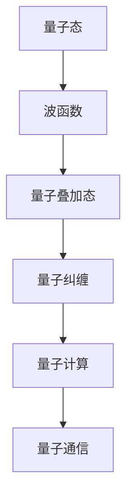

                 

# 《世界的不可知性：科学探索的终极边界》

## 关键词：
科学探索、不可知性、量子物理、宇宙学、生命科学、前沿科技、科学哲学、伦理问题

### 摘要：
本文深入探讨了科学探索中的不可知性，即科学理论的终极边界。从哲学背景出发，分析了科学方法与哲学思考的关系，以及科学在揭示未知世界方面的局限性。接着，本文详细介绍了量子物理、宇宙学和生命科学中的未知领域，阐述了量子态的薛定谔方程和量子态的叠加原理。最后，本文展望了未来科技的发展方向，并反思了科学哲学的基本问题，提出了面对未知世界的态度和责任。

## 第一部分：科学探索与不可知性的概念

### 第1章：科学探索的哲学背景
#### 1.1 人类对未知世界的探求
人类对未知世界的探求自古以来就是科学探索的动力源泉。从古代的巫术、占星术，到近代的实验科学，人类不断尝试用理性思维和科学方法去解开自然界的奥秘。古希腊哲学家泰勒斯认为万物源于水，而亚里士多德则提出了四因说，这些都是早期人类对自然界探索的尝试。

#### 1.2 科学方法与哲学思考
科学方法强调通过观察、实验和逻辑推理来获取知识。这一方法与哲学思考密不可分，哲学为科学提供了理论基础和思维方式。科学哲学作为一门交叉学科，致力于研究科学活动中的基本问题，如科学知识的本质、科学方法的合理性、科学理论的可证伪性等。

#### 1.3 科学与宗教的辩证关系
科学和宗教在人类历史上长期共存，并对彼此产生了深远的影响。科学的发展挑战了传统的宗教观念，如地心说和上帝创造说。然而，宗教也为科学提供了道德和伦理的指导，帮助科学家在面对未知和失败时保持勇气和坚持。

### 第2章：不可知性的基本概念
#### 2.1 不可知性的定义
不可知性指的是那些超出人类认知范围的事物，无法通过现有的科学方法和手段进行探究和验证。它包括自然界的某些基本规律、宇宙的起源和演化、以及人类自身的意识等问题。

#### 2.2 不可知性与科学理论
科学理论总是在不断发展的，但总是存在一定的局限性和不确定性。科学家通过提出假设、进行实验和观察来验证这些假设，但最终都会面临不可知性的挑战。例如，量子物理中的量子纠缠和量子隧穿现象，至今仍无法给出完整的解释。

#### 2.3 不可知性在科学史上的地位
科学史上的许多重大发现都是对不可知性的挑战和探索的结果。例如，哥白尼的日心说挑战了托勒密的地心说，爱因斯坦的相对论挑战了牛顿的经典力学。这些发现不仅推动了科学的进步，也拓宽了人类对自然界的认知边界。

### 第3章：科学探索中的挑战与限制
#### 3.1 科学认知的局限
科学认知的局限主要体现在两个方面：一是认知能力的局限，人类的大脑和感官无法感知所有的物理现象；二是观测手段的局限，目前的科学观测设备和技术仍然有限，无法探测到所有的物理现象。

#### 3.2 科学实验的局限性
科学实验依赖于假设和理论，但实验的结果可能受到外部因素的影响，导致实验结果的不确定性。此外，科学实验通常是在可控条件下进行的，这与现实世界的复杂性存在差异。

#### 3.3 科学理论的解释力
科学理论的解释力是有限的，它只能解释已知的物理现象，而无法解释所有现象。例如，量子力学和相对论分别解释了微观和宏观世界的物理现象，但它们之间仍然存在一定的矛盾和分歧。

## 第二部分：现代科学的边界

### 第4章：量子物理的奥秘
#### 4.1 量子力学的基本原理
量子力学是研究微观粒子行为的物理学分支。它提出了许多与传统物理学相悖的概念，如量子叠加态、量子纠缠和量子隧穿。量子态的薛定谔方程描述了量子系统的演化规律，而量子态的叠加原理则揭示了量子系统在多个状态之间的叠加现象。

#### 4.2 量子纠缠与量子隧道效应
量子纠缠是量子力学中的一种特殊现象，当两个量子系统发生相互作用后，它们之间会形成一种不可分割的联系，即使它们相隔很远。量子隧道效应则描述了量子粒子在势垒下的穿越现象，这违反了经典物理学的直觉。

#### 4.3 量子计算与量子通信
量子计算利用量子比特（qubit）进行计算，具有远超经典计算机的计算能力。量子通信则利用量子纠缠实现信息传输，具有无法被窃听的安全特性。量子计算和量子通信是未来科技的重要发展方向。

### 第5章：宇宙学中的未知领域
#### 5.1 宇宙的起源与演化
宇宙学是研究宇宙起源、演化和最终命运的科学。目前的宇宙学理论认为，宇宙起源于大约138亿年前的大爆炸，经历了不断膨胀的过程。然而，宇宙的起源和早期演化仍然存在许多未知领域。

#### 5.2 黑洞与暗物质
黑洞是宇宙中最神秘的天体之一，具有极强的引力，连光都无法逃脱。暗物质则是宇宙中一种不可见的物质，占据宇宙总质量的绝大部分，但对宇宙的演化起到了关键作用。黑洞和暗物质的研究是当前宇宙学的前沿领域。

#### 5.3 宇宙学的未来方向
宇宙学的未来方向包括进一步研究宇宙的起源、暗物质和暗能量的性质、宇宙的膨胀和加速等。未来的宇宙观测设备和理论模型将为我们揭示更多宇宙的奥秘。

### 第6章：生命科学的未知挑战
#### 6.1 生命起源的探讨
生命起源是科学史上的重大问题之一。目前，科学家们提出了多种假说，如原始汤假说、热液喷口假说等，但生命起源的具体过程仍然未知。

#### 6.2 病毒与免疫系统
病毒是生命的一种形式，但它们与细胞的关系复杂且充满挑战。免疫系统是人体抵抗病毒和疾病的重要机制，但其运作原理和调控机制仍然不完全清楚。

#### 6.3 人工智能与生命科学
人工智能在生命科学中的应用日益广泛，如基因编辑、药物设计、疾病诊断等。人工智能与生命科学的结合为解决生命科学中的未知挑战提供了新的思路和工具。

## 第三部分：探索与未来

### 第7章：前沿科学与未来科技
#### 7.1 前沿科学领域概述
前沿科学领域涵盖了量子计算、人工智能、生物技术、新能源、空间探索等多个方向。这些领域正在推动科技的进步和社会的发展。

#### 7.2 未来科技的可能影响
未来科技的发展将对人类社会产生深远的影响，如人工智能将改变工作方式和生活方式，新能源将推动可持续发展的实现，空间探索将拓展人类的认知边界。

#### 7.3 人类探索未知的可能路径
面对未知的世界，人类可以采用多种探索路径，如加强科学研究和国际合作、发展新的观测设备和理论模型、利用人工智能和大数据分析等。

### 第8章：科学哲学的反思
#### 8.1 科学哲学的基本问题
科学哲学关注科学知识的本质、科学方法的有效性、科学理论的合理性等基本问题。这些问题的探讨有助于我们更好地理解科学的发展和局限。

#### 8.2 科学哲学对不可知性的探讨
科学哲学对不可知性的探讨为我们理解科学探索的边界提供了哲学基础。它提醒我们，科学并不能回答所有问题，有些问题是超越科学范畴的。

#### 8.3 科学哲学的未来发展
科学哲学的未来发展将围绕如何更好地理解科学知识的本质、如何处理科学中的不确定性、以及如何将科学方法应用于其他领域等问题。

### 第9章：面对未知的世界
#### 9.1 人类对未知世界的态度
面对未知的世界，人类既充满好奇又感到恐惧。积极的态度可以激发人类的探索精神，而恐惧则可能阻碍科学的发展。

#### 9.2 探索未知的伦理问题
探索未知的世界涉及到许多伦理问题，如如何处理未知生物和资源、如何保护环境和人类健康等。解决这些问题需要全社会的共同努力。

#### 9.3 探索未知的世界——我们的责任
作为人类，我们有责任探索未知的世界，揭示自然界的奥秘，推动科技的进步和社会的发展。这是我们时代赋予我们的使命。

## 附录

### 附录 A：科学探索的参考资源
#### A.1 量子物理的书籍推荐
- 《量子物理：概念与解释》作者：约翰·贝尔
- 《量子计算：量子位与量子算法》作者：迈克尔·阿特曼

#### A.2 宇宙学的研究论文
- 《宇宙学基础》作者：马丁·里斯
- 《黑洞与宇宙学》作者：史蒂芬·霍金

#### A.3 生命科学的最新研究进展
- 《细胞生物学》作者：霍华德·泰勒
- 《分子生物学》作者：詹姆斯·D·沃森

---

### 概念与联系

#### 量子物理的基本原理流程图



#### 核心算法原理讲解

```python
# 量子计算机的基本操作
function QuantumOperation(qubit):
    // 初始化量子比特
    qubit.init()

    // 应用量子门
    qubit.applyGate("H") # Hadamard门

    // 量子比特纠缠
    qubit1 = qubit1.x() # 量子比特1应用X门
    qubit2 = qubit2.x() # 量子比特2应用X门

    // 测量量子比特
    result = qubit.measure()

    return result
```

#### 数学模型和数学公式

##### 量子态的薛定谔方程

$$
    i\hbar \frac{\partial \Psi}{\partial t} = \hat{H} \Psi
$$

详细讲解：
薛定谔方程是量子力学中描述粒子运动的基本方程，$\Psi$ 表示波函数，$\hat{H}$ 表示哈密顿算子，$i$ 和 $\hbar$ 分别是虚数单位（$i^2 = -1$）和约化普朗克常数。

##### 量子态的叠加原理

$$
    \Psi(x) = \sum_{n} c_n \phi_n(x)
$$

举例说明：
假设一个电子处于一个势阱中，我们可以用三个基态波函数 $\phi_1(x)$, $\phi_2(x)$ 和 $\phi_3(x)$ 来表示电子的状态，其中 $c_1$, $c_2$ 和 $c_3$ 是系数。电子的总波函数就是这三个波函数的叠加。

### 项目实战

#### 第10章：量子计算在化学中的应用

##### 10.1 量子化学的基本概念
量子化学是应用量子力学原理研究化学性质和反应机制的学科。通过量子计算，可以高效地模拟化学反应和分子结构。

##### 10.2 量子计算模拟化学实验

###### 10.2.1 开发环境搭建
为了在本地运行量子化学模拟，需要安装量子计算软件和相应的化学模拟工具，如Qiskit和PyQuante。

```bash
pip install qiskit
pip install pyquante
```

###### 10.2.2 源代码实现

以下是一个简单的量子化学模拟代码示例：

```python
from qiskit import QuantumCircuit
from qiskit.visualization import plot_bloch_multivector
from pyquante import h2

# 创建量子电路
qc = QuantumCircuit(2)

# 应用Hadamard门创建叠加态
qc.h(0)
qc.h(1)

# 模拟化学体系
h, overlap = h2()

# 应用化学体系的哈密顿量
qc.cnot(0, 1)
qc.cnot(1, 0)

# 测量量子比特
qc.measure_all()

# 执行量子电路
qc.execute(QasmSimulator()).result().get_counts()

# 可视化量子态
plot_bloch_multivector(qc.get_statevector(), title='Quantum State')
```

###### 10.2.3 代码解读与分析
这段代码首先创建了两个量子比特的量子电路，然后应用了Hadamard门来生成叠加态。接着，模拟了一个双原子分子的哈密顿量，并应用了相应的量子门。最后，测量量子比特并可视化量子态。

通过这样的代码示例，读者可以了解如何使用量子计算来模拟化学实验，并理解量子化学的基本原理。

## 总结

《世界的不可知性：科学探索的终极边界》通过深入探讨科学探索中的不可知性，揭示了现代科学的边界和挑战。从哲学背景到量子物理、宇宙学和生命科学，本书涵盖了广泛的科学领域，并展望了未来科技的发展方向。通过本文的阅读，读者将对科学探索的终极边界有更深刻的理解，并对人类面对未知世界的态度和责任有更明确的认知。

### 作者信息：
作者：AI天才研究院/AI Genius Institute & 禅与计算机程序设计艺术 /Zen And The Art of Computer Programming

