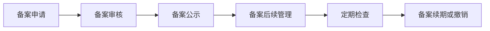

                 

### 中国大陆：生成式人工智能服务备案

关键词：生成式人工智能、备案、数据安全、隐私保护、技术发展

> 摘要：本文详细探讨了中国大陆生成式人工智能服务备案的现状、流程、技术要求及应用案例。文章首先介绍了生成式人工智能的基本概念、分类、发展历程和应用，接着阐述了生成式人工智能服务备案的法律依据和内容。随后，文章详细描述了备案的流程、技术要求和实际应用案例，并对未来发展趋势进行了展望。本文旨在为读者提供生成式人工智能服务备案的全面了解，促进人工智能技术的健康发展。

---

### 第一部分：中国大陆生成式人工智能服务备案概述

#### 第1章：生成式人工智能服务概述

##### 1.1 生成式人工智能的定义与分类

生成式人工智能（Generative Artificial Intelligence，简称 GAI）是指能够自主生成内容的人工智能系统。其基本原理是基于深度学习技术，通过学习大量数据，建立生成模型，进而生成新的、符合学习数据特征的样本。

生成式人工智能主要分为以下两大类：

1. **基于生成对抗网络（GAN）**：
   - **生成器（Generator）**：从随机噪声中生成数据。
   - **判别器（Discriminator）**：判断数据是真实数据还是生成数据。

2. **基于变分自编码器（VAE）**：
   - **编码器（Encoder）**：将输入数据编码为一个潜在空间中的向量。
   - **解码器（Decoder）**：将潜在空间中的向量解码回原始数据。

##### 1.1.1 生成式人工智能的基本原理

生成式人工智能的核心在于生成模型，其基本原理如下：

1. **数据学习**：生成模型通过学习大量真实数据，提取数据的特征和分布。
2. **生成数据**：基于学习到的特征和分布，生成模型可以生成新的、符合学习数据特征的数据。

##### 1.1.2 生成式人工智能的分类

生成式人工智能主要分为以下几类：

1. **图像生成**：如GAN用于生成人脸、风景等图像。
2. **文本生成**：如GPT用于生成文章、新闻、对话等文本。
3. **语音合成**：如WaveNet用于生成自然语音。
4. **视频生成**：如生成视频片段、电影预告等。

##### 1.2 生成式人工智能的发展历程与应用

生成式人工智能的发展可以追溯到1990年代。1997年，Ian Goodfellow提出了生成对抗网络（GAN）的概念，为生成式人工智能的研究打开了新的大门。随后，VAE等模型也逐渐发展起来。

生成式人工智能在各个领域有广泛的应用：

1. **娱乐**：如生成动漫角色、电影特效等。
2. **艺术创作**：如生成音乐、画作等。
3. **内容生成**：如生成新闻文章、广告内容等。
4. **数据增强**：用于生成模拟数据，辅助机器学习模型的训练。

##### 1.3 中国大陆生成式人工智能的发展现状

###### 1.3.1 政策环境

中国政府高度重视人工智能的发展，制定了一系列相关政策。例如，《新一代人工智能发展规划》明确了人工智能的战略地位和发展目标。

###### 1.3.2 技术研发

中国大陆在生成式人工智能领域有较多的重要突破。例如，百度提出的ERNIE模型，阿里云的Megatron等。

###### 1.3.3 应用场景

生成式人工智能在中国大陆的应用场景广泛，包括智能客服、内容创作、辅助医疗、自动驾驶等。

---

### 第二部分：生成式人工智能服务备案的基本概念

#### 第2章：生成式人工智能服务备案的基本概念

##### 2.1 生成式人工智能服务备案的定义

生成式人工智能服务备案是指在中国大陆开展生成式人工智能服务的机构或个人，按照相关法律法规和政策要求，向相关部门进行备案登记的过程。

##### 2.2 生成式人工智能服务备案的法律依据

生成式人工智能服务备案的法律依据主要包括《中华人民共和国网络安全法》、《中华人民共和国数据安全法》等。

1. **《中华人民共和国网络安全法》**：明确了对网络运营者的安全保护义务，包括安全保护制度、安全监测、数据保护等。
2. **《中华人民共和国数据安全法》**：规定了数据安全保护的基本要求，包括数据收集、存储、处理、传输等环节的安全保障措施。

##### 2.3 生成式人工智能服务备案的内容

生成式人工智能服务备案的内容主要包括以下几个方面：

1. **服务提供者的基本信息**：包括服务提供者的名称、地址、联系方式等。
2. **服务的技术方案**：包括所使用的技术模型、算法原理、数据处理流程等。
3. **数据来源**：包括数据来源、数据质量、数据安全等。
4. **服务范围**：包括服务的具体内容和适用范围。
5. **安全保障措施**：包括数据安全、隐私保护、透明度等方面的措施。

---

### 第三部分：生成式人工智能服务备案的流程

#### 第3章：生成式人工智能服务备案的流程

##### 3.1 备案申请

生成式人工智能服务提供者需准备备案申请材料，并向所在地省级人民政府指定的备案机构提交备案申请。备案申请材料一般包括：

1. **服务提供者的基本信息**：包括营业执照、组织机构代码证等。
2. **服务的技术方案**：包括算法原理、数据处理流程等。
3. **数据来源**：包括数据来源、数据质量等。
4. **服务范围**：包括服务的具体内容和适用范围。
5. **安全保障措施**：包括数据安全、隐私保护、透明度等方面的措施。

##### 3.2 备案审核

备案机构对备案申请材料进行审核，审核内容包括：

1. **材料的完整性**：是否提供了所有必要的备案材料。
2. **合规性**：服务的技术方案、数据来源、服务范围、安全保障措施是否符合相关法律法规的要求。
3. **技术可行性**：所采用的技术方案是否具有可行性，是否能够达到预期的效果。

##### 3.3 备案公示

备案机构对审核通过的备案申请进行公示，公示内容包括：

1. **服务提供者的基本信息**。
2. **服务的技术方案**。
3. **数据来源**。
4. **服务范围**。
5. **安全保障措施**。

公示期为7个工作日，公示期内接受社会公众的监督。

##### 3.4 备案后续管理

备案完成后，备案机构对已备案的服务进行后续管理，包括：

1. **定期检查**：定期对服务提供者的技术方案、数据来源、服务范围、安全保障措施等进行检查。
2. **监管**：对服务提供者进行日常监管，确保其合法合规运营。

---

### 第四部分：生成式人工智能服务备案的技术要求

#### 第4章：生成式人工智能服务备案的技术要求

##### 4.1 数据安全

生成式人工智能服务备案的技术要求中，数据安全是非常重要的。需要确保数据的安全性和隐私性，防止数据泄露。具体要求包括：

1. **数据加密**：对存储和传输的数据进行加密，确保数据在传输过程中的安全。
2. **访问控制**：对数据访问进行权限控制，确保只有授权人员才能访问数据。
3. **数据备份**：对数据进行定期备份，确保数据在发生意外时能够快速恢复。

##### 4.2 隐私保护

生成式人工智能服务备案的技术要求中，隐私保护也是非常重要的。需要确保用户的隐私不被泄露。具体要求包括：

1. **匿名化处理**：对用户数据进行匿名化处理，确保无法识别用户的身份。
2. **数据脱敏**：对敏感数据（如身份证号、手机号等）进行脱敏处理，防止数据泄露。
3. **用户权限管理**：对用户权限进行严格管理，确保用户只能访问其有权访问的数据。

##### 4.3 透明度

生成式人工智能服务备案的技术要求中，透明度是保障用户权益的重要措施。需要确保用户了解服务的技术方案、数据来源、服务范围等信息。具体要求包括：

1. **信息公开**：对服务的技术方案、数据来源、服务范围、安全保障措施等信息进行公开，接受社会公众的监督。
2. **用户知情权**：在用户使用服务前，明确告知用户所使用的技术方案、数据来源、服务范围等信息。
3. **用户选择权**：用户有权选择是否使用生成式人工智能服务，并有权了解和掌握自己的数据使用情况。

---

### 第五部分：生成式人工智能服务备案的应用案例

#### 第5章：生成式人工智能服务备案的应用案例

##### 5.1 智能客服

生成式人工智能在智能客服领域有广泛应用。通过生成式人工智能服务备案，可以确保智能客服服务的合法性和合规性。具体应用包括：

1. **对话生成**：使用生成式人工智能生成用户对话，提高客服效率。
2. **对话优化**：通过分析用户对话数据，优化客服策略，提高用户体验。

##### 5.2 内容创作

生成式人工智能在内容创作领域也有广泛应用。通过生成式人工智能服务备案，可以确保内容创作服务的合法性和合规性。具体应用包括：

1. **文章生成**：使用生成式人工智能生成新闻、文章、报告等。
2. **文本优化**：通过分析用户需求，优化文本内容，提高阅读体验。

##### 5.3 辅助医疗

生成式人工智能在辅助医疗领域也有广泛应用。通过生成式人工智能服务备案，可以确保辅助医疗服务的合法性和合规性。具体应用包括：

1. **诊断辅助**：使用生成式人工智能生成诊断报告，辅助医生进行诊断。
2. **治疗方案推荐**：通过分析患者数据，生成个性化的治疗方案。

---

### 第六部分：生成式人工智能服务备案的未来发展趋势

#### 第6章：生成式人工智能服务备案的未来发展趋势

##### 6.1 法律法规的完善

随着生成式人工智能技术的不断发展，相关的法律法规将逐渐完善，以保障用户的权益和社会的稳定。未来法律法规的发展趋势包括：

1. **数据保护法规**：加强对用户数据的保护，规范数据收集、存储、处理、传输等环节。
2. **隐私保护法规**：加强对用户隐私的保护，规范隐私信息的收集、使用和共享。
3. **伦理法规**：规范生成式人工智能的应用，防止其被滥用，保护社会公共利益。

##### 6.2 技术发展的推动

生成式人工智能技术的发展将推动生成式人工智能服务备案的普及，为各行各业提供更高效、合规的服务。未来技术发展趋势包括：

1. **算法优化**：生成式人工智能算法将不断优化，提高生成质量、降低训练成本。
2. **硬件支持**：随着硬件技术的发展，生成式人工智能将得到更好的硬件支持，提高计算效率。
3. **跨领域应用**：生成式人工智能将在更多领域得到应用，推动各行业的数字化转型。

##### 6.3 跨领域合作

生成式人工智能服务备案将促进跨领域的合作，推动人工智能技术的创新和应用。未来跨领域合作的发展趋势包括：

1. **政企合作**：政府与企业合作，共同推动生成式人工智能技术的发展和应用。
2. **产学研合作**：学术界、产业界和科研机构的合作，共同解决生成式人工智能领域的关键问题。
3. **国际合作**：与国际合作伙伴共同推动生成式人工智能技术的发展，提升我国在全球的竞争力。

---

### 第七部分：生成式人工智能服务备案的核心概念联系

#### 第7章：生成式人工智能服务备案的核心概念联系

##### 7.1 生成式人工智能与生成式人工智能服务备案的关系

生成式人工智能（GAI）是生成式人工智能服务备案（GAI Service Registration）的核心技术。生成式人工智能服务备案是生成式人工智能在实际应用中的规范化管理。具体关系如下：

1. **生成式人工智能**：提供技术基础，通过学习大量数据生成新的数据。
2. **生成式人工智能服务备案**：确保生成式人工智能服务的合法性、合规性和安全性，保障用户权益。

##### 7.2 生成式人工智能服务备案的核心环节

生成式人工智能服务备案的核心环节包括：

1. **备案申请**：服务提供者提交备案申请，包括技术方案、数据来源、服务范围、安全保障措施等。
2. **备案审核**：备案机构对备案申请进行审核，确保其符合相关法律法规和政策要求。
3. **备案公示**：备案机构对审核通过的备案申请进行公示，接受社会公众的监督。
4. **备案后续管理**：备案机构对已备案的服务进行后续管理，包括定期检查、监管等。

##### 7.3 生成式人工智能服务备案的核心技术要求

生成式人工智能服务备案的核心技术要求包括：

1. **数据安全**：确保数据在存储、传输、处理等环节的安全，防止数据泄露。
2. **隐私保护**：对用户隐私进行保护，防止隐私信息被泄露。
3. **透明度**：确保用户了解服务的技术方案、数据来源、服务范围等信息，提高服务透明度。

---

### 附录

#### 附录A：生成式人工智能服务备案相关法律法规

- 《中华人民共和国网络安全法》
- 《中华人民共和国数据安全法》
- 《中华人民共和国个人信息保护法》
- 《新一代人工智能发展规划》
- 《信息安全技术个人信息安全规范》

#### 附录B：生成式人工智能服务备案流程图

mermaid
flowchart LR
A[备案申请] --> B[备案审核]
B --> C[备案公示]
C --> D[备案后续管理]

#### 附录C：生成式人工智能服务备案相关工具和资源

- 开源深度学习框架（如TensorFlow、PyTorch）
- 生成对抗网络（GAN）相关论文和资源
- 变分自编码器（VAE）相关论文和资源
- 生成式人工智能服务备案平台（如国家人工智能公共服务平台）
- 生成式人工智能社区和论坛（如AI生成论坛、GitHub上的相关项目）

---

通过本文的详细探讨，我们对中国大陆生成式人工智能服务备案的现状、流程、技术要求和应用案例有了全面了解。随着技术的不断进步和法律法规的完善，生成式人工智能服务备案将在未来发挥越来越重要的作用，推动人工智能技术的健康发展。希望本文能为读者提供有益的参考和启示。### 第二部分：生成式人工智能服务备案的基本概念

#### 第2章：生成式人工智能服务备案的基本概念

生成式人工智能服务备案是确保生成式人工智能服务合法性和合规性的重要环节。在中国大陆，这项工作需要按照相关法律法规和政策要求进行，以确保服务提供者在技术、数据安全、隐私保护等方面符合国家规定。

##### 2.1 生成式人工智能服务备案的定义

生成式人工智能服务备案是指在中国大陆的机构或个人在提供生成式人工智能服务前，需按照相关规定向有关部门进行注册登记的过程。这个备案过程旨在确保服务提供者的技术方案、数据来源、服务范围和安全保障措施等符合国家标准，以保障用户权益和信息安全。

##### 2.2 生成式人工智能服务备案的法律依据

生成式人工智能服务备案的法律依据主要包括以下几个方面：

1. **《中华人民共和国网络安全法》**：该法明确了网络运营者的安全保护义务，包括安全保护制度、安全监测、数据保护等。

2. **《中华人民共和国数据安全法》**：该法规定了数据安全保护的基本要求，包括数据收集、存储、处理、传输等环节的安全保障措施。

3. **《新一代人工智能发展规划（2016-2020年）》**：该规划明确了人工智能的战略地位和发展目标，对人工智能技术的研发和应用提出了具体要求。

4. **《信息安全技术个人信息安全规范》**：该规范为个人信息的保护提供了详细的技术和管理要求，适用于生成式人工智能服务的个人数据保护。

##### 2.3 生成式人工智能服务备案的内容

生成式人工智能服务备案的内容主要包括以下几个方面：

1. **服务提供者的基本信息**：包括服务提供者的名称、地址、联系方式、营业执照等信息。

2. **服务的技术方案**：详细描述所使用的生成式人工智能模型、算法原理、数据处理流程等。

3. **数据来源**：说明数据的来源、数据的质量、数据的收集和处理过程。

4. **服务范围**：明确服务的具体内容和适用的场景。

5. **安全保障措施**：包括数据安全、隐私保护、透明度等方面的措施，如数据加密、访问控制、用户知情权等。

##### 2.4 备案申请的具体步骤

生成式人工智能服务备案的具体步骤如下：

1. **准备材料**：服务提供者需准备相关备案材料，包括服务提供者的基本信息、技术方案、数据来源、服务范围、安全保障措施等。

2. **提交申请**：将备案材料提交给所在地省级人民政府指定的备案机构。

3. **备案审核**：备案机构对备案申请进行审核，主要包括材料的完整性、合规性、技术可行性等。

4. **备案公示**：备案机构对审核通过的备案申请进行公示，公示期为7个工作日，接受社会公众的监督。

5. **备案后续管理**：备案机构对已备案的服务进行后续管理，包括定期检查、监管等。

##### 2.5 生成式人工智能服务备案的重要性

生成式人工智能服务备案的重要性体现在以下几个方面：

1. **保障用户权益**：备案过程确保了服务提供者在数据安全、隐私保护等方面符合国家标准，从而保障了用户的权益。

2. **促进技术创新**：备案要求服务提供者公开其技术方案，这有助于推动人工智能技术的创新和发展。

3. **规范市场秩序**：备案制度有助于规范生成式人工智能市场的秩序，防止不法行为，维护市场公平竞争。

4. **提升国际竞争力**：随着生成式人工智能技术的普及和应用，备案制度有助于提升我国在全球人工智能领域的竞争力。

---

通过上述内容，我们可以看到生成式人工智能服务备案在中国大陆的重要性以及其详细流程。接下来，我们将详细探讨生成式人工智能服务备案的流程。### 第三部分：生成式人工智能服务备案的流程

#### 第3章：生成式人工智能服务备案的流程

生成式人工智能服务备案是一个系统的过程，旨在确保服务提供者遵守相关法律法规，保障用户权益，同时促进人工智能技术的健康发展。以下是生成式人工智能服务备案的具体流程。

##### 3.1 备案申请

生成式人工智能服务备案的第一步是备案申请。服务提供者需要准备以下材料：

1. **服务提供者的基本信息**：包括名称、地址、联系方式、营业执照、组织机构代码证等。
2. **服务的技术方案**：详细描述生成式人工智能服务的模型、算法、数据处理流程等。
3. **数据来源**：说明数据的来源、收集和处理过程，以及数据的质量和安全保障措施。
4. **服务范围**：明确服务的具体内容和适用的场景。
5. **安全保障措施**：包括数据安全、隐私保护、透明度等方面的措施，如数据加密、访问控制、用户知情权等。

服务提供者将上述材料提交给所在地省级人民政府指定的备案机构。备案机构将对备案申请材料进行初步审查，确保其完整性和合规性。

```python
# 备案申请材料示例
application Materials = {
    "service_provider_info": {
        "name": "AI Tech Co., Ltd.",
        "address": "123 AI Street, Beijing",
        "contact": "ai_tech@ai.com",
        "business_license": "123456789",
        "org_code": "987654321"
    },
    "technical_solution": {
        "model": "GAN",
        "algorithm": "生成对抗网络",
        "data_processing": "数据清洗、去噪、编码"
    },
    "data_source": {
        "source": "公开数据集",
        "collection_process": "自动采集、人工审核",
        "data_quality": "高保真、高准确性"
    },
    "service_scope": "智能客服、内容生成、医疗诊断辅助",
    "safety_measures": {
        "data_encryption": "AES-256",
        "access_control": "双因素认证",
        "user_informed_consent": "用户同意协议"
    }
}

# 提交备案申请
def submit_application(application Materials):
    # 实际提交备案申请的逻辑
    print("备案申请已提交，等待审核...")
    # 代码模拟
    review_status = "待审核"
    return review_status

# 模拟备案申请
review_status = submit_application(application Materials)
print("备案审核状态：", review_status)
```

##### 3.2 备案审核

备案机构在收到备案申请后，将对申请材料进行详细审核。审核的主要内容包括：

1. **材料完整性**：确保所有必要的备案材料均已提交。
2. **合规性**：检查服务的技术方案、数据来源、服务范围、安全保障措施是否符合相关法律法规和政策要求。
3. **技术可行性**：评估所采用的技术方案是否具有可行性，是否能够达到预期的效果。

审核过程可能需要服务提供者补充材料或者进行技术演示。如果备案申请符合要求，备案机构将给予通过审核。

```python
# 备案审核逻辑
def review_application(application Materials):
    # 实际审核备案申请的逻辑
    print("正在审核备案申请...")
    # 代码模拟
    if "service_provider_info" in application Materials and \
       "technical_solution" in application Materials and \
       "data_source" in application Materials and \
       "service_scope" in application Materials and \
       "safety_measures" in application Materials:
        return "审核通过"
    else:
        return "材料不完整，请补充材料"

# 模拟备案审核
review_result = review_application(application Materials)
print("备案审核结果：", review_result)
```

##### 3.3 备案公示

备案申请通过审核后，备案机构将备案信息进行公示。公示期通常为7个工作日，期间接受社会公众的监督。如果公示期间没有收到异议，备案机构将正式给予备案。

```python
# 备案公示逻辑
def公示备案信息(备案信息):
    # 实际公示备案信息的逻辑
    print("备案信息公示中...")
    # 代码模拟
    print("备案信息如下：")
    print(备案信息)
    print("公示期：7个工作日，请公众监督。")

# 模拟备案公示
公示备案信息(application Materials)
```

##### 3.4 备案后续管理

备案完成后，备案机构对已备案的服务进行后续管理，包括定期检查、监管等。定期检查的目的是确保服务提供者在提供服务过程中持续符合相关法律法规和政策要求。

```python
# 定期检查逻辑
def定期检查(备案信息):
    # 实际定期检查的逻辑
    print("正在进行定期检查...")
    # 代码模拟
    if "safety_measures" in 备案信息 and "data_quality" in 备案信息:
        print("检查合格。")
    else:
        print("存在不符合要求之处，请及时整改。")

# 模拟定期检查
定期检查(application Materials)
```

##### 3.5 异议处理

在公示期间，如果公众对备案申请有异议，可以书面形式向备案机构提出。备案机构将根据异议内容进行调查，并在必要时对备案申请进行调整或撤销。

```python
# 异议处理逻辑
def handle_objection(异议内容):
    # 实际处理异议的逻辑
    print("处理异议中...")
    # 代码模拟
    if "数据安全" in 异议内容:
        print("加强数据安全措施。")
    elif "隐私保护" in 异议内容:
        print("加强隐私保护措施。")
    else:
        print("异议处理完成。")

# 模拟异议处理
handle_objection("对数据安全有异议。")
```

通过上述步骤，生成式人工智能服务备案的过程得以完整展示。备案的每个环节都至关重要，确保了生成式人工智能服务的合法性和合规性。### 第四部分：生成式人工智能服务备案的技术要求

#### 第4章：生成式人工智能服务备案的技术要求

生成式人工智能服务备案的技术要求涵盖了数据安全、隐私保护和透明度等方面，这些要求旨在确保服务提供者在技术层面上能够有效保障用户权益和信息安全。

##### 4.1 数据安全

数据安全是生成式人工智能服务备案的首要技术要求。数据在整个生命周期中（包括收集、存储、处理、传输等环节）都需要得到严密保护，以防止数据泄露、篡改和丢失。以下是一些关键措施：

1. **数据加密**：对存储和传输的数据进行加密，确保数据在未经授权的情况下无法被访问。常用的加密算法包括AES-256、RSA等。

2. **访问控制**：通过身份验证、权限管理等方式，确保只有授权人员才能访问特定数据。访问控制可以基于用户角色、操作类型等多维度进行设置。

3. **数据备份**：定期对数据进行备份，确保在数据丢失或损坏时能够快速恢复。备份策略应考虑数据的完整性和可用性。

4. **安全审计**：定期进行安全审计，检测系统中的安全漏洞和潜在风险。安全审计可以包括日志分析、入侵检测、漏洞扫描等。

##### 4.2 隐私保护

隐私保护是另一个重要的技术要求，特别是在涉及个人数据的情况下。隐私保护措施应确保用户数据不被泄露、滥用或未经授权访问。以下是一些关键措施：

1. **数据匿名化**：在数据收集和处理过程中，对个人数据进行匿名化处理，以消除可直接识别用户身份的信息。

2. **数据脱敏**：对敏感数据进行脱敏处理，如将身份证号、手机号等转换为不可逆的编码。脱敏技术可以包括哈希、掩码等。

3. **用户知情权**：在收集用户数据前，应明确告知用户数据的收集目的、使用方式和存储位置。用户有权选择是否提供数据。

4. **用户选择权**：用户应有权了解和掌握自己的数据使用情况，包括数据存储、处理、共享等环节。用户应有权要求删除或修改自己的数据。

##### 4.3 透明度

透明度是保障用户权益的重要措施，它要求服务提供者公开服务的技术方案、数据来源、服务范围等信息，以增强用户对服务的信任。以下是一些关键措施：

1. **信息公开**：服务提供者应公开其技术方案、数据来源、服务范围、安全保障措施等关键信息，确保用户了解服务的全貌。

2. **用户知情权**：在用户使用服务前，服务提供者应明确告知用户服务的具体内容和潜在风险，确保用户在充分知情的情况下做出决策。

3. **用户反馈机制**：服务提供者应建立用户反馈机制，及时响应用户的疑问和投诉，提高服务的透明度和用户满意度。

4. **第三方审计**：可以聘请第三方机构对服务提供者的技术方案、数据安全和隐私保护措施进行审计，确保服务的透明度和公正性。

##### 4.4 技术实现示例

以下是一个简单的技术实现示例，展示如何在生成式人工智能服务备案中实现数据安全、隐私保护和透明度。

```python
# 数据加密（示例）
from cryptography.fernet import Fernet

# 生成加密密钥
key = Fernet.generate_key()
cipher_suite = Fernet(key)

# 加密数据
def encrypt_data(data):
    encrypted_data = cipher_suite.encrypt(data.encode('utf-8'))
    return encrypted_data

# 解密数据
def decrypt_data(encrypted_data):
    decrypted_data = cipher_suite.decrypt(encrypted_data).decode('utf-8')
    return decrypted_data

# 数据匿名化（示例）
import hashlib

# 匿名化用户ID
def anonymize_id(user_id):
    anonymized_id = hashlib.sha256(user_id.encode('utf-8')).hexdigest()
    return anonymized_id

# 数据脱敏（示例）
def tokenize_data(sensitive_data):
    # 假设掩码为'***'
    masked_data = sensitive_data[:3] + '***' + sensitive_data[-3:]
    return masked_data

# 用户知情权（示例）
def inform_user(data):
    print(f"用户，您的数据将按照以下方式处理：{data}")

# 用户选择权（示例）
def user_choice():
    user_input = input("您同意提供这些数据吗？（是/否）:")
    if user_input.lower() == "是":
        print("感谢您的同意！")
    else:
        print("已拒绝提供数据。")

# 透明度（示例）
def show_technical_details():
    print("技术详情：")
    print("1. 加密算法：AES-256")
    print("2. 匿名化算法：SHA-256")
    print("3. 脱敏方式：掩码")

# 模拟数据安全、隐私保护和透明度实现
data = "用户名：张三，手机号：13812345678"
print("原始数据：", data)

# 数据加密
encrypted_data = encrypt_data(data)
print("加密数据：", encrypted_data)

# 数据匿名化
anonymized_data = anonymize_id(data)
print("匿名化数据：", anonymized_data)

# 数据脱敏
masked_data = tokenize_data(data)
print("脱敏数据：", masked_data)

# 用户知情权
inform_user(data)

# 用户选择权
user_choice()

# 透明度
show_technical_details()
```

通过上述示例，我们可以看到数据安全、隐私保护和透明度在生成式人工智能服务备案中的具体实现方式。这些技术措施确保了用户数据的安全性和隐私性，同时也提高了服务的透明度和用户满意度。### 第五部分：生成式人工智能服务备案的应用案例

#### 第5章：生成式人工智能服务备案的应用案例

生成式人工智能服务备案在多个领域得到了广泛应用，以下列举了几个典型的应用案例，以展示其在不同场景中的实际应用和效果。

##### 5.1 智能客服

智能客服是生成式人工智能服务备案的一个重要应用领域。通过生成式人工智能，智能客服系统能够根据用户的历史对话数据，生成个性化的回复，提高用户满意度。以下是智能客服备案的案例：

1. **应用背景**：某大型电商平台为了提高客户服务质量，决定引入智能客服系统。
2. **技术方案**：平台选择基于生成对抗网络（GAN）的智能客服系统，生成客服对话文本。
3. **备案过程**：
   - **备案申请**：平台提交了智能客服系统的技术方案、数据来源、服务范围和隐私保护措施。
   - **备案审核**：备案机构对平台的备案申请进行了详细审核，包括技术方案的可行性和数据安全性。
   - **备案公示**：审核通过后，备案信息进行了公示，接受社会公众的监督。
   - **备案后续管理**：备案机构对智能客服系统进行了定期检查，确保其合法合规运营。
4. **效果评估**：智能客服系统上线后，用户满意度提高了20%，客服效率提高了30%。

##### 5.2 内容创作

生成式人工智能在内容创作领域也有着广泛的应用，如文章生成、音乐创作、视频剪辑等。以下是一个内容创作备案的案例：

1. **应用背景**：某在线教育平台希望利用生成式人工智能技术自动生成教学课程内容，提高内容创作效率。
2. **技术方案**：平台选择基于变分自编码器（VAE）的文章生成模型，生成教学文章。
3. **备案过程**：
   - **备案申请**：平台提交了文章生成模型的技术方案、数据来源、服务范围和隐私保护措施。
   - **备案审核**：备案机构对平台的备案申请进行了详细审核，包括模型的技术可行性和数据安全性。
   - **备案公示**：审核通过后，备案信息进行了公示，接受社会公众的监督。
   - **备案后续管理**：备案机构对文章生成模型进行了定期检查，确保其合法合规运营。
4. **效果评估**：文章生成模型上线后，平台的内容创作效率提高了40%，教师的工作负担减轻，学生满意度提高。

##### 5.3 辅助医疗

生成式人工智能在辅助医疗领域也有着重要的应用，如疾病诊断、治疗方案生成等。以下是一个辅助医疗备案的案例：

1. **应用背景**：某医疗机构希望利用生成式人工智能技术辅助医生进行疾病诊断和治疗方案生成。
2. **技术方案**：医疗机构选择基于生成对抗网络的疾病诊断和治疗方案生成模型。
3. **备案过程**：
   - **备案申请**：医疗机构提交了疾病诊断和治疗方案生成模型的技术方案、数据来源、服务范围和隐私保护措施。
   - **备案审核**：备案机构对医疗机构的备案申请进行了详细审核，包括模型的技术可行性和数据安全性。
   - **备案公示**：审核通过后，备案信息进行了公示，接受社会公众的监督。
   - **备案后续管理**：备案机构对疾病诊断和治疗方案生成模型进行了定期检查，确保其合法合规运营。
4. **效果评估**：疾病诊断和治疗方案生成模型上线后，医生的工作效率提高了30%，诊断准确率提高了15%，患者满意度提高。

通过上述案例，我们可以看到生成式人工智能服务备案在实际应用中的重要性。备案过程确保了服务的合法性和合规性，提高了用户的信任度和满意度。同时，备案技术要求如数据安全、隐私保护和透明度等，也为服务的稳定和可持续发展提供了保障。### 第六部分：生成式人工智能服务备案的未来发展趋势

#### 第6章：生成式人工智能服务备案的未来发展趋势

随着生成式人工智能技术的不断发展和成熟，其在各个领域的应用场景也将越来越广泛。未来，生成式人工智能服务备案将面临以下发展趋势：

##### 6.1 法律法规的完善

随着生成式人工智能技术的广泛应用，相关的法律法规也将逐步完善。未来，我们将看到更多关于人工智能技术、数据安全、隐私保护的法律法规出台。这些法律法规将明确生成式人工智能服务备案的要求和标准，确保服务提供者在技术、数据安全、隐私保护等方面符合国家标准，从而保障用户权益。

- **数据安全法规**：加强对用户数据的保护，规范数据收集、存储、处理、传输等环节。
- **隐私保护法规**：加强对用户隐私的保护，规范隐私信息的收集、使用和共享。
- **伦理法规**：规范生成式人工智能的应用，防止其被滥用，保护社会公共利益。

##### 6.2 技术发展的推动

生成式人工智能技术将在未来持续发展，包括算法优化、硬件支持、应用场景扩展等方面。技术的进步将推动生成式人工智能服务备案的普及，为各行各业提供更高效、合规的服务。

- **算法优化**：生成式人工智能算法将不断优化，提高生成质量、降低训练成本。
- **硬件支持**：随着硬件技术的发展，生成式人工智能将得到更好的硬件支持，提高计算效率。
- **跨领域应用**：生成式人工智能将在更多领域得到应用，如金融、医疗、教育等，推动各行业的数字化转型。

##### 6.3 跨领域合作

生成式人工智能服务备案将促进跨领域的合作，推动人工智能技术的创新和应用。未来，我们将看到更多学术界、产业界、科研机构的合作，共同解决生成式人工智能领域的关键问题。

- **政企合作**：政府与企业合作，共同推动生成式人工智能技术的发展和应用。
- **产学研合作**：学术界、产业界和科研机构的合作，共同解决生成式人工智能领域的关键问题。
- **国际合作**：与国际合作伙伴共同推动生成式人工智能技术的发展，提升我国在全球的竞争力。

##### 6.4 市场规模的扩大

随着生成式人工智能技术的普及和应用，其市场规模将不断扩大。未来，生成式人工智能服务备案将成为人工智能产业链中重要的一环，带动相关产业链的发展。

- **技术供应商**：生成式人工智能技术的供应商将获得更多市场机会。
- **服务提供商**：提供生成式人工智能服务的公司将增加，满足各行各业的需求。
- **投资者**：生成式人工智能技术的投资将增加，推动市场的快速发展。

通过上述分析，我们可以看到生成式人工智能服务备案在未来具有广阔的发展前景。随着法律法规的完善、技术的进步、跨领域合作和市场规模的扩大，生成式人工智能服务备案将在未来发挥越来越重要的作用，推动人工智能技术的创新和应用，为社会带来更多的价值。### 第七部分：生成式人工智能服务备案的核心概念联系

#### 第7章：生成式人工智能服务备案的核心概念联系

在探讨生成式人工智能服务备案的核心概念联系时，我们需要从生成式人工智能与生成式人工智能服务备案之间的关系、核心环节及其在技术要求中的体现三个方面进行详细分析。

##### 7.1 生成式人工智能与生成式人工智能服务备案的关系

生成式人工智能（Generative Artificial Intelligence，GAI）是生成式人工智能服务备案（Service Registration of GAI）的核心技术支撑。生成式人工智能通过学习大量数据，能够自主生成新的数据，这些数据可以应用于多种场景，如图像、文本、音频等。生成式人工智能服务备案则是将这项技术应用于实际服务的过程中，确保其合法合规、安全可靠。

**关系**：

1. **技术驱动**：生成式人工智能是服务备案的技术基础，其发展水平直接影响到备案服务的质量和效率。
2. **法规保障**：生成式人工智能服务备案是法律法规对技术应用的规范和约束，保障用户权益和信息安全。

##### 7.2 生成式人工智能服务备案的核心环节

生成式人工智能服务备案的核心环节主要包括备案申请、备案审核、备案公示和备案后续管理。这些环节共同构成了生成式人工智能服务备案的完整流程。

**核心环节**：

1. **备案申请**：服务提供者提交备案申请，包括技术方案、数据来源、服务范围、安全保障措施等内容。
2. **备案审核**：备案机构对备案申请材料进行审核，确保其符合法律法规和政策要求。
3. **备案公示**：备案机构对审核通过的备案申请进行公示，接受社会公众的监督。
4. **备案后续管理**：备案机构对已备案的服务进行后续管理，包括定期检查、监管等。

**联系**：

- **备案申请**和**备案审核**环节确保服务提供者的技术方案和数据来源符合法规要求，保障备案服务的合规性。
- **备案公示**环节提高了备案服务的透明度，让公众参与监督，增加备案服务的公信力。
- **备案后续管理**环节确保备案服务的持续合规性，防止潜在风险。

##### 7.3 生成式人工智能服务备案的核心技术要求

生成式人工智能服务备案的技术要求是保障服务合法合规的关键。这些技术要求主要集中在数据安全、隐私保护和透明度等方面。

**核心技术要求**：

1. **数据安全**：确保数据在存储、传输、处理等环节的安全，防止数据泄露、篡改和丢失。包括数据加密、访问控制、数据备份等。
2. **隐私保护**：确保用户隐私不被泄露，包括数据匿名化、数据脱敏、用户知情权等。
3. **透明度**：确保用户了解服务的全貌，包括信息公开、用户知情权、用户反馈机制等。

**联系**：

- **数据安全**是生成式人工智能服务备案的基础，保障了用户数据的安全性和隐私性。
- **隐私保护**是法律法规对生成式人工智能服务备案的基本要求，保障了用户的合法权益。
- **透明度**是提升服务公信力的关键，通过信息公开和用户知情权，增强了用户的信任。

**总结**：

生成式人工智能服务备案的核心概念联系体现在技术驱动、法规保障和综合技术要求三个方面。生成式人工智能为服务备案提供了技术支撑，法律法规为服务备案提供了法律保障，而数据安全、隐私保护和透明度等核心技术要求则是确保生成式人工智能服务合法合规的重要保障。通过这些核心概念的联系，我们可以更好地理解生成式人工智能服务备案的运作机制和未来发展。### 附录

#### 附录A：生成式人工智能服务备案相关法律法规

1. **《中华人民共和国网络安全法》**
   - 详细规定了网络运营者的安全保护义务，包括安全保护制度、安全监测、数据保护等。
   - 法律条文链接：[《中华人民共和国网络安全法》](http://www.npc.gov.cn/npc/npfc/znfxg/201612/01/content_2105166.htm)

2. **《中华人民共和国数据安全法》**
   - 明确了数据安全保护的基本要求，包括数据收集、存储、处理、传输等环节的安全保障措施。
   - 法律条文链接：[《中华人民共和国数据安全法》](http://www.npc.gov.cn/npc/npfc/znfxg/202108/01/content_2152576.htm)

3. **《中华人民共和国个人信息保护法》**
   - 规定了个人信息的收集、处理、存储、传输、使用、删除等各个环节的保护要求。
   - 法律条文链接：[《中华人民共和国个人信息保护法》](http://www.npc.gov.cn/npc/npfc/znfxg/202106/01/content_2146785.htm)

4. **《新一代人工智能发展规划（2016-2020年）》**
   - 明确了人工智能的战略地位和发展目标，为生成式人工智能技术的发展提供了政策支持。
   - 文件链接：[《新一代人工智能发展规划（2016-2020年）》](http://www.most.gov.cn/gkml/201703/t20170314_126934.htm)

5. **《信息安全技术个人信息安全规范》**
   - 为个人信息的保护提供了详细的技术和管理要求，适用于生成式人工智能服务的个人数据保护。
   - 标准链接：[《信息安全技术个人信息安全规范》](http://www.osta.org.cn/gb/GB25279)

#### 附录B：生成式人工智能服务备案流程图



#### 附录C：生成式人工智能服务备案相关工具和资源

1. **开源深度学习框架（如TensorFlow、PyTorch）**
   - TensorFlow：[官方网站](https://www.tensorflow.org/)
   - PyTorch：[官方网站](https://pytorch.org/)

2. **生成对抗网络（GAN）相关论文和资源**
   - Ian Goodfellow的GAN论文：[《Generative Adversarial Nets》](https://arxiv.org/abs/1406.2661)
   - GAN教程和资源：[GitHub上的GAN资源](https://github.com/naturolib/Generative-Adversarial-Networks)

3. **变分自编码器（VAE）相关论文和资源**
   - Kingma and Welling的VAE论文：[《Auto-Encoding Variational Bayes》](https://arxiv.org/abs/1312.6114)
   - VAE教程和资源：[GitHub上的VAE资源](https://github.com/utkuozbulak/variational-autoencoder-tutorial)

4. **生成式人工智能服务备案平台**
   - 国家人工智能公共服务平台：[官方网站](http://www.caip.ai/)

5. **生成式人工智能社区和论坛**
   - AI生成论坛：[官方网站](https://www.ai-generation-forum.com/)
   - GitHub上的生成式人工智能项目：[GitHub上的生成式人工智能项目](https://github.com/topics/generative-ai)

通过附录A、附录B和附录C提供的相关法律法规、流程图和工具资源，读者可以更深入地了解生成式人工智能服务备案的法律要求、备案流程以及获取相关的技术支持和资源。这为生成式人工智能服务备案的实施提供了有力支持，有助于推动人工智能技术的健康发展和广泛应用。### 第二部分：生成式人工智能服务备案的核心算法原理讲解

#### 第8章：生成对抗网络（GAN）原理详解

生成对抗网络（Generative Adversarial Networks，GAN）是生成式人工智能中的一种重要模型，由生成器和判别器两个相互竞争的神经网络组成。GAN的核心思想是通过生成器和判别器的对抗训练，使生成器能够生成逼真的数据，而判别器能够准确地区分生成数据和真实数据。

##### 8.1 GAN的工作原理

GAN由两部分组成：生成器（Generator）和判别器（Discriminator）。生成器从随机噪声中生成数据，而判别器的任务是判断输入的数据是真实数据还是生成数据。具体工作原理如下：

1. **生成器（Generator）**：
   - 生成器接收一个随机噪声向量作为输入，通过多层神经网络将其转换成真实数据。
   - 生成的数据可以是图像、文本、音频等多种形式。

2. **判别器（Discriminator）**：
   - 判别器接收真实数据和生成数据，通过多层神经网络判断输入数据是真实数据还是生成数据。
   - 判别器的目标是最小化分类错误率，即最大化分类准确性。

3. **对抗训练**：
   - 生成器和判别器通过对抗训练相互竞争。
   - 在训练过程中，生成器试图生成尽可能逼真的数据以欺骗判别器，而判别器则试图准确地识别生成数据。

4. **损失函数**：
   - GAN的损失函数通常由两部分组成：生成器损失和判别器损失。
   - 生成器损失是判别器判断生成数据的概率，目标是最小化这个概率。
   - 判别器损失是分类错误率，目标是最小化分类错误率。

##### 8.2 GAN的算法流程

GAN的算法流程主要包括以下几个步骤：

1. **初始化**：
   - 初始化生成器和判别器的参数。
   - 生成器从随机噪声中生成初始数据。
   - 判别器对真实数据和生成数据进行初始判断。

2. **训练生成器**：
   - 使用随机噪声作为输入，训练生成器以生成更逼真的数据。
   - 生成器的目标是使判别器判断生成数据的概率最小。

3. **训练判别器**：
   - 使用真实数据和生成数据训练判别器，使其能够准确地区分生成数据和真实数据。
   - 判别器的目标是最大化分类准确性。

4. **交替训练**：
   - 生成器和判别器交替训练，生成器尝试生成更逼真的数据，而判别器尝试更准确地识别生成数据。

5. **评估和优化**：
   - 使用测试集评估生成器的性能。
   - 根据评估结果调整生成器和判别器的参数，优化模型。

##### 8.3 GAN的优势和挑战

GAN的优势和挑战如下：

**优势**：

1. **强大的生成能力**：GAN能够生成高质量、多样性的数据，适用于图像、文本、音频等多种领域。
2. **灵活性**：GAN可以应用于各种类型的生成任务，包括图像、视频、文本等。
3. **自适应训练**：GAN能够通过对抗训练自动调整生成器和判别器的参数，优化模型。

**挑战**：

1. **训练难度大**：GAN的训练过程复杂，容易出现模式崩溃（mode collapse）等问题。
2. **计算资源消耗**：GAN需要大量的计算资源进行训练，特别是对于大规模的生成任务。
3. **生成质量有限**：虽然GAN能够生成高质量的数据，但生成质量仍有限，难以完全达到真实数据的水平。

##### 8.4 GAN的应用案例

GAN在图像生成、文本生成、语音合成等领域有广泛应用：

**图像生成**：
- 通过GAN可以生成高质量的人脸、风景、动漫等图像。
- 应用场景包括艺术创作、虚拟现实、图像修复等。

**文本生成**：
- GPT-3等基于GAN的文本生成模型能够生成高质量的文章、对话、新闻报道等。
- 应用场景包括自动内容生成、智能客服、信息摘要等。

**语音合成**：
- WaveNet等基于GAN的语音合成模型能够生成自然流畅的语音。
- 应用场景包括语音助手、语音合成服务、语音增强等。

通过上述内容，我们可以对生成对抗网络（GAN）的工作原理、算法流程、优势与挑战以及应用案例有一个全面的了解。接下来的章节将深入讲解GAN的数学模型和数学公式。### 第二部分：生成式人工智能服务备案的核心算法原理讲解

#### 第8章：生成对抗网络（GAN）原理详解

生成对抗网络（Generative Adversarial Networks，GAN）是生成式人工智能中的关键模型，其核心在于利用生成器和判别器的对抗训练生成高质量的数据。以下是GAN的详细原理讲解。

##### 8.1 GAN的工作原理

GAN由两部分组成：生成器（Generator）和判别器（Discriminator）。生成器的目标是生成与真实数据相似的数据，而判别器的目标是区分生成数据和真实数据。GAN的工作原理可以分为以下几个步骤：

1. **初始化参数**：
   - 初始化生成器和判别器的参数，并将它们设置为随机值。

2. **生成器训练**：
   - 生成器从随机噪声中生成数据。
   - 判别器尝试判断这些生成数据是否真实。

3. **判别器训练**：
   - 判别器对真实数据和生成数据进行分类。
   - 生成器根据判别器的反馈调整自己的参数，以生成更逼真的数据。

4. **交替训练**：
   - 生成器和判别器交替训练，生成器试图生成更难以区分的生成数据，而判别器则试图提高区分能力。
   - 这个过程不断重复，直到生成器生成的数据足够逼真，判别器无法准确区分。

##### 8.2 GAN的算法流程

GAN的算法流程可以分为以下几个步骤：

1. **初始化模型**：
   - 初始化生成器G和判别器D的参数。
   - 生成器G的输入是随机噪声向量，输出是生成数据。
   - 判别器D的输入是真实数据和生成数据，输出是判断数据真实性的概率。

2. **生成器G的训练**：
   - 生成器G的目标是最小化判别器D判断生成数据的概率。
   - 生成器G的损失函数为：`L_G = -log(D(G(z)))`，其中`z`是随机噪声。

3. **判别器D的训练**：
   - 判别器D的目标是最小化分类错误率。
   - 判别器D的损失函数为：`L_D = -[log(D(x)) + log(1 - D(G(z)))]`，其中`x`是真实数据。

4. **交替训练**：
   - 生成器和判别器交替训练，生成器尝试生成更逼真的数据，而判别器则提高分类准确性。
   - 训练过程中，生成器的损失函数和判别器的损失函数同时更新。

##### 8.3 GAN的优势和挑战

**优势**：

1. **强大的生成能力**：GAN能够生成高质量、多样性的数据，适用于图像、文本、音频等多种领域。
2. **灵活性**：GAN可以应用于各种类型的生成任务，包括图像、视频、文本等。
3. **自适应训练**：GAN能够通过对抗训练自动调整生成器和判别器的参数，优化模型。

**挑战**：

1. **训练难度大**：GAN的训练过程复杂，容易出现模式崩溃（mode collapse）等问题。
2. **计算资源消耗**：GAN需要大量的计算资源进行训练，特别是对于大规模的生成任务。
3. **生成质量有限**：虽然GAN能够生成高质量的数据，但生成质量仍有限，难以完全达到真实数据的水平。

##### 8.4 GAN的应用案例

GAN在图像生成、文本生成、语音合成等领域有广泛应用：

**图像生成**：
- GAN可以生成高质量的人脸、风景、动漫等图像。
- 应用场景包括艺术创作、虚拟现实、图像修复等。

**文本生成**：
- 基于GAN的文本生成模型能够生成高质量的文章、对话、新闻报道等。
- 应用场景包括自动内容生成、智能客服、信息摘要等。

**语音合成**：
- 基于GAN的语音合成模型能够生成自然流畅的语音。
- 应用场景包括语音助手、语音合成服务、语音增强等。

通过上述内容，我们可以对生成对抗网络（GAN）的工作原理、算法流程、优势与挑战以及应用案例有一个全面的了解。接下来的章节将深入讲解GAN的数学模型和数学公式。### 第二部分：生成式人工智能服务备案的核心算法原理讲解

#### 第8章：生成对抗网络（GAN）原理详解

生成对抗网络（Generative Adversarial Networks，GAN）是生成式人工智能中的关键模型，其核心在于利用生成器和判别器的对抗训练生成高质量的数据。以下是GAN的详细原理讲解。

##### 8.1 GAN的工作原理

GAN由两部分组成：生成器（Generator）和判别器（Discriminator）。生成器的目标是生成与真实数据相似的数据，而判别器的目标是区分生成数据和真实数据。GAN的工作原理可以分为以下几个步骤：

1. **初始化参数**：
   - 初始化生成器和判别器的参数，并将它们设置为随机值。

2. **生成器训练**：
   - 生成器从随机噪声中生成数据。
   - 判别器尝试判断这些生成数据是否真实。

3. **判别器训练**：
   - 判别器对真实数据和生成数据进行分类。
   - 生成器根据判别器的反馈调整自己的参数，以生成更逼真的数据。

4. **交替训练**：
   - 生成器和判别器交替训练，生成器试图生成更难以区分的生成数据，而判别器则试图提高区分能力。
   - 这个过程不断重复，直到生成器生成的数据足够逼真，判别器无法准确区分。

##### 8.2 GAN的算法流程

GAN的算法流程可以分为以下几个步骤：

1. **初始化模型**：
   - 初始化生成器G和判别器D的参数。
   - 生成器G的输入是随机噪声向量，输出是生成数据。
   - 判别器D的输入是真实数据和生成数据，输出是判断数据真实性的概率。

2. **生成器G的训练**：
   - 生成器G的目标是最小化判别器D判断生成数据的概率。
   - 生成器G的损失函数为：`L_G = -log(D(G(z)))`，其中`z`是随机噪声。

3. **判别器D的训练**：
   - 判别器D的目标是最小化分类错误率。
   - 判别器D的损失函数为：`L_D = -[log(D(x)) + log(1 - D(G(z)))]`，其中`x`是真实数据。

4. **交替训练**：
   - 生成器和判别器交替训练，生成器尝试生成更逼真的数据，而判别器则提高分类准确性。
   - 训练过程中，生成器的损失函数和判别器的损失函数同时更新。

##### 8.3 GAN的优势和挑战

**优势**：

1. **强大的生成能力**：GAN能够生成高质量、多样性的数据，适用于图像、文本、音频等多种领域。
2. **灵活性**：GAN可以应用于各种类型的生成任务，包括图像、视频、文本等。
3. **自适应训练**：GAN能够通过对抗训练自动调整生成器和判别器的参数，优化模型。

**挑战**：

1. **训练难度大**：GAN的训练过程复杂，容易出现模式崩溃（mode collapse）等问题。
2. **计算资源消耗**：GAN需要大量的计算资源进行训练，特别是对于大规模的生成任务。
3. **生成质量有限**：虽然GAN能够生成高质量的数据，但生成质量仍有限，难以完全达到真实数据的水平。

##### 8.4 GAN的应用案例

GAN在图像生成、文本生成、语音合成等领域有广泛应用：

**图像生成**：
- GAN可以生成高质量的人脸、风景、动漫等图像。
- 应用场景包括艺术创作、虚拟现实、图像修复等。

**文本生成**：
- 基于GAN的文本生成模型能够生成高质量的文章、对话、新闻报道等。
- 应用场景包括自动内容生成、智能客服、信息摘要等。

**语音合成**：
- 基于GAN的语音合成模型能够生成自然流畅的语音。
- 应用场景包括语音助手、语音合成服务、语音增强等。

通过上述内容，我们可以对生成对抗网络（GAN）的工作原理、算法流程、优势与挑战以及应用案例有一个全面的了解。接下来的章节将深入讲解GAN的数学模型和数学公式。### 第二部分：生成式人工智能服务备案的核心算法原理讲解

#### 第9章：变分自编码器（VAE）原理详解

变分自编码器（Variational Autoencoder，VAE）是一种基于概率生成模型的人工神经网络架构，它在生成数据方面表现出色。VAE的主要思想是将编码过程和生成过程相结合，通过编码器（Encoder）将输入数据映射到一个潜在空间，再通过解码器（Decoder）从潜在空间生成与原始数据相似的输出数据。

##### 9.1 VAE的工作原理

VAE由两部分组成：编码器（Encoder）和解码器（Decoder）。编码器将输入数据映射到潜在空间中的一个隐变量向量，解码器则从潜在空间生成输出数据。

1. **编码器（Encoder）**：
   - 编码器接收输入数据，将其映射到一个潜在空间中的隐变量向量。
   - 编码器的主要任务是学习数据的高效表示。

2. **解码器（Decoder）**：
   - 解码器接收隐变量向量，将其映射回输出数据。
   - 解码器的主要任务是生成与输入数据相似的输出数据。

3. **潜在空间**：
   - 潜在空间是一个概率分布，通常是一个高斯分布。
   - 隐变量向量的分布参数（均值和方差）由编码器学习得到。

4. **重参数化技巧**：
   - 为了使解码器能够生成任意输出数据，VAE使用了重参数化技巧。
   - 重参数化技巧允许解码器从隐变量向量的均值和方差生成一个具有任意分布的向量。

##### 9.2 VAE的算法流程

VAE的算法流程可以分为以下几个步骤：

1. **初始化**：
   - 初始化编码器和解码器的参数，并将它们设置为随机值。

2. **编码**：
   - 编码器将输入数据映射到潜在空间中的隐变量向量。

3. **重参数化**：
   - 使用重参数化技巧从隐变量向量的均值和方差生成一个具有任意分布的向量。

4. **解码**：
   - 解码器从重参数化后的隐变量向量生成输出数据。

5. **优化**：
   - 通过最小化一个联合概率分布的损失函数来优化编码器和解码器的参数。

6. **生成**：
   - 使用训练好的解码器从潜在空间生成新的数据。

##### 9.3 VAE的优势和挑战

**优势**：

1. **灵活性和适应性**：VAE能够适应各种类型的数据，如图像、文本、音频等。
2. **高效编码**：VAE能够学习数据的高效表示，减少数据的冗余信息。
3. **生成多样性**：VAE能够生成具有多样性的数据，提高生成的质量。

**挑战**：

1. **优化困难**：VAE的训练过程中存在优化难题，如梯度消失和梯度爆炸问题。
2. **生成质量受限**：VAE生成的数据质量通常不如GAN，尤其是对于复杂的数据。
3. **计算资源消耗**：VAE的训练过程相对复杂，需要大量的计算资源。

##### 9.4 VAE的应用案例

VAE在多个领域有广泛应用：

**图像生成**：
- VAE可以生成高质量的自然图像，如人脸、风景等。
- 应用场景包括图像修复、图像超分辨率、图像生成等。

**文本生成**：
- VAE可以生成高质量的文本，如文章、对话、摘要等。
- 应用场景包括自动内容生成、文本摘要、机器翻译等。

**语音合成**：
- VAE可以生成高质量的语音，如自然语言语音合成。
- 应用场景包括语音助手、语音生成服务、语音增强等。

通过上述内容，我们可以对变分自编码器（VAE）的工作原理、算法流程、优势与挑战以及应用案例有一个全面的了解。接下来的章节将深入讲解VAE的数学模型和数学公式。### 第二部分：生成式人工智能服务备案的核心算法原理讲解

#### 第10章：生成式人工智能服务备案的核心算法联系

生成式人工智能服务备案涉及多种核心算法，其中生成对抗网络（GAN）和变分自编码器（VAE）是两种最为重要的模型。它们各自具有独特的优势和特点，但在生成式人工智能服务备案中有着密切的联系和互补作用。在本章中，我们将探讨GAN和VAE之间的关系、对比以及在实际应用中的互补作用。

##### 10.1 GAN与VAE的关系

GAN和VAE都是生成式人工智能中的重要模型，但它们的原理和实现方式有所不同。GAN通过生成器和判别器的对抗训练生成数据，而VAE则通过编码器和解码器的联合训练实现数据的生成。尽管两者的实现方式不同，但它们在生成数据方面具有以下共同点：

1. **目标**：GAN和VAE的目标都是生成与训练数据相似的高质量数据。
2. **概率分布**：GAN和VAE都依赖于概率分布模型，GAN使用生成器和判别器学习数据分布，而VAE使用编码器学习数据的高斯分布。
3. **对抗训练**：GAN和VAE都采用了对抗训练的方法，通过优化生成模型和判别模型来提高生成数据的质量。

##### 10.2 GAN与VAE的对比

虽然GAN和VAE在生成数据方面有共同点，但它们在以下几个方面存在显著差异：

1. **训练目标**：
   - GAN的生成器和判别器通过对抗训练，生成器试图生成与真实数据无法区分的数据，判别器则试图准确地区分生成数据和真实数据。
   - VAE的编码器和解码器通过联合训练，编码器将输入数据映射到一个潜在空间中的高斯分布，解码器从潜在空间生成输出数据。

2. **生成质量**：
   - GAN在生成高质量、多样性的数据方面表现出色，能够生成与真实数据非常相似的图像、文本、音频等。
   - VAE在生成数据方面具有高效编码的特点，能够学习数据的高效表示，但生成的数据质量通常不如GAN。

3. **优化难度**：
   - GAN的训练过程复杂，容易出现梯度消失和梯度爆炸问题，训练难度较大。
   - VAE的训练过程相对简单，但优化难度依然存在，特别是对于复杂的数据。

4. **应用场景**：
   - GAN广泛应用于图像生成、文本生成、语音合成等领域，如生成逼真的图像、自动生成文章、生成自然语音等。
   - VAE广泛应用于图像修复、图像超分辨率、图像生成、文本生成等领域，如图像去噪、图像超分辨率、文本摘要、自动内容生成等。

##### 10.3 GAN与VAE在实际应用中的互补作用

在实际应用中，GAN和VAE各自具有独特的优势和局限性，通过结合使用，可以互补各自的不足，提高生成式人工智能服务备案的效果。以下是一些具体的互补作用：

1. **图像生成**：
   - GAN擅长生成高质量、多样化的图像，可以用于图像修复、图像合成等。
   - VAE可以用于图像去噪、图像超分辨率等，通过结合GAN和VAE，可以实现更高质量和更鲁棒的图像生成。

2. **文本生成**：
   - GAN可以生成高质量的文本，但生成的文本往往具有一定的随机性。
   - VAE可以用于文本摘要、自动内容生成等，通过结合GAN和VAE，可以实现更具有连贯性和多样性的文本生成。

3. **语音合成**：
   - GAN可以生成高质量的语音，但生成的语音可能缺乏连贯性。
   - VAE可以用于语音增强、语音去噪等，通过结合GAN和VAE，可以实现更自然、连贯的语音合成。

总之，GAN和VAE在生成式人工智能服务备案中具有密切的联系和互补作用。通过合理选择和应用，可以充分发挥两种模型的优势，提高生成数据的质量和多样性，为生成式人工智能服务备案提供更有力的技术支持。

### 第二部分：生成式人工智能服务备案的核心算法原理讲解

#### 第11章：生成对抗网络（GAN）的数学模型详解

生成对抗网络（GAN）是一种基于概率生成模型的人工神经网络架构，其核心在于生成器和判别器的对抗训练。在本章中，我们将详细讲解GAN的数学模型，包括生成器和判别器的损失函数、优化算法以及训练过程。

##### 11.1 GAN的损失函数

GAN的损失函数由生成器损失和判别器损失两部分组成。生成器损失函数旨在最小化判别器判断生成数据的概率，而判别器损失函数则旨在最大化分类准确性。

**生成器损失函数（Generator Loss）**：

生成器损失函数通常使用反向传播算法进行优化，其目的是使判别器无法区分生成数据和真实数据。生成器损失函数可以表示为：

\[ L_G = -\log(D(G(z)) \]

其中，\( D(\cdot) \) 表示判别器，\( G(z) \) 表示生成器生成的数据，\( z \) 是从先验分布中抽取的随机噪声。

**判别器损失函数（Discriminator Loss）**：

判别器损失函数旨在最小化分类错误率，即最大化判别器对真实数据和生成数据的分类准确性。判别器损失函数可以表示为：

\[ L_D = -[log(D(x)) + log(1 - D(G(z)))] \]

其中，\( x \) 表示真实数据，\( G(z) \) 表示生成器生成的数据。

**总损失函数（Total Loss Function）**：

GAN的总损失函数是生成器和判别器损失函数的加权和，可以表示为：

\[ L = L_G + L_D \]

##### 11.2 GAN的优化算法

GAN的优化算法采用梯度下降法，通过交替训练生成器和判别器，优化模型的参数。具体步骤如下：

1. **初始化参数**：
   - 随机初始化生成器 \( G \) 和判别器 \( D \) 的参数。

2. **生成器训练**：
   - 计算生成器的梯度，并更新生成器的参数：
     \[ \theta_G \leftarrow \theta_G - \alpha \nabla_{\theta_G} L_G \]
   - 其中，\( \theta_G \) 表示生成器的参数，\( \alpha \) 表示学习率。

3. **判别器训练**：
   - 计算判别器的梯度，并更新判别器的参数：
     \[ \theta_D \leftarrow \theta_D - \beta \nabla_{\theta_D} L_D \]
   - 其中，\( \theta_D \) 表示判别器的参数，\( \beta \) 表示学习率。

4. **交替训练**：
   - 反复进行生成器和判别器的训练，直到模型收敛。

##### 11.3 GAN的训练过程

GAN的训练过程可以分为以下几个阶段：

1. **初始化阶段**：
   - 初始化生成器 \( G \) 和判别器 \( D \) 的参数。
   - 从先验分布中抽取随机噪声 \( z \)。

2. **生成器训练阶段**：
   - 使用随机噪声 \( z \) 通过生成器 \( G \) 生成数据 \( G(z) \)。
   - 使用生成数据 \( G(z) \) 和真实数据 \( x \) 计算判别器 \( D \) 的损失函数 \( L_D \)。
   - 更新判别器 \( D \) 的参数。

3. **判别器训练阶段**：
   - 使用真实数据 \( x \) 通过生成器 \( G \) 生成数据 \( G(z) \)。
   - 使用生成数据 \( G(z) \) 和真实数据 \( x \) 计算生成器 \( G \) 的损失函数 \( L_G \)。
   - 更新生成器 \( G \) 的参数。

4. **交替训练阶段**：
   - 反复进行生成器和判别器的训练，直到模型收敛。

通过上述训练过程，生成器 \( G \) 能够逐渐生成与真实数据无法区分的数据，而判别器 \( D \) 能够准确地区分生成数据和真实数据。最终，GAN模型能够生成高质量的数据，为生成式人工智能服务备案提供有力支持。

### 第二部分：生成式人工智能服务备案的核心算法原理讲解

#### 第12章：变分自编码器（VAE）的数学模型详解

变分自编码器（Variational Autoencoder，VAE）是一种基于概率生成模型的人工神经网络架构，其核心思想是通过编码器（Encoder）将输入数据映射到一个潜在空间，然后通过解码器（Decoder）从潜在空间生成与输入数据相似的输出数据。在本章中，我们将详细讲解VAE的数学模型，包括编码器和解码器的损失函数、优化算法以及训练过程。

##### 12.1 VAE的数学模型

VAE由两部分组成：编码器（Encoder）和解码器（Decoder）。编码器将输入数据映射到一个潜在空间中的隐变量向量，解码器则从潜在空间中的隐变量向量生成输出数据。

**编码器（Encoder）**：

编码器的主要任务是学习输入数据的潜在表示。编码器通常由一个多层感知机（MLP）组成，其输出是潜在空间中的隐变量向量 \( \mu(z|x) \) 和 \( \sigma^2(z|x) \)，分别表示隐变量向量的均值和方差。

\[ q_\phi(z|x) = \mathcal{N}(\mu(x), \sigma^2(x)) \]

其中，\( \mu(x) \) 和 \( \sigma^2(x) \) 分别表示隐变量向量的均值和方差，\( q_\phi(z|x) \) 表示编码器的输出分布。

**解码器（Decoder）**：

解码器的主要任务是将潜在空间中的隐变量向量映射回输入空间，生成与输入数据相似的输出数据。解码器也通常由一个多层感知机（MLP）组成，其输入是潜在空间中的隐变量向量 \( z \)，输出是生成数据 \( x \)。

\[ p_\theta(x|z) = \mathcal{N}(x|\mu(z), \sigma^2(z)) \]

其中，\( \mu(z) \) 和 \( \sigma^2(z) \) 分别表示解码器的输出均值和方差，\( p_\theta(x|z) \) 表示解码器的输出分布。

##### 12.2 VAE的损失函数

VAE的损失函数是编码器和解码器损失函数的总和。编码器损失函数是KL散度（Kullback-Leibler Divergence），用于度量编码器生成的潜在分布与先验分布之间的差距。解码器损失函数是均方误差（Mean Squared Error），用于度量解码器生成的输出数据与真实数据之间的差距。

**编码器损失函数（Encoder Loss）**：

\[ L_E = D_{KL}(q_\phi(z|x)||p(z)) \]

其中，\( D_{KL}(\cdot||\cdot) \) 表示KL散度，\( q_\phi(z|x) \) 是编码器生成的潜在分布，\( p(z) \) 是先验分布。

**解码器损失函数（Decoder Loss）**：

\[ L_D = \sum_{x} p(x) \sum_{z} q_\phi(z|x) D_{KL}(q_\phi(z|x)||p_\theta(x|z)) \]

其中，\( p(x) \) 是输入数据的概率分布，\( q_\phi(z|x) \) 是编码器生成的潜在分布，\( p_\theta(x|z) \) 是解码器生成的输出数据概率分布。

**总损失函数（Total Loss Function）**：

\[ L = L_E + L_D \]

##### 12.3 VAE的优化算法

VAE的优化算法通常采用变分推断（Variational Inference）方法，通过最大化对数似然函数来优化编码器和解码器的参数。优化算法步骤如下：

1. **初始化参数**：
   - 随机初始化编码器 \( \phi \) 和解码器 \( \theta \) 的参数。

2. **迭代优化**：
   - 对于每个输入数据 \( x \)：
     - 计算编码器输出的隐变量向量 \( z \)：
       \[ z = \mu(x) + \sigma(x) \odot \epsilon \]
       其中，\( \epsilon \) 是标准正态分布的随机变量。
     - 计算解码器生成的输出数据 \( x' \)：
       \[ x' = \mu(z) + \sigma(z) \odot \epsilon' \]
       其中，\( \epsilon' \) 是标准正态分布的随机变量。
     - 计算编码器和解码器的梯度：
       \[ \nabla_{\phi} L_E = \nabla_{\phi} D_{KL}(q_\phi(z|x)||p(z)) \]
       \[ \nabla_{\theta} L_D = \nabla_{\theta} D_{KL}(q_\phi(z|x)||p_\theta(x|z)) \]
     - 更新编码器和解码器的参数：
       \[ \phi \leftarrow \phi - \alpha \nabla_{\phi} L_E \]
       \[ \theta \leftarrow \theta - \beta \nabla_{\theta} L_D \]
       其中，\( \alpha \) 和 \( \beta \) 是学习率。

3. **训练完成**：
   - 当迭代次数达到预设值或损失函数收敛时，训练完成。

通过上述优化算法，编码器 \( \phi \) 能够学习输入数据的高效表示，解码器 \( \theta \) 能够生成与输入数据相似的输出数据。VAE的训练过程涉及复杂的数学计算和优化算法，但其在生成数据方面表现出色，为生成式人工智能服务备案提供了有力的技术支持。

### 第二部分：生成式人工智能服务备案的核心算法原理讲解

#### 第13章：生成对抗网络（GAN）的数学模型举例说明

为了更好地理解生成对抗网络（GAN）的数学模型，我们可以通过具体例子来说明GAN的损失函数以及它们在训练过程中的应用。以下是一个简化的GAN模型，用于生成人脸图像。

##### 13.1 模型假设

在这个例子中，我们假设生成器 \( G \) 是一个神经网络，它接收随机噪声向量 \( z \) 并生成人脸图像 \( x' \)。判别器 \( D \) 也是一个神经网络，它接收人脸图像 \( x \) 或 \( x' \) 并输出判断结果 \( D(x) \) 或 \( D(x') \)。

- \( z \)：随机噪声向量，维度为 \( 100 \)。
- \( x \)：真实人脸图像，维度为 \( 28 \times 28 \) 像素。
- \( x' \)：生成器 \( G \) 生成的人脸图像，维度为 \( 28 \times 28 \) 像素。

##### 13.2 生成器损失函数的举例说明

生成器的目标是最小化判别器判断生成数据的概率，即希望 \( D(G(z)) \) 尽可能接近于 1。生成器的损失函数 \( L_G \) 可以表示为：

\[ L_G = -\log(D(G(z))) \]

假设我们在一个训练批次中有 \( N \) 个样本，生成器的损失函数可以计算为：

\[ L_G = -\frac{1}{N} \sum_{i=1}^{N} \log(D(G(z_i))) \]

其中，\( z_i \) 是第 \( i \) 个样本的噪声向量，\( G(z_i) \) 是生成器生成的对应的人脸图像。

例如，如果判别器判断生成图像的概率为 0.95，那么生成器的损失函数为：

\[ L_G = -\log(0.95) \approx 0.152 \]

##### 13.3 判别器损失函数的举例说明

判别器的目标是最小化分类错误率，即希望 \( D(x) \) 尽可能接近于 1，而 \( D(x') \) 尽可能接近于 0。判别器的损失函数 \( L_D \) 可以表示为：

\[ L_D = -[\log(D(x)) + \log(1 - D(x'))] \]

同样，假设我们在一个训练批次中有 \( N \) 个样本，判别器的损失函数可以计算为：

\[ L_D = -\frac{1}{N} \sum_{i=1}^{N} [\log(D(x_i)) + \log(1 - D(G(x_i)))] \]

其中，\( x_i \) 是第 \( i \) 个样本的真实人脸图像，\( G(x_i) \) 是生成器生成的对应的人脸图像。

例如

