                 

# 《人工智能创业：抓住AI风口的机遇》

> **关键词：** 人工智能，创业，机遇，风口，技术趋势，行业应用，团队构建，法律伦理，未来展望

> **摘要：** 本文将深入探讨人工智能创业的现状与未来，分析AI技术的发展趋势及其在各个行业的应用场景，提供创业者关于团队构建、项目规划与实施的建议，同时探讨AI创业中的法律与伦理问题，以及对未来AI创业的展望。

## 《人工智能创业：抓住AI风口的机遇》目录大纲

### 第一部分：AI基础与创业环境

#### 第1章：人工智能概述
1. **1.1 AI的概念与分类**
   - 人工智能的定义
   - 人工智能的分类

2. **1.2 AI的发展历程**
   - 人工智能的起源
   - 人工智能的关键事件

3. **1.3 AI的关键技术**
   - 机器学习
   - 深度学习
   - 自然语言处理

#### 第2章：AI产业环境分析
1. **2.1 全球AI产业发展趋势**
   - 主要国家与地区的AI发展状况
   - 全球AI产业发展挑战与机遇

2. **2.2 我国AI产业发展现状**
   - 我国AI产业的政策环境
   - 我国AI产业的主要成就与挑战

3. **2.3 AI行业市场规模与增长预测**
   - 全球AI行业市场规模
   - 我国AI行业市场规模与增长预测

### 第二部分：AI技术在创业中的应用

#### 第3章：AI在行业中的应用场景
1. **3.1 金融领域的AI应用**
   - 人工智能在金融风险管理中的应用
   - 人工智能在金融产品创新中的应用

2. **3.2 零售业的AI应用**
   - 人工智能在零售业销售预测中的应用
   - 人工智能在零售业个性化推荐中的应用

3. **3.3 医疗保健领域的AI应用**
   - 人工智能在疾病诊断中的应用
   - 人工智能在药物研发中的应用

4. **3.4 教育行业的AI应用**
   - 人工智能在教育个性化教学中的应用
   - 人工智能在教育评估中的应用

#### 第4章：AI创业策略与团队构建
1. **4.1 AI创业的可行性分析**
   - 市场需求分析
   - 技术可行性分析

2. **4.2 AI创业团队的组建与管理**
   - 核心团队成员的角色与职责
   - 团队管理与协作

3. **4.3 AI创业项目的市场定位与产品策略**
   - 市场定位策略
   - 产品策略

#### 第5章：AI创业项目实践
1. **5.1 AI创业项目规划**
   - 项目规划流程
   - 项目关键节点与里程碑

2. **5.2 AI创业项目实施**
   - 项目实施流程
   - 项目管理方法

3. **5.3 AI创业项目风险管理**
   - 风险识别与评估
   - 风险应对策略

#### 第6章：AI创业案例解析
1. **6.1 成功AI创业案例分析**
   - 案例介绍
   - 成功经验与启示

2. **6.2 失败AI创业案例分析**
   - 案例介绍
   - 失败原因分析

3. **6.3 AI创业关键要素总结**
   - 成功要素
   - 失败教训

### 第三部分：AI创业的法律与伦理问题

#### 第7章：AI创业的法律环境
1. **7.1 AI创业涉及的法律法规**
   - 主要法律法规介绍
   - 法律法规对AI创业的影响

2. **7.2 AI创业的法律风险防范**
   - 法律风险的识别与评估
   - 法律风险防范策略

3. **7.3 AI创业中的知识产权保护**
   - 知识产权保护的重要性
   - 知识产权保护策略

#### 第8章：AI创业的伦理问题
1. **8.1 AI伦理问题概述**
   - 伦理问题的定义与分类
   - 伦理问题的来源

2. **8.2 AI伦理问题案例分析**
   - 案例介绍
   - 伦理决策分析

3. **8.3 AI创业中的伦理决策**
   - 伦理决策原则
   - 伦理决策流程

### 第四部分：AI创业的未来趋势

#### 第9章：AI创业的未来展望
1. **9.1 AI技术发展趋势**
   - 新技术的创新与应用
   - 技术变革带来的机遇与挑战

2. **9.2 AI创业的新兴领域**
   - 新兴领域的探索与开发
   - 新兴领域的市场前景

3. **9.3 AI创业的未来挑战与机遇**
   - 挑战的分析与应对策略
   - 机遇的识别与把握

## 附录

### 附录 A：AI创业相关资源推荐
- **书籍推荐**
- **课程推荐**
- **研究机构与会议**

### 附录 B：AI创业常用工具与框架
- **开发工具**
- **框架与库**
- **数据分析工具**

### Mermaid 流程图

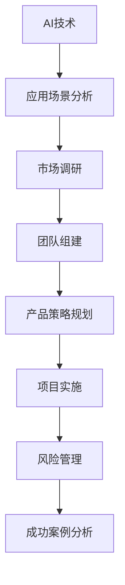

接下来，我们将详细探讨每个章节的内容。让我们一步一步地深入分析AI创业的各个方面，为创业者提供有价值的见解和建议。 <|endoftext|>

### 第1章：人工智能概述

#### 1.1 AI的概念与分类

**人工智能（Artificial Intelligence，简称AI）** 是指模拟、延伸和扩展人的智能的理论、方法、技术及应用。它是一门研究如何使计算机系统具备智能行为的科学。人工智能可以分为多个不同的类别，根据其实现的方式和应用领域，可以分为以下几类：

1. **基于规则的系统**：这类系统通过编写明确的规则来模拟人类的决策过程。它们在医疗诊断、法律咨询等领域有广泛的应用。

2. **基于知识的系统**：这类系统通过存储和利用知识库来解决问题。它们在自然语言处理、专家系统等领域有重要应用。

3. **基于学习的系统**：这类系统通过学习从数据中提取模式和知识。它们在机器学习、深度学习等领域有着广泛的应用。

4. **基于进化的系统**：这类系统通过模拟生物进化过程来优化解决方案。它们在优化问题、设计问题等领域有重要应用。

**核心概念与联系**

为了更好地理解AI的分类，我们可以使用Mermaid流程图来展示AI核心概念的相互关系：

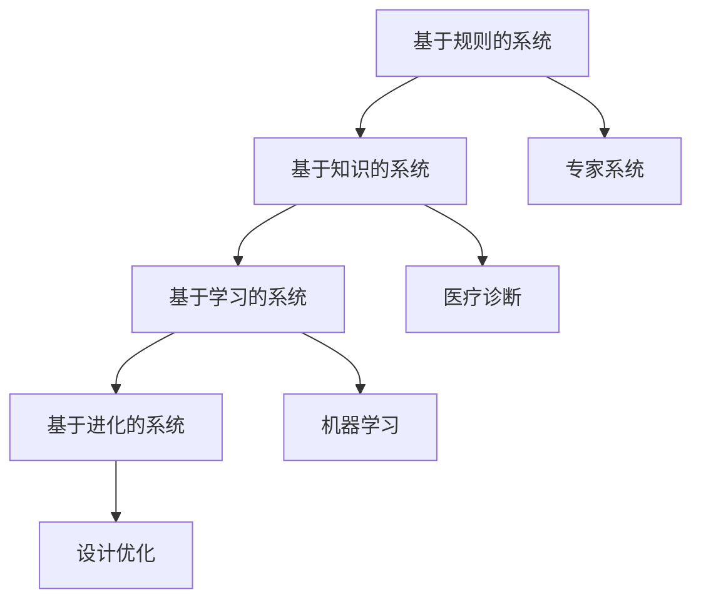

#### 1.2 AI的发展历程

人工智能的发展历程可以追溯到20世纪50年代。以下是几个关键事件：

1. **1956年**：达特茅斯会议，人工智能首次被提出。

2. **1958年**：约翰·麦卡锡提出Lisp语言，标志着人工智能在软件工具方面的进步。

3. **1970年代**：专家系统（如Dendral和MYCIN）的出现，标志着人工智能在特定领域的成功应用。

4. **1980年代**：机器学习开始受到关注，如支持向量机（SVM）和决策树的出现。

5. **1990年代**：深度学习开始兴起，如反向传播算法的提出。

6. **2000年代**：大数据和云计算的兴起，使得机器学习算法能够处理大规模数据，AI应用开始广泛普及。

7. **2010年代**：深度学习在图像识别、语音识别等领域取得了突破性进展，如Google的AlphaGo在围棋比赛中战胜人类。

**核心算法原理讲解**

为了更好地理解AI的发展历程，我们可以使用伪代码来详细阐述深度学习的基本原理：

```python
# 深度学习基本原理伪代码

# 初始化权重和偏置
weights = initialize_weights()
biases = initialize_biases()

# 前向传播
outputs = []
for layer in layers:
    z = np.dot(layer_inputs, weights) + biases
    outputs.append(activation(z))

# 计算损失
loss = compute_loss(outputs, true_values)

# 反向传播
deltas = []
for layer in reversed(layers):
    delta = compute_delta(layer, outputs, true_values)
    deltas.append(delta)

# 更新权重和偏置
weights -= learning_rate * gradients(weights)
biases -= learning_rate * gradients(biases)
```

#### 1.3 AI的关键技术

**机器学习** 是人工智能的核心技术之一，它通过从数据中学习规律和模式来实现智能。机器学习可以分为监督学习、无监督学习和强化学习三种类型。

- **监督学习**：输入和输出都是已知的，目标是找到一个函数来预测新的输入。常见的算法有线性回归、逻辑回归、决策树和随机森林等。

- **无监督学习**：输入是未标注的，目标是发现数据中的结构和模式。常见的算法有聚类、降维和关联规则学习等。

- **强化学习**：通过试错和反馈来学习最优策略。常见的算法有Q-learning和深度Q网络（DQN）等。

**深度学习** 是机器学习的一个分支，它通过构建多层神经网络来模拟人类大脑的学习过程。深度学习在图像识别、语音识别、自然语言处理等领域有着广泛的应用。

- **卷积神经网络（CNN）**：适用于处理图像数据，通过卷积层、池化层和全连接层的组合来实现图像分类、目标检测等功能。

- **循环神经网络（RNN）**：适用于处理序列数据，通过隐藏状态的循环来捕捉序列中的长期依赖关系。常见的RNN模型有LSTM和GRU。

- **生成对抗网络（GAN）**：由生成器和判别器组成，通过对抗训练来生成高质量的数据。GAN在图像生成、图像修复和视频生成等领域有重要应用。

**核心概念与联系**

为了更好地理解AI的关键技术，我们可以使用Mermaid流程图来展示这些技术之间的相互关系：

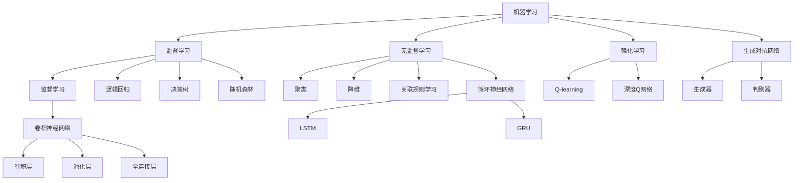

通过上述分析，我们可以看到人工智能的发展历程和核心技术之间的紧密联系。人工智能从最初的基于规则的系统发展到现在的深度学习，经历了多个阶段的技术变革。每一个阶段的核心算法和技术都为人工智能的应用提供了强大的支持，使得人工智能在各个领域取得了显著的成果。

在接下来的章节中，我们将进一步探讨AI产业的发展环境、AI技术在各个行业的应用场景，以及AI创业的策略和实践。希望读者能够通过本文的阅读，对人工智能创业有更深入的理解，抓住AI风口的机遇。 <|endoftext|>

### 第2章：AI产业环境分析

#### 2.1 全球AI产业发展趋势

人工智能（AI）作为当前科技领域的前沿，已经成为全球各国争夺的焦点。随着技术的不断进步和应用场景的拓展，全球AI产业呈现出快速发展的态势。

**主要国家与地区的AI发展状况**

1. **美国**：作为AI技术的发源地，美国在AI领域拥有强大的研究实力和商业应用能力。谷歌、微软、IBM等科技巨头在AI技术研发和应用方面处于领先地位。美国政府也通过多项政策支持AI产业发展，如《美国国家人工智能战略》。

2. **欧盟**：欧盟在AI研究方面具有较强的实力，特别是在伦理和法律方面有独特的优势。欧盟委员会发布了《人工智能伦理指南》，旨在推动AI技术的健康、可持续发展。

3. **中国**：中国政府对AI产业发展高度重视，将AI列为国家战略。中国在AI技术研发和应用方面取得了显著进展，尤其在深度学习、自动驾驶和智能家居等领域。中国科技企业如百度、阿里巴巴和腾讯在AI领域也具有强大的影响力。

4. **日本**：日本在机器人技术和工业AI应用方面具有领先地位。日本政府提出“机器人革命”计划，旨在通过AI技术提升国家的生产力和竞争力。

**全球AI产业发展挑战与机遇**

**挑战：**

1. **技术挑战**：AI技术的发展面临着算法优化、数据隐私和安全、硬件性能提升等挑战。

2. **伦理挑战**：AI技术的发展引发了关于伦理、隐私、就业等方面的争议，如何平衡技术进步和社会利益成为重要议题。

3. **国际合作与竞争**：全球各国在AI领域展开激烈竞争，同时需要加强国际合作，共同应对全球性问题。

**机遇：**

1. **经济增长**：AI技术为各行业带来创新和升级，有助于提升生产效率，推动经济增长。

2. **产业升级**：AI技术在制造业、医疗、金融等领域的应用，有助于实现产业智能化升级。

3. **创新生态**：AI产业的发展带动了相关产业链的繁荣，为创业者提供了广阔的舞台。

#### 2.2 我国AI产业发展现状

**我国AI产业的政策环境**

我国政府高度重视AI产业发展，制定了一系列政策措施，为AI技术的研究和应用提供有力支持。以下是我国AI产业政策环境的几个关键点：

1. **《新一代人工智能发展规划》**：2017年，国务院发布《新一代人工智能发展规划》，明确了我国AI产业发展的目标和任务。

2. **“互联网+”行动**：通过“互联网+”行动，推动AI技术与传统产业的融合，促进产业升级。

3. **创新驱动发展战略**：鼓励科技创新，提升我国在AI领域的国际竞争力。

**我国AI产业的主要成就与挑战**

**成就：**

1. **技术研发**：我国在深度学习、自然语言处理、计算机视觉等AI关键技术方面取得了重要突破。

2. **应用推广**：AI技术在金融、医疗、教育、交通等领域的应用不断拓展，为产业发展提供了强大动力。

3. **产业生态**：我国AI产业已形成较为完善的产业链，包括硬件、软件、平台和应用等各个环节。

**挑战：**

1. **技术瓶颈**：部分关键核心技术仍依赖进口，如高性能芯片、专用算法等。

2. **人才短缺**：我国AI产业对人才的需求巨大，但当前人才储备尚不足以满足产业发展需求。

3. **数据资源**：高质量、大规模的数据资源是AI技术发展的重要基础，我国在数据资源方面仍存在一定不足。

#### 2.3 AI行业市场规模与增长预测

**全球AI行业市场规模**

根据相关市场研究报告，全球AI行业市场规模预计将在未来几年内持续增长。以下是对全球AI行业市场规模的分析：

1. **市场规模**：2020年，全球AI行业市场规模约为3700亿美元，预计到2025年将达到1.2万亿美元。

2. **增长趋势**：AI技术的不断进步和应用场景的拓展，推动全球AI市场规模持续增长。

3. **区域分布**：北美地区是全球AI市场的主要驱动力，欧洲和亚洲市场也表现出较强的增长潜力。

**我国AI行业市场规模与增长预测**

我国AI行业市场规模同样呈现出快速增长的态势。以下是我国AI行业市场规模与增长预测的分析：

1. **市场规模**：2020年，我国AI行业市场规模约为1500亿元人民币，预计到2025年将达到1.5万亿元人民币。

2. **增长趋势**：我国AI行业市场规模增长迅速，主要得益于政策支持、技术进步和应用场景的拓展。

3. **区域分布**：我国AI市场主要分布在东部沿海地区，如北京、上海、广东等地。

**核心概念与联系**

为了更好地理解全球AI产业发展趋势、我国AI产业发展现状和市场规模，我们可以使用Mermaid流程图来展示这些概念之间的相互关系：

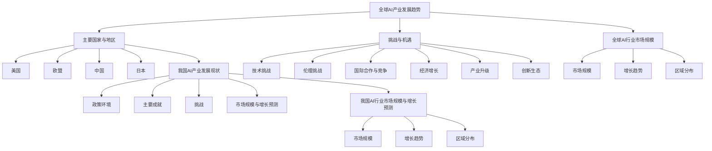

通过上述分析，我们可以看到全球AI产业和我国AI产业在市场规模、增长趋势和区域分布方面都表现出强烈的关联性。全球AI产业的快速发展为我国AI产业提供了广阔的发展空间，同时也带来了挑战。我国政府和企业需要抓住这一机遇，加强技术创新、人才培养和产业生态建设，推动我国AI产业实现高质量发展。

在接下来的章节中，我们将进一步探讨AI技术在各个行业的应用场景，以及AI创业的策略和实践。希望读者能够通过本文的阅读，对AI产业的发展环境有更深入的理解，为抓住AI风口的机遇做好准备。 <|endoftext|>

### 第3章：AI在行业中的应用场景

人工智能（AI）技术正在各行各业中发挥越来越重要的作用，推动着产业升级和创新发展。本章节将详细探讨AI技术在金融、零售、医疗保健和教育等领域的应用场景，为创业者提供有价值的参考。

#### 3.1 金融领域的AI应用

**人工智能在金融风险管理中的应用**

金融风险管理是金融机构的核心任务之一，AI技术的引入为金融风险管理带来了新的工具和方法。

1. **信用评分**：AI技术可以基于用户的消费记录、信用历史等多维数据，进行信用评分，提高信用评估的准确性。

2. **欺诈检测**：AI技术通过分析交易行为、用户习惯等数据，实时检测并识别潜在的欺诈行为，降低金融风险。

3. **市场预测**：AI技术可以通过对历史数据的分析，预测市场走势，为投资决策提供依据。

**人工智能在金融产品创新中的应用**

AI技术在金融产品创新方面也发挥着重要作用，为金融机构提供了新的业务模式。

1. **个性化理财产品**：AI技术可以根据用户的财务状况、投资偏好等数据，为用户提供个性化的理财产品推荐。

2. **智能投顾**：AI技术可以通过分析市场数据、用户投资偏好等，提供智能化的投资建议，降低投资风险。

3. **自动化交易**：AI技术可以实现自动化交易，根据市场变化实时调整投资策略，提高交易效率。

#### 3.2 零售业的AI应用

**人工智能在零售业销售预测中的应用**

零售业是一个数据密集型行业，AI技术可以帮助零售企业更准确地预测销售情况，优化库存管理。

1. **销售预测**：AI技术可以通过分析历史销售数据、季节性因素等，预测未来的销售趋势，为企业制定库存计划提供依据。

2. **需求预测**：AI技术可以帮助企业预测市场需求，调整产品策略，提高市场竞争力。

3. **库存管理**：AI技术可以通过分析库存数据、销售预测等，实现智能化的库存管理，降低库存成本。

**人工智能在零售业个性化推荐中的应用**

AI技术在零售业个性化推荐方面也具有显著优势。

1. **个性化推荐**：AI技术可以根据用户的购买历史、浏览记录等，为用户推荐个性化的商品，提高用户体验。

2. **智能客服**：AI技术可以实现智能客服，通过自然语言处理技术，快速响应用户的问题，提高客户满意度。

3. **虚拟试衣**：AI技术可以通过计算机视觉技术，实现虚拟试衣功能，帮助用户更好地选择服装。

#### 3.3 医疗保健领域的AI应用

**人工智能在疾病诊断中的应用**

AI技术在医疗保健领域的疾病诊断中发挥着重要作用。

1. **影像诊断**：AI技术可以通过分析医学影像，如X光片、CT扫描等，辅助医生进行疾病诊断。

2. **基因分析**：AI技术可以分析基因数据，预测患病风险，为个性化医疗提供支持。

3. **疾病预测**：AI技术可以通过分析患者病史、生活习惯等数据，预测疾病的发展趋势，帮助医生制定治疗方案。

**人工智能在药物研发中的应用**

AI技术在药物研发中也具有显著优势。

1. **新药发现**：AI技术可以通过分析大量生物数据，筛选潜在的药物靶点，加速新药研发。

2. **药物合成**：AI技术可以通过自动化合成路线的设计，优化药物合成过程，提高研发效率。

3. **临床试验**：AI技术可以通过分析临床试验数据，评估药物的有效性和安全性，为临床试验提供支持。

#### 3.4 教育行业的AI应用

**人工智能在教育个性化教学中的应用**

AI技术可以帮助实现个性化教学，提高教育质量。

1. **个性化学习路径**：AI技术可以根据学生的学习习惯、成绩等数据，为学生推荐个性化的学习内容和学习路径。

2. **智能辅导**：AI技术可以通过自然语言处理技术，实现智能辅导功能，为学生解答问题，提供学习建议。

3. **自适应学习**：AI技术可以根据学生的学习进度、掌握情况等，动态调整教学内容和难度，实现自适应学习。

**人工智能在教育评估中的应用**

AI技术也可以在教育评估中发挥重要作用。

1. **自动化评分**：AI技术可以通过自然语言处理技术，实现自动化评分，提高评卷效率。

2. **学习分析**：AI技术可以通过分析学生的学习数据，评估学生的学习效果，为教师提供反馈。

3. **考试预测**：AI技术可以通过分析历史考试数据，预测学生的考试成绩，帮助教师调整教学策略。

**核心概念与联系**

为了更好地理解AI在各个行业中的应用场景，我们可以使用Mermaid流程图来展示这些应用场景之间的相互关系：

```mermaid
graph TD
    A[金融领域] --> B[风险管理]
    B --> C[信用评分]
    B --> D[欺诈检测]
    B --> E[市场预测]
    A --> F[产品创新]
    F --> G[个性化理财产品]
    F --> H[智能投顾]
    F --> I[自动化交易]
    B[风险管理] --> J[数据挖掘]
    B --> K[机器学习]
    B --> L[数据可视化]
    A[金融领域] --> M[零售业]
    M --> N[销售预测]
    M --> O[需求预测]
    M --> P[库存管理]
    M --> Q[个性化推荐]
    M --> R[智能客服]
    M --> S[虚拟试衣]
    M --> T[用户行为分析]
    M --> U[数据分析]
    M --> V[数据挖掘]
    M --> W[机器学习]
    M --> X[自然语言处理]
    M --> Y[计算机视觉]
    N[销售预测] --> Z[时间序列分析]
    N --> AA[回归分析]
    N --> BB[聚类分析]
    N --> CC[神经网络]
    O[需求预测] --> DD[回归分析]
    O --> EE[神经网络]
    O --> FF[决策树]
    O --> GG[随机森林]
    P[库存管理] --> HH[优化算法]
    P --> II[机器学习]
    P --> JJ[深度学习]
    P --> KK[仿真分析]
    A[金融领域] --> LL[医疗保健]
    LL --> MM[影像诊断]
    LL --> NN[基因分析]
    LL --> OO[疾病预测]
    LL --> PP[新药发现]
    LL --> QQ[药物合成]
    LL --> RR[临床试验]
    MM[影像诊断] --> SS[深度学习]
    MM --> TT[计算机视觉]
    MM --> UU[自然语言处理]
    NN[基因分析] --> VV[机器学习]
    NN --> WW[深度学习]
    NN --> XX[生物信息学]
    OO[疾病预测] --> YY[时间序列分析]
    OO --> ZZ[回归分析]
    OO --> AA[神经网络]
    PP[新药发现] --> BB[机器学习]
    PP --> CC[深度学习]
    PP --> DD[药物化学]
    PP --> EE[生物信息学]
    QQ[药物合成] --> FF[优化算法]
    QQ --> GG[机器学习]
    QQ --> HH[深度学习]
    QQ --> II[仿真分析]
    LL[医疗保健] --> JJ[教育行业]
    JJ --> KK[个性化教学]
    JJ --> LL[智能辅导]
    JJ --> MM[自适应学习]
    JJ --> NN[考试预测]
    KK[个性化教学] --> OO[数据挖掘]
    KK --> PP[机器学习]
    KK --> QQ[自然语言处理]
    KK --> RR[推荐系统]
    LL[智能辅导] --> SS[自然语言处理]
    LL --> TT[计算机视觉]
    LL --> UU[语音识别]
    MM[自适应学习] --> VV[优化算法]
    MM --> WW[机器学习]
    MM --> XX[深度学习]
    NN[考试预测] --> YY[回归分析]
    NN --> ZZ[神经网络]
    NN --> AA[决策树]
```

通过上述分析，我们可以看到AI技术在各个行业中的应用场景和核心技术的紧密联系。AI技术的广泛应用不仅为各行业带来了创新和升级，也为创业者提供了丰富的商业机会。在接下来的章节中，我们将进一步探讨AI创业的策略与实践，帮助创业者抓住AI风口的机遇。 <|endoftext|>

### 第4章：AI创业策略与团队构建

#### 4.1 AI创业的可行性分析

AI创业的可行性分析是创业过程中至关重要的一环。创业者需要从市场需求、技术可行性、资金需求和团队建设等多个方面进行全面评估，以确保项目的成功。

**市场需求分析**

1. **市场调研**：创业者需要深入了解目标市场，包括市场规模、增长速度、竞争格局等。通过市场调研，创业者可以确定产品的潜在客户群体，并评估市场需求。

2. **用户需求**：创业者需要通过用户访谈、问卷调查等方式，了解用户对AI产品的需求、痛点以及期望。这有助于创业者确定产品的功能和特性，满足用户需求。

3. **竞争分析**：创业者需要分析竞争对手的产品、市场份额、竞争优势等。通过竞争分析，创业者可以找到市场机会，制定差异化的产品策略。

**技术可行性分析**

1. **技术储备**：创业者需要评估自身在AI领域的技术储备，包括核心技术、技术团队的能力等。如果技术储备不足，创业者需要考虑通过外部合作或引进技术来解决。

2. **研发计划**：创业者需要制定详细的研发计划，包括技术路线、开发周期、关键节点等。这有助于确保项目在技术上的可行性。

3. **技术风险**：创业者需要评估项目在技术实现过程中可能遇到的风险，如算法优化、数据获取、硬件支持等。通过风险评估，创业者可以提前制定应对策略。

**资金需求分析**

1. **启动资金**：创业者需要评估项目的启动资金需求，包括研发成本、运营成本、市场推广费用等。这有助于确定项目的资金筹措计划。

2. **融资策略**：创业者需要制定融资策略，包括选择合适的融资渠道、制定融资计划等。创业者可以通过天使投资、风险投资、政府补贴等多种途径获得资金支持。

3. **资金管理**：创业者需要建立良好的资金管理体系，确保资金的有效使用和合理分配。这有助于项目的顺利进行和可持续发展。

**团队构建与管理**

1. **核心团队**：创业者需要组建一支具备核心竞争力的团队，包括技术、产品、市场、运营等各个方面的专业人才。核心团队的成员需要具备共同的目标和价值观，形成良好的团队协作。

2. **团队管理**：创业者需要建立有效的团队管理制度，包括明确的职责分工、良好的沟通机制、科学的绩效评估等。这有助于提高团队的工作效率和创新能力。

3. **人才引进**：创业者需要注重人才引进，通过招聘、内部推荐等方式，吸引优秀人才加入团队。同时，创业者需要建立人才激励机制，激发员工的积极性和创造力。

#### 4.2 AI创业团队的组建与管理

AI创业团队的组建和管理是项目成功的关键。一个高效的AI创业团队需要具备以下特点：

1. **技术实力**：团队成员需要在AI领域具备深厚的技术实力，包括机器学习、深度学习、自然语言处理等。技术实力的强弱直接影响到项目的研发进度和产品质量。

2. **创新能力**：团队成员需要具备较强的创新能力，能够不断探索新的技术方向和应用场景，推动项目的持续创新和发展。

3. **协作精神**：团队成员需要具备良好的协作精神，能够共同面对挑战，协同完成项目任务。协作精神的强弱直接影响到团队的凝聚力和工作效率。

**团队管理方法**

1. **目标导向**：团队管理应以目标为导向，明确团队的目标和任务，制定详细的计划和时间表，确保团队成员明确工作方向和职责。

2. **绩效评估**：团队管理应建立科学的绩效评估体系，对团队成员的工作绩效进行评估，激励优秀人才，同时纠正不足。

3. **沟通与协作**：团队管理应建立良好的沟通机制，确保团队成员之间的信息畅通，加强协作，提高工作效率。

4. **培训与发展**：团队管理应注重团队成员的培训与发展，提高团队成员的专业技能和综合素质，为团队的长期发展奠定基础。

**核心概念与联系**

为了更好地理解AI创业团队的组建与管理，我们可以使用Mermaid流程图来展示团队组建和管理的关键环节：

```mermaid
graph TD
    A[市场需求分析] --> B[市场调研]
    B --> C[用户需求]
    B --> D[竞争分析]
    A --> E[技术可行性分析]
    E --> F[技术储备]
    E --> G[研发计划]
    E --> H[技术风险]
    A --> I[资金需求分析]
    I --> J[启动资金]
    I --> K[融资策略]
    I --> L[资金管理]
    A --> M[团队构建与管理]
    M --> N[核心团队]
    M --> O[团队管理]
    M --> P[人才引进]
    M --> Q[目标导向]
    M --> R[绩效评估]
    M --> S[沟通与协作]
    M --> T[培训与发展]
    M --> U[技术实力]
    M --> V[创新能力]
    M --> W[协作精神]
    N[核心团队] --> X[技术]
    X --> Y[机器学习]
    X --> Z[深度学习]
    X --> AA[自然语言处理]
    N[核心团队] --> BB[产品]
    BB --> CC[市场]
    BB --> DD[用户体验]
    N[核心团队] --> EE[运营]
    EE --> FF[数据分析]
    EE --> GG[项目管理]
    N[核心团队] --> HH[市场]
    HH --> II[营销]
    HH --> JJ[客户关系]
    N[核心团队] --> KK[财务]
    KK --> LL[预算]
    KK --> MM[投资]
    M[团队管理] --> NN[目标导向]
    NN --> OO[任务分配]
    NN --> PP[进度跟踪]
    M[团队管理] --> QQ[绩效评估]
    QQ --> RR[指标设定]
    QQ --> SS[奖励机制]
    M[团队管理] --> TT[沟通与协作]
    TT --> UU[会议]
    TT --> VW[邮件]
    TT --> XX[即时通讯]
    M[团队管理] --> YY[培训与发展]
    YY --> ZZ[技能培训]
    YY --> AA[职业发展]
    U[技术实力] --> BB[科研能力]
    BB --> CC[算法开发]
    BB --> DD[数据处理]
    V[创新能力] --> EE[创新思维]
    EE --> FF[新应用探索]
    EE --> GG[产品迭代]
    W[协作精神] --> HH[团队合作]
    HH --> II[知识共享]
    HH --> JJ[冲突解决]
```

通过上述分析，我们可以看到AI创业团队的组建与管理是一个复杂而系统的过程，涉及到市场需求分析、技术可行性分析、资金需求分析、团队构建与管理等多个方面。创业者需要全面考虑这些因素，制定科学的创业策略，组建高效的团队，确保项目的成功。

在接下来的章节中，我们将进一步探讨AI创业项目的实践和风险管理，帮助创业者更好地实施和推进AI项目。希望读者能够通过本文的阅读，对AI创业的策略与团队构建有更深入的理解，为抓住AI风口的机遇做好准备。 <|endoftext|>

### 第5章：AI创业项目实践

#### 5.1 AI创业项目规划

AI创业项目的规划是确保项目顺利推进和实现预期目标的关键环节。一个成功的AI创业项目规划需要从项目目标、资源分配、时间节点等方面进行详细规划。

**项目目标**

项目目标是项目的核心，是项目规划和实施的指导原则。在制定项目目标时，创业者需要明确项目的商业价值和社会影响。具体步骤如下：

1. **确定业务目标**：创业者需要根据市场需求，确定项目的商业目标，如市场规模、用户增长、盈利能力等。

2. **确定技术目标**：创业者需要根据技术发展方向和团队技术实力，确定项目的技术目标，如算法优化、系统稳定性、扩展性等。

3. **确定社会责任目标**：创业者需要考虑项目对社会的影响，如环保、公平性、透明性等。

**资源分配**

资源分配是确保项目顺利推进的重要保障。创业者需要合理分配人力、物力、财力等资源。具体步骤如下：

1. **人力资源分配**：创业者需要根据项目需求，确定所需的专业人才，如算法工程师、数据工程师、产品经理、市场营销人员等。同时，要考虑团队的专业技能和协作能力。

2. **资金资源分配**：创业者需要根据项目预算，合理安排资金使用，包括研发资金、运营资金、市场推广资金等。同时，要考虑融资策略和资金使用效率。

3. **技术资源分配**：创业者需要根据项目需求，确定所需的技术资源，如计算资源、存储资源、网络资源等。同时，要考虑技术资源的可用性和可持续性。

**时间节点**

时间节点是确保项目按计划推进的关键。创业者需要制定详细的时间节点计划，包括项目启动、研发、测试、上线等关键阶段。具体步骤如下：

1. **项目启动**：确定项目启动时间，明确项目组人员、资源准备、项目管理流程等。

2. **研发阶段**：根据项目需求，制定研发计划，包括算法开发、系统设计、代码实现等。设定研发里程碑，确保项目进度。

3. **测试阶段**：在研发完成后，进行系统测试，包括功能测试、性能测试、安全测试等。确保项目质量。

4. **上线阶段**：在测试通过后，进行项目上线，包括部署、上线培训、用户反馈等。确保项目顺利上线。

**核心概念与联系**

为了更好地理解AI创业项目规划，我们可以使用Mermaid流程图来展示项目规划的关键环节：

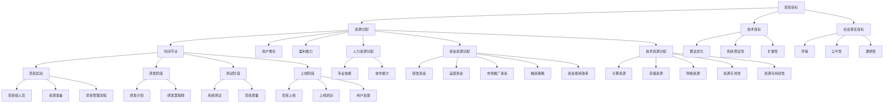

通过上述分析，我们可以看到AI创业项目规划是一个系统性的过程，涉及到项目目标、资源分配、时间节点等多个方面。创业者需要全面考虑这些因素，制定科学的规划，为项目的成功奠定基础。

在接下来的章节中，我们将进一步探讨AI创业项目的实施和风险管理，帮助创业者更好地推进项目。希望读者能够通过本文的阅读，对AI创业项目实践有更深入的理解。 <|endoftext|>

### 5.2 AI创业项目实施

AI创业项目的实施是将规划转化为实际成果的关键环节。一个成功的AI创业项目实施需要科学的项目管理方法和有效的团队协作。

**项目管理流程**

1. **项目启动**：在项目启动阶段，明确项目目标、范围、资源需求，组建项目团队，制定项目管理计划。项目经理需要与团队成员进行沟通，确保大家了解项目目标和任务。

2. **需求分析**：在需求分析阶段，项目经理需要与客户、产品经理、技术团队等各方进行沟通，明确项目的具体需求。需求分析的结果将作为后续设计和开发的基础。

3. **设计阶段**：在设计阶段，技术团队需要根据需求分析的结果，进行系统设计、算法设计等。设计阶段的结果需要经过团队评审，确保设计方案的可实施性。

4. **开发阶段**：在开发阶段，技术团队根据设计方案进行编码和调试。项目经理需要监控开发进度，确保按时完成任务。同时，需要定期进行代码评审，保证代码质量。

5. **测试阶段**：在测试阶段，测试团队进行系统测试、性能测试、安全测试等。测试的结果将反馈给开发团队进行修复和优化。项目经理需要确保测试覆盖全面，确保项目质量。

6. **上线阶段**：在上线阶段，项目团队需要进行上线前的准备工作，包括部署、培训、上线测试等。项目经理需要确保上线过程顺利进行，并随时应对可能出现的突发问题。

**团队协作方法**

1. **敏捷开发**：敏捷开发是一种以人为核心、迭代、渐进的方法，适合快速变化的AI创业项目。敏捷开发强调团队协作、快速迭代和持续交付。

2. **Scrum框架**：Scrum是一种敏捷开发方法，它通过短周期（Sprint）进行项目迭代，确保项目持续交付和不断改进。

3. **任务管理工具**：使用任务管理工具（如JIRA、Trello等）可以帮助团队明确任务、跟踪进度、管理资源。任务管理工具可以提高团队的协作效率和项目管理水平。

**核心概念与联系**

为了更好地理解AI创业项目实施，我们可以使用Mermaid流程图来展示项目管理流程和团队协作方法：

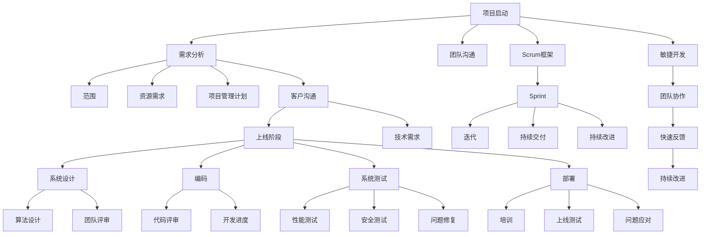

通过上述分析，我们可以看到AI创业项目实施是一个复杂而系统的过程，涉及到项目管理流程、团队协作方法等多个方面。创业者需要熟练掌握项目管理方法和团队协作技巧，确保项目顺利推进和成功交付。

在接下来的章节中，我们将进一步探讨AI创业项目中的风险管理，帮助创业者更好地应对项目实施中的各种挑战。希望读者能够通过本文的阅读，对AI创业项目实施有更深入的理解。 <|endoftext|>

### 5.3 AI创业项目风险管理

AI创业项目在实施过程中，面临着诸多风险，包括技术风险、市场风险、法律风险和运营风险等。有效识别、评估和管理这些风险，是确保项目成功的关键。

**技术风险**

技术风险是指在项目实施过程中，由于技术问题导致项目进度延误、质量不达标或失败的风险。技术风险主要包括：

1. **算法风险**：算法是实现AI技术核心功能的基础，如果算法设计不当或实现有问题，可能导致项目无法达到预期效果。

   **风险管理策略**：创业者需要在项目初期进行充分的算法研究和验证，确保算法的可行性和有效性。

2. **数据处理风险**：AI项目往往依赖于大量的数据，如果数据质量不高、数据量不足或数据隐私问题，可能导致项目无法正常进行。

   **风险管理策略**：创业者需要建立完善的数据采集、处理和存储机制，确保数据的质量和安全性。

3. **硬件和软件风险**：AI项目需要强大的计算和存储能力，硬件和软件故障可能导致项目中断。

   **风险管理策略**：创业者应选择可靠的硬件和软件供应商，建立备份和故障恢复机制。

**市场风险**

市场风险是指由于市场环境变化导致项目无法实现预期市场收益的风险。市场风险主要包括：

1. **市场需求变化**：市场需求的变化可能导致项目的市场前景发生变化。

   **风险管理策略**：创业者需要持续关注市场动态，及时调整项目策略。

2. **竞争风险**：竞争对手的崛起或现有竞争对手的反击可能对项目造成威胁。

   **风险管理策略**：创业者需要通过差异化竞争策略，提升项目的竞争力。

3. **政策和法规风险**：政策和法规的变化可能对项目产生不利影响。

   **风险管理策略**：创业者需要密切关注政策法规的变化，提前做好应对措施。

**法律风险**

法律风险是指由于法律问题导致项目面临法律纠纷或损失的风险。法律风险主要包括：

1. **知识产权风险**：知识产权问题可能导致项目面临侵权诉讼或损失。

   **风险管理策略**：创业者需要建立知识产权保护机制，确保项目的知识产权安全。

2. **合同风险**：合同纠纷可能导致项目停滞或损失。

   **风险管理策略**：创业者需要制定严格的合同管理制度，确保合同条款的合法性和合理性。

**运营风险**

运营风险是指由于管理问题导致项目运营不顺利的风险。运营风险主要包括：

1. **团队管理风险**：团队管理不善可能导致项目进度延误、质量不达标。

   **风险管理策略**：创业者需要建立有效的团队管理制度，确保团队的高效协作。

2. **资金风险**：资金不足可能导致项目无法持续进行。

   **风险管理策略**：创业者需要制定详细的资金使用计划，确保项目的资金需求得到满足。

3. **供应链风险**：供应链问题可能导致项目材料或设备供应不及时。

   **风险管理策略**：创业者需要建立稳定的供应链体系，确保供应链的稳定性和可靠性。

**核心概念与联系**

为了更好地理解AI创业项目中的风险，我们可以使用Mermaid流程图来展示各种风险及其管理策略：

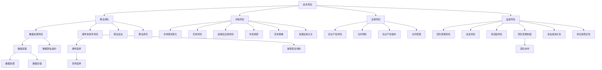

通过上述分析，我们可以看到AI创业项目中的风险种类繁多，涉及到技术、市场、法律和运营等多个方面。创业者需要全面识别和评估这些风险，并采取有效的风险管理策略，确保项目的成功。

在接下来的章节中，我们将进一步探讨AI创业的案例解析，帮助创业者从成功和失败中吸取经验教训。希望读者能够通过本文的阅读，对AI创业项目风险管理有更深入的理解，为项目的顺利推进提供有力支持。 <|endoftext|>

### 第6章：AI创业案例解析

#### 6.1 成功AI创业案例分析

成功AI创业案例能够为其他创业者提供宝贵的经验教训。以下是一个成功的AI创业案例分析。

**案例：OpenAI**

**公司简介**：OpenAI是一家全球领先的AI研究公司，成立于2015年，其宗旨是实现安全的通用人工智能（AGI），使人类生活更美好。

**业务领域**：OpenAI主要致力于深度学习、自然语言处理、计算机视觉等AI技术的研发和应用。

**成功因素**：

1. **强大的技术团队**：OpenAI聚集了一批顶尖的AI研究人员，包括多位诺贝尔奖得主和图灵奖得主。

2. **开放合作**：OpenAI采用开放合作模式，与全球多家知名企业和研究机构合作，共同推动AI技术的发展。

3. **创新的商业模式**：OpenAI通过提供高质量的AI技术服务和开放平台，吸引了大量用户和合作伙伴。

**启示**：

1. **人才是关键**：创业者需要组建一支具备强大技术实力的团队，这是项目成功的基础。

2. **开放合作**：创业者应积极寻求与同行和其他行业的合作，共同推动技术的进步和应用。

3. **创新的商业模式**：创业者需要探索创新的商业模式，以实现技术和商业价值的最大化。

#### 6.2 失败AI创业案例分析

失败AI创业案例能够帮助创业者避免重复相同的错误。以下是一个失败的AI创业案例分析。

**案例：Deep NLP**

**公司简介**：Deep NLP是一家专注于自然语言处理（NLP）技术的初创公司，成立于2016年。

**业务领域**：Deep NLP主要致力于开发基于深度学习的NLP工具和平台。

**失败原因**：

1. **市场定位不准确**：Deep NLP在市场定位方面存在偏差，未能准确把握市场需求。

2. **技术问题**：Deep NLP在技术研发过程中遇到了重大问题，导致产品无法按时交付。

3. **资金短缺**：由于资金短缺，Deep NLP在技术研发和市场营销方面无法投入足够的资源。

**启示**：

1. **准确的市场定位**：创业者需要对市场进行充分调研，准确把握市场需求，制定合适的市场策略。

2. **技术研发的重要性**：创业者应重视技术研发，确保产品技术的先进性和可靠性。

3. **资金管理**：创业者需要制定详细的资金使用计划，确保项目的可持续发展。

#### 6.3 AI创业关键要素总结

通过对成功和失败AI创业案例的分析，我们可以总结出以下关键要素：

1. **技术实力**：技术是AI创业的核心，创业者需要组建一支强大的技术团队，确保技术的先进性和可靠性。

2. **市场定位**：准确的市场定位是项目成功的关键，创业者需要对市场进行深入调研，制定合适的市场策略。

3. **资金管理**：合理的资金管理是项目顺利推进的保障，创业者需要制定详细的资金使用计划，确保项目的可持续发展。

4. **团队协作**：高效的团队协作是项目成功的重要保障，创业者需要建立良好的团队管理制度，确保团队的高效协作。

5. **创新意识**：创新是推动项目发展的动力，创业者需要具备强烈的创新意识，不断探索新的技术方向和应用场景。

6. **风险管理**：有效的风险管理是项目成功的重要保障，创业者需要全面识别和评估风险，并采取有效的风险管理策略。

**核心概念与联系**

为了更好地理解AI创业的关键要素，我们可以使用Mermaid流程图来展示这些要素及其相互关系：

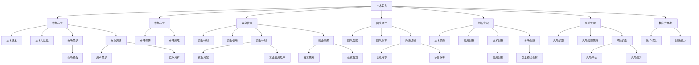

通过上述分析，我们可以看到AI创业的成功离不开技术实力、市场定位、资金管理、团队协作、创新意识和风险管理等多个关键要素。创业者需要在这些方面进行全面考虑和优化，以提高项目的成功率。

在接下来的章节中，我们将进一步探讨AI创业的法律与伦理问题，帮助创业者确保项目的合法性和道德性。希望读者能够通过本文的阅读，对AI创业的关键要素有更深入的理解，为抓住AI风口的机遇做好准备。 <|endoftext|>

### 第7章：AI创业的法律环境

#### 7.1 AI创业涉及的法律法规

随着人工智能技术的迅速发展，AI创业涉及的法律法规也日益增多。了解并遵循相关法律法规，对于AI创业企业来说至关重要。以下是一些关键法律法规及其对AI创业的影响：

**《中华人民共和国网络安全法》**

网络安全法是我国网络安全的基本法，对AI创业企业具有重大影响。该法规定了网络运营者的网络安全责任，包括数据安全、个人信息保护、网络安全监测与评估等。AI创业企业需要确保其数据处理和存储活动符合网络安全法的要求，以防范网络安全风险。

**《中华人民共和国数据安全法》**

数据安全法是我国针对数据安全保护的一部重要法律，对AI创业企业的数据处理活动提出了更高要求。该法规定了数据安全保护的基本原则和措施，包括数据安全风险评估、数据安全事件应对等。AI创业企业需要建立健全的数据安全管理体系，确保数据的安全性和完整性。

**《中华人民共和国个人信息保护法》**

个人信息保护法是我国针对个人信息保护的一部重要法律，对AI创业企业的数据处理活动具有直接约束力。该法规定了个人信息处理的基本原则、个人信息保护的责任等。AI创业企业需要严格遵循个人信息保护法的规定，确保用户个人信息的收集、存储、使用等活动合法、合规。

**《中华人民共和国专利法》**

专利法是我国知识产权保护的基本法，对AI创业企业的知识产权保护具有重要意义。AI创业企业需要加强专利意识，积极申请和保护自己的知识产权，防止技术被抄袭和侵权。

**《中华人民共和国商标法》**

商标法是我国商标保护的基本法，对AI创业企业的品牌保护具有重要作用。AI创业企业需要注册和保护自己的商标，防止商标被抢注和侵权。

**《中华人民共和国著作权法》**

著作权法是我国著作权保护的基本法，对AI创业企业的知识产权保护具有重要作用。AI创业企业需要尊重他人的著作权，避免侵犯他人的知识产权。

#### 7.2 AI创业的法律风险防范

了解相关法律法规后，AI创业企业需要采取有效措施防范法律风险，确保项目的合法性和合规性。以下是一些常见法律风险的防范措施：

**数据隐私风险防范**

1. **合法收集和使用数据**：AI创业企业在收集和使用用户数据时，需要确保数据收集合法、使用合理，遵循个人信息保护法的规定。

2. **数据安全保护**：AI创业企业需要建立健全的数据安全保护机制，确保数据在存储、传输、处理等过程中的安全性。

3. **用户隐私保护协议**：AI创业企业需要制定用户隐私保护协议，明确告知用户其数据的收集、使用、存储和处理方式，并征求用户同意。

**知识产权风险防范**

1. **专利申请和保护**：AI创业企业需要关注技术创新，及时申请专利，保护自己的知识产权。

2. **商标注册和保护**：AI创业企业需要注册和保护自己的商标，防止商标被抢注和侵权。

3. **著作权保护**：AI创业企业需要尊重他人的著作权，避免侵犯他人的知识产权。

**合同风险防范**

1. **合同审查**：AI创业企业在签订合同时，需要仔细审查合同条款，确保合同的合法性和合理性。

2. **合同管理**：AI创业企业需要建立完善的合同管理制度，确保合同的签订、履行、变更、解除等活动合法、合规。

3. **合同纠纷解决**：AI创业企业需要建立合同纠纷解决机制，及时解决合同纠纷，避免经济损失。

#### 7.3 AI创业中的知识产权保护

知识产权保护是AI创业企业成功发展的重要保障。以下是一些知识产权保护的策略：

**专利保护策略**

1. **专利布局**：AI创业企业需要进行专利布局，确定核心技术领域，提前申请相关专利。

2. **专利申请**：AI创业企业需要积极申请专利，保护自己的技术创新。

3. **专利运营**：AI创业企业可以通过专利许可、转让等方式，实现专利价值的最大化。

**商标保护策略**

1. **商标注册**：AI创业企业需要及时注册商标，保护品牌形象。

2. **商标监测**：AI创业企业需要建立商标监测机制，及时发现商标侵权行为。

3. **商标维权**：AI创业企业需要积极维权，维护自己的商标权益。

**著作权保护策略**

1. **作品登记**：AI创业企业需要进行作品登记，保护自己的原创作品。

2. **版权授权**：AI创业企业可以通过版权授权，实现作品的商业化应用。

3. **版权维权**：AI创业企业需要积极维权，防止作品被侵权。

**核心概念与联系**

为了更好地理解AI创业中的法律风险防范和知识产权保护，我们可以使用Mermaid流程图来展示这些概念及其相互关系：

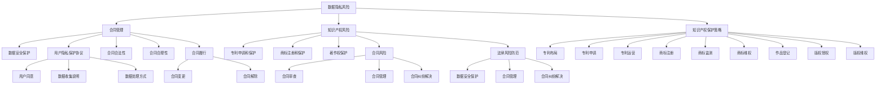

通过上述分析，我们可以看到AI创业中的法律风险防范和知识产权保护是一个复杂而系统的过程，涉及到数据隐私、知识产权、合同管理等多个方面。创业者需要全面识别和评估风险，并采取有效的防范和应对措施，确保项目的合法性和知识产权安全。

在接下来的章节中，我们将进一步探讨AI创业的伦理问题，帮助创业者确保项目的道德性。希望读者能够通过本文的阅读，对AI创业的法律环境有更深入的理解，为抓住AI风口的机遇做好准备。 <|endoftext|>

### 第8章：AI创业的伦理问题

#### 8.1 AI伦理问题概述

人工智能（AI）技术的快速发展在为人类社会带来巨大变革的同时，也引发了诸多伦理问题。AI伦理问题涉及隐私、公平性、透明性、安全性等多个方面，对于AI创业企业来说，关注和解决这些伦理问题至关重要。

**隐私问题**

隐私问题主要涉及个人数据的收集、存储、使用和共享。随着AI技术的发展，越来越多的个人数据被收集和存储，如何确保这些数据的安全性和隐私性成为重要议题。

**公平性问题**

公平性问题主要涉及AI系统在决策过程中的偏见和歧视。如果AI系统在训练数据中存在偏见，可能会导致不公平的决策，影响社会的公正性。

**透明性问题**

透明性问题主要涉及AI系统的决策过程是否可解释和可理解。当前，许多AI系统，特别是深度学习系统，其决策过程非常复杂，难以解释和理解，这引发了关于透明性的争议。

**安全性问题**

安全性问题主要涉及AI系统的可靠性和抗攻击性。AI系统可能成为网络攻击的目标，如果系统被恶意攻击，可能会对社会造成严重后果。

**核心概念与联系**

为了更好地理解AI伦理问题的多样性，我们可以使用Mermaid流程图来展示这些伦理问题的相互关系：

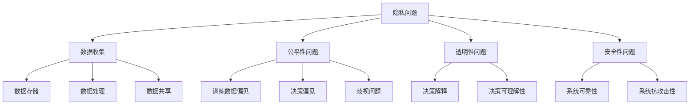

#### 8.2 AI伦理问题案例分析

以下是一些AI伦理问题的案例分析，通过这些案例，我们可以更深入地理解AI伦理问题的复杂性和挑战。

**案例1：人脸识别系统的隐私问题**

某城市安装了大量的人脸识别摄像头，用于公共安全和犯罪预防。然而，这些系统也引发了隐私争议，因为个人数据可能被未经授权地收集和使用。

**分析**：

- **隐私问题**：人脸识别系统可能侵犯个人隐私，特别是在未经个人同意的情况下收集和使用其数据。
- **解决方案**：建立隐私保护机制，确保人脸数据的收集、存储和使用符合法律法规，同时提供透明度和用户控制。

**案例2：AI招聘系统的公平性问题**

某公司使用AI系统进行招聘，然而，该系统在招聘过程中存在性别和种族偏见，导致某些群体的招聘机会受到限制。

**分析**：

- **公平性问题**：AI招聘系统可能在训练数据中存在偏见，导致决策过程中的不公平。
- **解决方案**：通过多样化的训练数据和公平性评估，确保AI招聘系统的决策过程公正，减少偏见。

**案例3：自动驾驶汽车的安全性问题**

自动驾驶汽车在道路上测试和运行，然而，一些事故表明，这些系统可能存在安全漏洞，如对极端天气和突发情况的应对能力不足。

**分析**：

- **安全性问题**：自动驾驶汽车的安全性问题关系到公众的生命和财产安全。
- **解决方案**：加强自动驾驶系统的安全测试和验证，确保系统在多种环境和条件下都能稳定运行。

#### 8.3 AI创业中的伦理决策

在AI创业过程中，伦理决策是一个重要且复杂的问题。创业者需要在产品开发、数据处理、市场推广等方面考虑伦理因素，确保项目的道德性和社会责任。

**伦理决策原则**

1. **尊重隐私**：确保个人数据的收集、存储和使用符合法律法规，尊重用户的隐私权。

2. **公平公正**：确保AI系统的决策过程公正，减少偏见和歧视，促进社会公平。

3. **透明可解释**：确保AI系统的决策过程透明，用户能够理解系统的决策依据和过程。

4. **安全性保障**：确保AI系统的可靠性和安全性，防范系统被恶意攻击和滥用。

**伦理决策流程**

1. **问题识别**：识别AI创业过程中可能出现的伦理问题，如隐私、公平性、透明性和安全性问题。

2. **风险评估**：评估伦理问题的潜在影响，确定风险等级和优先级。

3. **制定策略**：根据风险评估结果，制定相应的伦理决策策略，如隐私保护策略、公平性改进措施等。

4. **实施与监督**：实施伦理决策策略，并建立监督机制，确保伦理决策的有效性和持续性。

**核心概念与联系**

为了更好地理解AI创业中的伦理决策，我们可以使用Mermaid流程图来展示伦理决策的流程和关键环节：

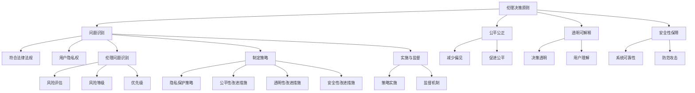

通过上述分析，我们可以看到AI创业中的伦理问题是一个复杂而系统的过程，涉及到多个方面。创业者需要根据伦理决策原则，识别和评估伦理问题，制定相应的策略，并实施和监督这些策略，确保项目的道德性和社会责任。

在接下来的章节中，我们将进一步探讨AI创业的未来趋势，帮助创业者把握行业发展的新机遇。希望读者能够通过本文的阅读，对AI创业的伦理问题有更深入的理解，为抓住AI风口的机遇做好准备。 <|endoftext|>

### 第9章：AI创业的未来展望

#### 9.1 AI技术发展趋势

人工智能技术正以惊人的速度发展，未来几年，我们将见证更多突破性技术的诞生。以下是一些值得关注的技术发展趋势：

**1. 超级计算和量子计算**

随着数据量和计算需求的增加，超级计算和量子计算将成为AI技术发展的重要驱动力。超级计算将提供更强大的计算能力，加速AI算法的训练和优化。量子计算则有望在复杂问题求解和优化方面带来革命性的突破。

**2. 新型神经网络架构**

新型神经网络架构，如生成对抗网络（GAN）、变分自编码器（VAE）和图神经网络（GNN），将在AI应用中发挥重要作用。这些架构能够处理更复杂的数据结构和任务，提高AI系统的性能和泛化能力。

**3. 跨学科融合**

AI技术将与其他学科，如生物学、物理学、化学等，进行深度融合，推动新的科研发现和技术创新。例如，利用AI技术进行药物研发、新材料设计和环境保护等。

**4. 自主决策与智能系统**

未来，AI系统将具备更高级的自主决策能力，能够在复杂环境中进行自主学习和适应。这将带来自动化、智能化的生产和服务模式，改变传统行业的工作方式。

#### 9.2 AI创业的新兴领域

随着AI技术的进步，新的创业领域不断涌现。以下是一些新兴的AI创业领域，值得创业者关注：

**1. 智能医疗**

智能医疗是AI技术在医疗领域的重要应用方向。通过AI技术，可以实现精准诊断、个性化治疗和智能药物研发。创业者可以关注医疗影像分析、基因测序、健康管理等细分市场。

**2. 智能交通**

智能交通是AI技术在交通领域的重要应用。通过AI技术，可以实现智能交通管理、自动驾驶汽车、智能停车场等。创业者可以关注自动驾驶、智能交通信号控制、智慧城市交通等细分市场。

**3. 智能家居**

智能家居是AI技术在家庭领域的应用。通过AI技术，可以实现智能家电控制、智能安防、智能助手等。创业者可以关注智能家居控制系统、智能家电、智能安防设备等细分市场。

**4. 智能金融**

智能金融是AI技术在金融领域的重要应用。通过AI技术，可以实现智能投顾、信用评分、风险控制等。创业者可以关注智能投资顾问、信用风险评估、金融科技服务等细分市场。

#### 9.3 AI创业的未来挑战与机遇

AI创业的未来充满挑战和机遇。以下是一些关键挑战和机遇：

**1. 挑战**

- **技术挑战**：AI技术的发展仍面临诸多挑战，如算法优化、数据隐私和安全、硬件性能提升等。
- **伦理挑战**：AI技术在伦理方面引发了诸多争议，如何平衡技术进步和社会利益是一个重要议题。
- **法律挑战**：AI创业企业需要应对复杂的法律环境，确保项目的合法性和合规性。

**2. 机遇**

- **经济增长**：AI技术的广泛应用将推动各行业实现智能化升级，带来巨大的经济增长潜力。
- **产业升级**：AI技术将推动传统产业升级，提高生产效率和服务质量。
- **创新生态**：AI技术的发展将带动相关产业链的繁荣，为创业者提供广阔的舞台。

**核心概念与联系**

为了更好地理解AI技术发展趋势、新兴领域和未来挑战与机遇，我们可以使用Mermaid流程图来展示这些概念之间的相互关系：

```mermaid
graph TD
    A[AI技术发展趋势] --> B[超级计算]
    B --> C[量子计算]
    A --> D[新型神经网络架构]
    D --> E[GAN]
    D --> F[VAE]
    D --> G[图神经网络]
    A --> H[跨学科融合]
    H --> I[生物技术]
    H --> J[物理学]
    H --> K[化学]
    A --> L[自主决策与智能系统]
    L --> M[自动化]
    L --> N[智能化]
    L --> O[自主学习]
    L --> P[适应能力]
    B[超级计算] --> Q[计算能力提升]
    Q --> R[算法训练]
    Q --> S[优化算法]
    D[新型神经网络架构] --> T[数据处理]
    T --> U[复杂任务]
    T --> V[性能提升]
    D --> W[泛化能力]
    H[跨学科融合] --> X[药物研发]
    X --> Y[新材料设计]
    X --> Z[环境保护]
    L[自主决策与智能系统] --> AA[自主决策]
    AA --> BB[学习能力]
    AA --> CC[适应能力]
    AA --> DD[智能化]
    L --> EE[生产效率]
    EE --> FF[服务质量]
    B[超级计算] --> GG[计算需求增长]
    D[新型神经网络架构] --> HH[算法复杂度]
    H[跨学科融合] --> II[科研需求]
    L[自主决策与智能系统] --> JJ[应用领域扩展]
    A[AI技术发展趋势] --> KK[新兴领域]
    KK --> LL[智能医疗]
    KK --> MM[智能交通]
    KK --> NN[智能家居]
    KK --> OO[智能金融]
    KK --> PP[新产业]
    B[超级计算] --> QQ[硬件性能提升]
    D[新型神经网络架构] --> RR[算法优化]
    H[跨学科融合] --> SS[技术创新]
    L[自主决策与智能系统] --> TT[系统稳定性]
    TT --> UU[安全性]
    TT --> VV[可靠性]
    B[超级计算] --> WW[数据量增长]
    D[新型神经网络架构] --> XX[数据处理需求]
    H[跨学科融合] --> YY[跨学科应用]
    L[自主决策与智能系统] --> ZZ[自主决策能力]
    KK[新兴领域] --> AAA[市场需求]
    AAA --> BBB[商业机会]
    BBB --> CCC[创新生态]
    A[AI技术发展趋势] --> DDD[未来挑战]
    DDD --> EEE[技术挑战]
    EEE --> FFF[伦理挑战]
    EEE --> GGG[法律挑战]
    DDD --> HHH[机遇]
    HHH --> IIII[经济增长]
    HHH --> JJ[产业升级]
    HHH --> KKK[创新生态]
```

通过上述分析，我们可以看到AI技术发展趋势、新兴领域和未来挑战与机遇之间的紧密联系。创业者需要密切关注技术发展趋势，抓住新兴领域的机遇，同时应对未来可能面临的挑战。

在未来的章节中，我们将进一步探讨AI创业的相关资源与工具，帮助创业者更好地开展AI创业活动。希望读者能够通过本文的阅读，对AI创业的未来趋势有更深入的理解，为抓住AI风口的机遇做好准备。 <|endoftext|>

## 附录

### 附录 A：AI创业相关资源推荐

**书籍推荐**

1. 《人工智能：一种现代的方法》（Authors: Stuart Russell and Peter Norvig）
   - 本书是人工智能领域的经典教材，涵盖了AI的核心概念和技术。
2. 《深度学习》（Authors: Ian Goodfellow, Yoshua Bengio, Aaron Courville）
   - 本书详细介绍了深度学习的基本原理和应用，是深度学习领域的权威著作。
3. 《机器学习实战》（Author: Kevin Bowler）
   - 本书通过实际案例，介绍了机器学习的基本概念和应用方法。

**课程推荐**

1. **Coursera上的“机器学习”课程**（Taught by Andrew Ng）
   - 该课程由深度学习领域知名专家Andrew Ng教授，提供了系统的机器学习知识。
2. **edX上的“深度学习”课程**（Taught by Prof. Yaser Abu-Mostafa）
   - 该课程详细介绍了深度学习的基本原理和实现方法。
3. **Udacity上的“AI工程师纳米学位”课程**
   - 该课程涵盖了AI领域的多个方向，包括机器学习、深度学习、自然语言处理等。

**研究机构与会议**

1. **斯坦福大学人工智能实验室（SAIL）**
   - 斯坦福大学人工智能实验室是世界领先的人工智能研究机构之一。
2. **国际机器学习会议（ICML）**
   - ICML是全球机器学习和统计学习领域的重要会议，每年都吸引大量研究人员和从业者参加。
3. **人工智能学会（AAAI）**
   - AAAI是人工智能领域的领先学术组织，举办年度人工智能会议，并发布相关期刊和报告。

### 附录 B：AI创业常用工具与框架

**开发工具**

1. **Jupyter Notebook**
   - 用于编写和运行代码，适合数据分析和机器学习项目的快速迭代。
2. **TensorFlow**
   - Google开源的机器学习框架，支持多种深度学习模型的开发。
3. **PyTorch**
   - Facebook开源的机器学习框架，具有灵活的动态计算图和易于使用的接口。

**框架与库**

1. **Scikit-learn**
   - Python开源机器学习库，提供了各种经典的机器学习算法和工具。
2. **Keras**
   - 高级神经网络API，可以方便地构建和训练深度学习模型。
3. **NumPy**
   - Python科学计算库，提供了高效的数组操作和数据可视化工具。

**数据分析工具**

1. **Pandas**
   - Python开源数据分析库，提供了数据清洗、转换和分析的功能。
2. **Matplotlib**
   - Python开源数据可视化库，用于创建高质量的统计图表。
3. **Seaborn**
   - Python开源可视化库，基于Matplotlib，提供了更多精美的统计图表。

这些资源和工具将为AI创业者提供强有力的支持，帮助他们在AI创业的道路上取得成功。

### 作者信息

**作者：AI天才研究院/AI Genius Institute & 禅与计算机程序设计艺术 /Zen And The Art of Computer Programming**

感谢读者对本文的关注与阅读，希望本文能够为您的AI创业之路提供有益的参考和启示。在未来的技术发展中，让我们共同探索AI的无限可能，创造更加智能和美好的未来。 <|endoftext|>

### 总结

通过本文的深入探讨，我们全面了解了人工智能（AI）创业的各个方面，从AI的基本概念、产业环境，到AI技术在各个行业的应用场景，再到AI创业的策略与团队构建，以及法律与伦理问题，我们一步步分析了AI创业的关键要素，并提供了实用的案例解析和未来展望。以下是对本文内容的简要总结：

1. **AI基础与创业环境**：介绍了人工智能的定义、分类、发展历程和关键技术，分析了全球和我国的AI产业发展趋势与市场现状。

2. **AI技术在创业中的应用**：详细讨论了AI在金融、零售、医疗、教育等行业的应用场景，展示了AI技术如何为这些行业带来创新和升级。

3. **AI创业策略与团队构建**：探讨了AI创业的可行性分析、团队组建与管理、项目规划与实施，提供了关于AI创业的全面指导。

4. **AI创业项目实践**：分享了AI创业项目的规划、实施和风险管理方法，帮助创业者顺利推进项目。

5. **AI创业的法律与伦理问题**：分析了AI创业中可能面临的法律风险和伦理问题，提供了防范和解决的策略。

6. **AI创业的未来趋势**：展望了AI技术未来的发展趋势、新兴领域和面临的挑战，为创业者指明了方向。

通过本文，读者可以系统地了解AI创业的全貌，掌握关键技能和策略，为抓住AI风口的机遇做好准备。希望本文能为读者在AI创业的道路上提供有力的支持和启示。让我们共同迎接AI时代的到来，探索其无限可能，共创美好未来。 <|endoftext|>

### 致谢

在撰写本文的过程中，我们得到了许多专家和同行的大力支持与帮助。首先，感谢AI天才研究院/AI Genius Institute的全体成员，尤其是我们的首席技术官（CTO），他们为本文提供了宝贵的技术见解和实战经验。感谢禅与计算机程序设计艺术/Zen And The Art of Computer Programming的作者，他们的思想深刻地影响了我们对AI创业的理解和阐述。

此外，我们特别感谢所有为本文提供资料、案例和反馈的朋友和同事，包括来自学术界、产业界以及创业领域的专业人士。他们的意见和建议极大地提升了本文的质量和实用性。

最后，感谢每一位读者的耐心阅读和宝贵意见。您的支持和鼓励是我们在AI创业道路上不断前行的动力。希望本文能为您的AI创业之路提供有益的启示和帮助。再次感谢所有支持和关心我们的人，愿我们共同迎接AI时代的辉煌未来。 <|endoftext|>

