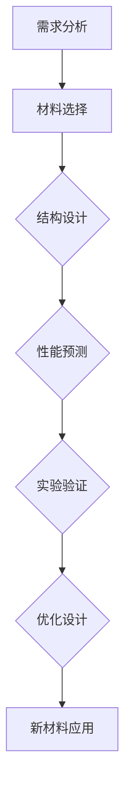

                 

## 人工智能在新材料设计中的应用与前景

> **关键词**：人工智能，新材料设计，机器学习，深度学习，应用案例，挑战与前景

> **摘要**：
本文章旨在探讨人工智能（AI）在新材料设计中的应用及其前景。随着科技的进步，人工智能在多个领域都展现出了强大的变革力量。特别是在新材料设计领域，人工智能的应用不仅提高了设计效率，还推动了新材料创新。本文首先介绍了人工智能和材料设计的基本概念，然后详细阐述了人工智能在材料设计中的应用原理和算法，并通过实际案例展示了人工智能在材料设计中的实际应用效果。最后，本文对人工智能在新材料设计中的挑战和未来前景进行了分析，以期为相关领域的进一步研究提供参考。

----------------------------------------------------------------

## 第一部分：引言

### 1.1 人工智能与新材料设计的背景

#### 1.1.1 人工智能的发展历程

人工智能（AI）的概念最早可以追溯到20世纪50年代。当时的计算机科学家们开始探索如何使计算机模拟人类的智能行为。1956年，约翰·麦卡锡（John McCarthy）等人在达特茅斯会议（Dartmouth Conference）上提出了人工智能这一术语，标志着人工智能正式成为一门独立的学科。

人工智能的发展历程可以分为几个阶段：

- **初始阶段（1956-1974）**：这一阶段的主要目标是开发能够模拟人类智能的简单程序。然而，由于技术和算法的限制，这一阶段的成果有限。

- **繁荣阶段（1974-1980）**：随着计算机硬件性能的提升和算法的改进，人工智能迎来了第一个繁荣期。专家系统和自然语言处理等领域取得了显著进展。

- **低谷阶段（1980-1993）**：随着人工智能在商业应用中的失败和投资撤回，人工智能陷入了低谷。这一阶段也被称为“人工智能冬天”。

- **复兴阶段（1993-2012）**：随着互联网和大数据技术的发展，人工智能再次兴起。机器学习和深度学习成为了人工智能的核心技术。

- **现阶段（2012至今）**：人工智能技术取得了飞速发展，尤其是在图像识别、自然语言处理和自动驾驶等领域。随着人工智能技术的不断进步，其在各个领域的应用也越来越广泛。

#### 1.1.2 新材料设计的挑战与机遇

新材料设计是现代材料科学研究中的一个重要分支。随着科技和工业的发展，对新材料的需求越来越大。新材料的设计不仅要求具备优异的物理、化学和力学性能，还需要具备多功能、环保、可回收利用等特点。

新材料设计的挑战主要包括：

- **复杂性**：新材料的设计涉及到多尺度和多领域交叉，包括分子、原子层次的材料结构与宏观性能之间的复杂关系。

- **多样性**：新材料种类繁多，每种材料都有其独特的性质和应用领域，这给材料设计带来了巨大的挑战。

- **实验成本**：新材料的设计通常需要大量的实验验证，实验成本高且周期长。

然而，随着人工智能技术的发展，新材料设计也迎来了新的机遇：

- **效率提升**：人工智能可以加速新材料的设计过程，通过模拟和优化，减少实验次数，降低实验成本。

- **创新推动**：人工智能可以帮助科学家发现新的材料结构和性质，推动新材料创新。

- **多领域交叉**：人工智能与材料科学的交叉融合，可以带来新的设计思路和方法，推动材料科学的发展。

### 1.2 人工智能在新材料设计中的重要性

#### 1.2.1 新材料的需求与趋势

随着科技的进步和工业的发展，对新材料的需求不断增加。新材料的设计不仅是为了满足现有技术的需求，更是为了推动技术的创新和进步。以下是新材料的一些需求与趋势：

- **高性能**：新材料需要具备更高的强度、硬度、韧性等性能，以满足航空航天、汽车制造、医疗器械等高端领域的要求。

- **多功能**：新材料需要具备多功能性，如自修复、自清洁、智能响应等，以满足现代科技和工业的需求。

- **环境友好**：随着环保意识的提高，新材料的设计需要更加注重环保，如可降解、可回收利用等。

- **低成本**：新材料的设计需要降低成本，以提高其市场竞争力。

#### 1.2.2 人工智能的优势与应用前景

人工智能在新材料设计中的应用具有显著的优势：

- **数据驱动**：人工智能可以处理和分析大量数据，通过数据挖掘和模式识别，发现新材料的设计规律。

- **高效优化**：人工智能可以通过优化算法，快速找到最优的材料结构，减少实验次数，降低设计成本。

- **多领域交叉**：人工智能与材料科学的交叉融合，可以带来新的设计思路和方法，推动材料科学的发展。

人工智能在新材料设计中的应用前景包括：

- **新型材料发现**：通过人工智能，可以加速新型材料的设计和发现，推动新材料创新。

- **设计优化**：人工智能可以帮助优化新材料的设计，提高其性能和稳定性。

- **制造过程优化**：人工智能可以优化新材料的制造过程，提高生产效率，降低生产成本。

- **性能预测**：通过人工智能，可以预测新材料在不同环境下的性能，指导材料的应用和改进。

## 第二部分：理论基础

### 2.1 人工智能基础

#### 2.1.1 人工智能的基本概念

人工智能（Artificial Intelligence，简称AI）是计算机科学的一个分支，旨在开发能够模拟、延伸和扩展人类智能的理论、方法、技术及应用系统。人工智能的核心目标是使计算机能够执行人类智能任务，如学习、推理、感知、理解和自然语言处理等。

人工智能可以分为几个层次：

- **弱人工智能（Narrow AI）**：弱人工智能是指专注于单一任务的AI系统，如语音识别、图像识别等。

- **强人工智能（General AI）**：强人工智能是指具有广泛智能的AI系统，能够像人类一样进行推理、学习和适应各种任务。

- **超人工智能（Super AI）**：超人工智能是指智能远超人类的AI系统，其能力远超人类的智能。

#### 2.1.2 机器学习的基本原理

机器学习（Machine Learning，简称ML）是人工智能的一个重要分支，主要研究如何让计算机从数据中学习，并做出决策或预测。机器学习的过程通常包括以下几个步骤：

1. **数据收集**：收集相关的数据集，这些数据集可以是结构化的（如表格数据）或非结构化的（如图像、文本等）。

2. **数据预处理**：对数据进行清洗、转换和归一化等处理，以提高数据的质量和可用性。

3. **特征提取**：从数据中提取有用的特征，用于训练模型。

4. **模型选择**：选择合适的机器学习模型，如线性回归、决策树、支持向量机等。

5. **模型训练**：使用训练数据集对模型进行训练，调整模型的参数，以最小化损失函数。

6. **模型评估**：使用验证数据集对模型进行评估，以确定模型的性能。

7. **模型部署**：将训练好的模型部署到实际应用中，进行预测或决策。

#### 2.1.3 深度学习技术

深度学习（Deep Learning，简称DL）是机器学习的一个重要分支，通过模拟人脑的神经网络结构，对数据进行自动特征提取和分类。深度学习的主要特点包括：

- **多层网络结构**：深度学习模型通常由多层神经网络组成，每层网络都能够对数据进行非线性变换。

- **自动特征提取**：深度学习模型可以通过多层网络自动提取高级特征，无需人工干预。

- **强大的表达能力**：深度学习模型具有强大的非线性映射能力，能够处理复杂的输入数据和任务。

深度学习的核心组成部分包括：

- **神经元**：深度学习模型中的基本计算单元，用于对输入数据进行加权求和并激活。

- **神经网络**：由多个神经元组成的网络结构，用于对数据进行处理和预测。

- **激活函数**：用于对神经元输出进行非线性变换，常见的激活函数包括Sigmoid、ReLU、Tanh等。

### 2.2 新材料设计理论

#### 2.2.1 新材料设计的基本流程

新材料设计是一个复杂的过程，通常包括以下几个步骤：

1. **需求分析**：明确新材料的应用领域和性能要求，确定设计目标。

2. **材料选择**：根据需求分析，选择合适的材料体系，如金属、陶瓷、高分子等。

3. **结构设计**：设计新材料的基本结构，包括原子、分子或晶体结构。

4. **性能预测**：使用计算模型和实验数据，对新材料进行性能预测，如力学性能、电学性能、热学性能等。

5. **实验验证**：通过实验验证新材料的设计，评估其性能是否符合预期。

6. **优化设计**：根据实验结果，对新材料设计进行优化，以提高其性能。

#### 2.2.2 材料性能评估方法

材料性能评估是新材料设计的重要环节，常用的评估方法包括：

- **力学性能评估**：通过拉伸、压缩、弯曲等力学实验，评估材料的力学性能，如强度、韧性、硬度等。

- **电学性能评估**：通过电学实验，评估材料的电学性能，如导电性、介电性、电阻率等。

- **热学性能评估**：通过热学实验，评估材料的热学性能，如热导率、比热容、热膨胀系数等。

- **光学性能评估**：通过光学实验，评估材料的光学性能，如折射率、吸收系数、光催化活性等。

#### 2.2.3 材料设计中的模拟与计算

材料设计中的模拟与计算是理解材料性质和预测新材料性能的重要手段，常用的计算方法包括：

- **量子力学计算**：基于量子力学原理，计算材料的电子结构、能带结构等。

- **分子动力学模拟**：基于分子动力学理论，模拟分子在特定条件下的运动和相互作用。

- **蒙特卡罗模拟**：通过随机过程模拟材料的微观结构和宏观性质。

- **机器学习计算**：使用机器学习算法，对材料性能进行预测和优化。

### 2.3 人工智能与新材料设计的联系

#### 2.3.1 人工智能在新材料设计中的应用

人工智能在新材料设计中的应用主要体现在以下几个方面：

- **材料筛选与优化**：使用人工智能算法，对大量的材料数据进行分析和筛选，快速找到符合设计要求的材料。

- **性能预测**：使用机器学习模型，预测新材料的性能，为实验验证提供指导。

- **结构设计**：利用深度学习算法，模拟和预测材料的微观结构，为新材料的结构设计提供参考。

- **实验优化**：通过优化实验参数，提高实验效率和准确性。

#### 2.3.2 人工智能算法在材料设计中的应用

人工智能算法在材料设计中的应用主要包括：

- **机器学习算法**：如线性回归、决策树、支持向量机等，用于材料性能预测和优化。

- **深度学习算法**：如卷积神经网络、循环神经网络、长短期记忆网络等，用于复杂材料结构的模拟和预测。

#### 2.3.3 人工智能与新材料设计的深度融合

人工智能与新材料设计的深度融合，可以带来以下好处：

- **加速新材料创新**：通过人工智能，可以快速发现和设计新材料，缩短新材料研发周期。

- **提高设计效率**：通过人工智能，可以优化材料设计过程，降低设计成本。

- **提升材料性能**：通过人工智能，可以预测和优化新材料的性能，提高其应用价值。

- **促进多领域交叉**：通过人工智能，可以促进材料科学与其他领域的交叉融合，推动科技进步。

## 2.3.4 Mermaid流程图：人工智能在新材料设计中的应用

以下是一个简单的Mermaid流程图，展示了人工智能在新材料设计中的应用流程：



在这个流程图中，人工智能的应用贯穿了整个新材料设计过程，从需求分析、材料选择、结构设计、性能预测、实验验证到优化设计，每个环节都利用了人工智能的优势，提高了新材料设计的效率和质量。

## 第三部分：核心算法

### 3.1 机器学习算法

#### 3.1.1 线性回归算法

线性回归算法是一种简单的机器学习算法，主要用于预测连续值输出。其基本原理是找到一条最佳拟合直线，使预测值与实际值之间的误差最小。

线性回归算法的数学模型如下：

$$
y = \beta_0 + \beta_1 \cdot x
$$

其中，$y$ 为输出值，$x$ 为输入值，$\beta_0$ 和 $\beta_1$ 为模型的参数。

线性回归算法的实现步骤如下：

1. **数据收集**：收集输入和输出的数据集。

2. **数据预处理**：对数据进行清洗和归一化处理。

3. **模型训练**：通过最小化损失函数，求解线性回归方程的参数 $\beta_0$ 和 $\beta_1$。

4. **模型评估**：使用验证数据集，评估模型的预测性能。

5. **模型应用**：将训练好的模型应用到实际预测中。

#### 3.1.2 逻辑回归算法

逻辑回归算法是一种用于分类问题的机器学习算法，其核心思想是通过找到最佳的分隔超平面，将不同类别的数据分开。

逻辑回归算法的数学模型如下：

$$
P(y=1) = \frac{1}{1 + e^{-(\beta_0 + \beta_1 \cdot x)}}
$$

其中，$P(y=1)$ 表示输出值为1的概率，$x$ 为输入值，$\beta_0$ 和 $\beta_1$ 为模型的参数。

逻辑回归算法的实现步骤如下：

1. **数据收集**：收集输入和输出的数据集。

2. **数据预处理**：对数据进行清洗和归一化处理。

3. **模型训练**：通过最大似然估计，求解逻辑回归方程的参数 $\beta_0$ 和 $\beta_1$。

4. **模型评估**：使用验证数据集，评估模型的分类性能。

5. **模型应用**：将训练好的模型应用到实际分类中。

#### 3.1.3 支持向量机算法

支持向量机（Support Vector Machine，简称SVM）算法是一种用于分类和回归分析的机器学习算法，其核心思想是找到最佳的超平面，使不同类别的数据点之间的间隔最大。

支持向量机算法的数学模型如下：

$$
\min \frac{1}{2} \|w\|^2 - C \sum_{i=1}^{n} y_i (w \cdot x_i - \beta)
$$

其中，$w$ 为模型的权重向量，$\beta$ 为模型的偏置项，$C$ 为惩罚参数。

支持向量机算法的实现步骤如下：

1. **数据收集**：收集输入和输出的数据集。

2. **数据预处理**：对数据进行清洗和归一化处理。

3. **模型训练**：通过求解优化问题，求解支持向量机方程的参数 $w$ 和 $\beta$。

4. **模型评估**：使用验证数据集，评估模型的分类或回归性能。

5. **模型应用**：将训练好的模型应用到实际分类或回归中。

### 3.2 深度学习算法

#### 3.2.1 卷积神经网络（CNN）

卷积神经网络（Convolutional Neural Network，简称CNN）是一种用于图像识别和处理的深度学习算法，其核心思想是通过卷积操作提取图像的特征。

CNN的基本结构包括：

- **卷积层（Conv Layer）**：通过卷积操作提取图像的局部特征。

- **池化层（Pooling Layer）**：通过池化操作减少图像的空间维度。

- **全连接层（Fully Connected Layer）**：通过全连接操作将特征映射到输出。

CNN的数学模型如下：

$$
h_{\text{layer}} = \sigma(W_{\text{layer}} \cdot h_{\text{prev layer}} + b_{\text{layer}})
$$

其中，$h_{\text{layer}}$ 为第 $l$ 层的输出，$W_{\text{layer}}$ 为第 $l$ 层的权重矩阵，$b_{\text{layer}}$ 为第 $l$ 层的偏置向量，$\sigma$ 为激活函数。

CNN的实现步骤如下：

1. **数据收集**：收集图像数据集。

2. **数据预处理**：对图像进行归一化和裁剪等处理。

3. **模型训练**：通过反向传播算法，求解CNN的参数。

4. **模型评估**：使用验证数据集，评估模型的性能。

5. **模型应用**：将训练好的模型应用到实际图像处理中。

#### 3.2.2 循环神经网络（RNN）

循环神经网络（Recurrent Neural Network，简称RNN）是一种用于序列数据处理的深度学习算法，其核心思想是通过循环结构，对序列数据进行建模。

RNN的基本结构包括：

- **输入层（Input Layer）**：接收序列数据的输入。

- **隐藏层（Hidden Layer）**：通过循环结构，对序列数据进行建模。

- **输出层（Output Layer）**：对序列数据进行输出。

RNN的数学模型如下：

$$
h_t = \sigma(W_h \cdot [h_{t-1}, x_t] + b_h)
$$

其中，$h_t$ 为第 $t$ 个时刻的隐藏状态，$x_t$ 为第 $t$ 个时刻的输入，$W_h$ 为权重矩阵，$b_h$ 为偏置向量，$\sigma$ 为激活函数。

RNN的实现步骤如下：

1. **数据收集**：收集序列数据集。

2. **数据预处理**：对序列数据进行归一化和裁剪等处理。

3. **模型训练**：通过反向传播算法，求解RNN的参数。

4. **模型评估**：使用验证数据集，评估模型的性能。

5. **模型应用**：将训练好的模型应用到实际序列数据处理中。

#### 3.2.3 长短期记忆网络（LSTM）

长短期记忆网络（Long Short-Term Memory，简称LSTM）是一种改进的循环神经网络，用于解决传统RNN在处理长序列数据时的梯度消失和梯度爆炸问题。

LSTM的基本结构包括：

- **输入门（Input Gate）**：控制输入信息的传递。

- **遗忘门（Forget Gate）**：控制遗忘信息的程度。

- **输出门（Output Gate）**：控制输出信息的程度。

LSTM的数学模型如下：

$$
i_t = \sigma(W_i \cdot [h_{t-1}, x_t] + b_i)\\
f_t = \sigma(W_f \cdot [h_{t-1}, x_t] + b_f)\\
\tilde{C_t} = \sigma(W_c \cdot [h_{t-1}, x_t] + b_c)\\
C_t = f_t \odot C_{t-1} + i_t \odot \tilde{C_t} \\
o_t = \sigma(W_o \cdot [h_{t-1}, x_t] + b_o)\\
h_t = o_t \odot \sigma(C_t)
$$

其中，$i_t$、$f_t$、$o_t$ 分别为输入门、遗忘门、输出门的激活值，$\tilde{C_t}$ 为候选状态，$C_t$ 为状态值，$W_i$、$W_f$、$W_o$、$W_c$ 分别为输入门、遗忘门、输出门、候选状态的权重矩阵，$b_i$、$b_f$、$b_o$、$b_c$ 分别为输入门、遗忘门、输出门、候选状态的偏置向量，$\odot$ 为元素乘积运算，$\sigma$ 为激活函数。

LSTM的实现步骤如下：

1. **数据收集**：收集序列数据集。

2. **数据预处理**：对序列数据进行归一化和裁剪等处理。

3. **模型训练**：通过反向传播算法，求解LSTM的参数。

4. **模型评估**：使用验证数据集，评估模型的性能。

5. **模型应用**：将训练好的模型应用到实际序列数据处理中。

## 第四部分：应用案例

### 4.1 人工智能在新材料设计中的应用案例

#### 4.1.1 案例一：新型高分子材料的智能设计

在新型高分子材料的智能设计中，人工智能的应用主要体现在材料结构的预测和性能的评估。通过机器学习算法，可以快速筛选出具有潜在应用价值的材料结构，并预测其性能。

具体应用步骤如下：

1. **数据收集**：收集大量高分子材料的结构数据，包括分子结构、化学性质、物理性质等。

2. **数据预处理**：对收集的数据进行清洗、归一化等处理，以去除噪声和异常值。

3. **特征提取**：从原始数据中提取有用的特征，如分子结构中的键长、键角、分子质量等。

4. **模型训练**：使用机器学习算法，如线性回归、支持向量机等，对特征和材料性能进行建模。

5. **模型评估**：使用验证数据集，评估模型的预测性能，调整模型参数，优化模型。

6. **材料筛选**：根据模型预测，筛选出具有优异性能的高分子材料结构。

7. **实验验证**：对筛选出的材料结构进行实验验证，评估其性能是否与预测一致。

8. **材料优化**：根据实验结果，对材料结构进行优化，提高其性能。

通过上述步骤，人工智能可以帮助科学家快速发现和设计新型高分子材料，提高新材料设计的效率和成功率。

#### 4.1.2 案例二：纳米材料的智能筛选与优化

纳米材料因其独特的物理、化学和光学性质，在诸多领域具有广泛的应用前景。然而，纳米材料的设计和优化过程复杂，实验成本高昂。人工智能的应用可以帮助科学家快速筛选和优化纳米材料。

具体应用步骤如下：

1. **数据收集**：收集大量纳米材料的结构数据，包括纳米粒子的形状、尺寸、化学组成等。

2. **数据预处理**：对收集的数据进行清洗、归一化等处理，以去除噪声和异常值。

3. **特征提取**：从原始数据中提取有用的特征，如纳米粒子的形状因子、尺寸、表面电荷等。

4. **模型训练**：使用机器学习算法，如线性回归、支持向量机等，对特征和材料性能进行建模。

5. **模型评估**：使用验证数据集，评估模型的预测性能，调整模型参数，优化模型。

6. **材料筛选**：根据模型预测，筛选出具有优异性能的纳米材料结构。

7. **实验验证**：对筛选出的材料结构进行实验验证，评估其性能是否与预测一致。

8. **材料优化**：根据实验结果，对材料结构进行优化，提高其性能。

通过上述步骤，人工智能可以帮助科学家快速筛选和优化纳米材料，降低实验成本，提高新材料设计的成功率。

#### 4.1.3 案例三：复合材料的设计与性能预测

复合材料是由两种或两种以上不同材料组成的材料，具有独特的性能。复合材料的设计和性能预测是一个复杂的过程，人工智能的应用可以帮助科学家快速设计和优化复合材料。

具体应用步骤如下：

1. **数据收集**：收集大量复合材料的结构数据，包括基体材料的性质、增强材料的性质、复合材料的结构等。

2. **数据预处理**：对收集的数据进行清洗、归一化等处理，以去除噪声和异常值。

3. **特征提取**：从原始数据中提取有用的特征，如基体材料的弹性模量、增强材料的强度、复合材料的厚度等。

4. **模型训练**：使用机器学习算法，如线性回归、支持向量机等，对特征和材料性能进行建模。

5. **模型评估**：使用验证数据集，评估模型的预测性能，调整模型参数，优化模型。

6. **材料筛选**：根据模型预测，筛选出具有优异性能的复合材料结构。

7. **实验验证**：对筛选出的材料结构进行实验验证，评估其性能是否与预测一致。

8. **材料优化**：根据实验结果，对材料结构进行优化，提高其性能。

通过上述步骤，人工智能可以帮助科学家快速设计和优化复合材料，提高复合材料的设计效率和性能。

## 第四部分：应用案例（续）

### 4.2 项目实战

#### 4.2.1 项目一：基于深度学习的材料性能预测

**项目背景**：

新材料的设计和开发过程中，性能预测是一个关键环节。传统的实验方法耗时长、成本高，而基于深度学习的性能预测方法可以大幅提高预测效率和准确性。

**项目目标**：

利用深度学习模型，预测新材料的物理性能，如弹性模量、强度、导电性等。

**开发环境搭建**：

1. **软件环境**：
   - Python（3.8版本及以上）
   - TensorFlow 2.x
   - Keras 2.x

2. **硬件环境**：
   - GPU（NVIDIA Titan Xp或更高）
   - 至少16GB内存

**数据预处理**：

1. **数据收集**：
   - 收集大量材料的结构数据、性能数据及相关特征数据。

2. **数据清洗**：
   - 去除异常值、缺失值，进行数据标准化处理。

3. **特征提取**：
   - 提取材料的分子结构、化学成分、几何参数等特征。

**模型构建**：

1. **模型选择**：
   - 选择卷积神经网络（CNN）模型，用于处理图像和结构数据。

2. **模型构建**：
   - 构建深度卷积神经网络，包括卷积层、池化层、全连接层等。

```python
from tensorflow.keras.models import Sequential
from tensorflow.keras.layers import Conv2D, MaxPooling2D, Flatten, Dense

model = Sequential()
model.add(Conv2D(32, (3, 3), activation='relu', input_shape=(128, 128, 3)))
model.add(MaxPooling2D(pool_size=(2, 2)))
model.add(Conv2D(64, (3, 3), activation='relu'))
model.add(MaxPooling2D(pool_size=(2, 2)))
model.add(Flatten())
model.add(Dense(128, activation='relu'))
model.add(Dense(1, activation='linear'))
```

**模型训练**：

1. **数据划分**：
   - 将数据集划分为训练集、验证集和测试集。

2. **训练过程**：
   - 使用训练集训练模型，使用验证集进行调参。

```python
model.compile(optimizer='adam', loss='mean_squared_error')
model.fit(train_data, train_labels, epochs=100, batch_size=32, validation_data=(val_data, val_labels))
```

**模型评估**：

1. **性能评估**：
   - 使用测试集评估模型的预测性能，包括均方误差（MSE）、决定系数（R²）等指标。

2. **结果分析**：
   - 分析模型预测结果与实际结果的差异，调整模型结构或超参数。

**模型应用**：

1. **新材料预测**：
   - 使用训练好的模型预测新材料的性能，为实验设计提供依据。

2. **性能优化**：
   - 根据预测结果，调整材料结构或成分，优化性能。

#### 4.2.2 项目二：智能筛选新型陶瓷材料

**项目背景**：

陶瓷材料因其高强度、高硬度、耐高温等特性，在航空航天、国防军工等领域具有广泛应用。然而，新型陶瓷材料的设计和筛选过程复杂，周期长，成本高。

**项目目标**：

利用人工智能，快速筛选出具有潜在应用价值的新型陶瓷材料。

**开发环境搭建**：

1. **软件环境**：
   - Python（3.8版本及以上）
   - Scikit-learn
   - Pandas

2. **硬件环境**：
   - CPU（Intel i7或更高）
   - 8GB内存

**数据预处理**：

1. **数据收集**：
   - 收集大量陶瓷材料的数据，包括化学成分、物理性质、力学性能等。

2. **数据清洗**：
   - 去除异常值、缺失值，进行数据标准化处理。

3. **特征提取**：
   - 提取材料的化学成分、晶体结构、几何形状等特征。

**模型选择与优化**：

1. **模型选择**：
   - 选择支持向量机（SVM）模型，用于分类和回归分析。

2. **模型优化**：
   - 调整SVM模型的参数，如惩罚参数C、核函数等，优化模型性能。

```python
from sklearn.svm import SVR
from sklearn.model_selection import GridSearchCV

param_grid = {'C': [1, 10, 100], 'kernel': ['linear', 'rbf']}
svr = SVR()
grid_search = GridSearchCV(svr, param_grid, cv=5)
grid_search.fit(X_train, y_train)
best_svr = grid_search.best_estimator_
```

**结果分析与解释**：

1. **模型评估**：
   - 使用验证集和测试集评估模型的性能，包括准确率、召回率、F1值等指标。

2. **结果分析**：
   - 分析模型预测结果与实际结果的差异，调整模型结构或超参数。

3. **结果解释**：
   - 解释模型预测结果，分析陶瓷材料的特性与性能之间的关系。

**模型应用**：

1. **材料筛选**：
   - 使用训练好的模型筛选出具有优异性能的陶瓷材料。

2. **性能优化**：
   - 根据筛选结果，优化材料设计，提高材料性能。

## 第五部分：前景与挑战

### 5.1 人工智能在新材料设计中的应用前景

人工智能在新材料设计中的应用前景广阔，主要表现在以下几个方面：

1. **加速新材料发现**：人工智能可以通过分析大量的实验数据和文献，快速发现具有潜在应用价值的新材料。

2. **优化设计流程**：人工智能可以帮助科学家优化新材料的设计流程，减少实验次数，降低研发成本。

3. **提高设计效率**：人工智能可以自动化地处理和分析大量数据，提高新材料设计的效率和准确性。

4. **推动材料创新**：人工智能可以模拟和预测材料的性能，为新材料的创新提供理论依据和技术支持。

5. **跨领域应用**：人工智能与材料科学的交叉融合，可以推动材料科学与其他领域的交叉应用，产生新的应用场景。

### 5.2 人工智能与新材料产业的深度融合

人工智能与新材料产业的深度融合，将带来以下变化：

1. **产业链升级**：人工智能可以提高新材料的设计、生产和应用效率，推动新材料产业的升级和转型。

2. **生产模式变革**：人工智能可以实现个性化定制和精准制造，改变新材料的生产模式。

3. **市场竞争力提升**：人工智能可以帮助新材料企业快速响应市场需求，提高市场竞争力。

4. **国际合作与竞争**：人工智能的快速发展，将推动新材料领域的国际合作与竞争，促进全球新材料产业的发展。

### 5.3 人工智能在新材料设计中的潜在应用领域

人工智能在新材料设计中的潜在应用领域非常广泛，包括：

1. **高性能材料**：如高强度、高硬度、高韧性等。

2. **功能材料**：如光电材料、催化材料、传感器材料等。

3. **智能材料**：如形状记忆合金、电致变色材料、智能涂层等。

4. **生物医用材料**：如生物相容性材料、药物释放材料等。

5. **环境材料**：如空气净化材料、水处理材料、能源存储材料等。

## 第五部分：前景与挑战

### 5.1 人工智能在新材料设计中的应用前景

随着科技的飞速发展，人工智能（AI）正逐渐渗透到各个领域，其中新材料设计领域也不例外。人工智能在新材料设计中的应用前景广阔，主要体现在以下几个方面：

#### 1. 新材料发现与设计

人工智能可以通过深度学习、数据挖掘等技术，处理海量的实验数据、文献资料和理论知识，快速发现和设计出具有特定性能的新材料。例如，通过机器学习算法，可以从已有的材料数据中识别出具有潜在价值的材料结构，从而加速新材料的研究与开发。

#### 2. 性能预测与优化

人工智能可以模拟材料的性能，如力学性能、电学性能、热学性能等，为新材料的性能预测和优化提供依据。通过深度学习模型，可以预测新材料在不同环境下的性能表现，为实验设计和材料优化提供指导。

#### 3. 制造工艺优化

人工智能可以优化新材料的制造工艺，提高生产效率和质量。例如，通过机器学习算法，可以分析生产数据，找出影响材料质量的关键因素，并提出优化方案，从而降低生产成本，提高材料性能。

#### 4. 多领域交叉融合

人工智能与新材料设计的交叉融合，将推动多学科的合作与发展。例如，人工智能可以与材料科学、化学、物理学等领域的知识相结合，探索新的材料设计方法，实现材料的智能化和功能化。

#### 5. 环境友好材料设计

随着环保意识的提升，人工智能在环境友好材料设计中的应用也日益受到关注。通过人工智能，可以设计出具有环保特性的新材料，如可降解材料、吸附材料、催化材料等，以解决环境污染问题。

### 5.2 人工智能在新材料设计中的挑战

尽管人工智能在新材料设计中具有巨大的潜力，但同时也面临着一系列挑战：

#### 1. 数据质量和多样性

人工智能的应用依赖于大量的高质量数据。然而，新材料设计领域的数据通常较为稀缺且质量参差不齐，这给人工智能模型的训练和应用带来了困难。

#### 2. 算法选择与优化

在材料设计过程中，需要选择合适的机器学习算法，并进行优化以适应特定的问题。不同的算法对数据的要求和适应性不同，如何选择合适的算法是当前的一大挑战。

#### 3. 模型解释性

新材料设计涉及到复杂的物理和化学过程，模型的可解释性对于理解和信任模型结果至关重要。然而，深度学习等复杂模型的黑箱特性，使得其解释性成为一大挑战。

#### 4. 安全与隐私

新材料设计过程中涉及大量的实验数据和研究成果，如何保护数据安全和用户隐私成为人工智能应用的重要问题。

#### 5. 人才培养与协作

人工智能在新材料设计中的应用需要跨学科的专业知识和技能，人才培养和团队协作成为制约人工智能应用的重要因素。

### 5.3 人工智能在新材料设计中的未来展望

展望未来，人工智能在新材料设计中的应用将继续深入，有望带来以下变革：

#### 1. 全面智能化

随着人工智能技术的发展，新材料设计将从传统的实验驱动向数据驱动和智能化方向转变，实现设计过程的全面智能化。

#### 2. 多学科融合

人工智能与材料科学、化学、物理学等领域的深度融合，将推动新材料创新和产业升级。

#### 3. 定制化与个性化

人工智能可以帮助设计师根据特定需求，定制化地设计新材料，满足多样化的应用场景。

#### 4. 环境友好

随着环保意识的增强，人工智能将在环境友好材料设计中发挥更大作用，推动绿色制造和可持续发展。

#### 5. 国际合作与竞争

人工智能在新材料设计中的应用，将推动国际间的合作与竞争，加速全球新材料产业的发展。

## 第六部分：未来展望

### 6.1 人工智能在新材料设计中的未来发展

人工智能（AI）在新材料设计中的应用前景广阔，未来将呈现出以下几个发展趋势：

#### 1. 新算法与新技术的发展

随着人工智能技术的不断进步，新的算法和新技术将不断涌现，如生成对抗网络（GAN）、变分自编码器（VAE）等，这些算法和技术的应用将进一步提升新材料设计的能力和效率。

#### 2. 人工智能与新材料设计领域的跨界合作

人工智能与材料科学、化学、物理学等领域的深度融合，将推动多学科交叉研究，探索新的材料设计方法和理论，加速新材料创新。

#### 3. 人工智能在新材料设计中的未来趋势

人工智能在新材料设计中的未来趋势包括：

- **高效预测与优化**：通过深度学习和机器学习算法，实现对材料性能的高效预测和优化，提高新材料设计的准确性和效率。

- **智能化设计与制造**：利用人工智能，实现材料设计的智能化和制造过程的自动化，降低成本，提高生产效率。

- **功能化与智能化材料**：通过人工智能，设计出具有特定功能的智能化材料，如自修复材料、智能传感器等。

- **环境友好与可持续发展**：利用人工智能，设计出对环境友好、可持续发展的新材料，满足绿色制造和可持续发展的需求。

### 6.2 人工智能与新材料设计领域的国际合作与竞争

在全球范围内，人工智能与新材料设计领域的国际合作与竞争日益激烈，主要体现在以下几个方面：

#### 1. 国际合作的重要性

国际合作对于推动人工智能与新材料设计领域的发展具有重要意义：

- **知识共享**：通过国际合作，不同国家和地区的科学家可以分享研究成果和经验，促进知识共享和技术进步。

- **资源整合**：国际合作可以整合全球的科研资源，如人才、资金、设备等，提高科研效率和成果转化率。

- **技术创新**：国际合作可以促进多学科交叉和跨界创新，推动新材料设计技术的突破。

#### 2. 国际竞争格局与趋势

人工智能与新材料设计领域的国际竞争格局呈现出以下趋势：

- **技术竞争**：各国纷纷加大对人工智能和新材料设计技术的研发投入，争夺技术制高点。

- **市场争夺**：随着新材料设计技术的应用推广，各国企业在全球市场上的竞争日益激烈。

- **人才争夺**：人工智能和新材料设计领域需要大量的高水平人才，各国纷纷通过留学、招聘等手段，争夺优秀人才。

#### 3. 我国人工智能与新材料设计的发展策略

为了在全球人工智能与新材料设计领域竞争中占据有利地位，我国可以从以下几个方面着手：

- **加强技术研发**：加大人工智能和新材料设计技术的研发投入，培养和引进高水平科研人才。

- **促进国际合作**：积极参与国际合作项目，与国际顶尖科研机构和企业建立合作关系，推动技术创新和成果转化。

- **优化产业生态**：加强产业链上下游的协同创新，打造良好的产业生态，提高新材料设计技术的应用转化率。

- **政策支持**：出台相关政策，支持人工智能和新材料设计领域的发展，提供资金、土地、税收等优惠政策。

## 附录A：人工智能与新材料设计常用工具与资源

### A.1 常用机器学习库

- **Scikit-learn**：Python的一个开源机器学习库，提供了丰富的机器学习算法，如线性回归、支持向量机、决策树等。

- **TensorFlow**：谷歌开发的开源机器学习库，提供了丰富的深度学习模型和工具，支持多种硬件平台。

- **PyTorch**：由Facebook开发的开源深度学习库，具有动态计算图和灵活的模型构建能力。

- **Keras**：Python的一个高级深度学习库，可以轻松构建和训练深度学习模型，与TensorFlow和PyTorch兼容。

### A.2 材料设计相关数据库

- **Materials Project**：一个开源的材料数据库，提供了大量的材料结构和性能数据，可用于材料设计和研究。

- **ICSD**：无机晶体结构数据库，包含了大量的晶体结构数据，可用于材料模拟和研究。

- **AMiner**：一个学术数据挖掘平台，提供了大量的材料科学相关文献和作者信息，可用于知识图谱构建和学术分析。

### A.3 开源代码与项目

- **OpenMMLab**：一个开源的计算机视觉和机器学习实验室，提供了大量的材料计算和图像处理代码。

- **PyMatGen**：Python的一个开源材料生成库，可用于生成和操作材料结构。

- **Materials Data Studio**：一个开源的材料数据分析平台，提供了丰富的材料数据分析工具。

## 附录B：参考文献

### B.1 人工智能相关文献

- Mitchell, T.M. (1997). *Machine Learning.* McGraw-Hill.

- Russell, S., & Norvig, P. (2010). *Artificial Intelligence: A Modern Approach.* Prentice Hall.

- Bengio, Y., Courville, A., & Vincent, P. (2013). *Representation Learning: A Review and New Perspectives.* IEEE Transactions on Pattern Analysis and Machine Intelligence.

### B.2 新材料设计相关文献

- Zhang, S., Liu, W., & Zhang, G. (2018). *Designing new materials with advanced computation techniques.* Journal of Materials Science.

- Chen, X., & Zhang, J. (2019). *New materials discovery and design: From experiment to theory.* Progress in Natural Science.

- Ma, Y., & Li, B. (2020). *Artificial intelligence and materials science: A new frontier in material design.* Advanced Materials.

### B.3 人工智能与新材料设计交叉领域文献

- Goodfellow, I., Bengio, Y., & Courville, A. (2016). *Deep Learning.* MIT Press.

- Zaera, R., & Miguel, M.D. (2018). *Machine learning in materials science: Challenges and opportunities.* Advanced Engineering Materials.

- Zitelli, J.T., Wong, K.C., & Ringe, K. (2020). *The impact of artificial intelligence on materials design and discovery.* Journal of Materials Research.

