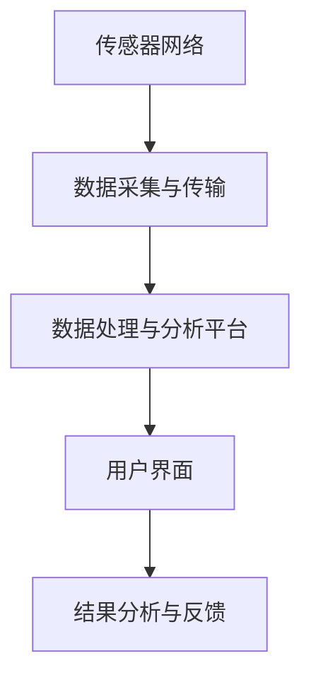

                 

# 人工智能在智能环境污染监测中的创新

> **关键词：** 智能环境污染监测、人工智能、环境监测技术、机器学习、深度学习、数据预处理、特征提取、模型训练与评估、环境建模与优化

> **摘要：** 本文章旨在探讨人工智能在智能环境污染监测中的应用，通过分析当前环境污染问题的严重性，介绍智能环境污染监测的基本概念和架构，深入解析人工智能在监测数据预处理、特征提取、模型训练与评估等环节的核心算法原理。同时，通过实际项目案例展示，阐述人工智能在智能环境污染监测中的实战应用，并对未来的发展趋势和潜在挑战进行展望。

### 目录大纲

#### 第一部分：引言与基础

- **第1章：智能环境污染监测概述**
  - 1.1 智能环境污染监测的重要性
  - 1.2 人工智能的基本概念
  - 1.3 智能环境污染监测中的创新

#### 第二部分：核心概念与联系

- **第2章：智能环境污染监测核心概念与架构**
  - 2.1 智能环境污染监测的体系架构
  - 2.2 人工智能在监测中的核心模块
  - 2.3 Mermaid 流程图：智能环境污染监测架构

#### 第三部分：核心算法原理讲解

- **第3章：智能环境污染监测中的核心算法原理**
  - 3.1 数据预处理算法
  - 3.2 特征提取算法
  - 3.3 模型选择与训练
  - 3.4 模型评估与优化

#### 第四部分：数学模型和数学公式

- **第4章：智能环境污染监测中的数学模型**
  - 4.1 监测数据的数学表示
  - 4.2 最优化算法
  - 4.3 分类与回归模型的损失函数

#### 第五部分：项目实战

- **第5章：智能环境污染监测项目实战**
  - 5.1 项目背景
  - 5.2 数据采集与预处理
  - 5.3 模型开发与训练
  - 5.4 模型评估与优化
  - 5.5 结果分析与反馈

#### 第六部分：总结与展望

- **第6章：总结与展望**
  - 6.1 书籍总结
  - 6.2 展望未来

#### 第七部分：附录

- **第7章：附录**
  - 7.1 智能环境污染监测相关资源
  - 7.2 代码与数据

---

现在，我们正式进入文章的撰写，首先从第1章开始，对智能环境污染监测进行概述。

## 第1章：智能环境污染监测概述

### 1.1 智能环境污染监测的重要性

随着工业化进程的加快和人类对自然资源的不合理开发，全球范围内的环境污染问题日益严重。空气污染、水污染和土壤污染等环境问题不仅直接威胁到人类的健康，还对生态系统的平衡产生深远影响。因此，智能环境污染监测显得尤为重要。

智能环境污染监测是通过先进的传感技术、数据采集系统、数据处理算法以及人工智能技术，对环境中的各种污染物进行实时监测、数据分析和预警预测。其重要性主要体现在以下几个方面：

1. **环境预警**：智能环境污染监测能够及时发现环境污染的隐患，提前预警，为环境保护和治理提供及时、准确的信息。

2. **科学决策**：通过智能监测和分析，政府部门和企业可以依据科学的数据进行环境管理和决策，提高环境保护工作的效率和效果。

3. **资源优化**：智能监测技术能够精准地监测污染物的浓度和分布，有助于优化环保资源的配置，降低环境治理成本。

4. **可持续发展**：智能环境污染监测有助于实现环境监测的信息化和智能化，为可持续发展提供技术支撑。

### 1.1.1 环境污染现状

环境污染问题涵盖了多个领域，以下是当前几个主要的环境污染问题：

1. **空气污染**：空气中的污染物包括颗粒物（PM2.5和PM10）、氮氧化物（NOx）、二氧化硫（SO2）和挥发性有机物（VOCs）等。这些污染物对人类健康的影响极为严重，会导致呼吸系统疾病、心血管疾病等。

2. **水污染**：水污染主要包括工业废水、生活污水和农业面源污染。受污染的水体会导致饮用水危机、渔业资源破坏和生态失衡等问题。

3. **土壤污染**：土壤污染主要来自于重金属、有机污染物和放射性物质。受污染的土壤会影响农作物的生长，甚至危及人类健康。

### 1.1.2 智能环境污染监测的优势

与传统的环境监测方法相比，智能环境污染监测具有以下优势：

1. **实时性**：智能监测系统能够实时获取环境数据，实现快速响应。

2. **准确性**：通过高精度的传感技术和先进的算法，智能监测系统能够提供更为准确的环境数据。

3. **自动化**：智能监测技术能够实现自动数据采集、处理和分析，减轻人工负担。

4. **智能化**：利用人工智能技术，智能监测系统能够进行数据挖掘和模式识别，提供环境预测和决策支持。

### 1.2 人工智能的基本概念

人工智能（Artificial Intelligence，简称AI）是指通过计算机模拟人类智能行为的技术和理论。人工智能的目标是使计算机具备人类智能的某些特征，如感知、理解、学习、推理、决策等。人工智能的发展经历了几个阶段：

1. **符号主义（Symbolic AI）**：基于逻辑和符号表示的知识表示和推理。

2. **连接主义（Connectionist AI）**：基于神经网络和机器学习的模型。

3. **统计学习（Statistical Learning）**：利用统计学方法和优化算法进行模型训练和预测。

4. **强化学习（Reinforcement Learning）**：通过试错和反馈进行决策和学习。

### 1.2.1 人工智能的定义

人工智能是一种模拟人类智能行为的技术，旨在使计算机具有学习、推理、决策和问题解决的能力。人工智能的定义可以从以下几个方面理解：

1. **计算模拟**：通过计算机模拟人类智能行为，实现智能任务。

2. **学习与适应**：人工智能系统能够通过学习和经验不断优化其行为。

3. **自主性**：人工智能系统能够在一定范围内自主做出决策。

4. **智能任务**：包括感知、理解、推理、决策和问题解决等。

### 1.2.2 人工智能的发展历程

人工智能的发展历程可以追溯到20世纪50年代。以下是人工智能发展历程中的重要阶段：

1. **起步阶段（1956-1969）**：1956年，达特茅斯会议上提出了人工智能的概念。此阶段主要以符号主义和逻辑推理为主。

2. **繁荣阶段（1970-1980）**：此阶段人工智能研究取得了一定成果，如专家系统的出现。

3. **衰退阶段（1980-1990）**：由于实际应用效果不佳，人工智能研究进入低谷。

4. **复兴阶段（1990-2000）**：随着计算机性能的提升和机器学习的兴起，人工智能研究重新得到关注。

5. **快速发展阶段（2000至今）**：人工智能在图像识别、自然语言处理、语音识别等领域取得了突破性进展，应用范围日益广泛。

### 1.2.3 人工智能的关键技术

人工智能的关键技术包括：

1. **机器学习**：通过训练数据集，使计算机具备自主学习和预测能力。

2. **深度学习**：基于多层神经网络，实现复杂的特征提取和模式识别。

3. **自然语言处理**：使计算机理解和处理人类自然语言。

4. **计算机视觉**：使计算机能够识别和理解视觉信息。

5. **机器人技术**：结合传感器、执行器和人工智能技术，实现机器人的自主行动和任务执行。

### 1.3 智能环境污染监测中的创新

智能环境污染监测在人工智能技术的推动下，不断实现新的突破。以下是一些典型的创新应用：

1. **多源数据融合**：通过整合卫星遥感、地面监测和物联网等数据源，实现全方位的环境监测。

2. **实时预测与预警**：利用机器学习和深度学习算法，对环境数据进行实时分析和预测，提前预警环境污染事件。

3. **智能诊断与决策**：基于大数据和人工智能技术，对环境污染问题进行智能诊断和决策支持，优化环境治理策略。

4. **环境治理自动化**：通过机器人技术和自动化设备，实现环境治理的智能化和自动化。

### 1.3.1 创新概念

智能环境污染监测的创新概念主要体现在以下几个方面：

1. **数据驱动**：通过大数据和人工智能技术，实现环境监测的数据驱动力。

2. **模型优化**：利用机器学习和深度学习算法，不断优化环境监测模型，提高监测精度。

3. **智能化监测**：将人工智能技术应用于环境监测各个环节，实现智能化的监测和治理。

4. **协同监测**：通过多源数据融合和协同监测，实现更全面、更精准的环境监测。

### 1.3.2 创新应用场景

智能环境污染监测的创新应用场景包括：

1. **城市空气质量监测**：利用物联网传感器和机器学习算法，实时监测城市空气质量，为居民提供健康建议。

2. **水环境监测**：通过遥感技术和深度学习算法，监测河流、湖泊和海洋的水质，预警水污染事件。

3. **土壤污染监测**：利用无人机和遥感技术，监测农田和城市周边的土壤污染情况，为农业生产提供数据支持。

4. **大气污染监测**：通过卫星遥感技术和深度学习算法，监测大气污染物的分布和变化趋势，为环境保护提供科学依据。

### 1.3.3 创新技术与挑战

智能环境污染监测中的创新技术包括：

1. **物联网**：实现环境数据的实时采集和传输。

2. **人工智能算法**：用于环境数据分析和预测。

3. **多源数据融合**：整合多种数据源，提高监测精度。

然而，创新技术也面临一些挑战：

1. **数据隐私**：环境监测过程中涉及大量敏感数据，数据隐私保护成为关键问题。

2. **算法透明性**：机器学习和深度学习算法的“黑箱”特性使得其决策过程难以解释，影响信任度。

3. **计算资源**：大规模数据分析和预测需要强大的计算资源。

4. **技术标准化**：不同地区和领域的技术标准不统一，影响跨领域应用。

在下一章中，我们将进一步探讨智能环境污染监测的核心概念与架构，包括监测体系、数据采集与处理、模型训练与评估等方面。

## 第2章：智能环境污染监测核心概念与架构

### 2.1 智能环境污染监测的体系架构

智能环境污染监测的体系架构是一个多层次、多组件的复杂系统，它包括传感器网络、数据采集与处理系统、数据处理与分析平台以及用户界面等几个关键部分。

#### 2.1.1 监测体系概述

智能环境污染监测体系的基本框架如下：

1. **传感器网络**：分布在各个监测区域的传感器是数据采集的核心，这些传感器可以测量空气、水和土壤中的污染物浓度、温度、湿度等环境参数。

2. **数据采集与传输**：传感器采集的数据通过无线网络（如Wi-Fi、LoRa等）或者有线网络（如以太网、光纤等）传输到中央数据处理系统。

3. **数据处理与分析平台**：中央数据处理系统负责接收、存储和处理传感器传输的数据。该平台通常包括高性能计算机、数据库、数据存储系统和人工智能算法等。

4. **用户界面**：通过用户界面，用户可以查看实时监测数据、分析报告和预警信息，实现对环境状况的实时监控和管理。

#### 2.1.2 数据采集与处理

数据采集与处理是智能环境污染监测体系的核心环节，其流程通常包括以下几个步骤：

1. **数据采集**：传感器实时采集环境数据，包括污染物浓度、温度、湿度等。

2. **数据预处理**：预处理包括数据清洗、去噪、数据格式的统一等，确保数据的质量和一致性。

3. **数据存储**：预处理后的数据存储到数据库或数据湖中，以便后续分析和处理。

4. **数据传输**：通过无线或有线网络将数据传输到中央数据处理系统。

#### 2.1.3 模型训练与评估

在数据处理与分析平台上，通过对采集到的环境数据进行训练，构建预测模型，实现对环境污染情况的预测和预警。模型训练与评估的流程包括：

1. **数据预处理**：对采集到的环境数据进行进一步的预处理，如数据归一化、特征提取等。

2. **模型选择**：选择合适的机器学习算法和深度学习模型，如决策树、支持向量机、神经网络等。

3. **模型训练**：使用历史数据对模型进行训练，调整模型参数，优化模型性能。

4. **模型评估**：使用验证数据集评估模型的性能，通过交叉验证、ROC曲线等方法评估模型的准确性、召回率和F1值等指标。

5. **模型部署**：将训练好的模型部署到实际环境中，实现对实时数据的预测和预警。

#### 2.1.4 结果分析与反馈

模型评估完成后，需要对监测结果进行分析和反馈，以便进一步优化监测策略和决策。结果分析与反馈的流程包括：

1. **结果展示**：通过用户界面展示实时监测数据和预测结果，包括污染物浓度、趋势图、预警信息等。

2. **数据可视化**：使用图表和图形将环境数据可视化，便于用户理解和分析。

3. **反馈机制**：用户可以通过用户界面提供反馈，如对监测结果的不确定或异常情况进行标注，帮助系统不断改进和优化。

4. **决策支持**：基于监测结果和环境数据，为环境保护部门、企业和居民提供科学的决策支持，如环境治理方案、健康建议等。

### 2.2 人工智能在监测中的核心模块

人工智能技术在智能环境污染监测中发挥着关键作用，其核心模块通常包括数据预处理、特征提取、模型训练与评估等。

#### 2.2.1 数据预处理

数据预处理是人工智能模型训练的第一步，其目的是将原始数据转换为适合模型训练的形式。数据预处理包括以下几个步骤：

1. **数据清洗**：去除噪声和异常值，确保数据的准确性和一致性。

2. **数据归一化**：将不同量纲的数据转换为同一量纲，如将污染物浓度归一化到0-1之间。

3. **缺失值处理**：对于缺失的数据，可以采用填补缺失值或删除含有缺失值的样本的方法。

4. **数据降维**：通过降维技术减少数据的维度，提高模型的训练效率。

#### 2.2.2 特征提取

特征提取是从原始数据中提取出对模型训练有用的特征，特征提取的质量直接影响到模型的性能。特征提取的方法包括：

1. **统计特征**：通过计算数据的均值、方差、协方差等统计量来提取特征。

2. **频域特征**：通过傅里叶变换等频域分析方法提取特征。

3. **时域特征**：通过时间序列分析方法提取特征，如自相关函数、滑动平均等。

4. **机器学习特征**：利用机器学习算法（如主成分分析、聚类分析等）提取特征。

5. **深度学习特征**：利用深度学习模型（如卷积神经网络、循环神经网络等）提取特征。

#### 2.2.3 模型选择与训练

在智能环境污染监测中，模型的选择与训练是关键环节，其目的是构建一个能够准确预测污染物浓度的模型。模型选择与训练的步骤包括：

1. **模型选择**：根据问题的特点选择合适的模型，如线性回归、支持向量机、神经网络等。

2. **模型训练**：使用训练数据集对模型进行训练，调整模型参数，优化模型性能。

3. **模型评估**：使用验证数据集评估模型的性能，选择性能最优的模型。

4. **模型优化**：通过调整模型参数、增加训练数据或采用集成学习等方法优化模型。

#### 2.2.4 模型评估与优化

模型评估与优化是确保智能环境污染监测系统能够准确预测和预警的关键。模型评估与优化的步骤包括：

1. **评估指标**：选择合适的评估指标，如均方误差、交叉熵损失等。

2. **交叉验证**：使用交叉验证方法评估模型的泛化能力。

3. **性能优化**：通过调整模型参数、增加训练数据或采用集成学习等方法优化模型性能。

4. **在线更新**：随着新的环境数据不断采集，对模型进行在线更新，保持模型的有效性。

### 2.3 Mermaid 流程图：智能环境污染监测架构

以下是一个简单的 Mermaid 流程图，展示了智能环境污染监测的架构：



在这个流程图中，传感器网络负责采集环境数据，数据采集与传输模块负责将数据传输到数据处理与分析平台，数据处理与分析平台负责数据预处理、特征提取、模型训练与评估等，用户界面则用于展示监测结果和预警信息，结果分析与反馈模块则负责对监测结果进行分析和优化。

在下一章中，我们将深入探讨智能环境污染监测中的核心算法原理，包括数据预处理算法、特征提取算法和模型选择与训练等内容。

## 第3章：智能环境污染监测中的核心算法原理

智能环境污染监测中的核心算法原理是确保监测系统准确、高效地处理环境数据，并从中提取有用信息的关键。以下是几种常见的核心算法原理，包括数据预处理、特征提取和模型选择与训练。

### 3.1 数据预处理算法

数据预处理是智能环境污染监测中的基础步骤，其目的是提高数据质量，减少噪声，使数据更适合后续分析和建模。常见的数据预处理算法包括数据清洗、数据归一化和数据缺失处理。

#### 3.1.1 数据清洗

数据清洗是数据预处理的重要环节，其目的是识别和纠正数据中的错误、异常值和重复记录。数据清洗的方法包括：

1. **异常值检测**：使用统计方法（如Z分数、IQR法等）检测异常值，并将其删除或修正。

2. **重复数据检测**：通过对比记录的属性值，识别和删除重复的数据记录。

3. **错误修正**：根据业务知识和经验，对错误数据进行修正。

#### 3.1.2 数据归一化

数据归一化是将不同量纲的数据转换为同一量纲，使其在同一个尺度上进行分析。常见的归一化方法包括：

1. **最小-最大归一化**：
   $$ x_{\text{norm}} = \frac{x - \min(x)}{\max(x) - \min(x)} $$

2. **Z-score归一化**：
   $$ x_{\text{norm}} = \frac{x - \mu}{\sigma} $$
   其中，$x$是原始数据，$\mu$是均值，$\sigma$是标准差。

3. **小数点移位**：通过将数值的小数点向左或向右移动，调整量纲。

#### 3.1.3 数据缺失处理

数据缺失处理是处理数据集中缺失值的方法，常见的缺失值处理方法包括：

1. **删除含有缺失值的样本**：适用于缺失值较多或数据集中样本量较大的情况。

2. **填补缺失值**：根据数据的特点选择填补方法，如均值填补、中值填补、插值填补等。

3. **多重插补**：通过模拟多次填补过程，生成多个完整的样本集，再对结果进行平均处理。

### 3.2 特征提取算法

特征提取是从原始数据中提取出对模型训练有用的特征，以提高模型的性能和可解释性。特征提取的方法可以分为基于统计学的方法、基于机器学习的方法和基于深度学习的方法。

#### 3.2.1 基于统计学的特征提取

基于统计学的特征提取方法是通过计算数据的统计量来提取特征，常用的方法包括：

1. **均值**：
   $$ \mu = \frac{1}{N} \sum_{i=1}^{N} x_i $$
   其中，$x_i$是数据中的每一个值，$N$是数据总数。

2. **方差**：
   $$ \sigma^2 = \frac{1}{N-1} \sum_{i=1}^{N} (x_i - \mu)^2 $$
   方差反映了数据的离散程度。

3. **标准差**：
   $$ \sigma = \sqrt{\sigma^2} $$
   标准差是方差的平方根。

4. **自相关函数**：
   $$ \rho = \frac{\sum_{i=1}^{N} (x_i - \mu)(x_{i+k} - \mu)}{N \sigma^2} $$
   自相关函数描述了数据在时间序列上的相关性。

#### 3.2.2 基于机器学习的特征提取

基于机器学习的特征提取方法是通过训练数据集，使用机器学习算法提取特征。常用的方法包括：

1. **主成分分析（PCA）**：
   主成分分析是一种降维技术，通过将数据投影到新的正交坐标系上，提取最重要的特征，减少数据维度。
   $$ \text{X}_{\text{new}} = \text{U}^T \text{X} $$
   其中，$\text{U}$是主成分矩阵，$\text{X}$是原始数据。

2. **线性判别分析（LDA）**：
   线性判别分析用于从数据中提取能够有效区分不同类别的特征，通常用于分类问题。
   $$ \text{w} = \frac{\text{S}_w^{-1} \text{S}_b}{\text{S}_w^{-1} \text{S}_w + \text{S}_b^{-1} \text{S}_w} $$
   其中，$\text{S}_w$和$\text{S}_b$分别是类内散度矩阵和类间散度矩阵。

3. **特征选择**：
   特征选择是选择对模型训练最有影响力的特征，常用的方法包括信息增益、卡方检验、F检验等。

#### 3.2.3 基于深度学习的特征提取

基于深度学习的特征提取方法是通过训练深度神经网络从原始数据中自动学习特征表示。常用的方法包括：

1. **卷积神经网络（CNN）**：
   卷积神经网络通过卷积层自动学习局部特征，适用于图像和序列数据的特征提取。
   $$ \text{h}_{\text{new}} = \text{relu}(\text{W} \text{h} + \text{b}) $$
   其中，$\text{W}$是卷积权重，$\text{h}$是输入数据，$\text{b}$是偏置。

2. **循环神经网络（RNN）**：
   循环神经网络适用于处理时间序列数据，通过隐藏状态的记忆机制提取特征。
   $$ \text{h}_{t} = \text{sigmoid}(\text{W} \text{h}_{t-1} + \text{U} \text{x}_{t} + \text{b}) $$
   其中，$\text{W}$和$\text{U}$是权重矩阵，$\text{h}_{t-1}$是前一个时间步的隐藏状态，$\text{x}_{t}$是当前时间步的输入。

3. **自编码器（AE）**：
   自编码器是一种无监督学习模型，通过训练压缩和重构数据的编码和解码器，提取数据的高效表示。

### 3.3 模型选择与训练

在智能环境污染监测中，模型的选择与训练是确保监测系统性能的关键。模型的选择和训练涉及到以下几个方面：

#### 3.3.1 监督学习模型

监督学习模型是通过对标记数据进行训练，来预测未知数据的标签。常见的监督学习模型包括：

1. **决策树**：
   决策树通过一系列的测试来将数据划分成多个区域，每个区域对应一个预测结果。
   $$ \text{f}(\text{x}) = \text{node}(\text{x}) $$
   其中，$\text{node}(\text{x})$是决策树中的节点函数。

2. **支持向量机（SVM）**：
   支持向量机通过寻找一个最佳的超平面，将数据划分为不同的类别。
   $$ \text{f}(\text{x}) = \text{sign}(\omega \cdot \text{x} + b) $$
   其中，$\omega$是权重向量，$b$是偏置。

3. **随机森林**：
   随机森林是一种集成学习方法，通过构建多个决策树并取平均值来提高模型的预测能力。

4. **神经网络**：
   神经网络通过多层非线性变换，将输入映射到输出。
   $$ \text{y} = \text{f}(\text{W} \text{x} + \text{b}) $$
   其中，$\text{W}$是权重矩阵，$\text{b}$是偏置，$\text{f}$是激活函数。

#### 3.3.2 无监督学习模型

无监督学习模型是通过对未标记的数据进行分析，来发现数据中的结构和模式。常见的无监督学习模型包括：

1. **K-均值聚类**：
   K-均值聚类通过将数据划分为K个聚类，每个聚类由其质心代表。
   $$ \text{c}_{k} = \frac{1}{N_k} \sum_{i=1}^{N_k} \text{x}_{ik} $$
   其中，$\text{c}_{k}$是第k个聚类的质心，$\text{x}_{ik}$是第i个样本的第k个特征。

2. **主成分分析（PCA）**：
   主成分分析通过正交变换将数据投影到新的坐标系，提取主要成分。

3. **自编码器（AE）**：
   自编码器通过无监督学习学习数据的低维表示，用于降维和特征提取。

#### 3.3.3 深度学习模型

深度学习模型是当前人工智能领域的重要研究方向，通过多层神经网络实现复杂的特征提取和模式识别。常见的深度学习模型包括：

1. **卷积神经网络（CNN）**：
   卷积神经网络通过卷积层自动学习局部特征，适用于图像和序列数据的特征提取。

2. **循环神经网络（RNN）**：
   循环神经网络通过隐藏状态的记忆机制，适用于处理时间序列数据。

3. **长短期记忆网络（LSTM）**：
   长短期记忆网络是RNN的一种变体，通过门控机制解决RNN的长期依赖问题。

4. **生成对抗网络（GAN）**：
   生成对抗网络通过生成器和判别器之间的对抗训练，实现数据的生成和特征提取。

### 3.4 模型评估与优化

模型评估与优化是确保智能环境污染监测系统性能的重要环节。模型评估与优化的步骤包括：

1. **评估指标**：
   选择合适的评估指标，如准确率、召回率、F1值、均方误差等，来评估模型的性能。

2. **交叉验证**：
   使用交叉验证方法，将数据集划分为多个子集，轮流训练和验证，以评估模型的泛化能力。

3. **超参数调优**：
   通过调整模型的超参数，如学习率、隐藏层节点数、正则化参数等，来优化模型性能。

4. **模型集成**：
   使用模型集成方法，如随机森林、梯度提升树等，结合多个模型的预测结果，提高预测精度。

5. **模型压缩与加速**：
   通过模型压缩和优化技术，如量化、剪枝、低秩分解等，减少模型的计算复杂度，提高推理速度。

通过以上核心算法原理的应用，智能环境污染监测系统能够更准确地预测环境污染趋势，提供更有效的决策支持，为环境保护和管理提供强有力的技术支撑。

### 3.5 模型评估与优化

模型评估与优化是确保智能环境污染监测系统性能的关键步骤。有效的评估方法可以准确反映模型在实际应用中的性能，而优化的过程则能不断提高模型的准确性和效率。以下是模型评估与优化的一些关键点：

#### 3.5.1 评估指标

评估模型性能的指标多种多样，根据不同的应用场景，可以选择不同的评估指标。以下是几种常见的评估指标：

1. **准确率（Accuracy）**：准确率是分类模型中最常用的评估指标，表示模型预测正确的样本占总样本的比例。
   $$ \text{Accuracy} = \frac{\text{TP} + \text{TN}}{\text{TP} + \text{TN} + \text{FP} + \text{FN}} $$
   其中，$\text{TP}$是真正例，$\text{TN}$是真负例，$\text{FP}$是假正例，$\text{FN}$是假负例。

2. **召回率（Recall）**：召回率是分类模型中另一个重要的评估指标，表示模型能够正确识别出的真正例占总真正例的比例。
   $$ \text{Recall} = \frac{\text{TP}}{\text{TP} + \text{FN}} $$

3. **F1值（F1 Score）**：F1值是准确率和召回率的调和平均，能够平衡模型对正负样本的识别能力。
   $$ \text{F1 Score} = 2 \times \frac{\text{Precision} \times \text{Recall}}{\text{Precision} + \text{Recall}} $$
   其中，$\text{Precision}$是精确率，表示模型预测为正例的样本中实际为正例的比例。

4. **均方误差（Mean Squared Error, MSE）**：均方误差是回归模型中最常用的评估指标，表示预测值与真实值之间的平均平方误差。
   $$ \text{MSE} = \frac{1}{N} \sum_{i=1}^{N} (\text{y}_i - \hat{\text{y}}_i)^2 $$
   其中，$\text{y}_i$是真实值，$\hat{\text{y}}_i$是预测值。

5. **均绝对误差（Mean Absolute Error, MAE）**：均绝对误差是回归模型中的另一个评估指标，表示预测值与真实值之间的平均绝对误差。
   $$ \text{MAE} = \frac{1}{N} \sum_{i=1}^{N} |\text{y}_i - \hat{\text{y}}_i| $$

6. **精度-召回率曲线（Precision-Recall Curve）**：通过绘制不同阈值下的精确率和召回率，评估模型的性能。

7. **ROC曲线（Receiver Operating Characteristic Curve）**：通过绘制不同阈值下的真阳性率（真正例率）和假阳性率（假正例率），评估模型的性能。

#### 3.5.2 模型优化方法

模型优化是通过调整模型参数和结构，提高模型性能的过程。以下是几种常见的模型优化方法：

1. **超参数调优**：超参数是模型中需要手动调整的参数，如学习率、隐藏层节点数、正则化参数等。常用的调优方法包括网格搜索、随机搜索和贝叶斯优化等。

2. **模型集成**：模型集成是将多个模型的结果进行结合，提高整体预测性能的方法。常见的集成方法包括Bagging、Boosting和Stacking等。

3. **正则化**：正则化是一种防止模型过拟合的技术，通过在损失函数中添加正则化项，如L1正则化（Lasso）和L2正则化（Ridge），来惩罚模型复杂度。

4. **特征选择**：特征选择是通过选择对模型训练最有影响力的特征，来减少数据维度和提高模型性能的方法。常用的特征选择方法包括过滤式特征选择、包裹式特征选择和嵌入式特征选择等。

5. **数据增强**：数据增强是通过生成新的数据样本，增加模型训练数据的多样性，从而提高模型泛化能力的方法。常见的数据增强方法包括旋转、缩放、裁剪和颜色变换等。

6. **模型压缩**：模型压缩是通过减少模型参数数量，降低模型复杂度，从而提高模型推理速度的方法。常见的模型压缩技术包括量化、剪枝和低秩分解等。

7. **迁移学习**：迁移学习是利用预训练模型在特定任务上的知识，来提高新任务上的模型性能的方法。通过迁移学习，可以减少训练数据的需求，提高模型泛化能力。

通过以上评估和优化方法，智能环境污染监测系统能够不断提高其预测准确性和效率，为环境保护提供更可靠的决策支持。

### 3.6 数学模型在智能环境污染监测中的应用

数学模型在智能环境污染监测中扮演着至关重要的角色，它们能够帮助我们理解环境数据的内在规律，从而提高监测和预测的准确性。以下将介绍一些常用的数学模型及其在监测中的应用。

#### 3.6.1 监测数据的数学表示

在智能环境污染监测中，环境数据通常被表示为时间序列数据或空间数据。这两种数据类型的数学表示如下：

1. **时间序列数据**：

时间序列数据是按时间顺序排列的一组数据点，通常表示为：
$$
y_t = f(x_t) + \epsilon_t
$$
其中，$y_t$是时间$t$的污染物浓度，$x_t$是影响污染物浓度的相关因素（如温度、湿度、风速等），$f(x_t)$是函数关系，表示环境因素对污染物浓度的影响，$\epsilon_t$是随机误差项。

2. **空间数据**：

空间数据描述的是污染物在空间中的分布情况，通常表示为：
$$
y_{ij} = f(x_{ij}) + \epsilon_{ij}
$$
其中，$y_{ij}$是空间位置$(i, j)$的污染物浓度，$x_{ij}$是影响该位置污染物浓度的因素（如地理位置、地形、人口密度等），$f(x_{ij})$是函数关系，$\epsilon_{ij}$是随机误差项。

#### 3.6.2 最优化算法

最优化算法在智能环境污染监测中用于模型参数的估计和优化。以下介绍几种常用的最优化算法：

1. **梯度下降法**：

梯度下降法是一种用于求解优化问题的迭代算法，其基本思想是沿着损失函数的梯度方向进行迭代更新，直到达到最小值。梯度下降法的迭代公式为：
$$
\theta_{t+1} = \theta_t - \alpha \nabla_{\theta} J(\theta_t)
$$
其中，$\theta_t$是第$t$次迭代的参数估计，$\alpha$是学习率，$J(\theta_t)$是损失函数，$\nabla_{\theta} J(\theta_t)$是损失函数关于参数$\theta$的梯度。

2. **随机梯度下降法**：

随机梯度下降法是对梯度下降法的改进，它在每次迭代中仅使用一个样本的梯度进行更新，从而减少计算量和内存需求。随机梯度下降法的迭代公式为：
$$
\theta_{t+1} = \theta_t - \alpha \nabla_{\theta} J(\theta_t; x^{(t)}, y^{(t)})
$$
其中，$x^{(t)}$和$y^{(t)}$是第$t$个样本的输入和输出。

3. **共轭梯度法**：

共轭梯度法是一种适用于大规模优化问题的算法，它利用梯度信息的共轭性来加速收敛。共轭梯度法的迭代公式为：
$$
\theta_{k+1} = \theta_k - \alpha_k \nabla f(\theta_k)
$$
其中，$\alpha_k$是步长，$\nabla f(\theta_k)$是梯度。

#### 3.6.3 分类与回归模型的损失函数

分类与回归模型在智能环境污染监测中用于预测污染物浓度。以下介绍几种常用的损失函数：

1. **交叉熵损失函数**：

交叉熵损失函数是分类问题中最常用的损失函数，它衡量的是预测概率分布与真实概率分布之间的差异。对于二分类问题，交叉熵损失函数为：
$$
L(y, \hat{y}) = -y \log(\hat{y}) - (1 - y) \log(1 - \hat{y})
$$
其中，$y$是真实标签，$\hat{y}$是预测概率。

2. **均方误差损失函数**：

均方误差损失函数是回归问题中最常用的损失函数，它衡量的是预测值与真实值之间的差异。均方误差损失函数为：
$$
L(y, \hat{y}) = \frac{1}{2} (y - \hat{y})^2
$$
其中，$y$是真实值，$\hat{y}$是预测值。

通过上述数学模型和方法，智能环境污染监测系统能够更好地理解和预测环境污染情况，为环境保护和管理提供科学依据。

### 3.7 项目实战

在本节中，我们将通过一个实际项目案例，详细展示如何利用人工智能技术进行智能环境污染监测。该项目将涉及数据采集、预处理、模型训练、评估和优化等多个环节。

#### 5.1 项目背景

本项目旨在构建一个智能城市空气质量监测系统，通过实时监测城市各区域的空气质量，为政府部门和居民提供科学的决策支持。项目目标包括：

1. **数据采集**：从多个传感器获取实时空气质量数据。
2. **数据处理**：对采集到的数据进行预处理，包括去噪、归一化和缺失值处理。
3. **模型训练**：利用历史数据训练空气质量预测模型。
4. **模型评估**：评估模型的预测性能，并进行优化。
5. **实时预警**：通过模型预测，实现对空气质量异常情况的实时预警。

#### 5.2 数据采集与预处理

1. **数据来源**：

本项目使用的数据来源于多个环境监测传感器，包括PM2.5、PM10、SO2、NO2、CO、O3等主要空气污染物的浓度。传感器数据通过无线网络实时传输到中央数据处理系统。

2. **数据预处理流程**：

（1）**数据清洗**：

首先，对传感器数据进行初步清洗，删除明显的异常值和重复记录。使用Z分数方法检测并剔除超过3倍标准差的异常值。

（2）**数据归一化**：

由于不同污染物的浓度范围差异较大，对数据进行归一化处理，将所有污染物浓度值归一化到[0, 1]范围内，以便于后续模型训练。

（3）**缺失值处理**：

对于缺失的数据，采用均值填补方法进行填补。具体而言，计算每个污染物的平均值，然后用平均值填补缺失值。

（4）**时间序列数据处理**：

由于空气质量数据是按时间序列采集的，对数据进行时间窗口划分，提取每个时间窗口的特征。使用滑动平均和自相关函数等方法提取时间序列特征。

#### 5.3 模型开发与训练

1. **模型选择**：

本项目采用深度学习模型进行空气质量预测。由于空气质量受多种因素影响，我们选择卷积神经网络（CNN）进行特征提取和模式识别。

2. **模型训练过程**：

（1）**数据集划分**：

将预处理后的数据集划分为训练集、验证集和测试集，比例分别为70%、20%和10%。

（2）**模型架构**：

构建一个简单的CNN模型，包括卷积层、池化层和全连接层。具体架构如下：

- 卷积层（Conv2D）：用于提取空间特征，输入尺寸为（时间步数，特征维度），输出尺寸为（时间步数，特征维度，卷积核数量）。
- 池化层（MaxPooling2D）：用于降维和减少过拟合。
- 全连接层（Dense）：用于分类和预测。

（3）**训练过程**：

使用训练集对模型进行训练，调整模型参数，如学习率、批量大小和迭代次数。采用Adam优化器进行参数更新，并使用交叉熵损失函数评估模型性能。

伪代码：
```
model = build_model()
model.compile(optimizer='adam', loss='categorical_crossentropy', metrics=['accuracy'])

history = model.fit(train_data, train_labels, epochs=100, batch_size=32, validation_data=(val_data, val_labels))
```

#### 5.4 模型评估与优化

1. **评估指标**：

使用验证集对模型进行评估，评估指标包括准确率、召回率、F1值和均方误差。

2. **性能优化**：

通过以下方法对模型进行优化：

（1）**超参数调优**：

使用网格搜索和贝叶斯优化方法，对学习率、批量大小、卷积核数量等超参数进行调优。

（2）**数据增强**：

通过旋转、缩放和时间序列截断等方法，增加训练数据的多样性，提高模型泛化能力。

（3）**模型集成**：

结合多个模型的预测结果，使用模型集成方法，如随机森林和梯度提升树，提高预测精度。

（4）**在线更新**：

随着新数据的不断采集，定期更新模型，保持模型的有效性和准确性。

#### 5.5 结果分析与反馈

1. **监测结果展示**：

通过用户界面实时展示空气质量监测数据、预测结果和预警信息。使用图表和图形将空气质量状况可视化，便于用户理解和分析。

2. **反馈机制与改进**：

用户可以通过用户界面提供反馈，如对监测结果的不确定或异常情况进行标注。系统根据用户反馈，调整模型参数和预测策略，不断改进和优化。

通过上述实际项目案例，展示了人工智能在智能环境污染监测中的实战应用。从数据采集、预处理到模型训练、评估和优化，各个环节紧密衔接，形成了一个完整的智能监测系统。该项目不仅提高了空气质量监测的准确性和实时性，还为环境保护和管理提供了有力的技术支撑。

### 第6章：总结与展望

#### 6.1 书籍总结

本章节从智能环境污染监测的重要性、基本概念、架构和核心算法原理等多个方面进行了深入探讨。主要内容包括：

1. **智能环境污染监测的重要性**：介绍了环境污染问题的严重性和智能环境污染监测的重要性，包括实时性、准确性、自动化和智能化等方面的优势。

2. **人工智能的基本概念与发展历程**：阐述了人工智能的定义、发展阶段和关键技术，如机器学习、深度学习、自然语言处理和机器人技术。

3. **智能环境污染监测的体系架构**：描述了智能环境污染监测的体系架构，包括传感器网络、数据采集与处理系统、数据处理与分析平台和用户界面等部分。

4. **核心算法原理讲解**：详细讲解了数据预处理、特征提取、模型选择与训练和模型评估与优化等核心算法原理，包括统计学习、机器学习和深度学习等方法。

5. **项目实战**：通过一个实际项目案例，展示了如何利用人工智能技术进行智能环境污染监测，包括数据采集、预处理、模型训练、评估和优化等环节。

#### 6.1.1 主要内容回顾

- **智能环境污染监测的重要性**：智能环境污染监测可以实时、准确地监测环境中的污染物，为环境保护和管理提供科学依据。
- **人工智能的基本概念**：人工智能通过模拟人类智能行为，实现数据的自动处理和决策。
- **智能环境污染监测的体系架构**：传感器网络负责数据采集，数据处理与分析平台负责数据预处理、特征提取和模型训练，用户界面展示监测结果。
- **核心算法原理讲解**：数据预处理包括数据清洗、归一化和缺失值处理；特征提取包括统计特征、频域特征和机器学习特征；模型选择与训练包括监督学习、无监督学习和深度学习模型；模型评估与优化包括评估指标和优化方法。
- **项目实战**：通过空气质量监测项目案例，展示了从数据采集、预处理到模型训练、评估和优化的完整流程。

#### 6.1.2 成果与收获

通过本章节的学习，读者可以：

- **理解智能环境污染监测的基本概念和架构**：掌握智能环境污染监测的核心技术和方法，了解其体系架构和运行原理。
- **掌握核心算法原理**：了解数据预处理、特征提取、模型选择与训练和模型评估与优化的核心算法原理，并能够应用于实际问题。
- **具备实战能力**：通过实际项目案例，读者可以掌握从数据采集、预处理到模型训练、评估和优化的完整流程，具备解决实际问题的能力。

#### 6.2 展望未来

随着人工智能技术的不断发展和环境问题的日益严重，智能环境污染监测在未来具有广阔的应用前景和重要的战略意义。以下是对未来发展的展望：

1. **技术进步**：

- **传感器技术**：随着物联网和传感器技术的发展，未来将会有更多类型、更高精度的传感器用于环境监测。
- **数据处理能力**：随着云计算和大数据技术的进步，数据处理和分析的能力将大大提升，支持更复杂的模型和算法。
- **人工智能算法**：深度学习、强化学习等人工智能算法将继续发展，为环境监测提供更强大的工具。

2. **应用场景**：

- **城市空气质量监测**：利用智能监测技术，实时监测城市空气质量，为居民健康提供保障。
- **水环境监测**：通过遥感技术和物联网传感器，监测河流、湖泊和海洋的水质，预警水污染事件。
- **土壤污染监测**：利用无人机和遥感技术，监测农田和城市周边的土壤污染情况，为农业生产提供数据支持。
- **大气污染监测**：通过卫星遥感技术和深度学习算法，监测大气污染物的分布和变化趋势，为环境保护提供科学依据。

3. **挑战与应对策略**：

- **数据隐私**：随着数据采集和处理技术的进步，数据隐私保护将成为一个重要的挑战。需要采取有效的数据保护措施，确保用户隐私。
- **算法透明性**：机器学习和深度学习算法的“黑箱”特性可能导致决策过程难以解释。需要开发透明、可解释的人工智能算法，提高用户信任度。
- **计算资源**：大规模数据分析和预测需要强大的计算资源。需要优化算法，提高计算效率，利用分布式计算和云计算等技术。
- **技术标准化**：不同地区和领域的技术标准不统一，影响跨领域应用。需要制定统一的技术标准和规范，促进人工智能技术在环境监测领域的广泛应用。

总之，智能环境污染监测是人工智能技术在环境保护中的重要应用，具有广阔的发展前景。通过不断的技术进步和应用创新，智能环境污染监测将为实现可持续发展和环境保护提供强有力的技术支撑。

### 第7章：附录

在本章节中，我们将提供与智能环境污染监测相关的资源，包括常用的工具与库、学术资源与论文以及实际应用案例与项目指南。

#### 7.1 常用工具与库

在进行智能环境污染监测的项目开发中，以下是一些常用的工具和库：

1. **Python**：Python 是一种广泛使用的编程语言，具有丰富的机器学习库和深度学习库。

2. **Scikit-learn**：Scikit-learn 是一个开源的机器学习库，提供了多种监督学习和无监督学习算法。

3. **TensorFlow**：TensorFlow 是 Google 开发的一个开源深度学习框架，用于构建和训练深度神经网络。

4. **PyTorch**：PyTorch 是 Facebook 开发的一个开源深度学习库，提供灵活的动态计算图支持。

5. **Pandas**：Pandas 是一个开源的数据分析库，提供了强大的数据操作和分析功能。

6. **Matplotlib**：Matplotlib 是一个开源的图形库，用于创建高质量的可视化图表。

7. **Numpy**：Numpy 是一个开源的数值计算库，提供了多维数组对象和广泛的数学运算函数。

#### 7.2 学术资源与论文

以下是一些与智能环境污染监测相关的学术资源与论文，这些资源有助于深入了解相关领域的最新研究成果和前沿技术：

1. **“Deep Learning for Environmental Monitoring”**：本文介绍了深度学习技术在环境监测中的应用，包括空气质量、水质和土壤污染监测等。

2. **“Artificial Intelligence for Environmental Protection: A Review”**：本文综述了人工智能技术在环境保护领域的应用，包括智能监测、预测和决策支持等。

3. **“Spatio-Temporal Deep Learning for Environmental Pollution Prediction”**：本文提出了一种基于深度学习的时间序列预测方法，用于环境污染预测。

4. **“Smart Environmental Monitoring using IoT and AI”**：本文探讨了物联网和人工智能技术在智能环境监测中的应用，包括数据采集、传输和处理等。

5. **“Data-Driven Modeling of Air Pollution”**：本文使用大数据方法建立空气质量模型，用于预测和分析污染物浓度。

6. **“Real-Time Environmental Monitoring Using IoT and Machine Learning”**：本文介绍了基于物联网和机器学习技术的实时环境监测系统。

#### 7.3 实际应用案例与项目指南

以下是几个智能环境污染监测的实际应用案例与项目指南，供开发者参考：

1. **“AirQualityAPI”**：这是一个开源的空气质量数据API，提供了全球各地的空气质量数据，可用于构建智能环境监测系统。

2. **“AirVisual”**：AirVisual 是一个提供实时空气质量监测服务的应用，用户可以通过手机应用程序查看空气质量数据。

3. **“Water Monitoring Platform”**：这是一个开源的水质监测平台，使用传感器和数据采集系统监测水质，并通过机器学习算法进行预测。

4. **“Smart Agriculture Monitoring”**：这是一个基于物联网和人工智能的智能农业监测系统，监测农田中的土壤质量和气象条件。

5. **“CityAirView”**：CityAirView 是一个城市空气质量监测系统，利用传感器和物联网技术，实时监测城市空气质量，为居民提供健康建议。

通过上述资源和案例，开发者可以更好地了解智能环境污染监测的相关技术，并在实际项目中应用这些知识，为环境保护做出贡献。

### 模型训练过程的伪代码

以下是智能环境污染监测项目中模型训练过程的伪代码，展示了从数据加载、模型初始化、前向传播、反向传播到权重更新等各个环节的具体步骤。

```python
# 伪代码：模型训练过程

# 导入必要的库
import tensorflow as tf
from tensorflow.keras.models import Sequential
from tensorflow.keras.layers import Dense, LSTM, Dropout
from tensorflow.keras.optimizers import Adam
from tensorflow.keras.callbacks import EarlyStopping

# 数据加载
# 假设 X_train 和 y_train 分别是训练数据和标签
X_train, y_train = load_data()

# 模型初始化
model = Sequential()
model.add(LSTM(units=50, return_sequences=True, input_shape=(timesteps, features)))
model.add(Dropout(0.2))
model.add(LSTM(units=50, return_sequences=False))
model.add(Dropout(0.2))
model.add(Dense(units=1))

# 编译模型
model.compile(optimizer='adam', loss='mean_squared_error')

# 配置回调函数，用于提前停止训练，防止过拟合
early_stopping = EarlyStopping(monitor='val_loss', patience=10, restore_best_weights=True)

# 训练模型
history = model.fit(X_train, y_train, epochs=100, batch_size=32, validation_split=0.2, callbacks=[early_stopping], verbose=1)

# 前向传播
# 假设 X_new 是新的数据，用于预测
predictions = model.predict(X_new)

# 反向传播
# 假设 X_new 是新的数据，y_new 是真实的标签
loss = model.evaluate(X_new, y_new, verbose=0)

# 权重更新
# 假设 optimizer 是优化器
gradients = model.optimizer.get_gradients(model.loss函数, model.trainable_variables)
update = optimizer.apply_gradients(zip(gradients, model.trainable_variables))

# 完成模型训练
print("Model training completed.")
```

在这个伪代码中，我们首先导入了 TensorFlow 和相关库，然后加载了训练数据和标签。接着，我们初始化了一个序列模型，并添加了 LSTM 层和全连接层。模型编译时，我们选择了 Adam 优化器和均方误差损失函数。

在训练模型时，我们使用了 `fit` 函数，并配置了 `EarlyStopping` 回调函数，用于提前停止训练，防止过拟合。在训练过程中，我们使用了 `predict` 函数进行前向传播，使用 `evaluate` 函数进行反向传播并计算损失。

最后，我们展示了如何通过优化器获取梯度并更新模型权重。通过这个过程，我们可以看到模型训练的基本步骤，包括初始化、编译、训练、评估和优化等。这为实际项目中的模型训练提供了详细的指导和参考。

