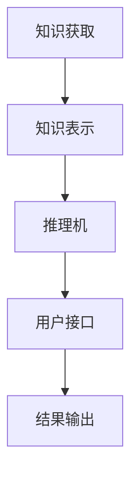
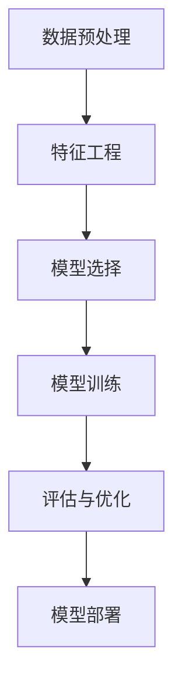
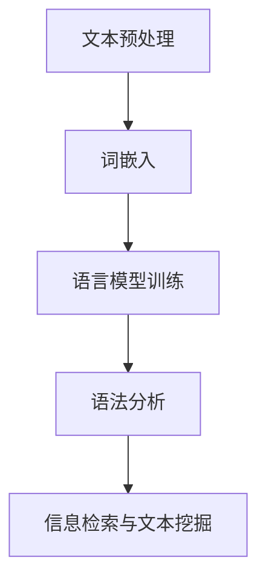
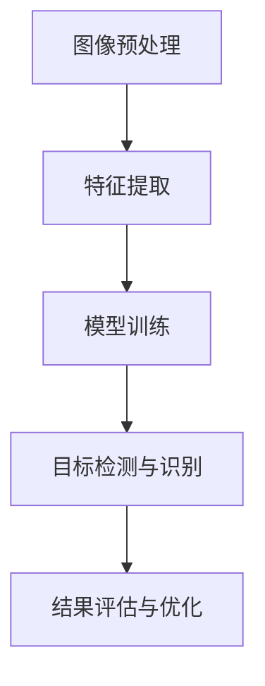

                 

## 人工智能研究的早期方向

关键词：人工智能、早期研究、机器学习、自然语言处理、计算机视觉、专家系统

摘要：人工智能作为计算机科学的一个分支，自诞生以来经历了多次革新与变革。本文旨在梳理人工智能研究的早期方向，探讨其核心概念、技术原理、应用实例及未来展望，为读者提供全面的人工智能入门指南。

### 人工智能的起源与发展

人工智能（Artificial Intelligence，简称AI）的定义是指模拟人类智能行为的计算机系统。这一概念最早由计算机科学家约翰·麦卡锡（John McCarthy）在1956年的达特茅斯会议上首次提出。在此之前，计算机科学的发展主要集中在计算效率和算法优化上，而人工智能则开启了计算机模拟人类智能的新纪元。

#### 1.1 人工智能的定义与历史背景

人工智能的定义虽然简单，但其内涵却十分丰富。它不仅包括逻辑推理、知识表示、问题求解等传统领域，还涵盖了机器学习、自然语言处理、计算机视觉等现代AI的核心技术。人工智能的历史背景可以追溯到20世纪40年代，当时科学家们开始探讨计算机能否具备人类的智能。

- **阿兰·图灵的“通用计算机”**：1936年，英国数学家阿兰·图灵提出了“通用计算机”的概念，并设计了图灵机，这是计算机科学的基础。图灵的论文《计算机器与智能》奠定了现代人工智能的理论基础。

- **人工智能的黄金时代**：20世纪50年代至70年代，人工智能开始受到广泛关注，以专家系统为代表的早期AI技术取得了显著成果。然而，受限于当时的计算能力和算法复杂性，人工智能在80年代遭遇了第一次“寒冬”。

- **现代人工智能的兴起**：从20世纪90年代至今，随着计算能力的提升、大数据的普及以及机器学习技术的发展，人工智能再次迎来爆发期，深度学习、强化学习等前沿技术不断涌现。

#### 1.2 早期人工智能研究方向与核心问题

在人工智能的早期发展阶段，研究者们主要关注以下几个研究方向：

- **专家系统**：基于规则的方法，模拟人类专家的决策过程，解决特定领域的问题。

- **机器学习**：通过统计学习和模式识别，让计算机从数据中自动学习，提高其智能水平。

- **自然语言处理**：研究计算机如何理解、生成和处理自然语言，实现人机交互。

- **计算机视觉**：模拟人类视觉系统，实现图像识别、目标检测等任务。

- **机器人学**：研究机器人的自主移动、感知和操作能力，实现机器人在复杂环境中的任务执行。

这些研究方向不仅奠定了人工智能的基础，还推动了现代AI技术的发展。在接下来的章节中，我们将详细探讨这些早期研究方向的核心问题和关键技术。

### 早期人工智能的成就与挑战

在早期人工智能的发展过程中，研究者们取得了许多突破性的成果，但也面临诸多挑战。

#### 2.1 早期人工智能的成就

- **专家系统**：专家系统是早期人工智能的代表性成果之一。基于知识表示和推理机，专家系统能够模拟人类专家的决策过程，解决特定领域的问题。例如，MYCIN系统在医学诊断领域取得了显著成效。

- **机器学习**：机器学习作为人工智能的核心技术之一，早在20世纪50年代就已经开始研究。通过统计学习和模式识别，机器学习算法能够在大量数据中发现规律，提高计算机的智能水平。例如，ID3算法和C4.5算法在分类问题中取得了很好的效果。

- **自然语言处理**：自然语言处理旨在实现计算机对自然语言的自动理解、生成和处理。在早期阶段，研究者们开发了语言模型、语法分析器等关键技术，为现代自然语言处理技术奠定了基础。

- **计算机视觉**：计算机视觉旨在模拟人类视觉系统，实现图像识别、目标检测等任务。早期的研究成果包括边缘检测、特征提取等算法，为现代计算机视觉技术的发展提供了重要支持。

- **机器人学**：早期机器人学主要研究机器人的自主移动、感知和操作能力。例如，自主导航、路径规划等技术在工业自动化和军事应用中取得了显著成果。

#### 2.2 早期人工智能的挑战

尽管早期人工智能取得了许多成就，但研究者们也面临着诸多挑战：

- **算法复杂度**：早期人工智能算法往往具有很高的复杂度，需要大量的计算资源和时间。例如，专家系统的推理过程涉及到大量的逻辑运算和知识查询。

- **数据需求**：早期人工智能技术对数据的需求较高，尤其是在机器学习和自然语言处理领域。为了训练有效的模型，研究者们需要大量的标注数据和计算资源。

- **计算资源**：早期计算机的性能和存储能力相对较低，限制了人工智能算法的应用和发展。例如，深度学习算法在早期无法实现大规模训练，因为需要大量的计算资源。

- **算法泛化能力**：早期人工智能算法的泛化能力较差，往往只能在特定领域和特定任务上取得成效。例如，专家系统在通用问题上表现不佳，难以适应不同的应用场景。

面对这些挑战，研究者们不断探索新的算法和技术，以提高人工智能的智能水平和应用范围。在接下来的章节中，我们将进一步探讨早期人工智能的研究方法和关键技术。

### 第2章：机器学习的早期发展

机器学习作为人工智能的核心技术之一，在早期阶段经历了多个重要的发展阶段。本章将重点介绍监督学习、无监督学习和强化学习这三种早期机器学习方法的原理及其在实践中的应用。

#### 2.1 监督学习

监督学习是一种通过训练数据来构建模型的方法，模型在训练过程中从已知的数据中学习特征，以便在新的未知数据上进行预测或分类。监督学习的主要任务是给定输入特征和对应的输出标签，训练出一个模型来预测新的输入数据的输出。

##### 2.1.1 线性回归

线性回归是监督学习中最简单和最基础的方法之一。它通过建立一个线性模型来预测连续值输出。线性回归模型可以用以下数学公式表示：

$$
y = \beta_0 + \beta_1 \cdot x
$$

其中，$y$ 是输出值，$x$ 是输入特征，$\beta_0$ 和 $\beta_1$ 是模型的参数。线性回归的目标是通过最小化预测值与真实值之间的误差平方和来找到最优的参数值。

- **最小二乘法**：最小二乘法是一种常用的优化方法，用于求解线性回归模型的参数。它的核心思想是找到使得预测值与真实值之间误差平方和最小的参数。

##### 2.1.2 决策树

决策树是一种树形结构，通过一系列的决策规则来对数据进行分类或回归。每个内部节点表示一个特征，每个叶节点表示一个类别或值。决策树的学习过程可以归纳为以下几个步骤：

1. 选择一个最优的特征分割标准，通常使用信息增益或基尼指数来评估特征的重要性。
2. 根据最优特征分割标准将数据集划分为若干个子集。
3. 对每个子集递归地重复上述步骤，直到满足停止条件（如最大树深度、最小节点样本数等）。

- **ID3算法**：ID3（Iterative Dichotomiser 3）算法是一种基于信息增益的决策树构建方法。它通过计算每个特征的信息增益来选择最优特征分割标准。

- **C4.5算法**：C4.5算法是ID3算法的改进版本，它考虑了连续值特征和缺失值，并使用增益率来选择特征分割标准，避免了信息增益法的偏向性。

- **CART算法**：CART（Classification and Regression Tree）算法是一种基于二分切分的决策树构建方法，可以用于分类和回归任务。它使用基尼指数作为特征分割标准。

##### 2.1.3 线性回归与决策树的对比

- **线性回归**：线性回归是一种简单而有效的预测方法，适用于线性关系明显的数据。但线性回归对非线性关系的数据表现较差，且无法处理多类分类问题。

- **决策树**：决策树可以处理非线性关系和多元分类问题，但容易出现过拟合现象。此外，决策树的构建过程依赖于特征的选择，不同的特征选择方法可能导致不同的决策树结构。

#### 2.2 无监督学习

无监督学习是一种不需要标注数据的机器学习方法，其目标是发现数据中的隐含结构和规律。无监督学习在数据探索、聚类分析和降维等任务中具有重要应用。

##### 2.2.1 K-均值聚类

K-均值聚类是一种基于距离度量的聚类方法，其目标是找到最合适的聚类个数K，并使每个数据点与其聚类中心之间的距离最小。K-均值聚类的算法步骤如下：

1. 随机初始化K个聚类中心。
2. 将每个数据点分配到最近的聚类中心。
3. 重新计算聚类中心的位置。
4. 重复步骤2和步骤3，直到聚类中心的位置不再发生变化。

- **距离度量**：常用的距离度量包括欧氏距离、曼哈顿距离和切比雪夫距离等。

##### 2.2.2 主成分分析（PCA）

主成分分析（PCA，Principal Component Analysis）是一种降维方法，其目标是在保持数据主要特征的前提下，将高维数据转换到低维空间。PCA的算法步骤如下：

1. 计算数据矩阵的协方差矩阵。
2. 计算协方差矩阵的特征值和特征向量。
3. 选择最大的k个特征向量作为主成分，构建主成分矩阵。
4. 将数据投影到主成分矩阵上，得到低维数据表示。

- **优势**：PCA可以显著降低数据维度，同时保持数据的最大方差，有利于数据可视化和后续分析。

- **劣势**：PCA无法捕捉数据中的非线性关系，且对噪声敏感。

#### 2.3 强化学习

强化学习是一种通过与环境互动来学习策略的机器学习方法。在强化学习过程中，智能体通过选择动作来获取奖励，并不断调整策略以最大化长期奖励。强化学习的主要任务是找到最优策略，使得智能体在给定环境中取得最佳表现。

##### 2.3.1 Q学习

Q学习（Q-Learning）是一种基于值函数的强化学习方法，其目标是学习一个最优的动作值函数，表示在每个状态下执行每个动作的预期奖励。Q学习的算法步骤如下：

1. 初始化Q值函数。
2. 在给定初始状态，选择一个动作。
3. 执行动作，观察状态转移和奖励。
4. 更新Q值函数，使用经验回放和目标网络来减少偏差和方差。

- **目标网络**：目标网络是一种技术，用于稳定Q学习的过程，它通过定期更新目标Q值函数来减少偏差。

##### 2.3.2 SARSA

SARSA（State-Action-Reward-State-Action）学习是一种基于策略的强化学习方法，其目标是通过更新当前状态和动作的Q值来优化策略。SARSA的算法步骤如下：

1. 初始化策略π。
2. 在给定初始状态，选择一个动作。
3. 执行动作，观察状态转移和奖励。
4. 更新策略π，使得更倾向于选择高Q值的动作。
5. 重复步骤2到步骤4，直到策略稳定。

- **优势**：SARSA适用于任何马尔可夫决策过程，且不需要目标网络，计算相对简单。

- **劣势**：SARSA在处理高维状态空间时效果较差，且易受到探索和利用权衡的影响。

#### 2.4 监督学习、无监督学习和强化学习的对比

- **监督学习**：需要标注数据的训练集，适用于分类和回归任务，目标是最小化预测误差。
- **无监督学习**：不需要标注数据，适用于数据探索、聚类分析和降维等任务，目标是发现数据中的隐含结构和规律。
- **强化学习**：通过与环境的互动学习策略，适用于决策和规划任务，目标是最小化长期奖励。

这三种机器学习方法各有优缺点，在实际应用中可以根据具体任务需求进行选择。在下一章中，我们将进一步探讨自然语言处理的早期研究。

### 第3章：自然语言处理的早期研究

自然语言处理（Natural Language Processing，简称NLP）是人工智能领域的一个重要分支，旨在让计算机能够理解、生成和处理人类语言。本章将详细探讨NLP的早期研究，包括语言模型、语法分析和信息检索与文本挖掘。

#### 3.1 语言模型

语言模型是NLP的基础，其目标是学习自然语言的统计特性，从而对输入的文本进行概率预测。语言模型在许多NLP任务中具有重要应用，如文本分类、机器翻译、语音识别等。

##### 3.1.1 隐马尔可夫模型（HMM）

隐马尔可夫模型（Hidden Markov Model，HMM）是一种基于状态转移概率和观测概率的概率模型。HMM在NLP中主要用于语音识别和词性标注。

- **状态转移概率**：表示在当前状态下，下一个状态的概率分布。
- **观测概率**：表示在当前状态下，观测到的符号的概率分布。

HMM的算法步骤如下：

1. 初始化状态序列和观测序列。
2. 计算状态转移概率和观测概率。
3. 通过Viterbi算法找到最优状态序列。
4. 使用Gaussian HMM进行模型训练和参数估计。

##### 3.1.2 朴素贝叶斯分类器

朴素贝叶斯分类器（Naive Bayes Classifier）是一种基于贝叶斯定理的简单分类器。它假设特征之间相互独立，通过计算类别的条件概率来预测新样本的类别。

- **贝叶斯定理**：$P(A|B) = \frac{P(B|A)P(A)}{P(B)}$
- **特征独立性假设**：$P(X_1, X_2, ..., X_n) = P(X_1)P(X_2) ... P(X_n)$

朴素贝叶斯分类器的算法步骤如下：

1. 计算先验概率$P(C_k)$。
2. 计算每个特征的条件概率$P(X_i|C_k)$。
3. 计算后验概率$P(C_k|X_1, X_2, ..., X_n)$。
4. 选择具有最大后验概率的类别$C^*$作为预测结果。

#### 3.2 语法分析

语法分析（Syntax Analysis）是NLP的重要任务之一，其目标是理解文本的句法结构，从而生成语法树。语法分析可以分为词法分析（Lexical Analysis）和句法分析（Syntax Analysis）两个步骤。

##### 3.2.1 词法分析

词法分析是将文本分解为词素的过程。其主要任务包括分词、词性标注和词形还原。

- **分词**：将连续的文本序列划分为一系列词素。常用的分词算法有正则表达式分词、基于词典的分词和基于统计的分词。
- **词性标注**：为每个词素赋予一个词性标签，如名词、动词、形容词等。常用的词性标注算法有基于规则的方法和基于统计的方法。
- **词形还原**：将变形后的词还原为基本形式，如将“跑了”还原为“跑”。

##### 3.2.2 句法分析

句法分析是理解文本句法结构的过程，其目标是为文本生成语法树。句法分析可以分为基于规则的方法和基于统计的方法。

- **基于规则的方法**：使用一组句法规则来生成语法树。常见的句法规则包括上下文无关文法（CFG）和上下文有关文法（CG）。
- **基于统计的方法**：使用大规模标注语料库训练句法分析模型。常见的统计方法包括条件随机场（CRF）和神经网络（如LSTM）。

#### 3.3 信息检索与文本挖掘

信息检索（Information Retrieval）是NLP的一个重要应用领域，其目标是从大量文本中检索出与查询相关的信息。文本挖掘（Text Mining）则进一步分析文本数据，提取有用信息和知识。

##### 3.3.1 搜索引擎算法

搜索引擎是信息检索的重要工具，其核心任务是快速有效地从大规模文本数据库中检索出与查询相关的文档。搜索引擎的主要算法包括：

- **TF-IDF**：词频-逆文档频率（TF-IDF）是一种常用的文本相似度度量方法。它通过计算词频和逆文档频率来评估词的重要程度。
- **向量空间模型**：向量空间模型将文本表示为高维向量，通过计算向量之间的余弦相似度来评估文本的相关性。
- **PageRank**：PageRank是一种基于链接分析的网页排序算法，其核心思想是认为网页的重要程度与其链接的数量和质量有关。

##### 3.3.2 文本分类与主题模型

文本分类是将文本分为预定义类别的过程。主题模型（Topic Model）是一种用于文本分类和主题发现的机器学习模型。

- **朴素贝叶斯分类器**：基于贝叶斯定理的文本分类方法，通过计算文本的特征概率分布来预测类别。
- **朴素主题模型**：通过学习文本的主题分布和词语分布，将文本映射到高维主题空间，从而实现文本分类和主题发现。

#### 3.4 自然语言处理技术的跨学科应用

自然语言处理技术不仅应用于计算机科学领域，还广泛应用于其他学科，如语言学、心理学和社会学。

- **语言学**：自然语言处理技术可以用于语言学研究，如词性标注、语法分析等。
- **心理学**：自然语言处理技术可以用于心理学研究，如情感分析、对话系统等。
- **社会学**：自然语言处理技术可以用于社会学研究，如舆情分析、文本挖掘等。

在下一章中，我们将探讨计算机视觉的早期研究，包括图像处理基础、特征提取与描述以及目标检测与识别。

### 第4章：计算机视觉的早期研究

计算机视觉（Computer Vision）是人工智能领域的一个重要分支，旨在使计算机能够理解和解释视觉信息。本章将详细探讨计算机视觉的早期研究，包括图像处理基础、特征提取与描述以及目标检测与识别。

#### 4.1 图像处理基础

图像处理是计算机视觉的基础，其主要目标是改善图像质量、提取图像特征或进行图像分析。以下是一些基本的图像处理技术：

##### 4.1.1 颜色模型转换

颜色模型转换是将图像从一个颜色空间转换为另一个颜色空间的过程。常用的颜色模型包括RGB（红绿蓝）、HSV（色相、饱和度、亮度）和灰度等。

- **RGB到HSV转换**：
  $$
  \begin{aligned}
  H &= \arccos\left(\frac{1}{\sqrt{3}}(R - G - B)\right) \\
  S &= 1 - \min(R, G, B) \\
  V &= \max(R, G, B)
  \end{aligned}
  $$
- **HSV到RGB转换**：
  $$
  \begin{aligned}
  R &= V - \frac{1}{2}\left(1 - \sqrt{1 - \cos(2\pi(H/360)))}\right) \\
  G &= V - \frac{1}{2}\left(1 + \sqrt{1 - \cos(2\pi(H/360)))}\right) \\
  B &= V
  \end{aligned}
  $$

##### 4.1.2 边缘检测

边缘检测是图像处理中的一个重要任务，其目标是找到图像中的边缘区域。常用的边缘检测算法包括Sobel算子、Canny算子和Laplacian算子。

- **Sobel算子**：
  $$
  \begin{aligned}
  G_x &= \sum_{i=-1}^{1} \sum_{j=-1}^{1} G_{i, j} \cdot (-1) \cdot (x-i, y-j) \\
  G_y &= \sum_{i=-1}^{1} \sum_{j=-1}^{1} G_{i, j} \cdot (-1) \cdot (x-i, y-j)
  \end{aligned}
  $$
- **Canny算子**：Canny算子结合了高斯滤波、非极大值抑制和双阈值算法，具有较高的边缘检测性能。
- **Laplacian算子**：
  $$
  \begin{aligned}
  G &= \sum_{i=-1}^{1} \sum_{j=-1}^{1} G_{i, j} \cdot (-1) \cdot (x-i, y-j)
  \end{aligned}
  $$

#### 4.2 特征提取与描述

特征提取与描述是计算机视觉中的重要任务，其目标是提取图像中的具有区分度的特征，以便进行分类、识别或其他后续处理。以下是一些常用的特征提取与描述方法：

##### 4.2.1 SIFT（尺度不变特征变换）

SIFT是一种用于图像匹配的特征提取算法，其核心思想是找到图像中的关键点和特征向量。SIFT的关键步骤包括：

1. **尺度空间构建**：通过高斯金字塔构建不同尺度的图像。
2. **关键点检测**：通过计算局部极值和一定区域内的曲率变化来检测关键点。
3. **特征向量计算**：通过局部直方图方向来计算特征向量。

##### 4.2.2 HOG（直方图方向特征）

HOG是一种用于目标检测的特征提取方法，其核心思想是计算图像中每个区域的光线方向直方图。HOG的关键步骤包括：

1. **区域划分**：将图像划分为小块。
2. **方向计算**：计算每个小块内的光线方向。
3. **直方图计算**：将光线方向转换为直方图，用于描述图像的特征。

#### 4.3 目标检测与识别

目标检测与识别是计算机视觉中的关键任务，其目标是识别图像中的特定目标并定位其位置。以下是一些常用的目标检测与识别方法：

##### 4.3.1 Haar-like特征

Haar-like特征是一种基于图像中矩形区域灰度差的特征。它通过计算图像中不同矩形区域的灰度变化来提取特征。常用的Haar-like特征包括线性特征和圆形特征。

##### 4.3.2 支持向量机（SVM）

支持向量机（Support Vector Machine，SVM）是一种用于分类和回归的机器学习方法。在目标检测中，SVM可以用于分类图像中的正负样本，从而实现目标检测。

- **核函数**：通过引入核函数，SVM可以将低维特征空间映射到高维特征空间，从而实现非线性分类。

- **训练与分类**：SVM通过最小化损失函数和约束条件来训练模型，并在测试阶段使用训练好的模型进行分类。

##### 4.3.3 R-CNN（区域建议网络）

R-CNN（Region-based Convolutional Neural Network）是一种基于深度学习的目标检测方法。它通过两个主要网络结构实现：区域建议网络和分类网络。

- **区域建议网络**：用于生成候选目标区域，通常使用滑动窗口或基于特征的区域生成方法。
- **分类网络**：用于对候选目标区域进行分类，通常使用卷积神经网络（CNN）实现。

#### 4.4 计算机视觉技术的跨学科应用

计算机视觉技术在许多领域都具有重要应用：

- **医学**：用于医学图像分析、辅助诊断和手术导航。
- **安防**：用于视频监控、人脸识别和车辆检测。
- **自动驾驶**：用于环境感知、目标检测和路径规划。
- **娱乐**：用于图像合成、动画制作和虚拟现实。

在下一章中，我们将探讨早期人工智能的应用实例，包括医疗诊断、金融领域和教育方面的应用。

### 第5章：早期人工智能的应用实例

早期人工智能研究不仅在理论和方法上取得了显著进展，还在多个实际应用领域展现出了巨大的潜力。本章将详细探讨人工智能在医疗诊断、金融领域和教育方面的应用实例，展示其在这些领域中的实际效果和影响。

#### 5.1 医疗诊断

医疗诊断是人工智能早期应用的一个重要领域，通过专家系统和机器学习算法，计算机能够辅助医生进行疾病诊断和治疗方案推荐。

##### 5.1.1 辅助诊断系统

专家系统在医疗诊断中发挥了重要作用，例如，MYCIN系统在20世纪70年代被开发用于诊断细菌感染。该系统通过模拟医学专家的推理过程，分析患者的症状和实验室检测结果，提出可能的诊断和治疗方案。MYCIN的成功应用标志着人工智能在医疗领域的初步尝试，为后来的机器学习技术在医疗诊断中的应用奠定了基础。

##### 5.1.2 医学图像分析

机器学习算法在医学图像分析中得到了广泛应用，例如，卷积神经网络（CNN）在图像分类、病灶检测和分割等方面取得了显著成果。例如，使用CNN进行乳腺癌检测的研究表明，该算法在识别乳腺病变方面具有与专家医师相当甚至更高的准确率。这些技术不仅提高了诊断的准确性，还减轻了医生的工作负担，提高了医疗服务的效率。

#### 5.2 金融领域

金融领域是人工智能早期应用的另一个重要领域，通过算法和数据分析，人工智能在风险评估、交易策略优化等方面发挥了重要作用。

##### 5.2.1 风险评估

机器学习算法在金融风险评估中得到了广泛应用。例如，银行和金融机构使用决策树、支持向量机（SVM）和神经网络等算法来评估客户的信用风险。这些算法通过对历史数据的学习，可以预测客户违约的概率，从而帮助金融机构制定合理的信贷政策，降低不良贷款的风险。

##### 5.2.2 交易策略优化

人工智能技术在交易策略优化中也发挥了重要作用。量化交易者利用机器学习算法分析市场数据，寻找潜在的交易机会，并优化交易策略。例如，通过分析历史价格走势和交易量，机器学习模型可以预测股票、期货和外汇等金融市场的未来走势，从而制定自动化的交易策略。

#### 5.3 教育

教育是人工智能早期应用的又一个重要领域，通过智能辅导系统、学习推荐和个性化教育，人工智能为教育领域带来了革命性的变化。

##### 5.3.1 智能辅导系统

智能辅导系统是一种基于人工智能技术的教育工具，它能够根据学生的个人情况提供个性化的辅导服务。例如，智能辅导系统可以分析学生的学习进度、掌握情况和学习习惯，为学生推荐适合的学习资源和练习题，从而提高学习效果。这种个性化学习方式不仅能够满足不同学生的学习需求，还能够减轻教师的工作负担。

##### 5.3.2 个性化学习推荐

个性化学习推荐系统利用机器学习算法分析学生的学习行为和偏好，为学生推荐最适合的学习资源和课程。例如，在线教育平台通过分析学生的学习历史和成绩，可以推荐相关的课程和学习资料，帮助学生更好地掌握知识。这种推荐系统能够提高学习效率，激发学生的学习兴趣。

#### 5.4 早期人工智能应用的影响

早期人工智能在医疗诊断、金融领域和教育方面的应用，不仅提高了这些领域的效率和准确性，还为后续人工智能技术的发展和应用奠定了基础。以下是一些重要的影响：

- **提高了行业效率**：通过自动化和智能化的手段，人工智能在医疗诊断、风险评估和个性化教育等方面提高了工作效率，减轻了人工负担。
- **提升了服务质量**：人工智能的应用使得医疗诊断更加准确，金融服务更加可靠，教育更加个性化和高效。
- **推动了技术发展**：早期人工智能的应用推动了相关技术的研发和改进，例如，深度学习技术在图像识别和自然语言处理等领域取得了显著进展。
- **扩大了应用范围**：早期人工智能应用的成功案例为其他领域的应用提供了借鉴和启示，促进了人工智能技术在更多领域的应用和发展。

在下一章中，我们将探讨早期人工智能研究的重要性与未来展望。

### 第6章：早期人工智能研究的重要性与未来展望

早期人工智能研究的重要性在于其奠定了现代人工智能发展的基础，推动了算法创新和新兴应用领域的拓展。以下从三个方面探讨早期人工智能研究的重要性与未来展望。

#### 6.1 早期研究的核心思想与当前应用的关联

早期人工智能研究的核心思想和方法对现代人工智能的发展产生了深远影响：

- **知识表示与推理**：专家系统中的知识表示方法和推理机为现代知识图谱和推理引擎提供了理论基础。现代AI系统如Facebook的Graph Search和Google的BERT模型都借鉴了早期专家系统的思想。

- **机器学习算法**：早期机器学习算法，如线性回归、决策树和神经网络，为现代机器学习奠定了基础。现代深度学习模型，如卷积神经网络（CNN）和循环神经网络（RNN），在很多领域都取得了突破性成果。

- **自然语言处理技术**：早期的语言模型、语法分析和信息检索方法为现代自然语言处理提供了重要的算法基础。例如，Google的搜索引擎和Apple的Siri都依赖于这些早期技术。

- **计算机视觉算法**：早期图像处理、特征提取和目标检测技术为现代计算机视觉系统提供了核心算法支持。现代自动驾驶技术和医疗图像分析都受益于这些早期研究。

#### 6.2 人工智能的未来发展趋势

未来人工智能的发展将呈现以下几个趋势：

- **深度学习与强化学习**：深度学习在图像识别、语音识别和自然语言处理等领域已经取得了显著进展。未来，深度学习和强化学习将进一步融合，应用于复杂决策和自适应控制等领域。

- **新兴技术的应用**：生成对抗网络（GAN）、图神经网络（GNN）和迁移学习等新兴技术将不断涌现，为人工智能带来新的突破。例如，GAN在图像生成和风格迁移中显示出强大的能力，GNN则在社交网络分析和推荐系统中具有广泛应用。

- **跨学科融合**：人工智能与其他学科的融合将推动新领域的形成。例如，生物信息学中的AI应用推动了基因组学研究，而物联网（IoT）与AI的结合则带来了智能城市和智能家居的发展。

#### 6.3 人工智能研究的挑战与应对策略

尽管人工智能取得了显著进展，但仍面临以下挑战：

- **算法复杂性**：随着AI模型规模的增大，算法的复杂性也急剧增加，这对计算资源提出了更高要求。应对策略包括优化算法、分布式计算和硬件加速。

- **数据隐私与安全性**：AI系统在数据处理过程中可能涉及大量敏感信息，数据隐私和安全成为重要问题。应对策略包括数据加密、差分隐私和联邦学习。

- **伦理与社会影响**：人工智能的发展引发了关于就业、隐私、伦理等社会问题。应对策略包括制定伦理准则、加强法律法规和促进公众教育。

#### 6.4 人工智能研究的未来展望

未来人工智能研究将在以下几个方面取得突破：

- **泛在智能**：人工智能将更加普及，嵌入到各种设备和系统中，实现智能感知、决策和执行。

- **人机协同**：人工智能将与人类协同工作，提高生产效率和生活质量。例如，智能助手、智能医疗和智能教育等领域的应用将更加普及。

- **自主智能**：未来人工智能将具备更强的自主能力，能够在复杂环境中进行自主学习和决策，实现更高层次的智能化。

总之，早期人工智能研究为现代AI奠定了坚实基础，未来人工智能将在算法创新、跨学科融合和新兴应用领域取得更大突破，为人类带来更多福祉。

### 第二部分：人工智能早期研究方向详解

在第二部分，我们将深入探讨人工智能早期研究中的几个关键领域，包括专家系统的设计与实现、机器学习算法原理与实现、自然语言处理技术的深度分析以及计算机视觉算法原理与应用。

#### 第7章：专家系统的设计与实现

专家系统是一种模拟人类专家决策能力的计算机程序，它通过知识表示和推理机来解决问题。本章将详细讨论专家系统的设计与实现，包括知识表示方法、推理机以及开发过程。

##### 7.1 专家系统的组成与工作原理

专家系统主要由三个部分组成：知识库、推理机和用户接口。

- **知识库**：知识库是专家系统的核心，包含了领域专家的经验和知识。知识库中的知识以规则的形式表示，每条规则由条件和结论组成。

- **推理机**：推理机是专家系统的智能核心，负责根据知识库中的规则进行推理，以解决问题。推理机的工作原理包括正向推理和反向推理。

  - **正向推理**：从已知的事实出发，通过规则推导出结论。
  - **反向推理**：从目标出发，逆向推导出需要满足的条件。

- **用户接口**：用户接口是专家系统与用户之间的交互界面，用于接收用户输入、显示推理结果以及提供用户操作指令。

##### 7.2 专家系统的开发过程

开发专家系统通常包括以下步骤：

1. **需求分析**：确定专家系统的应用领域和目标问题，明确系统的功能和性能要求。

2. **知识获取**：从领域专家那里获取知识，并将其转化为规则形式存储在知识库中。知识获取方法包括专家访谈、文献调研和案例学习。

3. **知识表示**：将获取的知识表示为计算机可处理的格式。常用的知识表示方法包括产生式规则、框架表示和语义网络。

4. **推理机设计**：设计推理机以实现知识库中的推理过程。推理机的设计需要考虑推理策略、控制策略和数据结构。

5. **系统实现与测试**：编写代码实现专家系统，并进行测试以验证系统的功能和性能。测试过程中需要模拟各种问题场景，确保系统能够正确地处理。

##### 7.3 专家系统的应用实例

- **医疗诊断系统**：例如，MYCIN系统可以诊断细菌感染，为医生提供辅助诊断建议。
- **工业故障诊断**：专家系统可以用于工业设备故障诊断，帮助工程师快速定位故障原因。

#### 第8章：机器学习算法原理与实现

机器学习是人工智能的核心技术之一，其目标是通过学习数据中的规律，提高计算机的智能水平。本章将详细介绍机器学习的基本概念、常见算法以及实现过程。

##### 8.1 机器学习基本概念

机器学习分为监督学习、无监督学习和强化学习三大类。

- **监督学习**：监督学习通过已知输入和输出数据，训练模型以预测未知数据。常见的监督学习算法有线性回归、决策树和神经网络。
- **无监督学习**：无监督学习不依赖于已知的输出数据，其目标是从数据中发现隐藏的结构或模式。常见的无监督学习算法有聚类分析和降维技术。
- **强化学习**：强化学习通过不断与环境的互动，学习最佳策略以最大化长期奖励。常见的强化学习算法有Q学习和策略梯度方法。

##### 8.2 常见机器学习算法

以下是一些常见的机器学习算法及其原理：

- **线性回归**：线性回归通过建立一个线性模型来预测连续值输出。其原理是找到最佳拟合直线，使得预测值与真实值之间的误差最小。

- **决策树**：决策树通过一系列的判断规则将数据划分为不同的类别。其原理是选择最优特征分割标准，使得每个子集的预测误差最小。

- **神经网络**：神经网络由多层神经元组成，通过前向传播和反向传播来学习数据中的非线性关系。其原理是利用权重和偏置调整网络的参数，使得输出能够逼近目标函数。

##### 8.3 机器学习算法实现示例

以下是一个简单的线性回归算法实现示例，使用Python语言和Scikit-learn库：

```python
from sklearn.linear_model import LinearRegression
from sklearn.model_selection import train_test_split
from sklearn.metrics import mean_squared_error

# 数据准备
X = ...  # 输入特征
y = ...  # 输出标签

# 数据划分
X_train, X_test, y_train, y_test = train_test_split(X, y, test_size=0.2, random_state=42)

# 模型训练
model = LinearRegression()
model.fit(X_train, y_train)

# 预测与评估
y_pred = model.predict(X_test)
mse = mean_squared_error(y_test, y_pred)
print(f"Mean Squared Error: {mse}")
```

#### 第9章：自然语言处理技术深度分析

自然语言处理（NLP）是人工智能的一个重要分支，旨在使计算机能够理解、生成和处理自然语言。本章将深入分析NLP的关键技术，包括语言模型、语法分析以及信息检索与文本挖掘。

##### 9.1 语言模型基础

语言模型是NLP的核心技术之一，用于预测文本序列的概率分布。以下是一些常用的语言模型：

- **隐马尔可夫模型（HMM）**：HMM是一种统计模型，用于表示序列数据。在NLP中，HMM用于语音识别和词性标注。

- **朴素贝叶斯分类器**：朴素贝叶斯分类器是一种基于贝叶斯定理的简单分类器，用于文本分类和情感分析。

以下是一个使用朴素贝叶斯分类器进行文本分类的示例：

```python
from sklearn.feature_extraction.text import CountVectorizer
from sklearn.naive_bayes import MultinomialNB
from sklearn.pipeline import make_pipeline

# 数据准备
texts = ['这是正面评论', '这是负面评论', ...]
labels = ['正面', '负面', ...]

# 构建管道
model = make_pipeline(CountVectorizer(), MultinomialNB())

# 模型训练
model.fit(texts, labels)

# 预测
predictions = model.predict(['这是一条新评论'])
print(predictions)
```

##### 9.2 语法分析技术

语法分析是NLP中的另一个重要任务，其目标是理解文本的句法结构。以下是一些常用的语法分析技术：

- **词法分析**：词法分析是将文本分解为单词和其他符号的过程。常用的词法分析工具包括正则表达式和自然语言处理库（如NLTK和spaCy）。

- **句法分析**：句法分析是将文本转换为语法树的过程。常用的句法分析算法包括基于规则的方法和基于统计的方法。

以下是一个使用spaCy进行句法分析的示例：

```python
import spacy

# 加载spaCy模型
nlp = spacy.load('en_core_web_sm')

# 分析文本
doc = nlp('这是一个简单的文本示例。')

# 打印句法分析结果
for token in doc:
    print(token.text, token.lemma_, token.pos_, token.dep_, token.head.text, token.head.pos_)
```

##### 9.3 信息检索与文本挖掘

信息检索和文本挖掘是NLP中广泛应用的领域。以下是一些常用的技术：

- **搜索引擎算法**：搜索引擎算法用于从大量文本中检索与查询相关的信息。常用的算法包括TF-IDF和向量空间模型。

- **文本分类与主题模型**：文本分类是将文本分为预定义类别的过程。主题模型用于发现文本的主题分布，如LDA（Latent Dirichlet Allocation）。

以下是一个使用LDA进行文本主题挖掘的示例：

```python
import gensim
from gensim import corpora
from gensim.models import LdaModel

# 数据准备
texts = [['苹果', '手机', '科技'], ['华为', '手机', '市场'], ...]
dictionary = corpora.Dictionary(texts)
corpus = [dictionary.doc2bow(text) for text in texts]

# 模型训练
lda_model = LdaModel(corpus, num_topics=2, id2word = dictionary, passes=15)

# 打印主题分布
topics = lda_model.print_topics()
for topic in topics:
    print(topic)
```

#### 第10章：计算机视觉算法原理与应用

计算机视觉是人工智能的重要分支，旨在使计算机能够理解和解释视觉信息。本章将深入分析计算机视觉的算法原理与应用，包括图像处理基础、特征提取与描述以及目标检测与识别。

##### 10.1 图像处理基础

图像处理是计算机视觉的基础，其目标是对图像进行增强、变换和特征提取。以下是一些常用的图像处理技术：

- **图像增强**：图像增强是通过调整图像的亮度和对比度来改善图像质量。常用的方法包括直方图均衡化、对比度增强和滤波。

- **图像变换**：图像变换是将图像从一种表示形式转换为另一种表示形式的过程。常用的变换包括傅里叶变换、小波变换和Hilbert变换。

以下是一个使用OpenCV进行图像滤波的示例：

```python
import cv2
import numpy as np

# 读取图像
image = cv2.imread('example.jpg', cv2.IMREAD_GRAYSCALE)

# 应用高斯滤波
filtered_image = cv2.GaussianBlur(image, (5, 5), 0)

# 显示滤波后的图像
cv2.imshow('Filtered Image', filtered_image)
cv2.waitKey(0)
cv2.destroyAllWindows()
```

##### 10.2 特征提取与描述

特征提取与描述是计算机视觉中的关键任务，其目标是提取图像中的具有区分度的特征。以下是一些常用的特征提取与描述方法：

- **SIFT（尺度不变特征变换）**：SIFT是一种用于图像匹配的特征提取算法，其核心思想是找到图像中的关键点和特征向量。

- **HOG（直方图方向特征）**：HOG是一种用于目标检测的特征提取方法，其核心思想是计算图像中每个区域的光线方向直方图。

以下是一个使用OpenCV进行HOG特征提取的示例：

```python
import cv2

# 读取图像
image = cv2.imread('example.jpg')

# 转换为灰度图像
gray_image = cv2.cvtColor(image, cv2.COLOR_BGR2GRAY)

# 应用HOG特征提取
hogs = cv2.HOGDescriptor()
hogs.setSVMDetector(cv2.HOGdetector_create())

# 检测目标区域
rects = hogs.detectMultiScale(gray_image)

# 绘制检测到的目标区域
for rect in rects:
    x, y, w, h = rect
    cv2.rectangle(image, (x, y), (x+w, y+h), (0, 255, 0), 2)

# 显示图像
cv2.imshow('Detected Objects', image)
cv2.waitKey(0)
cv2.destroyAllWindows()
```

##### 10.3 目标检测与识别

目标检测与识别是计算机视觉中的关键任务，其目标是识别图像中的特定目标并定位其位置。以下是一些常用的目标检测与识别方法：

- **Haar-like特征**：Haar-like特征是一种基于图像中矩形区域灰度差的特征，常用于实现简单的目标检测。

- **支持向量机（SVM）**：SVM是一种用于分类和回归的机器学习方法，常用于图像分类和目标检测。

- **R-CNN（区域建议网络）**：R-CNN是一种基于深度学习的目标检测方法，其核心思想是通过区域建议网络生成候选区域，然后使用分类网络对候选区域进行分类。

以下是一个使用R-CNN进行目标检测的示例：

```python
import tensorflow as tf
from object_detection import ObjectDetection

# 加载R-CNN模型
model = ObjectDetection('path/to/model.h5')

# 读取图像
image = cv2.imread('example.jpg')

# 进行目标检测
detections = model.detect(image)

# 绘制检测到的目标区域
for detection in detections:
    x, y, w, h = detection['box']
    cv2.rectangle(image, (x, y), (x+w, y+h), (0, 255, 0), 2)

# 显示图像
cv2.imshow('Detected Objects', image)
cv2.waitKey(0)
cv2.destroyAllWindows()
```

通过以上内容，我们深入探讨了人工智能早期研究的关键领域，展示了这些技术在当前应用中的重要性。在下一章中，我们将进一步探讨人工智能早期研究的跨学科应用。

### 第11章：人工智能早期研究的跨学科应用

人工智能早期研究不仅在计算机科学领域取得了显著进展，还在多个其他学科中展现了强大的应用潜力。本章将探讨人工智能在医疗、金融和教育领域的跨学科应用，展示其如何在这些领域中发挥重要作用。

#### 11.1 人工智能在医疗领域的应用

人工智能在医疗领域的应用主要体现在疾病诊断、医疗图像分析、个性化治疗和药物研发等方面。

##### 11.1.1 辅助诊断系统

专家系统在医疗诊断中发挥了重要作用，通过模拟医学专家的推理过程，辅助医生进行疾病诊断。例如，MYCIN系统可以诊断细菌感染，为医生提供诊断建议和治疗方案。现代机器学习算法，如卷积神经网络（CNN）和深度学习，进一步提高了疾病诊断的准确性和效率。例如，CNN在乳腺癌检测中取得了显著成果，其准确率甚至超过了人类医生。

##### 11.1.2 医学图像分析

医学图像分析是人工智能在医疗领域的另一个重要应用。通过深度学习算法，计算机能够自动识别和分割医学图像中的病灶区域，如肿瘤、心脏病等。例如，深度学习算法在CT图像中检测肺癌的准确率已经达到了95%以上。此外，人工智能还可以辅助医生进行手术导航，提高手术的精度和安全性。

##### 11.1.3 个性化治疗

人工智能可以根据患者的基因信息、病史和当前病情，为患者制定个性化的治疗方案。例如，通过分析患者的基因组数据，人工智能可以预测患者对某种药物的响应，从而为医生提供个性化的用药建议。这种个性化治疗不仅提高了治疗效果，还减少了药物副作用和医疗资源浪费。

#### 11.2 人工智能在金融领域的应用

人工智能在金融领域的应用主要体现在风险管理、交易策略优化、客户服务和信用评估等方面。

##### 11.2.1 风险管理

机器学习算法在金融风险管理中发挥了重要作用。通过分析历史数据和金融市场动态，机器学习模型可以预测金融市场的不确定性，帮助金融机构制定风险管理策略。例如，金融机构可以使用机器学习算法对贷款申请者的信用风险进行评估，从而降低不良贷款的风险。

##### 11.2.2 交易策略优化

量化交易者利用人工智能算法分析市场数据，寻找潜在的交易机会，并优化交易策略。例如，通过分析历史价格走势和交易量，机器学习模型可以预测股票、期货和外汇等金融市场的未来走势，从而制定自动化的交易策略。这种交易策略优化不仅提高了交易成功率，还减少了交易风险。

##### 11.2.3 客户服务

人工智能在金融客户服务中的应用日益广泛。例如，聊天机器人（Chatbot）可以实时回答客户的查询，提供个性化的金融服务。通过自然语言处理（NLP）技术，聊天机器人可以理解客户的问题，并提供准确的答案。这种人工智能客服系统不仅提高了客户服务质量，还降低了人力成本。

#### 11.3 人工智能在教育领域的应用

人工智能在教育领域的应用主要体现在个性化学习推荐、智能辅导系统和在线教育平台等方面。

##### 11.3.1 个性化学习推荐

人工智能可以根据学生的学习行为和知识水平，为每个学生推荐适合的学习资源和课程。例如，在线教育平台通过分析学生的学习历史和成绩，可以推荐相关的课程和学习资料，帮助学生更好地掌握知识。这种个性化学习推荐提高了学习效率，激发了学生的学习兴趣。

##### 11.3.2 智能辅导系统

智能辅导系统是一种基于人工智能技术的教育工具，能够根据学生的个人情况提供个性化的辅导服务。例如，智能辅导系统可以分析学生的学习进度、掌握情况和学习习惯，为学生推荐适合的学习资源和练习题，从而提高学习效果。这种个性化辅导系统不仅能够满足不同学生的学习需求，还能够减轻教师的工作负担。

##### 11.3.3 在线教育平台

人工智能在线教育平台通过数据分析和学习算法，为学习者提供个性化的学习体验。例如，平台可以根据学习者的学习进度和兴趣，动态调整课程内容和学习路径，帮助学习者更高效地学习。此外，人工智能还可以用于在线教育平台的互动教学，如实时反馈、智能问答和自动化评估等，提高教学效果。

#### 11.4 跨学科应用的意义与挑战

人工智能在医疗、金融和教育等领域的跨学科应用，不仅提高了行业效率和服务质量，还为各学科的发展带来了新的机遇和挑战：

- **提高行业效率**：通过自动化和智能化的手段，人工智能在疾病诊断、风险管理、个性化学习和智能客服等方面提高了工作效率，减轻了人工负担。

- **提升服务质量**：人工智能的应用使得医疗诊断更加准确，金融服务更加可靠，教育更加个性化和高效。

- **促进技术创新**：跨学科应用推动了人工智能技术的研发和改进，促进了各学科之间的融合和创新。

- **应对伦理挑战**：人工智能在跨学科应用中引发了一系列伦理和社会问题，如数据隐私、算法偏见和职业替代等。应对这些挑战需要制定相应的法律法规和伦理准则。

总之，人工智能在医疗、金融和教育等领域的跨学科应用具有重要意义，为各学科的发展带来了新的机遇和挑战。在下一章中，我们将进一步探讨人工智能早期研究的贡献与影响。

### 第12章：人工智能早期研究的贡献与影响

人工智能（AI）的早期研究不仅在当时引起了广泛关注，而且对现代人工智能的发展产生了深远的影响。本章将详细探讨人工智能早期研究的贡献，以及这些研究对现代AI的影响和推动作用。

#### 12.1 早期研究的贡献

人工智能早期研究为现代AI的发展奠定了坚实的基础，其贡献主要体现在以下几个方面：

1. **方法论的建立**：早期研究在知识表示、推理、机器学习等方面提出了许多方法论，为现代AI提供了理论支持。例如，专家系统的开发流程和方法，为现代知识图谱和智能系统的构建提供了借鉴。

2. **技术创新的推动**：早期人工智能研究推动了计算机硬件、软件和算法的不断创新。例如，深度学习算法的起源可以追溯到多层感知机（MLP）的研究，而神经网络的发展也得益于早期研究的启示。

3. **算法与模型的标准化**：早期研究提出了许多经典算法和模型，如线性回归、决策树、支持向量机等，这些算法和模型成为现代机器学习的基石。

4. **跨学科融合的推动**：早期人工智能研究促进了计算机科学、数学、统计学、心理学、语言学等学科的交叉融合，形成了人工智能的多元化发展路径。

#### 12.2 早期研究对现代AI的影响

人工智能早期研究对现代AI的影响是全方位的，以下是一些具体的影响：

1. **算法的延续与发展**：早期研究中的许多算法和模型，如线性回归、决策树、神经网络等，在当前AI领域中仍然被广泛应用。同时，这些算法也在不断发展和优化，如深度学习中的神经网络架构不断迭代更新。

2. **技术应用的拓展**：早期人工智能研究奠定了许多核心技术的基础，如机器学习、自然语言处理、计算机视觉等。这些技术不仅广泛应用于传统领域，还拓展到了新兴领域，如自动驾驶、智能医疗、智能家居等。

3. **跨学科研究的促进**：早期人工智能研究推动了计算机科学与其他学科的深度融合，如生物信息学、认知科学、数据科学等。这种跨学科研究促进了新技术的产生和应用。

4. **行业标准的形成**：早期人工智能研究促进了行业标准和技术规范的制定，为AI技术的标准化和产业化提供了基础。例如，机器学习算法的标准化和开源库的发展，为开发者提供了统一的开发工具和平台。

#### 12.3 人工智能研究的未来发展趋势

人工智能研究的未来发展趋势表现在以下几个方面：

1. **算法创新**：随着计算能力的提升和数据规模的扩大，深度学习、生成对抗网络（GAN）等前沿算法将继续发展和创新，推动AI技术的进步。

2. **新兴应用领域的拓展**：人工智能将在更多新兴领域得到应用，如生物技术、环境科学、空间探索等。这些应用将带来新的技术挑战和机会。

3. **跨学科研究的深化**：人工智能与生物、物理、化学、社会学等学科的交叉融合将不断深化，推动AI技术的多样化发展。

4. **伦理和社会影响的重视**：随着人工智能技术的发展和应用，伦理和社会影响问题将受到越来越多的关注。制定相应的法律法规和伦理准则，以确保AI技术的健康和可持续发展，将是未来研究的重要方向。

总之，人工智能早期研究为现代AI的发展奠定了坚实基础，其贡献和影响是深远而持久的。未来，随着算法创新、跨学科融合和新兴应用领域的拓展，人工智能将在更多领域发挥重要作用，为人类带来更多的福祉。

### 附录

#### 附录 A：人工智能研究工具与资源

人工智能研究的工具和资源对于研究人员和开发者来说至关重要。以下是一些常用的开源机器学习库、自然语言处理工具和计算机视觉库，以及主要的人工智能研究论文集。

##### 开源机器学习库

- **Scikit-learn**：Scikit-learn是一个广泛使用的Python机器学习库，提供了丰富的算法和工具。
- **TensorFlow**：TensorFlow是由Google开发的强大开源机器学习库，支持深度学习和传统的机器学习算法。
- **PyTorch**：PyTorch是一个灵活的深度学习库，广泛用于研究和工业应用。

##### 自然语言处理工具

- **NLTK**：NLTK是一个流行的Python自然语言处理库，提供了文本处理、词性标注、词向量等工具。
- **spaCy**：spaCy是一个高效的Python自然语言处理库，适用于生产环境。

##### 计算机视觉库

- **OpenCV**：OpenCV是一个开源计算机视觉库，提供了丰富的图像处理和计算机视觉算法。
- **TensorFlow Object Detection API**：这是一个基于TensorFlow的目标检测库，支持多种预训练模型和自定义模型。

##### 人工智能研究论文集

- **arXiv.org**：arXiv是一个预印本服务器，涵盖了人工智能、机器学习、计算机视觉等多个领域的最新研究成果。
- **IEEE Xplore**：IEEE Xplore是IEEE出版的期刊和会议论文集，是人工智能领域的重要学术资源。
- **Google Scholar**：Google Scholar是一个广泛使用的学术搜索引擎，可以查找人工智能相关的论文和研究。

这些工具和资源为人工智能研究提供了强大的支持，帮助研究人员和开发者更高效地进行研究和开发工作。

### 附录 B：人工智能早期研究方向流程图

为了更好地理解人工智能早期研究方向的核心概念和原理，我们使用Mermaid图形化工具绘制了各个研究方向的流程图。以下是对每个流程图的简要说明：

##### 专家系统流程图



**专家系统流程图**描述了专家系统的基本工作流程，从知识获取、知识表示、推理机到用户接口，最终输出结果。

##### 机器学习算法流程图



**机器学习算法流程图**展示了机器学习算法的基本步骤，包括数据预处理、特征工程、模型选择、模型训练、评估与优化以及模型部署。

##### 自然语言处理流程图



**自然语言处理流程图**展示了自然语言处理的主要流程，从文本预处理、词嵌入、语言模型训练、语法分析到信息检索与文本挖掘。

##### 计算机视觉流程图



**计算机视觉流程图**描述了计算机视觉的基本流程，从图像预处理、特征提取、模型训练、目标检测与识别到结果评估与优化。

通过这些流程图，我们可以清晰地看到每个研究方向的关键步骤和原理，有助于深入理解人工智能早期研究的核心内容。希望这些流程图能够为您的学习和研究提供帮助。

