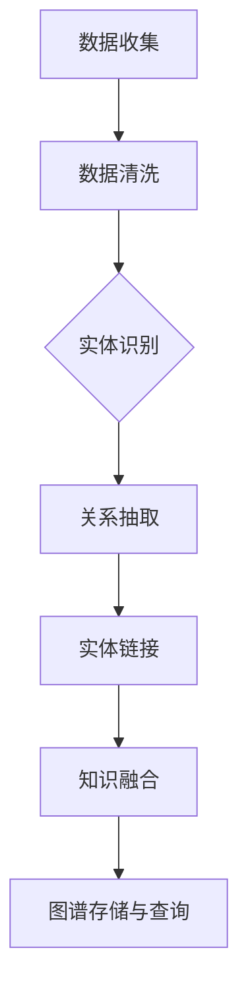

                 

### 人类知识的跨领域融合：创新乐土

> **关键词：** 跨领域融合、知识图谱、数据挖掘、人工智能、深度学习、强化学习、创新思维、商业模式创新

> **摘要：** 本文深入探讨了人类知识的跨领域融合的概念、方法、技术和应用。通过分析跨领域融合的背景与重要性，介绍了跨领域知识图谱构建、数据挖掘与人工智能、跨领域创新方法与实践等方面的技术原理和实际应用，并对跨领域融合在科学研究、商业领域以及未来展望等方面进行了详细阐述。文章旨在为读者提供关于跨领域融合的全面理解和实践指导，激发创新思维，推动科技进步和社会发展。

### 第一部分：跨领域融合的背景与重要性

#### 第1章：跨领域融合的起源与发展

##### 1.1 跨领域融合的概念与历史演变

跨领域融合（Interdisciplinary Integration）是指将不同学科的理论、方法和技术进行整合，以解决复杂问题的过程。它起源于20世纪中叶，随着科学技术的迅猛发展，各个学科之间的交叉和融合日益加深。

在早期，跨领域融合主要集中在自然科学领域，如物理、化学、生物等。随后，随着信息技术、人工智能等新兴领域的崛起，跨领域融合逐渐扩展到社会科学、人文科学等领域。

跨领域融合的历史演变可以分为以下几个阶段：

1. **交叉学科阶段**：20世纪初，物理学家在研究原子结构时，引入了数学和统计学的理论，形成了量子物理学和统计物理学。
2. **综合学科阶段**：20世纪中叶，系统论、控制论和信息论等新兴学科的出现，使得跨领域融合进入了一个新的阶段。这些学科不仅促进了自然科学的发展，还影响了社会科学和工程科学。
3. **跨学科阶段**：20世纪末至21世纪初，随着计算机科学和人工智能的发展，跨领域融合进入了一个更加广泛和深入的阶段。各个学科开始跨界合作，共同解决复杂问题。
4. **融合学科阶段**：当前，跨领域融合已经成为一种趋势，不同学科之间的界限逐渐模糊，形成了新的学科体系和研究领域。

##### 1.2 跨领域融合的重要性

跨领域融合的重要性体现在以下几个方面：

1. **解决复杂问题**：跨领域融合可以将不同学科的理论和方法进行整合，形成新的研究方法和技术手段，从而更好地解决复杂问题。例如，在环境保护、能源开发、公共卫生等领域，跨领域融合为解决复杂的环境问题提供了有效途径。
2. **促进科技创新**：跨领域融合可以激发新的科研思路和创新点，推动科技创新的发展。例如，人工智能、大数据、物联网等新兴技术，都是通过跨领域融合而产生的。
3. **提高创新能力**：跨领域融合可以培养创新型人才，提高整个社会的创新能力。跨领域融合要求人才具备跨学科的知识和技能，从而提高人才的创新能力和竞争力。
4. **推动社会进步**：跨领域融合可以推动社会各个领域的发展，提高社会生产力和生活质量。例如，在医疗领域，跨领域融合推动了精准医疗、远程医疗等新技术的应用，为患者提供了更好的医疗服务。

##### 1.3 跨领域融合的关键驱动因素

跨领域融合的关键驱动因素包括以下几个方面：

1. **技术进步**：随着计算机科学、信息技术、人工智能等技术的发展，跨领域融合的基础条件不断改善，为跨领域融合提供了强大的技术支持。
2. **市场需求**：随着社会需求的不断变化和升级，跨领域融合成为满足市场需求的重要手段。例如，在智能制造、智能交通、智慧城市等领域，跨领域融合为解决复杂的社会问题提供了有效途径。
3. **政策支持**：政府政策对跨领域融合的推动作用不可忽视。政府通过制定相关政策和规划，鼓励企业、高校和研究机构开展跨领域合作，推动跨领域融合的发展。
4. **国际合作**：国际合作对跨领域融合的推动作用日益显著。国际间的合作可以促进知识共享和资源整合，提高跨领域融合的效率和效果。

#### 第2章：跨领域融合的挑战与机遇

##### 2.1 跨领域融合中的挑战

跨领域融合虽然具有重要意义，但在实际操作中面临着一系列挑战：

1. **知识整合困难**：不同领域的知识体系和表达方式存在差异，导致知识整合困难。例如，自然科学和社会科学在研究方法、理论体系等方面存在较大的差异。
2. **团队合作障碍**：跨领域团队往往由不同专业背景的成员组成，团队成员之间的沟通和协作可能存在障碍，影响项目的进展。
3. **资源分配不均**：跨领域融合项目往往涉及多个领域和多个团队的合作，资源分配不均可能导致项目失衡，影响项目的效果。
4. **技术瓶颈**：跨领域融合中的技术问题往往难以解决，例如，数据源的多样性、数据质量的保障、算法的适应性和可解释性等。

##### 2.2 跨领域融合带来的机遇

跨领域融合也带来了许多机遇：

1. **创新空间**：跨领域融合为创新提供了广阔的空间。通过不同领域的知识和技术融合，可以产生新的理论、方法和技术，推动科技发展。
2. **市场机会**：跨领域融合可以开拓新的市场机会。例如，在医疗领域，将人工智能技术应用于疾病预测和诊断，可以为患者提供更精准的医疗服务。
3. **人才培养**：跨领域融合可以培养具有跨学科知识和能力的人才，提高人才的综合素质和竞争力。
4. **国际合作**：跨领域融合促进了国际间的合作和交流，为全球范围内的知识共享和技术创新提供了新的途径。

##### 2.3 跨领域融合的实用案例解析

为了更好地理解跨领域融合的实践，以下介绍几个跨领域融合的实用案例：

1. **智慧城市**：智慧城市是将信息技术、物联网、大数据等应用于城市管理和公共服务的一个跨领域项目。通过跨领域融合，可以实现智能交通、智能安防、智能环境监测等功能，提高城市的管理水平和居民的生活质量。
2. **精准医疗**：精准医疗是将基因学、生物信息学、人工智能等应用于疾病诊断和治疗的跨领域项目。通过跨领域融合，可以实现个性化医疗，提高疾病的治疗效果和患者的生活质量。
3. **绿色能源**：绿色能源是将可再生能源、储能技术、智能电网等应用于能源生产和消费的跨领域项目。通过跨领域融合，可以实现能源的高效利用和清洁生产，促进能源产业的可持续发展。
4. **教育科技**：教育科技是将信息技术、在线教育、虚拟现实等应用于教育领域的跨领域项目。通过跨领域融合，可以实现个性化教育、远程教育等新形式，提高教育的质量和效率。

通过以上案例可以看出，跨领域融合在实践中具有重要的应用价值，不仅可以解决复杂问题，还可以带来新的机遇和挑战。

### 第二部分：跨领域知识融合的方法与技术

#### 第3章：跨领域知识图谱构建

##### 3.1 知识图谱的基本概念

知识图谱（Knowledge Graph）是一种用于表示知识结构和关系的语义网络，它通过节点（实体）和边（关系）来描述现实世界中的对象及其相互关系。知识图谱的构建是实现跨领域知识融合的关键技术之一。

知识图谱的基本概念包括以下几个方面：

1. **实体（Entity）**：知识图谱中的基本元素，代表现实世界中的个体，如人、地点、组织、物品等。
2. **属性（Attribute）**：实体的特征或属性，用于描述实体的具体信息，如人的姓名、年龄、职业等。
3. **关系（Relationship）**：实体之间的关系，用于描述实体之间的相互作用或关联，如“是”、“属于”、“位于”等。
4. **边（Edge）**：知识图谱中的边用于表示实体之间的关系，通常包含关系类型和权重等属性。
5. **图谱（Graph）**：知识图谱的整体结构，由多个实体和关系组成，形成一张复杂的语义网络。

##### 3.2 跨领域知识图谱的构建方法

跨领域知识图谱的构建是一个复杂的过程，通常包括以下几个步骤：

1. **数据收集**：从多个领域的数据源收集信息，包括结构化数据、半结构化数据和非结构化数据。
2. **数据清洗**：对收集到的数据进行清洗，去除噪声和错误，保证数据的质量。
3. **实体识别**：从数据中识别出实体，将其作为知识图谱的节点。
4. **关系抽取**：从数据中提取实体之间的关系，将其作为知识图谱的边。
5. **实体链接**：将来自不同数据源的实体进行匹配和链接，形成统一的实体表示。
6. **知识融合**：对跨领域的知识进行融合，整合不同领域的知识体系。
7. **图谱存储与查询**：将构建好的知识图谱存储在数据库中，并设计有效的查询机制，以便进行知识检索和应用。

以下是一个简单的跨领域知识图谱构建流程的Mermaid流程图：



##### 3.3 知识图谱的存储与管理

知识图谱的存储与管理是跨领域知识融合的关键环节，通常涉及以下技术：

1. **图数据库**：图数据库是一种专门用于存储和管理知识图谱的数据库，如Neo4j、Apache JanusGraph等。图数据库具有高效的关系查询和图计算能力，适用于大规模知识图谱的存储和管理。
2. **分布式存储**：对于大规模的知识图谱，分布式存储技术如HDFS、HBase等可以提供高效的数据存储和并行处理能力。
3. **缓存机制**：为了提高知识图谱的查询效率，可以使用缓存技术，如Redis、Memcached等，对常用数据进行缓存。
4. **版本管理**：知识图谱的版本管理是确保知识图谱的稳定性和可追溯性的重要手段。可以使用版本控制系统如Git，对知识图谱的变更进行管理和追踪。

##### 3.4 知识图谱在跨领域融合中的应用

知识图谱在跨领域融合中具有重要的应用价值，以下是一些典型的应用场景：

1. **智能搜索**：知识图谱可以帮助搜索引擎理解用户的查询意图，提供更准确、个性化的搜索结果。
2. **推荐系统**：知识图谱可以用于推荐系统，通过分析用户的行为和兴趣，提供个性化的推荐服务。
3. **智能问答**：知识图谱可以为智能问答系统提供语义理解能力，实现对用户问题的准确理解和回答。
4. **智能决策**：知识图谱可以用于智能决策系统，为决策者提供跨领域的知识支持，提高决策的效率和效果。
5. **跨领域创新**：知识图谱可以作为跨领域创新的基础设施，帮助研究人员发现新的研究点和创新机会。

通过知识图谱的构建和应用，可以实现跨领域的知识整合和共享，为科研、商业和社会发展提供有力的支持。

### 第4章：跨领域数据挖掘与人工智能

#### 4.1 数据挖掘的基础知识

##### 4.1.1 数据挖掘的定义与任务

数据挖掘（Data Mining）是指从大量数据中提取出有用信息、模式和知识的过程。它涉及多个领域的知识，包括统计学、机器学习、数据库系统、领域知识等。数据挖掘的目标是发现数据中的隐藏模式，这些模式有助于决策支持、商业分析、风险预测等领域。

数据挖掘的主要任务包括：

1. **分类（Classification）**：将数据分为不同的类别，如根据客户的购买历史预测其购买意向。
2. **回归（Regression）**：预测连续值，如根据房屋面积预测房价。
3. **聚类（Clustering）**：将数据分为不同的组，以便更好地理解数据结构，如将客户分为高、中、低价值客户。
4. **关联规则挖掘（Association Rule Mining）**：发现数据之间的关联性，如超市销售数据中，购买牛奶的客户往往也会购买面包。
5. **异常检测（Anomaly Detection）**：识别数据中的异常点，如银行交易数据中的欺诈行为。

##### 4.1.2 数据挖掘的基本流程

数据挖掘的基本流程通常包括以下几个步骤：

1. **数据收集**：从各种数据源收集数据，包括结构化数据（如数据库）、半结构化数据（如XML、JSON）和非结构化数据（如文本、图像、视频）。
2. **数据预处理**：清洗数据，去除噪声和错误，进行数据整合和转换，以便后续处理。数据预处理步骤包括缺失值处理、异常值处理、数据规范化等。
3. **特征选择**：从原始数据中选择对挖掘任务有用的特征，通过特征选择可以降低数据的维度，提高模型的性能。
4. **模型选择与训练**：选择合适的挖掘算法，对数据进行训练，构建预测模型。常见的算法包括决策树、支持向量机、神经网络等。
5. **模型评估**：评估挖掘结果的质量，通过交叉验证、ROC曲线、混淆矩阵等指标评估模型的性能。
6. **模型应用**：将挖掘结果应用于实际问题中，如根据用户行为数据推荐商品、预测股票价格等。

##### 4.1.3 数据挖掘的应用领域

数据挖掘在多个领域都有广泛的应用：

1. **商业分析**：通过分析销售数据、客户行为数据等，帮助企业优化营销策略、提高客户满意度。
2. **金融领域**：利用数据挖掘技术进行风险控制、欺诈检测、信用评分等。
3. **医疗领域**：通过分析医疗数据，辅助疾病诊断、预测患者康复情况、优化治疗方案。
4. **安全领域**：通过分析网络数据、交易数据等，识别和防范网络安全威胁。
5. **科学研究和工程**：利用数据挖掘技术进行模式识别、数据可视化、复杂系统分析等。

#### 4.2 人工智能在跨领域融合中的作用

##### 4.2.1 人工智能的定义与分类

人工智能（Artificial Intelligence, AI）是指通过计算机程序实现人类智能的能力。根据其实现方式和能力，人工智能可以分为以下几个类别：

1. **机器学习（Machine Learning）**：通过训练模型来模拟人类的学习过程，实现数据的自动分类、预测和决策。
2. **深度学习（Deep Learning）**：一种特殊的机器学习方法，通过多层神经网络来提取数据的特征，实现复杂的任务。
3. **自然语言处理（Natural Language Processing, NLP）**：使计算机能够理解和生成自然语言，包括语音识别、机器翻译、情感分析等。
4. **计算机视觉（Computer Vision）**：使计算机能够从图像或视频中提取信息，包括图像识别、目标检测、图像分割等。
5. **机器人学（Robotics）**：通过人工智能技术，使机器人能够执行复杂的任务，如自动驾驶、智能客服等。

##### 4.2.2 人工智能在跨领域融合中的作用

人工智能在跨领域融合中发挥着关键作用，主要体现在以下几个方面：

1. **数据处理与整合**：人工智能可以处理大量且复杂的数据，实现数据的高效整合和分析。例如，在跨领域研究中，人工智能可以帮助整合不同来源的数据，进行综合分析。
2. **知识发现与推理**：通过机器学习和深度学习技术，人工智能可以从海量数据中提取出有价值的信息和知识。这些知识可以用于跨领域问题的解决，如医疗领域的疾病预测、金融领域的风险控制等。
3. **自动化决策与优化**：利用人工智能技术，可以实现自动化决策和智能优化，提高业务流程的效率和效果。例如，在智能制造中，人工智能可以帮助优化生产流程，提高生产效率。
4. **智能服务与个性化体验**：人工智能可以提供个性化的服务和体验，提高用户满意度。例如，在电子商务领域，人工智能可以帮助推荐商品、优化购物体验。
5. **创新与应用拓展**：人工智能可以推动跨领域的创新和应用拓展。通过人工智能技术，可以开发出新的产品和服务，拓展新的市场机会。

#### 4.3 跨领域融合中的深度学习技术

##### 4.3.1 深度学习的基本概念与架构

深度学习（Deep Learning）是一种特殊的机器学习方法，通过多层神经网络来提取数据的特征，实现复杂的任务。深度学习的核心是神经网络，其基本架构包括输入层、隐藏层和输出层。

1. **输入层（Input Layer）**：接收外部输入数据，如文本、图像、音频等。
2. **隐藏层（Hidden Layer）**：对输入数据进行处理和特征提取，多层隐藏层可以提取更高层次的特征。
3. **输出层（Output Layer）**：输出预测结果或分类结果。

深度学习模型通常包括以下几个关键组成部分：

1. **激活函数（Activation Function）**：用于引入非线性因素，使得神经网络能够学习和表示复杂函数。
2. **损失函数（Loss Function）**：用于衡量预测结果与真实值之间的差距，引导模型优化参数。
3. **优化算法（Optimizer）**：用于更新模型参数，优化损失函数，常见的优化算法有梯度下降、Adam等。

##### 4.3.2 深度学习的主要算法

深度学习涉及多种算法，以下是其中一些重要的算法：

1. **卷积神经网络（Convolutional Neural Network, CNN）**：主要用于图像和视频数据的处理，通过卷积操作和池化操作提取图像特征。
2. **递归神经网络（Recurrent Neural Network, RNN）**：主要用于处理序列数据，如文本和语音，通过隐藏状态将信息传递到序列中的每一个时刻。
3. **长短期记忆网络（Long Short-Term Memory, LSTM）**：是一种特殊的RNN，能够更好地处理长序列数据，通过门控机制控制信息的流动。
4. **生成对抗网络（Generative Adversarial Network, GAN）**：通过两个对抗网络（生成器和判别器）的竞争，实现数据的生成。
5. **自注意力模型（Self-Attention Model）**：在处理序列数据时，通过自注意力机制，提高模型对序列数据的理解能力。

##### 4.3.3 深度学习在跨领域融合中的应用

深度学习在跨领域融合中的应用非常广泛，以下是一些典型的应用场景：

1. **跨领域知识图谱构建**：利用深度学习技术，从多种数据源中提取和融合知识，构建跨领域的知识图谱。
2. **跨领域数据挖掘**：利用深度学习算法，挖掘不同领域数据之间的关联和规律，实现跨领域的数据分析。
3. **跨领域智能服务**：利用深度学习模型，为用户提供个性化的智能服务，提升用户体验。
4. **跨领域创新**：利用深度学习技术，探索跨领域的创新方法和应用场景，推动跨领域技术的发展。

#### 4.4 跨领域融合中的强化学习技术

##### 4.4.1 强化学习的定义与原理

强化学习（Reinforcement Learning, RL）是一种通过试错来学习如何在特定环境中做出最优决策的机器学习方法。强化学习的基本原理是：通过奖励机制，引导学习模型在给定环境中选择能够最大化奖励的动作。

强化学习的主要组成部分包括：

1. **代理（Agent）**：执行动作、感知环境和接收奖励的实体。
2. **环境（Environment）**：代理所处的场景，提供状态和反馈。
3. **状态（State）**：代理当前所处的情境或条件。
4. **动作（Action）**：代理可以执行的行为或操作。
5. **奖励（Reward）**：代理执行动作后环境给予的反馈，用于指导代理的行为。

强化学习的基本流程包括：

1. **初始状态**：代理开始在一个未知的环境中。
2. **执行动作**：代理根据当前状态选择一个动作。
3. **环境反馈**：环境根据代理的动作提供状态转移和奖励。
4. **更新策略**：代理根据奖励更新其行为策略，选择能够在长期内最大化总奖励的动作。

##### 4.4.2 强化学习的主要算法

强化学习涉及多种算法，以下是其中一些重要的算法：

1. **Q学习（Q-Learning）**：通过更新Q值（表示某个状态下的最优动作值）来学习最优策略。
2. **深度Q网络（Deep Q-Network, DQN）**：利用深度神经网络来近似Q值函数，实现更复杂的决策。
3. **策略梯度方法（Policy Gradient Methods）**：直接优化策略参数，实现模型的优化。
4. **序列决策模型（Sequence Decision Models）**：用于处理序列决策问题，如序列决策网络（Sequence Decision Networks, SDN）。

##### 4.4.3 强化学习在跨领域融合中的应用

强化学习在跨领域融合中的应用具有很大的潜力，以下是一些典型的应用场景：

1. **跨领域优化**：利用强化学习技术，优化跨领域资源分配、任务调度等问题，提高系统的效率。
2. **跨领域决策**：利用强化学习模型，为跨领域问题提供智能化的决策支持，提高决策的质量。
3. **跨领域控制**：利用强化学习技术，实现跨领域的自动化控制和自适应优化，提高系统的稳定性。
4. **跨领域创新**：利用强化学习模型，探索跨领域的创新方法和应用场景，推动跨领域技术的发展。

### 第5章：跨领域创新的方法与实践

#### 5.1 跨领域创新的思维模式

##### 5.1.1 跨领域创新的思维模式

跨领域创新需要一种开放和灵活的思维方式，以下是一些常见的跨领域创新思维模式：

1. **系统思维**：将不同领域的问题看作一个整体，从全局视角进行分析和解决。系统思维有助于发现不同领域之间的联系和相互影响，从而找到创新的解决方案。
2. **联想思维**：通过联想和类比，将不同领域的方法和技术进行融合，实现创新。例如，将生物学中的免疫系统原理应用于计算机安全领域，开发出具有自修复能力的网络安全系统。
3. **平台思维**：以平台为核心，整合不同领域的资源和服务，实现跨界合作和创新。例如，共享单车平台通过整合自行车、云计算和物联网技术，实现了城市交通的便捷化和智能化。
4. **用户思维**：以用户需求为导向，从用户的角度出发，设计创新的产品和服务。用户思维有助于发现用户未满足的需求，从而推动创新。
5. **生态思维**：将创新看作一个生态系统，关注生态系统的健康和可持续发展。生态思维有助于协调不同利益相关者之间的关系，实现共同发展。

##### 5.1.2 跨领域创新的关键要素

跨领域创新的关键要素包括以下几个方面：

1. **知识整合**：跨领域创新需要对不同领域的知识进行整合，形成新的知识体系。知识整合有助于发现新的问题和解决方案。
2. **团队合作**：跨领域创新通常需要多个领域的人才合作，通过团队合作实现知识共享和优势互补。
3. **资源整合**：跨领域创新需要整合不同领域的资源，包括资金、技术、人才等。资源整合有助于提高创新的效率和质量。
4. **风险管理**：跨领域创新面临多种风险，如技术风险、市场风险、法律风险等。有效的风险管理有助于降低创新失败的风险。
5. **持续迭代**：跨领域创新是一个不断试错和优化的过程。通过持续迭代，可以不断完善创新方案，提高成功的概率。

##### 5.1.3 跨领域创新的方法

跨领域创新的方法包括以下几个方面：

1. **头脑风暴**：通过集体讨论，激发创意，产生创新点子。头脑风暴可以促进团队成员之间的思维碰撞，发现新的解决方案。
2. **设计思维**：设计思维是一种以用户为中心的创新方法，通过用户研究、原型设计和迭代优化，实现创新产品或服务的开发。
3. **跨界合作**：通过与其他领域的专家、企业和研究机构合作，共享资源和知识，推动跨领域的创新。
4. **开放式创新**：开放式创新是一种通过外部合作和资源整合，实现创新的方法。例如，企业可以通过外部合作伙伴的创新成果来推动自身的创新。
5. **知识图谱**：通过构建跨领域的知识图谱，实现知识的整合和共享，为跨领域创新提供支持。

#### 5.2 跨领域创新的项目管理

##### 5.2.1 跨领域创新的项目管理

跨领域创新项目通常涉及多个领域和多个团队的合作，项目管理需要特别关注以下几个方面：

1. **团队建设**：跨领域创新项目需要组建多元化的团队，包括不同领域的专家、研究人员和工程师。团队建设的目标是确保团队成员之间能够高效协作，发挥各自的专长。

   - **明确角色与职责**：为每个团队成员分配明确的角色和职责，确保每个成员都清楚自己的工作任务和目标。
   - **建立沟通机制**：建立有效的沟通渠道，确保团队成员之间的信息共享和协作。可以使用邮件、即时通讯工具、会议等方式进行沟通。
   - **培养团队合作精神**：通过团队合作训练和团队活动，培养团队成员之间的信任和默契，提高团队的协作能力。

2. **沟通协作**：跨领域创新项目的成功离不开有效的沟通和协作。项目管理需要建立以下沟通协作机制：

   - **定期会议**：定期组织团队会议，讨论项目的进展、问题和解决方案。会议应包括项目计划、进度报告、风险评估等内容。
   - **协作工具**：使用项目管理工具，如JIRA、Trello、Asana等，实现任务的分配、进度追踪和协作。
   - **信息共享**：建立共享文档和数据库，确保团队成员可以随时访问和更新项目资料。

3. **风险管理**：跨领域创新项目面临多种风险，如技术风险、市场风险、法律风险等。有效的风险管理有助于降低创新失败的风险。

   - **风险评估**：在项目启动阶段，对项目可能面临的风险进行评估，识别风险因素和影响程度。
   - **风险应对策略**：针对识别出的风险，制定相应的应对策略，包括风险规避、风险转移、风险缓解等。
   - **风险监控**：在项目执行过程中，持续监控风险的变化，及时调整应对策略。

4. **项目评估与优化**：定期评估项目进展和质量，确保项目目标的实现。

   - **关键绩效指标（KPI）**：设定项目的关键绩效指标，如项目进度、成本控制、质量标准等，用于评估项目的进展和质量。
   - **项目审查会议**：定期组织项目审查会议，评估项目的进展和质量，识别问题和改进机会。
   - **持续优化**：根据项目评估的结果，对项目计划、资源分配、团队协作等方面进行优化，提高项目的效率和质量。

##### 5.2.2 跨领域创新项目的成功要素

跨领域创新项目的成功需要具备以下几个关键要素：

1. **明确的目标和愿景**：项目团队需要明确项目的目标和愿景，确保团队成员对项目的方向和目标有共同的认识。
2. **强大的领导力**：项目领导者需要具备跨领域的知识和管理能力，能够引导团队克服困难，推动项目的进展。
3. **高效的沟通协作**：建立有效的沟通协作机制，确保团队成员之间的信息共享和协作，提高项目的效率。
4. **创新思维和方法**：鼓励团队成员发挥创新思维，采用创新的思维模式和方法，推动跨领域的创新。
5. **持续学习和改进**：项目团队需要保持学习和改进的态度，不断吸取经验和教训，优化项目执行过程。

#### 5.3 跨领域创新的成功案例

##### 5.3.1 跨领域创新的成功案例

跨领域创新在多个领域都取得了显著的成功，以下是一些典型的成功案例：

1. **智能医疗**：通过将人工智能、大数据和生物医学技术相结合，开发出智能诊断系统、精准治疗方案等。例如，IBM的Watson Health利用人工智能技术，对医疗影像进行分析，辅助医生进行疾病诊断。
2. **智能制造**：通过将物联网、云计算和工业控制技术相结合，实现生产过程的自动化和智能化。例如，西门子的数字化工厂通过物联网技术，实现生产设备的实时监控和远程维护。
3. **金融科技**：通过将区块链、大数据和人工智能技术相结合，创新金融产品和业务模式。例如，蚂蚁金服的区块链支付系统，实现了高效、安全的跨境支付。
4. **绿色能源**：通过将可再生能源、储能技术和智能电网相结合，推动能源产业的可持续发展。例如，特斯拉的太阳能屋顶电池板，实现了太阳能发电与家庭用电的集成。
5. **教育科技**：通过将在线教育、虚拟现实和人工智能技术相结合，创新教育模式，提高教育质量。例如，Coursera等在线教育平台，通过虚拟课堂和实时互动，提供个性化的学习体验。

这些成功案例展示了跨领域创新的重要性和潜力，为其他领域的跨领域创新提供了有益的借鉴和启示。

#### 5.4 跨领域创新中的团队合作

##### 5.4.1 跨领域创新中的团队合作

跨领域创新项目需要高效的团队合作，以下是一些关键的团队合作原则：

1. **尊重差异**：尊重团队成员的不同背景和专业技能，发挥每个人的优势。跨领域团队通常由不同领域的专家组成，每个成员都有自己独特的专业知识和经验。尊重差异意味着要理解和接受团队成员之间的差异，并利用这些差异为团队带来不同的视角和解决方案。
   
   - **多元化视角**：不同的专业背景和知识领域为团队提供了多元化的视角，有助于从多个角度分析和解决问题。
   - **优势互补**：通过尊重差异，团队可以充分发挥每个成员的优势，形成互补效应，提高整体协作效率。

2. **沟通协作**：建立有效的沟通渠道，确保团队成员之间的信息共享和协作。沟通协作是跨领域创新项目成功的关键因素之一。

   - **定期会议**：定期组织团队会议，讨论项目的进展、问题和解决方案。会议应包括项目计划、进度报告、风险评估等内容。
   - **即时沟通工具**：使用即时沟通工具，如Slack、WhatsApp等，实现团队成员之间的实时沟通和协作。
   - **共享平台**：建立共享平台，如Confluence、Google Drive等，确保团队成员可以随时访问和更新项目资料。

3. **灵活应变**：面对变化和挑战，团队需要具备快速适应和调整的能力。跨领域创新项目往往面临复杂多变的环境，要求团队具备灵活应变的能力。

   - **敏捷开发**：采用敏捷开发方法，快速响应变化，不断调整项目计划和策略。
   - **风险预警机制**：建立风险预警机制，及时识别和应对项目中的潜在问题。

4. **共同目标**：明确团队的目标和使命，确保团队成员的共同努力。共同目标是团队协作的导向，有助于统一团队成员的行动方向。

   - **目标设定**：在项目启动阶段，明确项目目标和团队使命，确保每个成员都清楚自己的职责和目标。
   - **绩效评估**：定期评估团队成员的绩效，确保团队成员在实现共同目标方面取得进展。

5. **创新激励**：为团队成员提供创新激励，激发团队的创造力和积极性。创新是跨领域创新的灵魂，团队需要不断寻求新的解决方案和方法。

   - **奖励机制**：建立奖励机制，对创新成果显著的团队成员给予奖励和表彰。
   - **学习与成长**：提供学习和成长的机会，鼓励团队成员不断提升自己的专业技能和知识水平。

通过遵循这些团队合作原则，跨领域创新项目可以更好地实现协同效应，提高团队的整体效率和创新力，推动跨领域创新的成功实施。

### 第6章：跨领域融合在科学研究中的应用

#### 6.1 跨学科研究的现状与趋势

##### 6.1.1 跨学科研究的概念与意义

跨学科研究（Interdisciplinary Research）是指将不同学科的理论、方法和工具进行整合，以解决复杂科学问题的研究活动。跨学科研究强调学科之间的交叉与融合，通过跨领域的合作与对话，推动科学知识的创新与发展。

跨学科研究的概念可以从以下几个方面理解：

1. **学科交叉**：跨学科研究涉及多个学科领域，通过学科之间的交叉与互动，实现知识体系的多维度扩展。
2. **方法整合**：跨学科研究不仅关注单一学科的方法，还整合多种学科的研究方法，形成新的研究范式。
3. **协同创新**：跨学科研究鼓励不同学科领域的专家共同参与，通过协同合作，实现知识的整合与创新。
4. **问题导向**：跨学科研究往往以复杂、跨领域的社会科学问题为研究对象，通过综合分析，寻求解决之道。

跨学科研究的意义体现在以下几个方面：

1. **推动科学进步**：跨学科研究可以激发新的科学发现和创新点，推动科学领域的进步。
2. **解决复杂问题**：跨学科研究能够整合多学科资源，解决单一学科难以应对的复杂科学问题。
3. **提高创新能力**：跨学科研究鼓励跨领域的知识整合与创新，提高科研人员的创新能力。
4. **促进跨领域合作**：跨学科研究可以促进不同学科领域之间的合作与交流，形成新的科研共同体。

##### 6.1.2 跨学科研究的发展历程

跨学科研究的发展历程可以分为以下几个阶段：

1. **萌芽阶段（20世纪初）**：跨学科研究的思想开始萌芽，科学界开始探讨如何将不同学科的知识和工具进行整合，解决复杂科学问题。
2. **发展阶段（20世纪中叶）**：随着系统科学、信息科学等新兴学科的出现，跨学科研究逐渐成为一种重要的科研模式。学科之间的交叉与融合日益加深，跨学科研究项目逐渐增多。
3. **成熟阶段（20世纪末至今）**：随着全球化和信息技术的快速发展，跨学科研究进入了一个全新的阶段。跨学科研究不再局限于自然科学领域，也逐渐扩展到社会科学、人文科学等领域。跨学科研究机构、实验室和国际合作项目不断增加，推动了跨学科研究的深入发展。

##### 6.1.3 跨学科研究的方法与技术

跨学科研究的方法与技术是跨学科研究的关键要素，以下是一些常见的方法与技术：

1. **综合分析方法**：综合分析方法是将不同学科的研究方法进行整合，形成新的分析框架。例如，将统计学、经济学和心理学的方法相结合，用于分析复杂的社会科学问题。
2. **多学科模型**：多学科模型是跨学科研究的核心工具，通过建立多学科模型，可以整合不同学科的理论和假设，形成新的理论框架。例如，生态系统模型整合了生态学、物理学和化学的理论，用于分析生态系统的动态变化。
3. **交叉实验**：交叉实验是跨学科研究的重要方法，通过在不同学科实验条件下的对比，验证跨学科理论的可靠性和适用性。例如，在医学研究中，通过交叉实验验证生物技术和化学药物对疾病治疗的效果。
4. **综合数据库**：综合数据库是跨学科研究的重要资源，通过收集和整合多学科的数据，为跨学科研究提供丰富的数据支持。例如，全球气候变化数据库整合了气象学、生态学和环境科学的数据，用于研究气候变化的趋势和影响。

##### 6.1.4 跨学科研究的热点领域

当前，跨学科研究的热点领域包括以下几个方面：

1. **生命科学与医学**：生命科学与医学领域的跨学科研究日益增多，如生物信息学、基因组学、医学成像等。这些研究通过跨学科的整合，推动生命科学和医学的发展。
2. **环境科学与可持续发展**：环境科学与可持续发展领域的跨学科研究关注全球气候变化、环境保护、资源管理等问题。通过跨学科的整合，可以提出更加全面和有效的解决方案。
3. **信息科学与大数据**：信息科学与大数据领域的跨学科研究关注数据挖掘、人工智能、云计算等技术在社会科学和人文科学中的应用。这些技术为跨学科研究提供了新的工具和方法。
4. **社会科学与人文科学**：社会科学与人文科学领域的跨学科研究关注社会问题、文化多样性、历史变迁等。通过跨学科的整合，可以更好地理解复杂的社会现象和文化现象。

##### 6.1.5 跨学科研究的挑战与机遇

跨学科研究在推动科学进步和社会发展方面具有重要意义，但也面临一系列挑战：

1. **知识整合困难**：不同学科的知识体系、方法论和术语存在差异，导致知识整合困难。
2. **团队合作障碍**：跨学科团队往往由不同专业背景的成员组成，团队合作可能面临沟通障碍和协调问题。
3. **资源分配不均**：跨学科研究项目通常涉及多个领域，资源分配可能不均，影响项目的进展和效果。

尽管面临挑战，跨学科研究也带来了新的机遇：

1. **创新动力**：跨学科的整合激发了新的研究思路和方法，推动科学创新。
2. **知识扩展**：跨学科研究扩展了单一学科的知识边界，促进了知识的多样性和发展。
3. **社会影响**：跨学科研究的成果可以转化为实际应用，解决复杂的社会问题，提高社会福祉。

#### 6.2 跨领域融合在科学研究中的成功案例

##### 6.2.1 跨领域融合在科学研究中的成功案例

跨领域融合在科学研究中取得了许多显著的成功案例，以下是一些典型的成功案例：

1. **基因组学与人工智能**：基因组学研究依赖于大数据分析和人工智能技术。通过深度学习和自然语言处理技术，科学家可以对基因序列进行解析，识别基因的功能和作用。例如，DeepLearningAI开发的基因组分析工具，利用深度学习技术加速基因序列分析，提高了基因组研究的效率。

2. **环境科学与大数据**：环境科学研究依赖于对大量环境数据的收集和分析。大数据技术和人工智能的应用，使得科学家能够更好地理解环境变化和生态系统动态。例如，谷歌地球引擎（Google Earth Engine）利用大数据分析和机器学习技术，对全球环境变化进行监测和分析，为环境保护提供了科学依据。

3. **医学与工程学**：医学与工程学的融合推动了生物医学工程的发展。通过纳米技术、生物材料和人工智能等技术，科学家和工程师共同开发出新型医疗设备和治疗方法。例如，哈佛大学的生物工程团队开发的生物打印技术，能够打印出复杂的生物组织，为器官移植和再生医学提供了新的可能性。

4. **物理学与信息科学**：物理学和信息科学的融合推动了量子计算的研究和发展。量子计算利用量子力学原理，实现了传统计算机无法实现的高速计算能力。例如，谷歌的量子计算研究团队开发的量子计算机，已经实现了超越传统计算机的运算能力，为科学计算和人工智能领域带来了新的机遇。

5. **经济学与社会学**：经济学与社会学的融合推动了社会科学研究的发展。通过大数据分析和机器学习技术，经济学家和社会学家可以更好地理解社会现象和经济发展。例如，哈佛大学的“社会洞察计划”（Social Science Insights Program）利用大数据分析，研究了社会不平等和贫困问题，为政策制定提供了科学依据。

这些成功案例展示了跨领域融合在科学研究中的巨大潜力和实际应用价值。通过跨领域的合作和知识整合，科学家们可以更好地应对复杂科学问题，推动科学技术的创新和发展。

##### 6.2.2 跨领域融合对科学研究的推动作用

跨领域融合在科学研究中的作用至关重要，具体体现在以下几个方面：

1. **促进知识整合**：跨领域融合有助于整合不同领域的知识，形成新的理论体系和研究方法。通过跨领域的合作，科学家可以借鉴不同学科的理论和方法，丰富自己的研究视角，从而推动知识的整合和创新。

2. **解决复杂问题**：许多科学问题涉及多个领域，单一学科难以独立解决。跨领域融合能够整合多学科资源，形成跨学科团队，共同应对复杂科学问题。例如，气候变化问题需要气象学、生态学、经济学等领域的协同研究，跨领域融合为解决这类问题提供了有效途径。

3. **提高研究效率**：跨领域融合可以优化研究资源的配置，提高研究的效率和效果。通过跨领域的合作，可以共享实验室设备、数据资源和技术工具，减少重复性研究，降低研究成本，从而提高研究的整体效率。

4. **推动技术创新**：跨领域融合激发了新的技术创新和科研方法的诞生。不同领域的知识和技术相互融合，可以产生新的科研工具和设备，推动科学技术的进步。例如，量子计算技术的诞生离不开物理学、计算机科学和工程学的跨领域融合。

5. **增强社会影响力**：跨领域融合的科研成果可以转化为实际应用，解决现实世界中的复杂问题，增强科学研究的实际社会影响力。例如，基因组学与人工智能的结合，推动了个性化医疗的发展，为患者提供了更加精准的治疗方案，提高了医疗服务的质量。

跨领域融合不仅促进了科学研究的进步，还为科学家的跨领域合作提供了新的平台和机会，推动了科学知识的创新和科学技术的快速发展。

### 第7章：跨领域融合在商业领域的应用

#### 7.1 跨领域融合在商业模式创新中的作用

跨领域融合在商业模式创新中发挥了至关重要的作用，它不仅为传统商业模式带来了新的变革，还推动了新兴商业模式的诞生。以下是跨领域融合在商业模式创新中的几个关键作用：

##### 7.1.1 模式创新

跨领域融合能够激发新的商业模式创新。通过将不同领域的知识和技术相结合，企业可以创造出全新的产品和服务，从而开辟新的市场机会。例如，金融科技（FinTech）的兴起正是通过将金融和科技相结合，开发了移动支付、区块链金融、智能投顾等新型金融产品，改变了传统的金融服务模式。

1. **案例研究**：阿里巴巴的“新零售”战略通过将线上电商与线下零售相结合，实现了消费者数据的高效整合和精准营销，从而提升了零售业的服务质量和效率。

##### 7.1.2 市场拓展

跨领域融合有助于企业开拓新的市场。通过跨领域的合作和资源整合，企业可以进入新的市场领域，满足多样化的消费者需求。例如，共享经济模式通过将闲置资源进行共享，成功打开了全球市场的机会。

1. **案例研究**：Airbnb通过将闲置房屋资源与旅游需求相结合，开辟了全球民宿市场，成为共享经济领域的领军企业。

##### 7.1.3 资源整合

跨领域融合能够帮助企业整合不同领域的资源，提高资源利用效率。通过跨领域的合作，企业可以获取更多的资源和技术支持，从而在竞争中获得优势。例如，新能源汽车产业通过将汽车制造与新能源技术相结合，实现了能源利用的高效化和环保化。

1. **案例研究**：特斯拉（Tesla）通过整合电动车制造、能源存储和可再生能源技术，构建了一个集新能源汽车、能源管理和绿色能源利用为一体的完整生态体系。

##### 7.1.4 合作共赢

跨领域融合促进了企业之间的合作共赢。通过跨领域的合作，企业可以实现资源共享、风险分担和协同发展，共同推动市场扩张和技术创新。例如，在医疗领域，制药公司、医疗器械公司和医疗机构之间的合作，实现了医疗资源的高效配置和医疗服务质量的提升。

1. **案例研究**：辉瑞公司（Pfizer）通过与医疗设备和诊断公司合作，开发出结合药物治疗的智能医疗设备，为患者提供了更加个性化和精准的医疗方案。

##### 7.1.5 风险分散

跨领域融合有助于企业分散经营风险。通过跨领域的业务拓展和资源整合，企业可以在不同市场和业务领域之间实现风险对冲，降低单一市场波动对企业整体业绩的影响。例如，多元化经营的银行可以通过投资不同的金融产品和服务，分散信贷风险。

1. **案例研究**：汇丰银行（HSBC）通过在多个国家和地区开展业务，实现了全球市场的风险分散，提高了企业的抗风险能力。

总之，跨领域融合在商业模式创新中的作用不仅体现在模式创新和市场拓展上，还在于资源整合、合作共赢和风险分散等方面。这些作用共同推动着商业模式的不断进化和发展，为企业带来了新的增长机遇和竞争优势。

#### 7.2 跨领域融合在企业管理中的应用

跨领域融合在企业管理中发挥着重要作用，通过整合不同领域的知识和资源，企业可以实现管理模式的创新和效率的提升。以下是跨领域融合在企业管理中的几个关键应用：

##### 7.2.1 管理模式创新

跨领域融合可以推动企业管理模式的创新。通过将不同领域的最佳实践和管理理念相结合，企业可以构建出更加灵活、高效的管理体系。例如，在信息技术领域，敏捷管理（Agile Management）方法通过快速响应市场变化和客户需求，实现了项目的高效开发和交付。

1. **案例研究**：谷歌（Google）采用了敏捷管理方法，通过迭代开发、持续交付和客户反馈，实现了高效的产品开发和市场推广。

##### 7.2.2 人力资源管理

跨领域融合在人力资源管理中的应用，有助于培养具有跨领域知识和技能的员工，提高企业的创新能力。通过跨领域的培训和学习，员工可以掌握多领域的知识和技能，从而在团队协作中发挥更大的作用。例如，在科技创新领域，复合型人才的培养是推动企业创新的重要保障。

1. **案例研究**：微软（Microsoft）通过内部跨领域培训项目和团队轮换机制，培养了一批具有多领域知识和技能的复合型人才，提高了企业的创新能力。

##### 7.2.3 财务管理

跨领域融合在财务管理中的应用，有助于企业实现财务管理的创新和优化。通过引入金融科技（FinTech）和大数据分析，企业可以实现财务数据的实时监控和智能分析，提高财务决策的效率和准确性。例如，在金融领域，智能财务管理系统通过自动化和数据驱动，实现了财务流程的优化。

1. **案例研究**：渣打银行（Standard Chartered）引入了智能财务管理系统，通过数据分析和自动化流程，提高了财务管理的效率和准确性。

##### 7.2.4 供应链管理

跨领域融合在供应链管理中的应用，有助于企业实现供应链的优化和效率提升。通过引入物联网（IoT）、大数据分析和人工智能技术，企业可以实现供应链的实时监控和智能调度，降低供应链成本，提高供应链的响应速度。例如，在制造业，智能供应链系统通过物联网传感器和大数据分析，实现了生产流程的自动化和智能化。

1. **案例研究**：西门子（Siemens）通过引入智能供应链系统，实现了供应链的实时监控和智能调度，提高了生产效率，降低了运营成本。

##### 7.2.5 创新管理

跨领域融合在创新管理中的应用，有助于企业建立创新管理体系，推动企业的持续创新。通过跨领域的合作和知识共享，企业可以不断探索新的创新方法和商业模式，保持竞争优势。例如，在高科技领域，开放式创新（Open Innovation）模式通过跨领域的合作，实现了创新资源的整合和共享。

1. **案例研究**：三星电子（Samsung Electronics）通过开放式创新模式，与全球范围内的科研机构和创业公司合作，推动了企业的持续创新和发展。

总之，跨领域融合在企业管理中的应用，不仅促进了管理模式的创新和优化，还提高了人力资源、财务管理、供应链管理和创新管理的效率和质量。这些应用共同推动了企业的可持续发展，增强了企业的市场竞争力。

#### 7.3 跨领域融合在市场营销中的应用

跨领域融合在市场营销中具有深远的影响，通过整合不同领域的资源和知识，企业可以创造出更具吸引力的营销策略和更精准的市场推广方式。以下是跨领域融合在市场营销中的几个关键应用：

##### 7.3.1 品牌塑造

跨领域融合在品牌塑造中的应用，有助于企业打造具有跨领域影响力的品牌形象。通过将不同领域的创意和理念融入品牌建设中，企业可以提升品牌的独特性和差异化，增强品牌的市场竞争力。例如，在快消品行业，许多品牌通过跨界合作，推出联名产品或限量版系列，以吸引不同消费群体的关注。

1. **案例研究**：可口可乐（Coca-Cola）与多家时尚品牌合作，推出限量版瓶身设计，成功吸引了年轻消费者的关注，提升了品牌形象。

##### 7.3.2 市场细分

跨领域融合有助于企业发现新的市场细分，开拓新的市场机会。通过跨领域的视角，企业可以更准确地把握消费者的需求和偏好，从而制定更加精准的市场营销策略。例如，在科技行业，通过将人工智能与物联网技术相结合，企业可以开发出面向智能家居市场的产品，满足消费者对智能家居的需求。

1. **案例研究**：谷歌（Google）通过人工智能和物联网技术的整合，推出了智能家居操作系统Android Things，成功开拓了智能家居市场。

##### 7.3.3 营销策略

跨领域融合可以为企业提供多样化的营销策略，提高营销效果。通过整合不同领域的知识和资源，企业可以创造出更具创意和吸引力的营销活动，增强品牌的市场影响力。例如，在娱乐行业，通过将虚拟现实（VR）与直播技术相结合，企业可以打造沉浸式的观众体验，提升营销效果。

1. **案例研究**：迪士尼（Disney）通过将虚拟现实技术应用于主题公园的娱乐项目，为游客提供了全新的沉浸式体验，大大提升了游客满意度和品牌忠诚度。

##### 7.3.4 数字营销

跨领域融合在数字营销中的应用，有助于企业实现精准营销和个性化服务。通过整合大数据分析、人工智能和物联网技术，企业可以实时了解消费者的行为和偏好，从而提供个性化的产品推荐和定制化的营销方案。例如，在电子商务领域，通过大数据分析和个性化推荐算法，企业可以精准推送产品，提高销售转化率。

1. **案例研究**：亚马逊（Amazon）通过大数据分析和人工智能技术，为用户提供个性化的产品推荐，大大提高了用户满意度和销售业绩。

##### 7.3.5 社交媒体营销

跨领域融合在社交媒体营销中的应用，有助于企业扩大品牌影响力，提高社交媒体营销的效果。通过将社交媒体平台与跨领域的创意和活动相结合，企业可以吸引更多的用户关注和参与，提升品牌的社交媒体影响力。例如，在时尚行业，通过将社交媒体营销与直播、短视频等新兴形式相结合，企业可以迅速提升品牌知名度和用户参与度。

1. **案例研究**：耐克（Nike）通过在社交媒体平台上推出短视频挑战活动，吸引了大量用户参与，成功提升了品牌的社交媒体影响力和用户忠诚度。

总之，跨领域融合在市场营销中的应用，不仅为企业提供了多样化的营销策略和工具，还提高了营销的精准性和效果。通过跨领域的整合和创新，企业可以更好地满足消费者的需求，提升品牌的市场竞争力。

#### 7.4 跨领域融合在商业创新中的成功案例

跨领域融合在商业创新中取得了许多成功的案例，这些案例不仅展示了跨领域融合的巨大潜力，也为其他企业提供了有益的启示。以下是几个典型的成功案例：

##### 7.4.1 智能制造

智能制造通过将物联网、大数据、云计算和人工智能等技术与传统制造业相结合，实现了生产过程的智能化和自动化。以下是一个具体的案例：

**案例**：通用电气（General Electric）通过引入物联网技术，对其航空发动机进行实时监控和维护。通过安装在发动机上的传感器收集大量数据，并将数据上传到云计算平台进行分析，GE能够预测发动机的故障，并提供预防性维护服务。这一举措不仅提高了发动机的运行效率，还大幅降低了维修成本。

**成效**：通过跨领域融合，GE实现了从传统制造业向智能制造业的转变，提升了生产效率和客户满意度。

##### 7.4.2 金融科技

金融科技（FinTech）通过将金融与科技相结合，开发出了许多创新的金融产品和服务，以下是一个具体的案例：

**案例**：蚂蚁金服（Ant Financial）通过区块链技术推出“蚂蚁链”，实现了供应链金融的区块链化。供应链金融通常面临信息不对称、信用评估困难等问题，而通过区块链技术，蚂蚁金服能够实现信息的透明化和实时共享，降低了金融风险，提高了金融服务的效率。

**成效**：通过金融科技的跨领域融合，蚂蚁金服大幅提升了供应链金融的服务水平，为中小企业提供了便捷、高效的融资服务，促进了实体经济的发展。

##### 7.4.3 新能源

新能源领域通过将可再生能源技术与其他领域的技术相结合，推动了能源产业的创新和发展，以下是一个具体的案例：

**案例**：特斯拉（Tesla）通过将电动汽车与太阳能技术相结合，推出了一体化的能源解决方案。特斯拉的太阳能屋顶电池板和电动汽车充电站，实现了能源的生产、储存和使用一体化，为家庭和商业用户提供了清洁、可持续的能源解决方案。

**成效**：通过新能源技术的跨领域融合，特斯拉不仅推动了电动汽车的发展，还为能源行业的可持续发展做出了重要贡献。

##### 7.4.4 教育科技

教育科技通过将在线教育、虚拟现实和人工智能等技术与传统教育相结合，改变了教育的方式和模式，以下是一个具体的案例：

**案例**：Coursera通过在线教育平台，将世界顶级大学的课程资源开放给全球学习者。通过虚拟现实技术，Coursera提供了沉浸式的学习体验，让学生能够身临其境地参与课程。此外，人工智能技术被用于个性化学习路径的推荐，帮助学生更高效地学习。

**成效**：通过教育科技的跨领域融合，Coursera不仅打破了教育资源的壁垒，还提高了教育的质量和普及率。

##### 7.4.5 医疗健康

医疗健康领域通过将生物技术、信息技术和人工智能等技术与医疗服务相结合，提升了医疗服务的效率和质量，以下是一个具体的案例：

**案例**：IBM的Watson Health利用人工智能技术，开发出了智能诊断系统。通过分析大量的医学数据和文献，Watson Health能够为医生提供更准确、更全面的诊断建议，提高了疾病诊断的准确性和治疗效果。

**成效**：通过医疗健康的跨领域融合，Watson Health不仅提升了医疗服务的效率，还为患者提供了更加精准的医疗服务。

这些成功案例表明，跨领域融合在商业创新中具有巨大的潜力。通过整合不同领域的知识和资源，企业可以创造出新的商业模式、产品和服务，推动行业的创新和发展。

### 第8章：跨领域融合的未来展望

#### 8.1 跨领域融合的未来趋势

跨领域融合作为一种推动科技创新和社会发展的关键趋势，其未来发展趋势可以从以下几个方面进行探讨：

##### 8.1.1 技术融合

随着技术的不断进步，跨领域融合将进一步深化。未来，人工智能、物联网、大数据、云计算等新兴技术将在更多领域得到应用，实现不同技术之间的深度融合。例如，通过人工智能和物联网技术的结合，可以实现智能城市、智能制造等领域的创新应用。大数据和云计算的结合将使得数据分析和处理能力大幅提升，为跨领域融合提供更强大的技术支持。

##### 8.1.2 数据驱动

数据将成为跨领域融合的核心驱动力。随着数据量的爆炸式增长和数据源的多样性，如何有效地利用数据将是一个重要议题。未来，跨领域融合将更加依赖于数据分析和挖掘技术，通过数据驱动的方式，实现知识的自动获取和智能决策。数据驱动的跨领域融合将有助于发现新的研究点、创新点和商业机会。

##### 8.1.3 平台化

跨领域融合将向平台化方向发展。平台作为一种重要的基础设施，可以为不同领域的资源整合和协作提供支持。未来，跨领域融合平台将变得更加普及和成熟，成为跨领域创新的重要载体。这些平台不仅可以提供数据共享、计算资源和协作工具，还可以促进不同领域之间的知识流动和协同创新。

##### 8.1.4 智能化

智能化是跨领域融合的重要趋势。随着人工智能技术的不断发展，跨领域融合将更加智能化。未来，人工智能将不仅在数据分析和处理中发挥重要作用，还将应用于智能决策、自动化控制等领域，实现跨领域系统的自主运行和优化。例如，智能交通系统将通过人工智能技术，实现交通流量的智能调控和道路资源的合理分配。

##### 8.1.5 生态化

跨领域融合将向生态化方向发展。未来，跨领域融合将不仅仅是单一领域的技术应用，而是多个领域之间形成的生态系统。这些生态系统将促进不同领域之间的知识共享、资源整合和协同发展。例如，在智慧城市生态系统中，将包括物联网、云计算、大数据、人工智能等多个领域的协同创新，实现城市管理和服务的智能化和高效化。

#### 8.2 跨领域融合的技术挑战与解决方案

尽管跨领域融合具有巨大的发展潜力，但在实际应用中仍面临一系列技术挑战。以下是跨领域融合的主要技术挑战及可能的解决方案：

##### 8.2.1 数据整合

数据整合是跨领域融合面临的一个主要挑战。不同领域的数据格式、结构和质量可能存在较大差异，导致数据整合困难。解决方案包括：

1. **数据标准化**：制定统一的数据标准和规范，确保数据的一致性和兼容性。
2. **数据清洗与转换**：对数据进行清洗和转换，去除噪声和异常值，提高数据质量。
3. **数据仓库**：建立数据仓库，实现不同数据源的数据整合和统一管理。

##### 8.2.2 知识融合

知识融合是跨领域融合的核心挑战之一。不同领域的知识体系和表达方式可能存在差异，导致知识融合困难。解决方案包括：

1. **本体工程**：构建跨领域的本体，统一不同领域中的概念和术语，实现知识的标准化和共享。
2. **知识图谱**：利用知识图谱技术，将不同领域中的知识进行整合和表示，实现知识的语义化和自动化推理。
3. **跨领域算法**：开发适用于跨领域的算法和模型，提高跨领域知识的融合和利用效率。

##### 8.2.3 技术融合

不同领域的技术融合可能面临兼容性、互操作性和协同性等问题。解决方案包括：

1. **通用接口**：制定通用的接口和协议，实现不同技术之间的互操作。
2. **中间件**：开发中间件，提供不同技术之间的桥梁和转换，实现技术的协同应用。
3. **平台化**：构建跨领域融合平台，提供一体化的技术解决方案和资源整合服务。

##### 8.2.4 隐私保护

跨领域融合中的数据共享和处理可能涉及用户隐私和数据安全。解决方案包括：

1. **加密技术**：采用加密技术，保护数据的隐私和安全。
2. **隐私保护算法**：开发隐私保护算法，实现数据的安全共享和隐私保护。
3. **法律法规**：建立相应的法律法规，规范跨领域融合中的数据管理和使用。

通过克服这些技术挑战，跨领域融合将能够更好地发挥其潜力，推动科技创新和社会发展。

#### 8.3 跨领域融合对人类社会的影响

跨领域融合作为一种新兴的发展趋势，将对人类社会产生深远的影响。以下是跨领域融合对人类社会影响的几个主要方面：

##### 8.3.1 经济发展

跨领域融合将推动经济的快速发展。通过跨领域的知识和技术融合，可以创造出新的产品和服务，促进产业升级和结构优化。例如，智能制造、金融科技、医疗健康等领域的跨领域创新，不仅推动了传统产业的转型升级，还培育了新的经济增长点，提高了经济的整体竞争力。

##### 8.3.2 社会结构

跨领域融合将改变社会结构。随着跨领域融合的深入发展，不同领域之间的界限将逐渐模糊，形成更加复杂和多元化的社会结构。这种结构变化将促进知识的共享和流动，推动社会创新和进步。同时，跨领域融合也带来了新的职业和就业机会，促进了劳动力市场的多元化发展。

##### 8.3.3 文化交流

跨领域融合将促进不同文化的交流和融合。跨领域的知识和技术融合，不仅推动了科技的进步，也为文化交流和融合提供了新的平台。通过跨领域的合作和交流，不同文化可以相互借鉴和融合，产生新的文化形态和价值观念，推动文化的创新和发展。

##### 8.3.4 生活品质

跨领域融合将提高人们的生活品质。通过跨领域的创新应用，可以开发出更加智能、便捷和高效的产品和服务，改善人们的生活条件。例如，智能家居、在线教育、远程医疗等领域的跨领域创新，为人们提供了更加舒适、便捷和健康的生活方式。

##### 8.3.5 伦理挑战

跨领域融合也带来了新的伦理挑战。随着技术的进步和应用的广泛，跨领域融合在带来便利和效率的同时，也可能引发一系列伦理问题。例如，隐私保护、数据安全、人工智能的道德责任等。解决这些伦理挑战需要建立相应的伦理规范和法律法规，确保跨领域融合的可持续发展。

总之，跨领域融合对人类社会的影响是多方面的，既带来了新的机遇，也提出了新的挑战。通过积极应对这些挑战，我们可以更好地利用跨领域融合的潜力，推动社会的可持续发展。

### 附录A：跨领域融合研究工具与资源

#### A.1 跨领域知识图谱构建工具

跨领域知识图谱的构建是跨领域融合的重要组成部分，以下是一些常用的跨领域知识图谱构建工具：

1. **OpenKG**：OpenKG是一个开源的跨领域知识图谱构建工具，支持多种数据源的接入和知识图谱的构建。它提供了从数据抽取、实体链接到知识融合的一整套工具，方便用户快速构建和部署知识图谱。

2. **Nervana**：Nervana是一个基于Python的知识图谱构建框架，支持知识图谱的构建、存储和查询。它提供了丰富的API，方便用户进行复杂的图计算和知识推理。

3. **Neo4j**：Neo4j是一个高性能的图形数据库，支持知识图谱的存储和查询，具有高效的图计算能力。它提供了图形化的界面和强大的查询语言Cypher，方便用户进行图数据的可视化和分析。

#### A.2 跨领域数据挖掘与人工智能工具

跨领域数据挖掘和人工智能技术在跨领域融合中发挥着重要作用，以下是一些常用的工具：

1. **Weka**：Weka是一个经典的机器学习工具，支持多种数据挖掘算法的实现和应用。它提供了丰富的数据预处理、特征选择和模型评估功能，适用于各种数据挖掘任务。

2. **TensorFlow**：TensorFlow是一个开源的深度学习框架，支持深度学习模型的训练和应用。它提供了灵活的API，方便用户构建和训练各种复杂的深度学习模型。

3. **Keras**：Keras是一个基于TensorFlow的深度学习框架，提供了简单易用的API，支持深度学习模型的快速构建和训练。它降低了深度学习模型的构建门槛，方便用户进行快速原型设计和迭代。

#### A.3 跨领域创新项目管理工具

有效的跨领域创新项目管理工具可以帮助团队更好地协调资源和任务，以下是一些常用的项目管理工具：

1. **JIRA**：JIRA是一个专业的项目管理工具，支持跨领域项目的任务管理、进度追踪和协作。它提供了强大的任务管理和报告功能，方便用户进行项目的规划和执行。

2. **Trello**：Trello是一个轻量级的项目管理工具，通过卡片和列表的方式，实现跨领域项目的任务分配和进度管理。它简单直观，适用于各种规模的项目。

3. **Asana**：Asana是一个功能强大的项目管理工具，支持跨领域项目的任务管理、进度追踪和协作。它提供了详细的报告和分析功能，方便用户监控项目的进展和质量。

#### A.4 跨领域融合研究参考资料与文献推荐

以下是一些跨领域融合研究的参考资料和文献，供进一步学习和研究：

1. **《跨学科研究的理论与实践》**：本书详细介绍了跨学科研究的概念、方法与应用，对于理解跨学科研究具有重要的参考价值。

2. **《跨领域创新：战略、方法与实践》**：本书探讨了跨领域创新的策略和方法，提供了丰富的案例和实践经验，对于跨领域创新实践具有指导意义。

3. **《跨领域数据挖掘：方法与应用》**：本书系统地介绍了跨领域数据挖掘的方法和技术，对于跨领域数据挖掘的实践和应用具有重要参考价值。

4. **《跨领域知识图谱构建与应用》**：本书详细介绍了跨领域知识图谱的构建方法和技术，包括数据收集、实体识别、关系抽取等，对于知识图谱构建具有重要的参考价值。

5. **《跨领域融合：科技与商业的创新之路》**：本书从科技和商业两个角度，探讨了跨领域融合的创新之路，对于理解跨领域融合的实践和未来发展具有重要参考价值。

### 附录B：数学模型和数学公式

#### B.1 知识图谱中的图论模型

知识图谱是一种基于图论的模型，其基本元素包括节点（实体）和边（关系）。以下是一些基本的数学模型和数学公式：

1. **节点表示**：一个节点可以用一个向量来表示，例如：
   \[
   \mathbf{n} = (n_1, n_2, ..., n_d)
   \]
   其中 \( n_i \) 表示节点在 \( i \) 维特征空间中的值。

2. **边表示**：一个边可以用两个节点之间的权重来表示，例如：
   \[
   w_{ij}
   \]
   表示节点 \( i \) 和节点 \( j \) 之间的边权重。

#### B.2 知识图谱中的矩阵表示

知识图谱可以用一个邻接矩阵 \( A \) 来表示，其中 \( A_{ij} = 1 \) 表示节点 \( i \) 和节点 \( j \) 之间存在边，否则为 0。

#### B.3 知识图谱中的矩阵运算

1. **节点相似度计算**：可以使用余弦相似度来计算两个节点的相似度，公式如下：
   \[
   sim(\mathbf{n}_i, \mathbf{n}_j) = \frac{\mathbf{n}_i \cdot \mathbf{n}_j}{||\mathbf{n}_i|| \cdot ||\mathbf{n}_j||}
   \]

2. **节点距离计算**：可以使用欧几里得距离来计算两个节点的距离，公式如下：
   \[
   d(\mathbf{n}_i, \mathbf{n}_j) = \sqrt{(\mathbf{n}_i - \mathbf{n}_j)^2}
   \]

#### B.4 知识图谱中的图嵌入模型

图嵌入模型是一种将节点映射到低维空间的模型，其基本思想是将图中的节点表示为向量，使得具有相似属性的节点在低维空间中更接近。以下是一个简单的图嵌入模型的伪代码：

```python
输入：邻接矩阵 A，嵌入维度 d
输出：嵌入向量矩阵 V

初始化 V 随机生成，满足正则化条件
对于每个节点 i：
    对于每个邻居节点 j：
        更新节点的嵌入向量：
            V[i] = V[i] + α * (V[j] - V[i]) * A[ij]
        对 V[i] 进行正则化：
            V[i] = V[i] / ||V[i]||
```

其中，α 是学习率，||V[i]|| 是向量 V[i] 的欧几里得范数。

### 附录C：项目实战

#### C.1 项目实战概述

本项目实战的目标是通过跨领域融合的方法，利用人工智能技术对医疗数据进行挖掘和分析，以发现潜在的健康风险和疾病预测模型。项目的基本框架和步骤如下：

##### 1. 项目目标

- **构建一个跨领域的知识图谱**，整合医疗数据、生物数据和环境数据。
- **利用深度学习技术**，挖掘医疗数据中的潜在信息，构建疾病预测模型。
- **将预测模型应用于实际医疗场景**，为医生提供辅助诊断和治疗方案。

##### 2. 项目步骤

1. **数据收集与预处理**：收集包括患者病历、生物指标、环境因素等多源异构数据，进行数据清洗、去噪和特征提取。
2. **跨领域知识图谱构建**：利用OpenKG等工具，构建包含医疗、生物和环境数据的跨领域知识图谱。
3. **疾病预测模型的构建与训练**：利用深度学习技术，构建疾病预测模型，并使用预处理后的数据进行模型训练和优化。
4. **预测模型的评估与优化**：使用交叉验证方法评估模型的预测性能，通过调整模型参数和特征选择优化模型。
5. **项目总结与未来展望**：总结项目经验和技术成果，分析项目的不足和改进方向。

##### 3. 数据收集与预处理

- **数据收集**：收集包括患者病历、基因数据、生活习惯和环境数据等多源异构数据。数据来源可能包括医院病历系统、基因测序机构、环境监测站等。
- **数据清洗**：对收集到的数据进行清洗，去除噪声和异常值，保证数据的质量。清洗步骤包括缺失值处理、异常值检测和数据规范化。
- **特征提取**：从原始数据中提取对疾病预测有重要意义的特征，如患者的年龄、性别、病史、生活方式和环境指标等。

##### 4. 跨领域知识图谱构建

- **知识图谱构建**：利用OpenKG等工具，构建包含医疗、生物和环境数据的跨领域知识图谱。知识图谱的节点包括患者、疾病、基因、药物、环境因素等，边表示节点之间的关系，如“患病”、“治疗”、“基因突变”等。
- **知识抽取**：从医疗文本中提取实体和关系，如疾病名称、症状、治疗方法等。可以使用自然语言处理技术，如命名实体识别（NER）和关系提取（RE），自动化地抽取知识。
- **知识融合**：将不同领域的知识进行融合，构建统一的跨领域知识图谱。知识融合可以基于本体工程和知识图谱的融合算法，实现知识的标准化和共享。

##### 5. 疾病预测模型的构建与训练

- **模型构建**：利用深度学习技术，构建疾病预测模型。常见的模型包括卷积神经网络（CNN）、循环神经网络（RNN）和长短期记忆网络（LSTM）等。模型的设计需要考虑到输入特征的空间和时间维度。
- **模型训练**：使用预处理后的医疗数据进行模型训练，优化模型参数。训练过程中，可以使用交叉验证方法来评估模型的性能，调整模型结构和学习率等参数。
- **模型评估**：评估模型的预测性能，使用指标如准确率（Accuracy）、召回率（Recall）和F1值（F1 Score）等。通过评估结果，可以识别模型的优点和不足，进一步优化模型。

##### 6. 预测模型的评估与优化

- **评估指标**：使用交叉验证方法评估模型的预测性能，通过调整模型参数和特征选择优化模型。常用的评估指标包括准确率（Accuracy）、召回率（Recall）和F1值（F1 Score）等。
- **优化策略**：通过调整模型参数、增加训练数据或采用更复杂的模型结构来优化模型性能。例如，可以增加隐藏层的层数和节点数，使用正则化技术防止过拟合，增加训练数据的多样性等。

##### 7. 项目总结与未来展望

- **项目总结**：总结项目经验和技术成果，分析项目的不足和改进方向。例如，评估模型的预测性能，总结数据收集和预处理的方法，总结知识图谱构建和优化的经验等。
- **未来展望**：探讨跨领域融合在医疗领域的应用前景，提出新的研究课题和方向。例如，研究如何进一步优化疾病预测模型，如何更好地利用跨领域知识图谱进行疾病预测等。

通过本项目的实战，可以深入了解跨领域融合的方法和技术，掌握医疗数据挖掘和疾病预测的核心技术，为实际应用提供有力支持。同时，本项目也为跨领域融合在医疗领域的进一步研究和应用提供了宝贵的经验和启示。

