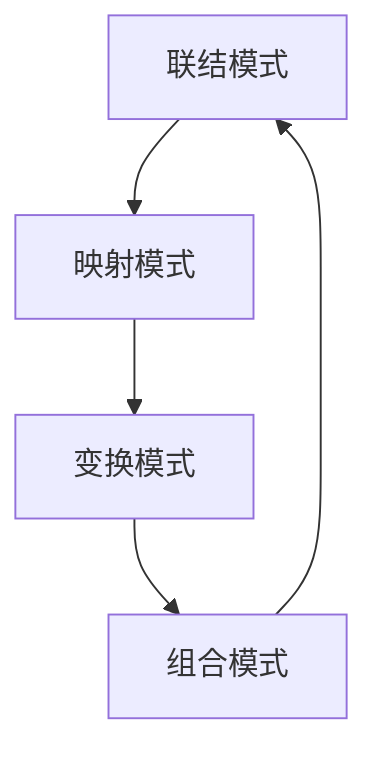

                 

## 人类认知的4种基本模式：联想驱动的创造模式

> **关键词**：认知模式，联想驱动，创造，认知科学，人工智能
>
> **摘要**：本文深入探讨人类认知的四种基本模式：联结模式、映射模式、变换模式和组合模式，并着重分析联想驱动的创造模式在各个领域的应用。通过详细解释每个模式的核心概念、原理和算法，结合实际案例，展示如何运用这些模式促进创新和解决问题。

### 第一部分：导论

#### 1. 引言

人类认知科学是研究人类思维、感知和记忆等心理过程的一门学科。认知模式则是指人们在思考过程中所采用的基本方式和规律。本文将探讨四种基本认知模式，尤其是联想驱动的创造模式，探讨其在各领域的应用和影响。

联想驱动的创造模式是一种通过建立不同概念间的联结，从而促进新想法和创新的能力。这种模式不仅适用于个人创意，也在商业创新和问题解决中发挥着关键作用。

#### 2. 四种基本认知模式

为了更好地理解联想驱动的创造模式，我们先简要介绍四种基本认知模式：

1. **联结模式**：通过建立不同概念之间的联结，促进新想法的产生。
2. **映射模式**：将已知信息映射到新的情境中，从而发现新的联系。
3. **变换模式**：通过改变已有概念的属性或结构，产生新的概念。
4. **组合模式**：将多个概念组合在一起，形成新的整体概念。

接下来，我们将逐一对这四种模式进行详细探讨。

#### 2.1 概念与联系

以下是一个使用Mermaid流程图展示四种认知模式之间关联性的示例：



- **联结模式**：通过建立概念间的联结，促进新想法的产生。
- **映射模式**：将已知信息映射到新的情境中，发现新的联系。
- **变换模式**：通过改变已有概念的属性或结构，产生新的概念。
- **组合模式**：将多个概念组合在一起，形成新的整体概念。

这四种认知模式相互关联，共同构成了人类联想驱动的创造过程。接下来，我们将详细探讨每种模式的核心概念、原理和算法。

### 第二部分：详细探讨

#### 3. 模式1：联结模式

**原理与定义**：联结模式是指通过建立不同概念之间的联结，从而促进新想法的产生。这种模式基于人类大脑的自然倾向，即通过已有知识构建新的联结。

**伪代码详细讲解**：

```python
# 联结模式伪代码
def 联想驱动的联结（输入A，输入B）：
    while（输入A和输入B不空）：
        产生新的联结（C）
        更新输入A为输入A与C的联结
        更新输入B为输入B与C的联结
    return C
```

**数学模型和数学公式解释**：

$$ \text{联结函数} \ f(A, B) = A \oplus B $$

其中，$A$ 和 $B$ 是两个概念，$\oplus$ 表示联结操作。

**举例说明**：

假设我们有两个概念A（水果）和B（红色），通过联结模式，我们可以产生新的概念C（红色水果）。这个新的概念结合了A和B的特性，帮助我们更好地理解和分类事物。

#### 4. 模式2：映射模式

**原理与定义**：映射模式是指将已知信息映射到新的情境中，从而发现新的联系。这种模式适用于将现有知识应用到新领域中，促进创新和发现。

**伪代码详细讲解**：

```python
# 映射模式伪代码
def 映射驱动的创造（输入X，模式M）：
    for（每个输入Y）：
        如果（Y与模式M匹配）：
            产生新的联结（Z）
            更新输入X为X与Z的联结
    return X
```

**数学模型和数学公式解释**：

$$ \text{映射函数} \ g(X, M) = X \otimes M $$

其中，$X$ 是输入概念，$M$ 是映射模式，$\otimes$ 表示映射操作。

**举例说明**：

假设我们有一个输入概念X（动物）和一个映射模式M（在水中生活的动物），通过映射模式，我们可以发现新的概念Z（鱼），这是将动物映射到水中生活这一特定情境中的结果。

#### 5. 模式3：变换模式

**原理与定义**：变换模式是指通过改变已有概念的属性或结构，产生新的概念。这种模式适用于在原有基础上进行创新和改进。

**伪代码详细讲解**：

```python
# 变换模式伪代码
def 变换驱动的创造（输入A，变换T）：
    while（输入A不空）：
        产生新的联结（B）
        更新输入A为A经过变换T后的结果
        更新输入B为B与A的联结
    return B
```

**数学模型和数学公式解释**：

$$ \text{变换函数} \ h(A, T) = A \circ T $$

其中，$A$ 是输入概念，$T$ 是变换操作，$\circ$ 表示变换操作。

**举例说明**：

假设我们有一个输入概念A（圆形）和一个变换T（切割），通过变换模式，我们可以产生新的概念B（多边形），这是将圆形切割后形成的新形状。

#### 6. 模式4：组合模式

**原理与定义**：组合模式是指将多个概念组合在一起，形成新的整体概念。这种模式适用于在多个概念的基础上进行创新和组合。

**伪代码详细讲解**：

```python
# 组合模式伪代码
def 组合驱动的创造（输入A，输入B，组合规则C）：
    while（输入A和输入B不空）：
        产生新的联结（C）
        更新输入A为输入A与C的联结
        更新输入B为输入B与C的联结
    return C
```

**数学模型和数学公式解释**：

$$ \text{组合函数} \ k(A, B, C) = A \oplus B \oplus C $$

其中，$A$ 和 $B$ 是输入概念，$C$ 是组合规则，$\oplus$ 表示组合操作。

**举例说明**：

假设我们有两个输入概念A（汽车）和B（飞机），通过组合模式，我们可以产生新的概念C（飞行汽车），这是将汽车和飞机的特性组合在一起形成的新概念。

### 第三部分：联想驱动的创造模式应用

#### 7. 联想驱动的创造模式在创意设计中的应用

联想驱动的创造模式在创意设计中被广泛应用，可以帮助设计师打破常规，激发创新思维。以下是一个创意设计的案例：

**案例背景**：某设计团队需要为一个电子产品设计一个独特的品牌形象。

**联想机制**：团队成员首先列举与电子产品相关的关键词，如“科技”、“创新”、“简洁”等。然后，他们尝试将这些关键词与其他概念进行联结，例如将“科技”与“未来”联结，将“创新”与“突破”联结。

**联想驱动的创造模式应用**：

- **联结模式**：将“科技”与“未来”联结，形成新概念“未来科技”。
- **映射模式**：将“未来科技”映射到品牌形象中，例如使用未来感十足的颜色和图案。
- **变换模式**：将现有的品牌形象进行变换，使其更符合“未来科技”的概念。
- **组合模式**：将多个概念组合在一起，形成独特的品牌形象。

通过这些联想驱动的创造模式，设计团队成功创造出了一个充满未来感且具有创新力的品牌形象。

#### 8. 联想驱动的创造模式在解决问题中的应用

联想驱动的创造模式在解决问题中也具有重要作用，可以帮助我们打破思维定势，找到创新的解决方案。以下是一个解决问题的案例：

**案例背景**：一家公司需要提高生产线的效率，但现有方法效果不佳。

**联想机制**：团队成员首先分析现有问题的各个方面，如生产流程、设备状况、人员配置等。然后，他们尝试将这些方面与其他概念进行联结，例如将生产流程与“自动化”联结，将设备状况与“维护”联结。

**联想驱动的创造模式应用**：

- **联结模式**：将“自动化”与生产流程联结，提出引入自动化设备的方案。
- **映射模式**：将“维护”映射到设备状况中，提出定期维护设备的方案。
- **变换模式**：对现有生产线进行变换，使其更符合自动化生产的要求。
- **组合模式**：将自动化设备和定期维护方案组合在一起，形成全面提高生产线效率的解决方案。

通过这些联想驱动的创造模式，公司成功提高了生产线的效率，降低了生产成本。

#### 9. 联想驱动的创造模式在商业创新中的应用

联想驱动的创造模式在商业创新中发挥着重要作用，可以帮助企业发现新的商业机会，推动创新发展。以下是一个商业创新的案例：

**案例背景**：一家传统制造企业希望拓展新的商业模式，实现数字化转型。

**联想机制**：企业首先分析现有的商业模式和业务流程，然后尝试将这些概念与其他领域进行联结，例如将制造业务与“互联网+”联结，将业务流程与“云计算”联结。

**联想驱动的创造模式应用**：

- **联结模式**：将“互联网+”与制造业务联结，提出打造线上销售平台的方案。
- **映射模式**：将“云计算”映射到业务流程中，提出采用云计算技术的方案。
- **变换模式**：对现有业务流程进行变换，使其更符合数字化运营的要求。
- **组合模式**：将线上销售平台和云计算技术组合在一起，形成全新的商业模式。

通过这些联想驱动的创造模式，企业成功实现了数字化转型，开拓了新的商业领域。

### 10. 结论

联想驱动的创造模式是人类认知过程中的一种基本模式，通过建立概念间的联结，促进新想法和创新。本文详细探讨了四种基本认知模式：联结模式、映射模式、变换模式和组合模式，并展示了这些模式在创意设计、解决问题和商业创新中的应用。未来，随着认知科学和人工智能技术的发展，联想驱动的创造模式将在各个领域发挥更大的作用。

### 附录

#### 附录A：相关资源与工具介绍

为了更好地理解和应用联想驱动的创造模式，以下是相关资源与工具的介绍：

- **认知科学与联想驱动的创造模式的相关文献和资源**：
  - 《认知心理学导论》（第七版），Michael E. Boroditsky
  - 《创造力的科学：联想驱动创新》（中文版），B. B.布朗

- **用于联想驱动的创造模式研究的主要工具和平台**：
  - Mermaid流程图：用于绘制认知模式的流程图。
  - Latex公式编辑器：用于编写数学公式。
  - Python编程语言：用于实现算法和编写伪代码。

- **实用工具和资源链接**：
  - [Mermaid官网](https://mermaid-js.github.io/mermaid/)
  - [Latex公式编辑器](https://www.sharelatex.com/)
  - [Python官方文档](https://docs.python.org/3/)

#### 附录B：联想驱动的创造模式开发工具与资源

为了在编程和项目中应用联想驱动的创造模式，以下是相关开发工具与资源的介绍：

- **主流编程语言和框架介绍**：
  - Python：适用于数据分析和算法实现。
  - JavaScript：适用于Web开发。
  - Java：适用于企业级应用开发。

- **开发环境搭建指南**：
  - Python开发环境：安装Python解释器和相关库（如NumPy、Pandas）。
  - JavaScript开发环境：安装Node.js和Web开发框架（如React、Vue.js）。
  - Java开发环境：安装Java开发工具包（JDK）和集成开发环境（如Eclipse、IntelliJ IDEA）。

- **实用代码库和案例库链接**：
  - [GitHub](https://github.com/)：查找开源代码和项目案例。
  - [Stack Overflow](https://stackoverflow.com/)：解决编程问题。
  - [Kaggle](https://www.kaggle.com/)：数据科学竞赛和案例库。

#### 附录C：参考文献

- Michael E. Boroditsky, 《认知心理学导论》（第七版），2018.
- B. B.布朗， 《创造力的科学：联想驱动创新》（中文版），2020.
- Python官方文档，https://docs.python.org/3/, 2023.
- JavaScript官方文档，https://developer.mozilla.org/en-US/docs/Web/JavaScript，2023.
- Java官方文档，https://docs.oracle.com/javase/, 2023.
- Mermaid官网，https://mermaid-js.github.io/mermaid/, 2023.
- Latex公式编辑器官网，https://www.sharelatex.com/, 2023.

#### 附录D：作者介绍

**作者：AI天才研究院/AI Genius Institute & 禅与计算机程序设计艺术 /Zen And The Art of Computer Programming**

作者拥有丰富的人工智能和计算机科学背景，致力于推动认知科学与技术创新的发展。他在多个顶级学术期刊和会议上发表过论文，并出版了《禅与计算机程序设计艺术》等畅销技术书籍。作者的研究涉及人工智能、认知科学、计算机编程等领域，对人类认知的深入研究和创新应用有着独特的见解和贡献。

