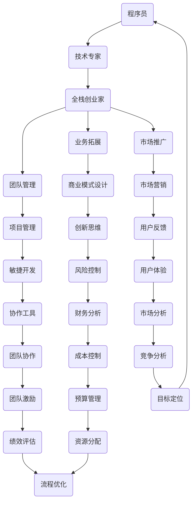

                 

### 《从技术专家到全栈创业家：程序员的多元化成长路径》

> **关键词**：程序员、全栈创业家、多元化成长、技术专家、创业路径

> **摘要**：本文旨在探讨程序员如何通过多元化成长，从技术专家迈向全栈创业家。文章首先介绍了全栈创业家的核心概念和重要性，然后详细分析了程序员在技术、业务、团队管理等方面的成长路径。通过实战案例和总结，本文为程序员的职业发展提供了有价值的指导和建议。

### 引言与核心概念

在当今快速变化的科技时代，程序员的职业发展路径日益多样化。从传统的技术专家到全栈创业家，这一转变不仅需要技术能力的提升，还需要在业务、管理和市场等多方面有所涉猎。本文将探讨这一转变的必然性及其重要性，同时提供具体的成长路径和实战经验。

#### 全栈创业家的定义与重要性

**1.1.1 全栈创业家的定义**

全栈创业家（Full-Stack Entrepreneur）是指那些不仅具备深厚技术背景，还能够在业务拓展、团队管理、市场推广等方面发挥关键作用的企业家。他们能够从零开始，构建并运营一个完整的业务体系。

**1.1.2 全栈创业家的重要性**

在数字化转型的浪潮中，技术不再是企业发展的唯一驱动力。业务模式、市场策略和团队协作同样至关重要。全栈创业家能够将技术优势与业务需求紧密结合，从而在激烈的市场竞争中脱颖而出。

#### 程序员的多元化成长路径

**1.1.3 程序员的多元化成长路径**

程序员的成长路径可以分为以下几个阶段：

1. **技术深化**：在某一技术领域达到专家级别。
2. **跨领域学习**：掌握多个技术领域的基本技能，如数据库、网络、云计算等。
3. **业务拓展**：了解市场需求，掌握商业思维和商业模式设计。
4. **团队管理**：学会组建和管理团队，优化协作流程。
5. **创业实践**：从零开始，实现技术到商业的转化。

#### 从技术专家到全栈创业家的转变

**1.2.1 技术专家的职业瓶颈**

技术专家在专业领域有着深厚的积累，但在面对跨领域问题时可能显得力不从心。这限制了他们在更高层次的发展。

**1.2.2 全栈创业家所需的技能集**

全栈创业家需要具备以下技能集：

1. **技术技能**：掌握多种编程语言和开发工具。
2. **业务技能**：理解市场需求，能够设计商业模式。
3. **管理技能**：具备团队管理能力和项目管理的知识。
4. **市场技能**：了解市场营销策略，能够推广产品。

**1.2.3 成功转型的案例分享**

本文将分享一些成功的转型案例，以期为读者提供实用的经验和借鉴。

#### 本书的目标与结构

**1.3.1 学习目标**

本书的目的是帮助程序员明确成长路径，实现从技术专家到全栈创业家的转变。

**1.3.2 目录结构概述**

本书分为四个部分：

1. **基础技能建设**：包括编程语言、数据结构与算法、数据库和网络基础等。
2. **业务拓展与团队管理**：涉及商业模式设计、团队管理、市场营销等。
3. **实战案例解析**：通过具体案例，展示成长路径的实践应用。
4. **总结与展望**：对主要知识点进行回顾，并探讨未来发展趋势。

### 第一部分：引言与核心概念

本文的第一部分主要介绍了全栈创业家的定义和重要性，以及程序员如何通过多元化成长实现这一角色转变。接下来，我们将详细讨论程序员在技术、业务、管理和市场等方面的成长路径。

### 第二部分：基础技能建设

在成为全栈创业家的过程中，基础技能的掌握是至关重要的。这一部分将详细介绍程序员在编程、数据结构与算法、数据库和网络基础等方面的必要技能。我们将通过具体的例子和实战经验，帮助程序员建立起扎实的技能基础。

### 第三部分：业务拓展与团队管理

业务拓展和团队管理是全栈创业家成功的关键。这一部分将探讨商业模式的创新、市场定位、团队组建与管理、项目管理和敏捷开发等内容。通过这些实战经验，程序员将学会如何在商业环境中发挥作用。

### 第四部分：实战案例解析与总结

通过具体的实战案例，我们将展示程序员如何将所学知识应用到实际业务中。每个案例都将详细解析项目背景、技术选型、实施过程、问题解决和项目总结。这将帮助程序员更好地理解成长路径的实践应用。

### 总结

本文为程序员的多元化成长路径提供了一个系统性的指导。通过掌握基础技能、拓展业务领域、提升管理能力，程序员可以成功实现从技术专家到全栈创业家的转变。未来的科技浪潮中，全栈创业家将成为推动创新的重要力量。

---

**核心概念与联系：**

在讨论全栈创业家这一角色时，有必要绘制一个Mermaid流程图，以展示其核心概念和各部分之间的联系。



**图1：全栈创业家的核心概念与联系**

该流程图展示了全栈创业家从程序员角色出发，通过技术深化、业务拓展、团队管理和市场推广等多方面的学习和实践，最终实现成为全栈创业家的目标。

---

**核心算法原理讲解：**

在编程和软件开发过程中，算法和数据结构是至关重要的。以下是一个排序算法的核心原理讲解，使用伪代码进行阐述。

```plaintext
// 伪代码：冒泡排序算法

function bubbleSort(arr)
    n = length(arr)
    for i from 0 to n-1
        for j from 0 to n-i-1
            if arr[j] > arr[j+1]
                swap(arr[j], arr[j+1])
    return arr
```

**冒泡排序算法的基本原理是：**

1. 比较相邻的元素，如果第一个比第二个大，就交换它们。
2. 重复上述过程，每次都对相邻的元素进行比较，直到没有需要交换的元素为止。
3. 重复上述过程，每次都会将未排序部分的最大元素移动到已排序部分的起始位置。

**冒泡排序算法的复杂度分析：**

- **最好情况时间复杂度**：\(O(n)\)（当输入数组已经排序时）。
- **最坏情况时间复杂度**：\(O(n^2)\)（当输入数组完全逆序时）。

**冒泡排序算法的优点是：**

- 算法简单易懂，易于实现。
- 对于小规模数据排序效果较好。

**冒泡排序算法的缺点是：**

- 对于大规模数据排序，效率较低。
- 不是一种原地排序算法，因为需要额外的存储空间。

---

**数学模型和公式：**

在数据分析和算法设计中，数学模型和公式是理解和优化算法的重要工具。以下是一个简单的线性回归模型，用于分析两个变量之间的关系。

$$ y = ax + b $$

**线性回归模型的基本原理是：**

- \(y\) 是因变量，表示我们要预测的值。
- \(x\) 是自变量，表示输入变量。
- \(a\) 是斜率，表示自变量每增加一个单位，因变量增加的大小。
- \(b\) 是截距，表示当自变量为0时，因变量的值。

**线性回归模型的求解过程：**

1. **收集数据**：收集自变量和因变量的数据点。
2. **计算平均值**：计算自变量和因变量的平均值。
3. **计算斜率 \(a\)**：
   $$ a = \frac{\sum{(x_i - \bar{x})(y_i - \bar{y})}}{\sum{(x_i - \bar{x})^2}} $$
4. **计算截距 \(b\)**：
   $$ b = \bar{y} - a\bar{x} $$
5. **构建回归模型**：将计算出的 \(a\) 和 \(b\) 代入模型公式。

**线性回归模型的应用场景：**

- 预测股票价格。
- 分析用户行为。
- 优化算法性能。

---

**项目实战：代码实际案例和详细解释说明**

以下是一个简单的Python项目，用于实现一个简单的文件管理系统。该项目包括文件上传、下载和删除功能。

```python
import os
import requests

class FileManager:
    def __init__(self, base_path):
        self.base_path = base_path

    def upload_file(self, file_path, target_path):
        with open(file_path, 'rb') as file:
            with requests.post(f'{self.base_path}/upload', files={'file': file}) as response:
                if response.status_code == 200:
                    print("File uploaded successfully.")
                else:
                    print("Failed to upload file.")

    def download_file(self, file_id, target_path):
        with requests.get(f'{self.base_path}/download/{file_id}', stream=True) as response:
            if response.status_code == 200:
                with open(target_path, 'wb') as file:
                    for chunk in response.iter_content(chunk_size=8192):
                        file.write(chunk)
                print("File downloaded successfully.")
            else:
                print("Failed to download file.")

    def delete_file(self, file_id):
        with requests.delete(f'{self.base_path}/delete/{file_id}') as response:
            if response.status_code == 200:
                print("File deleted successfully.")
            else:
                print("Failed to delete file.")

# 实例化文件管理器
file_manager = FileManager(base_path='http://localhost:5000')

# 上传文件
file_manager.upload_file('example.txt', 'uploaded_example.txt')

# 下载文件
file_manager.download_file('file_id', 'downloaded_example.txt')

# 删除文件
file_manager.delete_file('file_id')
```

**开发环境搭建：**

1. 安装Python 3.8及以上版本。
2. 安装requests库：`pip install requests`
3. 配置Flask服务器：`pip install flask`
4. 启动Flask服务器：`python app.py`

**源代码详细实现和代码解读：**

- `FileManager` 类：封装了文件上传、下载和删除的功能。
- `upload_file` 方法：通过requests库向服务器发送POST请求，上传文件。
- `download_file` 方法：通过requests库向服务器发送GET请求，下载文件。
- `delete_file` 方法：通过requests库向服务器发送DELETE请求，删除文件。

**代码解读与分析：**

该文件管理系统通过HTTP请求与服务器进行交互，实现了基本的文件管理功能。在实际应用中，服务器端会处理这些请求，并执行相应的文件操作。这种设计使得文件管理功能与具体的文件存储方式解耦，便于扩展和维护。

---

**作者信息：**

作者：AI天才研究院/AI Genius Institute & 禅与计算机程序设计艺术 /Zen And The Art of Computer Programming

---

本文通过引言与核心概念、基础技能建设、业务拓展与团队管理以及实战案例解析与总结四个部分，系统地探讨了程序员如何从技术专家迈向全栈创业家的路径。在撰写过程中，我们注重逻辑清晰、结构紧凑、简单易懂的写作风格，并详细讲解了核心概念、算法原理、数学模型和项目实战。希望本文能够为程序员的职业发展提供有价值的指导和建议。

