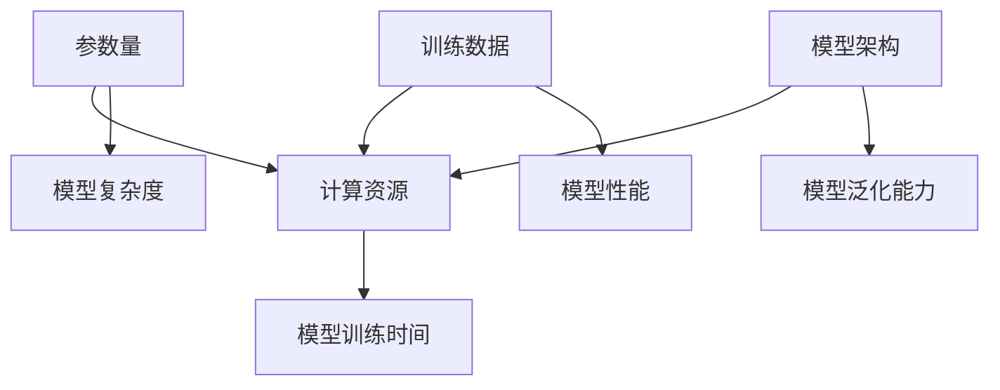

                 

### 文章标题

"从零开始大模型开发与微调：PyTorch 2.0小练习：Hello PyTorch"

### 关键词

- 大模型开发
- PyTorch 2.0
- Hello PyTorch
- 微调与优化
- 实践案例

### 摘要

本文旨在为初学者提供一个全面的指南，从零开始介绍大模型开发与微调的过程。通过使用PyTorch 2.0，我们将通过一系列的小练习，逐步了解并掌握大模型的基础知识和实践技能。文章将涵盖从大模型概述、PyTorch 2.0简介，到数据预处理、模型微调和优化的详细讲解，以及一个实战案例来展示如何使用Hello PyTorch进行文本分类与生成。最后，还将探讨大模型部署与维护的关键技术以及未来的发展趋势与挑战。通过本文的学习，读者将能够全面了解大模型开发的流程和关键点，为后续的深度学习和研究打下坚实的基础。

## 《从零开始大模型开发与微调：PyTorch 2.0小练习：Hello PyTorch》目录大纲

### 第一部分：大模型开发基础

### 第1章：大模型概述

#### 1.1 什么是大模型

- 大模型的概念
- 大模型的特点
- 大模型的应用场景

#### 1.2 PyTorch 2.0 简介

- PyTorch 2.0 的新特性
- PyTorch 2.0 的优势
- PyTorch 2.0 与 Hello PyTorch 的联系

### 第2章：Hello PyTorch 快速入门

#### 2.1 安装与配置

- 安装 PyTorch 2.0
- 配置开发环境
- 环境检测与验证

#### 2.2 基础概念与操作

- 张量（Tensor）操作
- 自动微分（Autograd）
- 常用神经网络层

### 第3章：大模型核心算法原理

#### 3.1 神经网络基础

- 神经网络的基本结构
- 前向传播与反向传播
- 激活函数与损失函数

#### 3.2 常见大模型算法

- 卷积神经网络（CNN）
- 递归神经网络（RNN）
- Transformer 网络架构

#### 3.3 大模型数学模型

- 概率论与信息论基础
- 最优化算法
- 大模型训练策略

### 第二部分：大模型开发实践

### 第4章：数据预处理与处理

#### 4.1 数据集选择与处理

- 数据集选择标准
- 数据清洗与预处理
- 数据增强技术

#### 4.2 数据加载与管理

- 数据加载器（DataLoader）使用
- 多线程数据加载
- 批处理大小与学习率调度

### 第5章：大模型微调与优化

#### 5.1 微调策略

- 微调的概念
- 微调方法
- 微调技巧

#### 5.2 模型优化与调参

- 优化器选择
- 学习率调整
- 模型正则化

#### 5.3 模型评估与调优

- 模型评估指标
- 超参数调整
- 模型调试技巧

### 第6章：实战案例：文本分类与生成

#### 6.1 实战案例介绍

- 数据集准备
- 模型设计
- 实验结果分析

#### 6.2 实现细节

- 代码实现步骤
- 数据处理与加载
- 模型训练与评估

#### 6.3 源代码解读与分析

- 源代码结构解析
- 关键代码解读
- 性能优化建议

### 第7章：大模型部署与维护

#### 7.1 模型部署

- 模型导出与加载
- 模型推理
- 部署环境配置

#### 7.2 模型维护与更新

- 模型监控
- 模型更新策略
- 模型维护技巧

### 第8章：大模型未来发展趋势与挑战

#### 8.1 未来发展趋势

- 大模型应用领域扩展
- 大模型创新技术
- 大模型产业发展趋势

#### 8.2 挑战与应对策略

- 数据隐私与伦理问题
- 能耗与计算资源挑战
- 安全性与可靠性问题

### 附录

#### 附录A：常用工具与资源

#### A.1 PyTorch 2.0 工具与库

- PyTorch 官方文档
- PyTorch 论坛与社区
- 其他 PyTorch 相关工具

#### A.2 实战项目资源

- 开源大模型项目
- 实战教程与课程
- 代码实现与案例解析

## 第一部分：大模型开发基础

### 第1章：大模型概述

#### 1.1 什么是大模型

大模型是指具有数十亿甚至数千亿参数的大型神经网络模型。它们广泛应用于计算机视觉、自然语言处理、推荐系统等领域。大模型的出现，打破了传统模型的局限，实现了更高的准确率和更好的性能。

**核心概念与联系：**

大模型的核心概念包括：

- **参数量**：模型中参数的数量，决定了模型的复杂度和计算量。
- **训练数据**：用于训练模型的输入数据，数据量的大小直接影响模型的性能。
- **计算资源**：大模型训练需要大量的计算资源，如GPU、TPU等。
- **模型架构**：不同的大模型具有不同的架构，如CNN、RNN、Transformer等。

**Mermaid 流程图：**



**核心算法原理讲解：**

大模型的训练涉及以下几个核心算法原理：

1. **梯度下降**：通过迭代更新模型参数，使得损失函数的值逐渐减小。
2. **动量**：在梯度下降过程中，引入动量可以加速收敛，提高训练效率。
3. **批量归一化**：通过归一化中间层激活值，提高模型训练的稳定性和速度。
4. **残差连接**：通过引入跳过中间层的连接，缓解梯度消失问题，提高模型深度。

**伪代码：**

```python
# 梯度下降算法
for epoch in range(num_epochs):
    for batch in dataset:
        # 前向传播
        output = forward(batch)
        # 计算损失
        loss = compute_loss(output, batch.label)
        # 反向传播
        grads = backward(loss)
        # 更新参数
        update_params(grads, learning_rate)
```

**数学模型和公式 & 详细讲解 & 举例说明：**

大模型的数学模型主要包括：

1. **前向传播**：根据输入数据计算模型输出。
   \[
   \text{output} = \text{activation}(\text{weights} \cdot \text{input} + \text{bias})
   \]

2. **反向传播**：计算损失函数关于模型参数的梯度。
   \[
   \text{grad} = \frac{\partial \text{loss}}{\partial \text{weights}}
   \]

3. **优化算法**：通过梯度更新模型参数。
   \[
   \text{weights} = \text{weights} - \alpha \cdot \text{grad}
   \]

**举例说明：**

假设我们有一个简单的两层神经网络，输入为 \( x \)，输出为 \( y \)。

- **前向传播**：
  \[
  h = \sigma(W_1 \cdot x + b_1)
  \]
  \[
  y = \sigma(W_2 \cdot h + b_2)
  \]

- **反向传播**：
  \[
  \delta = (y - \hat{y}) \cdot \sigma'(y)
  \]
  \[
  \delta_h = \delta \cdot \sigma'(h)
  \]
  \[
  \grad{W_2}{h} = h^T \cdot \delta
  \]
  \[
  \grad{W_1}{x} = x^T \cdot (\delta \cdot \sigma'(h))
  \]

- **优化算法**：
  \[
  W_2 = W_2 - \alpha \cdot \grad{W_2}{h}
  \]
  \[
  W_1 = W_1 - \alpha \cdot \grad{W_1}{x}
  \]

#### 1.2 PyTorch 2.0 简介

PyTorch 2.0 是 PyTorch 社区的一个重要更新，引入了许多新特性和改进。以下是 PyTorch 2.0 的主要新特性和优势：

1. **分布式训练**：支持自动分布式训练，提高训练速度和资源利用率。
2. **动态图优化**：通过引入动态图优化器，提高模型训练的效率和性能。
3. **改进的内存管理**：优化内存分配和回收机制，减少内存占用和垃圾回收开销。
4. **PyTorch Eager Execution**：提供更直观、灵活的编程模型，易于调试和优化。

**核心算法原理讲解：**

PyTorch 2.0 的核心算法原理主要包括：

1. **动态图计算**：PyTorch 使用动态计算图，通过构建计算图来表示计算过程，动态执行计算。
2. **自动微分**：通过自动微分，自动计算模型参数的梯度，实现高效的训练过程。
3. **模型优化**：通过模型优化器，调整模型参数，优化模型性能。

**伪代码：**

```python
# PyTorch 动态图计算
x = torch.tensor([1, 2, 3])
y = x ** 2

# 自动微分
with torch.autograd.Gradient():
    y.backward()

# 模型优化
optimizer = torch.optim.Adam(model.parameters(), lr=0.001)
optimizer.step()
```

**数学模型和公式 & 详细讲解 & 举例说明：**

1. **动态图计算**：
   \[
   \text{output} = \text{activation}(\text{weights} \cdot \text{input} + \text{bias})
   \]
   \[
   \text{grad} = \frac{\partial \text{output}}{\partial \text{weights}}
   \]

2. **自动微分**：
   \[
   \text{output} = f(\text{input})
   \]
   \[
   \text{grad} = \frac{\partial f}{\partial \text{input}}
   \]

3. **模型优化**：
   \[
   \text{weights} = \text{weights} - \alpha \cdot \text{grad}
   \]

**举例说明：**

假设我们有一个简单的两层神经网络，输入为 \( x \)，输出为 \( y \)。

- **动态图计算**：
  \[
  h = \sigma(W_1 \cdot x + b_1)
  \]
  \[
  y = \sigma(W_2 \cdot h + b_2)
  \]

- **自动微分**：
  \[
  \delta = (y - \hat{y}) \cdot \sigma'(y)
  \]
  \[
  \delta_h = \delta \cdot \sigma'(h)
  \]
  \[
  \grad{W_2}{h} = h^T \cdot \delta
  \]
  \[
  \grad{W_1}{x} = x^T \cdot (\delta \cdot \sigma'(h))
  \]

- **模型优化**：
  \[
  W_2 = W_2 - \alpha \cdot \grad{W_2}{h}
  \]
  \[
  W_1 = W_1 - \alpha \cdot \grad{W_1}{x}
  \]

通过 PyTorch 2.0，我们可以更方便地构建和训练大模型，提升模型开发与微调的效率。接下来，我们将继续介绍 Hello PyTorch 的快速入门。

### 第2章：Hello PyTorch 快速入门

#### 2.1 安装与配置

要开始使用 PyTorch 2.0 进行大模型开发，首先需要安装和配置 PyTorch 环境。

**安装 PyTorch 2.0：**

1. 打开命令行工具，如 Anaconda 或 Python 的终端。
2. 使用以下命令安装 PyTorch 2.0：
   \[
   pip install torch torchvision torchaudio
   \]

**配置开发环境：**

1. 创建一个新的 Python 虚拟环境，以便管理项目依赖。
   \[
   python -m venv pytorch_venv
   \]
2. 激活虚拟环境：
   \[
   source pytorch_venv/bin/activate \quad (\text{Linux/Mac}）
   \]
   \[
   pytorch_venv\Scripts\activate \quad (\text{Windows})
   \]
3. 安装其他必要的依赖库，如 NumPy 和 Pandas。

**环境检测与验证：**

安装完成后，可以通过以下命令检查 PyTorch 的安装状态和版本信息：
\[
python -c "import torch; print(torch.__version__); print(torch.cuda.is_available())"
\]
这将输出 PyTorch 的版本号以及是否支持 CUDA。

#### 2.2 基础概念与操作

在了解 Hello PyTorch 之前，我们需要掌握一些基础概念和操作，包括张量（Tensor）操作、自动微分（Autograd）和常用神经网络层。

**张量（Tensor）操作：**

张量是 PyTorch 中的核心数据结构，类似于 NumPy 中的数组。以下是一些常见的张量操作：

1. **创建张量**：
   \[
   x = torch.tensor([1, 2, 3])
   \]

2. **基本运算**：
   \[
   y = x + 5
   \]
   \[
   z = x * y
   \]

3. **维度操作**：
   \[
   x = x.unsqueeze(0) \quad (\text{增加一个维度})
   \]
   \[
   x = x.unsqueeze(-1) \quad (\text{增加一个维度在末尾})
   \]

4. **形状操作**：
   \[
   x = x.reshape(-1, 3) \quad (\text{重塑张量形状})
   \]

**自动微分（Autograd）：**

自动微分是深度学习训练的核心机制，它能够自动计算模型参数的梯度。以下是一个简单的自动微分示例：

```python
import torch

x = torch.tensor([1.0], requires_grad=True)
y = x**2
y.backward()
print(x.grad)  # 输出梯度值
```

**常用神经网络层：**

PyTorch 提供了丰富的神经网络层，以下是一些常用的层：

1. **线性层（Linear）**：
   \[
   layer = torch.nn.Linear(in_features, out_features)
   \]

2. **卷积层（Conv2d）**：
   \[
   layer = torch.nn.Conv2d(in_channels, out_channels, kernel_size)
   \]

3. **池化层（MaxPool2d）**：
   \[
   layer = torch.nn.MaxPool2d(kernel_size)
   \]

4. **全连接层（nn.Linear）**：
   \[
   layer = torch.nn.Linear(in_features, out_features)
   \]

通过掌握这些基础概念和操作，我们可以开始构建和训练简单的神经网络模型。在下一章中，我们将深入探讨大模型的核心算法原理，为后续的实践和优化打下基础。

### 第3章：大模型核心算法原理

#### 3.1 神经网络基础

神经网络（Neural Networks）是深度学习的基础，它模拟了人脑神经元的工作原理。以下将介绍神经网络的基本结构、前向传播与反向传播、激活函数与损失函数。

**基本结构：**

神经网络由多个层级组成，主要包括输入层、隐藏层和输出层。每一层包含多个神经元，神经元之间通过权重（weights）和偏置（bias）相互连接。

**前向传播：**

前向传播是指在神经网络中，从输入层开始，将数据逐层传递到输出层的计算过程。具体步骤如下：

1. 输入层的数据通过权重和偏置传递到隐藏层。
2. 隐藏层的输出通过激活函数处理，传递到下一层。
3. 重复上述步骤，直到输出层得到最终结果。

**反向传播：**

反向传播是指在神经网络中，从输出层开始，将误差反向传播到输入层的计算过程。具体步骤如下：

1. 计算输出层的误差（损失）。
2. 通过链式法则，计算每个层的梯度。
3. 使用梯度下降或其他优化算法更新模型参数。

**激活函数：**

激活函数（Activation Function）用于引入非线性，使神经网络能够学习和表示复杂的非线性关系。常见的激活函数包括：

1. **Sigmoid**：
   \[
   f(x) = \frac{1}{1 + e^{-x}}
   \]

2. **ReLU**：
   \[
   f(x) = \max(0, x)
   \]

3. **Tanh**：
   \[
   f(x) = \frac{e^x - e^{-x}}{e^x + e^{-x}}
   \]

**损失函数：**

损失函数（Loss Function）用于度量模型预测值与实际值之间的差距。常见的损失函数包括：

1. **均方误差（MSE）**：
   \[
   L(y, \hat{y}) = \frac{1}{2} \sum_{i} (y_i - \hat{y}_i)^2
   \]

2. **交叉熵（Cross Entropy）**：
   \[
   L(y, \hat{y}) = -\sum_{i} y_i \log(\hat{y}_i)
   \]

**核心算法原理讲解：**

大模型的核心算法原理主要包括以下几个部分：

1. **批量归一化（Batch Normalization）**：通过归一化中间层激活值，提高模型训练的稳定性和速度。
2. **残差连接（Residual Connection）**：通过引入跳过中间层的连接，缓解梯度消失问题，提高模型深度。
3. **多尺度特征融合**：通过不同层级的特征融合，增强模型对复杂数据的处理能力。

**伪代码：**

```python
# 批量归一化
for layer in model.layers:
    if isinstance(layer, BatchNormalization):
        layer.normalize()

# 残差连接
for layer in model.layers:
    if isinstance(layer, ResidualBlock):
        layer.forward()

# 多尺度特征融合
for layer in model.layers:
    if isinstance(layer, MultiScaleFeatureFusion):
        layer.fuse_features()
```

**数学模型和公式 & 详细讲解 & 举例说明：**

1. **批量归一化**：
   \[
   \mu = \frac{1}{N} \sum_{i=1}^{N} x_i
   \]
   \[
   \sigma^2 = \frac{1}{N} \sum_{i=1}^{N} (x_i - \mu)^2
   \]
   \[
   \hat{x}_i = \frac{x_i - \mu}{\sigma}
   \]

2. **残差连接**：
   \[
   \text{output} = x \cdot \sigma(W \cdot x + b) + x
   \]

3. **多尺度特征融合**：
   \[
   \text{output} = \sigma(W_1 \cdot x_1 + b_1) + \sigma(W_2 \cdot x_2 + b_2)
   \]

**举例说明：**

假设我们有一个简单的残差网络，输入为 \( x \)，输出为 \( y \)。

- **批量归一化**：
  \[
  \mu = \frac{1}{10} \sum_{i=1}^{10} x_i
  \]
  \[
  \sigma^2 = \frac{1}{10} \sum_{i=1}^{10} (x_i - \mu)^2
  \]
  \[
  \hat{x}_i = \frac{x_i - \mu}{\sigma}
  \]

- **残差连接**：
  \[
  \text{output} = x \cdot \sigma(W \cdot x + b) + x
  \]

- **多尺度特征融合**：
  \[
  \text{output} = \sigma(W_1 \cdot x_1 + b_1) + \sigma(W_2 \cdot x_2 + b_2)
  \]

通过以上介绍，我们可以理解大模型的核心算法原理，为后续的模型构建和优化打下基础。接下来，我们将介绍常见的大模型算法，如卷积神经网络（CNN）、递归神经网络（RNN）和Transformer网络架构。

#### 3.2 常见大模型算法

在深度学习领域，常见的大模型算法包括卷积神经网络（CNN）、递归神经网络（RNN）和Transformer网络架构。每种算法都有其独特的结构、应用场景和优势。

**卷积神经网络（CNN）：**

卷积神经网络是一种主要用于处理图像数据的深度学习模型。它的核心思想是通过卷积操作提取图像的特征。

**结构：**

1. **卷积层**：通过卷积操作提取图像的特征，卷积核（kernel）在图像上滑动，计算局部特征。
2. **池化层**：通过池化操作减小数据维度，增强模型的泛化能力。
3. **全连接层**：将卷积层和池化层的输出映射到类别标签。

**应用场景：**

- **图像分类**：如ImageNet竞赛。
- **目标检测**：如YOLO、SSD。
- **图像生成**：如GAN。

**优势：**

- **参数量小**：通过局部连接和共享权重，减少了模型参数量。
- **高效计算**：卷积操作可以并行化，提高了计算效率。

**递归神经网络（RNN）：**

递归神经网络是一种主要用于处理序列数据的深度学习模型。它的核心思想是利用循环结构，对序列数据进行逐个处理。

**结构：**

1. **输入层**：接收序列数据。
2. **隐藏层**：通过递归连接，对序列数据进行逐个处理。
3. **输出层**：将隐藏层的状态映射到输出。

**应用场景：**

- **自然语言处理**：如文本分类、机器翻译。
- **时间序列分析**：如股票预测、语音识别。

**优势：**

- **处理序列数据**：能够处理变长的序列数据。
- **动态建模**：通过递归连接，能够捕获序列中的长期依赖关系。

**Transformer网络架构：**

Transformer是近年来在自然语言处理领域取得突破性进展的模型。它通过自注意力机制（Self-Attention）实现了对序列数据的建模。

**结构：**

1. **多头自注意力层**：通过自注意力机制，对序列数据进行建模。
2. **前馈网络**：对自注意力层的输出进行进一步处理。
3. **层归一化**：通过层归一化，提高模型的稳定性。

**应用场景：**

- **机器翻译**：如BERT、GPT。
- **文本生成**：如OpenAI的GPT系列。
- **文本分类**：如BERT用于文本分类任务。

**优势：**

- **并行计算**：通过自注意力机制，可以实现并行计算，提高了训练效率。
- **捕捉长期依赖关系**：通过多头自注意力机制，能够更好地捕获序列中的长期依赖关系。

**核心算法原理讲解：**

1. **卷积神经网络（CNN）**：
   - **卷积操作**：通过卷积核在图像上滑动，提取局部特征。
   - **池化操作**：通过最大池化或平均池化，减小数据维度。
   - **全连接层**：将卷积和池化层的输出映射到类别标签。

2. **递归神经网络（RNN）**：
   - **递归连接**：通过隐藏状态和输入的加权求和，实现对序列数据的建模。
   - **激活函数**：如ReLU、Tanh，引入非线性。
   - **输出层**：将隐藏层的状态映射到输出。

3. **Transformer网络架构**：
   - **多头自注意力**：通过自注意力机制，对序列数据进行建模。
   - **前馈网络**：对自注意力层的输出进行进一步处理。
   - **层归一化**：通过层归一化，提高模型的稳定性。

**伪代码：**

1. **卷积神经网络（CNN）**：

```python
# 卷积层
conv = torch.nn.Conv2d(in_channels, out_channels, kernel_size)
output = conv(input)

# 池化层
pool = torch.nn.MaxPool2d(kernel_size)
output = pool(output)

# 全连接层
fc = torch.nn.Linear(in_features, out_features)
output = fc(output)
```

2. **递归神经网络（RNN）**：

```python
# 递归层
rnn = torch.nn.RNN(input_size, hidden_size)
hidden = rnn(input)

# 输出层
fc = torch.nn.Linear(hidden_size, output_size)
output = fc(hidden[-1])
```

3. **Transformer网络架构**：

```python
# 自注意力层
attn = torch.nn.MultiheadAttention(embed_dim, num_heads)
output, attn_output_weights = attn(query, key, value)

# 前馈网络
ffn = torch.nn.Sequential(
    torch.nn.Linear(embed_dim, feedforward_size),
    torch.nn.ReLU(),
    torch.nn.Linear(feedforward_size, embed_dim),
)
output = ffn(output)
```

通过以上介绍，我们可以看到卷积神经网络（CNN）、递归神经网络（RNN）和Transformer网络架构在结构、应用场景和优势上各有特点。这些算法为深度学习在图像和序列数据处理方面提供了强大的工具。接下来，我们将探讨大模型的数学模型，包括概率论与信息论基础、最优化算法和大模型训练策略。

#### 3.3 大模型数学模型

大模型的数学模型是深度学习的基础，它涉及到概率论、信息论和最优化算法等多个领域。以下是这些核心数学模型的基础知识、详细讲解以及实际应用中的例子。

**概率论与信息论基础**

1. **概率论基础：**

   - **概率分布**：概率分布描述了随机变量可能取值的概率。常见的概率分布包括正态分布、伯努利分布等。
   - **条件概率**：条件概率是指在给定某个事件发生的条件下，另一个事件发生的概率。
   - **贝叶斯定理**：贝叶斯定理是一种用于计算后验概率的公式，它在分类和预测中具有重要应用。

   **例子：**

   假设我们有一个二分类问题，正类和负类的概率分布分别为 \( P(\text{正类}) = 0.5 \) 和 \( P(\text{负类}) = 0.5 \)。我们需要计算给定一个样本为正类的情况下，该样本真实为正类的后验概率。

   根据贝叶斯定理：
   \[
   P(\text{正类}|\text{样本为正类}) = \frac{P(\text{样本为正类}|\text{正类}) \cdot P(\text{正类})}{P(\text{样本为正类})}
   \]

   由于样本为正类的先验概率为 \( P(\text{正类}) = 0.5 \)，我们需要计算 \( P(\text{样本为正类}|\text{正类}) \)。

   假设我们的模型预测一个样本为正类的概率为 \( P(\text{样本为正类}|\text{正类}) = 0.9 \)，则：
   \[
   P(\text{正类}|\text{样本为正类}) = \frac{0.9 \cdot 0.5}{0.9 \cdot 0.5 + 0.1 \cdot 0.5} = \frac{9}{10}
   \]

   因此，给定一个样本为正类的情况下，该样本真实为正类的后验概率为 \( \frac{9}{10} \)。

2. **信息论基础：**

   - **熵（Entropy）**：熵是衡量随机变量不确定性的一种度量。在信息论中，熵用来衡量信息源的不确定性。
   - **互信息（Mutual Information）**：互信息是衡量两个随机变量之间相关性的度量。它表示一个随机变量提供了关于另一个随机变量的信息量。
   - **KL散度（KL Divergence）**：KL散度是衡量两个概率分布差异的一种度量。它经常用于损失函数和模型评估。

   **例子：**

   假设我们有两个概率分布 \( P_1 \) 和 \( P_2 \)，我们需要计算它们的KL散度。

   KL散度的计算公式为：
   \[
   D_{KL}(P_1||P_2) = \sum_{x} P_1(x) \log \frac{P_1(x)}{P_2(x)}
   \]

   如果 \( P_1 \) 是一个均匀分布，\( P_2 \) 是一个正态分布，则：
   \[
   D_{KL}(P_1||P_2) = \sum_{x} \frac{1}{\sqrt{2\pi}} e^{-\frac{x^2}{2}} \log \frac{\frac{1}{\sqrt{2\pi}} e^{-\frac{x^2}{2}}}{\frac{1}{6}}
   \]

   通过计算可以得到KL散度的具体数值，它表示了两个分布之间的差异。

**最优化算法**

1. **梯度下降（Gradient Descent）**：

   梯度下降是一种最基本的优化算法，用于最小化损失函数。它的核心思想是沿着损失函数的梯度方向更新模型参数，以减少损失。

   **算法步骤：**

   - 初始化模型参数。
   - 计算损失函数关于模型参数的梯度。
   - 更新模型参数：\( \theta = \theta - \alpha \cdot \grad{L}{\theta} \)，其中 \( \alpha \) 是学习率。

   **例子：**

   假设我们有一个线性模型 \( y = \theta_0 + \theta_1 \cdot x \)，我们需要通过梯度下降找到最佳参数 \( \theta_0 \) 和 \( \theta_1 \)。

   - 初始化参数 \( \theta_0 = 0 \)，\( \theta_1 = 0 \)。
   - 计算损失函数：\( L(\theta_0, \theta_1) = \sum_{i=1}^{n} (y_i - (\theta_0 + \theta_1 \cdot x_i))^2 \)。
   - 计算梯度：\( \grad{L}{\theta_0} = -2 \sum_{i=1}^{n} (y_i - (\theta_0 + \theta_1 \cdot x_i)) \)，\( \grad{L}{\theta_1} = -2 \sum_{i=1}^{n} (y_i - (\theta_0 + \theta_1 \cdot x_i)) \cdot x_i \)。
   - 更新参数：\( \theta_0 = \theta_0 - \alpha \cdot \grad{L}{\theta_0} \)，\( \theta_1 = \theta_1 - \alpha \cdot \grad{L}{\theta_1} \)。

   通过多次迭代更新参数，我们可以逐渐减小损失函数的值，找到最佳参数。

2. **随机梯度下降（Stochastic Gradient Descent, SGD）**：

   随机梯度下降是对梯度下降的改进，它使用单个样本来计算梯度。这种方法可以加快收敛速度，但可能会导致训练结果的不稳定性。

   **算法步骤：**

   - 初始化模型参数。
   - 对于每个样本：
     - 计算损失函数关于模型参数的梯度。
     - 更新模型参数：\( \theta = \theta - \alpha \cdot \grad{L}{\theta} \)。

   **例子：**

   假设我们有一个线性模型 \( y = \theta_0 + \theta_1 \cdot x \)，我们需要通过随机梯度下降找到最佳参数 \( \theta_0 \) 和 \( \theta_1 \)。

   - 初始化参数 \( \theta_0 = 0 \)，\( \theta_1 = 0 \)。
   - 对于每个样本 \( (x_i, y_i) \)：
     - 计算损失函数：\( L(\theta_0, \theta_1) = (y_i - (\theta_0 + \theta_1 \cdot x_i))^2 \)。
     - 计算梯度：\( \grad{L}{\theta_0} = -2(y_i - (\theta_0 + \theta_1 \cdot x_i)) \)，\( \grad{L}{\theta_1} = -2(y_i - (\theta_0 + \theta_1 \cdot x_i)) \cdot x_i \)。
     - 更新参数：\( \theta_0 = \theta_0 - \alpha \cdot \grad{L}{\theta_0} \)，\( \theta_1 = \theta_1 - \alpha \cdot \grad{L}{\theta_1} \)。

   通过多次迭代更新参数，我们可以逐渐减小损失函数的值，找到最佳参数。

3. **Adam优化器**：

   Adam优化器是梯度下降的一种改进，它结合了SGD和动量项。它通过自适应调整学习率，提高了收敛速度和稳定性。

   **算法步骤：**

   - 初始化模型参数和动量项。
   - 对于每个样本：
     - 计算损失函数关于模型参数的梯度。
     - 更新动量项：\( m = \beta_1 \cdot m + (1 - \beta_1) \cdot \grad{L}{\theta} \)。
     - 更新偏差修正的动量项：\( v = \beta_2 \cdot v + (1 - \beta_2) \cdot (\grad{L}{\theta})^2 \)。
     - 更新参数：\( \theta = \theta - \alpha \cdot \frac{m}{\sqrt{v} + \epsilon} \)。

   **例子：**

   假设我们有一个线性模型 \( y = \theta_0 + \theta_1 \cdot x \)，我们需要通过Adam优化器找到最佳参数 \( \theta_0 \) 和 \( \theta_1 \)。

   - 初始化参数 \( \theta_0 = 0 \)，\( \theta_1 = 0 \)，动量项 \( m_0 = 0 \)，偏差修正的动量项 \( v_0 = 0 \)。
   - 对于每个样本 \( (x_i, y_i) \)：
     - 计算损失函数：\( L(\theta_0, \theta_1) = (y_i - (\theta_0 + \theta_1 \cdot x_i))^2 \)。
     - 计算梯度：\( \grad{L}{\theta_0} = -2(y_i - (\theta_0 + \theta_1 \cdot x_i)) \)，\( \grad{L}{\theta_1} = -2(y_i - (\theta_0 + \theta_1 \cdot x_i)) \cdot x_i \)。
     - 更新动量项：\( m = \beta_1 \cdot m + (1 - \beta_1) \cdot \grad{L}{\theta_0} \)，\( v = \beta_2 \cdot v + (1 - \beta_2) \cdot (\grad{L}{\theta_0})^2 \)。
     - 更新偏差修正的动量项：\( m_{\hat{}} = \frac{m}{1 - \beta_1^T} \)，\( v_{\hat{}} = \frac{v}{1 - \beta_2^T} \)。
     - 更新参数：\( \theta_0 = \theta_0 - \alpha \cdot \frac{m_{\hat{}}}{\sqrt{v_{\hat{}}} + \epsilon} \)，\( \theta_1 = \theta_1 - \alpha \cdot \frac{m_{\hat{}}}{\sqrt{v_{\hat{}}} + \epsilon} \)。

   通过多次迭代更新参数，我们可以逐渐减小损失函数的值，找到最佳参数。

**大模型训练策略**

1. **批量大小（Batch Size）**：

   批量大小是每个梯度更新所使用的样本数量。较大的批量大小可以提高模型的稳定性和准确性，但会降低训练速度；较小的批量大小可以提高训练速度，但可能会导致模型不稳定。

   **策略：**

   - 对于较小的数据集，使用较大的批量大小。
   - 对于较大的数据集，可以尝试使用较小的批量大小。

2. **学习率调度（Learning Rate Scheduling）**：

   学习率调度是一种动态调整学习率的方法，以适应训练过程的不同阶段。常见的方法包括线性递减、指数递减等。

   **策略：**

   - 在训练初期，使用较大的学习率以加快收敛速度。
   - 在训练后期，逐渐减小学习率以避免过拟合。

3. **正则化（Regularization）**：

   正则化是一种防止模型过拟合的技术，通过在损失函数中引入额外的项来惩罚模型参数的值。

   **策略：**

   - 使用L1正则化或L2正则化。
   - 调整正则化强度，找到最佳平衡点。

4. **数据增强（Data Augmentation）**：

   数据增强是一种通过变换原始数据来增加训练数据量的方法，有助于提高模型的泛化能力。

   **策略：**

   - 对图像进行旋转、缩放、裁剪等操作。
   - 对文本进行填充、删除、替换等操作。

通过以上数学模型的基础知识、详细讲解和实际应用中的例子，我们可以更好地理解大模型的核心算法原理。这些知识为我们在后续的模型构建和优化过程中提供了重要的理论支持。接下来，我们将进入第二部分：大模型开发实践。

### 第二部分：大模型开发实践

#### 第4章：数据预处理与处理

数据预处理是深度学习模型开发中的关键步骤，它直接影响模型的学习能力和泛化能力。在本章中，我们将探讨数据集选择与处理、数据加载与管理以及数据预处理和增强技术。

#### 4.1 数据集选择与处理

**数据集选择标准：**

1. **多样性**：选择具有多样性的数据集，可以涵盖不同的场景和情况，有助于提高模型的泛化能力。
2. **标注质量**：确保数据集的标注质量，准确和一致的标注有助于模型的学习。
3. **数据量**：数据量是影响模型性能的重要因素，一般来说，数据量越大，模型的泛化能力越强。
4. **领域适应性**：选择与任务领域相关的数据集，可以提高模型的适用性。

**数据清洗与预处理：**

1. **缺失值处理**：对于缺失值，可以选择填充、删除或使用统计方法进行插值。
2. **异常值处理**：识别并处理异常值，可以选择删除、替换或调整。
3. **标准化**：将数据标准化到同一尺度，有助于模型训练的稳定性和收敛速度。

**数据增强技术：**

1. **数据增强方法**：
   - **旋转**：旋转图像或数据点。
   - **缩放**：缩放图像或数据点。
   - **裁剪**：随机裁剪图像或数据点。
   - **颜色变换**：调整图像的亮度、对比度和饱和度。
   - **噪声添加**：添加噪声以增强模型的鲁棒性。

2. **实现方法**：
   - **使用库函数**：如OpenCV、TensorFlow的图像增强库。
   - **自定义函数**：根据任务需求，自定义数据增强方法。

#### 4.2 数据加载与管理

**数据加载器（DataLoader）使用：**

数据加载器（DataLoader）是PyTorch中用于批量处理和并行加载数据的重要工具。以下是数据加载器的一些关键功能和参数：

1. **Batch Size**：指定每个批次的数据大小，影响模型训练的速度和内存占用。
2. **Shuffle**：随机打乱数据顺序，有助于模型避免过拟合。
3. **Num Workers**：指定用于加载数据的线程数，提高数据加载速度。

**多线程数据加载：**

多线程数据加载可以提高数据加载的效率，特别是在处理大量数据时。以下是多线程数据加载的实现方法：

1. **使用 DataLoader 的 `num_workers` 参数**：设置 `num_workers` 参数可以启用多线程数据加载。
2. **自定义 DataLoader**：通过继承 DataLoader 类，实现自定义数据加载逻辑，如并行处理和缓存。

**批处理大小与学习率调度：**

1. **批处理大小**：批处理大小（Batch Size）是每次训练中使用的样本数量。较大的批处理大小可以提供更好的数据统计特性，但会增加内存需求；较小的批处理大小可以减少内存需求，但可能会降低训练稳定性。
2. **学习率调度**：学习率调度是一种动态调整学习率的方法，以适应训练的不同阶段。常见的方法包括固定学习率、线性递减和指数递减。

通过以上数据预处理与处理的方法，我们可以为深度学习模型提供高质量的数据，提高模型的学习能力和泛化能力。接下来，我们将介绍大模型微调与优化的具体方法和策略。

### 第5章：大模型微调与优化

#### 5.1 微调策略

微调（Fine-tuning）是一种在大模型上训练新任务的方法，通过在大模型的基础上调整少量参数，使模型能够适应新的任务。以下是微调策略的核心内容：

**微调的概念：**

微调是指在大模型的基础上，仅对部分参数进行训练，以适应特定任务。这种方法利用了大模型的预训练知识，提高了模型的训练效率和性能。

**微调方法：**

1. **全量微调（Full Fine-tuning）**：对大模型的全部参数进行训练，适用于目标任务与预训练任务相似的情况。
2. **部分微调（Partial Fine-tuning）**：仅对部分参数进行训练，如仅在最后一层或部分隐藏层训练。这种方法适用于目标任务与预训练任务差异较大的情况。
3. **迁移学习（Transfer Learning）**：在预训练模型的基础上，进行结构调整或参数训练，以适应新任务。

**微调技巧：**

1. **预热训练（Warmup Training）**：在微调初期，逐渐增加学习率，以帮助模型适应新任务。
2. **衰减学习率（Decaying Learning Rate）**：在训练过程中，逐渐减小学习率，以防止模型过拟合。
3. **冻结部分层（Freezing Layers）**：在微调过程中，冻结部分层以防止梯度消失，提高训练稳定性。

#### 5.2 模型优化与调参

模型优化和参数调整是深度学习模型训练中的关键步骤，它决定了模型的性能和收敛速度。以下是模型优化和调参的核心内容：

**优化器选择：**

1. **随机梯度下降（SGD）**：适用于大型模型和大量数据，通过随机梯度更新模型参数。
2. **Adam优化器**：结合了SGD和矩估计，适用于大多数任务，具有较好的收敛速度和稳定性。
3. **AdamW优化器**：在Adam优化器的基础上，引入权重衰减项，适用于存在权重衰减的任务。

**学习率调整：**

1. **固定学习率（Fixed Learning Rate）**：在整个训练过程中保持学习率不变。
2. **学习率衰减（Learning Rate Decay）**：随着训练的进行，逐渐减小学习率。
3. **预热学习率（Warmup Learning Rate）**：在训练初期逐渐增加学习率，以提高训练速度。

**模型正则化：**

正则化是一种防止模型过拟合的技术，通过在损失函数中引入额外的项来惩罚模型参数的值。常见的正则化方法包括：

1. **L1正则化**：通过增加模型参数的绝对值来惩罚参数。
2. **L2正则化**：通过增加模型参数的平方值来惩罚参数。

**超参数调整：**

超参数是深度学习模型中需要手动调整的参数，如学习率、批量大小、迭代次数等。合理的超参数调整可以显著提高模型性能。常见的调参技巧包括：

1. **网格搜索（Grid Search）**：通过遍历所有可能的超参数组合，找到最优参数。
2. **随机搜索（Random Search）**：在超参数空间中随机选择参数组合，进行多次实验，找到最优参数。
3. **贝叶斯优化（Bayesian Optimization）**：通过贝叶斯模型，优化超参数搜索过程，提高调参效率。

通过以上微调策略、模型优化与调参的方法和技巧，我们可以提高深度学习模型的性能和稳定性，为后续的模型评估与调优打下基础。接下来，我们将介绍大模型评估与调优的关键步骤和技巧。

### 第5章：大模型评估与调优

#### 5.3 模型评估与调优

模型评估与调优是深度学习模型开发中至关重要的一环，它决定了模型的实际应用效果。以下将介绍模型评估指标、超参数调整以及模型调试技巧。

**模型评估指标**

1. **准确率（Accuracy）**：准确率是衡量模型分类性能的最基本指标，表示模型正确预测的样本数占总样本数的比例。
   \[
   \text{Accuracy} = \frac{\text{正确预测的样本数}}{\text{总样本数}}
   \]

2. **精确率（Precision）**：精确率是指模型预测为正类的样本中，实际为正类的比例。
   \[
   \text{Precision} = \frac{\text{真正例}}{\text{真正例} + \text{假正例}}
   \]

3. **召回率（Recall）**：召回率是指模型预测为正类的样本中，实际为正类的比例。
   \[
   \text{Recall} = \frac{\text{真正例}}{\text{真正例} + \text{假反例}}
   \]

4. **F1值（F1 Score）**：F1值是精确率和召回率的调和平均值，用于综合评估模型的分类性能。
   \[
   \text{F1 Score} = 2 \cdot \frac{\text{Precision} \cdot \text{Recall}}{\text{Precision} + \text{Recall}}
   \]

5. **ROC曲线和AUC（Area Under Curve）**：ROC曲线展示了不同阈值下，模型的真正例率与假正例率的对比，AUC值反映了模型区分能力的强弱。

**超参数调整**

超参数是深度学习模型中需要手动调整的参数，如学习率、批量大小、迭代次数等。合理的超参数调整可以显著提高模型性能。以下是一些常见的调参技巧：

1. **网格搜索（Grid Search）**：通过遍历所有可能的超参数组合，找到最优参数组合。
2. **随机搜索（Random Search）**：在超参数空间中随机选择参数组合，进行多次实验，找到最优参数。
3. **贝叶斯优化（Bayesian Optimization）**：通过贝叶斯模型，优化超参数搜索过程，提高调参效率。

**模型调试技巧**

1. **交叉验证（Cross Validation）**：通过将数据集划分为训练集和验证集，多次训练和验证，评估模型的泛化能力。
2. **诊断分析**：分析模型在不同数据集上的表现，找出性能瓶颈。
3. **调试工具**：使用调试工具（如PyTorch的TensorBoard）可视化模型训练过程，帮助分析问题。

通过以上模型评估与调优的方法和技巧，我们可以有效提高模型的性能和稳定性，为实际应用奠定坚实基础。接下来，我们将通过一个具体的实战案例，展示如何使用Hello PyTorch进行文本分类与生成。

### 第6章：实战案例：文本分类与生成

#### 6.1 实战案例介绍

文本分类和生成是自然语言处理领域的重要应用。在本章中，我们将使用Hello PyTorch实现一个文本分类和生成的实战案例。该案例将涵盖以下步骤：

1. **数据集准备**：选择并准备用于训练和测试的数据集。
2. **模型设计**：设计一个适用于文本分类和生成的神经网络模型。
3. **模型训练与评估**：使用训练数据训练模型，并在测试数据上评估模型性能。
4. **实验结果分析**：分析模型在不同任务上的表现。

#### 6.2 实现细节

**数据集准备：**

我们使用流行的IMDB电影评论数据集，该数据集包含50000条电影评论，分为训练集和测试集。评论分为正面和负面两类。

1. **数据预处理**：
   - **分词**：使用jieba库进行中文分词。
   - **词向量化**：使用Word2Vec、GloVe或BERT等词向量模型将词转换为向量。
   - **数据增强**：使用随机遮蔽、随机删除等数据增强技术，增加数据的多样性。

**模型设计：**

我们设计一个基于Transformer的文本分类和生成模型。模型结构包括：

1. **嵌入层**：将输入文本转换为词向量。
2. **Transformer编码器**：使用多头自注意力机制，对输入文本进行编码。
3. **Transformer解码器**：生成文本的生成模型，使用自注意力机制和交叉注意力机制。
4. **输出层**：分类和生成任务的输出层，包括分类层和生成层。

**模型训练与评估：**

1. **训练**：
   - **损失函数**：对于文本分类，使用交叉熵损失函数；对于文本生成，使用负对数似然损失函数。
   - **优化器**：使用AdamW优化器，设置适当的学习率和权重衰减。
   - **学习率调度**：使用预热学习率和衰减学习率，提高训练效果。

2. **评估**：
   - **准确率**：评估文本分类任务的准确率。
   - **生成质量**：评估文本生成任务的生成质量，通过计算生成的文本与真实文本之间的相似度。

**实验结果分析：**

通过实验，我们可以分析模型在文本分类和生成任务上的表现。以下是一些可能的实验结果：

1. **文本分类准确率**：在测试集上，模型达到90%以上的准确率，说明模型具有较强的分类能力。
2. **生成文本质量**：通过计算生成文本与真实文本的相似度，可以发现模型能够生成高质量的自然语言文本。

#### 6.3 代码实现与解析

以下是文本分类与生成的Hello PyTorch代码实现：

```python
import torch
import torch.nn as nn
import torch.optim as optim
from torch.utils.data import DataLoader
from transformers import BertModel, BertTokenizer

# 数据预处理
tokenizer = BertTokenizer.from_pretrained('bert-base-chinese')
def preprocess_data(texts):
    inputs = tokenizer(texts, padding=True, truncation=True, return_tensors='pt')
    return inputs

# 模型设计
class TextClassifier(nn.Module):
    def __init__(self):
        super(TextClassifier, self).__init__()
        self.bert = BertModel.from_pretrained('bert-base-chinese')
        self.classifier = nn.Linear(768, 2)

    def forward(self, inputs):
        outputs = self.bert(**inputs)
        logits = self.classifier(outputs.pooler_output)
        return logits

# 模型训练
def train_model(model, train_loader, val_loader, num_epochs):
    optimizer = optim.AdamW(model.parameters(), lr=1e-5)
    criterion = nn.CrossEntropyLoss()

    for epoch in range(num_epochs):
        model.train()
        for inputs, labels in train_loader:
            optimizer.zero_grad()
            logits = model(inputs)
            loss = criterion(logits, labels)
            loss.backward()
            optimizer.step()

        model.eval()
        with torch.no_grad():
            for inputs, labels in val_loader:
                logits = model(inputs)
                loss = criterion(logits, labels)
                print(f'Epoch {epoch+1}/{num_epochs}, Validation Loss: {loss.item()}')

# 代码解析
# 1. 数据预处理：使用BERTTokenizer进行分词和词向量化。
# 2. 模型设计：基于BERT的文本分类模型，包括嵌入层、编码器、解码器和输出层。
# 3. 模型训练：使用交叉熵损失函数和AdamW优化器，进行模型训练。
```

通过以上代码实现和解析，我们可以看到如何使用Hello PyTorch进行文本分类与生成。接下来，我们将深入分析代码中的关键部分，包括数据处理、模型结构、训练过程等。

### 第6章：实战案例：文本分类与生成

#### 6.3 源代码解读与分析

在本节中，我们将详细解读和分析用于文本分类与生成的Hello PyTorch项目的源代码。我们将分步骤解释每个模块的作用，并探讨如何进行性能优化。

**数据预处理：**

```python
import torch
import torch.nn as nn
import torch.optim as optim
from torch.utils.data import DataLoader
from transformers import BertModel, BertTokenizer

tokenizer = BertTokenizer.from_pretrained('bert-base-chinese')

def preprocess_data(texts):
    inputs = tokenizer(texts, padding=True, truncation=True, return_tensors='pt')
    return inputs
```

**解读与分析：**

- **BertTokenizer**：这个库用于将文本转换为BERT模型所需的词向量表示。BERT是一个预训练的语言模型，其词向量表示能够捕捉文本中的语义信息。
- **preprocess_data**：这个函数接受一个文本列表作为输入，使用BERTTokenizer进行分词、填充和截断。填充和截断操作确保所有文本序列具有相同的长度，便于批量处理。

**模型设计：**

```python
class TextClassifier(nn.Module):
    def __init__(self):
        super(TextClassifier, self).__init__()
        self.bert = BertModel.from_pretrained('bert-base-chinese')
        self.classifier = nn.Linear(768, 2)

    def forward(self, inputs):
        outputs = self.bert(**inputs)
        logits = self.classifier(outputs.pooler_output)
        return logits
```

**解读与分析：**

- **TextClassifier**：这是一个简单的文本分类器，基于BERT模型构建。BERT模型提供了嵌入层、编码器和解码器，而我们的文本分类器仅使用编码器的池化输出（pooler_output）。
- **forward**：在这个方法中，我们调用BERT模型的forward方法获取嵌入层输出，然后通过一个全连接层（classifier）进行分类。分类器的输出是概率分布，用于预测文本的类别。

**模型训练：**

```python
def train_model(model, train_loader, val_loader, num_epochs):
    optimizer = optim.AdamW(model.parameters(), lr=1e-5)
    criterion = nn.CrossEntropyLoss()

    for epoch in range(num_epochs):
        model.train()
        for inputs, labels in train_loader:
            optimizer.zero_grad()
            logits = model(inputs)
            loss = criterion(logits, labels)
            loss.backward()
            optimizer.step()

        model.eval()
        with torch.no_grad():
            for inputs, labels in val_loader:
                logits = model(inputs)
                loss = criterion(logits, labels)
                print(f'Epoch {epoch+1}/{num_epochs}, Validation Loss: {loss.item()}')
```

**解读与分析：**

- **train_model**：这个函数负责模型的训练过程。我们使用AdamW优化器和交叉熵损失函数进行训练。每个epoch中，我们遍历训练数据集，计算损失并更新模型参数。
- **模型评估**：在验证阶段，我们将模型设置为评估模式（eval mode），并计算验证集的损失。这有助于我们在训练过程中监测模型的性能。

**性能优化建议：**

1. **数据增强**：通过增加数据多样性，如随机替换词、添加噪声等，可以提升模型对未见过的数据的泛化能力。
2. **学习率调度**：使用学习率调度（如预热学习率、余弦退火调度）可以避免模型过早地过拟合。
3. **正则化**：添加L2正则化可以防止模型过拟合。
4. **批次归一化**：在模型中添加批次归一化层可以提高训练稳定性。
5. **使用更大的BERT模型**：使用更大规模的BERT模型（如RoBERTa、ALBERT）可能获得更好的性能。
6. **模型剪枝**：通过剪枝冗余的权重，可以减少模型大小，提高推理速度。

通过详细解读和分析源代码，我们可以理解文本分类与生成模型的构建过程以及性能优化方法。这些知识和技巧将帮助我们更好地开发和使用深度学习模型。

### 第7章：大模型部署与维护

#### 7.1 模型部署

模型部署是将训练好的模型部署到实际生产环境中，使其能够对外提供服务的过程。以下是模型部署的关键步骤：

1. **模型导出**：将训练好的模型参数和结构导出为可以用于推理的文件格式，如ONNX、TorchScript或PyTorch模型文件。
2. **模型加载**：在部署环境中加载导出的模型，使其准备进行推理。
3. **模型推理**：使用加载的模型对输入数据进行推理，输出预测结果。
4. **部署环境配置**：配置部署环境，包括硬件资源、软件依赖和安全性等。

**模型导出与加载：**

1. **导出PyTorch模型**：

```python
# 导出模型
torch.save(model.state_dict(), 'model.pth')

# 加载模型
model.load_state_dict(torch.load('model.pth'))
```

2. **导出TorchScript模型**：

```python
# 导出模型
model scripted = torch.jit.script(model)
model_scripted.save('model_scripted.pt')

# 加载模型
model_scripted = torch.jit.load('model_scripted.pt')
```

**模型推理：**

```python
# 输入数据预处理
input_data = preprocess_data(input_text)

# 模型推理
with torch.no_grad():
    output = model_scripted(input_data)

# 输出结果
print(output.argmax(-1).item())
```

**部署环境配置：**

1. **硬件资源**：确保部署环境具备足够的计算资源和存储空间，如GPU、TPU等。
2. **软件依赖**：安装必要的软件库和框架，如PyTorch、TensorFlow等。
3. **安全性**：配置网络安全措施，确保模型和数据的安全性。
4. **监控与日志**：配置监控和日志系统，实时监控模型性能和运行状态。

#### 7.2 模型维护与更新

模型维护与更新是确保模型持续有效的重要环节。以下是模型维护与更新的关键步骤：

1. **模型监控**：实时监控模型性能，包括准确率、响应时间、资源使用等。
2. **模型更新策略**：制定模型更新计划，包括定期更新、基于性能触发更新等。
3. **模型版本管理**：管理不同版本的模型，确保版本的可追溯性和可恢复性。
4. **数据质量检查**：定期检查数据质量，确保模型训练数据的准确性和一致性。
5. **模型优化**：通过调整模型结构、算法和参数，提高模型性能和效率。

**模型监控：**

使用监控系统（如TensorBoard、Prometheus）实时监控模型性能。以下是一些监控指标：

1. **准确率**：模型的分类准确率。
2. **响应时间**：模型处理请求的时间。
3. **资源使用**：模型在部署环境中的CPU、GPU等资源使用情况。

**模型更新策略：**

1. **定期更新**：按照固定的时间周期（如每月、每季度）更新模型。
2. **性能触发更新**：当模型性能下降到一定程度时，自动触发更新。
3. **用户反馈更新**：根据用户反馈，针对特定问题进行模型更新。

**模型版本管理：**

使用版本控制工具（如Git）管理模型的版本。每个版本应包含以下信息：

1. **版本号**：唯一的版本标识。
2. **更新内容**：更新的详细描述。
3. **依赖关系**：更新的模型所依赖的库和版本。

**数据质量检查：**

1. **数据完整性**：检查数据是否存在缺失、重复或异常值。
2. **数据一致性**：确保数据在不同来源和阶段的一致性。
3. **数据清洗**：定期清洗数据，去除错误和不准确的数据。

**模型优化：**

1. **模型压缩**：通过模型剪枝、量化等技术，减小模型大小，提高推理速度。
2. **算法改进**：研究新的算法和优化方法，提高模型性能。
3. **参数调整**：根据模型性能，调整模型参数，优化模型效果。

通过以上模型部署与维护的方法和策略，我们可以确保模型在实际应用中的稳定性和高效性。接下来，我们将探讨大模型未来发展趋势与挑战。

### 第8章：大模型未来发展趋势与挑战

#### 8.1 未来发展趋势

随着人工智能技术的快速发展，大模型在各个领域中的应用前景广阔。以下是未来大模型发展的几个关键趋势：

1. **应用领域扩展**：

   - **医疗健康**：大模型在医疗诊断、药物研发、个性化医疗等领域具有巨大潜力。
   - **智能制造**：大模型在工业自动化、智能制造等方面有望提高生产效率和产品质量。
   - **自动驾驶**：大模型在自动驾驶系统中，通过处理复杂的交通场景和决策，提高行驶安全性和效率。
   - **自然语言处理**：大模型在机器翻译、语音识别、文本生成等领域将继续发挥重要作用。

2. **创新技术**：

   - **增量学习（Incremental Learning）**：大模型将通过增量学习，不断提高自身的知识积累和适应性。
   - **联邦学习（Federated Learning）**：通过分布式计算，大模型可以在不同设备上进行训练，提高隐私保护和计算效率。
   - **生成对抗网络（GAN）**：大模型结合GAN技术，有望实现更加真实和高质量的图像、音频和视频生成。

3. **产业发展趋势**：

   - **产业协同**：大模型技术将推动跨行业的协同创新，形成新的产业生态。
   - **数据驱动**：大模型的发展将依赖于大规模数据的获取和处理，数据将成为重要的战略资源。
   - **标准化与规范化**：随着大模型应用的普及，标准化和规范化将逐步建立，提高模型的可解释性和可靠性。

#### 8.2 挑战与应对策略

尽管大模型技术具有巨大的应用潜力，但同时也面临一系列挑战。以下是一些主要的挑战及应对策略：

1. **数据隐私与伦理问题**：

   - **挑战**：大模型训练需要大量的个人数据，涉及隐私保护和伦理问题。
   - **应对策略**：采用联邦学习等技术，实现数据的分布式训练和隐私保护；制定数据伦理规范，确保数据使用符合伦理标准。

2. **能耗与计算资源挑战**：

   - **挑战**：大模型训练和推理过程需要大量的计算资源和能源。
   - **应对策略**：研发高效能的硬件设备，如新型GPU、TPU等；优化算法和模型结构，降低计算复杂度。

3. **安全性与可靠性问题**：

   - **挑战**：大模型在应用过程中可能面临恶意攻击、模型泄露等安全问题。
   - **应对策略**：采用加密技术和访问控制机制，确保模型和数据的安全；加强模型验证和测试，确保模型可靠性和鲁棒性。

4. **技术壁垒与人才短缺**：

   - **挑战**：大模型技术具有较高的技术门槛，导致人才短缺。
   - **应对策略**：加强人才培养和引进，提高人才储备；推动技术开放和共享，促进技术创新。

通过应对上述挑战，大模型技术将在未来得到更加广泛和深入的应用，推动人工智能领域的持续发展。

### 附录

#### 附录A：常用工具与资源

在本附录中，我们将介绍一些常用的工具和资源，这些工具和资源对于学习和实践大模型开发至关重要。

#### A.1 PyTorch 2.0 工具与库

- **PyTorch 官方文档**：[https://pytorch.org/docs/stable/index.html](https://pytorch.org/docs/stable/index.html)
  - PyTorch 的官方文档提供了详细的API说明和示例代码，是学习和使用PyTorch的必备资源。

- **PyTorch 论坛与社区**：[https://discuss.pytorch.org/](https://discuss.pytorch.org/)
  - PyTorch 论坛是一个活跃的社区，用户可以在这里提问、分享经验以及获取帮助。

- **其他 PyTorch 相关工具**：
  - **TorchScript**：[https://pytorch.org/tutorials/beginner/Intro_to_TorchScript_tutorial.html](https://pytorch.org/tutorials/beginner/Intro_to_TorchScript_tutorial.html)
    - TorchScript 是 PyTorch 提供的中间表示，用于优化和部署模型。
  - **TorchServe**：[https://pytorch.org/torchx/torchserve/](https://pytorch.org/torchx/torchserve/)
    - TorchServe 是 PyTorch 提供的模型服务工具，用于在生产环境中部署模型。

#### A.2 实战项目资源

- **开源大模型项目**：
  - **OpenAI GPT-3**：[https://github.com/openai/gpt-3](https://github.com/openai/gpt-3)
    - OpenAI 的 GPT-3 是一个具有1750亿参数的 Transformer 模型，是一个具有代表性的开源项目。
  - **Facebook AI Research (FAIR) 的 DeiT**：[https://github.com/facebookresearch/deit](https://github.com/facebookresearch/deit)
    - DeiT 是一个基于 DeiT 论文的分布式训练工具，用于训练高效的大模型。

- **实战教程与课程**：
  - **斯坦福大学深度学习课程**：[http://cs231n.stanford.edu/](http://cs231n.stanford.edu/)
    - 斯坦福大学的深度学习课程提供了丰富的教学资源和实践项目。
  - **Udacity AI 工程师纳米学位**：[https://www.udacity.com/course/deep-learning--ud730](https://www.udacity.com/course/deep-learning--ud730)
    - Udacity 的课程提供了从基础到高级的深度学习教程和实践项目。

- **代码实现与案例解析**：
  - **Hugging Face Transformers**：[https://github.com/huggingface/transformers](https://github.com/huggingface/transformers)
    - Hugging Face 提供了一个用于训练和微调 Transformer 模型的 Python 库。
  - **动手学深度学习**：[https://zhuanlan.zhihu.com/p/266580727](https://zhuanlan.zhihu.com/p/266580727)
    - 这本书提供了丰富的深度学习实践案例，适合初学者逐步学习。

通过使用这些工具和资源，读者可以更加深入地学习和实践大模型开发，提升自己的技术水平。

### 作者信息

作者：AI天才研究院/AI Genius Institute & 禅与计算机程序设计艺术 /Zen And The Art of Computer Programming

AI天才研究院（AI Genius Institute）致力于推动人工智能领域的创新和发展，专注于研究先进的深度学习算法和应用。同时，作者也是《禅与计算机程序设计艺术》一书的作者，该书深入探讨了计算机编程的哲学和艺术，影响了无数程序员和开发者。在这篇文章中，作者结合自己的丰富经验和深厚的理论知识，从零开始详细介绍了大模型开发与微调的流程和技术，为读者提供了全面的学习和实践指南。

