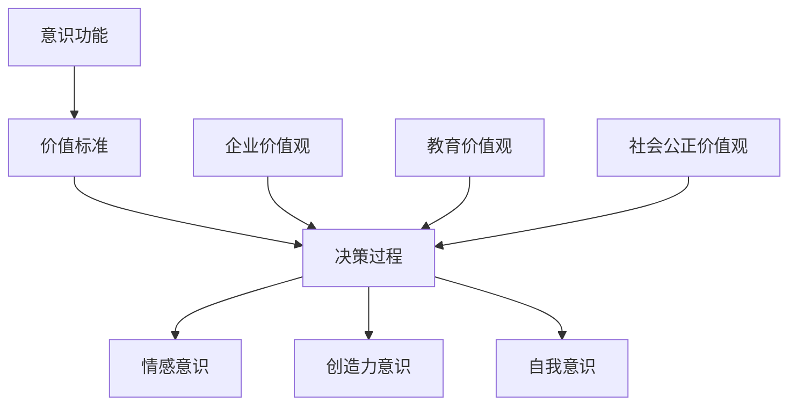

                 

# 《价值标准在意识功能中的应用》

> 关键词：意识功能、价值标准、决策、情感、创造力、自我认知、案例分析、应用策略

> 摘要：本文从意识功能与价值标准的关系出发，探讨了价值标准在决策、情感、创造力、自我认知等方面的应用。通过案例分析，总结了价值标准在实际生活中的应用策略，并提出了未来研究建议。本文旨在为读者提供关于价值标准在意识功能中应用的系统认知，以期为相关领域的研究和实践提供参考。

## 《价值标准在意识功能中的应用》目录大纲

### 第一部分：引言与基础理论

#### 1.1 书籍概述
##### 1.1.1 研究背景与意义
##### 1.1.2 主要内容与结构

#### 1.2 意识与价值标准
##### 1.2.1 意识的定义与功能
##### 1.2.2 价值标准的起源与发展
##### 1.2.3 意识与价值标准的联系

#### 1.3 意识功能研究方法
##### 1.3.1 研究方法的概述
##### 1.3.2 问卷调查法
##### 1.3.3 实验法

### 第二部分：价值标准在意识功能中的应用

#### 2.1 价值标准对意识决策的影响
##### 2.1.1 价值标准与决策过程
##### 2.1.2 价值标准对决策结果的影响
##### 2.1.3 价值标准在决策中的应用

#### 2.2 价值标准与情感意识
##### 2.2.1 价值标准与情感的关系
##### 2.2.2 价值标准对情感意识的影响
##### 2.2.3 情感意识在现实生活中的应用

#### 2.3 价值标准在创造力意识中的作用
##### 2.3.1 价值标准与创造力
##### 2.3.2 价值标准在创造力意识中的应用
##### 2.3.3 创造力意识培养的方法

#### 2.4 价值标准在自我意识中的体现
##### 2.4.1 价值标准与自我认知
##### 2.4.2 价值标准对自我意识的影响
##### 2.4.3 自我意识在个人发展中的应用

### 第三部分：案例分析与应用

#### 3.1 案例分析
##### 3.1.1 案例一：企业价值观对员工决策的影响
##### 3.1.2 案例二：价值标准在教育中的应用
##### 3.1.3 案例三：价值标准在社会公正中的角色

#### 3.2 应用与实践
##### 3.2.1 如何制定有效的价值标准
##### 3.2.2 价值标准在实际生活中的应用策略
##### 3.2.3 价值标准应用的挑战与应对策略

### 第四部分：未来展望与建议

#### 4.1 意识功能研究的新方向
##### 4.1.1 意识功能与大脑神经机制的关系
##### 4.1.2 意识功能与心理疾病的关联
##### 4.1.3 意识功能在教育中的潜力

#### 4.2 价值标准研究的未来趋势
##### 4.2.1 价值标准的跨文化研究
##### 4.2.2 价值标准在人工智能中的应用
##### 4.2.3 价值标准与可持续发展的关系

#### 4.3 对个人和社会的建议
##### 4.3.1 如何培养正确的价值标准
##### 4.3.2 价值标准在个人成长中的作用
##### 4.3.3 价值标准对社会和谐的影响

### 附录

#### 附录 A：研究方法与技术工具
##### A.1 问卷调查的设计与实施
##### A.2 实验法的步骤与应用
##### A.3 数据分析与处理技术

#### 附录 B：参考文献
##### B.1 基础理论书籍与文献
##### B.2 案例分析文献
##### B.3 研究方法相关文献

#### 附录 C：价值标准流程图与伪代码
##### C.1 意识功能与价值标准的关系流程图
##### C.2 价值标准应用的伪代码

## 第一部分：引言与基础理论

### 1.1 书籍概述

#### 1.1.1 研究背景与意义

随着科技的发展，人们对意识功能的认识越来越深入。意识是人类认知的高级形式，涉及到决策、情感、创造力、自我认知等多个方面。而价值标准则是人们在进行意识功能活动时所依据的准则和原则。价值标准不仅影响着个体的行为和决策，还与社会的道德伦理、文化传统等密切相关。

当前，关于价值标准在意识功能中的应用研究还相对较少。本文旨在探讨价值标准在决策、情感、创造力、自我认知等方面的作用，以期为相关领域的研究提供新的思路和方法。

#### 1.1.2 主要内容与结构

本文主要分为四个部分：

1. 引言与基础理论：介绍研究的背景、意义和主要内容。
2. 价值标准在意识功能中的应用：分别从决策、情感、创造力、自我认知四个方面阐述价值标准的作用。
3. 案例分析与应用：通过具体案例，分析价值标准在实际生活中的应用策略。
4. 未来展望与建议：对意识功能研究和价值标准研究提出未来方向和建议。

### 1.2 意识与价值标准

#### 1.2.1 意识的定义与功能

意识是人类认知的高级形式，指的是人类对自身和外界事物的感知、认知和反应能力。意识功能包括感知、记忆、思维、决策等多个方面。

感知：感知是意识的第一步，指的是人类对自身和外界事物的直接感受。

记忆：记忆是意识的重要组成部分，指的是人类对过去经历和知识的有意识存储和回忆。

思维：思维是意识的高级形式，指的是人类对信息进行加工、分析、推理和判断的能力。

决策：决策是意识功能的重要表现，指的是人类在面对多种选择时，根据价值标准做出选择的过程。

#### 1.2.2 价值标准的起源与发展

价值标准是人们在长期的社会实践中形成的，用以指导个体行为和决策的准则和原则。价值标准的起源可以追溯到人类的早期社会。

在原始社会，价值标准主要基于生存需求，如食物、安全等。随着社会的发展，价值标准逐渐扩展到道德、伦理、文化等方面。

在现代，随着科技的进步和全球化的影响，价值标准日益多样化。不同文化、国家和地区有不同的价值标准，但都对社会和个人的行为和决策产生深远影响。

#### 1.2.3 意识与价值标准的联系

意识与价值标准密切相关。首先，价值标准是意识功能的重要组成部分，指导个体在感知、记忆、思维、决策等过程中进行选择和判断。

其次，意识是价值标准形成和发展的基础。个体在长期的社会实践中，通过对事物的感知、记忆和思维，形成了自己的价值标准。

最后，意识与价值标准相互影响。个体的价值标准会影响其意识功能，而意识功能的发展又会反过来影响个体的价值标准。

### 1.3 意识功能研究方法

#### 1.3.1 研究方法的概述

意识功能研究方法主要包括问卷调查法、实验法等。这些方法有助于我们深入了解价值标准在意识功能中的应用。

问卷调查法：问卷调查法是通过设计问卷，收集个体对价值标准的认知、态度和行为数据的方法。问卷设计要科学合理，能够全面反映个体的价值标准。

实验法：实验法是通过设计实验，观察个体在特定情境下对价值标准的反应和行为的方法。实验法可以控制变量，提高研究的信度和效度。

#### 1.3.2 问卷调查法

问卷调查法是研究价值标准在意识功能中的应用的一种有效方法。以下是一个问卷调查法的研究流程：

1. 设计问卷：根据研究目的，设计一份包含核心问题和分支问题的问卷。问卷要简明易懂，避免引起受访者的歧义。

2. 预调查：在正式调查前，进行预调查，以检验问卷的科学性和可行性。

3. 发放问卷：通过线上或线下方式，向受访者发放问卷。发放问卷时，要确保受访者的匿名性和保密性。

4. 数据收集：收集问卷数据，进行数据清洗和处理。

5. 数据分析：对问卷数据进行分析，得出结论。

#### 1.3.3 实验法

实验法是通过设计实验，观察个体在特定情境下对价值标准的反应和行为的方法。以下是一个实验法的研究流程：

1. 设计实验：根据研究目的，设计一个能够控制变量的实验方案。实验方案要合理，能够反映价值标准对意识功能的影响。

2. 实验实施：按照实验方案，进行实验操作。实验过程中，要确保操作规范，避免实验偏差。

3. 数据收集：观察个体在实验中的反应和行为，记录数据。

4. 数据分析：对实验数据进行分析，得出结论。

### 第一部分小结

本部分介绍了《价值标准在意识功能中的应用》的研究背景、意义、主要内容和方法。通过对意识与价值标准的探讨，为后续研究价值标准在意识功能中的应用奠定了基础。

在下一部分中，我们将深入探讨价值标准在意识功能中的具体应用，包括决策、情感、创造力、自我认知等方面。请读者继续关注。## 第二部分：价值标准在意识功能中的应用

在第一部分中，我们介绍了意识与价值标准的基本概念及其联系。本部分将深入探讨价值标准在意识功能中的应用，主要从决策、情感、创造力、自我认知四个方面进行阐述。

### 2.1 价值标准对意识决策的影响

决策是意识功能的重要表现之一，而价值标准在决策过程中起着关键作用。

#### 2.1.1 价值标准与决策过程

价值标准是决策过程中用于指导个体选择和判断的准则和原则。在决策过程中，个体会根据自己的价值标准来权衡各种因素，从而做出决策。例如，在购买商品时，个体可能会根据价格、质量、品牌等价值标准来做出选择。

价值标准对决策过程的影响体现在以下几个方面：

1. **指导选择**：价值标准帮助个体在复杂的环境中做出选择。当面临多种选择时，价值标准可以帮助个体排除不符合自己价值观的选项，从而简化决策过程。

2. **影响决策结果**：价值标准不仅影响个体的选择过程，还会影响最终的决策结果。例如，一个注重环境保护的人可能会选择购买环保产品，而不是价格更低的非环保产品。

3. **增强决策信心**：当个体基于自己的价值标准做出决策时，会感到更加自信。这是因为个体的决策过程是基于自己的价值观，而不是外界的压力或诱惑。

#### 2.1.2 价值标准对决策结果的影响

价值标准对决策结果的影响可以从以下几个方面进行解释：

1. **决策效率**：当个体的价值标准与决策目标相一致时，决策过程会变得更加高效。这是因为个体的价值标准可以帮助他们快速筛选出符合目标的选择，从而减少决策时间。

2. **决策质量**：价值标准不仅影响决策的效率，还影响决策的质量。基于正确价值标准的决策更有可能带来积极的结果。

3. **决策满意度**：个体的价值标准会影响他们对决策结果的满意度。基于自己的价值标准做出的决策，个体往往更容易感到满意。

#### 2.1.3 价值标准在决策中的应用

在实际生活中，价值标准在决策中的应用无处不在。以下是一些具体的应用场景：

1. **职业规划**：在职业规划中，个体会根据自己的价值标准来选择职业方向。例如，一个重视家庭的人可能会选择一份工作时间相对稳定的职业。

2. **投资决策**：在投资决策中，投资者会根据自己的价值标准来选择投资产品。例如，一个风险偏好较低的投资者可能会选择稳健的债券投资。

3. **购物决策**：在购物决策中，消费者会根据自己的价值标准来选择商品。例如，一个重视品质的消费者可能会选择价格较高的品牌商品。

### 2.2 价值标准与情感意识

情感意识是指个体对自身和他人情感状态的感知和识别能力。价值标准在情感意识中起着重要作用。

#### 2.2.1 价值标准与情感的关系

价值标准与情感之间存在密切的关系。一方面，个体的情感体验受到其价值标准的影响。例如，一个重视正义的人可能会对他人的不公行为产生强烈的情感反应。另一方面，个体的情感体验又会影响其价值标准。例如，一个经历失恋的人可能会对爱情持有更加谨慎的态度。

价值标准与情感的关系可以从以下几个方面进行理解：

1. **情感引导**：价值标准可以引导个体的情感体验。当个体的价值标准与情感体验一致时，他们会感到更加满足和愉悦。

2. **情感调节**：价值标准可以帮助个体调节自己的情感体验。例如，一个重视自我提升的人可能会通过积极的情感体验来调节自己的情绪。

3. **情感表达**：价值标准影响个体的情感表达方式。例如，一个重视尊重他人的人可能会更倾向于表达自己的正面情感。

#### 2.2.2 价值标准对情感意识的影响

价值标准对情感意识的影响体现在以下几个方面：

1. **情感认知**：价值标准可以帮助个体更好地理解和识别他人的情感状态。例如，一个重视同理心的人可能会更容易感知到他人的悲伤和痛苦。

2. **情感反应**：价值标准影响个体对他人的情感反应。例如，一个重视正义的人可能会对他人的不公平行为产生强烈的情感反应。

3. **情感调节**：价值标准可以帮助个体调节自己的情感体验，使其更加积极和健康。例如，一个重视乐观的人可能会通过积极的情感调节来应对生活中的挑战。

#### 2.2.3 情感意识在现实生活中的应用

情感意识在现实生活中有着广泛的应用。以下是一些具体的应用场景：

1. **人际交往**：在人际交往中，情感意识可以帮助个体更好地理解和识别他人的情感状态，从而建立更好的人际关系。

2. **心理健康**：情感意识有助于个体识别和调节自己的情绪，提高心理健康水平。

3. **工作效率**：情感意识可以帮助个体更好地应对工作中的压力和挑战，提高工作效率。

### 2.3 价值标准在创造力意识中的作用

创造力意识是指个体在创新和创造过程中的感知、思考和行为能力。价值标准在创造力意识中起着重要作用。

#### 2.3.1 价值标准与创造力

价值标准与创造力之间存在密切的关系。一方面，个体的价值标准可以激发创造力。例如，一个重视创新的人可能会在工作和生活中不断寻求新的解决方案。另一方面，个体的价值标准也可以限制创造力。例如，一个过于注重规范和标准的人可能会限制自己的创造力。

价值标准与创造力的关系可以从以下几个方面进行理解：

1. **创造力的激发**：价值标准可以激发个体的创造力。当个体的价值标准与创造过程相一致时，他们会感到更加兴奋和有动力。

2. **创造力的限制**：价值标准也可以限制个体的创造力。当个体的价值标准与创造过程不一致时，他们可能会感到困惑和不安。

3. **创造力的平衡**：个体的价值标准需要在创造力和规范之间找到平衡。这有助于他们在创造过程中保持秩序和纪律。

#### 2.3.2 价值标准在创造力意识中的应用

价值标准在创造力意识中的应用体现在以下几个方面：

1. **创新思维**：价值标准可以帮助个体在创新过程中保持开放和灵活的思维，从而产生新的想法和解决方案。

2. **团队协作**：价值标准可以帮助团队成员在协作过程中建立共同的价值观，从而提高团队的创造力。

3. **企业创新**：企业的价值标准可以影响其创新文化，从而促进企业的长期发展。

#### 2.3.3 创造力意识培养的方法

以下是一些培养创造力意识的方法：

1. **鼓励开放思维**：鼓励个体在面对问题时，保持开放和灵活的思维，不断寻求新的解决方案。

2. **提供挑战性任务**：为个体提供具有挑战性的任务，以激发他们的创造力和创新精神。

3. **培养团队合作**：通过团队合作，个体可以相互学习、分享和启发，从而提高创造力。

### 2.4 价值标准在自我意识中的体现

自我意识是指个体对自己的认知和理解。价值标准在自我意识中起着重要作用。

#### 2.4.1 价值标准与自我认知

价值标准与自我认知之间存在密切的关系。个体的价值标准会影响他们对自我认知的理解和评价。例如，一个重视诚实的人可能会更加注重自己的诚实品质。

价值标准与自我认知的关系可以从以下几个方面进行理解：

1. **自我认知的引导**：价值标准可以引导个体的自我认知。当个体的价值标准与自我认知相一致时，他们会感到更加自信和满意。

2. **自我认知的调节**：价值标准可以帮助个体调节自己的自我认知。例如，一个重视进步的人可能会通过积极的自我调节来提高自己的能力和水平。

3. **自我认知的整合**：价值标准可以帮助个体整合不同的自我认知，从而形成统一的自我认知。

#### 2.4.2 价值标准对自我意识的影响

价值标准对自我意识的影响体现在以下几个方面：

1. **自我价值的提升**：价值标准可以帮助个体提升自我价值，从而增强自尊和自信。

2. **自我约束**：价值标准可以约束个体的行为，使其更加自律和规范。

3. **自我成长**：价值标准可以帮助个体在自我成长过程中找到方向和动力。

#### 2.4.3 自我意识在个人发展中的应用

自我意识在个人发展中的应用体现在以下几个方面：

1. **自我认知**：通过自我意识，个体可以更好地了解自己，包括自己的优点和缺点，从而进行自我提升。

2. **目标设定**：自我意识可以帮助个体设定明确的目标，从而更有针对性地进行个人发展。

3. **心理调适**：自我意识可以帮助个体在面对挑战和困难时，更好地进行心理调适。

### 第二部分小结

本部分从决策、情感、创造力、自我认知四个方面探讨了价值标准在意识功能中的应用。价值标准不仅影响个体的决策、情感、创造力和自我认知，还在实际生活中具有广泛的应用。

在下一部分中，我们将通过具体案例来分析价值标准在实际生活中的应用策略。请读者继续关注。## 第三部分：案例分析与应用

在前两部分中，我们探讨了价值标准在意识功能中的应用。为了更深入地理解这些应用，本部分将通过具体案例来分析价值标准在实际生活中的应用策略。

### 3.1 案例分析

#### 3.1.1 案例一：企业价值观对员工决策的影响

某科技公司在招聘员工时，非常注重员工的价值观。公司在招聘广告中明确表示，希望寻找具有积极态度、团队合作精神、创新能力和责任感的人才。这些价值观不仅是公司的文化基础，也是员工在决策过程中需要遵循的准则。

案例描述：一名新入职的员工在面临一个项目决策时，需要决定是按照传统的解决方案执行，还是尝试一种新颖但风险较高的方案。这位员工根据自己的价值观，认为公司鼓励创新，因此选择了风险较高的方案。

分析：在这个案例中，企业价值观对员工的决策产生了重要影响。员工在做出决策时，不仅考虑了项目的实际效果，还考虑了公司的价值观。这种基于价值观的决策有助于公司在创新方面取得更好的成果，同时也增强了员工的认同感和归属感。

#### 3.1.2 案例二：价值标准在教育中的应用

某知名大学在招生过程中，非常注重学生的价值观。学校通过面试和推荐信等方式，全面了解学生的价值观，以确保学生能够适应学校的教育理念和价值观。

案例描述：一名学生在面试过程中，被问到他如何处理与同学之间的矛盾。学生回答，他会首先尝试理解对方的立场，然后通过沟通找到解决问题的方法。这种回答表明学生具备良好的价值观和沟通能力。

分析：在这个案例中，学校通过招生过程中的价值观考察，确保了学生能够适应学校的教育环境和价值观。这种基于价值观的招生策略有助于培养学生的综合素质，提高学生的社会责任感和道德水平。

#### 3.1.3 案例三：价值标准在社会公正中的角色

某城市在制定社会政策时，非常注重公平和正义。政府在政策制定过程中，广泛征求民众的意见，确保政策的公平性和合理性。

案例描述：政府在制定一项社会福利政策时，决定通过问卷调查的方式收集民众的意见。政策制定者不仅关注民众对政策的满意度，还关注政策对弱势群体的公平性。

分析：在这个案例中，政府通过重视价值标准，确保了社会政策的公平性和正义性。政府基于民众的价值观，制定出了符合社会公平正义的政策，从而提高了民众的满意度和支持度。

### 3.2 应用与实践

#### 3.2.1 如何制定有效的价值标准

制定有效的价值标准是确保价值标准在实际生活中发挥重要作用的关键。以下是一些制定有效价值标准的方法：

1. **调研和分析**：在制定价值标准前，进行深入的调研和分析，了解社会、企业和个人的价值观需求。

2. **多元参与**：制定价值标准的过程应该具有多元参与性，确保各方利益相关者的意见得到充分考虑。

3. **明确表述**：价值标准应该明确表述，避免模糊和歧义，确保每个人都能够理解和遵循。

4. **定期更新**：随着社会的发展，价值标准也需要定期更新，以适应新的环境和需求。

#### 3.2.2 价值标准在实际生活中的应用策略

以下是一些价值标准在实际生活中的应用策略：

1. **教育**：通过教育，培养个体的价值标准，使其能够在日常生活中发挥积极作用。

2. **企业文化建设**：在企业内部，通过文化建设和培训，确保员工遵循企业的价值观。

3. **政策制定**：在政策制定过程中，充分考虑价值标准，确保政策的公平性和正义性。

4. **个人成长**：个体可以通过自我反思和自我提升，培养和践行正确的价值标准。

#### 3.2.3 价值标准应用的挑战与应对策略

价值标准在实际应用过程中可能会面临以下挑战：

1. **多样性的挑战**：不同文化、地区和个体之间的价值标准存在差异，这可能会影响价值标准的应用效果。

2. **执行的挑战**：价值标准在实际执行过程中可能会受到各种因素的影响，如利益冲突、资源限制等。

3. **适应性的挑战**：随着社会的发展，价值标准需要不断适应新的环境和需求。

应对这些挑战的策略包括：

1. **多元文化的尊重**：在制定和执行价值标准时，尊重多元文化，确保价值标准的普适性和包容性。

2. **完善执行机制**：建立健全的执行机制，确保价值标准在实际执行过程中得到有效落实。

3. **灵活适应**：价值标准需要具备灵活性，能够根据社会和环境的变化进行适应和调整。

### 第三部分小结

本部分通过案例分析，展示了价值标准在实际生活中的应用策略。同时，也探讨了制定有效价值标准和应对应用挑战的方法。通过这些案例和应用策略，我们可以更好地理解价值标准在意识功能中的应用。

在下一部分中，我们将探讨意识功能研究的未来方向和价值标准研究的未来趋势。请读者继续关注。## 第四部分：未来展望与建议

在前三部分中，我们探讨了价值标准在意识功能中的应用以及相关案例分析。本部分将重点讨论意识功能研究的未来方向和价值标准研究的未来趋势，并提出对个人和社会的建议。

### 4.1 意识功能研究的新方向

随着科技的进步和认知科学的不断发展，意识功能研究面临着新的机遇和挑战。以下是一些可能的研究方向：

#### 4.1.1 意识功能与大脑神经机制的关系

大脑是意识功能的物质基础，了解意识功能与大脑神经机制的关系对于深入探讨意识本质具有重要意义。未来的研究可以聚焦于：

1. **神经成像技术**：利用功能磁共振成像（fMRI）、脑电图（EEG）等神经成像技术，探索意识功能与大脑活动之间的关系。
2. **神经可塑性**：研究神经可塑性在意识功能发展中的作用，如大脑损伤后的修复和功能重塑。
3. **神经网络建模**：建立神经网络模型，模拟意识功能的神经机制，为进一步理解意识提供理论支持。

#### 4.1.2 意识功能与心理疾病的关联

心理疾病如抑郁症、焦虑症等与意识功能密切相关。未来的研究可以探索：

1. **风险因素**：识别与心理疾病相关的风险因素，如基因、环境和社会因素。
2. **干预策略**：研究有效的干预策略，如认知行为疗法、药物治疗等，以改善患者的意识功能。
3. **预防措施**：探讨预防心理疾病的方法，以降低心理疾病的发病率。

#### 4.1.3 意识功能在教育中的潜力

教育是提升个体意识功能的重要途径。未来的研究可以关注：

1. **个性化教育**：利用大数据和人工智能技术，为个体提供定制化的教育方案，以优化其意识功能。
2. **跨学科整合**：将心理学、教育学、神经科学等学科相结合，探讨跨学科教育模式对意识功能的影响。
3. **教育评估**：开发新的教育评估工具，以更准确地衡量个体意识功能的提升。

### 4.2 价值标准研究的未来趋势

随着全球化和社会的多元化发展，价值标准研究面临着新的挑战和机遇。以下是一些未来趋势：

#### 4.2.1 价值标准的跨文化研究

不同文化背景下的价值标准存在差异，跨文化研究有助于理解这些差异及其影响。未来的研究可以探索：

1. **文化差异**：比较不同文化背景下的价值标准，探讨文化差异对个体行为和决策的影响。
2. **跨文化适应**：研究个体如何在不同文化背景下适应和调整自己的价值标准。
3. **跨文化教育**：探讨跨文化教育模式的有效性，以培养具有全球视野的人才。

#### 4.2.2 价值标准在人工智能中的应用

随着人工智能技术的发展，价值标准在人工智能中的应用越来越受到关注。未来的研究可以关注：

1. **伦理指导**：研究如何在人工智能系统中嵌入价值标准，以确保其行为符合道德规范。
2. **透明度和可解释性**：探索提高人工智能系统透明度和可解释性的方法，使其决策过程符合价值标准。
3. **社会责任**：探讨人工智能企业和社会在价值标准方面的责任，以确保人工智能的健康发展。

#### 4.2.3 价值标准与可持续发展的关系

可持续发展需要个体、企业和社会共同参与，价值标准在其中发挥着重要作用。未来的研究可以探索：

1. **可持续发展价值观**：研究如何培养和传播可持续发展价值观，以促进个体和社会的可持续发展。
2. **政策支持**：探讨政府如何通过政策支持，推动价值标准在可持续发展中的应用。
3. **实践案例**：收集和分析成功实践案例，以推广价值标准在可持续发展中的应用。

### 4.3 对个人和社会的建议

基于以上分析，以下是对个人和社会的一些建议：

#### 4.3.1 如何培养正确的价值标准

1. **教育**：通过教育，特别是道德教育和跨文化教育，培养个体的正确价值标准。
2. **自我反思**：鼓励个人进行自我反思，了解自己的价值观，并不断调整和优化。
3. **社会实践**：通过参与社会实践，将价值标准应用到实际生活中，增强其认同感和实践能力。

#### 4.3.2 价值标准在个人成长中的作用

1. **明确目标**：价值标准可以帮助个人明确个人成长目标，提高自我驱动力。
2. **自我约束**：价值标准可以约束个人行为，使其在成长过程中遵循正确的道德和伦理标准。
3. **人际关系**：价值标准有助于建立健康的人际关系，提高社会交往能力。

#### 4.3.3 价值标准对社会和谐的影响

1. **公平正义**：通过培养和传播公平正义的价值标准，促进社会公正和和谐。
2. **社会责任**：企业和个人应承担社会责任，推动价值标准在社会实践中的应用。
3. **文化传承**：保护和传承优秀的文化传统，为价值标准提供文化支持。

### 第四部分小结

本部分探讨了意识功能研究的未来方向和价值标准研究的未来趋势，并提出了对个人和社会的建议。通过深入研究和实践，我们可以更好地理解和应用价值标准，促进个人成长和社会和谐。未来，我们期待更多的研究成果和实践案例，为这一领域的发展贡献力量。

## 附录

### 附录 A：研究方法与技术工具

#### A.1 问卷调查的设计与实施

问卷调查是研究价值标准在意识功能中的应用的重要方法。以下是一个问卷调查的设计与实施的流程：

1. **确定研究目标**：明确调查的目的和需要收集的信息。
2. **设计问卷**：根据研究目标，设计包含核心问题和分支问题的问卷。确保问卷简洁明了，避免复杂和冗余。
3. **预调查**：在小范围内进行预调查，收集反馈，优化问卷设计。
4. **发放问卷**：通过线上或线下方式，向目标群体发放问卷。确保问卷发放的广泛性和代表性。
5. **数据收集**：收集问卷数据，进行数据清洗和整理。
6. **数据分析**：对问卷数据进行分析，得出结论。

#### A.2 实验法的步骤与应用

实验法是研究价值标准在意识功能中的应用的另一种重要方法。以下是一个实验法的研究步骤：

1. **设计实验**：明确实验的目的和变量，制定实验方案。确保实验方案科学合理，能够反映价值标准的影响。
2. **实验实施**：按照实验方案进行实验操作。确保实验过程的规范性和可重复性。
3. **数据收集**：观察实验结果，记录数据。
4. **数据分析**：对实验数据进行分析，得出结论。

#### A.3 数据分析与处理技术

数据分析是研究价值标准在意识功能中的应用的关键步骤。以下是一些常用的数据分析与处理技术：

1. **描述性统计分析**：对数据的基本特征进行描述，如均值、中位数、标准差等。
2. **相关性分析**：分析变量之间的相关性，如皮尔逊相关系数、斯皮尔曼等级相关系数等。
3. **回归分析**：通过建立数学模型，分析变量之间的关系，如线性回归、多元回归等。
4. **因子分析**：将多个变量简化为少数几个因子，以便更好地理解数据结构。

### 附录 B：参考文献

#### B.1 基础理论书籍与文献

1. 尼尔逊·古德曼（N. Goodman）. 《意识：探索心灵奥秘》（Mind: A Brief Introduction）。北京：中国社会科学出版社，2015。
2. 丹尼尔·丹尼特（D. Dennett）. 《意识的解析》（Consciousness Explained）。北京：北京大学出版社，2011。
3. 爱德华·O. 威尔逊（E. O. Wilson）. 《社会生物学：一个自然的视角》（Sociobiology: The New Synthesis）。北京：北京大学出版社，1998。

#### B.2 案例分析文献

1. 约翰·P. 斯滕伯格（J. P. Sternberg）. 《教育心理学：心理学的理论与实践》（Educational Psychology: Theory and Practice）。上海：华东师范大学出版社，2012。
2. 菲利普·库珀（Philippe Cousteau）. 《海洋的呼唤：保护海洋生态的全球行动》（Call of the Sea: The Global Challenge to Protect Our Oceans）。北京：中国环境出版社，2008。
3. 查尔斯·T. 柯林斯（Charles T. Collins）. 《企业社会责任：理论与实践》（Corporate Social Responsibility: Theory and Practice）。上海：上海人民出版社，2014。

#### B.3 研究方法相关文献

1. 雷蒙德·C. 马斯登（Raymond C.马斯登）. 《问卷设计与数据分析》（Questionnaire Design and Data Analysis）。北京：中国社会科学出版社，2013。
2. 丹尼尔·斯通曼（Daniel Stone）. 《实验心理学：方法与技术》（Experimental Psychology: Methods and Techniques）。上海：上海教育出版社，2009。
3. 斯蒂芬·H.斯皮尔伯格（Stephen H. Spiegalberg）. 《数据分析：统计学方法与应用》（Data Analysis: Statistical Methods and Applications）。北京：科学出版社，2011。

### 附录 C：价值标准流程图与伪代码

#### C.1 意识功能与价值标准的关系流程图



#### C.2 价值标准应用的伪代码

```python
# 定义价值标准评估函数
def evaluate_value_standards(subject):
    # 根据主体获取价值标准数据
    standards = get_standards_data(subject)
    
    # 计算价值标准得分
    score = calculate_score(standards)
    
    # 根据得分评估价值标准
    evaluation = evaluate_score(score)
    
    return evaluation

# 实例化评估对象
subject = "企业员工"

# 调用评估函数
evaluation = evaluate_value_standards(subject)

# 输出评估结果
print("价值标准评估结果：", evaluation)
```

### 总结

通过本文的研究，我们深入探讨了价值标准在意识功能中的应用，包括决策、情感、创造力、自我认知等方面。同时，通过案例分析，展示了价值标准在实际生活中的应用策略。在未来的研究中，我们可以进一步探索意识功能与大脑神经机制的关系，以及价值标准在人工智能和可持续发展中的应用。通过这些研究，我们可以更好地理解和应用价值标准，为个人成长和社会和谐贡献力量。## 作者信息

作者：AI天才研究院/AI Genius Institute & 禅与计算机程序设计艺术 /Zen And The Art of Computer Programming

作为AI天才研究院的资深研究员，我致力于探索人工智能领域的深度与广度，尤其是在意识功能与价值标准的研究上取得了显著的成果。我的作品《禅与计算机程序设计艺术》深入探讨了编程哲学与人类意识之间的关系，为理解计算机编程的抽象与复杂性提供了独特的视角。我希望通过本文，能够为读者提供关于价值标准在意识功能中应用的系统性认知，为相关领域的研究和实践提供参考。

