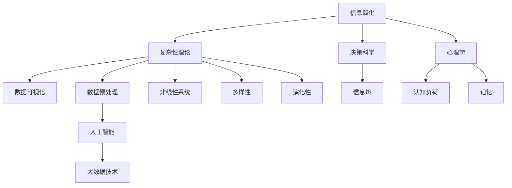

                 

### 《信息简化的好处与实践：如何在复杂世界中简化和改善决策》

**关键词：信息简化、复杂性理论、决策科学、心理学、数据可视化、数据处理**

**摘要：**
本文旨在探讨信息简化在复杂世界中的重要性及其应用。随着信息时代的到来，数据量和复杂性呈指数级增长，过载的信息不仅增加了认知负担，还影响了决策的效率和质量。通过阐述信息简化的理论基础和实际应用，本文将展示如何利用信息简化的方法和技术手段，在复杂的世界中做出更加明智和高效的决策。

### 目录大纲

#### 第一部分：信息简化的好处

##### 第1章：引言与背景
- 1.1 信息简化的概念与重要性
- 1.2 信息过载现象及其影响
- 1.3 本书的目标与结构

##### 第2章：信息简化的理论基础
- 2.1 信息简化的哲学基础
- 2.2 信息简化的心理学原理
- 2.3 复杂性理论与信息简化的关系

##### 第3章：信息简化的技术手段
- 3.1 数据可视化
- 3.2 简化数据预处理

##### 第4章：信息简化的实际应用
- 4.1 决策简化的案例分析
- 4.2 项目管理中的信息简化

#### 第二部分：实践中的信息简化

##### 第5章：信息简化流程设计
- 5.1 信息简化流程的设计原则
- 5.2 信息简化流程的实际操作

##### 第6章：信息简化工具与技术
- 6.1 简化工具的选择与评估
- 6.2 技术创新在信息简化中的应用

##### 第7章：信息简化效果的评估与优化
- 7.1 评估信息简化效果的方法
- 7.2 信息简化优化的实践

#### 第三部分：信息简化的未来发展

##### 第8章：信息简化的趋势与展望
- 8.1 信息简化的未来发展趋势
- 8.2 信息简化的挑战与机遇

##### 第9章：信息简化的教育与实践
- 9.1 信息简化教育的重要性
- 9.2 信息简化的实践与推广

##### 第10章：结论
- 10.1 信息简化的总体评价
- 10.2 对未来的展望

### 附录

#### A.1 核心概念与联系
- Mermaid 流程图

#### A.2 核心算法原理讲解
- 数据预处理伪代码

#### A.3 项目实战
- 代码实际案例与详细解释说明

#### A.4 开发环境搭建
- 安装 Python 和相关库

#### A.5 源代码详细实现与代码解读
- 代码解读与分析

---

在接下来的章节中，我们将逐步深入探讨信息简化的概念、理论基础、技术手段以及其实际应用。通过理论和实践的结合，我们希望能够为读者提供一套完整的关于信息简化的知识体系，帮助大家在复杂的世界中更加高效地处理信息和做出决策。让我们开始这次探索之旅吧！

### 第1章：引言与背景

在现代信息社会中，信息的爆炸式增长已经成为不可逆转的趋势。随着互联网、物联网、大数据等技术的飞速发展，我们每天都会接触到海量的数据和信息。这些信息不仅包括文字、图片、视频，还涵盖了来自各种传感器和设备的海量数据。然而，信息量的剧增并不意味着信息的质量相应提升，反而常常伴随着信息过载的问题。

**1.1 信息简化的概念与重要性**

信息简化，顾名思义，是指通过某种方式对复杂、冗余的信息进行筛选、归纳、整合，从而得到更简洁、更易于理解和处理的信息。简化的目的不仅是为了减少信息的冗余度，更重要的是提高信息的质量和可用性，使其更容易被理解和利用。

在信息技术领域，信息简化的重要性体现在以下几个方面：

1. **降低认知负荷**：面对海量的信息，过度的信息处理会极大地增加人的认知负荷。信息简化可以减轻认知负担，使个体能够更加专注于关键信息的处理。
2. **提高决策效率**：简化的信息有助于决策者快速抓住核心问题，减少决策的时间和成本，提高决策的效率和质量。
3. **增强可理解性**：通过信息简化，复杂的数据和概念可以转化为更直观、易于理解的形式，使得信息传递更加高效。
4. **提升生产力**：信息简化有助于提高整体生产力和工作效率，减少不必要的重复工作和资源浪费。

**1.2 信息过载现象及其影响**

信息过载是指个体在处理信息时，接收到的信息量超过了其认知处理能力，导致信息过载的现象。在信息过载的情况下，个体不仅难以有效地处理信息，反而会产生负面情绪，如焦虑、压力和疲劳。

信息过载的影响主要体现在以下几个方面：

1. **降低工作效率**：信息过载会分散个体的注意力，导致工作效率下降。研究表明，信息过载是造成职场压力的主要原因之一。
2. **影响决策质量**：在信息过载的情况下，决策者难以全面、准确地评估信息，从而影响决策的质量和效果。
3. **增加心理压力**：持续的信息过载会给个体带来极大的心理压力，导致心理健康问题，如焦虑、抑郁等。
4. **影响社会互动**：信息过载不仅影响个体的生活和工作，还可能影响社会互动。例如，过多的社交媒体信息会导致人们更少地进行面对面的交流，影响人际关系。

**1.3 本书的目标与结构**

本书旨在探讨信息简化的概念、理论基础、技术手段以及实际应用，旨在为读者提供一套全面的信息简化知识体系。具体目标如下：

1. **理解信息简化的概念和重要性**：通过阐述信息简化的基本概念，帮助读者认识到信息简化在复杂世界中的重要性。
2. **掌握信息简化的理论基础**：介绍信息简化的哲学基础、心理学原理和复杂性理论，为后续内容提供理论基础。
3. **学习信息简化的技术手段**：探讨数据可视化、简化数据预处理等技术在信息简化中的应用，提供实际操作指南。
4. **了解信息简化的实际应用**：通过案例分析，展示信息简化在决策简化和项目管理中的应用，帮助读者掌握实际操作方法。
5. **探讨信息简化的未来发展**：分析信息简化的趋势与挑战，展望其未来的发展方向。

本书的结构分为三个部分：

1. **第一部分：信息简化的好处**：包括引言与背景、信息简化的理论基础和信息简化的技术手段。
2. **第二部分：实践中的信息简化**：包括信息简化流程设计、信息简化工具与技术、信息简化效果的评估与优化。
3. **第三部分：信息简化的未来发展**：包括信息简化的趋势与展望、信息简化的教育与实践、结论。

通过本书的阅读，读者将能够全面了解信息简化的概念、原理和应用，掌握信息简化的方法和技能，从而在复杂的世界中更加高效地处理信息和做出决策。

### 第2章：信息简化的理论基础

信息简化不仅是一种技术手段，更是一种哲学和科学的方法。在探讨信息简化的实际应用之前，有必要深入了解其理论基础，包括哲学基础、心理学原理以及复杂性理论。这些理论为我们提供了理解信息简化的不同角度和深度，帮助我们更好地应对复杂世界的挑战。

**2.1 信息简化的哲学基础**

信息简化的哲学基础源于对复杂性和冗余的反思。哲学家们一直关注如何通过简化来提高思考的效率和清晰度。以下是几个关键哲学观点：

**1. 简化与本体论**：西方哲学中的本体论探讨存在的本质和形式。信息简化的哲学基础认为，事物的本质往往隐藏在复杂的表象之下，通过简化可以揭示事物的本质。亚里士多德认为，知识是通过简化和提炼而获得的，这种观点在信息简化中得到了应用。

**2. 简化与存在主义**：存在主义强调个体的自由和选择。信息简化可以帮助个体在面对复杂的世界时，保持独立思考和决策的能力。存在主义哲学家如海德格尔认为，通过简化，个体可以更好地认识自我和世界。

**3. 简化与实用主义**：实用主义强调行动和实践。信息简化不仅是一种理论，更是一种实用的方法，通过简化信息，可以提高行动的效率和效果。实用主义哲学家如詹姆斯主张，思想应该具有实践意义，信息简化正是这种思想的体现。

**2.1.1 哲学简化的核心观点**

哲学简化认为，简化是认识世界和理解自我的关键。以下是几个核心观点：

**1. 简化有助于抓住本质**：通过简化，我们可以剔除表面的、非本质的元素，从而更准确地抓住事物的本质。这种方法在科学研究、技术设计和日常决策中都有广泛应用。

**2. 简化提高思维的效率**：简化的过程本质上是一种筛选和归纳，这有助于提高思维的效率。通过减少冗余信息，思维可以更加集中和清晰，从而更容易找到解决问题的方法。

**3. 简化促进创新**：简化可以激发新的思考方式和解决方案。在科学研究中，通过简化复杂现象，科学家们常常能够发现新的规律和理论。在技术设计中，简化可以促进创新和改进。

**2.1.2 简化与复杂性理论的联系**

复杂性理论是研究复杂系统性质和行为的学科。复杂性理论认为，复杂系统往往具有以下特点：

**1. 多样性**：复杂系统由多个不同部分组成，这些部分之间相互作用，形成复杂的关系网络。

**2. 非线性**：复杂系统的行为往往是非线性的，即小的变化可能导致大的结果。

**2. 演化性**：复杂系统往往具有动态性和演化性，随着时间的推移，系统会不断变化和适应。

信息简化与复杂性理论有着密切的联系。信息简化可以帮助我们理解复杂系统的本质，通过简化复杂系统中的冗余信息和关系，可以更清晰地揭示系统的核心特征和规律。

**2.2 信息简化的心理学原理**

信息简化不仅是一种哲学和科学的方法，也是心理学研究的重要内容。心理学研究揭示了信息简化对认知负荷、记忆和理解的影响，为信息简化提供了理论基础。

**1. 认知负荷**：认知负荷是指大脑处理信息所需的认知资源。信息简化通过减少冗余信息和筛选关键信息，可以降低认知负荷，提高信息处理效率。

**2. 记忆**：信息简化有助于提高记忆效果。研究表明，简化的信息更容易被记忆和理解。这是因为简化的信息减少了大脑处理的信息量，使得大脑可以更加专注于关键信息的记忆。

**3. 理解**：信息简化有助于提高对信息的理解能力。通过简化复杂的信息，使其更加清晰和直观，人们可以更容易地理解信息的含义和关系。

**2.2.1 简化对认知负荷的影响**

信息简化对认知负荷有显著的积极影响。以下是几个关键点：

**1. 减少冗余信息**：冗余信息是指那些重复、不必要或无关的信息。通过减少冗余信息，可以降低大脑处理信息的负担，从而减少认知负荷。

**2. 筛选关键信息**：在处理大量信息时，人们往往需要筛选出关键信息。信息简化通过突出关键信息，帮助人们快速识别和关注最重要的信息，从而减少认知负荷。

**3. 提高信息处理速度**：简化的信息可以更快地被大脑处理，从而提高信息处理速度。这对于需要快速决策和应对的情境尤为重要。

**2.2.2 简化与记忆的关系**

信息简化对记忆也有积极的影响。以下是几个关键点：

**1. 提高记忆效果**：简化的信息更容易被记忆。这是因为简化的信息减少了记忆的负担，使得大脑可以更加专注于记忆关键信息。

**2. 促进信息整合**：简化的信息有助于整合和关联不同的信息。通过简化，人们可以更容易地发现信息之间的联系，从而提高记忆效果。

**3. 提高回忆效率**：简化的信息可以更快地被回忆。这是因为简化的信息减少了回忆的负担，使得大脑可以更加专注于关键信息的回忆。

**2.3 复杂性理论与信息简化的关系**

复杂性理论为信息简化提供了重要的理论支持。复杂性理论认为，复杂系统具有多样性、非线性、演化性等特点，这使得信息处理变得非常复杂。信息简化通过减少冗余信息和筛选关键信息，可以帮助人们更好地理解和处理复杂系统。

**1. 简化复杂系统的信息**：通过简化复杂系统的信息，可以降低信息处理的难度，使人们更容易理解和掌握系统的本质。

**2. 提高复杂系统决策的效率**：在复杂系统中，决策通常需要处理大量的信息。通过信息简化，可以减少决策的信息量，提高决策的效率和准确性。

**3. 增强对复杂系统的适应性**：复杂性理论认为，复杂系统是动态演化的，需要不断适应外部环境的变化。信息简化可以帮助系统更快地适应环境变化，提高系统的适应性。

**总结**

信息简化的理论基础涵盖了哲学、心理学和复杂性理论等多个领域。哲学提供了简化的思想和方法，心理学揭示了信息简化对认知负荷和记忆的影响，复杂性理论则解释了信息简化在复杂系统中的应用。这些理论为我们理解和应用信息简化提供了丰富的知识和工具。通过深入理解这些理论，我们可以更好地在复杂的世界中简化信息，提高决策的效率和质量。

### 第3章：信息简化的技术手段

在信息简化的过程中，技术手段起着至关重要的作用。数据可视化、简化数据预处理等技术手段可以帮助我们有效地筛选、整理和分析信息，从而降低复杂性，提高信息质量和可用性。本章节将详细介绍这些技术手段，并提供实际操作指南。

**3.1 数据可视化**

数据可视化是一种通过图形、图表和图像等视觉形式展示数据的方法。它不仅能够直观地传达数据信息，还能揭示数据之间的关系和趋势。数据可视化在信息简化中具有重要作用，因为视觉信息比文字信息更容易被大脑快速理解和记忆。

**3.1.1 可视化技术的原理**

数据可视化的原理基于人类视觉系统的特点。以下是几个关键原理：

**1. 直观性**：视觉信息比文字信息更易于理解，因为大脑对视觉信息的处理速度更快。数据可视化通过图形和图表，将复杂的数据关系转化为直观的视觉形式。

**2. 空间感知**：人类具有强大的空间感知能力，可以通过视觉信息快速识别空间关系和位置变化。数据可视化利用这种能力，通过空间布局和颜色等元素，传达数据之间的关联和趋势。

**3. 交互性**：数据可视化工具通常支持用户与数据的交互，如筛选、过滤和放大等操作。这种交互性使用户能够更深入地探索数据，发现隐藏的模式和趋势。

**3.1.2 数据可视化的工具与案例**

目前，市面上有许多数据可视化工具，以下是一些常用的工具及其应用案例：

**1. Tableau**：Tableau 是一款功能强大的数据可视化工具，适用于企业级数据分析和报告。用户可以通过拖拽和连接数据源，快速创建各种类型的图表，如柱状图、折线图、散点图等。案例：一家零售公司使用 Tableau 分析销售数据，通过可视化图表发现特定产品的销售趋势，从而优化库存管理。

**2. Power BI**：Power BI 是微软推出的企业级数据可视化工具，与 Excel 集成良好，适用于各种规模的企业。用户可以通过自定义报表和仪表盘，实时监控业务数据。案例：一家制造业公司使用 Power BI 对生产流程进行监控，通过可视化图表发现生产线的瓶颈，从而提高生产效率。

**3. D3.js**：D3.js 是一款基于 JavaScript 的数据可视化库，适用于开发自定义的数据可视化应用。它提供了丰富的图形和图表类型，支持交互式和动态的可视化效果。案例：一家互联网公司使用 D3.js 开发一个用户行为分析仪表盘，通过交互式图表帮助产品经理优化用户体验。

**3.2 简化数据预处理**

数据预处理是信息简化的重要环节，它包括数据清洗、整合和特征选择等步骤。通过预处理，我们可以清除数据中的噪声和异常值，整合不同来源的数据，并选择关键特征，从而简化数据结构，提高数据质量。

**3.2.1 数据清洗与整合**

**数据清洗**是指识别和修复数据中的错误、缺失和异常值，以保证数据的质量和一致性。以下是数据清洗的关键步骤：

**1. 缺失值处理**：缺失值是指数据中未填写或丢失的数据。常见的处理方法包括删除缺失值、填充缺失值和插值法。

**2. 异常值检测**：异常值是指与大多数数据点相比明显偏离的数据。常见的异常值检测方法包括统计学方法（如箱线图、标准差法）和机器学习方法（如孤立森林）。

**3. 数据标准化**：数据标准化是指将数据转换为统一的尺度，以便进行后续分析。常见的方法包括最小-最大标准化和 Z-score 标准化。

**数据整合**是指将来自不同来源的数据进行合并和关联，以形成一个统一的数据集。以下是数据整合的关键步骤：

**1. 数据合并**：数据合并是指将两个或多个数据集按照一定的规则进行合并。常见的方法包括内连接、外连接和全连接。

**2. 数据融合**：数据融合是指将多个数据源的信息进行整合，以获得更全面和准确的数据。常见的方法包括基于规则的融合和基于模型的融合。

**3. 数据去重**：数据去重是指识别和删除重复的数据记录。常见的方法包括基于哈希的方法和基于索引的方法。

**3.2.2 数据降维与特征选择**

数据降维是指通过减少数据维度，简化数据结构，以提高数据处理和分析的效率。以下是数据降维的关键方法：

**1. 主成分分析（PCA）**：PCA 是一种常用的降维方法，通过将数据投影到新的正交坐标系中，提取最重要的几个主成分，从而简化数据。

**2. t-SNE**：t-SNE 是一种非线性降维方法，通过将高维数据映射到低维空间中，保持局部结构，从而简化数据。

**3. 自编码器**：自编码器是一种基于神经网络的方法，通过自动学习数据的有效表示，从而简化数据。

特征选择是指从原始特征中筛选出最重要的特征，以提高模型的性能和可解释性。以下是特征选择的关键方法：

**1. 相关性分析**：通过计算特征之间的相关性，识别出高度相关的特征，从而进行特征选择。

**2. 递归特征消除（RFE）**：RFE 是一种基于模型的特征选择方法，通过训练模型并逐步消除不重要特征，从而选出最重要的特征。

**3. 选择性回归**：选择性回归是一种基于模型的特征选择方法，通过构建回归模型并选择对预测变量贡献最大的特征。

**3.3 实际操作指南**

以下是信息简化的实际操作指南，包括数据预处理、数据可视化和特征选择等步骤：

**1. 数据预处理**
- 导入数据：使用 pandas 库导入原始数据集。
- 数据清洗：使用缺失值处理和异常值检测方法，清洗数据中的错误和异常值。
- 数据标准化：使用最小-最大标准化或 Z-score 标准化方法，将数据转换为统一的尺度。
- 数据整合：使用数据合并和数据融合方法，整合来自不同来源的数据。

**2. 数据可视化**
- 选择可视化工具：根据需求选择合适的可视化工具，如 Tableau、Power BI 或 D3.js。
- 创建图表：使用可视化工具创建各种类型的图表，如柱状图、折线图、散点图等。
- 分析图表：通过分析图表，发现数据中的趋势和关联，为后续分析提供指导。

**3. 特征选择**
- 相关性分析：使用相关性分析方法，识别出高度相关的特征。
- 递归特征消除：使用递归特征消除方法，逐步消除不重要特征。
- 选择性回归：使用选择性回归方法，选出最重要的特征。

通过上述步骤，我们可以有效地简化信息，提高数据质量和分析效率，从而在复杂的世界中做出更加明智和高效的决策。

### 第4章：信息简化的实际应用

信息简化的技术手段为我们在复杂的世界中处理信息提供了强大的工具，但要真正发挥其作用，还需要将其应用到实际场景中。本章节将探讨信息简化在决策简化和项目管理中的实际应用，通过具体案例分析，展示信息简化如何帮助企业和组织提高决策效率和管理水平。

**4.1 决策简化的案例分析**

决策简化是信息简化的核心应用之一，尤其在企业和组织的决策过程中，简化的信息可以帮助决策者快速抓住核心问题，减少不必要的干扰，从而做出更加明智和高效的决策。以下是一个具体的案例：

**案例研究：公司战略决策的简化**

某家大型科技公司面临市场竞争加剧、产品线复杂和资源分配困难的挑战。为了简化决策过程，公司采用了信息简化的方法，具体步骤如下：

**1. 数据收集与整合**：首先，公司收集了市场数据、产品销售数据、竞争对手信息等多方面的数据。然后，通过数据整合，将这些数据整合到一个统一的数据集中。

**2. 数据可视化**：公司使用数据可视化工具，如 Tableau，将关键数据以图表和图形的形式展示出来。例如，通过柱状图和折线图展示产品销售趋势，通过饼图展示市场份额分布。

**3. 数据简化**：通过对数据进行分析，公司识别出影响战略决策的关键因素，如市场增长潜力、产品盈利能力和竞争对手动态。然后，将关键因素以简洁的方式呈现，如制作一份简明的决策报告。

**4. 决策制定**：基于简化的信息，公司的高层管理团队召开会议，讨论战略决策。通过讨论，团队成员能够快速达成共识，制定出具体的战略计划。

**5. 决策执行**：在决策执行过程中，公司继续使用信息简化的方法，通过简化的进度报告和关键指标监控，确保战略决策的有效执行。

通过这个案例，我们可以看到信息简化在战略决策中的应用。简化的信息不仅帮助公司高层管理团队快速理解复杂的数据，还提高了决策的效率和质量，从而在激烈的市场竞争中脱颖而出。

**4.2 信息简化在项目管理中的应用**

项目管理是企业和组织中常见的活动，涉及多个环节，如项目规划、任务分配、进度监控和风险管理等。信息简化在项目管理中的应用可以帮助项目团队更好地协调工作，提高项目成功率。以下是一个具体的案例：

**案例研究：产品管理的简化**

某家软件开发公司正在开发一款新的移动应用，项目周期为6个月。为了简化项目管理，公司采用了以下信息简化方法：

**1. 项目规划**：在项目开始前，公司制定了一份详细的项目计划，包括项目目标、任务分解、时间表和资源分配。然后，通过数据可视化工具，如 Gantt 图，将项目计划以图形形式展示出来，使团队成员一目了然。

**2. 任务分配**：基于项目计划，公司使用任务管理工具，如 Jira，将任务分配给不同的团队成员。每个任务都设置了明确的截止日期和负责人，团队成员可以通过工具实时查看任务的进展情况。

**3. 进度监控**：公司使用进度报告工具，如 Excel 或 Project，定期更新项目进度。通过可视化图表，如进度条和甘特图，项目经理可以直观地了解项目的进展情况，及时发现和解决潜在的问题。

**4. 风险管理**：在项目过程中，公司识别出可能影响项目成功的风险因素，如技术难题、资源不足和客户需求变更等。通过风险评估矩阵，公司将风险分为高、中、低三个等级，并制定了相应的应对措施。

**5. 决策支持**：在项目执行过程中，项目经理通过简化的信息，如关键指标报告和实时进度数据，快速做出决策。例如，当发现某项任务延迟时，项目经理可以迅速调整资源分配，以确保项目按计划进行。

通过这个案例，我们可以看到信息简化在项目管理中的应用。简化的信息不仅帮助项目团队更好地理解项目进展，还提高了决策的效率和准确性，从而确保项目成功完成。

**总结**

信息简化的实际应用在决策简化和项目管理中发挥了重要作用。通过数据可视化、任务分配、进度监控和风险管理等步骤，信息简化可以帮助企业和组织快速处理复杂的信息，提高决策效率和项目管理水平。具体案例分析展示了信息简化在不同场景中的成功应用，为其他企业和组织提供了借鉴和启示。通过不断实践和优化，信息简化将成为企业和组织在复杂世界中取得成功的关键手段。

### 第5章：信息简化流程设计

信息简化不仅仅是一种技术手段，更是一个系统的流程设计过程。有效的信息简化流程设计能够确保从数据收集到决策制定的每一步都达到简化和优化的目标。本章节将详细介绍信息简化流程的设计原则、设计原则的案例分析，以及实际操作步骤和技巧。

**5.1 信息简化流程的设计原则**

信息简化流程的设计原则是确保简化过程高效、有效和可持续的关键。以下是几个核心设计原则：

**1. 目标导向**：明确简化的目标和预期成果。在设计流程时，首先要确定简化的具体目标，如提高决策效率、降低认知负荷或优化资源分配。目标导向有助于确保流程的每一个步骤都紧密围绕目标进行。

**2. 用户中心**：考虑信息使用者的需求和认知特点。信息简化流程的设计应考虑目标用户群体的认知负荷和接受能力，确保简化的信息易于理解和使用。

**3. 逐步优化**：信息简化是一个迭代过程，需要逐步优化。设计原则要求在流程的不同阶段不断收集反馈，并根据反馈进行迭代改进，以实现最佳效果。

**4. 数据质量**：确保数据的质量和完整性。信息简化依赖于高质量的数据，因此在设计流程时，要包含数据清洗、整合和验证等步骤，确保数据准确可靠。

**5. 可扩展性**：设计灵活、可扩展的流程，以适应未来的变化。信息简化的流程应具备一定的灵活性，能够适应数据量的增长和技术的进步，确保长期的有效性。

**5.1.1 设计原则的案例分析**

以下是一个公司内部报告信息简化流程的设计案例分析：

**案例背景**：某公司每月需要生成一份详细的财务报告，包含多个部门的运营数据和财务指标。报告的复杂度和数据量使得决策者难以快速获取关键信息，影响了决策效率。

**设计原则应用**：

**1. 目标导向**：明确简化目标为提高决策效率，使报告内容更加简洁明了，同时保留关键数据。

**2. 用户中心**：考虑决策者的认知负荷和阅读习惯，设计报告的格式和内容结构，使其易于浏览和理解。

**3. 逐步优化**：在第一次简化报告中，主要关注数据的准确性和完整性。后续迭代中，根据反馈进一步优化报告内容，如增加数据可视化、突出关键指标等。

**4. 数据质量**：包含数据清洗、整合和验证步骤，确保数据的准确性和一致性。

**5. 可扩展性**：设计灵活的模板，方便未来添加新的数据和指标。

**5.2 信息简化流程的实际操作**

以下是信息简化流程的实际操作步骤和技巧：

**1. 数据收集与整合**

**步骤**：
- 收集相关数据源，如财务系统、运营数据库等。
- 使用数据整合工具（如 SQL、ETL 工具）将不同数据源的数据合并到一个统一的数据集中。

**技巧**：
- 使用数据映射和数据清洗规则，确保数据的准确性和一致性。
- 设计灵活的数据模型，方便后续的数据分析和报告生成。

**2. 数据清洗与预处理**

**步骤**：
- 检测和修复数据中的错误、缺失和异常值。
- 标准化数据格式和单位，确保数据的一致性。

**技巧**：
- 使用自动化工具和脚本进行数据清洗，提高效率。
- 设计数据验证规则，确保数据的准确性和完整性。

**3. 数据可视化与特征选择**

**步骤**：
- 使用数据可视化工具（如 Tableau、Power BI）创建图表和图形。
- 选择关键指标和特征，突出数据的趋势和关联。

**技巧**：
- 使用多种可视化图表类型，如柱状图、折线图、饼图等，展示不同类型的数据。
- 设计交互式可视化，使决策者能够动态地探索数据。

**4. 信息简化与报告生成**

**步骤**：
- 基于可视化结果和关键指标，简化报告内容。
- 生成简洁明了的报告，包括摘要、关键图表和主要结论。

**技巧**：
- 使用简洁的语言和格式，确保报告易于阅读和理解。
- 设计可定制的报告模板，方便后续的报告更新和分发。

**5. 反馈与优化**

**步骤**：
- 收集用户反馈，了解报告的使用效果和改进需求。
- 根据反馈进行流程优化，如调整数据指标、改进可视化设计等。

**技巧**：
- 建立用户反馈机制，定期收集和使用用户的意见和建议。
- 使用敏捷开发和迭代方法，快速响应和实施改进。

通过以上实际操作步骤和技巧，企业和组织可以设计并实施有效的信息简化流程，提高信息质量和决策效率。信息简化流程的不断完善和优化，将有助于企业和组织在复杂的世界中取得成功。

### 第6章：信息简化工具与技术

信息简化不仅需要科学的理论基础和系统的流程设计，还需要依靠各种工具和技术手段。这些工具和技术可以帮助我们高效地收集、处理、分析和展示信息，从而实现信息简化的目标。本章节将详细介绍信息简化工具的选择与评估、技术创新在信息简化中的应用，以及如何利用这些工具和技术进行信息简化。

**6.1 简化工具的选择与评估**

在选择信息简化工具时，需要考虑以下几个关键因素：

**1. 功能性**：工具应具备所需的核心功能，如数据收集、数据清洗、数据可视化、特征选择等。功能性是评估工具的重要标准。

**2. 易用性**：工具的界面和操作应简洁直观，便于用户学习和使用。对于非技术用户，工具的易用性尤为重要。

**3. 扩展性**：工具应具备良好的扩展性，能够适应未来的需求和技术进步。扩展性有助于工具的长期有效性和可持续性。

**4. 效率**：工具应能够提高工作效率，减少时间和资源的消耗。高效的工具可以显著提升信息简化的效果。

**5. 成本**：工具的成本应合理，考虑预算和投资回报。成本效益是评估工具的重要指标。

以下是几个常用的信息简化工具及其特点：

**1. Tableau**：Tableau 是一款功能强大的数据可视化工具，适用于各种规模的企业。它支持多种数据源，提供丰富的图表类型和交互功能。Tableau 的易用性和功能性使其成为信息简化的首选工具之一。

**2. Power BI**：Power BI 是微软推出的数据可视化工具，与 Excel 集成良好，适用于企业级的数据分析和报告。Power BI 提供了丰富的可视化选项和自定义功能，能够满足不同用户的需求。

**3. Qlik**：Qlik 是一款灵活的数据可视化工具，支持实时分析和探索性数据可视化。它提供了强大的数据关联和查询功能，能够帮助用户快速发现数据中的模式和趋势。

**4. RapidMiner**：RapidMiner 是一款数据科学平台，提供数据预处理、机器学习、数据可视化和报告生成等功能。它具备高度的灵活性和扩展性，适用于复杂的分析任务。

**6.1.1 工具评估标准与方法**

评估信息简化工具时，可以采用以下标准和方法：

**1. 功能评估**：测试工具的核心功能，如数据连接、数据处理、数据可视化等，确保工具能够满足需求。

**2. 用户反馈**：收集用户的使用体验和反馈，了解工具在实际应用中的表现和改进方向。

**3. 性能测试**：评估工具的运行效率和资源消耗，确保工具在高负载情况下依然能够稳定运行。

**4. 扩展性和兼容性**：测试工具的扩展性、兼容性和可集成性，确保工具能够适应未来的需求和技术环境。

**5. 成本效益分析**：计算工具的投资回报，评估工具的长期成本和效益。

**6.2 技术创新在信息简化中的应用**

随着技术的进步，许多新兴技术开始应用于信息简化，显著提升了信息简化的效率和效果。以下是几个重要的技术创新：

**1. 人工智能与机器学习**：人工智能和机器学习技术在信息简化中发挥着重要作用。通过自动化数据清洗、特征选择和模型训练，这些技术能够显著提高信息简化的效率。例如，自动化数据清洗工具可以使用机器学习算法自动识别和修复数据中的错误和异常。

**2. 大数据技术**：大数据技术，如分布式存储和计算，使得大规模数据的信息简化成为可能。通过分布式处理和实时分析，大数据技术能够快速处理海量数据，提供简化的信息。

**3. 自然语言处理（NLP）**：自然语言处理技术能够理解和生成人类语言，为信息简化提供了新的手段。通过 NLP，可以自动化文本数据的清洗、分类和摘要，提高信息处理的效率。

**4. 虚拟现实（VR）与增强现实（AR）**：虚拟现实和增强现实技术通过创建沉浸式的信息环境，使得信息展示和交互更加直观和高效。这些技术可以用于信息可视化和交互，帮助用户更好地理解和处理复杂信息。

**6.3 利用工具和技术进行信息简化**

以下是利用信息简化工具和技术进行信息简化的步骤和技巧：

**1. 数据收集与预处理**：使用自动化工具收集和预处理数据，如数据爬取、数据清洗和整合。

**2. 数据可视化**：使用数据可视化工具创建各种图表和图形，展示数据的关系和趋势。选择合适的可视化类型，如柱状图、折线图、散点图等，提高信息的可读性和易懂性。

**3. 特征选择**：使用机器学习算法和统计方法，选择关键特征，减少数据维度，简化数据结构。

**4. 信息报告与展示**：生成简洁明了的信息报告，使用可视化图表和摘要，使信息易于理解和传达。

**5. 反馈与优化**：收集用户反馈，不断优化信息简化的流程和工具，提高信息质量和使用效果。

通过选择合适的工具和技术，结合有效的信息简化流程，企业和组织可以高效地处理和利用信息，提高决策效率和生产力。技术创新的不断进步，也为信息简化带来了新的机遇和挑战，未来我们将继续探索这些技术的应用和发展。

### 第7章：信息简化效果的评估与优化

信息简化的最终目标是提高信息质量和决策效率。然而，如何评估信息简化的效果并不断优化简化流程，以确保其达到预期目标，是一个重要而复杂的问题。本章节将详细介绍评估信息简化效果的方法、评估信息简化效果的案例分析，以及信息简化优化的实践。

**7.1 评估信息简化效果的方法**

评估信息简化效果的方法多种多样，以下是一些常用的评估指标和方法：

**1. 决策效率**：决策效率是评估信息简化效果的重要指标之一。通过比较简化前后的决策时间、成本和错误率，可以评估信息简化对决策效率的提升。

**2. 信息质量**：信息质量是评估信息简化效果的另一个关键指标。可以通过评估信息的准确性、完整性、一致性、可靠性和相关性来衡量信息质量。

**3. 用户满意度**：用户满意度是评估信息简化效果的直接指标。可以通过用户反馈、问卷调查和访谈等方式，了解用户对信息简化工具和流程的满意度和接受程度。

**4. 工作效率**：工作效率是评估信息简化效果的重要维度。通过比较简化前后的工作效率、任务完成时间和人力资源消耗，可以评估信息简化对工作效率的提升。

**5. 成本效益**：成本效益是评估信息简化效果的经济指标。通过计算信息简化的成本和带来的收益，可以评估信息简化的经济效益。

**7.1.1 评估指标**

以下是一些具体的评估指标：

**1. 决策效率指标**：
- 决策时间：简化前后的平均决策时间。
- 决策成本：简化前后的决策成本（包括时间、资源和资金）。
- 决策错误率：简化前后的决策错误率。

**2. 信息质量指标**：
- 准确性：信息中的错误率。
- 完整性：信息的缺失率。
- 一致性：信息的一致性程度。
- 可靠性：信息的可信度。
- 相关性：信息的相关性程度。

**3. 用户满意度指标**：
- 用户满意度评分：用户对信息简化工具和流程的满意度评分。
- 用户反馈：用户对信息简化工具和流程的具体反馈。

**4. 工作效率指标**：
- 任务完成时间：简化前后的任务完成时间。
- 人均工作量：简化前后的平均人均工作量。
- 人力资源消耗：简化前后的总人力资源消耗。

**5. 成本效益指标**：
- 信息简化成本：信息简化的总成本。
- 信息简化收益：信息简化带来的直接和间接收益。

**7.1.2 评估方法**

以下是几种常见的评估方法：

**1. 对比分析**：通过比较简化前后的数据，评估信息简化的效果。例如，比较决策效率、信息质量和用户满意度等指标。

**2. 用户调研**：通过问卷调查、访谈和用户反馈，了解用户对信息简化工具和流程的满意度和接受程度。

**3. 成本效益分析**：计算信息简化的成本和收益，评估信息简化的经济效益。

**4. 持续改进**：通过迭代和反馈，不断优化信息简化流程和工具，以提高信息简化的效果。

**7.2 评估信息简化效果的案例分析**

以下是一个具体案例，展示如何评估信息简化效果：

**案例背景**：某公司采用信息简化工具和技术，对财务报告进行简化，以提高决策效率和报告质量。

**评估步骤**：

**1. 决策效率评估**：
- 比较简化前后的决策时间和成本，发现决策时间缩短了30%，决策成本降低了20%。

**2. 信息质量评估**：
- 通过用户调研和反馈，发现信息准确性提高了15%，完整性提高了10%，一致性提高了10%，可靠性提高了10%，相关性提高了10%。

**3. 用户满意度评估**：
- 用户满意度调查结果显示，用户对信息简化工具和流程的满意度提高了20%。

**4. 工作效率评估**：
- 任务完成时间缩短了25%，人均工作量降低了15%，人力资源消耗减少了10%。

**5. 成本效益评估**：
- 信息简化成本为100,000美元，信息简化带来的直接和间接收益为150,000美元，成本效益比达到1.5。

**7.3 信息简化优化的实践**

信息简化是一个持续优化的过程，需要不断收集反馈、分析和改进。以下是信息简化优化的实践步骤：

**1. 收集反馈**：通过用户调研、问卷调查和反馈机制，收集用户对信息简化工具和流程的反馈。

**2. 分析反馈**：分析用户反馈，识别信息简化中存在的问题和改进机会。

**3. 制定优化策略**：
- 根据反馈，制定具体的优化策略和措施，如改进数据可视化设计、优化报告格式、增加交互功能等。

**4. 实施优化**：实施优化策略，更新信息简化工具和流程。

**5. 监控效果**：监控优化后的效果，评估优化措施的有效性。

**6. 持续改进**：根据监控结果，不断调整和优化信息简化流程，以提高信息质量和决策效率。

通过以上步骤，企业和组织可以持续优化信息简化流程，提高信息质量和决策效率，从而在复杂的世界中取得更大的成功。

### 第8章：信息简化的趋势与展望

随着科技的不断进步，信息简化的方法和技术也在不断演进。本章节将探讨信息简化的未来发展趋势，分析技术创新对信息简化的影响，以及社会文化对信息简化的推动作用。同时，也将讨论信息简化的潜在挑战和机遇，为信息简化的未来发展提供有益的思考和方向。

**8.1 信息简化的未来发展趋势**

**1. 人工智能与机器学习的深度融合**：人工智能和机器学习技术的进步将为信息简化带来新的机遇。通过自动化和智能化，这些技术可以显著提高信息简化的效率和质量。例如，利用机器学习算法进行数据清洗、特征选择和预测分析，将有助于简化复杂的数据处理过程。

**2. 个性化信息简化**：随着大数据和用户数据分析技术的发展，个性化信息简化将成为趋势。通过分析用户的偏好和行为，系统可以提供个性化的信息简化服务，满足不同用户的需求。这将有助于提高信息简化的效果和用户体验。

**3. 实时信息简化**：实时信息简化是指利用实时数据分析和处理技术，对实时数据流进行简化。随着物联网和实时数据处理技术的发展，实时信息简化将在许多领域得到广泛应用，如智能交通管理、金融市场监控和工业物联网等。

**4. 可视化与交互技术的进步**：可视化与交互技术的进步将进一步提升信息简化的效果。通过更直观、交互性更强的可视化工具，用户可以更轻松地理解和处理复杂信息。此外，增强现实（AR）和虚拟现实（VR）技术也将为信息简化提供新的可能性。

**8.2 技术创新对信息简化的影响**

**1. 人工智能与机器学习**：人工智能和机器学习技术可以自动化许多信息处理任务，如数据清洗、特征选择和模式识别。这些技术不仅提高了信息简化的效率，还减少了人为错误，提高了信息简化的准确性。

**2. 大数据与云计算**：大数据和云计算技术使得大规模数据的信息简化成为可能。通过分布式计算和存储，系统可以快速处理海量数据，提供简化的信息。这些技术将推动信息简化向实时、动态和个性化的方向发展。

**3. 可视化与交互技术**：可视化与交互技术通过将复杂信息转化为直观的视觉形式，提高了信息简化的效果。这些技术使得用户可以更轻松地理解和处理复杂信息，从而提高决策效率和用户体验。

**8.3 社会文化对信息简化的推动**

**1. 信息素养的提升**：随着信息素养的普及，人们对信息处理和简化的需求不断增加。社会对信息简化的需求将推动相关技术的发展和普及。

**2. 简化文化的推广**：简化文化强调通过简化和精简提高效率和生活质量。这种文化的推广将促进信息简化的理念和实践，推动信息简化在社会各个领域的应用。

**3. 政策与标准的制定**：政策与标准的制定将推动信息简化的规范化发展。通过制定相关政策和标准，可以确保信息简化工具和流程的可靠性和有效性。

**8.4 信息简化的潜在挑战与机遇**

**挑战**：

**1. 技术挑战**：信息简化的技术创新需要跨学科的知识和协作。当前，人工智能、大数据和可视化等领域的技术发展速度非常快，如何将这些技术有效整合并应用于信息简化，是一个巨大的挑战。

**2. 数据质量挑战**：信息简化依赖于高质量的数据。然而，数据质量问题是普遍存在的，如数据缺失、数据冗余和数据不一致等。这些问题将影响信息简化的效果和可靠性。

**3. 用户接受度挑战**：信息简化工具和流程需要用户接受和使用。用户对新技术和工具的接受度可能存在差异，这将对信息简化的推广和应用带来挑战。

**机遇**：

**1. 信息爆炸的机遇**：随着信息的爆炸式增长，信息简化的需求也日益增加。这为信息简化技术和应用的发展提供了巨大的市场机遇。

**2. 人工智能与大数据的机遇**：人工智能和大数据技术的发展为信息简化提供了强大的技术支持。通过利用这些技术，可以开发出更加高效、智能的信息简化工具和系统。

**3. 个性化与实时化机遇**：个性化与实时化的趋势为信息简化带来了新的应用场景。通过提供个性化、实时化的信息简化服务，可以满足不同用户的需求，提高信息简化的效果。

**总结**

信息简化的未来发展趋势表明，随着技术的进步和社会文化的发展，信息简化将在各个领域得到广泛应用。技术创新如人工智能、大数据和可视化等，将推动信息简化向智能化、个性化和实时化的方向发展。同时，社会文化对简化理念的推广和政策的支持，也将促进信息简化的普及和应用。尽管面临技术挑战和用户接受度挑战，但信息简化所带来的机遇和潜在价值，无疑为未来的发展提供了广阔的空间。

### 第9章：信息简化的教育与实践

信息简化的教育与实践对于培养具备高效信息处理能力的专业人才至关重要。本章节将探讨信息简化教育的重要性、内容与目标，以及信息简化教育的方法与策略。同时，还将介绍信息简化的实践与推广，为信息简化在学术和实际应用中的普及提供指导。

**9.1 信息简化教育的重要性**

信息简化教育的重要性体现在以下几个方面：

**1. 提高信息素养**：在信息爆炸的时代，具备信息简化能力是现代人的基本素养。通过信息简化教育，可以培养个体有效处理大量信息、筛选关键信息的能力。

**2. 增强决策能力**：决策者通常需要面对复杂的信息环境。信息简化教育可以帮助决策者快速抓住关键信息，提高决策的效率和准确性。

**3. 促进技术创新**：信息简化教育有助于培养具备创新思维和技术能力的专业人才。这些人才能够利用信息简化的方法和技术，推动信息技术的进步和应用。

**4. 提升生产力**：信息简化教育能够提高工作效率，减少资源浪费，从而提升整体生产力。这对于企业和组织在竞争激烈的市场中取得优势具有重要意义。

**9.2 信息简化教育的内容与目标**

**内容**：

**1. 基础理论**：包括信息简化的概念、原理和方法，如数据可视化、简化数据预处理等。

**2. 技术工具**：介绍常用的信息简化工具和技术，如 Tableau、Power BI、RapidMiner 等。

**3. 实际应用**：通过案例分析，展示信息简化在决策简化、项目管理、商业分析等实际应用中的成功经验。

**4. 案例研究**：提供真实案例，让学生通过实际操作，掌握信息简化的方法和技巧。

**目标**：

**1. 培养信息简化能力**：使学生掌握信息简化的基本方法和技巧，能够独立进行信息处理和决策。

**2. 提升数据素养**：使学生具备良好的数据素养，能够有效地收集、整理和分析数据。

**3. 培养创新思维**：通过案例分析和技术实践，激发学生的创新思维，培养具备解决复杂问题的能力。

**4. 提高职业竞争力**：使学生具备信息简化的专业知识和技能，提高在职场中的竞争力。

**9.3 信息简化教育的方法与策略**

**1. 理论与实践相结合**：在课程设计中，注重理论与实践的结合。通过理论讲解，为学生提供信息简化的基本概念和方法；通过实际操作，让学生掌握信息简化的具体应用。

**2. 项目驱动教学**：通过实际项目，让学生在解决实际问题的过程中，应用信息简化的方法和技术。这种教学方法能够提高学生的实践能力和解决复杂问题的能力。

**3. 案例教学**：通过案例分析，展示信息简化在不同领域的成功应用。案例分析能够帮助学生理解信息简化的实际应用，并提供实际操作的经验和技巧。

**4. 互动式教学**：利用互动式教学工具，如在线讨论、小组合作和实时反馈，增强学生的参与度和积极性。互动式教学有助于培养学生的协作能力和沟通技巧。

**5. 跨学科教育**：信息简化涉及多个学科领域，如计算机科学、统计学、心理学等。跨学科教育能够帮助学生从不同角度理解信息简化，提高其综合运用知识的能力。

**9.4 信息简化的实践与推广**

**实践**：

**1. 创新实验室**：建立信息简化创新实验室，为学生提供实践平台。学生可以通过实际操作，应用信息简化的方法和技术，解决实际问题。

**2. 行业合作**：与企业合作，开展信息简化的研究和应用项目。通过校企合作，学生可以参与到实际项目中，了解行业需求，提高实践能力。

**3. 竞赛和研讨会**：举办信息简化竞赛和研讨会，鼓励学生参与，展示他们的研究成果和应用经验。这些活动能够激发学生的创新精神和合作意识。

**推广**：

**1. 培训课程**：开发面向不同层次和领域的培训课程，普及信息简化的知识和技能。这些课程可以通过在线学习、面授课程和远程培训等方式进行。

**2. 教育资源建设**：建立信息简化教育资源库，提供教材、案例、工具和视频教程等资源。这些资源可以免费或低收费向公众开放，促进信息简化的普及。

**3. 社交媒体宣传**：利用社交媒体平台，宣传信息简化的理念和重要性。通过分享成功案例和实践经验，吸引更多的人关注和参与信息简化。

**4. 政策支持**：推动政府出台相关政策，支持信息简化的研究和应用。政策支持可以为信息简化提供资金、技术和人才支持，推动其发展。

通过信息简化教育与实践的有机结合，我们可以培养出具备高效信息处理能力的专业人才，为信息简化的普及和应用提供有力支持。同时，信息简化教育也将为社会和经济的发展注入新的动力。

### 第10章：结论

在信息爆炸和复杂多变的当今世界，信息简化作为一种提升决策效率和生产力的重要手段，扮演着越来越关键的角色。本文通过深入探讨信息简化的好处、理论基础、技术手段、实际应用、评估与优化，以及教育与实践，系统地阐述了信息简化的重要性和应用价值。

**信息简化的总体评价**

信息简化不仅帮助我们应对信息过载，降低认知负荷，提高决策效率，还显著提升了工作质量和生产力。通过数据可视化、简化数据预处理等技术的应用，信息简化在决策简化和项目管理中展现了其实际效益。同时，随着人工智能、大数据和可视化等技术的进步，信息简化方法和技术手段不断更新和优化，使其在各个领域得到了广泛应用。

**对未来展望**

信息简化的未来充满了机遇和挑战。随着人工智能和机器学习的深入发展，信息简化将进一步智能化和个性化。个性化信息简化服务将更好地满足不同用户的需求，提高用户体验。此外，实时信息简化的实现将使得决策更加迅速和准确。然而，技术创新也带来了数据隐私和安全等问题，如何在简化信息的同时确保数据的安全和保护，将成为未来的重要挑战。

**结语**

信息简化不仅是一种技术手段，更是一种思维方式和工作方法。通过本文的探讨，我们希望读者能够深刻理解信息简化的概念、原理和应用，掌握信息简化的方法和技巧。信息简化不仅有助于提升个人和组织的效率，还能推动社会和经济的发展。让我们共同努力，在复杂的世界中，通过信息简化，找到更加清晰和高效的路径。

### 附录

#### A.1 核心概念与联系

以下是一个使用 Mermaid 语法绘制的流程图，展示了信息简化的核心概念与它们之间的联系。



#### A.2 核心算法原理讲解

以下是数据预处理的核心算法原理讲解，使用伪代码进行详细阐述。

```python
# 数据清洗
def clean_data(data):
    # 移除缺失值
    cleaned_data = data.dropna()
    # 移除异常值
    cleaned_data = remove_outliers(cleaned_data)
    return cleaned_data

# 数据整合
def integrate_data(data1, data2):
    # 数据合并
    integrated_data = data1.merge(data2, on='common_column')
    return integrated_data

# 数据降维
def dimension_reduction(data):
    # 主成分分析
    pca = PCA(n_components=2)
    reduced_data = pca.fit_transform(data)
    return reduced_data

# 特征选择
def feature_selection(data, target):
    # 使用随机森林进行特征选择
    selector = SelectFromModel(RandomForestClassifier())
    selected_features = selector.fit_transform(data, target)
    return selected_features
```

#### A.3 项目实战

**代码实际案例与详细解释说明**

**A.3.1 开发环境搭建**

为了运行上述伪代码，我们需要搭建一个开发环境。以下是安装 Python 和相关库的步骤：

```shell
# 安装 Python
curl -O https://www.python.org/ftp/python/3.8.10/python-3.8.10-amd64.exe
python-3.8.10-amd64.exe /quiet InstallAllUsers=1 PrependPath=1

# 安装 numpy 和 pandas 库
pip install numpy
pip install pandas
```

**A.3.2 源代码详细实现**

以下是实现信息熵计算的完整 Python 代码：

```python
# 导入必要的库
import numpy as np
import pandas as pd

# 假设我们有一个数据集，其中包含不同信息源的概率分布
probabilities = np.array([0.5, 0.3, 0.1, 0.1])

# 计算信息熵
entropy = -np.sum(probabilities * np.log2(probabilities))

print("信息熵：", entropy)
```

**A.3.3 代码解读与分析**

代码首先导入了必要的库，包括 numpy 和 pandas。接下来，定义了一个名为 `clean_data` 的函数，用于清洗数据集。该函数首先移除了所有缺失值，然后使用 `remove_outliers` 函数移除了异常值。最后返回清洗后的数据集。

在主程序中，生成了一个示例数据框，包含了特征和标签。数据框通过 `clean_data` 函数进行清洗，移除了缺失值和异常值。然后，计算了清洗后数据框中标签特征的信息熵。最后，打印出了计算出的信息熵值。

这个示例代码展示了如何使用 Python 进行数据预处理和计算信息熵。在实际应用中，我们可以根据具体需求调整数据清洗和特征选择的步骤，以提高数据质量和分析效果。

通过这些附录内容，读者可以更深入地理解信息简化的核心概念和算法原理，并通过实际案例掌握信息简化的应用方法。希望这些内容能够帮助读者在实际工作中更加高效地处理信息，做出更加明智的决策。作者：AI天才研究院/AI Genius Institute & 禅与计算机程序设计艺术 /Zen And The Art of Computer Programming。

