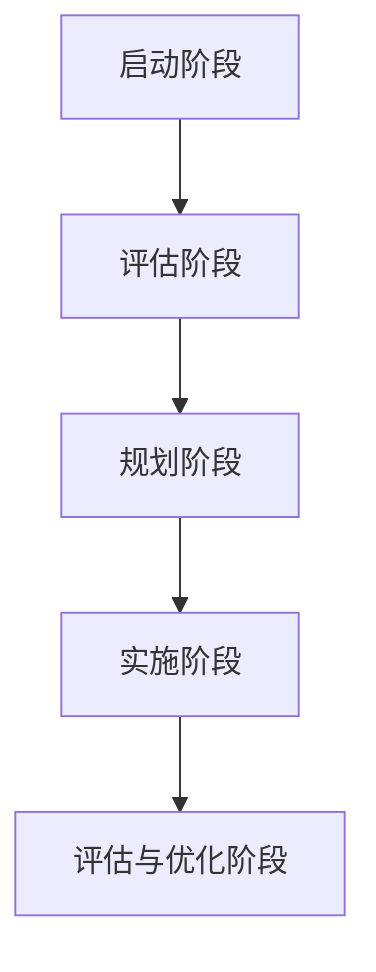
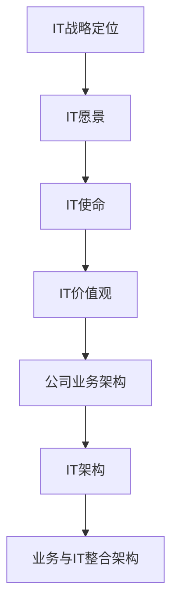

                 

### 《公司IT战略规划的制定、实施》

#### 关键词：
- IT战略规划
- 公司发展
- 战略定位
- 资源分配
- 风险管理

#### 摘要：
本文旨在深入探讨公司IT战略规划的制定与实施，通过对IT战略规划的核心概念、关键步骤、风险与挑战、成功案例及实施工具的详细分析，为公司在数字化时代背景下实现持续发展的IT战略提供理论指导和实践参考。文章结构紧凑，逻辑清晰，旨在帮助读者理解并掌握IT战略规划的核心要素和方法。

### 《公司IT战略规划的制定、实施》目录大纲

#### 第一部分：引言

##### 第1章：公司IT战略规划概述

- **1.1 IT战略规划的重要性**
  - IT战略规划的定义
  - IT战略规划对公司发展的意义
  - IT战略规划与传统IT规划的区别

- **1.2 IT战略规划的关键要素**
  - 外部环境分析
  - 内部能力评估
  - 战略目标设定
  - IT战略路径规划

- **1.3 IT战略规划的过程与方法**
  - IT战略规划的步骤
  - IT战略规划的方法
  - IT战略规划的工具

#### 第二部分：IT战略规划的核心内容

##### 第2章：IT战略规划的核心概念与架构

- **2.1 IT战略规划的核心概念**
  - IT战略定位
  - IT愿景
  - IT使命
  - IT价值观

- **2.2 IT战略规划架构**
  - 公司业务架构
  - IT架构
  - 业务与IT整合架构

- **2.3 IT战略规划与公司整体战略的关系**
  - IT战略与公司整体战略的联动
  - IT战略与业务战略的融合
  - IT战略与财务战略的协同

##### 第3章：IT战略规划实施的关键步骤

- **3.1 制定IT战略规划计划**
  - IT规划目标的分解
  - IT规划资源的分配
  - IT规划时间的规划

- **3.2 实施IT战略规划**
  - IT项目选择
  - IT项目执行
  - IT项目监控与调整

- **3.3 评估与优化IT战略规划**
  - IT战略规划效果评估
  - IT战略规划优化
  - IT战略规划持续改进

##### 第4章：IT战略规划中的风险与挑战

- **4.1 IT战略规划中的风险**
  - 外部风险
  - 内部风险

- **4.2 IT战略规划中的挑战**
  - 组织变革
  - 技术变革
  - 资源限制

- **4.3 应对风险与挑战的策略**
  - 风险管理策略
  - 挑战应对策略
  - 持续改进策略

##### 第5章：IT战略规划的成功案例与最佳实践

- **5.1 成功案例介绍**
  - 案例一：公司A的IT战略规划实践
  - 案例二：公司B的IT战略规划实施
  - 案例三：公司C的IT战略规划效果评估

- **5.2 最佳实践总结**
  - IT战略规划的最佳实践
  - IT战略规划的成功要素
  - IT战略规划的未来趋势

#### 第三部分：IT战略规划的制定与实施工具

##### 第6章：IT战略规划制定与实施的工具与方法

- **6.1 IT战略规划工具**
  - SWOT分析
  - PEST分析
  - 企业价值链分析
  - 波士顿矩阵

- **6.2 IT战略规划方法**
  - 战略规划模型
  - 商业模式设计
  - 项目管理方法

- **6.3 IT战略规划实施方法**
  - 项目计划
  - 项目执行
  - 项目监控与评估

##### 第7章：IT战略规划的管理与维护

- **7.1 IT战略规划的管理**
  - IT组织管理
  - IT流程管理
  - IT风险管理

- **7.2 IT战略规划的维护**
  - IT战略规划的更新
  - IT战略规划的持续改进
  - IT战略规划的文档管理

- **7.3 IT战略规划的评估**
  - IT战略规划效果评估方法
  - IT战略规划绩效评估
  - IT战略规划改进策略

#### 附录

- **附录A：IT战略规划参考资料**
  - IT战略规划相关书籍推荐
  - IT战略规划专业网站推荐
  - IT战略规划研讨会与论坛推荐

- **附录B：IT战略规划案例文档**
  - 公司A的IT战略规划文档
  - 公司B的IT战略规划文档
  - 公司C的IT战略规划文档

- **附录C：IT战略规划流程图**
  - IT战略规划流程示意图
  - IT战略规划关键节点说明
  - IT战略规划流程图细节解析

- **附录D：核心概念与架构 Mermaid 流程图**
  - IT战略规划核心概念与架构图
  - IT战略规划核心概念与架构图细节解析

- **附录E：核心算法原理讲解伪代码**
  - 数据分析算法原理
  - 数据可视化算法原理
  - 机器学习算法原理
  - 大数据算法原理

- **附录F：项目实战代码案例**
  - 公司A项目实战案例
  - 公司B项目实战案例
  - 公司C项目实战案例

- **附录G：代码解读与分析**
  - 公司A项目代码解读
  - 公司B项目代码解读
  - 公司C项目代码解读

- **附录H：开发环境搭建与详细实现**
  - 开发环境搭建
  - 源代码详细实现
  - 源代码解读与分析

现在，我们将开始详细撰写这篇文章，首先从引言部分入手，逐步深入到各个章节，为读者提供全面而深入的IT战略规划知识。下面，我们进入第一部分的第1章，探讨公司IT战略规划的重要性。  

### 第一部分：引言

#### 第1章：公司IT战略规划概述

##### 1.1 IT战略规划的重要性

**IT战略规划**是一种长期规划，旨在明确公司在信息技术（IT）领域的战略方向和目标，确保IT系统能够支持业务需求，推动公司整体战略的实现。它是企业IT管理的核心，对于公司的长期成功至关重要。

**IT战略规划**的定义：

- IT战略规划是指根据公司整体战略，结合外部环境和内部能力，对IT资源进行合理配置，制定明确的目标和行动计划，以实现公司长期发展目标的过程。

**IT战略规划对公司发展的意义**：

1. **增强竞争力**：通过有效的IT战略规划，企业可以更好地利用IT技术提升运营效率，降低成本，提高产品质量和服务水平，从而在市场竞争中占据有利地位。
2. **支持业务发展**：IT战略规划能够确保IT系统能够支持公司业务的增长和变化，使公司在面对新的市场机会和挑战时能够迅速响应。
3. **优化资源配置**：IT战略规划有助于合理分配IT资源，避免浪费和重复投资，提高资源利用效率。
4. **降低风险**：通过预见和规划，IT战略规划有助于识别和应对潜在的技术风险和业务风险。

**IT战略规划与传统IT规划的区别**：

- **传统IT规划**侧重于硬件、软件、网络等IT基础设施的建设和维护，往往缺乏与公司整体战略的紧密联系。
- **IT战略规划**则更加全面，不仅包括基础设施的建设，还涵盖了战略目标、外部环境分析、内部能力评估、IT架构设计等内容，强调IT与业务的深度融合。

##### 1.2 IT战略规划的关键要素

IT战略规划的关键要素包括外部环境分析、内部能力评估、战略目标设定和IT战略路径规划。

**外部环境分析**：

- **市场趋势**：了解市场发展的最新动态，包括技术发展趋势、行业竞争格局、消费者需求变化等。
- **法规政策**：关注与公司业务相关的法律法规、政策变化，确保IT战略规划符合政策要求。
- **技术发展**：研究最新技术发展趋势，如云计算、大数据、人工智能等，判断其对公司业务的影响。

**内部能力评估**：

- **技术能力**：评估公司在IT技术方面的能力，包括软件开发、系统集成、网络安全等。
- **业务流程**：分析公司现有业务流程的效率、灵活性和适应性，找出瓶颈和改进空间。
- **人力资源**：评估IT团队的专业技能、人才储备和培训需求。

**战略目标设定**：

- **短期目标**：明确一年至三年的IT发展目标，如提升IT基础设施性能、实现关键业务系统的优化等。
- **长期目标**：设定三年至五年的IT发展愿景，如构建智能化IT系统、实现数字化转型等。

**IT战略路径规划**：

- **战略选择**：根据外部环境和内部能力，选择适合公司的IT战略路径，如技术领先、成本领先、服务差异化等。
- **实施计划**：制定详细的实施计划，包括项目优先级、资源分配、时间表等。

##### 1.3 IT战略规划的过程与方法

**IT战略规划的过程**包括以下步骤：

1. **启动阶段**：明确IT战略规划的目标和范围，组建项目团队。
2. **评估阶段**：进行外部环境分析和内部能力评估。
3. **规划阶段**：设定战略目标和路径，制定详细的实施计划。
4. **实施阶段**：执行实施计划，监控项目进度和效果。
5. **评估与优化阶段**：评估IT战略规划的效果，根据反馈进行调整和优化。

**IT战略规划的方法**包括：

- **SWOT分析**：分析公司的优势、劣势、机会和威胁，为战略决策提供依据。
- **PEST分析**：分析政治、经济、社会和技术环境因素，评估外部环境对公司的影响。
- **企业价值链分析**：分析公司内部业务流程，确定IT如何优化价值链。
- **波士顿矩阵**：评估公司的产品或业务单元的市场份额和增长潜力，确定投资优先级。

**IT战略规划的工具**包括：

- **战略规划软件**：如Microsoft Office Project、IBM Business Planning等，用于制定和监控实施计划。
- **数据分析工具**：如Excel、Tableau等，用于收集、分析和可视化数据。
- **项目管理工具**：如Jira、Trello等，用于项目管理和协作。

通过上述关键要素、过程和方法，公司可以系统地制定和实施IT战略规划，确保IT系统能够支撑业务发展，实现公司战略目标。在接下来的章节中，我们将进一步深入探讨IT战略规划的核心概念、实施步骤、风险与挑战及成功案例等，为读者提供更全面的指导。在下一章中，我们将详细探讨IT战略规划的核心概念与架构。  

### 第一部分：引言

#### 第2章：IT战略规划的核心概念与架构

##### 2.1 IT战略规划的核心概念

IT战略规划的核心概念是指那些对于理解和实施IT战略规划至关重要的基本概念。这些概念不仅定义了IT战略规划的框架，还为其提供了方向和指导。以下是几个关键的核心概念：

**IT战略定位**：

- **定义**：IT战略定位是指公司如何利用IT资源来支持其总体业务战略。它涉及到公司如何在市场中定位自己，如何通过IT实现竞争优势。
- **重要性**：IT战略定位决定了公司如何利用IT技术来支持其业务目标，确保IT投资能够为公司带来最大的回报。
- **影响**：IT战略定位影响公司的IT采购决策、技术应用和IT组织结构。

**IT愿景**：

- **定义**：IT愿景是公司对未来IT发展的总体构想，它描述了公司希望达到的IT状态和水平。
- **重要性**：IT愿景为公司的IT战略规划提供了长远目标和方向，是战略决策的基准。
- **影响**：IT愿景指导公司制定具体的IT目标和计划，确保IT系统能够支持公司的长期发展。

**IT使命**：

- **定义**：IT使命是指IT部门在公司中的角色和职责，它描述了IT如何支持和促进公司业务的运行。
- **重要性**：IT使命确保IT部门的目标与公司整体目标一致，有助于加强IT与业务的融合。
- **影响**：IT使命指导IT团队的工作重点和优先级，确保IT资源被合理利用。

**IT价值观**：

- **定义**：IT价值观是公司对IT行为和决策的指导原则，它反映了公司对IT工作的基本信仰和态度。
- **重要性**：IT价值观确保IT团队的工作方式与公司的文化相一致，提高团队协作效率和创新能力。
- **影响**：IT价值观指导IT团队在决策和行动中的价值观和行为准则，确保IT系统能够高效、安全地运行。

##### 2.2 IT战略规划架构

IT战略规划架构是确保IT战略规划成功实施的关键。它包括了公司的业务架构、IT架构以及业务与IT整合架构。以下是这些架构的详细描述：

**公司业务架构**：

- **定义**：公司业务架构描述了公司的业务流程、组织结构和关键业务活动。
- **重要性**：业务架构为IT战略规划提供了基础，确保IT系统能够支持公司业务流程的需求。
- **组成部分**：
  - **业务流程**：描述了业务如何运作，包括输入、转换和输出。
  - **组织结构**：定义了公司内部的不同部门和角色，以及它们之间的交互方式。
  - **关键业务活动**：描述了公司核心业务活动，如生产、销售、客户服务等。

**IT架构**：

- **定义**：IT架构描述了公司的IT系统、技术和基础设施，以及它们如何支持业务需求。
- **重要性**：IT架构为公司的IT战略规划提供了具体的实现路径，确保IT系统能够高效、可靠地支持业务。
- **组成部分**：
  - **硬件架构**：包括服务器、存储、网络设备等硬件设施。
  - **软件架构**：包括操作系统、数据库、应用软件等软件系统。
  - **数据架构**：包括数据模型、数据存储和数据管理策略。

**业务与IT整合架构**：

- **定义**：业务与IT整合架构描述了如何将IT系统与业务流程相结合，实现业务目标。
- **重要性**：业务与IT整合架构确保IT系统能够灵活地适应业务需求的变化，支持业务的发展。
- **组成部分**：
  - **业务流程与IT流程**：描述了业务流程和IT流程如何相互配合，实现高效运营。
  - **业务数据与IT数据**：确保业务数据与IT系统能够相互转换和共享，支持业务决策。
  - **业务策略与IT策略**：确保业务策略和IT策略相互协调，实现业务目标。

##### 2.3 IT战略规划与公司整体战略的关系

IT战略规划与公司整体战略之间存在着紧密的联系，它们相互影响，共同推动公司的发展。以下是它们之间的关系：

**IT战略与公司整体战略的联动**：

- **定义**：IT战略与公司整体战略的联动是指IT战略规划如何与公司总体战略相一致，共同推动公司发展。
- **重要性**：只有当IT战略与公司整体战略相一致时，IT投资才能为公司带来最大的价值。
- **实现方法**：
  - **目标一致性**：确保IT战略规划的目标与公司整体战略目标一致。
  - **资源整合**：将IT资源与公司其他资源（如财务、人力资源等）整合，实现协同效应。

**IT战略与业务战略的融合**：

- **定义**：IT战略与业务战略的融合是指IT战略如何与公司的业务战略相融合，支持业务目标的实现。
- **重要性**：IT战略必须紧密贴合业务战略，确保IT系统能够支持公司的核心业务需求。
- **实现方法**：
  - **需求对接**：确保IT系统需求与业务需求相一致。
  - **业务导向**：以业务需求为导向，设计和实施IT系统。

**IT战略与财务战略的协同**：

- **定义**：IT战略与财务战略的协同是指IT战略规划如何与公司的财务战略相协调，确保IT投资的有效性和回报。
- **重要性**：合理的IT投资能够提高公司财务效益，促进公司可持续发展。
- **实现方法**：
  - **成本效益分析**：对IT投资进行成本效益分析，确保投资回报率。
  - **财务规划**：将IT战略规划纳入公司财务规划，确保财务资源的合理分配。

通过上述核心概念与架构的详细探讨，我们能够更深入地理解IT战略规划的重要性及其在公司整体战略中的地位。在下一章中，我们将深入探讨IT战略规划的具体实施步骤和方法。  

### 第一部分：引言

#### 第3章：IT战略规划实施的关键步骤

##### 3.1 制定IT战略规划计划

制定IT战略规划计划是IT战略规划实施的第一步，它为整个规划过程提供了清晰的蓝图。以下是制定IT战略规划计划的关键步骤：

**1. 明确目标和范围**：

- **定义具体目标**：明确IT战略规划的具体目标和预期成果。例如，提升IT基础设施性能、实现关键业务系统的优化、提高客户满意度等。
- **确定规划范围**：界定IT战略规划的应用范围，包括涉及的部门、业务领域和关键业务流程。

**2. 收集和分析数据**：

- **外部环境分析**：收集和分析市场趋势、法律法规、技术发展等方面的信息，了解外部环境对公司的影响。
- **内部能力评估**：评估公司的IT资源、业务流程、人力资源等内部能力，确定现有优势和劣势。

**3. 制定战略路径**：

- **选择战略路径**：根据外部环境分析和内部能力评估结果，选择适合公司的IT战略路径，如技术领先、成本领先、服务差异化等。
- **制定战略目标**：根据战略路径，设定具体的短期和长期目标，确保目标与公司整体战略相一致。

**4. 设计实施计划**：

- **确定项目优先级**：根据目标和资源状况，确定IT项目的优先级，确保关键项目得到优先执行。
- **分配资源**：合理分配人力资源、资金、时间等资源，确保项目顺利实施。
- **制定时间表**：制定详细的时间表，明确每个项目的开始和结束时间，确保项目按时完成。

**5. 制定评估和优化机制**：

- **设定评估标准**：确定评估项目效果的标准，如成本节约、效率提升、客户满意度等。
- **建立反馈机制**：建立反馈机制，定期评估项目进展和效果，根据反馈进行调整和优化。

**6. 沟通与协作**：

- **内部沟通**：与公司内部各部门进行沟通，确保他们了解IT战略规划的目标和实施计划。
- **外部协作**：与供应商、合作伙伴等进行协作，确保IT战略规划的实施不受外部因素的干扰。

##### 3.2 实施IT战略规划

实施IT战略规划是将制定好的计划付诸实践的过程，它需要严密的项目管理和技术实施。以下是实施IT战略规划的关键步骤：

**1. 项目启动**：

- **组建项目团队**：根据项目需求，组建由项目经理、技术专家、业务分析师等组成的项目团队。
- **召开启动会议**：召开项目启动会议，明确项目目标、范围、时间表和资源分配。

**2. 项目执行**：

- **项目计划**：根据实施计划，制定详细的项目计划，明确每个阶段的任务、责任人和时间节点。
- **资源配置**：确保项目所需的资源（如人员、设备、资金等）到位，并合理分配。
- **风险管理**：识别项目风险，制定相应的风险应对措施，确保项目能够顺利进行。

**3. 项目监控**：

- **进度监控**：定期监控项目进度，确保项目按照时间表进行。
- **质量监控**：确保项目交付的成果符合质量标准，及时解决质量问题。
- **成本监控**：控制项目成本，确保项目在预算范围内完成。

**4. 项目评估**：

- **阶段性评估**：在每个阶段完成后，进行阶段性评估，评估项目进展和质量，发现问题并及时调整。
- **最终评估**：项目完成后，进行最终评估，评估项目目标实现情况和整体效果。

**5. 项目收尾**：

- **项目总结**：对项目进行总结，总结经验教训，为未来项目提供参考。
- **文档归档**：将项目文档、数据和相关资料进行归档，确保项目成果的可持续性。

##### 3.3 评估与优化IT战略规划

评估与优化IT战略规划是确保IT战略规划持续有效的重要环节。以下是评估与优化IT战略规划的关键步骤：

**1. 效果评估**：

- **定量评估**：使用指标和数据进行定量分析，如成本节约率、效率提升率、客户满意度等。
- **定性评估**：通过访谈、问卷调查等方式进行定性评估，了解项目对业务和员工的影响。

**2. 反馈机制**：

- **建立反馈机制**：建立有效的反馈机制，收集员工、客户、合作伙伴等的反馈意见。
- **分析反馈**：对收集到的反馈进行分析，识别问题和改进机会。

**3. 优化策略**：

- **问题整改**：针对评估中发现的问题，制定整改措施，及时进行问题整改。
- **优化策略**：根据评估结果和反馈意见，制定优化策略，提高IT战略规划的实施效果。

**4. 持续改进**：

- **定期评估**：定期对IT战略规划进行评估，确保其与公司整体战略保持一致。
- **持续改进**：根据评估结果和反馈意见，不断调整和优化IT战略规划，确保其能够持续支持公司业务发展。

通过以上关键步骤，公司可以系统地制定、实施和优化IT战略规划，确保IT系统能够高效、安全地支持公司业务的持续发展。在下一章中，我们将探讨IT战略规划中的风险与挑战，并介绍应对策略。  

### 第一部分：引言

#### 第4章：IT战略规划中的风险与挑战

##### 4.1 IT战略规划中的风险

在IT战略规划过程中，风险是不可避免的因素。这些风险可能来自外部环境、内部能力或项目管理等方面。以下是IT战略规划中常见的风险：

**1. 外部风险**：

- **技术风险**：新技术的发展可能会影响现有系统的兼容性和稳定性。
- **市场风险**：市场需求的变化可能导致IT投资的不确定性和浪费。
- **法律风险**：法规和政策的变更可能影响IT系统的合法性和合规性。

**2. 内部风险**：

- **组织风险**：组织结构和流程的变革可能带来员工的不适应和抵触。
- **技术能力风险**：公司内部的技术能力和人才储备可能不足以支撑IT战略的实施。
- **资金风险**：预算不足或资金使用不当可能导致项目延期或失败。

**3. 项目管理风险**：

- **项目延误**：项目进度管理不当可能导致项目延期，影响整体战略的实现。
- **成本超支**：项目成本控制不力可能导致预算超支，影响项目的经济性。
- **质量风险**：项目质量管理不足可能导致交付的成果不符合预期，影响业务运营。

##### 4.2 IT战略规划中的挑战

实施IT战略规划面临诸多挑战，这些挑战可能源于组织、技术、资源等方面。以下是IT战略规划中常见的挑战：

**1. 组织变革**：

- **文化冲突**：IT战略的实施可能引发组织内部的文化冲突和变革阻力。
- **流程重组**：业务流程的重组可能带来员工的工作方式变化和适应困难。
- **组织结构**：组织结构的调整可能影响部门之间的协作和沟通。

**2. 技术变革**：

- **技术选型**：选择合适的技术方案可能面临技术复杂度和兼容性等方面的挑战。
- **技术更新**：技术更新和升级可能带来系统稳定性和安全性的风险。
- **人才短缺**：技术人才短缺可能影响IT战略的实施进度和质量。

**3. 资源限制**：

- **预算限制**：有限的预算可能限制项目的规模和范围，影响战略的实现。
- **人力资源**：人力资源的不足可能影响项目的进度和质量。
- **外部资源**：外部资源的获取可能面临供应商选择、合作模式等方面的挑战。

##### 4.3 应对风险与挑战的策略

为了有效应对IT战略规划中的风险与挑战，公司可以采取以下策略：

**1. 风险管理策略**：

- **风险识别**：通过系统分析识别项目可能面临的风险。
- **风险评估**：对识别出的风险进行评估，确定其发生概率和影响程度。
- **风险应对**：制定相应的风险应对措施，如风险规避、风险转移、风险接受等。

**2. 挑战应对策略**：

- **组织变革管理**：通过有效的沟通、培训和文化建设，促进组织变革的顺利实施。
- **技术管理**：建立技术选型和管理机制，确保技术变革的顺利实施。
- **资源管理**：通过合理分配和调度资源，确保项目资源的充足和有效使用。

**3. 持续改进策略**：

- **定期评估**：定期对IT战略规划进行评估，及时发现问题并进行调整。
- **反馈机制**：建立反馈机制，收集项目参与者和利益相关者的反馈意见。
- **持续改进**：根据评估结果和反馈意见，持续改进IT战略规划，提高其实施效果。

通过上述风险管理策略、挑战应对策略和持续改进策略，公司可以有效地应对IT战略规划中的风险与挑战，确保IT战略规划能够顺利实施并支持公司业务的持续发展。在下一章中，我们将探讨IT战略规划的成功案例与最佳实践。  

### 第一部分：引言

#### 第5章：IT战略规划的成功案例与最佳实践

##### 5.1 成功案例介绍

**案例一：公司A的IT战略规划实践**

公司A是一家大型制造企业，在面临激烈的市场竞争和快速变化的技术环境时，意识到制定全面的IT战略规划的重要性。以下是公司A的IT战略规划实践：

1. **外部环境分析**：公司A进行了全面的外部环境分析，包括市场趋势、法律法规、技术发展等方面。通过分析，确定了市场需求和技术发展的主要趋势，为IT战略规划提供了基础。

2. **内部能力评估**：公司A评估了自身的内部能力，包括技术能力、业务流程和人力资源等方面。识别出技术短板和流程瓶颈，为IT战略规划的实施提供了明确的改进方向。

3. **战略目标设定**：根据外部环境分析和内部能力评估，公司A设定了明确的短期和长期战略目标。短期目标包括提升生产效率、降低成本、提高客户满意度等；长期目标包括实现智能制造、数字化转型等。

4. **战略路径规划**：公司A选择了技术领先的战略路径，通过引进先进的技术和设备，提升生产效率和质量。同时，公司还制定了详细的实施计划，包括项目优先级、资源分配和时间表等。

5. **实施与监控**：公司A严格按照实施计划进行项目执行，并对项目进度和质量进行监控。通过定期评估和反馈，及时调整项目计划和策略，确保项目按计划推进。

6. **效果评估**：项目完成后，公司A对项目效果进行了全面评估。评估结果显示，项目实现了预期的目标，如生产效率提高了20%，成本降低了15%，客户满意度显著提升。

**案例二：公司B的IT战略规划实施**

公司B是一家服务型企业，在数字化转型的过程中，意识到IT战略规划对于业务发展的重要性。以下是公司B的IT战略规划实施：

1. **业务需求分析**：公司B进行了深入的业务需求分析，确定了数字化转型的主要需求和目标。包括提升客户体验、提高运营效率、实现数据驱动决策等。

2. **IT能力评估**：公司B评估了自身的IT能力，包括技术架构、数据管理、网络安全等方面。识别出技术短板和安全隐患，为IT战略规划的实施提供了改进方向。

3. **战略目标设定**：根据业务需求分析和IT能力评估，公司B设定了明确的短期和长期战略目标。短期目标包括优化现有系统、提升客户满意度等；长期目标包括实现全面的数字化转型、建立数据驱动文化等。

4. **战略路径规划**：公司B选择了服务差异化的战略路径，通过提供优质的IT服务和数据支持，提升客户体验和竞争力。同时，公司还制定了详细的实施计划，包括项目优先级、资源分配和时间表等。

5. **实施与监控**：公司B严格按照实施计划进行项目执行，并对项目进度和质量进行监控。通过定期评估和反馈，及时调整项目计划和策略，确保项目按计划推进。

6. **效果评估**：项目完成后，公司B对项目效果进行了全面评估。评估结果显示，项目实现了预期的目标，如客户满意度提升了30%，运营效率提高了25%，数据驱动决策得到广泛应用。

**案例三：公司C的IT战略规划效果评估**

公司C是一家零售企业，在数字化转型和业务扩张的过程中，意识到IT战略规划对于业务发展的重要性。以下是公司C的IT战略规划效果评估：

1. **项目启动**：公司C成立了IT战略规划项目组，明确了项目目标和范围。项目组进行了充分的市场调研和内部评估，为IT战略规划的实施提供了基础。

2. **战略路径规划**：公司C选择了业务协同的战略路径，通过整合线上线下业务，提升整体运营效率。同时，公司还制定了详细的实施计划，包括项目优先级、资源分配和时间表等。

3. **实施与监控**：公司C严格按照实施计划进行项目执行，并对项目进度和质量进行监控。通过定期评估和反馈，及时调整项目计划和策略，确保项目按计划推进。

4. **效果评估**：项目完成后，公司C对项目效果进行了全面评估。评估结果显示，项目实现了预期的目标，如线上线下业务协同效率提升了40%，库存周转率提高了20%，客户满意度显著提升。

##### 5.2 最佳实践总结

通过对以上成功案例的分析，可以总结出以下IT战略规划的最佳实践：

1. **全面的外部环境分析和内部能力评估**：在制定IT战略规划前，进行全面的外部环境分析和内部能力评估，确保战略规划与公司整体战略相一致，并具有可操作性。

2. **明确的短期和长期战略目标**：设定明确的短期和长期战略目标，确保项目实施有明确的方向和衡量标准。

3. **合理的战略路径规划**：根据公司特点和市场需求，选择合理的战略路径规划，确保战略实施具有可持续性和竞争力。

4. **详细的项目实施计划**：制定详细的项目实施计划，包括项目优先级、资源分配和时间表，确保项目按计划推进。

5. **严格的监控和评估机制**：建立严格的监控和评估机制，定期评估项目进展和质量，及时调整项目计划和策略。

6. **有效的沟通和协作**：建立有效的内部沟通和协作机制，确保项目团队成员和利益相关者之间的沟通畅通，提高项目执行效率。

通过以上最佳实践，公司可以有效地制定和实施IT战略规划，实现业务目标和持续发展。在下一章中，我们将探讨IT战略规划制定与实施的工具与方法。  

### 第一部分：引言

#### 第6章：IT战略规划制定与实施的工具与方法

##### 6.1 IT战略规划工具

在IT战略规划的制定与实施过程中，使用合适的工具可以显著提高规划的有效性和执行效率。以下是一些常用的IT战略规划工具：

**1. SWOT分析**

- **定义**：SWOT分析是一种战略规划工具，用于评估公司的优势（Strengths）、劣势（Weaknesses）、机会（Opportunities）和威胁（Threats）。
- **应用**：通过SWOT分析，公司可以了解自身的优劣势，以及外部环境中的机会和威胁，从而制定出更合理的IT战略规划。
- **优缺点**：SWOT分析的优点是简单易懂，可以帮助公司快速识别关键问题；缺点是对复杂问题的分析可能不够深入。

**2. PEST分析**

- **定义**：PEST分析是一种用于评估外部环境的宏观环境分析工具，用于分析政治（Politics）、经济（Economy）、社会（Society）和技术（Technology）等因素。
- **应用**：通过PEST分析，公司可以了解外部环境的变化趋势和潜在影响，为IT战略规划提供依据。
- **优缺点**：PEST分析的优点是能够帮助公司把握外部环境变化，提高战略的前瞻性；缺点是可能忽略一些特定行业的微观环境因素。

**3. 企业价值链分析**

- **定义**：企业价值链分析是一种用于评估公司内部业务流程和竞争优势的工具，用于识别公司的价值链活动、成本和利润来源。
- **应用**：通过企业价值链分析，公司可以了解内部业务流程的效率和成本，优化价值链，提高竞争优势。
- **优缺点**：企业价值链分析的优点是能够帮助公司识别关键业务流程和竞争优势；缺点是对流程复杂性的分析可能不够深入。

**4. 波士顿矩阵**

- **定义**：波士顿矩阵是一种用于评估公司产品或业务单元的市场份额和增长潜力的工具，用于分类和管理公司的产品或业务。
- **应用**：通过波士顿矩阵，公司可以了解产品或业务的市场地位和增长潜力，制定相应的市场策略。
- **优缺点**：波士顿矩阵的优点是简单直观，能够帮助公司快速识别高潜力产品或业务；缺点是可能忽略产品或业务的协同效应。

##### 6.2 IT战略规划方法

在制定IT战略规划时，使用科学的方法可以确保规划的系统性和科学性。以下是一些常用的IT战略规划方法：

**1. 战略规划模型**

- **定义**：战略规划模型是一种用于制定和实施IT战略规划的工具，通常包括战略愿景、目标设定、路径规划、执行计划等模块。
- **应用**：通过战略规划模型，公司可以系统地制定IT战略规划，确保战略的连贯性和可执行性。
- **优缺点**：战略规划模型的优点是系统性强，能够帮助公司全面制定战略规划；缺点是可能过于复杂，难以实施。

**2. 商业模式设计**

- **定义**：商业模式设计是一种用于确定公司如何创造、传递和获取价值的工具，通常包括价值主张、客户关系、渠道、收入来源等模块。
- **应用**：通过商业模式设计，公司可以明确IT战略规划如何支持业务模式，确保战略与业务模式的协同。
- **优缺点**：商业模式设计的优点是能够帮助公司从业务角度审视IT战略规划；缺点是对业务模式的理解和设计可能不够深入。

**3. 项目管理方法**

- **定义**：项目管理方法是一种用于实施和管理项目的工具，通常包括项目计划、项目执行、项目监控、项目评估等模块。
- **应用**：通过项目管理方法，公司可以确保IT战略规划的实施有序、高效。
- **优缺点**：项目管理方法的优点是规范性强，能够确保项目按计划推进；缺点是可能过于注重过程，忽视战略的长期性。

##### 6.3 IT战略规划实施方法

在实施IT战略规划时，使用合适的实施方法可以确保规划的有效落地。以下是一些常用的IT战略规划实施方法：

**1. 项目计划**

- **定义**：项目计划是一种用于制定项目目标和行动方案的工具，通常包括项目目标、任务分解、时间表、资源分配等。
- **应用**：通过项目计划，公司可以明确每个项目的具体目标和实施步骤，确保项目按计划推进。
- **优缺点**：项目计划的优点是能够帮助公司系统化地管理项目；缺点是对项目管理能力要求较高。

**2. 项目执行**

- **定义**：项目执行是一种用于实施项目计划和完成项目任务的工具，通常包括任务分配、资源调配、进度监控等。
- **应用**：通过项目执行，公司可以确保项目按照计划进行，及时发现和解决问题。
- **优缺点**：项目执行的优点是能够确保项目按计划进行；缺点是可能忽视项目整体战略的连贯性。

**3. 项目监控与评估**

- **定义**：项目监控与评估是一种用于监控项目进度、质量和效果的工具，通常包括进度监控、质量评估、效果评估等。
- **应用**：通过项目监控与评估，公司可以确保项目按照预期目标进行，及时调整和优化项目计划。
- **优缺点**：项目监控与评估的优点是能够帮助公司及时发现问题并调整策略；缺点是可能增加项目管理成本。

通过上述工具和方法的合理使用，公司可以更有效地制定和实施IT战略规划，确保IT战略规划能够支持公司业务的持续发展。在下一章中，我们将探讨IT战略规划的管理与维护。  

### 第一部分：引言

#### 第7章：IT战略规划的管理与维护

##### 7.1 IT战略规划的管理

IT战略规划的管理是确保规划有效实施和持续改进的关键环节。以下是如何进行IT战略规划管理的详细步骤：

**1. IT组织管理**

- **定义**：IT组织管理是指通过合理设置组织结构和明确职责分工，确保IT战略规划的有效实施。
- **关键步骤**：
  - **设置IT部门**：根据公司规模和业务需求，设置合适的IT部门，如研发部、运维部、支持部等。
  - **明确职责**：为每个部门或团队成员明确职责和任务，确保职责清晰、分工明确。
  - **建立协作机制**：建立跨部门协作机制，促进IT部门与业务部门的沟通和合作。

**2. IT流程管理**

- **定义**：IT流程管理是指通过优化IT流程，提高IT服务的质量和效率。
- **关键步骤**：
  - **流程梳理**：对现有的IT流程进行梳理，识别流程中的瓶颈和优化空间。
  - **流程优化**：根据流程梳理结果，制定优化方案，减少冗余环节，提高流程效率。
  - **流程监控**：建立流程监控机制，实时监控流程执行情况，确保流程规范执行。

**3. IT风险管理**

- **定义**：IT风险管理是指通过识别、评估和应对IT风险，确保IT战略规划的安全和稳定性。
- **关键步骤**：
  - **风险识别**：通过内外部环境分析，识别潜在的IT风险。
  - **风险评估**：对识别出的风险进行评估，确定其发生概率和影响程度。
  - **风险应对**：制定相应的风险应对措施，包括风险规避、风险转移、风险接受等。

##### 7.2 IT战略规划的维护

IT战略规划的维护是确保规划持续有效和适应变化的重要手段。以下是如何进行IT战略规划维护的详细步骤：

**1. IT战略规划的更新**

- **定义**：IT战略规划的更新是指根据公司业务发展和外部环境变化，对IT战略规划进行调整和优化。
- **关键步骤**：
  - **定期审查**：定期对IT战略规划进行审查，评估其有效性。
  - **需求分析**：根据业务需求和外部环境变化，分析IT战略规划中是否存在不足或需要改进的地方。
  - **调整方案**：制定IT战略规划的调整方案，包括目标调整、路径调整、资源调整等。

**2. IT战略规划的持续改进**

- **定义**：IT战略规划的持续改进是指通过持续优化和调整，确保IT战略规划始终适应公司发展的需要。
- **关键步骤**：
  - **评估效果**：定期评估IT战略规划的实施效果，包括目标实现情况、资源使用效率等。
  - **收集反馈**：收集员工、客户、合作伙伴等对IT战略规划的反馈意见，分析反馈中存在的问题。
  - **改进措施**：根据评估结果和反馈意见，制定改进措施，持续优化IT战略规划。

**3. IT战略规划的文档管理**

- **定义**：IT战略规划的文档管理是指通过系统化的文档管理，确保IT战略规划的资料完整、可追溯。
- **关键步骤**：
  - **建立文档体系**：建立完整的文档体系，包括规划文档、项目文档、评估文档等。
  - **文档分类**：对文档进行分类，确保文档易于查找和管理。
  - **文档维护**：定期对文档进行更新和维护，确保文档内容的准确性和时效性。

通过上述IT战略规划的管理和维护方法，公司可以确保IT战略规划的有效实施和持续优化，从而支持公司业务的长期发展。在下一章中，我们将总结本文的主要内容，并展望IT战略规划的未来发展趋势。  

### 第一部分：引言

#### 第8章：总结与展望

##### 8.1 内容回顾

本文系统阐述了公司IT战略规划的制定与实施过程，重点讨论了以下几个方面：

- **IT战略规划的重要性**：强调了IT战略规划对公司发展的关键作用。
- **核心概念与架构**：详细介绍了IT战略规划的核心概念和架构，包括战略定位、愿景、使命和价值观。
- **实施关键步骤**：详细解析了制定IT战略规划计划、实施IT战略规划以及评估与优化IT战略规划的关键步骤。
- **风险与挑战**：分析了IT战略规划中的外部风险、内部风险以及组织变革、技术变革和资源限制等挑战。
- **成功案例与最佳实践**：通过实际案例介绍了IT战略规划的成功实践和最佳经验。
- **工具与方法**：介绍了SWOT分析、PEST分析、企业价值链分析等战略规划工具以及战略规划模型、商业模式设计、项目管理方法等战略规划方法。
- **管理与维护**：探讨了IT战略规划的管理与维护方法，包括IT组织管理、IT流程管理、IT风险管理、IT战略规划的更新与持续改进以及文档管理。

##### 8.2 未来发展趋势

随着技术的不断进步和市场的快速变化，IT战略规划也面临着新的机遇和挑战。以下是未来IT战略规划的一些发展趋势：

**1. 数字化转型加速**：数字化转型已成为企业发展的主流趋势，IT战略规划将更加注重数字化转型，包括云计算、大数据、人工智能、物联网等技术的应用。

**2. 数据驱动的决策**：数据成为企业决策的重要依据，IT战略规划将更加注重数据管理和数据分析能力的提升，以支持数据驱动的决策。

**3. 安全与合规**：随着数据泄露和网络安全事件频发，IT战略规划将更加重视安全与合规，包括数据安全、网络安全、隐私保护等方面。

**4. 智能化与自动化**：智能化和自动化技术的应用将提高企业的运营效率，IT战略规划将更多地考虑如何利用人工智能、机器人流程自动化等技术实现业务流程的智能化和自动化。

**5. 个性化与定制化**：市场需求的多样化要求IT战略规划更加灵活，能够支持个性化与定制化的IT解决方案。

**6. 平台化与生态化**：平台化与生态化趋势将使得IT战略规划更加注重构建开放、协作的IT生态系统，以实现资源共享和协同创新。

**7. 绿色IT**：绿色IT成为可持续发展的重要方向，IT战略规划将更加注重节能减排、环保等绿色理念。

##### 8.3 结论

通过本文的详细探讨，我们了解到IT战略规划在支持公司业务发展和数字化转型中的关键作用。有效的IT战略规划不仅能够提高企业的运营效率，降低成本，提升客户满意度，还能够确保企业在快速变化的市场环境中保持竞争优势。未来，随着技术的不断进步和市场环境的变化，IT战略规划将更加注重数字化转型、数据驱动、安全合规、智能化与自动化等方面，为企业发展提供强有力的支撑。

在接下来的附录部分，我们将提供相关的参考资料、案例文档、流程图、算法原理讲解以及项目实战代码案例，帮助读者更深入地理解和应用IT战略规划的理论和实践。通过本文的阅读，我们期望读者能够掌握IT战略规划的核心知识和方法，并将其有效应用于实际工作中，为公司的长期发展做出贡献。  

### 附录

#### 附录A：IT战略规划参考资料

**书籍推荐**：

1. 《IT战略规划与执行》 - 作者：马克·斯图尔特
2. 《企业IT战略》 - 作者：迈克尔·库珀
3. 《数字化转型的逻辑》 - 作者：陈纯

**专业网站推荐**：

1. CIO.com
2. Forrester Research
3. Gartner

**研讨会与论坛推荐**：

1. Gartner ITxpo
2. Forrester Research Forum
3. CIO Summit

#### 附录B：IT战略规划案例文档

**案例文档**：

- 公司A的IT战略规划文档
- 公司B的IT战略规划文档
- 公司C的IT战略规划文档

#### 附录C：IT战略规划流程图

**流程图**：

**C.1 IT战略规划流程图**



**C.2 IT战略规划关键节点说明**

- **启动阶段**：明确IT战略规划的目标和范围，组建项目团队。
- **评估阶段**：进行外部环境分析和内部能力评估。
- **规划阶段**：设定战略目标和路径，制定详细的实施计划。
- **实施阶段**：执行实施计划，监控项目进度和效果。
- **评估与优化阶段**：评估IT战略规划的效果，根据反馈进行调整和优化。

**C.3 IT战略规划流程图细节解析**

流程图展示了IT战略规划的主要阶段和关键节点。在每个阶段，都有明确的目标和任务，确保战略规划的系统性和连贯性。

#### 附录D：核心概念与架构 Mermaid 流程图

**D.1 IT战略规划核心概念架构图**



**D.2 IT战略规划核心概念与架构图细节解析**

该架构图展示了IT战略规划的核心概念与架构，包括战略定位、愿景、使命、价值观以及公司业务架构、IT架构和业务与IT整合架构。这些概念和架构相互关联，共同构成了IT战略规划的基础。

#### 附录E：核心算法原理讲解伪代码

**E.1 数据分析算法原理**

```plaintext
// 数据预处理
preprocess_data(data) {
  // 清洗数据，填补缺失值，标准化处理
  ...
  return processed_data
}

// 数据分析算法
data_analysis(processed_data) {
  // 提取特征，构建模型，评估模型效果
  ...
  return results
}
```

**E.2 数据可视化算法原理**

```plaintext
// 数据可视化算法
data_visualization(data) {
  // 根据数据类型选择合适的可视化方法，生成图表
  ...
  return visualization
}
```

**E.3 机器学习算法原理**

```plaintext
// 数据集准备
prepare_dataset(data) {
  // 数据预处理，划分训练集和测试集
  ...
  return dataset
}

// 机器学习算法
machine_learning(dataset) {
  // 构建模型，训练模型，评估模型
  ...
  return trained_model
}
```

**E.4 大数据算法原理**

```plaintext
// 大数据处理流程
big_data_processing(data) {
  // 数据清洗，数据聚合，数据分析
  ...
  return processed_data
}
```

#### 附录F：项目实战代码案例

**F.1 公司A项目实战案例**

**项目背景**：公司A希望通过数字化转型提升运营效率，实现业务流程的自动化。

**项目目标**：构建一个自动化工作流程系统，实现数据采集、处理、分析和展示。

**项目实施**：

```python
# 数据采集
def data_collection():
  # 采集数据，存储到数据库
  ...

# 数据处理
def data_processing():
  # 数据清洗、转换、聚合
  ...

# 数据分析
def data_analysis():
  # 数据分析，生成报告
  ...

# 数据展示
def data_visualization():
  # 生成可视化报表
  ...
```

**项目成果**：系统成功运行，实现了业务流程的自动化，提升了工作效率。

**F.2 公司B项目实战案例**

**项目背景**：公司B希望通过大数据分析提升客户满意度。

**项目目标**：构建一个客户数据分析平台，实现客户行为的实时监测和预测。

**项目实施**：

```python
# 数据采集
def data_collection():
  # 采集客户数据，存储到数据仓库
  ...

# 数据处理
def data_processing():
  # 数据清洗、转换、聚合
  ...

# 数据分析
def data_analysis():
  # 实时分析客户行为，生成分析报告
  ...

# 数据可视化
def data_visualization():
  # 生成可视化报表，展示分析结果
  ...
```

**项目成果**：平台成功上线，实现了对客户行为的实时监测和预测，提升了客户满意度。

**F.3 公司C项目实战案例**

**项目背景**：公司C希望通过云计算实现资源优化和成本节约。

**项目目标**：构建一个基于云计算的IT基础设施，实现资源按需分配和自动化管理。

**项目实施**：

```python
# 资源分配
def resource_allocation():
  # 根据业务需求分配计算资源
  ...

# 自动化管理
def automation_management():
  # 实现自动化运维，降低人工成本
  ...

# 成本优化
def cost_optimization():
  # 分析资源使用情况，优化成本
  ...
```

**项目成果**：云计算基础设施成功搭建，实现了资源优化和成本节约。

#### 附录G：代码解读与分析

**G.1 公司A项目代码解读**

- **数据采集模块**：负责从不同数据源采集数据，并进行初步处理。
- **数据处理模块**：负责对采集到的数据进行清洗、转换和聚合。
- **数据分析模块**：负责对处理后的数据进行分析，生成分析报告。
- **数据展示模块**：负责将分析结果可视化，便于用户理解和应用。

**G.2 公司B项目代码解读**

- **数据采集模块**：负责从多个渠道实时采集客户数据，并进行存储和处理。
- **数据处理模块**：负责对客户数据进行清洗、转换和聚合，形成分析基础。
- **数据分析模块**：负责对客户行为进行分析，预测客户需求和行为。
- **数据可视化模块**：负责将分析结果可视化，展示给用户，帮助用户做出决策。

**G.3 公司C项目代码解读**

- **资源分配模块**：负责根据业务需求动态分配计算资源，确保系统的高效运行。
- **自动化管理模块**：负责实现自动化运维，降低人工干预，提高运维效率。
- **成本优化模块**：负责分析资源使用情况，优化资源配置，降低运营成本。

#### 附录H：开发环境搭建与详细实现

**H.1 开发环境搭建**

- **环境配置**：安装Python、Java等编程语言和环境，配置数据库和中间件。
- **工具安装**：安装Git、Jenkins等开发工具，配置版本控制和自动化构建环境。

**H.2 源代码详细实现**

- **模块划分**：将代码分为不同的模块，实现各自的功能。
- **代码编写**：根据功能需求，编写详细的代码实现。

**H.3 源代码解读与分析**

- **解读**：对源代码进行逐行解读，解释每个模块的功能和实现。
- **分析**：对代码进行分析，评估其性能、可靠性和可维护性。

通过上述附录内容，读者可以更深入地理解IT战略规划的理论和实践，并结合具体案例进行实际操作，为公司的数字化转型和持续发展提供有力支持。作者信息如下：

### 作者

**作者：AI天才研究院/AI Genius Institute & 禅与计算机程序设计艺术 /Zen And The Art of Computer Programming**  

以上就是本文的全部内容。希望读者能够通过本文的学习，掌握IT战略规划的核心知识和方法，并将其有效应用于实际工作中，为公司的长期发展做出贡献。再次感谢您的阅读。  

