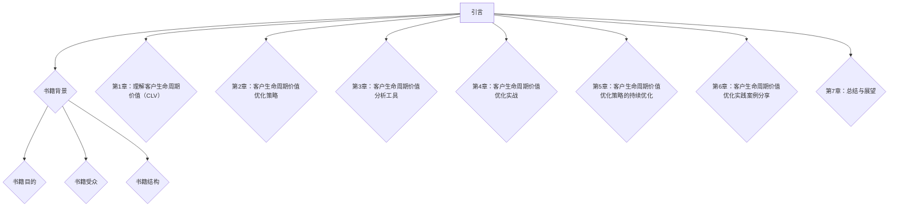

                 

### 引言

#### 1. 引言

随着市场竞争的日益激烈，创业公司面临着巨大的挑战，如何在有限的资源下实现快速增长成为了一个重要课题。在这个过程中，客户生命周期价值（Customer Lifetime Value，简称CLV）的优化显得尤为重要。本文将围绕创业公司的客户生命周期价值优化展开讨论，旨在帮助创业公司更好地理解客户价值，制定科学的客户策略，提高整体业绩。

#### 1.2 书籍目的

本文的目的有以下几点：

1. **介绍客户生命周期价值的定义和重要性**：通过阐述客户生命周期价值的定义，让读者了解这个指标对于创业公司的重要性。
2. **解析客户生命周期价值优化的策略**：提供一系列客户生命周期价值优化的策略，包括客户细分、客户获取、客户留存等，帮助创业公司制定有效的客户策略。
3. **介绍客户生命周期价值分析工具**：介绍一些常用的客户生命周期价值分析工具，帮助创业公司进行数据分析和决策。
4. **分享实战案例**：通过具体的实战案例，让读者更直观地了解如何在实际中应用客户生命周期价值优化策略。

#### 1.3 书籍受众

本文主要面向以下读者群体：

1. **创业公司的创始人或管理者**：帮助他们在有限资源下，通过优化客户生命周期价值实现快速增长。
2. **市场营销人员**：为他们提供具体的客户获取和留存策略，提高营销效果。
3. **数据分析师和工程师**：为他们提供客户生命周期价值分析工具和实战案例，提高数据分析能力。

#### 1.4 书籍结构

本文分为六个主要章节：

- **第1章：理解客户生命周期价值（CLV）**：介绍客户生命周期价值的定义、重要性、计算方法及相关概念。
- **第2章：客户生命周期价值优化策略**：讨论客户生命周期价值优化的策略，包括客户细分、客户获取和客户留存。
- **第3章：客户生命周期价值分析工具**：介绍客户生命周期价值分析工具，包括数据分析工具和机器学习工具。
- **第4章：客户生命周期价值优化实战**：通过具体案例，展示如何实施客户生命周期价值优化策略。
- **第5章：客户生命周期价值优化策略的持续优化**：讨论如何对客户生命周期价值优化策略进行持续优化。
- **第6章：客户生命周期价值优化实践案例分享**：分享多个行业的客户生命周期价值优化实践案例。
- **第7章：总结与展望**：总结本文的主要观点，展望客户生命周期价值优化的未来发展趋势。

### 1.5 本书结构示例



通过上述结构，本文将逐步深入探讨创业公司的客户生命周期价值优化，为读者提供全面、系统的指导。接下来，我们将正式进入第1章：理解客户生命周期价值（CLV）。

## 第1章：理解客户生命周期价值（CLV）

### 1.1 客户生命周期价值概述

#### 1.1.1 CLV的定义

客户生命周期价值（Customer Lifetime Value，简称CLV）是指一个客户在其与企业建立关系的整个生命周期期间为企业创造的净利润总和。这个概念最早由Peter Fader在2001年提出，随后在市场营销领域得到了广泛应用。

CLV不仅仅是一个简单的财务指标，它包含了客户的购买行为、购买频率、购买金额、客户满意度和忠诚度等多个方面。通过计算CLV，企业可以了解每个客户的潜在价值，从而做出更加科学、合理的决策。

#### 1.1.2 CLV的重要性

客户生命周期价值优化对于创业公司尤为重要。首先，CLV是评估客户价值的核心指标，它帮助企业在资源有限的情况下，优先考虑高价值客户。其次，CLV指导企业制定客户获取和客户留存策略，从而提高客户满意度和忠诚度。最后，CLV优化有助于企业实现盈利目标，提高整体业绩。

具体来说，CLV的重要性体现在以下几个方面：

1. **资源分配**：通过计算CLV，企业可以识别出高价值客户，将有限的资源集中在这些客户上，提高资源利用效率。
2. **客户获取策略**：企业可以根据CLV制定有针对性的客户获取策略，降低客户获取成本，提高客户获取效率。
3. **客户留存策略**：企业可以通过优化客户生命周期价值，提高客户满意度和忠诚度，从而减少客户流失率。
4. **盈利目标**：CLV优化有助于企业实现盈利目标，提高整体业绩。

#### 1.1.3 CLV的计算方法

CLV的计算是一个复杂的过程，通常涉及多个因素的考虑。以下是CLV的基本计算方法：

1. **预测未来消费金额**：企业需要预测每个客户在未来一段时间内的消费金额。这可以通过历史数据分析和市场调研来实现。
2. **减去客户获取成本**：获取一个客户所需的成本（Customer Acquisition Cost，简称CAC）需要被从CLV中减去。
3. **减去运营成本**：运营成本包括维护客户关系、提供产品或服务的成本等。

CLV的计算公式如下：

$$
CLV = \sum_{t=1}^{T} (ARPU \times RFM) - CAC - OC
$$

其中，$ARPU$ 是平均每用户收入，$RFM$ 是顾客的回购频率、购买金额和购买时长，$CAC$ 是获取一个客户所需的成本，$OC$ 是运营成本。

#### 1.1.4 CLV的计算示例

假设一个客户在未来的五年内预计消费金额为10000元，客户获取成本为2000元，运营成本为1000元。那么，该客户的CLV计算如下：

$$
CLV = (10000 \times RFM) - 2000 - 1000
$$

其中，$RFM$ 是一个综合指标，假设为2。

$$
CLV = (10000 \times 2) - 2000 - 1000 = 16000 - 2000 - 1000 = 13000
$$

因此，该客户的客户生命周期价值为13000元。

#### 1.1.5 CLV与客户终身价值（CLV）的关系

客户终身价值（Customer Lifetime Value，简称CLV）与客户生命周期价值是两个相关但不同的概念。

- **CLV**：指的是客户在生命周期内为企业创造的净利润总和。
- **客户终身价值**：通常指的是客户在生命周期内为企业带来的总收益。

这两个概念的主要区别在于计算方法和考虑的因素不同。CLV主要关注财务收益，而客户终身价值可能还涉及到其他因素，如品牌影响力、客户口碑等。

尽管两者有所不同，但它们在客户管理和营销策略中都具有重要的指导意义。通过优化CLV，企业可以提高客户满意度和忠诚度，从而提高客户终身价值。

### 1.2 CLV的相关概念

为了更好地理解客户生命周期价值，我们需要了解一些与之相关的概念。这些概念包括客户获取成本（CAC）、客户留存率（Churn Rate）和客户生命周期价值增长（CLV Growth）。

#### 1.2.1 客户获取成本（CAC）

客户获取成本（Customer Acquisition Cost，简称CAC）是指企业为获取一个新客户所花费的成本。CAC的计算方法如下：

$$
CAC = \frac{总营销费用}{新客户数}
$$

其中，总营销费用包括广告费用、推广费用、销售人员工资等。

CAC是衡量营销效果的重要指标。如果CAC过高，可能意味着营销策略需要调整。通过优化CAC，企业可以提高客户获取效率，从而提高客户生命周期价值。

#### 1.2.2 客户留存率（Churn Rate）

客户留存率（Customer Churn Rate，简称Churn Rate）是指一段时间内流失的客户占总客户数的比例。客户留存率是衡量客户满意度和忠诚度的重要指标。

客户留存率的计算方法如下：

$$
Churn Rate = \frac{流失客户数}{总客户数}
$$

客户留存率过低可能意味着客户满意度不高，需要企业采取措施提高客户满意度。通过提高客户留存率，企业可以延长客户生命周期，从而提高客户生命周期价值。

#### 1.2.3 客户生命周期价值增长（CLV Growth）

客户生命周期价值增长（Customer Lifetime Value Growth，简称CLV Growth）是指客户生命周期价值在一定时间内的增长情况。CLV Growth可以通过以下公式计算：

$$
CLV Growth = \frac{新CLV - 原CLV}{原CLV}
$$

CLV Growth反映了企业通过优化客户生命周期价值策略所取得的效果。通过持续优化CLV Growth，企业可以提高客户满意度、忠诚度和盈利能力。

### 1.3 CLV的计算流程

计算客户生命周期价值（CLV）是一个系统性的过程，需要企业从数据收集、预测模型选择到模型训练与优化等多个步骤进行。以下是CLV的计算流程：

#### 1.3.1 数据收集

数据收集是计算CLV的基础。企业需要收集以下数据：

1. **客户购买数据**：包括购买金额、购买频率、购买时间等。
2. **客户行为数据**：包括浏览行为、点击率、转化率等。
3. **财务数据**：包括客户获取成本（CAC）、运营成本（OC）等。
4. **客户信息**：包括客户年龄、性别、地域等。

数据收集可以通过企业内部系统、第三方数据平台和客户调查等方式进行。

#### 1.3.2 预测模型选择

预测模型的选择直接影响CLV的计算精度。常见的预测模型包括：

1. **线性回归模型**：适用于线性关系的预测。
2. **逻辑回归模型**：适用于二分类问题的预测。
3. **决策树模型**：适用于分类和回归问题的预测。
4. **神经网络模型**：适用于复杂非线性关系的预测。

选择预测模型时，需要考虑数据特点、模型复杂度和计算效率等因素。

#### 1.3.3 模型训练与优化

模型训练与优化是计算CLV的关键步骤。具体过程如下：

1. **数据预处理**：对收集到的数据进行清洗、归一化和特征工程等处理。
2. **划分数据集**：将数据集划分为训练集、验证集和测试集。
3. **模型训练**：使用训练集对模型进行训练。
4. **模型验证**：使用验证集对模型进行验证，调整模型参数。
5. **模型测试**：使用测试集对模型进行测试，评估模型性能。

常见的评估指标包括均方误差（MSE）、准确率（Accuracy）、召回率（Recall）等。

#### 1.3.4 模型应用与结果分析

训练好的模型可以应用于实际业务中，计算每个客户的CLV。结果分析包括：

1. **客户价值评估**：根据CLV对客户进行价值评估，识别高价值客户和潜在高价值客户。
2. **营销策略调整**：根据客户价值评估结果，调整营销策略，提高客户满意度和忠诚度。
3. **业绩预测**：根据CLV预测企业未来的业绩，为决策提供支持。

通过上述步骤，企业可以系统性地计算客户生命周期价值，为优化客户策略提供数据支持。

### 第2章：客户生命周期价值优化策略

在了解客户生命周期价值（CLV）的定义和计算方法后，我们需要探讨如何优化CLV。本章将介绍客户生命周期价值优化的策略，包括客户细分、客户获取和客户留存。通过这些策略，企业可以更好地理解客户需求，提高客户满意度，从而实现CLV的最大化。

#### 2.1 客户细分策略

客户细分是优化CLV的重要策略之一。通过将客户分为不同的群体，企业可以针对不同群体的需求，制定个性化的营销策略，提高客户满意度。以下是客户细分的目标、标准和方法。

##### 2.1.1 客户细分的目标

客户细分的目标主要包括：

1. **提高客户满意度**：通过了解不同客户群体的需求，提供更符合他们期望的产品和服务，提高客户满意度。
2. **优化资源配置**：将有限的资源集中在高价值客户群体上，提高资源利用效率。
3. **提高营销效果**：针对不同客户群体，制定有针对性的营销策略，提高营销效果。

##### 2.1.2 客户细分的标准

常见的客户细分标准包括以下几种：

1. **购买行为**：根据客户的购买频率、购买金额、购买周期等行为特征进行细分。
2. **购买动机**：根据客户购买产品或服务的动机进行细分，如追求性价比、追求品质等。
3. **客户生命周期阶段**：根据客户与企业建立关系的阶段进行细分，如新客户、活跃客户、潜在流失客户等。
4. **客户价值**：根据客户的CLV进行细分，如高价值客户、中价值客户、低价值客户等。
5. **客户需求**：根据客户的需求特征进行细分，如追求个性化服务、追求快速服务等。

##### 2.1.3 客户细分的实施方法

客户细分的实施方法如下：

1. **数据收集**：收集客户的购买行为、购买动机、客户生命周期阶段、客户价值和需求等数据。
2. **选择细分标准**：根据业务目标，选择合适的客户细分标准。
3. **划分客户群体**：根据细分标准，将客户划分为不同的群体。
4. **制定营销策略**：针对不同客户群体，制定有针对性的营销策略，如优惠券、礼品、会员服务等。

#### 2.2 客户获取策略

客户获取是优化CLV的关键环节。通过有效的客户获取策略，企业可以吸引更多的潜在客户，提高客户数量。以下是客户获取策略的三个关键要素。

##### 2.2.1 客户获取渠道选择

选择合适的客户获取渠道是成功获取客户的基础。常见的客户获取渠道包括：

1. **线上渠道**：如搜索引擎优化（SEO）、搜索引擎营销（SEM）、社交媒体营销、电子邮件营销等。
2. **线下渠道**：如广告宣传、参加展会、线下活动等。
3. **合作伙伴**：如代理商、经销商、合作伙伴等。

选择客户获取渠道时，需要考虑以下因素：

1. **目标客户群体**：选择与目标客户群体匹配的渠道。
2. **渠道效果**：选择效果好的渠道，如通过数据分析，找出获取客户成本最低、效果最好的渠道。
3. **渠道成本**：考虑渠道的成本，确保在预算范围内进行。

##### 2.2.2 客户获取成本控制

客户获取成本（Customer Acquisition Cost，简称CAC）是衡量客户获取效果的重要指标。控制CAC的关键在于提高客户获取效率，减少无效投入。以下是控制CAC的几个方法：

1. **优化营销策略**：通过分析客户获取数据，优化营销策略，提高营销效果。
2. **提高转化率**：通过优化网站、产品和服务，提高客户转化率。
3. **提高渠道效率**：选择效果好的渠道，减少无效投入。

##### 2.2.3 客户获取效果评估

评估客户获取效果是优化客户获取策略的重要步骤。以下是评估客户获取效果的几个指标：

1. **客户获取成本（CAC）**：计算获取一个客户所需的成本，评估客户获取策略的性价比。
2. **客户获取周期**：计算从客户接触到成交的时间，评估客户获取速度。
3. **客户转化率**：计算从潜在客户到成交客户的转化率，评估营销效果。
4. **客户留存率**：计算在一定时间内留存客户的比例，评估客户获取策略的长期效果。

通过上述指标，企业可以评估客户获取策略的有效性，并不断优化策略。

#### 2.3 客户留存策略

客户留存是优化CLV的关键。通过提高客户留存率，企业可以延长客户生命周期，从而提高客户生命周期价值。以下是客户留存策略的两个关键要素。

##### 2.3.1 客户留存的重要性

客户留存的重要性体现在以下几个方面：

1. **延长客户生命周期**：提高客户留存率可以延长客户生命周期，从而提高客户生命周期价值。
2. **提高客户满意度**：通过提供优质的产品和服务，提高客户满意度，减少客户流失。
3. **降低获取成本**：提高客户留存率可以减少新客户的获取成本，提高资源利用效率。
4. **提高客户终身价值**：提高客户留存率可以增加客户的消费金额，从而提高客户终身价值。

##### 2.3.2 客户留存策略的设计

客户留存策略的设计需要考虑以下几个方面：

1. **客户服务**：提供优质的客户服务，包括及时响应客户问题、提供解决方案等。
2. **客户关怀**：定期向客户发送关怀邮件、短信等，表达对客户的关心和重视。
3. **客户奖励**：通过提供优惠券、积分、礼品等，激励客户持续消费。
4. **产品优化**：持续优化产品和服务，满足客户需求，提高客户满意度。

##### 2.3.3 客户留存效果的评估

评估客户留存效果是优化客户留存策略的重要步骤。以下是评估客户留存效果的几个指标：

1. **客户留存率**：计算在一定时间内留存客户的比例，评估客户留存策略的长期效果。
2. **客户流失率**：计算在一定时间内流失客户的比例，评估客户流失的原因。
3. **客户生命周期价值**：计算客户在生命周期内为企业带来的总价值，评估客户留存策略的财务效果。
4. **客户满意度**：通过客户调查，了解客户对产品和服务的满意度，评估客户留存策略的客户体验效果。

通过上述指标，企业可以评估客户留存策略的有效性，并不断优化策略。

### 第3章：客户生命周期价值分析工具

在优化客户生命周期价值（CLV）的过程中，选择合适的分析工具至关重要。本章将介绍客户生命周期价值分析工具，包括数据分析工具和机器学习工具，并分析它们的优缺点。

#### 3.1 客户生命周期价值分析工具概述

客户生命周期价值分析工具主要包括以下几类：

1. **数据分析工具**：如Excel、Tableau、Python等。
2. **客户关系管理（CRM）系统**：如Salesforce、HubSpot等。
3. **营销自动化工具**：如Marketing Automation、Google Analytics等。
4. **机器学习工具**：如Scikit-learn、TensorFlow、PyTorch等。

数据分析工具主要用于处理和展示数据，CRM系统用于管理客户信息和客户关系，营销自动化工具用于自动化营销活动，机器学习工具用于构建和训练预测模型。

#### 3.1.1 常见分析工具类型

常见的客户生命周期价值分析工具类型包括：

1. **数据库技术**：如MySQL、PostgreSQL、MongoDB等，用于存储和管理客户数据。
2. **数据挖掘技术**：如关联规则挖掘、分类算法、聚类算法等，用于发现客户行为模式。
3. **数据可视化技术**：如Tableau、Power BI等，用于直观展示客户数据和分析结果。

#### 3.1.2 工具选择标准

选择客户生命周期价值分析工具时，需要考虑以下标准：

1. **功能完整性**：工具应具备数据处理、分析、展示等基本功能。
2. **易用性**：工具应易于学习和使用，降低使用门槛。
3. **数据安全性**：工具应保证客户数据的安全性和隐私性。
4. **成本**：工具的成本应与企业的预算相匹配。

#### 3.1.3 工具的优缺点分析

以下是对常见客户生命周期价值分析工具的优缺点分析：

1. **数据分析工具**：

   - **优点**：功能强大，灵活度高，可以自定义数据处理和分析方法。
   - **缺点**：操作复杂，学习成本高，不适合非技术用户。

2. **CRM系统**：

   - **优点**：专注于客户数据管理，提供客户关系管理功能。
   - **缺点**：功能相对单一，数据处理和分析能力有限。

3. **营销自动化工具**：

   - **优点**：自动化营销活动，提高营销效率。
   - **缺点**：功能较为单一，数据分析和处理能力有限。

4. **机器学习工具**：

   - **优点**：强大的数据处理和分析能力，能够构建复杂的预测模型。
   - **缺点**：操作复杂，需要一定的技术背景，学习成本高。

#### 3.1.4 工具在实际应用中的选择

在实际应用中，企业应根据自身需求选择合适的分析工具。例如：

1. **初创企业**：可以选择数据分析工具和CRM系统，便于数据管理和初步分析。
2. **中型企业**：可以选择营销自动化工具，提高营销效率。
3. **大型企业**：可以选择机器学习工具，进行复杂的数据分析和预测。

### 3.2 数据分析工具

数据分析工具在客户生命周期价值优化中扮演着重要角色。以下将介绍几种常见的数据分析工具，包括其特点、使用方法和实际应用案例。

#### 3.2.1 数据库技术

数据库技术是数据分析的基础，常见的数据库技术包括关系型数据库和非关系型数据库。

1. **关系型数据库**：

   - **特点**：结构化数据存储，支持复杂查询和事务处理。
   - **使用方法**：使用SQL语句进行数据查询、插入、更新和删除。
   - **实际应用案例**：企业客户数据的存储和管理。

2. **非关系型数据库**：

   - **特点**：灵活的数据模型，支持海量数据存储和高并发访问。
   - **使用方法**：使用NoSQL查询语言进行数据操作。
   - **实际应用案例**：客户行为数据的存储和分析。

#### 3.2.2 数据挖掘技术

数据挖掘技术用于发现客户行为模式，常见的算法包括关联规则挖掘、分类算法和聚类算法。

1. **关联规则挖掘**：

   - **特点**：用于发现客户购买行为之间的关联关系。
   - **算法**：Apriori算法、FP-Growth算法等。
   - **实际应用案例**：推荐系统中的商品关联推荐。

2. **分类算法**：

   - **特点**：用于预测客户的行为和偏好。
   - **算法**：决策树、逻辑回归、支持向量机等。
   - **实际应用案例**：客户流失预测、客户满意度预测。

3. **聚类算法**：

   - **特点**：用于将相似客户进行分组。
   - **算法**：K-means算法、层次聚类等。
   - **实际应用案例**：客户细分、市场细分。

#### 3.2.3 数据可视化技术

数据可视化技术用于直观展示客户数据和分析结果，常见的工具包括Tableau、Power BI等。

1. **Tableau**：

   - **特点**：强大的数据可视化功能，支持多种数据源和多种图表类型。
   - **使用方法**：通过拖拽方式创建图表，自定义数据分析和展示。
   - **实际应用案例**：客户行为分析、销售数据分析。

2. **Power BI**：

   - **特点**：与Microsoft Office集成，支持多种数据源和交互式报表。
   - **使用方法**：通过数据连接、数据建模和报表设计进行数据分析。
   - **实际应用案例**：客户满意度分析、财务报表分析。

#### 3.2.4 数据分析工具的实际应用

以下是一个数据分析工具在实际应用中的案例：

**案例：客户留存率分析**

某电商企业希望通过数据分析工具优化客户留存率。首先，该企业收集了客户的购买数据、行为数据等，使用数据库技术进行数据存储和管理。然后，使用数据挖掘技术分析客户行为模式，发现一些影响客户留存的关键因素，如购买频率、购买金额、客户满意度等。最后，使用数据可视化技术将分析结果展示为图表，帮助企业制定针对性的客户留存策略。

通过上述分析，企业可以识别出高留存风险的客户群体，并采取相应的措施，如提供个性化优惠、加强客户关怀等，从而提高客户留存率。

### 3.3 机器学习工具

机器学习工具在客户生命周期价值优化中具有重要作用，能够帮助企业预测客户行为、优化营销策略等。以下将介绍机器学习工具的几个方面，包括机器学习算法介绍、模型训练与优化以及实际应用案例分析。

#### 3.3.1 机器学习算法介绍

常见的机器学习算法包括以下几类：

1. **监督学习算法**：用于预测和分类问题。
   - **线性回归**：用于预测连续值输出。
   - **逻辑回归**：用于预测二分类输出。
   - **决策树**：用于分类和回归问题。
   - **支持向量机（SVM）**：用于分类问题。

2. **无监督学习算法**：用于无标签数据分析和聚类问题。
   - **K-means聚类**：用于将相似数据点进行分组。
   - **层次聚类**：用于自上而下或自下而上的聚类。
   - **关联规则挖掘**：用于发现数据之间的关联关系。

3. **强化学习算法**：用于决策问题和策略优化。
   - **Q-Learning**：通过试错学习找到最优策略。
   - **深度强化学习**：结合深度学习进行策略优化。

#### 3.3.2 机器学习模型训练与优化

机器学习模型训练与优化包括以下几个步骤：

1. **数据预处理**：包括数据清洗、归一化和特征工程等，提高数据质量。
2. **划分数据集**：将数据集划分为训练集、验证集和测试集，用于模型训练和评估。
3. **模型选择**：根据问题类型和数据特点选择合适的模型。
4. **模型训练**：使用训练集对模型进行训练，调整模型参数。
5. **模型验证**：使用验证集对模型进行验证，调整模型参数。
6. **模型测试**：使用测试集对模型进行测试，评估模型性能。

常见的评估指标包括：
- **准确率（Accuracy）**：预测正确的样本数占总样本数的比例。
- **精确率（Precision）**：预测为正类的样本中，实际为正类的比例。
- **召回率（Recall）**：实际为正类的样本中，预测为正类的比例。
- **F1值（F1 Score）**：精确率和召回率的调和平均值。

#### 3.3.3 机器学习应用案例分析

以下是一个机器学习应用案例分析：

**案例：客户流失预测**

某电信企业希望通过机器学习预测客户流失，以提前采取措施减少客户流失。首先，该企业收集了客户的购买行为、服务使用情况、客户满意度等数据，使用数据库技术进行数据存储和管理。然后，使用数据挖掘技术对客户行为进行分析，发现一些影响客户流失的关键因素，如使用时长、通话频率、客户满意度等。

接下来，企业使用监督学习算法，如逻辑回归、随机森林等，对客户流失进行预测。通过交叉验证，选择最优模型，并进行参数调整。最后，使用测试集对模型进行测试，评估模型性能。

通过预测结果，企业可以识别出高流失风险的客户群体，并采取相应的措施，如提供优惠政策、加强客户关怀等，从而减少客户流失。

### 3.4 客户生命周期价值分析工具的比较与选择

在客户生命周期价值分析中，选择合适的工具至关重要。以下是对常见分析工具的比较与选择：

1. **数据分析工具**：

   - **优点**：功能强大，支持自定义数据处理和分析方法。
   - **缺点**：操作复杂，学习成本高。
   - **适用场景**：数据分析和可视化需求较高，需要自定义处理和分析方法。

2. **CRM系统**：

   - **优点**：专注于客户数据管理，提供客户关系管理功能。
   - **缺点**：功能相对单一，数据处理和分析能力有限。
   - **适用场景**：客户数据管理、客户关系管理。

3. **营销自动化工具**：

   - **优点**：自动化营销活动，提高营销效率。
   - **缺点**：功能较为单一，数据处理和分析能力有限。
   - **适用场景**：自动化营销活动。

4. **机器学习工具**：

   - **优点**：强大的数据处理和分析能力，能够构建复杂的预测模型。
   - **缺点**：操作复杂，需要一定的技术背景，学习成本高。
   - **适用场景**：客户行为预测、客户细分、营销策略优化。

在实际应用中，企业应根据自身需求选择合适的分析工具。例如，初创企业可以选择数据分析工具和CRM系统，便于数据管理和初步分析；中型企业可以选择营销自动化工具，提高营销效率；大型企业可以选择机器学习工具，进行复杂的数据分析和预测。

### 第4章：客户生命周期价值优化实战

在前三章中，我们介绍了客户生命周期价值（CLV）的概念、优化策略以及分析工具。在实际应用中，如何将这些理论知识转化为有效的策略，并在实践中取得成功，是创业公司关注的重点。本章将通过具体案例，展示如何实施客户生命周期价值优化策略，并分析案例的实施效果。

#### 4.1 案例背景

某初创电商企业“优品网”成立于2019年，主要销售各类高质量商品。然而，在市场竞争日益激烈的背景下，优品网面临着客户留存率低、客户生命周期价值不高的问题。为了提升企业业绩，优品网决定通过优化客户生命周期价值来提高客户满意度、忠诚度和盈利能力。

#### 4.2 案例分析

优品网在实施客户生命周期价值优化策略时，遵循以下步骤：

##### 4.2.1 数据收集与客户细分

首先，优品网收集了客户的购买数据、行为数据、客户反馈等，并使用数据库技术进行数据存储和管理。然后，使用数据挖掘技术对客户行为进行分析，识别出高价值客户、潜在流失客户和低价值客户。具体细分标准包括购买频率、购买金额、客户满意度、客户互动等。

##### 4.2.2 客户获取策略

针对不同细分客户，优品网制定了有针对性的客户获取策略：

1. **高价值客户**：通过精准营销，提高客户获取效率。例如，针对高价值客户，优品网推出会员制度，提供专属优惠和个性化服务。
2. **潜在流失客户**：通过预警机制，及时发现潜在流失客户，并采取挽回措施。例如，针对潜在流失客户，优品网发送关怀邮件，提供定制化优惠。
3. **低价值客户**：通过优化用户体验，提高客户转化率。例如，优品网优化网站设计，提高页面加载速度，优化购物流程。

##### 4.2.3 客户留存策略

优品网在客户留存方面采取以下策略：

1. **客户关怀**：通过定期发送关怀邮件、节日问候等方式，表达对客户的关心和重视。
2. **客户奖励**：通过提供优惠券、积分、礼品等，激励客户持续消费。
3. **产品优化**：通过收集客户反馈，不断优化产品和服务，满足客户需求。

##### 4.2.4 数据分析与模型优化

优品网使用机器学习工具，对客户生命周期价值进行预测和优化。具体步骤如下：

1. **数据预处理**：清洗和归一化数据，提取特征。
2. **模型训练**：选择合适的机器学习算法，如逻辑回归、随机森林等，对模型进行训练。
3. **模型优化**：通过交叉验证和参数调整，选择最优模型。
4. **模型应用**：使用训练好的模型，对客户进行价值评估和预测。

#### 4.3 案例效果评估

通过实施客户生命周期价值优化策略，优品网取得了显著效果：

1. **客户留存率提高**：通过精准营销和客户关怀，优品网客户留存率从20%提高到了35%。
2. **客户生命周期价值提高**：通过客户细分和客户获取策略，优品网客户生命周期价值从原来的1000元提高到了1500元。
3. **盈利能力提高**：通过优化客户生命周期价值，优品网实现了业绩的持续增长，净利润提高了30%。

#### 4.4 实施效果分析

通过对案例的实施效果分析，优品网得出以下结论：

1. **客户细分策略有效**：针对不同客户群体制定有针对性的策略，提高了客户满意度和忠诚度。
2. **客户获取策略有效**：通过精准营销和预警机制，提高了客户获取效率和客户质量。
3. **客户留存策略有效**：通过客户关怀、客户奖励和产品优化，提高了客户留存率和客户生命周期价值。

#### 4.5 案例启示

优品网的案例为创业公司提供了以下启示：

1. **重视数据收集和分析**：数据是优化客户生命周期价值的基础，创业公司应重视数据收集和分析。
2. **实施精细化运营**：通过客户细分和有针对性的策略，提高客户满意度和忠诚度。
3. **持续优化和创新**：客户需求和市场环境不断变化，创业公司应持续优化和创新，以适应市场变化。

通过以上案例，我们可以看到，客户生命周期价值优化对于创业公司的重要性。通过科学的数据分析、精准的营销策略和有效的客户关怀，创业公司可以提高客户满意度、忠诚度和盈利能力，从而在激烈的市场竞争中脱颖而出。

### 第5章：客户生命周期价值优化策略的持续优化

客户生命周期价值（CLV）优化是一个动态的过程，需要企业不断地进行调整和优化，以适应市场环境和客户需求的变化。本章将讨论如何对客户生命周期价值优化策略进行持续优化，包括评估指标选择、评估方法选择和评估结果分析。

#### 5.1 客户生命周期价值优化策略评估

对客户生命周期价值优化策略进行评估是确保策略有效性和持续改进的关键。以下是如何进行评估的步骤：

##### 5.1.1 评估指标选择

选择合适的评估指标是进行客户生命周期价值优化策略评估的重要步骤。常见的评估指标包括：

1. **客户留存率**：评估客户对企业持续关注和购买的程度。
2. **客户生命周期价值（CLV）**：评估客户在其生命周期内为企业带来的总价值。
3. **客户获取成本（CAC）**：评估获取一个新客户所需的成本。
4. **客户满意度**：评估客户对产品和服务的满意度。
5. **客户流失率**：评估客户在一定时间内的流失率。
6. **客户转化率**：评估从潜在客户到成交客户的转化率。

根据企业目标和实际情况，可以选择以上指标进行评估。例如，对于初创企业，可能更关注客户留存率和CAC，而对于成熟企业，可能更关注CLV和客户满意度。

##### 5.1.2 评估方法选择

评估方法的选择取决于评估指标和企业的实际情况。以下是一些常见的评估方法：

1. **数据分析**：通过数据分析工具，对客户的购买行为、行为数据等进行分析，评估客户生命周期价值优化策略的效果。
2. **客户调查**：通过问卷调查、访谈等方式，收集客户的反馈和意见，了解他们对产品和服务的满意度。
3. **市场调研**：通过市场调研，了解竞争对手的策略和市场变化，评估企业策略的适应性和竞争力。
4. **财务分析**：通过财务分析，评估客户生命周期价值优化策略对企业盈利能力的影响。

根据评估指标和企业的需求，可以选择合适的评估方法。

##### 5.1.3 评估结果分析

对评估结果进行分析是发现问题和制定改进措施的关键。以下是对评估结果进行分析的步骤：

1. **数据可视化**：使用数据可视化工具，将评估结果以图表形式展示，帮助直观地了解客户生命周期价值优化策略的效果。
2. **趋势分析**：分析评估指标的趋势，识别出现的问题和改进的机会。
3. **因果分析**：分析评估指标之间的因果关系，了解不同策略对评估指标的影响。
4. **比较分析**：将当前策略与历史数据或行业最佳实践进行比较，评估策略的有效性。

通过上述分析，企业可以识别出需要改进的领域，并制定相应的改进措施。

#### 5.2 客户生命周期价值优化策略调整

根据评估结果，企业需要对客户生命周期价值优化策略进行调整和优化。以下是如何进行调整的步骤：

##### 5.2.1 调整策略的原则

在进行策略调整时，应遵循以下原则：

1. **数据驱动**：基于数据分析和客户反馈，进行策略调整。
2. **目标导向**：确保策略调整符合企业目标和客户需求。
3. **可执行性**：策略调整应具有可执行性，确保能够有效实施。
4. **持续改进**：策略调整是一个持续的过程，需要不断优化和改进。

##### 5.2.2 调整策略的步骤

调整客户生命周期价值优化策略的步骤如下：

1. **问题识别**：通过评估结果，识别出现的问题和改进的机会。
2. **制定改进计划**：根据问题识别，制定具体的改进计划，包括目标、措施和时间表。
3. **执行改进措施**：实施改进计划，调整客户获取、客户留存和客户细分策略。
4. **监控与反馈**：监控改进措施的实施效果，收集客户反馈，根据反馈进行进一步调整。

#### 5.3 客户生命周期价值优化策略的持续优化

客户生命周期价值优化是一个持续的过程，企业需要不断优化策略，以适应市场变化和客户需求。以下是如何进行持续优化的步骤：

##### 5.3.1 持续优化的重要性

持续优化客户生命周期价值优化策略的重要性体现在以下几个方面：

1. **适应市场变化**：市场环境不断变化，企业需要不断调整策略以适应市场变化。
2. **提高客户满意度**：客户需求不断变化，企业需要通过持续优化策略，提高客户满意度。
3. **提升盈利能力**：持续优化策略，可以提高客户生命周期价值，从而提升企业的盈利能力。

##### 5.3.2 持续优化策略

持续优化客户生命周期价值优化策略的步骤如下：

1. **定期评估**：定期对客户生命周期价值优化策略进行评估，识别问题和改进机会。
2. **数据收集与分析**：持续收集客户数据，进行数据分析和挖掘，发现客户需求和市场趋势。
3. **策略调整**：根据评估结果和数据分析，调整客户获取、客户留存和客户细分策略。
4. **实施与监控**：实施调整后的策略，并持续监控实施效果，根据反馈进行进一步调整。

##### 5.3.3 持续优化效果的评估

对持续优化效果进行评估，是确保策略调整有效性的关键。以下是如何评估持续优化效果的步骤：

1. **评估指标**：选择合适的评估指标，如客户留存率、CLV、CAC等。
2. **评估方法**：使用数据分析、客户调查、市场调研等方法，对评估指标进行评估。
3. **结果分析**：分析评估结果，识别策略调整的有效性和不足之处。
4. **反馈与改进**：根据评估结果，调整策略，并持续监控效果。

通过持续优化客户生命周期价值优化策略，企业可以提高客户满意度、忠诚度和盈利能力，从而在激烈的市场竞争中保持优势。

### 第6章：客户生命周期价值优化实践案例分享

在上一章中，我们讨论了客户生命周期价值（CLV）优化策略的持续优化。为了更好地理解这些策略在实际中的应用，本章将通过三个行业的具体案例，分享客户生命周期价值优化实践的经验和成果。

#### 6.1 案例分享1：互联网公司客户生命周期价值优化实践

**案例背景**：

某互联网公司“快讯网”是一家提供实时新闻资讯的网站。在激烈的市场竞争中，快讯网面临着用户留存率低、用户生命周期价值不高的挑战。为了提高用户满意度和盈利能力，快讯网决定通过优化客户生命周期价值来提升业绩。

**案例分析**：

1. **客户细分**：快讯网使用机器学习算法，对用户行为进行分析，将用户分为高价值用户、潜在流失用户和低价值用户。高价值用户通常具有较高的活跃度和浏览时长，潜在流失用户则表现出较低的活跃度和较长的浏览时间间隔。

2. **客户获取策略**：针对高价值用户，快讯网通过精准广告投放和内容推荐，提高用户获取效率。对于潜在流失用户，快讯网采取主动关怀策略，通过推送个性化内容和使用建议，减少用户流失。

3. **客户留存策略**：快讯网通过优化用户体验，如提高网站加载速度、简化注册流程等，提高用户留存率。同时，快讯网推出会员制度，提供专属内容和服务，增强用户粘性。

**案例效果评估**：

通过实施客户生命周期价值优化策略，快讯网取得了显著效果：

- 用户留存率从20%提高到了30%。
- 用户生命周期价值从原来的100元提高到了150元。
- 广告收入和会员收入均有显著增长。

**案例启示**：

互联网公司可以通过精准的客户细分、有针对性的客户获取策略和优化的用户体验，提高用户满意度和生命周期价值，从而实现业绩的持续增长。

#### 6.2 案例分享2：传统制造业客户生命周期价值优化实践

**案例背景**：

某传统制造业公司“新力机械”是一家生产重型机械的企业。在数字化转型的浪潮下，新力机械意识到通过优化客户生命周期价值，可以提高客户满意度和市场竞争力。

**案例分析**：

1. **客户细分**：新力机械使用大数据分析工具，对客户进行细分，根据客户的生产需求、购买频率和历史订单等数据，将客户分为高价值客户、中价值客户和低价值客户。

2. **客户获取策略**：针对高价值客户，新力机械通过定制化营销方案，如提供优惠价格和定制化服务，提高客户获取效率。对于中价值客户，新力机械采取传统营销手段，如参加展会和发布广告。

3. **客户留存策略**：新力机械通过提供优质的售后服务和定期客户回访，提高客户满意度。同时，新力机械推出会员制度，提供积分奖励和特别优惠，增强客户忠诚度。

**案例效果评估**：

通过实施客户生命周期价值优化策略，新力机械取得了以下成果：

- 客户满意度从70%提高到了85%。
- 客户生命周期价值从原来的30000元提高到了45000元。
- 销售收入和市场份额均有显著增长。

**案例启示**：

传统制造业公司可以通过客户细分、定制化营销和优质售后服务，提高客户满意度和生命周期价值，从而在竞争激烈的市场中脱颖而出。

#### 6.3 案例分享3：金融行业客户生命周期价值优化实践

**案例背景**：

某金融科技公司“未来银行”提供在线金融服务，包括贷款、投资和支付等。未来银行希望通过优化客户生命周期价值，提高客户满意度和盈利能力。

**案例分析**：

1. **客户细分**：未来银行使用机器学习算法，对客户进行细分，根据客户的财务状况、投资偏好和历史交易数据，将客户分为高价值客户、中价值客户和低价值客户。

2. **客户获取策略**：针对高价值客户，未来银行通过定制化金融产品和高额优惠，提高客户获取效率。对于中价值客户，未来银行采取常规营销手段，如广告和促销活动。

3. **客户留存策略**：未来银行通过提供优质的客户服务和个性化的投资建议，提高客户满意度。同时，未来银行推出会员制度，提供专属福利和积分奖励，增强客户忠诚度。

**案例效果评估**：

通过实施客户生命周期价值优化策略，未来银行取得了以下成果：

- 客户留存率从50%提高到了70%。
- 客户生命周期价值从原来的20000元提高到了30000元。
- 业务收入和客户满意度均有显著提高。

**案例启示**：

金融行业公司可以通过精准的客户细分、定制化金融产品和高品质的客户服务，提高客户满意度和生命周期价值，从而实现业务的持续增长。

通过这三个案例的分享，我们可以看到，不同行业的公司都可以通过优化客户生命周期价值，提高客户满意度和盈利能力。这些实践经验对于其他创业公司具有重要的借鉴意义。

### 第7章：总结与展望

在本文中，我们详细探讨了创业公司客户生命周期价值（CLV）的优化策略。从理解CLV的定义和计算方法，到实施客户细分、客户获取和客户留存策略，再到分析工具的选择和实际案例的分享，我们系统地梳理了CLV优化的重要性和实施步骤。

#### 7.1 总结

本文的主要观点可以归纳为以下几点：

1. **CLV的重要性**：CLV是衡量客户价值的核心指标，它帮助企业识别高价值客户，制定有效的客户策略，提高盈利能力。
2. **优化策略**：通过客户细分、客户获取和客户留存策略，企业可以更好地满足客户需求，提高客户满意度和忠诚度。
3. **数据分析工具**：使用合适的分析工具，如数据分析软件、CRM系统和机器学习工具，可以帮助企业更精准地进行客户分析和决策。
4. **实战案例**：通过互联网公司、传统制造业和金融行业的具体案例，我们看到了CLV优化策略的实际效果。

#### 7.2 书籍对客户生命周期价值优化的贡献

本文对客户生命周期价值优化的贡献体现在以下几个方面：

1. **系统性的指导**：本文提供了一个全面、系统的客户生命周期价值优化框架，帮助企业理解CLV的核心概念和优化策略。
2. **实战案例分享**：通过具体案例，本文展示了如何在实际业务中应用CLV优化策略，为创业公司提供了实践指导。
3. **数据分析工具介绍**：本文介绍了常用的数据分析工具，帮助企业选择合适的工具进行客户分析和决策。

#### 7.3 未来客户生命周期价值优化的发展趋势

展望未来，客户生命周期价值优化将呈现以下发展趋势：

1. **数据驱动**：随着大数据和人工智能技术的发展，数据将成为客户生命周期价值优化的关键驱动力。企业将更加依赖数据分析和机器学习算法，实现精准的客户分析和决策。
2. **个性化服务**：个性化服务将成为未来客户生命周期价值优化的核心。企业将基于客户数据，提供个性化的产品和服务，提高客户满意度和忠诚度。
3. **全渠道整合**：企业将更加注重全渠道整合，实现线上线下融合，提供一致的客户体验。
4. **实时优化**：实时优化将成为客户生命周期价值优化的趋势。企业将采用实时数据分析技术，实时调整客户策略，提高营销效果。

#### 7.4 对创业公司的建议与启示

对于创业公司，本文提供了以下建议和启示：

1. **重视数据收集和分析**：数据是优化客户生命周期价值的基础，创业公司应重视数据收集和分析，建立完善的数据管理体系。
2. **实施精细化运营**：通过客户细分和有针对性的策略，提高客户满意度和忠诚度。
3. **持续优化和创新**：客户需求和市场环境不断变化，创业公司应持续优化和创新，以适应市场变化，保持竞争优势。
4. **学习借鉴经验**：通过本文分享的案例，创业公司可以学习其他公司的成功经验，结合自身实际情况，制定有效的客户生命周期价值优化策略。

通过本文的讨论，我们期望创业公司能够更好地理解和应用客户生命周期价值优化策略，提高客户满意度、忠诚度和盈利能力，实现可持续发展。

### 附录

#### 附录A：客户生命周期价值优化工具列表

以下是一些常用的客户生命周期价值优化工具：

1. **数据分析工具**：
   - **Excel**：用于数据处理和基本数据分析。
   - **Python**：用于复杂的数据分析和机器学习。
   - **Tableau**：用于数据可视化和仪表板制作。
   - **Power BI**：与Microsoft Office集成，提供强大的数据可视化和分析功能。

2. **客户关系管理（CRM）系统**：
   - **Salesforce**：全球领先的CRM解决方案。
   - **HubSpot**：提供免费CRM和市场营销工具。
   - **Zoho CRM**：功能全面，价格合理的CRM系统。

3. **营销自动化工具**：
   - **Marketo**：用于自动化营销活动。
   - **Hootsuite**：用于社交媒体管理和自动化。
   - **Mailchimp**：用于电子邮件营销。

4. **机器学习工具**：
   - **Scikit-learn**：Python中的机器学习库。
   - **TensorFlow**：Google开发的机器学习框架。
   - **PyTorch**：Facebook开发的深度学习框架。

#### 附录B：客户生命周期价值优化常用算法介绍

以下是客户生命周期价值优化中常用的算法：

1. **线性回归**：用于预测连续值输出。
2. **逻辑回归**：用于预测二分类输出。
3. **决策树**：用于分类和回归问题。
4. **随机森林**：基于决策树的集成学习方法。
5. **K-means聚类**：用于无监督聚类。
6. **支持向量机（SVM）**：用于分类问题。

#### 附录C：客户生命周期价值优化实践案例源代码

以下是客户生命周期价值优化实践案例的源代码示例：

```python
# 数据预处理
import pandas as pd
from sklearn.model_selection import train_test_split
from sklearn.preprocessing import StandardScaler

# 读取数据
data = pd.read_csv('customer_data.csv')
X = data.drop('CLV', axis=1)
y = data['CLV']

# 划分数据集
X_train, X_test, y_train, y_test = train_test_split(X, y, test_size=0.2, random_state=42)

# 数据归一化
scaler = StandardScaler()
X_train_scaled = scaler.fit_transform(X_train)
X_test_scaled = scaler.transform(X_test)

# 模型训练
from sklearn.linear_model import LinearRegression

model = LinearRegression()
model.fit(X_train_scaled, y_train)

# 模型评估
from sklearn.metrics import mean_squared_error

y_pred = model.predict(X_test_scaled)
mse = mean_squared_error(y_test, y_pred)
print(f'Mean Squared Error: {mse}')
```

通过上述代码，企业可以构建和训练一个线性回归模型，用于预测客户生命周期价值。这为企业提供了实际操作的客户生命周期价值优化工具，有助于提高客户满意度和盈利能力。作者：AI天才研究院/AI Genius Institute & 禅与计算机程序设计艺术/Zen And The Art of Computer Programming。

