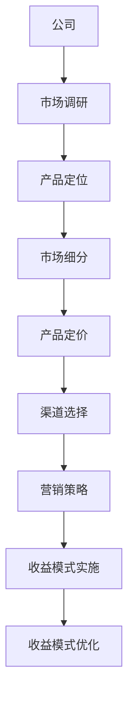
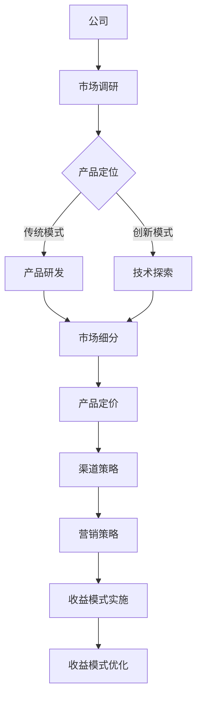

                 

# 引言

## 创业公司的盈利模式概述

在当今竞争激烈的市场环境中，创业公司能否成功不仅取决于其技术创新和产品质量，更重要的是其盈利模式的可持续性。盈利模式是创业公司获取利润的主要途径，它决定了公司如何创造、传递和捕获价值。一个良好的盈利模式不仅能为公司带来稳定的收入，还能支持公司的长期发展。

### 1.1 创业公司盈利模式的重要性

盈利模式对于创业公司至关重要。它不仅影响公司的收入和利润，还直接影响公司的运营策略和资源配置。以下是盈利模式对创业公司的重要性：

1. **资源分配**：盈利模式决定了公司如何分配资源，包括人力、资金和技术等。有效的盈利模式能帮助公司优化资源使用，提高运营效率。
2. **风险管理**：不同的盈利模式面临的风险也不同。了解并选择合适的盈利模式可以帮助公司降低风险，确保长期稳定发展。
3. **市场定位**：盈利模式影响公司的市场定位，包括目标客户、产品定位和定价策略等。合适的盈利模式能帮助公司更好地满足市场需求，提高市场竞争力。
4. **增长潜力**：良好的盈利模式能支持公司的持续增长。通过不断创新和优化盈利模式，公司可以开拓新的市场和业务领域，实现长期增长。

### 1.2 盈利模式的基本概念

盈利模式是指企业通过提供产品或服务，创造、传递和捕获价值的系统化方式。它包括以下关键要素：

1. **价值主张**：企业为客户提供的产品或服务，以及其独特的价值。
2. **价值传递**：企业如何将价值主张传递给客户，包括产品特性、客户体验和营销策略等。
3. **价值捕获**：企业如何从客户那里获取收入，包括定价策略、销售渠道和客户关系管理等。

### 1.3 常见的创业公司盈利模式类型

创业公司可以根据市场需求、产品特性和资源情况选择不同的盈利模式。以下是一些常见的创业公司盈利模式类型：

1. **订阅模式**：通过提供持续的服务或产品更新，按月或按年收取订阅费用。例如，SaaS（软件即服务）公司。
2. **广告模式**：通过展示广告来获取收入，通常适用于媒体公司、社交媒体平台等。
3. **交易佣金模式**：通过中间商角色，从交易中抽取佣金。例如，电商平台、股票交易平台等。
4. **内容付费模式**：通过提供高质量内容，向客户收取费用。例如，在线教育平台、专业咨询公司等。
5. **平台模式**：通过搭建平台，连接买家和卖家，从中抽取一定比例的佣金。例如，Airbnb、淘宝等。
6. **硬件销售模式**：通过销售硬件产品获取收入。例如，智能设备制造商、家电厂商等。

### 1.4 创业公司盈利模式的挑战与机遇

创业公司在选择和实施盈利模式时面临许多挑战，同时也存在巨大的机遇：

1. **市场变化**：市场需求和竞争状况不断变化，创业公司需要灵活调整盈利模式以适应市场变化。
2. **资源限制**：创业公司通常资源有限，需要在有限的资源下选择和优化盈利模式。
3. **技术变革**：技术的快速进步为创业公司提供了新的盈利模式，但同时也带来了新的挑战。
4. **创新能力**：创业公司需要不断创新，寻找新的盈利模式，以保持竞争优势。

在接下来的章节中，我们将详细探讨创业公司在市场调研、盈利模式探索、实践与案例等方面的具体策略和实践方法。

## 第一部分：创业公司的盈利模式探索与实践

### 第1章：创业公司的盈利模式概述

#### 1.1 盈利模式在创业公司中的重要性

在创业公司的发展过程中，盈利模式是其生存与成长的基石。盈利模式不仅仅是公司获取利润的手段，更是其商业模式的核心。一个有效的盈利模式能够为创业公司提供稳定的现金流，支持公司的运营和发展。以下是盈利模式在创业公司中重要性的一些具体体现：

1. **资源配置**：盈利模式决定了公司如何分配有限的资源，包括人力、资金、技术和市场推广等。一个合理的盈利模式能够帮助公司优化资源配置，提高运营效率，从而实现更高的利润率。
2. **市场定位**：盈利模式影响着公司的市场定位，包括目标客户群体、产品定价和市场策略等。一个明确且可持续的盈利模式能够帮助公司更好地满足市场需求，提高市场竞争力。
3. **风险控制**：不同的盈利模式面临的风险不同。例如，订阅模式虽然能带来稳定的现金流，但需要公司有良好的服务质量和持续的创新；而广告模式则可能受到市场环境和广告政策的影响。了解并选择合适的盈利模式可以帮助公司降低风险，确保长期稳定发展。
4. **增长潜力**：盈利模式决定了公司未来的增长潜力。一个创新且可持续的盈利模式能够为公司提供更多的增长机会，帮助公司在市场上占据一席之地。

#### 1.2 盈利模式的基本概念

盈利模式是指企业通过提供产品或服务，创造、传递和捕获价值的系统化方式。它包括以下几个关键要素：

1. **价值主张**：价值主张是企业为客户提供的独特价值，它可能是产品功能、服务体验或者价格优势。一个明确的价值主张能够帮助企业吸引并留住客户。
2. **价值传递**：价值传递是指企业如何将价值主张传递给客户，包括产品特性、客户体验和营销策略等。有效的价值传递能够提高客户的满意度和忠诚度。
3. **价值捕获**：价值捕获是企业如何从客户那里获取收入，包括定价策略、销售渠道和客户关系管理等。一个合理的价值捕获策略能够确保企业获得足够的利润，以支持其持续发展。

#### 1.3 常见的创业公司盈利模式类型

创业公司可以根据市场需求、产品特性和资源情况选择不同的盈利模式。以下是几种常见的创业公司盈利模式类型：

1. **订阅模式**：订阅模式是创业公司常用的一种盈利模式，通过提供持续的服务或产品更新，按月或按年收取订阅费用。这种模式适用于需要持续维护和更新的产品或服务，如SaaS公司、在线教育平台等。

2. **广告模式**：广告模式是通过展示广告来获取收入，通常适用于媒体公司、社交媒体平台等。这种模式依赖于庞大的用户基础和精准的广告定位，能够带来稳定的广告收入。

3. **交易佣金模式**：交易佣金模式是创业公司通过中间商角色，从交易中抽取佣金。例如，电商平台、股票交易平台等。这种模式通常需要强大的交易处理能力和风险管理能力。

4. **内容付费模式**：内容付费模式是通过提供高质量的内容，向客户收取费用。这种模式适用于专业咨询公司、在线课程平台等，能够为创业公司提供稳定的收入来源。

5. **平台模式**：平台模式是通过搭建平台，连接买家和卖家，从中抽取一定比例的佣金。这种模式适用于Airbnb、淘宝等平台型公司，能够实现规模效应和多元化的收入来源。

#### 1.4 创业公司盈利模式的挑战与机遇

创业公司在选择和实施盈利模式时，面临许多挑战和机遇：

1. **市场变化**：市场需求和竞争状况不断变化，创业公司需要灵活调整盈利模式以适应市场变化。例如，随着短视频平台的兴起，许多创业公司开始转向短视频内容制作和营销，以适应新的市场需求。

2. **资源限制**：创业公司通常资源有限，需要在有限的资源下选择和优化盈利模式。例如，初创公司可能无法承担大规模的广告投入，因此需要选择更高效的广告模式或利用社交媒体进行营销。

3. **技术变革**：技术的快速进步为创业公司提供了新的盈利模式，但同时也带来了新的挑战。例如，人工智能技术的发展为创业公司提供了新的应用场景，但同时也需要公司具备相应的技术能力和人才储备。

4. **创新能力**：创业公司需要不断创新，寻找新的盈利模式，以保持竞争优势。例如，共享经济的兴起为许多创业公司提供了新的商机，但同时也需要公司具备创新思维和快速响应能力。

在下一章中，我们将进一步探讨创业公司在市场调研中的策略和方法，帮助公司更好地了解市场需求，为制定有效的盈利模式提供支持。

### 第2章：创业公司市场调研

#### 2.1 市场调研的重要性

市场调研是创业公司制定盈利模式的关键步骤之一。通过市场调研，创业公司可以深入了解目标市场的需求和竞争状况，从而制定出更有效的营销策略和产品定位。以下是市场调研在创业公司中重要性的一些具体体现：

1. **了解市场需求**：市场调研可以帮助创业公司了解目标市场的实际需求和消费习惯，从而设计出更符合市场需求的产品或服务。
2. **发现商业机会**：通过市场调研，创业公司可以发现潜在的市场机会，例如未被满足的需求或竞争对手的弱点，从而制定出更具竞争力的盈利模式。
3. **评估竞争状况**：市场调研可以帮助创业公司评估竞争对手的市场份额、产品特性、定价策略等，从而制定出更有针对性的竞争策略。
4. **指导资源配置**：市场调研结果可以为创业公司提供重要的决策依据，帮助公司优化资源配置，提高运营效率。

#### 2.2 市场调研的方法

市场调研的方法多种多样，根据调研目标和资源情况，创业公司可以选择不同的调研方法。以下是几种常用的市场调研方法：

1. **问卷调查**：问卷调查是一种简单而有效的市场调研方法，通过设计问卷收集大量潜在客户或现有客户的反馈，从而了解他们的需求和期望。问卷调查可以在线上进行，也可以通过邮寄或面对面访谈的方式进行。
2. **深度访谈**：深度访谈是一种针对特定对象的深入访谈，通常用于了解消费者或专家的详细观点和需求。深度访谈需要具备一定的访谈技巧，以便从被访谈者那里获取有价值的信息。
3. **观察法**：观察法是通过观察目标市场的行为和活动来了解市场需求。这种方法适用于对市场行为和消费习惯的深入研究，例如观察购物行为、使用行为等。
4. **焦点小组**：焦点小组是一种集体访谈方法，通过召集一组相关人士进行讨论，从而了解他们对特定问题的看法和建议。焦点小组可以用于探索新的市场机会或验证调研假设。

#### 2.3 市场调研的数据分析与解读

市场调研的结果需要通过数据分析进行解读，以便创业公司能够从中提取有价值的信息，指导决策。以下是市场调研数据分析与解读的一些关键步骤：

1. **数据整理**：首先，需要对收集到的数据进行分析整理，包括去除无效数据、缺失值填补、数据清洗等。
2. **描述性统计分析**：通过描述性统计分析，可以了解数据的分布特征，例如平均值、中位数、标准差等。描述性统计分析可以帮助创业公司了解目标市场的整体状况。
3. **推理统计分析**：推理统计分析用于测试调研假设，例如通过t检验、方差分析等方法，判断市场调研结果是否显著。推理统计分析可以帮助创业公司验证市场调研结果的可靠性。
4. **可视化分析**：通过图表和可视化工具，可以更直观地展示市场调研结果，例如通过柱状图、饼图、散点图等。可视化分析可以帮助创业公司更好地理解市场数据，发现潜在的商业机会。
5. **解读与建议**：最后，需要对市场调研结果进行解读，提取有价值的信息，并给出具体的建议。例如，根据市场调研结果，创业公司可以调整产品特性、定价策略或营销策略。

在下一章中，我们将进一步探讨创业公司在产品定位与市场细分方面的策略，帮助公司更好地了解市场，制定有效的盈利模式。

### 第3章：产品定位与市场细分

#### 3.1 产品定位的步骤

产品定位是创业公司制定盈利模式的重要步骤之一，它决定了公司如何区分自己的产品或服务，以满足特定市场需求。以下是产品定位的基本步骤：

1. **确定目标市场**：首先，创业公司需要明确目标市场，包括目标客户群体的年龄、性别、收入水平、地理位置等特征。通过了解目标市场的特征，创业公司可以更好地满足市场需求。
2. **分析竞争对手**：接下来，创业公司需要分析竞争对手的产品定位和市场策略。了解竞争对手的优势和劣势，可以帮助公司找到市场空缺，制定出更具竞争力的产品定位。
3. **确定独特卖点**：独特卖点（USP）是指公司产品或服务的独特特点，能够区别于竞争对手。创业公司需要明确自己的独特卖点，并将其作为产品定位的核心。
4. **制定产品定位策略**：基于目标市场分析和竞争对手分析，创业公司需要制定出具体的产品定位策略。例如，可以选择差异化定位，通过提供独特的功能或服务来满足特定需求；或者选择集中定位，专注于某一细分市场，提供高质量的产品或服务。
5. **验证产品定位**：最后，创业公司需要对产品定位进行验证，可以通过市场调研、用户反馈等方式，了解目标市场对产品定位的接受程度，并根据反馈进行调整。

#### 3.2 市场细分的策略

市场细分是将整个市场划分为若干个具有相似需求特征的子市场，以便创业公司能够更精准地满足这些需求。以下是几种常用的市场细分策略：

1. **地理细分**：地理细分是根据消费者所在的地理位置来划分市场。例如，创业公司可以根据不同地区消费者的需求特点，制定相应的产品或服务策略。
2. **人口细分**：人口细分是根据消费者的年龄、性别、收入水平、教育程度等人口统计特征来划分市场。例如，针对年轻消费者，创业公司可以设计更时尚、潮流的产品或服务。
3. **心理细分**：心理细分是根据消费者的心理特征和行为习惯来划分市场。例如，针对追求高品质生活的消费者，创业公司可以提供高端、精致的产品或服务。
4. **行为细分**：行为细分是根据消费者的购买行为、使用习惯等来划分市场。例如，针对高频次购买的消费者，创业公司可以提供优惠、积分等激励机制。
5. **利益细分**：利益细分是根据消费者对产品或服务的需求和利益点来划分市场。例如，针对对价格敏感的消费者，创业公司可以提供性价比高的产品或服务。

#### 3.3 定位与市场细分的关系

产品定位与市场细分密切相关，两者相辅相成，共同决定了创业公司的市场策略：

1. **产品定位依赖于市场细分**：通过市场细分，创业公司可以更清晰地了解不同市场群体的需求和特征，从而制定出更精准的产品定位。
2. **市场细分服务于产品定位**：市场细分可以帮助创业公司找到目标市场，为产品定位提供依据。例如，通过地理细分，创业公司可以确定哪些地区是主要市场，从而针对性地制定产品定位策略。
3. **产品定位指导市场细分**：在产品定位过程中，创业公司需要根据市场细分的结果，选择合适的细分市场，以确保产品或服务的市场定位准确有效。
4. **动态调整**：创业公司需要根据市场变化和竞争状况，动态调整产品定位和市场细分策略。例如，在新兴市场出现时，创业公司需要快速调整市场细分策略，以满足新的市场需求。

在下一章中，我们将探讨创业公司在产品定价策略方面的策略和方法，帮助公司制定合理的定价策略，以实现盈利目标。

### 第4章：产品定价策略

#### 4.1 产品定价的目标

产品定价是创业公司盈利模式中的重要环节，合理的定价策略能够直接影响公司的盈利水平和市场竞争力。以下是产品定价的主要目标：

1. **实现盈利**：产品定价的首要目标是实现盈利，即确保产品或服务的价格能够覆盖成本，并产生足够的利润。公司需要通过定价策略，确保产品或服务的价格在市场中具有竞争力，同时能够为企业带来可持续的现金流。
2. **市场定位**：定价策略应与公司的市场定位相匹配。例如，如果公司定位为高端市场，定价策略应反映这一高端形象，通过高价格树立品牌的高端形象；反之，如果公司定位为大众市场，则应采用更亲民的价格策略，以吸引更多的消费者。
3. **市场份额**：合理的定价策略有助于公司在市场中占据一定的市场份额。通过价格优势，公司可以吸引更多的消费者，提高市场占有率，从而增强市场竞争力。
4. **品牌价值**：定价策略还应考虑品牌价值。对于具有较高品牌知名度和美誉度的产品，可以采用相对较高的价格，以体现品牌的高端形象和独特价值。
5. **成本控制**：在制定定价策略时，公司需要考虑成本因素。通过合理的成本控制，公司可以确保产品价格具有竞争力，同时避免因成本过高而影响盈利。

#### 4.2 定价策略的类型

创业公司可以根据市场需求、产品特性和竞争状况选择不同的定价策略。以下是几种常见的定价策略类型：

1. **成本导向定价**：成本导向定价是基于产品的成本来制定价格，包括直接成本和间接成本。这种定价策略的优缺点如下：

   - **优点**：简单易行，能够确保产品价格覆盖成本，实现盈利。
   - **缺点**：价格可能缺乏竞争力，无法反映市场需求和品牌价值。

2. **市场导向定价**：市场导向定价是基于市场需求和竞争状况来制定价格，包括感知价值定价和竞争对手定价。这种定价策略的优缺点如下：

   - **感知价值定价**：感知价值定价是根据消费者对产品或服务的感知价值来制定价格。这种定价策略的优缺点如下：

     - **优点**：能够更好地满足消费者需求，提高产品竞争力。
     - **缺点**：需要深入了解消费者心理和市场需求，成本较高。

   - **竞争对手定价**：竞争对手定价是基于竞争对手的产品价格来制定价格。这种定价策略的优缺点如下：

     - **优点**：能够快速响应市场变化，提高市场竞争力。
     - **缺点**：可能导致价格战，影响公司盈利。

3. **需求导向定价**：需求导向定价是根据不同市场需求制定不同的价格，包括折扣定价和捆绑定价。这种定价策略的优缺点如下：

   - **折扣定价**：折扣定价是针对不同需求的消费者提供不同的价格优惠。这种定价策略的优缺点如下：

     - **优点**：能够提高产品竞争力，吸引更多消费者。
     - **缺点**：可能导致利润率下降，需要合理控制折扣幅度。

   - **捆绑定价**：捆绑定价是将多个产品或服务捆绑在一起，以较低的总价销售。这种定价策略的优缺点如下：

     - **优点**：能够提高产品销量，增加消费者满意度。
     - **缺点**：可能导致单个产品价格下降，影响利润。

4. **价值导向定价**：价值导向定价是基于产品或服务的价值来制定价格，包括高端定价和价值定价。这种定价策略的优缺点如下：

   - **高端定价**：高端定价是将产品定位为高端市场，以较高的价格销售。这种定价策略的优缺点如下：

     - **优点**：能够树立品牌的高端形象，提高品牌价值。
     - **缺点**：需要具有足够的品牌知名度和美誉度，否则可能导致销售困难。

   - **价值定价**：价值定价是基于产品或服务的实际价值来制定价格，通常价格较低但具有较高的性价比。这种定价策略的优缺点如下：

     - **优点**：能够吸引更多的消费者，提高市场占有率。
     - **缺点**：需要确保产品或服务的价值得到消费者的认可。

#### 4.3 定价策略的制定与调整

制定和调整定价策略是一个动态的过程，创业公司需要根据市场变化、竞争状况和消费者需求进行调整。以下是制定和调整定价策略的几个关键步骤：

1. **市场调研**：在制定定价策略之前，公司需要进行充分的市场调研，了解目标市场的需求和竞争状况。通过市场调研，公司可以获取有关消费者心理、产品价值感知和竞争对手定价策略的重要信息。

2. **成本分析**：在确定定价策略时，公司需要对产品的成本进行详细分析，包括直接成本、间接成本和可变成本等。通过成本分析，公司可以确定最低价格，确保产品价格能够覆盖成本。

3. **制定初步定价策略**：基于市场调研和成本分析的结果，公司可以制定初步的定价策略。例如，选择成本导向定价、市场导向定价或需求导向定价等。

4. **评估定价策略**：制定初步定价策略后，公司需要对定价策略进行评估，包括评估定价策略是否符合市场定位、是否能实现盈利目标等。如果评估结果显示定价策略存在问题，公司需要及时进行调整。

5. **动态调整**：在实施定价策略的过程中，公司需要根据市场变化、竞争状况和消费者反馈进行动态调整。例如，如果市场需求增加，公司可以适当提高价格；如果竞争对手推出新产品，公司需要重新评估定价策略。

6. **跟踪与反馈**：公司需要定期跟踪定价策略的实施效果，通过销售数据、市场份额和消费者反馈等指标进行评估。如果定价策略未能达到预期效果，公司需要及时调整，以保持竞争力。

通过以上步骤，创业公司可以制定出合理且有效的定价策略，实现盈利目标并提高市场竞争力。

在下一章中，我们将探讨创业公司在渠道策略方面的策略和方法，帮助公司选择合适的销售渠道，提高产品销量和品牌知名度。

### 第5章：渠道策略

#### 5.1 渠道策略的类型

创业公司选择合适的销售渠道是实现盈利目标的关键。销售渠道是指产品或服务从公司传递到消费者手中的路径。根据不同的市场和产品特性，创业公司可以选择不同的渠道策略。以下是几种常见的渠道策略类型：

1. **直销渠道**：直销渠道是指公司直接将产品或服务销售给消费者，如通过公司网站、电商平台或线下门店等。直销渠道的优点包括：

   - **控制力强**：公司能够直接控制销售过程，确保产品质量和客户体验。
   - **信息反馈快**：公司能够快速获取客户反馈，及时调整产品和服务。
   - **高利润率**：由于减少了中间环节，公司可以获得更高的利润率。

   但缺点是直销渠道的扩展速度相对较慢，需要公司具备较强的资源和管理能力。

2. **分销渠道**：分销渠道是指通过代理商、经销商或零售商等中间环节将产品或服务销售给消费者。根据分销环节的不同，分销渠道可以分为以下几种：

   - **一级分销渠道**：产品从制造商直接销售给代理商或经销商，代理商或经销商再销售给零售商，最终销售给消费者。
   - **二级分销渠道**：产品从制造商销售给批发商，批发商再销售给零售商，最终销售给消费者。
   - **三级分销渠道**：产品从制造商销售给分销商，分销商再销售给批发商，批发商再销售给零售商，最终销售给消费者。

   分销渠道的优点包括：

   - **扩展速度快**：通过中间环节，公司能够快速扩大市场份额。
   - **低成本**：公司无需自行搭建销售网络，降低了销售成本。

   但缺点是公司对销售过程和客户体验的控制力较弱，且利润率可能较低。

3. **电商渠道**：电商渠道是通过在线平台进行产品或服务的销售，包括自营电商平台和第三方电商平台（如淘宝、京东等）。电商渠道的优点包括：

   - **覆盖面广**：通过互联网，公司能够覆盖广泛的消费者群体，不受地域限制。
   - **灵活性高**：公司可以灵活调整产品展示和促销策略，快速响应市场变化。
   - **低成本**：相比传统分销渠道，电商渠道的运营成本较低。

   但缺点是电商渠道的竞争激烈，需要公司具备较强的运营能力和营销策略。

4. **直销与分销结合**：许多创业公司将直销与分销渠道相结合，以实现最佳的销售效果。例如，公司可以通过直销渠道开拓高端市场，同时通过分销渠道覆盖大众市场。这种策略的优点包括：

   - **覆盖全面**：结合直销和分销渠道，公司能够覆盖更多的消费者群体。
   - **资源优化**：通过合理分配资源，公司可以更高效地利用现有资源。
   - **风险分散**：分散的销售渠道有助于降低市场风险。

   但缺点是管理复杂，需要公司具备较强的渠道管理能力。

#### 5.2 选择合适的渠道

选择合适的渠道是创业公司成功的关键。以下是选择合适渠道的几个关键因素：

1. **市场需求**：首先，公司需要了解目标市场的需求和消费习惯。例如，如果目标市场主要是年轻人，那么电商渠道可能更合适；如果目标市场对产品质量要求较高，直销渠道可能更具优势。

2. **产品特性**：不同产品的特性可能影响渠道选择。例如，对高科技产品，直销渠道可能更合适，因为消费者更关注产品质量和售后服务；对日用品，分销渠道可能更有效，因为消费者更关注价格和便捷性。

3. **竞争状况**：公司需要分析竞争对手的渠道策略，以确定自己的渠道选择。如果竞争对手主要采用直销渠道，公司可能需要考虑采用分销渠道，以避免直接竞争。

4. **资源能力**：公司需要根据自身的资源能力和管理能力选择渠道。例如，如果公司资源有限，可能需要选择运营成本较低的电商渠道；如果公司具备较强的管理能力，可以考虑搭建直销渠道。

5. **目标客户**：公司需要了解目标客户的需求和偏好，以选择最符合客户需求的渠道。例如，如果目标客户主要是高端消费者，公司可能需要选择高端的直销渠道；如果目标客户主要是大众消费者，公司可能需要选择大众化的分销渠道。

6. **成本效益**：公司需要评估不同渠道的成本和效益，选择成本效益最高的渠道。例如，如果直销渠道的成本过高，公司可能需要考虑采用分销渠道。

#### 5.3 渠道管理与维护

选择合适的渠道只是第一步，创业公司还需要进行有效的渠道管理和维护，以确保渠道的长期稳定运行。以下是几个关键点：

1. **渠道管理团队**：公司需要建立专业的渠道管理团队，负责渠道的日常运营和管理工作。团队需要具备丰富的渠道管理经验和专业知识，以确保渠道的高效运行。

2. **渠道合作伙伴关系**：公司需要与渠道合作伙伴建立良好的合作关系，确保渠道的顺畅运行。这包括定期沟通、共同制定营销策略、分享市场信息等。

3. **渠道激励**：公司需要制定合理的渠道激励政策，以激励渠道合作伙伴积极推广产品。例如，提供销售奖金、返利、广告支持等。

4. **渠道监控**：公司需要定期监控渠道的运行情况，包括销售数据、客户反馈、市场变化等。通过监控，公司可以及时发现并解决问题，确保渠道的稳定运行。

5. **渠道调整与优化**：根据市场变化和渠道运行情况，公司需要及时调整和优化渠道策略。例如，如果某个渠道表现不佳，公司可能需要考虑更换渠道或调整营销策略。

6. **渠道培训**：公司需要定期对渠道合作伙伴进行培训，提高他们的专业知识和销售技能。通过培训，渠道合作伙伴可以更好地理解公司产品，提高销售效率。

通过以上渠道管理和维护措施，创业公司可以确保渠道的长期稳定运行，提高产品销量和品牌知名度。在下一章中，我们将探讨创业公司在营销策略方面的策略和方法，帮助公司制定有效的营销策略，提升品牌影响力和市场份额。

### 第6章：营销策略

#### 6.1 营销策略的类型

营销策略是创业公司获取客户、提高品牌知名度和扩大市场份额的关键手段。根据不同的目标市场、产品特性和竞争状况，创业公司可以选择不同的营销策略。以下是几种常见的营销策略类型：

1. **产品导向策略**：产品导向策略是将产品或服务的质量放在首位，通过优质的产品吸引消费者。这种策略通常适用于技术创新型企业，如高科技公司。产品导向策略的优点包括：

   - **产品竞争力强**：优质的产品能够赢得消费者的信任和忠诚，提高市场份额。
   - **品牌形象良好**：高质量的产品能够树立良好的品牌形象，增强消费者对品牌的认可。

   但缺点是产品导向策略可能导致营销投入较高，成本压力较大。

2. **市场导向策略**：市场导向策略是针对市场需求进行营销，通过满足消费者需求来获取市场份额。这种策略通常适用于消费者需求多样、竞争激烈的市场。市场导向策略的优点包括：

   - **需求满足度高**：根据市场需求进行营销，能够更好地满足消费者需求，提高客户满意度。
   - **市场适应性强**：市场导向策略能够快速响应市场变化，灵活调整营销策略。

   但缺点是市场竞争激烈，可能导致利润率较低。

3. **品牌导向策略**：品牌导向策略是通过塑造品牌形象来吸引消费者，强调品牌的独特价值和品牌故事。这种策略通常适用于高端市场和知名品牌。品牌导向策略的优点包括：

   - **品牌忠诚度高**：通过建立品牌形象，消费者更容易产生品牌忠诚度，提高复购率。
   - **品牌溢价高**：品牌导向策略能够提高产品的溢价，增加利润空间。

   但缺点是品牌建设需要长期投入，短期内可能难以见到明显效果。

4. **竞争导向策略**：竞争导向策略是针对竞争对手的市场策略进行营销，通过差异化和优势策略来争夺市场份额。这种策略通常适用于竞争激烈的市场环境。竞争导向策略的优点包括：

   - **竞争力强**：通过分析竞争对手的弱点，制定针对性的营销策略，提高市场份额。
   - **市场反应快**：竞争导向策略能够快速应对市场变化，抢占市场先机。

   但缺点是可能引发价格战，影响利润率。

5. **关系导向策略**：关系导向策略是通过建立与消费者、合作伙伴和员工的良好关系，提升品牌忠诚度和企业形象。这种策略通常适用于长期发展的市场。关系导向策略的优点包括：

   - **客户关系稳定**：通过建立良好的客户关系，提高客户满意度和忠诚度，减少客户流失。
   - **企业形象良好**：关系导向策略能够树立积极的企业形象，增强社会责任感。

   但缺点是关系建立和维护需要长期投入，成本较高。

6. **数字营销策略**：数字营销策略是利用互联网和数字技术进行营销，包括搜索引擎优化、社交媒体营销、电子邮件营销等。这种策略通常适用于互联网企业和数字化转型企业。数字营销策略的优点包括：

   - **覆盖面广**：数字营销能够覆盖广泛的消费者群体，不受地域限制。
   - **成本低**：相比传统营销手段，数字营销成本较低，投资回报率高。

   但缺点是数字营销效果难以量化，需要持续优化和调整。

#### 6.2 制定营销策略的步骤

制定有效的营销策略是创业公司成功的关键。以下是制定营销策略的几个关键步骤：

1. **市场调研**：在制定营销策略之前，公司需要进行充分的市场调研，了解目标市场的需求和竞争状况。市场调研可以包括问卷调查、深度访谈、观察法等，获取有关消费者心理、行为和需求的重要信息。

2. **目标设定**：根据市场调研结果，公司需要明确营销目标，包括提高品牌知名度、增加市场份额、提升客户满意度等。明确的目标有助于公司制定具体的营销策略和行动计划。

3. **策略选择**：在明确营销目标后，公司需要根据目标市场和产品特性选择合适的营销策略。例如，如果目标是提高品牌知名度，公司可以采用品牌导向策略；如果目标是增加市场份额，公司可以采用竞争导向策略。

4. **策略制定**：在策略选择的基础上，公司需要制定具体的营销策略和行动计划。例如，制定品牌推广计划、市场活动方案、广告投放策略等。制定策略时需要考虑目标受众、传播渠道、营销手段和预算等因素。

5. **策略实施**：在制定好营销策略后，公司需要开始实施，包括执行具体的营销活动、监控营销效果和调整策略。实施过程中需要定期评估营销效果，确保策略能够实现既定目标。

6. **效果评估**：在营销策略实施结束后，公司需要对营销效果进行评估，包括市场份额、品牌知名度、销售额等关键指标。通过效果评估，公司可以了解营销策略的有效性，为未来的营销策略提供依据。

#### 6.3 营销策略的实施与评估

营销策略的有效实施和评估是创业公司成功的关键。以下是营销策略实施与评估的几个关键步骤：

1. **制定详细计划**：在实施营销策略前，公司需要制定详细的实施计划，包括活动时间表、任务分配、资源调配等。详细计划有助于确保营销策略的顺利执行。

2. **执行与监控**：在实施过程中，公司需要严格按照计划执行，同时进行实时监控。通过监控，公司可以及时发现并解决问题，确保营销策略的顺利执行。

3. **效果评估**：在营销策略实施结束后，公司需要对营销效果进行评估，包括市场份额、品牌知名度、销售额等关键指标。通过效果评估，公司可以了解营销策略的有效性，为未来的营销策略提供依据。

4. **调整与优化**：根据效果评估结果，公司需要对营销策略进行调整和优化。例如，如果营销效果不佳，公司可以重新调整目标、策略和资源分配，以确保营销策略的有效性。

5. **反馈与总结**：在营销策略实施结束后，公司需要与团队成员进行反馈和总结，分享经验和教训，为未来的营销策略提供参考。

通过以上步骤，创业公司可以确保营销策略的有效实施和持续优化，实现长期的市场竞争力和品牌影响力。在下一章中，我们将探讨创业公司在收益模式创新方面的策略和方法，帮助公司实现持续增长。

### 第7章：收益模式创新

#### 7.1 创新收益模式的重要性

在竞争激烈的市场环境中，创新收益模式成为创业公司持续增长和脱颖而出的关键因素。创新收益模式不仅能够为公司带来新的收入来源，还能提高公司的市场竞争力，实现业务的多元化发展。以下是创新收益模式在创业公司中的重要性：

1. **增强竞争力**：通过创新收益模式，创业公司能够提供独特的产品或服务，满足市场需求，从而在激烈的市场竞争中脱颖而出。例如，通过推出新的订阅服务、增值服务或跨界合作，公司可以吸引更多客户，提高市场份额。
2. **拓展业务领域**：创新收益模式有助于公司拓展新的业务领域，实现业务的多元化。通过开发新的产品或服务，公司可以进入新的市场，创造新的收入来源。例如，一家专注于软件开发的公司可以通过推出硬件产品或提供咨询服务，拓展业务范围。
3. **提升盈利能力**：创新收益模式可以提升公司的盈利能力，通过多样化的收入来源，减少对单一业务的依赖，从而降低经营风险。例如，通过推出新产品或服务，公司可以增加收入，提高利润率。
4. **增强客户粘性**：创新收益模式能够提高客户的粘性，通过提供增值服务或个性化的解决方案，增强客户对公司的忠诚度。例如，通过推出会员制服务，公司可以为客户提供更多福利，提高客户忠诚度。
5. **推动技术创新**：创新收益模式往往伴随着技术创新，通过不断探索新技术和新模式，公司可以保持技术领先地位，推动业务的持续创新和发展。

#### 7.2 创新收益模式的策略

创业公司在创新收益模式时，需要结合市场需求、技术趋势和自身优势，制定合理的创新策略。以下是几种常见的创新收益模式策略：

1. **多元化产品策略**：通过推出多样化的产品或服务，满足不同客户群体的需求，实现收入多元化。例如，一家互联网公司可以同时提供软件产品、硬件产品和增值服务，通过多元化的产品组合，提高收入来源的稳定性。
2. **增值服务策略**：通过提供增值服务，增加产品或服务的附加值，提高客户满意度和忠诚度。例如，一家电商平台可以通过提供物流、售后和个性化推荐等增值服务，提高客户的购买体验，增加收入。
3. **跨界合作策略**：通过跨界合作，与不同行业的公司共同开发新的产品或服务，实现资源共享和优势互补。例如，一家科技公司可以与消费品公司合作，推出智能家居产品，通过跨界合作，拓展新的市场。
4. **订阅模式策略**：通过订阅模式，提供持续的服务或产品更新，按月或按年收取订阅费用。例如，一家在线教育公司可以通过提供课程订阅服务，实现稳定的现金流。
5. **平台模式策略**：通过搭建平台，连接买家和卖家，从中抽取一定比例的佣金。例如，一家电商平台可以通过搭建平台，连接卖家和消费者，从中抽取佣金，实现收入多元化。
6. **数字化服务策略**：通过数字化服务，提供在线咨询、远程诊断、数字化工具等服务，降低成本，提高效率。例如，一家医疗服务公司可以通过提供在线咨询和远程诊断服务，拓展新的服务领域。

#### 7.3 创新收益模式的风险与挑战

虽然创新收益模式具有显著的优势，但创业公司在实施过程中也面临诸多风险和挑战：

1. **市场需求不确定**：创新收益模式往往面临市场需求的不确定性，客户是否接受新的产品或服务，存在一定风险。因此，创业公司需要通过市场调研和用户反馈，不断调整和优化创新收益模式。
2. **技术实现难度**：创新收益模式通常需要依赖新技术，技术实现的难度较高。例如，开发一个新的平台或推出一项新的服务，需要投入大量的人力、物力和财力。因此，创业公司需要具备一定的技术能力和资源储备。
3. **成本压力**：创新收益模式往往需要较高的初始投入，包括研发、市场推广和运营等成本。在初期，创新收益模式可能难以实现盈利，创业公司需要承受一定的财务压力。
4. **市场竞争激烈**：创新收益模式往往面临激烈的市场竞争，新模式的推广和市场份额的争夺需要投入大量的资源和精力。创业公司需要制定有效的竞争策略，确保在市场竞争中脱颖而出。
5. **法律法规风险**：创新收益模式可能涉及新的法律法规和监管要求，如数据隐私、网络安全等。创业公司需要遵守相关法律法规，降低法律风险。

综上所述，创新收益模式对于创业公司具有重要意义，但创业公司在实施过程中需要面对诸多风险和挑战。通过制定合理的创新策略，积极应对风险和挑战，创业公司可以实现收益模式的创新，实现持续增长。

### 第8章：创业公司盈利模式案例解析

#### 8.1 案例一：互联网创业公司盈利模式分析

**案例背景**：某互联网创业公司成立于2010年，专注于提供在线教育服务，主要面向职场人士和学生。公司通过自主研发的在线学习平台，提供各种专业课程和培训资源。

**盈利模式**：该公司的盈利模式主要包括以下几种：

1. **课程订阅模式**：公司通过提供按月或按年订阅的课程服务，向用户收取订阅费用。这种模式为公司提供了稳定的现金流。
2. **广告模式**：在平台上展示广告，向广告主收取广告费用。公司通过优化广告展示策略，提高广告投放效果，从而增加广告收入。
3. **课程销售模式**：公司直接销售专业课程，包括企业内训和个人定制课程。这种模式为公司提供了额外的收入来源。
4. **电商平台模式**：公司旗下的电商平台，销售相关学习资料和电子产品。通过电商平台，公司实现了跨界收入。

**分析**：

1. **优势**：课程订阅模式和广告模式为公司提供了稳定的收入来源。此外，课程销售和电商平台模式为公司拓展了业务范围，实现了收入多元化。
2. **挑战**：在线教育市场竞争激烈，用户获取成本较高。同时，广告模式的收入稳定性较差，受广告政策和技术变化的影响较大。
3. **创新点**：公司通过平台模式实现了跨界收入，提高了盈利能力。同时，公司通过不断优化课程质量和用户服务，提高了用户满意度和忠诚度。

**结论**：该互联网创业公司通过多元化的盈利模式，实现了稳定的发展和持续的收入增长。在激烈的市场竞争中，公司需要继续优化盈利模式，提高用户满意度，以保持竞争优势。

#### 8.2 案例二：传统行业创业公司盈利模式分析

**案例背景**：某传统行业创业公司成立于2015年，专注于提供智能家居解决方案，包括智能家电、智能安防和智能照明等。

**盈利模式**：该公司的盈利模式主要包括以下几种：

1. **硬件销售模式**：公司通过销售智能家电、智能安防设备等硬件产品，获取销售收入。
2. **订阅模式**：公司提供智能家居平台服务，用户需按月或按年支付订阅费用。这种模式为公司提供了稳定的现金流。
3. **增值服务模式**：公司通过提供增值服务，如远程监控、智能家居顾问等，增加产品附加值。
4. **合作模式**：公司与家居装修公司、房地产开发商等合作，推广智能家居解决方案。通过合作模式，公司扩大了市场占有率。

**分析**：

1. **优势**：硬件销售模式为公司提供了稳定的销售收入。订阅模式和增值服务模式为公司的收入来源提供了多样性。合作模式有助于公司扩大市场份额。
2. **挑战**：智能家居市场竞争激烈，硬件成本较高。同时，用户对智能家居产品的接受度存在一定差异，需要公司不断优化产品和服务。
3. **创新点**：公司通过订阅模式和增值服务模式，实现了收入的持续增长。合作模式为公司开拓了新的市场渠道，提高了品牌知名度。

**结论**：该传统行业创业公司通过创新的盈利模式，成功实现了业务的增长和收入的多元化。在未来的发展中，公司需要继续优化产品和服务，提高用户体验，以保持市场竞争力。

#### 8.3 案例三：新兴行业创业公司盈利模式分析

**案例背景**：某新兴行业创业公司成立于2018年，专注于提供区块链技术解决方案，包括区块链底层技术、智能合约开发和区块链应用开发等。

**盈利模式**：该公司的盈利模式主要包括以下几种：

1. **技术服务模式**：公司提供区块链技术咨询服务，为客户设计和开发定制化的区块链解决方案。通过技术服务模式，公司获取服务收入。
2. **软件开发模式**：公司通过开发区块链应用程序，向用户收费。软件开发模式为公司提供了持续的收入来源。
3. **平台模式**：公司搭建区块链平台，连接开发者、企业和用户，提供区块链技术支持和服务。平台模式为公司带来了交易佣金和广告收入。
4. **投资模式**：公司参与区块链项目的投资，通过投资回报获得收益。

**分析**：

1. **优势**：技术服务模式和软件开发模式为公司提供了稳定的服务收入。平台模式为公司带来了多样化的收入来源，提高了盈利能力。投资模式为公司提供了额外的收益渠道。
2. **挑战**：区块链技术处于快速发展阶段，技术标准和法律法规不明确，存在一定的不确定性。同时，区块链技术的应用场景有限，需要公司不断拓展新的应用领域。
3. **创新点**：公司通过平台模式，搭建了区块链生态系统，促进了区块链技术的应用和推广。投资模式为公司带来了丰厚的回报，提高了公司的整体盈利能力。

**结论**：该新兴行业创业公司通过多元化的盈利模式，成功实现了业务的发展和收入的增长。在未来的发展中，公司需要继续关注区块链技术的发展和应用，提高技术水平和创新能力，以保持竞争优势。

### 第9章：创业公司盈利模式的实施与优化

#### 9.1 盈利模式实施的步骤

创业公司在制定盈利模式后，需要通过一系列步骤将其付诸实践，以确保盈利模式的成功实施。以下是盈利模式实施的几个关键步骤：

1. **计划制定**：首先，创业公司需要制定详细的实施计划，包括实施时间表、任务分配、资源需求和预算等。实施计划应明确每个阶段的目标和关键节点，以确保项目按计划推进。
2. **团队组建**：根据实施计划，创业公司需要组建专业的团队，负责不同阶段的实施工作。团队成员应具备相应的专业技能和经验，以确保项目的顺利实施。
3. **试点运行**：在全面推广之前，创业公司可以选择一小部分市场进行试点运行，以验证盈利模式的可行性和效果。试点运行有助于发现潜在问题和改进空间，为全面推广提供依据。
4. **全面推广**：在试点运行取得成功后，创业公司可以全面推广盈利模式。在推广过程中，公司需要密切关注市场反馈，及时调整策略和方案。
5. **监控与评估**：在实施过程中，创业公司需要建立有效的监控和评估机制，定期跟踪盈利模式的实施效果。通过监控和评估，公司可以及时发现问题和改进空间，确保盈利模式的有效运行。

#### 9.2 盈利模式优化的策略

盈利模式不是一成不变的，创业公司需要根据市场变化、竞争环境和客户需求，不断优化和调整盈利模式。以下是几种常见的盈利模式优化策略：

1. **市场调研**：通过市场调研，创业公司可以了解市场需求、竞争状况和消费者行为，为优化盈利模式提供数据支持。市场调研应涵盖目标市场、竞争对手和潜在客户等多个方面。
2. **客户反馈**：创业公司应积极收集客户反馈，了解他们对产品或服务的满意度、期望和建议。客户反馈是优化盈利模式的重要参考，有助于公司改进产品和服务，提高客户满意度。
3. **数据分析**：通过对销售数据、市场份额和利润率等关键指标进行分析，创业公司可以识别盈利模式中的问题和改进点。数据分析有助于公司制定针对性的优化策略。
4. **技术创新**：通过技术创新，创业公司可以开发新的产品或服务，提高产品附加值，拓展新的收入来源。技术创新是优化盈利模式的重要手段，有助于公司在市场中保持竞争优势。
5. **合作与联盟**：通过与其他企业建立合作关系或联盟，创业公司可以共享资源和优势，共同开发新的业务领域和市场。合作与联盟有助于公司拓展市场，实现盈利模式的多元化。
6. **流程优化**：通过对内部流程进行优化，创业公司可以提高运营效率，降低成本，提高盈利能力。流程优化应涵盖生产、销售、运营等多个环节。

#### 9.3 盈利模式调整的方法

创业公司在实施盈利模式过程中，可能会面临市场环境变化、技术进步或竞争加剧等挑战，需要根据实际情况进行调整。以下是几种常见的盈利模式调整方法：

1. **战略调整**：当市场环境发生变化时，创业公司需要调整战略，以适应新的市场环境。战略调整可能涉及业务方向、目标市场、产品定位等方面的变化。
2. **产品调整**：当市场需求发生变化或竞争加剧时，创业公司需要调整产品策略，优化产品组合，提高产品竞争力。产品调整可能包括改进产品特性、增加产品功能、推出新产品等。
3. **定价调整**：根据市场需求和竞争状况，创业公司可以适当调整产品或服务的价格。定价调整可能包括提高或降低价格、推出价格优惠活动等。
4. **渠道调整**：当市场环境发生变化时，创业公司需要调整销售渠道策略，以提高市场覆盖率。渠道调整可能包括增加或减少销售渠道、优化渠道管理策略等。
5. **营销调整**：创业公司需要根据市场变化和消费者需求，调整营销策略和推广方式。营销调整可能包括优化广告投放、调整推广渠道、增加营销投入等。
6. **合作调整**：当市场环境发生变化时，创业公司需要调整与合作企业或联盟的关系，以适应新的市场环境。合作调整可能包括重新协商合作协议、寻找新的合作伙伴等。

通过以上步骤和方法，创业公司可以确保盈利模式的有效实施和持续优化，实现长期的发展和盈利。

### 第10章：创业公司盈利模式的可持续性

#### 10.1 盈利模式可持续性的评估

创业公司需要确保其盈利模式的可持续性，以便在竞争激烈的市场环境中持续发展。评估盈利模式的可持续性是创业公司的一项重要任务。以下是评估盈利模式可持续性的几个关键方面：

1. **市场适应性**：创业公司需要评估盈利模式是否能够适应市场的变化。市场适应性包括对市场需求、竞争环境和技术进步的快速响应能力。创业公司可以通过定期进行市场调研和分析，了解市场趋势和变化，及时调整盈利模式。

2. **成本效益**：盈利模式的可持续性还取决于成本效益。创业公司需要评估盈利模式在实现收益的同时，是否能够有效控制成本。通过优化生产和运营流程，提高资源利用效率，降低成本，公司可以确保盈利模式的长期可持续性。

3. **创新能力**：创新能力是创业公司保持竞争优势的关键。创业公司需要评估盈利模式是否能够支持持续的创新能力。这包括对新技术、新产品和新服务的持续投资，以及对员工和团队的持续培养和激励。

4. **风险抵御能力**：创业公司需要评估盈利模式在面对市场风险和不确定性时的抵御能力。这包括对市场波动、政策变化和供应链中断等风险的应对策略。创业公司可以通过多元化收入来源和风险分散策略，提高盈利模式的抗风险能力。

5. **客户忠诚度**：客户忠诚度是盈利模式可持续性的重要指标。创业公司需要评估盈利模式是否能够提高客户满意度和忠诚度。通过提供高质量的产品和服务，建立良好的客户关系，创业公司可以增加客户的黏性，从而确保收入的稳定增长。

#### 10.2 盈利模式可持续性的策略

为了确保盈利模式的可持续性，创业公司可以采取以下策略：

1. **市场细分与定位**：通过深入分析市场和客户需求，创业公司可以找到具有高增长潜力的细分市场，并进行精准定位。这有助于公司专注于具有高价值客户的领域，提高市场适应性和客户忠诚度。

2. **技术创新**：创业公司应持续关注新技术的发展，并将其应用到产品和服务中。技术创新不仅可以提高产品竞争力，还可以为公司带来新的收入来源和盈利模式。

3. **成本控制**：创业公司需要不断优化成本结构，提高资源利用效率。通过采用先进的制造技术、供应链管理方法和运营优化策略，公司可以降低成本，提高盈利能力。

4. **战略合作**：通过与其他企业建立战略合作关系，创业公司可以共享资源、技术和市场渠道，降低运营风险。战略合作还可以为公司带来新的商业模式和创新机会。

5. **品牌建设**：创业公司应注重品牌建设和品牌推广，提高品牌知名度和美誉度。强大的品牌可以增加客户信任和忠诚度，从而提高市场份额和盈利能力。

6. **社会责任**：创业公司应积极履行社会责任，提高企业声誉。通过参与公益事业、环境保护和员工福利等举措，公司可以建立良好的社会形象，增强客户的信任和忠诚度。

#### 10.3 盈利模式可持续性的实践案例

以下是一些创业公司通过实施可持续盈利模式的成功案例：

1. **案例一：某环保科技公司**
   - **背景**：该公司专注于提供环保解决方案，包括废水处理、废气治理和固废处理等。
   - **策略**：公司通过技术创新，提供高效、环保的解决方案，赢得了客户的信任。同时，公司积极参与环保公益活动，提高品牌知名度和社会影响力。
   - **效果**：公司的盈利模式具有高度可持续性，市场份额持续增长，收入稳定增加。

2. **案例二：某健康食品公司**
   - **背景**：该公司专注于提供天然、健康的食品产品，包括有机蔬菜、水果和谷物等。
   - **策略**：公司通过市场细分，专注于高收入、高需求的客户群体。同时，公司采用先进的种植和加工技术，确保产品的品质和安全。
   - **效果**：公司的盈利模式具有高度可持续性，客户忠诚度较高，市场份额不断扩大。

3. **案例三：某互联网创业公司**
   - **背景**：该公司专注于提供在线教育和培训服务，包括在线课程、直播教学和个性化辅导等。
   - **策略**：公司通过技术创新，提供优质的教育内容和服务体验。同时，公司通过市场调研，不断调整课程内容和培训方式，以满足客户需求。
   - **效果**：公司的盈利模式具有高度可持续性，用户数量持续增长，收入稳定增加。

通过这些实践案例，可以看出，创业公司通过实施可持续的盈利模式，不仅实现了业务的持续增长，还增强了市场竞争力，为未来的发展奠定了坚实基础。

### 附录

#### 附录A：创业公司盈利模式工具与资源

创业公司在探索和实施盈利模式时，可以借助多种工具和资源，以提高效率和效果。以下是一些常用的工具和资源：

1. **盈利模式分析工具**
   - **SWOT分析**：用于分析公司的优势、劣势、机会和威胁，帮助确定盈利模式。
   - **PEST分析**：用于分析政治、经济、社会和技术等因素对盈利模式的影响。
   - **利润表**：用于计算公司的收入、成本和利润，帮助评估盈利模式的效果。

2. **市场调研工具**
   - **问卷星**：提供在线问卷设计、分发和数据分析功能。
   - **问卷网**：类似问卷星，提供问卷设计、数据收集和分析服务。
   - **问卷大全**：提供各种行业和市场调研模板，方便快速设计问卷。

3. **营销策略工具**
   - **谷歌广告平台**：用于创建和优化在线广告活动。
   - **社交媒体管理工具**：如Hootsuite、Buffer等，用于管理社交媒体账号和发布内容。
   - **邮件营销工具**：如Mailchimp、ActiveCampaign等，用于发送营销邮件和跟踪邮件效果。

4. **创新收益模式工具**
   - **精益创业**：提供创新和验证新商业模式的方法，如最小可行产品（MVP）和快速迭代。
   - **商业模式画布**：用于可视化公司的商业模式，分析价值主张、客户关系、渠道、收入来源和关键资源等。

通过这些工具和资源，创业公司可以更系统地分析和规划盈利模式，提高决策效率和效果。

### 附录B：参考文献

在撰写本文时，我们参考了以下文献，这些文献为本文的理论基础提供了重要的支持：

1. **书籍**
   - Christensen, C. M. (1997). The Innovator's Dilemma: When New Technologies Cause Great Firms to Fail. Harvard Business Review Press.
   - Blank, S., & Dorf, N. (2013). The Startup Owner's Manual: The Step-By-Step Guide for Building a Great Company. Crown Business.
   - Godin, S. (2008). The Lean Startup: How Today's Entrepreneurs Use Continuous Innovation to Create Radically Successful Businesses. Random House Business Books.

2. **学术论文**
   - Chesbrough, H. W. (2003). Open Innovation: The New Imperative for Creating and Profiting from Technology. Harvard Business Review.
   - Vargo, S. L., & Lusch, R. F. (2004). Evolving to a New Dominant Logic for Marketing. Journal of Marketing, 68(1), 1-17.
   - Tsvetkova, T. (2017). Business Models for the Digital Economy: A Framework for Analysis and Design. International Journal of Business and Management, 12(8), 1-16.

3. **实践经验分享**
   - Ball, J., & Yee, S. (2020). How We Built Our $100 Million Business in 3 Years. Medium.
   - Girard, P. (2019). How We Implemented a Subscription Model for Our SaaS Product. TechCrunch.
   - Desai, A. (2021). Our Journey to Building a Successful E-commerce Business. Shopify Blog.

4. **政策与法规参考资料**
   - European Commission. (2020). A European Green Deal. Retrieved from https://eur-lex.europa.eu/legal-content/EN/TXT/?uri=CELEX%3A52018DC0596
   - U.S. Small Business Administration. (2021). Small Business Resources. Retrieved from https://www.sba.gov/

通过这些文献，我们可以更深入地理解创业公司盈利模式的理论基础和实践方法，为创业公司提供有价值的参考。

### 附录C：创业公司盈利模式Mermaid流程图

以下是几个常见的创业公司盈利模式的Mermaid流程图，以帮助读者更直观地理解各盈利模式的工作流程。

#### C.1 常见盈利模式流程图



#### C.2 创新盈利模式流程图



通过以上流程图，读者可以清晰地看到创业公司在不同盈利模式下的发展路径，以及各个步骤之间的逻辑关系。

### 附录D：创业公司盈利模式算法原理与伪代码

在创业公司盈利模式中，算法原理和数学模型的应用可以帮助企业更科学地制定决策，提高盈利效果。以下是几个关键领域的算法原理和伪代码示例。

#### D.1 收益模式分析算法原理

**算法原理**：基于数据的收益模式分析算法，通过分析历史数据和市场趋势，预测未来收益，并优化资源配置。

```python
# 伪代码：收益模式分析算法
def revenue_model_analysis(data, market_trends):
    # 数据预处理
    processed_data = preprocess_data(data)
    
    # 收益预测
    predicted_revenue = predict_revenue(processed_data, market_trends)
    
    # 资源优化
    optimized_resources = optimize_resources(predicted_revenue)
    
    return predicted_revenue, optimized_resources
```

#### D.2 定价策略算法原理

**算法原理**：基于需求敏感性和市场竞争的定价策略算法，通过动态调整价格，最大化收益。

```python
# 伪代码：定价策略算法
def pricing_strategy demand_sensitivity, market_competition:
    # 计算价格弹性
    price_elasticity = calculate_price_elasticity(demand_sensitivity)
    
    # 根据市场竞争调整价格
    adjusted_price = adjust_price(price_elasticity, market_competition)
    
    return adjusted_price
```

#### D.3 营销策略算法原理

**算法原理**：基于数据挖掘和机器学习的营销策略算法，通过分析消费者行为和偏好，制定个性化的营销方案。

```python
# 伪代码：营销策略算法
def marketing_strategy consumer_behavior, preferences:
    # 数据预处理
    processed_data = preprocess_data(consumer_behavior)
    
    # 预测消费者需求
    predicted_demand = predict_demand(processed_data, preferences)
    
    # 制定个性化营销方案
    marketing_plan = create_marketing_plan(predicted_demand)
    
    return marketing_plan
```

#### D.4 收益模式优化算法原理

**算法原理**：基于运筹学和优化的收益模式优化算法，通过优化资源配置和策略调整，提高整体收益。

```python
# 伪代码：收益模式优化算法
def revenue_model_optimization current_strategy, constraints:
    # 目标函数定义
    objective_function = define_objective_function(current_strategy)
    
    # 约束条件定义
    constraints = define_constraints(constraints)
    
    # 优化算法求解
    optimized_solution = solve_optimization_problem(objective_function, constraints)
    
    return optimized_solution
```

通过以上伪代码示例，读者可以初步了解创业公司在制定和优化盈利模式时，如何利用算法原理和数学模型，提高决策的科学性和有效性。在实际应用中，创业公司需要结合具体业务场景和数据特点，开发适合自身的算法模型。

