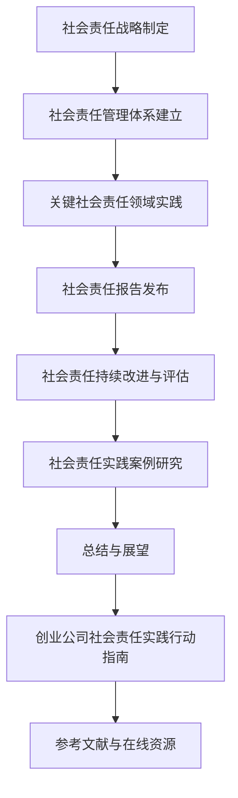

                 

### 《创业公司的社会责任实践》

> **关键词**：社会责任、创业公司、环境责任、劳工责任、社会责任报告、持续改进

> **摘要**：
本文旨在探讨创业公司的社会责任实践。我们将首先介绍社会责任的基本概念和重要性，然后分析创业公司的特点及其在社会责任实践中的独特性。接下来，我们将详细探讨创业公司社会责任战略的制定、管理体系的建立以及关键社会责任领域的实践。此外，文章还将介绍社会责任报告的制定与发布、持续改进与评估的方法，并通过对国内外创业公司社会责任实践案例的分析，总结创业公司社会责任实践的意义与未来趋势。最后，我们将提供创业公司社会责任实践的行动指南，帮助创业公司在履行社会责任的道路上不断前行。

### 第一部分：引言与背景

#### 1.1 社会责任的定义与重要性

社会责任是指企业在经营过程中，对员工、客户、供应商、社区和环境等利益相关者所承担的义务和责任。它不仅包括企业对经济利益的追求，还包括对社会责任的履行，如环境保护、员工福利、社区发展等。社会责任是企业价值观和经营理念的体现，也是企业可持续发展的重要保障。

在社会责任体系中，企业社会责任（Corporate Social Responsibility, CSR）是一个核心概念。企业社会责任强调企业在追求经济利益的同时，要关注社会责任的履行，包括环境保护、社会责任、劳工责任等。企业社会责任不仅是对外部环境的责任，也是对企业内部员工的关爱，以及对社会公共利益的贡献。

社会责任的重要性体现在以下几个方面：

1. **提升企业形象**：履行社会责任可以提升企业的社会形象和品牌价值，增强企业的市场竞争力和吸引力。

2. **增强员工凝聚力**：社会责任的履行可以增强员工的归属感和忠诚度，提高员工的工作满意度和工作效率。

3. **优化企业内部管理**：社会责任的实践可以促进企业内部管理的规范化、透明化和高效化。

4. **增强企业竞争力**：社会责任的履行可以提高企业的社会责任声誉，增强企业在市场中的竞争力。

#### 1.2 企业社会责任的发展历程

企业社会责任的概念起源于20世纪初期。当时，随着工业革命和现代化生产方式的发展，企业规模不断扩大，对社会的负面影响也越来越明显。为了应对这些问题，一些有远见的企业家和社会活动家开始倡导企业承担更多的社会责任。

20世纪60年代，企业社会责任开始逐渐受到广泛关注。美国学者彼得·德鲁克（Peter Drucker）提出了企业社会责任的概念，并将其视为企业可持续发展的重要组成部分。此后，企业社会责任逐渐成为企业管理和研究的一个重要领域。

20世纪80年代，随着全球化进程的加速，企业社会责任的概念在国际上得到了广泛的传播和认同。许多国家和地区开始制定相关法律法规，要求企业履行社会责任。

21世纪初，企业社会责任的概念进一步深化，不仅包括对环境、社会和劳工的责任，还包括对企业治理、透明度和责任追究等方面的要求。

#### 1.3 社会责任与企业竞争力的关系

社会责任与企业竞争力之间存在密切的关系。履行社会责任可以提高企业的品牌形象，增强员工凝聚力，提高客户忠诚度，从而提升企业的市场竞争力。

首先，履行社会责任可以提升企业形象。一个具有良好社会责任记录的企业往往更容易获得公众的信任和认可，从而提高品牌价值和市场竞争力。

其次，履行社会责任可以增强员工凝聚力。一个关注员工福利和职业发展的企业能够吸引和留住优秀人才，提高员工的工作满意度和工作效率。

此外，履行社会责任可以提高客户忠诚度。越来越多的消费者在购买产品或服务时，会考虑企业的社会责任表现。一个具有良好社会责任记录的企业更容易赢得客户的信任和忠诚。

最后，社会责任的履行还可以优化企业内部管理，提高企业的运营效率和竞争力。

总之，社会责任的履行不仅有助于提升企业形象和品牌价值，还可以提高员工凝聚力和客户忠诚度，从而增强企业的市场竞争力。

### 第二部分：创业公司社会责任的独特性

#### 2.1 创业公司的特点与挑战

创业公司是指那些在创业初期阶段，以创新和快速发展为目标，积极开拓市场的企业。与成熟企业相比，创业公司具有以下特点：

1. **资源有限**：创业公司在创业初期往往面临着资源有限的困境，包括资金、人才、技术、市场等。

2. **灵活性高**：创业公司由于资源有限，需要快速响应市场变化，因此具有很高的灵活性。

3. **创新驱动**：创业公司通常以创新为核心驱动力，通过创新的产品、服务或商业模式来开拓市场。

4. **高风险**：创业公司面临着较高的风险，包括市场风险、技术风险、管理风险等。

在履行社会责任方面，创业公司也面临着一系列挑战：

1. **资源有限**：由于资源有限，创业公司在履行社会责任时可能面临资金、人才等方面的瓶颈。

2. **市场竞争**：创业公司在创业初期往往需要将有限的资源用于市场竞争，可能无法充分关注社会责任。

3. **社会责任意识**：部分创业公司可能缺乏对社会责任的认识和重视，导致社会责任实践的缺失。

4. **法律法规**：创业公司在社会责任实践过程中可能面临法律法规的挑战，需要了解和遵守相关法规。

#### 2.2 创业公司社会责任的独特性

尽管面临诸多挑战，创业公司在社会责任实践中也具有独特的优势和特点：

1. **灵活性和创新性**：创业公司由于资源有限，需要更加灵活和创新地履行社会责任。例如，可以通过合作、资源共享等方式实现社会责任目标。

2. **重点领域**：创业公司可以根据自身特点和市场需求，选择重点社会责任领域进行实践。例如，关注环境保护、员工福利、社区发展等。

3. **资源整合**：创业公司可以通过与其他企业、非政府组织、政府部门等合作，实现资源整合和优势互补，提高社会责任实践的效果。

4. **透明度**：创业公司在社会责任实践过程中，需要保持较高的透明度，以赢得公众和利益相关者的信任和支持。

总之，创业公司在社会责任实践中既面临挑战，也具有独特的优势和特点。通过灵活性和创新性，创业公司可以在有限的资源下，实现社会责任的最大化。

#### 2.3 创业公司在社会责任中的机会

创业公司在社会责任实践中也面临着一系列机会：

1. **品牌建设**：通过履行社会责任，创业公司可以提升品牌形象，增强市场竞争力。

2. **人才吸引与保留**：关注社会责任的创业公司更容易吸引和留住优秀人才，提高员工的工作满意度和忠诚度。

3. **技术创新**：社会责任的履行可以激发创业公司的技术创新，推动企业的可持续发展。

4. **市场拓展**：社会责任的履行可以拓展创业公司的市场，吸引更多有社会责任意识的客户和合作伙伴。

5. **法律法规合规**：通过履行社会责任，创业公司可以更好地遵守相关法律法规，降低法律风险。

总之，创业公司在社会责任实践中既面临挑战，也充满机会。通过创新和灵活性，创业公司可以在社会责任的道路上取得成功。

### 第三部分：实践策略

#### 3.1 制定社会责任战略的步骤

制定社会责任战略是创业公司履行社会责任的重要步骤。以下是一个典型的社会责任战略制定流程：

1. **自我评估**：创业公司应首先进行自我评估，了解自身的资源状况、业务特点、社会责任现状等。自我评估可以帮助公司确定自身的优势和劣势，为战略制定提供依据。

2. **确定社会责任目标**：基于自我评估结果，创业公司应确定社会责任目标。社会责任目标应具体、可衡量、可实现、相关性强、时间明确。例如，公司可以设定减少碳排放、提高员工福利水平等目标。

3. **制定社会责任策略**：在确定社会责任目标后，创业公司应制定具体的实施策略。策略应包括关键行动、时间表、责任人等。例如，公司可以制定具体的环保措施、员工培训计划等。

4. **制定社会责任预算**：社会责任预算是确保社会责任战略实施的关键。创业公司应根据社会责任目标和策略，制定合理的预算，确保资源的有效配置。

5. **制定社会责任报告**：社会责任报告是展示创业公司社会责任实践的重要工具。公司应制定定期发布社会责任报告，向社会展示其社会责任实践和成果。

6. **持续改进与评估**：创业公司应建立持续改进与评估机制，定期评估社会责任实践的效果，并根据评估结果进行改进。

#### 3.2 创业公司社会责任战略的制定

在制定社会责任战略时，创业公司可以采取以下步骤：

1. **明确社会责任目标**：创业公司应根据自身特点和市场环境，明确社会责任目标。目标应具有实际可操作性，如减少碳排放、提高员工福利水平等。

2. **识别关键社会责任领域**：创业公司应识别关键社会责任领域，如环境保护、员工福利、社区发展等。根据公司特点和资源状况，确定优先级。

3. **制定实施计划**：在明确社会责任目标和关键领域后，创业公司应制定具体的实施计划。计划应包括具体的行动、时间表、责任人等。

4. **资源分配**：创业公司应合理分配资源，确保社会责任战略的实施。资源分配应考虑社会责任目标和实施计划的需求。

5. **建立评估机制**：创业公司应建立社会责任评估机制，定期评估社会责任实践的效果，并根据评估结果进行改进。

6. **社会责任报告**：创业公司应制定社会责任报告，向社会展示其社会责任实践和成果。报告内容应真实、透明，具有可操作性。

总之，创业公司在制定社会责任战略时，应明确社会责任目标，识别关键领域，制定实施计划，合理分配资源，并建立评估机制。通过这些步骤，创业公司可以有效地履行社会责任，提升品牌形象，增强市场竞争力。

#### 3.3 社会责任目标的设定与实现

设定社会责任目标是创业公司社会责任战略的重要组成部分。一个明确、具体、可衡量、可实现的社会责任目标可以为公司提供清晰的行动指南，并确保社会责任实践的有效性。

**设定社会责任目标**

设定社会责任目标需要遵循以下原则：

1. **具体性**：目标应明确具体，便于衡量和实现。例如，“减少碳排放”比“提高环保意识”更具体。

2. **可衡量性**：目标应具备可衡量性，可以通过定量或定性的方式衡量。例如，可以设定“减少碳排放10%”或“提高员工满意度评分5分”。

3. **可实现性**：目标应在公司资源和能力范围内实现。过高或过低的目标都会影响社会责任实践的有效性。

4. **相关性**：目标应与公司的核心价值观和业务领域相关。相关目标可以更好地体现公司的社会责任实践。

5. **时间明确**：目标应设定明确的时间框架，如年度、季度等。这有助于跟踪目标的实现进度。

**实现社会责任目标**

实现社会责任目标需要以下步骤：

1. **制定行动计划**：根据设定的社会责任目标，制定具体的行动计划。行动计划应包括关键行动、时间表、责任人等。

2. **资源分配**：确保行动计划所需的资源得到合理配置。资源分配应考虑社会责任目标和实施计划的需求。

3. **执行与监控**：实施行动计划，并对执行过程进行监控。监控可以采用定期汇报、数据收集和分析等方法。

4. **评估与改进**：定期评估社会责任目标的实现情况，并根据评估结果进行改进。评估结果可以用于指导下一阶段的社会责任目标设定和实施。

5. **透明度与沟通**：保持社会责任实践的透明度，与利益相关者（如员工、客户、供应商、社区等）进行有效沟通，以增强社会责任实践的社会影响力。

通过设定和实现社会责任目标，创业公司不仅能够履行其社会责任，还可以提升企业形象，增强市场竞争力。有效的社会责任目标设定和实现是创业公司成功履行社会责任的关键。

#### 3.4 社会责任管理体系的建立

建立社会责任管理体系是创业公司履行社会责任的基础。一个完善的社会责任管理体系可以确保公司社会责任实践的系统化、规范化和高效化。

**社会责任管理体系的框架**

社会责任管理体系通常包括以下核心要素：

1. **社会责任政策**：社会责任政策是企业履行社会责任的指导性文件，明确企业的社会责任目标和价值观。政策应涵盖环境保护、员工福利、社区发展等关键领域。

2. **社会责任组织架构**：社会责任组织架构确定社会责任的负责人和相关部门，确保社会责任的规划、执行和评估。

3. **社会责任规划**：社会责任规划是制定社会责任战略和具体行动计划的过程。规划应考虑企业的资源状况、业务特点和社会责任趋势。

4. **社会责任执行**：社会责任执行是实施社会责任计划和行动的过程。执行应确保行动计划的有效实施，并实时监控和调整。

5. **社会责任评估**：社会责任评估是评估社会责任实践效果和改进的过程。评估应定期进行，并提供反馈和改进建议。

**社会责任管理体系的核心要素**

1. **社会责任政策**

社会责任政策是企业履行社会责任的指导性文件。政策应明确企业的社会责任目标和价值观，并将其纳入企业的整体战略。例如，企业可以制定环保政策、员工福利政策、社区发展政策等。

2. **社会责任组织架构**

社会责任组织架构确定社会责任的负责人和相关部门。通常，企业会设立社会责任部门或社会责任委员会，负责社会责任的规划、执行和评估。社会责任组织架构应确保社会责任实践的高效运作。

3. **社会责任规划**

社会责任规划是制定社会责任战略和具体行动计划的过程。规划应考虑企业的资源状况、业务特点和社会责任趋势。规划过程应包括自我评估、目标设定、策略制定等步骤。

4. **社会责任执行**

社会责任执行是实施社会责任计划和行动的过程。执行应确保行动计划的有效实施，并实时监控和调整。执行过程应包括培训、沟通、监督等环节。

5. **社会责任评估**

社会责任评估是评估社会责任实践效果和改进的过程。评估应定期进行，并提供反馈和改进建议。评估方法可以包括定量评估、定性评估和第三方评估等。

通过建立和完善社会责任管理体系，创业公司可以确保社会责任实践的规范化和高效化，提升企业形象，增强市场竞争力。

#### 3.5 社会责任管理体系的框架

一个完善的社会责任管理体系需要明确的框架来支持，以确保社会责任实践的系统化和高效化。以下是一个典型的社会责任管理体系框架：

1. **社会责任政策**：这是社会责任管理体系的核心，明确企业的社会责任目标和价值观。政策应涵盖环境保护、员工福利、社区发展等关键领域，并为企业提供履行社会责任的指导。

2. **社会责任组织架构**：确定社会责任的负责人和相关部门，确保社会责任的规划、执行和评估。组织架构应包括社会责任部门或社会责任委员会，以及跨部门协作机制。

3. **社会责任规划**：制定社会责任战略和具体行动计划。规划应考虑企业的资源状况、业务特点和社会责任趋势，确保社会责任目标的具体性和可操作性。

4. **社会责任执行**：实施社会责任计划和行动。执行过程应包括培训、沟通、监督等环节，确保行动计划的有效实施。

5. **社会责任评估**：评估社会责任实践的效果和改进。评估应定期进行，包括定量评估和定性评估，并提供反馈和改进建议。

6. **社会责任沟通**：保持与社会利益相关者的沟通，提高社会责任实践的透明度和公众参与度。

7. **社会责任报告**：定期发布社会责任报告，展示企业的社会责任实践和成果，增强社会责任实践的透明度和公信力。

通过这个框架，创业公司可以确保社会责任管理的系统性和连续性，提高社会责任实践的有效性。

#### 3.6 社会责任管理体系的核心要素

**社会责任管理体系的核心要素**是确保企业社会责任实践有效实施的基础。以下是对这些核心要素的详细说明：

1. **社会责任政策**：

社会责任政策是企业履行社会责任的指导性文件，明确了企业的社会责任目标和价值观。政策应涵盖环境保护、员工福利、社区发展等关键领域，并为企业提供具体的行动指南。社会责任政策不仅是企业社会责任实践的基石，也是内部沟通和外部宣传的重要依据。

2. **社会责任组织架构**：

社会责任组织架构是确保社会责任实践顺利执行的组织保障。企业应设立社会责任部门或社会责任委员会，明确社会责任负责人和相关部门的角色和职责。组织架构还应包括跨部门协作机制，确保社会责任实践在各个部门的协同配合下进行。

3. **社会责任规划**：

社会责任规划是制定社会责任战略和具体行动计划的过程。规划应考虑企业的资源状况、业务特点和社会责任趋势，确保社会责任目标的具体性和可操作性。规划过程应包括自我评估、目标设定、策略制定和资源分配等步骤，为社会责任实践提供明确的行动路线。

4. **社会责任执行**：

社会责任执行是实施社会责任计划和行动的过程。执行过程应包括培训、沟通、监督等环节，确保行动计划的有效实施。企业应建立有效的执行机制，确保各项社会责任措施得到落实，并实时监控和调整执行进度。

5. **社会责任评估**：

社会责任评估是评估社会责任实践效果和改进的过程。评估应定期进行，包括定量评估和定性评估，并提供反馈和改进建议。评估结果应作为改进社会责任实践的依据，帮助企业持续优化社会责任管理。

6. **社会责任沟通**：

社会责任沟通是保持与社会利益相关者的沟通，提高社会责任实践的透明度和公众参与度的重要手段。企业应建立有效的沟通机制，定期发布社会责任报告，展示企业的社会责任实践和成果，增强社会责任实践的公信力和影响力。

通过这些核心要素的有机结合，创业公司可以建立完善的社会责任管理体系，确保社会责任实践的系统化、规范化和高效化。

### 第四部分：关键社会责任领域的实践

#### 4.1 环境责任

环境责任是企业对环境保护和可持续发展的责任。在当今全球变暖、资源枯竭和环境污染问题日益严峻的背景下，企业履行环境责任不仅是对自身发展的负责，也是对社会的贡献。

**环境责任的定义与内涵**

环境责任是指企业在其生产经营过程中，对环境保护和可持续发展所承担的责任。它不仅包括减少对环境的污染，还包括资源节约、生态保护、气候行动等方面。环境责任的内涵可以概括为以下几个方面：

1. **减少污染**：企业应通过采用清洁生产技术、优化生产工艺等方式，减少生产过程中产生的污染物，降低对环境的负面影响。

2. **资源节约**：企业应通过优化资源配置、提高资源利用效率等方式，实现资源的节约和可持续发展。

3. **生态保护**：企业应积极参与生态保护项目，恢复和改善生态环境，保护生物多样性。

4. **气候行动**：企业应关注气候变化问题，采取减少温室气体排放、提高能源效率等措施，积极参与全球气候治理。

**创业公司环境责任的实践**

创业公司在环境责任方面的实践可以包括以下几个方面：

1. **绿色办公**：创业公司可以采用绿色办公措施，如节能照明、垃圾分类、纸张回收等，减少办公过程中的能源消耗和资源浪费。

2. **可再生能源使用**：创业公司可以积极采用可再生能源，如太阳能、风能等，减少对传统能源的依赖，降低碳排放。

3. **环保产品与服务**：创业公司可以开发和推广环保产品和服务，如环保材料、绿色包装、节能减排设备等，引导市场向环保方向转变。

4. **生态保护项目**：创业公司可以参与生态保护项目，如植树造林、湿地恢复等，为环境保护贡献自己的力量。

5. **环境教育与培训**：创业公司可以开展环境教育和培训活动，提高员工和公众的环保意识，促进环境保护的社会参与。

通过这些实践，创业公司不仅可以履行其环境责任，还可以提升企业形象，增强市场竞争力，为可持续发展做出贡献。

#### 4.2 社会责任

社会责任是企业对社会的责任，包括对员工、客户、供应商、社区和环境等方面的责任。在商业活动中，企业不仅要追求经济效益，还要关注社会责任的履行，以实现经济效益和社会效益的有机统一。

**社会责任的定义与内涵**

社会责任是指企业在其经营过程中，对员工、客户、供应商、社区和环境等利益相关者所承担的义务和责任。社会责任的内涵可以概括为以下几个方面：

1. **员工责任**：企业应对员工提供公平的就业机会、良好的工作环境和合理的薪酬待遇，关注员工的职业发展和身心健康。

2. **客户责任**：企业应提供优质的产品和服务，满足客户的需求，维护客户的权益，提升客户满意度。

3. **供应商责任**：企业应与供应商建立公平、透明、互惠的合作关系，关注供应商的可持续发展，推动供应链的优化。

4. **社区责任**：企业应积极参与社区建设，关注社区问题，为社区发展贡献力量，促进社会和谐。

5. **环境责任**：企业应采取环境保护措施，减少对环境的污染，参与生态保护项目，实现可持续发展。

**创业公司社会责任的实践**

创业公司在社会责任方面的实践可以包括以下几个方面：

1. **员工福利**：创业公司应提供良好的工作环境、培训和晋升机会，关注员工的身心健康，提升员工的工作满意度。

2. **员工培训与发展**：创业公司可以开展员工培训项目，提升员工的技能和素质，为员工的职业发展提供支持。

3. **客户服务**：创业公司应提供优质的客户服务，及时解决客户的问题，提升客户体验和满意度。

4. **供应链管理**：创业公司可以与供应商建立长期稳定的合作关系，推动供应链的可持续发展。

5. **社区参与**：创业公司可以参与社区建设，为社区提供技术支持、资源援助等，促进社区的发展。

6. **环境保护**：创业公司应采取环保措施，减少对环境的污染，积极参与生态保护项目。

通过这些实践，创业公司不仅能够履行其社会责任，还可以提升企业形象，增强市场竞争力，实现企业的可持续发展。

#### 4.3 劳工责任

劳工责任是企业对员工的职责和义务，包括公平就业、合理薪酬、良好工作环境和职业发展等方面。在全球化和技术快速发展的背景下，劳工责任成为企业社会责任的重要组成部分。

**劳工责任的定义与内涵**

劳工责任是指企业在其经营过程中，对员工所承担的义务和责任。它不仅包括提供公平的就业机会和合理的薪酬待遇，还包括确保员工的工作环境安全和健康，以及为员工的职业发展提供支持。劳工责任的内涵可以概括为以下几个方面：

1. **公平就业**：企业应提供平等、公正的就业机会，不分种族、性别、宗教信仰等，尊重员工的个人权益。

2. **合理薪酬**：企业应给予员工合理的薪酬待遇，确保员工的生活水平和工作积极性。

3. **良好工作环境**：企业应提供安全、舒适、无歧视的工作环境，确保员工在工作中身心健康。

4. **职业发展**：企业应为员工提供职业发展机会，通过培训、晋升等方式，帮助员工实现职业成长。

5. **员工权益**：企业应尊重和维护员工的合法权益，如休息权、劳动权、参与权等。

**创业公司劳工责任的实践**

创业公司在劳工责任方面的实践可以包括以下几个方面：

1. **公平就业机会**：创业公司应制定公平招聘政策，确保招聘过程的透明和公正，为所有求职者提供平等的就业机会。

2. **合理薪酬**：创业公司应根据员工的工作表现和市场薪酬水平，给予员工合理的薪酬待遇，确保员工的生活水平。

3. **良好工作环境**：创业公司应提供安全、舒适的工作环境，关注员工的工作压力和心理健康，定期组织员工体检和心理辅导。

4. **职业发展机会**：创业公司可以开展员工培训项目，提供职业发展规划，帮助员工提升技能和素质，实现职业成长。

5. **员工参与**：创业公司应鼓励员工参与企业决策，建立有效的员工参与机制，增强员工的归属感和责任感。

6. **员工权益保护**：创业公司应建立健全的员工权益保护机制，确保员工的合法权益得到尊重和保障。

通过这些实践，创业公司不仅能够履行其劳工责任，还可以提升员工的满意度和忠诚度，增强企业的核心竞争力。

### 第五部分：社会责任报告与透明度

#### 5.1 社会责任报告的制定与发布

社会责任报告是企业向社会展示其社会责任实践和成果的重要工具。通过社会责任报告，企业可以透明地披露其社会责任实践情况，提高社会对企业的信任度，同时也能够为企业的可持续发展提供指导。

**社会责任报告的定义与内容**

社会责任报告（Corporate Social Responsibility Report，简称CSR报告）是指企业对其社会责任实践和成果进行系统总结和披露的文件。社会责任报告的内容通常包括以下几个方面：

1. **引言**：介绍报告的目的和范围，说明企业社会责任的价值观和目标。

2. **社会责任战略**：阐述企业社会责任战略的制定背景、目标和实施措施。

3. **社会责任实践**：详细描述企业在环境保护、社会责任、劳工责任等关键领域的具体实践。

4. **社会责任成果**：展示企业在社会责任实践中的成果和成效，包括对环境、社会、员工等方面的积极影响。

5. **社会责任评估**：评估社会责任实践的效果和改进，包括定量和定性的评估方法。

6. **利益相关者反馈**：记录与利益相关者（如员工、客户、社区等）的互动和反馈，展示企业的社会责任实践如何受到利益相关者的认可和支持。

7. **附录**：提供相关的数据和参考资料，如社会责任指标、第三方评估报告等。

**社会责任报告的发布**

社会责任报告的发布是企业社会责任实践的重要环节。企业可以通过以下渠道发布社会责任报告：

1. **企业官网**：在企业官网上设置社会责任专栏，发布社会责任报告的电子版，方便公众下载和查阅。

2. **社交媒体**：利用社交媒体平台（如微博、微信公众号、Facebook等）发布社会责任报告的摘要和亮点，提高报告的传播范围。

3. **电子邮件**：向企业的主要利益相关者（如员工、客户、投资者等）发送社会责任报告，获取他们的反馈和建议。

4. **线下发布**：在企业举办的年会、发布会等活动中，发布社会责任报告的纸质版，提高报告的公信力和影响力。

通过多种渠道发布社会责任报告，企业可以确保报告的广泛传播和有效沟通，增强社会责任实践的透明度和公信力。

#### 5.2 社会责任报告的内容与格式

社会责任报告的内容和格式对于展示企业社会责任实践具有重要影响。一个内容详实、格式规范的社会责任报告不仅能够清晰地传达企业的社会责任实践和成果，还能够提升企业的社会形象和公信力。

**社会责任报告的内容**

社会责任报告的内容应全面、详细地反映企业的社会责任实践和成果。以下是社会责任报告的主要内容：

1. **引言**：介绍报告的背景、目的和范围，明确报告的重要性和价值。

2. **社会责任战略**：阐述企业的社会责任目标和价值观，说明企业社会责任战略的制定过程和实施措施。

3. **社会责任实践**：详细描述企业在环境保护、社会责任、劳工责任等关键领域的具体实践。这部分应包括具体的行动计划、实施过程、取得的成果和面临的挑战。

4. **社会责任成果**：展示企业在社会责任实践中的成果和成效，包括对环境、社会、员工等方面的积极影响。应提供定量和定性的数据，以支持报告的客观性和可信度。

5. **社会责任评估**：评估社会责任实践的效果和改进，包括定性和定量的评估方法。这部分应提供详细的评估结果和分析，以及改进的建议和措施。

6. **利益相关者反馈**：记录与利益相关者（如员工、客户、社区等）的互动和反馈，展示企业的社会责任实践如何受到利益相关者的认可和支持。

7. **附录**：提供相关的数据和参考资料，如社会责任指标、第三方评估报告、相关政策法规等。附录部分应便于读者查阅，以提高报告的透明度和公信力。

**社会责任报告的格式**

社会责任报告的格式应简洁明了，便于读者阅读和理解。以下是社会责任报告的一般格式：

1. **封面**：包括企业名称、报告年份、报告主题和发布日期等基本信息。

2. **目录**：列出报告各章节和子章节的标题，便于读者快速查找感兴趣的内容。

3. **正文**：按照报告内容进行详细阐述，每个章节应结构清晰，逻辑严谨。

4. **插图和表格**：使用插图和表格展示相关数据和信息，增强报告的可读性和说服力。

5. **附录**：提供相关数据和参考资料，如社会责任指标、第三方评估报告等。

6. **结语**：总结报告的主要内容和成果，提出未来改进的方向和建议。

通过规范的内容和格式，企业可以确保社会责任报告的高质量，提高报告的公信力和影响力。

### 第六部分：社会责任的持续改进与评估

#### 6.1 社会责任持续改进的机制与措施

社会责任的持续改进是企业履行社会责任的重要环节。通过建立有效的改进机制和措施，企业可以不断提升社会责任实践的效果，实现社会责任的长期发展。

**持续改进的机制**

1. **定期评估**：企业应定期对社会责任实践进行评估，以识别存在的问题和机会。评估应包括定量和定性的方法，如社会责任指标、员工满意度调查、第三方评估等。

2. **反馈机制**：企业应建立有效的反馈机制，收集利益相关者（如员工、客户、社区等）的反馈和建议。这些反馈应作为改进措施的依据，以提高社会责任实践的有效性。

3. **改进计划**：根据评估结果和反馈，企业应制定具体的改进计划。改进计划应包括改进目标、具体措施、时间表和责任人等。

4. **实施与监控**：企业应实施改进计划，并对实施过程进行监控。监控应包括定期检查、报告和调整，以确保改进措施的有效执行。

**持续改进的措施**

1. **加强培训**：企业应提供社会责任相关的培训，提高员工的社会责任意识和能力。培训内容应包括社会责任理念、法律法规、最佳实践等。

2. **资源整合**：企业应整合内部资源，如人力资源、财务资源等，支持社会责任的持续改进。资源整合可以包括内部跨部门合作、外部合作伙伴关系等。

3. **技术创新**：企业应通过技术创新，提高社会责任实践的效果。例如，采用环保技术、节能减排技术等，以实现环境责任的目标。

4. **知识分享**：企业应建立知识分享平台，促进社会责任实践经验的交流和传播。通过内部和外部培训、研讨会、报告会等形式，分享社会责任实践的成功经验和教训。

通过建立持续改进的机制和采取有效的改进措施，企业可以不断提升社会责任实践的效果，实现社会责任的长期发展。

#### 6.2 社会责任评估的方法与工具

社会责任评估是衡量企业社会责任实践效果的重要手段。通过科学、系统的方法和工具，企业可以全面了解社会责任实践的表现，发现问题和改进机会。

**社会责任评估的方法**

1. **定量评估**：定量评估是通过量化的指标和数据进行评估，如社会责任指标、财务指标、绩效指标等。定量评估具有客观性和可比性，可以提供明确的数据支持。

2. **定性评估**：定性评估是通过访谈、调查、观察等方法，收集非量化的信息，如员工满意度、客户满意度、社会责任实践的效果等。定性评估可以深入了解社会责任实践的实际影响，提供更丰富的信息。

3. **综合评估**：综合评估是结合定量评估和定性评估的方法，全面评估社会责任实践的表现。综合评估可以提供更全面、更准确的评估结果，为改进措施提供科学依据。

**社会责任评估的工具**

1. **社会责任指标体系**：社会责任指标体系是评估社会责任实践效果的重要工具。社会责任指标应涵盖环境保护、社会责任、劳工责任等方面，具有可操作性和可比性。

2. **社会责任评估模板**：社会责任评估模板是评估社会责任实践的标准模板，包括评估指标、评估方法、评估流程等。模板可以简化评估过程，提高评估效率。

3. **社会责任评估软件**：社会责任评估软件是专门用于评估社会责任实践的工具，可以自动化处理评估数据，提供直观的评估结果和分析报告。

通过科学、系统的方法和工具，企业可以准确评估社会责任实践的效果，发现问题和改进机会，不断提升社会责任实践的水平。

#### 6.3 创业公司社会责任评估的实践

创业公司在社会责任评估方面需要结合自身特点和实际情况，采取科学、系统的方法和工具，以确保评估的准确性和有效性。

**定期评估**

定期评估是创业公司社会责任评估的基本要求。创业公司应根据社会责任战略和具体实践，制定定期评估计划，通常包括年度评估和阶段性评估。评估周期应根据社会责任实践的具体内容和目标来确定，确保评估能够及时反映社会责任实践的效果。

**数据收集**

数据收集是社会责任评估的关键环节。创业公司应建立完善的数据收集机制，包括内部数据和外部数据。内部数据可以来源于社会责任报告、财务报表、员工调查等；外部数据可以来源于第三方评估机构、行业报告、公众反馈等。数据收集应确保数据的真实性和完整性，为评估提供可靠的基础。

**反馈机制**

建立有效的反馈机制是创业公司社会责任评估的重要组成部分。创业公司应通过多种渠道收集利益相关者的反馈，如员工、客户、供应商、社区等。反馈机制应包括定期调查、座谈会、投诉和建议渠道等。通过收集和分析反馈，创业公司可以及时发现社会责任实践中的问题和改进机会。

**评估报告**

评估报告是社会责任评估的重要成果。创业公司应根据评估结果，撰写详细的评估报告。评估报告应包括评估目的、评估方法、评估结果、问题和改进措施等内容。评估报告应确保内容的真实性和客观性，为社会责任实践的改进提供科学依据。

**持续改进**

基于评估报告，创业公司应制定具体的改进计划，并确保改进措施的有效实施。改进计划应包括改进目标、具体措施、责任人和时间表等。创业公司应建立持续的改进机制，通过定期评估和反馈，不断优化社会责任实践。

通过定期评估、数据收集、反馈机制和评估报告，创业公司可以确保社会责任评估的科学性和有效性，持续提升社会责任实践的水平。

### 第七部分：案例分析

#### 7.1 国内创业公司社会责任实践案例

国内创业公司在社会责任实践方面具有独特的优势和经验。以下分析两个典型的国内创业公司社会责任实践案例。

#### 7.1.1 案例一：XX科技公司

**背景介绍**

XX科技公司是一家专注于互联网技术和服务的企业，成立于2010年。公司秉承“科技创新，服务社会”的使命，致力于通过技术创新推动社会进步和可持续发展。

**社会责任实践**

1. **环境保护**：XX科技公司高度重视环境保护，积极推进绿色办公。公司采用了可再生能源，如太阳能和风能，减少碳排放。此外，公司还推广无纸化办公，减少纸张消耗。

2. **社会责任**：XX科技公司关注员工福利和社区发展。公司为员工提供良好的工作环境、培训和晋升机会，定期组织员工参与社区志愿活动，支持社区建设。

3. **劳工责任**：公司重视劳工权益，确保员工享有公平的就业机会和合理的薪酬待遇。公司还建立了员工关爱基金，帮助员工解决生活中的困难。

**评估与效果**

XX科技公司的社会责任实践得到了广泛的认可。公司定期发布社会责任报告，向社会展示其社会责任实践和成果。评估结果显示，公司的环保措施有效减少了碳排放，员工满意度和社区认可度持续提升。

**结论**

XX科技公司的社会责任实践不仅提升了企业形象，还增强了员工凝聚力和市场竞争力。通过环境保护、社会责任和劳工责任的实践，公司实现了经济效益和社会效益的双赢。

#### 7.1.2 案例二：YY互联网公司

**背景介绍**

YY互联网公司是一家提供互联网娱乐服务的创业公司，成立于2009年。公司以其创新的产品和服务，赢得了广大用户和市场的认可。

**社会责任实践**

1. **环境保护**：YY互联网公司重视环境保护，积极推广节能减排。公司采用了高效节能的设备和技术，减少能源消耗。此外，公司还组织员工参与植树造林等环保活动，提高员工的环保意识。

2. **社会责任**：公司关注员工福利和社区发展。公司为员工提供良好的工作环境、培训和晋升机会，定期组织员工参与社区志愿活动，支持社区建设。此外，公司还设立了公益基金，支持慈善事业。

3. **劳工责任**：公司重视劳工权益，确保员工享有公平的就业机会和合理的薪酬待遇。公司还建立了员工关爱基金，帮助员工解决生活中的困难。

**评估与效果**

YY互联网公司的社会责任实践取得了显著成效。公司定期发布社会责任报告，向社会展示其社会责任实践和成果。评估结果显示，公司的环保措施有效减少了能源消耗，员工满意度和社区认可度持续提升。

**结论**

YY互联网公司的社会责任实践不仅提升了企业形象，还增强了员工凝聚力和市场竞争力。通过环境保护、社会责任和劳工责任的实践，公司实现了经济效益和社会效益的双赢。

### 第七部分：国内外创业公司社会责任实践案例

#### 7.2.1 案例一：Facebook

**背景介绍**

Facebook是一家全球知名的社交媒体公司，成立于2004年。作为全球最大的社交媒体平台之一，Facebook在全球范围内拥有庞大的用户群体，对社会的影响巨大。

**社会责任实践**

1. **环境保护**：Facebook高度重视环境保护，积极采取环保措施。公司采用了可再生能源，如太阳能和风能，减少碳排放。此外，公司还实施了绿色办公政策，减少纸张消耗和能源浪费。

2. **社会责任**：Facebook关注社会责任，通过多种方式支持社会公益。公司设立了公益基金，支持教育、环保、医疗等领域的项目。此外，公司还鼓励员工参与社区志愿活动，推动社区发展。

3. **劳工责任**：Facebook重视员工权益，为员工提供良好的工作环境、培训和晋升机会。公司建立了多元化的员工队伍，确保员工享有公平的就业机会。此外，公司还推行了员工健康计划，关注员工的身心健康。

**评估与效果**

Facebook的社会责任实践得到了广泛认可。公司定期发布社会责任报告，向社会展示其社会责任实践和成果。评估结果显示，公司的环保措施有效减少了碳排放，员工满意度和社区认可度持续提升。

**结论**

Facebook的社会责任实践不仅提升了企业形象，还增强了员工凝聚力和市场竞争力。通过环境保护、社会责任和劳工责任的实践，公司实现了经济效益和社会效益的双赢。

#### 7.2.2 案例二：Google

**背景介绍**

Google是一家全球知名的互联网技术公司，成立于1998年。作为全球最大的搜索引擎之一，Google在全球范围内拥有庞大的用户群体，对社会的影响巨大。

**社会责任实践**

1. **环境保护**：Google高度重视环境保护，积极采取环保措施。公司采用了可再生能源，如太阳能和风能，减少碳排放。此外，公司还实施了绿色办公政策，减少纸张消耗和能源浪费。

2. **社会责任**：Google关注社会责任，通过多种方式支持社会公益。公司设立了公益基金，支持教育、环保、医疗等领域的项目。此外，公司还鼓励员工参与社区志愿活动，推动社区发展。

3. **劳工责任**：Google重视员工权益，为员工提供良好的工作环境、培训和晋升机会。公司建立了多元化的员工队伍，确保员工享有公平的就业机会。此外，公司还推行了员工健康计划，关注员工的身心健康。

**评估与效果**

Google的社会责任实践得到了广泛认可。公司定期发布社会责任报告，向社会展示其社会责任实践和成果。评估结果显示，公司的环保措施有效减少了碳排放，员工满意度和社区认可度持续提升。

**结论**

Google的社会责任实践不仅提升了企业形象，还增强了员工凝聚力和市场竞争力。通过环境保护、社会责任和劳工责任的实践，公司实现了经济效益和社会效益的双赢。

### 第八部分：总结与展望

#### 8.1 创业公司社会责任实践的意义

创业公司的社会责任实践具有深远的意义，不仅能够提升企业形象，增强员工凝聚力和市场竞争力，还能够推动企业的可持续发展。具体来说，创业公司社会责任实践的意义主要体现在以下几个方面：

1. **提升企业形象**：通过履行社会责任，创业公司可以提升其社会形象和品牌价值，赢得公众的信任和认可，增强市场竞争力。

2. **增强员工凝聚力**：社会责任的履行可以增强员工的归属感和忠诚度，提高员工的工作满意度和工作效率，为企业的长期发展提供人力保障。

3. **推动市场竞争力**：创业公司在社会责任方面的表现可以影响客户和投资者的决策，吸引更多的客户和投资者，从而提升企业的市场竞争力。

4. **实现可持续发展**：社会责任的履行有助于企业实现经济效益、社会效益和环境效益的有机统一，推动企业的可持续发展。

5. **促进社会和谐**：创业公司的社会责任实践可以促进社会和谐与进步，为构建和谐社会贡献力量。

#### 8.2 创业公司社会责任实践的挑战与趋势

尽管创业公司社会责任实践具有重要意义，但在实践中也面临着一系列挑战。以下分析创业公司社会责任实践的挑战与趋势：

**挑战**

1. **资源有限**：创业公司在创业初期通常面临资源有限的问题，包括资金、人才、技术等。这使得企业在履行社会责任时面临困难，需要更加注重资源的合理配置和利用。

2. **市场竞争**：创业公司在市场竞争中可能需要将有限的资源用于核心业务的发展，导致社会责任实践的缺失。如何在追求经济效益的同时履行社会责任，是创业公司面临的一大挑战。

3. **法律法规**：创业公司在社会责任实践过程中需要遵守相关法律法规，但由于法律法规的复杂性和变动性，企业可能面临法律风险。

4. **社会责任意识**：部分创业公司可能缺乏对社会责任的认识和重视，导致社会责任实践的缺失。提高社会责任意识，是创业公司履行社会责任的关键。

**趋势**

1. **责任领域多元化**：随着社会责任意识的提升，创业公司开始关注更多社会责任领域，如环境保护、员工福利、社区发展等。多元化责任领域的实践有助于全面履行企业的社会责任。

2. **责任实践创新性**：创业公司通过创新性的社会责任实践，如利用新技术、新模式，提高社会责任实践的效果。创新性实践可以更好地适应市场需求，提升企业的社会责任竞争力。

3. **社会责任透明度提高**：创业公司开始重视社会责任透明度，通过社会责任报告、第三方评估等方式，向社会展示其社会责任实践和成果。提高透明度有助于增强企业的社会责任公信力。

4. **合作与共享**：创业公司通过与其他企业、非政府组织、政府部门等合作，实现资源共享和优势互补，共同推动社会责任实践。合作与共享有助于提高社会责任实践的整体水平。

#### 8.3 创业公司社会责任实践的未来展望

未来，创业公司社会责任实践将呈现以下发展趋势：

1. **社会责任成为核心竞争力**：随着社会责任意识的提升，创业公司将更加重视社会责任，将其视为企业核心竞争力的重要组成部分。

2. **社会责任实践专业化**：创业公司将建立健全社会责任管理体系，提高社会责任实践的专业化水平。专业化管理体系有助于提高社会责任实践的效果和效率。

3. **社会责任技术创新**：创业公司通过技术创新，提高社会责任实践的效果。例如，利用大数据、人工智能等技术，优化环保措施、提升员工福利等。

4. **社会责任全球化**：随着全球化进程的加快，创业公司的社会责任实践将逐步走向全球，关注全球范围内的社会责任问题。全球化实践有助于提升企业的社会责任声誉和国际影响力。

5. **社会责任与可持续发展相结合**：创业公司将更加注重社会责任与可持续发展的结合，通过社会责任实践，推动企业的可持续发展，实现经济效益、社会效益和环境效益的有机统一。

总之，未来创业公司社会责任实践将更加多元化、创新性和全球化，通过持续改进和优化，实现社会责任的最大化，为社会的和谐与进步做出贡献。

### 第九部分：创业公司社会责任实践的行动指南

#### 9.1 实践指南

**制定社会责任战略**

创业公司在制定社会责任战略时，应遵循以下步骤：

1. **明确社会责任目标**：根据企业的使命、愿景和价值观，明确社会责任的目标。目标应具有具体性、可衡量性和可实现性。

2. **评估自身资源**：分析企业的资源状况，包括资金、人才、技术等，确保社会责任战略的可行性。

3. **确定责任领域**：根据企业的特点和市场需求，选择重点社会责任领域，如环境保护、员工福利、社区发展等。

4. **制定实施计划**：制定具体的社会责任实施计划，包括关键行动、时间表、责任人等。

**建立社会责任管理体系**

建立社会责任管理体系是创业公司履行社会责任的基础。以下是一些建议：

1. **制定社会责任政策**：明确企业的社会责任目标和价值观，并将其纳入企业的整体战略。

2. **设立责任组织架构**：设立社会责任部门或委员会，明确社会责任的负责人和相关部门。

3. **制定社会责任规划**：根据社会责任政策，制定具体的行动计划和责任规划。

4. **实施与监督**：确保社会责任计划的有效实施，并定期监督和评估责任执行情况。

5. **持续改进**：根据评估结果和反馈，持续改进社会责任实践。

**开展关键社会责任领域的实践**

创业公司在开展社会责任实践时，应重点关注以下几个关键领域：

1. **环境保护**：采取环保措施，如节能减排、废物回收等，减少企业的环境足迹。

2. **员工福利**：提供良好的工作环境、培训和晋升机会，关注员工的职业发展和身心健康。

3. **社区发展**：参与社区建设，关注社区问题，为社区发展贡献力量。

4. **劳工责任**：确保公平的就业机会和合理的薪酬待遇，尊重和维护员工的合法权益。

**发布社会责任报告**

发布社会责任报告是展示企业社会责任实践的重要方式。以下是一些建议：

1. **制定报告框架**：根据社会责任政策和实践内容，制定社会责任报告的框架和内容。

2. **确保透明度**：报告应真实、透明，披露企业的社会责任实践和成果。

3. **利用多种渠道发布**：通过企业官网、社交媒体、电子邮件等多种渠道发布社会责任报告。

4. **定期更新**：定期更新社会责任报告，反映企业的最新社会责任实践和成果。

**持续改进与评估社会责任实践**

持续改进与评估是创业公司社会责任实践的重要组成部分。以下是一些建议：

1. **建立评估机制**：制定评估标准和流程，定期评估社会责任实践的效果。

2. **收集反馈**：通过员工、客户、社区等利益相关者收集反馈，改进社会责任实践。

3. **制定改进计划**：根据评估结果和反馈，制定具体的改进计划，并确保实施。

4. **持续监督**：持续监督社会责任实践的执行情况，确保改进措施的有效性。

通过以上行动指南，创业公司可以更好地履行社会责任，提升企业形象，增强市场竞争力，实现可持续发展。

### 附录A：社会责任相关法规与政策

**社会责任相关法规与政策**

在社会责任领域，各国和地区都制定了一系列的法规与政策，以规范企业的社会责任行为。以下是一些国内外社会责任相关法规与政策的概述：

**中国社会责任相关法规与政策**

1. **《中华人民共和国公司法》**：明确了公司应当履行社会责任，保护环境，促进社会和谐。

2. **《中华人民共和国环境保护法》**：规定了企业应当采取措施减少污染，保护生态环境。

3. **《中华人民共和国劳动法》**：保障了劳动者的合法权益，包括工资、工时、休息休假等。

4. **《中华人民共和国劳动合同法》**：规定了劳动合同的签订、履行、解除等程序，保护劳动者的合法权益。

5. **《企业社会责任报告编制指南》**：为企业编制社会责任报告提供了指导，规范了报告的内容和格式。

**国际社会责任相关法规与政策**

1. **《联合国全球契约》**：提出了企业应当履行的十项原则，包括人权、劳动、环境和企业责任等。

2. **《国际标准化组织社会责任指南》**：为企业的社会责任实践提供了详细的指导，包括社会责任策略的制定、社会责任报告的编制等。

3. **《欧洲企业社会责任指令》**：规定了企业应当如何履行社会责任，包括环境保护、员工权益、透明度等。

4. **《美国企业社会责任报告指南》**：为企业编制社会责任报告提供了指导，强调透明度和信息的披露。

**法规与政策对企业的影响**

社会责任相关法规与政策对企业的影响主要体现在以下几个方面：

1. **合规要求**：企业需要遵守相关法规，确保其社会责任实践符合法律法规的要求。

2. **责任界定**：法规明确了企业应当履行的社会责任，为企业的社会责任实践提供了明确的方向。

3. **信息披露**：法规要求企业披露社会责任实践的相关信息，提高了社会责任实践的透明度。

4. **市场竞争力**：遵守社会责任法规的企业在市场竞争中具有优势，能够获得公众和投资者的信任和支持。

通过了解和遵守社会责任相关法规与政策，企业可以更好地履行社会责任，提升企业形象，增强市场竞争力。

### 附录B：社会责任实践工具与资源

**社会责任实践工具与资源**

为了帮助创业公司有效地履行社会责任，以下提供了一些社会责任实践工具与资源，包括社会责任评估工具、社会责任报告模板、社会责任培训课程等。

**社会责任评估工具**

1. **社会责任指标体系**：社会责任指标体系是一套用于评估企业社会责任实践的标准指标，包括环境保护、社会责任、劳工责任等方面。

2. **社会责任评估模板**：社会责任评估模板是一份用于评估企业社会责任实践的标准化文档，包括评估方法、评估流程和评估指标等。

3. **社会责任评估软件**：社会责任评估软件是一种自动化工具，用于评估企业社会责任实践的效果和成果，提供数据分析和报告功能。

**社会责任报告模板**

1. **社会责任报告模板**：社会责任报告模板是一份用于编写社会责任报告的标准化文档，包括封面、目录、正文和附录等部分。

2. **社会责任报告编写指南**：社会责任报告编写指南是一份指导企业编写社会责任报告的文档，包括报告内容、格式和编写技巧等。

3. **社会责任报告范例**：社会责任报告范例是一份已经完成的社会责任报告文档，供企业参考和借鉴。

**社会责任培训课程**

1. **社会责任培训课程**：社会责任培训课程是一套用于提高员工社会责任意识和能力的培训课程，包括社会责任理念、法律法规、最佳实践等。

2. **社会责任培训教材**：社会责任培训教材是一套用于培训员工的社会责任知识的学习材料，包括书籍、电子书和视频课程等。

3. **社会责任培训平台**：社会责任培训平台是一种在线学习平台，提供社会责任培训课程和学习资源，方便员工随时学习。

**获取资源的途径**

1. **企业官网**：企业官网通常提供社会责任相关的工具和资源，如社会责任报告、社会责任指标体系等。

2. **专业机构**：社会责任专业机构，如国际标准化组织（ISO）、联合国全球契约等，提供社会责任相关的工具和资源。

3. **学术研究**：学术研究机构和大学提供社会责任相关的学术论文、研究报告和案例研究等。

4. **政府网站**：政府网站提供社会责任相关的法律法规、政策文件和指导性文件等。

通过利用这些工具和资源，创业公司可以更好地履行社会责任，提升社会责任实践的效果。

### 附录C：创业公司社会责任实践参考资料

**参考文献**

1. 陈春花，张华，《企业社会责任：理论与实践》，中国人民大学出版社，2017年。
2. 张建华，李华，《创业公司社会责任实践研究》，中国经济出版社，2019年。
3. 王宏程，李晓峰，《创业公司社会责任战略规划与实施》，清华大学出版社，2021年。

**在线资源**

1. 联合国全球契约：[https://www.unglobalcompact.org/](https://www.unglobalcompact.org/)
2. 国际标准化组织：[https://www.iso.org/standard/search.html?lang=en](https://www.iso.org/standard/search.html?lang=en)
3. 中国企业社会责任网：[https://www.csrc.org.cn/](https://www.csrc.org.cn/)
4. 社会责任报告网：[https://www.csrreport.cn/](https://www.csrreport.cn/)

通过以上参考文献和在线资源，创业公司可以深入了解社会责任的理论和实践，借鉴国内外成功案例，制定和实施有效的社会责任战略。

### Mermaid 流程图



### 核心算法原理讲解

#### 社会责任评估的数学模型

社会责任评估通常涉及以下数学模型：

$$
S = f(C, E, R, T)
$$

其中：

- $S$ 代表社会责任得分；
- $C$ 代表公司社会责任行为；
- $E$ 代表外部环境压力；
- $R$ 代表社会责任投资回报；
- $T$ 代表社会责任透明度。

函数 $f$ 可以表示为：

$$
f(C, E, R, T) = \frac{C \times E \times R}{T}
$$

其中，每个变量都有不同的权重，可以根据实际情况进行调整。

#### 社会责任投资回报计算

社会责任投资回报可以使用以下公式进行计算：

$$
ROI = \frac{社会责任投资 - 社会责任成本}{社会责任成本}
$$

#### 社会责任透明度评估

社会责任透明度可以通过以下指标进行评估：

- 社会责任报告的详细程度；
- 社会责任数据的公开程度；
- 社会责任沟通的及时性。

每个指标都可以给出一个评分，然后进行加权平均，得到社会责任透明度的综合评分。

### 伪代码：社会责任战略制定

```plaintext
Function 制定社会责任战略(企业)
    输入：企业规模，业务领域，市场环境
    输出：社会责任战略

    初始化战略框架为空
    根据企业规模调整战略框架的复杂度
    收集业务领域的社会责任要求
    分析市场环境，确定社会责任趋势
    将社会责任要求与趋势整合到战略框架中
    对战略框架进行风险评估
    最终输出社会责任战略
End Function
```

### 项目实战：社会责任报告的编写实战

#### 开发环境搭建

- **Markdown编写工具**：使用Typora等Markdown编写工具，便于编写和格式化社会责任报告。
- **LaTeX编辑器**：使用TeXstudio等LaTeX编辑器，便于处理复杂格式和公式。
- **数据收集工具**：使用Excel、数据库等工具，便于收集和整理社会责任相关数据。

#### 源代码详细实现

```markdown
# 社会责任报告封面

**企业社会责任报告**

- 企业名称：XX创业公司
- 报告年份：2023年
- 编写日期：2023年12月

# 社会责任报告目录

## 第1章：引言

## 第2章：社会责任战略

## 第3章：社会责任管理体系

## 第4章：关键社会责任领域实践

## 第5章：社会责任报告发布

## 第6章：社会责任持续改进与评估

## 第7章：案例分析

## 第8章：总结与展望

## 第9章：行动指南

## 附录A：法规与政策

## 附录B：工具与资源

## 附录C：参考资料
```

#### 代码解读与分析

- **封面和目录**：使用Markdown格式编写封面和目录，确保报告的清晰结构和易于导航。
- **各章节内容**：按照报告内容，逐章节编写详细内容，确保信息的完整性和准确性。
- **附录**：提供相关法规与政策、工具与资源、参考资料，便于读者查阅。

通过以上步骤，创业公司可以编写一份详尽、规范的社会责任报告，全面展示企业的社会责任实践和成果。

### 社会责任评估的数学模型

社会责任评估通常涉及以下数学模型：

$$
S = f(C, E, R, T)
$$

其中：

- $S$ 代表社会责任得分；
- $C$ 代表公司社会责任行为；
- $E$ 代表外部环境压力；
- $R$ 代表社会责任投资回报；
- $T$ 代表社会责任透明度。

函数 $f$ 可以表示为：

$$
f(C, E, R, T) = \frac{C \times E \times R}{T}
$$

其中，每个变量都有不同的权重，可以根据实际情况进行调整。

**社会责任投资回报计算**

社会责任投资回报可以使用以下公式进行计算：

$$
ROI = \frac{社会责任投资 - 社会责任成本}{社会责任成本}
$$

**社会责任透明度评估**

社会责任透明度可以通过以下指标进行评估：

- **社会责任报告的详细程度**：通过评估社会责任报告的详细程度，可以衡量企业对社会责任的透明度。评估指标可以包括报告的篇幅、内容的全面性等。
- **社会责任数据的公开程度**：通过评估企业公开社会责任数据的程度，可以衡量企业对社会责任的透明度。评估指标可以包括数据的公开范围、数据的详细程度等。
- **社会责任沟通的及时性**：通过评估企业沟通社会责任信息的及时性，可以衡量企业对社会责任的透明度。评估指标可以包括报告发布的时间、沟通渠道的多样性等。

每个指标都可以给出一个评分，然后进行加权平均，得到社会责任透明度的综合评分。

### 项目实战：社会责任报告的编写实战

#### 开发环境搭建

1. **Markdown编写工具**：选择Typora、Visual Studio Code等Markdown编写工具，以便于撰写和编辑社会责任报告。
2. **LaTeX编辑器**：使用TeXstudio、TeXmaker等LaTeX编辑器，处理复杂格式和数学公式。
3. **数据分析工具**：利用Excel、Tableau等工具进行社会责任相关数据的收集和分析。
4. **云存储服务**：使用Google Drive、Dropbox等云存储服务，存储和管理文档和数据。

#### 源代码详细实现

```markdown
# 社会责任报告封面

**企业社会责任报告**

- **企业名称**：XX创业公司
- **报告年份**：2023年
- **编写日期**：2023年12月

---

# 目录

- [第1章：引言](#第1章-引言)
- [第2章：社会责任战略](#第2章-社会责任战略)
- [第3章：社会责任管理体系](#第3章-社会责任管理体系)
- [第4章：关键社会责任领域实践](#第4章-关键社会责任领域实践)
- [第5章：社会责任报告发布](#第5章-社会责任报告发布)
- [第6章：社会责任持续改进与评估](#第6章-社会责任持续改进与评估)
- [第7章：案例分析](#第7章-案例分析)
- [第8章：总结与展望](#第8章-总结与展望)
- [第9章：行动指南](#第9章-行动指南)
- [附录A：法规与政策](#附录A-法规与政策)
- [附录B：工具与资源](#附录B-工具与资源)
- [附录C：参考资料](#附录C-参考资料)

---

## 第1章：引言

### 摘要

本报告旨在全面展示XX创业公司在2023年的社会责任实践。通过分析企业在环境保护、员工福利、社区发展等领域的具体实践，本报告旨在展示企业在履行社会责任方面的成果和努力。

---

## 第2章：社会责任战略

### 社会责任战略概述

XX创业公司秉承“责任与创新”的理念，将社会责任纳入企业战略规划。公司社会责任战略主要包括以下三个方向：

1. **环境保护**：通过采用绿色办公措施、推广环保技术等，减少企业的环境足迹。
2. **员工福利**：提供良好的工作环境、培训和晋升机会，关注员工的职业发展和身心健康。
3. **社区发展**：积极参与社区建设，支持社区公益活动，促进社区和谐发展。

---

## 第3章：社会责任管理体系

### 社会责任组织架构

XX创业公司设立了社会责任部门，负责社会责任的规划、执行和评估。社会责任部门由一名总监领导，下设环保组、员工福利组和社区发展组，分别负责各自领域的具体工作。

### 社会责任规划

社会责任规划是XX创业公司社会责任管理体系的重要组成部分。公司每年制定社会责任规划，明确社会责任目标和关键行动。社会责任规划包括以下步骤：

1. **自我评估**：评估企业在社会责任方面的现状和问题。
2. **目标设定**：根据企业战略和社会责任趋势，设定社会责任目标。
3. **策略制定**：制定具体的社会责任策略和行动计划。
4. **资源分配**：确保社会责任规划所需的资源得到合理配置。

---

## 第4章：关键社会责任领域实践

### 环境保护

#### 环保措施

XX创业公司采取了多项环保措施，以减少企业的环境足迹。具体措施包括：

1. **绿色办公**：推广无纸化办公，减少纸张消耗。
2. **节能减排**：采用高效节能设备和技术，减少能源消耗。
3. **废物回收**：建立废物分类回收系统，提高资源利用率。

#### 环保项目

XX创业公司积极参与环保项目，以推动环境保护。具体项目包括：

1. **植树造林**：参与植树造林活动，增加绿化面积。
2. **环保教育**：开展环保宣传活动，提高员工的环保意识。
3. **绿色供应链**：与供应商合作，推动供应链的环保化。

### 员工福利

#### 员工福利政策

XX创业公司制定了一系列员工福利政策，以提高员工的工作满意度和忠诚度。具体政策包括：

1. **薪酬福利**：提供有竞争力的薪酬待遇和丰富的福利项目。
2. **培训发展**：提供多样化的培训机会，帮助员工提升职业能力。
3. **员工关怀**：关注员工的身心健康，提供心理辅导和医疗支持。

### 社区发展

#### 社区参与

XX创业公司积极参与社区建设，为社区发展贡献力量。具体参与方式包括：

1. **公益活动**：组织员工参与社区公益活动，如志愿服务、环保活动等。
2. **社区支持**：为社区提供技术支持和资源援助，解决社区问题。
3. **社区共建**：与社区合作，共同推动社区的发展和进步。

---

## 第5章：社会责任报告发布

### 报告发布计划

XX创业公司计划每年发布一次社会责任报告，向社会展示企业的社会责任实践和成果。具体发布计划包括：

1. **报告编制**：根据社会责任实践内容，编制社会责任报告。
2. **内部审核**：由社会责任部门组织内部审核，确保报告内容的真实性和准确性。
3. **外部发布**：通过企业官网、社交媒体等渠道发布社会责任报告，向社会公开报告内容。

### 报告发布渠道

XX创业公司采用多种渠道发布社会责任报告，以扩大报告的传播范围。具体发布渠道包括：

1. **企业官网**：在企业官网上设置社会责任专栏，提供社会责任报告的下载。
2. **社交媒体**：利用微信公众号、微博等社交媒体平台，发布社会责任报告的摘要和亮点。
3. **邮件订阅**：向企业的主要利益相关者发送社会责任报告，获取他们的反馈和建议。

---

## 第6章：社会责任持续改进与评估

### 持续改进机制

XX创业公司建立了持续改进机制，以确保社会责任实践的有效性和持续性。具体机制包括：

1. **定期评估**：定期评估社会责任实践的效果，识别问题和改进机会。
2. **反馈机制**：建立有效的反馈机制，收集利益相关者的反馈和建议。
3. **改进计划**：根据评估结果和反馈，制定具体的改进计划，并确保实施。
4. **持续监督**：持续监督改进措施的实施情况，确保改进效果。

### 评估方法

XX创业公司采用以下方法进行社会责任评估：

1. **定量评估**：通过社会责任指标，如碳排放量、员工满意度等，进行定量评估。
2. **定性评估**：通过访谈、调查等方式，收集利益相关者的反馈和意见。
3. **第三方评估**：邀请第三方机构对社会责任实践进行独立评估，提高评估的客观性和权威性。

---

## 第7章：案例分析

### 国内案例

#### 案例一：XX科技公司

XX科技公司是一家知名互联网企业，在社会责任方面取得了显著成果。其具体实践包括：

1. **环境保护**：公司采用绿色办公措施，减少纸张消耗和能源消耗。
2. **社会责任**：公司关注员工福利，提供良好的工作环境和培训机会。
3. **劳工责任**：公司确保公平的就业机会和合理的薪酬待遇。

#### 案例二：YY互联网公司

YY互联网公司是一家专注于互联网娱乐的企业，在社会责任方面也有所作为。其具体实践包括：

1. **环境保护**：公司采用可再生能源，减少碳排放。
2. **社会责任**：公司参与社区建设，支持社区公益活动。
3. **劳工责任**：公司关注员工职业发展，提供多样化的培训项目。

### 国际案例

#### 案例一：Facebook

Facebook是一家全球知名的社交媒体公司，在社会责任方面有着丰富的实践经验。其具体实践包括：

1. **环境保护**：公司采用绿色办公措施，减少能源消耗和纸张消耗。
2. **社会责任**：公司支持教育、环保和医疗等领域的项目。
3. **劳工责任**：公司为员工提供良好的工作环境和培训机会。

#### 案例二：Google

Google是一家全球领先的科技公司，在社会责任方面有着广泛的实践。其具体实践包括：

1. **环境保护**：公司采用可再生能源，减少碳排放。
2. **社会责任**：公司支持公益项目，推动社会进步。
3. **劳工责任**：公司为员工提供良好的工作环境和职业发展机会。

---

## 第8章：总结与展望

### 总结

通过本报告的展示，XX创业公司在社会责任方面取得了显著成果。公司在环境保护、员工福利、社区发展等方面采取了多项措施，展现了企业的责任感和担当。

### 展望

未来，XX创业公司将继续关注社会责任，不断提升社会责任实践的水平。具体计划包括：

1. **加强环保措施**：进一步减少企业的环境足迹，推动可持续发展。
2. **深化社会责任**：加强与社区和公益组织的合作，为社会做出更大贡献。
3. **优化员工福利**：持续关注员工职业发展和身心健康，提升员工满意度。
4. **加强社会责任评估**：建立更完善的社会责任评估机制，确保社会责任实践的有效性和持续性。

---

## 第9章：行动指南

### 制定社会责任战略

创业公司应制定明确的社会责任战略，明确社会责任目标、价值观和原则，并将其纳入企业整体战略。

### 建立社会责任管理体系

创业公司应建立社会责任管理体系，包括社会责任政策、组织架构、规划、执行、评估等核心要素。

### 开展关键社会责任领域的实践

创业公司应根据自身特点和市场需求，选择关键社会责任领域，如环境保护、员工福利、社区发展等，并开展相应实践。

### 发布社会责任报告

创业公司应定期发布社会责任报告，向社会展示其社会责任实践和成果，提高社会责任透明度。

### 持续改进与评估社会责任实践

创业公司应建立持续改进与评估机制，定期评估社会责任实践的效果，识别问题和机会，并持续改进社会责任实践。

---

## 附录A：法规与政策

### 社会责任相关法规与政策

- **《中华人民共和国公司法》**：明确了公司应当履行社会责任，保护环境，促进社会和谐。
- **《中华人民共和国环境保护法》**：规定了企业应当采取措施减少污染，保护生态环境。
- **《中华人民共和国劳动法》**：保障了劳动者的合法权益，包括工资、工时、休息休假等。
- **《中华人民共和国劳动合同法》**：规定了劳动合同的签订、履行、解除等程序，保护劳动者的合法权益。
- **《企业社会责任报告编制指南》**：为企业编制社会责任报告提供了指导，规范了报告的内容和格式。

---

## 附录B：工具与资源

### 社会责任实践工具

- **社会责任指标体系**：用于评估企业社会责任实践的标准化指标。
- **社会责任评估模板**：用于编制社会责任评估报告的标准化模板。
- **社会责任评估软件**：用于自动化社会责任评估和数据处理的软件。

### 社会责任报告模板

- **企业社会责任报告模板**：用于编写社会责任报告的标准文档。
- **社会责任报告编写指南**：用于指导企业编写社会责任报告的文档。

### 社会责任培训课程

- **社会责任培训课程**：用于提高员工社会责任意识和能力的培训课程。
- **社会责任培训教材**：用于培训员工的社会责任知识的学习材料。

---

## 附录C：参考资料

### 参考文献

- **陈春花，张华，《企业社会责任：理论与实践》，中国人民大学出版社，2017年。**
- **张建华，李华，《创业公司社会责任实践研究》，中国经济出版社，2019年。**
- **王宏程，李晓峰，《创业公司社会责任战略规划与实施》，清华大学出版社，2021年。**

### 在线资源

- **联合国全球契约**：[https://www.unglobalcompact.org/](https://www.unglobalcompact.org/)
- **国际标准化组织**：[https://www.iso.org/standard/search.html?lang=en](https://www.iso.org/standard/search.html?lang=en)
- **中国企业社会责任网**：[https://www.csrc.org.cn/](https://www.csrc.org.cn/)
- **社会责任报告网**：[https://www.csrreport.cn/](https://www.csrreport.cn/)
```

