                 

# 《创建开源项目的企业级培训课程：课程设计和营销》

> **关键词：** 开源项目，企业培训，课程设计，营销策略，社区管理

> **摘要：** 本文旨在探讨如何创建一个企业级培训课程，以支持和推广一个开源项目。文章分为四个主要部分，首先介绍开源项目与企业发展的关系，其次详细讲解课程设计的基础和内容，然后阐述营销策略和执行，最后探讨课程推广和品牌建设。通过系统化的分析，本文为开发者提供了一套完整的企业级开源项目培训课程的创建和推广方案。

## 第一部分：开源项目与企业发展

### 第1章：开源项目概述

#### 1.1 开源项目的概念与价值

开源项目（Open Source Project）是指软件开发过程中，代码和设计文档等资源对外公开，允许任何人自由查看、使用、修改和分发。这种模式起源于自由软件运动，并在互联网时代得到了快速发展。

**核心概念与联系：** 开源项目的基本概念包括：开源许可、代码质量、社区参与。这些概念相互关联，共同构成了开源项目的基石。

- **开源许可（Open Source License）：** 开源许可是一种授权协议，它定义了用户如何使用、复制、修改和分发开源软件。常见的开源许可包括GPL（GNU General Public License）、BSD（Berkeley Software Distribution License）和Apache License等。

- **代码质量（Code Quality）：** 代码质量是开源项目成功的关键因素之一。高质量的代码意味着更少的bug、更易维护和更好的可扩展性。

- **社区参与（Community Participation）：** 社区参与是开源项目的重要特征。一个活跃的社区可以为项目提供新功能、改进代码、解决问题和提供支持。

**Mermaid 流程图：**
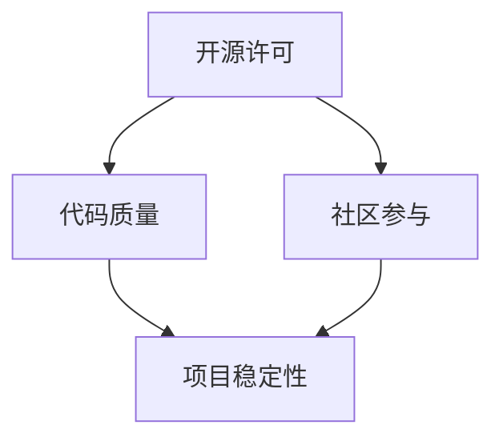

#### 1.2 开源项目在企业中的应用

开源项目在企业中的应用非常广泛，既可以作为内部开发工具，也可以作为产品和服务的重要组成部分。

- **内部开发工具：** 企业可以利用开源项目来提高开发效率。例如，使用Docker容器化技术来简化部署流程，使用Kubernetes进行容器编排，以及使用Jenkins进行持续集成和持续交付。

- **产品和服务：** 企业可以将开源项目转化为产品和服务，提供增值服务。例如，Red Hat公司基于Linux内核开发的Red Hat Enterprise Linux，以及阿里巴巴开源的中间件产品。

**核心算法原理讲解：**
```plaintext
// 开源项目在企业中的应用伪代码
function enterprise_usage_of_open_source_projects() {
    // 使用内部开发工具
    use_docker_for_deployment();
    use_kubernetes_for_orchestration();
    use_jenkins_for_ci_cd();

    // 将开源项目转化为产品和服务
    develop_product_based_on_open_source();
    provide_value_added_services();
}
```

#### 1.3 开源项目的生命周期

开源项目的生命周期通常包括以下阶段：

- **起步阶段（Bootstrapping）：** 项目创建初期，开发者需要关注代码质量和社区建设。

- **成长阶段（Growth）：** 随着社区的逐渐壮大，项目开始获得更多的关注和贡献。

- **成熟阶段（Maturity）：** 项目达到稳定状态，功能完善，社区活跃。

- **衰退阶段（Decline）：** 项目可能因为多种原因（如技术过时、社区解散等）进入衰退阶段。

**核心概念与联系：** 开源项目的生命周期与企业的产品生命周期有很多相似之处，都需要持续的关注和投入。

**Mermaid 流程图：**
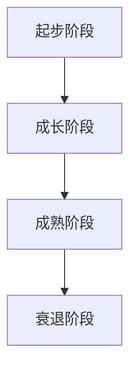

### 第2章：企业开源战略规划

#### 2.1 开源战略的重要性

企业开源战略是企业长期发展的重要组成部分。一个良好的开源战略可以帮助企业：

- **提高技术创新能力：** 通过参与开源项目，企业可以接触到最新的技术趋势和最佳实践。

- **降低研发成本：** 开源项目可以为企业提供现成的技术解决方案，减少重复开发的工作。

- **增强品牌影响力：** 参与开源项目可以提高企业的技术声誉，增加市场竞争力。

#### 2.2 开源战略的制定与实施

制定开源战略需要考虑以下几个方面：

- **目标设定：** 明确企业的开源目标，如技术创新、市场拓展等。

- **资源投入：** 根据开源目标，确定所需的资源，包括人力、资金和设备等。

- **项目选择：** 根据企业的技术方向和市场定位，选择合适的开源项目。

- **风险管理：** 开源项目的参与需要考虑到技术风险、法律风险等，制定相应的风险控制措施。

**核心算法原理讲解：**
```plaintext
// 开源战略制定与实施伪代码
function open_source_strategy_definition_and_implementation() {
    // 目标设定
    define_open_source_goals();

    // 资源投入
    allocate_resources();

    // 项目选择
    select_open_source_projects();

    // 风险管理
    manage_risks();
}
```

#### 2.3 开源项目的风险评估与管理

开源项目的风险主要包括：

- **技术风险：** 开源项目可能存在未知的bug和技术缺陷。

- **法律风险：** 开源项目可能涉及版权、专利等法律问题。

- **市场风险：** 开源项目的市场接受度可能存在不确定性。

为了有效管理这些风险，企业可以采取以下措施：

- **技术审查：** 对开源项目进行技术审查，确保项目的可靠性。

- **法律合规：** 遵守开源许可协议，确保项目的合法性。

- **市场调研：** 对市场进行调研，了解用户需求和项目潜力。

**核心概念与联系：** 风险评估和管理是开源战略规划的重要组成部分，关系到项目的长期健康发展。

**Mermaid 流程图：**
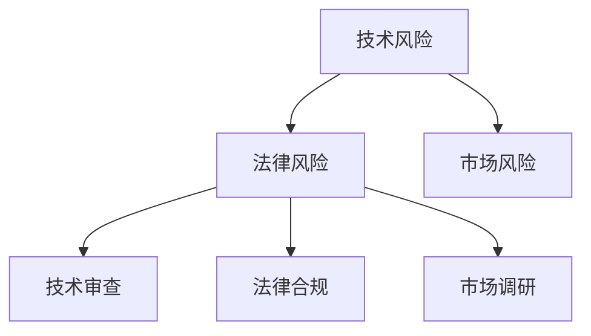

## 第二部分：课程设计

### 第3章：课程设计基础

#### 3.1 课程设计的目标与方法

课程设计的首要目标是确保学员能够全面掌握开源项目的知识和技术，同时培养他们的实际操作能力。为了实现这一目标，课程设计需要遵循以下原则：

- **理论与实践相结合：** 理论知识是基础，实际操作是关键。

- **逐步深入：** 课程内容应按照从简单到复杂的顺序安排，帮助学员逐步提高。

- **灵活性：** 课程设计应考虑学员的背景和需求，提供多种学习路径。

#### 3.2 课程内容规划

课程内容规划应包括以下方面：

- **基础知识：** 包括开源许可、版本控制、软件开发流程等。

- **技术深度：** 根据项目的特点，深入讲解相关技术，如Linux内核、容器技术、分布式系统等。

- **实战项目：** 设计实际项目，让学员在真实环境中应用所学知识。

**核心概念与联系：** 课程内容规划是课程设计的核心，需要充分考虑学员的需求和项目的特点。

**Mermaid 流程图：**
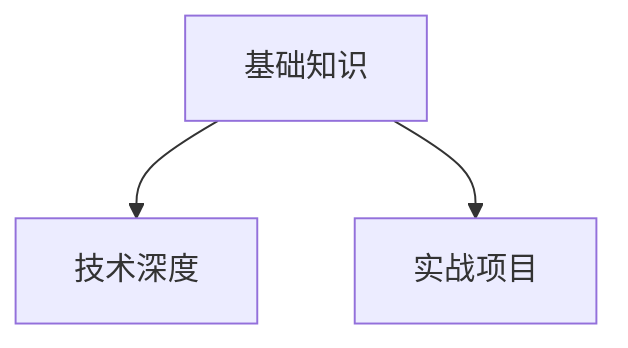

#### 3.3 教学资源与工具的选择

教学资源与工具的选择直接影响课程的教学效果。以下是一些常用的教学资源与工具：

- **书籍和教材：** 选择适合学员水平的开源书籍和教材，作为课程的基础材料。

- **在线课程：** 利用MOOC（大规模在线开放课程）平台，提供高质量的在线课程。

- **实验室环境：** 提供虚拟机或容器环境，让学员在真实环境中进行实验。

- **教学工具：** 使用教学工具（如Jupyter Notebook、Git等），方便学员进行学习和实验。

**核心算法原理讲解：**
```plaintext
// 教学资源与工具选择伪代码
function select_educational_resources_and_tools() {
    // 书籍和教材
    select_books_and_teaching_materials();

    // 在线课程
    select_online_courses();

    // 实验室环境
    provide_laboratory_environment();

    // 教学工具
    use_educational_tools();
}
```

### 第4章：课程内容开发

#### 4.1 开源知识体系构建

课程内容开发的第一步是构建开源知识体系。这包括以下几个方面：

- **技术栈梳理：** 明确项目所需的技术栈，包括编程语言、框架、工具等。

- **知识模块划分：** 将知识划分为不同的模块，如基础知识、核心技术、实战项目等。

- **内容组织：** 按照逻辑顺序组织内容，确保知识的连贯性和系统性。

**核心概念与联系：** 开源知识体系构建是课程内容开发的基础，决定了课程的教学质量和效果。

**Mermaid 流程图：**
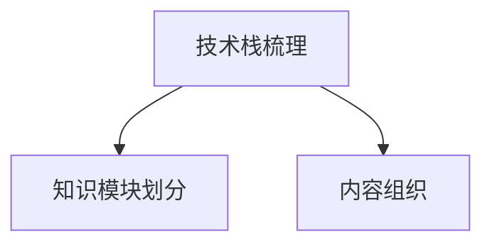

#### 4.2 核心内容讲解与案例分析

在课程内容开发中，核心内容讲解和案例分析是至关重要的。以下是一些关键点：

- **深入浅出：** 用通俗易懂的语言讲解复杂的技术概念。

- **实例分析：** 通过实际案例，展示技术的应用场景和解决方法。

- **互动讨论：** 引导学员参与讨论，加深对知识点的理解。

**核心概念与联系：** 核心内容讲解与案例分析是学员掌握技术知识的有效途径。

**Mermaid 流程图：**
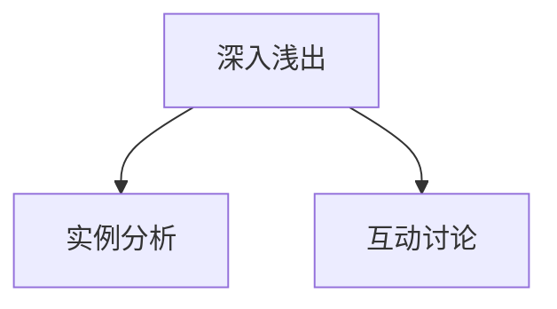

#### 4.3 实战操作与项目演练

实战操作和项目演练是课程内容开发的重要环节。以下是一些关键点：

- **动手实践：** 提供丰富的动手实践机会，让学员在实际操作中掌握技术。

- **项目设计：** 设计具有挑战性的项目，培养学员的综合能力。

- **反馈与改进：** 及时提供反馈，帮助学员改进学习效果。

**核心概念与联系：** 实战操作与项目演练是提升学员实际操作能力的关键。

**Mermaid 流程图：**
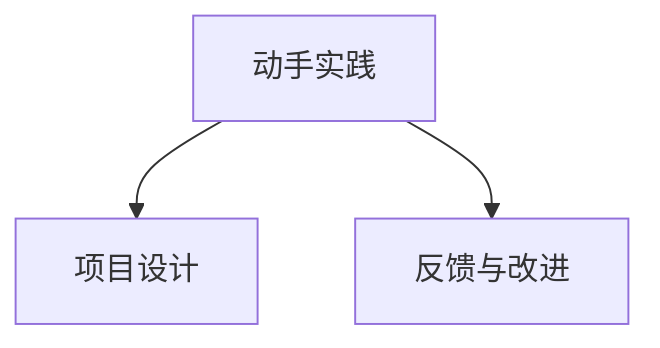

### 第5章：课程结构与教学方法

#### 5.1 课程结构设计

课程结构设计需要考虑以下几个方面：

- **模块划分：** 根据课程内容，将课程划分为不同的模块。

- **课时安排：** 根据模块的重要性和学习难度，合理分配课时。

- **顺序排列：** 按照逻辑顺序排列模块，确保知识的连贯性和系统性。

**核心概念与联系：** 课程结构设计是课程设计的核心，决定了课程的教学质量和效果。

**Mermaid 流程图：**
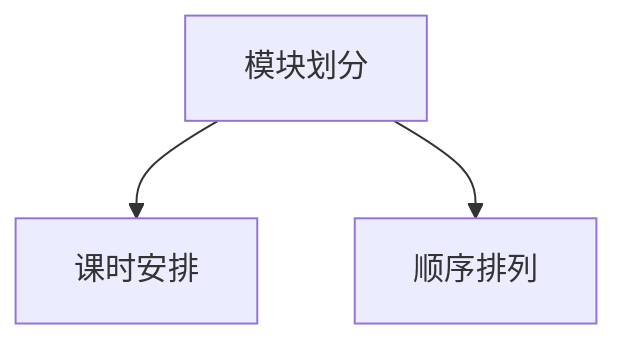

#### 5.2 教学方法与技巧

教学方法与技巧是课程设计的重要组成部分。以下是一些常用的教学方法与技巧：

- **讲授法：** 通过讲解，使学员掌握基础知识。

- **讨论法：** 引导学员参与讨论，提高学习兴趣和深度。

- **案例法：** 通过案例分析，使学员理解技术的应用。

- **实践法：** 提供实践机会，让学员在真实环境中应用所学知识。

**核心概念与联系：** 教学方法与技巧是提高学员学习效果的关键。

**Mermaid 流程图：**
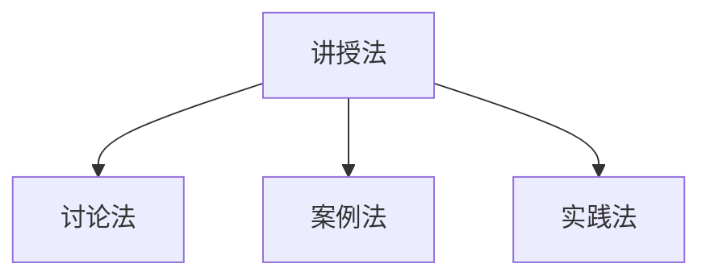

#### 5.3 互动与反馈机制

互动与反馈机制是课程设计的重要组成部分。以下是一些关键点：

- **课堂互动：** 通过提问、讨论等方式，激发学员的思考。

- **作业反馈：** 及时批改作业，提供详细的反馈意见。

- **在线讨论：** 利用论坛、聊天工具等，提供线上互动和讨论。

**核心概念与联系：** 互动与反馈机制是提高学员学习效果的重要手段。

**Mermaid 流程图：**
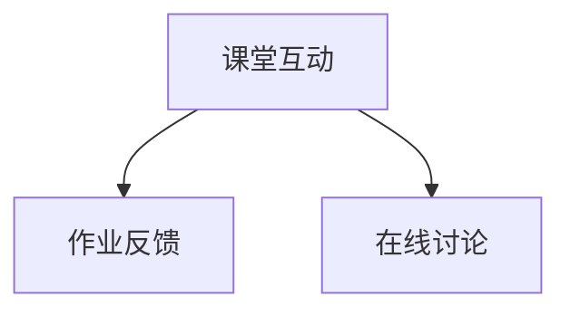

## 第三部分：营销策略

### 第6章：开源项目营销基础

#### 6.1 营销策略的制定

营销策略的制定是开源项目推广成功的关键。以下是一些关键点：

- **目标明确：** 明确营销目标，如提高项目知名度、吸引新用户、增加贡献者等。

- **市场分析：** 分析目标市场，了解用户需求和竞争对手情况。

- **策略制定：** 根据市场分析结果，制定具体的营销策略，如内容营销、社交媒体营销等。

**核心概念与联系：** 营销策略的制定是营销成功的前提，需要充分考虑市场和用户需求。

**Mermaid 流程图：**
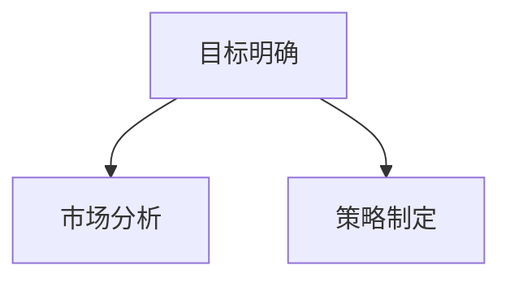

#### 6.2 社区营销策略

社区营销是开源项目营销的重要手段。以下是一些关键点：

- **建立社区：** 创建项目社区，为用户和贡献者提供交流和互动的平台。

- **内容营销：** 发布有价值的内容，如博客文章、技术文档、教程等，吸引用户关注。

- **互动与反馈：** 积极参与社区讨论，及时响应用户反馈，增强用户粘性。

**核心概念与联系：** 社区营销是开源项目营销的核心，需要充分利用社区资源。

**Mermaid 流程图：**
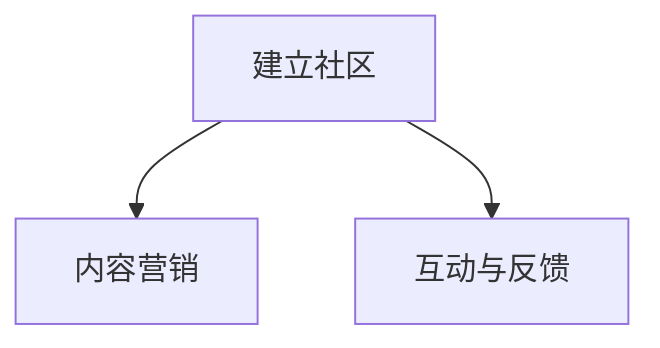

#### 6.3 线上线下营销手段

线上线下营销手段是开源项目营销的重要组合。以下是一些关键点：

- **线上营销：** 利用社交媒体、博客、论坛等线上渠道，推广项目。

- **线下活动：** 组织研讨会、工作坊、讲座等活动，提高项目的知名度。

- **合作伙伴：** 与其他开源项目或企业建立合作关系，共同推广项目。

**核心概念与联系：** 线上线下营销手段相辅相成，可以提高项目的曝光率和用户参与度。

**Mermaid 流�程图：**
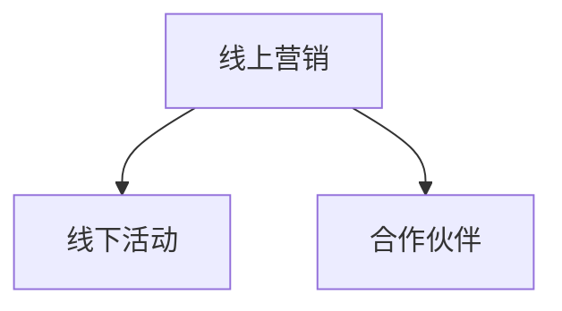

### 第7章：社交媒体营销

#### 7.1 社交媒体平台的选择

选择合适的社交媒体平台是社交媒体营销的关键。以下是一些常用的社交媒体平台：

- **Twitter：** 用于实时分享项目和社区动态，建立与用户的快速互动。

- **GitHub：** GitHub不仅是代码托管平台，也是开源项目社区的重要场所。

- **LinkedIn：** 用于建立专业人脉，提高项目的专业形象。

- **微信公众号：** 中国市场的主要社交媒体平台，适合发布技术文章和教程。

**核心概念与联系：** 社交媒体平台的选择应充分考虑目标用户和使用场景。

**Mermaid 流程图：**
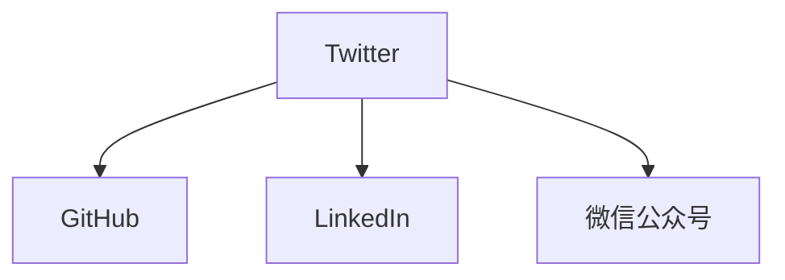

#### 7.2 内容营销与互动策略

内容营销与互动策略是社交媒体营销的核心。以下是一些关键点：

- **高质量内容：** 发布高质量的技术文章、教程、案例等，吸引用户关注。

- **互动互动：** 通过回复评论、参与讨论等方式，与用户建立互动。

- **定期更新：** 保持定期更新，提高用户粘性。

**核心概念与联系：** 内容营销与互动策略是社交媒体营销成功的关键。

**Mermaid 流程图：**
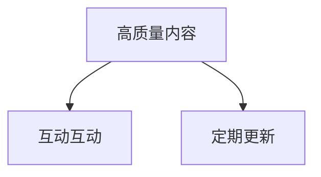

#### 7.3 KOL与合作伙伴营销

KOL与合作伙伴营销是社交媒体营销的有效手段。以下是一些关键点：

- **KOL合作：** 与行业内的意见领袖（KOL）合作，利用他们的影响力推广项目。

- **合作伙伴：** 与其他开源项目或企业建立合作伙伴关系，共同推广项目。

- **资源共享：** 通过资源共享，提高项目的曝光率和用户参与度。

**核心概念与联系：** KOL与合作伙伴营销可以扩大项目的受众范围，提高营销效果。

**Mermaid 流程图：**
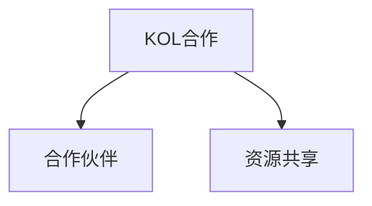

### 第8章：线下活动策划与执行

#### 8.1 活动策划与组织

活动策划与组织是线下营销的重要组成部分。以下是一些关键点：

- **目标设定：** 明确活动的目标，如提高项目知名度、吸引新用户等。

- **内容设计：** 设计吸引人的活动内容，如讲座、研讨会、工作坊等。

- **时间与地点：** 选择合适的时间和地点，确保活动顺利进行。

**核心概念与联系：** 活动策划与组织是线下营销成功的关键。

**Mermaid 流程图：**
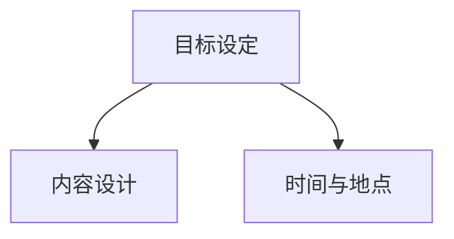

#### 8.2 活动宣传与推广

活动宣传与推广是提高活动参与度的关键。以下是一些关键点：

- **多渠道宣传：** 利用社交媒体、官方网站、邮件列表等渠道，宣传活动。

- **合作伙伴推广：** 与合作伙伴共同推广活动，扩大宣传范围。

- **互动环节：** 设计互动环节，提高用户参与度。

**核心概念与联系：** 活动宣传与推广是提高活动参与度的重要手段。

**Mermaid 流程图：**
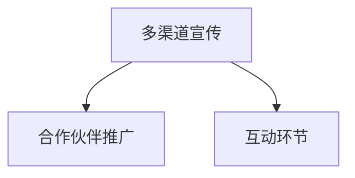

#### 8.3 活动效果评估与反馈

活动效果评估与反馈是活动策划的重要环节。以下是一些关键点：

- **参与人数：** 统计参与人数，了解活动受欢迎程度。

- **用户反馈：** 收集用户反馈，了解活动内容和组织的改进方向。

- **数据分析：** 利用数据分析工具，分析活动数据，为未来的活动提供参考。

**核心概念与联系：** 活动效果评估与反馈是优化活动策划的重要依据。

**Mermaid 流程图：**
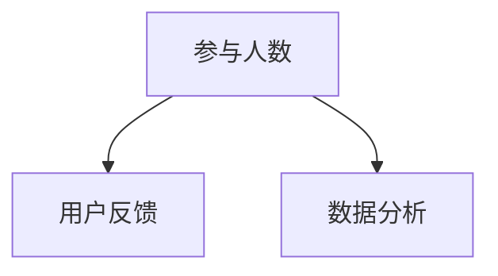

## 第四部分：课程推广与品牌建设

### 第9章：课程推广策略

#### 9.1 推广渠道选择

课程推广渠道选择是课程推广成功的关键。以下是一些常用的推广渠道：

- **社交媒体：** 利用微博、微信、知乎等社交媒体平台，发布课程信息。

- **专业论坛：** 利用CSDN、博客园等专业论坛，发布课程相关文章。

- **技术社区：** 利用GitHub、Stack Overflow等技术社区，推广课程。

- **线下活动：** 组织研讨会、讲座等活动，提高课程知名度。

**核心概念与联系：** 推广渠道选择应充分考虑目标用户和使用场景。

**Mermaid 流程图：**
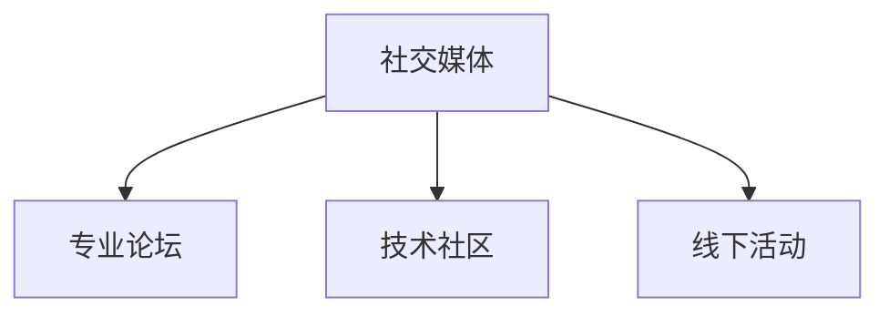

#### 9.2 推广内容设计

推广内容设计是课程推广的重要环节。以下是一些关键点：

- **课程介绍：** 设计详细的课程介绍，包括课程内容、教学目标等。

- **课程亮点：** 强调课程的核心亮点，如高质量的教学资源、实战项目等。

- **用户评价：** 分享学员的积极评价，提高课程的可信度。

**核心概念与联系：** 推广内容设计应充分考虑用户需求和课程特点。

**Mermaid 流程图：**
```mermaid
graph TB
    A[课程介绍] --> B[课程亮点]
    A --> C[用户评价]
```

#### 9.3 推广效果评估与调整

推广效果评估与调整是课程推广的重要环节。以下是一些关键点：

- **数据收集：** 收集推广活动的数据，如访问量、转化率等。

- **效果分析：** 分析推广效果，找出成功和失败的原因。

- **调整策略：** 根据效果分析结果，调整推广策略，优化推广效果。

**核心概念与联系：** 推广效果评估与调整是持续优化课程推广的重要手段。

**Mermaid 流程图：**
```mermaid
graph TB
    A[数据收集] --> B[效果分析]
    A --> C[调整策略]
```

### 第10章：品牌建设与传播

#### 10.1 品牌定位与形象塑造

品牌定位与形象塑造是品牌建设的关键。以下是一些关键点：

- **品牌定位：** 明确品牌的目标市场和核心竞争力。

- **品牌形象：** 设计符合品牌定位的视觉元素，如Logo、海报等。

- **品牌传播：** 利用各种渠道，传播品牌形象和价值观。

**核心概念与联系：** 品牌定位与形象塑造是品牌建设的基础，决定了品牌在市场中的地位和影响力。

**Mermaid 流程图：**
```mermaid
graph TB
    A[品牌定位] --> B[品牌形象]
    A --> C[品牌传播]
```

#### 10.2 品牌传播策略

品牌传播策略是品牌建设的重要组成部分。以下是一些关键点：

- **内容营销：** 通过高质量的内容，吸引目标受众，提高品牌知名度。

- **公关活动：** 组织新闻发布会、行业峰会等活动，提高品牌曝光率。

- **社交媒体：** 利用社交媒体平台，与用户建立互动，增强品牌影响力。

**核心概念与联系：** 品牌传播策略应充分考虑目标受众和使用场景。

**Mermaid 流程图：**
```mermaid
graph TB
    A[内容营销] --> B[公关活动]
    A --> C[社交媒体]
```

#### 10.3 品牌价值体现与延伸

品牌价值体现与延伸是品牌建设的重要目标。以下是一些关键点：

- **用户体验：** 提高用户体验，增强用户对品牌的认可。

- **合作伙伴关系：** 建立稳定的合作伙伴关系，共同推广品牌。

- **产品延伸：** 通过产品延伸，扩大品牌影响力。

**核心概念与联系：** 品牌价值体现与延伸是品牌持续发展的重要手段。

**Mermaid 流程图：**
```mermaid
graph TB
    A[用户体验] --> B[合作伙伴关系]
    A --> C[产品延伸]
```

### 第11章：开源社区管理与运营

#### 11.1 社区成员管理

社区成员管理是开源社区运营的核心。以下是一些关键点：

- **用户身份验证：** 确保社区成员的身份真实可靠。

- **权限管理：** 根据社区成员的贡献和角色，分配相应的权限。

- **激励机制：** 设立奖励机制，鼓励社区成员积极参与。

**核心概念与联系：** 社区成员管理是确保社区健康发展的基础。

**Mermaid 流程图：**
```mermaid
graph TB
    A[用户身份验证] --> B[权限管理]
    A --> C[激励机制]
```

#### 11.2 社区活动组织

社区活动组织是开源社区运营的重要环节。以下是一些关键点：

- **活动策划：** 设计有吸引力的活动，提高社区成员的参与度。

- **活动执行：** 确保活动顺利进行，提高活动效果。

- **活动反馈：** 收集活动反馈，不断改进活动质量。

**核心概念与联系：** 社区活动组织是增强社区活力的重要手段。

**Mermaid 流程图：**
```mermaid
graph TB
    A[活动策划] --> B[活动执行]
    A --> C[活动反馈]
```

#### 11.3 社区反馈与改进

社区反馈与改进是开源社区运营的重要环节。以下是一些关键点：

- **用户反馈收集：** 设立反馈渠道，收集用户对社区和项目的反馈。

- **问题解决：** 及时解决用户提出的问题，提高社区满意度。

- **持续改进：** 根据用户反馈，不断改进社区和项目质量。

**核心概念与联系：** 社区反馈与改进是社区持续发展的重要保障。

**Mermaid 流程图：**
```mermaid
graph TB
    A[用户反馈收集] --> B[问题解决]
    A --> C[持续改进]
```

## 附录

### 附录 A：开源项目资源汇总

#### A.1 开源项目工具与平台

- **GitHub：** 全球最大的代码托管平台，提供丰富的开源项目资源。

- **GitLab：** 开源代码仓库管理工具，支持私有项目和团队协作。

- **Docker：** 容器化技术，简化应用部署和运维。

- **Kubernetes：** 容器编排平台，用于自动化部署和管理容器化应用。

#### A.2 开源项目学习资料

- **开源书籍：** 如《Linux命令行与shell脚本编程大全》、《Docker实战》等。

- **在线教程：** 如菜鸟教程、极客学院等，提供丰富的开源技术教程。

- **博客文章：** 许多技术大牛和开源项目团队会在博客上分享技术心得和项目动态。

#### A.3 开源项目社区链接

- **开源中国：** 中国最大的开源社区，提供丰富的开源项目和技术讨论。

- **GitHub Trending：** GitHub上的热门项目排行榜，了解当前开源趋势。

- **Stack Overflow：** 开源社区问答平台，解决技术问题。

### 附录 B：营销案例解析

#### B.1 成功开源项目营销案例

- **TensorFlow：** Google开源的机器学习框架，通过高质量的技术文档和社区支持，吸引了大量开发者。

- **Kubernetes：** 通过KubeCon等线下活动，以及丰富的在线教程，成为容器编排领域的领导者。

#### B.2 营销失败案例分析

- **失败原因：** 缺乏明确的营销目标和策略，内容质量不高，用户参与度低。

#### B.3 案例总结与启示

- **总结：** 成功的营销需要明确的目标、高质量的内容和积极的社区互动。

- **启示：** 开源项目营销需要充分利用各种渠道，提供有价值的内容，并与用户建立紧密的互动关系。

## 作者信息

作者：AI天才研究院/AI Genius Institute & 禅与计算机程序设计艺术 /Zen And The Art of Computer Programming

## 结束语

本文旨在为开发者提供一套完整的企业级开源项目培训课程的创建和推广方案。通过系统化的分析，本文探讨了开源项目与企业发展、课程设计、营销策略、品牌建设和社区管理等方面的核心内容。希望本文能够为开源项目的推广和培训提供有益的参考和启示。|>

