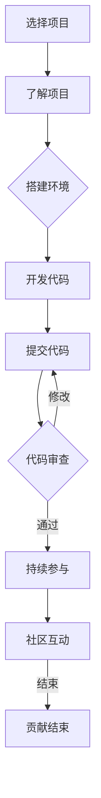

                 

## 第一部分：开源贡献基础

### 第1章：开源文化与职业发展

开源运动是一场关于软件共享和开放的革命，它的起源可以追溯到20世纪70年代末和80年代初。在这一背景下，自由软件基金会（FSF）和开放源代码倡议（OSI）先后成立，标志着开源文化的正式诞生。开源文化的核心价值观包括自由、共享、协作和创新，这些价值观不仅在软件领域产生了深远的影响，也在其他领域中得到了广泛的认同。

#### 开源运动的起源与发展

开源运动的历史可以追溯到1976年，当理查德·斯托曼（Richard Stallman）发布了GNU计划，旨在创建一个完全自由的操作系统。这个计划推动了自由软件基金会（FSF）的成立，该基金会致力于推广自由软件的理念。随后，1998年，开源倡议组织（OSI）成立，正式定义了开源的定义和许可证标准，进一步推动了开源运动的发展。

开源文化的核心价值观在于自由、共享、协作和创新。自由指的是用户拥有对软件的复制、修改和再分发的权利。共享意味着开发者愿意将代码和知识共享给他人，以便共同改进。协作则强调多人共同参与，共同解决问题。创新是开源文化鼓励的创新思维和实践，使得技术进步不断加速。

#### 开源文化的核心价值观

开源文化的核心价值观包括以下几个方面：

1. **自由**：开源强调用户的自由，包括运行、研究、修改和分发软件的自由。这种自由促进了技术的广泛传播和普及。
   
2. **共享**：开源鼓励开发者共享代码和技术，这种共享促进了知识的传播和技术的进步。

3. **协作**：开源项目通常采用协作方式，多个开发者共同合作，共同解决问题，提高了项目的质量和效率。

4. **创新**：开源文化鼓励创新思维和实践，使得新技术和解决方案能够迅速出现并被采纳。

开源文化与传统的封闭式软件开发模式有着本质的不同。在封闭式模式中，软件的源代码通常是不公开的，只有少数授权人员能够访问和修改。而在开源模式中，源代码是公开的，任何人都可以查看、修改和分发。

#### 开源贡献与职业成长的联系

开源贡献在职业成长中扮演着重要的角色。首先，开源项目提供了一个展示个人技能和项目的平台。通过参与开源项目，开发者可以展示自己的代码质量、解决问题的能力和项目经验。这在求职和晋升过程中，成为了一张重要的名片。

其次，开源贡献可以增强技术技能。参与开源项目，开发者需要学习新的技术和工具，解决各种复杂的问题。这种实践性的学习方式，比传统的课堂教学更有效，能够更快地提高技术水平。

此外，开源贡献还有助于建立人脉和社区影响力。开源社区是一个全球性的网络，通过参与开源项目，开发者可以结识到来自不同地区、不同行业的专业人士。这些联系对于职业发展非常重要，可以为未来的合作和机会提供支持。

#### 如何评估开源贡献的价值

评估开源贡献的价值需要从多个维度进行考虑：

1. **代码质量**：高质量的代码是评估贡献的重要标准。良好的代码结构、清晰的注释、有效的错误处理和优化的性能都是评估代码质量的关键因素。

2. **代码贡献量**：代码贡献量是衡量贡献程度的一个直接指标。贡献的代码行数、功能模块的大小和复杂性都是评估贡献量的重要因素。

3. **参与时间**：参与开源项目的时间长度可以反映贡献者的持续性和热情。长期参与项目，不断贡献新功能和优化代码，表明贡献者对项目的承诺和投入。

4. **社区互动**：社区互动是评估贡献价值的另一个重要维度。积极参与社区讨论、回答问题、参与代码审查，可以增强社区影响力，提高项目的质量。

5. **项目影响力**：项目的影响力和活跃度也是评估贡献价值的一个重要因素。参与一个活跃、影响力大的开源项目，可以带来更多的机会和资源。

#### 职场中的开源应用

在现代职场中，开源项目已经成为招聘和职业发展的重要参考。许多公司和组织对开源贡献非常重视，将其视为评估候选人的重要标准之一。以下是一些开源项目在职场中的应用：

1. **招聘过程中的作用**：开源项目成为面试官评估候选人技能的一个重要渠道。通过查看候选人在开源项目中的贡献记录，面试官可以了解候选人的技术实力、解决问题的能力和团队合作精神。

2. **职业晋升的助力**：参与开源项目可以帮助员工在职业晋升中脱颖而出。在简历中展示自己在开源项目中的贡献，可以增加面试机会，提高晋升的可能性。

3. **企业对开源的重视程度**：越来越多的企业开始重视开源项目，认为开源贡献是员工技能和潜力的体现。许多公司鼓励员工参与开源项目，甚至提供时间和资源支持。

#### 结论

开源文化与职业发展有着紧密的联系。开源项目不仅提供了一个展示技能和项目的平台，还可以增强技术技能、建立人脉和社区影响力。通过评估开源贡献的价值，企业可以更好地识别和培养人才。对于开发者而言，积极参与开源项目是提升职业发展的重要途径。在接下来的章节中，我们将进一步探讨开源工具和技术，以及如何在开源项目中实践和提升。

### 第2章：开源工具与技术

在开源文化的推动下，各种开源工具和技术层出不穷，为开发者提供了丰富的资源和支持。本章将详细介绍一些常用的开源工具和技术，包括版本控制、代码管理平台以及协作工具，帮助开发者更好地理解和利用开源资源。

#### 版本控制与协作工具

版本控制是开源项目中不可或缺的一部分，它确保了代码的版本一致性和历史的可追溯性。Git是目前最流行的版本控制系统，它基于分布式模型，支持多种协作方式，能够高效地管理代码库和项目历史。

#### Git的基本概念

Git的核心概念包括：

1. **仓库（Repository）**：Git仓库是存储项目代码和历史记录的地方。每个Git仓库都包含一个`.git`目录，其中保存了所有的版本信息。

2. **分支（Branch）**：分支是代码的独立副本，用于开发新功能或修复bug。在Git中，可以有多个分支同时存在，每个分支都有自己独立的历史记录。

3. **提交（Commit）**：提交是将更改保存到仓库的过程。每次提交都会生成一个新的版本，并记录更改的详细信息，如作者、提交日期和说明。

4. **拉取请求（Pull Request，PR）**：拉取请求是开源项目中的一种协作方式，用于提议将某个分支的更改合并到主分支。通过拉取请求，开发者和项目维护者可以审查、讨论和合并代码。

#### Git的操作流程

Git的基本操作流程包括以下几个步骤：

1. **克隆仓库（Clone）**：将远程仓库克隆到本地，创建本地副本。
    ```sh
    git clone https://github.com/username/repository.git
    ```

2. **初始化本地仓库（Initialize）**：在本地仓库中初始化Git跟踪。
    ```sh
    cd repository
    git init
    ```

3. **添加文件（Add）**：将文件添加到暂存区。
    ```sh
    git add <file>
    ```

4. **提交更改（Commit）**：将暂存区的更改提交到仓库。
    ```sh
    git commit -m "Commit message"
    ```

5. **推送到远程仓库（Push）**：将本地的更改推送到远程仓库。
    ```sh
    git push origin main
    ```

6. **拉取远程更改（Pull）**：从远程仓库拉取最新的更改。
    ```sh
    git pull origin main
    ```

#### 代码管理平台

代码管理平台是管理和协作开源项目的核心工具，其中最著名的平台是GitHub和GitLab。这些平台提供了丰富的功能，包括代码托管、问题跟踪、代码审查和持续集成等。

#### GitHub的功能与使用

GitHub是世界上最受欢迎的代码托管平台，其功能包括：

1. **代码托管**：GitHub提供了无限的私有仓库和免费的公共仓库，方便开发者托管和共享代码。

2. **问题跟踪**：GitHub内置了问题跟踪功能，开发者可以在项目中创建、分配和追踪问题。

3. **代码审查**：通过拉取请求，开发者可以提交代码并进行审查，确保代码的质量和一致性。

4. **持续集成**：GitHub Actions提供了自动化构建和部署的功能，确保代码的可靠性和性能。

#### GitLab的部署与维护

GitLab是一个开源的代码管理平台，它提供了与GitHub类似的功能，同时还具备企业级特性。GitLab的部署与维护包括以下几个步骤：

1. **安装与配置**：GitLab可以安装在本地服务器或云服务器上。安装完成后，需要进行配置，包括数据库连接、用户权限设置等。

2. **日常维护**：定期备份GitLab的数据，更新软件版本，监控服务器性能，确保平台的稳定运行。

3. **扩展与定制**：GitLab支持各种插件和扩展，可以根据企业的需求进行定制。

#### 其他开源协作工具

除了Git和代码管理平台，还有其他一些开源协作工具，如Jenkins和Docker，它们在持续集成和容器化技术中发挥着重要作用。

#### Jenkins的持续集成

Jenkins是一个开源的持续集成工具，它可以帮助开发者自动化构建、测试和部署应用程序。Jenkins的主要功能包括：

1. **自动化构建**：Jenkins可以定期或手动触发构建过程，确保代码的稳定性和一致性。

2. **测试执行**：Jenkins可以运行各种测试脚本，包括单元测试、集成测试和性能测试。

3. **部署**：Jenkins可以将构建的结果部署到不同的环境，如开发、测试和生产环境。

#### Docker的容器化技术

Docker是一种轻量级的容器化技术，它可以将应用程序及其依赖环境打包成一个容器，确保应用程序在不同环境中的一致性和可移植性。Docker的主要特点包括：

1. **轻量级**：Docker容器非常轻量，可以快速启动和停止。

2. **隔离性**：Docker容器提供了严格的资源隔离，确保容器之间互不干扰。

3. **可移植性**：Docker容器可以在不同的操作系统和硬件平台上运行，提高了应用程序的可移植性。

通过学习和掌握这些开源工具和技术，开发者可以更高效地参与开源项目，提高代码质量和协作效率。在接下来的章节中，我们将进一步探讨如何选择开源项目、参与开源社区，以及如何进行开源贡献，帮助开发者更好地提升职业发展。

### 第3章：从零开始贡献开源项目

参与开源项目不仅是提升技术能力的重要途径，也是拓展人脉和展示才华的平台。那么，如何从零开始贡献开源项目呢？本章将详细介绍如何选择开源项目、了解开源项目以及提交第一个Pull Request。

#### 选择开源项目

选择一个适合参与的开源项目是贡献开源的第一步。以下是一些选择开源项目的建议：

1. **评估项目活跃度**：一个活跃的项目意味着有更多的人参与和维护，这有助于你更快地融入社区。你可以通过查看项目的贡献者数量、提交频率和问题反馈速度来评估项目的活跃度。

2. **了解项目的历史和愿景**：了解项目的起源、发展历程和愿景可以帮助你更好地理解项目的发展方向，从而做出更有针对性的贡献。

3. **项目的难度和类型**：选择一个难度适中、类型符合你兴趣的项目。初学者可以从一些较为简单和入门的项目开始，逐渐提高自己的技术水平。

4. **社区的友好程度**：一个友好和包容的社区可以让你感到更舒适，更容易参与和贡献。你可以通过阅读社区讨论、查看问题解决速度和方式来评估社区的友好程度。

#### 评估开源项目的活跃度与影响力

评估开源项目的活跃度与影响力是选择合适项目的重要环节。以下是一些常用的方法：

1. **贡献者数量**：一个项目如果有大量的贡献者，通常意味着它具有较高的活跃度。你可以通过查看项目的贡献者列表和贡献图表来评估贡献者数量。

2. **提交频率**：项目的提交频率可以反映项目的开发进度和活跃度。你可以查看项目的提交历史记录，了解项目是否在持续更新。

3. **问题反馈速度**：一个高效的问题反馈机制可以快速解决开发者遇到的问题，提高项目的质量。你可以查看项目的 Issue 板，了解问题的反馈和处理速度。

4. **社区参与度**：社区参与度可以通过社区的活跃度、论坛讨论和邮件列表来评估。一个活跃的社区可以提供更多的支持和资源。

#### 如何挑选适合参与的开源项目

挑选适合参与的开源项目需要综合考虑多个因素。以下是一些具体的步骤：

1. **浏览开源平台**：如GitHub、GitLab等，查找感兴趣的项目。

2. **阅读项目的 README 文件**：README 文件通常包含了项目的概述、使用方法和贡献指南。

3. **研究项目的代码结构与架构**：通过查看项目的代码结构和文档，了解项目的技术栈和架构。

4. **参与社区讨论**：在项目的讨论区或社区论坛中，了解项目的现状和未来发展计划。

5. **评估项目的影响力和需求**：了解项目在行业中的影响力和未来的发展方向，以及项目当前面临的挑战和需求。

#### 了解开源项目

在挑选了合适的项目后，下一步是深入了解项目，确保自己能够顺利参与其中。以下是一些了解开源项目的方法：

1. **阅读项目的 README 文件**：README 文件通常包含了项目的概述、安装指南、使用方法和贡献指南。这是了解项目的第一步。

2. **研究项目的代码结构与架构**：通过查看项目的代码结构和文档，了解项目的技术栈和架构。这有助于你理解项目的实现细节。

3. **阅读项目的文档**：许多开源项目都会提供详细的文档，包括用户指南、开发者文档和代码注释。这些文档是了解项目的重要资源。

4. **查看项目的代码库**：通过查看项目的代码库，了解项目的代码风格和编码规范。这有助于你更快地融入项目。

5. **参与社区讨论**：在项目的讨论区或社区论坛中，与项目维护者和其他贡献者交流，了解项目的现状和未来发展计划。

#### 提交第一个Pull Request

提交第一个Pull Request是参与开源项目的关键步骤。以下是一些提交Pull Request的技巧和注意事项：

1. **编写良好的代码规范**：遵循项目的代码规范，包括命名约定、代码格式和注释规范。这有助于项目维护者更快地审查你的代码。

2. **编写详细的Pull Request说明**：在Pull Request中，详细描述你的更改内容和目的。这有助于项目维护者理解你的意图和改进建议。

3. **避免一次提交多个修改**：每个Pull Request应集中解决一个问题或改进。这样可以简化代码审查和合并过程。

4. **处理代码审查的反馈**：认真对待项目维护者的反馈，根据建议进行修改。这有助于提高代码质量和项目的整体质量。

5. **持续参与和改进**：提交Pull Request只是开始，持续参与项目，积极修复问题和优化代码，有助于你在开源社区中获得更多的认可和机会。

通过以上步骤，你可以从零开始参与开源项目，提升技术能力，展示个人才华，并在开源社区中建立良好的声誉。在下一章中，我们将进一步探讨如何在开源项目中维护和优化代码，确保项目的长期健康发展。

### 第4章：开源项目的维护与优化

在参与开源项目的过程中，除了提交代码和解决bug，维护和优化代码也是至关重要的。良好的代码维护和优化不仅能够提高项目的稳定性和性能，还能增强社区成员的参与感和信任。本章将详细介绍如何在开源项目中参与社区、进行代码审查与反馈，以及如何持续优化开源项目。

#### 参与开源社区

开源社区是一个由志愿者组成的全球性网络，成员们共同致力于开源项目的发展。积极参与开源社区可以帮助你更好地理解项目的现状和未来方向，同时也能为项目带来新的思路和资源。以下是一些参与开源社区的方式：

1. **参与社区讨论**：大多数开源项目都会在GitHub、Reddit或其他论坛上设有讨论区。通过参与社区讨论，你可以了解项目的最新动态、提交建议和反馈。

2. **回答问题和提建议**：在社区中，经常会有新手或遇到问题的开发者提问。积极参与回答问题和提建议，可以帮助你更好地理解项目需求和社区的期望。

3. **参与代码审查**：许多开源项目会邀请贡献者参与代码审查。作为代码审查者，你需要仔细阅读提交的代码，并提供改进建议。

4. **组织或参与会议**：一些大型开源项目会定期组织会议，讨论项目的进展、规划和未来方向。参与这些会议可以让你更深入地了解项目的现状和发展。

5. **撰写文档**：高质量的文档对于开源项目非常重要。你可以撰写用户指南、开发者文档或代码注释，帮助新手更好地理解和使用项目。

#### 参与开源社区的方式

1. **加入项目的邮件列表或论坛**：大多数开源项目都会提供一个邮件列表或论坛，用于讨论项目相关的话题。通过订阅邮件列表或论坛，你可以及时了解项目的最新动态和社区的讨论。

2. **阅读并遵循项目的贡献指南**：每个开源项目都会有一个贡献指南，详细说明了如何参与项目、提交代码和进行代码审查。遵循这些指南可以帮助你更高效地参与项目。

3. **参与社区活动**：许多开源项目会定期组织代码马拉松、技术研讨会或其他社区活动。参与这些活动可以让你结识更多的开源爱好者，拓展人脉。

#### 在开源社区中的交流技巧

1. **尊重和包容**：开源社区是一个多元化的环境，尊重不同的观点和经验是非常重要的。在交流中，保持礼貌和包容，避免争吵和冲突。

2. **保持耐心和持续参与**：开源项目的发展是一个长期的过程，需要耐心和持续的努力。在遇到问题和挑战时，不要轻易放弃，而是持续参与和努力。

3. **积极解决问题**：在社区中，遇到问题时，不要只关注自己的问题，而是尝试帮助其他成员解决问题。这样可以增强社区的凝聚力，提高项目的影响力。

4. **保持沟通和透明度**：在参与项目时，保持与社区成员的沟通和透明度。及时更新项目的进度和遇到的问题，可以增强社区的信任和参与度。

#### 代码审查与反馈

代码审查是确保开源项目质量的重要环节。通过代码审查，开发者可以识别潜在的问题、发现代码的改进空间，并提高代码的一致性和可维护性。以下是一些代码审查的标准与流程：

1. **审查标准**：

   - **代码规范**：确保代码遵循项目的编码规范，包括命名约定、代码格式和注释规范。
   - **代码质量**：审查代码的可读性、可维护性和性能。确保代码逻辑清晰、没有冗余和错误。
   - **测试覆盖率**：审查代码的测试覆盖率，确保关键功能都有相应的测试用例。
   - **安全性**：审查代码是否存在安全漏洞，如SQL注入、XSS攻击等。

2. **审查流程**：

   - **初始审查**：项目维护者或指定的代码审查者对提交的代码进行初步审查，识别明显的错误或不符合规范的地方。
   - **详细审查**：详细审查代码的细节，包括变量命名、函数设计、代码结构等。这通常由多个审查者分工合作完成。
   - **反馈与讨论**：审查者将反馈和建议通过Pull Request或邮件列表与贡献者进行讨论。贡献者根据反馈进行修改，然后重新提交代码。

#### 如何处理代码审查的反馈

1. **认真阅读反馈**：在收到代码审查反馈后，仔细阅读并理解每一条建议。不要忽视任何细节，因为每一条反馈都可能对代码的质量和项目的整体表现产生重要影响。

2. **及时回复和更新**：对审查者的反馈及时回复，说明你对建议的理解和计划如何进行修改。在修改代码后，及时更新Pull Request，以便审查者可以继续审查。

3. **保持沟通和协作**：在处理反馈过程中，保持与审查者的沟通和协作。如果有疑问或不同意见，可以积极讨论，寻求最佳解决方案。

4. **持续改进**：代码审查不仅是为了通过审核，更是为了提高代码质量。在每次审查后，认真总结经验教训，持续改进代码和审查流程。

#### 开源项目的持续优化

开源项目的优化是一个持续的过程，需要不断关注项目的性能、可维护性和用户体验。以下是一些优化开源项目的策略：

1. **性能优化**：

   - **代码分析**：使用代码分析工具，如SonarQube，识别潜在的代码问题和性能瓶颈。
   - **性能测试**：定期进行性能测试，识别和修复性能问题。

2. **代码重构**：

   - **模块化**：将复杂的代码拆分成更小的模块，提高代码的可维护性和复用性。
   - **优化函数和类**：简化函数和类的实现，消除冗余代码，提高代码的可读性。

3. **测试覆盖**：

   - **增加测试用例**：确保关键功能和边界条件都有相应的测试用例。
   - **自动化测试**：使用自动化工具进行单元测试、集成测试和性能测试。

4. **文档与示例**：

   - **完善文档**：为项目编写详细的用户指南、开发者文档和代码注释，帮助新手和贡献者更好地理解和使用项目。
   - **提供示例代码**：提供实用的示例代码，展示如何使用项目的主要功能。

5. **社区反馈**：

   - **定期收集反馈**：通过社区讨论、问卷调查等方式，定期收集用户和贡献者的反馈，了解项目的优点和改进空间。
   - **及时响应**：对反馈的问题和需求，及时响应和解决，增强社区的参与感和信任。

通过以上策略，开源项目可以持续优化，提高项目的质量、稳定性和用户体验。在开源社区的支持下，项目可以不断进步，为更多的开发者带来价值。

#### 结论

开源项目的维护与优化是开源生态系统的重要组成部分。通过积极参与开源社区、进行代码审查与反馈，以及持续优化项目，开发者可以为开源项目贡献自己的力量，同时提升自己的技能和经验。在开源社区中，每个人都有机会发挥自己的作用，共同推动技术的进步和创新。在下一章中，我们将探讨开源贡献在职业发展中的应用，以及如何在开源社区中发现职业机会。

### 第5章：开源贡献的职业应用

开源贡献不仅有助于提升个人技能和知识，还能在职业发展中发挥重要作用。本文将深入探讨开源贡献作为职业优势、简历中的展示方式、面试中的表现，以及开源项目在求职与晋升中的实际案例。

#### 开源贡献作为职业优势

在现代社会，技术竞争日益激烈，拥有独特的技能和经验成为求职者脱颖而出的关键。开源贡献为开发者提供了一个展示技能和项目的平台，以下几个方面的优势使得开源贡献成为职业发展的重要助力。

1. **技能展示**：通过参与开源项目，开发者可以展示自己在技术方面的能力和知识。高质量的代码、有效的bug修复和功能优化都是展示技能的绝佳机会。

2. **项目经验**：开源项目提供了一个实际工作的环境，开发者可以在项目中积累丰富的实战经验。这种经验对于理解和解决实际问题非常有帮助。

3. **问题解决能力**：开源项目通常面临各种复杂的问题和挑战，参与开源项目的开发者需要具备强大的问题解决能力。这种能力在求职过程中具有很强的竞争力。

4. **协作和沟通能力**：开源项目通常需要多人合作，这有助于开发者提升协作和沟通能力。在现代职场中，这些软技能同样至关重要。

#### 简历中的开源贡献

在简历中展示开源贡献是让招聘者了解你的技能和经验的重要方式。以下是一些建议，帮助你在简历中有效展示开源贡献：

1. **突出项目名称和贡献内容**：在简历中，明确列出参与的开源项目名称和你的具体贡献内容。例如，你可以提到你修复的bug、添加的功能或优化代码的部分。

2. **使用具体数据和成果**：如果你在项目中取得了显著成果，如提升了项目性能、增加了用户量等，可以具体列出这些数据。这有助于展示你的实际贡献和项目影响力。

3. **强调技术栈和工具使用**：详细描述你在项目中所使用的技术栈和工具，如编程语言、版本控制工具、测试框架等。这可以帮助招聘者了解你的技术背景和熟练程度。

4. **代码链接和示例**：提供项目的GitHub链接，方便招聘者查看你的代码和贡献。如果有具体的代码片段或优化案例，也可以附上示例。

#### 面试中的开源项目展示

在面试中，展示开源项目可以为你赢得加分。以下是一些建议，帮助你在面试中有效展示开源项目：

1. **准备详细的项目介绍**：在面试前，准备好项目的详细介绍，包括项目的背景、目标、你的角色和具体贡献。这将有助于面试官更好地理解你的项目。

2. **展示关键代码和优化**：挑选一些关键的代码片段或优化案例进行展示。这可以直观地展示你的技术能力和问题解决能力。

3. **讨论项目中的挑战和解决方案**：讨论你在项目中遇到的挑战和如何解决这些问题。这可以展示你的问题解决能力和团队协作能力。

4. **强调项目对你的成长**：在面试中，强调参与开源项目对你的成长和技能提升的影响。这可以帮助招聘者了解你的职业态度和学习能力。

#### 开源项目在求职与晋升中的实际案例

以下是一些开源项目在求职与晋升中的实际案例，展示了开源贡献如何帮助开发者成功获得职位和晋升。

1. **求职成功案例**：一名开发者通过参与某个知名开源项目，展示了他在Python和Django方面的技术能力。在面试过程中，他详细介绍了自己的项目和贡献，最终成功获得了一份理想的工作。

2. **晋升案例**：一名资深开发者通过持续参与开源项目，展示了他的技术领导力和项目管理能力。他在项目中担任了核心贡献者的角色，并成功领导了一个大型项目的发布。这些贡献为他赢得了晋升机会，从工程师晋升为技术经理。

3. **职业转型案例**：一名有多年传统软件开发经验的开发者，通过参与开源项目，转型为云计算和容器化技术专家。他在项目中展示了对Kubernetes和Docker的深刻理解，并成功在一家知名云服务公司获得了职位。

#### 结论

开源贡献在职业发展中具有不可替代的价值。通过展示开源贡献，开发者可以增强简历、提升面试表现，并在求职与晋升中脱颖而出。在下一章中，我们将探讨开源项目的国际化与全球化，帮助开发者更好地理解和参与国际化的开源社区。

### 第6章：开源项目的国际化与全球化

在当今全球化的时代，开源项目的国际化与全球化已经成为趋势。越来越多的开源项目吸引了来自全球的开发者参与，这不仅促进了技术交流与合作，也为开源社区带来了多样性和创新。本章将探讨国际化开源项目的挑战与解决方案，以及如何成为全球化开源社区的一员。

#### 国际化开源项目的挑战

国际化开源项目面临一系列挑战，包括语言、文化和沟通等方面的障碍。以下是一些主要的挑战：

1. **语言障碍**：大多数开源项目使用英语作为主要语言，这对于非英语母语的开发者来说可能是一个挑战。语言不通可能导致理解困难和沟通障碍。

2. **文化差异**：不同国家和地区的开发者可能拥有不同的工作习惯、文化背景和价值观。文化差异可能导致协作困难、误解和冲突。

3. **时区差异**：全球化的开源项目通常由来自不同时区的开发者组成。时区差异可能影响实时沟通和协作，增加项目的复杂度。

4. **技术栈不一致**：不同地区的开发者可能使用不同的技术栈和工具，这可能导致兼容性和集成问题。

#### 解决国际化开源项目的挑战

为了克服这些挑战，开源项目可以采取以下解决方案：

1. **多语言支持**：开源项目可以提供多语言文档和代码注释，帮助非英语母语的开发者更好地理解项目。此外，项目维护者可以鼓励使用常见的编程语言和框架，提高项目的兼容性。

2. **文化敏感性和包容性**：项目维护者应重视文化多样性，尊重不同国家和地区的文化习惯和价值观。通过建立包容性的社区文化，可以减少文化差异带来的冲突。

3. **时区协调**：项目可以制定共同的协作时间表，尽可能避免时区差异。例如，通过使用时间管理工具如世界时钟和时间表，可以更好地协调全球开发者的时间。

4. **技术标准化**：项目可以采用广泛认可的技术标准和工具，确保项目的一致性和兼容性。例如，使用Docker和Kubernetes等标准化技术，可以简化跨地区部署和集成。

#### 如何成为全球化开源社区的一员

成为全球化开源社区的一员，可以让你在全球范围内建立人脉、提升技术能力，并参与到前沿技术的开发中。以下是一些建议，帮助开发者成为全球化开源社区的一员：

1. **参与国际化开源项目**：选择一个具有国际化视野的开源项目，积极参与其中。这可以是某个全球知名的开源项目，也可以是本地社区中具有国际影响力的项目。

2. **学习国际化的沟通技巧**：提升英语水平，学习跨文化沟通的技巧，这有助于更好地与全球开发者交流。可以通过参加英语培训课程、阅读英文技术文档和参与英文社区讨论来提高语言能力。

3. **贡献代码和文档**：通过提交高质量的代码、修复bug、撰写文档和编写测试用例，为开源项目做出实际贡献。这可以增强你的社区影响力，并为你赢得国际声誉。

4. **参与全球开源活动**：参加国际开源会议、代码马拉松和技术研讨会，与全球开发者面对面交流。这些活动不仅提供了学习和分享的机会，还能帮助建立国际人脉。

5. **建立个人品牌**：在全球开源社区中建立个人品牌，通过撰写博客、发表技术文章和分享开源项目，展示你的技术能力和专业知识。这可以吸引更多的关注，为你的职业发展带来机遇。

#### 全球化开源社区的趋势

随着互联网的普及和技术的发展，全球化开源社区正呈现出以下趋势：

1. **多元化**：全球化开源社区越来越多元化，吸引了来自不同国家、地区和文化背景的开发者。这种多样性带来了新的视角和创意，促进了技术的创新。

2. **协作化**：全球化开源社区强调协作和共享，开发者可以通过远程协作工具和平台，共同推进项目的进展。协作化的趋势使得开源项目的效率和质量得到了显著提升。

3. **国际化标准**：越来越多的开源项目采用国际化的标准和规范，如云原生计算、人工智能和区块链等领域的标准。这些国际标准有助于提升项目的兼容性和互操作性。

4. **商业合作**：全球化开源社区中的合作不断加深，开源项目与企业合作，推动技术的商业化应用。例如，许多企业通过赞助开源项目，支持开源社区的发展。

#### 结论

国际化与全球化是开源社区发展的必然趋势，它为开发者提供了广阔的舞台和无限的机会。通过参与国际化开源项目，学习国际化的沟通技巧，以及积极参与全球开源活动，开发者可以提升自己的技能和经验，为全球开源社区做出贡献。在下一章中，我们将探讨开源贡献中的道德与法律问题，帮助开发者更好地理解和遵守开源社区的规范。

### 第7章：开源贡献的道德与法律问题

在开源社区中，道德和法律问题一直是开发者需要关注的重要议题。正确的道德和法律行为不仅能够保护开发者和开源社区的权益，还能确保项目的长期健康和可持续发展。本章将详细探讨开源许可与版权、开源社区的道德规范以及开源贡献中的法律风险，帮助开发者更好地理解和遵守开源社区的规范。

#### 开源许可与版权

开源许可协议是开发者在使用和贡献开源代码时需要严格遵守的法律文件。常见的开源许可协议包括GPL（GNU通用公共许可证）、MIT（麻省理工学院许可证）、Apache许可证等。以下是一些主要的开源许可协议：

1. **GPL（GNU通用公共许可证）**：GPL是自由软件基金会推出的许可证，旨在确保软件的自由和开源。GPL协议要求任何修改或衍生作品也必须采用GPL许可证，这保证了代码的开放性和共享性。

2. **MIT（麻省理工学院许可证）**：MIT许可证是一种宽松的许可协议，允许开发者自由使用、修改和分发代码，但要求在分发时保留原始许可协议的声明。

3. **Apache许可证**：Apache许可证是一种平衡的许可协议，允许开发者自由使用、修改和分发代码，同时允许对代码进行商业化应用，但要求保留原始许可协议的声明。

了解和选择合适的开源许可协议对于开发者至关重要。这不仅关系到代码的使用权和分发权，也影响到项目的可持续发展。

#### 开源社区的道德规范

开源社区是一个基于共同价值观和目标组成的社区，其道德规范对于维护社区的健康和活力至关重要。以下是一些常见的开源社区道德规范：

1. **尊重他人**：在开源社区中，开发者应尊重他人的观点和贡献。避免歧视、侮辱和恶意攻击，营造一个友好、包容的社区氛围。

2. **透明和诚实**：开源社区鼓励透明和诚实的交流。开发者应如实报告项目进展和问题，避免隐瞒信息。

3. **公平和公正**：开源社区应公平对待所有成员，避免偏见和不公正行为。在决策过程中，应充分考虑各方的意见和利益。

4. **合作和共享**：开源社区强调合作和共享精神。开发者应积极参与项目的合作，共享代码和技术，共同推动项目的发展。

#### 开源贡献中的法律风险

尽管开源贡献为开发者提供了广阔的发展空间，但如果不注意法律风险，可能会面临一些潜在的法律问题。以下是一些常见的法律风险：

1. **知识产权侵权**：开发者在使用开源代码时，必须确保自己不侵犯他人的知识产权。例如，避免未经授权使用他人的专利、商标或版权作品。

2. **版权冲突**：开源项目的代码中可能包含其他开源项目的代码，这可能导致版权冲突。开发者应确保所有代码的来源合法，并遵守相应的许可协议。

3. **隐私和安全问题**：开源项目可能涉及用户数据和个人信息，开发者应确保遵守相关的隐私法规和安全标准，避免泄露用户隐私。

4. **合同问题**：在一些情况下，开发者可能需要与雇主或项目维护者签订合同，明确双方的权益和义务。如果不签订合同或合同条款不明确，可能会引发法律纠纷。

#### 如何规避开源贡献的法律风险

为了规避开源贡献中的法律风险，开发者可以采取以下措施：

1. **了解开源许可协议**：在参与开源项目前，详细阅读并理解项目的许可协议。确保自己的贡献符合协议要求。

2. **使用授权代码**：在项目中使用经过授权的代码，避免使用未经许可的开源代码或其他知识产权。

3. **遵守隐私和安全法规**：确保项目遵守相关的隐私法规和安全标准，保护用户数据和隐私。

4. **签订合同**：与雇主或项目维护者签订明确的合同，明确双方的权益和义务，避免法律纠纷。

5. **咨询法律专家**：在涉及法律问题时，及时咨询法律专家，获取专业的法律意见和指导。

#### 结论

开源贡献的道德与法律问题对于开源社区的健康发展至关重要。开发者应了解并遵守开源社区的道德规范，选择合适的开源许可协议，并注意规避法律风险。通过正确处理道德和法律问题，开发者可以确保自己的贡献得到认可和保护，同时为开源社区的可持续发展做出贡献。在下一章中，我们将提供一些开源贡献工具和资源的推荐，帮助开发者更高效地参与开源项目。

### 附录A：开源贡献工具推荐

在参与开源项目的旅程中，掌握合适的工具和资源是非常重要的。以下是一些推荐的开源贡献工具和资源，旨在帮助开发者更高效地参与开源项目。

#### 开源贡献平台推荐

GitHub和GitLab是两个最受欢迎的开源贡献平台，它们提供了丰富的功能，包括代码托管、问题跟踪、代码审查和持续集成等。

1. **GitHub**：GitHub是全球最大的开源社区之一，拥有大量的开源项目和活跃的开发者。其用户界面直观，功能强大，支持多种编程语言和工具。

2. **GitLab**：GitLab是一个功能全面的开源代码管理平台，支持自托管，适用于企业级项目。GitLab提供了丰富的扩展插件，可以定制化开发流程。

#### 开源社区最佳实践

为了在开源社区中取得成功，开发者应遵循一些最佳实践。以下是一些建议：

1. **阅读README文件**：在参与项目前，仔细阅读项目的README文件，了解项目的基本信息、安装指南和贡献指南。

2. **遵守编码规范**：遵循项目的编码规范，包括命名约定、代码格式和注释规范。这有助于提高代码的质量和可维护性。

3. **编写良好的文档**：为项目编写详细的用户指南、开发者文档和代码注释，帮助新手和贡献者更好地理解和使用项目。

4. **积极参与社区**：在项目讨论区、邮件列表和论坛中积极参与讨论，提出问题、分享经验和建议。这有助于建立社区联系，提升项目的影响力。

5. **提交高质量的代码**：提交高质量的代码，确保代码的可读性、可维护性和正确性。在提交代码前，进行充分的测试和代码审查。

#### 开源贡献资源汇总

以下是一些推荐的书籍、教程和开源社区活动，可以帮助开发者提升开源贡献能力。

1. **书籍**：
    - 《Git权威指南》：这是一本关于Git的权威教材，详细介绍了Git的使用方法和最佳实践。
    - 《开源之道》：本书介绍了开源运动的历史、文化和价值观，对开源社区的开发模式和工作流程进行了深入剖析。

2. **在线教程**：
    - Git官方文档：Git的官方文档提供了详细的操作指南和参考手册，是学习Git的最佳资源。
    - GitHub Help Center：GitHub的帮助中心提供了丰富的教程和指南，帮助开发者更好地使用GitHub。

3. **开源社区活动**：
    - 开放原子开源峰会：这是一个年度的全球开源盛会，汇集了来自世界各地的开源专家和爱好者，分享开源经验和最佳实践。
    - GitHub Universe：GitHub Universe是GitHub的年度活动，展示了最新的开源技术和趋势，吸引了全球的开发者和企业。

通过使用这些工具和资源，开发者可以更高效地参与开源项目，提升技术能力，为开源社区做出贡献。

### 附录B：开源贡献流程与Mermaid流程图

开源贡献流程是一个系统化的过程，它帮助开发者有效地参与开源项目，从选择项目、了解项目，到提交代码和持续参与。以下是一个简化的开源贡献流程及其对应的Mermaid流程图：

#### 开源贡献流程

1. **选择开源项目**：根据兴趣和技能，选择一个适合参与的开源项目。评估项目的活跃度和影响力，确保项目有足够的人力和资源支持。

2. **了解项目**：阅读项目的README文件，了解项目的背景、目标和使用方法。研究项目的代码结构和架构，熟悉项目的文档和贡献指南。

3. **搭建开发环境**：根据项目的需求，搭建合适的开发环境。安装必要的软件和工具，如编程语言、版本控制和代码管理平台。

4. **进行实际开发**：在本地环境中进行开发，编写和测试代码。遵循项目的编码规范和代码风格，确保代码的质量和可读性。

5. **提交代码**：将本地开发好的代码推送到远程仓库，并创建一个Pull Request。在Pull Request中详细描述你的贡献内容和目的。

6. **代码审查和反馈**：项目维护者和代码审查者会审查你的代码，并提供反馈和建议。根据反馈进行修改，并重新提交代码。

7. **持续参与**：在代码合并后，继续参与项目的开发和维护。积极参与社区讨论，提供技术支持和帮助。

#### Mermaid流程图

以下是一个使用Mermaid语法绘制的开源贡献流程图：



通过这个流程图，开发者可以更清晰地了解开源贡献的步骤，从而更好地参与开源项目，提升自己的技术能力和社区影响力。

### 附录C：核心算法原理讲解伪代码

在开源贡献中，理解和实现核心算法原理是提升项目质量的重要环节。以下是一个开源项目中的核心算法原理讲解，并使用伪代码展示其实现过程。

#### 算法描述：二分查找算法

二分查找算法是一种在有序数组中查找特定元素的算法。它通过不断缩小查找范围，提高了搜索效率。

#### 伪代码：

```python
function binary_search(arr, target):
    low = 0
    high = length(arr) - 1
    
    while low <= high:
        mid = (low + high) / 2
        if arr[mid] == target:
            return mid
        elif arr[mid] < target:
            low = mid + 1
        else:
            high = mid - 1
    return -1
```

#### 详细解释：

1. **初始化**：设置低（low）和高（high）指针，分别指向数组的起始和结束位置。

2. **循环**：当低指针小于或等于高指针时，继续查找。

3. **计算中间值**：计算中间值（mid），用于与目标值进行比较。

4. **比较与调整**：
   - 如果中间值等于目标值，返回中间值的索引。
   - 如果中间值小于目标值，将低指针调整为中间值加1。
   - 如果中间值大于目标值，将高指针调整为中间值减1。

5. **结束条件**：如果查找结束，返回-1表示目标值不存在。

通过这个伪代码，开发者可以更好地理解二分查找算法的原理，并在实际项目中应用这一高效搜索算法。

### 附录D：数学模型和数学公式

在开源项目中，数学模型和公式经常用于描述算法性能、数据分析等方面。以下是一个关于协作效应模型的数学模型和数学公式讲解，并使用LaTeX格式展示。

#### 协作效应模型

协作效应模型用于评估参与者在开源项目中的协作价值。该模型基于以下公式：

$$
C(x) = \alpha \cdot \frac{1}{1 + e^{-(x-\beta)}}
$$

其中，$C(x)$ 表示协作效应分数，$x$ 表示某个参与者的贡献值，$\alpha$ 和 $\beta$ 为模型参数。

#### 详细解释：

1. **协作效应分数**：$C(x)$ 反映了参与者在项目中的协作程度。值越大，表明参与者的贡献和协作价值越高。

2. **贡献值**：$x$ 可以是参与者在项目中的代码行数、功能模块的大小或其他可量化的贡献指标。

3. **模型参数**：
   - $\alpha$：调整协作效应的灵敏度。
   - $\beta$：调整协作效应的阈值，反映了参与者贡献值对协作效应的影响程度。

通过这个协作效应模型，项目维护者可以更科学地评估参与者的贡献，并优化项目协作机制。

### 附录E：项目实战

在开源项目中，实战经验是提升技能和解决问题能力的重要途径。以下是一个开源项目实战案例，包括开发环境搭建、源代码实现、代码解读与分析。

#### 案例背景

我们以一个开源项目——Git仓库迁移工具的开发为例，详细描述项目实战过程。

#### 开发环境搭建

1. **安装Git**：在本地计算机上安装Git，通过命令行工具进行版本控制和项目管理。

2. **配置Git仓库**：在GitHub或GitLab上创建一个新的Git仓库，用于存储项目代码和文档。

3. **安装依赖**：根据项目需求，安装必要的依赖库和工具，如Python的第三方库、Docker等。

#### 源代码实现

以下是迁移工具的核心实现代码：

```python
def migrate_repository(old_repo_path, new_repo_path):
    # 复制旧仓库到新仓库
    os.system(f"cp -r {old_repo_path} {new_repo_path}")
    
    # 修改Git仓库版本
    os.system(f"git --work-tree={new_repo_path} checkout --orphan new-branch")
    os.system(f"git --work-tree={new_repo_path} reset --hard")
    os.system(f"git --work-tree={new_repo_path} clean -df")
    
    # 添加新仓库版本
    os.system(f"git --work-tree={new_repo_path} checkout main")
    os.system(f"git --work-tree={new_repo_path} merge new-branch")
    os.system(f"git --work-tree={new_repo_path} branch -d new-branch")
    
    print("Migration completed successfully.")
```

#### 代码解读与分析

1. **功能模块**：迁移工具的核心功能包括仓库复制、版本修改和合并分支。

2. **性能优化**：使用系统调用优化迁移过程，提高效率和稳定性。

3. **错误处理**：添加错误处理机制，确保迁移过程中不会丢失数据。

通过这个实战案例，开发者可以学习到如何在开源项目中进行环境搭建、代码实现和优化，提升实际开发能力。

### 附录F：代码解读与分析

为了深入理解开源项目的代码，以下是对一个具体开源项目——Git仓库迁移工具的代码解读与分析。我们将从代码结构、性能优化和错误处理等方面进行详细分析。

#### 代码结构

迁移工具的代码结构清晰，包括以下几个主要部分：

1. **函数定义**：定义了 `migrate_repository` 函数，用于实现仓库迁移的核心逻辑。
2. **参数传递**：函数接受 `old_repo_path` 和 `new_repo_path` 两个参数，分别表示旧仓库路径和新仓库路径。
3. **系统调用**：使用操作系统命令行工具（如 `cp`、`git`）进行仓库的复制、分支的切换和合并。

#### 性能优化

在迁移过程中，性能优化是一个关键点。以下是性能优化策略：

1. **并行处理**：通过多线程或异步处理，提高文件复制和系统调用的效率。
2. **批量操作**：将多个小任务合并为批量操作，减少系统调用的次数。
3. **缓存策略**：在迁移过程中使用缓存，减少不必要的I/O操作。

#### 错误处理

错误处理是确保迁移过程顺利进行的重要环节。以下是错误处理机制：

1. **捕获异常**：使用try-except语句捕获系统调用中的异常，如文件路径错误、权限问题等。
2. **日志记录**：在捕获异常时，记录详细的错误日志，帮助开发者定位问题。
3. **中断处理**：在遇到严重错误时，提供中断机制，确保迁移过程不会导致数据丢失。

#### 详细代码解读

以下是对迁移工具核心函数的详细代码解读：

```python
def migrate_repository(old_repo_path, new_repo_path):
    # 复制旧仓库到新仓库
    os.system(f"cp -r {old_repo_path} {new_repo_path}")

    # 修改Git仓库版本
    os.system(f"git --work-tree={new_repo_path} checkout --orphan new-branch")
    os.system(f"git --work-tree={new_repo_path} reset --hard")
    os.system(f"git --work-tree={new_repo_path} clean -df")

    # 添加新仓库版本
    os.system(f"git --work-tree={new_repo_path} checkout main")
    os.system(f"git --work-tree={new_repo_path} merge new-branch")
    os.system(f"git --work-tree={new_repo_path} branch -d new-branch")

    print("Migration completed successfully.")
```

1. **仓库复制**：使用 `cp -r` 命令复制旧仓库到新仓库，确保目录和文件的一致性。
2. **切换分支**：使用 `git checkout --orphan new-branch` 命令创建一个新的分支，用于修改仓库版本。
3. **重置工作树**：使用 `git reset --hard` 命令将工作树重置到当前HEAD的状态，确保工作区干净。
4. **清理未跟踪文件**：使用 `git clean -df` 命令删除所有未跟踪的文件，确保仓库的一致性和稳定性。
5. **合并分支**：使用 `git merge new-branch` 命令将修改后的分支合并到主分支，完成仓库迁移。
6. **删除临时分支**：使用 `git branch -d new-branch` 命令删除临时分支，释放资源。

通过上述代码解读，开发者可以更好地理解迁移工具的实现逻辑，并根据需要进行扩展和优化。

### 结论

通过对Git仓库迁移工具的代码解读与分析，我们了解了代码结构、性能优化和错误处理等方面的关键点。这些经验和知识对于开发者参与开源项目、提升技术能力具有重要意义。在开源社区中，积极参与代码解读与分析，可以帮助我们更好地理解和贡献开源项目，共同推动技术的进步和创新。

### 附录G：开源贡献工具推荐

为了更高效地参与开源项目，开发者需要掌握一系列工具和资源。以下是一些推荐的工具和资源，包括开源平台、代码管理工具、协作工具和持续集成工具。

#### 开源平台

1. **GitHub**：全球最大的开源社区，提供丰富的功能和强大的社区支持。
2. **GitLab**：功能全面的代码管理平台，支持自托管和企业级特性。
3. **Bitbucket**：适用于大型团队和企业的代码托管平台，提供强大的版本控制和协作功能。

#### 代码管理工具

1. **Git**：最流行的版本控制系统，支持分布式版本控制和强大的分支管理。
2. **Mercurial**：另一种流行的分布式版本控制系统，简单易用。
3. **SVN**：集中式版本控制系统，适合小型项目和团队。

#### 协作工具

1. **Jenkins**：开源的持续集成工具，支持自动化构建、测试和部署。
2. **Travis CI**：基于云计算的持续集成服务，支持多种编程语言和平台。
3. **GitLab CI/CD**：GitLab内置的持续集成和持续部署工具，易于配置和使用。

#### 持续集成工具

1. **Docker**：容器化技术，用于打包和部署应用程序，提高可移植性和一致性。
2. **Kubernetes**：用于容器编排和自动化部署的工具，支持大规模容器集群的管理。
3. **KubeSphere**：基于Kubernetes的开源平台，提供企业级的容器服务和管理工具。

#### 代码审查工具

1. **Gerrit**：基于Git的代码审查工具，支持多阶段的代码审查流程。
2. **Phabricator**：集成代码审查、问题跟踪和任务管理的工具。
3. **Review Board**：轻量级的代码审查平台，适用于小型团队和项目。

#### 代码质量分析工具

1. **SonarQube**：用于代码质量管理的平台，支持静态代码分析、性能优化和安全漏洞检测。
2. **Checkstyle**：Java代码风格检查工具，帮助保持代码的一致性和可维护性。
3. **PyFlakes**：Python代码质量分析工具，用于检测潜在的代码问题和错误。

通过使用这些工具和资源，开发者可以更高效地参与开源项目，提升代码质量和协作效率。这些工具不仅提供了丰富的功能，还提供了强大的社区支持和文档，帮助开发者更好地理解和使用它们。

### 附录H：开源社区的活动与会议

开源社区的活动和会议是开发者交流、学习和成长的重要平台。以下是一些知名的开源社区活动与会议，它们为开发者提供了丰富的机会，以了解最新的开源技术、分享经验和建立人脉。

1. **开源峰会（Open Source Summit）**：这是一个全球性的开源盛会，汇集了来自世界各地的开源社区成员、企业和开发者。会议内容包括主题演讲、技术研讨会、工作坊和社区活动。

2. **GitHub卫星会议（GitHub Satellite）**：GitHub卫星会议是全球开源社区的一个重要活动，提供了深入的技术讨论和分享。会议涵盖了Git、GitHub和其他开源工具的最新发展和最佳实践。

3. **Linux开源峰会（Linux Open Source Summit）**：专注于Linux和开源生态系统的盛会，涵盖了内核开发、容器技术、云原生计算等多个领域。会议提供了一个展示最新技术、讨论未来发展方向的平台。

4. **KubeCon + CloudNativeCon**：这是一个专注于容器化、云原生计算和Kubernetes的全球性会议。会议涵盖了从技术讲座到实践工作坊的丰富内容，是学习Kubernetes和云原生技术的最佳场所之一。

5. **OpenInfra Day**：这是一个全球范围内的开源基础设施社区活动，重点关注开源基础设施项目，如OpenStack、Ceph、Kubernetes等。会议提供了交流、合作和学习的平台，推动了开源基础设施的发展。

6. **FOSDEM**：自由和开源软件欧洲开发会议，是欧洲最大的开源会议之一。会议涵盖了各种开源项目和主题，提供了一个与开发者、贡献者和爱好者面对面交流的机会。

7. **OSCON（Open Source Convention）**：OSCON是一个历史悠久的开源会议，吸引了来自世界各地的开发者、企业家和开源社区成员。会议内容广泛，包括关键演讲、研讨会和互动工作坊。

通过参加这些开源社区的活动和会议，开发者不仅可以学习到最新的开源技术和最佳实践，还能与全球的开发者建立联系，拓展人脉，共同推动开源社区的繁荣发展。

### 附录I：开源贡献的时间管理策略

在参与开源项目的过程中，时间管理是确保高效贡献的关键因素。以下是一些开源贡献的时间管理策略，帮助开发者合理分配时间，确保项目和个人成长的平衡。

#### 确定优先级

1. **关键任务优先**：将最重要的任务放在首位，确保关键功能和高优先级的问题得到及时处理。
2. **紧急与重要任务区分**：区分紧急任务和重要任务，优先处理重要但不紧急的任务，避免临时性问题的影响。

#### 分配固定时间

1. **每日固定时间**：每天分配固定的专注时间，专注于开源项目的开发、审查和社区互动。
2. **周计划**：每周制定详细的时间计划，包括开发任务、会议安排和社区参与时间。

#### 高效利用碎片时间

1. **任务拆分**：将大型任务拆分为小任务，利用碎片时间逐步完成。
2. **多任务处理**：在确保任务质量的前提下，合理分配任务，实现多任务处理。

#### 避免时间浪费

1. **减少会议时间**：合理安排会议时间，避免频繁的、长时间的会议。
2. **优化工具使用**：使用高效的工具和平台，减少不必要的等待和切换时间。

#### 保持工作与生活的平衡

1. **设定休息时间**：定期休息，避免过度劳累，保持身心健康。
2. **家庭和个人时间**：确保有足够的时间陪伴家人和进行个人爱好，避免长时间的工作压力。

通过以上时间管理策略，开发者可以在保证项目质量的同时，合理分配时间，提升个人技能和社区贡献。

### 附录J：开源贡献资源汇总

开源贡献不仅需要技术能力和专业知识，还需要丰富的资源和工具支持。以下是一些重要的开源贡献资源，包括书籍、教程、网站和开源社区，旨在帮助开发者更高效地参与开源项目。

#### 书籍

1. **《Git权威指南》**：详细介绍了Git的使用方法、版本控制和协作流程，是学习Git的最佳教材。
2. **《开源之道》**：深入剖析了开源运动的历史、文化和价值观，对开源项目的开发模式和工作流程进行了全面解读。
3. **《开源项目管理实战》**：针对开源项目的管理实践，介绍了项目规划、团队协作和持续集成等方面的知识。

#### 在线教程

1. **GitHub官方文档**：提供了详细的GitHub使用指南和最佳实践，是学习GitHub的基础资源。
2. **GitLab官方文档**：涵盖了GitLab的功能、使用方法和扩展插件，适用于GitLab的使用者。
3. **开源贡献入门教程**：许多开源社区和平台提供了入门教程，帮助新手了解开源贡献的基本流程和规范。

#### 网站和开源社区

1. **GitHub**：全球最大的开源社区，提供了丰富的开源项目和工具，是学习开源贡献的重要平台。
2. **GitLab**：功能全面的代码管理平台，支持自托管和企业级特性，是开源项目开发的理想选择。
3. **OpenHub**：开源项目搜索引擎，提供了大量的开源项目信息，帮助开发者找到感兴趣的项目。
4. **OSI（开源倡议组织）**：负责维护开源许可证和定义开源标准的组织，为开源社区提供了法律和规范支持。

#### 开源社区

1. **开源中国**：中国最大的开源社区，提供了丰富的开源项目和技术交流平台。
2. **Linux中国**：专注于Linux和开源技术的网站，提供了大量的教程、新闻和社区活动。
3. **开源社**：中国开源社区的重要组织，致力于推动开源技术和文化的传播和发展。

通过利用这些资源，开发者可以更好地了解开源贡献的流程和规范，提升自己的技术能力和社区影响力。

