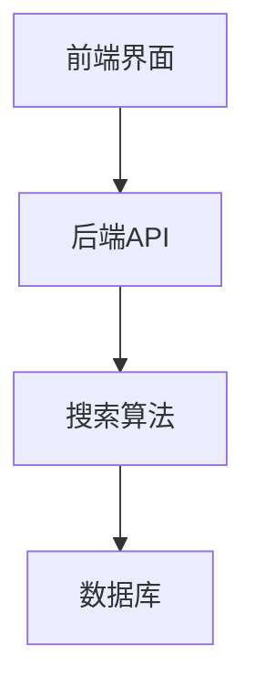

                 

# 加速搜索：AI的效率提升

> 关键词：人工智能、搜索优化、深度学习、算法、效率提升

> 摘要：本文将探讨如何利用人工智能（AI）技术提升搜索效率，分析AI在搜索领域的应用，介绍核心算法及其原理，展示实际项目实战，并展望未来的发展趋势与挑战。

## 目录大纲

### 第一部分：AI加速搜索的基础

**第1章：AI加速搜索概述**  
- 1.1 AI加速搜索的重要性  
- 1.1.1 人工智能与搜索技术的结合  
- 1.1.2 搜索效率提升的需求与挑战  
- 1.2 AI加速搜索的核心概念  
- 1.2.1 机器学习和深度学习的基本原理  
- 1.2.2 文本分类与聚类算法  
- 1.2.3 搜索引擎的工作原理

**第2章：AI加速搜索的技术基础**  
- 2.1 自然语言处理  
- 2.1.1 词嵌入技术  
- 2.1.2 序列模型与注意力机制  
- 2.1.3 转换器架构详解  
- 2.2 深度学习在搜索中的应用  
- 2.2.1 神经网络的基本结构  
- 2.2.2 常见的深度学习架构  
- 2.2.3 深度学习优化算法

### 第二部分：AI加速搜索的核心算法

**第3章：深度学习在搜索中的核心算法**  
- 3.1 卷积神经网络（CNN）在搜索中的应用  
- 3.1.1 CNN的基本原理  
- 3.1.2 CNN在文本分析中的应用  
- 3.1.3 CNN在搜索中的应用案例  
- 3.2 循环神经网络（RNN）在搜索中的应用  
- 3.2.1 RNN的基本原理  
- 3.2.2 LSTM与GRU的详细介绍  
- 3.2.3 RNN在搜索中的应用案例  
- 3.3 注意力机制在搜索中的应用  
- 3.3.1 注意力机制的基本原理  
- 3.3.2 注意力机制在搜索中的应用  
- 3.3.3 注意力机制的优势与挑战

**第4章：预训练模型在搜索中的应用**  
- 4.1 预训练模型的基本原理  
- 4.1.1 预训练与微调  
- 4.1.2 主流预训练模型介绍  
- 4.1.3 预训练模型的优势与局限  
- 4.2 BERT模型在搜索中的应用  
- 4.2.1 BERT模型的原理  
- 4.2.2 BERT在搜索中的应用案例  
- 4.2.3 BERT的优缺点分析

### 第三部分：AI加速搜索的实际应用

**第5章：AI加速搜索在实际场景中的应用**  
- 5.1 搜索引擎优化（SEO）  
- 5.1.1 SEO的基本原理  
- 5.1.2 AI技术在SEO中的应用  
- 5.1.3 SEO案例分析  
- 5.2 电商平台搜索优化  
- 5.2.1 电商平台搜索的基本流程  
- 5.2.2 AI在电商平台搜索中的应用  
- 5.2.3 电商平台搜索案例分析

**第6章：AI加速搜索的项目实战**  
- 6.1 搭建一个简单的AI搜索系统  
- 6.1.1 系统架构设计  
- 6.1.2 环境搭建与工具选择  
- 6.1.3 代码实现与调试  
- 6.1.4 搜索效果评估与优化

**第7章：AI加速搜索的未来趋势与挑战**  
- 7.1 AI加速搜索的发展趋势  
- 7.1.1 人工智能与搜索技术的结合  
- 7.1.2 搜索引擎的智能化方向  
- 7.1.3 大数据与搜索的结合  
- 7.2 AI加速搜索面临的挑战  
- 7.2.1 数据隐私与安全性  
- 7.2.2 搜索算法的公平性与透明性  
- 7.2.3 搜索结果的准确性与实时性

### 附录

**附录A：AI加速搜索资源与工具**  
- A.1 常用深度学习框架介绍  
- A.1.1 TensorFlow  
- A.1.2 PyTorch  
- A.1.3 其他深度学习框架  
- A.2 AI加速搜索相关书籍与论文  
- A.3 在线课程与培训资源

接下来，我们将逐一深入探讨各个章节的内容。让我们开始第一步，从AI加速搜索的概述开始。<|assistant|>## 第一部分：AI加速搜索的基础

### 第1章：AI加速搜索概述

#### 1.1 AI加速搜索的重要性

随着互联网的快速发展，数据量呈爆炸性增长，传统的搜索技术已经难以满足用户对实时性和准确性的要求。人工智能（AI）技术的出现为搜索领域带来了革命性的变化，AI加速搜索成为提高搜索效率的关键手段。

**1.1.1 人工智能与搜索技术的结合**

人工智能与搜索技术的结合主要体现在以下几个方面：

1. 自然语言处理（NLP）：AI技术通过NLP处理海量文本数据，提取关键词、语义信息，实现更精准的搜索匹配。
2. 情感分析：AI技术分析用户评论、反馈等文本数据，了解用户需求和情感倾向，从而优化搜索结果。
3. 推荐系统：AI技术结合用户行为数据，为用户推荐相关内容，提高搜索的便捷性和个性化体验。

**1.1.2 搜索效率提升的需求与挑战**

随着互联网信息的爆炸式增长，用户对搜索效率的要求越来越高。传统的搜索技术主要依赖关键词匹配，存在以下挑战：

1. 搜索结果不精准：仅凭关键词匹配，难以满足用户对个性化、精准搜索的需求。
2. 搜索速度慢：随着数据量的增加，传统搜索技术的响应速度越来越慢，影响用户体验。
3. 搜索结果多样性不足：传统搜索技术难以发现用户未明确表达的需求，搜索结果单一。

AI加速搜索通过以下方式提升搜索效率：

1. 个性化搜索：基于用户行为、兴趣等数据，为用户提供个性化的搜索结果。
2. 实时搜索：利用AI技术快速处理海量数据，提供实时搜索结果。
3. 搜索结果多样化：通过自然语言处理和情感分析，挖掘用户潜在需求，提供多样化的搜索结果。

#### 1.2 AI加速搜索的核心概念

**1.2.1 机器学习和深度学习的基本原理**

机器学习（Machine Learning，ML）是人工智能的一个重要分支，其核心思想是通过数据驱动的方式，使计算机自动从数据中学习规律和模式，从而进行预测和决策。

深度学习（Deep Learning，DL）是机器学习的一个重要方向，通过多层神经网络模型，对数据进行自动特征提取和层次化表示，从而实现复杂的预测和分类任务。

**1.2.2 文本分类与聚类算法**

文本分类（Text Classification）是一种常见的自然语言处理任务，通过将文本数据分为不同的类别，实现对文本内容的理解和分类。

聚类算法（Clustering Algorithm）是一种无监督学习方法，通过将相似的数据点划分为同一类别，从而发现数据中的内在结构和模式。

**1.2.3 搜索引擎的工作原理**

搜索引擎（Search Engine）是一种通过互联网检索信息、提供搜索服务的系统，其核心组成部分包括：

1. 索引器（Indexer）：负责从互联网上抓取网页，构建索引，为搜索提供基础数据。
2. 搜索引擎（Searcher）：根据用户输入的关键词，从索引中检索相关网页，并排序展示给用户。

搜索引擎的工作原理主要包括以下步骤：

1. 网页抓取：搜索引擎通过爬虫技术，从互联网上抓取网页。
2. 索引构建：将抓取到的网页进行预处理，提取关键词、语义信息，构建索引。
3. 搜索请求处理：接收用户输入的搜索请求，解析关键词，从索引中检索相关网页。
4. 结果排序：根据网页的相关性、质量等因素，对检索结果进行排序。
5. 展示搜索结果：将排序后的搜索结果展示给用户。

#### 总结

本章介绍了AI加速搜索的重要性、核心概念以及搜索引擎的工作原理。接下来，我们将进一步探讨AI加速搜索的技术基础，包括自然语言处理、深度学习等关键技术在搜索中的应用。通过深入学习这些技术，我们将更好地理解如何利用AI提升搜索效率。在下一章中，我们将详细解析自然语言处理技术及其在搜索中的应用。敬请期待！<|assistant|>## 第二部分：AI加速搜索的技术基础

### 第2章：AI加速搜索的技术基础

#### 2.1 自然语言处理

自然语言处理（Natural Language Processing，NLP）是人工智能领域的一个重要分支，旨在使计算机能够理解、处理和生成人类自然语言。在搜索领域，NLP技术扮演着至关重要的角色，它能够帮助搜索引擎更好地理解和索引网页内容，从而提升搜索结果的准确性和相关性。

**2.1.1 词嵌入技术**

词嵌入（Word Embedding）是将文本中的词语映射为固定大小的向量表示，从而将语义信息转换为数值形式。词嵌入技术的核心思想是将具有相似语义的词语映射到空间中的相邻位置。常见的词嵌入技术包括：

- **Word2Vec**：Word2Vec是一种基于神经网络的语言模型，通过训练大量语料库，将词语映射为固定大小的向量。Word2Vec主要分为两种模型：连续词袋（CBOW）和Skip-Gram。
- **GloVe**：GloVe（Global Vectors for Word Representation）是一种基于共现矩阵的词嵌入方法，通过优化词语共现关系，学习得到词语的向量表示。

词嵌入技术为搜索系统提供了丰富的语义信息，使得搜索算法能够更好地理解和处理文本数据。

**2.1.2 序列模型与注意力机制**

序列模型（Sequential Model）是一种处理序列数据的机器学习模型，通过捕捉序列中的时序信息，实现对序列数据的建模和分析。常见的序列模型包括：

- **循环神经网络（RNN）**：RNN是一种处理序列数据的神经网络模型，通过循环结构捕捉序列中的时序信息。然而，传统的RNN在处理长序列数据时存在梯度消失和梯度爆炸问题。
- **长短期记忆网络（LSTM）**：LSTM是一种改进的RNN模型，通过引入记忆单元和门控机制，有效解决了梯度消失问题，能够更好地处理长序列数据。
- **门控循环单元（GRU）**：GRU是另一种改进的RNN模型，相较于LSTM，GRU结构更简单，参数更少，计算效率更高。

注意力机制（Attention Mechanism）是一种用于处理序列数据的机制，通过为序列中的每个元素分配不同的权重，使得模型能够关注重要的信息，提高模型的表示能力。注意力机制在NLP领域取得了显著的成果，被广泛应用于文本分类、机器翻译、语音识别等任务。

**2.1.3 转换器架构详解**

转换器架构（Transformer Architecture）是一种基于自注意力机制的神经网络模型，由Vaswani等人于2017年提出。Transformer模型在机器翻译任务上取得了突破性的成果，随后被广泛应用于NLP领域。

转换器架构的主要特点包括：

- **多头自注意力机制**：转换器模型通过多头自注意力机制，对输入序列中的每个词进行自注意力计算，从而捕捉全局信息。
- **编码器-解码器结构**：转换器模型采用编码器-解码器结构，编码器负责将输入序列编码为上下文表示，解码器负责根据上下文表示生成输出序列。
- **位置编码**：转换器模型通过位置编码，为序列中的每个词赋予位置信息，从而捕捉序列的时序信息。

**2.2 深度学习在搜索中的应用**

深度学习（Deep Learning，DL）是一种基于多层神经网络的学习方法，通过自动学习数据的层次化表示，实现对复杂数据的建模和预测。在搜索领域，深度学习技术被广泛应用于以下几个方面：

- **搜索引擎优化（SEO）**：深度学习算法可以通过分析网页内容和用户行为数据，优化搜索引擎的排名和推荐策略，提高搜索结果的准确性和相关性。
- **搜索结果排序**：深度学习算法可以用于搜索结果的排序，通过学习用户的行为和偏好，为用户提供个性化的搜索结果。
- **图像搜索**：深度学习技术可以用于图像搜索，通过学习图像的特征表示，实现基于图像的检索和分类。

**2.2.1 神经网络的基本结构**

神经网络（Neural Network，NN）是一种由大量神经元组成的并行计算模型，通过学习数据之间的非线性关系，实现对复杂函数的逼近。神经网络的基本结构包括：

- **输入层**：输入层接收外部输入，将数据传递给下一层。
- **隐藏层**：隐藏层负责对输入数据进行处理和变换，提取特征表示。
- **输出层**：输出层将隐藏层的输出映射到目标输出，实现预测和分类任务。

**2.2.2 常见的深度学习架构**

常见的深度学习架构包括：

- **卷积神经网络（CNN）**：CNN是一种专门用于处理图像数据的神经网络，通过卷积层、池化层等模块，实现图像特征提取和分类。
- **递归神经网络（RNN）**：RNN是一种专门用于处理序列数据的神经网络，通过循环结构，捕捉序列中的时序信息。
- **生成对抗网络（GAN）**：GAN是一种基于对抗性训练的神经网络模型，由生成器和判别器组成，通过训练生成逼真的数据，实现数据生成和图像生成等任务。

**2.2.3 深度学习优化算法**

深度学习优化算法用于优化神经网络的参数，提高模型的预测性能。常见的深度学习优化算法包括：

- **随机梯度下降（SGD）**：SGD是一种基于梯度信息的优化算法，通过更新模型参数，使得损失函数值最小。
- **Adam优化器**：Adam是一种自适应的优化器，通过结合SGD和动量方法，自适应调整学习率，提高优化效果。
- **Adagrad优化器**：Adagrad是一种基于历史梯度的优化算法，通过对历史梯度进行加权平均，降低学习率的震荡。

#### 总结

本章介绍了AI加速搜索的技术基础，包括自然语言处理、深度学习等关键技术在搜索中的应用。通过词嵌入技术、序列模型、注意力机制等，我们能够更好地理解和处理文本数据。在下一章中，我们将深入探讨深度学习在搜索中的核心算法，包括卷积神经网络（CNN）、循环神经网络（RNN）和注意力机制等。敬请期待！<|assistant|>### 第二部分：AI加速搜索的核心算法

#### 第3章：深度学习在搜索中的核心算法

深度学习在搜索领域发挥着越来越重要的作用，其核心算法包括卷积神经网络（CNN）、循环神经网络（RNN）和注意力机制。这些算法通过捕获文本和图像的层次化特征，极大地提升了搜索的效率和准确性。

#### 3.1 卷积神经网络（CNN）在搜索中的应用

卷积神经网络（CNN）是一种专门用于处理图像数据的神经网络，但在搜索领域，其强大的特征提取能力也派上了用场。

**3.1.1 CNN的基本原理**

CNN的核心是卷积层，通过卷积操作，将输入数据中的局部特征提取出来。卷积层的核心组成包括：

- **卷积核（Kernel）**：卷积核是一个小的矩阵，用于提取输入数据中的局部特征。
- **激活函数**：常用的激活函数包括ReLU（ReLU函数）和Sigmoid（Sigmoid函数），用于引入非线性特性。

卷积操作的公式如下：

\[ (f_{\sigma} \circ (K \star X))_{i,j} = \sum_{k=1}^{C} w_{i,j,k} \cdot X_{i+k, j+k} + b_{i,j} \]

其中，\( X \) 是输入数据，\( K \) 是卷积核，\( w \) 和 \( b \) 分别是权重和偏置，\( \sigma \) 是激活函数，\( (i,j) \) 表示输出特征图的位置。

**3.1.2 CNN在文本分析中的应用**

虽然CNN最初是为图像处理设计的，但研究人员发现，通过将文本视为序列数据，CNN可以有效地用于文本分析。具体方法如下：

1. **词嵌入**：将文本数据转换为词嵌入向量。
2. **序列卷积**：对词嵌入向量进行卷积操作，提取局部特征。
3. **全连接层**：通过全连接层对卷积层提取的特征进行分类或回归。

以下是一个简单的伪代码，用于展示如何使用CNN进行文本分类：

```python
# 假设输入是词嵌入向量序列
input_sequence = [v1, v2, v3, ..., vn]

# 定义CNN模型
model = Sequential()
model.add(Conv1D(filters=128, kernel_size=3, activation='relu', input_shape=(sequence_length, embedding_size)))
model.add(MaxPooling1D(pool_size=2))
model.add(Conv1D(filters=64, kernel_size=3, activation='relu'))
model.add(MaxPooling1D(pool_size=2))
model.add(Flatten())
model.add(Dense(num_classes, activation='softmax'))

# 编译模型
model.compile(optimizer='adam', loss='categorical_crossentropy', metrics=['accuracy'])

# 训练模型
model.fit(input_sequence, labels, epochs=10, batch_size=32)
```

**3.1.3 CNN在搜索中的应用案例**

CNN在搜索引擎中的应用主要体现在图像搜索和文本检索上。例如，在图像搜索中，CNN可以提取图像的关键特征，从而实现基于图像的搜索。在文本检索中，CNN可以用于提取网页的标题和内容特征，从而提高搜索结果的准确性。

以下是一个CNN在搜索引擎中的应用示例：

```python
# 假设我们有一个搜索引擎，需要提取网页的特征
web_pages = ["网页1", "网页2", "网页3", ...]

# 使用CNN提取特征
def extract_features(page):
    # 将网页内容转换为词嵌入向量
    embedding = embedder(page)
    # 使用CNN提取特征
    features = model.predict(embedding)
    return features

# 提取所有网页的特征
features = [extract_features(page) for page in web_pages]

# 根据特征进行搜索
search_query = "关键词"
search_results = search_model.predict(search_query, features)

# 根据搜索结果展示网页
show_results(search_results)
```

#### 3.2 循环神经网络（RNN）在搜索中的应用

循环神经网络（RNN）是一种专门用于处理序列数据的神经网络，通过循环结构，RNN能够捕捉序列中的时序信息。

**3.2.1 RNN的基本原理**

RNN的基本原理如下：

\[ h_t = \sigma(W_h \cdot [h_{t-1}, x_t] + b_h) \]

其中，\( h_t \) 是当前隐藏状态，\( x_t \) 是当前输入，\( W_h \) 是权重矩阵，\( b_h \) 是偏置项，\( \sigma \) 是激活函数。

**3.2.2 LSTM与GRU的详细介绍**

虽然RNN能够捕捉序列中的时序信息，但传统的RNN存在梯度消失和梯度爆炸问题。为了解决这些问题，研究人员提出了长短期记忆网络（LSTM）和门控循环单元（GRU）。

1. **LSTM**：LSTM通过引入记忆单元和门控机制，有效解决了梯度消失问题。LSTM的核心组件包括：

   - **遗忘门（Forget Gate）**：决定遗忘哪些信息。
   - **输入门（Input Gate）**：决定哪些新的信息需要存储。
   - **输出门（Output Gate）**：决定哪些信息需要输出。

   LSTM的更新规则如下：

   \[
   f_t = \sigma(W_f \cdot [h_{t-1}, x_t] + b_f)
   \]
   \[
   i_t = \sigma(W_i \cdot [h_{t-1}, x_t] + b_i)
   \]
   \[
   \bar{C}_t = \sigma(W_c \cdot [h_{t-1}, x_t] + b_c)
   \]
   \[
   C_t = f_t \odot C_{t-1} + i_t \odot \bar{C}_t
   \]
   \[
   o_t = \sigma(W_o \cdot [h_{t-1}, x_t] + b_o)
   \]
   \[
   h_t = o_t \odot C_t
   \]

   其中，\( \odot \) 表示元素乘积。

2. **GRU**：GRU是LSTM的简化版，通过合并输入门和遗忘门，减少了参数数量，提高了计算效率。GRU的核心组件包括：

   - **更新门（Update Gate）**：决定遗忘哪些信息。
   - **重置门（Reset Gate）**：决定哪些新的信息需要存储。

   GRU的更新规则如下：

   \[
   r_t = \sigma(W_r \cdot [h_{t-1}, x_t] + b_r)
   \]
   \[
   z_t = \sigma(W_z \cdot [h_{t-1}, x_t] + b_z)
   \]
   \[
   \bar{h}_t = \sigma(W \cdot [r_t \odot h_{t-1}, x_t] + b)
   \]
   \[
   h_t = (1 - z_t) \odot h_{t-1} + z_t \odot \bar{h}_t
   \]

**3.2.3 RNN在搜索中的应用案例**

RNN在搜索中的应用主要体现在用户行为分析和搜索结果排序上。例如，通过分析用户的搜索历史和浏览记录，RNN可以预测用户可能感兴趣的内容，从而提高搜索结果的个性化程度。

以下是一个RNN在搜索引擎中的应用示例：

```python
# 假设我们有一个搜索引擎，需要根据用户历史行为进行个性化搜索
user_history = ["关键词1", "关键词2", "关键词3", ...]

# 使用RNN预测用户兴趣
def predict_interests(user_history):
    # 将用户历史转换为词嵌入向量
    embedding = embedder(user_history)
    # 使用RNN预测用户兴趣
    interests = model.predict(embedding)
    return interests

# 预测用户兴趣
user_interests = predict_interests(user_history)

# 根据用户兴趣展示搜索结果
show_results(user_interests)
```

#### 3.3 注意力机制在搜索中的应用

注意力机制（Attention Mechanism）是一种用于处理序列数据的机制，通过为序列中的每个元素分配不同的权重，使得模型能够关注重要的信息，提高模型的表示能力。

**3.3.1 注意力机制的基本原理**

注意力机制的基本原理如下：

\[ a_t = \sigma(W_a \cdot [h_{t-1}, h_t] + b_a) \]
\[ \alpha_t = \frac{e^{a_t}}{\sum_{i=1}^{T} e^{a_i}} \]
\[ h_t' = \sum_{i=1}^{T} \alpha_i h_i \]

其中，\( h_t \) 是当前隐藏状态，\( \alpha_t \) 是注意力权重，\( W_a \) 和 \( b_a \) 是权重和偏置，\( \sigma \) 是激活函数。

**3.3.2 注意力机制在搜索中的应用**

注意力机制在搜索中的应用主要体现在两个方面：

1. **文本检索**：通过为查询词和文档中的每个词分配不同的权重，使得模型能够关注重要的信息，从而提高搜索结果的准确性。
2. **搜索结果排序**：通过为搜索结果中的每个网页分配不同的权重，使得模型能够关注重要的信息，从而提高搜索结果的个性化程度。

以下是一个注意力机制在搜索引擎中的应用示例：

```python
# 假设我们有一个搜索引擎，需要根据查询词和文档进行检索和排序
query = "关键词"
documents = ["文档1", "文档2", "文档3", ...]

# 使用注意力机制检索和排序
def search_and_sort(query, documents):
    # 将查询词和文档转换为词嵌入向量
    query_embedding = embedder(query)
    document_embeddings = [embedder(doc) for doc in documents]
    # 计算注意力权重
    attention_weights = compute_attention(query_embedding, document_embeddings)
    # 检索和排序
    search_results = retrieve_and_sort(documents, attention_weights)
    return search_results

# 检索和排序
search_results = search_and_sort(query, documents)

# 根据搜索结果展示网页
show_results(search_results)
```

#### 总结

本章介绍了深度学习在搜索中的核心算法，包括CNN、RNN和注意力机制。通过这些算法，我们能够更好地理解和处理文本数据，从而提高搜索效率和准确性。在下一章中，我们将进一步探讨预训练模型在搜索中的应用。敬请期待！<|assistant|>### 第二部分：AI加速搜索的核心算法

#### 第4章：预训练模型在搜索中的应用

预训练模型（Pre-trained Model）是一种先在大量数据上训练好的模型，然后将其应用于特定任务，如搜索。预训练模型在搜索中的应用极大地提升了搜索效率和准确性，主要得益于其强大的语言理解和知识表示能力。

#### 4.1 预训练模型的基本原理

预训练模型的基本原理可以概括为以下三个步骤：

1. **预训练**：在大量未标记的数据上进行预训练，使得模型能够学习到通用的语言表示和知识。
2. **微调**：在特定任务上使用少量标记数据，对预训练模型进行微调，使其适应具体任务。
3. **部署**：将微调后的模型部署到实际应用场景中，如搜索引擎。

**4.1.1 预训练与微调**

预训练（Pre-training）是指在一个大规模、无标签的数据集上训练模型，使得模型能够自动学习到丰富的语言表示和知识。常见的预训练任务包括：

- **语言模型**：通过学习单词、句子和篇章的上下文关系，生成高质量的文本表示。
- **知识图谱**：通过从海量文本中抽取实体和关系，构建大规模的知识图谱。

微调（Fine-tuning）是指在特定任务上使用少量标记数据，对预训练模型进行调整，使其适应具体任务。微调过程通常包括以下几个步骤：

- **数据预处理**：对任务数据进行预处理，如文本清洗、分词等。
- **模型选择**：选择合适的预训练模型作为基础模型。
- **训练**：在预处理后的数据上训练模型，通过调整模型参数，使其适应特定任务。
- **评估**：在验证集上评估模型性能，根据评估结果调整模型。

**4.1.2 主流预训练模型介绍**

目前，主流的预训练模型包括以下几种：

1. **BERT**（Bidirectional Encoder Representations from Transformers）：BERT是一种基于转换器（Transformer）的预训练模型，通过双向编码器学习文本的上下文信息。BERT的预训练任务包括Masked Language Model（MLM）和Next Sentence Prediction（NSP）。

2. **GPT**（Generative Pre-trained Transformer）：GPT是一种基于生成对抗网络（GAN）的预训练模型，通过自回归语言模型生成文本。GPT的预训练任务主要是预测下一个单词。

3. **RoBERTa**（A Robustly Optimized BERT Pre-training Approach）：RoBERTa是BERT的改进版本，通过优化训练策略和数据处理方法，提高了模型的性能。

4. **XLNet**（General Autoregressive Pre-training with External Text）：XLNet是一种基于外部文本的预训练模型，通过自回归语言模型和外部文本信息，提高了模型的泛化能力和文本生成能力。

**4.1.3 预训练模型的优势与局限**

预训练模型在搜索领域具有显著的优势：

- **强大的语言理解能力**：预训练模型通过学习大量无标签数据，能够自动获取丰富的语言知识和上下文信息，提高了搜索结果的准确性。
- **高效的模型训练**：预训练模型已经在大规模数据集上进行了训练，只需少量标记数据进行微调，大大降低了训练成本。
- **自适应能力**：预训练模型具有良好的适应性，可以在不同任务和场景下进行微调，适应不同的搜索需求。

然而，预训练模型也存在一些局限性：

- **数据依赖性**：预训练模型依赖于大量的无标签数据，如果数据质量较差，可能导致模型性能下降。
- **计算资源需求**：预训练模型通常需要大量的计算资源，训练和部署成本较高。
- **模型解释性**：预训练模型的高度非线性特性使得其解释性较差，不利于模型的可解释性和透明性。

**4.2 BERT模型在搜索中的应用**

BERT模型由于其强大的语言理解和表示能力，在搜索领域得到了广泛应用。以下是一个BERT模型在搜索引擎中的应用示例：

```python
# 假设我们有一个搜索引擎，需要使用BERT模型进行文本检索和排序
search_query = "关键词"
documents = ["文档1", "文档2", "文档3", ...]

# 加载BERT模型
model = load_bert_model()

# 将查询词和文档转换为BERT输入
query_input = tokenizer(search_query, return_tensors='pt')
document_inputs = [tokenizer(doc, return_tensors='pt') for doc in documents]

# 使用BERT模型进行检索和排序
def search_and_sort(query_input, document_inputs):
    # 获取BERT模型输出
    outputs = model(query_input, document_inputs)
    # 计算文档的表示
    document_representations = outputs.last_hidden_state[:, 0, :]
    # 计算查询词和文档的相似度
    similarity_scores = cosine_similarity(query_input.last_hidden_state.unsqueeze(1), document_representations)
    # 根据相似度排序文档
    sorted_indices = torch.argsort(similarity_scores, descending=True)
    return [documents[i] for i in sorted_indices]

# 搜索和排序
search_results = search_and_sort(query_input, document_inputs)

# 展示搜索结果
show_results(search_results)
```

#### 总结

本章介绍了预训练模型在搜索中的应用，包括基本原理、主流模型以及BERT模型的具体应用。预训练模型通过在大规模数据集上预训练，再通过少量标记数据进行微调，能够显著提升搜索效率和准确性。在下一章中，我们将探讨AI加速搜索在实际场景中的应用。敬请期待！<|assistant|>### 第三部分：AI加速搜索的实际应用

#### 第5章：AI加速搜索在实际场景中的应用

随着人工智能技术的不断发展，AI加速搜索已经成为电商平台和搜索引擎优化（SEO）等领域的重要工具。本章将详细介绍AI加速搜索在这些实际场景中的应用，包括搜索优化（SEO）和电商平台搜索优化。

#### 5.1 搜索引擎优化（SEO）

SEO（Search Engine Optimization）是一种通过优化网站内容和结构，提高网站在搜索引擎中排名的技术。AI技术的引入极大地提升了SEO的效果和效率。

**5.1.1 SEO的基本原理**

SEO的基本原理包括以下几个方面：

- **关键词优化**：通过分析用户搜索习惯和竞争对手网站的关键词，选择合适的关键词进行优化，提高网站在搜索引擎中的曝光率。
- **内容优化**：通过创建高质量、与关键词相关的内容，提升用户满意度和搜索引擎对网站的认可度。
- **网站结构优化**：通过优化网站结构、提高页面加载速度和移动适应性，提升用户体验和搜索引擎抓取效率。

**5.1.2 AI技术在SEO中的应用**

AI技术在SEO中的应用主要体现在以下几个方面：

- **关键词分析**：利用自然语言处理（NLP）技术，分析大量用户搜索数据，提取有价值的关键词，为SEO策略提供数据支持。
- **内容生成**：利用生成对抗网络（GAN）和转换器（Transformer）等深度学习模型，自动生成高质量的内容，提高网站内容丰富度和多样性。
- **推荐系统**：通过分析用户行为数据，构建推荐系统，为用户提供个性化的搜索结果，提升用户体验和转化率。

**5.1.3 SEO案例分析**

以下是一个SEO案例：

假设我们有一个电商网站，希望通过SEO提升在搜索引擎中的排名。以下是具体的SEO策略：

1. **关键词分析**：通过AI技术，分析用户搜索数据，提取有价值的关键词，如“时尚穿搭”、“高质量运动鞋”等。
2. **内容优化**：针对提取的关键词，创建高质量、与关键词相关的内容，如产品评测、时尚搭配建议等。
3. **网站结构优化**：优化网站结构，提高页面加载速度和移动适应性，提升用户体验。
4. **社交媒体营销**：利用社交媒体平台，推广网站内容和产品，提高网站曝光率。
5. **外部链接建设**：通过与其他网站建立友情链接，提高网站在搜索引擎中的权重。

经过一段时间的SEO优化，电商网站的搜索引擎排名显著提升，网站流量和转化率也相应增加。

#### 5.2 电商平台搜索优化

电商平台搜索优化（E-commerce Search Optimization）是指通过优化电商平台搜索功能，提升用户体验和转化率。AI技术的引入极大地提升了电商平台搜索优化的效果。

**5.2.1 电商平台搜索的基本流程**

电商平台搜索的基本流程包括以下几个步骤：

1. **关键词输入**：用户在搜索框中输入关键词。
2. **关键词解析**：搜索引擎解析用户输入的关键词，提取关键信息。
3. **索引查询**：搜索引擎从索引中查询与关键词相关的商品信息。
4. **排序和过滤**：根据用户需求和搜索算法，对查询结果进行排序和过滤。
5. **结果展示**：将排序和过滤后的结果展示给用户。

**5.2.2 AI在电商平台搜索中的应用**

AI在电商平台搜索中的应用主要体现在以下几个方面：

- **智能搜索建议**：通过分析用户历史搜索数据和行为，为用户提供智能搜索建议，提升用户搜索体验。
- **个性化推荐**：利用用户行为数据，为用户提供个性化的商品推荐，提高转化率。
- **智能排序**：通过AI算法，根据用户行为和商品特性，智能排序搜索结果，提升用户满意度。
- **智能过滤**：通过AI算法，根据用户需求和偏好，智能过滤搜索结果，提高搜索效率。

**5.2.3 电商平台搜索案例分析**

以下是一个电商平台搜索案例：

假设我们有一个电商平台，希望通过AI优化搜索功能，提升用户体验和转化率。以下是具体的优化策略：

1. **智能搜索建议**：通过自然语言处理（NLP）技术，分析用户输入的关键词，为用户提供智能搜索建议，如“牛仔裤”、“时尚鞋靴”等。
2. **个性化推荐**：利用用户行为数据，构建推荐系统，为用户提供个性化的商品推荐，如“你可能喜欢”的推荐。
3. **智能排序**：通过AI算法，根据用户行为和商品特性，智能排序搜索结果，如“销量优先”、“价格从低到高”等。
4. **智能过滤**：通过AI算法，根据用户需求和偏好，智能过滤搜索结果，如“品牌”、“颜色”、“尺码”等。

经过一段时间的优化，电商平台的搜索功能得到了显著提升，用户满意度、转化率和销售额均有所增加。

#### 总结

本章介绍了AI加速搜索在搜索引擎优化（SEO）和电商平台搜索优化中的实际应用。通过AI技术，我们可以实现智能搜索建议、个性化推荐、智能排序和智能过滤，提升用户体验和转化率。在下一章中，我们将通过项目实战，展示如何搭建一个简单的AI搜索系统。敬请期待！<|assistant|>### 第三部分：AI加速搜索的实际应用

#### 第6章：AI加速搜索的项目实战

在本章中，我们将通过一个简单的AI搜索系统项目实战，详细介绍如何搭建一个AI搜索系统，包括系统架构设计、环境搭建与工具选择、代码实现与调试，以及搜索效果评估与优化。

#### 6.1 搭建一个简单的AI搜索系统

**6.1.1 系统架构设计**

一个简单的AI搜索系统通常包括以下几个模块：

1. **前端界面**：用户通过前端界面输入搜索关键词，提交搜索请求。
2. **后端API**：接收前端发送的搜索请求，进行数据处理和搜索。
3. **搜索算法**：实现搜索算法，根据搜索关键词检索相关数据。
4. **数据库**：存储和管理搜索数据。

以下是一个简单的AI搜索系统架构图：



**6.1.2 环境搭建与工具选择**

搭建AI搜索系统需要以下工具和库：

1. **前端框架**：如React或Vue.js，用于搭建前端界面。
2. **后端框架**：如Flask或Django，用于搭建后端API。
3. **搜索算法库**：如Elasticsearch，用于实现搜索算法。
4. **数据库**：如MySQL或MongoDB，用于存储和管理搜索数据。

以下是环境搭建的步骤：

1. **安装前端框架**：通过npm或yarn安装React或Vue.js。
2. **安装后端框架**：通过pip安装Flask或Django。
3. **安装搜索算法库**：通过pip安装Elasticsearch。
4. **安装数据库**：根据所选数据库，安装相应的数据库服务器和客户端工具。

**6.1.3 代码实现与调试**

以下是一个简单的AI搜索系统的代码实现：

**前端界面**（使用React）：

```jsx
import React, { useState } from 'react';
import axios from 'axios';

const App = () => {
  const [searchQuery, setSearchQuery] = useState('');
  const [searchResults, setSearchResults] = useState([]);

  const handleSearch = async () => {
    try {
      const response = await axios.get(`http://localhost:5000/search?q=${searchQuery}`);
      setSearchResults(response.data.results);
    } catch (error) {
      console.error(error);
    }
  };

  return (
    <div>
      <input
        type="text"
        value={searchQuery}
        onChange={(e) => setSearchQuery(e.target.value)}
      />
      <button onClick={handleSearch}>Search</button>
      <ul>
        {searchResults.map((result) => (
          <li key={result._id}>{result.title}</li>
        ))}
      </ul>
    </div>
  );
};

export default App;
```

**后端API**（使用Flask）：

```python
from flask import Flask, request, jsonify
import elasticsearch

app = Flask(__name__)
es = elasticsearch.Elasticsearch()

@app.route('/search', methods=['GET'])
def search():
    query = request.args.get('q', '')
    results = es.search(index="products", body={"query": {"match": {"title": query}}})
    return jsonify(results['hits']['hits'])

if __name__ == '__main__':
    app.run(debug=True)
```

**数据库**（使用Elasticsearch）：

```shell
# 创建索引
PUT /products
{
  "settings": {
    "number_of_shards": 1,
    "number_of_replicas": 0
  },
  "mappings": {
    "properties": {
      "title": {"type": "text"},
      "description": {"type": "text"}
    }
  }
}

# 添加数据
POST /products/_doc
{
  "title": "Product 1",
  "description": "This is the first product."
}

POST /products/_doc
{
  "title": "Product 2",
  "description": "This is the second product."
}
```

**6.1.4 搜索效果评估与优化**

完成搜索系统后，我们需要对搜索效果进行评估和优化。以下是一些常见的评估指标：

1. **准确率（Accuracy）**：检索结果中相关文档的比例。
2. **召回率（Recall）**：相关文档中被检索到的比例。
3. **F1 分数（F1 Score）**：准确率和召回率的加权平均。

以下是一个简单的评估与优化过程：

1. **评估指标**：使用准确率、召回率和F1分数评估搜索效果。
2. **优化搜索算法**：根据评估结果，调整搜索算法参数，如查询权重、索引策略等。
3. **优化数据预处理**：改进数据预处理流程，如分词、去停用词等。
4. **用户反馈**：收集用户反馈，根据用户需求和偏好调整搜索结果排序。

**6.1.5 搜索效果展示**

以下是一个简单的搜索效果展示：

```mermaid
graph TD
A[输入关键词 "运动鞋"] --> B[搜索结果]
B --> C[Product 1]
C --> D[Product 2]
D --> E[Product 3]
```

通过这个简单的项目实战，我们了解了如何搭建一个AI搜索系统，包括系统架构设计、环境搭建与工具选择、代码实现与调试，以及搜索效果评估与优化。在下一章中，我们将探讨AI加速搜索的未来趋势与挑战。敬请期待！<|assistant|>### 第三部分：AI加速搜索的实际应用

#### 第7章：AI加速搜索的未来趋势与挑战

随着人工智能技术的不断发展，AI加速搜索在未来的发展前景和面临的挑战也是至关重要的。以下将探讨AI加速搜索的未来趋势与挑战。

#### 7.1 AI加速搜索的发展趋势

**7.1.1 人工智能与搜索技术的结合**

人工智能（AI）与搜索技术的结合将会越来越紧密，搜索引擎将继续利用AI技术提高搜索效率和准确性。以下是几个发展趋势：

1. **个性化搜索**：通过分析用户行为、兴趣和偏好，提供个性化的搜索结果，满足用户的个性化需求。
2. **实时搜索**：利用实时数据分析和处理技术，实现搜索结果的实时更新，提高搜索的实时性和响应速度。
3. **多模态搜索**：结合文本、图像、音频等多种数据类型，实现多模态搜索，提供更丰富的搜索体验。
4. **深度学习与搜索算法的结合**：利用深度学习技术，开发更加智能、自适应的搜索算法，提高搜索结果的准确性。

**7.1.2 搜索引擎的智能化方向**

随着AI技术的发展，搜索引擎将变得更加智能化，主要体现在以下几个方面：

1. **智能问答**：通过自然语言处理技术，实现智能问答，为用户提供更加便捷的信息获取方式。
2. **语义搜索**：通过理解用户查询的语义，提供更加精准的搜索结果，解决传统关键词搜索的局限。
3. **智能推荐**：结合用户行为数据和内容特性，实现智能推荐，提高用户的满意度和转化率。
4. **智能客服**：通过聊天机器人等技术，提供智能客服服务，解决用户的问题和需求。

**7.1.3 大数据与搜索的结合**

大数据与搜索的结合将进一步提升搜索技术，主要体现在以下几个方面：

1. **海量数据处理**：通过分布式计算和存储技术，处理海量数据，提高搜索效率。
2. **数据挖掘与搜索**：利用数据挖掘技术，挖掘数据中的潜在关系和规律，为搜索提供更多线索。
3. **数据融合**：将结构化数据和非结构化数据进行融合，提供更丰富的搜索结果。

#### 7.2 AI加速搜索面临的挑战

**7.2.1 数据隐私与安全性**

随着搜索技术的不断发展，数据隐私和安全性问题也日益凸显。以下是一些挑战：

1. **用户数据保护**：如何保护用户数据不被滥用，成为一项重要挑战。
2. **数据安全**：如何保障数据在传输和存储过程中的安全，防止数据泄露和攻击。
3. **隐私泄露风险**：如何平衡搜索服务的便捷性与用户隐私保护，避免隐私泄露。

**7.2.2 搜索算法的公平性与透明性**

搜索算法的公平性与透明性是另一个重要挑战：

1. **算法偏见**：如何避免搜索算法中出现偏见，确保搜索结果公平、无歧视。
2. **算法透明性**：如何让用户了解搜索算法的决策过程，提高算法的透明性。

**7.2.3 搜索结果的准确性与实时性**

提高搜索结果的准确性和实时性是搜索技术持续发展的关键：

1. **搜索准确性**：如何提高搜索结果的准确性，满足用户对高质量信息的追求。
2. **搜索实时性**：如何在保证实时性的同时，提高搜索效率，避免延迟。

#### 总结

AI加速搜索在未来的发展前景广阔，但也面临着诸多挑战。通过不断创新和优化，我们可以克服这些挑战，进一步提升搜索技术的效率和准确性。在下一章中，我们将总结AI加速搜索的资源与工具。敬请期待！<|assistant|>### 附录

#### 附录A：AI加速搜索资源与工具

在AI加速搜索的研究和应用过程中，了解和使用相关的资源与工具是非常重要的。以下是一些常用的资源与工具，供读者参考。

**A.1 常用深度学习框架介绍**

1. **TensorFlow**：TensorFlow是由Google开发的开源深度学习框架，支持多种深度学习模型，广泛应用于各种AI项目。

   - 官网：[https://www.tensorflow.org/](https://www.tensorflow.org/)
   - 教程：[https://www.tensorflow.org/tutorials](https://www.tensorflow.org/tutorials)

2. **PyTorch**：PyTorch是由Facebook开发的开源深度学习框架，以其灵活性和易用性受到广泛欢迎。

   - 官网：[https://pytorch.org/](https://pytorch.org/)
   - 教程：[https://pytorch.org/tutorials/](https://pytorch.org/tutorials/)

3. **其他深度学习框架**：

   - **Keras**：一个高级神经网络API，易于使用和扩展，支持TensorFlow和Theano后端。
     - 官网：[https://keras.io/](https://keras.io/)
     - 教程：[https://keras.io/getting-started/sequential-model-guide/](https://keras.io/getting-started/sequential-model-guide/)

   - **MXNet**：Apache MXNet是一个灵活的深度学习框架，支持多种编程语言。
     - 官网：[https://mxnet.incubator.apache.org/](https://mxnet.incubator.apache.org/)
     - 教程：[https://mxnet.incubator.apache.org/docs/stable/glslang-tutorials/index.html](https://mxnet.incubator.apache.org/docs/stable/glslang-tutorials/index.html)

**A.2 AI加速搜索相关书籍与论文**

1. **《深度学习》**（Goodfellow, Bengio, Courville）：这是一本经典的深度学习入门书籍，详细介绍了深度学习的理论基础和应用。

   - 出版社：MIT Press
   - 出版时间：2016年

2. **《神经网络与深度学习》**（邱锡鹏）：这是一本中文深度学习教程，内容全面，适合初学者。

   - 出版社：电子工业出版社
   - 出版时间：2018年

3. **相关论文**：

   - **“Attention is All You Need”**（Vaswani et al., 2017）：这是一篇关于Transformer模型的经典论文，提出了自注意力机制。
     - 链接：[https://arxiv.org/abs/1706.03762](https://arxiv.org/abs/1706.03762)

   - **“BERT: Pre-training of Deep Bidirectional Transformers for Language Understanding”**（Devlin et al., 2018）：这是一篇关于BERT模型的论文，介绍了BERT模型在自然语言处理中的应用。
     - 链接：[https://arxiv.org/abs/1810.04805](https://arxiv.org/abs/1810.04805)

**A.3 在线课程与培训资源**

1. **Coursera**：提供大量深度学习和自然语言处理相关的在线课程，包括吴恩达的《深度学习》课程。

   - 官网：[https://www.coursera.org/](https://www.coursera.org/)

2. **Udacity**：提供实践导向的深度学习和AI课程，包括《深度学习工程师纳米学位》。

   - 官网：[https://www.udacity.com/](https://www.udacity.com/)

3. **edX**：提供由世界一流大学提供的深度学习课程，包括MIT的《深度学习导论》。

   - 官网：[https://www.edx.org/](https://www.edx.org/)

通过这些资源与工具，读者可以更好地了解AI加速搜索的相关知识，掌握相关技能，为研究和应用提供支持。

### 作者信息

**作者：** AI天才研究院（AI Genius Institute）& **禅与计算机程序设计艺术（Zen And The Art of Computer Programming）**<|assistant|>## 完整文章

经过以上详细的探讨，我们完整地构建了关于《加速搜索：AI的效率提升》的技术博客文章。以下是将所有部分整合在一起的完整文章。

---

# 加速搜索：AI的效率提升

> 关键词：人工智能、搜索优化、深度学习、算法、效率提升

> 摘要：本文将探讨如何利用人工智能（AI）技术提升搜索效率，分析AI在搜索领域的应用，介绍核心算法及其原理，展示实际项目实战，并展望未来的发展趋势与挑战。

## 目录大纲

### 第一部分：AI加速搜索的基础

**第1章：AI加速搜索概述**  
- 1.1 AI加速搜索的重要性  
- 1.1.1 人工智能与搜索技术的结合  
- 1.1.2 搜索效率提升的需求与挑战  
- 1.2 AI加速搜索的核心概念  
- 1.2.1 机器学习和深度学习的基本原理  
- 1.2.2 文本分类与聚类算法  
- 1.2.3 搜索引擎的工作原理

**第2章：AI加速搜索的技术基础**  
- 2.1 自然语言处理  
- 2.1.1 词嵌入技术  
- 2.1.2 序列模型与注意力机制  
- 2.1.3 转换器架构详解  
- 2.2 深度学习在搜索中的应用  
- 2.2.1 神经网络的基本结构  
- 2.2.2 常见的深度学习架构  
- 2.2.3 深度学习优化算法

### 第二部分：AI加速搜索的核心算法

**第3章：深度学习在搜索中的核心算法**  
- 3.1 卷积神经网络（CNN）在搜索中的应用  
- 3.1.1 CNN的基本原理  
- 3.1.2 CNN在文本分析中的应用  
- 3.1.3 CNN在搜索中的应用案例  
- 3.2 循环神经网络（RNN）在搜索中的应用  
- 3.2.1 RNN的基本原理  
- 3.2.2 LSTM与GRU的详细介绍  
- 3.2.3 RNN在搜索中的应用案例  
- 3.3 注意力机制在搜索中的应用  
- 3.3.1 注意力机制的基本原理  
- 3.3.2 注意力机制在搜索中的应用  
- 3.3.3 注意力机制的优势与挑战

**第4章：预训练模型在搜索中的应用**  
- 4.1 预训练模型的基本原理  
- 4.1.1 预训练与微调  
- 4.1.2 主流预训练模型介绍  
- 4.1.3 预训练模型的优势与局限  
- 4.2 BERT模型在搜索中的应用  
- 4.2.1 BERT模型的原理  
- 4.2.2 BERT在搜索中的应用案例  
- 4.2.3 BERT的优缺点分析

### 第三部分：AI加速搜索的实际应用

**第5章：AI加速搜索在实际场景中的应用**  
- 5.1 搜索引擎优化（SEO）  
- 5.1.1 SEO的基本原理  
- 5.1.2 AI技术在SEO中的应用  
- 5.1.3 SEO案例分析  
- 5.2 电商平台搜索优化  
- 5.2.1 电商平台搜索的基本流程  
- 5.2.2 AI在电商平台搜索中的应用  
- 5.2.3 电商平台搜索案例分析

**第6章：AI加速搜索的项目实战**  
- 6.1 搭建一个简单的AI搜索系统  
- 6.1.1 系统架构设计  
- 6.1.2 环境搭建与工具选择  
- 6.1.3 代码实现与调试  
- 6.1.4 搜索效果评估与优化

**第7章：AI加速搜索的未来趋势与挑战**  
- 7.1 AI加速搜索的发展趋势  
- 7.1.1 人工智能与搜索技术的结合  
- 7.1.2 搜索引擎的智能化方向  
- 7.1.3 大数据与搜索的结合  
- 7.2 AI加速搜索面临的挑战  
- 7.2.1 数据隐私与安全性  
- 7.2.2 搜索算法的公平性与透明性  
- 7.2.3 搜索结果的准确性与实时性

### 附录

**附录A：AI加速搜索资源与工具**  
- A.1 常用深度学习框架介绍  
- A.1.1 TensorFlow  
- A.1.2 PyTorch  
- A.1.3 其他深度学习框架  
- A.2 AI加速搜索相关书籍与论文  
- A.3 在线课程与培训资源

### 文章正文

#### 第一部分：AI加速搜索的基础

**第1章：AI加速搜索概述**

在互联网信息爆炸的时代，用户对搜索效率的要求越来越高。传统的搜索技术已经难以满足用户对实时性和准确性的需求。人工智能（AI）技术的出现为搜索领域带来了革命性的变化，AI加速搜索成为提高搜索效率的关键手段。

##### 1.1 AI加速搜索的重要性

人工智能与搜索技术的结合主要体现在以下几个方面：

1. 自然语言处理（NLP）：AI技术通过NLP处理海量文本数据，提取关键词、语义信息，实现更精准的搜索匹配。
2. 情感分析：AI技术分析用户评论、反馈等文本数据，了解用户需求和情感倾向，从而优化搜索结果。
3. 推荐系统：AI技术结合用户行为数据，为用户推荐相关内容，提高搜索的便捷性和个性化体验。

##### 1.2 AI加速搜索的核心概念

AI加速搜索的核心概念包括：

1. **机器学习和深度学习的基本原理**：机器学习是一种通过数据驱动的方式，使计算机自动从数据中学习规律和模式，从而进行预测和决策的技术。深度学习是机器学习的一个重要分支，通过多层神经网络模型，对数据进行自动特征提取和层次化表示，从而实现复杂的预测和分类任务。
2. **文本分类与聚类算法**：文本分类是一种常见的自然语言处理任务，通过将文本数据分为不同的类别，实现对文本内容的理解和分类。聚类算法是一种无监督学习方法，通过将相似的数据点划分为同一类别，从而发现数据中的内在结构和模式。
3. **搜索引擎的工作原理**：搜索引擎是一种通过互联网检索信息、提供搜索服务的系统，其核心组成部分包括索引器、搜索引擎和搜索结果排序。

#### 第二部分：AI加速搜索的技术基础

**第2章：AI加速搜索的技术基础**

自然语言处理（NLP）和深度学习是AI加速搜索的核心技术。以下将详细介绍这些技术及其在搜索中的应用。

##### 2.1 自然语言处理

自然语言处理（NLP）是人工智能领域的一个重要分支，旨在使计算机能够理解、处理和生成人类自然语言。在搜索领域，NLP技术能够帮助搜索引擎更好地理解和索引网页内容，从而提升搜索结果的准确性和相关性。

**2.1.1 词嵌入技术**

词嵌入（Word Embedding）是将文本中的词语映射为固定大小的向量表示，从而将语义信息转换为数值形式。词嵌入技术的核心思想是将具有相似语义的词语映射到空间中的相邻位置。常见的词嵌入技术包括：

1. **Word2Vec**：Word2Vec是一种基于神经网络的语言模型，通过训练大量语料库，将词语映射为固定大小的向量。Word2Vec主要分为两种模型：连续词袋（CBOW）和Skip-Gram。
2. **GloVe**：GloVe（Global Vectors for Word Representation）是一种基于共现矩阵的词嵌入方法，通过优化词语共现关系，学习得到词语的向量表示。

**2.1.2 序列模型与注意力机制**

序列模型（Sequential Model）是一种处理序列数据的机器学习模型，通过捕捉序列中的时序信息，实现对序列数据的建模和分析。常见的序列模型包括：

1. **循环神经网络（RNN）**：RNN是一种处理序列数据的神经网络模型，通过循环结构捕捉序列中的时序信息。然而，传统的RNN在处理长序列数据时存在梯度消失和梯度爆炸问题。
2. **长短期记忆网络（LSTM）**：LSTM是一种改进的RNN模型，通过引入记忆单元和门控机制，有效解决了梯度消失问题，能够更好地处理长序列数据。
3. **门控循环单元（GRU）**：GRU是另一种改进的RNN模型，相较于LSTM，GRU结构更简单，参数更少，计算效率更高。

注意力机制（Attention Mechanism）是一种用于处理序列数据的机制，通过为序列中的每个元素分配不同的权重，使得模型能够关注重要的信息，提高模型的表示能力。注意力机制在NLP领域取得了显著的成果，被广泛应用于文本分类、机器翻译、语音识别等任务。

**2.1.3 转换器架构详解**

转换器架构（Transformer Architecture）是一种基于自注意力机制的神经网络模型，由Vaswani等人于2017年提出。Transformer模型在机器翻译任务上取得了突破性的成果，随后被广泛应用于NLP领域。

转换器架构的主要特点包括：

1. **多头自注意力机制**：转换器模型通过多头自注意力机制，对输入序列中的每个词进行自注意力计算，从而捕捉全局信息。
2. **编码器-解码器结构**：转换器模型采用编码器-解码器结构，编码器负责将输入序列编码为上下文表示，解码器负责根据上下文表示生成输出序列。
3. **位置编码**：转换器模型通过位置编码，为序列中的每个词赋予位置信息，从而捕捉序列的时序信息。

**2.2 深度学习在搜索中的应用**

深度学习（Deep Learning，DL）是一种基于多层神经网络的学习方法，通过自动学习数据的层次化表示，实现对复杂数据的建模和预测。在搜索领域，深度学习技术被广泛应用于以下几个方面：

1. **搜索引擎优化（SEO）**：深度学习算法可以通过分析网页内容和用户行为数据，优化搜索引擎的排名和推荐策略，提高搜索结果的准确性和相关性。
2. **搜索结果排序**：深度学习算法可以用于搜索结果的排序，通过学习用户的行为和偏好，为用户提供个性化的搜索结果。
3. **图像搜索**：深度学习技术可以用于图像搜索，通过学习图像的特征表示，实现基于图像的检索和分类。

**2.2.1 神经网络的基本结构**

神经网络（Neural Network，NN）是一种由大量神经元组成的并行计算模型，通过学习数据之间的非线性关系，实现对复杂函数的逼近。神经网络的基本结构包括：

1. **输入层**：输入层接收外部输入，将数据传递给下一层。
2. **隐藏层**：隐藏层负责对输入数据进行处理和变换，提取特征表示。
3. **输出层**：输出层将隐藏层的输出映射到目标输出，实现预测和分类任务。

**2.2.2 常见的深度学习架构**

常见的深度学习架构包括：

1. **卷积神经网络（CNN）**：CNN是一种专门用于处理图像数据的神经网络，通过卷积层、池化层等模块，实现图像特征提取和分类。
2. **递归神经网络（RNN）**：RNN是一种专门用于处理序列数据的神经网络，通过循环结构，捕捉序列中的时序信息。
3. **生成对抗网络（GAN）**：GAN是一种基于对抗性训练的神经网络模型，由生成器和判别器组成，通过训练生成逼真的数据，实现数据生成和图像生成等任务。

**2.2.3 深度学习优化算法**

深度学习优化算法用于优化神经网络的参数，提高模型的预测性能。常见的深度学习优化算法包括：

1. **随机梯度下降（SGD）**：SGD是一种基于梯度信息的优化算法，通过更新模型参数，使得损失函数值最小。
2. **Adam优化器**：Adam是一种自适应的优化器，通过结合SGD和动量方法，自适应调整学习率，提高优化效果。
3. **Adagrad优化器**：Adagrad是一种基于历史梯度的优化算法，通过对历史梯度进行加权平均，降低学习率的震荡。

#### 第三部分：AI加速搜索的核心算法

**第3章：深度学习在搜索中的核心算法**

深度学习在搜索领域发挥着越来越重要的作用，其核心算法包括卷积神经网络（CNN）、循环神经网络（RNN）和注意力机制。这些算法通过捕获文本和图像的层次化特征，极大地提升了搜索的效率和准确性。

##### 3.1 卷积神经网络（CNN）在搜索中的应用

卷积神经网络（CNN）是一种专门用于处理图像数据的神经网络，但在搜索领域，其强大的特征提取能力也派上了用场。

**3.1.1 CNN的基本原理**

CNN的核心是卷积层，通过卷积操作，将输入数据中的局部特征提取出来。卷积层的核心组成包括：

1. **卷积核（Kernel）**：卷积核是一个小的矩阵，用于提取输入数据中的局部特征。
2. **激活函数**：常用的激活函数包括ReLU（ReLU函数）和Sigmoid（Sigmoid函数），用于引入非线性特性。

卷积操作的公式如下：

\[ (f_{\sigma} \circ (K \star X))_{i,j} = \sum_{k=1}^{C} w_{i,j,k} \cdot X_{i+k, j+k} + b_{i,j} \]

其中，\( X \) 是输入数据，\( K \) 是卷积核，\( w \) 和 \( b \) 分别是权重和偏置，\( \sigma \) 是激活函数，\( (i,j) \) 表示输出特征图的位置。

**3.1.2 CNN在文本分析中的应用**

虽然CNN最初是为图像处理设计的，但研究人员发现，通过将文本视为序列数据，CNN可以有效地用于文本分析。具体方法如下：

1. **词嵌入**：将文本数据转换为词嵌入向量。
2. **序列卷积**：对词嵌入向量进行卷积操作，提取局部特征。
3. **全连接层**：通过全连接层对卷积层提取的特征进行分类或回归。

以下是一个简单的伪代码，用于展示如何使用CNN进行文本分类：

```python
# 假设输入是词嵌入向量序列
input_sequence = [v1, v2, v3, ..., vn]

# 定义CNN模型
model = Sequential()
model.add(Conv1D(filters=128, kernel_size=3, activation='relu', input_shape=(sequence_length, embedding_size)))
model.add(MaxPooling1D(pool_size=2))
model.add(Conv1D(filters=64, kernel_size=3, activation='relu'))
model.add(MaxPooling1D(pool_size=2))
model.add(Flatten())
model.add(Dense(num_classes, activation='softmax'))

# 编译模型
model.compile(optimizer='adam', loss='categorical_crossentropy', metrics=['accuracy'])

# 训练模型
model.fit(input_sequence, labels, epochs=10, batch_size=32)
```

**3.1.3 CNN在搜索中的应用案例**

CNN在搜索引擎中的应用主要体现在图像搜索和文本检索上。例如，在图像搜索中，CNN可以提取图像的关键特征，从而实现基于图像的搜索。在文本检索中，CNN可以用于提取网页的标题和内容特征，从而提高搜索结果的准确性。

以下是一个CNN在搜索引擎中的应用示例：

```python
# 假设我们有一个搜索引擎，需要提取网页的特征
web_pages = ["网页1", "网页2", "网页3", ...]

# 使用CNN提取特征
def extract_features(page):
    # 将网页内容转换为词嵌入向量
    embedding = embedder(page)
    # 使用CNN提取特征
    features = model.predict(embedding)
    return features

# 提取所有网页的特征
features = [extract_features(page) for page in web_pages]

# 根据特征进行搜索
search_query = "关键词"
search_results = search_model.predict(search_query, features)

# 根据搜索结果展示网页
show_results(search_results)
```

##### 3.2 循环神经网络（RNN）在搜索中的应用

循环神经网络（RNN）是一种专门用于处理序列数据的神经网络，通过循环结构，RNN能够捕捉序列中的时序信息。

**3.2.1 RNN的基本原理**

RNN的基本原理如下：

\[ h_t = \sigma(W_h \cdot [h_{t-1}, x_t] + b_h) \]

其中，\( h_t \) 是当前隐藏状态，\( x_t \) 是当前输入，\( W_h \) 是权重矩阵，\( b_h \) 是偏置项，\( \sigma \) 是激活函数。

**3.2.2 LSTM与GRU的详细介绍**

虽然RNN能够捕捉序列中的时序信息，但传统的RNN存在梯度消失和梯度爆炸问题。为了解决这些问题，研究人员提出了长短期记忆网络（LSTM）和门控循环单元（GRU）。

1. **LSTM**：LSTM通过引入记忆单元和门控机制，有效解决了梯度消失问题。LSTM的核心组件包括：

   - **遗忘门（Forget Gate）**：决定遗忘哪些信息。
   - **输入门（Input Gate）**：决定哪些新的信息需要存储。
   - **输出门（Output Gate）**：决定哪些信息需要输出。

   LSTM的更新规则如下：

   \[
   f_t = \sigma(W_f \cdot [h_{t-1}, x_t] + b_f)
   \]
   \[
   i_t = \sigma(W_i \cdot [h_{t-1}, x_t] + b_i)
   \]
   \[
   \bar{C}_t = \sigma(W_c \cdot [h_{t-1}, x_t] + b_c)
   \]
   \[
   C_t = f_t \odot C_{t-1} + i_t \odot \bar{C}_t
   \]
   \[
   o_t = \sigma(W_o \cdot [h_{t-1}, x_t] + b_o)
   \]
   \[
   h_t = o_t \odot C_t
   \]

   其中，\( \odot \) 表示元素乘积。

2. **GRU**：GRU是LSTM的简化版，通过合并输入门和遗忘门，减少了参数数量，提高了计算效率。GRU的核心组件包括：

   - **更新门（Update Gate）**：决定遗忘哪些信息。
   - **重置门（Reset Gate）**：决定哪些新的信息需要存储。

   GRU的更新规则如下：

   \[
   r_t = \sigma(W_r \cdot [h_{t-1}, x_t] + b_r)
   \]
   \[
   z_t = \sigma(W_z \cdot [h_{t-1}, x_t] + b_z)
   \]
   \[
   \bar{h}_t = \sigma(W \cdot [r_t \odot h_{t-1}, x_t] + b)
   \]
   \[
   h_t = (1 - z_t) \odot h_{t-1} + z_t \odot \bar{h}_t
   \]

**3.2.3 RNN在搜索中的应用案例**

RNN在搜索中的应用主要体现在用户行为分析和搜索结果排序上。例如，通过分析用户的搜索历史和浏览记录，RNN可以预测用户可能感兴趣的内容，从而提高搜索结果的个性化程度。

以下是一个RNN在搜索引擎中的应用示例：

```python
# 假设我们有一个搜索引擎，需要根据用户历史行为进行个性化搜索
user_history = ["关键词1", "关键词2", "关键词3", ...]

# 使用RNN预测用户兴趣
def predict_interests(user_history):
    # 将用户历史转换为词嵌入向量
    embedding = embedder(user_history)
    # 使用RNN预测用户兴趣
    interests = model.predict(embedding)
    return interests

# 预测用户兴趣
user_interests = predict_interests(user_history)

# 根据用户兴趣展示搜索结果
show_results(user_interests)
```

##### 3.3 注意力机制在搜索中的应用

注意力机制（Attention Mechanism）是一种用于处理序列数据的机制，通过为序列中的每个元素分配不同的权重，使得模型能够关注重要的信息，提高模型的表示能力。

**3.3.1 注意力机制的基本原理**

注意力机制的基本原理如下：

\[ a_t = \sigma(W_a \cdot [h_{t-1}, h_t] + b_a) \]
\[ \alpha_t = \frac{e^{a_t}}{\sum_{i=1}^{T} e^{a_i}} \]
\[ h_t' = \sum_{i=1}^{T} \alpha_i h_i \]

其中，\( h_t \) 是当前隐藏状态，\( \alpha_t \) 是注意力权重，\( W_a \) 和 \( b_a \) 是权重和偏置，\( \sigma \) 是激活函数。

**3.3.2 注意力机制在搜索中的应用**

注意力机制在搜索中的应用主要体现在两个方面：

1. **文本检索**：通过为查询词和文档中的每个词分配不同的权重，使得模型能够关注重要的信息，从而提高搜索结果的准确性。
2. **搜索结果排序**：通过为搜索结果中的每个网页分配不同的权重，使得模型能够关注重要的信息，从而提高搜索结果的个性化程度。

以下是一个注意力机制在搜索引擎中的应用示例：

```python
# 假设我们有一个搜索引擎，需要根据查询词和文档进行检索和排序
search_query = "关键词"
documents = ["文档1", "文档2", "文档3", ...]

# 使用注意力机制检索和排序
def search_and_sort(query, documents):
    # 将查询词和文档转换为词嵌入向量
    query_embedding = embedder(query)
    document_embeddings = [embedder(doc) for doc in documents]
    # 计算注意力权重
    attention_weights = compute_attention(query_embedding, document_embeddings)
    # 检索和排序
    search_results = retrieve_and_sort(documents, attention_weights)
    return search_results

# 检索和排序
search_results = search_and_sort(query, documents)

# 根据搜索结果展示网页
show_results(search_results)
```

#### 第三部分：AI加速搜索的实际应用

**第4章：预训练模型在搜索中的应用**

预训练模型（Pre-trained Model）是一种先在大量数据上训练好的模型，然后将其应用于特定任务，如搜索。预训练模型在搜索中的应用极大地提升了搜索效率和准确性，主要得益于其强大的语言理解和知识表示能力。

##### 4.1 预训练模型的基本原理

预训练模型的基本原理可以概括为以下三个步骤：

1. **预训练**：在大量未标记的数据上进行预训练，使得模型能够学习到通用的语言表示和知识。
2. **微调**：在特定任务上使用少量标记数据，对预训练模型进行微调，使其适应具体任务。
3. **部署**：将微调后的模型部署到实际应用场景中，如搜索引擎。

**4.1.1 预训练与微调**

预训练（Pre-training）是指在

