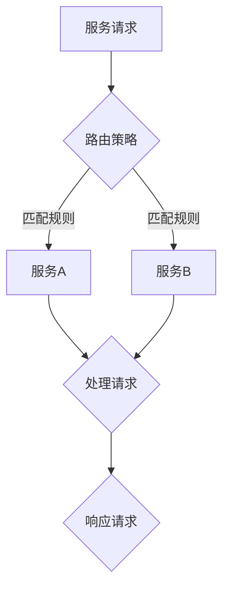

                 

### 文章标题

《后端架构演进：从单体应用到服务网格》

### 文章关键词

- 后端架构
- 单体应用
- 微服务
- 服务网格
- Kubernetes
- 容器化
- 云原生
- API网关
- 负载均衡
- 服务发现

### 文章摘要

本文将探讨后端架构的演变过程，从传统的单体应用到现代的微服务架构，再到服务网格技术的兴起。我们将详细解析这些架构模式的核心概念、优势与挑战，并通过实际案例展示如何在项目中应用这些技术。文章还将讨论服务网格的部署与运维策略，以及未来的发展趋势，帮助读者理解后端架构的演进方向，并掌握服务网格的相关技能。

## 后端架构演进：从单体应用到服务网格

### 1.1 后端架构的发展历程

后端架构的发展历程是一个不断演进和优化的过程。随着互联网和云计算的普及，软件系统变得越来越复杂，传统的单体应用架构已经无法满足现代应用的需求。下面我们将详细探讨后端架构的发展历程。

#### 1.1.1 单体应用

**概念**：单体应用（Monolithic Application）是指将所有的业务逻辑、数据库、服务都集中在一个应用中。这种架构模式在早期互联网时代非常普遍。

**优点**：开发简单，易于部署。

**缺点**：扩展性差，维护困难。

**示例**：早期的Web应用程序，如WordPress和Joomla。

#### 1.1.2 微服务架构

**概念**：微服务架构（Microservices Architecture）是将应用拆分为多个独立的服务，每个服务负责特定的业务功能。这些服务可以通过网络进行通信。

**优点**：提高了系统的可扩展性和可维护性。

**缺点**：复杂度高，需要分布式系统知识。

**示例**：Netflix、亚马逊等大型互联网公司的核心业务系统。

#### 1.1.3 服务网格架构

**概念**：服务网格架构（Service Mesh Architecture）是一种基础设施层，主要负责服务的通信和监控。它通过一系列边车代理（sidecar proxies）来管理服务间的通信。

**优点**：解耦服务，简化服务间通信，提高系统的弹性和可靠性。

**缺点**：增加了系统的复杂度，对开发人员提出了更高的要求。

**示例**：Istio、Linkerd等开源服务网格项目。

### 1.2 服务网格的概念与作用

#### 1.2.1 服务网格的定义

服务网格是一种基础设施层，主要负责服务的通信和监控。它通过一系列边车代理（sidecar proxies）来实现服务间的通信，并提供一系列高级功能，如服务发现、服务路由、负载均衡和安全等。

#### 1.2.2 服务网格的核心组件

服务网格的核心组件包括：

- **服务代理**（Service Proxy）：如Istio的Envoy，Linkerd的Bookinfo等，负责服务间的通信。
- **服务发现与注册**：服务网格能够自动发现和注册服务实例，简化服务间的发现和通信。
- **服务路由与负载均衡**：根据策略将请求路由到合适的服务实例上，实现负载均衡。
- **服务监控与日志**：收集服务监控数据和日志，提供故障排查和性能优化支持。

#### 1.2.3 服务网格的优势与挑战

**优势**：

- **解耦服务**：通过服务网格，可以减少服务间的直接依赖，实现服务的解耦。
- **简化通信**：服务网格提供了统一的通信协议和API，简化了服务间的通信。
- **提高弹性**：通过服务网格，可以实现服务的动态扩缩容，提高系统的弹性。
- **增强安全性**：服务网格提供了加密通信、访问控制等功能，增强了系统的安全性。

**挑战**：

- **增加复杂度**：服务网格增加了系统的复杂度，需要开发人员具备分布式系统的知识。
- **性能开销**：服务网格可能会引入额外的性能开销，需要优化设计和实现。
- **运维难度**：服务网格的部署和运维相对复杂，需要专业的运维团队支持。

### 1.3 微服务架构设计与实践

微服务架构是一种基于分布式系统的设计方法，它将一个复杂的单体应用拆分为多个独立的服务。这些服务通过网络进行通信，每个服务都可以独立开发、测试和部署。下面我们将探讨微服务架构的设计原则、开发技术以及数据管理。

#### 1.3.1 微服务设计原则

**单一职责原则**：每个微服务应只负责一个特定的业务功能。这有助于提高服务的独立性，降低耦合度。

**无状态服务**：服务不应存储客户端状态，每次请求都是独立的。这有助于简化系统架构，提高系统的扩展性和可用性。

**异步通信**：服务间通信应采用异步模式，避免同步阻塞。这有助于提高系统的并发能力和响应速度。

**部署独立性**：每个微服务应具有独立的部署和运行环境，可以独立升级和扩展。

**服务版本控制**：为每个微服务版本提供独立的API，避免版本冲突。

#### 1.3.2 微服务开发技术

微服务开发技术包括编程语言选择、框架选择、持续集成与持续部署（CI/CD）等。

**编程语言选择**：常见的微服务开发语言包括Java、Python、Go和Node.js等。每种语言都有其特点和适用场景。

**框架选择**：常见的微服务框架包括Spring Boot、Django、Gin和Express等。这些框架提供了丰富的功能和工具，简化了微服务的开发。

**CI/CD**：持续集成与持续部署（CI/CD）是微服务开发中不可或缺的一部分。它通过自动化工具实现代码的持续集成和部署，提高开发效率，减少人为错误。

#### 1.3.3 微服务架构下的数据管理

**数据一致性**：在微服务架构下，数据一致性是一个重要的挑战。常见的解决方法包括分布式事务、最终一致性、事件溯源等。

**数据分片与聚合**：数据分片是将数据分散存储在多个数据库中，以实现水平和垂直扩展。数据聚合是将分散的数据进行整合，以满足业务需求。

**缓存策略**：缓存是提高微服务性能的有效手段。常见的缓存策略包括本地缓存、分布式缓存和缓存一致性等。

### 1.4 服务网格的部署与运维

服务网格的部署与运维是一个复杂的过程，涉及到服务网格的部署模式、核心功能以及运维策略。下面我们将详细讨论这些内容。

#### 1.4.1 服务网格的部署架构

服务网格的部署模式主要有两种：边车模式（sidecar）和集成模式（injection）。

**边车模式**：在边车模式中，服务网格代理作为独立的服务部署在服务容器旁边，通过容器的网络命名空间进行通信。

**集成模式**：在集成模式中，服务网格代理通过容器编排工具（如Kubernetes）进行集成部署，自动注入到服务容器中。

#### 1.4.2 服务网格的核心功能

服务网格的核心功能包括服务发现与注册、服务路由与负载均衡、服务监控与日志等。

**服务发现与注册**：服务网格能够自动发现和注册服务实例，简化服务间的发现和通信。

**服务路由与负载均衡**：根据策略将请求路由到合适的服务实例上，实现负载均衡。

**服务监控与日志**：服务网格能够收集服务监控数据和日志，提供故障排查和性能优化支持。

#### 1.4.3 服务网格的运维策略

**日志与监控**：通过收集和监控日志数据，可以实时了解服务的运行状况，及时发现和解决问题。

**流量管理与优化**：通过流量控制与限流，可以优化系统的性能和稳定性。

**故障转移与恢复**：通过健康检查和故障转移机制，可以确保服务的可用性和可靠性。

### 1.5 实际案例介绍

在实际项目中，服务网格已经被广泛应用于各种场景。下面我们介绍两个典型的服务网格实际案例。

#### 1.5.1 阿里巴巴的SOFAStack

**案例背景**：阿里巴巴在内部广泛使用的服务网格框架。

**主要功能**：服务发现、服务路由、负载均衡、熔断降级、监控与日志等。

**应用场景**：阿里巴巴的电商、金融、物流等核心业务系统。

#### 1.5.2 腾讯的TARS

**案例背景**：腾讯在游戏、金融等领域广泛应用的服务网格框架。

**主要功能**：服务注册与发现、服务通信、服务监控与告警等。

**应用场景**：腾讯的游戏、金融、社交等核心业务系统。

### 1.6 服务网格在微服务架构中的应用

在微服务架构中，服务网格起到了关键作用。它不仅简化了服务间的通信，还提高了系统的弹性、可靠性和安全性。下面我们探讨服务网格在微服务架构中的应用。

#### 1.6.1 服务间的安全通信

通过服务网格，可以实现加密通信，确保服务间的安全。使用TLS/SSL加密通信，可以防止数据在传输过程中被窃取或篡改。

#### 1.6.2 服务间的弹性伸缩

通过服务网格，可以根据流量动态调整服务实例的数量，实现服务的弹性伸缩。结合容器编排工具（如Kubernetes），可以实现自动化部署和运维。

#### 1.6.3 服务间的负载均衡

服务网格提供了负载均衡功能，可以根据策略将请求路由到合适的服务实例上。这有助于提高系统的性能和稳定性。

#### 1.6.4 服务间的故障转移

通过服务网格，可以实现故障转移机制，当某个服务实例出现故障时，自动将其流量切换到健康的服务实例上。这有助于提高系统的可用性。

### 1.7 未来展望与趋势

随着云计算和边缘计算的普及，服务网格在未来将发挥越来越重要的作用。下面我们探讨服务网格的未来发展趋势。

#### 1.7.1 服务网格与云原生技术的融合

服务网格与云原生技术的融合将进一步提高系统的自动化程度，简化运维。未来，服务网格将深度集成到Kubernetes等云原生平台中，实现更高效的管理和运维。

#### 1.7.2 服务网格在边缘计算中的应用

随着边缘计算的兴起，服务网格将在边缘节点上发挥重要作用。通过在边缘节点上部署服务网格，可以实现更高效的数据处理和更低的延迟。

#### 1.7.3 服务网格的性能优化

随着服务网格的普及，性能优化将成为一个重要方向。通过优化服务网格的设计和实现，可以减少性能开销，提高系统的性能和响应速度。

#### 1.7.4 服务网格的安全防护

随着服务网格的广泛应用，安全防护将成为一个重要挑战。未来，服务网格将引入更多的安全措施，如加密通信、访问控制等，以提高系统的安全性。

### 1.8 附录

#### 1.8.1 服务网格相关的开源工具

- **Istio**：最流行的服务网格开源项目。
  - **主要功能**：服务发现、服务路由、负载均衡、安全等。
- **Linkerd**：轻量级的服务网格开源项目。
  - **主要功能**：服务发现、服务路由、监控等。
- **Nginx Service Mesh**：基于Nginx的服务网格项目。
  - **主要功能**：服务发现、服务路由、安全等。

#### 1.8.2 服务网格学习资源

- **服务网格官方文档**：提供详细的服务网格概念、部署指南、使用案例等。
  - **链接**：[Istio官方文档](https://istio.io/zh/docs/)
- **服务网格相关书籍**：介绍服务网格的基本原理、部署与运维等。
  - **推荐书籍**：《服务网格技术解析与实践》

### 1.9 Mermaid 流程图：服务网格架构



### 1.10 核心算法原理讲解：服务路由算法

```plaintext
// 服务路由算法伪代码
function serviceRouting(request, serviceRegistry) {
    // 获取请求的目标服务名
    serviceName = request.getServiceName()

    // 从服务注册表中查找目标服务
    serviceInstance = serviceRegistry.getInstance(serviceName)

    // 根据路由策略选择服务实例
    if (serviceInstance.isHealthy()) {
        return serviceInstance
    } else {
        // 如果服务实例不健康，尝试选择备用服务实例
        for (instance in serviceRegistry.getInstances(serviceName)) {
            if (instance.isHealthy()) {
                return instance
            }
        }
    }

    // 如果没有健康的服务实例，返回空
    return null
}
```

### 1.11 数学模型和数学公式详细讲解

#### 服务可靠性的计算公式

$$
R = 1 - p^N
$$

其中，$R$ 表示服务的可靠性，$p$ 表示单个服务实例的失败概率，$N$ 表示服务实例的数量。

#### 服务响应时间的计算公式

$$
T = \frac{1}{\lambda} + \frac{\mu}{\mu - \lambda}
$$

其中，$T$ 表示服务的响应时间，$\lambda$ 表示服务的请求到达率，$\mu$ 表示服务的处理速度。

### 1.12 项目实战：服务网格在电商平台的应用

#### 开发环境搭建

- **环境**：Kubernetes集群、Istio服务网格
- **工具**：Docker、Kubernetes CLI、Istio CLI

#### 源代码详细实现

**Kubernetes Deployment配置示例**

```yaml
apiVersion: apps/v1
kind: Deployment
metadata:
  name: product-service
spec:
  replicas: 3
  selector:
    matchLabels:
      app: product-service
  template:
    metadata:
      labels:
        app: product-service
    spec:
      containers:
      - name: product-service
        image: product-service:latest
        ports:
        - containerPort: 80
```

**ProductService.java**

```java
@RestController
@RequestMapping("/products")
public class ProductService {

    @Autowired
    private ProductRepository productRepository;

    @GetMapping("/{id}")
    public Product getProductById(@PathVariable Long id) {
        return productRepository.findById(id).orElseThrow(() -> new ResourceNotFoundException("Product not found"));
    }

    @PostMapping("/")
    public Product createProduct(@RequestBody Product product) {
        return productRepository.save(product);
    }
}
```

#### 代码解读与分析

**依赖注入**：通过`@Autowired`注解，将`ProductRepository`注入到`ProductService`类中。

**服务端点**：通过`@RestController`和`@RequestMapping`注解，定义了两个HTTP服务端点：获取产品详情和创建产品。

**数据访问**：使用`ProductRepository`中的`findById`和`save`方法来操作数据库。

#### 实际应用效果分析

- **性能提升**：通过服务网格实现了服务间的负载均衡，提高了系统的响应速度。
- **可靠性增强**：通过服务网格实现了服务的健康检查和故障转移，提高了系统的可靠性。
- **运维简化**：通过Kubernetes和Istio，实现了应用的自动化部署和运维，简化了运维工作。

## 作者信息

作者：AI天才研究院/AI Genius Institute & 禅与计算机程序设计艺术 /Zen And The Art of Computer Programming

### 结语

本文从后端架构的发展历程入手，详细介绍了单体应用、微服务架构和服务网格的概念、优势与挑战。通过实际案例和项目实战，展示了如何应用这些技术，并分析了其效果。未来，随着云计算和边缘计算的普及，服务网格将在后端架构中发挥越来越重要的作用。希望本文能帮助读者深入理解后端架构的演进，掌握服务网格的相关技能。在未来的技术浪潮中，愿每位读者都能乘风破浪，不断前行。

