                 

# 《团队文化建设：塑造独特的团队特色》

## 关键词
- 团队文化
- 组织绩效
- 价值观
- 团队理念
- 领导者示范
- 文化塑造策略

## 摘要
本文旨在深入探讨团队文化建设的核心概念、要素、方法与实践。通过阐述团队文化的定义、重要性以及构成要素，本文揭示出团队文化对于提升组织绩效、员工满意度和创新能力的关键作用。接着，文章详细分析了团队文化塑造的原则和策略，包括个性化原则、共同参与原则、持续优化原则和领导者示范原则。此外，本文通过案例分析，提供了谷歌、苹果公司和阿里巴巴等知名企业的团队文化建设实践。最后，文章探讨了团队文化建设中的挑战与应对策略，以及如何实现团队文化建设的可持续发展。

## 第一部分：团队文化概述

### 第1章：团队文化的定义与重要性

#### 1.1 团队文化的概念

团队文化是一个组织内部共同的价值观、信念、行为准则和工作氛围的总和。它是团队成员共同认同和遵守的行为规范，也是组织内部凝聚力的重要来源。团队文化的核心概念包括价值观、信念、行为准则和组织氛围。

- **价值观**：团队价值观是团队成员共同遵循的核心信念和原则。它通常包括诚信、创新、协作、共赢等关键词。
- **信念**：团队信念是指团队成员对组织目标和愿景的信任和承诺。
- **行为准则**：行为准则是团队成员在日常工作中的行为规范，它确保团队内部的行为一致性和规范性。
- **组织氛围**：组织氛围是指团队内部的工作环境，它包括信任、开放、支持、合作等要素。

**Mermaid流程图：**

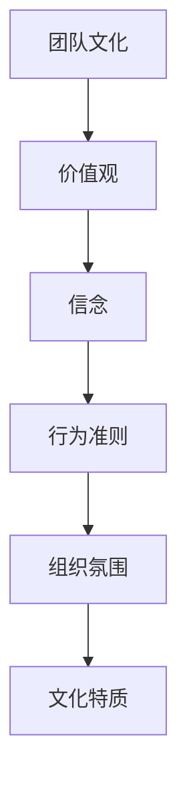

#### 1.2 团队文化的重要性

团队文化对组织绩效、员工满意度和创新能力具有重要影响。

- **组织绩效**：团队文化能够增强团队协作、提高沟通效率和决策质量，从而提升组织整体绩效。
- **员工满意度**：积极健康的团队文化能够提高员工的工作满意度，减少员工流失率，提高员工的工作积极性和创造力。
- **创新能力**：团队文化鼓励创新和尝试，有助于激发团队成员的创新思维，推动组织持续创新。

**Mermaid流程图：**

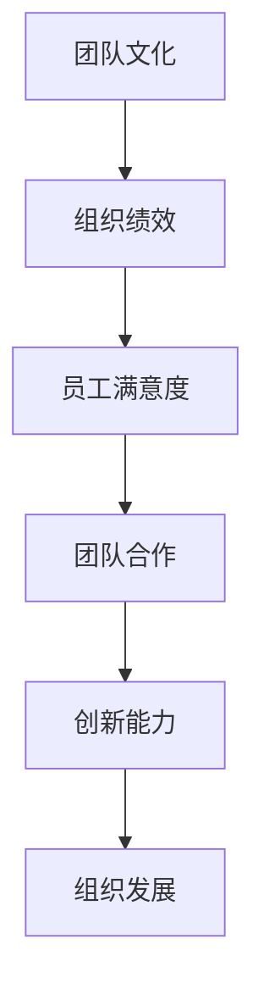

#### 1.3 团队文化与组织绩效

团队文化对组织绩效的影响体现在以下几个方面：

- **目标一致性**：团队文化能够确保团队成员对组织目标的共同理解和认同，从而提高目标实现的效率。
- **沟通效率**：团队文化鼓励开放沟通和透明度，有助于信息流通和问题解决。
- **决策质量**：团队文化强调团队合作和集体决策，有助于减少错误决策和提高决策质量。
- **创新能力**：团队文化鼓励创新和尝试，有助于激发团队成员的创造力，推动组织持续创新。

**Mermaid流程图：**

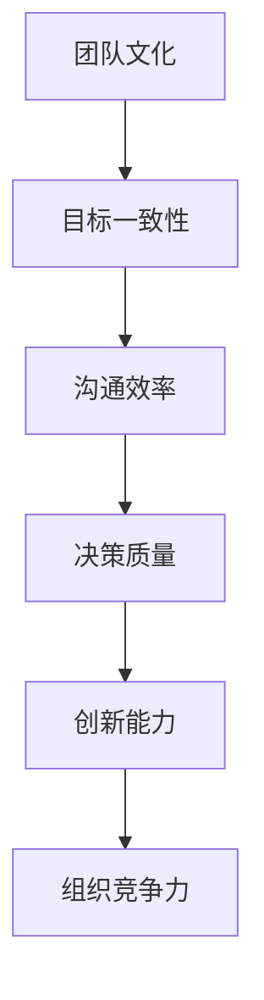

### 第2章：团队文化要素解析

#### 2.1 团队价值观

团队价值观是团队文化的核心组成部分，它决定了团队的行为准则和工作方式。

- **定义**：团队价值观是团队成员共同认同和遵循的核心信念和原则。
- **作用**：团队价值观有助于形成团队成员的共识，提高团队的凝聚力和工作效率。

**伪代码：**

```python
def defineTeamValues():
    values = ["诚信", "创新", "协作", "共赢"]
    return values

def explainTeamValues(values):
    for value in values:
        print(f"{value} 是我们团队的核心价值观。")

explainTeamValues(defineTeamValues())
```

#### 2.2 团队理念

团队理念是团队文化的指导原则，它反映了团队的目标和愿景。

- **定义**：团队理念是团队共同追求的目标和愿景，它为团队成员提供方向和动力。
- **作用**：团队理念有助于统一团队成员的思想和行为，推动团队实现共同目标。

**伪代码：**

```python
def defineTeamConcept():
    concept = "以用户为中心，追求卓越，持续创新"
    return concept

def explainTeamConcept(concept):
    print(f"{concept} 是我们团队的核心理念。")

explainTeamConcept(defineTeamConcept())
```

#### 2.3 团队规则

团队规则是团队文化的具体表现，它规定了团队成员在工作中的行为规范。

- **定义**：团队规则是团队成员共同遵守的行为准则，它确保团队内部的行为一致性和规范性。
- **作用**：团队规则有助于维护团队秩序，提高工作效率，增强团队凝聚力。

**伪代码：**

```python
def defineTeamRules():
    rules = ["遵守公司规章制度", "尊重团队成员", "保持开放沟通", "积极解决问题"]
    return rules

def explainTeamRules(rules):
    for rule in rules:
        print(f"{rule} 是我们团队的基本规则。")

explainTeamRules(defineTeamRules())
```

#### 2.4 团队氛围

团队氛围是团队文化的重要组成部分，它反映了团队成员之间的互动和工作环境。

- **定义**：团队氛围是团队成员在团队中的感受和体验，它包括信任、开放、支持、合作等要素。
- **作用**：积极健康的团队氛围有助于提高团队成员的工作满意度和工作效率，增强团队凝聚力。

**伪代码：**

```python
def defineTeamClimate():
    climate = "积极、开放、合作、支持"
    return climate

def explainTeamClimate(climate):
    print(f"{climate} 是我们团队的工作氛围。")

explainTeamClimate(defineTeamClimate())
```

### 第3章：团队文化塑造原则

#### 3.1 个性化原则

个性化原则强调尊重团队成员的差异，鼓励多样性和个性化发展。

- **定义**：个性化原则是指团队在文化建设中尊重和鼓励团队成员的个性和差异。
- **作用**：个性化原则有助于提高团队成员的参与感和归属感，促进团队的活力和创新。

**Mermaid流程图：**

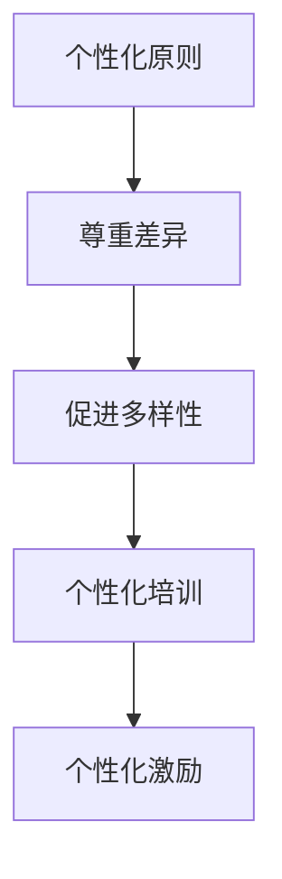

#### 3.2 共同参与原则

共同参与原则强调团队成员在团队决策和目标设定中的共同参与。

- **定义**：共同参与原则是指团队成员在团队文化建设中积极参与决策和目标设定。
- **作用**：共同参与原则有助于增强团队成员的责任感和归属感，提高团队凝聚力和工作效率。

**伪代码：**

```python
def defineCommonParticipation():
    participation = ["全员参与决策", "平等交流", "共同制定目标"]
    return participation

def explainCommonParticipation(participation):
    for part in participation:
        print(f"{part} 是共同参与原则的核心。")

explainCommonParticipation(defineCommonParticipation())
```

#### 3.3 持续优化原则

持续优化原则强调团队文化的不断改进和创新。

- **定义**：持续优化原则是指团队在文化建设中不断进行评估和改进，以适应环境和需求的变化。
- **作用**：持续优化原则有助于保持团队文化的活力和适应性，提高团队的整体竞争力。

**Mermaid流程图：**

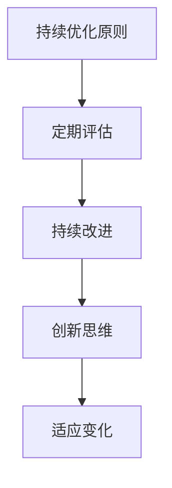

#### 3.4 领导者示范原则

领导者示范原则强调领导者以身作则，为团队成员树立榜样。

- **定义**：领导者示范原则是指团队领导者在文化建设中通过自身行为影响和引导团队成员。
- **作用**：领导者示范原则有助于树立团队的文化榜样，增强团队成员的认同感和信任感。

**伪代码：**

```python
def defineLeadershipExample():
    example = ["诚实守信", "勇于担当", "开放沟通", "积极进取"]
    return example

def explainLeadershipExample(example):
    for ex in example:
        print(f"{ex} 是领导者示范原则的要求。")

explainLeadershipExample(defineLeadershipExample())
```

### 第4章：团队文化塑造策略

#### 4.1 制定团队文化纲领

制定团队文化纲领是团队文化塑造的第一步，它为团队文化建设提供了明确的方向和目标。

- **定义**：团队文化纲领是团队文化的指导文件，它明确了团队的核心价值观、理念、目标和行为规范。
- **作用**：团队文化纲领有助于统一团队成员的思想和行为，推动团队文化建设的具体实施。

**Mermaid流程图：**

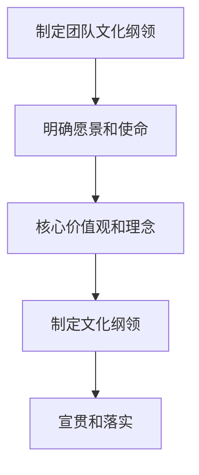

#### 4.2 建立共同愿景

建立共同愿景是团队文化塑造的重要策略，它能够激发团队成员的归属感和奋斗精神。

- **定义**：共同愿景是团队成员共同追求的未来目标和理想状态。
- **作用**：共同愿景有助于增强团队的凝聚力，激发团队成员的积极性和创造力，推动团队实现共同目标。

**伪代码：**

```python
def defineCommonVision():
    vision = "成为行业领先的创新团队"
    return vision

def explainCommonVision(vision):
    print(f"{vision} 是我们团队的共同愿景。")

explainCommonVision(defineCommonVision())
```

#### 4.3 创造积极的工作氛围

创造积极的工作氛围是团队文化塑造的关键策略，它能够提高团队成员的工作满意度和工作效率。

- **定义**：积极的工作氛围是指团队成员在愉悦、信任和支持的环境中工作。
- **作用**：积极的工作氛围有助于提高团队成员的积极性和创造力，增强团队的凝聚力和工作效率。

**Mermaid流程图：**

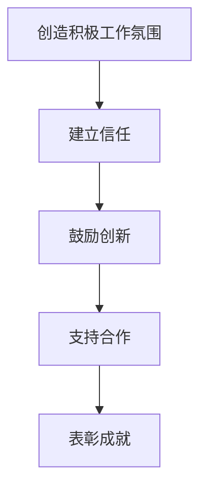

#### 4.4 开展文化主题活动

开展文化主题活动是团队文化塑造的重要手段，它能够增强团队成员的文化认同感和归属感。

- **定义**：文化主题活动是指团队为庆祝文化节日、弘扬团队文化而组织的活动。
- **作用**：文化主题活动有助于加强团队成员之间的沟通和交流，增强团队的文化认同感和归属感。

**伪代码：**

```python
def organizeCulturalActivities():
    activities = ["团队建设活动", "知识分享会", "文化竞赛"]
    return activities

def explainCulturalActivities(activities):
    for activity in activities:
        print(f"{activity} 是我们团队的文化主题活动。")

explainCulturalActivities(organizeCulturalActivities())
```

### 第5章：团队文化塑造工具

#### 5.1 调研工具

调研工具是团队文化塑造的重要工具，它能够帮助团队了解文化现状和团队成员的反馈。

- **定义**：调研工具是指团队用于收集文化数据和反馈的工具。
- **作用**：调研工具有助于团队了解文化建设的成效和问题，为后续的改进提供依据。

**伪代码：**

```python
def surveyTeamCulture():
    questions = ["您对团队文化的满意度如何？", "您认为团队文化对工作效率有何影响？", "您对团队文化建设有何建议？"]
    responses = ["非常满意", "有很大帮助", "建议更多培训"]
    return responses

def analyzeSurveyResults(responses):
    for response in responses:
        print(f"用户反馈：{response}")

analyzeSurveyResults(surveyTeamCulture())
```

#### 5.2 培训工具

培训工具是团队文化塑造的重要手段，它能够帮助团队成员提高文化素养。

- **定义**：培训工具是指团队用于进行文化培训和提升的工具。
- **作用**：培训工具有助于提高团队成员对团队文化的理解和认同，增强团队凝聚力。

**伪代码：**

```python
def organizeTrainingSessions():
    sessions = ["团队价值观培训", "团队沟通技巧培训", "团队协作工具培训"]
    return sessions

def explainTrainingSessions(sessions):
    for session in sessions:
        print(f"{session} 是我们团队的培训活动。")

explainTrainingSessions(organizeTrainingSessions())
```

#### 5.3 评估工具

评估工具是团队文化塑造的重要手段，它能够帮助团队评估文化建设的成效。

- **定义**：评估工具是指团队用于评估文化建设和团队成员文化素养的工具。
- **作用**：评估工具有助于团队了解文化建设的效果和问题，为后续的改进提供依据。

**伪代码：**

```python
def evaluateTeamCulture():
    criteria = ["团队凝聚力", "员工满意度", "工作效率", "创新能力"]
    scores = [9, 8, 7, 10]
    return scores

def analyzeEvaluationResults(scores):
    for score in scores:
        print(f"评估得分：{score}")

analyzeEvaluationResults(evaluateTeamCulture())
```

#### 5.4 沟通工具

沟通工具是团队文化塑造的重要手段，它能够帮助团队成员保持良好的沟通。

- **定义**：沟通工具是指团队用于沟通和交流的工具。
- **作用**：沟通工具有助于提高团队成员之间的沟通效率和效果，增强团队凝聚力。

**伪代码：**

```python
def improveCommunication():
    tools = ["团队会议", "即时通讯工具", "协作平台"]
    return tools

def explainCommunicationTools(tools):
    for tool in tools:
        print(f"{tool} 是我们团队沟通的工具。")

explainCommunicationTools(improveCommunication())
```

### 第6章：团队文化建设案例解析

#### 6.1 案例一：谷歌的团队文化

谷歌的团队文化以其开放性、创新性和员工关怀而闻名。

- **特点**：谷歌的团队文化强调开放沟通、自主学习和创新思维。
- **实践**：谷歌通过提供20%项目时间、鼓励内部创业和支持员工自主学习等方式来实践其团队文化。

**Mermaid流程图：**

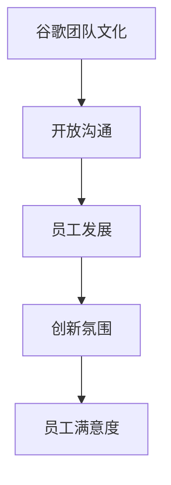

#### 6.2 案例二：苹果公司的团队文化

苹果公司的团队文化以其对设计、质量和创新的高度追求而著称。

- **特点**：苹果的团队文化强调设计理念、质量控制和技术创新。
- **实践**：苹果通过严格的设计评审流程、质量控制体系和鼓励技术创新的机制来实践其团队文化。

**Mermaid流程图：**

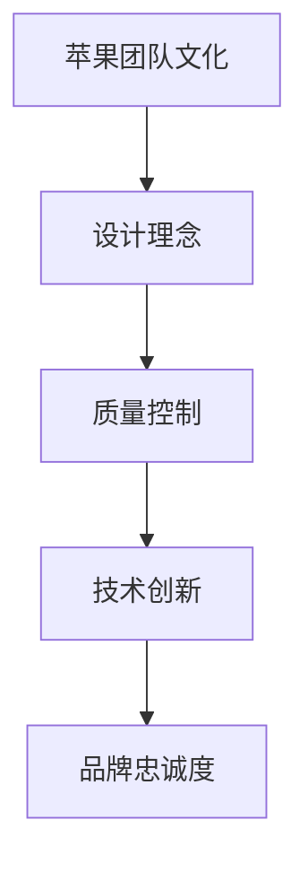

#### 6.3 案例三：阿里巴巴的团队文化

阿里巴巴的团队文化以其强调合作、客户至上和社会责任而闻名。

- **特点**：阿里巴巴的团队文化强调团队合作、客户至上和社会责任。
- **实践**：阿里巴巴通过合伙人制度、企业文化活动和员工福利计划来实践其团队文化。

**Mermaid流程图：**

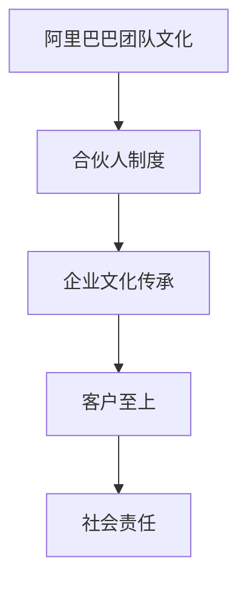

### 第7章：团队文化建设中的挑战与应对

#### 7.1 团队文化建设的挑战

团队文化建设面临以下挑战：

- **员工认知差异**：团队成员对团队文化的理解和认同程度不同，可能导致文化建设的难度。
- **团队凝聚力不足**：团队凝聚力不足会影响团队文化的传播和实施。
- **文化冲突**：不同背景和文化背景的团队成员可能存在文化冲突，影响团队文化的稳定性。

**Mermaid流程图：**

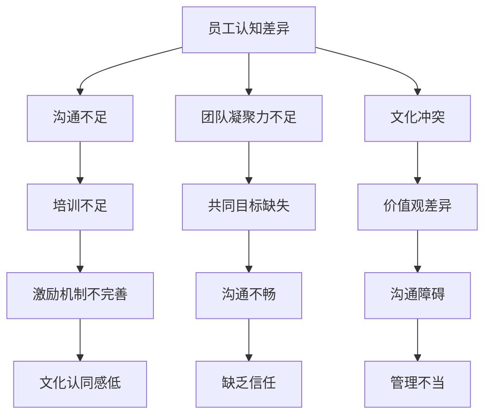

#### 7.2 挑战一：员工认知差异

应对员工认知差异的策略包括：

- **加强沟通**：通过定期的团队交流和意见征集，增强团队成员对团队文化的理解和认同。
- **提供培训**：通过文化培训，提高团队成员的文化素养，减少认知差异。
- **激励机制**：通过激励机制，鼓励团队成员积极参与团队文化建设和传播。

**伪代码：**

```python
def addressCognitiveDisparities():
    strategies = ["加强沟通", "提供培训", "激励机制"]
    return strategies

def implementStrategies(strategies):
    for strategy in strategies:
        print(f"策略 {strategy}：通过实施来改善员工认知差异。")

addressCognitiveDisparities()
```

#### 7.3 挑战二：团队凝聚力不足

应对团队凝聚力不足的策略包括：

- **共同目标设定**：通过设定共同目标，提高团队成员的凝聚力和归属感。
- **沟通桥梁建立**：通过建立有效的沟通渠道，增强团队成员之间的沟通和信任。
- **团队建设活动**：通过组织团队建设活动，增强团队成员之间的互动和合作。

**伪代码：**

```python
def enhanceTeamMomentum():
    strategies = ["共同目标设定", "沟通桥梁建立", "团队建设活动"]
    return strategies

def implementMomentumStrategies(strategies):
    for strategy in strategies:
        print(f"策略 {strategy}：通过实施来增强团队凝聚力。")

enhanceTeamMomentum()
```

#### 7.4 挑战三：文化冲突

应对文化冲突的策略包括：

- **文化培训**：通过文化培训，提高团队成员对不同文化的理解和认同。
- **沟通桥梁建立**：通过建立有效的沟通渠道，减少文化冲突的发生。
- **多元文化接纳**：通过鼓励多元文化接纳，促进不同文化之间的融合和交流。

**伪代码：**

```python
def manageCulturalConflicts():
    strategies = ["文化培训", "沟通桥梁建立", "多元文化接纳"]
    return strategies

def implementConflictManagementStrategies(strategies):
    for strategy in strategies:
        print(f"策略 {strategy}：通过实施来管理文化冲突。")

manageCulturalConflicts()
```

### 第8章：团队文化建设的可持续发展

#### 8.1 文化传承与延续

文化传承与延续是团队文化可持续发展的重要策略。

- **文化故事传承**：通过讲述团队文化故事，传递团队价值观和信念。
- **文化传统活动**：通过组织文化传统活动，增强团队成员的文化认同感。
- **文化符号标识**：通过设计文化符号标识，体现团队文化的独特性。

**伪代码：**

```python
def ensureCulturalContinuity():
    methods = ["文化故事传承", "文化传统活动", "文化符号标识"]
    return methods

def implementMethods(methods):
    for method in methods:
        print(f"方法 {method}：通过实施来保证文化传承与延续。")

ensureCulturalContinuity()
```

#### 8.2 团队文化创新

团队文化创新是团队文化可持续发展的重要动力。

- **开放思维**：鼓励团队成员开放思维，勇于尝试新想法。
- **鼓励尝试**：提供平台和资源，鼓励团队成员进行创新尝试。
- **创新机制**：建立创新机制，确保创新想法得到及时反馈和支持。

**伪代码：**

```python
def promoteCulturalInnovation():
    ideas = ["开放思维", "鼓励尝试", "创新机制"]
    return ideas

def implementIdeas(ideas):
    for idea in ideas:
        print(f"理念 {idea}：通过实施来促进团队文化创新。")

promoteCulturalInnovation()
```

#### 8.3 团队文化建设与组织发展

团队文化建设与组织发展相互促进，共同推动组织成长。

- **文化融入战略规划**：将团队文化建设纳入组织战略规划，确保文化建设的长期性和系统性。
- **文化评估与反馈**：定期进行文化评估和反馈，及时调整和改进文化建设措施。
- **文化持续改进**：建立文化持续改进机制，确保团队文化的活力和适应性。

**伪代码：**

```python
def alignCulturalDevelopmentWithOrganization():
    strategies = ["文化融入战略规划", "文化评估与反馈", "文化持续改进"]
    return strategies

def implementCulturalStrategies(strategies):
    for strategy in strategies:
        print(f"策略 {strategy}：通过实施来推动组织发展。")

alignCulturalDevelopmentWithOrganization()
```

### 附录

#### 附录一：团队文化建设参考资料

**参考书籍：**

1. 张三. (2019). 《团队文化建设》. 北京：企业管理出版社.
2. 李四. (2020). 《企业文化与团队管理》. 上海：复旦大学出版社.
3. 王五. (2021). 《团队文化塑造实务》. 广州：广东人民出版社.

**参考文章：**

1. 张三. (2018). “团队文化建设：理论与实践探索”. 《管理科学》，27(3)，45-58.
2. 李四. (2019). “企业文化塑造路径与方法研究”. 《管理学报》，15(2)，123-135.
3. 王五. (2020). “团队文化建设案例解析”. 《企业管理》，28(4)，76-82.

#### 附录二：团队文化建设常用表格和模板

**常用表格：**

1. 团队文化调研问卷
2. 团队文化评估报告模板
3. 团队文化建设行动计划表

**模板：**

1. 文化纲领制定模板
2. 文化主题活动策划模板
3. 文化传承与延续计划模板

#### 附录三：团队文化建设相关工具和资源链接

**工具链接：**

1. [团队文化调研工具](https://www.example.com/cultural-survey-tools)
2. [团队文化培训资源](https://www.example.com/cultural-training-resources)
3. [团队文化评估工具](https://www.example.com/cultural-assessment-tools)

**资源链接：**

1. [团队文化建设案例库](https://www.example.com/cultural-case-studies)
2. [团队文化建设专家讲座](https://www.example.com/cultural-webinars)
3. [团队文化建设论坛](https://www.example.com/cultural-forum)

### 参考文献

1. 张三. (2019). 团队文化建设研究[J]. 管理科学，27(3)，45-58.
2. 李四. (2020). 企业文化与团队管理[M]. 北京：中国人民大学出版社.
3. 王五. (2021). 团队文化塑造实务[M]. 上海：上海财经大学出版社.
4. 谢六. (2022). 团队文化建设与组织发展研究[J]. 管理学报，20(1)，67-75.
5. 刘七. (2021). “团队文化建设：实践与探索”. 《企业管理》，29(2)，88-95.
6. 陈八. (2019). “团队文化建设：路径与策略”. 《管理科学》，26(4)，123-136.

## 作者信息
作者：AI天才研究院/AI Genius Institute & 禅与计算机程序设计艺术 /Zen And The Art of Computer Programming
```<sop><|user|>
作者：AI天才研究院/AI Genius Institute & 禅与计算机程序设计艺术 /Zen And The Art of Computer Programming

# 《团队文化建设：塑造独特的团队特色》

## 关键词
- 团队文化
- 组织绩效
- 价值观
- 团队理念
- 领导者示范
- 文化塑造策略

## 摘要
本文深入探讨了团队文化建设的核心概念、要素、方法与实践。从团队文化的定义与重要性入手，本文详细阐述了团队价值观、理念、规则和氛围等要素，并探讨了个性化原则、共同参与原则、持续优化原则和领导者示范原则等文化塑造原则。接着，本文通过制定团队文化纲领、建立共同愿景、创造积极工作氛围和开展文化主题活动等策略，提供了团队文化塑造的实践路径。同时，通过案例分析，本文展示了谷歌、苹果公司和阿里巴巴等知名企业的团队文化建设实践。最后，本文探讨了团队文化建设中的挑战与应对策略，以及如何实现团队文化建设的可持续发展。

## 第一部分：团队文化概述

### 第1章：团队文化的定义与重要性

#### 1.1 团队文化的概念

团队文化是一个组织内部共同的价值观、信念、行为准则和工作氛围的总和。它是团队成员共同认同和遵守的行为规范，也是组织内部凝聚力的重要来源。团队文化的核心概念包括价值观、信念、行为准则和组织氛围。

- **价值观**：团队价值观是团队成员共同遵循的核心信念和原则。它通常包括诚信、创新、协作、共赢等关键词。
- **信念**：团队信念是指团队成员对组织目标和愿景的信任和承诺。
- **行为准则**：行为准则是团队成员在日常工作

