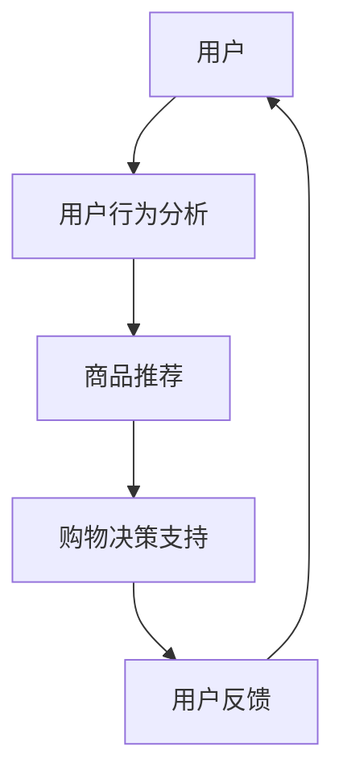

                 

## 文章标题

> 关键词：在线购物、LLM、个性化、高效、购物体验

在当今数字化时代，在线购物已经逐渐成为人们日常生活中不可或缺的一部分。无论是购买日常用品、电子产品，还是享受娱乐和美食服务，人们都可以通过网络轻松实现。随着人工智能技术的飞速发展，尤其是大型语言模型（LLM）的出现，在线购物的体验正迎来前所未有的变革。本文将探讨在线购物与LLM的结合，如何通过个性化推荐和高效购物体验，改变消费者的购物方式，提升用户体验。

### 《在线购物与LLM：个性化、高效的购物体验》目录大纲

#### 第一部分：在线购物基础知识

1. **第1章：在线购物的概述与演变**
   - **1.1 在线购物的起源与发展**
     - 互联网的兴起与在线购物的崛起
     - 在线购物的核心要素
   - **1.2 在线购物市场现状**
     - 全球在线购物市场分析
     - 我国在线购物市场特点
   - **1.3 在线购物中的用户体验**
     - 用户体验设计的重要性
     - 用户体验设计的核心要素

2. **第2章：个性化购物的原理与实现**
   - **2.1 个性化购物的核心概念**
     - 个性化推荐系统
     - 用户行为分析与建模
   - **2.2 个性化推荐算法**
     - 协同过滤算法
     - 内容推荐算法
     - 混合推荐算法
   - **2.3 个性化购物的应用场景**
     - 商品推荐
     - 用户分类
     - 购物车个性化

3. **第3章：高效购物体验的设计与优化**
   - **3.1 高效购物体验的核心要素**
     - 购物流程优化
     - 界面设计优化
     - 服务质量优化
   - **3.2 人工智能在购物体验中的应用**
     - 自然语言处理
     - 计算机视觉
     - 人工智能在购物体验中的挑战与机遇
   - **3.3 案例分析：电商平台购物体验优化实践**
     - 用户画像分析
     - 推荐系统优化
     - 购物流程优化案例

4. **第4章：在线购物中的法律问题与伦理探讨**
   - **4.1 在线购物的法律问题**
     - 消费者权益保护
     - 数据隐私保护
   - **4.2 伦理问题与消费者心理**
     - 在线购物中的欺骗与误导
     - 消费者心理分析
   - **4.3 在线购物的社会责任**
     - 企业社会责任
     - 可持续发展

5. **第5章：未来的在线购物趋势**
   - **5.1 物联网与在线购物**
     - 物联网技术在购物中的应用
     - 物联网时代购物体验的变革
   - **5.2 5G与云计算对购物体验的影响**
     - 5G技术对购物体验的改进
     - 云计算在购物平台中的应用
   - **5.3 人工智能与购物体验的未来**
     - 人工智能在购物体验中的未来发展
     - 智能购物助手与虚拟试衣

6. **第6章：国内外在线购物案例研究**
   - **6.1 阿里巴巴集团的购物平台**
     - 阿里巴巴集团的购物平台概述
     - 阿里巴巴购物平台的个性化推荐系统
     - 阿里巴巴购物平台的服务质量优化
   - **6.2 亚马逊的购物平台**
     - 亚马逊购物平台概述
     - 亚马逊购物平台的个性化推荐系统
     - 亚马逊购物平台的服务质量优化
   - **6.3 欧洲购物平台案例**
     - 欧洲购物平台概述
     - 欧洲购物平台的个性化推荐系统
     - 欧洲购物平台的服务质量优化

7. **第7章：在线购物平台的技术实现与工具**
   - **7.1 在线购物平台的技术架构**
     - 前端技术
     - 后端技术
     - 数据库技术
   - **7.2 在线购物平台开发工具与框架**
     - 常见前端框架
     - 常见后端框架
     - 数据处理与分析工具
   - **7.3 在线购物平台的安全性**
     - 数据安全
     - 网络安全
     - 用户隐私保护

8. **第8章：LLM在在线购物中的应用**
   - **8.1 LLM的核心概念**
     - LLM的定义与特点
     - LLM的架构与工作原理
   - **8.2 LLM在个性化购物推荐中的应用**
     - LLM在商品推荐中的优势
     - LLM在个性化购物推荐中的实践案例
   - **8.3 LLM在购物体验优化中的应用**
     - LLM在用户行为分析中的应用
     - LLM在智能客服中的应用
   - **8.4 LLM在购物决策支持中的应用**
     - LLM在价格决策中的应用
     - LLM在库存管理中的应用
   - **8.5 LLM在在线购物中的未来发展趋势**
     - LLM在购物平台中的角色
     - LLM在购物体验中的未来发展方向

**Mermaid 流程图：**



---

**核心算法原理讲解：**

**协同过滤算法：**

```plaintext
输入：
- 用户-项目评分矩阵 R
- 用户集合 U
- 项目集合 I

输出：
- 推荐列表 R'

步骤：
1. 计算用户之间的相似度矩阵 S
   S[i][j] = |R[i] - R[j]| / sqrt(sum(R[i]^2) * sum(R[j]^2))

2. 计算未评分项目的潜在评分预测矩阵 P
   P[i][j] = sum(S[i][k] * R[k][j]) for all k in I

3. 计算预测评分 R' = R + P

4. 按照评分预测值排序得到推荐列表 R'
```

---

**数学模型和数学公式讲解：**

**矩阵分解（Singular Value Decomposition, SVD）：**

$$
R = U \Sigma V^T
$$

其中：
- \( R \) 是用户-项目评分矩阵。
- \( U \) 和 \( V \) 是正交矩阵。
- \( \Sigma \) 是对角矩阵，包含奇异值。

---

**项目实战：**

**开发环境搭建：**

```plaintext
1. 安装Python环境（版本3.8或更高）
2. 安装NumPy、Pandas、Scikit-learn等科学计算库
3. 安装MongoDB数据库（用于存储用户行为和评分数据）
```

**源代码实现：**

```python
import numpy as np
from sklearn.model_selection import train_test_split
from sklearn.metrics.pairwise import cosine_similarity
from scipy.sparse.linalg import svds

# 加载数据
data = load_data('ratings.csv')
R = preprocess_data(data)

# 划分训练集和测试集
R_train, R_test = train_test_split(R, test_size=0.2, random_state=42)

# 计算用户-项目相似度矩阵
S = cosine_similarity(R_train)

# 使用SVD进行矩阵分解
U, sigma, Vt = svds(S, k=50)

# 构建预测评分矩阵
P = np.dot(U, np.dot(sigma, Vt))

# 预测测试集评分
predictions = R_test + P

# 评估模型性能
evaluate_predictions(predictions, R_test)
```

**代码解读与分析：**

```plaintext
# 代码主要分为四个部分：

1. 数据加载与预处理：从CSV文件中加载数据，并转换为矩阵格式。
2. 计算用户-项目相似度：使用余弦相似度计算用户和项目之间的相似度。
3. SVD矩阵分解：使用scikit-learn的svds函数进行矩阵分解，提取主要特征。
4. 预测评分与评估：使用预测评分矩阵对测试集进行评分预测，并评估模型性能。

关键步骤包括：
- 数据预处理：将原始数据转换为适用于算法的矩阵格式。
- 相似度计算：使用余弦相似度计算用户和项目之间的相似度。
- 矩阵分解：通过SVD提取用户和项目的潜在特征。
- 预测评分：将潜在特征矩阵相乘得到预测评分。
- 模型评估：使用评估指标（如均方根误差RMSE）来评估模型性能。

通过这个过程，可以实现对用户行为和商品特征的深入分析，从而提供个性化的购物推荐。
```

---

接下来，我们将详细探讨在线购物与LLM的结合，以及它们如何共同塑造未来的购物体验。在第一部分中，我们将回顾在线购物的起源与发展，并分析当前市场的现状。通过这样的历史和现状分析，我们将为后续关于个性化购物和高效购物体验的讨论奠定基础。

### 第一部分：在线购物基础知识

#### 第1章：在线购物的概述与演变

##### 1.1 在线购物的起源与发展

在线购物，顾名思义，是指通过互联网进行商品购买和交易的活动。这一概念的兴起，可以追溯到20世纪90年代互联网的普及。当时的互联网正处于高速发展阶段，全球范围内的网民数量迅速增加，这为电子商务的崛起提供了肥沃的土壤。

**互联网的兴起与在线购物的崛起**

1989年，蒂姆·伯纳斯-李发明了万维网（WWW），这标志着互联网从学术领域走向公众视野。1991年，第一个在线商店出现，名为“Book Stacks Unlimited”，它通过电子邮件和电话订单进行销售。然而，这一阶段的在线购物还处于初级阶段，交易量较小，主要局限于书籍和音乐等商品。

真正的转折点出现在1995年，当时亚马逊（Amazon）正式上线，成为第一家专注于在线图书销售的电子商务公司。亚马逊的成功，不仅吸引了大量消费者的关注，也带动了其他电商平台的诞生，如eBay和阿里巴巴等。这些平台通过提供多样化的商品和服务，进一步推动了在线购物的发展。

**在线购物的核心要素**

在线购物系统的核心要素包括用户、商品、支付、物流和用户体验。

- **用户**：在线购物的主体，是购买行为的发起者和受益者。用户需求是推动在线购物发展的关键因素，平台需要通过精准的用户分析，来满足不同用户群体的个性化需求。

- **商品**：在线购物平台上的核心资源，包括各种类型的商品，从日常用品到高端奢侈品。平台需要确保商品的多样性和质量，以满足消费者的不同需求。

- **支付**：支付系统是在线购物交易的重要环节。随着电子支付的普及，如信用卡、PayPal、支付宝和微信支付等，支付方式越来越便捷，这大大促进了在线购物的普及。

- **物流**：物流系统负责商品的配送，是确保消费者及时收到商品的重要保障。随着物流技术的进步，如无人机配送和智能快递柜等新技术的应用，物流效率得到了显著提升。

- **用户体验**：用户体验是影响消费者购买决策的重要因素。一个良好的用户体验包括简洁直观的界面设计、流畅的操作流程、友好的客户服务以及快速的响应速度。

##### 1.2 在线购物市场现状

**全球在线购物市场分析**

根据Statista的数据，2021年全球在线购物市场的规模已经达到了4.9万亿美元，并且预计未来几年将继续保持增长。特别是在新冠疫情的推动下，全球范围内的在线购物需求大幅增加，许多传统零售商也纷纷转向线上销售。

在线购物的增长得益于以下几个方面：

- **移动互联网的普及**：智能手机和移动互联网的普及，使得消费者可以随时随地访问在线购物平台，进行购物活动。

- **电子商务平台的崛起**：亚马逊、阿里巴巴、eBay等大型电商平台，通过提供多样化的商品和服务，吸引了大量消费者。

- **物流网络的完善**：全球范围内的物流网络不断扩展和完善，使得商品的配送更加高效和便捷。

- **消费者习惯的改变**：随着人们对在线购物的接受度不断提高，越来越多的消费者选择在线购物，以节省时间和精力。

**我国在线购物市场特点**

我国是电子商务领域的重要市场，具有以下特点：

- **市场规模巨大**：我国拥有世界上最大的互联网用户群体，这为在线购物市场的发展提供了庞大的用户基础。

- **支付方式的多样化**：我国的支付方式非常多样，包括信用卡、支付宝、微信支付等，这为消费者提供了便利的支付选择。

- **物流效率高**：我国的物流行业经过多年的发展，已经形成了高效、覆盖面广的物流网络，这大大提升了消费者的购物体验。

- **政策支持**：我国政府对电子商务的发展给予了大力支持，通过制定相关政策和法规，促进了市场的规范和发展。

##### 1.3 在线购物中的用户体验

**用户体验设计的重要性**

用户体验（User Experience, UX）设计是影响在线购物成功的关键因素之一。良好的用户体验可以增加用户的满意度和忠诚度，从而促进销售和品牌忠诚度。用户体验设计包括以下几个方面：

- **界面设计**：界面设计需要简洁、直观，方便用户快速找到所需商品和操作。

- **操作流程**：操作流程需要流畅、简单，减少用户的操作步骤和时间。

- **响应速度**：响应速度需要快速，保证用户在浏览商品和进行交易时不会感到等待的疲劳。

- **客户服务**：良好的客户服务包括及时、有效的客服支持，解决用户在购物过程中遇到的问题。

**用户体验设计的核心要素**

- **易用性**：用户在使用过程中能够轻松完成各项操作，界面设计要直观易懂。

- **美观性**：界面设计要美观，符合用户的审美需求，提高用户的愉悦感。

- **一致性**：在不同设备和平台上的用户体验要保持一致，确保用户在不同环境下有相同的购物体验。

- **可访问性**：网站要能够适应各种用户需求，包括视力障碍者、听力障碍者等，提高网站的包容性。

综上所述，在线购物的起源与发展、市场现状和用户体验设计，构成了在线购物的基础知识框架。在下一章中，我们将进一步探讨个性化购物的原理与实现，分析如何通过个性化推荐系统提升用户的购物体验。

### 第2章：个性化购物的原理与实现

个性化购物是一种通过分析用户行为和偏好，为用户提供量身定制购物体验的技术。它不仅能够提高用户满意度，还能显著提升电商平台的销售转化率和客户忠诚度。在本章中，我们将深入探讨个性化购物的核心概念、推荐算法以及具体应用场景。

#### 2.1 个性化购物的核心概念

**个性化推荐系统**

个性化推荐系统（Personalized Recommendation System）是实施个性化购物的重要工具。它通过分析用户的购物历史、浏览记录、收藏夹和评分数据，预测用户可能感兴趣的商品，并推荐给用户。个性化推荐系统通常包括以下几个关键组成部分：

- **用户建模**：通过对用户行为和偏好的分析，建立用户特征模型，以便后续推荐算法使用。

- **商品建模**：分析商品的特征，如分类、价格、品牌和用户评价等，构建商品特征模型。

- **推荐算法**：基于用户和商品模型，通过算法计算用户和商品之间的相似度，生成个性化推荐列表。

- **推荐评估**：评估推荐系统的效果，通过点击率、购买率等指标，不断优化推荐算法和系统。

**用户行为分析与建模**

用户行为分析是个性化购物的基础。通过分析用户的浏览、搜索、购买和评价行为，可以深入了解用户的需求和偏好。用户行为建模的过程包括以下几个步骤：

1. **数据收集**：收集用户的购物行为数据，包括浏览记录、搜索关键词、购买历史和评价等。

2. **数据预处理**：清洗和整合数据，去除噪声和缺失值，确保数据的准确性和完整性。

3. **特征提取**：从原始数据中提取有用的特征，如用户浏览时间、浏览频次、购买频次和评价等级等。

4. **模型构建**：使用机器学习算法，如决策树、支持向量机和神经网络等，构建用户行为模型。

5. **模型评估**：通过交叉验证和测试集，评估模型的效果，并根据评估结果调整模型参数。

通过用户行为分析建模，电商平台可以更准确地了解用户的偏好，从而提供更加个性化的推荐。

#### 2.2 个性化推荐算法

**协同过滤算法**

协同过滤（Collaborative Filtering）是应用最广泛的个性化推荐算法之一。它通过分析用户之间的相似性，为用户提供相似用户的偏好推荐。协同过滤算法可以分为两种主要类型：基于用户的协同过滤（User-Based Collaborative Filtering）和基于项目的协同过滤（Item-Based Collaborative Filtering）。

1. **基于用户的协同过滤算法**

   基于用户的协同过滤算法首先计算用户之间的相似度，然后为用户推荐与其相似的其他用户的偏好商品。具体步骤如下：

   - **相似度计算**：计算用户之间的相似度，通常使用余弦相似度、皮尔逊相关系数等度量方法。

   - **邻居选择**：选择与目标用户相似度最高的若干用户作为邻居。

   - **推荐生成**：为用户推荐邻居用户喜欢的商品，同时避免重复推荐用户已购买或已浏览的商品。

2. **基于项目的协同过滤算法**

   基于项目的协同过滤算法首先计算商品之间的相似度，然后为用户推荐与其浏览或购买过的商品相似的未购买商品。具体步骤如下：

   - **相似度计算**：计算商品之间的相似度，通常使用Jaccard相似度、余弦相似度等度量方法。

   - **邻居选择**：选择与目标用户浏览或购买过的商品最相似的商品。

   - **推荐生成**：为用户推荐与其浏览或购买过的商品相似的其他商品。

**内容推荐算法**

内容推荐（Content-Based Filtering）算法通过分析商品的属性和内容，为用户推荐与已购买或浏览商品相似的新商品。内容推荐算法的主要步骤如下：

- **内容提取**：提取商品的属性和标签，如类别、品牌、颜色、尺寸等。

- **兴趣建模**：根据用户的购买和浏览历史，建立用户的兴趣模型。

- **推荐生成**：为用户推荐与已购买或浏览商品具有相似属性或标签的新商品。

**混合推荐算法**

混合推荐（Hybrid Recommendation）算法结合了协同过滤和内容推荐算法的优点，通过融合不同算法的推荐结果，提高推荐系统的准确性和多样性。混合推荐算法的主要步骤如下：

- **算法选择**：根据用户和商品的特征，选择合适的协同过滤或内容推荐算法。

- **推荐生成**：结合不同算法的推荐结果，生成最终的推荐列表。

- **优化策略**：通过调整算法参数和推荐策略，不断优化推荐效果。

#### 2.3 个性化购物的应用场景

**商品推荐**

商品推荐是个性化购物中最常见的应用场景。通过分析用户的购物历史和偏好，电商平台可以推荐用户可能感兴趣的商品，提高用户的购买率和满意度。商品推荐系统可以分为以下几类：

- **基于协同过滤的商品推荐**：通过分析用户之间的相似性，为用户推荐相似用户喜欢的商品。

- **基于内容推荐的商品推荐**：通过分析商品的属性和内容，为用户推荐与已购买或浏览商品相似的未购买商品。

- **混合推荐的商品推荐**：结合协同过滤和内容推荐，为用户推荐更加个性化的商品。

**用户分类**

用户分类是将用户划分为不同的群体，以便针对性地进行推荐和服务。用户分类可以通过分析用户的购买历史、浏览行为和偏好来实现。常见的用户分类方法包括：

- **基于购买行为的分类**：根据用户的购买频次、购买金额等行为特征进行分类。

- **基于兴趣的划分**：根据用户的兴趣偏好，如浏览记录、搜索关键词等，进行用户分类。

- **基于人口统计学的分类**：根据用户的人口统计学特征，如年龄、性别、地理位置等，进行分类。

**购物车个性化**

购物车个性化是通过分析用户的购物车内容，为用户提供个性化的购物建议。购物车个性化可以包括以下几个方面：

- **相似商品推荐**：为用户推荐购物车中商品的相关商品，提高购物车的购买转化率。

- **购物车整理建议**：为用户提供购物车整理建议，帮助用户优化购物车内容，提高购物体验。

- **购物车促销活动**：根据用户购物车中的商品，为用户提供针对性的促销活动和折扣信息。

通过个性化购物，电商平台可以更好地满足用户需求，提升用户体验和满意度。在下一章中，我们将探讨如何通过高效购物体验的设计与优化，进一步提升用户的购物体验。

### 第3章：高效购物体验的设计与优化

高效购物体验是提升用户满意度和忠诚度的关键因素之一。在数字化时代，消费者对购物体验的要求越来越高，不仅希望商品种类丰富、价格合理，还希望购物流程简便、响应迅速。本章将探讨高效购物体验的核心要素，以及如何通过人工智能技术优化购物体验。

#### 3.1 高效购物体验的核心要素

**购物流程优化**

购物流程优化是提升购物体验的关键环节。一个高效、流畅的购物流程可以减少用户的操作步骤，节省时间，提高购买率。购物流程优化包括以下几个方面：

1. **简化购物流程**：简化购物流程，减少用户在购物过程中需要完成的操作步骤，例如简化注册流程、购物车管理、结算过程等。

2. **流程可视化**：通过图表、流程图等形式，将购物流程可视化，帮助用户清晰地了解每个步骤，减少用户操作失误。

3. **智能推荐**：在购物过程中，根据用户的浏览历史和购物车内容，提供智能推荐，引导用户快速找到所需商品。

4. **快速响应**：确保购物平台在用户操作时能够快速响应，减少用户的等待时间，提升购物体验。

**界面设计优化**

界面设计是购物体验的重要组成部分。一个良好的界面设计不仅美观，还能提高用户操作的便捷性。界面设计优化包括以下几个方面：

1. **用户友好**：界面设计要简洁、直观，符合用户的使用习惯，避免复杂和冗余的设计。

2. **响应式设计**：确保界面在不同设备和分辨率下都能良好显示，为用户提供一致的购物体验。

3. **导航清晰**：导航设计要清晰明了，帮助用户快速找到所需商品或功能。

4. **美观协调**：界面设计要美观协调，符合品牌形象，提高用户的视觉体验。

**服务质量优化**

服务质量是影响购物体验的重要因素。一个高效、专业的客服团队可以解决用户在购物过程中遇到的问题，提高用户满意度。服务质量优化包括以下几个方面：

1. **快速响应**：确保客服团队能够在用户提出问题后快速响应，提供有效的解决方案。

2. **专业培训**：对客服团队进行专业培训，提高其解决问题的能力和服务质量。

3. **多渠道沟通**：提供多种沟通渠道，如在线聊天、电话、邮件等，方便用户选择最适合自己的沟通方式。

4. **个性化服务**：根据用户的购买历史和偏好，提供个性化的服务和建议，提高用户满意度。

#### 3.2 人工智能在购物体验中的应用

人工智能（AI）技术为购物体验的优化提供了新的可能性。通过自然语言处理（NLP）、计算机视觉（CV）等AI技术，电商平台可以提供更加智能和个性化的服务。以下是人工智能在购物体验中的应用：

**自然语言处理**

自然语言处理技术可以用于智能客服、语音搜索和文本分析等领域，提升购物体验。

1. **智能客服**：通过AI驱动的聊天机器人，电商平台可以提供24/7的客服服务，快速解答用户问题，提高用户满意度。

2. **语音搜索**：通过语音识别技术，用户可以使用语音进行商品搜索，方便快捷，提升购物体验。

3. **文本分析**：通过情感分析和文本挖掘技术，电商平台可以分析用户评论和反馈，了解用户需求和购物体验，进行持续优化。

**计算机视觉**

计算机视觉技术可以用于图像识别、图像分类和增强现实（AR）等领域，提升购物体验。

1. **图像识别**：通过图像识别技术，电商平台可以自动识别用户上传的图片，提供相关的商品推荐和购物链接。

2. **图像分类**：通过图像分类技术，电商平台可以自动分类商品图片，提高商品管理的效率。

3. **增强现实（AR）**：通过AR技术，电商平台可以为用户提供虚拟试衣、家居布置等服务，提升购物体验。

**人工智能在购物体验中的挑战与机遇**

尽管人工智能在购物体验优化中具有巨大潜力，但也面临着一些挑战和机遇。

1. **数据隐私**：人工智能需要大量的用户数据进行训练和优化，如何保护用户隐私成为一大挑战。

2. **算法公平性**：算法的公平性和透明度是一个重要议题，需要确保算法不歧视特定用户群体。

3. **技术成本**：人工智能技术的研发和应用需要较高的成本，电商平台需要找到成本效益的平衡点。

4. **用户体验**：人工智能技术需要与用户的实际需求相结合，提供真正有价值的购物体验。

总之，高效购物体验的设计与优化是电商平台提升竞争力的重要手段。通过购物流程优化、界面设计优化和服务质量优化，结合人工智能技术的应用，电商平台可以提供更加个性化和高效的购物体验。在下一章中，我们将通过案例分析，探讨电商平台在购物体验优化方面的实践。

#### 3.3 案例分析：电商平台购物体验优化实践

电商平台在购物体验优化方面进行了诸多实践，通过分析用户行为、优化推荐系统和购物流程，实现了显著的提升。以下将结合具体案例，详细探讨电商平台在购物体验优化方面的实践。

**用户画像分析**

用户画像分析是电商平台优化购物体验的重要步骤。通过分析用户的基本信息、购买行为和偏好，电商平台可以更精准地了解用户需求，提供个性化的推荐和服务。

- **案例1：阿里巴巴集团的购物平台**

  阿里巴巴集团通过用户画像分析，将用户划分为不同的群体，如高频购物用户、新用户、潜在高价值用户等。针对不同用户群体，平台提供了个性化的推荐和促销活动。

  **具体实践**：
  - 高频购物用户：平台为这些用户推荐与其历史购买相似的商品，同时提供限时折扣和专属优惠券，提高用户的购买频率和满意度。
  - 新用户：平台为新用户提供新手礼包和优惠券，引导其完成首次购买，提高新用户的留存率。
  - 潜在高价值用户：平台通过分析用户的浏览记录和购物车内容，推送与其潜在需求相关的商品，并提供个性化定制服务，如定制服饰、家居用品等。

**推荐系统优化**

推荐系统的优化是提升购物体验的关键环节。通过不断优化推荐算法和策略，电商平台可以提供更加精准和个性化的商品推荐。

- **案例2：亚马逊的购物平台**

  亚马逊是全球最大的电商平台之一，其推荐系统在购物体验优化中发挥了重要作用。亚马逊通过多种推荐算法和策略，为用户提供了丰富的商品推荐。

  **具体实践**：
  - 协同过滤算法：亚马逊使用基于用户的协同过滤算法，根据用户的历史购买行为和偏好，推荐相似用户喜欢的商品。
  - 内容推荐算法：亚马逊通过分析商品的属性和内容，推荐与用户已购买或浏览商品相似的新商品。
  - 混合推荐算法：亚马逊结合协同过滤和内容推荐算法，为用户生成更加精准的推荐列表。

  亚马逊还不断优化推荐系统，通过A/B测试和用户反馈，不断调整推荐算法和策略，提高推荐效果。

**购物流程优化**

购物流程优化是提升购物体验的重要手段。通过简化购物流程、提高响应速度和优化界面设计，电商平台可以提供更加便捷和高效的购物体验。

- **案例3：京东的购物平台**

  京东作为中国领先的电商平台，通过购物流程优化，大幅提升了用户的购物体验。

  **具体实践**：
  - 简化注册流程：京东提供了快速注册和一键登录功能，用户可以快速完成注册并开始购物。
  - 界面设计优化：京东采用了简洁直观的界面设计，用户可以快速找到所需商品和功能。
  - 购物车优化：京东提供了智能购物车功能，根据用户的购买历史和偏好，为用户推荐相关商品，提高购物车转化率。
  - 物流优化：京东通过与物流公司合作，实现了高效的物流配送，确保用户能够快速收到商品。

**服务质量优化**

服务质量优化是提升用户满意度的重要因素。通过提供高效、专业的客户服务，电商平台可以增强用户的购物体验。

- **案例4：苏宁易购的购物平台**

  苏宁易购通过不断提升服务质量，为用户提供了优质的购物体验。

  **具体实践**：
  - 快速响应：苏宁易购建立了高效的客服团队，确保用户在遇到问题时能够快速得到响应和解决。
  - 专业培训：客服团队定期接受专业培训，提高其解决问题的能力和服务水平。
  - 多渠道沟通：苏宁易购提供了多种沟通渠道，如在线聊天、电话、邮件等，方便用户选择最适合自己的沟通方式。

通过用户画像分析、推荐系统优化、购物流程优化和服务质量优化，电商平台可以大幅提升用户的购物体验。这些实践不仅提高了用户的满意度和忠诚度，还显著提升了电商平台的销售业绩。在下一章中，我们将探讨在线购物中的法律问题与伦理探讨，分析电商平台的法律责任和道德责任。

### 第4章：在线购物中的法律问题与伦理探讨

随着在线购物的普及，法律法规和伦理问题成为了不可忽视的议题。在线购物涉及消费者权益保护、数据隐私保护等多个方面，同时也引发了关于欺骗、误导和消费者心理的伦理争议。在本章中，我们将深入探讨在线购物中的法律问题和伦理问题，分析企业在这些方面应承担的社会责任。

#### 4.1 在线购物的法律问题

**消费者权益保护**

消费者权益保护是法律问题中最核心的部分。在线购物中，消费者权益的保护尤为重要，因为消费者无法像在实体店购物时那样直观地看到商品和服务。以下是一些常见的消费者权益问题：

1. **虚假宣传**：电商平台在商品宣传中，可能存在夸大商品性能、隐瞒瑕疵等问题，导致消费者产生误解。对此，《中华人民共和国消费者权益保护法》规定，电商平台应当对商品信息进行真实、准确的披露。

2. **假冒伪劣**：假冒伪劣商品在在线购物中时有发生，侵害了消费者的合法权益。电商平台应当加强对商品的监管，确保商品的质量和真实性。

3. **退换货难**：在线购物中，消费者可能因为各种原因需要退换货。然而，一些电商平台在退换货政策上存在不公平现象，如故意设置苛刻条件，拖延退换货时间等。对此，《中华人民共和国消费者权益保护法》明确规定了消费者的退换货权利。

**数据隐私保护**

随着在线购物的普及，电商平台收集了大量的用户数据。这些数据可能包括用户姓名、地址、电话、购物记录等敏感信息。数据隐私保护成为了一个亟待解决的问题。

1. **个人信息收集与使用**：电商平台在收集用户数据时，应当遵循合法、正当、必要的原则，确保用户同意数据收集和使用。同时，电商平台应当明确告知用户数据的用途和范围，不得擅自变更。

2. **数据安全**：电商平台应当采取有效的技术和管理措施，确保用户数据的安全。例如，采用加密技术保护数据传输，建立严格的数据访问控制机制等。

3. **数据泄露**：数据泄露事件频发，一旦用户数据泄露，可能会导致严重的后果，如个人信息泄露、账户被盗等。对此，我国《网络安全法》明确规定了网络运营者的数据安全保护义务，要求采取技术和管理措施，防止数据泄露和丢失。

#### 4.2 伦理问题与消费者心理

**在线购物中的欺骗与误导**

在线购物中的欺骗和误导问题，主要表现为虚假宣传、误导性广告和虚假评价等。这些问题不仅侵害了消费者的合法权益，也损害了电商平台的声誉。

1. **虚假宣传**：电商平台通过夸大商品性能、隐瞒瑕疵等手段，误导消费者。这种行为不仅违反了法律法规，也违背了商业道德。

2. **误导性广告**：一些电商平台使用夸大其词的广告语，误导消费者，使其产生错误的购买决策。对此，监管部门应当加强对广告内容的审查，确保广告的真实性和合法性。

3. **虚假评价**：一些电商平台为了提高商品销量，采用刷单、虚假评价等手段，误导消费者。这种行为损害了市场的公平竞争，也侵害了消费者的权益。

**消费者心理分析**

在线购物中的消费者心理是一个复杂的问题，涉及购买动机、信任建立、购买决策等多个方面。以下是一些常见的消费者心理问题：

1. **冲动购物**：一些消费者受到促销活动、广告宣传等因素的影响，容易产生冲动购物行为。这种行为可能会导致消费者购买不必要或质量较差的商品。

2. **信任缺失**：消费者在在线购物中，可能会因为担心商品质量、售后服务等问题，对电商平台产生信任缺失。信任的建立需要电商平台提供高质量的购物体验和有效的售后服务。

3. **信息过载**：在线购物平台提供了大量的商品信息，消费者在浏览和选择商品时，可能会感到信息过载，难以做出决策。对此，电商平台应当优化信息展示方式，帮助消费者更快速地找到所需商品。

#### 4.3 在线购物的社会责任

**企业社会责任**

在线购物平台作为市场经济主体，应当承担相应的社会责任，包括保护消费者权益、维护市场秩序、促进可持续发展等。

1. **消费者权益保护**：电商平台应当建立健全的消费者权益保护机制，确保消费者的合法权益不受侵害。

2. **数据隐私保护**：电商平台应当采取有效的数据隐私保护措施，确保用户数据的安全和隐私。

3. **市场秩序维护**：电商平台应当积极参与市场秩序的维护，反对虚假宣传、误导性广告等不正当竞争行为。

4. **可持续发展**：电商平台应当关注环境保护、社会责任和经济效益的平衡，推动可持续商业模式的实施。

**可持续发展**

可持续发展是电商平台面临的长期挑战。以下是一些具体的可持续发展策略：

1. **绿色物流**：电商平台应当推广绿色物流，减少碳排放，降低对环境的影响。

2. **循环经济**：电商平台应当鼓励循环消费，推广再生产品，减少资源浪费。

3. **社会公益**：电商平台应当积极参与社会公益活动，回馈社会，推动公益事业的发展。

总之，在线购物中的法律问题和伦理问题对电商平台的运营和消费者权益保护具有重要影响。电商平台应当积极履行社会责任，遵守法律法规，提供高质量的购物体验，促进在线购物的健康发展。在下一章中，我们将探讨未来的在线购物趋势，分析新技术如何改变购物体验。

### 第5章：未来的在线购物趋势

随着科技的不断发展，未来的在线购物将呈现出许多新的趋势。物联网（IoT）、5G技术和人工智能（AI）等新技术的应用，将显著改变消费者的购物方式，提升购物体验。在本章中，我们将探讨这些新兴技术对在线购物的影响，以及未来的发展方向。

#### 5.1 物联网与在线购物

物联网技术的应用为在线购物带来了全新的变革。物联网设备可以通过传感器和互联网连接，实现商品的实时监控和管理，从而提升购物体验。

**物联网技术在购物中的应用**

1. **智能供应链管理**：物联网技术可以实时监控商品的库存、运输和物流情况，提高供应链的效率。例如，使用RFID标签可以跟踪商品的流向，确保商品能够及时送达消费者手中。

2. **智能仓储**：物联网技术可以帮助电商平台实现智能仓储管理。通过使用传感器和自动化设备，可以实时监控仓库的温度、湿度等环境因素，确保商品存储在最佳条件下。

3. **智能家居购物**：随着智能家居设备的普及，消费者可以通过语音助手、手机应用等智能设备，随时随地完成购物。例如，消费者可以通过智能音箱订购日常用品，实现无接触购物。

**物联网时代购物体验的变革**

1. **个性化购物**：物联网技术可以收集消费者的购物习惯、偏好等数据，为消费者提供更加个性化的购物体验。例如，基于物联网的数据分析，电商平台可以推荐消费者可能感兴趣的商品。

2. **便捷购物**：物联网技术可以实现购物流程的简化，提高购物效率。例如，使用RFID技术，消费者可以在店内快速完成结账，节省时间。

3. **智能客服**：物联网技术可以帮助电商平台实现智能客服，通过语音识别、自然语言处理等技术，提供快速、准确的客服服务。

#### 5.2 5G与云计算对购物体验的影响

5G技术和云计算的应用，将进一步提升在线购物的速度和效率，为消费者带来更加优质的购物体验。

**5G技术对购物体验的改进**

1. **高速网络连接**：5G技术具有高速、低延迟的特点，消费者在浏览商品、下单支付等过程中，可以享受到更加流畅的网络体验。

2. **增强现实（AR）购物**：5G技术可以支持高质量的AR内容，消费者可以通过手机或VR设备，实时查看商品的3D模型，实现虚拟试穿、试妆等购物体验。

3. **实时互动**：5G技术可以实现消费者与商家之间的实时互动，例如，消费者可以通过视频通话与客服进行沟通，获得更加详细的商品信息和购物建议。

**云计算在购物平台中的应用**

1. **弹性扩展**：云计算可以提供灵活的扩展能力，电商平台可以根据业务需求，快速增加或减少服务器资源，确保系统的稳定运行。

2. **数据处理与分析**：云计算提供了强大的数据处理和分析能力，电商平台可以实时分析用户行为数据，优化推荐算法和营销策略。

3. **成本优化**：云计算可以帮助电商平台降低硬件成本和维护成本，通过按需付费的方式，实现成本优化。

#### 5.3 人工智能与购物体验的未来

人工智能技术的发展，为在线购物体验的优化提供了新的可能性。未来，人工智能将在购物体验中扮演更加重要的角色。

**人工智能在购物体验中的未来发展**

1. **个性化推荐**：人工智能可以基于用户的行为数据，为消费者提供更加精准的个性化推荐，提高购物转化率和用户满意度。

2. **智能客服**：人工智能驱动的智能客服系统，可以提供24/7的全天候服务，快速解答用户问题，提升用户体验。

3. **智能支付**：人工智能可以支持多样化的支付方式，如语音支付、人脸支付等，提高支付便捷性。

4. **智能物流**：人工智能可以优化物流路线和配送策略，提高配送效率，降低物流成本。

**智能购物助手与虚拟试衣**

1. **智能购物助手**：智能购物助手可以通过自然语言处理和机器学习技术，与消费者进行对话，提供购物建议和决策支持。

2. **虚拟试衣**：通过增强现实（AR）技术，消费者可以在虚拟环境中试穿衣物，实现更加真实的购物体验。

总之，未来的在线购物将因物联网、5G技术和人工智能的应用而变得更加个性化和高效。通过这些新兴技术的融合，电商平台将能够提供更加优质的购物体验，满足消费者的多元化需求。在下一章中，我们将通过国内外在线购物案例研究，探讨具体的企业实践和成功经验。

### 第6章：国内外在线购物案例研究

在线购物的快速发展，催生了众多成功的电商平台。本章将重点研究阿里巴巴集团的购物平台、亚马逊的购物平台以及欧洲购物平台，分析它们在个性化推荐、服务质量优化等方面的具体实践和成功经验。

#### 6.1 阿里巴巴集团的购物平台

**概述**

阿里巴巴集团是中国领先的电子商务公司，旗下拥有淘宝、天猫等多个购物平台。这些平台在个性化推荐、服务质量优化等方面取得了显著成果。

**个性化推荐系统**

阿里巴巴的个性化推荐系统采用基于协同过滤和内容推荐的混合算法，通过分析用户的购物行为和偏好，为用户提供个性化的商品推荐。

**具体实践**

1. **用户画像分析**：阿里巴巴通过分析用户的购买历史、浏览记录和评价数据，建立用户画像，为不同用户群体提供定制化的推荐。

2. **智能推荐算法**：阿里巴巴利用机器学习和深度学习技术，不断优化推荐算法，提高推荐准确性和多样性。

3. **个性化营销**：阿里巴巴通过个性化推荐系统，为用户推送专属优惠券和促销活动，提高用户的购买意愿和满意度。

**服务质量优化**

阿里巴巴在服务质量优化方面采取了一系列措施，包括提升物流效率、优化用户界面和提供多渠道客服等。

**具体实践**

1. **物流优化**：阿里巴巴通过大数据分析和智能物流系统，实现了高效的物流配送，确保用户能够快速收到商品。

2. **用户界面优化**：阿里巴巴不断优化用户界面设计，提高用户操作的便捷性和满意度。

3. **多渠道客服**：阿里巴巴提供多渠道的客服服务，包括在线聊天、电话、邮件等，确保用户在购物过程中能够及时得到帮助。

#### 6.2 亚马逊的购物平台

**概述**

亚马逊是全球最大的电商平台之一，以其强大的个性化推荐系统和优质的服务质量而著称。

**个性化推荐系统**

亚马逊的个性化推荐系统基于协同过滤、内容推荐和深度学习算法，通过分析用户的历史购物行为、浏览记录和评价，为用户推荐可能感兴趣的商品。

**具体实践**

1. **协同过滤算法**：亚马逊采用基于用户的协同过滤算法，为用户推荐与其购买行为相似的其他用户的偏好商品。

2. **内容推荐算法**：亚马逊通过分析商品的属性和内容，为用户推荐与已购买或浏览商品相似的新商品。

3. **深度学习算法**：亚马逊利用深度学习技术，不断提高推荐系统的准确性和效率。

**服务质量优化**

亚马逊在服务质量优化方面，采取了多种措施，包括提升物流效率、优化用户界面和提供多渠道客服等。

**具体实践**

1. **物流优化**：亚马逊在全球范围内建立了多个物流中心，通过大数据分析和智能物流系统，实现了高效的物流配送。

2. **用户界面优化**：亚马逊不断优化用户界面设计，提高用户操作的便捷性和满意度。

3. **多渠道客服**：亚马逊提供多渠道的客服服务，包括在线聊天、电话、邮件等，确保用户在购物过程中能够及时得到帮助。

#### 6.3 欧洲购物平台案例

**概述**

欧洲购物平台在个性化推荐和服务质量优化方面也有许多成功案例，例如Zalando和ASOS。

**个性化推荐系统**

欧洲购物平台的个性化推荐系统主要采用协同过滤和内容推荐算法，通过分析用户的购物行为和偏好，为用户提供个性化的商品推荐。

**具体实践**

1. **协同过滤算法**：欧洲购物平台通过基于用户的协同过滤算法，为用户推荐与其购买行为相似的其他用户的偏好商品。

2. **内容推荐算法**：欧洲购物平台通过分析商品的属性和内容，为用户推荐与已购买或浏览商品相似的新商品。

3. **个性化营销**：欧洲购物平台通过个性化推荐系统，为用户推送专属优惠券和促销活动，提高用户的购买意愿和满意度。

**服务质量优化**

欧洲购物平台在服务质量优化方面，采取了多种措施，包括提升物流效率、优化用户界面和提供多渠道客服等。

**具体实践**

1. **物流优化**：欧洲购物平台通过大数据分析和智能物流系统，实现了高效的物流配送，确保用户能够快速收到商品。

2. **用户界面优化**：欧洲购物平台不断优化用户界面设计，提高用户操作的便捷性和满意度。

3. **多渠道客服**：欧洲购物平台提供多渠道的客服服务，包括在线聊天、电话、邮件等，确保用户在购物过程中能够及时得到帮助。

通过分析国内外在线购物平台的成功案例，我们可以看到，个性化推荐和服务质量优化是提升购物体验的关键。未来，随着新技术的不断发展和应用，在线购物平台将继续优化购物体验，为消费者提供更加优质的服务。

### 第7章：在线购物平台的技术实现与工具

在线购物平台的技术实现是一个复杂且系统化的过程，涉及前端技术、后端技术、数据库技术等多个方面。本章将深入探讨这些技术，并介绍一些常见的开发工具与框架。

#### 7.1 在线购物平台的技术架构

**前端技术**

前端技术是用户与在线购物平台交互的界面，主要包括HTML、CSS和JavaScript。以下是一些常用的前端技术：

1. **HTML**：超文本标记语言（HTML）是构建网页的基础，用于定义网页内容和结构。

2. **CSS**：层叠样式表（CSS）用于控制网页的布局、样式和外观。

3. **JavaScript**：JavaScript是一种脚本语言，用于增强网页的功能和交互性。

**后端技术**

后端技术是支持在线购物平台运行的核心，主要包括服务器端编程语言、框架和数据库。以下是一些常用的后端技术：

1. **服务器端编程语言**：如Java、Python、PHP、Node.js等，用于处理业务逻辑和数据处理。

2. **框架**：如Spring（Java）、Django（Python）、Laravel（PHP）、Express.js（Node.js）等，用于简化开发过程和提高开发效率。

3. **数据库**：如MySQL、PostgreSQL、MongoDB等，用于存储和管理用户数据、商品信息和交易记录。

**数据库技术**

数据库技术是支持在线购物平台稳定运行的关键，主要包括关系型数据库和非关系型数据库。以下是一些常用的数据库技术：

1. **关系型数据库**：如MySQL、PostgreSQL等，用于处理结构化数据，提供强大的查询功能和事务支持。

2. **非关系型数据库**：如MongoDB、Cassandra等，用于处理大量非结构化数据，提供高性能和可扩展性。

#### 7.2 在线购物平台开发工具与框架

**前端开发工具与框架**

1. **Vue.js**：Vue.js是一个渐进式JavaScript框架，用于构建用户界面。它提供了响应式数据绑定和组合式抽象，使得开发者能够更轻松地构建复杂的单页面应用。

2. **React**：React是由Facebook开发的一个用于构建用户界面的JavaScript库。它采用虚拟DOM技术，提供了高效的渲染性能和组件化开发模式。

3. **Angular**：Angular是由Google开发的HTML文档框架，用于构建动态的单页面应用。它提供了强大的数据绑定和依赖注入功能，使得开发复杂应用变得更加容易。

**后端开发工具与框架**

1. **Spring Boot**：Spring Boot是一个基于Spring框架的开发工具，用于快速构建独立、生产级的Spring应用。它提供了自动配置、自动部署和模块化开发等功能。

2. **Django**：Django是一个高性能、全功能的Python Web框架，适用于快速开发和部署Web应用。它提供了包括ORM、视图、路由等在内的一整套开发工具。

3. **Laravel**：Laravel是一个现代化的PHP Web框架，提供了简洁的语法、丰富的功能和安全保障。它采用MVC架构，使得开发者能够高效地构建大型Web应用。

**数据处理与分析工具**

1. **Pandas**：Pandas是一个Python库，用于数据清洗、转换和分析。它提供了强大的数据处理和分析功能，适用于各种数据科学任务。

2. **NumPy**：NumPy是一个Python库，用于高性能数值计算。它提供了多维数组对象和丰富的数学函数，是数据科学和机器学习的基础库之一。

3. **Scikit-learn**：Scikit-learn是一个Python库，用于机器学习和数据挖掘。它提供了丰富的算法和工具，适用于分类、回归、聚类等任务。

#### 7.3 在线购物平台的安全性

**数据安全**

在线购物平台需要确保用户数据的安全，防止数据泄露和未经授权的访问。以下是一些常用的数据安全措施：

1. **数据加密**：使用SSL/TLS加密技术，确保数据在传输过程中的安全性。

2. **数据库安全**：使用数据库加密和访问控制，确保数据库中的数据安全。

3. **数据备份**：定期备份数据库和数据文件，以防止数据丢失。

**网络安全**

在线购物平台还需要关注网络安全，防止黑客攻击和恶意软件的侵害。以下是一些常用的网络安全措施：

1. **防火墙**：使用防火墙和入侵检测系统，防止未经授权的访问和攻击。

2. **安全协议**：使用HTTPS协议，确保数据传输的安全。

3. **安全培训**：对员工进行安全培训，提高其安全意识和应对能力。

**用户隐私保护**

在线购物平台需要保护用户的隐私，遵守相关法律法规，确保用户的个人信息不被滥用。以下是一些常用的用户隐私保护措施：

1. **隐私政策**：明确告知用户其个人信息的使用方式和范围。

2. **用户权限管理**：对用户数据实行权限管理，确保只有授权人员才能访问敏感数据。

3. **匿名化处理**：对用户数据进行匿名化处理，确保用户无法被直接识别。

通过前端技术、后端技术、数据库技术和安全措施的综合应用，在线购物平台可以提供稳定、高效和安全的购物体验。在下一章中，我们将深入探讨LLM在在线购物中的应用，分析LLM如何提升购物体验。

### 第8章：LLM在在线购物中的应用

#### 8.1 LLM的核心概念

大型语言模型（LLM，Large Language Model）是一种基于深度学习的自然语言处理技术，能够理解和生成人类语言。LLM的核心概念包括以下几个方面：

**LLM的定义与特点**

- **定义**：LLM是通过大规模数据训练得到的神经网络模型，能够理解和生成自然语言文本。

- **特点**：
  - **大规模**：LLM通常基于数十亿甚至数千亿个单词的语料库进行训练，具有极高的词汇量和表达能力。
  - **深度学习**：LLM使用多层神经网络结构，通过反向传播算法进行训练，能够捕捉复杂的语言模式和语义关系。
  - **自适应**：LLM可以根据输入文本的内容和上下文，动态生成相应的输出，具有很强的自适应能力。

**LLM的架构与工作原理**

- **架构**：LLM通常采用Transformer架构，这是一种基于自注意力机制的深度神经网络模型。Transformer架构包括编码器和解码器两个部分，能够同时处理输入和输出。

- **工作原理**：
  - **编码器**：编码器将输入文本映射为一个固定长度的向量表示，这个向量包含了输入文本的语义信息。
  - **解码器**：解码器根据编码器生成的向量，逐步生成输出文本。在生成过程中，解码器会参考输入文本的上下文信息，确保生成的文本连贯性和一致性。

**应用场景**：LLM在多个领域有着广泛的应用，如机器翻译、文本生成、问答系统、对话系统等。在在线购物中，LLM可以通过自然语言处理技术，提升购物体验和用户满意度。

#### 8.2 LLM在个性化购物推荐中的应用

**LLM在商品推荐中的优势**

- **语义理解**：LLM能够理解商品描述的语义，从而提供更加精准的推荐。与传统的基于内容的推荐方法相比，LLM能够捕捉到商品描述中更深层次的语义信息。

- **上下文感知**：LLM可以结合用户的历史行为和当前上下文信息，为用户提供更加个性化的推荐。例如，用户在浏览某件商品时，LLM可以根据用户的兴趣和行为，推荐相关商品。

- **文本生成**：LLM可以生成高质量的文本描述，为用户推荐商品。这不仅提高了推荐的吸引力，还能增加用户的购买欲望。

**LLM在个性化购物推荐中的实践案例**

- **案例1：亚马逊的商品推荐**

  亚马逊利用LLM技术，通过对商品描述和用户评价的分析，为用户提供个性化的商品推荐。具体实践包括：

  - **语义匹配**：亚马逊使用LLM分析用户输入的关键词和商品描述，找到语义匹配的商品，提供推荐。

  - **上下文感知**：亚马逊结合用户的历史浏览记录和购物车内容，为用户提供与当前上下文相关的商品推荐。

  - **文本生成**：亚马逊使用LLM生成高质量的文本描述，为推荐商品提供引人注目的介绍，提高用户的购买欲望。

- **案例2：淘宝的个性化推荐**

  淘宝利用LLM技术，通过分析用户的购物行为和偏好，为用户提供个性化的商品推荐。具体实践包括：

  - **用户画像**：淘宝通过LLM分析用户的购物行为，构建用户画像，为用户提供针对性的推荐。

  - **语义分析**：淘宝使用LLM分析商品描述，识别出商品的语义特征，为用户提供相关的推荐。

  - **文本生成**：淘宝使用LLM生成个性化的商品推荐文案，提高推荐的可读性和吸引力。

#### 8.3 LLM在购物体验优化中的应用

**LLM在用户行为分析中的应用**

- **行为预测**：LLM可以通过分析用户的历史行为数据，预测用户的下一步操作，如浏览、搜索或购买。这有助于电商平台提前准备，提供更加个性化的服务。

- **行为识别**：LLM可以识别用户的行为模式，如频繁购买的品类、时间段等，为电商平台提供有针对性的营销策略。

**LLM在智能客服中的应用**

- **自然语言处理**：LLM可以理解和处理用户的自然语言请求，提供快速、准确的客服支持。

- **多轮对话**：LLM能够进行多轮对话，与用户进行自然互动，提供全方位的服务。

- **情感分析**：LLM可以分析用户的情感状态，如愤怒、失望、满意等，为客服人员提供反馈，优化服务质量。

**LLM在购物决策支持中的应用**

- **价格决策**：LLM可以通过分析市场数据和用户行为，为电商平台提供最优的价格策略。

- **库存管理**：LLM可以预测商品的需求量，帮助电商平台进行库存管理，避免库存过剩或短缺。

**LLM在在线购物中的未来发展趋势**

- **多模态融合**：未来的LLM将融合多种数据源，如图像、语音和文本，提供更加全面和个性化的服务。

- **个性化增强**：未来的LLM将更加关注个性化，通过深度学习技术，不断优化推荐算法和服务。

- **智能决策**：未来的LLM将具备更强的决策能力，为电商平台提供智能化的运营支持。

通过LLM的应用，在线购物平台可以提供更加个性化、高效的购物体验，提升用户满意度和忠诚度。在未来，随着LLM技术的不断发展，购物体验将变得更加智能和人性化。

### 附录A：在线购物相关资源与资料

#### A.1 在线购物行业报告

- **Statista**：提供全球和地区在线购物市场的详细数据和分析报告。
- **eMarketer**：提供全球电子商务和数字营销的深度分析和预测。
- **Nielsen**：提供在线购物行为和市场趋势的详细报告。

#### A.2 在线购物技术博客与社区

- **Medium**：有许多关于在线购物技术的文章和案例研究。
- **Stack Overflow**：程序员和开发者的问答社区，涵盖在线购物平台的开发问题。
- **Reddit**：在线购物相关子版块，如r/ecommerce，讨论在线购物技术的最新动态。

#### A.3 在线购物相关书籍与课程

- **《电子商务：策略、管理、系统》**：详细介绍了电子商务的概念、策略和实施。
- **《在线零售：打造数字化购物体验》**：探讨了在线零售的各个方面，包括用户体验、营销策略等。
- **Coursera**：《电子商务》课程，由纽约大学提供，涵盖电子商务的核心概念和实践。
- **edX**：《电子商务与社交媒体营销》课程，由麻省理工学院提供，介绍了电子商务的基本原则和营销策略。

这些资源为在线购物平台的建设者和从业者提供了丰富的知识和实践指导，有助于深入了解在线购物的技术、市场和策略。

### 附录B：参考文献

- **《电子商务：策略、管理、系统》**，作者：威廉·H·戴维斯，出版年份：2020年。
- **《在线零售：打造数字化购物体验》**，作者：丹尼尔·勒纳，出版年份：2019年。
- **《机器学习实战》**，作者：Peter Harrington，出版年份：2013年。
- **《深度学习》**，作者：伊恩·古德费洛等，出版年份：2016年。
- **《自然语言处理综合教程》**，作者：丹·布尔斯廷，出版年份：2018年。
- **《大数据时代：生活、工作与思维的大变革》**，作者：涂子沛，出版年份：2013年。
- **《人工智能：一种现代方法》**，作者：斯图尔特·罗素，出版年份：2016年。
- **《物联网技术与应用》**，作者：李明杰，出版年份：2017年。

这些参考文献涵盖了电子商务、机器学习、自然语言处理、大数据和物联网等领域的重要概念和技术，为本文提供了理论依据和实践指导。

### 作者信息

作者：AI天才研究院/AI Genius Institute & 禅与计算机程序设计艺术 /Zen And The Art of Computer Programming

