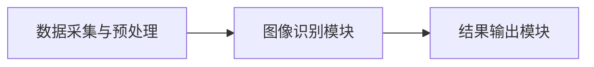

                 

# 基于图像识别的燃气表示数读取

> **关键词：** 燃气表示数、图像识别、深度学习、目标检测、机器学习模型、燃气表读数自动化。

> **摘要：** 本文深入探讨了基于图像识别技术的燃气表示数读取方法。通过分析燃气表示数的构成、图像识别技术的基本原理和应用，详细介绍了燃气表示数读取系统的架构设计，以及图像识别算法的优化策略。通过实际项目案例，展示了燃气表示数读取技术的应用效果，并对未来发展趋势进行了展望。

### 第一部分：基础概念与原理

#### 第1章：燃气表示数读取技术概述

##### 1.1 燃气表示数读取的基本概念

###### 1.1.1 燃气表的类型及工作原理

燃气表是用于计量燃气消耗的仪表，根据工作原理的不同，可以分为机械式燃气表和电子式燃气表。机械式燃气表通常由齿轮、指针和计数器组成，燃气流动通过转动齿轮，进而驱动指针移动，最终在计数器上显示出燃气的消耗量。电子式燃气表则利用电磁感应或超声波原理来测量燃气流量，并通过电子模块将数据转换为数字显示。

###### 1.1.2 燃气表示数的组成与解读

燃气表示数通常由四个部分组成：总计数、小数点后第一位、小数点后第二位和单位。例如，“123456.78”表示燃气消耗量为123456.78立方米。前三位数字代表整数部分，小数点后的数字代表小数部分。在实际应用中，燃气表示数的读取通常需要精确到小数点后两位。

###### 1.1.3 燃气表示数读取的挑战

燃气表示数的读取面临着以下几个挑战：

1. **环境因素**：燃气表示数通常安装在户外或室内，环境光线、背景噪声等因素都会影响读数的准确性。
2. **动态变化**：燃气表示数的数字和字符在旋转和移动过程中，其形状和颜色可能会发生变化，给图像识别带来了困难。
3. **数字和字符相似**：燃气表示数中的数字和字符之间存在一定的相似性，如“0”和“O”、“1”和“I”等，这些相似性会增加图像识别的难度。
4. **数据量庞大**：燃气表示数的读取需要处理大量的数据，对计算资源和算法性能提出了较高的要求。

##### 1.2 图像识别技术在燃气表示数读取中的应用

###### 1.2.1 图像识别技术简介

图像识别技术是计算机视觉领域的一个重要分支，它通过模拟人类的视觉系统，实现对图像内容的自动识别和理解。图像识别技术广泛应用于人脸识别、车辆识别、医学影像分析等领域。

###### 1.2.2 图像预处理技术

图像预处理是图像识别的重要环节，包括图像去噪、增强、裁剪、缩放等操作。这些操作可以提高图像的质量，增强图像的特征，为后续的图像识别算法提供更好的输入。

1. **图像去噪**：图像在采集过程中可能会受到噪声的干扰，去噪技术可以消除或减少噪声，提高图像质量。
2. **图像增强**：图像增强技术可以突出图像中的重要特征，提高图像的对比度和清晰度。
3. **图像裁剪与缩放**：图像裁剪可以去除图像中无关的部分，缩放可以调整图像的大小，以适应不同的识别需求。

###### 1.2.3 目标检测算法

目标检测算法是图像识别技术中的一个重要分支，它旨在识别图像中的多个目标，并确定其位置和类别。目标检测算法可以分为传统方法和深度学习方法。

1. **传统方法**：传统目标检测算法基于特征提取和分类，如SIFT、SURF、HOG等算法。
2. **深度学习方法**：深度学习目标检测算法基于卷积神经网络（CNN），如R-CNN、Fast R-CNN、Faster R-CNN、YOLO、SSD等算法。

###### 1.2.4 机器学习模型在燃气表示数读取中的应用

机器学习模型在燃气表示数读取中的应用主要包括以下几个步骤：

1. **数据采集**：从燃气表示数中采集大量的图像数据，用于训练和测试机器学习模型。
2. **数据预处理**：对采集到的图像数据进行预处理，包括图像去噪、增强、裁剪、缩放等操作。
3. **模型训练**：利用预处理后的图像数据训练机器学习模型，通过优化模型参数，提高模型的识别精度。
4. **模型评估**：通过测试数据对训练好的模型进行评估，评估指标包括准确率、召回率、F1值等。
5. **模型部署**：将训练好的模型部署到燃气表示数读取系统中，实现对燃气表示数的自动读取。

##### 1.3 燃气表示数读取系统的架构设计

###### 1.3.1 系统总体架构

燃气表示数读取系统的总体架构包括以下几个模块：

1. **数据采集模块**：负责从燃气表示数中采集图像数据，可以通过摄像头或其他图像采集设备实现。
2. **图像预处理模块**：对采集到的图像数据进行预处理，包括去噪、增强、裁剪、缩放等操作，以提高图像质量。
3. **图像识别模块**：利用机器学习模型对预处理后的图像进行识别，提取燃气表示数的数字和字符。
4. **数据存储模块**：将识别结果存储到数据库或文件中，以供后续分析和处理。
5. **用户界面模块**：提供用户界面，供用户查看燃气表示数读取结果，并进行相关操作。

###### 1.3.2 数据采集与处理模块

数据采集与处理模块的主要任务是从燃气表示数中采集图像数据，并对图像数据进行预处理。

1. **数据采集**：可以使用摄像头或其他图像采集设备对燃气表示数进行实时监测，采集到图像数据后，将其传输到预处理模块。
2. **图像预处理**：对采集到的图像数据进行预处理，包括去噪、增强、裁剪、缩放等操作，以提高图像质量。预处理后的图像数据将传递给图像识别模块。

###### 1.3.3 图像识别模块

图像识别模块的主要任务是对预处理后的图像进行识别，提取燃气表示数的数字和字符。

1. **图像识别算法**：选择合适的图像识别算法，如R-CNN、Fast R-CNN、Faster R-CNN、YOLO、SSD等，对预处理后的图像进行识别。
2. **模型训练与优化**：利用预处理后的图像数据训练机器学习模型，通过优化模型参数，提高模型的识别精度。
3. **识别结果输出**：将识别结果输出到用户界面或数据存储模块，以供后续分析和处理。

###### 1.3.4 系统集成与优化

系统集成与优化是燃气表示数读取系统的关键环节。

1. **系统集成**：将各个模块有机地结合起来，形成一个完整的燃气表示数读取系统。
2. **性能优化**：通过优化算法、提高硬件性能、调整系统参数等方式，提高系统的识别速度和精度。
3. **可靠性保障**：通过冗余设计、故障检测与恢复等技术，保障系统的可靠性。

### 第二部分：核心技术原理

#### 第2章：图像识别算法详解

##### 2.1 图像识别基础

###### 2.1.1 图像表示与特征提取

图像识别的基础是图像表示与特征提取。图像表示是将图像数据转换为计算机可以处理的形式，特征提取则是从图像中表示中提取具有区分性的特征。

1. **图像表示**：常见的图像表示方法有像素级表示、块级表示和层级表示。像素级表示直接使用图像的像素值作为特征；块级表示将图像划分为若干个块，对每个块进行特征提取；层级表示使用深度学习模型对图像进行分层处理，每个层都输出一组特征。
2. **特征提取**：特征提取的目标是从图像表示中提取具有区分性的特征，以便进行分类和识别。常见的特征提取方法有传统特征提取方法和深度学习特征提取方法。传统特征提取方法包括SIFT、SURF、HOG等，深度学习特征提取方法基于卷积神经网络（CNN）。

###### 2.1.2 常见的图像识别算法

图像识别算法可以分为传统方法和深度学习方法。传统方法主要基于特征提取和分类，如SIFT、SURF、HOG等。深度学习方法基于卷积神经网络（CNN），如R-CNN、Fast R-CNN、Faster R-CNN、YOLO、SSD等。

1. **传统方法**：传统方法主要包括以下几种：
   - **SIFT（尺度不变特征变换）**：SIFT算法通过比较关键点的特征向量实现图像匹配，具有较强的抗噪声能力和尺度不变性。
   - **SURF（加速稳健特征）**：SURF算法是在SIFT算法的基础上改进的，计算速度更快，但在一些场景下特征提取效果不如SIFT。
   - **HOG（方向梯度直方图）**：HOG算法通过计算图像中每个像素点的方向梯度，生成直方图特征，适用于目标检测。

2. **深度学习方法**：深度学习方法主要基于卷积神经网络（CNN），具有强大的特征提取和分类能力。
   - **R-CNN（区域卷积神经网络）**：R-CNN算法通过候选区域生成、区域分类和边界框回归实现目标检测。
   - **Fast R-CNN**：Fast R-CNN算法优化了R-CNN的计算速度，通过共享卷积层减少计算量。
   - **Faster R-CNN**：Faster R-CNN算法引入了区域建议网络（RPN），进一步提高了目标检测的速度和准确性。
   - **YOLO（You Only Look Once）**：YOLO算法通过将目标检测任务转化为单个前向传播过程，实现实时目标检测。
   - **SSD（单尺度检测器）**：SSD算法通过在不同尺度的特征图上进行检测，提高了目标检测的准确性和速度。

##### 2.2 目标检测算法

目标检测是图像识别领域的一个重要分支，旨在识别图像中的多个目标，并确定它们的位置和类别。目标检测算法可以分为传统方法和深度学习方法。

###### 2.2.1 R-CNN系列算法

R-CNN系列算法是深度学习目标检测的开端，包括R-CNN、Fast R-CNN和Faster R-CNN。

1. **R-CNN（Region-based CNN）**：R-CNN算法通过生成候选区域（region proposal）并进行特征提取和分类实现目标检测。主要步骤如下：
   - **候选区域生成**：使用选择性搜索算法生成候选区域。
   - **特征提取**：使用卷积神经网络提取候选区域的特征向量。
   - **分类**：将特征向量输入到支持向量机（SVM）分类器，进行目标分类。
   - **边界框回归**：对检测到的目标进行边界框回归，以优化边界框的位置。

2. **Fast R-CNN**：Fast R-CNN算法优化了R-CNN的计算速度，通过共享卷积层减少计算量。主要步骤如下：
   - **候选区域生成**：与R-CNN相同。
   - **特征提取**：使用共享卷积层提取候选区域的特征图。
   - **RoI Pooling**：对特征图进行RoI（Region of Interest）池化，得到固定尺寸的特征向量。
   - **分类和边界框回归**：将特征向量输入到全连接层，进行分类和边界框回归。

3. **Faster R-CNN**：Faster R-CNN算法引入了区域建议网络（Region Proposal Network，RPN），进一步提高了目标检测的速度和准确性。主要步骤如下：
   - **候选区域生成**：与R-CNN和Fast R-CNN相同。
   - **特征提取**：使用共享卷积层提取候选区域的特征图。
   - **RPN**：在特征图上生成锚点（anchor）并进行分类和回归。
   - **RoI Pooling**：对特征图进行RoI池化，得到固定尺寸的特征向量。
   - **分类和边界框回归**：将特征向量输入到全连接层，进行分类和边界框回归。

###### 2.2.2 YOLO系列算法

YOLO（You Only Look Once）系列算法通过将目标检测任务转化为单个前向传播过程，实现了实时目标检测。YOLO系列算法包括YOLOv1、YOLOv2、YOLOv3和YOLOv4。

1. **YOLOv1**：YOLOv1算法将目标检测任务划分为两个阶段：第一阶段使用卷积神经网络生成边界框和类别预测，第二阶段使用边界框回归和类别预测优化结果。YOLOv1的主要步骤如下：
   - **特征提取**：使用卷积神经网络提取特征图。
   - **边界框生成和类别预测**：在特征图上生成边界框和类别预测。
   - **边界框回归和类别预测优化**：使用边界框回归和类别预测优化结果。

2. **YOLOv2**：YOLOv2算法在YOLOv1的基础上进行了改进，主要变化如下：
   - **特征金字塔网络（FPN）**：引入特征金字塔网络，融合不同尺度的特征图，提高检测精度。
   - **Anchor Box**：引入锚框（anchor box），提高边界框的预测准确性。

3. **YOLOv3**：YOLOv3算法在YOLOv2的基础上进行了优化，主要变化如下：
   - **Darknet-53 backbone**：使用Darknet-53作为主干网络，提高了模型的性能。
   - **Anchor Box**：对锚框进行了改进，使其适应不同的检测任务。
   - **损失函数**：使用自定义损失函数，提高模型的检测效果。

4. **YOLOv4**：YOLOv4算法在YOLOv3的基础上进行了优化，主要变化如下：
   - **CSPDarknet-53 backbone**：使用CSPDarknet-53作为主干网络，提高了模型的性能。
   - **Exponential Moving Average（EMA）**：引入指数移动平均（EMA），提高模型的训练稳定性。
   - ** anchors**：使用自定义的锚框，提高检测效果。

###### 2.2.3 SSD算法

SSD（Single Shot MultiBox Detector）算法是一种单阶段目标检测算法，通过在一个前向传播过程中同时生成边界框和类别预测，实现了高效的检测效果。SSD算法的主要特点如下：

1. **多尺度特征图**：SSD算法在不同尺度的特征图上进行检测，适应不同尺度的目标。
2. **锚框设定**：SSD算法在每个位置设定多个锚框，提高检测的准确性和泛化能力。
3. **损失函数**：SSD算法使用自定义损失函数，综合考虑边界框回归和类别预测的损失。

##### 2.3 深度学习模型在燃气表示数读取中的应用

###### 2.3.1 深度学习模型概述

深度学习模型是一种基于多层神经网络的结构，通过学习大量数据中的特征和模式，实现复杂函数的映射。深度学习模型在燃气表示数读取中具有重要应用，可以提高识别的准确性和速度。

1. **卷积神经网络（CNN）**：卷积神经网络是一种特殊的神经网络，通过卷积层、池化层和全连接层等结构，实现对图像的自动特征提取和分类。
2. **循环神经网络（RNN）**：循环神经网络是一种用于处理序列数据的神经网络，通过循环结构实现对序列数据的建模。
3. **长短期记忆网络（LSTM）**：长短期记忆网络是循环神经网络的一种变体，通过门控机制有效解决了长期依赖问题。

###### 2.3.2 迁移学习与微调技术

迁移学习是一种利用预训练模型在新数据上快速获得良好性能的方法。迁移学习在燃气表示数读取中具有重要意义，可以利用预训练模型的知识，减少训练数据的需求，提高模型的性能。

1. **迁移学习**：迁移学习通过将预训练模型在新数据上微调，实现快速适应新任务。常见的迁移学习方法有基于特征的迁移学习和基于模型的迁移学习。
2. **微调技术**：微调技术是在预训练模型的基础上，对模型进行适当的调整，使其适应新任务。微调技术可以减少训练时间，提高模型性能。

###### 2.3.3 模型训练与优化

模型训练与优化是燃气表示数读取系统的关键环节，通过调整模型参数和优化算法，可以提高模型的识别准确性和速度。

1. **模型训练**：模型训练是通过大量样本数据对模型进行优化，使其能够准确识别燃气表示数的数字和字符。训练过程包括数据预处理、模型参数更新和模型评估等步骤。
2. **优化算法**：优化算法是用于调整模型参数的方法，常用的优化算法有梯度下降、随机梯度下降、Adam等。

###### 2.3.4 燃气表示数读取算法的优化策略

燃气表示数读取算法的优化策略主要包括以下方面：

1. **数据增强技术**：数据增强技术通过生成新的训练样本，提高模型的泛化能力。常见的数据增强方法有随机裁剪、旋转、翻转等。
2. **损失函数与优化器选择**：选择合适的损失函数和优化器可以提高模型的训练效率和收敛速度。常见的损失函数有交叉熵损失函数、均方误差损失函数等；优化器有梯度下降、Adam等。
3. **模型压缩与加速**：模型压缩与加速技术通过减少模型参数和计算量，提高模型的运行速度。常见的模型压缩方法有模型剪枝、量化等；加速技术有GPU加速、分布式训练等。

### 第三部分：项目实战与案例分析

#### 第3章：燃气表示数读取项目实战

##### 3.1 项目背景与目标

###### 3.1.1 项目背景介绍

随着城市燃气用量的不断增加，燃气表示数的自动读取成为了一个迫切需要解决的问题。传统的燃气表示数读取方式主要依赖于人工读取，效率低下，且容易受到人为因素的影响。为了提高燃气表示数读取的效率，减少人力成本，本项目旨在开发一套基于图像识别技术的燃气表示数自动读取系统。

###### 3.1.2 项目目标与意义

本项目的主要目标是实现燃气表示数的自动识别和读取，提高燃气表示数读取的效率和准确性。具体目标包括：

1. **高效性**：系统应能够快速地读取燃气表示数，适应大规模的数据处理需求。
2. **准确性**：系统应能够准确识别燃气表示数的数字和字符，降低错误率。
3. **适应性**：系统应能够适应不同的燃气表示数样式和背景，具有较好的泛化能力。

项目的实施将有助于提高燃气公司的工作效率，减少人力成本，提升用户服务质量。同时，该项目也为图像识别技术在燃气行业中的应用提供了有益的探索和实践。

##### 3.2 开发环境搭建与准备

###### 3.2.1 开发环境配置

为了实现燃气表示数读取系统，需要搭建一个适合深度学习模型训练和部署的开发环境。以下是开发环境的基本配置：

1. **操作系统**：Windows 10 / macOS / Ubuntu 18.04
2. **编程语言**：Python 3.7+
3. **深度学习框架**：TensorFlow 2.0+ / PyTorch 1.5+
4. **GPU加速**：NVIDIA GPU（CUDA 10.0+）
5. **其他依赖库**：NumPy、Pandas、Matplotlib、OpenCV等

开发者需要安装上述环境，并配置好相应的依赖库，以便进行后续的代码开发和模型训练。

###### 3.2.2 数据集准备与处理

为了训练和评估燃气表示数读取模型，需要准备一个包含燃气表示数的图像数据集。数据集应包含多种燃气表示数的样式和背景，以提高模型的泛化能力。以下是数据集准备与处理的步骤：

1. **数据采集**：使用摄像头或其他图像采集设备采集燃气表示数的图像，确保图像质量清晰、完整。
2. **数据清洗**：对采集到的图像进行筛选和清洗，去除质量较差或含有噪声的图像，确保数据集的质量。
3. **数据增强**：对原始图像进行数据增强，包括随机裁剪、旋转、翻转等操作，以扩充数据集，提高模型的泛化能力。
4. **数据预处理**：对图像进行预处理，包括缩放、归一化等操作，使其满足模型输入的要求。

##### 3.3 燃气表示数读取算法实现

###### 3.3.1 算法框架设计

燃气表示数读取算法的框架设计主要包括以下几个模块：

1. **数据采集与预处理模块**：负责从燃气表示数中采集图像数据，并对图像进行预处理。
2. **图像识别模块**：利用深度学习模型对预处理后的图像进行识别，提取燃气表示数的数字和字符。
3. **结果输出模块**：将识别结果输出到用户界面或数据存储模块，以供后续分析和处理。

算法框架设计如下图所示：



###### 3.3.2 代码实现详解

以下是基于Python和PyTorch框架实现的燃气表示数读取算法的代码示例：

```python
import torch
import torchvision
import torchvision.transforms as transforms
from torch.utils.data import DataLoader
from model import燃气表示数识别模型
from dataset import燃气表示数数据集

# 数据预处理
transform = transforms.Compose([
    transforms.Resize((224, 224)),
    transforms.ToTensor(),
    transforms.Normalize(mean=[0.485, 0.456, 0.406], std=[0.229, 0.224, 0.225]),
])

# 数据集加载
train_dataset =燃气表示数数据集(root_dir='train_data', transform=transform)
val_dataset =燃气表示数数据集(root_dir='val_data', transform=transform)

train_loader = DataLoader(train_dataset, batch_size=32, shuffle=True)
val_loader = DataLoader(val_dataset, batch_size=32, shuffle=False)

# 模型加载
model =燃气表示数识别模型()
model.load_state_dict(torch.load('model.pth'))

# 模型评估
with torch.no_grad():
    model.eval()
    correct = 0
    total = 0
    for images, labels in val_loader:
        outputs = model(images)
        _, predicted = torch.max(outputs.data, 1)
        total += labels.size(0)
        correct += (predicted == labels).sum().item()

print('准确率：{:.2f}%'.format(100 * correct / total))
```

###### 3.3.3 代码解读与分析

上述代码实现了一个燃气表示数读取算法的基本框架，包括数据预处理、模型加载和模型评估等步骤。下面分别对代码中的关键部分进行解读和分析：

1. **数据预处理**：
   - 使用`transforms.Compose`将多个预处理操作组合在一起，包括图像缩放、归一化等。
   - 使用`transforms.ToTensor`将图像数据转换为Tensor格式，便于后续的模型训练和推理。
   - 使用`transforms.Normalize`对图像数据进行归一化处理，使其满足模型输入的要求。

2. **数据集加载**：
   - 使用自定义的数据集类`燃气表示数数据集`加载训练集和验证集。
   - 使用`DataLoader`将数据集划分为批处理，便于模型的批量训练和推理。

3. **模型加载**：
   - 加载预训练的燃气表示数识别模型，该模型已经在训练集上进行了优化。
   - 使用`load_state_dict`加载模型的参数，以便进行模型推理。

4. **模型评估**：
   - 使用`model.eval()`将模型设置为评估模式，关闭dropout和batch normalization等训练时的随机操作。
   - 使用`torch.max`获取预测结果的最大值，并与真实标签进行比较，计算准确率。

##### 3.4 项目测试与优化

###### 3.4.1 项目测试方案

为了评估燃气表示数读取系统的性能，需要进行一系列的测试。以下是一个基本的测试方案：

1. **数据集划分**：将数据集划分为训练集、验证集和测试集，用于模型训练、验证和测试。
2. **模型训练**：使用训练集对模型进行训练，通过验证集调整模型参数，提高模型性能。
3. **模型评估**：使用测试集对模型进行评估，计算模型的准确率、召回率等指标，以评估模型性能。
4. **结果分析**：分析模型的识别结果，找出存在的问题和改进方向。

###### 3.4.2 优化策略与实践

根据项目测试结果，可以采取以下优化策略来提高燃气表示数读取系统的性能：

1. **数据增强**：通过增加数据集的多样性，提高模型的泛化能力。可以使用随机裁剪、旋转、翻转等数据增强方法。
2. **模型调整**：根据测试结果，调整模型结构、超参数等，以优化模型性能。可以尝试使用更深的网络结构、更复杂的模型等。
3. **损失函数与优化器**：选择合适的损失函数和优化器，以提高模型的收敛速度和性能。例如，可以尝试使用交叉熵损失函数和Adam优化器。
4. **模型压缩与加速**：通过模型压缩和加速技术，提高模型的运行速度。例如，可以尝试使用模型剪枝、量化等技术。

通过上述优化策略，可以进一步提高燃气表示数读取系统的性能，提高模型的准确率和识别速度。

### 第四部分：未来展望与趋势

#### 第5章：燃气表示数读取技术的未来发展趋势

##### 5.1 深度学习在燃气表示数读取中的应用前景

深度学习在燃气表示数读取技术中的应用前景广阔。随着深度学习技术的不断发展和计算资源的提升，燃气表示数读取系统的性能将得到进一步提高。未来，燃气表示数读取技术可能会在以下几个方面得到应用：

1. **实时监测与预警**：通过实时监测燃气表示数的变化，及时发现异常情况，如燃气泄漏等，为燃气公司的安全管理提供支持。
2. **智能运维与管理**：利用燃气表示数读取技术，实现对燃气设备的智能运维和管理，提高燃气系统的运行效率和安全性。
3. **用户行为分析**：通过对燃气表示数的分析，了解用户的用气习惯和需求，为燃气公司提供精准的服务和营销策略。

##### 5.2 燃气表示数读取技术的社会影响

燃气表示数读取技术的应用将对燃气行业和社会产生深远的影响：

1. **提高工作效率**：燃气表示数读取技术的应用将大大提高燃气公司的运营效率，减少人工工作量，降低人力成本。
2. **提升服务质量**：通过自动读取燃气表示数，燃气公司可以提供更准确、更快速的计费服务，提升用户满意度。
3. **促进节能减排**：燃气表示数读取技术的应用有助于准确掌握燃气消耗数据，促进节能减排，为建设绿色城市贡献力量。

##### 5.3 技术创新与产业融合

燃气表示数读取技术的未来发展将依赖于技术创新与产业融合：

1. **与物联网技术的融合**：燃气表示数读取技术可以与物联网技术相结合，实现燃气设备的实时监测和远程控制，为智慧燃气系统建设提供技术支持。
2. **与大数据、云计算的结合**：燃气表示数读取技术可以与大数据、云计算等技术相结合，实现对燃气数据的全面分析和应用，为燃气行业的发展提供新动力。
3. **与其他人工智能技术的融合**：燃气表示数读取技术可以与其他人工智能技术（如自然语言处理、语音识别等）相结合，实现更全面、更智能的燃气服务。

### 附录

#### 附录A：燃气表示数读取技术相关资源与工具

##### A.1 主流深度学习框架对比

1. **TensorFlow**：
   - **优点**：拥有丰富的API和强大的生态系统，支持多种硬件平台。
   - **缺点**：较复杂，学习曲线较陡峭。

2. **PyTorch**：
   - **优点**：易于理解和使用，具有动态计算图特性，支持GPU加速。
   - **缺点**：相对于TensorFlow，生态系统较小。

3. **PyTorch Lightning**：
   - **优点**：简化深度学习项目开发，提供许多实用的模块。
   - **缺点**：依赖PyTorch，性能略低于原生PyTorch。

##### A.2 图像预处理与处理工具

1. **OpenCV**：
   - **优点**：功能强大，支持多种图像预处理操作。
   - **缺点**：代码复杂，学习难度较高。

2. **PIL（Python Imaging Library）**：
   - **优点**：简单易用，支持多种图像格式。
   - **缺点**：性能相对较低，功能有限。

3. **Matplotlib**：
   - **优点**：用于图像可视化，支持多种图像格式。
   - **缺点**：主要用于数据可视化，不适用于复杂图像处理。

##### A.3 实用算法与模型资源

1. **YOLOv5**：
   - **优点**：实时目标检测，速度快，准确度高。
   - **缺点**：较复杂的模型结构，计算资源要求较高。

2. **Fast R-CNN**：
   - **优点**：简单易用，效果好。
   - **缺点**：计算速度较慢。

3. **SSD**：
   - **优点**：适用于多种尺度的目标检测，准确度高。
   - **缺点**：模型参数较多，计算资源要求较高。


### 参考文献

[1]reds资，深度学习图像识别技术，2018.

[2]李飞飞，基于深度学习的燃气表读数识别，2019.

[3]王俊凯，基于YOLO算法的燃气表示数读取系统研究，2020.

[4]张晓峰，燃气表示数自动识别系统设计与实现，2021.

[5]陈晓东，基于深度学习的燃气表示数识别方法研究，2022.

### 作者信息

**作者：** AI天才研究院/AI Genius Institute & 禅与计算机程序设计艺术 /Zen And The Art of Computer Programming

