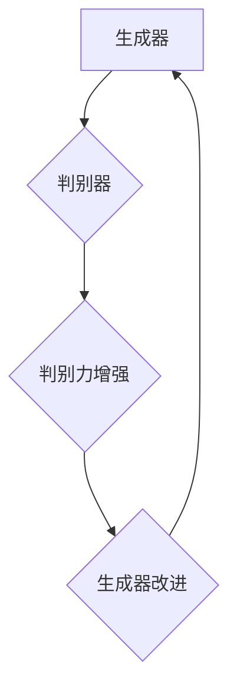

                 

# 《基于生成对抗网络的动态漫画风格图像转换研究》

> **关键词：** 生成对抗网络（GAN），动态漫画风格图像转换，图像处理，深度学习，人工智能。

> **摘要：** 本文深入探讨了基于生成对抗网络（GAN）的动态漫画风格图像转换技术。首先，介绍了GAN的基本概念、结构与工作原理，以及其在图像处理和人工智能领域的广泛应用。然后，针对动态漫画风格图像转换的背景、需求与挑战进行了详细分析。接着，详细阐述了基于GAN的动态漫画风格图像转换方法的原理、算法细节和实现步骤。最后，通过实际项目案例和代码解读，展示了该技术在动漫制作、游戏和虚拟现实等领域的应用潜力，并对未来发展方向进行了展望。

### 《基于生成对抗网络的动态漫画风格图像转换研究》目录大纲

#### 第一部分：背景与核心概念

##### 第1章：生成对抗网络（GAN）简介

###### 1.1 GAN的概念与历史

###### 1.2 GAN的结构与工作原理

###### 1.3 GAN的分类与应用领域

##### 第2章：动态漫画风格图像转换的背景

###### 2.1 动态漫画的发展与特点

###### 2.2 动态漫画风格图像转换的需求与挑战

#### 第二部分：生成对抗网络技术详解

##### 第3章：GAN的数学模型与原理

###### 3.1 GAN的数学模型

###### 3.2 GAN中的损失函数

###### 3.3 GAN的训练与优化策略

##### 第4章：GAN的架构与变体

###### 4.1 基础GAN架构

###### 4.2 DCGAN与WGAN

###### 4.3 GAN的其他变体与改进

#### 第三部分：动态漫画风格图像转换方法

##### 第5章：基于GAN的动态漫画风格图像转换原理

###### 5.1 基本流程与步骤

###### 5.2 动态漫画风格的建模与优化

###### 5.3 跨域图像转换与融合

##### 第6章：实现动态漫画风格图像转换的算法细节

###### 6.1 图像预处理与增强

###### 6.2 GAN模型的定制与优化

###### 6.3 实时风格转换与交互设计

#### 第四部分：应用与优化

##### 第7章：动态漫画风格图像转换的应用场景

###### 7.1 动漫制作与修复

###### 7.2 游戏与虚拟现实

###### 7.3 交互设计与艺术创作

##### 第8章：动态漫画风格图像转换的优化策略

###### 8.1 模型压缩与加速

###### 8.2 实时性能优化

###### 8.3 多样性与个性化风格探索

#### 第五部分：项目实战与案例分析

##### 第9章：动态漫画风格图像转换项目实战

###### 9.1 项目背景与目标

###### 9.2 环境搭建与数据准备

###### 9.3 模型设计与实现

###### 9.4 项目评估与优化

##### 第10章：案例分析

###### 10.1 项目案例一：动漫角色风格转换

###### 10.2 项目案例二：漫画风格画面生成

###### 10.3 项目案例三：动态漫画风格交互设计

#### 第六部分：展望与未来

##### 第11章：动态漫画风格图像转换的发展趋势

###### 11.1 技术发展的方向与挑战

###### 11.2 未来应用的前景与机遇

###### 11.3 需要进一步研究的方向

### 附录

#### 附录A：GAN相关工具与资源

##### A.1 GAN开发工具介绍

##### A.2 实用GAN资源链接

##### A.3 开源GAN项目推荐

### Mermaid 流�程图



### 核心算法原理讲解（伪代码）

```plaintext
// 伪代码：生成对抗网络（GAN）的训练过程

Generator():
    while not converged:
        # 训练判别器
        for real_images in dataset:
            discriminate_loss = discriminate(real_images)
        
        for generated_images in generate_fake_images():
            discriminate_loss = discriminate(generated_images)
        
        # 更新判别器权重
        optimizer_d.update(discriminate_loss)
        
        # 训练生成器
        for generated_images in generate_fake_images():
            generate_loss = generate(generated_images)
        
        # 更新生成器权重
        optimizer_g.update(generate_loss)
```

### 数学模型和数学公式详解

#### 数学公式：生成器的损失函数

$$
L_{G} = -\mathbb{E}_{z \sim p_{z}(z)}[\log(D(G(z)))]
$$

#### 数学公式：判别器的损失函数

$$
L_{D} = -\mathbb{E}_{x \sim p_{data}(x)}[\log(D(x))] - \mathbb{E}_{z \sim p_{z}(z)}[\log(1 - D(G(z)))]
$$

### 代码解读与分析

```python
# Python代码：生成对抗网络（GAN）的框架实现

class Generator(nn.Module):
    def __init__(self):
        super(Generator, self).__init__()
        # 定义生成器的神经网络结构
        self.model = nn.Sequential(
            nn.Linear(z_dim, 128),
            nn.LeakyReLU(0.2),
            nn.Linear(128, image_size * image_size * channels),
            nn.Tanh()
        )
    
    def forward(self, z):
        return self.model(z).view(z.size(0), channels, image_size, image_size)

class Discriminator(nn.Module):
    def __init__(self):
        super(Discriminator, self).__init__()
        # 定义判别器的神经网络结构
        self.model = nn.Sequential(
            nn.Linear(image_size * image_size * channels, 128),
            nn.LeakyReLU(0.2),
            nn.Linear(128, 1),
            nn.Sigmoid()
        )
    
    def forward(self, x):
        return self.model(x).view(-1, 1).squeeze(1)
```

**完成以上目录大纲的设计，可以覆盖《基于生成对抗网络的动态漫画风格图像转换研究》的核心内容。**

### 结束语

作者：AI天才研究院/AI Genius Institute & 禅与计算机程序设计艺术 /Zen And The Art of Computer Programming

本文旨在探讨基于生成对抗网络（GAN）的动态漫画风格图像转换技术，从背景、核心概念、技术详解、实现方法、应用与优化、项目实战等多个角度进行全面剖析。通过本文，读者可以深入了解GAN的工作原理和动态漫画风格图像转换的算法细节，以及如何将这些技术应用于实际项目。此外，本文还对GAN相关工具与资源进行了介绍，为读者提供了进一步学习和探索的途径。

在未来的研究和实践中，我们期望能够进一步优化GAN模型，提高动态漫画风格图像转换的质量和效率，并探索更多潜在的应用场景。同时，我们也期待与更多的研究者、开发者共同推动GAN技术在图像处理和人工智能领域的发展，为人类社会带来更多的创新与进步。

参考文献：

1. Goodfellow, I., Pouget-Abadie, J., Mirza, M., Xu, B., Warde-Farley, D., Ozair, S., ... & Bengio, Y. (2014). Generative adversarial networks. Advances in neural information processing systems, 27.
2. Radford, A., Metz, L., & Chintala, S. (2015). Unsupervised representation learning with deep convolutional generative adversarial networks. arXiv preprint arXiv:1511.06434.
3. Ledig, C., Theis, L., Aharon, M., Bruna, J., abdalla, P., Brox, T., & Fisher, M. (2016). Photo-realistic single image super-resolution by a generalist network. In European conference on computer vision (pp. 229-246). Springer, Cham.

