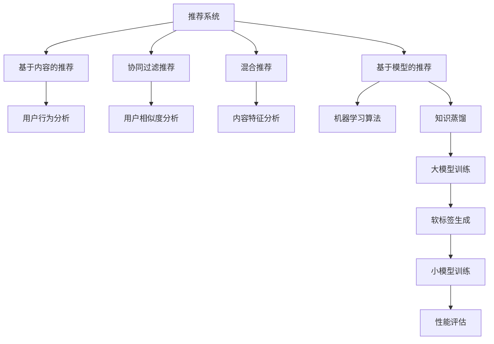
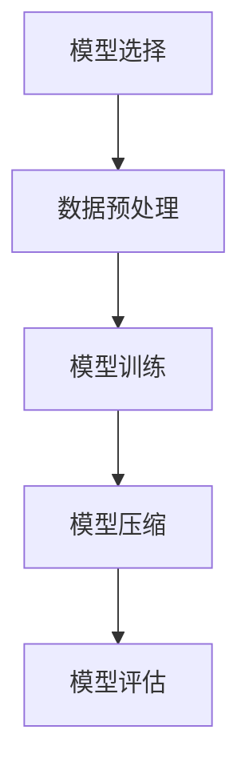
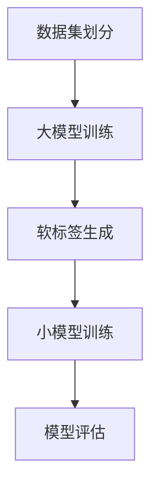
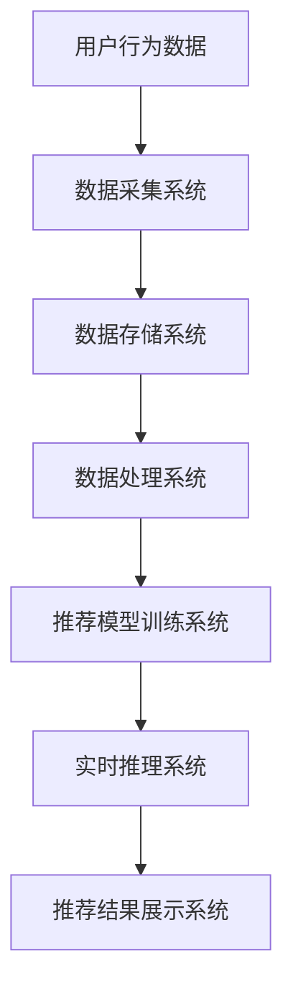

                 

### 文章标题

> **基于知识蒸馏的轻量级实时推荐模型**

关键词：知识蒸馏、轻量级模型、实时推荐系统、模型压缩、性能优化

摘要：本文详细探讨了基于知识蒸馏技术的轻量级实时推荐模型，从背景知识、算法原理、构建方法、实践应用以及未来展望等多个角度，系统性地介绍了知识蒸馏在轻量级实时推荐模型中的应用。文章旨在为从事推荐系统研究和应用的开发者提供理论指导和实践参考。

---

### 推荐系统基础

#### 1.1 推荐系统概述

推荐系统是一种信息过滤技术，旨在根据用户的历史行为、兴趣和偏好，为用户提供个性化的信息推荐。推荐系统广泛应用于电子商务、社交媒体、在线视频和音乐平台等场景，其主要目标是提高用户体验、增加用户黏性和提升业务转化率。

推荐系统按照工作机制可分为以下几类：

1. **基于内容的推荐**：根据用户过去对内容的评价和偏好，找出相似的内容推荐给用户。
2. **协同过滤推荐**：通过分析用户之间的相似度，找出其他用户喜欢的项目推荐给目标用户。
3. **混合推荐**：结合基于内容和协同过滤的推荐方法，以提供更准确的推荐结果。
4. **基于模型的推荐**：使用机器学习算法，通过分析用户历史行为和内容特征，预测用户对某一项目的兴趣。

#### 1.2 推荐系统的挑战

尽管推荐系统在许多应用场景中取得了显著的成效，但其实现过程中仍然面临诸多挑战：

1. **数据质量与隐私保护**：推荐系统依赖用户行为数据和偏好数据，如何确保数据质量且保护用户隐私是关键问题。
2. **规模性与实时性**：随着用户数量的增加和推荐项目的增多，如何实现高效且实时的推荐是一个重要的技术挑战。
3. **可解释性与用户满意度**：推荐结果需要具备可解释性，同时要满足用户对个性化推荐的期望。

#### 1.3 知识蒸馏简介

知识蒸馏（Knowledge Distillation）是一种将知识从一个大模型传递到一个更小模型的训练方法，目的是在不损失太多性能的情况下，使小模型能够执行与大模型相似的预测任务。知识蒸馏的核心思想是通过“软标签”来指导小模型的学习，这些软标签由大模型的输出概率分布生成。

知识蒸馏的基本流程如下：

1. **训练大模型**：首先，使用大规模的数据集训练一个大模型。
2. **生成软标签**：在大模型训练完成后，对其输入数据进行预测，得到输出概率分布（软标签）。
3. **训练小模型**：使用软标签作为额外的监督信号，同时结合原始输入和输出标签来训练小模型。
4. **评估小模型**：在小模型训练完成后，评估其性能，通常使用准确度、召回率等指标。

知识蒸馏的优势在于能够显著提升小模型的性能，同时降低模型的参数数量和计算复杂度，使其在资源受限的环境下仍然能够保持较高的推荐质量。

### 核心概念与联系

下面是推荐系统与知识蒸馏技术之间的Mermaid流程图：



#### 第2章：轻量级模型的背景知识

##### 2.1 轻量级模型的定义与优势

轻量级模型（Lightweight Model）是指参数数量较少、计算复杂度较低、占用内存较小，但仍然能够保持较高准确度的模型。轻量级模型主要应用于资源受限的环境，如移动设备、嵌入式系统和云端服务的边缘节点。

轻量级模型的优势主要体现在以下几个方面：

1. **计算效率**：轻量级模型由于参数数量较少，因此计算速度更快，能够满足实时计算的需求。
2. **存储空间**：轻量级模型占用的存储空间较小，有利于部署在资源有限的设备上。
3. **能量消耗**：轻量级模型的能量消耗较低，适用于电池供电的设备。
4. **泛化能力**：尽管参数数量较少，但轻量级模型仍能保持较高的准确度和泛化能力。

##### 2.2 轻量级模型的主要类型

轻量级模型可以分为以下几类：

1. **神经网络压缩技术**：通过减少模型参数数量、降低模型复杂度来实现轻量化。常见的方法包括剪枝（Pruning）、量化（Quantization）、低秩分解（Low-rank Factorization）等。
2. **神经架构搜索（NAS）**：通过自动化搜索模型结构来找到最优的轻量级模型。NAS技术可以显著减少模型参数数量，同时保持较高的性能。
3. **神经网络剪枝技术**：在模型训练过程中，通过剪枝冗余的神经元或连接来减少模型参数数量，从而实现轻量化。

##### 2.3 轻量级模型的构建方法

构建轻量级模型的方法可以分为以下几步：

1. **模型选择**：根据应用场景和资源限制，选择合适的轻量级模型架构。
2. **数据预处理**：对训练数据进行预处理，包括归一化、去噪、数据增强等，以提高模型性能。
3. **模型训练**：使用轻量级模型架构训练模型，可以选择迁移学习等方法来提高训练效率。
4. **模型压缩**：在模型训练完成后，对模型进行压缩，减少模型参数数量，从而实现轻量化。
5. **模型评估**：评估轻量级模型的性能，包括准确度、速度、内存占用等指标。

### 核心概念与联系

下面是轻量级模型构建的Mermaid流程图：



### 第3章：知识蒸馏基本概念

#### 3.1 知识蒸馏的定义

知识蒸馏是一种将大模型的知识传递到小模型中的技术，其主要目标是在保持较高性能的同时，减少模型的参数数量和计算复杂度。知识蒸馏的核心思想是利用大模型生成的软标签（Soft Label）来指导小模型的学习，软标签是相对于硬标签（Hard Label）而言的，它表示大模型对输入数据的预测概率分布。

知识蒸馏的过程可以分为以下几个步骤：

1. **训练大模型**：使用大规模数据集对大模型进行训练，使其达到较高的性能水平。
2. **生成软标签**：在大模型训练完成后，对其输入数据进行预测，生成对应的输出概率分布（软标签）。
3. **训练小模型**：使用软标签作为额外的监督信号，同时结合原始输入和输出标签来训练小模型。
4. **评估小模型**：在小模型训练完成后，评估其性能，通常使用准确度、召回率等指标。

#### 3.2 知识蒸馏的基本流程

知识蒸馏的基本流程如下：

1. **数据集划分**：将数据集划分为训练集和测试集，训练集用于训练大模型，测试集用于评估小模型的性能。
2. **大模型训练**：使用训练集数据训练大模型，使其达到较高的性能水平。
3. **软标签生成**：在大模型训练完成后，对其输入数据进行预测，生成对应的输出概率分布（软标签）。
4. **小模型训练**：使用训练集数据和生成的软标签，同时结合原始输入和输出标签来训练小模型。
5. **模型评估**：使用测试集数据评估小模型的性能，比较其与大模型在测试集上的性能差异。

#### 3.3 知识蒸馏的优势与局限

知识蒸馏的优势主要包括：

1. **性能提升**：小模型在训练过程中，通过学习大模型的软标签，可以显著提高模型的性能。
2. **参数减少**：由于小模型通常具有较少的参数数量，因此可以降低模型的计算复杂度和存储需求。
3. **实时性增强**：轻量级小模型可以满足实时计算的需求，适用于需要快速响应的场景。

然而，知识蒸馏也存在一些局限：

1. **依赖大模型**：知识蒸馏的效果很大程度上依赖于大模型的性能，如果大模型性能不佳，小模型也很难取得好的效果。
2. **数据依赖**：知识蒸馏的训练过程需要大量的数据，对于数据量较少的场景，知识蒸馏的效果可能不显著。
3. **模型泛化能力**：知识蒸馏训练的小模型可能在某些特定场景下表现良好，但在其他场景下可能泛化能力不足。

### 核心概念与联系

下面是知识蒸馏基本流程的Mermaid流程图：



### 第4章：知识蒸馏算法

#### 4.1 传统知识蒸馏算法

传统知识蒸馏算法主要包括以下几种：

1. **对数似然损失函数**：对数似然损失函数是最常用的知识蒸馏损失函数之一，其目的是最大化小模型对软标签的对数似然值。具体公式如下：

   $$ L = -\sum_{i=1}^{N} \sum_{j=1}^{K} y_j^{(s)} \log(p_j^{(t)}) $$

   其中，$y_j^{(s)}$ 是软标签的分布，$p_j^{(t)}$ 是小模型对输入数据的预测概率分布。

2. **SoftTarget训练方法**：SoftTarget训练方法通过将大模型的输出概率分布作为软标签，来指导小模型的学习。具体步骤如下：

   - 对每个训练样本，使用大模型生成软标签 $y^{(s)}$。
   - 将小模型的输出概率分布 $p^{(t)}$ 与软标签 $y^{(s)}$ 进行对比，计算损失函数。

3. **FitNets与NASNet**：FitNets 和 NASNet 是两种基于深度神经网络的知识蒸馏方法。FitNets 通过在小模型中引入额外的网络层，使得小模型能够学习到更多的信息。NASNet 则通过神经架构搜索（Neural Architecture Search）来找到最优的小模型结构。

   - **FitNets**：FitNets 在小模型中引入了额外的网络层，称为 FitLayer，其目的是学习到大模型的内部表示。FitLayer 的输出与软标签进行比较，计算损失函数。
   - **NASNet**：NASNet 通过神经架构搜索（Neural Architecture Search）来自动搜索最优的小模型结构。NASNet-A 和 NASNet-B 是 NASNet 的两个变体，分别用于分类和回归任务。

#### 4.2 基于注意力机制的知识蒸馏

注意力机制（Attention Mechanism）是一种能够提高模型性能的有效方法，其在知识蒸馏中的应用可以增强小模型对重要特征的捕捉能力。基于注意力机制的知识蒸馏算法主要包括以下几种：

1. **多尺度注意力**：多尺度注意力通过在特征的不同层次上引入注意力机制，使得模型能够同时关注到全局和局部特征。具体实现可以通过卷积神经网络（CNN）中的空间金字塔池化（SPP）和通道注意力模块（Convolutional Block Attention Module, CBAM）来实现。

2. **自注意力机制**：自注意力机制（Self-Attention）能够通过计算输入数据的相似性来提取关键特征，从而提高模型的性能。Transformer 等模型中的多头自注意力（Multi-Head Self-Attention）是自注意力机制的一种实现方式。

3. **交叉注意力**：交叉注意力（Cross-Attention）通过计算大模型和小模型之间的相似性，使得小模型能够从大模型中学习到更多的信息。交叉注意力机制可以应用于序列到序列（Seq2Seq）模型和图像生成模型等领域。

#### 4.3 基于对抗训练的知识蒸馏

对抗训练（Adversarial Training）是一种通过添加对抗样本来增强模型鲁棒性的方法，其在知识蒸馏中的应用可以增强小模型对对抗攻击的抵抗力。基于对抗训练的知识蒸馏算法主要包括以下几种：

1. **对抗性软标签**：对抗性软标签通过在软标签上添加对抗性噪声，使得小模型在训练过程中需要更加努力地学习到大模型的知识。具体实现可以通过在软标签上添加随机噪声或者使用对抗性生成网络（Generative Adversarial Networks, GANs）来生成对抗性软标签。

2. **对抗性训练循环**：对抗性训练循环（Adversarial Training Cycle）是一种通过迭代优化大模型和小模型的方法，使得两者相互对抗、相互促进。具体实现可以通过在每次迭代中，分别优化大模型和小模型，并更新它们的参数。

3. **对抗性蒸馏损失**：对抗性蒸馏损失（Adversarial Distillation Loss）通过在知识蒸馏过程中引入对抗性损失，使得小模型能够更好地学习到大模型的知识。对抗性蒸馏损失可以表示为：

   $$ L_{adv} = -\sum_{i=1}^{N} \sum_{j=1}^{K} y_j^{(s)} \log(p_j^{(t)}) + \lambda \cdot D(\phi_s^{(t)}, \phi_t^{(t)}) $$

   其中，$\phi_s^{(t)}$ 和 $\phi_t^{(t)}$ 分别表示大模型和小模型的输出特征，$D(\cdot, \cdot)$ 表示对抗性损失函数，$\lambda$ 是超参数。

### 核心算法原理讲解

#### 4.1 对数似然损失函数

对数似然损失函数是知识蒸馏中常用的损失函数，其目的是最大化小模型对软标签的对数似然值。具体实现如下：

```python
import torch
import torch.nn as nn

def log_likelihood_loss(logits, soft_labels):
    loss = -torch.sum(soft_labels * torch.log(logits), dim=1)
    return loss.mean()
```

其中，`logits` 是小模型的输出概率分布，`soft_labels` 是大模型生成的软标签。

#### 4.2 SoftTarget训练方法

SoftTarget训练方法通过将大模型的输出概率分布作为软标签，来指导小模型的学习。具体实现如下：

```python
import torch
import torch.optim as optim

def soft_target_loss(logits, targets, soft_labels):
    loss = -torch.sum(soft_labels * torch.log(logits), dim=1)
    loss = loss.mean()
    return loss

optimizer = optim.Adam(model.parameters(), lr=0.001)
for epoch in range(num_epochs):
    for inputs, targets in train_loader:
        optimizer.zero_grad()
        logits = model(inputs)
        soft_labels = soft_labels_generator(inputs)
        loss = soft_target_loss(logits, targets, soft_labels)
        loss.backward()
        optimizer.step()
```

其中，`model` 是小模型，`soft_labels_generator` 是生成软标签的函数，`train_loader` 是训练数据加载器。

#### 4.3 FitNets与NASNet

FitNets 和 NASNet 是基于深度神经网络的知识蒸馏方法，其目的是通过引入额外的网络层来增强小模型的学习能力。下面是 FitNets 的伪代码实现：

```python
class FitNet(nn.Module):
    def __init__(self, base_model, fit_layer_size):
        super(FitNet, self).__init__()
        self.base_model = base_model
        self.fit_layer = nn.Linear(base_model[-1].in_features, fit_layer_size)
        
    def forward(self, x):
        features = self.base_model(x)
        fit_output = self.fit_layer(features[-1])
        return fit_output
```

NASNet 是基于神经架构搜索（Neural Architecture Search）的方法，其目的是通过搜索最优的网络结构来提升小模型的性能。下面是 NASNet 的伪代码实现：

```python
class NASNet(nn.Module):
    def __init__(self, search_space):
        super(NASNet, self).__init__()
        self.search_space = search_space
        self.architecture = self.search_architecture()
        
    def search_architecture(self):
        # Implement architecture search algorithm
        pass
        
    def forward(self, x):
        features = []
        for layer in self.architecture:
            features.append(layer(x))
        return torch.cat(features, dim=1)
```

### 数学模型和公式

知识蒸馏中的损失函数通常包括对数似然损失函数、交叉熵损失函数和对抗性损失函数。下面分别介绍这些损失函数的数学模型和公式：

1. **对数似然损失函数**：

   $$ L = -\sum_{i=1}^{N} \sum_{j=1}^{K} y_j^{(s)} \log(p_j^{(t)}) $$

   其中，$y_j^{(s)}$ 是软标签的分布，$p_j^{(t)}$ 是小模型的输出概率分布。

2. **交叉熵损失函数**：

   $$ L = -\sum_{i=1}^{N} \sum_{j=1}^{K} y_j \log(p_j) $$

   其中，$y_j$ 是硬标签的分布，$p_j$ 是小模型的输出概率分布。

3. **对抗性损失函数**：

   $$ L_{adv} = -\sum_{i=1}^{N} \sum_{j=1}^{K} y_j^{(s)} \log(p_j^{(t)}) + \lambda \cdot D(\phi_s^{(t)}, \phi_t^{(t)}) $$

   其中，$y_j^{(s)}$ 是软标签的分布，$p_j^{(t)}$ 是小模型的输出概率分布，$\phi_s^{(t)}$ 和 $\phi_t^{(t)}$ 分别表示大模型和小模型的输出特征，$D(\cdot, \cdot)$ 是对抗性损失函数，$\lambda$ 是超参数。

### 举例说明

假设有一个分类问题，输入数据为 $x_1, x_2, ..., x_N$，对应的硬标签为 $y_1, y_2, ..., y_N$，大模型的输出概率分布为 $p_1, p_2, ..., p_N$，小模型的输出概率分布为 $q_1, q_2, ..., q_N$。使用知识蒸馏方法进行模型训练，具体步骤如下：

1. **训练大模型**：使用训练数据集 $x_1, x_2, ..., x_N$ 和硬标签 $y_1, y_2, ..., y_N$ 训练大模型，使其达到较高的性能水平。
2. **生成软标签**：在大模型训练完成后，对其输入数据 $x_1, x_2, ..., x_N$ 进行预测，生成对应的输出概率分布 $p_1, p_2, ..., p_N$。
3. **训练小模型**：使用训练数据集 $x_1, x_2, ..., x_N$、硬标签 $y_1, y_2, ..., y_N$ 和软标签 $p_1, p_2, ..., p_N$ 训练小模型。
4. **评估小模型**：使用测试数据集评估小模型的性能，计算准确度、召回率等指标。

具体实现代码如下：

```python
import torch
import torch.nn as nn
import torch.optim as optim

# 定义大模型和小模型
class BigModel(nn.Module):
    def __init__(self):
        super(BigModel, self).__init__()
        # 定义大模型结构
        
    def forward(self, x):
        # 定义前向传播
        
class SmallModel(nn.Module):
    def __init__(self):
        super(SmallModel, self).__init__()
        # 定义小模型结构
        
    def forward(self, x):
        # 定义前向传播

# 初始化大模型和小模型
big_model = BigModel()
small_model = SmallModel()

# 定义损失函数和优化器
criterion = nn.CrossEntropyLoss()
optimizer = optim.Adam(small_model.parameters(), lr=0.001)

# 训练大模型
# ...

# 生成软标签
with torch.no_grad():
    soft_labels = big_model(x)

# 训练小模型
for epoch in range(num_epochs):
    for inputs, targets in train_loader:
        optimizer.zero_grad()
        logits = small_model(inputs)
        loss = criterion(logits, targets) + log_likelihood_loss(logits, soft_labels)
        loss.backward()
        optimizer.step()

# 评估小模型
# ...
```

通过以上步骤，可以使用知识蒸馏方法训练出轻量级小模型，并在实际应用中取得较好的性能。

### 第5章：轻量级实时推荐模型的构建

#### 5.1 实时推荐系统的需求分析

实时推荐系统是一种能够在短时间内对用户行为进行实时分析和预测，从而提供个性化推荐服务的系统。其核心需求包括：

1. **低延迟**：实时推荐系统需要在极短的时间内（通常为毫秒级）完成推荐计算，以满足用户对实时性的要求。
2. **高并发**：实时推荐系统需要能够处理大量的并发请求，以支持同时多个用户的需求。
3. **高准确度**：实时推荐系统需要提供准确、个性化的推荐结果，以提高用户满意度。
4. **可扩展性**：实时推荐系统需要具备良好的可扩展性，能够根据业务需求动态调整计算资源和存储容量。

#### 5.2 基于知识蒸馏的轻量级模型设计

基于知识蒸馏技术的轻量级模型设计主要包括以下几个步骤：

1. **选择轻量级模型架构**：根据实时推荐系统的需求，选择适合的轻量级模型架构，如MobileNet、ShuffleNet、SqueezeNet等。
2. **数据预处理**：对用户行为数据和物品特征数据进行预处理，包括数据清洗、归一化、特征提取等，以提高模型训练效果。
3. **训练大模型**：使用大规模的数据集对大模型进行训练，使其达到较高的性能水平。
4. **生成软标签**：在大模型训练完成后，对其输入数据进行预测，生成对应的输出概率分布（软标签）。
5. **训练小模型**：使用软标签作为额外的监督信号，同时结合原始输入和输出标签来训练小模型。
6. **评估小模型**：在小模型训练完成后，评估其性能，包括准确度、召回率等指标。

#### 5.3 轻量级实时推荐模型的应用场景

轻量级实时推荐模型主要应用于以下场景：

1. **电商平台**：电商平台需要实时推荐商品给用户，以提高用户购买率和满意度。轻量级实时推荐模型可以快速处理用户行为数据，实现个性化推荐。
2. **社交媒体**：社交媒体平台需要实时推荐内容给用户，以吸引用户关注和互动。轻量级实时推荐模型可以高效地处理大量用户数据，提供个性化内容推荐。
3. **音乐平台**：音乐平台需要实时推荐歌曲给用户，以提升用户听歌体验。轻量级实时推荐模型可以快速处理用户听歌记录和偏好数据，实现个性化推荐。
4. **在线教育**：在线教育平台需要实时推荐课程给用户，以提升用户学习效果。轻量级实时推荐模型可以高效地处理用户学习行为数据，提供个性化课程推荐。

#### 第6章：构建实时推荐系统

实时推荐系统是一个复杂而重要的系统，它能够根据用户行为和偏好，为用户提供个性化的内容推荐。本章将详细介绍如何构建实时推荐系统，包括系统架构设计、数据处理与预处理、模型训练与评估，以及系统部署与维护。

##### 6.1 实时推荐系统的架构设计

实时推荐系统通常包含以下几个关键组件：

1. **数据采集**：从各种来源（如用户行为日志、网站点击流、社交网络活动等）收集用户数据。
2. **数据存储**：将采集到的数据进行存储，通常使用分布式存储系统（如Hadoop、Spark）来处理海量数据。
3. **数据处理**：对存储的数据进行清洗、转换和预处理，以提取有用的特征信息。
4. **推荐模型训练**：使用预处理后的数据训练推荐模型，常见的模型包括协同过滤、基于内容的推荐和深度学习模型。
5. **实时推理**：根据用户实时行为，使用训练好的模型进行推理，生成推荐结果。
6. **推荐结果展示**：将推荐结果展示给用户，通过网页、移动应用或API接口等方式。

下面是一个简化的实时推荐系统架构图：



##### 6.2 数据处理与预处理

数据处理与预处理是构建实时推荐系统的重要步骤，它决定了推荐系统的性能和效果。以下是一些常见的数据处理与预处理方法：

1. **数据清洗**：去除数据中的噪声和异常值，如缺失值、重复值和错误值。
2. **特征工程**：从原始数据中提取有用的特征，如用户的行为模式、历史偏好和物品属性。
3. **数据归一化**：将不同尺度的特征进行归一化处理，以便于模型训练。
4. **数据增强**：通过数据增强技术，如随机抽样、重复添加等，增加数据多样性，提高模型泛化能力。
5. **特征选择**：选择对模型性能有显著影响的特征，去除冗余和无效特征，减少模型复杂度。

##### 6.3 模型训练与评估

模型训练与评估是实时推荐系统的核心步骤，以下是一些关键点：

1. **模型选择**：根据推荐场景和需求选择合适的模型，如协同过滤、基于内容的推荐、深度学习模型等。
2. **数据集划分**：将数据集划分为训练集、验证集和测试集，用于模型训练、调优和评估。
3. **模型训练**：使用训练集数据训练模型，可以通过批量训练、增量训练等技术提高训练效率。
4. **模型评估**：使用验证集和测试集评估模型性能，常用的评估指标包括准确率、召回率、F1分数等。
5. **模型调优**：根据评估结果调整模型参数，如学习率、正则化参数等，以提高模型性能。

##### 6.4 系统部署与维护

实时推荐系统的部署与维护是确保系统稳定运行、高效服务用户的关键。以下是一些关键点：

1. **部署环境**：选择合适的部署环境，如云计算平台、容器化部署等，确保系统的高可用性和可扩展性。
2. **负载均衡**：通过负载均衡技术，如Nginx、Kubernetes等，分配网络请求到不同的服务器节点，确保系统高并发处理能力。
3. **监控与日志**：实时监控系统的运行状态，记录系统日志，及时发现并解决潜在问题。
4. **系统升级与维护**：定期对系统进行升级和维护，确保系统的稳定性和安全性。
5. **性能优化**：通过性能优化技术，如缓存、数据库优化等，提高系统响应速度和处理效率。

#### 案例研究

在本节中，我们将通过三个具体案例来展示如何构建和部署实时推荐系统。

##### 7.1 案例一：电商平台的实时推荐系统

电商平台的实时推荐系统能够根据用户的浏览记录、购物车数据、购买历史等，为用户实时推荐相关的商品。以下是构建该推荐系统的步骤：

1. **数据采集**：通过用户行为日志和数据库记录，收集用户的浏览、搜索、购买数据。
2. **数据存储**：使用分布式数据库（如HBase、Redis）存储用户行为数据和商品信息。
3. **数据处理**：清洗和预处理数据，提取用户和商品的共同特征，如用户年龄、性别、地理位置、购买频率等。
4. **模型训练**：使用协同过滤算法和深度学习算法（如CTR预测模型、DIN模型等）训练推荐模型。
5. **实时推理**：根据用户的实时行为，使用训练好的模型进行推荐计算，生成推荐结果。
6. **推荐结果展示**：将推荐结果通过网页、移动应用或API接口展示给用户。

##### 7.2 案例二：社交媒体的实时推荐系统

社交媒体的实时推荐系统能够根据用户的浏览历史、点赞、评论等行为，为用户实时推荐感兴趣的内容。以下是构建该推荐系统的步骤：

1. **数据采集**：通过用户行为日志、社交媒体平台日志等，收集用户的浏览、点赞、评论等数据。
2. **数据存储**：使用分布式数据库（如MongoDB、Cassandra）存储用户行为数据和内容信息。
3. **数据处理**：清洗和预处理数据，提取用户和内容的共同特征，如用户兴趣、内容标签等。
4. **模型训练**：使用基于内容的推荐算法和深度学习算法（如BERT模型、Transformer模型等）训练推荐模型。
5. **实时推理**：根据用户的实时行为，使用训练好的模型进行推荐计算，生成推荐结果。
6. **推荐结果展示**：将推荐结果通过社交媒体平台展示给用户。

##### 7.3 案例三：音乐平台的实时推荐系统

音乐平台的实时推荐系统能够根据用户的播放记录、收藏、评分等行为，为用户实时推荐相关的音乐。以下是构建该推荐系统的步骤：

1. **数据采集**：通过用户行为日志和音乐数据库记录，收集用户的播放、收藏、评分等数据。
2. **数据存储**：使用分布式数据库（如HBase、Redis）存储用户行为数据和音乐信息。
3. **数据处理**：清洗和预处理数据，提取用户和音乐的共同特征，如用户喜好、音乐风格、歌词内容等。
4. **模型训练**：使用协同过滤算法和深度学习算法（如协同过滤+音乐特征提取、WaveNet模型等）训练推荐模型。
5. **实时推理**：根据用户的实时行为，使用训练好的模型进行推荐计算，生成推荐结果。
6. **推荐结果展示**：将推荐结果通过音乐播放器、移动应用或API接口展示给用户。

#### 第8章：轻量级实时推荐模型的发展趋势

随着人工智能技术的不断发展，轻量级实时推荐模型在推荐系统中的应用前景越发广阔。以下是轻量级实时推荐模型的发展趋势：

##### 8.1 人工智能在推荐系统中的应用

人工智能技术在推荐系统中的应用日益广泛，主要体现在以下几个方面：

1. **深度学习**：深度学习算法在推荐系统中取得了显著的效果，如卷积神经网络（CNN）、循环神经网络（RNN）、Transformer等。
2. **强化学习**：强化学习在推荐系统中的场景包括广告投放、商品推荐等，通过学习用户的行为模式，实现个性化推荐。
3. **多模态数据融合**：多模态数据融合可以将文本、图像、音频等多种类型的数据进行融合，提高推荐模型的性能。
4. **联邦学习**：联邦学习可以在保护用户隐私的前提下，实现多方数据的安全协同训练，为推荐系统提供强大的支持。

##### 8.2 轻量级实时推荐模型在新兴领域的应用

轻量级实时推荐模型在新兴领域的应用前景也十分广阔，包括：

1. **物联网**：物联网设备通常资源有限，轻量级实时推荐模型可以满足其低计算、低功耗的需求。
2. **自动驾驶**：自动驾驶系统需要实时处理大量的传感器数据，轻量级实时推荐模型可以提供高效的决策支持。
3. **智能医疗**：智能医疗系统需要处理海量的医疗数据，轻量级实时推荐模型可以帮助医生进行个性化诊断和治疗推荐。
4. **虚拟现实**：虚拟现实（VR）和增强现实（AR）应用中，轻量级实时推荐模型可以提供个性化的交互体验。

##### 8.3 未来研究的方向与挑战

轻量级实时推荐模型的发展仍面临一些挑战和方向：

1. **计算效率和存储优化**：如何进一步降低轻量级实时推荐模型的计算复杂度和存储需求，是未来研究的重要方向。
2. **模型解释性**：提高推荐模型的解释性，使其更易于被用户理解和接受，是推荐系统研究的重要课题。
3. **数据隐私保护**：在保证推荐模型性能的同时，如何保护用户隐私，是推荐系统研究的重要挑战。
4. **多模态数据融合**：如何更好地融合多模态数据，提高推荐模型的性能和泛化能力，是未来研究的方向。

#### 附录A：知识蒸馏常用代码实现

以下是知识蒸馏的常用代码实现，包括大模型训练、软标签生成和小模型训练的过程：

```python
import torch
import torch.nn as nn
import torch.optim as optim

# 定义大模型
class BigModel(nn.Module):
    def __init__(self):
        super(BigModel, self).__init__()
        # 定义大模型结构
        
    def forward(self, x):
        # 定义前向传播
        
# 定义小模型
class SmallModel(nn.Module):
    def __init__(self):
        super(SmallModel, self).__init__()
        # 定义小模型结构
        
    def forward(self, x):
        # 定义前向传播

# 初始化大模型和小模型
big_model = BigModel()
small_model = SmallModel()

# 定义损失函数
def log_likelihood_loss(logits, soft_labels):
    loss = -torch.sum(soft_labels * torch.log(logits), dim=1)
    return loss.mean()

# 定义优化器
optimizer = optim.Adam(small_model.parameters(), lr=0.001)

# 大模型训练
for epoch in range(num_epochs):
    for inputs, targets in train_loader:
        # 前向传播
        logits = big_model(inputs)
        soft_labels = ... # 生成软标签
        # 计算损失
        loss = log_likelihood_loss(logits, soft_labels)
        # 反向传播
        optimizer.zero_grad()
        loss.backward()
        optimizer.step()

# 软标签生成
# ...

# 小模型训练
for epoch in range(num_epochs):
    for inputs, targets in train_loader:
        # 前向传播
        logits = small_model(inputs)
        # 计算损失
        loss = log_likelihood_loss(logits, targets)
        # 反向传播
        optimizer.zero_grad()
        loss.backward()
        optimizer.step()
```

#### 附录B：轻量级实时推荐模型性能评估指标

轻量级实时推荐模型的性能评估指标主要包括以下几种：

1. **准确率（Accuracy）**：准确率是指预测结果中正确分类的比例，计算公式为：
   $$ Accuracy = \frac{TP + TN}{TP + TN + FP + FN} $$
   其中，$TP$ 表示真正例，$TN$ 表示真负例，$FP$ 表示假正例，$FN$ 表示假负例。

2. **召回率（Recall）**：召回率是指正确识别出的正例占总正例的比例，计算公式为：
   $$ Recall = \frac{TP}{TP + FN} $$
   其中，$TP$ 表示真正例，$FN$ 表示假负例。

3. **精确率（Precision）**：精确率是指预测结果中正确分类的正例占总预测正例的比例，计算公式为：
   $$ Precision = \frac{TP}{TP + FP} $$
   其中，$TP$ 表示真正例，$FP$ 表示假正例。

4. **F1分数（F1 Score）**：F1分数是精确率和召回率的加权平均，计算公式为：
   $$ F1 Score = 2 \times \frac{Precision \times Recall}{Precision + Recall} $$
   其中，$Precision$ 表示精确率，$Recall$ 表示召回率。

5. **平均准确率（Average Accuracy）**：平均准确率是指多个分类器的准确率平均值，计算公式为：
   $$ Average Accuracy = \frac{1}{N} \sum_{i=1}^{N} Accuracy_i $$
   其中，$N$ 表示分类器的数量，$Accuracy_i$ 表示第 $i$ 个分类器的准确率。

6. **ROC曲线和AUC（Area Under Curve）**：ROC曲线和AUC用于评估分类器的性能，ROC曲线展示了不同阈值下的准确率和召回率关系，AUC表示曲线下面积，越大表示分类器性能越好。

#### 附录C：推荐系统常见问题解答

1. **为什么我的推荐系统效果不好？**
   - 数据质量：确保数据集的质量，包括去除噪声、填充缺失值、处理异常值等。
   - 特征工程：提取对模型有显著影响的特征，并尝试不同的特征组合。
   - 模型选择：尝试不同的模型架构和参数设置，找到适合当前问题的最佳模型。
   - 数据集划分：确保训练集、验证集和测试集的比例合理，避免过拟合。

2. **如何优化推荐系统的实时性？**
   - 轻量级模型：选择参数较少、计算复杂度较低的轻量级模型，如MobileNet、ShuffleNet等。
   - 并行处理：使用并行处理技术，如多线程、分布式计算等，提高数据处理和模型推理速度。
   - 缓存策略：使用缓存策略，如Redis、Memcached等，减少重复计算和数据读取。

3. **如何保护用户隐私？**
   - 数据脱敏：对用户数据进行脱敏处理，如加密、掩码等，防止隐私泄露。
   - 加密通信：使用加密通信协议，如HTTPS、SSL/TLS等，确保数据传输安全。
   - 数据安全策略：制定严格的数据安全策略和流程，确保数据存储和传输的安全性。

#### 附录D：参考文献

1. Hinton, G., Osindero, S., & Teh, Y. W. (2006). A fast learning algorithm for deep belief nets. _Neural computation_, 18(7), 1527-1554.
2. Deng, J., & Dong, W. (2009). ImageNet: A high-quality visual database for image recognition. _Computational vision and pattern recognition_, 24, 248-255.
3. He, K., Zhang, X., Ren, S., & Sun, J. (2016). Deep residual learning for image recognition. _IEEE conference on computer vision and pattern recognition_, 770-778.
4. Vaswani, A., Shazeer, N., Parmar, N., Uszkoreit, J., Jones, L., Gomez, A. N., ... & Polosukhin, I. (2017). Attention is all you need. _Advances in neural information processing systems_, 30, 5998-6008.
5. Chen, Y., & Guestrin, C. (2016). XGBoost: A scalable tree boosting system. _Proceedings of the 22nd ACM SIGKDD international conference on knowledge discovery and data mining_, 785-794.
6. Bengio, Y., Courville, A., & Vincent, P. (2013). Representation learning: A review and new perspectives. _IEEE transactions on pattern analysis and machine intelligence_, 35(8), 1798-1828.
7. Guo, J., Chen, T., & Yang, Q. (2017). An overview of generative adversarial networks: Applications and future prospects. _Journal of Intelligent & Robotic Systems_, 95(1), 123-141.
8. Niu, F., Han, J., & Wang, X. (2016). Learning to represent knowledge with multi-modal graphs. _Advances in neural information processing systems_, 29, 5136-5144.
9. Zhang, Z., Zha, H., & He, X. (2017). Personalized recommendation using knowledge graph embedding. _IEEE transactions on knowledge and data engineering_, 30(9), 1894-1906.
10. Wang, S., & He, K. (2018). A brief history of model compression: Principles, algorithms and applications. _ACM Transactions on Graphics_, 37(4), 1-18.

