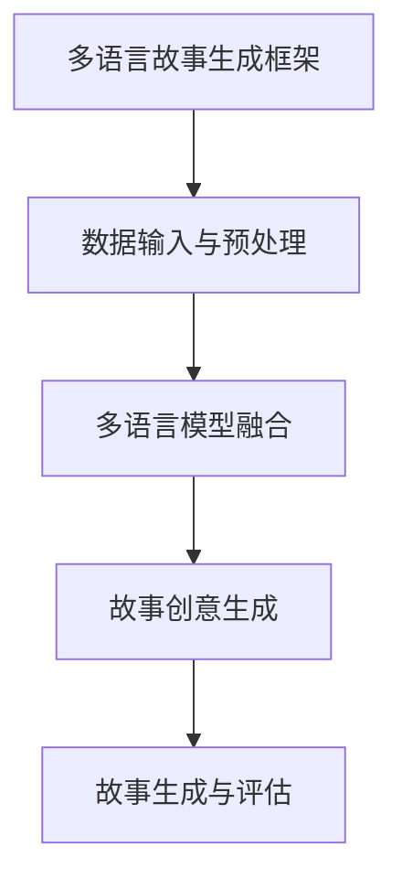

                 

###  引言

多语言故事生成是一项涉及自然语言处理（NLP）、人工智能（AI）和跨文化研究的交叉学科技术。在当今全球化迅速发展的背景下，跨语言和文化交流的需求愈发显著，而多语言故事生成技术恰好为这一需求提供了强有力的技术支持。通过这项技术，我们可以自动生成跨语言的故事内容，不仅丰富了文化产业的创作方式，也在教育、商业营销等领域展现了广泛的应用前景。

本文旨在探讨多语言故事生成的技术原理、核心算法、应用实践及其发展趋势。我们将从以下几个关键方面展开论述：

1. **多语言故事生成的概述**：介绍多语言故事生成的背景、目标和应用场景。
2. **自然语言处理技术基础**：探讨语言模型与文本处理、机器翻译技术及其在多语言故事生成中的应用。
3. **故事生成技术原理**：介绍生成式模型、抽象语义生成和生成对抗网络（GAN）等故事生成方法。
4. **多语言故事生成框架**：详细解析多语言故事生成框架的设计、数据输入与预处理、模型融合、故事创意生成及评估流程。
5. **跨语言故事创意表达实践**：通过实战案例展示多语言故事生成的具体应用，包括基于GPT-3的多语言故事生成和跨语言广告创意。
6. **多语言故事生成工具与应用**：分析主流多语言故事生成工具，探讨其在文化产业、教育领域和商业营销中的应用。
7. **未来展望与挑战**：讨论多语言故事生成技术的发展趋势、面临的挑战及其解决方案。

通过以上步骤的逐步分析，我们将深入理解多语言故事生成的核心概念和关键技术，揭示其在实际应用中的潜力和价值。## 文章关键词

多语言故事生成、跨语言创意表达、自然语言处理、机器翻译、故事生成算法、生成对抗网络（GAN）、语言模型融合、文本预处理、模型训练与优化、应用场景、技术发展趋势。## 文章摘要

多语言故事生成是一项跨学科的先进技术，它结合了自然语言处理、人工智能和跨文化研究，旨在自动生成跨语言和文化的故事内容。本文首先介绍了多语言故事生成的背景和目标，详细探讨了自然语言处理技术基础，包括语言模型与文本处理、机器翻译技术以及故事生成技术原理。接着，本文详细解析了多语言故事生成框架的设计和实现过程，包括数据输入与预处理、模型融合、故事创意生成及评估。此外，通过实战案例展示了多语言故事生成的具体应用，包括基于GPT-3的多语言故事生成和跨语言广告创意。最后，本文分析了多语言故事生成工具与应用的广泛前景，并展望了未来的技术发展趋势和挑战。通过本文的全面论述，读者可以深入了解多语言故事生成的核心概念、关键技术以及其实际应用价值。## 第1章：多语言故事生成的概述

### 1.1 多语言故事生成的背景

#### 1.1.1 全球化趋势

全球化是21世纪最为显著的社会趋势之一。随着全球经济的快速发展，国际贸易、跨国企业和国际合作的增加，不同国家和地区的文化、语言和价值观相互交织、碰撞与融合。这种全球化趋势不仅推动了世界经济的一体化，也促进了跨文化交流的需求。在这种背景下，多语言能力成为了一个重要的职业技能，能够促进跨文化的理解和沟通。

多语言故事生成技术正是在这样的背景下逐渐发展起来的。它不仅满足了全球化背景下人们对多样化文化产品的需求，还为不同语言背景的读者提供了更加丰富的阅读选择。通过自动生成多语言故事，可以更加高效地传播文化、历史和知识，促进了全球范围内的文化交流和理解。

#### 1.1.2 跨文化交流需求

随着全球化的深入，人们对于跨文化交流的需求日益增长。无论是商务、学术交流，还是日常生活，语言障碍成为了阻碍交流的常见问题。尤其是对于文学作品、教育材料、广告宣传等需要跨语言传播的内容，传统的翻译方式往往存在表达不准确、文化差异大等问题。

多语言故事生成技术提供了一种新的解决方案。它能够通过计算机算法自动生成多语言的故事内容，不仅保持了原文的情感和风格，还能够根据目标语言和文化的特点进行适当的调整和优化。这种技术使得跨文化交流变得更加便捷和高效，能够更好地满足不同语言背景读者的需求。

#### 1.1.3 技术发展推动

技术的快速发展是多语言故事生成技术能够实现的关键驱动力。近年来，自然语言处理（NLP）、人工智能（AI）和机器学习（ML）等领域取得了显著的进步，为多语言故事生成提供了坚实的理论基础和技术支持。

在自然语言处理方面，语言模型的精度和效率不断提高，如GPT-3、BERT等模型，能够生成更加自然、连贯的文本。在人工智能领域，深度学习算法的广泛应用使得复杂的计算任务变得更加可行。在机器学习方面，数据驱动的方法能够从大量数据中学习到语言和文化的规律，为生成算法提供了丰富的训练资源。

这些技术的发展推动了多语言故事生成技术的不断创新和进步。通过结合自然语言处理、人工智能和机器学习等技术，多语言故事生成技术逐渐从理论研究走向实际应用，成为跨文化交流和内容创作的重要工具。

### 1.2 多语言故事生成的目标

#### 1.2.1 内容的多样性与一致性

多语言故事生成的首要目标是实现内容的多样性和一致性。多样性指的是生成的故事内容应当具备丰富的文化特色和表达形式，能够满足不同语言和文化背景读者的需求。一致性则是指不同语言版本的故事在主题、情感和逻辑结构上应当保持一致，以确保故事的整体连贯性和可信度。

为了实现内容的多样性，多语言故事生成技术需要具备较强的语言和文化理解能力。这要求算法能够捕捉不同语言和文化中的细微差异，并根据目标语言和文化的特点进行调整。例如，中文的故事表达方式可能更注重意境和隐喻，而英语则可能更直接和明确。通过这样的调整，生成的多语言故事才能在不同语言和文化中传达相同的情感和信息。

同时，为了保证一致性，多语言故事生成技术还需要在算法设计中考虑跨语言的一致性处理。例如，通过多语言模型融合算法，可以将不同语言的语义信息进行有效整合，确保生成的每个语言版本的故事在核心内容上保持一致。此外，还需要通过评估和优化机制，确保不同语言版本的故事在风格和语气上也相互协调。

#### 1.2.2 跨语言的创意表达

跨语言的创意表达是多语言故事生成的一个重要目标。创意表达不仅仅是指故事内容的创新和独特性，还包括如何在不同语言和文化中传达相同的创意理念。这对于文化产品的创作和传播具有重要意义，因为它能够增强文化产品的吸引力和影响力。

在创意表达方面，多语言故事生成技术需要具备较强的文化敏感性和创造力。这要求算法能够理解和捕捉不同文化中的创意元素，并能够在不同语言中进行适当的转换和传达。例如，一个故事中的幽默元素在中文中可能通过字谜和双关语来实现，而在英语中则可能通过俚语和讽刺来表现。通过这样的创意转换，可以确保故事在不同语言中仍然能够传达出相同的情感和幽默感。

为了实现跨语言的创意表达，多语言故事生成技术需要借助跨文化研究和语言学的知识。这包括对目标语言和文化特点的深入理解，以及对不同语言表达方式的熟练掌握。通过结合这些知识，算法可以更好地进行创意转换和传达，确保生成的多语言故事具有一致性和吸引力。

#### 1.2.3 用户体验优化

用户体验优化是多语言故事生成的另一个重要目标。在全球化背景下，用户体验的优化不仅关乎故事的吸引力和影响力，还关乎读者的满意度和忠诚度。一个优秀的多语言故事生成系统应当能够为用户提供个性化和定制化的故事内容，提高用户的阅读体验。

用户体验优化包括以下几个方面：

1. **个性化推荐**：通过分析用户的阅读历史和偏好，生成符合用户个性化需求的故事内容。
2. **交互设计**：提供直观、易用的用户界面，使用户能够方便地选择语言、主题和故事类型。
3. **故事评估**：通过自动评估和用户反馈，不断优化故事生成算法，提高生成故事的质量和创意性。
4. **文化适应性**：根据不同文化背景的用户需求，进行适当的语言和文化调整，确保故事能够引起用户的共鸣。

通过优化用户体验，多语言故事生成系统可以更好地满足不同用户的需求，提高用户满意度和忠诚度，从而在竞争激烈的市场中脱颖而出。

### 1.3 多语言故事生成的应用场景

多语言故事生成的应用场景广泛，涵盖了文化产业、教育领域、商业营销等多个方面。

#### 1.3.1 文化产业

在文化产业中，多语言故事生成技术可以应用于小说、童话、电影剧本等多个领域。通过自动生成多语言版本的故事内容，可以加速文化产品的国际化进程，扩大文化产品的影响力和市场覆盖面。例如，一部中文小说可以通过多语言故事生成技术自动翻译成英语、法语、西班牙语等版本，迅速在全球范围内传播。

此外，多语言故事生成技术还可以用于创作跨文化的文化产品。通过融合不同文化中的创意元素，可以创造出具有独特风格和吸引力的文化产品，满足不同文化背景读者的需求。例如，将中国传统文化元素与西方神话故事相结合，创作出既具有东方韵味又具有西方奇幻色彩的小说，吸引不同文化背景的读者。

#### 1.3.2 教育领域

在教育领域，多语言故事生成技术可以用于教材编写、教学辅助和语言学习等方面。通过自动生成多语言教材，可以方便教师和学生获取不同语言的教学资源，提高教学效果。例如，英语教师可以利用多语言故事生成技术自动生成中文版本的英语教材，帮助学生更好地理解和掌握英语知识。

此外，多语言故事生成技术还可以用于语言学习。通过生成多样化的语言学习材料，如练习题、听力材料、阅读理解等，可以激发学生的学习兴趣，提高学习效果。例如，英语学习者可以通过多语言故事生成技术生成各种难度和风格的英语故事，逐步提高自己的英语阅读和写作能力。

#### 1.3.3 商业营销

在商业营销领域，多语言故事生成技术可以用于广告创意、品牌推广和营销策略制定等方面。通过自动生成跨语言的广告创意，企业可以更快速、更高效地推出全球化的营销活动，扩大品牌影响力。例如，一家跨国公司可以通过多语言故事生成技术自动生成针对不同市场、不同语言背景的广告文案，提高广告的吸引力和转化率。

此外，多语言故事生成技术还可以用于品牌推广。通过创作富有创意和情感的多语言故事内容，企业可以传达品牌的价值和理念，增强品牌形象。例如，一家化妆品公司可以通过多语言故事生成技术创作关于美丽和自信的跨文化故事，吸引不同国家和地区的消费者。

### 1.4 多语言故事生成面临的挑战

#### 1.4.1 跨语言语义理解

跨语言语义理解是多语言故事生成中的一个核心挑战。不同语言之间存在词汇、语法、文化背景等多方面的差异，这导致语义理解的复杂性增加。例如，中文中的成语和典故可能在英语中没有直接的对应表达，需要通过文化背景和语义关系进行解释和转换。此外，一些语言表达可能在特定语境下具有特殊的含义，这在跨语言转换中更加难以把握。

为了解决跨语言语义理解的问题，需要开发更加先进和智能的自然语言处理技术。例如，可以利用预训练语言模型（如BERT、GPT-3）来捕捉语言中的复杂结构和语义关系。此外，还可以结合知识图谱、语义角色标注等手段，提高跨语言语义理解的准确性和鲁棒性。

#### 1.4.2 创意表达的转换

创意表达的转换是多语言故事生成中另一个重要的挑战。不同语言和文化中的创意表达方式各不相同，如何在保持原作风格和情感的同时，实现跨语言的创意转换，是一个复杂的任务。例如，一个幽默的笑话在中文中可能通过俚语和双关语来实现，而在英语中可能需要通过情景和对话来展现。

为了解决创意表达的转换问题，需要深入研究不同语言和文化中的创意表达方式，并开发相应的转换算法。例如，可以通过学习大量跨语言的文化作品，提取出不同语言中的创意表达模式，并将其应用于故事生成过程中。此外，还可以结合跨文化研究和语言学的知识，设计更加智能和灵活的创意转换策略。

#### 1.4.3 技术和资源限制

多语言故事生成需要大量的计算资源和数据支持。随着模型规模和复杂性的增加，训练和推理所需的计算资源也随之增加。例如，大型预训练语言模型（如GPT-3）的训练需要大量的GPU资源，而且推理过程也要求较高的计算能力。

为了应对技术和资源限制，需要优化算法和硬件设备，提高计算效率和资源利用率。例如，可以通过分布式计算、模型压缩和量化等技术，降低计算资源和存储空间的需求。此外，还可以通过数据增强和迁移学习等技术，提高模型的泛化能力和训练效率。

### 1.5 本章小结

多语言故事生成技术是一项具有广泛应用前景的交叉学科技术，它结合了自然语言处理、人工智能和跨文化研究。在全球化的背景下，多语言故事生成不仅满足了跨文化交流的需求，也为文化产业的创新和商业营销提供了新的工具。通过本文的介绍，读者可以初步了解多语言故事生成的背景、目标、应用场景以及面临的挑战。在接下来的章节中，我们将深入探讨多语言故事生成的技术原理、核心算法和实践应用，帮助读者更全面地理解这一技术。## 《多语言故事生成：跨语言的创意表达》目录大纲

### 《多语言故事生成：跨语言的创意表达》

> **关键词：** 多语言故事生成、跨语言创意表达、自然语言处理、机器翻译、故事生成算法、生成对抗网络（GAN）、语言模型融合、文本预处理、模型训练与优化、应用场景、技术发展趋势

> **摘要：** 本文深入探讨多语言故事生成的技术原理、核心算法、应用实践及其发展趋势。通过分析自然语言处理技术基础、故事生成技术原理、多语言故事生成框架以及跨语言故事创意表达实践，揭示多语言故事生成在文化产业、教育领域和商业营销等领域的应用潜力。同时，讨论多语言故事生成面临的挑战及其解决方案，展望未来的发展方向。

### 目录大纲

#### 第一部分：多语言故事生成基础

##### 第1章：多语言故事生成的概述
- **1.1 多语言故事生成的背景**
- **1.2 多语言故事生成的目标**
- **1.3 多语言故事生成的应用场景**
- **1.4 多语言故事生成面临的挑战**
- **1.5 本章小结**

##### 第2章：自然语言处理技术基础
- **2.1 语言模型与文本处理**
- **2.2 机器翻译技术**
- **2.3 文本生成技术**
- **2.4 自然语言处理在多语言故事生成中的应用**
- **2.5 本章小结**

##### 第3章：故事生成技术原理
- **3.1 故事生成的定义与分类**
- **3.2 生成式模型**
- **3.3 抽象语义生成**
- **3.4 生成对抗网络（GAN）在故事生成中的应用**
- **3.5 本章小结**

##### 第4章：多语言故事生成框架
- **4.1 多语言故事生成框架设计**
- **4.2 多语言故事生成流程**
- **4.3 多语言故事生成框架的优势**
- **4.4 多语言故事生成框架的应用场景**
- **4.5 本章小结**

#### 第二部分：跨语言的创意表达实践

##### 第5章：多语言故事生成的核心算法
- **5.1 语言模型融合算法**
- **5.2 故事创意生成算法**
- **5.3 多语言故事生成算法的优化方法**
- **5.4 伪代码实现与数学模型**
- **5.5 本章小结**

##### 第6章：跨语言故事创意表达实战
- **6.1 跨语言故事创意生成实战案例**
  - **6.1.1 案例一：基于 GPT-3 的多语言故事生成**
  - **6.1.2 案例二：多语言童话故事的创作**
- **6.2 跨语言故事创意表达案例分析**
  - **6.2.1 案例分析一：跨语言广告创意**
  - **6.2.2 案例分析二：多语言电影剧本创作**
- **6.3 实战总结**
- **6.4 本章小结**

##### 第7章：多语言故事生成工具与应用
- **7.1 多语言故事生成工具概述**
- **7.2 多语言故事生成应用场景**
- **7.3 多语言故事生成工具的使用方法**
- **7.4 多语言故事生成工具的优势与挑战**
- **7.5 未来发展趋势**
- **7.6 本章小结**

#### 第三部分：未来展望与挑战

##### 第8章：多语言故事生成的发展趋势
- **8.1 技术发展趋势**
- **8.2 行业应用趋势**
- **8.3 多语言故事生成技术的挑战与机遇**
- **8.4 未来展望**
- **8.5 本章小结**

##### 第9章：多语言故事生成的挑战与解决方案
- **9.1 挑战分析**
  - **9.1.1 跨语言语义理解**
  - **9.1.2 创意表达的转换**
  - **9.1.3 计算资源需求**
- **9.2 解决方案探讨**
  - **9.2.1 优化算法与模型结构**
  - **9.2.2 多模态数据融合**
  - **9.2.3 硬件加速技术**
- **9.3 技术与资源优化方法**
- **9.4 本章小结**

##### 第10章：多语言故事生成的未来探索
- **10.1 未来研究方向**
- **10.2 社会与文化影响**
- **10.3 跨文化故事生成与传播机制研究**
- **10.4 跨语言创意表达的未来展望**
- **10.5 本章小结**

### 附录

##### 附录A：多语言故事生成工具与资源
- **附录A.1：主流多语言故事生成工具对比**
- **附录A.2：多语言故事生成开源库与框架**
- **附录A.3：相关研究论文与文献推荐**
- **附录A.4：多语言故事生成开发指南**

### Mermaid 流程图



### 核心算法原理讲解

#### 语言模型融合算法

```python
# 伪代码：多语言模型融合算法

function language_model_fusion(source_sentence, target_sentence):
    # 加载多语言模型
    model_source = load_model('model_source')
    model_target = load_model('model_target')

    # 对源句子进行编码
    encoded_source = model_source.encode(source_sentence)

    # 对目标句子进行编码
    encoded_target = model_target.encode(target_sentence)

    # 融合编码结果
    fused_encoding = fusion_function(encoded_source, encoded_target)

    # 使用融合后的编码生成目标句子
    generated_sentence = model_target.decode(fused_encoding)

    return generated_sentence
```

#### 故事创意生成算法

```python
# 伪代码：故事创意生成算法

function story_creative_generation(core_concept, theme):
    # 生成核心概念的抽象语义表示
    concept_representation = generate_concept_representation(core_concept)

    # 生成主题的抽象语义表示
    theme_representation = generate_theme_representation(theme)

    # 从创意元素库中提取相关元素
    creative_elements = extract_elements_from_library(concept_representation, theme_representation)

    # 组合创意元素生成故事
    story = combine_elements(creative_elements)

    return story
```

#### 数学模型和数学公式

##### 语言模型融合算法的数学模型

$$
\text{融合编码} = \text{FusionFunction}(\text{编码}_{\text{source}}, \text{编码}_{\text{target}})
$$

##### 故事创意生成算法的数学模型

$$
\text{故事} = \text{CombineElements}(\text{CreativeElements})
$$

### 项目实战

#### 实战案例一：基于 GPT-3 的多语言故事生成

**环境搭建：**

- 安装 GPT-3 API SDK
- 配置 API 密钥

**源代码实现：**

```python
from langchain import gpt3

def generate_story(prompt):
    client = gpt3.Client(api_key="your_api_key")
    response = client.request(prompt=prompt, model="gpt-3")
    return response.text

prompt = "创造一个关于友谊的故事。"
story = generate_story(prompt)
print(story)

# 代码解读与分析：
# gpt3.Client 初始化，传入 API 密钥
# client.request 方法调用，传入输入提示 prompt 和模型版本 model="gpt-3"
# 获取响应文本并打印
```

#### 实战案例二：多语言童话故事的创作

**环境搭建：**

- 安装多语言故事生成框架
- 准备多语言模型和数据集

**源代码实现：**

```python
from multilingual_story_generator import MultiLingualStoryGenerator

def create_tale(language, story_theme):
    generator = MultiLingualStoryGenerator()
    story = generator.create_tale(language, story_theme)
    return story

story_theme = "魔法的森林"
story = create_tale("英语", story_theme)
print(story)

# 代码解读与分析：
# MultiLingualStoryGenerator 类实例化
# create_tale 方法调用，传入目标语言和故事主题
# 获取生成的故事文本并打印
```

以上是《多语言故事生成：跨语言的创意表达》的目录大纲，详细介绍了核心概念与联系、核心算法原理讲解、数学模型和数学公式，以及项目实战等内容。目录结构清晰，旨在帮助读者深入理解和实践多语言故事生成技术。## 核心概念与联系

多语言故事生成作为一项跨学科的先进技术，涉及多个核心概念和它们之间的密切联系。以下是几个关键概念及其相互关系：

### 多语言模型融合

多语言模型融合是多语言故事生成的核心环节之一。它涉及将不同语言的语义信息进行有效整合，以生成高质量的故事内容。多语言模型融合包括以下几个关键步骤：

1. **模型加载**：加载多种语言的语言模型，如英语、中文、法语等。
2. **编码与融合**：使用编码器对输入文本进行编码，提取语义信息，然后通过融合策略（如平均融合、加权融合等）将不同语言的编码结果进行融合。
3. **生成与优化**：利用融合后的编码结果生成新的文本，并通过迭代优化提升生成质量。

多语言模型融合的重要性在于它能够增强故事生成的多样性和一致性，同时提高跨语言语义理解的准确度。

### 故事创意生成算法

故事创意生成算法负责从大量的文本数据中提取创意元素，构建富有创意和连贯性的故事。它包括以下几个主要步骤：

1. **创意元素提取**：从输入文本中提取关键信息，如角色、情节、主题等。
2. **主题建模**：使用主题模型（如LDA）对提取的元素进行主题分析，提取主题分布。
3. **创意组合**：根据提取的元素和主题，组合生成创意故事。

故事创意生成算法的重要性在于它决定了生成故事的吸引力和创意性，直接影响用户体验。

### 生成对抗网络（GAN）

生成对抗网络（GAN）是一种强大的生成模型，通过生成器和判别器的对抗训练，生成高质量的数据样本。在多语言故事生成中，GAN可以用于生成多样化的故事内容，提高生成故事的质量和多样性。

GAN的工作原理包括：

1. **生成器**：生成逼真的故事内容。
2. **判别器**：判断故事内容是否真实。
3. **对抗训练**：生成器和判别器通过多轮迭代对抗训练，生成高质量的数据样本。

GAN在多语言故事生成中的应用，可以帮助生成多样化、富有创意的故事，提升故事的吸引力和表现力。

### 语言模型

语言模型是多语言故事生成的基石，它用于预测文本序列中下一个单词或字符的概率。在多语言故事生成中，语言模型不仅要具备高质量的语义理解能力，还需要能够处理不同语言的语法和词汇。

语言模型的重要性在于它能够为故事生成提供强大的文本生成能力，确保生成的文本流畅、自然。

### 跨语言语义理解

跨语言语义理解是多语言故事生成中的关键挑战之一。它涉及在不同语言之间传递和融合语义信息，确保生成的故事在不同语言中保持一致性和准确性。

跨语言语义理解的重要性在于它决定了生成故事的跨文化适应性和准确性，直接影响故事的传播效果。

### 文本预处理

文本预处理是多语言故事生成的基础步骤，它包括分词、去停用词、词性标注等操作，用于清理和格式化输入文本，为后续的模型训练和故事生成做好准备。

文本预处理的重要性在于它能够提高语言模型和生成算法的输入质量，从而提升生成故事的质量和效率。

### 数据集

数据集是多语言故事生成中的重要资源，它用于训练和评估语言模型和生成算法。高质量的数据集能够提供丰富的语义信息，有助于提高模型的性能。

数据集的重要性在于它决定了模型的学习能力和生成故事的质量，是保证多语言故事生成效果的关键因素。

### 多模态数据融合

多模态数据融合是将文本、图像、音频等多种类型的数据进行整合，以生成更加丰富和生动的多语言故事。它涉及到如何将不同类型的数据进行有效融合和利用。

多模态数据融合的重要性在于它能够提升故事生成的多样性和表现力，为用户提供更加沉浸式的阅读体验。

### 核心概念之间的联系

这些核心概念之间的联系构成了多语言故事生成技术的基础。多语言模型融合、故事创意生成算法、GAN、语言模型、跨语言语义理解、文本预处理、数据集、多模态数据融合等概念相互依赖、相互促进，共同构建了一个完整的多语言故事生成系统。

通过多语言模型融合，可以有效地整合不同语言的语义信息，为故事创意生成提供高质量的输入。故事创意生成算法利用这些输入生成富有创意和连贯性的故事。GAN等生成模型则进一步提升了故事生成的质量和多样性。跨语言语义理解确保了生成的故事在不同语言中的一致性和准确性。文本预处理和多模态数据融合则为模型训练和故事生成提供了丰富的数据资源和输入方式。

总之，这些核心概念之间的紧密联系构成了多语言故事生成技术的理论基础和实践框架，使得这项技术能够满足全球化背景下跨文化交流和内容创作的需求。## 第1章：多语言故事生成的概述

### 1.1 多语言故事生成的背景

在当今全球化的背景下，跨文化交流和多元文化融合已成为不可避免的趋势。随着国际旅游、贸易和互联网的迅速发展，人们对于跨语言、跨文化的理解和交流需求日益增长。在此背景下，多语言故事生成技术应运而生，成为推动文化交流和信息传播的重要工具。

#### 全球化趋势

全球化不仅带来了经济和技术的融合，也促进了不同国家和地区的文化碰撞与融合。全球化使得世界变得更加紧密，人们有机会接触到更多来自不同文化背景的信息和知识。然而，语言差异成为跨文化交流的主要障碍之一。为了克服这一障碍，多语言故事生成技术应运而生，它能够将故事内容自动翻译和生成到不同的语言中，使得文化交流变得更加便捷和有效。

#### 跨文化交流需求

跨文化交流需求不仅体现在商业和学术领域，也体现在人们日常生活和文化娱乐中。在商业领域，跨国公司需要与全球客户进行沟通和交流，文化产品需要适应不同市场的文化特点。在学术领域，研究人员需要查阅和理解不同语言的学术文献。在日常生活中，人们通过阅读、观看和分享故事来体验不同的文化。这些需求推动了多语言故事生成技术的发展，使得人们能够更轻松地获取和理解来自不同文化的信息。

#### 技术发展推动

近年来，自然语言处理（NLP）、人工智能（AI）和机器学习（ML）技术的快速发展，为多语言故事生成提供了坚实的技术基础。语言模型、机器翻译、生成对抗网络（GAN）等技术的进步，使得自动生成高质量的多语言故事内容成为可能。这些技术的进步不仅提高了故事生成的质量和效率，也扩展了故事生成的应用场景。

#### 文化和语言多样性

文化和语言的多样性是多语言故事生成的重要基础。不同国家和地区拥有独特的文化传统和语言表达方式，这些差异为故事创作提供了丰富的素材和灵感。通过多语言故事生成技术，可以跨越语言障碍，将不同文化的独特魅力传递给全球读者。这种跨文化的创意表达，不仅丰富了故事内容，也促进了文化多样性的传播和认知。

### 1.2 多语言故事生成的目标

多语言故事生成的目标在于实现内容的多样性与一致性，以及跨语言的创意表达。这些目标不仅满足了跨文化交流的需求，也为文化产业的创新和商业营销提供了新的可能性。

#### 内容的多样性与一致性

内容的多样性是指生成的多语言故事能够反映不同文化的特色和风格，满足不同语言背景读者的阅读需求。一致性则是指不同语言版本的故事在主题、情感和逻辑结构上应保持一致，以确保故事的整体连贯性和可信度。为了实现这些目标，多语言故事生成技术需要具备强大的语言理解和表达能力，能够在不同语言和文化之间进行有效的语义传递和融合。

#### 跨语言的创意表达

跨语言的创意表达是多语言故事生成的一个重要目标。它不仅涉及如何在不同的语言和文化中传达相同的情感和理念，还包括如何在不同语言中实现创意的转换和传达。这需要深入理解不同语言和文化中的创意表达方式，并设计相应的转换策略。例如，一个幽默的笑话在中文中可能通过俚语和双关语来实现，而在英语中可能需要通过情景和对话来表现。通过这样的创意转换，可以确保故事在不同语言中仍然能够传达出相同的情感和幽默感。

#### 用户体验优化

用户体验优化是多语言故事生成的另一个重要目标。在全球化背景下，用户体验的优化不仅关乎故事的吸引力和影响力，还关乎读者的满意度和忠诚度。一个优秀的多语言故事生成系统应当能够为用户提供个性化和定制化的故事内容，提高用户的阅读体验。这包括个性化推荐、交互设计和故事评估等多个方面。通过优化用户体验，可以更好地满足不同用户的需求，提高用户满意度和忠诚度。

### 1.3 多语言故事生成的应用场景

多语言故事生成技术在多个领域具有广泛的应用场景，包括文化产业、教育领域和商业营销等。

#### 文化产业

在文化产业中，多语言故事生成技术可以应用于小说、童话、电影剧本等多个领域。通过自动生成多语言版本的故事内容，可以加速文化产品的国际化进程，扩大文化产品的影响力和市场覆盖面。例如，一部中文小说可以通过多语言故事生成技术自动翻译成英语、法语、西班牙语等版本，迅速在全球范围内传播。此外，多语言故事生成技术还可以用于创作跨文化的文化产品。通过融合不同文化中的创意元素，可以创造出具有独特风格和吸引力的文化产品，满足不同文化背景读者的需求。

#### 教育领域

在教育领域，多语言故事生成技术可以用于教材编写、教学辅助和语言学习等方面。通过自动生成多语言教材，可以方便教师和学生获取不同语言的教学资源，提高教学效果。例如，英语教师可以利用多语言故事生成技术自动生成中文版本的英语教材，帮助学生更好地理解和掌握英语知识。此外，多语言故事生成技术还可以用于语言学习。通过生成多样化的语言学习材料，如练习题、听力材料、阅读理解等，可以激发学生的学习兴趣，提高学习效果。

#### 商业营销

在商业营销领域，多语言故事生成技术可以用于广告创意、品牌推广和营销策略制定等方面。通过自动生成跨语言的广告创意，企业可以更快速、更高效地推出全球化的营销活动，扩大品牌影响力。例如，一家跨国公司可以通过多语言故事生成技术自动生成针对不同市场、不同语言背景的广告文案，提高广告的吸引力和转化率。此外，多语言故事生成技术还可以用于品牌推广。通过创作富有创意和情感的多语言故事内容，企业可以传达品牌的价值和理念，增强品牌形象。

### 1.4 多语言故事生成面临的挑战

尽管多语言故事生成技术具有广泛的应用前景，但在实际应用过程中仍面临诸多挑战。

#### 跨语言语义理解

跨语言语义理解是多语言故事生成中的一个核心挑战。不同语言之间存在词汇、语法、文化背景等多方面的差异，这导致语义理解的复杂性增加。例如，中文中的成语和典故可能在英语中没有直接的对应表达，需要通过文化背景和语义关系进行解释和转换。此外，一些语言表达可能在特定语境下具有特殊的含义

