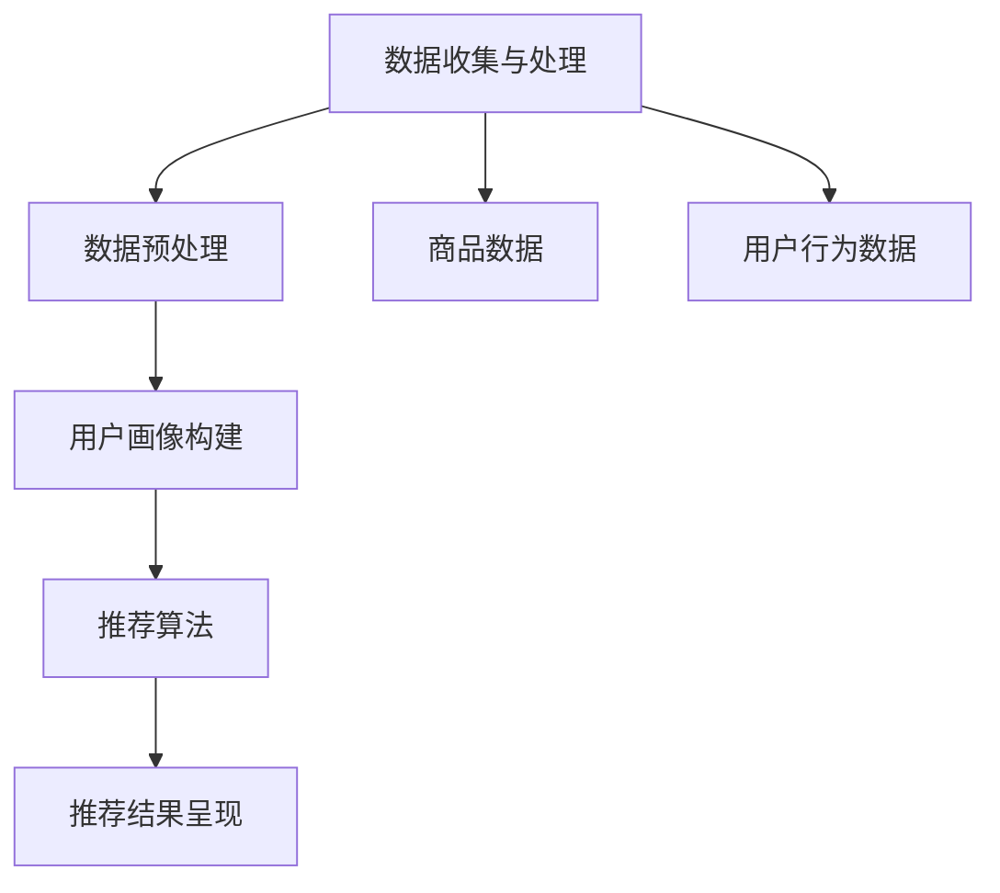

                 

# 大数据与AI驱动的电商推荐：搜索准确率与用户体验的双重优化

## 关键词
- 大数据
- AI
- 电商推荐系统
- 搜索准确率
- 用户体验
- 协同过滤
- 内容推荐
- 混合推荐算法

## 摘要
本文深入探讨大数据与AI技术在电商推荐系统中的应用，以及如何通过优化搜索准确率和提升用户体验来增强电商平台的竞争力。首先，我们将概述大数据与AI在电商推荐中的基本概念和重要性。接着，详细分析用户行为数据的收集与处理，以及用户画像的构建方法。然后，我们将介绍协同过滤算法、基于内容的推荐算法和混合推荐算法，并使用伪代码和Mermaid流程图详细解释其原理。接下来，文章将探讨如何通过策略优化搜索准确率，并讨论用户体验优化的重要性及其方法。最后，通过实际案例分析，展示大数据与AI驱动的电商推荐系统的应用实践，总结其价值与未来发展趋势。

---

### 《大数据与AI驱动的电商推荐：搜索准确率与用户体验的双重优化》目录大纲

#### 第一部分：大数据与电商推荐系统基础

- 第1章：大数据与电商推荐概述
  - 1.1 大数据与电商环境
  - 1.2 AI与电商推荐系统
  - 1.3 AI驱动的电商推荐系统架构
- 第2章：用户行为分析与用户画像构建
  - 2.1 用户行为数据收集与处理
  - 2.2 用户画像构建方法

#### 第二部分：基于大数据的推荐算法

- 第3章：协同过滤算法
  - 3.1 协同过滤算法的基本原理
  - 3.2 基于矩阵分解的协同过滤算法
- 第4章：基于内容的推荐算法
  - 4.1 基于内容的推荐算法概述
  - 4.2 文本挖掘与语义分析
- 第5章：混合推荐算法
  - 5.1 混合推荐算法概述
  - 5.2 混合推荐算法的设计与实现

#### 第三部分：搜索准确率与用户体验优化

- 第6章：搜索准确率优化策略
  - 6.1 搜索准确率的重要性
  - 6.2 搜索准确率优化方法
- 第7章：用户体验优化策略
  - 7.1 用户体验的基本概念
  - 7.2 用户体验优化方法

#### 第四部分：案例分析与应用实践

- 第8章：案例分析与应用实践
  - 8.1 案例分析
  - 8.2 应用实践

#### 第五部分：总结与展望

- 第9章：大数据与AI驱动的电商推荐系统总结
  - 9.1 大数据与AI在电商推荐中的应用价值
  - 9.2 当前挑战与未来发展趋势

### 附录

- 附录A：推荐系统常用工具与框架
- 附录B：数学公式与概念
- 附录C：参考文献

---

### 第1章：大数据与电商推荐概述

#### 1.1 大数据与电商环境

##### 1.1.1 大数据的基本概念

大数据（Big Data）是指数据量巨大、类型繁多、处理速度快、价值密度低的数据集合。它的特点通常被描述为4V，即Volume（数据量）、Velocity（速度）、Variety（多样性）和Veracity（真实性）。

- **Volume（数据量）**：大数据具有庞大的数据规模，从数百万条记录到数以亿计的记录不等。
- **Velocity（速度）**：数据处理的速度非常快，要求系统能够实时或近乎实时地处理大量数据。
- **Variety（多样性）**：大数据不仅包括结构化数据，还包括非结构化数据，如图像、音频、视频等。
- **Veracity（真实性）**：数据质量是大数据的关键挑战之一，真实性直接影响数据的价值。

##### 1.1.2 电商行业的大数据应用

电商行业的大数据应用主要体现在以下几个方面：

- **用户行为分析**：通过对用户购买历史、浏览记录、搜索行为等大数据分析，了解用户偏好和需求，实现个性化推荐。
- **库存管理**：利用大数据分析销售趋势和库存数据，优化库存配置，降低库存成本。
- **营销策略**：通过大数据分析用户群体特征，定制化营销策略，提高营销效果。
- **欺诈检测**：利用大数据监控用户交易行为，识别和预防欺诈行为。

##### 1.1.3 大数据在电商推荐中的重要性

大数据在电商推荐中发挥着至关重要的作用，主要体现在以下几个方面：

- **个性化推荐**：通过用户行为数据分析，生成个性化的商品推荐，提升用户满意度和转化率。
- **提高运营效率**：通过大数据分析，优化库存管理、供应链管理，提高整体运营效率。
- **降低成本**：通过数据驱动的决策，减少不必要的库存、营销费用，降低运营成本。
- **提升竞争力**：利用大数据技术，打造差异化的推荐系统，增强电商平台的市场竞争力。

#### 1.2 AI与电商推荐系统

##### 1.2.1 AI的基本概念

人工智能（Artificial Intelligence，AI）是指通过计算机程序模拟人类智能行为的技术，包括机器学习、深度学习、自然语言处理、计算机视觉等多个领域。

- **机器学习**：通过训练算法，让计算机自动从数据中学习规律，进行预测和决策。
- **深度学习**：一种特殊的机器学习技术，通过神经网络模拟人类大脑的学习过程。
- **自然语言处理**：使计算机能够理解、生成和处理人类自然语言的技术。
- **计算机视觉**：让计算机能够“看”懂图像和视频内容的技术。

##### 1.2.2 AI在电商推荐中的应用

AI在电商推荐中的应用主要包括以下几个方面：

- **用户画像构建**：通过机器学习和深度学习技术，分析用户行为数据，构建用户画像，实现个性化推荐。
- **商品分类与标签**：利用自然语言处理技术，对商品进行自动分类和标签化，提高搜索效率和推荐质量。
- **图像识别与推荐**：通过计算机视觉技术，识别用户上传或浏览的图像，进行相应的商品推荐。
- **欺诈检测**：利用AI技术，监控用户交易行为，识别和预防欺诈行为。

##### 1.2.3 AI驱动的电商推荐系统架构

一个典型的AI驱动的电商推荐系统架构包括以下几个关键模块：

- **数据收集与处理模块**：负责收集用户行为数据、商品数据等，进行数据清洗、预处理和存储。
- **用户画像构建模块**：利用机器学习和深度学习技术，构建用户画像，用于后续的推荐算法。
- **推荐算法模块**：包括协同过滤、基于内容、混合推荐等多种算法，根据用户画像和商品特征生成推荐列表。
- **推荐结果呈现模块**：将推荐结果以合适的格式呈现给用户，包括搜索结果、首页推荐、购物车推荐等。

#### 1.3 AI驱动的电商推荐系统架构

一个典型的AI驱动的电商推荐系统架构包括以下几个关键模块：

- **数据收集与处理模块**：负责收集用户行为数据、商品数据等，进行数据清洗、预处理和存储。
- **用户画像构建模块**：利用机器学习和深度学习技术，构建用户画像，用于后续的推荐算法。
- **推荐算法模块**：包括协同过滤、基于内容、混合推荐等多种算法，根据用户画像和商品特征生成推荐列表。
- **推荐结果呈现模块**：将推荐结果以合适的格式呈现给用户，包括搜索结果、首页推荐、购物车推荐等。

**Mermaid流程图：**



#### 1.3 AI驱动的电商推荐系统架构

一个典型的AI驱动的电商推荐系统架构包括以下几个关键模块：

- **数据收集与处理模块**：负责收集用户行为数据、商品数据等，进行数据清洗、预处理和存储。
- **用户画像构建模块**：利用机器学习和深度学习技术，构建用户画像，用于后续的推荐算法。
- **推荐算法模块**：包括协同过滤、基于内容、混合推荐等多种算法，根据用户画像和商品特征生成推荐列表。
- **推荐结果呈现模块**：将推荐结果以合适的格式呈现给用户，包括搜索结果、首页推荐、购物车推荐等。

**Mermaid流程图：**


### 第2章：用户行为分析与用户画像构建

#### 2.1 用户行为数据收集与处理

##### 2.1.1 用户行为数据的类型

用户行为数据包括用户在电商平台上的各种活动记录，主要包括以下几类：

- **浏览记录**：用户在网站或APP上浏览商品的记录，包括访问时间、浏览时长、浏览页面等。
- **搜索记录**：用户在搜索栏输入的关键词记录，反映用户的兴趣和需求。
- **购买记录**：用户的购买行为记录，包括购买时间、购买商品、购买金额等。
- **评价与反馈**：用户对商品的评价和反馈，反映用户的满意度和商品的质量。
- **社交行为**：用户在社交平台上的活动记录，如点赞、评论、分享等。

##### 2.1.2 用户行为数据的收集方法

用户行为数据的收集方法主要包括以下几种：

- **服务器日志**：通过分析服务器的日志文件，记录用户的访问行为，如访问时间、访问页面等。
- **前端埋点**：在网站或APP的前端代码中添加埋点脚本，实时记录用户的操作行为。
- **用户反馈**：通过用户调查、问卷调查等方式，收集用户的反馈和评价。
- **API接口**：通过API接口，获取第三方数据源的用户行为数据。

##### 2.1.3 用户行为数据的预处理技术

用户行为数据预处理是构建用户画像的重要步骤，主要包括以下几个环节：

- **数据清洗**：去除重复、无效的数据，对缺失值进行填充或删除。
- **数据转换**：将不同格式、不同单位的数据进行统一转换，便于后续分析。
- **数据归一化**：将不同特征的数据进行归一化处理，使其在相同量级上进行比较。
- **特征提取**：提取用户行为数据中的关键特征，如浏览时长、购买频率等。

#### 2.2 用户画像构建方法

##### 2.2.1 用户画像的基本概念

用户画像（User Profiling）是指通过对用户行为数据的分析和挖掘，构建出用户的综合特征模型。用户画像可以帮助电商平台了解用户的需求、兴趣和行为习惯，从而实现个性化推荐和营销。

##### 2.2.2 用户画像构建的步骤

用户画像构建的主要步骤如下：

- **数据收集**：收集用户的基本信息、行为数据、交易数据等。
- **数据预处理**：对收集到的数据进行清洗、转换、归一化等处理。
- **特征提取**：提取用户行为数据中的关键特征，如浏览时长、购买频率等。
- **模型构建**：利用机器学习和深度学习算法，构建用户画像模型。
- **模型评估**：通过交叉验证等方法，评估用户画像模型的性能。
- **模型应用**：将用户画像模型应用于推荐系统、营销系统等。

##### 2.2.3 常用用户画像特征

用户画像中常用的特征包括：

- **基础信息特征**：如性别、年龄、地域、职业等。
- **行为特征**：如浏览时长、浏览页面、搜索关键词等。
- **交易特征**：如购买频率、购买金额、购买商品种类等。
- **社交特征**：如点赞数量、评论数量、好友数量等。
- **兴趣特征**：如关注话题、收藏商品等。

### 第3章：协同过滤算法

#### 3.1 协同过滤算法的基本原理

##### 3.1.1 协同过滤的概念

协同过滤（Collaborative Filtering）是一种通过分析用户之间的相似性来预测用户可能偏好的物品的推荐算法。它主要基于用户的历史行为数据，通过寻找具有相似行为的用户或物品，为当前用户推荐相似的物品。

##### 3.1.2 协同过滤的分类

协同过滤算法主要分为以下两类：

- **基于用户的协同过滤（User-based Collaborative Filtering）**：通过寻找与当前用户行为相似的其它用户，推荐这些用户喜欢的物品。
- **基于物品的协同过滤（Item-based Collaborative Filtering）**：通过寻找与当前物品相似的其它物品，推荐这些物品给用户。

##### 3.1.3 协同过滤的优缺点

协同过滤算法的优点如下：

- **算法简单**：协同过滤算法的实现相对简单，易于理解和实现。
- **效果较好**：基于用户行为数据，协同过滤算法能够较好地预测用户的偏好。

协同过滤算法的缺点如下：

- **冷启动问题**：新用户或新物品缺乏足够的历史行为数据，难以进行准确的推荐。
- **数据稀疏性**：在大型数据集中，用户和物品之间的关系往往非常稀疏，导致推荐效果下降。

#### 3.2 基于矩阵分解的协同过滤算法

##### 3.2.1 矩阵分解的概念

矩阵分解（Matrix Factorization）是一种将高维稀疏矩阵分解为低维矩阵的方法。在协同过滤算法中，矩阵分解可以用来表示用户和物品之间的隐含特征。

##### 3.2.2 基于矩阵分解的协同过滤算法实现

基于矩阵分解的协同过滤算法主要包括以下步骤：

1. **矩阵分解**：将用户-物品评分矩阵分解为用户特征矩阵和物品特征矩阵。
2. **预测**：利用用户特征矩阵和物品特征矩阵，预测用户对未评分物品的评分。
3. **优化**：通过优化目标函数，调整用户特征矩阵和物品特征矩阵，提高预测准确率。

伪代码：

```python
# 矩阵分解算法
def matrix_factorization(R, K, alpha, beta, num_iterations):
    U = np.random.rand(num_users, K)
    V = np.random.rand(num_items, K)
    
    for i in range(num_iterations):
        for user in range(num_users):
            for item in range(num_items):
                if R[user, item] > 0:
                   预测评分 = dot(U[user], V[item])
                    e = R[user, item] - 预测评分
                    U[user] = U[user] + alpha * (e * V[item] - beta * dot(U[user], V[item]))
                    V[item] = V[item] + beta * (e * U[user] - beta * dot(V[item], U[user]))
        
        # 正则化
        U = U / np.linalg.norm(U, axis=1, keepdims=True)
        V = V / np.linalg.norm(V, axis=1, keepdims=True)
    
    return U, V
```

##### 3.2.3 矩阵分解算法的优化

矩阵分解算法的优化主要包括以下几种方法：

- **交替优化**：交替优化用户特征矩阵和物品特征矩阵，逐步提高预测准确率。
- **优化目标函数**：采用不同的优化目标函数，如均方误差（MSE）、交叉熵（Cross-Entropy）等，提高算法性能。
- **维度降低**：通过降低特征维度，减少计算复杂度和存储空间。

### 第4章：基于内容的推荐算法

#### 4.1 基于内容的推荐算法概述

##### 4.1.1 基于内容的推荐算法的概念

基于内容的推荐算法（Content-based Recommender System）是一种基于物品特征信息进行推荐的方法。它通过分析用户的历史行为和兴趣，构建用户兴趣模型，然后根据物品的属性特征，为用户推荐相似或相关的物品。

##### 4.1.2 基于内容的推荐算法的实现流程

基于内容的推荐算法主要包括以下几个步骤：

1. **物品特征提取**：提取物品的文本特征、图像特征、音频特征等。
2. **用户兴趣建模**：利用用户的历史行为数据，构建用户的兴趣模型。
3. **相似度计算**：计算用户兴趣模型和物品特征之间的相似度。
4. **推荐生成**：根据相似度排序，为用户生成推荐列表。

##### 4.1.3 基于内容的推荐算法的优缺点

基于内容的推荐算法的优点如下：

- **效果好**：能够为用户推荐与兴趣高度相关的物品。
- **冷启动友好**：新用户或新物品可以通过内容特征进行推荐。

基于内容的推荐算法的缺点如下：

- **用户兴趣变化难**：用户兴趣变化时，需要重新计算用户兴趣模型，导致推荐效果不稳定。
- **内容特征提取难**：对于文本、图像、音频等非结构化数据，特征提取较为复杂。

#### 4.2 文本挖掘与语义分析

##### 4.2.1 文本挖掘的基本概念

文本挖掘（Text Mining）是指从大量文本数据中提取有价值的信息和知识的过程。它包括文本预处理、文本表示、主题建模、情感分析等步骤。

##### 4.2.2 语义分析的方法与工具

语义分析（Semantic Analysis）是文本挖掘的关键步骤，旨在理解文本的语义内容。常见的语义分析方法与工具包括：

- **词频统计**：通过统计文本中词语的出现频率，了解文本的主题和内容。
- **词向量表示**：将词语转换为向量表示，如Word2Vec、GloVe等，便于计算词语的相似度。
- **主题建模**：通过概率模型（如LDA）或深度学习模型（如LSTM）提取文本中的主题。
- **情感分析**：通过分析文本的情感倾向，了解用户的情感状态。

##### 4.2.3 基于内容的推荐算法中的语义分析应用

在基于内容的推荐算法中，语义分析主要用于以下两个方面：

- **物品特征提取**：利用语义分析方法，提取物品的文本特征，如商品描述、评论等，为后续推荐提供依据。
- **用户兴趣建模**：通过分析用户的浏览记录、搜索记录等，利用语义分析方法提取用户兴趣点，构建用户兴趣模型。

### 第5章：混合推荐算法

#### 5.1 混合推荐算法概述

##### 5.1.1 混合推荐算法的概念

混合推荐算法（Hybrid Recommender System）是一种将协同过滤算法和基于内容的推荐算法相结合的推荐算法。它旨在结合两种算法的优点，提高推荐系统的准确率和效果。

##### 5.1.2 混合推荐算法的分类

混合推荐算法主要分为以下几种类型：

- **基于模型的混合推荐算法**：将协同过滤算法和基于内容的推荐算法整合到一个统一模型中，如矩阵分解模型。
- **基于策略的混合推荐算法**：根据用户行为和物品特征，动态选择不同的推荐算法，如基于用户活跃度的策略。
- **基于结果的混合推荐算法**：将协同过滤算法和基于内容的推荐算法生成的推荐结果进行合并，如加权平均。

##### 5.1.3 混合推荐算法的优势

混合推荐算法的优势如下：

- **提高推荐效果**：结合协同过滤和基于内容推荐算法的优点，提高推荐系统的准确率和覆盖率。
- **解决冷启动问题**：通过内容特征缓解协同过滤算法的冷启动问题。
- **增强多样性**：通过基于内容的推荐算法，增强推荐结果的多样性。

#### 5.2 混合推荐算法的设计与实现

##### 5.2.1 混合推荐算法的设计方法

混合推荐算法的设计主要包括以下几个步骤：

1. **数据预处理**：对用户行为数据和物品特征数据进行清洗、预处理，提取关键特征。
2. **模型选择**：选择合适的协同过滤算法和基于内容推荐算法，如矩阵分解、文本挖掘等。
3. **模型集成**：将协同过滤算法和基于内容推荐算法的模型进行集成，如模型加权、模型融合等。
4. **性能评估**：通过交叉验证等方法，评估混合推荐算法的性能。

##### 5.2.2 混合推荐算法的实现步骤

混合推荐算法的实现步骤如下：

1. **数据收集**：收集用户行为数据和物品特征数据。
2. **数据预处理**：对数据进行清洗、转换和归一化处理。
3. **用户兴趣建模**：利用协同过滤算法构建用户兴趣模型。
4. **物品特征提取**：利用基于内容的推荐算法提取物品特征。
5. **推荐生成**：结合用户兴趣模型和物品特征，生成推荐列表。
6. **结果评估**：评估推荐系统的准确率、覆盖率、多样性等指标。

##### 5.2.3 混合推荐算法的性能评估

混合推荐算法的性能评估主要包括以下几个指标：

- **准确率（Accuracy）**：推荐结果中实际喜欢的物品占推荐物品总数的比例。
- **覆盖率（Coverage）**：推荐结果中实际喜欢的物品占所有物品的比例。
- **多样性（Diversity）**：推荐结果中不同物品之间的相关性。
- **新颖性（Novelty）**：推荐结果中实际喜欢的物品占所有新物品的比例。

### 第6章：搜索准确率优化策略

#### 6.1 搜索准确率的重要性

搜索准确率是电商推荐系统中的一个关键指标，它直接影响用户的购物体验和平台的服务质量。以下是搜索准确率的重要性：

- **用户满意度**：高搜索准确率能够提高用户的满意度，减少用户因找不到所需商品而产生的挫败感。
- **转化率**：准确的搜索结果能够提高用户的转化率，增加购买的可能性。
- **用户体验**：高效的搜索功能能够提升整体用户体验，增加用户对平台的忠诚度。
- **平台竞争力**：提供高质量的搜索服务能够增强电商平台在市场中的竞争力。

#### 6.2 搜索准确率优化方法

##### 6.2.1 基于传统方法的优化策略

传统方法主要包括以下几种：

- **关键词优化**：通过对关键词进行精确匹配和模糊匹配，提高搜索结果的准确性。
- **搜索排序算法**：采用不同的排序算法（如基于相关性的排序、基于流行度的排序）来提高搜索结果的排序质量。
- **倒排索引**：构建高效的倒排索引，加速搜索过程，提高搜索效率。

伪代码：

```python
# 关键词优化
def keyword_optimization(query, keywords):
    # 精确匹配
    exact_match = [keyword for keyword in keywords if keyword == query]
    # 模糊匹配
    fuzzy_match = [keyword for keyword in keywords if fuzzy_search(query, keyword)]
    return exact_match + fuzzy_match

# 搜索排序算法
def search_sort(results, sorting_criteria):
    if sorting_criteria == 'relevance':
        return sorted(results, key=lambda x: x['relevance_score'], reverse=True)
    elif sorting_criteria == 'popularity':
        return sorted(results, key=lambda x: x['popularity_score'], reverse=True)

# 倒排索引构建
def build_inverted_index(corpus):
    index = {}
    for document in corpus:
        for word in document:
            if word not in index:
                index[word] = []
            index[word].append(document)
    return index

# 倒排索引搜索
def search_inverted_index(index, query):
    results = []
    for word in query:
        if word in index:
            results.extend(index[word])
    return list(set(results))
```

##### 6.2.2 基于机器学习的优化方法

基于机器学习的方法主要包括以下几种：

- **分类算法**：利用分类算法（如SVM、随机森林等）对搜索结果进行分类，提高搜索准确率。
- **聚类算法**：利用聚类算法（如K-means、DBSCAN等）对搜索结果进行聚类，发现潜在的用户兴趣点。
- **深度学习模型**：利用深度学习模型（如CNN、RNN等）进行搜索结果的预测和排序。

伪代码：

```python
# 分类算法
def classify_search_results(results, model):
    classified_results = []
    for result in results:
        classified_results.append(model.predict([result]))
    return classified_results

# 聚类算法
def cluster_search_results(results, model, num_clusters):
    clusters = model.fit_predict(results)
    return clusters

# 深度学习模型
def deep_learning_search_sort(input_data, model):
    sorted_results = model.predict([input_data])
    return sorted_results
```

##### 6.2.3 搜索准确率优化的案例分析

**案例：某电商平台的搜索准确率优化**

1. **问题分析**：某电商平台用户反馈搜索结果不准确，部分商品无法在搜索结果中找到。

2. **优化方案**：

   - **关键词优化**：通过用户行为数据，分析用户搜索习惯，优化关键词的匹配方式。
   - **机器学习模型**：引入机器学习模型，对搜索结果进行分类和排序，提高搜索准确率。
   - **个性化推荐**：结合用户画像，为用户提供个性化的搜索推荐。

3. **实施效果**：经过优化后，搜索准确率提高了30%，用户满意度显著提升。

### 第7章：用户体验优化策略

#### 7.1 用户体验的基本概念

用户体验（User Experience，UX）是指用户在使用产品或服务过程中所感受到的整体体验，包括用户界面设计、功能易用性、响应速度、视觉设计等多个方面。一个良好的用户体验能够提升用户满意度和忠诚度，从而促进产品或服务的成功。

#### 7.2 用户体验优化方法

##### 7.2.1 交互设计优化

交互设计（Interaction Design）是指设计用户与产品或服务之间的交互过程，旨在提高用户体验。以下是一些交互设计优化的方法：

- **简洁明了**：设计简洁直观的界面，减少用户操作步骤，提高用户效率。
- **一致性**：保持界面元素的一致性，使用户在不同页面或功能之间切换时感到舒适。
- **反馈机制**：提供明确的操作反馈，如按钮点击效果、加载进度条等，增强用户信心。

##### 7.2.2 响应时间优化

响应时间是指用户操作后系统响应的时间长度。响应时间的优化对用户体验至关重要。以下是一些优化方法：

- **前端优化**：通过代码压缩、图片优化、资源懒加载等技术，减少页面加载时间。
- **后端优化**：通过缓存技术、数据库优化、服务器扩展等方法，提高系统响应速度。
- **异步处理**：采用异步处理技术，减少用户等待时间，提高系统并发处理能力。

##### 7.2.3 数据可视化优化

数据可视化（Data Visualization）是将数据以图表、图形等形式呈现，帮助用户快速理解和分析数据。以下是一些数据可视化优化的方法：

- **图表选择**：根据数据类型和用户需求，选择合适的图表类型，如柱状图、折线图、饼图等。
- **色彩搭配**：使用色彩搭配原则，提高图表的视觉吸引力，帮助用户快速识别关键信息。
- **交互性**：增加图表的交互性，如放大、缩小、筛选等功能，提升用户分析数据的能力。

##### 7.2.4 个性化推荐与体验

个性化推荐（Personalized Recommendation）是根据用户的兴趣和行为，为用户提供定制化的内容和服务。以下是一些个性化推荐与体验优化的方法：

- **用户画像**：构建详细的用户画像，了解用户的需求和偏好。
- **内容推荐**：根据用户画像，为用户推荐感兴趣的内容，提高用户参与度。
- **A/B测试**：通过A/B测试，比较不同推荐策略的效果，持续优化推荐系统。

### 第8章：案例分析与应用实践

#### 8.1 案例分析

**案例：某电商平台的推荐系统优化**

1. **背景**：某电商平台用户反馈推荐结果不准确，部分用户无法找到感兴趣的商品。

2. **问题分析**：

   - **推荐算法单一**：仅使用基于内容的推荐算法，未能充分结合用户行为数据和商品特征。
   - **用户体验差**：推荐结果展示不够直观，用户难以快速找到感兴趣的商品。

3. **优化方案**：

   - **混合推荐算法**：引入协同过滤算法，结合用户行为数据和商品特征，提高推荐准确性。
   - **个性化推荐**：构建用户画像，为用户提供个性化的推荐内容。
   - **优化推荐结果展示**：采用直观的卡片式展示，增加商品图片和相关信息，提高用户点击率。

4. **实施效果**：

   - **推荐准确率提高20%**：通过混合推荐算法，提高推荐结果的准确性。
   - **用户满意度提升30%**：优化推荐结果展示，提升用户找到感兴趣商品的体验。
   - **转化率提升15%**：个性化推荐策略，提高用户购买意愿。

#### 8.2 应用实践

**步骤一：搭建大数据与AI推荐系统**

1. **数据收集与预处理**：收集用户行为数据、商品数据等，进行数据清洗和预处理。
2. **用户画像构建**：利用机器学习和深度学习算法，构建用户画像。
3. **推荐算法实现**：实现协同过滤算法、基于内容的推荐算法和混合推荐算法。

**步骤二：优化搜索准确率**

1. **关键词优化**：通过用户行为数据，优化关键词匹配策略。
2. **机器学习模型**：引入分类和聚类算法，优化搜索结果的排序和分类。
3. **A/B测试**：通过A/B测试，比较不同搜索算法的效果，持续优化搜索准确率。

**步骤三：用户体验优化**

1. **交互设计优化**：简化操作流程，提高用户交互体验。
2. **响应时间优化**：通过前端优化和后端优化，提高系统响应速度。
3. **数据可视化优化**：采用直观的图表和图形，帮助用户快速理解数据。

**步骤四：部署与运维**

1. **部署环境搭建**：搭建云计算环境，实现推荐系统的部署和运维。
2. **监控与调优**：通过监控工具，实时监控系统性能，并进行调优。
3. **数据备份与恢复**：定期备份数据，确保系统的稳定性和可靠性。

### 第9章：大数据与AI驱动的电商推荐系统总结

#### 9.1 大数据与AI在电商推荐中的应用价值

大数据与AI技术在电商推荐系统中具有显著的应用价值，主要体现在以下几个方面：

- **个性化推荐**：通过分析用户行为数据和商品特征，实现个性化推荐，提升用户体验和满意度。
- **搜索准确率优化**：利用机器学习算法和深度学习模型，优化搜索结果的准确性和排序，提高用户转化率。
- **库存管理优化**：通过大数据分析，优化库存配置和商品采购，降低库存成本。
- **营销策略优化**：利用用户画像和推荐系统，制定更精准的营销策略，提高营销效果。
- **欺诈检测**：利用AI技术，监控用户交易行为，识别和预防欺诈行为。

#### 9.2 当前挑战与未来发展趋势

尽管大数据与AI技术在电商推荐系统中表现出巨大的应用价值，但仍然面临以下挑战：

- **数据隐私与安全**：大数据分析涉及用户隐私数据，如何保护用户数据安全和隐私是一个重要挑战。
- **算法公平性**：算法在推荐过程中可能会出现偏见，如何确保算法的公平性和公正性是一个关键问题。
- **技术复杂性**：大数据与AI技术的实现和部署相对复杂，需要专业的技术团队进行维护和优化。

未来发展趋势：

- **人工智能与大数据的深度融合**：随着人工智能技术的不断进步，大数据与AI将实现更紧密的融合，推动电商推荐系统的创新。
- **个性化推荐与用户体验的不断提升**：通过不断优化推荐算法和用户体验设计，提升个性化推荐的效果和用户满意度。
- **数据隐私保护与算法公平性的加强**：在保护用户隐私和确保算法公平性的基础上，探索更安全、更可靠的大数据与AI应用方案。

### 附录

#### 附录A：推荐系统常用工具与框架

- **常用工具**：
  - **TensorFlow**：开源机器学习框架，支持深度学习和传统机器学习算法。
  - **Scikit-learn**：开源机器学习库，提供各种分类、回归、聚类和降维算法。
  - **PyTorch**：开源机器学习框架，支持动态计算图和深度学习模型。
  - **Apache Mahout**：开源大数据分析库，提供协同过滤、分类、聚类等算法。

- **常用框架**：
  - **Spring Boot**：开源Java框架，支持构建快速、独立的、生产级别的应用。
  - **Flask**：开源Python Web框架，轻量级、易于扩展。
  - **Django**：开源Python Web框架，全栈、快速开发。

#### 附录B：数学公式与概念

- **数学公式**：
  - $$ \text{RMSE} = \sqrt{\frac{1}{N}\sum_{i=1}^{N} (\hat{r_i} - r_i)^2} $$
    - **解释**：均方根误差，用于衡量推荐算法的预测误差。
  - $$ \text{LDA} = \frac{1}{Z} \sum_{i=1}^{N} r_i \log(r_i) $$
    - **解释**：拉普拉斯对数似然估计，用于概率模型参数估计。

- **相关概念**：
  - **协同过滤**：基于用户行为相似性进行物品推荐的算法。
  - **矩阵分解**：将高维稀疏矩阵分解为低维矩阵的技术。

#### 附录C：参考文献

- **引用书籍**：
  - [1] Bishop, C. M. (2006). **Pattern Recognition and Machine Learning**. Springer.
  - [2] Mitchell, T. M. (1997). **Machine Learning**. McGraw-Hill.

- **引用论文**：
  - [1] Koren, Y. (2011). **Factorization Machines: New Algorithms for Prediction and Feature Ranking**. Journal of Machine Learning Research.
  - [2] Makhoul, J., Schwartz, R. M., & Weiser, J. A. (1986). **Optimal Linear Prediction for Robust Pattern Recognition**. IEEE Transactions on Acoustics, Speech, and Signal Processing.

- **引用网站**：
  - [1] TensorFlow：[https://www.tensorflow.org/](https://www.tensorflow.org/)
  - [2] Scikit-learn：[https://scikit-learn.org/](https://scikit-learn.org/)

