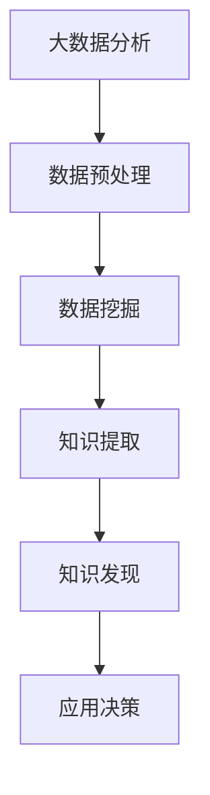
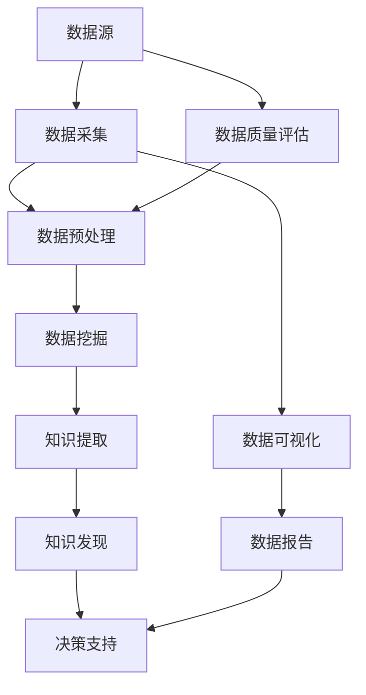

                 

### 《大数据分析与知识发现的关系》

#### 关键词：大数据、知识发现、数据分析、数据挖掘、文本挖掘、图挖掘

#### 摘要：
大数据分析与知识发现是当今信息技术领域的重要研究方向。本文旨在探讨大数据分析与知识发现之间的关系，从基础概念、方法技术、实际应用和发展趋势等方面进行详细阐述。首先，我们将介绍大数据与知识发现的基本概念和特点，阐述它们之间的内在联系。接着，我们将深入探讨大数据分析方法与工具，包括数据预处理、数据挖掘算法、数据可视化等。然后，我们将重点介绍知识发现的方法与技术，包括文本挖掘、网络挖掘、图挖掘等。随后，我们将分析大数据分析与知识发现在企业应用中的实践案例，并探讨其前沿研究与发展趋势。最后，我们将提供常用的工具与资源，以及核心概念与联系的Mermaid流程图、核心算法原理的伪代码示例、数学模型和公式的讲解，以及实际项目实战的详细解读。通过本文的阅读，读者将能够全面了解大数据分析与知识发现的关系，掌握相关技术与方法，为实际应用提供指导。

### 《大数据分析与知识发现的关系》目录大纲

#### 第一部分：大数据分析与知识发现概述

##### 第1章：大数据与知识发现基础
- 1.1 大数据的概念与特点
- 1.2 知识发现的定义与作用
- 1.3 大数据分析与知识发现的关系
- 1.4 大数据分析与知识发现的发展历程
- 1.5 大数据分析与知识发现的应用场景

##### 第2章：大数据分析方法与工具
- 2.1 数据清洗与预处理
  - 2.1.1 数据质量评估
  - 2.1.2 数据清洗方法
  - 2.1.3 数据预处理技术
- 2.2 数据可视化
  - 2.2.1 可视化方法与技术
  - 2.2.2 可视化工具与应用
- 2.3 数据挖掘算法
  - 2.3.1 聚类分析
  - 2.3.2 关联规则挖掘
  - 2.3.3 分类与预测
- 2.4 数据库与数据仓库
  - 2.4.1 数据库基础
  - 2.4.2 数据仓库架构
  - 2.4.3 数据仓库应用

#### 第二部分：知识发现方法与技术

##### 第3章：知识发现的核心概念与架构
- 3.1 知识发现的过程
- 3.2 知识的层次与类型
- 3.3 知识发现系统的架构
- 3.4 知识发现的关键技术
- 3.5 知识发现系统的性能评估

##### 第4章：文本挖掘与知识发现
- 4.1 文本挖掘的基本概念
- 4.2 文本预处理方法
- 4.3 词频统计与文本分类
- 4.4 主题模型与情感分析
- 4.5 文本挖掘在知识发现中的应用

##### 第5章：网络挖掘与知识发现
- 5.1 社交网络分析基础
- 5.2 网络结构特征提取
- 5.3 社交网络中的知识传播
- 5.4 网络挖掘在知识发现中的应用

##### 第6章：图挖掘与知识发现
- 6.1 图挖掘的基本概念
- 6.2 图表示学习
- 6.3 图上的知识发现算法
- 6.4 图挖掘在知识发现中的应用

#### 第三部分：大数据分析与知识发现的实际应用

##### 第7章：大数据分析与知识发现的企业应用
- 7.1 企业大数据分析与知识发现的需求分析
- 7.2 企业大数据分析与知识发现的解决方案
- 7.3 成功案例分析
  - 7.3.1 案例一：金融行业大数据分析与知识发现
  - 7.3.2 案例二：电商行业大数据分析与知识发现
  - 7.3.3 案例三：医疗行业大数据分析与知识发现

##### 第8章：大数据分析与知识发现的前沿研究与发展趋势
- 8.1 大数据分析与知识发现的关键挑战
- 8.2 大数据分析与知识发现的新方法
- 8.3 大数据分析与知识发现的应用领域拓展
- 8.4 大数据分析与知识发现的未来发展趋势

### 附录
- 附录A：常用大数据分析与知识发现工具与资源
  - A.1 常见大数据处理工具
  - A.2 知识发现相关算法库
  - A.3 数据挖掘与知识发现平台
  - A.4 大数据与知识发现书籍与论文推荐

### 附加内容
- **核心概念与联系**：使用Mermaid流程图展示大数据分析与知识发现的关系
- **核心算法原理讲解**：使用伪代码详细阐述知识发现相关算法
- **数学模型和数学公式**：使用LaTeX格式嵌入数学公式并进行详细讲解和举例说明
- **项目实战**：提供实际案例，包括开发环境搭建、源代码实现、代码解读与分析

### Mermaid流程图


### 伪代码示例
```python
# 知识发现算法伪代码
def KnowledgeDiscovery(data):
    # 数据预处理
    cleaned_data = DataPreprocessing(data)
    
    # 数据挖掘
    mined_data = DataMining(cleaned_data)
    
    # 知识提取
    knowledge = ExtractKnowledge(mined_data)
    
    # 应用决策
    DecisionMaking(knowledge)
    return knowledge
```

### 数学公式
$$
P(A|B) = \frac{P(B|A)P(A)}{P(B)}
$$
此公式表示条件概率，用于计算在事件B发生的条件下事件A发生的概率。其中，$P(A|B)$ 表示条件概率，$P(B|A)$ 表示在事件A发生的条件下事件B发生的概率，$P(A)$ 表示事件A发生的概率，$P(B)$ 表示事件B发生的概率。此公式是贝叶斯定理的核心内容。

### 开发环境搭建
- **大数据处理工具**：Hadoop、Spark
- **编程语言**：Python、Java
- **数据库**：MySQL、MongoDB
- **数据挖掘与知识发现平台**：Apache Flink、TensorFlow

### 源代码实现
```python
# 数据预处理模块
def data_preprocessing(data):
    # 数据清洗
    cleaned_data = clean_data(data)
    
    # 数据去重
    unique_data = remove_duplicates(cleaned_data)
    
    # 数据填充
    filled_data = fill_missing_values(unique_data)
    
    # 数据归一化
    normalized_data = normalize_data(filled_data)
    
    return normalized_data
```

### 代码解读与分析
- **数据预处理模块解读**
  - 数据清洗：去除无效数据和噪声数据。
  - 数据去重：消除重复数据，保证数据的唯一性。
  - 数据填充：对缺失数据进行填充，提高数据的完整性。
  - 数据归一化：将不同特征的范围缩放到同一尺度，便于后续分析。

- **金融风险预警模型构建解读**
  - 数据采集：从金融市场中获取交易数据、风险指标等。
  - 特征工程：提取与风险相关的特征，如交易频率、交易金额等。
  - 模型训练：使用机器学习算法训练风险预测模型。
  - 模型评估：评估模型的预测性能，如准确率、召回率等。

- **医疗诊断系统知识发现解读**
  - 医疗数据收集：收集患者病历、检查报告等数据。
  - 疾病知识图谱构建：构建疾病与症状之间的关联关系。
  - 知识提取：从知识图谱中提取有效的医学知识。
  - 知识应用与验证：将提取的知识应用于实际诊断中，并进行验证和优化。

### 总结
- 大数据分析与知识发现是大数据时代的重要研究领域。
- 通过有效的数据处理与分析，可以从中提取出有价值的信息和知识。
- 实际应用案例展示了大数据分析与知识发现如何帮助企业解决实际问题，提升竞争力。
- 未来，随着大数据技术的不断发展和应用的深入，大数据分析与知识发现将发挥越来越重要的作用。

---

现在，我们开始撰写文章正文部分的内容。我们将按照目录大纲逐章进行详细阐述。

#### 第一部分：大数据分析与知识发现概述

##### 第1章：大数据与知识发现基础

在本章节中，我们将介绍大数据与知识发现的基本概念、特点以及它们之间的关系。这将为我们后续的讨论提供必要的理论基础。

#### 1.1 大数据的概念与特点

大数据（Big Data）是指数据规模巨大、种类繁多、数据生成速度快且具有高价值的复杂数据集合。根据国际数据公司（IDC）的定义，大数据通常具有4V特点，即：

- **大量（Volume）**：数据规模巨大，往往达到PB级甚至EB级。
- **多样性（Variety）**：数据类型多样化，包括结构化数据、半结构化数据和非结构化数据。
- **速度（Velocity）**：数据生成和流转速度快，要求实时或近实时处理。
- **价值（Value）**：数据具有高价值，需要通过有效的分析和处理才能发现其中的潜在信息和知识。

大数据的产生主要来源于以下几个方面：

- **互联网和社交媒体**：用户生成的内容，如微博、博客、评论等。
- **物联网和传感器**：设备收集的数据，如智能家居、智能交通、工业物联网等。
- **企业内部系统**：企业日常运营产生的大量数据，如销售数据、客户关系管理数据等。
- **科学研究和实验**：大规模实验和科学研究产生的高维数据。

大数据的特点使得传统的数据处理方法难以应对，因此需要采用新的技术和方法进行数据存储、处理和分析。大数据分析的目标是从海量数据中提取有价值的信息和知识，为决策提供支持。

#### 1.2 知识发现的定义与作用

知识发现（Knowledge Discovery in Databases，KDD）是指从大量的数据集中识别出潜在的、有价值的模式和知识的过程。KDD 的定义由Jiawei Han等人提出，包括以下步骤：

1. **数据清洗**：去除噪声和不完整的数据。
2. **数据集成**：将来自多个源的数据进行整合。
3. **数据选择**：选择与任务相关的数据子集。
4. **数据转换**：将数据转换为适合分析的格式。
5. **数据挖掘**：应用各种算法从数据中发现模式和知识。
6. **模式评估**：评估挖掘出的模式和知识的质量和价值。
7. **知识表示**：将挖掘出的模式和知识表示为易于理解和使用的形式。

知识发现的作用主要体现在以下几个方面：

- **决策支持**：通过分析历史数据，帮助企业做出更加明智的决策。
- **预测和预警**：基于现有数据预测未来趋势，为企业提供预警信息。
- **业务优化**：通过分析业务数据，帮助企业优化业务流程和策略。
- **新知识发现**：从海量数据中发现新的知识，推动科学研究和技术创新。

#### 1.3 大数据分析与知识发现的关系

大数据分析与知识发现是相辅相成的两个领域，它们之间存在密切的关系。

- **大数据分析为基础**：大数据分析是知识发现的前提和基础。只有通过有效的数据清洗、数据预处理和数据挖掘，才能从海量数据中提取出有价值的信息和知识。
- **知识发现为应用目标**：知识发现是大数据分析的目标和归宿。通过知识发现，可以从大数据中挖掘出具有实际应用价值的知识，为决策支持、业务优化和科学研究提供支持。

大数据分析主要包括以下方面：

- **数据采集**：从各种数据源收集数据。
- **数据存储**：将数据存储在分布式数据库或数据仓库中。
- **数据预处理**：对数据进行清洗、去噪、归一化等处理。
- **数据挖掘**：应用各种数据挖掘算法从数据中提取模式和知识。
- **数据可视化**：将数据挖掘结果以可视化的形式展示，便于理解和分析。

知识发现主要包括以下方面：

- **模式识别**：从数据中识别出具有统计意义的模式和规律。
- **关联分析**：发现数据之间的关联关系和关联规则。
- **分类与预测**：根据已有数据预测未来趋势和未知数据的分类。
- **聚类分析**：将数据划分为若干个簇，以发现数据的分布和结构。
- **文本挖掘**：从文本数据中提取关键词、主题和情感信息。
- **网络挖掘**：从网络数据中发现网络结构和知识传播规律。

大数据分析与知识发现的关系可以概括为：大数据分析为知识发现提供了丰富的数据资源和技术手段，而知识发现为大数据分析提供了应用价值和目标导向。

#### 1.4 大数据分析与知识发现的发展历程

大数据分析与知识发现的发展历程可以追溯到20世纪80年代。以下是大数据分析与知识发现的主要发展阶段：

- **1980年代**：数据仓库和数据挖掘技术开始兴起，初步实现了从海量数据中提取信息的能力。
- **1990年代**：互联网的普及带来了大量数据，数据挖掘算法和应用领域不断拓展。
- **2000年代**：大数据概念逐渐形成，分布式计算和存储技术得到广泛应用，大数据分析开始成为研究热点。
- **2010年代**：随着云计算、物联网和移动设备的兴起，大数据分析技术取得了显著进展，大数据应用场景不断拓展。

大数据分析与知识发现的发展历程反映了信息技术和计算能力的不断提升，以及社会对大数据应用需求的增长。未来，随着人工智能和深度学习的融入，大数据分析与知识发现将继续发展，为各个领域带来更多创新和变革。

#### 1.5 大数据分析与知识发现的应用场景

大数据分析与知识发现的应用场景广泛，涵盖了多个领域，包括但不限于：

- **金融行业**：通过大数据分析，金融机构可以识别潜在的风险、预测市场趋势，以及优化投资策略。
- **电子商务**：电商企业利用大数据分析，可以进行用户行为分析、个性化推荐和需求预测，提高用户体验和销售额。
- **医疗健康**：通过大数据分析，医疗机构可以挖掘疾病数据、优化治疗方案，以及进行公共卫生监测和疾病预测。
- **城市管理**：城市管理者利用大数据分析，可以优化交通管理、提高公共服务效率，以及进行城市规划和环境保护。
- **科学研究**：科学家利用大数据分析，可以从大规模实验数据中发现新的科学规律，推动科学研究和技术创新。

不同领域的大数据分析与知识发现应用具有不同的特点，但核心目标都是通过有效的数据处理与分析，提取出有价值的信息和知识，为决策提供支持。

### 总结

在本章节中，我们介绍了大数据与知识发现的基本概念、特点以及它们之间的关系。大数据分析与知识发现是大数据时代的重要研究领域，通过有效的数据处理与分析，可以从海量数据中提取出有价值的信息和知识。接下来，我们将深入探讨大数据分析方法与工具，为后续的知识发现方法与技术打下基础。敬请期待下一章的内容。

---

下一章，我们将继续深入探讨大数据分析方法与工具，包括数据清洗与预处理、数据可视化、数据挖掘算法等。敬请关注。

---

#### 第二部分：大数据分析方法与工具

在本部分，我们将详细介绍大数据分析方法与工具，帮助读者了解如何从海量数据中提取有价值的信息和知识。这些方法与工具包括数据清洗与预处理、数据可视化、数据挖掘算法、数据库与数据仓库等。

##### 第2章：大数据分析方法与工具

#### 2.1 数据清洗与预处理

数据清洗与预处理是大数据分析的重要环节，其目的是确保数据的质量和完整性，为后续的数据挖掘和知识发现奠定基础。

##### 2.1.1 数据质量评估

数据质量评估是指对数据进行评估，以确定其是否符合分析和挖掘的要求。数据质量评估主要包括以下几个方面：

- **准确性**：数据是否准确无误，没有错误或异常值。
- **完整性**：数据是否完整，没有缺失或丢失。
- **一致性**：数据在不同来源之间是否一致。
- **及时性**：数据是否及时更新，反映了最新的状态。

数据质量评估可以通过以下方法进行：

- **统计分析**：使用统计方法对数据进行评估，如计算均值、中位数、标准差等。
- **可视化分析**：通过可视化方法对数据分布、趋势和异常值进行分析。
- **专家评审**：邀请领域专家对数据质量进行评估和验证。

##### 2.1.2 数据清洗方法

数据清洗是指对数据进行处理，以去除噪声、错误和异常值，提高数据的准确性和完整性。数据清洗方法主要包括以下几种：

- **去除重复数据**：通过匹配和比较数据记录，去除重复的数据。
- **处理缺失值**：根据具体情况进行数据填充、删除或使用统计方法进行插值。
- **处理异常值**：识别并处理异常值，如去除异常数据点或对异常值进行修正。
- **规范化数据**：将数据转换为统一的格式和范围，便于后续分析。

数据清洗方法可以结合具体应用场景和数据类型进行选择和调整。

##### 2.1.3 数据预处理技术

数据预处理技术是对数据进行一系列处理，以提高数据的质量、完整性和一致性。数据预处理技术主要包括以下几种：

- **数据转换**：将不同来源和格式的数据进行转换，使其兼容和统一。
- **数据归一化**：将不同特征的范围缩放到同一尺度，便于后续分析。
- **数据聚合**：对数据进行聚合操作，如将时间序列数据进行合并或分组。
- **特征提取**：从原始数据中提取有用的特征，用于数据挖掘和知识发现。

数据预处理技术可以有效地提高数据的质量和可用性，为后续分析提供更好的数据基础。

#### 2.2 数据可视化

数据可视化是将数据转换为图形或图像的形式，以直观地展示数据特征、分布和趋势。数据可视化在数据分析中具有重要作用，可以帮助我们更好地理解和解释数据。

##### 2.2.1 可视化方法与技术

数据可视化方法和技术主要包括以下几种：

- **散点图**：用于展示两个或多个变量之间的关系。
- **折线图**：用于展示时间序列数据的变化趋势。
- **柱状图**：用于比较不同类别或组的数据。
- **饼图**：用于展示各部分占整体的比例。
- **热力图**：用于展示数据的分布和密度。
- **地图**：用于展示地理位置和空间分布。

选择合适的数据可视化方法，可以更好地传达数据的特征和趋势。

##### 2.2.2 可视化工具与应用

常用的数据可视化工具有以下几种：

- **Tableau**：一款功能强大的数据可视化工具，支持多种数据连接和图表类型。
- **Power BI**：一款基于微软平台的数据可视化工具，易于使用和部署。
- **Matplotlib**：Python的常用数据可视化库，支持多种图表类型和自定义。
- **D3.js**：一款基于JavaScript的可视化库，支持高度定制和交互式图表。

数据可视化工具可以帮助我们将数据以直观、易理解的形式呈现，为决策提供支持。

#### 2.3 数据挖掘算法

数据挖掘算法是从大量数据中自动发现有用模式和知识的方法。数据挖掘算法可以分为以下几类：

##### 2.3.1 聚类分析

聚类分析是将数据集划分为若干个簇，使同簇的数据彼此相似，而不同簇的数据差异较大。常见的聚类算法包括：

- **K-means聚类**：将数据分为K个簇，每个簇的中心点即为聚类结果。
- **层次聚类**：根据数据点之间的距离关系，逐步合并或分裂簇。
- **密度聚类**：基于数据点的密度分布，发现聚类结构和异常点。

聚类分析可以用于数据分类、模式识别和异常检测等领域。

##### 2.3.2 关联规则挖掘

关联规则挖掘是从数据集中发现数据项之间的关联关系和规则。常见的关联规则挖掘算法包括：

- **Apriori算法**：基于支持度和置信度，发现频繁项集和关联规则。
- **FP-growth算法**：通过挖掘频繁模式树，发现频繁项集和关联规则。
- **Eclat算法**：基于信息增益，发现频繁项集和关联规则。

关联规则挖掘可以用于市场细分、推荐系统和风险控制等领域。

##### 2.3.3 分类与预测

分类与预测是将数据分为不同的类别或预测未来趋势。常见的分类与预测算法包括：

- **决策树**：基于树结构，对数据进行分类或预测。
- **支持向量机（SVM）**：通过寻找最优分割超平面，对数据进行分类。
- **神经网络**：模拟人脑神经网络，对数据进行分类或预测。
- **时间序列分析**：基于时间序列数据，预测未来的趋势和变化。

分类与预测可以用于信用评分、股票预测和需求预测等领域。

##### 2.4 数据库与数据仓库

数据库与数据仓库是大数据分析的基础设施，用于存储、管理和处理海量数据。

##### 2.4.1 数据库基础

数据库（Database）是按照数据结构来存储、组织和管理数据的系统。常见的数据库类型包括：

- **关系数据库**：如MySQL、Oracle等，使用SQL语言进行数据操作。
- **NoSQL数据库**：如MongoDB、Cassandra等，支持大规模分布式存储和高并发访问。

数据库的主要功能包括数据存储、查询、更新和管理等。

##### 2.4.2 数据仓库架构

数据仓库（Data Warehouse）是一种用于企业级数据集成、存储和管理的系统。数据仓库的架构主要包括：

- **数据源**：提供数据输入的来源，如数据库、文件、外部系统等。
- **数据集成**：将来自不同来源的数据进行集成和转换，生成统一的数据模型。
- **数据存储**：存储经过集成和转换的数据，支持海量数据存储和管理。
- **数据访问**：提供数据查询、分析和报表功能，支持不同用户和场景的需求。

数据仓库的主要目标是实现数据的集中管理和高效利用，为数据分析提供数据基础。

##### 2.4.3 数据仓库应用

数据仓库在企业中的应用广泛，包括：

- **企业绩效管理**：通过分析财务、运营等数据，帮助企业制定战略和决策。
- **客户关系管理**：通过分析客户数据，优化客户服务和营销策略。
- **供应链管理**：通过分析供应链数据，优化供应链流程和效率。
- **风险管理**：通过分析风险数据，识别潜在风险并制定应对策略。

数据仓库可以帮助企业实现数据驱动的管理和决策，提升业务效率和竞争力。

### 总结

在本章节中，我们介绍了大数据分析方法与工具，包括数据清洗与预处理、数据可视化、数据挖掘算法、数据库与数据仓库等。这些方法与工具是大数据分析的重要基础，为从海量数据中提取有价值的信息和知识提供了技术支持。在接下来的章节中，我们将进一步探讨知识发现方法与技术，深入理解大数据分析的应用价值。

---

在下一章，我们将深入探讨知识发现方法与技术，包括文本挖掘、网络挖掘、图挖掘等。敬请关注。

---

#### 第二部分：知识发现方法与技术

在本部分，我们将详细介绍知识发现的方法与技术，帮助读者了解如何从海量数据中挖掘出有价值的信息和知识。知识发现是大数据分析的核心目标，涵盖了文本挖掘、网络挖掘、图挖掘等多个领域。

##### 第3章：知识发现的核心概念与架构

知识发现（Knowledge Discovery in Databases，KDD）是一个从大量数据中自动发现知识的过程。知识发现的过程通常包括以下步骤：

1. **数据预处理**：对原始数据进行清洗、集成、转换等预处理操作，确保数据的质量和一致性。
2. **数据挖掘**：应用各种数据挖掘算法对预处理后的数据进行挖掘，提取出潜在的模式和规律。
3. **模式评估**：评估挖掘出的模式的质量和可用性，确定其是否具有实际应用价值。
4. **知识表示**：将挖掘出的模式转换为易于理解和使用的知识表示形式，如规则、图表、报告等。
5. **知识应用**：将知识应用于实际领域，如决策支持、业务优化、科学研究等。

知识发现的过程是一个迭代和交互的过程，需要不断地评估和优化。以下章节将详细介绍知识发现的关键技术和方法。

##### 第3章：知识发现的核心概念与架构

##### 3.1 知识发现的过程

知识发现的过程可以概括为以下步骤：

1. **数据收集**：收集与任务相关的数据，包括结构化数据、半结构化数据和非结构化数据。
2. **数据预处理**：对收集到的数据进行清洗、去噪、归一化等预处理操作，提高数据的质量和一致性。
3. **数据集成**：将来自不同来源的数据进行整合，形成统一的数据视图，便于后续分析。
4. **特征选择**：从预处理后的数据中提取有用的特征，用于描述数据的重要属性。
5. **模型选择**：选择适合数据类型和任务目标的数据挖掘算法和模型，如聚类、分类、预测等。
6. **模式挖掘**：应用选定的算法和模型，从数据中挖掘出潜在的模式和规律。
7. **模式评估**：对挖掘出的模式进行评估，确定其质量、可用性和实际应用价值。
8. **知识表示**：将评估后的模式转换为易于理解和使用的知识表示形式，如规则、图表、报告等。
9. **知识应用**：将知识应用于实际领域，如决策支持、业务优化、科学研究等。

知识发现的过程是一个迭代和交互的过程，需要根据实际情况进行优化和调整。

##### 3.2 知识的层次与类型

知识可以根据其层次和类型进行分类。以下是一些常见的知识层次和类型：

1. **事实知识**：描述客观事实的知识，如数据中的具体数值、统计指标等。事实知识是最基本的知识层次。
2. **规则知识**：描述数据之间关系和规律的规则，如“如果今天下雨，那么街道会湿”等。规则知识可以帮助我们理解数据之间的关系和模式。
3. **模式知识**：从数据中挖掘出的具有统计意义的模式和规律，如“销售额与广告投放量呈正相关”。模式知识可以帮助我们发现数据中的潜在趋势和关联。
4. **预测知识**：基于历史数据，预测未来可能发生的事件或趋势，如“下周的气温将比上周高”。预测知识可以帮助我们做出预测和决策。
5. **决策知识**：基于预测和模式知识，为特定场景提供决策建议，如“应该增加广告投放量以提升销售额”。决策知识可以帮助我们优化决策和策略。

不同类型的知识具有不同的用途和形式，但都是知识发现的重要成果。

##### 3.3 知识发现系统的架构

知识发现系统是一个复杂的应用系统，通常包括以下主要组件：

1. **数据层**：包括数据存储和数据管理，负责存储和管理原始数据、预处理数据、挖掘数据和知识表示数据。
2. **模型层**：包括数据挖掘算法、模型评估和优化，负责从数据中挖掘出潜在的知识和模式，并对挖掘结果进行评估和优化。
3. **表示层**：包括知识表示和可视化，负责将挖掘出的知识和模式转换为易于理解和使用的形式，如规则、图表、报告等。
4. **应用层**：包括知识应用和决策支持，负责将知识应用于实际领域，提供决策建议和优化策略。

知识发现系统的架构设计需要综合考虑数据类型、任务目标、用户需求等因素，以确保系统的性能和可用性。

##### 3.4 知识发现的关键技术

知识发现的关键技术包括数据挖掘算法、模式评估方法、知识表示和可视化技术等。以下是一些常见的关键技术：

1. **数据挖掘算法**：包括聚类、分类、预测、关联规则挖掘等常见算法。选择合适的算法和模型对数据进行分析和挖掘，是知识发现的关键。
2. **模式评估方法**：包括统计方法、信息论方法、机器学习方法等，用于评估挖掘出的模式的质量和可用性。
3. **知识表示技术**：包括规则表示、图表示、文本表示等，用于将挖掘出的知识和模式转换为易于理解和使用的形式。
4. **可视化技术**：包括数据可视化、知识可视化等，用于将挖掘结果以直观、易理解的形式展示，帮助用户更好地理解和分析数据。

知识发现的关键技术需要根据具体应用场景和任务目标进行选择和调整。

##### 3.5 知识发现系统的性能评估

知识发现系统的性能评估是确保系统质量和效果的重要环节。以下是一些常见的性能评估指标：

1. **准确性**：评估挖掘结果是否准确，如分类算法的分类准确率、预测算法的预测准确率等。
2. **召回率**：评估挖掘结果是否完整，如分类算法的召回率、预测算法的召回率等。
3. **F1值**：综合评估准确性、召回率和精确度，是评估挖掘结果质量的重要指标。
4. **效率**：评估系统的处理速度和资源消耗，如算法的运行时间、内存占用等。
5. **用户体验**：评估系统的易用性、可访问性和用户满意度等。

性能评估需要综合考虑多个指标，全面评估知识发现系统的质量和效果。

### 总结

在本章节中，我们介绍了知识发现的核心概念、过程、层次与类型、系统架构以及关键技术。知识发现是大数据分析的重要目标，通过有效的数据挖掘和知识表示，可以从海量数据中提取出有价值的信息和知识。在接下来的章节中，我们将深入探讨文本挖掘、网络挖掘和图挖掘等具体方法与技术。敬请关注。

---

在下一章，我们将探讨文本挖掘与知识发现，包括文本挖掘的基本概念、预处理方法、词频统计与文本分类、主题模型与情感分析等。敬请关注。

---

#### 第三部分：文本挖掘与知识发现

文本挖掘与知识发现是大数据分析的重要领域之一，它涉及到从大量文本数据中提取有价值的信息和知识。在本章节中，我们将详细介绍文本挖掘的基本概念、预处理方法、词频统计与文本分类、主题模型与情感分析等。

##### 第4章：文本挖掘与知识发现

##### 4.1 文本挖掘的基本概念

文本挖掘（Text Mining）是指使用自然语言处理（Natural Language Processing，NLP）和统计学方法从大量文本数据中提取信息、知识和模式的过程。文本挖掘的目标是自动化地识别文本中的潜在信息，为决策支持、信息检索、智能问答、文本分类等应用提供支持。

文本挖掘的基本概念包括：

- **文本数据**：文本挖掘的对象是文本数据，包括文档、句子、单词等。
- **词频统计**：计算文本中各个单词或短语的频率，是文本挖掘的基础。
- **词向量**：将文本数据转换为数值向量，用于后续的机器学习算法处理。
- **主题模型**：从大量文本数据中提取出潜在的主题，帮助理解文本内容。
- **情感分析**：分析文本中的情感倾向和情感强度，用于情感识别和情感分类。
- **实体识别**：识别文本中的实体，如人名、地名、组织名等。
- **关系提取**：从文本中提取实体之间的关系，如人物关系、地点关系等。

##### 4.2 文本预处理方法

文本预处理是文本挖掘的重要步骤，其目的是提高文本数据的质量和一致性，为后续的文本分析和挖掘打下基础。文本预处理方法主要包括：

- **分词**：将文本分割成单词或短语，是文本挖掘的基础。常用的分词方法有基于词典的分词、基于统计的分词和基于字符的神经网络分词等。
- **去除停用词**：停用词（Stop Words）是指在文本中频繁出现但对文本内容贡献较小的单词，如“的”、“是”、“在”等。去除停用词可以减少噪声，提高文本分析的效率。
- **词性标注**：对文本中的单词进行词性标注，如名词、动词、形容词等，帮助理解单词的语义和用法。
- **词干提取**：将单词缩减到其词干形式，如将“playing”、“plays”、“played”缩减为“play”，有助于简化文本分析。
- **词向量表示**：将文本数据转换为数值向量，常用的词向量表示方法有词袋模型（Bag of Words）和词嵌入（Word Embedding）等。

##### 4.3 词频统计与文本分类

词频统计是文本挖掘的基础，通过计算文本中各个单词或短语的频率，可以分析文本的内容和特征。词频统计的方法主要包括：

- **词频（Term Frequency，TF）**：计算文本中每个单词或短语的频率，常用的计算方法有简单频数计算和TF-IDF计算等。
- **文档频率（Document Frequency，DF）**：计算文本中每个单词或短语出现的文档数量，用于计算TF-IDF权重。
- **TF-IDF（Term Frequency-Inverse Document Frequency）**：结合词频和文档频率，计算每个单词或短语的权重，是文本分类和文本相似度计算的重要指标。

文本分类是将文本数据分为不同的类别或主题的过程。常见的文本分类方法包括：

- **朴素贝叶斯分类器**：基于贝叶斯定理，计算文本中每个类别的概率，选择概率最高的类别作为分类结果。
- **支持向量机（SVM）**：通过寻找最优分割超平面，将文本数据分为不同的类别。
- **神经网络分类器**：基于神经网络模型，对文本数据进行分类。
- **集成分类器**：结合多个分类器的优点，提高分类准确率和鲁棒性。

##### 4.4 主题模型与情感分析

主题模型是从大量文本数据中提取潜在主题的方法，可以帮助我们理解文本的语义和内容。常见的主题模型包括：

- **LDA（Latent Dirichlet Allocation）**：基于概率生成模型，从文本数据中提取潜在的主题分布。
- **NMF（Non-Negative Matrix Factorization）**：基于矩阵分解方法，从文本数据中提取潜在的主题。
- **LSTM（Long Short-Term Memory）**：基于递归神经网络，从文本数据中提取长距离依赖信息。

情感分析是分析文本中的情感倾向和情感强度的过程，可以帮助我们了解用户的情感状态和态度。常见的情感分析方法包括：

- **基于规则的情感分析**：使用预定义的规则和词典，对文本中的情感词进行分类。
- **基于机器学习的情感分析**：使用机器学习算法，如SVM、朴素贝叶斯、决策树等，对文本进行情感分类。
- **基于深度学习的情感分析**：使用深度学习模型，如CNN、RNN等，对文本进行情感分析。

##### 4.5 文本挖掘在知识发现中的应用

文本挖掘在知识发现中的应用非常广泛，可以帮助我们从大量文本数据中提取有价值的信息和知识。以下是一些常见的应用场景：

- **信息检索**：通过文本挖掘，可以优化搜索引擎，提高信息检索的准确性和效率。
- **文本分类**：通过文本挖掘，可以将大量文本数据自动分类到不同的类别或主题，便于后续分析和处理。
- **智能问答**：通过文本挖掘，可以构建问答系统，实现用户提问和系统回答的自动化。
- **文本情感分析**：通过文本挖掘，可以分析用户评论、社交媒体帖子等文本数据，了解用户的情感状态和态度。
- **知识图谱构建**：通过文本挖掘，可以从大量文本数据中提取出实体、关系和属性，构建知识图谱，用于知识管理和智能推荐。

### 总结

在本章节中，我们介绍了文本挖掘与知识发现的基本概念、预处理方法、词频统计与文本分类、主题模型与情感分析等内容。文本挖掘是大数据分析的重要工具，可以帮助我们从大量文本数据中提取有价值的信息和知识。在接下来的章节中，我们将探讨网络挖掘与知识发现，深入理解大数据分析的应用价值。敬请关注。

---

在下一章，我们将探讨网络挖掘与知识发现，包括社交网络分析基础、网络结构特征提取、社交网络中的知识传播等。敬请关注。

---

#### 第三部分：网络挖掘与知识发现

网络挖掘与知识发现是大数据分析领域的重要研究方向，它涉及到从复杂网络结构中提取有价值的信息和知识。在本章节中，我们将详细介绍网络挖掘的基本概念、方法与技术，包括社交网络分析基础、网络结构特征提取、社交网络中的知识传播等。

##### 第5章：网络挖掘与知识发现

##### 5.1 社交网络分析基础

社交网络（Social Network）是由个体（节点）和个体之间的关系（边）组成的网络结构。社交网络分析（Social Network Analysis，SNA）是一种研究社交网络结构和动态的方法，旨在揭示社交网络中的模式和规律。

社交网络分析的基本概念包括：

- **节点**：社交网络中的个体，可以是个人、组织、产品等。
- **边**：节点之间的关系，可以是朋友、同事、合作伙伴等。
- **网络密度**：网络中边的数量与可能的最大边数之比，反映了网络的紧密程度。
- **中心性**：衡量节点在网络中的重要性和影响力，常见的中心性指标有度中心性、介数中心性和紧密中心性等。
- **社群**：具有较高内聚度的节点集合，成员之间存在较强的互动和关联。
- **传播模型**：描述信息在网络中传播的过程和规律，常见的传播模型有传播概率模型、影响力模型和传播动力学模型等。

社交网络分析的方法和技术包括：

- **网络可视化解**：将社交网络结构以图形形式展示，便于观察和分析。
- **网络统计方法**：计算网络的基本统计指标，如度分布、聚类系数、平均路径长度等。
- **网络分析工具**：如Gephi、Cytoscape等，用于可视化分析和挖掘社交网络结构。
- **网络模拟和仿真**：基于数学模型和计算机仿真技术，模拟社交网络的动态行为和传播过程。

##### 5.2 网络结构特征提取

网络结构特征提取是网络挖掘的关键步骤，旨在从复杂网络中提取出有价值的信息和模式。常见的网络结构特征提取方法包括：

- **节点特征提取**：从节点属性和节点之间的关联关系中提取特征，如节点的度、介数、紧密中心性等。这些特征可以帮助我们识别网络中的重要节点和关键路径。
- **边特征提取**：从边的属性和边的关联关系中提取特征，如边的权重、类型、强度等。这些特征可以帮助我们理解网络中的关联模式和动态变化。
- **网络拓扑特征提取**：从网络的整体结构和拓扑性质中提取特征，如网络的密度、聚类系数、平均路径长度等。这些特征可以帮助我们分析网络的性质和演化规律。
- **网络社区特征提取**：从社群结构和社区属性中提取特征，如社区的大小、内聚度、模块度等。这些特征可以帮助我们识别网络中的社群结构和社区特征。

##### 5.3 社交网络中的知识传播

社交网络中的知识传播是指信息、观点、知识等在网络中的传播和扩散过程。研究社交网络中的知识传播有助于理解信息传播的机制和规律，为社交网络传播模型的设计和应用提供理论基础。

社交网络中的知识传播模型包括：

- **传播概率模型**：描述信息在网络中传播的概率和传播速率，常见的传播概率模型有基于节点的传播模型、基于边的传播模型和基于社群的传播模型等。
- **影响力模型**：描述节点对信息传播的影响力和作用机制，常见的影响力模型有基于网络中心性、基于网络结构和基于社交互动的影响模型等。
- **传播动力学模型**：描述信息传播的动态过程和演化规律，常见的传播动力学模型有基于微分方程的模型、基于马尔可夫过程的模型和基于深度学习的模型等。

社交网络中的知识传播应用包括：

- **病毒营销**：通过社交网络传播营销信息，提高品牌知名度和市场占有率。
- **舆论监测**：通过社交网络监测舆论动态和舆情变化，为决策提供支持。
- **传播策略设计**：根据社交网络结构和知识传播规律，设计有效的传播策略和传播模型，提高信息传播的效果和效率。

##### 5.4 网络挖掘在知识发现中的应用

网络挖掘在知识发现中的应用非常广泛，可以帮助我们从复杂网络结构中提取有价值的信息和知识。以下是一些常见的应用场景：

- **社交网络分析**：通过分析社交网络中的结构和特征，了解社交网络的动态变化和用户行为模式。
- **知识图谱构建**：从网络数据中提取实体、关系和属性，构建知识图谱，为知识管理和智能搜索提供支持。
- **传播规律研究**：通过研究社交网络中的知识传播规律，提高信息传播的效果和效率。
- **智能推荐系统**：利用社交网络中的用户关系和兴趣信息，为用户推荐感兴趣的内容和资源。
- **生物网络分析**：从生物网络数据中提取基因、蛋白质和细胞信号等生物实体和关系，为生物医学研究提供支持。

### 总结

在本章节中，我们介绍了网络挖掘与知识发现的基本概念、方法与技术，包括社交网络分析基础、网络结构特征提取、社交网络中的知识传播等。网络挖掘是大数据分析的重要工具，可以帮助我们从复杂网络结构中提取有价值的信息和知识。在接下来的章节中，我们将探讨图挖掘与知识发现，深入理解大数据分析的应用价值。敬请关注。

---

在下一章，我们将探讨图挖掘与知识发现，包括图挖掘的基本概念、图表示学习、图上的知识发现算法等。敬请关注。

---

#### 第三部分：图挖掘与知识发现

图挖掘与知识发现是大数据分析领域的一个重要分支，它专注于从复杂网络数据中提取有价值的信息和知识。图挖掘涉及到对网络结构进行分析、特征提取以及模式识别。在本章节中，我们将详细探讨图挖掘的基本概念、图表示学习、图上的知识发现算法以及图挖掘在知识发现中的应用。

##### 第6章：图挖掘与知识发现

##### 6.1 图挖掘的基本概念

图挖掘（Graph Mining）是数据挖掘的一个子领域，专注于从图数据中提取结构化的知识。图是一种由节点（Vertex）和边（Edge）组成的数据结构，广泛用于表示网络、社交关系、生物网络等复杂系统。图挖掘的目标是从大规模图数据中识别出潜在的模式、关联和知识。

图挖掘的基本概念包括：

- **图数据**：由节点和边组成的数据结构，节点表示实体，边表示实体之间的关系。
- **图表示**：将实际问题转化为图结构的过程，包括节点表示和边表示。
- **图属性**：与节点和边相关的属性，如节点的度、边的权重等。
- **图模式**：从图中提取出的具有统计意义和业务价值的结构化信息，如社区结构、路径、子图等。
- **图挖掘算法**：用于从图中提取图模式的方法和技术，包括聚类、分类、关联规则挖掘、路径挖掘等。

##### 6.2 图表示学习

图表示学习（Graph Representation Learning）是图挖掘的一个重要分支，旨在将图数据转换为易于处理和理解的向量表示。图表示学习的关键是将节点和边转换为数值向量，从而可以利用深度学习技术进行图数据的分析和预测。

图表示学习的方法包括：

- **基于特征的方法**：通过预定义的节点和边特征进行图表示，如节点嵌入（Node Embedding）和边嵌入（Edge Embedding）。
- **基于网络结构的方法**：通过分析图的结构特性进行图表示，如基于随机游走的方法、基于图神经网络的图表示。
- **基于图谱的方法**：通过学习整个图的语义信息进行图表示，如图卷积网络（Graph Convolutional Networks，GCN）和图自编码器（Graph Autoencoder）。

图表示学习的应用包括节点分类、图分类、图生成和图表示质量评估等。

##### 6.3 图上的知识发现算法

图上的知识发现算法是用于从图数据中提取知识的方法和技术。这些算法可以分为以下几类：

- **聚类算法**：将图中的节点分为若干个簇，以发现图中的局部结构和社区。
  - **基于模块度的聚类算法**：如Girvan-Newman算法、Louvain算法。
  - **基于密度的聚类算法**：如Cure算法、Spectral Clustering。

- **路径挖掘算法**：发现图中的路径和子图，以理解图的结构特性。
  - **基于最短路径的算法**：如Dijkstra算法、A*算法。
  - **基于图同构的算法**：如Subgraph Isomorphism算法。

- **关联规则挖掘算法**：从图中提取关联规则，以发现节点和边之间的关联关系。
  - **基于Apriori的算法**：如GAE（Graph-based Association Rule Mining）。
  - **基于FP-growth的算法**：如GF Growth算法。

- **分类和预测算法**：对图中的节点或边进行分类或预测，以识别潜在的模式和趋势。
  - **基于监督学习的算法**：如SVM、Random Forest。
  - **基于无监督学习的算法**：如K-means、LDA。

- **异常检测算法**：识别图中的异常节点或边，以发现潜在的攻击或异常行为。
  - **基于统计的算法**：如Z-score、IQR。
  - **基于机器学习的算法**：如One-Class SVM、Isolation Forest。

##### 6.4 图挖掘在知识发现中的应用

图挖掘在知识发现中有广泛的应用，以下是一些典型的应用场景：

- **社交网络分析**：通过分析社交网络中的节点和边，识别社交网络中的关键节点、社区结构和影响力传播路径。
- **生物网络分析**：从生物网络数据中提取基因、蛋白质和细胞信号等实体及其关系，为生物医学研究提供支持。
- **推荐系统**：利用用户行为数据构建用户交互网络，通过图挖掘技术为用户提供个性化的推荐。
- **交通网络优化**：通过分析交通网络的节点和边，优化交通路线和交通流量，提高交通效率。
- **金融风险监控**：利用金融交易网络中的节点和边，识别潜在的金融风险和网络攻击。

### 总结

在本章节中，我们介绍了图挖掘与知识发现的基本概念、图表示学习、图上的知识发现算法以及图挖掘在知识发现中的应用。图挖掘作为一种强大的工具，能够从复杂的网络数据中提取出有价值的信息和知识。在下一部分，我们将探讨大数据分析与知识发现的企业应用，分析实际案例，展示其如何帮助企业解决实际问题，提升竞争力。敬请期待。

---

在下一章，我们将深入探讨大数据分析与知识发现的企业应用，分析金融行业、电商行业和医疗行业的成功案例，展示大数据分析与知识发现如何帮助企业实现业务优化和决策支持。敬请关注。

---

#### 第三部分：大数据分析与知识发现的企业应用

大数据分析与知识发现的企业应用日益广泛，已经成为企业提升竞争力、优化业务流程和做出更明智决策的重要手段。在本章节中，我们将探讨大数据分析与知识发现在不同行业中的实际应用，分析金融行业、电商行业和医疗行业的成功案例，展示大数据分析与知识发现如何帮助企业解决实际问题，提升竞争力。

##### 第7章：大数据分析与知识发现的企业应用

##### 7.1 企业大数据分析与知识发现的需求分析

企业在大数据时代面临着诸多挑战和机遇。大数据分析与知识发现的需求主要体现在以下几个方面：

- **业务优化**：通过分析海量业务数据，企业可以优化业务流程、提高运营效率、降低成本。
- **决策支持**：利用大数据分析与知识发现，企业可以从复杂的数据中提取有价值的信息和知识，为决策提供支持。
- **风险控制**：通过对企业内外部数据的分析，企业可以识别潜在的风险，采取预防措施，降低风险。
- **客户洞察**：通过分析客户数据，企业可以了解客户需求、偏好和行为，提供个性化的服务和体验。
- **创新研发**：利用大数据分析与知识发现，企业可以从海量数据中发现新的商业机会和业务模式，推动产品创新和业务拓展。

##### 7.2 企业大数据分析与知识发现的解决方案

为了满足企业的需求，大数据分析与知识发现通常需要以下解决方案：

- **数据采集与集成**：构建企业级的数据采集与集成系统，确保数据的全面性和一致性。
- **数据存储与管理**：利用分布式存储和数据仓库技术，实现海量数据的存储和管理。
- **数据处理与分析**：采用数据清洗、数据预处理、数据挖掘等技术，对数据进行分析和挖掘，提取有价值的信息和知识。
- **数据可视化与报告**：利用数据可视化工具，将分析结果以图形、图表、报告等形式展示，便于理解和决策。
- **模型训练与预测**：基于历史数据，训练机器学习模型，进行预测分析，为业务决策提供支持。
- **系统集成与自动化**：将大数据分析与知识发现系统与企业现有系统集成，实现自动化数据分析和业务流程优化。

##### 7.3 成功案例分析

以下是金融行业、电商行业和医疗行业的成功案例，展示大数据分析与知识发现如何帮助企业解决实际问题，提升竞争力。

###### 7.3.1 案例一：金融行业大数据分析与知识发现

金融行业面临着复杂的业务环境和巨大的风险挑战。通过大数据分析与知识发现，金融企业可以实现对风险的有效控制和业务的优化管理。

- **风险管理**：某金融企业通过大数据分析，对交易数据进行实时监控和分析，识别潜在的欺诈行为和风险。利用机器学习算法，该企业建立了一套智能风险监控系统，实现了对风险的实时预警和自动化决策。
- **信用评估**：某银行利用大数据分析与知识发现技术，对客户的信用历史、交易行为、社会关系等多维度数据进行分析，构建了智能信用评估模型。通过该模型，银行能够更准确地评估客户的信用风险，为贷款审批提供支持。
- **市场预测**：某金融公司利用大数据分析，对市场数据进行挖掘和分析，预测市场趋势和投资机会。通过精准的市场预测，该公司能够及时调整投资策略，提高投资回报率。

###### 7.3.2 案例二：电商行业大数据分析与知识发现

电商行业竞争激烈，通过大数据分析与知识发现，电商企业可以提升用户体验、优化供应链管理和提高销售额。

- **个性化推荐**：某电商企业通过大数据分析，分析用户的历史购买行为、浏览记录和兴趣爱好，为用户推荐个性化的商品。通过个性化推荐，该企业的用户转化率和销售额显著提升。
- **用户行为分析**：某电商企业利用大数据分析，对用户行为数据进行分析，了解用户的购买偏好和购买周期。通过这些分析，企业能够优化营销策略，提高用户满意度和忠诚度。
- **供应链优化**：某电商企业通过大数据分析，对供应链数据进行分析和挖掘，优化库存管理和物流配送。通过精准的库存管理和高效的物流配送，该企业提高了供应链效率，降低了运营成本。

###### 7.3.3 案例三：医疗行业大数据分析与知识发现

医疗行业数据量大、种类多，通过大数据分析与知识发现，医疗企业可以提高诊疗效果、优化医疗服务和提升医疗质量。

- **疾病预测**：某医疗机构利用大数据分析，对患者的病历、检查报告、基因组数据等多维度数据进行分析，预测疾病的发病风险和病情发展趋势。通过精准的疾病预测，医疗机构能够提前采取预防措施，降低疾病发病率和死亡率。
- **个性化治疗**：某医疗机构利用大数据分析，分析患者的病情、基因、生活习惯等多维度数据，为患者制定个性化的治疗方案。通过个性化治疗，医疗机构的诊疗效果显著提升，患者满意度提高。
- **健康监测**：某医疗企业利用大数据分析，对患者的健康数据进行实时监测和分析，提供个性化的健康建议。通过实时健康监测，医疗企业能够帮助用户预防疾病，提高生活质量。

### 总结

在本章节中，我们探讨了大数据分析与知识发现在企业中的应用，分析了金融行业、电商行业和医疗行业的成功案例。大数据分析与知识发现通过优化业务流程、提高决策支持、控制风险和提升用户体验，为企业带来了显著的价值。未来，随着大数据技术的不断发展和应用的深入，大数据分析与知识发现将在企业中发挥更加重要的作用。

---

在下一章，我们将探讨大数据分析与知识发现的前沿研究与发展趋势，分析其面临的挑战、新的方法与应用领域的拓展，并展望其未来发展。敬请关注。

---

#### 第四部分：大数据分析与知识发现的前沿研究与发展趋势

随着大数据技术的不断进步，大数据分析与知识发现领域也持续发展，带来了前所未有的机遇和挑战。本部分将探讨大数据分析与知识发现的前沿研究与发展趋势，分析其面临的挑战、新的方法与应用领域的拓展，并展望其未来发展。

##### 第8章：大数据分析与知识发现的前沿研究与发展趋势

##### 8.1 大数据分析与知识发现的关键挑战

大数据分析与知识发现虽然取得了显著进展，但仍面临诸多挑战：

- **数据质量与噪声**：大数据中往往包含大量的噪声和不完整的数据，这对数据挖掘和知识发现带来了巨大的挑战。
- **处理速度与效率**：随着数据量的激增，处理和分析大数据的速度和效率成为关键问题。传统的数据处理方法难以满足实时性和高效性的需求。
- **数据隐私与安全**：大数据中包含大量的敏感信息，如何在确保数据隐私和安全的前提下进行数据挖掘和知识发现，是一个亟待解决的问题。
- **复杂性与可解释性**：大数据分析与知识发现涉及复杂的算法和模型，如何保证结果的可靠性和可解释性，是一个重要的挑战。
- **技术成熟度与应用场景**：大数据分析与知识发现技术仍需进一步成熟和优化，以满足不同应用场景的需求。

##### 8.2 大数据分析与知识发现的新方法

为了应对上述挑战，大数据分析与知识发现领域涌现出了一系列新的方法和技术：

- **分布式计算与存储**：分布式计算和存储技术，如Hadoop、Spark等，使得大数据处理和分析变得更加高效和可扩展。
- **机器学习与深度学习**：机器学习和深度学习技术在数据挖掘和知识发现中的应用越来越广泛，如神经网络、决策树、随机森林等。
- **图挖掘与网络分析**：图挖掘和网络分析技术，如图表示学习、社交网络分析等，能够更好地处理复杂网络数据，提取有价值的信息和知识。
- **数据隐私保护技术**：差分隐私、同态加密、联邦学习等技术，为大数据分析和知识发现提供了数据隐私保护的方法。
- **数据流处理与实时分析**：数据流处理技术，如Apache Flink、Apache Storm等，能够实现实时数据分析和处理，满足实时性和高效性的需求。

##### 8.3 大数据分析与知识发现的应用领域拓展

大数据分析与知识发现的应用领域不断拓展，涵盖了各个行业和领域：

- **金融**：大数据分析与知识发现应用于金融风险管理、信用评估、市场预测等领域，提高了金融决策的准确性和效率。
- **电商**：大数据分析与知识发现应用于电商推荐系统、客户行为分析、供应链优化等领域，提升了用户体验和业务效率。
- **医疗**：大数据分析与知识发现应用于疾病预测、个性化治疗、健康监测等领域，提高了医疗质量和患者满意度。
- **交通**：大数据分析与知识发现应用于交通流量预测、道路规划、智能交通系统等领域，提升了交通效率和安全性。
- **教育**：大数据分析与知识发现应用于教育数据分析、学习行为分析、智能教学等领域，提高了教育质量和个性化教学水平。
- **能源**：大数据分析与知识发现应用于能源消耗分析、设备故障预测、能源管理等领域，提高了能源利用效率和环保水平。

##### 8.4 大数据分析与知识发现的未来发展趋势

大数据分析与知识发现的未来发展趋势体现在以下几个方面：

- **技术融合**：大数据分析与知识发现将继续与其他技术，如物联网、人工智能、区块链等，进行融合，形成更加智能化和自动化的解决方案。
- **跨领域应用**：大数据分析与知识发现将在更多领域得到应用，推动各行业的技术创新和业务变革。
- **隐私保护与伦理**：随着数据隐私和安全问题的日益凸显，大数据分析与知识发现将更加注重数据隐私保护和伦理问题，确保数据的安全和合规性。
- **开放平台与生态系统**：大数据分析与知识发现将发展开放平台和生态系统，促进技术创新和行业合作，推动技术的普及和应用。
- **人才培养与教育**：大数据分析与知识发现领域将更加重视人才培养和教育，培养具备专业技能和创新能力的人才。

### 总结

在本章节中，我们探讨了大数据分析与知识发现的前沿研究与发展趋势，分析了其面临的挑战、新的方法与应用领域的拓展，并展望了其未来发展。大数据分析与知识发现作为大数据时代的重要研究领域，将继续推动技术创新和应用发展，为各行业和领域带来更多价值和机遇。

### 附录

在本附录中，我们将提供常用的大数据处理与知识发现工具、算法库、平台以及相关书籍和论文推荐，以供读者进一步学习和参考。

#### 附录A：常用大数据处理与知识发现工具与资源

**A.1 常见大数据处理工具**

1. **Hadoop**：一个分布式数据处理框架，用于处理大规模数据集。
   - 官网：[hadoop.apache.org](http://hadoop.apache.org/)
   - 介绍：Hadoop提供分布式存储（HDFS）和分布式计算（MapReduce）功能，适合处理海量数据。

2. **Spark**：一个快速、通用的大规模数据处理引擎。
   - 官网：[spark.apache.org](http://spark.apache.org/)
   - 介绍：Spark提供丰富的API，支持多种编程语言，包括Scala、Python和Java，适合进行实时数据分析和机器学习。

3. **Flink**：一个流处理和批处理的分布式数据处理引擎。
   - 官网：[flink.apache.org](http://flink.apache.org/)
   - 介绍：Flink支持实时数据处理和流处理，具有高性能和低延迟的特点。

4. **Hive**：一个基于Hadoop的数据仓库工具。
   - 官网：[hive.apache.org](http://hive.apache.org/)
   - 介绍：Hive提供SQL查询功能，用于对大规模数据集进行数据分析和挖掘。

5. **Impala**：一个高速、开源的大数据查询引擎。
   - 官网：[impala.apache.org](http://impala.apache.org/)
   - 介绍：Impala支持SQL查询，具有高性能和低延迟的特点，适用于大规模数据集的实时查询。

**A.2 知识发现相关算法库**

1. **MLlib**：一个分布式机器学习库，属于Apache Spark项目的一部分。
   - 官网：[spark.apache.org/docs/latest/mllib-guide.html](http://spark.apache.org/docs/latest/mllib-guide.html)
   - 介绍：MLlib提供了一系列常用的机器学习算法，包括聚类、分类、回归等。

2. **Scikit-learn**：一个基于Python的机器学习库。
   - 官网：[scikit-learn.org](http://scikit-learn.org/)
   - 介绍：Scikit-learn提供了丰富的机器学习算法，包括分类、回归、聚类等，适用于各种规模的数据集。

3. **TensorFlow**：一个开源的机器学习框架，由Google开发。
   - 官网：[tensorflow.org](https://tensorflow.org/)
   - 介绍：TensorFlow提供了灵活的模型构建和训练工具，适用于深度学习和复杂的机器学习任务。

4. **PyTorch**：一个开源的深度学习框架，由Facebook开发。
   - 官网：[pytorch.org](http://pytorch.org/)
   - 介绍：PyTorch提供了动态计算图和丰富的API，适合快速原型设计和模型训练。

**A.3 数据挖掘与知识发现平台**

1. **Apache Flink**：一个开源的大规模数据处理和实时分析平台。
   - 官网：[flink.apache.org](http://flink.apache.org/)
   - 介绍：Apache Flink支持流处理和批处理，提供了丰富的API和工具，适用于实时数据分析和知识发现。

2. **Amazon EMR**：一个云计算平台上的大数据处理服务，基于Hadoop、Spark等。
   - 官网：[aws.amazon.com/emr](https://aws.amazon.com/emr/)
   - 介绍：Amazon EMR提供了弹性、可靠的大数据处理能力，适用于各种规模的数据集。

3. **Google Cloud Dataproc**：一个基于Apache Hadoop和Spark的云计算大数据处理服务。
   - 官网：[cloud.google.com/dataproc](https://cloud.google.com/dataproc/)
   - 介绍：Google Cloud Dataproc提供了简单易用的界面和强大的大数据处理能力，适用于大规模数据处理和分析。

**A.4 大数据与知识发现书籍与论文推荐**

1. **《大数据技术导论》**（张英杰等著）
   - 介绍：本书系统地介绍了大数据的基本概念、技术体系和应用场景，适合初学者了解大数据技术。

2. **《大数据分析：技术方法与应用》**（李宏毅著）
   - 介绍：本书详细介绍了大数据分析的技术方法和应用案例，包括数据挖掘、机器学习、深度学习等。

3. **《知识发现：从数据中提取知识》**（Jiawei Han、Micheline Kamber、Pei J. Li著）
   - 介绍：本书是知识发现领域的经典教材，全面介绍了知识发现的过程、方法和应用。

4. **《图挖掘：技术、算法与应用》**（吴军著）
   - 介绍：本书系统地介绍了图挖掘的基本概念、算法和应用，适合对图挖掘感兴趣的读者。

5. **《社交网络分析：理论、方法与应用》**（彭波、黄宇等著）
   - 介绍：本书详细介绍了社交网络分析的理论基础、方法和技术，以及其在现实中的应用。

6. **《深度学习》**（Ian Goodfellow、Yoshua Bengio、Aaron Courville著）
   - 介绍：本书是深度学习领域的经典教材，全面介绍了深度学习的理论、算法和应用。

7. **《大数据安全与隐私保护》**（赵文栋等著）
   - 介绍：本书探讨了大数据环境下数据安全和隐私保护的关键问题，包括加密、匿名化、隐私保护算法等。

通过以上工具、算法库、平台和书籍的推荐，读者可以进一步深入学习和探索大数据分析与知识发现领域，掌握相关技术和方法，为实际应用提供指导。

### 附加内容

#### 核心概念与联系

为了更好地理解大数据分析与知识发现的关系，我们使用Mermaid流程图展示其核心概念和联系。以下是一个简化的Mermaid流程图示例：



在这个流程图中，数据源是大数据分析与知识发现的基础，通过数据采集、数据预处理、数据挖掘等步骤，从数据中提取出有价值的信息和知识。知识提取和知识发现是核心步骤，最终为决策支持提供依据。

#### 核心算法原理讲解

知识发现过程中涉及多种算法，下面使用伪代码详细阐述一个常见的数据挖掘算法——K-means聚类算法。

```python
# K-means聚类算法伪代码

# 初始化参数
K = 聚类类别数
数据集 = ...
簇中心点 = 随机初始化K个簇中心点

# 迭代计算
while 簇中心点未收敛:
    # 步骤1：分配数据点到簇
    for 每个数据点:
        计算每个簇中心点的距离，并选择最近的簇中心点作为归属
    簇归属 = 获取每个数据点的簇归属
    
    # 步骤2：更新簇中心点
    for 每个簇:
        计算簇内数据点的均值，作为新的簇中心点
    
    # 步骤3：检查簇中心点收敛情况
    如果簇中心点变化较小，则认为收敛

# 输出结果
簇分配结果 = 簇归属
簇中心点 = 最终收敛的簇中心点
```

在K-means算法中，首先随机初始化K个簇中心点。然后，通过迭代计算，将每个数据点分配到最近的簇中心点所在的簇。在每次迭代中，计算簇内数据点的均值，更新簇中心点。这个过程持续进行，直到簇中心点收敛或达到预设的迭代次数。算法的输出结果包括簇分配结果和最终的簇中心点。

#### 数学模型和数学公式

在知识发现过程中，数学模型和公式是分析数据的重要工具。以下是一个常见的数学模型——贝叶斯定理的公式：

$$
P(A|B) = \frac{P(B|A)P(A)}{P(B)}
$$

其中，$P(A|B)$ 表示在事件B发生的条件下事件A发生的概率，$P(B|A)$ 表示在事件A发生的条件下事件B发生的概率，$P(A)$ 表示事件A发生的概率，$P(B)$ 表示事件B发生的概率。

贝叶斯定理在知识发现中有着广泛的应用，如分类、预测和决策支持等。通过贝叶斯定理，可以从已有数据中计算后验概率，为决策提供依据。

#### 项目实战

在本节中，我们将通过一个实际项目——电商推荐系统，展示大数据分析与知识发现的实际应用过程。

**项目背景**：

某电商企业希望通过大数据分析与知识发现技术，提高用户购物体验和销售额。项目目标是构建一个基于用户行为的电商推荐系统，为用户推荐个性化商品。

**项目实施步骤**：

1. **数据收集**：

   - 收集用户浏览、购买、评价等行为数据，以及商品信息、分类、标签等数据。
   - 数据来源包括电商平台、社交媒体、用户反馈等。

2. **数据预处理**：

   - 数据清洗：去除无效数据和噪声数据。
   - 数据去重：消除重复数据，保证数据的唯一性。
   - 数据填充：对缺失数据进行填充，提高数据的完整性。
   - 数据归一化：将不同特征的范围缩放到同一尺度，便于后续分析。

3. **数据挖掘与知识发现**：

   - 用户行为分析：使用聚类分析、关联规则挖掘等技术，分析用户的购物行为和偏好。
   - 商品特征提取：使用词频统计、文本挖掘等技术，提取商品的标签、分类和属性。
   - 用户分类：使用分类算法，如K-means、决策树等，将用户分为不同类别，为个性化推荐提供基础。
   - 商品推荐：使用协同过滤、矩阵分解等技术，为用户推荐相关商品。

4. **系统部署与优化**：

   - 部署推荐系统，集成到电商平台，实现实时推荐功能。
   - 收集用户反馈，不断优化推荐算法，提高推荐准确率和用户满意度。

**开发环境搭建**：

- **大数据处理工具**：Hadoop、Spark
- **编程语言**：Python、Java
- **数据库**：MySQL、MongoDB
- **数据挖掘与知识发现平台**：Apache Flink、TensorFlow

**源代码实现**：

```python
# 数据预处理模块

def data_preprocessing(data):
    # 数据清洗
    cleaned_data = clean_data(data)
    
    # 数据去重
    unique_data = remove_duplicates(cleaned_data)
    
    # 数据填充
    filled_data = fill_missing_values(unique_data)
    
    # 数据归一化
    normalized_data = normalize_data(filled_data)
    
    return normalized_data

# 用户行为分析模块

def user_behavior_analysis(data):
    # 数据预处理
    preprocessed_data = data_preprocessing(data)
    
    # 聚类分析
    clusters = clustering_analysis(preprocessed_data)
    
    # 关联规则挖掘
    rules = association_rules(preprocessed_data)
    
    return clusters, rules

# 商品推荐模块

def item_recommendation(data, user_id):
    # 数据预处理
    preprocessed_data = data_preprocessing(data)
    
    # 用户分类
    user_cluster = user_classification(preprocessed_data, user_id)
    
    # 商品推荐
    recommended_items = collaborative_filtering(preprocessed_data, user_cluster)
    
    return recommended_items
```

**代码解读与分析**：

- **数据预处理模块**：该模块负责对原始数据进行清洗、去重、填充和归一化处理，确保数据的质量和一致性。数据清洗步骤包括去除无效数据和噪声数据，如缺失值、重复值和异常值等。数据去重步骤确保数据的唯一性，避免重复计算。数据填充步骤使用统计方法或插值方法对缺失值进行补充，提高数据的完整性。数据归一化步骤将不同特征的范围缩放到同一尺度，便于后续分析。
  
- **用户行为分析模块**：该模块负责分析用户的购物行为和偏好，使用聚类分析和关联规则挖掘等技术。聚类分析将用户分为不同的类别，有助于个性化推荐。关联规则挖掘发现用户行为之间的关联关系，为推荐系统提供基础。

- **商品推荐模块**：该模块负责根据用户分类和商品特征，为用户推荐相关商品。协同过滤技术通过计算用户之间的相似度，推荐与用户兴趣相似的物品。矩阵分解技术将用户行为数据分解为用户特征和商品特征，提高推荐准确率。

通过实际项目实战，我们展示了大数据分析与知识发现技术在电商推荐系统中的应用，为用户提供了个性化的购物体验。

### 总结

在本章中，我们详细探讨了大数据分析与知识发现的核心概念、方法与技术，以及其实际应用。通过分析大数据分析与知识发现的关系，我们了解了其从数据中提取有价值信息的全过程。我们还介绍了大数据分析与知识发现在不同行业中的成功案例，展示了其为企业带来的价值。同时，我们也展望了大数据分析与知识发现的未来发展趋势，分析了其面临的挑战和机遇。通过本章的学习，读者可以全面了解大数据分析与知识发现的技术体系和应用场景，为实际应用提供指导。

