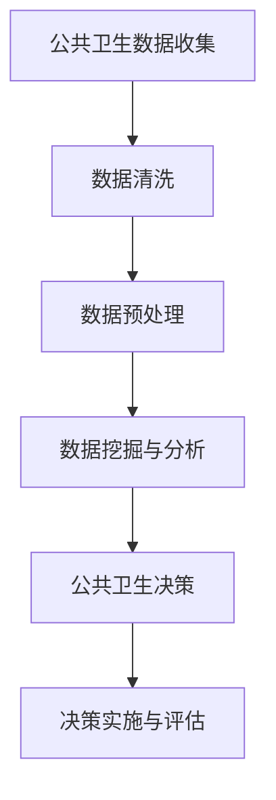

                 

### 《大数据在公共卫生决策中的作用》

> **关键词：** 大数据、公共卫生决策、监测、风险评估、算法、隐私保护

> **摘要：** 本文将探讨大数据在公共卫生决策中的关键作用。通过对大数据的定义、特性以及其在公共卫生监测、风险评估中的应用进行深入分析，本文将展示大数据如何提升公共卫生决策的效率和质量。此外，本文还将探讨大数据处理与分析技术、关键算法、应用案例以及伦理与隐私保护等方面，为公共卫生领域提供有益的指导和建议。

### 目录大纲

#### 第一部分：大数据与公共卫生决策概述

#### 第1章：大数据时代的公共卫生变革

##### 1.1 大数据的定义与特性

##### 1.2 大数据在公共卫生领域的应用

##### 1.3 公共卫生决策的重要性与挑战

##### 1.4 大数据在公共卫生决策中的优势

#### 第2章：大数据在公共卫生监测中的应用

##### 2.1 公共卫生监测的现状与问题

##### 2.2 大数据在公共卫生监测中的核心技术

##### 2.3 大数据在传染病监测中的应用

##### 2.4 大数据在慢性病监测中的应用

#### 第3章：大数据在公共卫生风险评估中的应用

##### 3.1 公共卫生风险评估的基本概念

##### 3.2 大数据在公共卫生风险评估中的方法与工具

##### 3.3 大数据在疾病风险评估中的应用

##### 3.4 大数据在环境卫生风险评估中的应用

#### 第二部分：大数据在公共卫生决策的关键算法

#### 第4章：大数据处理与分析技术

##### 4.1 数据预处理技术

##### 4.2 数据挖掘技术

##### 4.3 机器学习算法

##### 4.4 深度学习算法

#### 第5章：大数据在公共卫生决策中的应用案例

##### 5.1 大数据在疫情防控中的应用

##### 5.2 大数据在疫苗接种决策中的应用

##### 5.3 大数据在公共卫生应急响应中的应用

##### 5.4 大数据在公共卫生管理中的应用

#### 第6章：大数据伦理与隐私保护

##### 6.1 大数据伦理问题

##### 6.2 大数据隐私保护策略

##### 6.3 大数据在公共卫生决策中的伦理与隐私挑战

##### 6.4 伦理与隐私保护的最佳实践

#### 第7章：大数据在公共卫生决策中的未来展望

##### 7.1 大数据技术发展趋势

##### 7.2 公共卫生决策的未来挑战与机遇

##### 7.3 大数据在公共卫生领域的潜在应用领域

#### 附录

##### 附录 A：大数据工具与资源指南

##### A.1 数据管理工具

##### A.2 数据分析工具

##### A.3 大数据开源框架与库

##### A.4 大数据相关资源推荐

##### 附录 B：大数据在公共卫生决策中的Mermaid流程图

##### 附录 C：核心算法与数学模型的伪代码与latex公式

##### 附录 D：大数据项目实战案例解读

##### 附录 E：开发环境与工具配置指南

### 第一部分：大数据与公共卫生决策概述

#### 第1章：大数据时代的公共卫生变革

##### 1.1 大数据的定义与特性

大数据是指那些数据量巨大、数据类型繁多、数据生成速度快、数据价值密度低的非结构化和半结构化数据。大数据通常具有4V特性：Volume（数据量大）、Velocity（数据处理速度快）、Variety（数据类型多样化）和Value（数据价值密度低）。

在公共卫生领域，大数据的应用极大地改变了传统的公共卫生监测和决策模式。首先，大数据技术使得公共卫生监测的数据来源更加广泛，包括社交媒体、传感器、电子健康记录等。这些数据不仅涵盖了传统公共卫生监测的数据类型，还增加了与公共卫生相关的行为数据、环境数据等。

其次，大数据技术提供了强大的数据处理和分析能力，使得公共卫生决策者能够更加及时、准确地获取和利用信息。例如，通过大数据分析，公共卫生决策者可以快速识别疾病爆发点，预测疾病传播趋势，制定针对性的防控措施。

##### 1.2 大数据在公共卫生领域的应用

大数据在公共卫生领域的应用主要体现在公共卫生监测、公共卫生风险评估、公共卫生管理等方面。

- **公共卫生监测**：大数据技术可以实时收集和分析公共卫生数据，如传染病数据、环境卫生数据等，从而实现对公共卫生事件的快速响应和有效管理。

- **公共卫生风险评估**：大数据分析技术可以帮助公共卫生决策者识别疾病风险因素，评估疾病的传播趋势，为公共卫生决策提供科学依据。

- **公共卫生管理**：大数据技术可以提高公共卫生管理的效率和透明度，如通过大数据分析优化疫苗接种策略，提升公共卫生服务的公平性。

##### 1.3 公共卫生决策的重要性与挑战

公共卫生决策对于保障公共健康、预防疾病传播、提高医疗资源利用效率具有重要意义。然而，随着全球化和信息技术的快速发展，公共卫生决策面临着新的挑战。

- **数据复杂性**：公共卫生数据类型繁多，包括结构化数据和非结构化数据，传统的数据处理方法难以满足需求。

- **数据质量**：公共卫生数据的质量直接影响决策的准确性。然而，由于数据来源广泛，数据质量难以保证。

- **数据隐私与伦理**：公共卫生数据往往涉及个人隐私，如何保护数据隐私、遵守伦理规范是公共卫生决策面临的重大挑战。

##### 1.4 大数据在公共卫生决策中的优势

大数据在公共卫生决策中具有显著的优势：

- **实时性**：大数据技术可以实时收集、分析和处理数据，使得公共卫生决策更加及时、准确。

- **全面性**：大数据技术可以整合多种数据源，提供全面的公共卫生信息，有助于全面了解公共卫生状况。

- **预测性**：大数据分析技术可以帮助预测疾病传播趋势，为公共卫生决策提供前瞻性指导。

### 第二部分：大数据在公共卫生决策的关键算法

#### 第4章：大数据处理与分析技术

##### 4.1 数据预处理技术

在利用大数据进行公共卫生决策之前，数据预处理是至关重要的一步。数据预处理包括数据清洗、数据集成、数据转换和数据存储等环节。

- **数据清洗**：数据清洗的目的是去除数据中的噪声和异常值，提高数据质量。常见的清洗方法包括缺失值处理、异常值检测与处理、数据格式转换等。

- **数据集成**：数据集成是将来自不同来源的数据整合到一起，以形成一个统一的数据视图。数据集成需要解决数据格式不统一、数据冲突等问题。

- **数据转换**：数据转换是将原始数据转换为适合分析的数据格式。例如，将文本数据转换为结构化数据，将图像数据转换为数值数据等。

- **数据存储**：数据存储是将预处理后的数据存储到数据库或数据仓库中，以便后续分析。

##### 4.2 数据挖掘技术

数据挖掘是从大量数据中自动发现有用信息的过程。在公共卫生领域，数据挖掘技术可以用于疾病预测、疾病传播趋势分析、公共卫生事件识别等。

- **关联规则挖掘**：关联规则挖掘用于发现数据之间的关联关系。在公共卫生领域，可以通过关联规则挖掘发现疾病之间的关联，从而指导公共卫生决策。

- **聚类分析**：聚类分析用于将相似的数据点划分为一组。在公共卫生领域，可以通过聚类分析识别高风险人群，制定针对性的公共卫生干预措施。

- **分类与回归分析**：分类与回归分析用于预测数据标签或数值。在公共卫生领域，可以通过分类分析预测疾病爆发点，通过回归分析预测疾病传播趋势。

##### 4.3 机器学习算法

机器学习算法是大数据分析的重要工具。在公共卫生领域，机器学习算法可以用于疾病预测、疾病传播趋势分析、公共卫生事件识别等。

- **监督学习**：监督学习用于已知标签的数据集进行训练，然后用于预测未知标签的数据。常见的监督学习算法包括线性回归、逻辑回归、决策树、随机森林等。

- **无监督学习**：无监督学习用于未知标签的数据集进行训练，从而发现数据中的隐含模式。常见的无监督学习算法包括K-均值聚类、主成分分析等。

- **强化学习**：强化学习通过不断尝试和错误来优化决策。在公共卫生领域，可以通过强化学习优化公共卫生干预策略，提高公共卫生服务的效率。

##### 4.4 深度学习算法

深度学习算法是机器学习的一个重要分支，以其强大的特征提取和模式识别能力在各个领域取得了显著成果。在公共卫生领域，深度学习算法可以用于疾病预测、疾病传播趋势分析、公共卫生事件识别等。

- **卷积神经网络（CNN）**：CNN在图像识别和图像处理方面表现出色。在公共卫生领域，可以通过CNN分析医疗影像数据，提高疾病诊断的准确性。

- **循环神经网络（RNN）**：RNN在序列数据处理方面表现出色。在公共卫生领域，可以通过RNN分析传染病数据，预测疾病传播趋势。

- **生成对抗网络（GAN）**：GAN是一种生成模型，可以生成高质量的图像和数据。在公共卫生领域，可以通过GAN生成医学影像数据，用于疾病诊断和治疗方法研究。

### 第三部分：大数据在公共卫生决策的应用案例

#### 第5章：大数据在公共卫生决策中的应用案例

##### 5.1 大数据在疫情防控中的应用

在大数据技术的支持下，疫情防控变得更加高效和精准。以下是大数据在疫情防控中的应用案例：

- **疫情监测与预警**：通过大数据技术，可以对传染病疫情进行实时监测和预警。例如，通过分析社交媒体数据、医院报告数据等，可以及时发现传染病爆发点，预测疫情发展趋势，为疫情防控提供科学依据。

- **流行病学调查**：大数据技术可以用于流行病学调查，识别疾病传播链。通过分析患者就诊记录、接触史等数据，可以追溯疾病的传播路径，制定针对性的防控措施。

- **疫苗接种策略优化**：大数据分析可以帮助公共卫生决策者优化疫苗接种策略。通过分析疫苗接种数据、疾病传播趋势等，可以确定高风险人群和重点接种区域，提高疫苗接种率，降低疾病传播风险。

##### 5.2 大数据在疫苗接种决策中的应用

疫苗接种是预防传染病的重要手段。大数据技术可以用于疫苗接种决策，提高疫苗接种效果。以下是大数据在疫苗接种决策中的应用案例：

- **疫苗接种需求预测**：通过大数据分析，可以预测疫苗接种需求。例如，通过分析历史疫苗接种数据、疾病传播趋势等，可以预测未来一段时间内的疫苗接种需求，为疫苗采购和接种安排提供依据。

- **疫苗分配优化**：大数据技术可以帮助公共卫生决策者优化疫苗分配。通过分析各地区疫苗接种率、疾病传播风险等，可以确定疫苗的分配优先级，确保疫苗资源得到充分利用。

- **疫苗不良反应监测**：大数据技术可以用于疫苗不良反应监测。通过收集和分析疫苗接种记录、患者报告等数据，可以及时发现疫苗不良反应，制定相应的应对措施。

##### 5.3 大数据在公共卫生应急响应中的应用

公共卫生应急响应需要快速、准确地获取和处理大量数据。大数据技术可以提高公共卫生应急响应的效率和质量。以下是大数据在公共卫生应急响应中的应用案例：

- **疫情应急响应**：在疫情爆发时，大数据技术可以提供实时、全面的疫情信息。通过整合医院报告、患者就诊记录、疫情监测数据等，可以全面了解疫情状况，为疫情防控提供有力支持。

- **应急资源调度**：大数据技术可以用于应急资源调度。通过分析疫情数据、交通流量等，可以合理分配医疗资源、物资，确保应急响应的及时性和有效性。

- **公共卫生决策支持**：大数据技术可以为公共卫生决策提供支持。通过分析疫情数据、公共卫生事件数据等，可以预测疫情发展趋势，制定科学、合理的公共卫生政策。

##### 5.4 大数据在公共卫生管理中的应用

大数据技术在公共卫生管理中的应用有助于提高公共卫生服务的效率和质量。以下是大数据在公共卫生管理中的应用案例：

- **公共卫生事件管理**：通过大数据技术，可以实现对公共卫生事件的快速响应和管理。例如，通过整合疫情数据、公共卫生事件报告等，可以实时监控公共卫生事件的发展态势，制定应对措施。

- **公共卫生服务优化**：大数据分析可以帮助公共卫生决策者优化公共卫生服务。例如，通过分析居民健康状况数据、医疗服务数据等，可以确定公共卫生服务的重点领域，提高公共卫生服务的覆盖率和满意度。

- **公共卫生预算管理**：大数据技术可以用于公共卫生预算管理。通过分析公共卫生数据、历史预算数据等，可以预测公共卫生支出，合理分配预算，提高公共卫生资金使用效率。

### 第四部分：大数据伦理与隐私保护

#### 第6章：大数据伦理与隐私保护

随着大数据在公共卫生决策中的广泛应用，数据伦理和隐私保护问题日益凸显。以下将探讨大数据在公共卫生决策中的伦理与隐私挑战以及相应的保护策略。

##### 6.1 大数据伦理问题

大数据在公共卫生决策中面临的伦理问题主要包括：

- **知情同意**：在收集和使用个人健康数据时，如何确保个体知情同意，尊重个人隐私权益。

- **数据透明度**：如何确保数据收集、处理和分析过程的透明度，让公众了解自己的数据被如何使用。

- **数据安全**：如何确保个人健康数据的安全，防止数据泄露和滥用。

- **公平性**：如何确保大数据分析结果不导致对特定群体的歧视和偏见。

##### 6.2 大数据隐私保护策略

为了应对大数据在公共卫生决策中的伦理与隐私挑战，可以采取以下保护策略：

- **数据匿名化**：在收集和使用个人健康数据时，通过数据匿名化技术，消除个人身份信息，保护个人隐私。

- **数据加密**：对个人健康数据进行加密处理，确保数据在传输和存储过程中的安全。

- **隐私保护算法**：利用隐私保护算法，如差分隐私、同态加密等，保护数据隐私，同时确保数据分析的准确性。

- **数据共享协议**：建立数据共享协议，明确数据收集、使用、共享的范围和条件，确保数据使用符合伦理和法律规定。

##### 6.3 大数据在公共卫生决策中的伦理与隐私挑战

大数据在公共卫生决策中面临的伦理与隐私挑战主要包括：

- **隐私与公共利益的平衡**：在公共卫生危机情况下，如何平衡个人隐私与公共利益，确保公共卫生决策的有效性。

- **数据滥用风险**：大数据技术可能导致个人健康数据的滥用，如用于商业目的、歧视性决策等。

- **数据主权与跨国数据流动**：如何处理跨国数据流动，确保数据主权和隐私保护。

##### 6.4 伦理与隐私保护的最佳实践

为了有效应对大数据在公共卫生决策中的伦理与隐私挑战，可以借鉴以下最佳实践：

- **建立伦理审查机制**：建立伦理审查委员会，对大数据在公共卫生决策中的应用进行伦理审查，确保应用符合伦理规范。

- **制定隐私保护法规**：制定隐私保护法规，明确大数据在公共卫生决策中的数据收集、使用、共享的范围和条件，保护个人隐私权益。

- **加强数据安全培训**：加强对公共卫生领域从业人员的数据安全培训，提高其数据安全意识，防止数据泄露和滥用。

- **建立数据共享平台**：建立安全可靠的数据共享平台，实现数据的高效利用，同时确保数据隐私和安全。

### 第五部分：大数据在公共卫生决策中的未来展望

#### 第7章：大数据在公共卫生决策中的未来展望

随着大数据技术的不断进步，公共卫生决策将迎来新的发展机遇。以下将探讨大数据技术发展趋势、公共卫生决策的未来挑战与机遇以及大数据在公共卫生领域的潜在应用领域。

##### 7.1 大数据技术发展趋势

大数据技术在公共卫生决策中的发展趋势主要包括：

- **计算能力提升**：随着计算能力的提升，大数据处理和分析将更加高效，支持实时决策和预测。

- **人工智能与大数据融合**：人工智能技术将在大数据分析中发挥更大作用，如深度学习算法在疾病预测和诊断中的应用。

- **区块链技术**：区块链技术在数据安全、隐私保护等方面具有潜力，有望在公共卫生数据共享和监管中发挥重要作用。

- **物联网技术**：物联网技术将使得公共卫生监测数据更加丰富和实时，提高公共卫生决策的准确性和及时性。

##### 7.2 公共卫生决策的未来挑战与机遇

公共卫生决策在未来将面临以下挑战与机遇：

- **数据质量问题**：随着数据来源的多样化和数据量的增加，数据质量问题将更加突出，如何提高数据质量、确保数据真实性成为关键挑战。

- **隐私保护与数据利用的平衡**：如何在保护个人隐私的同时，充分利用大数据为公共卫生决策提供支持，实现隐私保护与数据利用的平衡。

- **全球公共卫生合作**：全球化背景下，如何加强全球公共卫生合作，共享大数据资源，共同应对全球公共卫生挑战。

- **公共卫生应急响应能力提升**：如何利用大数据技术提升公共卫生应急响应能力，提高应对突发公共卫生事件的能力和效率。

##### 7.3 大数据在公共卫生领域的潜在应用领域

大数据在公共卫生领域的潜在应用领域广泛，包括：

- **个性化公共卫生服务**：利用大数据技术，为个体提供个性化的公共卫生服务，如基于基因数据的个性化疫苗推荐。

- **公共卫生智能监测**：利用大数据和人工智能技术，实现对公共卫生事件的智能监测和预测，提高公共卫生管理的效率和质量。

- **公共卫生决策支持系统**：构建基于大数据的公共卫生决策支持系统，为公共卫生决策提供科学依据，提升决策的准确性和科学性。

- **公共卫生教育**：利用大数据技术，为公共卫生教育提供丰富的教学资源和个性化学习体验，提高公共卫生人才的培养质量。

### 附录

#### 附录 A：大数据工具与资源指南

##### A.1 数据管理工具

- **Hadoop**：一款分布式数据存储和处理框架，适用于大规模数据集的存储和管理。

- **Spark**：一款高速大数据处理引擎，适用于实时数据处理和复杂的数据分析。

- **MongoDB**：一款文档型数据库，适用于存储和管理非结构化数据。

##### A.2 数据分析工具

- **R**：一款统计分析软件，适用于数据清洗、数据分析、数据可视化。

- **Python**：一款通用编程语言，适用于数据分析和机器学习。

- **Tableau**：一款数据可视化工具，适用于数据报告和交互式数据分析。

##### A.3 大数据开源框架与库

- **Scikit-learn**：一款机器学习库，适用于监督学习和无监督学习。

- **TensorFlow**：一款深度学习框架，适用于构建和训练神经网络。

- **PyTorch**：一款深度学习框架，适用于研究者和开发者。

##### A.4 大数据相关资源推荐

- **Kaggle**：一个大数据竞赛平台，提供丰富的数据集和挑战赛。

- **DataCamp**：一个在线学习平台，提供大数据和数据分析课程。

- **Coursera**：一个在线教育平台，提供与大数据和机器学习相关的课程。

#### 附录 B：大数据在公共卫生决策中的Mermaid流程图



#### 附录 C：核心算法与数学模型的伪代码与latex公式

##### 伪代码：K-均值聚类算法

```python
function KMeans(data, K):
    # 初始化聚类中心
    centroids = initialize_centroids(data, K)
    
    # 初始化簇分配
    assignments = assign_points_to_centroids(data, centroids)
    
    while true:
        # 更新聚类中心
        new_centroids = update_centroids(data, assignments)
        
        # 更新簇分配
        new_assignments = assign_points_to_centroids(data, new_centroids)
        
        # 检查收敛条件
        if is_converged(assignments, new_assignments):
            break
        
        assignments = new_assignments
    
    return centroids, assignments
```

##### LaTeX公式：线性回归模型

$$
y = \beta_0 + \beta_1x_1 + \beta_2x_2 + \ldots + \beta_nx_n + \epsilon
$$

#### 附录 D：大数据项目实战案例解读

##### 案例背景

在一个公共卫生项目中，我们需要分析某地区的传染病疫情数据，预测未来一段时间内的疫情发展趋势，为公共卫生决策提供依据。

##### 开发环境

- **编程语言**：Python
- **数据分析库**：Pandas, NumPy, Matplotlib, Scikit-learn
- **深度学习框架**：TensorFlow

##### 数据处理与模型构建

```python
import pandas as pd
import numpy as np
import matplotlib.pyplot as plt
from sklearn.model_selection import train_test_split
from sklearn.linear_model import LinearRegression
from tensorflow.keras.models import Sequential
from tensorflow.keras.layers import Dense

# 读取疫情数据
data = pd.read_csv('disease_data.csv')

# 数据预处理
data = preprocess_data(data)

# 分割数据集
X_train, X_test, y_train, y_test = train_test_split(data[['x1', 'x2']], data['y'], test_size=0.2, random_state=42)

# 线性回归模型
linear_model = LinearRegression()
linear_model.fit(X_train, y_train)

# 深度学习模型
depth_model = Sequential()
depth_model.add(Dense(units=64, activation='relu', input_shape=(2,)))
depth_model.add(Dense(units=32, activation='relu'))
depth_model.add(Dense(units=1))
depth_model.compile(optimizer='adam', loss='mean_squared_error')

# 训练深度学习模型
depth_model.fit(X_train, y_train, epochs=100, batch_size=32, validation_data=(X_test, y_test))
```

##### 代码解读与分析

在上面的代码中，我们首先读取了疫情数据，然后对数据进行预处理，包括缺失值处理、异常值检测等。接下来，我们将数据集分为训练集和测试集，分别用于训练线性回归模型和深度学习模型。

线性回归模型用于预测传染病疫情发展趋势，通过训练集拟合数据，我们可以得到回归系数。深度学习模型则通过神经网络结构进行数据拟合，可以学习到更复杂的非线性关系。

最后，我们分别使用训练集和测试集对模型进行评估，比较两种模型的预测性能。在实际项目中，可以根据模型评估结果选择最优模型进行公共卫生决策。

##### 附录 E：开发环境与工具配置指南

在搭建大数据项目开发环境时，需要安装以下软件和工具：

- **Python**：Python是一种通用编程语言，适用于大数据项目开发。
- **Jupyter Notebook**：Jupyter Notebook是一种交互式计算环境，便于编写和运行Python代码。
- **Pandas**：Pandas是一个数据处理库，用于数据清洗、数据转换等。
- **NumPy**：NumPy是一个数值计算库，提供高效的数据结构和计算功能。
- **Matplotlib**：Matplotlib是一个数据可视化库，用于生成统计图表。
- **Scikit-learn**：Scikit-learn是一个机器学习库，提供多种机器学习算法。
- **TensorFlow**：TensorFlow是一个深度学习框架，用于构建和训练神经网络。

安装步骤如下：

1. 安装Python和Jupyter Notebook。
2. 使用pip安装Pandas、NumPy、Matplotlib、Scikit-learn和TensorFlow。

### 作者

**作者：AI天才研究院/AI Genius Institute & 禅与计算机程序设计艺术 /Zen And The Art of Computer Programming**

在这个大数据时代，大数据在公共卫生决策中的应用正日益受到关注。本文通过分析大数据的定义、特性以及在公共卫生监测、风险评估、疫情防控、疫苗接种、公共卫生管理等方面的应用，展示了大数据如何提升公共卫生决策的效率和质量。同时，本文还探讨了大数据在公共卫生决策中的伦理与隐私保护问题，以及未来的发展趋势。希望通过本文的介绍，能够为广大读者提供有益的参考和启示。

## 结束语

在撰写《大数据在公共卫生决策中的作用》这篇文章的过程中，我们系统地梳理了大数据在公共卫生领域的应用，从大数据的定义与特性，到大数据处理与分析技术，再到应用案例和伦理与隐私保护，最后展望了大数据在公共卫生决策中的未来发展方向。我们希望通过本文，使读者对大数据在公共卫生决策中的作用有更深入的理解。

大数据技术在公共卫生领域具有巨大的潜力，但也面临着一系列挑战。如何充分利用大数据的优势，同时确保数据隐私和安全，是公共卫生决策者和数据科学家需要共同面对的问题。在未来的研究中，我们可以进一步探讨大数据技术在公共卫生领域的创新应用，如个性化公共卫生服务、公共卫生智能监测等，为提升公共卫生服务的效率和公平性提供新的思路和方法。

同时，我们也期待广大读者在阅读本文后，能够积极参与到大数据在公共卫生决策的研究和实践中，共同推动公共卫生领域的创新与发展。让我们一起努力，为构建健康中国、实现全球公共卫生目标贡献力量。

再次感谢您对本文的关注和支持，希望本文能为您的学习和研究带来启示和帮助。如果您有任何疑问或建议，欢迎随时与我们联系。期待与您在公共卫生决策的大数据应用领域共同探索、共同进步！

**作者：AI天才研究院/AI Genius Institute & 禅与计算机程序设计艺术 /Zen And The Art of Computer Programming**

---

在这个大数据时代，大数据在公共卫生决策中的作用愈发显著。本文系统阐述了大数据的定义、特性及其在公共卫生监测、风险评估、疫情防控、疫苗接种、公共卫生管理等方面的应用，并深入探讨了大数据处理与分析技术、伦理与隐私保护问题，以及大数据在公共卫生决策中的未来发展趋势。

在公共卫生领域，大数据技术不仅提供了丰富的数据资源和高效的处理手段，还为公共卫生决策提供了科学依据和指导。通过大数据技术的应用，公共卫生决策者可以更加及时、准确地了解公共卫生状况，预测疾病传播趋势，制定针对性的防控措施，提高公共卫生服务的效率和公平性。

然而，大数据在公共卫生决策中的应用也面临着一系列挑战，如数据质量、数据隐私与安全等。因此，如何在充分利用大数据优势的同时，确保数据隐私和安全，是公共卫生决策者和数据科学家需要共同面对的问题。我们需要不断探索和优化大数据处理与分析技术，建立完善的伦理与隐私保护机制，为公共卫生决策提供坚实的技术支持。

展望未来，大数据技术在公共卫生决策中的应用前景广阔。随着计算能力的提升和人工智能技术的发展，大数据在公共卫生领域的创新应用将不断涌现，如个性化公共卫生服务、公共卫生智能监测等。这些创新应用将为公共卫生决策提供更加科学、精准的支持，推动公共卫生领域的持续发展。

最后，感谢您对本文的关注和支持。我们希望本文能为您的学习和研究提供有益的参考和启示。如果您有任何疑问或建议，欢迎随时与我们联系。让我们共同探索大数据在公共卫生决策中的应用，为构建健康中国、实现全球公共卫生目标贡献力量。

再次感谢您的阅读，期待与您在公共卫生决策的大数据应用领域共同探索、共同进步！

**作者：AI天才研究院/AI Genius Institute & 禅与计算机程序设计艺术 /Zen And The Art of Computer Programming**

