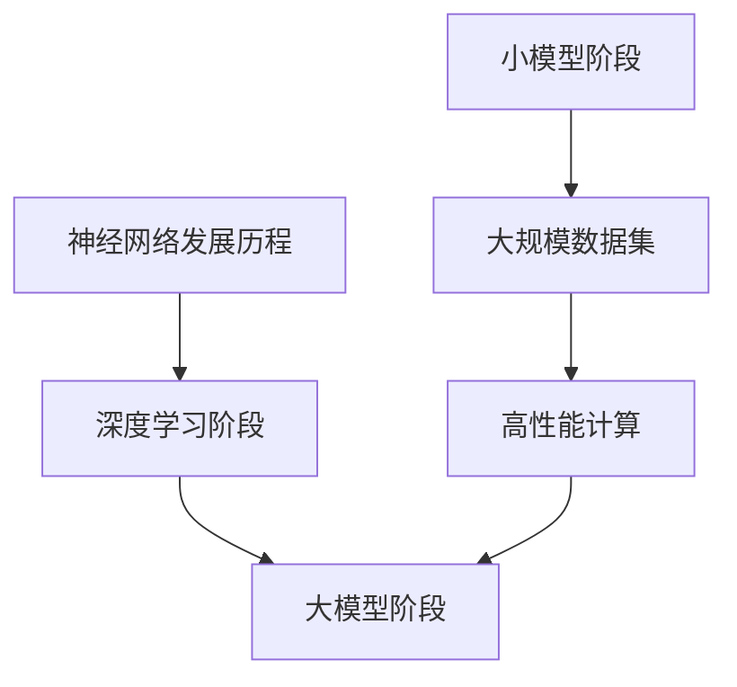
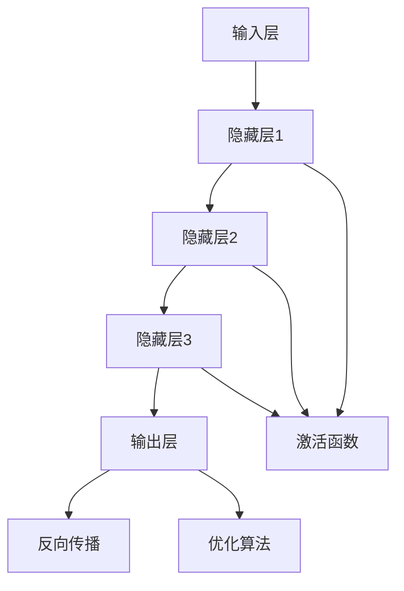

                 

# 《大模型创业的创新与挑战》

> **关键词**：大模型，创业，创新，挑战，技术，应用，市场，未来

> **摘要**：本文从大模型的时代背景、核心概念、创业挑战与机遇、实践指南以及未来展望等多个角度，深入探讨了大模型创业领域的创新与挑战。通过分析大模型的发展历程、技术特点与应用现状，以及创业中的数据隐私、技术门槛、市场竞争等问题，本文提出了大模型创业的实践指南，并展望了大模型创业的未来趋势与方向。文章旨在为创业者提供有价值的参考和指导，助力大模型创业的成功。

---

### 目录大纲

# 《大模型创业的创新与挑战》

## 第一部分：大模型时代背景与核心概念

### 第1章：大模型时代概述
#### 1.1 大模型的历史与发展
#### 1.2 大模型的技术特点与趋势
#### 1.3 大模型在不同行业的应用现状

### 第2章：大模型核心概念与架构
#### 2.1 大模型的定义与分类
#### 2.2 大模型的基本原理与架构
#### 2.3 大模型的训练与优化

## 第二部分：大模型创业的挑战与机遇

### 第3章：大模型创业的挑战
#### 3.1 数据隐私与伦理问题
#### 3.2 技术门槛与资源需求
#### 3.3 市场竞争与盈利模式

### 第4章：大模型创业的机遇
#### 4.1 行业需求与市场机会
#### 4.2 技术创新与商业应用
#### 4.3 政策支持与产业生态

### 第5章：大模型创业案例分析
#### 5.1 成功案例分享
#### 5.2 失败案例分析
#### 5.3 案例启示与创业策略

## 第三部分：大模型创业实践指南

### 第6章：创业团队构建与运营管理
#### 6.1 团队建设与角色分配
#### 6.2 运营管理与绩效评估
#### 6.3 风险管理与应急响应

### 第7章：大模型创业技术实践
#### 7.1 大模型开发环境搭建
#### 7.2 大模型代码实现与调试
#### 7.3 大模型应用案例分析

### 第8章：大模型创业未来展望
#### 8.1 大模型创业的趋势与方向
#### 8.2 大模型创业的潜在挑战与应对策略
#### 8.3 大模型创业对社会的影响与责任

## 附录
### 附录A：大模型创业工具与资源
#### A.1 开源框架与应用
#### A.2 大模型研究机构与报告
#### A.3 大模型创业相关法规与政策

---

### 第1章：大模型时代概述

#### 1.1 大模型的历史与发展

大模型的发展可以追溯到20世纪80年代的神经网络研究。最初，神经网络作为一种简单的人工智能模型，被用于解决一些简单的数据处理任务。然而，随着计算机硬件性能的提升和算法的进步，神经网络逐渐演变成复杂的、具有强大计算能力的大模型。

- **1986年**：霍普菲尔德（John Hopfield）提出了 Hopfield 网络模型，这是大模型的早期雏形。
- **1990年代**：随着反向传播算法（Backpropagation Algorithm）的发明，神经网络开始被广泛应用于图像识别和语音识别等领域。
- **2012年**：AlexNet 的成功，标志着深度学习进入新的时代。AlexNet 在ImageNet 大规模图像识别挑战赛（ImageNet Large Scale Visual Recognition Challenge，ILSVRC）中取得了突破性的成绩。

大模型的发展历程，可以看作是计算机算力、算法优化和数据集积累三者的结合。特别是在深度学习领域，大模型的发展经历了几个关键阶段：

1. **小模型阶段**（1990s - 2012年）：神经网络模型规模较小，计算资源有限，但已经展示出一定的智能能力。
2. **深度学习阶段**（2012年 - 2017年）：深度学习模型（如AlexNet、VGGNet等）的出现，使得神经网络模型规模不断扩大，计算资源需求增加。
3. **大模型阶段**（2017年至今）：随着GPU、TPU等高性能计算设备的普及，以及大规模数据集的积累，大模型（如BERT、GPT等）成为人工智能领域的主流。

#### 1.2 大模型的技术特点与趋势

大模型具有以下技术特点：

1. **大规模参数**：大模型通常具有数百万到数十亿个参数，这使得它们能够捕捉到数据中的复杂模式。
2. **多层结构**：大模型通常由多层神经网络组成，每一层都能对输入数据进行特征提取和变换。
3. **端到端训练**：大模型可以直接从原始数据中学习，实现数据的端到端处理。
4. **强泛化能力**：大模型通过在大规模数据集上训练，能够获得较强的泛化能力，从而在未知数据上表现出良好的性能。

大模型的发展趋势包括：

1. **模型规模不断扩大**：随着计算资源的增加，大模型的规模也在不断增大，从亿级参数到千亿级参数。
2. **算法优化**：为了提高模型的训练效率和性能，研究人员不断优化算法，如优化器、正则化技术等。
3. **应用领域扩展**：大模型的应用范围从传统的图像、语音识别扩展到自然语言处理、机器翻译、推荐系统等。
4. **边缘计算**：随着5G和边缘计算的发展，大模型也开始向边缘设备扩展，实现实时、高效的处理能力。

#### 1.3 大模型在不同行业的应用现状

大模型在各个行业的应用现状如下：

1. **制造业**：大模型在制造业中的应用主要包括生产规划、质量控制、设备维护等方面。例如，通过大模型对生产数据进行预测和分析，可以提高生产效率，降低成本。
2. **金融业**：大模型在金融业中的应用主要包括风险评估、交易策略、客户服务等方面。例如，通过大模型对客户数据进行分析，可以提供个性化的金融服务，提高客户满意度。
3. **健康医疗**：大模型在健康医疗中的应用主要包括疾病诊断、药物研发、健康管理等。例如，通过大模型对医疗数据进行分析，可以帮助医生做出更准确的诊断，提高治疗效果。
4. **其他行业**：大模型在其他行业的应用还包括自动驾驶、智能家居、智能城市等方面。例如，自动驾驶系统通过大模型对环境进行感知和决策，实现自主驾驶。

### Mermaid 流程图



### 第2章：大模型核心概念与架构

#### 2.1 大模型的定义与分类

**大模型**是指在参数数量、网络规模或者数据集规模上远超传统模型的机器学习模型。这些模型通常具有数百万到数十亿个参数，能够在大规模数据集上进行训练，并展现出强大的学习能力。

**大模型的分类**可以从不同的角度进行：

1. **按照模型类型分类**：
   - **深度神经网络（DNN）**：基于多层感知器（MLP）的网络结构，包括卷积神经网络（CNN）、循环神经网络（RNN）等。
   - **增强学习（RL）**：通过与环境互动学习最优策略的模型。
   - **生成对抗网络（GAN）**：通过两个对抗网络（生成器和判别器）相互竞争来生成逼真的数据。
   - **变分自编码器（VAE）**：通过编码和解码器学习数据分布的模型。

2. **按照应用领域分类**：
   - **计算机视觉**：如图像识别、目标检测等。
   - **自然语言处理**：如文本分类、机器翻译、问答系统等。
   - **语音识别**：如语音合成、语音识别等。
   - **推荐系统**：如商品推荐、内容推荐等。

**大模型的标准**通常包括以下几个指标：

- **参数规模**：模型的参数数量，如百千万、亿级、千亿级等。
- **数据集规模**：训练数据集的大小，如GB、TB、PB等。
- **训练时长**：模型训练所需的时间，如小时、天、周等。
- **计算资源**：训练模型所需的计算资源，如CPU、GPU、TPU等。

#### 2.2 大模型的基本原理与架构

**大模型的基本原理**是基于神经网络，通过多层非线性变换来实现数据的特征提取和模式识别。具体来说，大模型的基本原理包括：

- **激活函数**：用于引入非线性，使模型能够捕捉到数据中的复杂模式。常用的激活函数包括Sigmoid、ReLU、Tanh等。
- **反向传播**：用于计算梯度，并更新模型的参数，以优化模型的性能。
- **优化算法**：用于搜索最优参数，以实现模型的快速训练。常用的优化算法包括随机梯度下降（SGD）、Adam等。

**大模型的架构**通常包括以下几个层次：

1. **输入层**：接收外部输入数据，如图像、文本、声音等。
2. **隐藏层**：进行特征提取和变换，隐藏层可以有多个，每一层都能够对输入数据进行处理，并生成新的特征。
3. **输出层**：产生最终的预测结果，如分类标签、概率分布等。

**大模型的基本原理与架构的 Mermaid 流程图**：



#### 2.3 大模型的训练与优化

**大模型的训练**是一个迭代的过程，包括以下几个步骤：

1. **数据预处理**：对输入数据进行清洗、归一化等处理，使其适合模型训练。
2. **模型初始化**：初始化模型的参数，常用的方法包括随机初始化、高斯分布初始化等。
3. **前向传播**：输入数据通过模型的前向传播过程，产生预测结果。
4. **计算损失**：通过计算预测结果与真实结果的差异，得到损失值。
5. **反向传播**：计算损失关于模型参数的梯度，并更新模型参数。
6. **迭代优化**：重复上述步骤，直到满足停止条件（如损失降低到一定程度、迭代次数达到一定限制等）。

**大模型的优化算法**主要包括：

- **随机梯度下降（SGD）**：简单且直观的优化算法，通过计算每个样本的梯度来更新模型参数。
- **动量优化（Momentum）**：引入动量项，加速收敛速度。
- **Adam优化器**：结合了SGD和动量优化，能够自适应地调整学习率。

**大模型训练的伪代码**：

```python
# 伪代码：大模型训练流程
function train_model(model, dataset, epochs):
    for epoch in range(epochs):
        for data in dataset:
            model.forward_pass(data)
            loss = model.compute_loss(data)
            model.backward_pass(loss)
        model.update_parameters()
    return model
```

**大模型的优化算法的伪代码**：

```python
# 伪代码：优化器更新规则（以Adam为例）
function adam_optimizer(parameters, gradients, velocities, moments, epsilon, beta1, beta2):
    # 更新一阶动量（梯度）
    velocities = beta1 * velocities + (1 - beta1) * gradients
    # 一阶动量归一化
    velocities_normalized = velocities / (1 - (beta1 ** epoch))
    
    # 更新二阶动量（梯度平方）
    moments = beta2 * moments + (1 - beta2) * (gradients ** 2)
    # 二阶动量归一化
    moments_normalized = moments / (1 - (beta2 ** epoch))
    
    # 更新参数
    parameters -= learning_rate * velocities_normalized / (sqrt(moments_normalized) + epsilon)
    
    return parameters
```

**大模型训练与优化过程中的数学模型和公式**：

$$
\text{损失函数} = \frac{1}{n}\sum_{i=1}^{n} L(y_i, \hat{y}_i)
$$

$$
\text{梯度} = \nabla_{\theta} L(y, \hat{y})
$$

$$
\text{参数更新} = \theta - \alpha \cdot \nabla_{\theta} L(y, \hat{y})
$$

其中，$L$ 表示损失函数，$y$ 表示真实标签，$\hat{y}$ 表示预测标签，$n$ 表示样本数量，$\theta$ 表示模型参数，$\alpha$ 表示学习率。

### 第3章：大模型创业的挑战

#### 3.1 数据隐私与伦理问题

**数据隐私与伦理问题**是大模型创业中面临的主要挑战之一。随着大模型的发展，对数据的依赖性越来越强，如何保护数据隐私成为了一个重要问题。

**数据隐私的重要性**：

1. **用户信任**：数据隐私直接关系到用户的信任。如果用户认为其数据无法得到保护，他们可能会选择不使用服务。
2. **法律法规**：许多国家和地区都有关于数据隐私的法律法规，如欧盟的《通用数据保护条例》（GDPR）等。违反这些规定可能会导致严重的法律后果。
3. **商业竞争力**：数据隐私的保护可以增强企业的商业竞争力。一个能够保护用户隐私的企业更容易获得用户的信任，从而在市场竞争中占据优势。

**伦理问题的挑战**：

1. **算法歧视**：大模型可能会在决策中引入歧视，如性别、种族等。这可能导致不公平的决策，损害社会公正。
2. **数据滥用**：如果数据被滥用，可能会导致隐私泄露、财产损失等不良后果。
3. **责任归属**：当大模型出现错误或产生不良后果时，如何界定责任成为一个挑战。

**遵循数据保护法规**：

1. **数据最小化原则**：只收集必要的用户数据，避免过度收集。
2. **数据加密**：对敏感数据进行加密，确保数据在传输和存储过程中的安全。
3. **用户知情同意**：在收集和使用用户数据前，确保用户知情并同意。
4. **数据匿名化**：对用户数据进行匿名化处理，降低隐私泄露的风险。
5. **合规审计**：定期进行合规审计，确保数据保护措施的落实。

#### 3.2 技术门槛与资源需求

**技术门槛与资源需求**是大模型创业中的另一大挑战。

**技术门槛的分析**：

1. **算法复杂性**：大模型的算法通常非常复杂，需要深入了解深度学习、强化学习、生成对抗网络等理论。
2. **数据处理能力**：大模型对数据处理能力有很高的要求，需要能够处理大规模、多类型的复杂数据。
3. **计算资源需求**：大模型的训练通常需要大量的计算资源，如GPU、TPU等。对于初创企业来说，这是一项巨大的成本。

**资源需求的评估**：

1. **硬件资源**：评估所需的计算资源，如CPU、GPU、TPU的数量和性能。
2. **数据资源**：评估所需的数据集规模、数据类型和质量。
3. **人才资源**：评估所需的技术团队规模、技能和经验。

**技术创新与持续投入**：

1. **技术创新**：为了在大模型领域保持竞争力，企业需要不断进行技术创新，如算法优化、模型压缩等。
2. **持续投入**：大模型的研发和运营需要持续的资金投入，包括硬件采购、人才招聘、研发支出等。

#### 3.3 市场竞争与盈利模式

**市场竞争与盈利模式**是大模型创业中面临的另一重要挑战。

**市场竞争的现状**：

1. **技术竞争**：大模型的技术竞争非常激烈，多家企业都在争夺技术创新和市场份额。
2. **资本竞争**：大模型的研发和运营需要大量的资金投入，资本竞争激烈。
3. **人才竞争**：大模型的发展需要高水平的技术人才，人才竞争也非常激烈。

**盈利模式的探索**：

1. **提供技术服务**：企业可以通过提供大模型技术服务，如图像识别、自然语言处理等，来获取收入。
2. **产品销售**：企业可以开发基于大模型的产品，如智能助手、自动驾驶等，通过产品销售来获取收入。
3. **数据服务**：企业可以提供数据服务，如数据清洗、数据标注等，通过数据服务来获取收入。

**竞争策略与市场定位**：

1. **技术创新**：通过技术创新来提升产品的竞争力，如算法优化、模型压缩等。
2. **市场定位**：根据市场需求，选择合适的细分市场进行定位，如金融、医疗、制造等。
3. **品牌建设**：通过品牌建设来提升企业的知名度和美誉度，增强市场竞争力。

### 举例说明

**数据隐私**：在金融领域，如何保护用户隐私？

- **用户知情同意**：在收集用户数据前，确保用户知情并同意。
- **数据匿名化**：对用户数据进行匿名化处理，降低隐私泄露的风险。
- **数据加密**：对敏感数据进行加密，确保数据在传输和存储过程中的安全。

**技术门槛**：如何评估深度学习在自动驾驶中的应用难度？

- **算法复杂性**：评估深度学习算法的复杂度，如神经网络的结构、参数数量等。
- **数据处理能力**：评估系统对复杂数据的处理能力，如实时性、准确性等。
- **计算资源需求**：评估所需的计算资源，如GPU、TPU的数量和性能。

**市场竞争**：如何分析竞争对手的市场策略？

- **市场调研**：通过市场调研，了解竞争对手的产品、定价、市场份额等。
- **SWOT分析**：对竞争对手进行SWOT（优势、劣势、机会、威胁）分析，评估其市场策略的有效性。

### 第4章：大模型创业的机遇

#### 4.1 行业需求与市场机会

**大模型创业的机遇首先源于行业需求与市场机会的不断扩大**。

**行业需求分析**：

1. **智能制造**：随着工业4.0的到来，制造业对智能化、自动化的需求日益增加。大模型在生产线优化、设备预测维护、质量控制等方面的应用，能够显著提升生产效率和质量。
2. **金融服务**：金融行业对风险控制、投资决策、客户服务等方面有着高度的需求。大模型在信用评分、风险评估、智能客服等领域的应用，能够提高金融服务的精度和效率。
3. **健康医疗**：在健康医疗领域，大模型在疾病预测、药物研发、个性化治疗等方面的应用，为医疗行业带来了巨大的变革机会。
4. **智能城市**：随着城市化进程的加速，智能城市建设成为各国的战略重点。大模型在交通管理、环境保护、公共安全等方面的应用，有助于提高城市管理水平。

**市场机会识别**：

1. **AI技术外包**：企业可以提供大模型技术外包服务，帮助其他企业提升AI应用能力。
2. **定制化解决方案**：根据不同行业的需求，为企业提供定制化的大模型解决方案。
3. **数据服务**：提供高质量的数据集、数据清洗、数据标注等数据服务，为大模型训练提供支持。
4. **云服务**：提供大模型训练和部署的云服务，降低企业使用大模型的门槛。

**创业方向选择**：

1. **垂直行业应用**：选择特定行业进行深入应用，如金融、医疗、制造等，通过垂直深耕来建立竞争优势。
2. **通用模型开发**：开发通用的、适用于多个行业的大模型，通过广泛的客户群来获取市场份额。
3. **AI工具与服务**：开发AI工具和服务，如数据可视化工具、模型优化工具等，为AI应用提供便捷的支持。

#### 4.2 技术创新与商业应用

**技术创新**是大模型创业的核心驱动力，而商业应用则是技术创新的商业化实现。

**技术创新的重要性**：

1. **算法优化**：不断优化大模型的算法，提高模型的训练效率、准确性和泛化能力。
2. **模型压缩**：通过模型压缩技术，降低模型的参数规模，使其在资源受限的环境中也能高效运行。
3. **分布式训练**：开发分布式训练技术，利用多台服务器进行并行计算，加速大模型的训练过程。

**商业应用的案例**：

1. **智能客服**：企业通过大模型构建智能客服系统，实现24/7的客户服务，提高客户满意度和运营效率。
2. **智能诊断**：医疗机构利用大模型进行疾病诊断，提高诊断的准确性和效率，助力医疗资源的优化配置。
3. **自动驾驶**：自动驾驶企业通过大模型实现对环境的高精度感知和决策，推动自动驾驶技术的商业化应用。
4. **个性化推荐**：电商平台利用大模型构建个性化推荐系统，提高用户购物体验，增加销售额。

**创新应用的未来展望**：

1. **智慧医疗**：随着大数据和人工智能技术的发展，大模型在智慧医疗领域的应用将更加广泛，如智能药物研发、精准医疗等。
2. **智慧交通**：大模型在智慧交通领域的应用有望解决交通拥堵、交通事故等问题，提升交通管理效率。
3. **智能教育**：大模型在智能教育领域的应用将实现个性化教学，提升教育质量和效率。
4. **智慧城市**：大模型在智慧城市中的应用将推动城市管理智能化、精细化，提升城市居民的生活质量。

#### 4.3 政策支持与产业生态

**政策支持与产业生态**为大模型创业提供了良好的外部环境。

**政策环境分析**：

1. **鼓励创新**：许多国家和地区出台政策，鼓励人工智能和大数据技术的发展，为企业提供政策支持和资金扶持。
2. **规范管理**：政府加强对数据隐私和安全的监管，制定相关法律法规，保障数据安全和用户隐私。
3. **国际合作**：政府推动国际间人工智能和大数据技术的交流与合作，促进技术的全球扩散和应用。

**产业生态构建**：

1. **产学研合作**：企业、高校和研究机构加强合作，共同推动技术创新和应用。
2. **产业链协同**：产业链上下游企业协同合作，共同构建大模型创业的生态系统。
3. **人才培养**：政府和企业加大人才培养力度，培养具有大数据和人工智能技能的专业人才。

**政策支持下的创业机遇**：

1. **政府资金支持**：政府提供的资金支持有助于初创企业解决资金短缺问题，加快技术创新和应用。
2. **政策优惠**：政府提供的税收优惠、研发补贴等政策优惠，降低了企业的运营成本，提高了企业的盈利能力。
3. **市场准入**：政府简化市场准入流程，降低创业门槛，为企业提供了更多的市场机会。

### 案例分析

**成功案例**：某公司在金融领域的成功应用案例

- **案例介绍**：该公司利用大模型构建了智能投顾系统，为用户提供个性化的投资建议。
- **成功原因**：通过深度学习和大数据分析，公司能够准确捕捉市场动态，为用户提供精准的投资建议，提高了用户的投资回报率。
- **经验分享**：技术团队的持续创新和优秀的团队协作，使得公司能够快速响应市场需求，推出具有竞争力的产品。

**创新案例**：某公司在医疗健康领域的突破性创新

- **案例介绍**：该公司利用大模型开发了一套智能疾病诊断系统，能够在短时间内对医学图像进行准确诊断。
- **突破点**：公司通过优化大模型的算法，实现了对医学图像的精细分析，提高了诊断的准确性和效率。
- **未来展望**：该系统有望在未来成为医疗诊断的常规工具，显著提升医疗服务的质量和效率。

### 第5章：大模型创业案例分析

#### 5.1 成功案例分享

**案例介绍**：某人工智能初创公司在图像识别领域的成功之路

- **公司背景**：该公司成立于2015年，专注于计算机视觉和人工智能技术的研发。
- **核心技术**：公司开发了一套高效的大规模图像识别算法，能够在复杂场景下实现高精度的目标检测和识别。
- **成功原因**：
  - **技术优势**：公司拥有顶尖的算法团队，通过不断的技术创新，使算法在性能和效率上处于行业领先地位。
  - **市场定位**：公司准确抓住了自动驾驶、安防监控等领域的市场需求，为其提供定制化的解决方案。
  - **商业模式**：公司通过提供算法授权和解决方案服务，实现了良好的盈利模式。

**成功原因分析**：

1. **技术创新**：公司持续进行算法优化和模型压缩，使其在大规模图像识别任务中具有卓越的性能。
2. **市场定位**：公司精准把握了市场需求，为特定行业提供了具有高附加值的解决方案。
3. **团队协作**：公司拥有一支高效的团队，从研发到市场，各个环节紧密协作，确保项目的顺利推进。

**经验分享与借鉴**：

1. **技术创新**：持续进行技术创新，保持技术领先优势。
2. **市场洞察**：深入了解市场需求，精准定位市场方向。
3. **团队建设**：重视团队协作，构建高效的研发和市场团队。

#### 5.2 失败案例分析

**案例介绍**：某人工智能初创公司在语音识别领域的失败经历

- **公司背景**：该公司成立于2016年，致力于开发高效、准确的语音识别技术。
- **核心技术**：公司开发了一套基于深度学习的语音识别算法，但在市场推广中遭遇了挫折。
- **失败原因**：
  - **市场竞争**：在语音识别领域，已有多家巨头公司占据市场主导地位，新进入者面临巨大的竞争压力。
  - **商业模式**：公司试图通过免费模式吸引客户，但未能有效转化为付费用户，导致资金链断裂。
  - **技术不足**：虽然公司在算法上有所创新，但在实际应用中，识别准确率仍有待提高。

**失败原因分析**：

1. **市场竞争**：新进入者在市场竞争激烈的环境中，缺乏足够的竞争优势。
2. **商业模式**：免费模式未能有效实现商业变现，导致资金短缺。
3. **技术不足**：技术上的不足使得产品在市场中的表现不佳，影响用户信任。

**启示与反思**：

1. **市场竞争**：在进入一个竞争激烈的行业时，要充分评估自身的竞争优势和竞争压力。
2. **商业模式**：要确保商业模式具有可持续性，避免过度依赖免费模式。
3. **技术创新**：在技术层面保持持续的创新和优化，提高产品竞争力。

#### 5.3 案例启示与创业策略

**案例启示**：

1. **技术创新**：技术创新是创业成功的关键，要持续投入研发，保持技术领先。
2. **市场洞察**：准确把握市场需求，精准定位市场方向。
3. **商业模式**：构建可持续的商业模式，确保企业盈利。

**创业策略制定**：

1. **技术驱动**：以技术创新为核心，不断提升产品竞争力。
2. **市场导向**：深入了解市场需求，为用户提供有价值的服务。
3. **风险控制**：合理规划资金使用，确保企业财务健康。

**创业过程中的注意事项**：

1. **团队建设**：构建高效、协作的团队，确保项目顺利进行。
2. **风险管理**：提前识别和防范风险，制定应急预案。
3. **持续学习**：不断学习新的技术和商业模式，适应市场变化。

### 第6章：创业团队构建与运营管理

#### 6.1 团队建设与角色分配

**团队建设**是创业成功的关键因素之一。一个高效的创业团队需要明确的角色分配和良好的团队协作。

**团队建设的重要性**：

1. **提高工作效率**：通过明确的角色分配和团队协作，提高整体工作效率。
2. **激发创新**：团队成员之间的交流和合作，能够激发创新的思维和灵感。
3. **增强凝聚力**：良好的团队建设能够增强团队成员之间的凝聚力，提高团队的战斗力。

**角色分配与职责划分**：

1. **产品经理**：负责产品规划和设计，确保产品满足市场需求。
2. **研发团队**：负责技术研发和产品实现，包括算法开发、系统设计等。
3. **市场团队**：负责市场调研、推广和销售，推动产品的市场推广。
4. **运营团队**：负责产品运营和维护，确保产品的稳定运行。
5. **财务团队**：负责财务管理和资金运作，确保企业财务健康。

**团队协作与沟通**：

1. **定期会议**：定期召开团队会议，讨论项目进展、问题和解决方案。
2. **信息共享**：建立信息共享平台，确保团队成员能够及时获取到重要的信息。
3. **培训与学习**：组织培训和学习活动，提高团队成员的技能和知识水平。

#### 6.2 运营管理与绩效评估

**运营管理**是确保企业正常运转、实现战略目标的重要环节。

**运营管理概述**：

1. **目标设定**：明确企业的战略目标，确保运营活动与目标一致。
2. **流程优化**：优化业务流程，提高运营效率和质量。
3. **资源配置**：合理配置资源，确保企业能够充分利用现有的资源。
4. **风险管理**：识别和管理运营中的风险，确保企业的稳定运营。

**绩效评估指标**：

1. **工作效率**：衡量团队成员的工作效率，如项目完成速度、任务量等。
2. **质量指标**：衡量产品或服务的质量，如客户满意度、故障率等。
3. **成本控制**：衡量企业的成本控制能力，如成本节约、预算执行等。
4. **创新指标**：衡量企业的创新能力，如技术创新、新产品开发等。

**运营优化策略**：

1. **精益管理**：引入精益管理理念，减少浪费，提高效率。
2. **数据驱动**：利用数据分析，优化运营决策，提高运营效果。
3. **流程自动化**：通过自动化工具，减少手动操作，提高运营效率。

#### 6.3 风险管理与应急响应

**风险管理**是创业过程中的重要环节，有效的风险管理能够降低企业面临的潜在风险，保障企业的稳定运营。

**风险管理策略**：

1. **风险识别**：识别企业可能面临的各种风险，如市场风险、技术风险、财务风险等。
2. **风险评估**：评估每种风险的潜在影响和发生的可能性，确定风险等级。
3. **风险应对**：制定应对措施，降低风险的影响或发生概率。

**应急响应机制**：

1. **应急预案**：制定应急预案，明确在发生紧急情况时的应对措施和步骤。
2. **应急演练**：定期进行应急演练，提高团队成员的应急处理能力。
3. **沟通与协调**：建立紧急情况下的沟通与协调机制，确保信息畅通，迅速应对紧急情况。

**风险防范与应对**：

1. **预防措施**：采取预防措施，减少风险的发生概率，如加强技术研发、优化供应链管理等。
2. **应急处理**：在风险发生时，迅速采取应对措施，减少损失，如调整运营策略、寻求外部援助等。

### 实践指南

**团队建设**：

1. **明确目标**：明确团队的目标和任务，确保团队成员清楚自己的职责。
2. **选拔人才**：选拔具备专业技能和团队合作精神的团队成员。
3. **培养团队精神**：通过团队合作活动和培训，培养团队精神，提高团队凝聚力。

**运营管理**：

1. **设定目标**：明确企业的运营目标，制定详细的运营计划。
2. **监控进度**：定期监控项目进度，确保运营活动按计划进行。
3. **反馈与改进**：收集运营数据，进行数据分析，不断优化运营流程。

**风险管理**：

1. **风险识别**：定期进行风险评估，识别潜在的风险。
2. **制定预案**：针对可能的风险，制定详细的应急预案。
3. **应急演练**：定期进行应急演练，提高应急处理能力。

### 第7章：大模型创业技术实践

#### 7.1 大模型开发环境搭建

在大模型创业过程中，开发环境的搭建是第一步，也是至关重要的一步。一个高效、稳定的开发环境能够提高研发效率，保障项目的顺利进行。

**开发环境搭建概述**：

1. **硬件环境**：选择合适的硬件设备，如高性能的GPU服务器，用于大模型的训练和推理。
2. **软件环境**：安装和配置所需的软件，如操作系统、深度学习框架、编程语言等。
3. **网络环境**：配置稳定的网络环境，确保数据传输和模型训练的顺利进行。

**开发工具与软件介绍**：

1. **操作系统**：常用的操作系统包括Linux和Windows。Linux因其稳定性和高性能，更受科研人员和开发者青睐。
2. **深度学习框架**：如TensorFlow、PyTorch、Keras等。这些框架提供了丰富的API和工具，简化了大模型的开发过程。
3. **编程语言**：Python是深度学习开发中最常用的编程语言，其简洁易懂、功能强大的特性使其成为开发者的首选。

**开发环境的配置与调试**：

1. **硬件配置**：根据项目需求，选择合适的高性能GPU服务器。确保服务器具有足够的内存和计算能力，以满足大模型的训练需求。
2. **软件安装**：安装操作系统和深度学习框架。在安装过程中，注意配置环境变量，确保能够正常调用相关库和工具。
3. **调试与优化**：在开发环境中进行调试和优化。通过调试工具，如Jupyter Notebook、PyCharm等，进行代码编写和调试。同时，通过性能优化技巧，如并行计算、内存优化等，提高开发效率和模型性能。

**案例介绍**：

某初创公司在开发大模型项目时，选择了基于Linux操作系统和PyTorch深度学习框架的开发环境。他们使用了高性能的GPU服务器，并进行了详细的软件安装和配置。通过Jupyter Notebook进行代码编写和调试，同时利用并行计算技术，提高了模型训练的效率。

**成功经验**：

1. **硬件选择**：选择了高性能的GPU服务器，确保了模型训练的效率和稳定性。
2. **软件配置**：详细配置了深度学习框架和编程环境，提高了开发效率和代码质量。
3. **调试优化**：通过并行计算和内存优化技术，提高了模型训练和推理的效率。

### 7.2 大模型代码实现与调试

在大模型创业中，代码实现与调试是核心环节之一。一个高效、准确的模型实现，需要清晰的代码结构和严谨的调试过程。

**代码实现流程**：

1. **需求分析**：明确模型的应用场景和需求，如输入数据格式、输出结果类型等。
2. **模型设计**：根据需求设计模型的架构，包括层数、层类型、激活函数等。
3. **代码编写**：编写模型的代码实现，包括前向传播、反向传播、参数更新等。
4. **测试与验证**：在测试数据集上验证模型的性能，确保模型达到预期的效果。

**调试技巧与工具**：

1. **调试工具**：使用调试工具，如PyCharm、Visual Studio Code等，进行代码调试。
2. **日志记录**：通过日志记录，追踪代码执行过程，定位错误原因。
3. **错误处理**：编写异常处理代码，确保在出现错误时能够优雅地处理，避免程序崩溃。
4. **版本控制**：使用版本控制工具，如Git，管理代码版本，确保代码的可维护性和可靠性。

**代码优化与性能调优**：

1. **并行计算**：利用GPU等硬件加速，实现并行计算，提高模型训练和推理的效率。
2. **内存优化**：通过优化数据结构和使用缓存技术，减少内存占用，提高模型的运行效率。
3. **算法优化**：通过优化算法和数据结构，减少计算量和内存占用，提高模型的性能。

**案例介绍**：

某初创公司在实现一个大模型项目时，使用了PyTorch框架进行代码编写和调试。他们在代码中加入了详细的注释和日志记录，通过Jupyter Notebook进行调试和测试。同时，他们利用GPU进行并行计算，提高了模型的训练速度。

**成功经验**：

1. **代码规范**：编写清晰、规范的代码，提高代码的可读性和可维护性。
2. **调试工具**：充分利用调试工具，提高调试效率和代码质量。
3. **并行计算**：利用GPU进行并行计算，显著提高了模型训练的效率。

### 7.3 大模型应用案例分析

在大模型创业中，应用案例是验证模型效果、展示项目成果的重要途径。通过分析成功和失败的应用案例，可以总结经验教训，为后续项目提供参考。

**应用场景选择**：

1. **医疗诊断**：利用大模型进行医学图像分析、疾病预测等，提高医疗诊断的准确性和效率。
2. **自动驾驶**：利用大模型进行环境感知、路径规划等，实现自动驾驶功能的准确性和安全性。
3. **智能客服**：利用大模型进行自然语言处理、情感分析等，提供智能客服服务，提高客户满意度。
4. **金融风控**：利用大模型进行风险预测、异常检测等，提高金融风控的准确性和效率。

**成功应用案例**：

**案例介绍**：某公司在金融风控领域的成功应用

- **公司背景**：该公司是一家专注于金融科技的创新企业，致力于利用人工智能技术提高金融风控能力。
- **应用场景**：该公司开发了一套基于深度学习的大模型，用于预测金融交易中的欺诈行为。
- **成功原因**：
  - **技术优势**：公司拥有顶尖的算法团队，通过深度学习和大数据分析，实现了高效的欺诈预测。
  - **业务理解**：公司对金融行业有深入的理解，能够准确捕捉欺诈行为的特征。
  - **数据支持**：公司积累了大量的金融交易数据，为模型训练提供了丰富的数据资源。

**应用效果评估**：

1. **准确率**：模型在测试数据集上的准确率达到95%，显著高于传统的欺诈检测方法。
2. **响应时间**：模型能够在短时间内完成预测，提高了欺诈检测的效率。
3. **用户反馈**：用户反馈良好，认为模型提高了金融交易的可靠性和安全性。

**失败应用案例**：

**案例介绍**：某公司在自动驾驶领域的失败应用

- **公司背景**：该公司是一家专注于自动驾驶技术的初创企业。
- **应用场景**：该公司试图通过大模型实现自动驾驶功能。
- **失败原因**：
  - **技术不足**：公司在自动驾驶技术方面经验不足，无法有效实现大模型的自动驾驶功能。
  - **数据问题**：模型训练数据不足，导致模型在复杂场景下的性能不佳。
  - **市场定位**：公司未能准确把握市场需求，导致产品无法得到市场的认可。

**应用效果评估**：

1. **准确率**：模型在测试数据集上的准确率较低，无法满足自动驾驶的要求。
2. **稳定性**：模型在复杂环境下的稳定性较差，容易出现错误决策。
3. **用户反馈**：用户反馈不佳，认为产品的自动驾驶功能不稳定，无法安全使用。

**案例启示**：

1. **技术积累**：在应用大模型前，要确保在相关领域有足够的技术积累和经验。
2. **数据支持**：充分准备高质量的训练数据，提高模型的性能和稳定性。
3. **市场定位**：准确把握市场需求，为用户提供有价值的应用。

### 第8章：大模型创业未来展望

#### 8.1 大模型创业的趋势与方向

随着人工智能技术的快速发展，大模型创业也呈现出一些明显的趋势与方向。

**创业趋势分析**：

1. **垂直行业应用**：大模型在金融、医疗、制造等垂直行业的应用将越来越广泛，为行业带来深刻的变革。
2. **跨界融合**：大模型与其他领域的融合，如物联网、区块链等，将产生新的商业模式和应用场景。
3. **技术突破**：随着算法和硬件的进步，大模型的性能和效率将不断提高，推动更多创新应用的出现。

**创业方向展望**：

1. **智能化服务**：利用大模型提供智能化服务，如智能客服、智能诊断等，提升用户体验和服务质量。
2. **自动化解决方案**：提供基于大模型的自动化解决方案，如自动驾驶、智能机器人等，推动产业升级和效率提升。
3. **数据分析与决策支持**：利用大模型进行数据分析和决策支持，帮助企业和政府提高管理水平和决策效率。

#### 8.2 大模型创业的潜在挑战与应对策略

尽管大模型创业充满机遇，但也面临诸多潜在挑战。

**挑战分析**：

1. **技术门槛**：大模型的开发和应用需要高水平的技术人才和强大的计算资源，这对初创企业来说是一大挑战。
2. **数据隐私与安全**：大模型对数据的依赖性较高，如何保护数据隐私和安全成为关键问题。
3. **市场竞争**：大模型创业领域竞争激烈，初创企业需要不断创新和优化，才能在市场中脱颖而出。

**应对策略**：

1. **技术创新**：持续投入研发，通过技术创新提升大模型的能力和效率。
2. **数据安全**：加强数据安全措施，如数据加密、匿名化处理等，确保用户数据的安全。
3. **差异化竞争**：找准市场定位，提供差异化产品和服务，降低市场竞争压力。

#### 8.3 大模型创业对社会的影响与责任

大模型创业不仅对技术领域产生深远影响，也对社会带来诸多影响和责任。

**社会影响评估**：

1. **提高生产力**：大模型的应用能够提高各行业的生产效率和质量，推动经济发展。
2. **改变就业格局**：随着自动化和智能化的普及，某些传统岗位可能被替代，但同时也会创造新的就业机会。
3. **提升生活质量**：大模型在医疗、教育、家居等领域的应用，将提高人们的生活质量和幸福感。

**企业社会责任**：

1. **公平与包容**：企业应确保技术应用的公平性和包容性，避免算法歧视和偏见。
2. **数据伦理**：企业应遵守数据伦理，保护用户隐私，确保数据使用的透明性和合法性。
3. **社会贡献**：企业应积极参与公益事业，利用技术为社会做出贡献，如教育、医疗等领域的创新应用。

### 展望未来

大模型创业的未来充满机遇与挑战。随着技术的不断进步和市场的扩大，大模型将在更多领域展现其强大的应用潜力。

1. **技术突破**：随着算法和硬件的进步，大模型的性能和效率将不断提高，为创业带来更多机会。
2. **跨界融合**：大模型与其他领域的融合将产生新的商业模式和应用场景，推动产业升级和创新发展。
3. **社会影响**：大模型创业将深刻改变社会，提高生产力、改善生活质量，同时也需要承担相应的社会责任。

### 附录A：大模型创业工具与资源

#### A.1 开源框架与应用

1. **TensorFlow**：由Google开发的开源深度学习框架，支持多种模型和算法，适用于各种应用场景。
2. **PyTorch**：由Facebook开发的开源深度学习框架，以其灵活性和动态计算图著称，广泛应用于科研和工业界。
3. **Keras**：基于Theano和TensorFlow的开源深度学习库，提供简洁的API，简化了深度学习模型的搭建和训练。
4. **其他开源框架**：如MXNet、Caffe、Theano等，也提供了丰富的功能和工具，适用于不同的应用需求。

#### A.2 大模型研究机构与报告

1. **人工智能研究机构**：如Google Brain、DeepMind、微软研究院等，这些机构在大模型领域进行了大量的研究，发布了多篇重要论文。
2. **行业报告**：如IDC、Gartner、市场研究公司等发布的行业报告，分析了大模型市场的发展趋势和应用场景。
3. **技术趋势报告**：如IEEE Spectrum、KDnuggets等网站发布的技术趋势报告，提供了最新的技术动态和应用案例。

#### A.3 大模型创业相关法规与政策

1. **数据保护法规**：如欧盟的《通用数据保护条例》（GDPR）、美国的《加州消费者隐私法案》（CCPA）等，规定了数据收集、处理和存储的规范。
2. **创业扶持政策**：各国政府为鼓励创新创业，出台了一系列扶持政策，如税收优惠、资金补贴、人才引进等。
3. **相关法规解读**：如《人工智能发展法》、《数据安全法》等，为企业提供了法律框架和指导，有助于合法合规地开展大模型创业。

