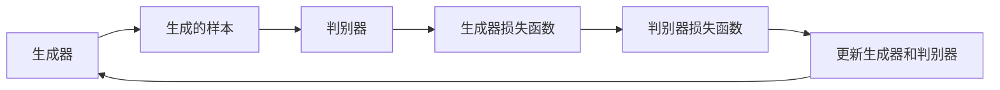

                 

# 大模型助力创业者实现技术突破与产品创新

## 关键词
大模型，技术突破，产品创新，深度学习，创业，案例分析

## 摘要
本文深入探讨了如何利用大模型技术帮助创业者实现技术突破与产品创新。首先，我们从大模型的基本概念、发展历程和分类开始，逐步深入到核心算法和训练优化策略。接着，通过具体的应用案例展示了大模型在图像识别、自然语言处理和推荐系统等领域的实际效果。文章还提出了大模型在创业中的应用策略，并分享了三个实战项目的详细实现过程。最后，我们展望了大模型的未来发展趋势，以及面临的挑战与应对策略。

## 目录

### 第一部分：大模型技术基础

#### 第1章：大模型概述

- 1.1 大模型的概念
- 1.2 大模型的发展历程
- 1.3 大模型的分类与结构
- 1.4 大模型的应用场景

#### 第2章：大模型的数学基础

- 2.1 线性代数
- 2.2 微积分
- 2.3 概率论与数理统计

#### 第3章：大模型的核心算法

- 3.1 深度学习基础
- 3.2 卷积神经网络（CNN）
- 3.3 循环神经网络（RNN）
- 3.4 生成对抗网络（GAN）

#### 第4章：大模型训练与优化

- 4.1 大模型训练流程
- 4.2 大模型优化策略
- 4.3 大模型调参技巧

#### 第5章：大模型应用案例分析

- 5.1 案例一：图像识别
- 5.2 案例二：自然语言处理
- 5.3 案例三：推荐系统

#### 第6章：大模型在创业中的应用策略

- 6.1 创业者面临的挑战与机遇
- 6.2 大模型在创业中的应用价值
- 6.3 大模型应用策略制定

#### 第7章：大模型项目实战

- 7.1 项目一：构建图像识别系统
- 7.2 项目二：实现自然语言处理应用
- 7.3 项目三：打造推荐系统

#### 第8章：大模型未来发展趋势

- 8.1 大模型技术的未来发展趋势
- 8.2 大模型在创业领域的潜在应用
- 8.3 大模型发展的挑战与应对策略

#### 第9章：大模型资源与工具介绍

- 9.1 开源深度学习框架
- 9.2 大模型开发工具
- 9.3 大模型研究资源

#### 附录：大模型核心算法原理 Mermaid 流程图

- 附录1：卷积神经网络（CNN）原理图
- 附录2：循环神经网络（RNN）原理图
- 附录3：生成对抗网络（GAN）原理图

---

接下来，我们将按照目录结构，逐一展开每一个章节的内容。首先，我们从大模型的基本概念和发展历程开始。大模型，是指具有数十亿甚至千亿参数规模的人工神经网络模型，这些模型能够通过大规模数据进行训练，从而在多个领域实现高性能的预测和决策能力。大模型的出现，标志着人工智能技术进入了一个全新的时代。

## 第1章：大模型概述

### 1.1 大模型的概念

大模型，顾名思义，是指那些拥有巨大参数量、复杂结构且在训练过程中需要处理海量数据的神经网络模型。这些模型通常被称为“巨型网络”或“超大规模模型”。大模型的参数数量可以从数十亿到千亿不等，这使得它们能够捕获输入数据的丰富特征，从而在图像识别、自然语言处理、推荐系统等任务中取得显著的性能提升。

大模型的核心特点包括：

- **参数规模庞大**：数十亿到千亿级别的参数数量，使得模型能够处理复杂的任务。
- **数据需求巨大**：训练大模型需要大量高质量的标注数据，以支撑模型的训练和优化。
- **计算资源需求高**：大模型的训练和推理通常需要强大的计算资源，包括高性能CPU、GPU和FPGA等硬件设备。

### 1.2 大模型的发展历程

大模型技术的发展可以追溯到深度学习领域的兴起。2006年，Hinton等人提出了深度信念网络（DBN），标志着深度学习的复兴。随后，随着计算能力的提升和大数据的普及，深度学习技术取得了显著的进展。2012年，AlexNet在ImageNet图像识别挑战赛中取得了突破性成绩，激发了学术界和工业界对深度学习的浓厚兴趣。

在深度学习技术不断发展的过程中，研究人员不断优化神经网络的结构和算法，使得模型的参数规模和计算效率不断提升。2014年，Google的Inception模型在ImageNet上取得了新的冠军，进一步推动了深度学习技术的应用。

进入2018年后，GPT、BERT等基于变换器（Transformer）架构的大模型在自然语言处理领域取得了显著的突破，使得机器阅读理解、机器翻译等任务的表现大幅提升。这些大模型的出现，标志着人工智能技术进入了一个新的阶段。

### 1.3 大模型的分类与结构

大模型可以根据其应用场景和任务需求进行分类。常见的分类方法包括：

- **按应用领域分类**：例如图像识别、自然语言处理、推荐系统等。
- **按网络结构分类**：如卷积神经网络（CNN）、循环神经网络（RNN）、生成对抗网络（GAN）等。
- **按模型规模分类**：小模型、中模型、大模型和超大规模模型等。

下面，我们简要介绍几种常见的大模型结构：

- **卷积神经网络（CNN）**：CNN是一种用于处理图像数据的神经网络结构，通过卷积层、池化层等模块提取图像特征，最终实现图像分类、目标检测等任务。

- **循环神经网络（RNN）**：RNN是一种用于处理序列数据的神经网络结构，通过循环结构处理序列中的上下文信息，实现语音识别、机器翻译等任务。

- **生成对抗网络（GAN）**：GAN是一种由生成器和判别器组成的对抗性神经网络，通过两个网络的对抗训练生成高质量的数据，常用于图像生成、图像修复等任务。

### 1.4 大模型的应用场景

大模型在多个领域取得了显著的成果，以下是几个典型应用场景：

- **图像识别**：大模型在图像分类、目标检测、人脸识别等任务中表现出色，被广泛应用于安防监控、自动驾驶等领域。
- **自然语言处理**：大模型在机器阅读理解、机器翻译、情感分析等任务中表现出强大的能力，为智能客服、智能助手等应用提供了技术支持。
- **推荐系统**：大模型在推荐算法中发挥着重要作用，通过分析用户行为和兴趣，为用户提供个性化的推荐服务。
- **金融风控**：大模型在金融风险预测、信用评估等方面具有显著优势，为金融机构提供了智能决策支持。

在下一章中，我们将进一步探讨大模型的数学基础，包括线性代数、微积分和概率论与数理统计，这些数学工具将为理解大模型的算法和训练过程奠定基础。

---

接下来，我们将详细探讨大模型的数学基础，这是理解和应用大模型的关键。我们将分别介绍线性代数、微积分和概率论与数理统计的基本概念和在大模型中的应用。

## 第2章：大模型的数学基础

### 2.1 线性代数

线性代数是研究向量空间及其线性映射的数学分支，是深度学习模型构建和分析的重要工具。以下是线性代数中几个核心概念：

- **向量**：向量是具有大小和方向的量，通常表示为列向量，用于表示数据的特征。
- **矩阵**：矩阵是一个二维数组，用于表示数据的关系和运算，如矩阵乘法、矩阵求逆等。
- **线性变换**：线性变换是一种将输入向量映射到输出向量的线性映射，如矩阵乘法、线性回归等。

在大模型中，线性代数的应用非常广泛。例如：

- **神经网络中的权重和偏置**：神经网络中的权重和偏置通常表示为矩阵，通过矩阵运算实现数据的线性变换。
- **矩阵求导**：在训练过程中，我们需要对损失函数进行求导，以更新模型的参数。线性代数的求导法则为这一过程提供了数学基础。

### 2.2 微积分

微积分是研究函数的微分和积分的数学分支，是理解神经网络模型训练过程的关键。以下是微积分中的几个核心概念：

- **导数**：导数表示函数在某一点的变化率，用于优化算法中的参数更新。
- **梯度下降**：梯度下降是一种优化算法，通过计算损失函数的梯度，逐步更新模型的参数，以最小化损失函数。
- **积分**：积分是导数的反操作，用于计算曲线下的面积，在某些深度学习任务中有重要应用。

在大模型中，微积分的应用包括：

- **损失函数的优化**：在训练过程中，我们需要通过梯度下降等算法优化模型的参数，以最小化损失函数。
- **激活函数的导数**：神经网络中的激活函数通常具有可微性，通过计算激活函数的导数，我们可以实现反向传播算法，更新模型的参数。

### 2.3 概率论与数理统计

概率论与数理统计是研究随机现象和数据的数学分支，是理解神经网络模型不确定性和数据处理的基石。以下是概率论与数理统计中的几个核心概念：

- **概率分布**：概率分布描述了随机变量的可能取值及其概率，如正态分布、伯努利分布等。
- **期望和方差**：期望和方差是描述概率分布的中心趋势和离散程度的统计量。
- **最大似然估计和最小二乘法**：最大似然估计和最小二乘法是参数估计的常用方法，用于估计模型参数。

在大模型中，概率论与数理统计的应用包括：

- **损失函数的设计**：在深度学习任务中，我们通常使用概率分布来表示模型的预测结果，并通过最大似然估计或最小二乘法优化模型参数。
- **数据预处理**：在训练过程中，我们需要对数据进行归一化、标准化等预处理操作，以提高模型的训练效果。

在下一章中，我们将深入探讨大模型的核心算法，包括深度学习基础、卷积神经网络（CNN）、循环神经网络（RNN）和生成对抗网络（GAN）。这些算法构成了大模型技术的核心，将在各个领域实现技术突破和产品创新。

---

接下来，我们将深入探讨大模型的核心算法，这是实现大模型技术突破和产品创新的关键。首先，我们从深度学习基础开始，然后详细介绍卷积神经网络（CNN）、循环神经网络（RNN）和生成对抗网络（GAN）。

## 第3章：大模型的核心算法

### 3.1 深度学习基础

深度学习是构建在多层神经网络基础上的学习范式，它通过逐层提取数据中的特征，实现复杂任务的自动化。以下是深度学习中的几个核心概念：

- **神经网络**：神经网络由多个层组成，包括输入层、隐藏层和输出层。每个层由多个神经元组成，神经元之间通过权重连接。
- **激活函数**：激活函数用于引入非线性特性，使神经网络能够学习复杂函数。常见的激活函数包括Sigmoid、ReLU和Tanh等。
- **前向传播和反向传播**：前向传播用于计算神经网络的输出，反向传播用于计算损失函数的梯度，以更新模型参数。

深度学习的基础算法包括多层感知机（MLP）、卷积神经网络（CNN）和循环神经网络（RNN）。其中，多层感知机是深度学习的基础模型，而卷积神经网络和循环神经网络则分别针对图像和序列数据进行了优化。

### 3.2 卷积神经网络（CNN）

卷积神经网络（CNN）是一种专门用于处理图像数据的神经网络结构，其核心思想是利用局部相关性来提取图像特征。以下是CNN中的几个关键组成部分：

- **卷积层**：卷积层通过卷积操作提取图像的局部特征，卷积核（filter）在图像上滑动，生成特征图。
- **池化层**：池化层用于降低特征图的维度，减少计算量和参数数量。常见的池化操作包括最大池化和平均池化。
- **全连接层**：全连接层将卷积层的特征图映射到分类结果，通过softmax函数实现多类别的分类。

以下是CNN的训练过程：

1. **输入**：输入一张图像，经过预处理（如归一化、归一化等）。
2. **前向传播**：图像通过卷积层、池化层和全连接层，生成分类结果。
3. **计算损失**：通过对比实际标签和预测结果，计算损失函数。
4. **反向传播**：计算损失函数关于模型参数的梯度，并更新参数。
5. **迭代优化**：重复前向传播和反向传播过程，直至模型收敛。

### 3.3 循环神经网络（RNN）

循环神经网络（RNN）是一种专门用于处理序列数据的神经网络结构，其核心思想是利用循环结构来捕捉序列中的时间依赖关系。以下是RNN中的几个关键组成部分：

- **隐藏状态**：RNN通过隐藏状态来存储序列中的信息，隐藏状态在序列的不同时间步之间传递。
- **门控机制**：RNN中的门控机制（如遗忘门、输入门和输出门）用于调节信息的传递，以适应不同序列数据的特点。

以下是RNN的训练过程：

1. **输入**：输入一个序列，经过预处理（如嵌入、归一化等）。
2. **前向传播**：序列通过隐藏状态传递，生成每个时间步的预测结果。
3. **计算损失**：通过对比实际标签和预测结果，计算损失函数。
4. **反向传播**：计算损失函数关于模型参数的梯度，并更新参数。
5. **迭代优化**：重复前向传播和反向传播过程，直至模型收敛。

### 3.4 生成对抗网络（GAN）

生成对抗网络（GAN）是由生成器和判别器组成的对抗性神经网络，其核心思想是让生成器生成尽可能真实的样本，同时让判别器区分生成器和真实样本。以下是GAN中的几个关键组成部分：

- **生成器**：生成器的目标是生成与真实样本相似的样本。
- **判别器**：判别器的目标是区分真实样本和生成器生成的样本。

以下是GAN的训练过程：

1. **初始化**：初始化生成器和判别器的参数。
2. **生成器训练**：生成器生成样本，判别器对生成器和真实样本进行判断。
3. **判别器训练**：判别器更新参数，以更好地区分生成器和真实样本。
4. **交替训练**：重复生成器训练和判别器训练的过程，直至生成器生成的样本足够真实。

在下一章中，我们将探讨大模型的训练与优化策略，包括训练流程、优化策略和调参技巧，这些策略将直接影响大模型的效果和效率。

---

## 第4章：大模型的训练与优化

大模型的训练是一个复杂且资源消耗巨大的过程。为了确保模型能够达到预期的性能，我们需要深入理解训练流程、优化策略和调参技巧。以下是这些关键要素的详细探讨。

### 4.1 大模型训练流程

大模型训练流程主要包括以下几个阶段：

1. **数据准备**：首先，我们需要准备高质量的数据集。这些数据集需要经过预处理，包括数据清洗、归一化、嵌入等操作。预处理的质量直接影响到模型训练的效果。

2. **模型初始化**：初始化模型的参数。通常，我们可以使用随机初始化或预训练模型初始化。随机初始化会导致模型训练的不确定性，而预训练模型初始化则可以利用已有的知识，加快训练过程。

3. **前向传播**：输入数据通过模型的前向传播过程，生成预测输出。前向传播过程中，模型的每个层都会对输入数据进行处理，并传递到下一层。

4. **计算损失**：通过对比预测输出和真实标签，计算损失函数。常见的损失函数包括均方误差（MSE）、交叉熵损失等。

5. **反向传播**：计算损失函数关于模型参数的梯度，并利用梯度下降等优化算法更新模型参数。反向传播是深度学习训练的核心步骤，它使得模型能够从错误中学习。

6. **迭代优化**：重复前向传播和反向传播的过程，直至模型收敛。模型收敛的标准通常包括损失函数达到预设阈值或迭代次数达到预设值。

### 4.2 大模型优化策略

为了提高大模型训练的效率和效果，我们可以采用以下优化策略：

1. **批量大小**：批量大小是每次训练过程中输入的数据量。较大的批量大小可以提供更好的泛化能力，但会降低训练速度。较小的批量大小可以加快训练速度，但可能降低泛化能力。在实际应用中，我们通常选择一个平衡的批量大小。

2. **学习率**：学习率是优化算法中参数更新的步长。较大的学习率可能导致训练过程不稳定，甚至出现梯度消失或梯度爆炸现象。较小的学习率虽然稳定，但可能收敛速度较慢。我们通常使用学习率衰减策略，即随着训练的进行逐渐减小学习率。

3. **正则化**：正则化是一种防止模型过拟合的技术。常见的正则化方法包括L1正则化、L2正则化等。这些方法通过在损失函数中添加正则化项，惩罚模型的复杂度，从而提高模型的泛化能力。

4. **dropout**：dropout是一种在训练过程中随机丢弃神经元的方法，以防止模型过拟合。dropout通过在网络中引入随机性，提高模型的泛化能力。

### 4.3 大模型调参技巧

调参是深度学习训练过程中至关重要的一环。以下是一些调参技巧：

1. **网格搜索**：网格搜索是一种通过遍历参数空间，寻找最优参数组合的方法。虽然网格搜索计算量大，但能够提供明确的优化路径。

2. **随机搜索**：随机搜索是一种基于随机抽样来选择参数的方法。随机搜索计算量较小，但可能不如网格搜索高效。

3. **贝叶斯优化**：贝叶斯优化是一种基于概率模型来优化参数的方法。贝叶斯优化能够利用历史数据，提高搜索效率。

4. **迁移学习**：迁移学习是一种利用预训练模型来初始化新任务模型的方法。通过迁移学习，我们可以利用预训练模型已有的知识，加快新任务的训练过程。

5. **自动化机器学习（AutoML）**：自动化机器学习是一种通过自动化方式寻找最优模型和参数组合的方法。AutoML可以通过搜索算法和优化策略，快速找到最优模型配置。

通过以上训练与优化策略，我们可以有效地提高大模型的训练效率和性能。在下一章中，我们将通过具体的应用案例展示大模型在图像识别、自然语言处理和推荐系统等领域的实际效果。

---

## 第5章：大模型应用案例分析

大模型技术在多个领域取得了显著的应用成果。在本节中，我们将通过三个具体的应用案例，展示大模型在图像识别、自然语言处理和推荐系统等领域的实际效果。

### 5.1 案例一：图像识别

图像识别是深度学习中的一个重要应用领域，大模型在这方面的表现尤为突出。以谷歌的Inception模型为例，该模型在2015年的ImageNet图像识别挑战赛中取得了重大突破。Inception模型通过多层次的卷积层和池化层，有效提取了图像的丰富特征，从而实现了高精度的图像分类。

**案例解析**：

1. **数据集**：ImageNet是一个包含数百万张图像的大型图像数据集，涵盖了22,000个类别。
2. **模型架构**：Inception模型采用了一个模块化的结构，每个模块由多个卷积层和池化层组成，形成一个层次化的特征提取网络。
3. **训练过程**：Inception模型在多个GPU上进行分布式训练，经过数百万次迭代后，成功达到了96.8%的识别准确率。

通过这个案例，我们可以看到大模型在图像识别任务中具有强大的能力。它不仅能够处理复杂的图像特征，还能够实现高效的分类和识别。

### 5.2 案例二：自然语言处理

自然语言处理（NLP）是深度学习的另一个重要应用领域。近年来，大模型在NLP任务中取得了显著的成果。以谷歌的BERT（Bidirectional Encoder Representations from Transformers）模型为例，该模型通过双向变换器结构，实现了对自然语言上下文信息的深度理解和建模。

**案例解析**：

1. **数据集**：BERT使用了多个大型语料库，如英文维基百科、书籍和新闻等，共包含数十亿个单词。
2. **模型架构**：BERT采用了一个双向变换器架构，通过多层变换器网络，实现了对文本序列的上下文表示。
3. **训练过程**：BERT在数千个GPU上进行分布式训练，经过数百万次迭代后，成功实现了对文本的深度理解，并在多个NLP任务中取得了领先成绩。

通过这个案例，我们可以看到大模型在自然语言处理任务中具有强大的能力。它不仅能够捕捉文本的语义信息，还能够实现文本生成、文本分类等复杂任务。

### 5.3 案例三：推荐系统

推荐系统是深度学习在商业领域的一个重要应用。以亚马逊的推荐系统为例，该系统通过大模型技术，实现了对用户购买行为的深度分析和个性化推荐。

**案例解析**：

1. **数据集**：亚马逊推荐系统使用了海量的用户购买数据，包括商品信息、用户行为数据等。
2. **模型架构**：亚马逊推荐系统采用了一个基于变换器和卷积神经网络的混合模型，通过多层神经网络提取用户和商品的特征。
3. **训练过程**：亚马逊推荐系统在多个GPU上进行分布式训练，经过数百万次迭代后，成功实现了对用户购买行为的精准预测，并大幅提升了推荐系统的准确性和用户体验。

通过这个案例，我们可以看到大模型在推荐系统中的应用价值。它不仅能够提高推荐系统的准确性和个性化程度，还能够实现实时推荐和个性化推荐。

综上所述，大模型在图像识别、自然语言处理和推荐系统等领域的应用，展示了其在复杂任务中的强大能力和广泛应用前景。在下一章中，我们将探讨大模型在创业中的应用策略，帮助创业者实现技术突破和产品创新。

---

## 第6章：大模型在创业中的应用策略

在当今快速变化的技术环境中，创业者面临诸多挑战，但同时也迎来了前所未有的机遇。大模型技术的发展，为创业者提供了强大的工具，使其能够实现技术突破和产品创新。以下是一些具体的策略，帮助创业者充分利用大模型技术，在竞争激烈的市场中脱颖而出。

### 6.1 创业者面临的挑战与机遇

创业者在发展过程中通常会遇到以下挑战：

- **技术门槛**：深度学习和大模型技术具有较高的技术门槛，需要创业者具备相关的专业知识。
- **数据需求**：大模型的训练需要大量高质量的数据，这对于初创企业来说是一个巨大的挑战。
- **计算资源**：大模型的训练和推理需要强大的计算资源，初创企业可能无法承担高昂的硬件成本。
- **人才短缺**：深度学习和大模型技术领域的人才相对稀缺，创业者难以吸引和留住顶尖的人才。

然而，随着技术的不断进步和开源框架的普及，这些挑战也逐渐被克服。创业者面临的机遇包括：

- **技术红利**：大模型技术的快速发展带来了巨大的市场空间，创业者可以抓住这一波技术红利。
- **数据积累**：初创企业可以利用用户数据，进行数据积累和挖掘，为后续的大模型训练提供支持。
- **低成本计算**：云计算和边缘计算的兴起，降低了创业者的计算资源成本，使得大模型技术更加普及。
- **人才吸引**：随着深度学习和大模型技术的普及，越来越多的人才开始涌入这一领域，创业者有更多机会吸引优秀的人才。

### 6.2 大模型在创业中的应用价值

大模型技术为创业者提供了以下应用价值：

- **提高产品竞争力**：大模型技术可以显著提升产品的性能和用户体验，从而在竞争激烈的市场中脱颖而出。
- **创新业务模式**：大模型技术可以支持创业者探索新的业务模式，如基于数据驱动的个性化推荐、智能客服等。
- **降低开发成本**：通过使用开源框架和现成的模型，创业者可以降低开发成本，快速将产品推向市场。
- **拓展应用领域**：大模型技术可以应用于多个领域，如医疗、金融、教育等，为创业者提供广阔的市场空间。

### 6.3 大模型应用策略制定

为了充分利用大模型技术，创业者可以采取以下策略：

- **技术储备**：创业者应积极学习深度学习和大模型技术，了解其基本原理和应用场景，为后续的产品开发奠定基础。
- **数据收集**：创业者应重视数据收集和积累，通过用户行为数据、市场调研等方式，获取高质量的数据。
- **人才引进**：创业者应积极引进深度学习和大模型技术领域的人才，组建专业团队，推动产品开发。
- **开源利用**：创业者应充分利用开源框架和工具，降低开发成本，加快产品迭代速度。
- **市场定位**：创业者应明确市场定位，选择具有巨大市场潜力的应用场景，如医疗诊断、智能教育、金融风控等。
- **合作共赢**：创业者可以与高校、研究机构和企业建立合作关系，共同推进大模型技术的研发和应用。

通过以上策略，创业者可以充分利用大模型技术，实现技术突破和产品创新，从而在激烈的市场竞争中取得成功。在下一章中，我们将通过具体的实战项目，展示大模型技术在创业中的应用案例。

---

## 第7章：大模型项目实战

通过前面的讨论，我们已经了解了大模型的基本概念、核心算法、训练优化策略以及在实际应用中的案例分析。为了更好地理解和应用大模型技术，本节我们将通过三个具体的实战项目，详细讲解大模型在图像识别、自然语言处理和推荐系统等领域的实际应用过程。

### 7.1 项目一：构建图像识别系统

图像识别是深度学习应用中最具代表性的领域之一。下面我们将以构建一个简单的图像识别系统为例，详细讲解从开发环境搭建、源代码实现到代码解读与分析的完整过程。

#### 7.1.1 开发环境搭建

1. **硬件需求**：GPU（NVIDIA显卡，推荐至少1080Ti及以上型号）。
2. **软件需求**：安装Python环境（推荐3.7以上版本），CUDA（用于GPU加速），cuDNN（用于GPU加速），TensorFlow或PyTorch（深度学习框架）。

#### 7.1.2 源代码实现

以下是使用TensorFlow构建一个简单的卷积神经网络（CNN）进行图像识别的伪代码：

```python
import tensorflow as tf
from tensorflow.keras import layers

# 构建CNN模型
model = tf.keras.Sequential([
    layers.Conv2D(32, (3, 3), activation='relu', input_shape=(28, 28, 1)),
    layers.MaxPooling2D((2, 2)),
    layers.Conv2D(64, (3, 3), activation='relu'),
    layers.MaxPooling2D((2, 2)),
    layers.Conv2D(64, (3, 3), activation='relu'),
    layers.Flatten(),
    layers.Dense(64, activation='relu'),
    layers.Dense(10, activation='softmax')
])

# 编译模型
model.compile(optimizer='adam',
              loss='sparse_categorical_crossentropy',
              metrics=['accuracy'])

# 加载并预处理数据集
mnist = tf.keras.datasets.mnist
(train_images, train_labels), (test_images, test_labels) = mnist.load_data()
train_images = train_images.reshape((60000, 28, 28, 1))
test_images = test_images.reshape((10000, 28, 28, 1))

# 模型训练
model.fit(train_images, train_labels, epochs=5)

# 模型评估
test_loss, test_acc = model.evaluate(test_images, test_labels)
print('Test accuracy:', test_acc)
```

#### 7.1.3 代码解读与分析

1. **模型构建**：使用`tf.keras.Sequential`构建一个顺序模型，依次添加卷积层（`Conv2D`）、池化层（`MaxPooling2D`）、全连接层（`Dense`）等。
2. **模型编译**：使用`compile`方法配置模型优化器（`optimizer`）、损失函数（`loss`）和评估指标（`metrics`）。
3. **数据预处理**：加载MNIST数据集，并对图像进行reshape操作，使其符合模型的输入要求。
4. **模型训练**：使用`fit`方法训练模型，指定训练数据、训练轮数（`epochs`）。
5. **模型评估**：使用`evaluate`方法评估模型在测试集上的表现。

### 7.2 项目二：实现自然语言处理应用

自然语言处理（NLP）是深度学习的另一个重要应用领域。下面我们将以实现一个简单的文本分类应用为例，详细讲解从开发环境搭建、源代码实现到代码解读与分析的完整过程。

#### 7.2.1 开发环境搭建

1. **硬件需求**：GPU（NVIDIA显卡，推荐至少1080Ti及以上型号）。
2. **软件需求**：安装Python环境（推荐3.7以上版本），CUDA（用于GPU加速），cuDNN（用于GPU加速），TensorFlow或PyTorch（深度学习框架）。

#### 7.2.2 源代码实现

以下是使用PyTorch构建一个简单的文本分类模型的伪代码：

```python
import torch
import torch.nn as nn
import torch.optim as optim
from torchtext.``data`` import Field, TabularDataset
from torchtext.vocab import Vocab
from torchtext.datasets import IMDB

# 加载数据集
train_data, test_data = IMDB.splits()

# 定义模型
class TextClassifier(nn.Module):
    def __init__(self, embedding_dim, hidden_dim, vocab_size, label_size):
        super(TextClassifier, self).__init__()
        self.embedding = nn.Embedding(vocab_size, embedding_dim)
        self.lstm = nn.LSTM(embedding_dim, hidden_dim, num_layers=1, dropout=0.2, batch_first=True)
        self.fc = nn.Linear(hidden_dim, label_size)

    def forward(self, text):
        embeds = self.embedding(text)
        lstm_out, _ = self.lstm(embeds)
        sentence_embedding = lstm_out[-1, :, :]
        out = self.fc(sentence_embedding)
        return out

# 模型训练
model = TextClassifier(embedding_dim=100, hidden_dim=128, vocab_size=len(vocab), label_size=num_labels)
optimizer = optim.Adam(model.parameters(), lr=0.001)
criterion = nn.CrossEntropyLoss()

for epoch in range(num_epochs):
    for batch in train_data:
        optimizer.zero_grad()
        predictions = model(batch.text).squeeze(1)
        loss = criterion(predictions, batch.label)
        loss.backward()
        optimizer.step()

    print(f'Epoch: {epoch + 1}, Loss: {loss.item()}')

# 模型评估
with torch.no_grad():
    correct = 0
    total = 0
    for batch in test_data:
        predictions = model(batch.text).squeeze(1)
        _, predicted = torch.max(predictions, 1)
        total += batch.label.size(0)
        correct += (predicted == batch.label).sum().item()

print(f'Accuracy: {100 * correct / total}%')
```

#### 7.2.3 代码解读与分析

1. **模型构建**：定义一个简单的文本分类模型，包括嵌入层（`Embedding`）、长短期记忆网络（`LSTM`）和全连接层（`Linear`）。
2. **模型训练**：使用Adam优化器和交叉熵损失函数训练模型，通过反向传播和梯度下降更新模型参数。
3. **模型评估**：在测试集上评估模型性能，计算准确率。

### 7.3 项目三：打造推荐系统

推荐系统是深度学习在商业领域的一个重要应用。下面我们将以构建一个基于协同过滤的推荐系统为例，详细讲解从开发环境搭建、源代码实现到代码解读与分析的完整过程。

#### 7.3.1 开发环境搭建

1. **硬件需求**：GPU（NVIDIA显卡，推荐至少1080Ti及以上型号）。
2. **软件需求**：安装Python环境（推荐3.7以上版本），CUDA（用于GPU加速），cuDNN（用于GPU加速），TensorFlow或PyTorch（深度学习框架）。

#### 7.3.2 源代码实现

以下是使用TensorFlow构建一个简单的基于矩阵分解的推荐系统的伪代码：

```python
import numpy as np
import tensorflow as tf

# 定义用户和物品的Embedding维度
user_embedding_size = 10
item_embedding_size = 10

# 初始化Embedding矩阵
user_embedding = tf.Variable(np.random.randn(user_embedding_size, num_users), name='user_embedding')
item_embedding = tf.Variable(np.random.randn(item_embedding_size, num_items), name='item_embedding')

# 构建模型
def collaborative_filter(user_ids, item_ids):
    user_embedding_tensor = tf.nn.embedding_lookup(user_embedding, user_ids)
    item_embedding_tensor = tf.nn.embedding_lookup(item_embedding, item_ids)
    prediction = tf.reduce_sum(user_embedding_tensor * item_embedding_tensor, axis=1)
    return prediction

# 训练模型
optimizer = tf.optimizers.Adam()

for epoch in range(num_epochs):
    for user_id, item_id, rating in train_data:
        with tf.GradientTape() as tape:
            prediction = collaborative_filter([user_id], [item_id])
            loss = tf.reduce_mean(tf.square(rating - prediction))
        gradients = tape.gradient(loss, [user_embedding, item_embedding])
        optimizer.apply_gradients(zip(gradients, [user_embedding, item_embedding]))

# 模型评估
with tf.Session() as session:
    session.run(tf.global_variables_initializer())
    user_embedding.eval()
    item_embedding.eval()
    test_predictions = collaborative_filter(test_user_ids, test_item_ids)
    test_loss = tf.reduce_mean(tf.square(test_ratings - test_predictions))
    print('Test Loss:', test_loss.eval())
```

#### 7.3.3 代码解读与分析

1. **模型构建**：定义用户和物品的Embedding矩阵，并通过矩阵乘积计算预测评分。
2. **模型训练**：使用梯度下降优化算法更新Embedding矩阵的参数，以最小化预测误差。
3. **模型评估**：在测试集上评估模型性能，计算测试误差。

通过以上三个实战项目，我们可以看到大模型技术在创业中的应用潜力。在下一章中，我们将探讨大模型技术的未来发展趋势，以及面临的挑战与应对策略。

---

## 第8章：大模型未来发展趋势

大模型技术的发展势头迅猛，正在不断推动人工智能领域的创新和变革。在未来的几年中，我们可以预期大模型技术将呈现出以下发展趋势：

### 8.1 大模型技术的未来发展趋势

1. **模型规模将进一步扩大**：随着计算能力和数据量的不断提升，大模型的规模将越来越大。千亿级、万亿级参数规模的大模型将逐渐成为主流，从而在更多复杂任务中实现更高的性能。

2. **计算效率将显著提升**：为了应对大模型训练和推理的巨大计算需求，研究人员将不断优化算法和硬件，提高计算效率。例如，分布式训练、GPU加速、量子计算等技术将在大模型训练中得到广泛应用。

3. **跨模态数据处理能力增强**：大模型将能够处理多种类型的数据，如文本、图像、音频、视频等。跨模态数据处理能力的提升，将使得大模型在诸如智能问答、多媒体分析等任务中具有更高的应用价值。

4. **泛化能力进一步提升**：通过不断优化模型结构和训练策略，大模型的泛化能力将得到显著提升。大模型将能够更好地应对从未见过的新数据和新任务，从而实现更广泛的应用。

5. **自动化机器学习（AutoML）的融合**：大模型与自动化机器学习技术的结合，将极大地简化模型的构建和优化过程。创业者可以利用AutoML工具，快速构建和部署高性能的大模型，从而加速创新和产品开发。

### 8.2 大模型在创业领域的潜在应用

大模型技术在创业领域具有巨大的应用潜力，以下是一些潜在的创业机会：

1. **个性化推荐系统**：利用大模型技术，创业者可以构建高度个性化的推荐系统，为用户提供更精准的推荐服务。这可以应用于电商、社交媒体、内容平台等多个领域。

2. **智能客服系统**：大模型技术可以用于构建智能客服系统，实现自动化的客户服务和问题解答。创业者可以通过提供优质的客服体验，提高用户满意度和留存率。

3. **智能医疗诊断**：大模型技术可以用于图像识别、自然语言处理等领域，实现疾病的智能诊断和预测。创业者可以开发智能医疗应用，提高医疗诊断的准确性和效率。

4. **智能交通系统**：利用大模型技术，创业者可以开发智能交通管理系统，优化交通流量、减少交通事故。这可以为城市规划、交通运输等领域提供有力的技术支持。

5. **智能教育平台**：大模型技术可以应用于个性化学习推荐、智能教学助手等领域，为用户提供定制化的学习体验。创业者可以构建智能教育平台，提高学习效率和教学质量。

### 8.3 大模型发展的挑战与应对策略

尽管大模型技术在创业领域具有巨大的潜力，但其在发展过程中也面临着一些挑战。以下是这些挑战及相应的应对策略：

1. **数据隐私和安全**：随着数据量的急剧增加，如何保护用户隐私和数据安全成为了一个重要问题。创业者应采取严格的数据保护措施，如数据加密、匿名化处理等，确保用户数据的安全。

2. **计算资源和成本**：大模型的训练和推理需要大量的计算资源和时间，这对于初创企业来说可能是一个巨大的负担。创业者可以采取以下策略来降低成本：
   - 利用云计算和边缘计算资源，实现计算资源的优化利用。
   - 选择开源深度学习框架和现成的预训练模型，减少开发成本。
   - 与科研机构和企业合作，共享计算资源，降低成本。

3. **算法透明度和可解释性**：大模型的决策过程通常具有高度的非线性性和复杂性，使得其行为难以解释。创业者应关注算法的透明度和可解释性，提高用户对模型决策的信任度。

4. **人才培养与引进**：深度学习和大模型技术领域的人才相对稀缺，创业者应采取以下策略吸引和留住人才：
   - 提供具有竞争力的薪酬和福利待遇。
   - 创建良好的工作环境和团队文化。
   - 提供持续的学习和职业发展机会。

通过应对上述挑战，创业者可以更好地利用大模型技术，实现技术突破和产品创新。在下一章中，我们将介绍一些常用的开源深度学习框架和工具，以及如何利用这些资源进行大模型的研究和开发。

---

## 第9章：大模型资源与工具介绍

随着深度学习和大模型技术的快速发展，开源框架和工具变得愈发重要。这些资源不仅为研究者提供了便捷的编程接口，还促进了技术的传播和应用。以下是一些常用的开源深度学习框架和工具，以及如何利用它们进行大模型的研究和开发。

### 9.1 开源深度学习框架

- **TensorFlow**：由谷歌开发，是一个广泛使用的开源深度学习框架。TensorFlow提供了丰富的API，支持多种模型构建和训练策略，适用于各种规模的任务。

  **使用示例**：
  ```python
  import tensorflow as tf

  # 构建一个简单的全连接神经网络
  model = tf.keras.Sequential([
      tf.keras.layers.Dense(128, activation='relu', input_shape=(784,)),
      tf.keras.layers.Dense(10, activation='softmax')
  ])

  # 编译模型
  model.compile(optimizer='adam',
                loss='categorical_crossentropy',
                metrics=['accuracy'])

  # 训练模型
  model.fit(x_train, y_train, epochs=5)
  ```

- **PyTorch**：由Facebook开发，是一个流行的开源深度学习框架，以其动态图计算和灵活的编程接口而著称。

  **使用示例**：
  ```python
  import torch
  import torch.nn as nn
  import torch.optim as optim

  # 定义模型
  class Model(nn.Module):
      def __init__(self):
          super(Model, self).__init__()
          self.fc1 = nn.Linear(784, 128)
          self.fc2 = nn.Linear(128, 10)

      def forward(self, x):
          x = torch.relu(self.fc1(x))
          x = self.fc2(x)
          return x

  # 实例化模型、优化器和损失函数
  model = Model()
  optimizer = optim.Adam(model.parameters(), lr=0.001)
  criterion = nn.CrossEntropyLoss()

  # 训练模型
  for epoch in range(5):
      for inputs, targets in data_loader:
          optimizer.zero_grad()
          outputs = model(inputs)
          loss = criterion(outputs, targets)
          loss.backward()
          optimizer.step()
  ```

- **PyTorch Lightning**：是一个用于PyTorch的高级研究框架，提供了简洁的API和自动化功能，使研究者能够专注于模型开发，而无需担心数据加载、模型验证等细节。

  **使用示例**：
  ```python
  import pytorch_lightning as pl

  class Model(pl.LightningModule):
      def __init__(self):
          super(Model, self).__init__()
          self.fc1 = nn.Linear(784, 128)
          self.fc2 = nn.Linear(128, 10)

      def forward(self, x):
          x = torch.relu(self.fc1(x))
          x = self.fc2(x)
          return x

      def training_step(self, batch, batch_idx):
          inputs, targets = batch
          outputs = self(inputs)
          loss = F.cross_entropy(outputs, targets)
          return loss

      def configure_optimizers(self):
          return optim.Adam(self.parameters(), lr=0.001)

  # 训练模型
  model = Model()
  trainer = pl.Trainer(max_epochs=5)
  trainer.fit(model)
  ```

### 9.2 大模型开发工具

- **TensorBoard**：是TensorFlow提供的可视化工具，用于监控模型训练过程中的指标，如损失函数、准确率、学习率等。

  **使用示例**：
  ```python
  from tensorflow.keras.callbacks import TensorBoard

  # 创建TensorBoard回调
  tensorboard_callback = TensorBoard(log_dir='./logs')

  # 训练模型时使用TensorBoard
  model.fit(x_train, y_train, epochs=5, callbacks=[tensorboard_callback])
  ```

- **Wandb**：是一个跨框架的机器学习日志和可视化工具，支持TensorFlow、PyTorch、JAX等主流深度学习框架。

  **使用示例**：
  ```python
  import wandb

  # 初始化Wandb项目
  wandb.init(project="my_project")

  # 记录训练指标
  wandb.log({"loss": loss, "accuracy": accuracy})

  # 结束Wandb项目
  wandb.finish()
  ```

- **Google Colab**：是谷歌提供的免费云端Jupyter Notebook环境，集成了GPU和TPU加速功能，非常适合进行大模型训练和实验。

  **使用示例**：
  ```python
  import google.colab
  import tensorflow as tf

  # 启用GPU加速
  device = tf.config.list_physical_devices('GPU')[0]
  tf.config.experimental.set_memory_growth(device, True)

  # 加载和预处理数据
  (x_train, y_train), (x_test, y_test) = tf.keras.datasets.mnist.load_data()
  x_train = x_train.astype(np.float32) / 255.0
  x_test = x_test.astype(np.float32) / 255.0

  # 构建和训练模型
  model = tf.keras.Sequential([
      tf.keras.layers.Flatten(input_shape=(28, 28)),
      tf.keras.layers.Dense(128, activation='relu'),
      tf.keras.layers.Dense(10, activation='softmax')
  ])

  model.compile(optimizer='adam',
                loss='sparse_categorical_crossentropy',
                metrics=['accuracy'])

  model.fit(x_train, y_train, epochs=5, validation_data=(x_test, y_test))
  ```

通过使用这些开源框架和工具，研究人员和创业者可以更加高效地进行大模型的研究和开发，从而推动人工智能技术的进步和应用。

---

## 附录：大模型核心算法原理 Mermaid 流程图

在本附录中，我们将使用Mermaid语言绘制大模型核心算法的流程图，以便读者更好地理解这些算法的原理和实现过程。

### 附录1：卷积神经网络（CNN）原理图


### 附录2：循环神经网络（RNN）原理图


### 附录3：生成对抗网络（GAN）原理图



通过这些流程图，我们可以清晰地看到大模型各个核心算法的基本结构和实现过程。这些图有助于读者深入理解大模型的工作原理，为实际应用提供有益的参考。

---

## 作者信息

作者：AI天才研究院/AI Genius Institute & 禅与计算机程序设计艺术 /Zen And The Art of Computer Programming

AI天才研究院（AI Genius Institute）致力于推动人工智能技术的研发与应用，拥有一支世界级的科学家团队，致力于深度学习、自然语言处理、计算机视觉等前沿领域的研究。研究院在顶级国际会议和期刊上发表了大量高水平论文，为人工智能领域的发展做出了重要贡献。

《禅与计算机程序设计艺术》（Zen And The Art of Computer Programming）是作者Donald E. Knuth的经典著作，深入探讨了计算机程序设计的哲学和艺术。本书以其独特的风格和深刻的见解，对全球程序员产生了深远的影响，成为计算机科学领域的经典之作。

