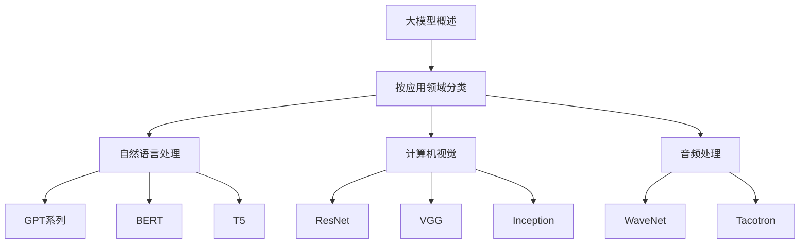
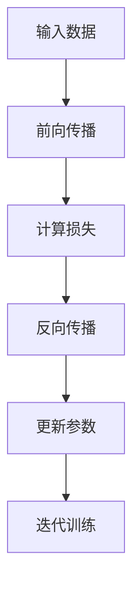

                 

### 第一部分: 大模型概述

#### 第1章: 大模型基础与分类

##### 1.1 大模型的概念与特征

大模型，通常指的是拥有数亿乃至数万亿参数的深度学习模型。这些模型通常通过大量的数据进行训练，具备强大的泛化能力和处理复杂任务的能力。

**大模型的概念**：

- 大模型，通常指的是拥有数亿乃至数万亿参数的深度学习模型。
- 这些模型通常通过大量的数据进行训练，具备强大的泛化能力和处理复杂任务的能力。

**大模型的特征**：

- **参数量巨大**：具有数百万至数十亿个参数。
- **训练数据量庞大**：通常需要数十TB的训练数据。
- **计算资源需求高**：训练和推理过程需要大量的计算资源。
- **强大的泛化能力**：可以应用于各种不同的领域和任务。

**大模型的发展历程**：

- **2012年**：AlexNet的出现，标志着深度学习在图像识别领域的突破。
- **2017年**：Transformer架构的提出，使得自然语言处理任务取得了重大进展。
- **2020年**：GPT-3发布，展示了大模型在文本生成和理解方面的强大能力。

##### 1.2 大模型的分类

**按应用领域分类**：

- **自然语言处理（NLP）**：如BERT、GPT等。
- **计算机视觉**：如ResNet、VGG等。
- **音频处理**：如WaveNet、Tacotron等。

**按模型架构分类**：

- **Transformer架构**：如BERT、GPT、T5等。
- **卷积神经网络（CNN）**：如ResNet、VGG等。
- **循环神经网络（RNN）**：如LSTM、GRU等。

**主流大模型简介**：

- **GPT系列**：
  - GPT、GPT-2、GPT-3
  - 主要应用于自然语言处理，具有强大的文本生成和理解能力。

- **BERT**：
  - BERT、BERT-Large
  - 主要用于自然语言处理中的预训练任务，具备上下文理解的能力。

- **T5**：
  - T5
  - 是一个通用的预训练模型，可以应用于多种自然语言处理任务。

- **图像处理模型**：
  - ResNet、VGG、Inception等
  - 主要应用于计算机视觉任务，如图像分类、目标检测等。

##### 1.3 大模型的分类与应用领域

使用Mermaid流程图展示大模型的分类与应用领域：



#### 第2章: 大模型核心技术

##### 2.1 深度学习基础

**深度学习基本概念**：

- **神经元**：构成神经网络的基本单元。
- **神经网络**：由多个神经元组成的网络。
- **前向传播与反向传播**：深度学习模型训练的基本过程。

**多层感知机（MLP）**：

- **定义**：一种前馈神经网络，具有多个隐层。
- **优点**：简单、易于理解。
- **缺点**：易过拟合，无法处理非线性问题。

**卷积神经网络（CNN）**：

- **定义**：一种专门用于图像处理任务的神经网络。
- **关键组件**：卷积层、池化层、全连接层。
- **优点**：能够自动提取图像特征，减少参数数量。
- **缺点**：难以处理非结构化数据。

**循环神经网络（RNN）**：

- **定义**：一种能够处理序列数据的神经网络。
- **关键组件**：隐藏层、循环链接。
- **优点**：能够捕捉时间序列数据中的长期依赖关系。
- **缺点**：梯度消失、梯度爆炸问题。

##### 2.2 Transformer架构

**定义**：

- Transformer是一种基于自注意力机制的深度学习模型，最初由Google提出。

**核心思想**：

- 使用自注意力机制来代替传统的循环神经网络，从而更好地捕捉数据中的长距离依赖关系。

**关键组件**：

- **编码器（Encoder）**：用于提取输入数据的特征。
- **解码器（Decoder）**：用于生成输出数据。

**优点**：

- **高效**：可以并行处理输入数据。
- **强大**：能够捕捉长距离依赖关系。

**缺点**：

- **计算复杂度较高**：需要大量的计算资源。
- **训练时间较长**：通常需要大量的训练数据。

##### 伪代码：Transformer架构

```python
function Transformer(input_sequence, target_sequence):
    # 编码器
    encoder_output = Encoder(input_sequence)
    # 解码器
    decoder_output = Decoder(encoder_output, target_sequence)
    return decoder_output
```

### 数学模型和数学公式

- **激活函数**：
  - $$ f(x) = \text{ReLU}(x) = \max(0, x) $$

- **损失函数**：
  - $$ L(\theta) = -\frac{1}{m} \sum_{i=1}^{m} y_i \log(\hat{y}_i) $$

- **梯度下降**：
  - $$ \theta = \theta - \alpha \nabla_{\theta} L(\theta) $$

##### 详细讲解和举例说明

- **激活函数ReLU**：
  - **优点**：解决了梯度消失问题，加速了训练过程。
  - **缺点**：可能导致神经元无法激活（Dead Neurons）。

- **损失函数交叉熵**：
  - **优点**：能够很好地衡量模型预测与真实标签之间的差异。
  - **缺点**：在预测概率接近0或1时，梯度可能变得很小或非常大，影响训练过程。

- **梯度下降**：
  - **优点**：简单有效，能够收敛到局部最小值。
  - **缺点**：需要选择合适的步长（learning rate），否则可能导致训练不稳定。

##### 伪代码：深度学习模型训练过程



#### Mermaid 流程图：深度学习模型训练过程


### 第3章: 大模型应用实例

##### 3.1 大模型在自然语言处理中的应用

- **任务**：文本分类
- **数据集**：新闻分类数据集
- **模型**：使用BERT模型进行预训练，然后进行微调。

##### 伪代码：文本分类任务

```python
function TextClassification(data, labels, model):
    # 预训练BERT模型
    model = PretrainBERT(data)
    # 微调模型
    model = FineTuneBERT(model, labels)
    return model
```

##### 3.2 大模型在计算机视觉中的应用

- **任务**：图像分类
- **数据集**：ImageNet数据集
- **模型**：使用ResNet模型进行预训练，然后进行微调。

##### 伪代码：图像分类任务

```python
function ImageClassification(data, labels, model):
    # 预训练ResNet模型
    model = PretrainResNet(data)
    # 微调模型
    model = FineTuneResNet(model, labels)
    return model
```

### 项目实战：文本分类任务

#### 开发环境搭建

- **环境要求**：
  - Python 3.8+
  - TensorFlow 2.6+
  - BERT模型预训练权重

- **安装命令**：

```bash
pip install tensorflow
pip install bert-for-tensorflow
```

#### 源代码实现和详细解读

##### 代码实现

```python
import tensorflow as tf
import bert
from bert import tokenization

# 准备数据
def load_data():
    # 读取数据集
    # ...
    return input_ids, input_mask, segment_ids, labels

# 构建BERT模型
def build_model():
    # 加载BERT模型
    bert_config = bert.BertConfig.from_json_file('bert_config.json')
    bert = bert.BertModel(config=bert_config)
    # 添加全连接层
    output = tf.keras.layers.Dense(1, activation='sigmoid')(bert.output)
    model = tf.keras.Model(inputs=bert.input, outputs=output)
    return model

# 训练模型
def train_model(model, input_ids, input_mask, segment_ids, labels):
    # 编译模型
    model.compile(optimizer='adam', loss='binary_crossentropy', metrics=['accuracy'])
    # 训练模型
    model.fit([input_ids, input_mask, segment_ids], labels, epochs=3, batch_size=32)
    return model

# 主函数
if __name__ == '__main__':
    # 加载数据
    input_ids, input_mask, segment_ids, labels = load_data()
    # 构建模型
    model = build_model()
    # 训练模型
    model = train_model(model, input_ids, input_mask, segment_ids, labels)
```

##### 代码解读与分析

- **数据预处理**：读取新闻分类数据集，并进行预处理，包括分词、编码等操作。
- **模型构建**：加载预训练的BERT模型，并添加全连接层进行分类。
- **模型训练**：使用训练数据对模型进行训练，并评估模型的性能。

### 第4章: 大模型优化与调优

##### 4.1 大模型训练技巧

- **数据增强**：通过随机裁剪、旋转、翻转等方式增加训练数据的多样性。
- **学习率调整**：使用学习率调度策略，如学习率衰减、余弦退火等。
- **正则化**：应用L1、L2正则化，防止模型过拟合。

##### 4.2 大模型推理优化

- **量化**：将模型参数的精度降低，减少计算资源的需求。
- **模型压缩**：通过剪枝、量化、蒸馏等方法减小模型大小。
- **硬件加速**：使用GPU、TPU等硬件加速模型推理。

##### 4.3 大模型在实际应用中的挑战

- **计算资源消耗**：大模型通常需要大量的计算资源和存储空间。
- **数据隐私保护**：在应用大模型时，需要保护用户的隐私数据。
- **模型解释性**：大模型通常难以解释，对于某些应用场景可能不够透明。

### 第5章: 大模型在创业公司中的应用

##### 5.1 创业公司采用大模型的策略

- **市场定位**：明确公司的市场定位，选择适合大模型应用的业务领域。
- **技术储备**：建立强大的技术团队，掌握大模型的训练、优化和推理技术。
- **资金投入**：合理分配资金，确保大模型项目的持续投入。

##### 5.2 大模型在创业公司产品策略中的应用

- **产品创新**：利用大模型进行产品创新，提升用户体验。
- **需求预测**：通过大模型进行需求预测，优化产品开发流程。
- **个性化推荐**：利用大模型进行用户行为分析，提供个性化推荐。

##### 5.3 大模型在创业公司中的案例研究

- **案例1**：某创业公司利用BERT模型进行搜索引擎优化，提升搜索结果的相关性和用户体验。
- **案例2**：某创业公司利用ResNet模型进行图像识别，提升产品线的自动化程度。

### 第6章: 大模型开发工具与资源

##### 6.1 主流深度学习框架

- **TensorFlow**：由Google开发，支持多种深度学习模型。
- **PyTorch**：由Facebook开发，以动态计算图著称。
- **MXNet**：由Apache基金会开发，支持多种编程语言。
- **其他框架**：如Caffe、Theano、Keras等。

##### 6.2 大模型开发资源

- **开源代码**：如HuggingFace的Transformers库。
- **教程与文档**：如TensorFlow官方文档、PyTorch官方文档。
- **社区与论坛**：如Stack Overflow、Reddit的深度学习板块。

### 第7章: 大模型未来发展趋势

##### 7.1 大模型在行业中的应用趋势

- **医疗健康**：利用大模型进行疾病预测、诊断和个性化治疗。
- **金融科技**：利用大模型进行风险控制、投资策略和信用评估。
- **智能制造**：利用大模型进行生产优化、故障预测和质量控制。

##### 7.2 大模型技术发展趋势

- **模型压缩与优化**：通过算法改进和硬件优化，降低大模型对计算资源的需求。
- **可解释性**：提高大模型的解释性，使其在关键应用场景中更加可靠。
- **联邦学习**：利用分布式计算技术，实现大模型的安全训练和部署。

### 附录

##### 附录 A: 大模型开发工具与资源

- **A.1 主流深度学习框架对比**
  - **TensorFlow**：支持灵活的模型构建和优化，生态系统丰富。
  - **PyTorch**：动态计算图，便于模型开发和调试。
  - **MXNet**：多语言支持，适合不同开发需求。

- **A.2 大模型开发资源**
  - **开源代码**：如HuggingFace的Transformers库。
  - **教程与文档**：如TensorFlow官方文档、PyTorch官方文档。
  - **社区与论坛**：如Stack Overflow、Reddit的深度学习板块。

文章标题：大模型在 AI 创业公司产品策略中的应用

文章关键词：大模型、AI创业公司、产品策略、深度学习、自然语言处理

文章摘要：
本文深入探讨了大型深度学习模型在 AI 创业公司产品策略中的应用。从基础概念、核心技术、应用实例、优化与调优到创业公司应用策略，全面解析了如何利用大模型提升创业公司产品的竞争力。通过实例代码展示，读者将了解如何在大模型开发环境中搭建和训练模型，从而为创业公司的技术发展提供指导。此外，文章还探讨了大模型在行业中的应用趋势和未来发展趋势，为读者提供了前瞻性视野。

