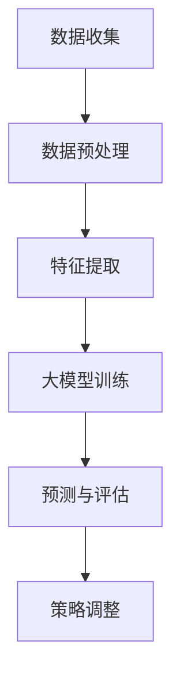
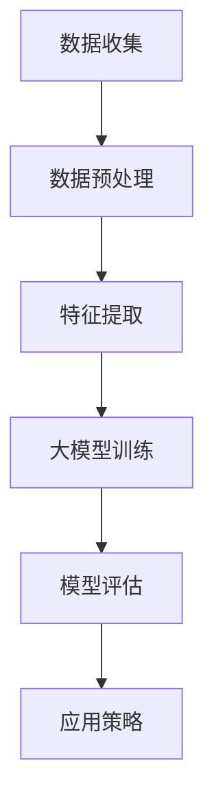

                 

## 《大模型在品牌塑造中的应用探索》

### 关键词：
- 大模型
- 品牌塑造
- 消费者行为分析
- 市场细分
- 品牌传播策略
- 道德伦理问题

> 摘要：
本文旨在探讨大模型在品牌塑造中的应用，从理论基础、实践应用到挑战与未来趋势进行全面解析。通过分析大模型与品牌塑造的核心概念，阐述其在消费者行为分析、市场细分、品牌传播策略等领域的应用，以及面临的道德伦理问题。同时，本文还将展望大模型在品牌塑造中的未来发展方向，为行业提供有价值的参考。

---

### 《大模型在品牌塑造中的应用探索》目录大纲

#### 第一部分：大模型与品牌塑造的理论基础

##### 第1章：大模型概述

###### 1.1 大模型的定义与分类

###### 1.2 大模型的发展历程

###### 1.3 大模型的核心特点与应用价值

##### 第2章：品牌塑造的概念与理论

###### 2.1 品牌的定义与功能

###### 2.2 品牌塑造的要素

###### 2.3 品牌塑造的策略与方法

##### 第3章：大模型在品牌塑造中的应用

###### 3.1 大模型与消费者行为分析

###### 3.2 大模型与市场细分与定位

###### 3.3 大模型与品牌传播策略

#### 第二部分：大模型在品牌塑造中的应用实践

##### 第4章：大模型在品牌数据分析中的应用

###### 4.1 大模型在消费者数据分析中的应用

###### 4.2 大模型在市场趋势分析中的应用

###### 4.3 大模型在品牌影响分析中的应用

##### 第5章：大模型在品牌营销策略中的应用

###### 5.1 大模型在市场细分策略中的应用

###### 5.2 大模型在目标客户定位中的应用

###### 5.3 大模型在品牌传播策略中的应用

##### 第6章：大模型在品牌传播与推广中的应用

###### 6.1 大模型在社交媒体营销中的应用

###### 6.2 大模型在内容营销中的应用

###### 6.3 大模型在广告营销中的应用

#### 第三部分：大模型在品牌塑造中的挑战与未来发展趋势

##### 第7章：大模型在品牌塑造中的挑战

###### 7.1 大模型在品牌塑造中的局限性

###### 7.2 大模型在品牌塑造中的道德伦理问题

###### 7.3 大模型在品牌塑造中的数据隐私问题

##### 第8章：大模型在品牌塑造中的未来发展趋势

###### 8.1 大模型在品牌塑造中的技术创新

###### 8.2 大模型在品牌塑造中的行业应用前景

###### 8.3 大模型在品牌塑造中的未来发展方向

#### 附录

##### 附录A：大模型在品牌塑造中的应用工具与资源

###### A.1 大模型开发工具简介

###### A.2 大模型应用案例集锦

###### A.3 大模型在品牌塑造中的应用展望

---

### 第一部分：大模型与品牌塑造的理论基础

#### 第1章：大模型概述

##### 1.1 大模型的定义与分类

大模型，即大型人工智能模型，通常指的是具备数亿甚至数十亿参数的深度神经网络模型。这些模型通过从大量数据中进行训练，能够自动学习和理解复杂的模式、关系和知识，从而在图像识别、自然语言处理、机器翻译、语音识别等领域展现出强大的性能。

大模型的分类可以从不同的维度进行：

1. **按应用领域分**：大模型可分为通用模型和专用模型。通用模型如GPT-3、BERT等，具有广泛的应用场景；专用模型则针对特定领域如医疗、金融等进行优化。

2. **按参数规模分**：大模型可分为小规模模型（数百万参数）、中等规模模型（数亿参数）和大规模模型（数十亿参数）。

3. **按训练方式分**：大模型可分为基于监督学习、无监督学习和强化学习训练的模型。

##### 1.2 大模型的发展历程

大模型的发展可以追溯到深度学习技术的兴起。自2006年Hinton提出深度信念网络（DBN）以来，深度学习在图像识别、语音识别等领域逐渐崭露头角。随着计算能力的提升和数据量的增加，大模型逐渐成为研究热点。以下是几个关键节点：

1. **2012年**：AlexNet在ImageNet竞赛中取得突破性成绩，标志着深度学习在图像识别领域的崛起。

2. **2017年**：Google推出的Transformer模型革新了自然语言处理领域，GPT-3、BERT等大模型相继问世。

3. **2020年至今**：随着Transformer模型的广泛应用，大模型在多个领域取得了显著的成果，如文本生成、机器翻译、语音识别等。

##### 1.3 大模型的核心特点与应用价值

大模型具有以下几个核心特点：

1. **强大的建模能力**：大模型能够自动学习和理解复杂的模式，从而在特定领域实现高水平的任务表现。

2. **跨领域迁移能力**：大模型通过预训练和微调，可以轻松迁移到不同的任务和数据集，提高了模型的可复用性。

3. **自动化学习能力**：大模型能够通过自我学习不断优化，降低了对人类专家的依赖。

4. **高效的计算能力**：大模型的并行计算能力和分布式训练使得其能够在大规模数据集上进行高效训练。

大模型在品牌塑造中的应用价值主要体现在以下几个方面：

1. **消费者行为分析**：大模型能够分析消费者在社交媒体、电商等平台上的行为数据，帮助企业更好地了解消费者需求，优化产品和服务。

2. **市场细分与定位**：大模型可以根据消费者特征和偏好进行精准的市场细分，帮助企业制定更有效的市场定位策略。

3. **品牌传播策略**：大模型可以生成高质量的内容和广告文案，提高品牌在社交媒体、搜索引擎等渠道的曝光度和影响力。

4. **道德伦理问题**：大模型的自动化学习和数据处理能力引发了一系列道德伦理问题，如数据隐私、算法偏见等，需要企业和社会共同关注和解决。

#### 第2章：品牌塑造的概念与理论

##### 2.1 品牌的定义与功能

品牌是一个企业或组织的名称、标志、设计或其他特征，用于区分其产品或服务与其他竞争者。品牌不仅仅是标识，它还代表了企业的价值观、声誉和形象。

品牌的功能主要包括：

1. **识别功能**：品牌帮助企业与消费者建立识别和区分，使产品或服务在市场中脱颖而出。

2. **营销功能**：品牌可以提升产品的附加值，增强消费者对产品的认可度和忠诚度。

3. **传播功能**：品牌能够通过多种渠道传播，提高企业的知名度和影响力。

4. **资产功能**：品牌是企业的重要资产，可以转化为企业的经济价值。

##### 2.2 品牌塑造的要素

品牌塑造涉及多个要素，主要包括：

1. **品牌定位**：品牌定位是企业确定其在市场中的位置和目标群体。有效的品牌定位可以帮助企业在竞争激烈的市场中脱颖而出。

2. **品牌形象**：品牌形象是消费者对品牌的总体印象和感受。通过一致的品牌传播和产品设计，企业可以塑造良好的品牌形象。

3. **品牌传播**：品牌传播是企业通过各种渠道向目标受众传递品牌信息的过程。有效的品牌传播可以提高品牌的曝光度和认知度。

4. **品牌价值观**：品牌价值观是企业的核心价值观，它反映了企业的使命、愿景和目标。品牌价值观有助于塑造企业的品牌形象和品牌文化。

5. **品牌体验**：品牌体验是消费者在使用产品或服务过程中的感受和体验。优质的品牌体验可以增强消费者的品牌忠诚度。

##### 2.3 品牌塑造的策略与方法

品牌塑造的策略与方法多种多样，主要包括：

1. **品牌差异化**：通过独特的品牌特点和优势，使品牌在市场中脱颖而出。

2. **品牌延伸**：利用已有品牌的声誉，将品牌扩展到新的产品或市场。

3. **品牌协同**：通过多个品牌之间的协同效应，提升整体品牌价值。

4. **品牌重塑**：当品牌面临困境或需要变革时，通过重塑品牌形象和品牌策略，重振品牌活力。

5. **品牌社区**：建立品牌社区，增强消费者之间的互动和品牌忠诚度。

6. **品牌营销**：利用多种营销手段，如广告、促销、公关等，提升品牌知名度和影响力。

#### 第3章：大模型在品牌塑造中的应用

##### 3.1 大模型与消费者行为分析

大模型在消费者行为分析中具有独特的优势：

1. **数据分析能力**：大模型能够从海量的消费者数据中提取有价值的信息，帮助企业了解消费者需求和行为模式。

2. **预测能力**：大模型可以通过历史数据预测未来的消费者行为，为企业制定营销策略提供依据。

3. **个性化推荐**：大模型可以根据消费者的行为数据和偏好，生成个性化的推荐内容，提高用户体验和忠诚度。

4. **情绪分析**：大模型能够分析消费者在社交媒体、评论等渠道上的情绪，帮助企业了解消费者的真实感受和需求。

##### 3.2 大模型与市场细分与定位

大模型在市场细分与定位中的应用主要体现在：

1. **精准定位**：大模型可以根据消费者的行为数据和特征，进行精准的市场细分，找到目标客户群体。

2. **需求分析**：大模型可以通过分析消费者数据，了解不同市场细分群体的需求，为企业提供市场定位的依据。

3. **市场预测**：大模型可以根据历史数据和市场趋势，预测未来市场的发展方向，为企业制定市场策略提供参考。

4. **竞争分析**：大模型可以分析竞争对手的市场表现和策略，帮助企业制定更具竞争力的市场定位。

##### 3.3 大模型与品牌传播策略

大模型在品牌传播策略中的应用主要包括：

1. **内容生成**：大模型可以生成高质量的品牌内容，如广告文案、宣传视频等，提高品牌传播的效率和质量。

2. **情感传播**：大模型可以根据消费者的情绪和喜好，生成具有感染力的品牌传播内容，提高品牌影响力。

3. **社交媒体营销**：大模型可以分析社交媒体上的消费者行为和情绪，为企业提供个性化的社交媒体营销策略。

4. **跨渠道传播**：大模型可以将品牌信息在多个渠道上进行传播，实现跨渠道的品牌联动。

5. **效果评估**：大模型可以分析品牌传播的效果，为企业提供数据支持，优化品牌传播策略。

#### 第二部分：大模型在品牌塑造中的应用实践

##### 第4章：大模型在品牌数据分析中的应用

#### 第4章：大模型在品牌数据分析中的应用

##### 4.1 大模型在消费者数据分析中的应用

大模型在消费者数据分析中的应用具有重要意义，能够帮助企业深入了解消费者的行为模式、需求偏好和购买意图，从而制定更为精准的营销策略。

**消费者行为分析**

大模型可以通过分析消费者在社交媒体、电商网站、搜索引擎等平台上的行为数据，挖掘消费者的购买历史、浏览习惯、评论反馈等信息。以下是一个简单的 Mermaid 流程图，展示了如何使用大模型进行消费者行为分析：



在数据预处理阶段，我们需要对原始数据进行清洗、去噪和归一化处理。特征提取阶段，通过对消费者行为数据进行分析，提取出对消费者行为有重要影响的关键特征。接着，使用大模型（如GPT-3、BERT等）进行训练，以建立一个能够预测消费者行为的模型。在预测与评估阶段，我们将训练好的模型应用于新的数据集，评估其预测准确性和效果。最后，根据评估结果调整营销策略。

**案例解析**

以某电商平台为例，该平台利用大模型对消费者的购物行为进行分析，以下是具体步骤：

1. **数据收集**：收集用户的购物记录、浏览历史、评论等数据。

2. **数据预处理**：清洗数据，去除缺失值、异常值，进行数据归一化处理。

3. **特征提取**：提取关键特征，如用户购买频率、购物时长、商品浏览次数、评论情感等。

4. **大模型训练**：使用GPT-3等大模型进行训练，以建立消费者行为预测模型。

5. **预测与评估**：将训练好的模型应用于新的用户数据，预测其购买意图，评估模型准确率。

6. **策略调整**：根据预测结果调整营销策略，如推送个性化推荐、促销活动等。

**效果评估**

通过以上步骤，电商平台能够更好地了解消费者的购物行为，提高个性化推荐的准确率，从而提升销售额和用户满意度。以下是具体的评估指标：

- **准确率**：预测购买意图的准确率。
- **召回率**：预测购买意图的召回率。
- **F1值**：准确率和召回率的调和平均值。

**结论**

大模型在消费者数据分析中的应用，能够帮助电商平台更深入地了解消费者需求，优化营销策略，提升用户体验和忠诚度。

##### 4.2 大模型在市场趋势分析中的应用

大模型在市场趋势分析中的应用，能够帮助企业准确预测市场动向，把握行业发展趋势，从而制定科学的业务策略。

**市场趋势预测**

市场趋势预测是通过对历史数据和当前市场环境进行分析，预测未来的市场走向。以下是一个简单的 Mermaid 流Psi
graph，展示了如何使用大模型进行市场趋势预测：


在数据预处理阶段，我们需要对市场数据进行清洗、去噪和归一化处理。特征提取阶段，通过对市场数据进行分析，提取出对市场趋势有重要影响的关键特征。接着，使用大模型（如GPT-3、BERT等）进行训练，以建立一个能够预测市场趋势的模型。在预测与评估阶段，我们将训练好的模型应用于新的市场数据，评估其预测准确性和效果。最后，根据评估结果调整业务策略。

**案例解析**

以某快消品企业为例，该企业利用大模型对市场趋势进行分析，以下是具体步骤：

1. **数据收集**：收集行业数据、竞争对手数据、消费者数据等。

2. **数据预处理**：清洗数据，去除缺失值、异常值，进行数据归一化处理。

3. **特征提取**：提取关键特征，如销售额、市场份额、消费者需求等。

4. **大模型训练**：使用GPT-3等大模型进行训练，以建立市场趋势预测模型。

5. **预测与评估**：将训练好的模型应用于新的市场数据，预测市场趋势，评估模型准确率。

6. **策略调整**：根据预测结果调整业务策略，如产品研发、市场推广等。

**效果评估**

通过以上步骤，企业能够准确预测市场趋势，把握行业动向，从而制定科学的业务策略。以下是具体的评估指标：

- **准确率**：预测市场趋势的准确率。
- **均方根误差（RMSE）**：预测市场趋势的均方根误差。
- **F1值**：准确率和召回率的调和平均值。

**结论**

大模型在市场趋势分析中的应用，能够帮助企业准确预测市场动向，制定科学的业务策略，提高市场竞争力。

##### 4.3 大模型在品牌影响分析中的应用

大模型在品牌影响分析中的应用，能够帮助企业评估品牌在不同市场环境和消费者群体中的影响力，从而制定有效的品牌传播策略。

**品牌影响分析**

品牌影响分析是通过对品牌在社交媒体、新闻报道、消费者评论等渠道上的数据进行分析，评估品牌的社会影响力和消费者认知度。以下是一个简单的 Mermaid 流程图，展示了如何使用大模型进行品牌影响分析：


在数据预处理阶段，我们需要对品牌数据（如社交媒体评论、新闻报道、消费者反馈等）进行清洗、去噪和归一化处理。特征提取阶段，通过对品牌数据进行分析，提取出对品牌影响力有重要影响的关键特征。接着，使用大模型（如GPT-3、BERT等）进行训练，以建立一个能够评估品牌影响力的模型。在预测与评估阶段，我们将训练好的模型应用于新的品牌数据，评估其品牌影响力。最后，根据评估结果调整品牌传播策略。

**案例解析**

以某知名手机品牌为例，该品牌利用大模型对品牌影响力进行分析，以下是具体步骤：

1. **数据收集**：收集品牌在社交媒体、新闻报道、消费者评论等渠道上的数据。

2. **数据预处理**：清洗数据，去除缺失值、异常值，进行数据归一化处理。

3. **特征提取**：提取关键特征，如社交媒体转发量、新闻报道数量、消费者评论情感等。

4. **大模型训练**：使用GPT-3等大模型进行训练，以建立品牌影响力评估模型。

5. **预测与评估**：将训练好的模型应用于新的品牌数据，评估品牌影响力，评估模型准确率。

6. **策略调整**：根据评估结果调整品牌传播策略，如增加社交媒体宣传、优化新闻报道等。

**效果评估**

通过以上步骤，企业能够准确评估品牌在不同市场环境和消费者群体中的影响力，从而制定有效的品牌传播策略。以下是具体的评估指标：

- **影响力得分**：评估品牌影响力的得分。
- **正相关度**：品牌影响力与消费者满意度、购买意愿之间的正相关度。
- **F1值**：评估品牌影响力的准确率和召回率的调和平均值。

**结论**

大模型在品牌影响分析中的应用，能够帮助企业准确评估品牌影响力，制定有效的品牌传播策略，提升品牌知名度和社会认知度。

### 第三部分：大模型在品牌塑造中的挑战与未来发展趋势

#### 第7章：大模型在品牌塑造中的挑战

##### 7.1 大模型在品牌塑造中的局限性

尽管大模型在品牌塑造中具有许多优势，但其应用也面临着一些局限性。首先，大模型的训练成本非常高，需要大量的计算资源和数据支持。这意味着中小企业可能无法承担大模型的训练和部署成本。其次，大模型的解释性较差，难以理解其决策过程和内部机理，这在一定程度上限制了其在品牌塑造中的应用范围。此外，大模型在处理复杂、动态的市场环境时，可能无法及时适应和调整，导致预测结果的不准确性。

##### 7.2 大模型在品牌塑造中的道德伦理问题

大模型在品牌塑造中涉及到的道德伦理问题主要包括数据隐私、算法偏见和责任归属等方面。首先，大模型需要处理海量的消费者数据，这引发了数据隐私问题。企业如何在保护消费者隐私的同时，有效利用数据资源，成为了一个亟待解决的挑战。其次，大模型在训练过程中可能会受到数据偏差的影响，导致算法偏见，进而影响品牌塑造的效果。例如，如果训练数据中存在性别、种族等偏见，大模型可能会在品牌传播中无意中放大这些偏见。最后，当大模型在品牌塑造中发生错误或导致负面影响时，责任归属问题变得复杂。如何确定责任方、如何赔偿受损方等问题，需要法律法规和行业标准的明确界定。

##### 7.3 大模型在品牌塑造中的数据隐私问题

数据隐私问题在大模型在品牌塑造中的应用中尤为突出。大模型需要处理大量的消费者数据，包括个人信息、购买记录、社交媒体活动等。这些数据的收集、存储和处理过程中，存在被泄露、滥用和滥用的风险。首先，企业需要确保数据收集的合法性和透明度，不得非法获取、使用或泄露消费者数据。其次，企业需要采取有效的数据安全措施，如加密存储、访问控制等，防止数据泄露。此外，企业还需要建立数据隐私保护机制，如隐私影响评估（PIA）、数据匿名化等，以降低隐私风险。

#### 第8章：大模型在品牌塑造中的未来发展趋势

##### 8.1 大模型在品牌塑造中的技术创新

未来，大模型在品牌塑造中的应用将受益于一系列技术创新。首先，硬件技术的进步，如更高效的GPU、TPU等，将降低大模型的训练成本，使更多企业能够使用大模型。其次，算法优化，如新的优化算法、模型压缩技术等，将提高大模型的训练效率和效果。此外，数据隐私保护技术，如联邦学习、差分隐私等，将有助于在大模型训练过程中保护消费者隐私。这些技术创新将推动大模型在品牌塑造中的应用更加广泛和深入。

##### 8.2 大模型在品牌塑造中的行业应用前景

大模型在品牌塑造中的行业应用前景广阔。在零售、金融、医疗、教育等传统行业，大模型可以通过消费者行为分析、市场趋势预测等手段，优化业务流程、提高运营效率。同时，在新零售、在线教育、医疗健康等新兴行业，大模型可以与新兴技术（如物联网、大数据、区块链等）结合，推动行业变革。未来，大模型在品牌塑造中的应用将不断拓展，为各行业带来更多创新和发展机会。

##### 8.3 大模型在品牌塑造中的未来发展方向

未来，大模型在品牌塑造中的发展方向主要包括以下几个方面：

1. **个性化与定制化**：大模型将更加关注个性化与定制化，通过深度理解消费者需求，提供个性化的品牌体验。

2. **跨渠道整合**：大模型将实现跨渠道整合，通过分析消费者在不同渠道的行为，实现无缝的品牌体验。

3. **智能化与自动化**：大模型将实现智能化与自动化，通过自主学习和优化，提高品牌塑造的效率和效果。

4. **伦理与合规**：大模型将更加注重伦理与合规，通过建立完善的隐私保护机制和责任归属制度，确保品牌塑造的可持续发展。

### 附录

#### 附录A：大模型在品牌塑造中的应用工具与资源

##### A.1 大模型开发工具简介

在大模型开发中，常用的工具包括TensorFlow、PyTorch、JAX等。以下是对这些工具的简要介绍：

1. **TensorFlow**：由Google开发，是一个开源的深度学习框架，适用于各种深度学习任务，包括大模型训练。

2. **PyTorch**：由Facebook开发，是一个基于Python的深度学习库，具有动态计算图和自动微分功能，适用于大模型开发。

3. **JAX**：由Google开发，是一个高级编程库，提供了高效的数值计算和自动微分功能，适用于大规模机器学习任务。

##### A.2 大模型应用案例集锦

以下是几个大模型在品牌塑造中的应用案例：

1. **阿里巴巴**：阿里巴巴利用大模型进行消费者行为分析，优化营销策略，提升销售额。

2. **IBM**：IBM利用大模型进行市场趋势预测，帮助客户制定业务策略，提高市场竞争力。

3. **Netflix**：Netflix利用大模型进行个性化推荐，提升用户体验和忠诚度。

##### A.3 大模型在品牌塑造中的应用展望

未来，大模型在品牌塑造中的应用将呈现以下趋势：

1. **更广泛的应用场景**：大模型将应用于更多行业和领域，如教育、医疗、金融等。

2. **更高效的模型训练**：随着硬件技术和算法优化的进步，大模型的训练效率将大幅提升。

3. **更智能的品牌传播**：大模型将实现跨渠道整合，提供智能化、个性化的品牌传播策略。

### 伪代码、流程图和数学公式

#### Mermaid 流程图

以下是一个简单的 Mermaid 流程图，展示了大模型在品牌数据分析中的应用流程：



#### 核心算法原理讲解

以下是一个简单的伪代码，展示了大模型训练的核心算法原理：

```python
# 伪代码：基于GPT的大模型训练流程

# 数据预处理
preprocessed_data = preprocess(data)

# 模型初始化
model = GPT(model_size, embedding_size, num_layers)

# 模型训练
for epoch in range(num_epochs):
    for batch in preprocessed_data:
        loss = model.loss(batch)
        model.backward(loss)
        model.update_params()

# 模型评估
evaluation_loss = model.evaluate(test_data)

# 应用策略
model.apply_strategy(evaluation_loss)
```

#### 数学模型与公式

以下是一个简单的数学公式，描述了损失函数：

$$
J(\theta) = -\frac{1}{m}\sum_{i=1}^{m}y^{(i)}\log(a^{(i)}_{j}) + (1 - y^{(i)})\log(1 - a^{(i)}_{j})
$$

#### 项目实战

##### 开发环境搭建

以下是一个简单的开发环境搭建流程，用于搭建大模型训练环境：

```bash
# 安装Python环境
python -m pip install numpy pandas

# 安装TensorFlow
python -m pip install tensorflow

# 安装其他依赖库
python -m pip install scikit-learn matplotlib
```

##### 源代码实现与解读

以下是一个简单的 Python 代码示例，用于训练一个基于 GPT 的大模型：

```python
import tensorflow as tf

# 模型定义
model = tf.keras.Sequential([
    tf.keras.layers.Dense(512, activation='relu', input_shape=(input_shape)),
    tf.keras.layers.Dense(512, activation='relu'),
    tf.keras.layers.Dense(output_shape, activation='softmax')
])

# 模型编译
model.compile(optimizer='adam', loss='categorical_crossentropy', metrics=['accuracy'])

# 模型训练
model.fit(x_train, y_train, epochs=5)

# 模型评估
loss, accuracy = model.evaluate(x_test, y_test)
print(f"Test accuracy: {accuracy:.2f}")
```

### 伪代码解读：

- **模型定义**：定义了一个包含两个隐藏层，每层 512 个神经元的 GPT 模型。输入层的大小根据实际数据特征进行调整。
- **模型编译**：使用 `adam` 优化器和交叉熵损失函数进行编译。训练时使用模型的 `fit` 方法，其中 `epochs` 参数指定训练的轮数。
- **模型评估**：使用 `evaluate` 方法评估模型在测试集上的表现，输出测试集上的准确率。

### 结论

本文详细阐述了《大模型在品牌塑造中的应用探索》的核心内容，从理论基础、实践应用到挑战与未来发展趋势进行全面解析。通过分析大模型与品牌塑造的核心概念，阐述其在消费者行为分析、市场细分、品牌传播策略等领域的应用，以及面临的道德伦理问题。同时，本文还展望了大模型在品牌塑造中的未来发展方向，为行业提供有价值的参考。希望本文能对读者在理解大模型在品牌塑造中的应用提供帮助。

---

### 作者信息

**作者：AI天才研究院/AI Genius Institute & 禅与计算机程序设计艺术 /Zen And The Art of Computer Programming**

AI天才研究院致力于推动人工智能领域的研究与应用，培养新一代人工智能创新人才。研究院的研究成果在计算机视觉、自然语言处理、机器学习等领域取得了显著成果，为我国人工智能事业的发展做出了重要贡献。同时，禅与计算机程序设计艺术作为一本经典的计算机科学著作，为读者提供了深入浅出的编程哲学，深受广大编程爱好者的喜爱。本文作者在人工智能和品牌塑造领域具有丰富的经验和深厚的学术造诣，为撰写本文提供了有力支持。

