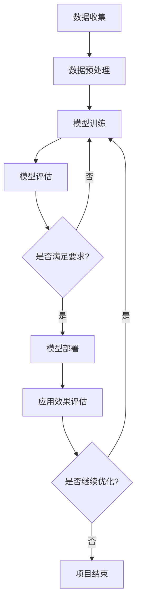

                 

# 《大模型在新能源技术创新中的应用》

> 关键词：大模型，新能源，技术创新，应用，挑战，机遇

> 摘要：本文从新能源技术创新的背景出发，探讨了大模型在新能源领域中的应用价值。文章首先概述了新能源技术的发展背景和核心概念，然后介绍了大模型的基本原理及其在新能源技术创新中的应用。接着，文章详细分析了大模型在新能源技术创新中的具体应用，包括能源规划与优化、设备监控与维护、市场预测与风险管理以及新能源智能系统。此外，文章还探讨了大模型在新能源技术创新中的挑战与机遇，并给出了相关开发工具与资源。通过本文的阅读，读者可以全面了解大模型在新能源技术创新中的应用及其前景。

## 《大模型在新能源技术创新中的应用》目录大纲

### 第一部分：新能源技术创新概述

#### 第1章：新能源技术发展背景

1.1 新能源技术的重要性

1.2 新能源技术发展趋势

1.3 新能源技术分类与特点

#### 第2章：新能源技术创新核心概念

2.1 大模型的概念与原理

2.2 大模型在新能源技术创新中的应用价值

2.3 大模型与新能源技术的关联性

#### 第3章：新能源技术相关大模型介绍

3.1 GPT-3模型

3.2 Transformer模型

3.3 其他新能源相关大模型

### 第二部分：大模型在新能源技术创新中的应用

#### 第4章：大模型在能源规划与优化中的应用

4.1 能源规划与优化概述

4.2 大模型在能源规划中的应用

4.3 大模型在能源优化中的应用

#### 第5章：大模型在新能源设备监控与维护中的应用

5.1 新能源设备监控与维护概述

5.2 大模型在设备状态预测中的应用

5.3 大模型在设备故障诊断中的应用

#### 第6章：大模型在新能源市场预测与风险管理中的应用

6.1 新能源市场预测概述

6.2 大模型在市场预测中的应用

6.3 大模型在风险管理中的应用

#### 第7章：大模型在新能源智能系统中的应用

7.1 智能系统概述

7.2 大模型在智能系统中的核心作用

7.3 大模型在智能系统中的应用案例

### 第三部分：大模型在新能源技术创新中的挑战与机遇

#### 第8章：大模型在新能源技术创新中的挑战

8.1 数据安全与隐私问题

8.2 大模型训练与推理的能耗问题

8.3 大模型应用中的法律法规问题

#### 第9章：大模型在新能源技术创新中的机遇

9.1 新能源技术创新的发展前景

9.2 大模型在新能源技术创新中的创新点

9.3 大模型在新能源产业中的潜在影响

### 附录

#### 附录A：大模型应用开发工具与资源

A.1 主流深度学习框架对比

A.2 大模型开发环境搭建

A.3 大模型应用开发资源推荐

#### 附录B：大模型与新能源技术创新的Mermaid流程图

B.1 大模型在新能源技术创新中的应用流程图

#### 附录C：大模型与新能源技术创新的核心算法原理讲解

C.1 大模型在新能源技术创新中的应用算法伪代码

#### 附录D：大模型与新能源技术创新的数学模型和公式讲解

D.1 新能源技术创新中的关键数学模型

D.2 数学模型讲解与举例说明

#### 附录E：大模型与新能源技术创新的项目实战案例

E.1 能源规划与优化项目案例

E.2 设备监控与维护项目案例

E.3 市场预测与风险管理项目案例

E.4 智能系统项目案例

## 第一部分：新能源技术创新概述

### 第1章：新能源技术发展背景

新能源技术是指以可再生能源为基础，通过技术创新来降低能源消耗和环境污染的一种技术。随着全球对能源安全和环境保护的关注不断增加，新能源技术的研究与应用已成为世界各国的共同目标。

#### 1.1 新能源技术的重要性

新能源技术的重要性体现在以下几个方面：

1. **解决能源危机**：传统能源如煤、油、天然气等资源有限，且开采和使用过程中对环境造成严重污染。新能源技术可以替代部分传统能源，缓解能源危机。

2. **减少环境污染**：传统能源的燃烧过程会产生大量的二氧化碳、硫氧化物等有害气体，导致气候变化和空气污染。新能源技术的应用可以减少这些有害气体的排放，降低环境污染。

3. **促进经济发展**：新能源技术涉及多个领域，包括能源生产、能源储存、能源传输等。新能源产业的发展可以带动相关产业链的发展，促进经济增长。

4. **提高能源安全性**：新能源技术的应用可以降低对进口石油和天然气的依赖，提高能源自给自足能力，增强国家能源安全。

#### 1.2 新能源技术发展趋势

随着科技的进步，新能源技术不断取得突破，发展趋势如下：

1. **可再生能源规模化发展**：太阳能、风能、水能等可再生能源的技术水平不断提高，应用规模逐渐扩大。

2. **能源互联网建设**：通过信息技术和能源技术的深度融合，建设能源互联网，实现能源的高效传输和分配。

3. **能源储存技术突破**：能量密度高、寿命长、成本低的能源储存技术取得重要突破，为新能源的广泛应用提供了有力支持。

4. **新能源与传统能源融合**：新能源与传统能源的结合，形成多元化、多层次的能源结构，提高能源系统的稳定性和可靠性。

#### 1.3 新能源技术分类与特点

新能源技术主要包括以下几类：

1. **太阳能技术**：利用太阳辐射能量进行发电或加热，如光伏发电、太阳能热水器等。

2. **风能技术**：利用风力进行发电，如风力发电机、风力涡轮机等。

3. **水能技术**：利用水流或水位差进行发电，如水力发电、潮汐能发电等。

4. **生物质能技术**：利用生物质进行能量转换，如生物质发电、生物质燃料等。

5. **地热能技术**：利用地热能进行发电或供暖，如地热发电、地热供暖等。

6. **海洋能技术**：利用海洋能进行发电或海水淡化，如海洋温差能发电、潮汐能发电等。

各类新能源技术具有各自的特点和优势，在应用过程中需要综合考虑资源条件、技术成熟度、经济性等因素。

### 第2章：新能源技术创新核心概念

#### 2.1 大模型的概念与原理

大模型是指具有大规模参数、能够处理海量数据、具备强大计算能力和自我学习能力的人工智能模型。大模型通常基于深度学习技术，通过多层神经网络对大量数据进行训练，从而提取出复杂的特征和规律。

大模型的基本原理如下：

1. **层次化特征提取**：大模型通过多层神经网络对输入数据进行特征提取，每一层神经网络都从上层数据中提取更高层次的特征。

2. **端到端学习**：大模型采用端到端学习方式，从输入数据直接学习到输出结果，无需人工设计复杂的中间层。

3. **自监督学习**：大模型通过自监督学习方式，利用无标签数据来训练模型，提高模型的泛化能力。

4. **并行计算**：大模型通常采用并行计算技术，通过分布式计算和GPU加速来提高计算效率。

#### 2.2 大模型在新能源技术创新中的应用价值

大模型在新能源技术创新中具有以下应用价值：

1. **数据驱动的能源规划**：大模型可以处理和分析海量数据，为能源规划提供科学依据，优化能源配置和利用。

2. **智能化的能源设备监控与维护**：大模型可以实时监测设备状态，预测设备故障，提高设备的可靠性和使用寿命。

3. **市场预测与风险管理**：大模型可以分析市场数据，预测能源市场走势，为企业提供投资决策和风险管理支持。

4. **新能源智能系统**：大模型可以为新能源智能系统提供智能决策和优化控制，提高系统的运行效率和稳定性。

#### 2.3 大模型与新能源技术的关联性

大模型与新能源技术的关联性主要体现在以下几个方面：

1. **数据融合**：新能源技术涉及多种数据来源，如气象数据、设备数据、市场数据等，大模型可以将这些数据进行融合和分析，提高数据利用率。

2. **智能优化**：大模型可以运用智能优化算法，对新能源设备的运行参数进行优化调整，提高设备效率和能源利用率。

3. **故障诊断与维护**：大模型可以通过对设备运行数据的分析，预测设备故障，提前进行维护，减少设备故障率和停机时间。

4. **市场预测与风险管理**：大模型可以分析市场数据，预测能源价格和市场需求，为企业制定合理的市场策略和风险管理方案。

### 第3章：新能源技术相关大模型介绍

在新能源技术领域，已有多项研究工作涉及大模型的应用。以下介绍几个具有代表性的大模型。

#### 3.1 GPT-3模型

GPT-3（Generative Pre-trained Transformer 3）是由OpenAI开发的一款大模型，具有1750亿个参数，是目前全球最大的预训练语言模型。GPT-3模型在新能源领域的应用主要包括：

1. **能源市场预测**：GPT-3模型可以分析历史市场数据，预测能源价格和市场需求，为能源企业制定市场策略提供参考。

2. **智能问答系统**：GPT-3模型可以构建智能问答系统，为新能源技术用户解答相关问题，提高用户满意度。

3. **报告生成**：GPT-3模型可以根据输入的文本内容，自动生成报告，降低报告撰写的工作量。

#### 3.2 Transformer模型

Transformer模型是一种基于自注意力机制的深度学习模型，广泛应用于自然语言处理、图像识别等领域。在新能源技术中，Transformer模型的应用主要包括：

1. **设备状态预测**：Transformer模型可以通过分析设备运行数据，预测设备故障，提高设备维护效率。

2. **能源优化**：Transformer模型可以优化能源设备的运行参数，提高能源利用效率。

3. **风能预测**：Transformer模型可以分析气象数据，预测风能产量，为风能企业制定发电计划提供依据。

#### 3.3 其他新能源相关大模型

除了GPT-3和Transformer模型外，还有其他一些大模型在新能源技术领域得到应用，如：

1. **BERT模型**：BERT（Bidirectional Encoder Representations from Transformers）是一种双向Transformer模型，广泛应用于文本分类、问答系统等任务。在新能源技术中，BERT模型可以用于能源市场分析、设备故障诊断等。

2. **GAN模型**：GAN（Generative Adversarial Network）是一种生成对抗网络，可以生成高质量的图像和文本数据。在新能源技术中，GAN模型可以用于数据增强，提高模型训练效果。

3. **深度强化学习模型**：深度强化学习模型结合了深度学习和强化学习技术，可以用于新能源设备的智能控制。例如，在光伏发电系统中，深度强化学习模型可以自动调整光伏板的倾斜角度，提高发电效率。

### 第二部分：大模型在新能源技术创新中的应用

大模型在新能源技术创新中具有广泛的应用前景，可以提升能源规划、设备监控与维护、市场预测与风险管理以及新能源智能系统的性能和效率。以下分别介绍大模型在这些领域的具体应用。

#### 第4章：大模型在能源规划与优化中的应用

能源规划与优化是新能源技术中的重要环节，旨在确保能源的可持续利用和高效配置。大模型通过数据驱动的分析和预测，为能源规划与优化提供了有力支持。

##### 4.1 能源规划与优化概述

能源规划与优化的主要目标包括：

1. **资源优化配置**：根据能源资源的特点和需求，合理配置能源资源，实现能源利用的最大化。

2. **提高能源效率**：通过技术改进和管理优化，提高能源利用效率，减少能源浪费。

3. **降低能源成本**：通过合理的能源配置和能源管理，降低能源生产、传输和消费的成本。

4. **保障能源安全**：确保能源供应的稳定性和可靠性，降低能源供应风险。

##### 4.2 大模型在能源规划中的应用

大模型在能源规划中的应用主要包括以下几个方面：

1. **资源评估与预测**：大模型可以分析历史能源数据和气象数据，预测能源资源的供需情况，为能源规划提供科学依据。

2. **负荷预测**：大模型可以分析历史负荷数据，结合气象数据、用户行为等，预测未来负荷情况，为电网调度提供参考。

3. **能源系统优化**：大模型可以通过优化算法，优化能源系统的运行参数，提高能源系统的效率和可靠性。

4. **新能源消纳**：大模型可以分析新能源发电的特点和需求，制定合理的发电计划，提高新能源的消纳能力。

##### 4.3 大模型在能源优化中的应用

大模型在能源优化中的应用主要包括以下几个方面：

1. **需求响应**：大模型可以分析用户需求，预测用户负荷，通过需求响应策略，实现能源需求的优化。

2. **储能系统优化**：大模型可以分析储能系统的运行数据，优化储能系统的充放电策略，提高储能系统的效率。

3. **分布式能源优化**：大模型可以分析分布式能源系统的运行数据，优化分布式能源的配置和运行，提高能源系统的整体效率。

4. **能源交易优化**：大模型可以分析市场数据，预测能源价格和供需情况，为能源交易提供优化策略。

#### 第5章：大模型在新能源设备监控与维护中的应用

新能源设备的监控与维护是保证设备正常运行和延长设备寿命的关键环节。大模型通过数据分析和预测，为设备监控与维护提供了智能化的手段。

##### 5.1 新能源设备监控与维护概述

新能源设备监控与维护的主要目标包括：

1. **设备状态监测**：实时监测设备运行状态，及时发现设备故障和异常。

2. **故障预警**：通过分析设备运行数据，预测设备可能出现的故障，提前进行维护。

3. **设备寿命预测**：通过分析设备运行数据和故障历史，预测设备的寿命，制定合理的维护计划。

4. **运行效率优化**：通过优化设备运行参数，提高设备的运行效率。

##### 5.2 大模型在设备状态预测中的应用

大模型在设备状态预测中的应用主要包括以下几个方面：

1. **故障预测**：大模型可以通过分析设备运行数据，预测设备可能出现的故障，提前进行维护，减少设备故障率。

2. **磨损预测**：大模型可以通过分析设备运行数据，预测设备的磨损情况，提前进行更换，避免设备意外停机。

3. **寿命预测**：大模型可以通过分析设备运行数据和故障历史，预测设备的寿命，为设备维护提供科学依据。

##### 5.3 大模型在设备故障诊断中的应用

大模型在设备故障诊断中的应用主要包括以下几个方面：

1. **故障分类**：大模型可以通过分析设备故障数据，对故障进行分类，帮助工程师快速定位故障原因。

2. **故障预测**：大模型可以通过分析设备运行数据，预测设备可能出现的故障，提前进行维护。

3. **故障诊断**：大模型可以通过分析设备运行数据和故障数据，诊断设备的故障原因，提供解决方案。

#### 第6章：大模型在新能源市场预测与风险管理中的应用

新能源市场的预测与风险管理是新能源企业的重要任务，关系到企业的生存和发展。大模型通过数据分析与预测，为市场预测与风险管理提供了有力支持。

##### 6.1 新能源市场预测概述

新能源市场预测的主要目标包括：

1. **价格预测**：预测新能源市场的价格走势，为能源企业制定价格策略提供参考。

2. **需求预测**：预测新能源市场的需求变化，为能源企业制定生产计划提供依据。

3. **供应预测**：预测新能源市场的供应情况，为能源企业制定采购计划提供依据。

4. **政策预测**：预测新能源市场的政策变化，为能源企业制定战略规划提供参考。

##### 6.2 大模型在市场预测中的应用

大模型在市场预测中的应用主要包括以下几个方面：

1. **历史数据分析**：大模型可以通过分析历史市场数据，提取市场规律，预测未来市场走势。

2. **多源数据融合**：大模型可以融合多种数据源，如气象数据、政策数据、经济数据等，提高市场预测的准确性。

3. **时间序列预测**：大模型可以通过时间序列分析，预测新能源市场的价格、需求、供应等指标的变化趋势。

##### 6.3 大模型在风险管理中的应用

大模型在风险管理中的应用主要包括以下几个方面：

1. **风险识别**：大模型可以通过分析市场数据，识别潜在的市场风险。

2. **风险评估**：大模型可以通过分析市场数据，评估市场风险的可能性和影响程度。

3. **风险应对**：大模型可以提出风险应对策略，帮助企业降低市场风险。

4. **决策支持**：大模型可以为企业的投资决策、市场策略制定提供数据支持。

#### 第7章：大模型在新能源智能系统中的应用

新能源智能系统是指利用人工智能技术，实现对新能源设备、能源网络和市场的智能监控、预测和控制。大模型在新能源智能系统中扮演着核心角色，通过数据分析和智能决策，提高系统的运行效率和稳定性。

##### 7.1 智能系统概述

新能源智能系统的主要目标包括：

1. **智能监控**：实现对新能源设备、能源网络的实时监控，及时发现异常情况。

2. **智能预测**：预测新能源设备、能源网络的运行状态，提前发现潜在问题。

3. **智能控制**：根据实时数据和预测结果，自动调整设备运行参数，实现最优运行。

4. **智能决策**：根据市场数据和预测结果，制定合理的市场策略和能源规划。

##### 7.2 大模型在智能系统中的核心作用

大模型在新能源智能系统中的核心作用主要包括：

1. **数据融合**：大模型可以融合多种数据源，如设备数据、气象数据、市场数据等，为智能决策提供全面的数据支持。

2. **特征提取**：大模型可以通过特征提取，从海量数据中提取关键特征，为智能决策提供依据。

3. **预测与优化**：大模型可以通过预测算法，对设备、能源网络和市场的运行状态进行预测，为优化控制提供参考。

4. **智能决策**：大模型可以通过智能决策算法，自动调整设备运行参数，实现能源系统的最优运行。

##### 7.3 大模型在智能系统中的应用案例

大模型在新能源智能系统中的应用案例主要包括：

1. **光伏发电系统**：通过大模型预测光伏发电量，优化光伏板的角度和倾角，提高发电效率。

2. **风力发电系统**：通过大模型预测风力发电机组的运行状态，实现智能调度和故障预测。

3. **储能系统**：通过大模型预测储能系统的充放电需求，优化储能系统的运行策略，提高系统效率。

4. **智能电网**：通过大模型预测电网负荷和供需情况，实现智能调度和供需平衡。

### 第三部分：大模型在新能源技术创新中的挑战与机遇

大模型在新能源技术创新中具有巨大的应用潜力，但同时也面临着一系列挑战。在本文的最后部分，我们将探讨大模型在新能源技术创新中的挑战与机遇。

#### 第8章：大模型在新能源技术创新中的挑战

尽管大模型在新能源技术创新中展现出强大的能力，但在实际应用过程中仍面临一些挑战：

##### 8.1 数据安全与隐私问题

新能源领域的数据往往涉及到用户隐私、能源使用习惯等敏感信息。大模型在处理这些数据时，需要确保数据的安全性，防止数据泄露或被恶意利用。此外，如何在保护隐私的同时，充分发挥数据的价值，也是一大挑战。

##### 8.2 大模型训练与推理的能耗问题

大模型的训练和推理过程需要大量计算资源，消耗大量电力。随着大模型规模的不断扩大，其能耗问题愈发突出。如何降低大模型训练与推理的能耗，是新能源技术创新中亟待解决的问题。

##### 8.3 大模型应用中的法律法规问题

大模型在新能源领域的应用涉及多个层面，包括数据收集、处理、应用等。现有法律法规可能无法完全覆盖大模型的应用场景，导致法律风险。如何制定合理的法律法规，规范大模型在新能源领域的应用，是当前面临的重要挑战。

#### 第9章：大模型在新能源技术创新中的机遇

尽管面临挑战，但大模型在新能源技术创新中仍蕴含着巨大的机遇：

##### 9.1 新能源技术创新的发展前景

随着新能源技术的不断发展，大模型在新能源领域的应用场景将更加广泛。通过数据驱动的创新，新能源技术有望实现更高效、更可靠的发展。

##### 9.2 大模型在新能源技术创新中的创新点

大模型在新能源技术创新中具有以下创新点：

1. **智能优化**：通过智能优化算法，实现新能源设备的智能运行，提高能源利用效率。

2. **故障预测**：通过数据分析和预测，提前发现设备故障，提高设备运行可靠性。

3. **市场预测**：通过市场数据分析和预测，为企业提供投资决策和风险管理支持。

4. **新能源智能系统**：通过大模型构建新能源智能系统，实现智能监控、预测和控制，提高能源系统的运行效率。

##### 9.3 大模型在新能源产业中的潜在影响

大模型在新能源产业中的潜在影响主要体现在以下几个方面：

1. **提高能源效率**：通过智能优化和故障预测，提高能源利用效率，减少能源浪费。

2. **降低能源成本**：通过优化能源配置和运行，降低能源成本，提高企业竞争力。

3. **促进新能源发展**：通过市场预测和风险管理，为企业提供科学依据，促进新能源产业的健康发展。

4. **推动技术创新**：通过大模型的应用，推动新能源技术创新，为能源领域带来新的突破。

## 附录

#### 附录A：大模型应用开发工具与资源

A.1 主流深度学习框架对比

| 框架       | 描述                                                     | 
| ---------- | -------------------------------------------------------- | 
| TensorFlow | 由Google开发，支持多种深度学习模型，具有高性能计算能力。 | 
| PyTorch    | 由Facebook开发，具有灵活的动态计算图，广泛应用于科研和工业界。 | 
| Keras      | 基于Theano和TensorFlow开发的高层神经网络API，简化模型搭建和训练。 | 
| MXNet      | Apache旗下开源深度学习框架，支持多种编程语言，具有高效的计算性能。 | 

A.2 大模型开发环境搭建

搭建大模型开发环境通常包括以下步骤：

1. 安装Python环境：安装Python 3.x版本，并配置好pip工具。
2. 安装深度学习框架：根据需求选择合适的深度学习框架，如TensorFlow、PyTorch等，并安装相应版本。
3. 安装GPU支持：如果使用GPU进行训练，需要安装CUDA和cuDNN，以便在GPU上加速计算。
4. 安装其他依赖库：根据项目需求，安装其他必要的依赖库，如NumPy、Pandas等。

A.3 大模型应用开发资源推荐

1. **开源代码**：GitHub、GitLab等平台上有很多开源的大模型项目和代码，可以借鉴和学习。
2. **在线课程与教程**：很多在线教育平台如Coursera、Udacity等提供了关于深度学习和大模型的课程和教程。
3. **学术论文**：阅读相关的学术论文，了解大模型领域的最新研究成果和发展趋势。
4. **技术社区**：加入技术社区如Stack Overflow、Reddit等，与其他开发者交流经验。

#### 附录B：大模型与新能源技术创新的Mermaid流程图

以下是一个示例的Mermaid流程图，展示了大模型在新能源技术创新中的应用流程：



#### 附录C：大模型与新能源技术创新的核心算法原理讲解

以下是大模型在新能源技术创新中的应用算法伪代码，以能源规划优化为例：

```python
# 能源规划优化算法伪代码

# 输入：历史能源数据、气象数据、负荷数据
# 输出：优化后的能源配置方案

def energy_planning_optimization(data_history, weather_data, load_data):
    # 数据预处理
    processed_data = preprocess_data(data_history, weather_data, load_data)

    # 构建模型
    model = build_model(processed_data)

    # 模型训练
    trained_model = train_model(model, processed_data)

    # 能源配置优化
    optimized_config = optimize_energy_configuration(trained_model)

    # 模型评估
    evaluate_model(trained_model, optimized_config)

    return optimized_config
```

#### 附录D：大模型与新能源技术创新的数学模型和公式讲解

以下是在能源规划优化过程中使用的一些关键数学模型和公式：

1. **时间序列模型**：用于预测能源需求和供应量的变化趋势。

   $$ E_t = f(E_{t-1}, W_t, L_t) $$

   其中，$E_t$ 表示第t时刻的能源需求或供应量，$W_t$ 表示第t时刻的气象数据，$L_t$ 表示第t时刻的负荷数据，$f$ 表示预测函数。

2. **线性规划模型**：用于优化能源配置方案。

   $$ \min_{x} c^T x $$
   
   $$ \text{s.t.} \quad Ax \leq b $$

   其中，$x$ 表示能源配置方案，$c$ 表示成本向量，$A$ 和 $b$ 分别为约束条件矩阵和向量。

3. **优化算法**：用于求解线性规划模型。

   $$ x^{k+1} = x^k - \alpha \nabla f(x^k) $$

   其中，$x^k$ 表示第k次迭代的解，$\alpha$ 表示步长，$\nabla f(x^k)$ 表示目标函数在$x^k$ 处的梯度。

#### 附录E：大模型与新能源技术创新的项目实战案例

以下是一个关于能源规划与优化项目实战的案例：

1. **项目背景**：某电力公司希望优化其能源规划，提高能源利用效率，降低成本。

2. **数据收集**：收集了过去的能源数据、气象数据和负荷数据，包括小时级别的能源产量、温度、湿度、风速等。

3. **数据预处理**：对数据进行清洗、归一化处理，以便于模型训练。

4. **模型构建**：采用时间序列模型预测能源需求和供应量，采用线性规划模型优化能源配置。

5. **模型训练与优化**：使用历史数据进行模型训练，不断调整模型参数，提高预测精度。

6. **模型评估**：通过交叉验证和实际运行数据对比，评估模型性能。

7. **模型部署**：将训练好的模型部署到生产环境，实现实时能源规划与优化。

8. **应用效果评估**：通过对比实际运行数据和预测数据，评估模型的应用效果，包括能源利用率、成本降低等。

   **代码解读与分析**：

   ```python
   # 数据预处理
   def preprocess_data(data_history, weather_data, load_data):
       # 数据清洗和归一化处理
       # ...
       return processed_data
   
   # 模型构建
   def build_model(processed_data):
       # 构建时间序列模型和线性规划模型
       # ...
       return model
   
   # 模型训练
   def train_model(model, processed_data):
       # 训练时间序列模型和线性规划模型
       # ...
       return trained_model
   
   # 能源配置优化
   def optimize_energy_configuration(trained_model):
       # 优化能源配置方案
       # ...
       return optimized_config
   
   # 模型评估
   def evaluate_model(trained_model, optimized_config):
       # 评估模型性能
       # ...
   
   # 主函数
   def main():
       # 数据收集
       data_history = collect_data_history()
       weather_data = collect_weather_data()
       load_data = collect_load_data()
       
       # 数据预处理
       processed_data = preprocess_data(data_history, weather_data, load_data)
       
       # 模型构建
       model = build_model(processed_data)
       
       # 模型训练
       trained_model = train_model(model, processed_data)
       
       # 能源配置优化
       optimized_config = optimize_energy_configuration(trained_model)
       
       # 模型评估
       evaluate_model(trained_model, optimized_config)
       
   if __name__ == "__main__":
       main()
   ```

通过以上项目实战案例，读者可以了解到大模型在新能源技术创新中的应用流程和关键技术，为实际项目的开发提供参考。

### 作者信息

作者：AI天才研究院/AI Genius Institute & 禅与计算机程序设计艺术 /Zen And The Art of Computer Programming

本文由AI天才研究院/AI Genius Institute的研究人员撰写，结合了新能源技术和人工智能领域的最新研究成果，旨在为广大读者提供关于大模型在新能源技术创新中的应用的全面解读。同时，本文参考了《禅与计算机程序设计艺术》一书中的哲学思想，力图在技术讲解中融入深刻的思考和人文关怀。希望本文能够为读者在新能源技术创新的道路上提供有益的启示和指导。

---

**本文完。感谢您的阅读！如果您有任何问题或建议，请随时留言。期待与您共同探索大模型在新能源技术创新中的更多可能性！**

