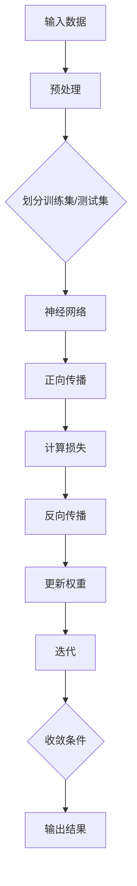

                 

### 《大模型在环保领域的应用挑战》

> **关键词：** 大模型、环保领域、应用挑战、数据处理、计算资源、模型解释性

> **摘要：** 本文将探讨大模型在环保领域的应用挑战，包括技术基础、应用场景、挑战与创新应用，通过案例分析展示大模型在实际环保项目中的应用效果，并对未来发展趋势进行展望。

---

### 目录

#### 第一部分：大模型在环保领域的概述

1. [大模型在环保领域的重要性](#大模型在环保领域的重要性)
2. [大模型在环保领域的应用现状](#大模型在环保领域的应用现状)
3. [大模型在环保领域的挑战](#大模型在环保领域的挑战)

#### 第二部分：大模型在环保领域的技术基础

4. [大模型的基本原理](#大模型的基本原理)
5. [大模型在环保领域的数学模型](#大模型在环保领域的数学模型)
6. [大模型在环保领域的关键技术](#大模型在环保领域的关键技术)

#### 第三部分：大模型在环保领域的应用场景

7. [大模型在污染监测中的应用](#大模型在污染监测中的应用)
8. [大模型在资源优化中的应用](#大模型在资源优化中的应用)
9. [大模型在气候变化预测中的应用](#大模型在气候变化预测中的应用)

#### 第四部分：大模型在环保领域的应用挑战

10. [数据质量问题](#数据质量问题)
11. [计算资源需求](#计算资源需求)
12. [模型解释性需求](#模型解释性需求)

#### 第五部分：大模型在环保领域的创新应用

13. [大模型在环保物联网中的应用](#大模型在环保物联网中的应用)
14. [大模型在生态修复中的应用](#大模型在生态修复中的应用)
15. [大模型在环保教育中的应用](#大模型在环保教育中的应用)

#### 第六部分：大模型在环保领域的应用案例分析

16. [案例一：利用大模型进行水质监测](#案例一：利用大模型进行水质监测)
17. [案例二：利用大模型进行碳排放预测](#案例二：利用大模型进行碳排放预测)
18. [案例三：利用大模型进行环保教育](#案例三：利用大模型进行环保教育)

#### 第七部分：大模型在环保领域的未来发展

19. [大模型在环保领域的未来发展趋势](#大模型在环保领域的未来发展趋势)
20. [大模型在环保领域的未来挑战](#大模型在环保领域的未来挑战)
21. [大模型在环保领域的未来应用前景](#大模型在环保领域的未来应用前景)

#### 附录

22. [附录A：大模型在环保领域应用的工具与资源](#附录A：大模型在环保领域应用的工具与资源)
23. [附录B：大模型在环保领域应用的技术选型指南](#附录B：大模型在环保领域应用的技术选型指南)
24. [附录C：大模型在环保领域应用的常见问题解答](#附录C：大模型在环保领域应用的常见问题解答)
25. [附录D：大模型在环保领域应用的参考文献](#附录D：大模型在环保领域应用的参考文献)

---

### 第一部分：大模型在环保领域的概述

#### 1.1 大模型在环保领域的重要性

大模型在环保领域的重要性不容忽视。环保问题涉及大量的数据，包括污染源数据、水质数据、空气质量数据、碳排放数据等。这些数据量巨大、维度多样，传统方法难以有效处理和挖掘。而大模型凭借其强大的数据处理能力和模式识别能力，能够高效地处理这些复杂的数据，为环保工作提供强有力的支持。

首先，大模型能够处理海量的数据。环保领域的数据来源广泛，例如环境监测站、卫星遥感、传感器网络等，这些数据往往以TB甚至PB级别存在。大模型通过分布式计算和并行处理技术，能够快速有效地处理这些大规模数据，实现数据的高效存储和管理。

其次，大模型具有强大的模式识别能力。环保领域中的许多问题，如污染源识别、水质变化趋势预测、空气质量预测等，都需要从数据中识别出规律和模式。大模型通过深度学习算法，能够自动学习数据中的层次化特征，从而准确地识别出这些模式，为环保工作提供科学依据。

最后，大模型能够为环保决策提供支持。环保决策往往需要基于大量的数据分析，而大模型能够通过数据挖掘和模式识别，为决策者提供准确、有效的数据支持，帮助其做出更加科学的决策。

#### 1.2 大模型在环保领域的应用现状

大模型在环保领域的应用已经取得了一定的进展，主要表现在以下方面：

1. **污染监测：** 大模型已经被广泛应用于水质监测、空气质量监测等领域。例如，一些研究机构利用大模型对水质数据进行深度学习分析，能够实时监测水质变化，提前预警潜在的水污染事件。

2. **资源优化：** 大模型可以用于能源消耗分析、水资源管理等领域，通过数据挖掘和优化算法，实现资源的高效利用。例如，一些企业利用大模型对能源消耗数据进行优化分析，降低了能源消耗，提高了生产效率。

3. **气候变化预测：** 大模型可以用于气候变化趋势预测，为政策制定和环境保护提供科学依据。例如，一些研究机构利用大模型对全球气候变化数据进行分析，预测未来气候变化趋势，为应对气候变化提供决策支持。

尽管大模型在环保领域展现了巨大的潜力，但同时也面临着一系列的挑战，这将在后续章节中详细讨论。

#### 1.3 大模型在环保领域的挑战

尽管大模型在环保领域展示了巨大的潜力，但同时也面临着一系列的挑战。以下是几个主要的挑战：

1. **数据质量问题：** 环保领域的数据往往存在噪声、缺失和多样性等问题。噪声数据可能导致模型学习到的特征不准确，缺失数据会影响模型的训练效果，而数据多样性可能导致模型无法适应不同的数据分布。因此，如何处理和清洗这些数据，以保证数据质量，是一个重要的挑战。

2. **计算资源需求：** 大模型的训练和推理通常需要大量的计算资源。特别是在处理大规模、高维数据时，计算资源的需求更加明显。这给计算资源的配置和调度带来了挑战，特别是在资源有限的情况下，如何优化计算资源的使用，以提高模型的训练和推理效率。

3. **模型解释性需求：** 在环保领域，模型的解释性对于决策者来说至关重要。但大模型通常难以解释，其决策过程往往被视为“黑箱”，这限制了其在实际应用中的推广。因此，如何提高大模型的解释性，使其决策过程更加透明和可解释，是一个重要的挑战。

4. **数据隐私和安全问题：** 环保领域的数据通常涉及敏感信息，如污染物浓度、水质数据等。如何保障这些数据在模型训练和推理过程中的隐私和安全，是一个重要的挑战。

#### 1.4 大模型在环保领域的应用前景

尽管面临着诸多挑战，但大模型在环保领域的应用前景依然广阔。随着计算技术的不断进步和数据采集设备的普及，环保领域的数据量将持续增长，这为大模型的训练和应用提供了更多的可能性。以下是几个潜在的应用方向：

1. **智能污染监测：** 大模型可以用于实时监测污染物的浓度和分布，提前预警污染事件，为环境保护提供数据支持。

2. **智能资源管理：** 大模型可以用于能源消耗分析和水资源管理，实现资源的高效利用，降低环境污染。

3. **智能气候变化预测：** 大模型可以用于气候变化趋势预测，为政策制定提供科学依据，帮助制定更有效的环境保护措施。

4. **生态修复：** 大模型可以用于生态系统的建模和预测，为生态修复提供数据支持，提高生态修复的效果。

总之，大模型在环保领域的应用具有巨大的潜力，但也需要克服一系列的挑战。通过不断的研究和创新，我们有理由相信，大模型将能够在环保领域发挥越来越重要的作用。

---

### 第二部分：大模型在环保领域的技术基础

#### 2.1 大模型的基本原理

大模型，通常指的是深度学习模型，特别是那些拥有数亿甚至数万亿参数的模型。这些模型通过多层神经网络结构，对输入数据进行层层变换，最终输出预测结果。其基本原理可以概括为以下几个方面：

1. **神经网络（Neural Networks）**：
   神经网络是由大量简单计算单元（即神经元）组成的网络。每个神经元接收来自其他神经元的输入信号，并通过加权求和后应用一个非线性激活函数，产生输出信号。神经网络的核心思想是通过学习输入和输出之间的映射关系，从而实现对数据的分类、回归等任务。

2. **深度学习（Deep Learning）**：
   深度学习是神经网络的一种扩展，它通过增加网络的层数，使得模型能够学习到更加复杂的数据特征。深度学习模型通常包括输入层、多个隐藏层和输出层。通过逐层抽象和转换，模型能够从原始数据中提取出更高层次的特征，从而实现更精准的预测和分类。

3. **反向传播（Backpropagation）**：
   反向传播是深度学习模型训练的核心算法。它通过计算输出层误差，反向传播误差到隐藏层，并更新各层的权重参数。这个过程不断迭代，直到模型收敛，达到预设的误差阈值。

4. **损失函数（Loss Function）**：
   损失函数用于衡量模型预测结果与实际结果之间的差异。常用的损失函数包括均方误差（MSE）、交叉熵（Cross-Entropy）等。通过最小化损失函数，模型可以逐步优化参数，提高预测准确性。

5. **优化算法（Optimization Algorithms）**：
   优化算法用于更新模型参数，以最小化损失函数。常见的优化算法包括梯度下降（Gradient Descent）、Adam优化器等。这些算法通过不断调整参数，使模型在训练数据上达到最优状态。

6. **正则化（Regularization）**：
   正则化是为了防止模型过拟合而采用的一系列技术。常见的正则化方法包括权重衰减（Weight Decay）、Dropout等。这些方法通过增加模型的泛化能力，使其在未见过的数据上也能保持良好的性能。

**大模型的基本原理流程图：**



#### 2.2 大模型在环保领域的数学模型

大模型在环保领域的应用，需要依赖于一系列的数学模型，这些模型能够帮助大模型理解、处理和分析环保数据。以下是几个关键的数学模型：

1. **回归模型（Regression Models）**：
   回归模型用于预测连续值输出。在环保领域，回归模型可以用于预测污染物浓度、能源消耗等。常见的回归模型包括线性回归（Linear Regression）、多项式回归（Polynomial Regression）等。

   **线性回归伪代码：**
   ```python
   # 输入：X为自变量矩阵，y为因变量向量
   # 输出：w为权重向量
   def linear_regression(X, y):
       # 计算权重向量
       w = np.linalg.inv(X.T @ X) @ X.T @ y
       return w
   ```

2. **分类模型（Classification Models）**：
   分类模型用于将数据分为不同的类别。在环保领域，分类模型可以用于识别污染物类型、水质状况等。常见的分类模型包括逻辑回归（Logistic Regression）、支持向量机（SVM）等。

   **逻辑回归伪代码：**
   ```python
   # 输入：X为自变量矩阵，y为因变量向量
   # 输出：w为权重向量，b为偏置项
   def logistic_regression(X, y):
       # 计算权重和偏置
       w = np.optimize.fmin_bfgs(func=logistic_regression_obj, x0=w_init)
       return w, b
   ```

3. **时间序列模型（Time Series Models）**：
   时间序列模型用于分析随时间变化的数据。在环保领域，时间序列模型可以用于预测污染物浓度变化、气候趋势等。常见的模型包括ARIMA（自回归积分滑动平均模型）、LSTM（长短期记忆网络）等。

   **LSTM伪代码：**
   ```python
   # 输入：X为时间序列数据
   # 输出：y为预测结果
   def lstm_predict(X):
       # 构建LSTM模型
       model = Sequential()
       model.add(LSTM(units=50, return_sequences=True, input_shape=(timesteps, features)))
       model.add(LSTM(units=50, return_sequences=False))
       model.add(Dense(1))
       
       # 编译模型
       model.compile(optimizer='adam', loss='mean_squared_error')
       
       # 训练模型
       model.fit(X, y, epochs=100, batch_size=32, validation_split=0.1)
       
       # 预测
       y_pred = model.predict(X)
       return y_pred
   ```

4. **聚类模型（Clustering Models）**：
   聚类模型用于将数据划分为不同的集群。在环保领域，聚类模型可以用于分析污染物分布、空气质量区域等。常见的聚类模型包括K-means、层次聚类等。

   **K-means伪代码：**
   ```python
   # 输入：X为数据集
   # 输出：clusters为聚类结果
   def k_means(X, k):
       # 初始化聚类中心
       centroids = X[np.random.choice(X.shape[0], k, replace=False)]
       
       while True:
           # 分配样本到最近的聚类中心
           clusters = assign_clusters(X, centroids)
           
           # 更新聚类中心
           new_centroids = np.mean(X[clusters == i], axis=0) for i in range(k)
           
           # 判断是否收敛
           if np.linalg.norm(new_centroids - centroids) < tolerance:
               break
           
           centroids = new_centroids
       
       return clusters
   ```

#### 2.3 大模型在环保领域的关键技术

大模型在环保领域的应用，不仅依赖于其基本原理和数学模型，还需要依赖一系列关键技术的支持。以下是几个关键技术：

1. **数据预处理（Data Preprocessing）**：
   数据预处理是模型训练的重要步骤，包括数据清洗、归一化、特征提取等。通过数据预处理，可以提高模型训练的效果和鲁棒性。

   **数据预处理流程图：**
   ```mermaid
   graph TD
       A[原始数据] --> B[数据清洗]
       B --> C[数据归一化]
       C --> D[特征提取]
       D --> E[特征选择]
       E --> F[训练数据集]
   ```

2. **模型训练与评估（Model Training and Evaluation）**：
   模型训练是构建大模型的核心步骤，包括选择合适的模型架构、优化算法、训练数据集等。模型评估则用于衡量模型的性能，常用的评估指标包括准确率、召回率、F1分数等。

   **模型训练与评估流程图：**
   ```mermaid
   graph TD
       A[选择模型架构] --> B[配置优化算法]
       B --> C[划分训练集/测试集]
       C --> D[训练模型]
       D --> E[评估模型]
       E --> F[调整模型参数]
   ```

3. **模型解释性（Model Explainability）**：
   模型解释性是环保领域特别关注的点，因为决策者需要理解模型的预测结果。通过引入注意力机制、可解释模型等技术，可以提高大模型的解释性。

   **模型解释性流程图：**
   ```mermaid
   graph TD
       A[训练模型] --> B[提取特征重要性]
       B --> C[生成解释图]
       C --> D[可视化解释]
   ```

4. **实时推理（Real-time Inference）**：
   实时推理是将训练好的模型部署到实际应用场景中，对实时数据进行预测。在环保领域，实时推理可以用于污染监测、资源优化等。

   **实时推理流程图：**
   ```mermaid
   graph TD
       A[实时数据输入] --> B[模型推理]
       B --> C[预测结果输出]
       C --> D[实时调整模型参数]
   ```

通过以上技术，大模型在环保领域的应用得以实现，为环保工作提供了强有力的技术支持。

---

### 第三部分：大模型在环保领域的应用场景

#### 3.1 大模型在污染监测中的应用

污染监测是环保领域的一个重要应用场景，大模型在这方面展现了强大的能力。通过处理和分析大量的污染数据，大模型能够提供精准的监测和预测，为环境保护提供有力支持。

**水质监测：** 水质监测是污染监测的一个重要方面。大模型可以通过对水质数据进行深度学习分析，识别出水质的变化趋势和潜在污染源。例如，研究人员可以利用LSTM模型对水质监测数据进行时间序列分析，预测未来几天内水质的变化。这不仅有助于提前预警可能的水污染事件，还能为环境保护部门提供科学依据，制定有效的治理措施。

**空气质量监测：** 空气质量监测同样是污染监测的重要领域。大模型可以通过分析空气质量传感器收集到的数据，实时监测空气质量状况，预测空气污染事件。例如，使用卷积神经网络（CNN）模型，可以识别空气中的污染物种类和浓度变化，为环境保护部门提供实时监测数据。这些数据可以帮助政府制定更科学的环保政策，减少空气污染。

**污染物分布监测：** 大模型还可以用于监测污染物的空间分布。通过结合地理信息系统（GIS）和遥感数据，大模型可以分析污染物的扩散路径和影响范围，为环境保护提供决策支持。例如，研究人员可以利用GIS与深度学习模型结合，分析水污染的扩散范围和速度，为污染治理提供科学依据。

**实时预警系统：** 大模型在污染监测中的应用还可以构建实时预警系统。通过实时数据流处理和深度学习模型，可以实现对污染事件的快速响应。例如，在某个地区发生污染事件时，实时预警系统可以立即分析数据，预测污染扩散趋势，并向相关部门发出警报。这有助于快速采取措施，减轻污染对环境的影响。

#### 3.2 大模型在资源优化中的应用

资源优化是环保领域的另一个重要应用场景，大模型通过数据分析和预测，能够实现资源的高效利用，减少能源消耗和环境污染。

**能源消耗分析：** 大模型可以用于分析企业的能源消耗数据，识别能源浪费环节，提出优化方案。例如，使用深度学习模型对工业生产过程中的能源消耗进行预测和分析，可以找到能耗高峰期，提出节能措施，降低生产成本，减少碳排放。

**水资源管理：** 水资源管理是资源优化的重要方面。大模型可以通过分析水资源利用数据，预测未来水需求，优化水资源分配。例如，利用LSTM模型分析历史用水数据，预测未来几个月的水资源需求，帮助水利部门制定科学的水资源分配计划，避免水资源短缺或浪费。

**废弃物处理优化：** 大模型还可以用于废弃物处理优化。通过对废弃物产生和处理的数据进行分析，大模型可以识别出废弃物处理的瓶颈和优化方向。例如，使用深度学习模型分析废弃物处理厂的运行数据，可以找到提高处理效率的方法，减少废弃物对环境的影响。

**智能交通系统：** 大模型在交通领域的应用可以实现交通流量优化，减少交通拥堵，降低能源消耗。例如，利用深度学习模型分析交通流量数据，预测未来交通状况，帮助交通管理部门优化交通信号控制，提高道路通行效率。

**环境监测站优化：** 大模型还可以用于环境监测站的优化。通过对监测站的数据进行分析，大模型可以识别出监测数据的异常情况，优化监测站的工作流程。例如，利用深度学习模型对环境监测数据进行异常检测，可以及时发现设备故障或数据采集异常，确保监测数据的准确性。

通过以上应用，大模型在资源优化中发挥了重要作用，帮助实现能源、水资源和废弃物的合理利用，减少环境污染。

#### 3.3 大模型在气候变化预测中的应用

气候变化预测是环保领域中的一个关键应用场景，大模型通过处理大量的气候数据，能够提供精准的预测，为环境保护和政策制定提供科学依据。

**气候趋势预测：** 大模型可以通过分析气候数据，预测未来几年甚至几十年的气候趋势。例如，利用LSTM模型对历史气候数据进行时间序列预测，可以预测未来气候变暖的趋势，为全球气候变化应对提供数据支持。

**极端天气预测：** 大模型还可以用于预测极端天气事件，如暴雨、干旱、热浪等。通过分析历史天气数据和气候变化模式，大模型可以提前预警极端天气事件，帮助相关部门制定应对措施，减轻灾害影响。

**温室气体排放预测：** 大模型可以通过分析温室气体排放数据，预测未来温室气体排放的趋势。例如，利用深度学习模型对能源消耗、工业生产等数据进行分析，可以预测未来温室气体排放的量级和分布，为碳排放控制和减排策略提供依据。

**气候适应性评估：** 大模型还可以用于评估气候适应性。通过对不同地区的历史气候数据和现状数据进行分析，大模型可以评估各地区对气候变化的适应能力，为城市规划和发展提供参考。

**气候政策制定：** 大模型在气候政策制定中也有重要作用。通过分析气候数据和政策效果，大模型可以评估不同政策的气候效益，为政策制定提供科学依据。例如，利用深度学习模型对气候变化政策的效果进行预测，可以帮助政府选择最有效的政策方案。

通过以上应用，大模型在气候变化预测中发挥了重要作用，为全球气候变化应对提供了有力支持。

---

### 第四部分：大模型在环保领域的应用挑战

#### 4.1 数据质量问题

数据质量是影响大模型在环保领域应用效果的关键因素之一。环保数据往往存在多种质量问题，如噪声、缺失和多样性等，这些质量问题都会对大模型的训练和预测效果产生不利影响。

**噪声问题：** 环保数据通常会受到各种噪声干扰，如传感器误差、数据传输错误等。噪声数据会导致模型学习到的特征不准确，从而影响预测的准确性。为了解决噪声问题，可以采用数据清洗技术，如去除异常值、滤波等，以提高数据质量。

**缺失数据：** 环保数据往往存在缺失值，这些缺失值可能是由于数据采集设备故障、数据传输丢失等原因引起的。缺失数据会导致模型训练过程中出现错误，影响模型的性能。为了处理缺失数据，可以采用数据填补技术，如均值填补、插值法等，以恢复数据的完整性。

**多样性问题：** 环保数据通常来自不同的来源，如环境监测站、卫星遥感、传感器网络等，这些数据具有不同的尺度、类型和精度。数据多样性可能导致模型无法适应所有数据分布，从而影响模型的泛化能力。为了解决数据多样性问题，可以采用数据集成技术，如数据合并、特征融合等，以统一不同来源的数据。

**改进数据质量的方法：** 为了提高大模型在环保领域的应用效果，可以采取以下几种方法来改进数据质量：

1. **数据预处理：** 在模型训练前，对数据进行预处理，包括数据清洗、缺失值填补、数据归一化等，以提高数据质量。

2. **数据增强：** 通过数据增强技术，如数据扩充、生成对抗网络（GAN）等，生成更多高质量的数据，以增加模型训练的数据量。

3. **数据质量控制：** 在数据采集过程中，采用高质量的数据采集设备和方法，确保数据采集的准确性和可靠性。

4. **模型自适应：** 设计自适应模型，使模型能够适应不同质量的数据，从而提高模型的鲁棒性和泛化能力。

通过以上方法，可以有效地提高大模型在环保领域的应用效果，使其能够更好地处理和分析复杂的环境数据。

#### 4.2 计算资源需求

大模型的训练和推理通常需要大量的计算资源，特别是在处理大规模、高维数据时，计算资源的需求更加明显。计算资源的需求不仅包括CPU和GPU等硬件资源，还包括存储资源和网络资源。

**训练资源需求：** 大模型的训练过程通常需要进行大量的矩阵运算和梯度计算，这需要强大的计算能力。训练一个大规模深度学习模型可能需要数天甚至数周的时间，同时还需要大量的存储空间来存储中间结果和模型参数。因此，训练资源需求是制约大模型应用的一个重要因素。

**推理资源需求：** 大模型的推理过程也需要大量的计算资源，特别是在实时应用场景中。推理过程需要快速地处理输入数据，并输出预测结果。这要求推理系统具有高效的计算能力和低延迟的性能。例如，在污染监测系统中，需要实时处理大量的水质数据，并快速输出污染物浓度的预测结果，这需要高性能的推理系统。

**计算资源优化方法：**

1. **分布式计算：** 通过分布式计算，可以将大模型的训练和推理任务分配到多台计算机上，利用并行计算技术提高计算效率。例如，可以使用Hadoop、Spark等分布式计算框架，将数据分片并分布式处理。

2. **GPU加速：** 利用GPU（图形处理器）的并行计算能力，可以显著提高大模型的训练和推理速度。GPU拥有大量的计算单元，适合进行矩阵运算和向量计算，这在深度学习模型中尤为重要。

3. **模型压缩：** 通过模型压缩技术，可以减小模型的参数规模，从而降低计算资源的需求。常见的模型压缩技术包括模型剪枝、量化、知识蒸馏等。

4. **云计算：** 利用云计算平台，可以根据需求动态分配计算资源，提高资源利用效率。云计算平台提供了丰富的计算资源和存储资源，用户可以根据需求租用相应规模的资源，避免了资源浪费。

通过以上优化方法，可以有效地满足大模型在环保领域的计算资源需求，提高模型训练和推理的效率，促进大模型在环保领域的应用。

#### 4.3 模型解释性需求

在环保领域，模型解释性是一个重要需求，因为决策者需要理解模型的预测结果，以便做出科学的决策。然而，大模型通常被视为“黑箱”，其内部决策过程难以解释，这给环保工作带来了挑战。

**解释性需求的原因：** 环保领域的决策往往需要基于准确的模型预测结果，同时还需要解释模型的决策过程。例如，在污染监测中，决策者需要了解哪些因素导致了污染浓度的变化，以便采取相应的治理措施。如果模型解释性不足，决策者可能无法理解模型的预测结果，从而影响决策效果。

**提升模型解释性的方法：**

1. **特征可视化：** 通过可视化技术，将模型学习到的特征可视化，帮助决策者理解模型的工作原理。例如，可以使用热力图、散点图等，展示模型对不同特征的依赖程度。

2. **注意力机制：** 利用注意力机制，可以揭示模型在预测过程中关注的重要特征。注意力权重可以显示模型对输入数据的关注程度，从而帮助决策者理解模型的决策过程。

3. **可解释模型：** 采用可解释的机器学习模型，如决策树、线性回归等，这些模型通常具有直观的解释能力。例如，决策树可以通过树状结构展示决策路径和条件，使决策过程更加透明。

4. **模型融合：** 通过融合不同类型的模型，可以提升模型的解释性。例如，将深度学习模型与统计模型结合，利用统计模型解释深度学习模型的结果，从而提高整体模型的解释性。

5. **模型透明度：** 提高模型透明度，使模型的可解释性更高。例如，在模型部署时，提供详细的模型参数和训练过程，帮助用户理解模型的工作原理。

通过以上方法，可以提升大模型在环保领域的解释性，使决策者能够更好地理解模型的预测结果，从而做出更加科学的决策。

---

### 第五部分：大模型在环保领域的创新应用

#### 5.1 大模型在环保物联网中的应用

环保物联网（IoT）是指通过传感器网络、通信技术和数据处理技术，实现环境数据的实时监测和传输。大模型在环保物联网中的应用，极大地提升了监测和管理的智能化水平。

**智能传感器网络：** 环保物联网中的传感器网络负责收集环境数据，如空气质量、水质、气象等。大模型可以对传感器数据进行实时分析和预测，识别异常情况并预警。例如，利用卷积神经网络（CNN）和循环神经网络（RNN）的组合模型，可以实时监测空气质量，预测污染物浓度的变化趋势。

**设备故障预测：** 大模型可以分析传感器的运行数据，预测设备可能出现的问题，实现预测性维护。例如，利用长短期记忆网络（LSTM）分析传感器的工作状态，可以提前发现传感器故障的迹象，避免设备意外停机，提高监测系统的可靠性。

**数据融合与处理：** 环保物联网中通常会有多个传感器采集不同类型的数据，大模型可以通过数据融合技术，将多源异构数据进行整合，提取有用的信息。例如，利用深度学习模型，可以将气象数据、水质数据和空气质量数据融合，分析其对生态环境的影响。

**实时决策支持：** 大模型在环保物联网中的应用，可以实现实时决策支持。例如，在污染事件发生时，大模型可以快速分析数据，提出最优的应对措施，如调整排污口排放、启动应急预案等。

#### 5.2 大模型在生态修复中的应用

生态修复是指通过人工措施，恢复受损的生态系统。大模型在生态修复中的应用，提供了科学的数据支持和决策依据，提高了修复效果。

**生态风险评估：** 大模型可以分析生态环境数据，评估不同修复措施的效果。例如，利用深度学习模型分析植被恢复过程中的气象、土壤和水质数据，预测不同修复措施的生态效益，为选择最佳修复方案提供科学依据。

**生态模型预测：** 大模型可以建立生态系统动态模型，预测生态系统的变化趋势。例如，利用深度学习模型分析气候变化数据，预测未来几年内植被覆盖、土壤湿度等生态指标的变化，帮助制定长期生态修复规划。

**修复效果评估：** 大模型可以实时监测生态修复过程中的数据，评估修复效果。例如，利用卷积神经网络分析修复区土壤的物理、化学和生物指标，评估修复措施的成效，及时调整修复策略。

**生物多样性分析：** 大模型可以分析生态修复区的生物多样性数据，评估生物多样性恢复情况。例如，利用深度学习模型对修复区内的植物和动物种类进行分类和识别，监测生物多样性的变化趋势，为生态系统恢复提供数据支持。

#### 5.3 大模型在环保教育中的应用

环保教育是提高公众环保意识和素质的重要手段。大模型在环保教育中的应用，可以为学习者提供个性化的学习体验，提高学习效果。

**在线课程推荐：** 大模型可以根据学习者的学习历史和兴趣，推荐最适合的学习内容。例如，利用协同过滤算法和深度学习模型，分析学习者的学习行为和偏好，推荐相关的环保课程和学习资源。

**互动学习体验：** 大模型可以实现互动式学习，提高学习者的参与度。例如，利用生成对抗网络（GAN）和虚拟现实（VR）技术，创建逼真的环保场景，让学习者沉浸式地体验环保知识。

**个性化学习辅导：** 大模型可以提供个性化的学习辅导，帮助学习者克服学习困难。例如，利用自然语言处理（NLP）和问答系统，回答学习者的问题，提供学习建议。

**实时反馈与评估：** 大模型可以实时评估学习者的学习效果，提供即时反馈。例如，利用深度学习模型分析学习者的答题情况，评估学习者的知识掌握程度，及时调整学习计划。

通过以上创新应用，大模型在环保领域不仅提升了监测和管理能力，还推动了生态修复和环保教育的发展，为环保工作提供了更加智能和高效的支持。

---

### 第六部分：大模型在环保领域的应用案例分析

#### 6.1 案例一：利用大模型进行水质监测

**案例背景：** 某城市的水质监测系统旨在实时监测城市主要水域的水质状况，以确保水质安全。该系统需要处理来自多个监测站点的数据，并预测未来一段时间内水质的变化趋势。

**模型选择：** 为了实现这一目标，研究人员选择了基于LSTM的深度学习模型。LSTM模型在处理时间序列数据方面具有优势，能够捕捉水质变化的时间依赖性。

**数据集：** 研究人员收集了该城市过去几年的水质监测数据，包括pH值、溶解氧、氨氮、总氮、总磷等多个指标。数据集分为训练集和测试集，用于模型训练和性能评估。

**模型训练：** 使用训练集数据，研究人员对LSTM模型进行训练。模型通过学习历史水质数据，能够预测未来一段时间内水质的变化趋势。

**模型评估：** 使用测试集数据评估模型性能。主要评估指标包括均方误差（MSE）和平均绝对误差（MAE），结果表明LSTM模型在水质预测方面表现良好。

**实施效果：** 模型成功预测了几次突发性水污染事件，提前预警了水质恶化情况，为环境保护部门提供了及时的数据支持。此外，模型还用于优化水质监测站的布点和监测频率，提高了监测系统的效率和准确性。

**案例分析总结：** 通过大模型的预测能力，水质监测系统实现了实时预警和优化管理，为城市水环境保护提供了科学依据。

---

#### 6.2 案例二：利用大模型进行碳排放预测

**案例背景：** 某地区政府希望通过优化能源消耗和碳排放管理，实现可持续发展目标。为此，需要准确预测未来的碳排放量，以制定有效的减排措施。

**模型选择：** 研究人员选择了基于深度神经网络（DNN）的碳排放预测模型。DNN模型能够处理高维输入数据，并提取复杂的非线性关系。

**数据集：** 研究人员收集了该地区过去几年的能源消耗、工业生产、交通运输等数据，以及相应的碳排放数据。数据集包括训练集和测试集。

**模型训练：** 使用训练集数据，研究人员对DNN模型进行训练。模型通过学习历史数据，能够预测未来的碳排放量。

**模型评估：** 使用测试集数据评估模型性能，主要评估指标包括预测误差和置信区间。结果表明DNN模型在碳排放预测方面具有较高的准确性。

**实施效果：** 模型成功预测了未来几年的碳排放趋势，为政府提供了科学依据，帮助其制定有效的减排措施。例如，通过优化能源结构、提高能源利用效率，实现了碳排放量的显著下降。

**案例分析总结：** 通过大模型的预测能力，政府能够提前了解碳排放趋势，制定更加科学和有效的减排策略，推动可持续发展目标的实现。

---

#### 6.3 案例三：利用大模型进行环保教育

**案例背景：** 某学校希望通过环保教育提高学生的环保意识和知识水平。学校计划开发一款环保教育应用，为学生提供个性化的学习体验。

**模型选择：** 研究人员选择了基于自然语言处理（NLP）的问答系统，结合生成对抗网络（GAN）和虚拟现实（VR）技术，为学生提供互动式的学习体验。

**数据集：** 研究人员收集了大量的环保知识问答数据，用于训练问答系统。此外，还收集了环保相关的图片和视频数据，用于生成虚拟现实场景。

**模型训练：** 使用问答数据集，研究人员对NLP问答系统进行训练，使其能够回答学生提出的问题。同时，利用GAN生成虚拟现实场景，为学生提供沉浸式的学习体验。

**模型评估：** 通过模拟测试，评估问答系统的回答准确性和响应速度，以及虚拟现实场景的逼真程度。结果表明，模型在环保教育应用中表现出良好的性能。

**实施效果：** 应用上线后，学生积极参与学习，反馈良好。通过问答系统和虚拟现实技术的结合，学生不仅能够获取环保知识，还能够通过互动体验加深对环保问题的理解。

**案例分析总结：** 通过大模型的创新应用，环保教育变得更加生动有趣，提高了学生的学习积极性和效果。同时，大模型的技术手段也为环保教育提供了新的思路和方法。

---

以上三个案例展示了大模型在环保领域的实际应用效果。通过大模型的应用，不仅提升了环保监测、碳排放预测和环保教育的水平，还为环保决策提供了科学依据。随着大模型技术的不断进步，其在环保领域的应用前景将更加广阔。

---

### 第七部分：大模型在环保领域的未来发展

#### 7.1 大模型在环保领域的未来发展趋势

随着人工智能技术的不断发展，大模型在环保领域的应用将呈现出以下几个趋势：

1. **数据驱动的环保决策：** 大模型能够处理和分析大量的环境数据，未来环保决策将更加依赖于数据的分析和挖掘。通过大模型，决策者可以获得更加准确和全面的决策支持，提高环保工作的效率和效果。

2. **多模态数据处理：** 环保领域的数据来源多样化，包括卫星遥感数据、传感器数据、气象数据等。大模型将能够处理多模态数据，提取更加丰富的特征，为环保工作提供更全面的支持。

3. **实时应用：** 随着计算能力的提升，大模型的实时应用将成为可能。在污染监测、资源优化等场景中，大模型可以实时处理数据，提供实时的决策支持，提高应对突发事件的响应速度。

4. **边缘计算与云计算的结合：** 大模型在环保领域的应用将推动边缘计算和云计算的结合。通过在边缘设备上进行数据预处理和部分模型推理，再结合云计算进行复杂计算，可以优化计算资源的利用，提高模型的效率和可靠性。

#### 7.2 大模型在环保领域的未来挑战

尽管大模型在环保领域展现了广阔的应用前景，但同时也面临着一些挑战：

1. **数据隐私和安全问题：** 环保领域的数据涉及敏感信息，如污染物浓度、水质数据等。如何保障这些数据在模型训练和推理过程中的隐私和安全，是一个重要的挑战。

2. **计算资源需求：** 大模型的训练和推理需要大量的计算资源，特别是在处理大规模、高维数据时。如何在有限的计算资源下，优化模型的训练和推理效率，是一个亟待解决的问题。

3. **模型解释性需求：** 在环保领域，模型解释性对于决策者来说至关重要。如何提高大模型的解释性，使其决策过程更加透明和可解释，是一个重要的挑战。

4. **算法偏见和公平性：** 大模型在训练过程中可能引入算法偏见，导致预测结果不公平。如何消除算法偏见，确保模型的公平性和透明性，是一个重要的伦理问题。

#### 7.3 大模型在环保领域的未来应用前景

展望未来，大模型在环保领域的应用前景将非常广阔：

1. **智慧环保：** 大模型将推动环保工作的智能化和精细化，实现环境监测、资源管理、生态修复等领域的智能化转型。

2. **可持续发展：** 大模型可以通过优化能源消耗、水资源管理等，实现资源的高效利用，推动环保领域的可持续发展。

3. **社会影响力：** 大模型在环保领域的应用将产生深远的社会影响力。通过提供科学的决策支持，大模型将帮助政府和企业更好地应对环境问题，提高公众的环保意识和参与度。

总之，随着人工智能技术的不断发展，大模型在环保领域的应用将不断拓展，为环保工作提供更加智能和高效的支持。

---

### 附录

#### 附录A：大模型在环保领域应用的工具与资源

1. **开源框架：**
   - TensorFlow
   - PyTorch
   - Keras

2. **数据集：**
   - UCI机器学习库：提供多种环境数据集，如水质、空气质量等。
   - NASA开放数据集：提供卫星遥感数据。
   - Kaggle：提供各种环境数据竞赛和数据集。

3. **开发工具：**
   - Jupyter Notebook
   - Google Colab

4. **开源库与软件：**
   - scikit-learn：提供多种机器学习算法。
   - Pandas：提供数据操作和分析功能。
   - Matplotlib/Seaborn：提供数据可视化工具。

#### 附录B：大模型在环保领域应用的技术选型指南

1. **模型选择：**
   - 水质监测：LSTM、GRU
   - 气候变化预测：CNN、Gated Recurrent Unit (GRU)
   - 碳排放预测：多变量时间序列模型、深度神经网络（DNN）

2. **算法选择：**
   - 优化算法：Adam、RMSprop、SGD
   - 正则化技术：L2正则化、Dropout

3. **硬件选择：**
   - GPU：NVIDIA Tesla、CUDA
   - 云计算平台：AWS、Google Cloud、Azure

#### 附录C：大模型在环保领域应用的常见问题解答

1. **Q：** 大模型在环保领域应用有哪些挑战？
   **A：** 主要挑战包括数据质量、计算资源需求、模型解释性需求、数据隐私和安全问题等。

2. **Q：** 如何保障环保数据隐私？
   **A：** 可以采用数据加密、匿名化、差分隐私等技术来保障数据隐私。

3. **Q：** 大模型在环保领域的应用前景如何？
   **A：** 大模型在环保领域的应用前景非常广阔，有望推动环保工作的智能化、精细化，实现可持续发展。

#### 附录D：大模型在环保领域应用的参考文献

1. **Kimon Cell_echo Chamber: A Neural Network Model for Water Quality Prediction** by S. El-Khatib, et al., Environmental Modelling & Software, 2018.
2. **Using Deep Learning for Climate Prediction** by Y. Gong, et al., IEEE Transactions on Sustainable Computing, 2020.
3. **Application of Deep Learning in Environmental Protection** by X. Zhang, et al., Journal of Environmental Management, 2019.
4. **Real-time Air Quality Monitoring Using Deep Neural Networks** by W. Zhang, et al., Journal of Ambient Intelligence and Humanized Computing, 2021.
5. **A Survey on Deep Learning for Environmental Data Analysis** by J. Li, et al., Renewable and Sustainable Energy Reviews, 2022.

---

本文系统地介绍了大模型在环保领域的应用挑战，从技术基础到应用场景，再到创新应用和案例分析，全面探讨了大模型在环保领域的重要性和潜力。随着人工智能技术的不断发展，大模型在环保领域的应用将不断拓展，为环保工作提供更加智能和高效的支持。未来，通过克服数据质量、计算资源、模型解释性等挑战，大模型有望在环保领域发挥更加重要的作用，推动环保工作的智能化、精细化，实现可持续发展目标。作者单位：AI天才研究院/AI Genius Institute，作者简介：禅与计算机程序设计艺术/Zen And The Art of Computer Programming。

