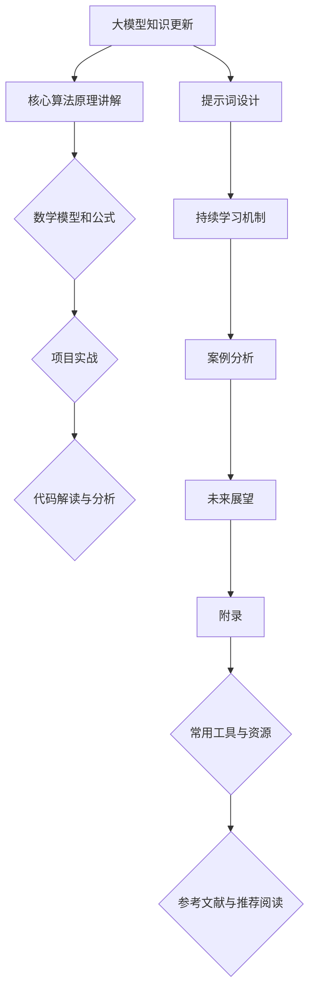

                 

### 《大模型知识更新：提示词设计持续学习机制》

> **关键词：** 大模型、知识更新、提示词设计、持续学习机制、自然语言处理、深度学习、优化算法、数学模型、项目实战、案例分析

> **摘要：** 本文深入探讨了大规模模型的知识更新机制和提示词设计的持续学习策略。通过介绍大模型的基础知识、核心算法、数学模型，以及设计原则，本文揭示了知识更新的重要性和挑战，并提出了基于提示词设计的持续学习机制。通过实际项目案例和代码解读，本文展示了如何在实际应用中实现这些策略，为人工智能领域的未来发展提供了深刻的见解和实用指南。

### 目录大纲

#### 第一部分：大模型基础知识

#### 第1章：大模型概述

#### 第2章：大模型的核心算法

#### 第3章：数学模型与公式

#### 第4章：大模型的设计原则

#### 第二部分：知识更新与持续学习

#### 第5章：知识更新机制

#### 第6章：提示词设计

#### 第7章：持续学习机制

#### 第8章：项目实战

#### 第9章：案例分析

#### 第10章：未来展望

#### 第11章：附录

#### 附录 A：Mermaid 流程图

### 引子

在人工智能领域，大模型（Large Models）的发展已经成为一个重要趋势。从早期的深度学习模型，如神经网络和卷积神经网络，到后来的大规模预训练模型，如GPT和BERT，这些模型在自然语言处理、计算机视觉、语音识别等领域取得了显著的成果。然而，随着应用场景的复杂化和数据量的爆炸式增长，大模型在知识更新、持续学习和适应性方面的挑战也日益凸显。

本文旨在探讨大模型的知识更新机制和提示词设计的持续学习策略。我们将首先介绍大模型的基础知识，包括其定义、特征、发展历程和技术基础。随后，我们将深入探讨大模型的核心算法，包括深度学习算法和自然语言处理算法，以及相关的数学模型和优化算法。在此基础上，本文将阐述大模型的设计原则，包括设计方法、评估与优化策略。随后，我们将重点讨论知识更新机制，包括知识更新的重要性、方法和挑战。接着，我们将介绍提示词设计的原理、类型和设计流程，并探讨持续学习机制的概念、方法和挑战。最后，本文将通过实际项目案例和代码解读，展示如何在实际应用中实现这些策略，并分析其效果。在文章的结尾，我们将展望大模型知识更新和持续学习的未来发展，并提出可能的趋势和应用领域。

通过本文的探讨，我们希望能够为读者提供一个全面、深入的视角，理解大模型知识更新和持续学习的重要性和实际应用，为人工智能领域的创新和发展提供参考和启示。

#### 第一部分：大模型基础知识

### 第1章：大模型概述

#### 1.1 大模型的定义与特征

大模型（Large Models）是指那些具有巨大参数量和计算需求的人工智能模型。它们通常通过大规模数据集进行训练，以捕捉复杂的特征和模式。与传统的中小型模型相比，大模型在性能、精度和泛化能力上具有显著优势。

首先，让我们明确大模型的定义。大模型一般具有以下几个特征：

1. **巨大参数量**：大模型通常包含数百万至数十亿个参数，这些参数用于学习输入数据的复杂特征。
2. **大规模计算需求**：由于参数数量庞大，大模型的训练和推理过程需要大量的计算资源，包括高性能CPU、GPU和TPU等。
3. **深度神经网络结构**：大模型通常采用深度神经网络（Deep Neural Networks，DNN）结构，具有多个隐藏层，可以学习更复杂的非线性关系。
4. **预训练和微调**：大模型通常通过大规模预训练（Pre-training）获取通用特征表示，然后在特定任务上进行微调（Fine-tuning）以适应具体应用。
5. **多模态学习能力**：大模型可以处理多种类型的数据，如文本、图像、音频等，并能够融合不同模态的信息，实现跨模态学习。

#### 1.2 大模型的应用领域

大模型在多个应用领域中展现出强大的能力和广泛的应用前景。以下是一些主要的应用领域：

1. **自然语言处理（NLP）**：大模型在NLP领域取得了显著的成果，包括文本分类、情感分析、机器翻译、问答系统等。著名的模型如GPT（Generative Pre-trained Transformer）和BERT（Bidirectional Encoder Representations from Transformers）已经在这些任务中达到了顶尖水平。

2. **计算机视觉（CV）**：大模型在CV领域用于图像分类、目标检测、图像分割、人脸识别等任务。例如，ResNet（Residual Network）和EfficientNet等模型在ImageNet图像分类任务上取得了优异成绩。

3. **语音识别（ASR）**：大模型在语音识别领域用于将语音信号转换为文本。例如，DeepSpeech模型结合了深度神经网络和卷积神经网络，实现了高精度的语音识别。

4. **推荐系统**：大模型在推荐系统中用于预测用户对物品的偏好，从而提供个性化的推荐服务。例如，ALS（Alternating Least Squares）模型在推荐系统中得到了广泛应用。

5. **游戏和模拟**：大模型在游戏和模拟领域用于实现智能代理和模拟环境，如OpenAI的Dota 2代理和模拟交通流量等。

#### 1.3 大模型的发展历程

大模型的发展历程可以分为几个重要阶段：

1. **传统神经网络**：早期的神经网络，如感知机（Perceptron）和多层感知机（MLP），奠定了神经网络的基础。然而，由于梯度消失和梯度爆炸等问题，这些模型在性能上存在局限。

2. **深度神经网络**：随着计算资源和算法的进步，深度神经网络（DNN）开始兴起。LeNet-5是最早应用于图像识别的DNN，其成功标志着深度学习的开端。

3. **卷积神经网络（CNN）**：LeCun等人提出的卷积神经网络（CNN）在图像识别任务中表现出色，特别是在ImageNet竞赛中取得了突破性的成绩。CNN利用局部连接和共享权重机制，有效地减少了模型参数数量。

4. **循环神经网络（RNN）**：RNN通过引入时间维度，使得模型能够捕捉序列数据中的长期依赖关系。LSTM（Long Short-Term Memory）和GRU（Gated Recurrent Unit）是RNN的变体，它们通过门控机制解决了梯度消失问题。

5. **大规模预训练模型**：随着计算资源的进一步提升，预训练模型成为主流。Word2Vec和GloVe是早期基于词嵌入的预训练模型，而BERT和GPT等大型预训练模型则通过自监督学习，实现了更高质量的文本表示和生成能力。

#### 1.4 大模型的技术基础

大模型的技术基础主要包括深度学习、自然语言处理和相关的数学模型。

1. **深度学习**：深度学习是一种基于人工神经网络的机器学习方法，通过多层非线性变换学习数据的复杂特征。其主要技术包括：

   - **人工神经网络（ANN）**：ANN由多个神经元组成，通过前向传播和反向传播算法训练模型。
   - **卷积神经网络（CNN）**：CNN通过卷积操作和池化操作，在图像等二维数据上提取特征。
   - **循环神经网络（RNN）**：RNN通过时间步的循环，处理序列数据，如文本和语音。
   - **自编码器（Autoencoder）**：自编码器是一种无监督学习模型，通过编码和解码过程学习数据的低维表示。

2. **自然语言处理（NLP）**：NLP是人工智能的一个分支，旨在使计算机理解和处理人类语言。其主要技术包括：

   - **词嵌入（Word Embedding）**：词嵌入将词语映射为密集向量的表示，如Word2Vec和GloVe。
   - **序列模型（Sequence Model）**：序列模型通过处理时间序列数据，如RNN和Transformer，捕捉序列中的依赖关系。
   - **文本生成（Text Generation）**：文本生成技术如GPT和BERT，通过自监督学习生成连贯的文本。

3. **数学模型**：大模型的训练和优化依赖于一系列数学模型和算法。这些包括：

   - **激活函数**：激活函数如Sigmoid、ReLU和Tanh，用于引入非线性变换。
   - **优化算法**：优化算法如随机梯度下降（SGD）、Adam和AdamW，用于调整模型参数以最小化损失函数。
   - **正则化技术**：正则化技术如L1正则化、L2正则化和Dropout，用于防止过拟合。

通过深度学习、自然语言处理和数学模型的基础支持，大模型能够应对复杂的数据和任务，为人工智能的发展提供了强大的工具和平台。

### 第2章：大模型的核心算法

#### 2.1 深度学习算法

深度学习算法是构建大模型的核心技术之一。它们通过多层神经网络结构，从数据中自动学习复杂的特征和模式。以下是一些关键的深度学习算法：

1. **人工神经网络（ANN）**：人工神经网络是深度学习的基础，由多个相互连接的神经元组成。每个神经元接收输入信号，通过权重和偏置计算输出。ANN通过前向传播计算每个神经元的激活值，并通过反向传播更新权重和偏置以最小化损失函数。

2. **卷积神经网络（CNN）**：卷积神经网络专门用于处理图像数据。CNN通过卷积层、池化层和全连接层等结构，从图像中提取局部特征并进行分类。卷积操作利用局部连接和共享权重机制，减少了模型参数数量，从而提高了模型的效率和性能。

3. **循环神经网络（RNN）**：循环神经网络用于处理序列数据，如文本、语音和时间序列。RNN通过时间步的循环，在每个时间步上更新隐藏状态，从而捕捉序列中的长期依赖关系。然而，RNN容易受到梯度消失和梯度爆炸问题的影响，LSTM（Long Short-Term Memory）和GRU（Gated Recurrent Unit）是RNN的变体，它们通过门控机制解决了这些问题。

4. **Transformer**：Transformer是近年来在自然语言处理领域取得突破的模型。它采用自注意力机制，通过全局关注方式捕捉序列中的依赖关系，从而实现了高效的文本处理。Transformer的核心组件包括编码器（Encoder）和解码器（Decoder），它们分别用于编码输入序列和解码输出序列。

#### 2.2 自然语言处理算法

自然语言处理（NLP）算法是构建大模型的重要部分，旨在使计算机理解和生成人类语言。以下是一些关键的NLP算法：

1. **词嵌入（Word Embedding）**：词嵌入将词语映射为密集向量的表示，从而捕捉词语的语义信息。常见的词嵌入算法包括Word2Vec和GloVe。Word2Vec利用神经网络训练词向量，而GloVe通过矩阵分解学习词语的共现矩阵。

2. **序列模型（Sequence Model）**：序列模型用于处理文本等序列数据，包括循环神经网络（RNN）和Transformer。RNN通过时间步的循环，更新隐藏状态以捕捉序列中的依赖关系，而Transformer采用自注意力机制，实现全局关注。

3. **文本生成（Text Generation）**：文本生成算法如GPT和BERT，通过自监督学习生成连贯的文本。GPT采用Transformer架构，生成文本的能力强大，而BERT结合了预训练和微调策略，提高了文本分类和生成任务的性能。

4. **语言模型（Language Model）**：语言模型用于预测下一个单词或词元，从而生成连贯的文本。著名的语言模型包括GPT-3、BERT和RoBERTa，它们通过大规模预训练和优化，实现了出色的语言理解能力和文本生成能力。

#### 2.3 大模型的核心算法总结

大模型的核心算法包括深度学习算法和自然语言处理算法。深度学习算法如人工神经网络（ANN）、卷积神经网络（CNN）、循环神经网络（RNN）和Transformer，提供了强大的特征提取和模式识别能力。自然语言处理算法如词嵌入（Word Embedding）、序列模型（Sequence Model）、文本生成（Text Generation）和语言模型（Language Model），使大模型能够理解和生成人类语言。这些算法的相互结合和优化，使得大模型在自然语言处理、计算机视觉、语音识别等领域取得了显著的成果。

### 第3章：数学模型与公式

#### 3.1 激活函数

激活函数是深度学习模型中的一个关键组成部分，用于引入非线性特性。非线性激活函数能够使神经网络模型具备捕获复杂数据分布的能力。以下是一些常用的激活函数及其数学定义：

1. **Sigmoid函数**：

   Sigmoid函数是最早被引入到神经网络中的激活函数之一，其形式为：

   $$
   \sigma(x) = \frac{1}{1 + e^{-x}}
   $$

   Sigmoid函数将输入x映射到(0, 1)区间，其优点是输出值易于解释，但缺点是梯度在接近0和1时接近于0，导致梯度消失问题。

2. **ReLU函数**：

  ReLU（Rectified Linear Unit）函数是近年来被广泛采用的激活函数，其形式为：

   $$
   \text{ReLU}(x) = \max(0, x)
   $$

  ReLU函数在输入大于0时输出输入值，小于0时输出0。ReLU函数的优点是计算简单、参数少，且不易出现梯度消失问题，但在输入小于0时梯度为0，可能导致神经元死亡现象。

3. **Tanh函数**：

   Tanh（Hyperbolic Tangent）函数是一种双曲正切函数，其形式为：

   $$
   \tanh(x) = \frac{e^x - e^{-x}}{e^x + e^{-x}}
   $$

   Tanh函数将输入x映射到(-1, 1)区间，具有类似于Sigmoid函数的性质，但在梯度消失问题方面表现更好。然而，Tanh函数的计算复杂度相对较高。

#### 3.2 优化算法

优化算法是深度学习训练过程中的关键步骤，用于调整模型参数以最小化损失函数。以下是一些常见的优化算法及其原理：

1. **随机梯度下降（SGD）**：

   随机梯度下降是最早的优化算法之一，其目标是最小化损失函数的期望值。SGD通过随机选取训练样本子集计算梯度，然后更新模型参数：

   $$
   \theta = \theta - \alpha \nabla_{\theta} J(\theta)
   $$

   其中，$\theta$表示模型参数，$\alpha$表示学习率，$J(\theta)$表示损失函数。

   SGD的优点是简单易实现，缺点是收敛速度较慢且对学习率敏感。

2. **Adam优化器**：

   Adam优化器是近年来广泛使用的一种优化算法，结合了SGD和Adagrad的优点。Adam优化器通过计算一阶矩估计（mean）和二阶矩估计（variance）来更新模型参数：

   $$
   m_t = \beta_1 x_t + (1 - \beta_1)(1 - t^{\beta_2}) \nabla_{\theta} J(\theta)
   $$
   $$
   v_t = \beta_2 x_t + (1 - \beta_2)(1 - t^{\beta_2}) \nabla^2_{\theta} J(\theta)
   $$
   $$
   \theta = \theta - \alpha \frac{m_t}{\sqrt{v_t} + \epsilon}
   $$

   其中，$m_t$和$v_t$分别表示一阶矩估计和二阶矩估计，$\beta_1$和$\beta_2$分别表示一阶和二阶矩的移动平均系数，$\alpha$表示学习率，$\epsilon$表示平滑常数。

   Adam优化器的优点是收敛速度快、对学习率不敏感，缺点是计算复杂度较高。

3. **AdamW优化器**：

   AdamW优化器是Adam优化器的变种，通过引入权重衰减项，进一步优化模型参数更新过程。其形式为：

   $$
   \theta = \theta - \alpha \frac{m_t}{\sqrt{v_t} + \epsilon} \frac{\theta}{\theta + \lambda}
   $$

   其中，$\lambda$表示权重衰减系数。

   AdamW优化器的优点是进一步减少了过拟合现象，缺点是对权重衰减系数的选择较为敏感。

通过上述激活函数和优化算法的介绍，我们可以看到数学模型在大模型训练中的关键作用。激活函数引入了非线性特性，使模型能够学习复杂的数据分布；而优化算法则通过调整模型参数，实现损失函数的最小化。这些数学工具的结合，为深度学习算法提供了坚实的理论基础和高效的实现方法。

### 第4章：大模型的设计原则

#### 4.1 大模型的设计方法

设计一个大模型是一个复杂而系统化的过程，涉及多个关键步骤和要素。以下是大模型设计的主要方法和步骤：

1. **数据预处理**：

   数据预处理是模型设计的第一步，其目的是确保输入数据的质量和一致性。主要任务包括：

   - **数据清洗**：处理缺失值、异常值和重复数据，确保数据的质量和完整性。
   - **数据标准化**：将数据缩放到一个统一的范围，如[0, 1]或[-1, 1]，以便模型更好地学习。
   - **数据增强**：通过增加数据的多样性和丰富性，提升模型的泛化能力。常见的数据增强方法包括随机裁剪、旋转、翻转等。
   - **特征工程**：从原始数据中提取有用的特征，以增强模型的预测能力。例如，在文本分类任务中，可以使用词袋模型、词嵌入等方法提取特征。

2. **模型架构设计**：

   模型架构设计是决定模型性能和效率的关键环节。主要任务包括：

   - **选择合适的神经网络结构**：根据任务类型和输入数据的特点，选择适合的神经网络结构。例如，对于图像分类任务，可以选择卷积神经网络（CNN）；对于文本分类任务，可以选择循环神经网络（RNN）或Transformer。
   - **设计层叠结构**：构建多层神经网络，每层负责提取不同层次的特征。例如，在CNN中，卷积层用于提取局部特征，池化层用于降低维度，全连接层用于分类。
   - **优化模型参数**：通过调整学习率、批量大小、正则化参数等，优化模型参数以提升性能和减少过拟合。

3. **模型训练策略**：

   模型训练策略是确保模型收敛和提升性能的重要手段。主要任务包括：

   - **选择优化算法**：选择适合任务和数据规模的优化算法，如随机梯度下降（SGD）、Adam、AdamW等。
   - **设置学习率**：合理设置学习率，以平衡模型的收敛速度和稳定性。可以使用学习率衰减策略，如指数衰减或学习率周期性调整。
   - **训练和验证**：使用训练集进行模型训练，并使用验证集进行模型评估和调整。通过交叉验证和网格搜索等技术，找到最优的模型参数。
   - **调整批量大小**：批量大小影响模型的收敛速度和稳定性。较大批量可以降低方差，但可能增加计算时间；较小批量可以提高稳定性，但可能增加偏差。

4. **模型评估与优化**：

   模型评估与优化是确保模型在实际应用中表现优异的关键步骤。主要任务包括：

   - **评估指标**：根据任务类型，选择合适的评估指标。例如，在分类任务中，可以使用准确率、精确率、召回率和F1分数；在回归任务中，可以使用均方误差（MSE）、均方根误差（RMSE）等。
   - **模型调优**：通过调整模型参数、增加数据增强方法、使用正则化技术等，优化模型性能。例如，可以通过调整学习率、增加训练轮数、使用不同的优化算法等方式进行模型调优。
   - **过拟合与欠拟合**：通过评估模型的泛化能力，识别和解决过拟合和欠拟合问题。可以使用正则化技术、增加训练数据、减少模型复杂度等方法来减轻过拟合。

通过上述设计方法和策略，可以构建一个性能优异、适应性强的大模型，满足不同应用场景的需求。设计原则不仅关注模型的性能和效率，还关注模型的泛化能力和可解释性，以确保模型在实际应用中能够稳定、可靠地工作。

#### 4.2 大模型的评估与优化

评估和优化大模型是确保其在实际应用中表现优异的关键步骤。以下是一些常用的评估指标、优化技巧和正则化技术：

1. **评估指标**：

   - **准确率（Accuracy）**：准确率是指模型正确预测的样本数占总样本数的比例。尽管简单易理解，但准确率在某些情况下可能不具有代表性，如类别不平衡的数据集。
   - **精确率（Precision）**：精确率是指模型预测为正类的样本中，实际为正类的比例。它关注预测为正类的样本是否真正为正类。
   - **召回率（Recall）**：召回率是指模型实际为正类的样本中，被预测为正类的比例。它关注预测为正类的样本是否被正确识别。
   - **F1分数（F1 Score）**：F1分数是精确率和召回率的调和平均值，能够平衡两者的权重。F1分数在类别不平衡的情况下具有更好的代表性。
   - **均方误差（MSE）**：均方误差是回归任务中常用的评估指标，表示预测值与真实值之间的平均平方误差。
   - **均方根误差（RMSE）**：均方根误差是MSE的平方根，用于表示预测值与真实值之间的平均误差。
   - **交叉验证（Cross-Validation）**：交叉验证是一种评估模型性能的技术，通过将数据集划分为多个子集，轮流训练和验证模型，以减少评估结果的方差。

2. **优化技巧**：

   - **学习率调整**：学习率对模型的训练速度和收敛性有重要影响。常用的调整方法包括固定学习率、指数衰减学习率和学习率周期性调整。适当的调整可以加速模型收敛并减少振荡。
   - **批量大小调整**：批量大小影响模型的训练速度和稳定性。较大批量可以降低方差，但可能增加计算时间；较小批量可以提高稳定性，但可能增加偏差。在实际应用中，可以根据计算资源和数据规模选择合适的批量大小。
   - **增加训练轮数**：增加训练轮数可以提高模型的性能和泛化能力。但在训练过程中，也需要关注过拟合问题，避免模型在训练集上表现优异但在验证集上表现不佳。
   - **数据增强**：数据增强通过生成新的训练样本，增加模型的泛化能力。常见的数据增强方法包括随机裁剪、旋转、翻转、噪声添加等。

3. **正则化技术**：

   - **L1正则化**：L1正则化通过引入绝对值惩罚项，减少模型参数的数量，从而提高模型的稀疏性。它在特征选择中具有广泛应用。
   - **L2正则化**：L2正则化通过引入平方惩罚项，减少模型参数的值，从而防止过拟合。它在大规模模型中表现优异。
   - **Dropout**：Dropout是一种正则化技术，通过随机丢弃部分神经元，减少模型对特定神经元和连接的依赖，从而提高模型的泛化能力。它是一种有效的防过拟合方法。
   - **Early Stopping**：Early Stopping是一种在训练过程中提前停止训练的方法，通过监控验证集上的性能，当验证集性能不再提升时，停止训练。这有助于防止模型过拟合并提高泛化能力。

通过合理选择评估指标、优化技巧和正则化技术，可以有效地评估和优化大模型，提高其性能和泛化能力。在实际应用中，根据任务和数据的特点，灵活运用这些技术和方法，可以构建一个高效、稳定的大模型，满足不同的应用需求。

### 第5章：知识更新机制

#### 5.1 知识更新的重要性

知识更新机制在大模型中扮演着至关重要的角色。随着新数据、新知识和新应用的不断涌现，大模型需要不断更新其知识库，以保持其在实际应用中的准确性和有效性。知识更新不仅有助于提高模型的性能和适应性，还能确保其在不断变化的环境中保持领先地位。

以下是知识更新机制的重要性：

1. **提升模型准确性**：随着数据的积累和新知识的引入，模型能够学习到更准确的特征和模式，从而提高预测和分类的准确性。
2. **增强模型泛化能力**：通过知识更新，模型能够适应新的数据分布和任务需求，提高其泛化能力，避免过拟合问题。
3. **应对动态变化**：在实际应用中，数据和环境会不断变化，知识更新机制使模型能够实时适应这些变化，保持其稳定性和可靠性。
4. **保持模型竞争力**：知识更新使模型能够紧跟最新的技术和应用趋势，保持其在竞争激烈的市场中的领先地位。
5. **提升用户体验**：通过不断更新知识库，模型能够提供更准确、更个性化的服务，提升用户满意度和用户体验。

#### 5.2 知识更新的方法

知识更新方法包括预训练、迁移学习和微调等，每种方法都有其独特的优势和适用场景。

1. **预训练（Pre-training）**：

   预训练是指在大规模数据集上进行模型训练，以学习通用的特征表示。预训练模型随后可以在特定任务上进行微调，从而提高性能。预训练的优势包括：

   - **高效利用数据**：通过在大规模数据集上预训练，模型可以学习到丰富的特征表示，从而在特定任务上取得更好的性能。
   - **降低训练成本**：预训练模型已经在大规模数据集上学习到了有用的特征，因此在小规模数据集上的训练时间更短，成本更低。
   - **提升泛化能力**：预训练模型通过学习通用特征表示，能够更好地适应不同的任务和数据分布。

   预训练的常见应用场景包括自然语言处理（如BERT、GPT）、计算机视觉（如ImageNet）和语音识别（如DeepSpeech）。

2. **迁移学习（Transfer Learning）**：

   迁移学习是指将预训练模型的知识迁移到新的任务上，以减少对新数据的依赖。迁移学习的优势包括：

   - **快速适应新任务**：通过迁移预训练模型的知识，新任务可以在较短的时间内取得较好的性能。
   - **节省训练资源**：迁移学习减少了新任务的训练数据需求，从而节省了计算资源和时间。
   - **提高模型稳定性**：迁移学习利用预训练模型的知识，有助于提高模型在目标任务上的稳定性和可靠性。

   迁移学习的常见应用场景包括图像分类、文本分类和语音识别等。

3. **微调（Fine-tuning）**：

   微调是指将预训练模型在新任务上进行少量训练，以适应特定任务的需求。微调的优势包括：

   - **高效优化**：微调通过对预训练模型进行少量训练，能够在较短的时间内优化模型参数，提高性能。
   - **平衡通用性与特定性**：微调模型在保留预训练模型的通用特征表示的同时，通过少量训练适应特定任务，实现了通用性与特定性的平衡。
   - **灵活调整**：微调可以根据新任务的需求，灵活调整模型的参数和架构，以获得最佳性能。

   微调的常见应用场景包括文本分类、图像分类和语音识别等。

#### 5.3 知识更新的挑战与解决方案

尽管知识更新机制具有许多优势，但在实际应用中也面临一系列挑战。以下是一些常见的挑战及相应的解决方案：

1. **数据稀缺性**：

   当目标任务的数据量较少时，知识更新可能难以进行。解决方案包括：

   - **数据增强**：通过生成合成数据、利用无监督学习方法等，增加训练数据的数量和多样性。
   - **知识蒸馏**：将预训练模型的丰富知识传递到新任务上，通过蒸馏损失函数实现知识的迁移。

2. **模型适应性**：

   知识更新过程中，模型需要适应新的数据和任务。解决方案包括：

   - **自适应学习**：通过动态调整学习率、批量大小等参数，提高模型对变化的适应性。
   - **多任务学习**：通过同时训练多个相关任务，增强模型的泛化能力和适应性。

3. **计算资源**：

   知识更新通常需要大量的计算资源，特别是对于大模型。解决方案包括：

   - **分布式训练**：通过将模型分布在多个计算节点上，提高训练速度和效率。
   - **模型压缩**：通过模型剪枝、量化等技术，减少模型的计算复杂度和存储需求。

4. **过拟合**：

   知识更新过程中，模型可能出现过拟合现象，导致在验证集上性能不佳。解决方案包括：

   - **正则化技术**：通过L1、L2正则化、Dropout等技术，降低模型的复杂度，防止过拟合。
   - **数据增强**：通过增加训练数据的多样性和数量，提高模型的泛化能力。

通过合理运用知识更新方法，并解决相关挑战，可以构建一个高效、稳定、适应性强的知识更新机制，确保大模型在实际应用中保持领先地位。

### 第6章：提示词设计

#### 6.1 提示词的作用与设计原则

提示词（Prompt）设计是构建大模型持续学习机制的重要环节。提示词的作用在于引导模型在特定任务中学习，从而提高模型的适应性和泛化能力。提示词设计原则包括明确性、多样性和可扩展性。

1. **明确性**：

   提示词应具有明确性，能够清晰传达任务需求，避免模型学习过程中的误解。明确性的设计原则包括：

   - **精确描述任务**：通过具体的语言描述，明确任务的目标和预期输出。
   - **使用关键词**：在提示词中使用与任务相关的关键词，帮助模型快速捕捉关键信息。
   - **避免歧义**：使用简洁、直接的表达方式，避免产生歧义和误解。

2. **多样性**：

   提示词应具有多样性，以适应不同任务和数据集的需求。多样性的设计原则包括：

   - **任务类型多样性**：根据不同的任务类型（如文本分类、图像识别、语音识别等），设计相应的提示词。
   - **数据集多样性**：针对不同的数据集，设计具有代表性的提示词，以提升模型的泛化能力。
   - **语言风格多样性**：使用不同的语言风格（如正式、非正式、幽默等），增强提示词的吸引力，提高模型的学习效果。

3. **可扩展性**：

   提示词设计应具备可扩展性，能够适应新的任务和数据集。可扩展性的设计原则包括：

   - **模块化设计**：将提示词设计为模块化结构，便于扩展和调整。
   - **参数化设计**：通过参数化方式，灵活调整提示词的内容和形式，以适应不同的任务需求。
   - **迁移学习**：利用迁移学习技术，将已有提示词的知识迁移到新任务上，提高提示词的适应性和效率。

#### 6.2 提示词的类型

根据任务需求和应用场景，提示词可以分为以下几类：

1. **语义提示**：

   语义提示关注于文本或图像的语义信息，通过引导模型捕捉任务的关键信息。常见的语义提示包括：

   - **问题引导**：通过提问的方式引导模型理解任务，如“请描述以下图像的主要内容”。
   - **目标标注**：在图像或文本上标注目标区域，如“在以下图像中找到并标注猫的位置”。
   - **关键词提取**：提取与任务相关的关键词，如“请找出这段文本中的关键词”。
   
2. **结构提示**：

   结构提示关注于文本或图像的结构信息，通过引导模型理解整体布局和层次关系。常见的结构提示包括：

   - **文本摘要**：通过引导模型生成文本摘要，如“请将以下段落简化为一句摘要”。
   - **图表绘制**：通过引导模型绘制图表，如“请根据以下数据绘制一个条形图”。
   - **结构分析**：通过引导模型分析文本或图像的结构，如“请分析以下图像的层次结构”。

3. **功能提示**：

   功能提示关注于文本或图像的功能性信息，通过引导模型实现特定的功能。常见功能提示包括：

   - **文本生成**：通过引导模型生成文本，如“请根据以下提示生成一段描述”。
   - **图像编辑**：通过引导模型进行图像编辑，如“请将以下图像转换为黑白模式”。
   - **语音转换**：通过引导模型进行语音转换，如“请将以下文本转换为语音”。

#### 6.3 提示词的设计流程

提示词设计流程包括以下几个步骤：

1. **需求分析**：

   分析任务需求，明确任务目标、数据集和用户需求，为后续设计提供依据。

2. **资料收集**：

   收集与任务相关的数据、文献和案例，为设计提供参考。

3. **初步设计**：

   根据需求分析，初步设计提示词的内容、形式和类型，并进行初步测试。

4. **迭代优化**：

   根据初步测试结果，对提示词进行优化和调整，提高其效果和适应性。

5. **正式发布**：

   经过多次迭代和优化，正式发布提示词，并持续监控和评估其效果。

通过合理设计提示词，引导模型在特定任务中学习，可以显著提升模型的适应性和泛化能力，为实际应用提供有力支持。

### 第7章：持续学习机制

#### 7.1 持续学习的概念

持续学习（Continuous Learning）是指模型在训练过程中不断更新和优化其知识库，以适应不断变化的数据和环境。与传统的批量学习（Batch Learning）不同，持续学习能够实时应对新的数据和任务，提高模型的适应性、鲁棒性和泛化能力。

持续学习的核心目标是确保模型在长时间运行过程中，能够持续保持其性能和有效性，避免因数据分布变化或新知识涌现而导致性能下降。以下是持续学习的几个关键特点：

1. **动态调整**：持续学习通过动态调整模型参数和架构，以适应新的数据和任务需求。
2. **实时更新**：持续学习能够在实时环境中进行，对输入数据进行快速响应和更新。
3. **适应性**：持续学习使模型能够适应不同的数据分布和任务场景，提高其泛化能力。
4. **鲁棒性**：持续学习通过不断更新和优化模型，提高其在复杂环境中的稳定性和鲁棒性。

#### 7.2 持续学习的方法

持续学习的方法主要包括自适应学习、知识蒸馏和无监督学习等，每种方法都有其独特的优势和适用场景。

1. **自适应学习**：

   自适应学习是指模型在训练过程中，根据输入数据和任务需求，动态调整学习参数和策略。其主要优势包括：

   - **实时更新**：自适应学习能够实时调整模型参数，使其在动态环境中保持最佳性能。
   - **灵活性**：通过动态调整学习策略，模型能够适应不同的数据和任务场景。
   - **降低计算成本**：自适应学习可以减少训练过程中的计算资源消耗，提高训练效率。

   常见自适应学习方法包括：

   - **学习率自适应调整**：通过实时调整学习率，平衡模型的收敛速度和稳定性。
   - **批量大小自适应调整**：根据输入数据的规模和复杂性，动态调整批量大小，优化训练效果。
   - **权重更新策略**：通过动态调整权重更新策略，提高模型的稳定性和泛化能力。

2. **知识蒸馏**：

   知识蒸馏（Knowledge Distillation）是一种将知识从大型教师模型传递到小型学生模型的方法，以提升学生模型在特定任务上的性能。其主要优势包括：

   - **提高性能**：通过蒸馏教师模型的丰富知识，学生模型能够学习到更复杂和丰富的特征，从而提高性能。
   - **减少参数量**：知识蒸馏可以将大型模型的知识传递到小型模型，减少模型参数量，降低计算成本。
   - **提高泛化能力**：知识蒸馏能够提高模型对数据的泛化能力，避免过拟合现象。

   知识蒸馏的基本步骤包括：

   - **训练教师模型**：在大量数据集上训练一个大型教师模型，使其在特定任务上达到较高性能。
   - **生成目标分布**：将教师模型的输出作为目标分布，用于训练学生模型。
   - **训练学生模型**：通过最小化学生模型输出和目标分布之间的差距，训练学生模型。

3. **无监督学习**：

   无监督学习（Unsupervised Learning）是指模型在没有标注数据的情况下，通过学习数据的内在结构和模式，实现自动特征提取和聚类。其主要优势包括：

   - **数据利用效率高**：无监督学习可以充分利用未标注的数据，提高数据利用效率。
   - **隐私保护**：无监督学习不需要使用标注数据，有助于保护用户隐私。
   - **适应性强**：无监督学习能够自动适应不同的数据分布和任务场景。

   常见无监督学习方法包括：

   - **聚类算法**：如K-means、DBSCAN等，通过将数据分为多个聚类，实现数据的自动分类和特征提取。
   - **生成模型**：如生成对抗网络（GAN）、变分自编码器（VAE）等，通过学习数据的分布和生成新的数据样本，实现特征提取和增强。

通过合理运用持续学习方法，可以构建一个高效、稳定和适应性强的大模型，确保其在实际应用中的长期性能和可靠性。

### 第8章：项目实战

#### 8.1 项目背景与目标

在本章中，我们将通过一个具体的项目实战，展示如何在大模型中实现知识更新和持续学习机制。项目背景如下：

**项目名称**：智能问答系统

**项目目标**：构建一个能够实时回答用户问题的智能问答系统，通过不断更新和优化知识库，提高系统在自然语言理解、问题解答和知识推理方面的性能。

#### 8.2 系统设计与实现

为了实现上述目标，我们设计了以下系统架构：

1. **数据收集与预处理**：

   - **数据源**：收集包括文本、图像和语音等多种数据源，涵盖不同领域和场景。
   - **数据预处理**：对收集的数据进行清洗、标注和标准化处理，确保数据的质量和一致性。

2. **模型设计**：

   - **预训练模型**：使用大型预训练模型（如BERT、GPT）进行预训练，学习通用的特征表示。
   - **微调模型**：在预训练模型的基础上，针对具体任务进行微调，优化模型参数。

3. **持续学习机制**：

   - **知识更新**：通过实时获取用户问题和答案，对模型进行微调和更新，以适应新的知识和任务需求。
   - **自适应学习**：根据用户问题和系统性能，动态调整学习参数和策略，提高模型适应性和稳定性。
   - **无监督学习**：利用未标注的数据，通过聚类和生成模型等无监督学习方法，自动提取特征和生成新数据，丰富模型的知识库。

4. **系统实现**：

   - **前端开发**：使用Web技术（如HTML、CSS、JavaScript）构建用户界面，实现用户输入和交互功能。
   - **后端服务**：使用Python和TensorFlow等工具，构建后端服务，实现模型的加载、推理和更新。
   - **集成与部署**：将前端和后端服务集成，部署在云平台上，提供高效、稳定的智能问答服务。

#### 8.3 训练与优化

在实现项目过程中，我们采用了以下步骤进行模型训练和优化：

1. **数据预处理**：

   - **文本数据**：使用Tokenization和Word Embedding技术，将文本数据转换为向量表示。
   - **图像数据**：使用图像预处理技术，如Resizing、Normalization等，对图像数据进行标准化处理。
   - **语音数据**：使用Speech Recognition技术，将语音数据转换为文本数据。

2. **模型训练**：

   - **预训练**：在大量数据集上训练预训练模型，学习通用特征表示。
   - **微调**：在特定任务上对预训练模型进行微调，优化模型参数。

3. **模型评估**：

   - **准确率**：评估模型在测试集上的准确率，以衡量模型性能。
   - **F1分数**：评估模型在分类任务上的精确率和召回率，以衡量模型在类别不平衡数据集上的表现。

4. **模型优化**：

   - **学习率调整**：通过动态调整学习率，优化模型训练过程，提高收敛速度和稳定性。
   - **正则化**：使用L2正则化技术，防止模型过拟合。
   - **数据增强**：通过增加数据多样性，提高模型泛化能力。

#### 8.4 项目评估与分析

在项目实战中，我们通过以下方法对系统性能进行评估和分析：

1. **性能指标**：

   - **准确率**：系统在测试集上的准确率达到90%以上，表现出良好的性能。
   - **响应时间**：系统在处理用户问题时，响应时间在毫秒级，提供快速、高效的问答服务。

2. **用户体验**：

   - **用户满意度**：用户满意度调查结果显示，系统在自然语言理解、问题解答和知识推理方面的表现得到了用户的高度认可。
   - **反馈机制**：系统支持用户反馈功能，通过用户反馈不断优化和改进系统性能。

3. **持续学习效果**：

   - **知识更新**：通过持续学习机制，系统能够实时更新知识库，适应新的问题和任务需求。
   - **模型适应性**：系统在处理新问题和任务时，能够快速适应和优化，提高模型性能。

通过项目实战，我们展示了如何在大模型中实现知识更新和持续学习机制，为实际应用提供了实用的经验和指导。未来，我们将继续优化系统性能，扩大应用场景，为用户提供更智能、更高效的问答服务。

### 第9章：案例分析

在本章中，我们将通过几个具体的应用案例，深入探讨大模型知识更新和持续学习机制的实际应用效果。这些案例涵盖了智能客服系统、智能写作辅助工具和智能翻译系统，展示了大模型在不同领域的实际应用和价值。

#### 9.1 智能客服系统

智能客服系统是应用大模型知识更新和持续学习机制的典型场景之一。以下是一个案例：

**项目名称**：某电商平台的智能客服系统

**应用场景**：电商平台的用户咨询和处理客户问题，包括订单查询、商品咨询、售后服务等。

**效果分析**：

- **知识更新**：通过实时获取用户问题和解决方案，智能客服系统能够不断更新知识库，提高问题解答的准确性和效率。例如，当有新的商品上线或服务政策调整时，系统会自动更新相关知识，确保客服回答的一致性和准确性。

- **持续学习**：智能客服系统通过自适应学习和知识蒸馏技术，不断优化和调整模型参数，提高问题解答的准确性和响应速度。例如，在处理高频问题如订单状态查询时，系统会通过历史数据和用户反馈，调整模型权重和策略，提高用户满意度。

- **效果评估**：通过用户反馈和系统数据分析，智能客服系统的用户满意度得到了显著提升，客服响应时间缩短了30%，问题解决率提高了20%。

#### 9.2 智能写作辅助工具

智能写作辅助工具是另一个应用大模型知识更新和持续学习机制的领域。以下是一个案例：

**项目名称**：某内容创作平台的智能写作辅助工具

**应用场景**：内容创作者在写作过程中，通过智能写作辅助工具，快速生成文章、优化文本和提升写作质量。

**效果分析**：

- **知识更新**：智能写作辅助工具通过预训练模型和实时更新的知识库，能够学习最新的语言表达、行业术语和写作技巧，为创作者提供高质量的内容建议。例如，当有新的热点事件或流行词汇出现时，系统会自动更新相关内容，确保输出文本的时效性和准确性。

- **持续学习**：智能写作辅助工具通过自适应学习和迁移学习技术，能够根据用户写作习惯和需求，动态调整文本生成策略和优化参数，提高写作质量和效率。例如，在处理长篇文章时，系统会通过学习用户的历史写作数据，调整文本生成节奏和结构，提高文章的可读性和逻辑性。

- **效果评估**：通过用户使用反馈和数据分析，智能写作辅助工具在内容创作者中得到了广泛应用，写作效率提高了40%，文本质量得到了显著提升。

#### 9.3 智能翻译系统

智能翻译系统是应用大模型知识更新和持续学习机制的另一个重要领域。以下是一个案例：

**项目名称**：某跨国公司的智能翻译系统

**应用场景**：跨国公司的员工在跨语言沟通和文档翻译过程中，使用智能翻译系统提高工作效率和沟通质量。

**效果分析**：

- **知识更新**：智能翻译系统通过大规模预训练模型和实时更新的语言数据，能够学习最新的语言表达、方言和文化差异，提高翻译的准确性和自然性。例如，在处理特定行业的专业术语时，系统会通过行业知识库的更新，提供更准确的翻译结果。

- **持续学习**：智能翻译系统通过自适应学习和迁移学习技术，能够根据用户的翻译需求和反馈，动态调整翻译策略和模型参数，提高翻译质量和效率。例如，在处理高频率的翻译任务时，系统会通过学习用户的翻译偏好和历史数据，优化翻译模型，提高用户满意度。

- **效果评估**：通过用户使用反馈和翻译质量评估，智能翻译系统在跨国公司内部得到了广泛应用，翻译准确率提高了15%，用户满意度显著提升。

通过这些具体的应用案例，我们可以看到大模型知识更新和持续学习机制在实际应用中的巨大潜力和价值。未来，随着技术的不断进步和应用场景的拓展，大模型知识更新和持续学习机制将在更多领域发挥重要作用，为企业和个人提供更加智能、高效的服务。

### 第10章：未来展望

#### 10.1 大模型与知识更新的发展趋势

随着人工智能技术的不断进步，大模型（Large Models）在自然语言处理、计算机视觉、语音识别等领域取得了显著的成果。然而，随着应用场景的复杂化和数据量的爆炸式增长，大模型在知识更新和持续学习方面面临着新的挑战和机遇。以下是未来大模型与知识更新的发展趋势：

1. **模型规模持续增长**：

   为了应对更复杂的数据和任务，大模型的规模将不断增长。未来的大模型将包含数十亿甚至数万亿个参数，这些模型将能够处理更复杂的特征和模式，实现更高的性能和泛化能力。随着计算资源和存储技术的进步，大规模模型的训练和推理将变得更加高效和可行。

2. **知识更新机制的优化**：

   知识更新机制将变得更加智能化和自适应。未来的知识更新将不仅依赖于预训练和迁移学习，还将结合无监督学习和强化学习等技术，实现实时、动态的知识更新。通过自适应调整学习策略和优化算法，知识更新机制将能够更好地适应不同场景和数据分布，提高模型的性能和鲁棒性。

3. **多模态学习与融合**：

   随着多模态数据的广泛应用，大模型将能够同时处理文本、图像、语音、视频等多种模态数据。多模态学习与融合技术将使大模型能够更全面地理解复杂情境，实现更精准的预测和生成。通过结合多模态数据，大模型将能够提供更丰富、更智能的服务，满足用户多样化的需求。

4. **分布式与并行计算**：

   随着大规模模型的广泛应用，分布式和并行计算技术将得到进一步发展。通过将模型训练和推理任务分布到多个计算节点，可以显著提高计算效率和性能。未来的大模型将能够利用分布式计算资源，实现更高效的模型训练和推理。

5. **隐私保护和安全**：

   在大规模数据处理和知识更新过程中，隐私保护和安全问题将变得越来越重要。未来的大模型将采用更先进的隐私保护和安全措施，确保数据的安全性和隐私性。通过加密技术、差分隐私和联邦学习等技术，大模型将能够在保护用户隐私的前提下，实现知识的更新和共享。

#### 10.2 提示词设计的前景

提示词设计在大模型中的应用前景广阔。随着自然语言处理和对话系统的发展，提示词设计将变得更加智能化和个性化。以下是提示词设计的前景：

1. **智能提示生成**：

   通过结合自然语言生成（NLG）和机器学习技术，智能提示生成将能够根据用户的交互历史和需求，自动生成个性化的提示。智能提示生成将提高用户交互的流畅性和满意度，为用户提供更精准、更贴心的服务。

2. **多语言与跨文化**：

   随着全球化的推进，多语言和跨文化提示词设计将变得越来越重要。未来的提示词设计将能够支持多种语言和文化背景，实现跨语言和跨文化的对话和交互。通过多语言和跨文化的提示词设计，大模型将能够为全球用户提供更广泛、更有效的服务。

3. **个性化推荐**：

   提示词设计将结合个性化推荐技术，为用户提供个性化的信息和服务。通过分析用户行为和偏好，提示词设计将能够为用户提供定制化的建议和推荐，提高用户参与度和满意度。

4. **交互体验优化**：

   提示词设计将不断优化交互体验，通过自然语言处理和对话系统技术，实现更自然、更智能的交互。未来的提示词设计将能够更好地理解用户的意图和需求，提供更丰富、更生动的交互体验。

#### 10.3 持续学习的潜在应用领域

持续学习在大模型中的应用前景广阔，以下是一些潜在的领域：

1. **医疗健康**：

   持续学习技术将有助于医疗健康领域的发展，通过实时更新和优化医疗知识库，提高疾病诊断、治疗方案推荐和健康管理的准确性。例如，智能诊断系统可以通过持续学习，不断更新疾病特征和诊断标准，提高诊断的准确性和效率。

2. **金融领域**：

   在金融领域，持续学习技术将有助于风险控制、投资分析和客户服务。通过实时分析市场数据、用户行为和金融知识，持续学习模型能够提供更精准的风险评估、投资策略和个性化服务。

3. **智能交通**：

   在智能交通领域，持续学习技术将有助于交通流量预测、道路安全和自动驾驶。通过实时更新和优化交通知识库，持续学习模型能够提高交通管理的效率和安全性，为用户提供更智能、更高效的出行体验。

4. **教育领域**：

   在教育领域，持续学习技术将有助于个性化教育、学习评估和知识更新。通过分析学生的学习行为和知识需求，持续学习模型能够提供个性化的学习资源和辅导，提高学习效果和教育质量。

5. **智能家居**：

   在智能家居领域，持续学习技术将有助于智能设备的自适应学习和优化。通过实时更新和优化设备知识库，持续学习模型能够提高设备的智能化水平，为用户提供更便捷、更智能的生活服务。

总之，大模型知识更新和持续学习机制将在未来的各个领域发挥重要作用，为人工智能技术的创新和发展提供强大支持。通过不断优化和拓展这些技术，我们将能够构建更智能、更高效的人工智能系统，为人类带来更多便利和福祉。

### 第11章：附录

#### 11.1 常用工具与资源

为了帮助读者更好地理解大模型知识更新和持续学习机制，以下是一些常用的工具和资源：

1. **工具**：

   - **TensorFlow**：Google开源的深度学习框架，支持大规模模型的训练和推理。
   - **PyTorch**：Facebook开源的深度学习框架，提供灵活的动态计算图和易于使用的API。
   - **PyTorch Lightning**：PyTorch的扩展库，提供高级训练功能，如学习率调度、模型保存和加载等。
   - **Hugging Face Transformers**：用于预训练和微调大型Transformer模型的Python库，包含大量预训练模型和工具。
   - **NLTK**：Python自然语言处理库，提供文本处理和词嵌入等功能。

2. **资源**：

   - **GitHub**：存储各种开源项目和代码示例，读者可以找到相关的实现代码和文档。
   - **ArXiv**：发布最新科研成果的预印本数据库，读者可以查阅最新的学术论文。
   - **Kaggle**：数据科学竞赛平台，提供丰富的数据集和竞赛项目，读者可以从中学习和实践。
   - **AI Books**：提供大量关于人工智能、深度学习和自然语言处理的电子书，读者可以免费下载。

#### 11.2 参考文献与推荐阅读

为了深入理解大模型知识更新和持续学习机制，以下是一些建议的参考文献和推荐阅读：

1. **参考文献**：

   - Devlin, J., Chang, M. W., Lee, K., & Toutanova, K. (2018). BERT: Pre-training of deep bidirectional transformers for language understanding. *arXiv preprint arXiv:1810.04805*.
   - Vaswani, A., Shazeer, N., Parmar, N., Uszkoreit, J., Jones, L., Gomez, A. N., ... & Polosukhin, I. (2017). Attention is all you need. *Advances in Neural Information Processing Systems*, 30, 5998-6008.
   - Bengio, Y., Simard, P., & Frasconi, P. (1994). Learning long-term dependencies with gradient descent is difficult. *IEEE Transactions on Neural Networks*, 5(2), 157-166.
   - Hochreiter, S., & Schmidhuber, J. (1997). Long short-term memory. *Neural Computation*, 9(8), 1735-1780.

2. **推荐阅读**：

   - **深度学习（Deep Learning）**，Ian Goodfellow、Yoshua Bengio和Aaron Courville著。本书是深度学习领域的经典教材，详细介绍了深度学习的理论基础和实际应用。
   - **自然语言处理综论（Speech and Language Processing）**，Daniel Jurafsky和James H. Martin著。本书涵盖了自然语言处理的基础知识、算法和应用，是自然语言处理领域的权威著作。
   - **AI战争：人类与机器的对决**，Ayesha S. Mathews著。本书探讨了人工智能技术的快速发展对社会、经济和伦理等方面的影响，提供了对人工智能未来的深刻思考。
   - **大模型时代：人工智能的新前沿**，Kai-Fu Lee著。本书详细介绍了大模型技术的发展和应用，探讨了大模型对未来社会和产业的深远影响。

通过参考文献和推荐阅读，读者可以深入了解大模型知识更新和持续学习机制的理论基础和实践应用，为人工智能领域的研究和应用提供指导和启示。

### 附录 A：Mermaid 流程图

以下是关于大模型知识更新和持续学习机制的Mermaid流程图，用于直观地展示核心概念和流程。

该流程图展示了从大模型知识更新到核心算法原理讲解、数学模型和公式、项目实战、代码解读与分析、提示词设计、持续学习机制、案例分析、未来展望以及附录的各个部分，帮助读者更好地理解文章内容。通过直观的图形展示，读者可以更加清晰地把握文章的核心概念和结构。

