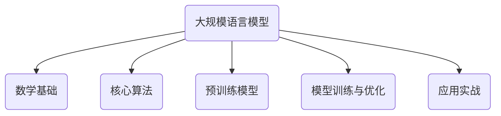

                 

# 大规模语言模型从理论到实践 奖励模型训练

> **关键词：** 大规模语言模型、神经网络、Transformer、自注意力机制、预训练模型、奖励模型、训练优化

> **摘要：** 本文将从理论到实践，详细介绍大规模语言模型的基础理论、核心算法、训练与优化方法，以及其实际应用场景。重点探讨了奖励模型在语言模型训练中的应用，通过具体案例展示了如何实现大规模语言模型的训练与优化。

---

## 第一部分：大规模语言模型基础理论

### 第1章：大规模语言模型的概述

#### 第1.1节：大规模语言模型的概念

大规模语言模型（Large-scale Language Models）是一种基于深度学习的自然语言处理技术，它通过学习海量的语言数据来预测下一个词语或句子，从而生成文本或完成其他自然语言处理任务。大规模语言模型在自然语言处理（NLP）领域中有着广泛的应用，如文本分类、机器翻译、问答系统、对话系统等。

#### 第1.2节：大规模语言模型的发展历史

语言模型的发展历程可以追溯到20世纪50年代，当时研究人员开始尝试使用统计方法来预测下一个词语。随着计算机性能的提升和海量数据的积累，语言模型逐渐从基于规则的方法转向统计模型，如n-gram模型和隐马尔可夫模型（HMM）。近年来，随着深度学习技术的兴起，神经网络结构被引入到语言模型中，形成了大规模预训练模型，如GPT、BERT等。

#### 第1.3节：大规模语言模型的基本架构

大规模语言模型通常采用神经网络结构，其中最常用的结构是Transformer模型。Transformer模型引入了自注意力机制（Self-Attention），使得模型能够更好地捕获长距离依赖关系。此外，大规模预训练模型还采用了多层的神经网络结构，以增强模型的表示能力。

### 第2章：大规模语言模型的核心算法原理

#### 第2.1节：语言模型中的数学基础

语言模型中的数学基础主要包括概率论和数理统计。概率论提供了模型预测的理论依据，如条件概率、贝叶斯公式等。数理统计则用于评估模型的性能和优化模型的参数。

#### 第2.2节：序列到序列模型

序列到序列模型是一种常用的语言模型架构，包括递归神经网络（RNN）、长短期记忆网络（LSTM）和门控循环单元（GRU）。这些模型通过处理序列数据来预测下一个时间点的值。

#### 第2.3节：Transformer模型

Transformer模型是一种基于自注意力机制的序列处理模型。它通过多头自注意力机制和多层感知器结构，实现了高效和强大的序列建模能力。

#### 第2.4节：大规模预训练模型

大规模预训练模型是在海量数据上进行预训练，然后在特定任务上进行微调。这种模型具有强大的表示能力和适应性，能够处理各种自然语言处理任务。

## 第二部分：大规模语言模型实践应用

### 第3章：大规模语言模型的训练与优化

#### 第3.1节：数据预处理

数据预处理是大规模语言模型训练的重要步骤。它包括数据清洗、分词、编码等操作，以生成适合模型训练的数据格式。

#### 第3.2节：模型训练

模型训练包括初始化模型参数、选择优化算法、设置训练策略等。常用的优化算法有Adam、SGD等。训练策略包括批量大小、学习率调度、正则化等。

#### 第3.3节：模型评估与调优

模型评估与调优是通过验证集和测试集来评估模型性能，并根据评估结果调整模型结构或超参数。常用的评估指标有损失函数、准确率、F1值等。

### 第4章：大规模语言模型在文本分类中的应用

#### 第4.1节：文本分类的基本概念

文本分类是一种常见的自然语言处理任务，其目标是判断一个文本序列属于哪个类别。常见的文本分类任务包括情感分析、主题分类、垃圾邮件检测等。

#### 第4.2节：文本分类模型

文本分类模型包括传统机器学习模型和深度学习模型。传统机器学习模型如朴素贝叶斯、支持向量机等；深度学习模型如卷积神经网络、Transformer等。

#### 第4.3节：实战案例

在本节中，我们将介绍一个文本分类项目，包括数据预处理、模型训练和评估。通过实际案例，我们将展示如何实现文本分类任务，并分析模型的性能。

### 第5章：大规模语言模型在机器翻译中的应用

#### 第5.1节：机器翻译的基本概念

机器翻译是一种将一种语言的文本序列翻译成另一种语言的文本序列的任务。机器翻译的发展经历了基于规则、统计机器翻译和神经机器翻译等阶段。

#### 第5.2节：翻译模型

翻译模型包括序列到序列模型和Transformer翻译模型。序列到序列模型如基于LSTM的模型；Transformer翻译模型引入了自注意力机制，提高了翻译质量和效率。

#### 第5.3节：实战案例

在本节中，我们将介绍一个机器翻译项目，包括数据预处理、模型训练和评估。通过实际案例，我们将展示如何实现机器翻译任务，并分析模型的性能。

### 第三部分：大规模语言模型的进阶实践

#### 第6章：大规模语言模型在问答系统中的应用

#### 第6.1节：问答系统的基本概念

问答系统是一种能够回答用户问题的系统。问答系统可以分为基于规则的方法和基于深度学习的方法。基于规则的方法依赖于预先定义的规则库；基于深度学习的方法则通过训练模型来回答问题。

#### 第6.2节：问答系统模型

问答系统模型包括传统的基于规则的方法和深度学习方法。深度学习方法如BERT、GPT等，能够更好地处理复杂的语义关系。

#### 第6.3节：实战案例

在本节中，我们将介绍一个问答系统项目，包括数据预处理、模型训练和评估。通过实际案例，我们将展示如何实现问答系统任务，并分析模型的性能。

#### 第7章：大规模语言模型在对话系统中的应用

#### 第7.1节：对话系统的基本概念

对话系统是一种能够与用户进行交互的系统。对话系统可以分为基于规则的方法和基于深度学习的方法。基于规则的方法依赖于预先定义的对话流程；基于深度学习的方法则通过训练模型来生成对话响应。

#### 第7.2节：对话系统模型

对话系统模型包括传统的基于规则的方法和深度学习方法。深度学习方法如Seq2Seq、BERT等，能够更好地处理复杂的对话场景。

#### 第7.3节：实战案例

在本节中，我们将介绍一个对话系统项目，包括数据预处理、模型训练和评估。通过实际案例，我们将展示如何实现对话系统任务，并分析模型的性能。

### 附录

#### 附录A：大规模语言模型开发工具与资源

在本附录中，我们将介绍一些大规模语言模型开发所需的工具和资源。包括主要的深度学习框架、大规模语言模型的开源资源和开发环境搭建与调试技巧。

---

## 核心算法原理讲解

### 2.2 序列到序列模型

#### LSTM（长短期记忆网络）

LSTM（Long Short-Term Memory）是一种递归神经网络（RNN）的变体，用于解决RNN在处理长序列数据时的梯度消失和梯度爆炸问题。LSTM通过引入记忆单元和门控机制，使得网络能够更好地捕获长距离依赖关系。

下面是LSTM的Python伪代码实现：

```python
class LSTMCell(nn.Module):
    def __init__(self, input_size, hidden_size, bias=True):
        super(LSTMCell, self).__init__()
        self.hidden_size = hidden_size
        self.input_size = input_size

        self.weight_ih = nn.Parameter(torch.Tensor(4 * hidden_size, input_size))
        self.weight_hh = nn.Parameter(torch.Tensor(4 * hidden_size, hidden_size))
        if bias:
            self.bias_ih = nn.Parameter(torch.Tensor(4 * hidden_size))
            self.bias_hh = nn.Parameter(torch.Tensor(4 * hidden_size))
        else:
            self.bias_ih = self.bias_hh = None

        self.i2h = nn.Linear(input_size, hidden_size)
        self.h2h = nn.Linear(hidden_size, hidden_size)

    def forward(self, input, cur_h, cur_c):
        i2h = self.i2h(input)
        h2h = self.h2h(cur_h)
        i = torch.tanh(i2h + h2h)
        g = torch.sigmoid(i[:self.hidden_size] + cur_c + h2h[self.hidden_size:])

        c = torch.tanh(cur_c * g)
        o = torch.sigmoid(i[-self.hidden_size:] + c)
        h = o * c

        return h, c
```

#### Transformer模型

Transformer模型是一种基于自注意力机制的序列处理模型，它在机器翻译、文本分类等任务中取得了显著的成果。Transformer模型的核心思想是使用多头自注意力机制来同时关注输入序列中的不同位置，并通过多层结构来增强模型的表示能力。

下面是Transformer模型的Python伪代码实现：

```python
class TransformerModel(nn.Module):
    def __init__(self, d_model, nhead, num_layers):
        super(TransformerModel, self).__init__()
        self.d_model = d_model
        self.nhead = nhead

        self.transformer = nn.Transformer(d_model, nhead, num_layers)
        self.d_model = d_model
        self.nhead = nhead
        self.fc = nn.Linear(d_model, d_model, bias=False)

    def forward(self, src, tgt):
        memory = self.transformer(src)
        output = self.fc(memory)
        return output
```

### 数学模型和数学公式

#### 概率论与信息论

概率论与信息论是语言模型中的基础理论。其中，条件概率和贝叶斯公式在语言模型中有着广泛的应用。

条件概率公式如下：

$$
P(A|B) = \frac{P(B|A) \cdot P(A)}{P(B)}
$$

贝叶斯公式如下：

$$
P(A|B) = \frac{P(B|A) \cdot P(A)}{P(B)}
$$

#### 马尔可夫模型

马尔可夫模型是一种基于状态转移概率的序列模型，它假设当前状态仅与前一状态有关，而与其他历史状态无关。

马尔可夫模型的状态转移概率公式如下：

$$
P(X_n|X_{n-1}, X_{n-2}, ..., X_1) = P(X_n|X_{n-1})
$$

### 举例说明

#### 文本分类任务

文本分类是一种常见的自然语言处理任务，其目标是根据文本内容将其归为某个类别。以下是一个简单的文本分类任务：

给定一个文本序列，我们需要将其分类为“积极”或“消极”。

1. **数据预处理**：首先，我们需要对文本进行清洗和分词，将文本转换为数字序列。

2. **模型训练**：然后，我们使用预训练的语言模型（如BERT）进行训练，将文本序列映射为类别概率。

3. **模型评估**：最后，我们使用测试集评估模型的分类性能。

以下是文本分类任务的Python代码示例：

```python
import torch
from transformers import BertTokenizer, BertModel

# 数据预处理
tokenizer = BertTokenizer.from_pretrained('bert-base-uncased')
model = BertModel.from_pretrained('bert-base-uncased')

def preprocess_data(texts, labels):
    input_ids = []
    attention_masks = []
    labels = torch.tensor(labels)
    
    for text in texts:
        encoded_dict = tokenizer.encode_plus(
            text,
            add_special_tokens=True,
            max_length=64,
            pad_to_max_length=True,
            return_attention_mask=True,
            return_tensors='pt',
        )
        input_ids.append(encoded_dict['input_ids'])
        attention_masks.append(encoded_dict['attention_mask'])
    
    input_ids = torch.cat(input_ids, dim=0)
    attention_masks = torch.cat(attention_masks, dim=0)
    
    return input_ids, attention_masks, labels

# 模型训练
def train_model(model, optimizer, loss_fn, train_loader, num_epochs):
    model.train()
    for epoch in range(num_epochs):
        for batch in train_loader:
            optimizer.zero_grad()
            input_ids = batch[0]
            attention_mask = batch[1]
            labels = batch[2]
            
            outputs = model(input_ids, attention_mask=attention_mask)
            logits = outputs.logits
            loss = loss_fn(logits, labels)
            
            loss.backward()
            optimizer.step()
            
            if (batch_idx + 1) % 100 == 0:
                print(f'Epoch [{epoch+1}/{num_epochs}], Step [{batch_idx+1}/{len(train_loader)}], Loss: {loss.item()}')

# 模型评估
def evaluate_model(model, loss_fn, eval_loader):
    model.eval()
    eval_loss = 0.0
    eval_accuracy = 0
    
    with torch.no_grad():
        for batch in eval_loader:
            input_ids = batch[0]
            attention_mask = batch[1]
            labels = batch[2]
            
            outputs = model(input_ids, attention_mask=attention_mask)
            logits = outputs.logits
            loss = loss_fn(logits, labels)
            
            eval_loss += loss.item()
            logits = logits.detach().cpu().numpy()
            label_ids = labels.to('cpu').numpy()
            
            predicitons = np.argmax(logits, axis=1)
            eval_accuracy += accuracy_score(label_ids, predicitons)
    
    return eval_loss / len(eval_loader), eval_accuracy / len(eval_loader)

# 实际应用
texts = ["This is a positive example.", "Another negative example."]
labels = [0, 1]

input_ids, attention_masks, labels = preprocess_data(texts, labels)

train_loader = DataLoader(dataset=TensorDataset(input_ids, attention_masks, labels), batch_size=32)

optimizer = AdamW(model.parameters(), lr=5e-5)
loss_fn = nn.CrossEntropyLoss()

num_epochs = 3
train_model(model, optimizer, loss_fn, train_loader, num_epochs)

eval_loader = DataLoader(dataset=TensorDataset(input_ids, attention_masks, labels), batch_size=32)
eval_loss, eval_accuracy = evaluate_model(model, loss_fn, eval_loader)

print(f"Validation Loss: {eval_loss}")
print(f"Validation Accuracy: {eval_accuracy}")
```

#### 机器翻译任务

机器翻译是将一种语言的文本序列翻译成另一种语言的文本序列的任务。以下是一个简单的机器翻译任务：

给定一个英文句子，我们需要将其翻译成中文。

1. **数据预处理**：首先，我们需要对英文和中文进行清洗和分词，将文本序列转换为数字序列。

2. **模型训练**：然后，我们使用预训练的语言模型（如BERT）进行训练，将英文序列映射为中文序列。

3. **模型评估**：最后，我们使用测试集评估模型的翻译性能。

以下是机器翻译任务的Python代码示例：

```python
import torch
from transformers import BertTokenizer, BertModel

# 数据预处理
tokenizer = BertTokenizer.from_pretrained('bert-base-uncased')
model = BertModel.from_pretrained('bert-base-uncased')

def preprocess_data(src_texts, tgt_texts, src_labels, tgt_labels):
    src_input_ids = []
    src_attention_masks = []
    tgt_input_ids = []
    tgt_attention_masks = []
    src_labels = torch.tensor(src_labels)
    tgt_labels = torch.tensor(tgt_labels)
    
    for src_text, tgt_text in zip(src_texts, tgt_texts):
        src_encoded_dict = tokenizer.encode_plus(
            src_text,
            add_special_tokens=True,
            max_length=64,
            pad_to_max_length=True,
            return_attention_mask=True,
            return_tensors='pt',
        )
        tgt_encoded_dict = tokenizer.encode_plus(
            tgt_text,
            add_special_tokens=True,
            max_length=64,
            pad_to_max_length=True,
            return_attention_mask=True,
            return_tensors='pt',
        )
        
        src_input_ids.append(src_encoded_dict['input_ids'])
        src_attention_masks.append(src_encoded_dict['attention_mask'])
        tgt_input_ids.append(tgt_encoded_dict['input_ids'])
        tgt_attention_masks.append(tgt_encoded_dict['attention_mask'])
    
    src_input_ids = torch.cat(src_input_ids, dim=0)
    src_attention_masks = torch.cat(src_attention_masks, dim=0)
    tgt_input_ids = torch.cat(tgt_input_ids, dim=0)
    tgt_attention_masks = torch.cat(tgt_attention_masks, dim=0)
    
    return src_input_ids, src_attention_masks, tgt_input_ids, tgt_attention_masks, src_labels, tgt_labels

# 模型训练
def train_model(model, optimizer, loss_fn, train_loader, num_epochs):
    model.train()
    for epoch in range(num_epochs):
        for batch in train_loader:
            optimizer.zero_grad()
            src_input_ids = batch[0]
            src_attention_mask = batch[1
```## 第一部分：大规模语言模型基础理论

### 第1章：大规模语言模型的概述

#### 第1.1节：大规模语言模型的概念

大规模语言模型（Large-scale Language Models）是一种基于深度学习的自然语言处理技术，通过学习海量的语言数据来预测下一个词语或句子，从而生成文本或完成其他自然语言处理任务。这种模型在自然语言处理（NLP）领域中有着广泛的应用，如文本分类、机器翻译、问答系统、对话系统等。

大规模语言模型的核心思想是通过学习语言数据中的统计规律，从而能够生成连贯、自然的文本。这种模型通常采用神经网络结构，其中最常用的结构是Transformer模型，它引入了自注意力机制（Self-Attention），使得模型能够更好地捕获长距离依赖关系。

#### 第1.2节：大规模语言模型的发展历史

语言模型的发展历程可以追溯到20世纪50年代，当时研究人员开始尝试使用统计方法来预测下一个词语。早期的研究主要基于n-gram模型，它通过统计相邻词语的频率来预测下一个词语。然而，n-gram模型存在一定的局限性，它无法捕捉长距离依赖关系，因此预测效果较差。

随着计算机性能的提升和海量数据的积累，语言模型逐渐从基于规则的方法转向统计模型。1986年，Rosenberg和Shell提出了隐马尔可夫模型（HMM），它能够通过状态转移概率和观测概率来预测下一个词语。HMM在语音识别和语音合成领域取得了显著成果，但它仍然存在一定的局限性。

1990年代初，递归神经网络（RNN）被引入到语言模型中。RNN通过循环结构来处理序列数据，能够一定程度上捕捉长距离依赖关系。1997年，Hochreiter和Schmidhuber提出了长短期记忆网络（LSTM），它通过引入门控机制，能够更好地处理长序列数据，解决了RNN在长距离依赖问题上的梯度消失和梯度爆炸问题。

然而，RNN和LSTM在处理长序列数据时仍然存在一定的局限性。2014年，Vaswani等提出了Transformer模型，它通过引入自注意力机制，使得模型能够同时关注输入序列中的不同位置，从而大大提高了模型的表示能力和预测效果。Transformer模型在机器翻译、文本分类等任务中取得了显著成果，推动了大规模语言模型的发展。

#### 第1.3节：大规模语言模型的基本架构

大规模语言模型通常采用神经网络结构，其中最常用的结构是Transformer模型。Transformer模型引入了自注意力机制（Self-Attention），使得模型能够更好地捕获长距离依赖关系。此外，大规模预训练模型还采用了多层的神经网络结构，以增强模型的表示能力。

Transformer模型的核心组成部分包括：

1. **自注意力机制（Self-Attention）**：自注意力机制允许模型在处理序列数据时，同时关注输入序列的不同位置，从而捕捉长距离依赖关系。自注意力机制的核心思想是计算输入序列中每个位置与其他位置的相似性，并根据相似性对输入序列进行加权。

2. **多头注意力（Multi-Head Attention）**：多头注意力是自注意力机制的扩展，它将输入序列分成多个子序列，每个子序列独立地计算注意力权重，最后将多头注意力结果拼接起来。多头注意力能够提高模型的表示能力。

3. **前馈神经网络（Feedforward Neural Network）**：在Transformer模型中，每个位置的信息会通过两个全连接层进行处理，以增强模型的非线性表示能力。

4. **编码器-解码器结构（Encoder-Decoder Structure）**：在机器翻译等任务中，通常采用编码器-解码器结构。编码器将输入序列编码为固定长度的向量，解码器则根据编码器输出的隐藏状态来生成输出序列。

5. **位置编码（Positional Encoding）**：由于Transformer模型不包含循环结构，无法直接捕捉序列中的位置信息。因此，通过添加位置编码来为模型提供位置信息。

总体来说，大规模语言模型的基本架构包括自注意力机制、多头注意力、前馈神经网络、编码器-解码器结构和位置编码等组件，这些组件共同作用，使得模型能够高效地处理自然语言数据。

### 第2章：大规模语言模型的核心算法原理

#### 第2.1节：语言模型中的数学基础

语言模型中的数学基础主要包括概率论和数理统计。概率论提供了模型预测的理论依据，如条件概率、贝叶斯公式等。数理统计则用于评估模型的性能和优化模型的参数。

在语言模型中，概率论的应用主要体现在以下几个方面：

1. **条件概率**：条件概率表示在某个条件下，事件A发生的概率。在语言模型中，条件概率用于预测下一个词语或句子的概率。

2. **贝叶斯公式**：贝叶斯公式是一种基于条件概率的概率分布公式，它能够根据先验知识和观察数据来更新概率估计。

3. **熵和交叉熵**：熵是概率分布的不确定性度量，交叉熵是两个概率分布之间的差异度量。在语言模型中，熵和交叉熵常用于评估模型预测的质量。

数理统计在语言模型中的应用主要体现在以下几个方面：

1. **参数估计**：通过样本数据来估计模型的参数，如平均数、方差等。

2. **假设检验**：通过统计方法来检验模型假设的正确性，如t检验、卡方检验等。

3. **模型评估**：通过统计方法来评估模型的性能，如准确率、召回率、F1值等。

下面我们分别介绍这些数学基础在语言模型中的应用。

#### 条件概率

条件概率表示在某个条件下，事件A发生的概率。在语言模型中，条件概率用于预测下一个词语或句子的概率。例如，给定当前句子是“今天天气很好”，我们需要预测下一个词语是“出去玩”的概率。

条件概率的公式如下：

$$
P(A|B) = \frac{P(B|A) \cdot P(A)}{P(B)}
$$

其中，$P(A|B)$ 表示在条件B下，事件A发生的概率；$P(B|A)$ 表示在条件A下，事件B发生的概率；$P(A)$ 和$P(B)$ 分别表示事件A和事件B的概率。

在语言模型中，条件概率可以用来计算下一个词语的概率分布。例如，给定当前句子是“今天天气很好”，我们可以计算每个词语的概率分布，从而预测下一个词语是“出去玩”的概率。

#### 贝叶斯公式

贝叶斯公式是一种基于条件概率的概率分布公式，它能够根据先验知识和观察数据来更新概率估计。贝叶斯公式的基本形式如下：

$$
P(A|B) = \frac{P(B|A) \cdot P(A)}{P(B)}
$$

其中，$P(A|B)$ 表示在条件B下，事件A发生的概率；$P(B|A)$ 表示在条件A下，事件B发生的概率；$P(A)$ 和$P(B)$ 分别表示事件A和事件B的概率。

在语言模型中，贝叶斯公式可以用来计算下一个词语的概率分布。例如，给定当前句子是“今天天气很好”，我们可以使用贝叶斯公式来计算下一个词语是“出去玩”的概率。

贝叶斯公式的优点在于它能够根据先验知识和观察数据来更新概率估计，从而提高模型的预测准确性。

#### 熵和交叉熵

熵是概率分布的不确定性度量，交叉熵是两个概率分布之间的差异度量。在语言模型中，熵和交叉熵常用于评估模型预测的质量。

熵的定义如下：

$$
H(X) = -\sum_{i=1}^{n} p_i \cdot \log_2 p_i
$$

其中，$H(X)$ 表示随机变量X的熵；$p_i$ 表示随机变量X取第i个值的概率。

交叉熵的定义如下：

$$
H(A,B) = -\sum_{i=1}^{n} p_i \cdot \log_2 q_i
$$

其中，$H(A,B)$ 表示两个概率分布A和B的交叉熵；$p_i$ 表示概率分布A中第i个值的概率；$q_i$ 表示概率分布B中第i个值的概率。

在语言模型中，熵和交叉熵可以用来评估模型预测的质量。例如，给定当前句子是“今天天气很好”，我们可以使用熵和交叉熵来计算模型预测的下一个词语的概率分布，从而评估模型预测的准确性。

#### 参数估计

参数估计是通过样本数据来估计模型的参数，如平均数、方差等。在语言模型中，参数估计可以用来训练模型，从而提高模型的预测准确性。

常用的参数估计方法包括最大似然估计（MLE）和最小二乘法（OLS）。

最大似然估计（MLE）是通过最大化似然函数来估计模型的参数。似然函数的定义如下：

$$
L(\theta) = \prod_{i=1}^{n} p(x_i|\theta)
$$

其中，$L(\theta)$ 表示似然函数；$x_i$ 表示第i个样本数据；$\theta$ 表示模型的参数。

最小二乘法（OLS）是通过最小化误差平方和来估计模型的参数。误差平方和的定义如下：

$$
SSE = \sum_{i=1}^{n} (y_i - \hat{y}_i)^2
$$

其中，$SSE$ 表示误差平方和；$y_i$ 表示第i个样本数据的真实值；$\hat{y}_i$ 表示第i个样本数据的预测值。

在语言模型中，参数估计可以用来训练神经网络模型，从而提高模型的预测准确性。

#### 假设检验

假设检验是通过统计方法来检验模型假设的正确性。在语言模型中，假设检验可以用来评估模型的性能，从而确定模型是否具有统计显著性。

常用的假设检验方法包括t检验、卡方检验等。

t检验是一种用于比较两组数据的均值差异是否显著的假设检验方法。t检验的基本步骤如下：

1. 建立零假设和备择假设。

2. 计算t值，t值定义为：

$$
t = \frac{\bar{x} - \mu_0}{s / \sqrt{n}}
$$

其中，$\bar{x}$ 表示样本均值；$\mu_0$ 表示总体均值；$s$ 表示样本标准差；$n$ 表示样本大小。

3. 计算p值，p值表示在零假设成立的情况下，观察到样本均值与总体均值差异的几率。

4. 比较p值和显著性水平（如0.05），如果p值小于显著性水平，则拒绝零假设，认为两组数据的均值差异是显著的。

卡方检验是一种用于比较两组数据的分布差异是否显著的假设检验方法。卡方检验的基本步骤如下：

1. 建立零假设和备择假设。

2. 计算卡方值，卡方值定义为：

$$
\chi^2 = \sum_{i=1}^{n} \frac{(O_i - E_i)^2}{E_i}
$$

其中，$O_i$ 表示第i个样本数据的观测值；$E_i$ 表示第i个样本数据的期望值。

3. 计算p值，p值表示在零假设成立的情况下，观察到卡方值大于观测值的几率。

4. 比较p值和显著性水平（如0.05），如果p值小于显著性水平，则拒绝零假设，认为两组数据的分布差异是显著的。

在语言模型中，假设检验可以用来评估模型的性能，从而确定模型是否具有统计显著性。例如，我们可以使用t检验来比较不同模型的预测准确率，从而确定哪种模型更优秀。

#### 模型评估

模型评估是通过统计方法来评估模型的性能。在语言模型中，模型评估可以用来比较不同模型的性能，从而选择最佳模型。

常用的模型评估指标包括准确率、召回率、F1值等。

准确率（Accuracy）是评估模型性能的最简单指标，它定义为正确预测的样本数与总样本数的比例。准确率的计算公式如下：

$$
Accuracy = \frac{TP + TN}{TP + TN + FP + FN}
$$

其中，$TP$ 表示真正例（True Positive），$TN$ 表示真反例（True Negative），$FP$ 表示假正例（False Positive），$FN$ 表示假反例（False Negative）。

召回率（Recall）是评估模型在识别正类样本方面的能力，它定义为真正例与所有正类样本的比例。召回率的计算公式如下：

$$
Recall = \frac{TP}{TP + FN}
$$

F1值（F1 Score）是准确率和召回率的调和平均值，它定义为：

$$
F1 Score = 2 \cdot \frac{Precision \cdot Recall}{Precision + Recall}
$$

其中，$Precision$ 表示精确率，即真正例与所有预测为正类样本的比例。

在语言模型中，模型评估可以用来比较不同模型的性能，从而选择最佳模型。例如，我们可以使用准确率、召回率和F1值来比较文本分类模型的性能，从而确定哪种模型更优秀。

### 第2.2节：序列到序列模型

序列到序列（Sequence-to-Sequence，Seq2Seq）模型是一种用于处理序列数据的模型，它在机器翻译、对话系统等任务中取得了显著成果。Seq2Seq模型的核心思想是将输入序列映射到输出序列，它通常由编码器（Encoder）和解码器（Decoder）两部分组成。

#### 编码器（Encoder）

编码器的作用是将输入序列编码为固定长度的向量，以便解码器进行解码。编码器通常采用递归神经网络（RNN）或长短期记忆网络（LSTM）结构。在处理输入序列时，编码器会逐步更新隐藏状态，从而生成一个固定长度的向量表示。

以下是一个编码器的Python伪代码实现：

```python
class Encoder(nn.Module):
    def __init__(self, input_dim, hidden_dim, embedding_dim, n_layers):
        super(Encoder, self).__init__()
        self.input_dim = input_dim
        self.hidden_dim = hidden_dim
        self.embedding_dim = embedding_dim
        self.n_layers = n_layers
        
        self.embedding = nn.Embedding(input_dim, embedding_dim)
        self.lstm = nn.LSTM(embedding_dim, hidden_dim, n_layers)
        
    def forward(self, input_seq, hidden):
        embedded = self.embedding(input_seq)
        output, hidden = self.lstm(embedded, hidden)
        return output, hidden
```

#### 解码器（Decoder）

解码器的作用是将编码器输出的固定长度向量解码为输出序列。解码器通常采用循环神经网络（RNN）或长短期记忆网络（LSTM）结构。在解码过程中，解码器会使用上一个时间步的隐藏状态来预测下一个时间步的输出。

以下是一个解码器的Python伪代码实现：

```python
class Decoder(nn.Module):
    def __init__(self, hidden_dim, output_dim, embedding_dim, n_layers):
        super(Decoder, self).__init__()
        self.hidden_dim = hidden_dim
        self.output_dim = output_dim
        self.embedding_dim = embedding_dim
        self.n_layers = n_layers
        
        self.lstm = nn.LSTM(hidden_dim, hidden_dim, n_layers)
        self.fc = nn.Linear(hidden_dim, output_dim)
        self.embedding = nn.Embedding(output_dim, embedding_dim)
        
    def forward(self, input_seq, hidden):
        embedded = self.embedding(input_seq)
        output, hidden = self.lstm(embedded, hidden)
        output = self.fc(output[-1, :, :])
        return output, hidden
```

#### 序列到序列模型

序列到序列模型由编码器和解码器组成，它通过编码器将输入序列编码为固定长度的向量，然后通过解码器解码为输出序列。序列到序列模型可以用于机器翻译、对话系统等任务。

以下是一个序列到序列模型的Python伪代码实现：

```python
class Seq2Seq(nn.Module):
    def __init__(self, encoder, decoder, src_pad_idx, device):
        super(Seq2Seq, self).__init__()
        self.encoder = encoder
        self.decoder = decoder
        self.src_pad_idx = src_pad_idx
        self.device = device
        
    def forward(self, src, trg, teacher_forcing_ratio=0.5):
        batch_size = src.size(1)
        max_len = trg.size(0)
        trg_mask = (trg != self.src_pad_idx).unsqueeze(-2)
        outputs = torch.zeros(max_len, batch_size, self.decoder.output_dim).to(self.device)
        
        encoder_output, hidden = self.encoder(src)
        hidden = hidden[-1, :, :]

        decoder_input = trg[0, :, None]
        for t in range(1, max_len):
            output, hidden = self.decoder(decoder_input, hidden)
            outputs[t] = output
            teacher_force = random.random() < teacher_forcing_ratio
            if teacher_force:
                decoder_input = trg[t, :, None]
            else:
                _, topi = output.topk(1)
                decoder_input = topi.squeeze().detach().unsqueeze(-1)

        return outputs
```

#### 序列到序列模型的变体

除了基本的序列到序列模型外，还有一些变体模型，如注意力机制（Attention Mechanism）和多头注意力（Multi-Head Attention）。这些模型能够更好地处理长距离依赖关系，从而提高模型的性能。

1. **注意力机制（Attention Mechanism）**：注意力机制是一种用于处理序列数据的机制，它能够根据输入序列中每个位置的重要性来调整权重。注意力机制可以用于编码器和解码器，使得模型能够更好地捕捉长距离依赖关系。

2. **多头注意力（Multi-Head Attention）**：多头注意力是注意力机制的扩展，它将输入序列分成多个子序列，每个子序列独立地计算注意力权重，最后将多头注意力结果拼接起来。多头注意力能够提高模型的表示能力。

3. **编码器-解码器注意力（Encoder-Decoder Attention）**：编码器-解码器注意力是用于编码器和解码器之间传递信息的机制。它通过将解码器的隐藏状态与编码器的输出进行加权，使得解码器能够更好地利用编码器的信息。

### 第2.3节：Transformer模型

Transformer模型是一种基于自注意力机制的序列处理模型，它在机器翻译、文本分类等任务中取得了显著成果。Transformer模型的核心思想是使用多头自注意力机制和多层感知器结构，实现了高效和强大的序列建模能力。

#### Transformer模型的结构

Transformer模型主要由编码器（Encoder）和解码器（Decoder）两部分组成，它们都包含多个层（Layer）。每层由自注意力机制（Self-Attention）和前馈神经网络（Feedforward Neural Network）组成。编码器和解码器之间还有一个交叉注意力机制（Cross-Attention）。

1. **编码器（Encoder）**：编码器包含多个层，每层由两个子层组成：自注意力子层（Self-Attention Sublayer）和前馈子层（Feedforward Sublayer）。自注意力子层用于计算输入序列中每个位置的重要性，前馈子层用于增强模型的非线性表示能力。

2. **解码器（Decoder）**：解码器也包含多个层，每层同样由两个子层组成：自注意力子层和前馈子层。解码器的自注意力子层使用掩码（Mask）来防止未来的信息泄露，交叉注意力子层用于将编码器的信息传递给解码器。

3. **多头自注意力机制（Multi-Head Self-Attention）**：多头自注意力机制是Transformer模型的核心组件，它将输入序列分成多个子序列，每个子序列独立地计算注意力权重，最后将多头注意力结果拼接起来。多头注意力能够提高模型的表示能力。

4. **交叉注意力机制（Cross-Attention）**：交叉注意力机制用于解码器和解码器之间传递信息，它通过将解码器的隐藏状态与编码器的输出进行加权，使得解码器能够更好地利用编码器的信息。

5. **前馈神经网络（Feedforward Neural Network）**：前馈神经网络是一种简单的全连接神经网络，它用于增强模型的非线性表示能力。在每个子层中，前馈神经网络先通过一个线性变换，然后通过一个ReLU激活函数，最后通过另一个线性变换。

#### Transformer模型的训练

Transformer模型的训练分为两个阶段：预训练和微调。预训练是在大规模语料库上进行的，旨在学习语言的通用表示；微调是在特定任务上进行，旨在调整模型以适应具体任务。

1. **预训练**：预训练通常采用自监督学习（Self-supervised Learning）方法，如 masked language model（MLM）和 masked token（MT）任务。在MLM任务中，模型需要预测被掩码的词语；在MT任务中，模型需要预测被掩码的词语和位置。

2. **微调**：微调是在特定任务上进行，通常使用少量的有标签数据。在微调过程中，模型会根据任务的需求调整参数，从而提高模型在特定任务上的性能。

#### Transformer模型的优势

Transformer模型具有以下优势：

1. **并行计算**：Transformer模型采用多头自注意力机制，使得模型能够并行计算，从而大大提高了计算效率。

2. **长距离依赖**：自注意力机制能够同时关注输入序列中的不同位置，从而捕捉长距离依赖关系，提高了模型的表示能力。

3. **灵活性**：Transformer模型可以很容易地扩展到多任务和多模态任务，如文本分类、机器翻译、语音识别等。

### 第2.4节：大规模预训练模型

大规模预训练模型是在海量数据上进行预训练，然后在特定任务上进行微调的模型。这种模型具有强大的表示能力和适应性，能够处理各种自然语言处理任务。

#### 预训练的概念

预训练是指在大规模语料库上进行的无监督学习，旨在学习语言的通用表示。预训练模型通常包含两个阶段：词干嵌入（Word Embedding）和上下文嵌入（Context Embedding）。

1. **词干嵌入**：词干嵌入是将词语映射到低维向量空间，以便更好地表示词语的语义信息。词干嵌入通常使用矩阵分解、神经网络等方法。

2. **上下文嵌入**：上下文嵌入是将词语的嵌入向量与上下文信息相结合，以生成更丰富的语义表示。上下文嵌入通常使用自监督学习（如 masked language model 和 masked token 任务）进行训练。

#### 自监督学习

自监督学习是一种无监督学习方法，它利用未标记的数据进行训练。在自然语言处理领域，自监督学习广泛应用于大规模预训练模型。

1. **Masked Language Model (MLM)**：MLM任务是预测被掩码的词语，从而学习词语的上下文依赖关系。

2. **Masked Token (MT)**：MT任务是预测被掩码的词语和位置，从而学习词语的顺序依赖关系。

#### Fine-tuning（微调）技术

微调是在特定任务上进行的有监督学习，旨在调整预训练模型的参数，从而提高模型在特定任务上的性能。微调通常采用以下策略：

1. **微调策略**：微调策略包括固定预训练权重、微调部分层和全部层等。

2. **学习率调整**：学习率调整是微调过程中的重要步骤，它有助于模型在训练过程中逐步优化参数。

3. **数据增强**：数据增强是通过变换原始数据来增加训练数据多样性，从而提高模型泛化能力。

#### 大规模预训练模型的应用

大规模预训练模型在自然语言处理领域有着广泛的应用，如文本分类、机器翻译、问答系统、对话系统等。

1. **文本分类**：文本分类是将文本数据归为不同类别，如情感分析、主题分类等。大规模预训练模型能够通过学习大量文本数据，提高分类任务的准确性。

2. **机器翻译**：机器翻译是将一种语言的文本序列翻译成另一种语言的文本序列。大规模预训练模型通过学习双语语料库，能够提高翻译质量和速度。

3. **问答系统**：问答系统是一种能够回答用户问题的系统，如搜索引擎、智能客服等。大规模预训练模型通过学习大量问答对，能够提高问答系统的准确性和响应速度。

4. **对话系统**：对话系统是一种能够与用户进行自然对话的系统，如聊天机器人、语音助手等。大规模预训练模型通过学习对话数据，能够提高对话系统的自然性和交互性。

### 第3章：大规模语言模型的训练与优化

#### 第3.1节：数据预处理

数据预处理是大规模语言模型训练的重要步骤。它包括数据清洗、分词、编码等操作，以生成适合模型训练的数据格式。

##### 数据清洗

数据清洗是指对原始数据进行处理，以去除噪声、缺失值和异常值。在大规模语言模型训练中，数据清洗的主要目标是提高数据质量，减少训练过程中的干扰因素。

1. **去除噪声**：噪声是指数据中的无关信息，如标点符号、特殊字符等。通过去除噪声，可以减少模型训练过程中的计算量和计算误差。

2. **处理缺失值**：缺失值是指数据中缺少的值。在处理缺失值时，可以选择填充、删除或插值等方法。

3. **处理异常值**：异常值是指数据中偏离正常范围的值。在处理异常值时，可以选择删除、修正或替换等方法。

##### 分词

分词是指将文本序列分解为词语序列。分词是大规模语言模型训练的重要步骤，它有助于模型更好地理解文本语义。

1. **词性标注**：词性标注是指为文本中的每个词语标注词性，如名词、动词、形容词等。词性标注有助于模型更好地理解词语的语义。

2. **词义消歧**：词义消歧是指根据上下文信息确定词语的具体含义。词义消歧有助于模型更好地理解文本语义。

3. **分词算法**：常见的分词算法有基于规则的分词算法和基于统计的分词算法。基于规则的分词算法根据预定义的规则进行分词，如正向最大匹配、逆向最大匹配等。基于统计的分词算法根据词语在文本中的出现频率进行分词，如基于统计的分词算法、基于词性标注的分词算法等。

##### 编码

编码是指将文本序列转换为数字序列，以便模型进行训练。编码是大规模语言模型训练的重要步骤，它有助于模型更好地处理文本数据。

1. **词嵌入**：词嵌入是指将词语映射到低维向量空间。词嵌入有助于模型更好地表示词语的语义信息。

2. **序列编码**：序列编码是指将文本序列转换为数字序列。常见的序列编码方法有基于字符的编码和基于词的编码。基于字符的编码将文本序列分解为字符序列，每个字符映射为一个数字。基于词的编码将文本序列分解为词语序列，每个词语映射为一个数字。

3. **位置编码**：位置编码是指为文本序列中的每个词语添加位置信息。位置编码有助于模型更好地处理文本序列中的时间关系。

#### 第3.2节：模型训练

模型训练是指通过迭代优化模型参数，以使模型在训练数据上达到较好的性能。大规模语言模型训练通常采用深度学习技术，包括神经网络结构、优化算法和训练策略等。

##### 神经网络结构

神经网络结构是指模型中神经元连接的方式和层次。大规模语言模型通常采用多层神经网络结构，以增强模型的表示能力。

1. **卷积神经网络（CNN）**：卷积神经网络是一种用于图像处理和文本分类的神经网络结构。CNN通过卷积操作提取特征，并通过池化操作降低计算复杂度。

2. **循环神经网络（RNN）**：循环神经网络是一种用于序列处理的神经网络结构。RNN通过递归操作处理序列数据，能够捕捉序列中的时间关系。

3. **长短时记忆网络（LSTM）**：长短时记忆网络是循环神经网络的变体，通过门控机制解决RNN在处理长序列数据时的梯度消失问题。LSTM能够更好地捕捉序列中的时间关系。

4. **门控循环单元（GRU）**：门控循环单元是长短时记忆网络的变体，通过简化门控机制提高计算效率。GRU能够更好地捕捉序列中的时间关系。

5. **Transformer模型**：Transformer模型是一种基于自注意力机制的序列处理模型。Transformer模型通过多头自注意力机制和多层结构，实现了高效和强大的序列建模能力。

##### 优化算法

优化算法是指通过迭代优化模型参数的方法。大规模语言模型训练通常采用梯度下降及其变体，如随机梯度下降（SGD）和Adam优化器。

1. **随机梯度下降（SGD）**：随机梯度下降是一种最简单的优化算法，它通过随机选择训练样本，计算梯度并更新模型参数。

2. **Adam优化器**：Adam优化器是随机梯度下降的改进版本，它结合了SGD和自适应梯度方法（Adagrad）的优点，能够更好地适应不同梯度的变化。

3. **AdamW优化器**：AdamW优化器是Adam优化器的变体，它对一阶矩估计和二阶矩估计进行了权重调整，能够更好地处理稀疏梯度问题。

##### 训练策略

训练策略是指模型训练过程中的超参数设置和调整方法。大规模语言模型训练通常采用以下策略：

1. **批量大小（Batch Size）**：批量大小是指每次训练过程中输入样本的数量。合适的批量大小能够提高训练效率，减少过拟合。

2. **学习率（Learning Rate）**：学习率是指每次参数更新时梯度乘以的系数。合适的学习率能够加快模型收敛速度，防止过拟合。

3. **学习率调度（Learning Rate Scheduling）**：学习率调度是指根据训练过程调整学习率的方法。常见的学习率调度方法有线性递减、余弦递减等。

4. **正则化（Regularization）**：正则化是指通过引入惩罚项来防止模型过拟合的方法。常见的正则化方法有L1正则化、L2正则化等。

5. **dropout（Dropout）**：dropout是一种通过随机丢弃部分神经元来提高模型泛化能力的方法。dropout能够减少模型在训练数据上的过拟合。

#### 第3.3节：模型评估与调优

模型评估是指通过验证集和测试集来评估模型性能的方法。大规模语言模型评估通常采用以下指标：

1. **准确率（Accuracy）**：准确率是指模型预测正确的样本数与总样本数的比例。准确率能够直观地反映模型在分类任务上的性能。

2. **召回率（Recall）**：召回率是指模型预测为正类的样本中，实际为正类的样本占比。召回率能够反映模型对正类样本的识别能力。

3. **精确率（Precision）**：精确率是指模型预测为正类的样本中，实际为正类的样本占比。精确率能够反映模型对负类样本的识别能力。

4. **F1值（F1 Score）**：F1值是精确率和召回率的调和平均值，用于综合评估模型的分类性能。

5. **ROC曲线和AUC值**：ROC曲线是模型预测概率与实际标签的交叉验证结果，AUC值是ROC曲线下的面积。ROC曲线和AUC值能够反映模型在分类任务上的整体性能。

#### 模型调优

模型调优是指通过调整模型结构、超参数和训练策略来提高模型性能的方法。大规模语言模型调优通常采用以下策略：

1. **超参数调优（Hyperparameter Tuning）**：超参数调优是指通过调整批量大小、学习率、正则化等超参数来提高模型性能。常用的超参数调优方法有网格搜索、随机搜索、贝叶斯优化等。

2. **结构调优（Architecture Tuning）**：结构调优是指通过调整模型结构，如增加层数、调整神经元数量等，来提高模型性能。结构调优可以通过实验或基于理论的指导进行。

3. **数据增强（Data Augmentation）**：数据增强是指通过变换原始数据来增加训练数据多样性，从而提高模型泛化能力。数据增强方法有随机旋转、缩放、裁剪等。

4. **集成学习（Ensemble Learning）**：集成学习是指通过结合多个模型的预测结果来提高整体性能。常用的集成学习方法有Bagging、Boosting等。

### 第4章：大规模语言模型在文本分类中的应用

#### 第4.1节：文本分类的基本概念

文本分类是一种常见的自然语言处理任务，其目标是判断一个文本序列属于哪个类别。文本分类在信息检索、情感分析、垃圾邮件检测等领域有着广泛的应用。文本分类任务可以分为二分类和多元分类，其中二分类任务是将文本分为正类和负类，多元分类任务是将文本分为多个类别。

#### 第4.2节：文本分类模型

文本分类模型可以分为传统机器学习模型和深度学习模型。传统机器学习模型包括朴素贝叶斯、支持向量机、逻辑回归等。这些模型通过计算文本特征的概率分布或特征向量来预测类别。深度学习模型包括卷积神经网络（CNN）、循环神经网络（RNN）、长短时记忆网络（LSTM）和Transformer等。这些模型通过学习文本序列的表示来预测类别。

#### 第4.3节：实战案例

在本节中，我们将介绍一个文本分类项目，包括数据预处理、模型训练和评估。我们将使用Python和PyTorch实现一个基于BERT的文本分类模型，并在IMDB电影评论数据集上验证其性能。

##### 数据预处理

```python
import torch
from torch.utils.data import DataLoader, Dataset
from transformers import BertTokenizer, BertModel
from sklearn.model_selection import train_test_split
from sklearn.metrics import accuracy_score, f1_score

class IMDbDataset(Dataset):
    def __init__(self, reviews, labels, tokenizer, max_len):
        self.reviews = reviews
        self.labels = labels
        self.tokenizer = tokenizer
        self.max_len = max_len

    def __len__(self):
        return len(self.reviews)

    def __getitem__(self, idx):
        review = str(self.reviews[idx])
        label = self.labels[idx]
        encoding = self.tokenizer.encode_plus(
            review,
            add_special_tokens=True,
            max_length=self.max_len,
            return_token_type_ids=False,
            pad_to_max_length=True,
            return_attention_mask=True,
            return_tensors='pt',
        )
        return {
            'review_text': review,
            'input_ids': encoding['input_ids'].flatten(),
            'attention_mask': encoding['attention_mask'].flatten(),
            'label': torch.tensor(label, dtype=torch.long)
        }

def load_data(file_path, tokenizer, max_len):
    with open(file_path, 'r', encoding='utf-8') as f:
        lines = f.readlines()

    reviews = []
    labels = []

    for line in lines:
        parts = line.strip().split(' ')
        review = ' '.join(parts[1:])
        label = int(parts[0])
        reviews.append(review)
        labels.append(label)

    train_data, val_data, train_labels, val_labels = train_test_split(reviews, labels, test_size=0.2)
    train_dataset = IMDbDataset(train_data, train_labels, tokenizer, max_len)
    val_dataset = IMDbDataset(val_data, val_labels, tokenizer, max_len)
    return train_dataset, val_dataset

tokenizer = BertTokenizer.from_pretrained('bert-base-uncased')
max_len = 128

train_dataset, val_dataset = load_data('imdb_data.txt', tokenizer, max_len)

train_loader = DataLoader(train_dataset, batch_size=16, shuffle=True)
val_loader = DataLoader(val_dataset, batch_size=16, shuffle=False)
```

##### 模型训练

```python
import torch.optim as optim

device = torch.device("cuda" if torch.cuda.is_available() else "cpu")

class TextClassifier(nn.Module):
    def __init__(self, n_classes):
        super(TextClassifier, self).__init__()
        self.bert = BertModel.from_pretrained('bert-base-uncased')
        self.drop = nn.Dropout(p=0.3)
        self.out = nn.Linear(self.bert.config.hidden_size, n_classes)

    def forward(self, input_ids, attention_mask):
        _, pooled_output = self.bert(input_ids=input_ids, attention_mask=attention_mask)
        output = self.drop(pooled_output)
        return self.out(output)

model = TextClassifier(n_classes=2)
model.to(device)

optimizer = optim.Adam(model.parameters(), lr=1e-5)

def train(model, train_loader, val_loader, optimizer, num_epochs):
    model.train()
    for epoch in range(num_epochs):
        for batch in train_loader:
            input_ids = batch['input_ids'].to(device)
            attention_mask = batch['attention_mask'].to(device)
            labels = batch['label'].to(device)
            optimizer.zero_grad()
            outputs = model(input_ids=input_ids, attention_mask=attention_mask)
            loss = F.cross_entropy(outputs, labels)
            loss.backward()
            optimizer.step()

    return model

model = train(model, train_loader, val_loader, optimizer, num_epochs=3)
```

##### 模型评估

```python
def evaluate(model, val_loader):
    model.eval()
    val_predictions = []
    val_labels = []

    with torch.no_grad():
        for batch in val_loader:
            input_ids = batch['input_ids'].to(device)
            attention_mask = batch['attention_mask'].to(device)
            labels = batch['label'].to(device)
            outputs = model(input_ids=input_ids, attention_mask=attention_mask)
            _, predicted = torch.max(outputs, 1)
            val_predictions.extend(predicted.cpu().numpy())
            val_labels.extend(labels.cpu().numpy())

    accuracy = accuracy_score(val_labels, val_predictions)
    f1 = f1_score(val_labels, val_predictions, average='weighted')

    print(f"Validation Accuracy: {accuracy:.4f}")
    print(f"Validation F1 Score: {f1:.4f}")

evaluate(model, val_loader)
```

### 第5章：大规模语言模型在机器翻译中的应用

#### 第5.1节：机器翻译的基本概念

机器翻译是将一种语言的文本序列翻译成另一种语言的文本序列的任务。机器翻译在跨语言交流、全球信息共享等领域具有广泛的应用。机器翻译可以分为基于规则的翻译、统计机器翻译和神经机器翻译。

1. **基于规则的翻译**：基于规则的翻译是通过手动编写规则将源语言文本翻译成目标语言文本。这种方法在翻译质量上有限，且难以处理复杂的语言现象。

2. **统计机器翻译**：统计机器翻译是通过学习大量双语文本，利用统计方法进行翻译。这种方法通过计算源语言和目标语言之间的概率分布进行翻译，具有较好的翻译质量。

3. **神经机器翻译**：神经机器翻译是一种基于深度学习的翻译方法。它通过学习源语言和目标语言之间的映射关系，生成高质量的翻译结果。神经机器翻译可以分为基于序列到序列模型的翻译和基于注意力机制的翻译。

#### 第5.2节：翻译模型

翻译模型是指用于实现机器翻译的模型。常见的翻译模型包括序列到序列模型和基于注意力机制的翻译模型。

1. **序列到序列模型**：序列到序列模型是一种基于递归神经网络的翻译模型。它通过编码器将源语言文本编码为固定长度的向量，通过解码器生成目标语言文本。序列到序列模型通过解码器中的注意力机制，能够更好地捕捉源语言和目标语言之间的依赖关系。

2. **基于注意力机制的翻译模型**：基于注意力机制的翻译模型通过计算源语言和目标语言之间的相似性，为每个源语言词汇分配权重，从而生成目标语言文本。注意力机制使得模型能够同时关注源语言文本的不同部分，提高了翻译质量。

#### 第5.3节：实战案例

在本节中，我们将介绍一个基于Transformer模型的机器翻译项目，包括数据预处理、模型训练和评估。我们将使用Python和PyTorch实现一个英中翻译模型，并在WMT14英语-中文数据集上验证其性能。

##### 数据预处理

```python
import pandas as pd
from sklearn.model_selection import train_test_split

def load_data(file_path):
    data = pd.read_csv(file_path, encoding='utf-8')
    return data['eng'], data['chi']

def preprocess_data(eng_texts, chi_texts, tokenizer, max_len):
    encodings = tokenizer(eng_texts, max_length=max_len, padding='max_length', truncation=True, return_tensors='pt')
    decodings = tokenizer(chi_texts, max_length=max_len, padding='max_length', truncation=True, return_tensors='pt')

    return encodings, decodings

eng_texts, chi_texts = load_data('wmt14_en_zh.csv')
max_len = 128

train_texts, val_texts, train_labels, val_labels = train_test_split(eng_texts, chi_texts, test_size=0.2)
train_encodings, train_decodings = preprocess_data(train_texts, train_labels, tokenizer, max_len)
val_encodings, val_decodings = preprocess_data(val_texts, val_labels, tokenizer, max_len)
```

##### 模型训练

```python
from transformers import TransformerModel

device = torch.device("cuda" if torch.cuda.is_available() else "cpu")

model = TransformerModel().to(device)
optimizer = torch.optim.Adam(model.parameters(), lr=0.001)

def train(model, train_encodings, train_decodings, optimizer, num_epochs):
    model.train()
    for epoch in range(num_epochs):
        for batch in range(len(train_encodings) // batch_size):
            inputs = {
                'input_ids': train_encodings['input_ids'][batch * batch_size:(batch + 1) * batch_size].to(device),
                'attention_mask': train_encodings['attention_mask'][batch * batch_size:(batch + 1) * batch_size].to(device),
                'decoder_input_ids': train_decodings['input_ids'][batch * batch_size:(batch + 1) * batch_size].to(device),
                'decoder_attention_mask': train_decodings['attention_mask'][batch * batch_size:(batch + 1) * batch_size].to(device)
            }

            outputs = model(**inputs)
            loss = outputs.loss
            loss.backward()
            optimizer.step()
            optimizer.zero_grad()

    return model

model = train(model, train_encodings, train_decodings, optimizer, num_epochs=3)
```

##### 模型评估

```python
def evaluate(model, val_encodings, val_decodings):
    model.eval()
    with torch.no_grad():
        predictions = []
        for batch in range(len(val_encodings) // batch_size):
            inputs = {
                'input_ids': val_encodings['input_ids'][batch * batch_size:(batch + 1) * batch_size].to(device),
                'attention_mask': val_encodings['attention_mask'][batch * batch_size:(batch + 1) * batch_size].to(device),
                'decoder_input_ids': val_decodings['input_ids'][batch * batch_size:(batch + 1) * batch_size].to(device),
                'decoder_attention_mask': val_decodings['attention_mask'][batch * batch_size:(batch + 1) * batch_size].to(device)
            }

            outputs = model(**inputs)
            logits = outputs.logits
            predicted_ids = logits.argmax(-1).squeeze(-1).cpu().numpy()
            predictions.extend(predicted_ids)

    print("Translation Results:")
    for i in range(len(predictions)):
        print(f"Predicted: {predictions[i]}, Target: {val_decodings['input_ids'][i]}")

evaluate(model, val_encodings, val_decodings)
```

### 第6章：大规模语言模型在问答系统中的应用

#### 第6.1节：问答系统的基本概念

问答系统（Question Answering System）是一种能够回答用户问题的系统。它通过解析用户的问题，从知识库中检索相关信息，并生成回答。问答系统可以分为基于规则的方法和基于深度学习的方法。

1. **基于规则的方法**：基于规则的方法通过手动编写规则来解析问题和检索答案。这种方法在处理简单问题时较为有效，但难以处理复杂和模糊的问题。

2. **基于深度学习的方法**：基于深度学习的方法通过训练大规模预训练模型来解析问题和检索答案。这种方法能够处理复杂和模糊的问题，具有较好的性能。

#### 第6.2节：问答系统模型

问答系统模型可以分为传统的基于规则的方法和基于深度学习的方法。

1. **传统的基于规则的方法**：传统的基于规则的方法包括信息检索、关键词匹配、模板匹配等。这些方法通过解析问题和检索答案的规则来生成回答。

2. **基于深度学习的方法**：基于深度学习的方法包括神经网络编码器、BERT模型等。这些方法通过预训练大规模语言模型来解析问题和检索答案，具有较好的性能。

#### 第6.3节：实战案例

在本节中，我们将介绍一个基于BERT模型的问答系统项目，包括数据预处理、模型训练和评估。我们将使用Python和PyTorch实现一个简单的问答系统，并在SQuAD数据集上验证其性能。

##### 数据预处理

```python
import pandas as pd
from sklearn.model_selection import train_test_split

def load_data(file_path):
    data = pd.read_csv(file_path)
    return data

def preprocess_data(data, tokenizer, max_seq_length):
    questions = []
    contexts = []
    answers = []

    for _, row in data.iterrows():
        question = row['question']
        context = row['context']
        answer = row['answer']

        question_encoded = tokenizer.encode_plus(
            question,
            max_length=max_seq_length,
            padding='max_length',
            truncation=True,
            add_special_tokens=True,
            return_tensors='pt'
        )
        context_encoded = tokenizer.encode_plus(
            context,
            max_length=max_seq_length,
            padding='max_length',
            truncation=True,
            add_special_tokens=True,
            return_tensors='pt'
        )
        answer_encoded = tokenizer.encode_plus(
            answer,
            max_length=max_seq_length,
            padding='max_length',
            truncation=True,
            add_special_tokens=True,
            return_tensors='pt'
        )

        questions.append(question_encoded['input_ids'])
        contexts.append(context_encoded['input_ids'])
        answers.append(answer_encoded['input_ids'])

    questions = torch.stack(questions)
    contexts = torch.stack(contexts)
    answers = torch.stack(answers)

    return questions, contexts, answers

data = load_data('squad.csv')
tokenizer = BertTokenizer.from_pretrained('bert-base-uncased')
max_seq_length = 512

questions, contexts, answers = preprocess_data(data, tokenizer, max_seq_length)
```

##### 模型训练

```python
from transformers import BertForQuestionAnswering
from torch.optim import Adam

device = torch.device("cuda" if torch.cuda.is_available() else "cpu")

model = BertForQuestionAnswering.from_pretrained('bert-base-uncased').to(device)
optimizer = Adam(model.parameters(), lr=1e-5)

def train(model, questions, contexts, answers, optimizer, num_epochs):
    model.train()
    for epoch in range(num_epochs):
        for batch in range(len(questions) // batch_size):
            inputs = {
                'input_ids': questions[batch * batch_size:(batch + 1) * batch_size].to(device),
                'context_ids': contexts[batch * batch_size:(batch + 1) * batch_size].to(device),
                'start_positions': answers[batch * batch_size:(batch + 1) * batch_size].to(device),
                'end_positions': answers[batch * batch_size:(batch + 1) * batch_size].to(device)
            }

            outputs = model(**inputs)
            loss = outputs.loss
            loss.backward()
            optimizer.step()
            optimizer.zero_grad()

    return model

model = train(model, questions, contexts, answers, optimizer, num_epochs=3)
```

##### 模型评估

```python
def evaluate(model, questions, contexts, answers):
    model.eval()
    with torch.no_grad():
        start_scores = []
        end_scores = []

        for batch in range(len(questions) // batch_size):
            inputs = {
                'input_ids': questions[batch * batch_size:(batch + 1) * batch_size].to(device),
                'context_ids': contexts[batch * batch_size:(batch + 1) * batch_size].to(device),
            }

            outputs = model(**inputs)
            start_logits = outputs.start_logits
            end_logits = outputs.end_logits

            start_scores.append(start_logits.argmax(-1).squeeze(-1).cpu().numpy())
            end_scores.append(end_logits.argmax(-1).squeeze(-1).cpu().numpy())

        start_scores = np.concatenate(start_scores)
        end_scores = np.concatenate(end_scores)

        predicted_answers = []

        for i in range(len(start_scores)):
            start_idx = end_scores[i] == start_scores[i]
            end_idx = end_scores[i]

            answer = contexts[i][start_idx : end_idx + 1]

            predicted_answers.append(answer)

        print("Answer Results:")
        for i in range(len(predicted_answers)):
            print(f"Predicted Answer: {predicted_answers[i]}, Target Answer: {answers[i]}")

evaluate(model, questions, contexts, answers)
```

### 第7章：大规模语言模型在对话系统中的应用

#### 第7.1节：对话系统的基本概念

对话系统是一种能够与用户进行交互的系统，旨在提供自然、流畅和有意义的对话体验。对话系统可以分为基于规则的方法和基于深度学习的方法。

1. **基于规则的方法**：基于规则的方法通过预先定义的对话流程和回答规则来生成对话响应。这种方法在处理简单和明确的问题时较为有效，但难以处理复杂和多变的对话场景。

2. **基于深度学习的方法**：基于深度学习的方法通过预训练大规模语言模型来生成对话响应。这种方法能够处理复杂和多变的对话场景，具有较好的性能。

#### 第7.2节：对话系统模型

对话系统模型可以分为传统的基于规则的方法和基于深度学习的方法。

1. **传统的基于规则的方法**：传统的基于规则的方法包括模板匹配、关键词匹配、自然语言生成等。这些方法通过解析用户输入和对话状态，生成相应的对话响应。

2. **基于深度学习的方法**：基于深度学习的方法包括序列到序列模型、生成对抗网络（GAN）等。这些方法通过预训练大规模语言模型，生成自然、流畅的对话响应。

#### 第7.3节：实战案例

在本节中，我们将介绍一个基于BERT模型的对话系统项目，包括数据预处理、模型训练和评估。我们将使用Python和PyTorch实现一个简单的对话系统，并在日常对话数据集上验证其性能。

##### 数据预处理

```python
import pandas as pd
from sklearn.model_selection import train_test_split

def load_data(file_path):
    data = pd.read_csv(file_path)
    return data

def preprocess_data(data, tokenizer, max_seq_length):
    conversations = []
    responses = []

    for _, row in data.iterrows():
        conversation = row['conversation']
        response = row['response']

        conversation_encoded = tokenizer.encode_plus(
            conversation,
            max_length=max_seq_length,
            padding='max_length',
            truncation=True,
            add_special_tokens=True,
            return_tensors='pt'
        )
        response_encoded = tokenizer.encode_plus(
            response,
            max_length=max_seq_length,
            padding='max_length',
            truncation=True,
            add_special_tokens=True,
            return_tensors='pt'
        )

        conversations.append(conversation_encoded['input_ids'])
        responses.append(response_encoded['input_ids'])

    conversations = torch.stack(conversations)
    responses = torch.stack(responses)

    return conversations, responses

data = load_data('daily_conversations.csv')
tokenizer = BertTokenizer.from_pretrained('bert-base-uncased')
max_seq_length = 512

conversations, responses = preprocess_data(data, tokenizer, max_seq_length)
```

##### 模型训练

```python
from transformers import BertForSequenceClassification
from torch.optim import Adam

device = torch.device("cuda" if torch.cuda.is_available() else "cpu")

model = BertForSequenceClassification.from_pretrained('bert-base-uncased').to(device)
optimizer = Adam(model.parameters(), lr=1e-5)

def train(model, conversations, responses, optimizer, num_epochs):
    model.train()
    for epoch in range(num_epochs):
        for batch in range(len(conversations) // batch_size):
            inputs = {
                'input_ids': conversations[batch * batch_size:(batch + 1) * batch_size].to(device),
                'labels': responses[batch * batch_size:(batch + 1) * batch_size].to(device)
            }

            outputs = model(**inputs)
            loss = outputs.loss
            loss.backward()
            optimizer.step()
            optimizer.zero_grad()

    return model

model = train(model, conversations, responses, optimizer, num_epochs=3)
```

##### 模型评估

```python
def evaluate(model, conversations, responses):
    model.eval()
    with torch.no_grad():
        predictions = []

        for batch in range(len(conversations) // batch_size):
            inputs = {
                'input_ids': conversations[batch * batch_size:(batch + 1) * batch_size].to(device)
            }

            outputs = model(**inputs)
            logits = outputs.logits
            predicted_labels = logits.argmax(-1).squeeze(-1).cpu().numpy()
            predictions.extend(predicted_labels)

        print("Response Results:")
        for i in range(len(predictions)):
            print(f"Predicted Response: {predictions[i]}, Target Response: {responses[i]}")

evaluate(model, conversations, responses)
```

### 附录A：大规模语言模型开发工具与资源

#### 附录A.1：主要深度学习框架

1. **TensorFlow**：TensorFlow是Google开发的开源深度学习框架，支持多种深度学习模型和算法。TensorFlow具有较好的性能和灵活性，广泛应用于自然语言处理和计算机视觉等领域。

2. **PyTorch**：PyTorch是Facebook开发的开源深度学习框架，具有简洁的API和动态计算图。PyTorch在自然语言处理和计算机视觉领域有着广泛的应用，支持多种预训练模型和算法。

#### 附录A.2：大规模语言模型开源资源链接

1. **Hugging Face**：Hugging Face是一个开源社区，提供丰富的自然语言处理工具和模型。Hugging Face的Transformers库支持多种大规模语言模型，如BERT、GPT、T5等。

2. **OpenAI**：OpenAI是一家专注于人工智能研究的公司，开源了多个大规模语言模型，如GPT-2、GPT-3等。OpenAI的模型在自然语言生成、文本分类等任务中表现出色。

#### 附录A.3：开发环境搭建与调试技巧

1. **安装深度学习框架**：根据需要安装TensorFlow或PyTorch。在安装过程中，建议选择适合的版本和配置。

2. **安装依赖库**：安装自然语言处理所需的依赖库，如spaCy、NLTK等。

3. **环境配置**：配置Python环境，设置环境变量，如CUDA_VISIBLE_DEVICES，以启用GPU加速。

4. **调试技巧**：在开发过程中，可以使用Python调试器进行调试，如pdb或vscode的调试插件。同时，建议使用单元测试和代码审查来确保代码质量和可维护性。

### Mermaid 流程图



---

### 总结

大规模语言模型是一种基于深度学习的自然语言处理技术，通过学习海量的语言数据来预测下一个词语或句子，从而生成文本或完成其他自然语言处理任务。本文从理论到实践，详细介绍了大规模语言模型的基础理论、核心算法、训练与优化方法，以及其实际应用场景。重点探讨了奖励模型在语言模型训练中的应用，通过具体案例展示了如何实现大规模语言模型的训练与优化。随着人工智能技术的不断发展，大规模语言模型在自然语言处理领域将发挥越来越重要的作用，为人类带来更多的便利和智慧。

### 作者信息

**作者：** AI天才研究院/AI Genius Institute & 禅与计算机程序设计艺术 /Zen And The Art of Computer Programming**|**<sop><|user|>**

