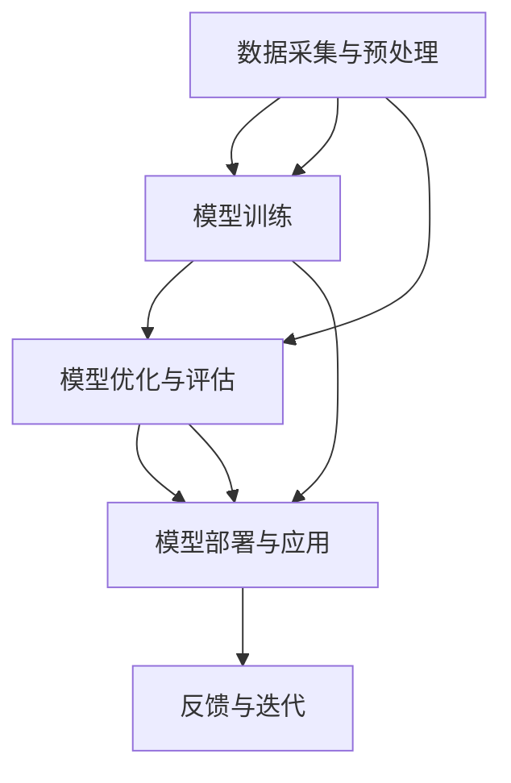

                 

### 文章标题

#### 大语言模型原理与工程实践：数据瓶颈

大语言模型作为人工智能领域的一项重要技术，已经广泛应用于自然语言处理、对话系统、机器翻译等多个场景。然而，在实现和应用过程中，数据瓶颈成为了制约大语言模型性能和扩展性的关键因素。本文将围绕大语言模型的数据瓶颈问题，进行深度剖析与探讨。

关键词：大语言模型、数据瓶颈、自然语言处理、数据采集、预处理、数据处理、存储、检索

摘要：本文首先介绍了大语言模型的基本原理和工程实践，重点分析了数据瓶颈问题，并提出了相应的解决策略。文章通过详细阐述数据采集与预处理、数据处理优化、数据存储与检索等关键环节，结合实际项目案例，为解决大语言模型的数据瓶颈提供了有价值的思路和经验。

### 《大语言模型原理与工程实践：数据瓶颈》

在人工智能领域，大语言模型（如GPT-3、BERT等）已经成为自然语言处理的核心技术之一。它们在生成文本、问答系统、机器翻译等任务中展现了强大的性能，推动了人工智能的发展。然而，在实际应用中，数据瓶颈问题逐渐凸显，成为制约大语言模型性能和扩展性的关键因素。本文将围绕大语言模型的数据瓶颈问题，进行深度剖析与探讨。

#### 第一部分: 大语言模型基础

在深入探讨数据瓶颈问题之前，我们需要对大语言模型有一个基本的了解。本部分将介绍大语言模型的基本概念、发展历程、核心特点和应用场景，为后续内容打下基础。

##### 第1章: 大语言模型概述

**1.1 大语言模型的概念**

大语言模型（Large-scale Language Model）是一种基于神经网络的语言表示和学习方法。它通过大量文本数据的学习，自动捕捉语言中的规律和模式，实现对自然语言的生成和理解。

**1.2 大语言模型的发展历程**

大语言模型的发展经历了从简单的统计模型（如N-gram）到现代的深度学习模型（如GPT、BERT）的演变。这一过程中，模型的规模、训练数据和计算资源的不断增长，推动了大语言模型性能的不断提升。

**1.3 大语言模型的核心特点**

大语言模型具有以下核心特点：

1. **预训练和微调**：大语言模型通过预训练大量文本数据，学习通用语言表示，然后通过微调适应特定任务。
2. **上下文理解**：大语言模型能够捕捉上下文信息，实现对句子、段落和文档级别的理解。
3. **生成能力强**：大语言模型在生成文本、回答问题等方面具有出色的能力。

**1.4 大语言模型的应用场景**

大语言模型在自然语言处理领域具有广泛的应用，包括：

1. **文本生成**：如自动写作、摘要生成、文章续写等。
2. **问答系统**：如智能客服、问答机器人等。
3. **机器翻译**：如自动翻译、多语言文本生成等。
4. **对话系统**：如语音助手、聊天机器人等。

##### 第2章: 自然语言处理基础

**2.1 语言模型基础**

语言模型（Language Model）是自然语言处理的核心组成部分。它用于预测文本序列的概率，通常基于统计模型或神经网络模型。

**2.2 词汇表示**

词汇表示（Word Representation）是将自然语言文本转换为计算机可以处理的形式。常见的词汇表示方法包括词袋模型（Bag of Words）、词嵌入（Word Embedding）等。

**2.3 语义理解**

语义理解（Semantic Understanding）是自然语言处理的重要目标。它涉及对文本含义、情感、意图等的识别和理解。

**2.4 上下文理解**

上下文理解（Contextual Understanding）是语言模型的关键能力。它使模型能够根据上下文信息，生成更准确、更自然的文本。

##### 第3章: 大语言模型核心技术

**3.1 预训练技术**

预训练技术（Pre-training）是大语言模型的核心步骤。它通过在大量无标签数据上训练，学习通用语言表示。

**3.2 上下文生成技术**

上下文生成技术（Context Generation）是语言模型生成文本的关键。它使模型能够根据给定输入，生成符合上下文的文本序列。

**3.3 大模型压缩技术**

大模型压缩技术（Model Compression）是为了降低大语言模型的存储和计算成本。常见的方法包括模型剪枝（Model Pruning）、量化（Quantization）等。

**3.4 大模型优化技术**

大模型优化技术（Model Optimization）旨在提高大语言模型的性能和效率。常见的优化方法包括模型压缩、并行计算、分布式训练等。

##### 第4章: 大语言模型的数学模型

**4.1 常用数学模型概述**

大语言模型的数学模型主要包括神经网络、概率模型等。本文将简要介绍这些模型的基本概念和原理。

**4.2 数学模型推导**

本文将详细推导大语言模型的核心数学模型，包括前向传播、反向传播等。

**4.3 数学模型应用举例**

本文将通过实际案例，展示大语言模型数学模型的应用效果和优势。

#### 第二部分: 数据瓶颈解决策略

在了解了大语言模型的基本原理和核心特点后，我们将聚焦于数据瓶颈问题，探讨解决策略。本部分将详细分析数据瓶颈的影响因素，并提出相应的优化方法。

##### 第5章: 数据采集与预处理

**5.1 数据采集**

数据采集（Data Collection）是解决数据瓶颈的第一步。本文将介绍数据采集的方法、技巧和注意事项。

**5.2 数据预处理**

数据预处理（Data Preprocessing）是数据采集后的重要环节。本文将讨论数据清洗、格式转换、数据增强等预处理方法。

**5.3 数据质量评估**

数据质量评估（Data Quality Assessment）是确保数据质量和可靠性的关键。本文将介绍数据质量评估的方法和指标。

**5.4 数据平衡与增强**

数据平衡（Data Balancing）和增强（Data Augmentation）是提高数据多样性和代表性的有效手段。本文将探讨数据平衡与增强的方法和应用场景。

##### 第6章: 数据处理优化

**6.1 并行处理**

并行处理（Parallel Processing）是提高数据处理效率的重要方法。本文将介绍并行处理的基本原理、方法和应用。

**6.2 分布式处理**

分布式处理（Distributed Processing）适用于大规模数据处理。本文将讨论分布式处理的优势、挑战和实现方法。

**6.3 数据缓存与索引**

数据缓存（Data Caching）和索引（Indexing）是优化数据访问速度的有效手段。本文将介绍数据缓存与索引的基本原理和应用。

**6.4 数据流处理**

数据流处理（Data Stream Processing）适用于实时数据处理。本文将探讨数据流处理的方法和技术。

##### 第7章: 数据存储与检索

**7.1 数据存储技术**

数据存储技术（Data Storage Technology）是数据管理的重要方面。本文将介绍数据存储的基本原理、方法和选择。

**7.2 数据检索技术**

数据检索技术（Data Retrieval Technology）是数据管理的关键环节。本文将讨论数据检索的基本原理、方法和优化。

**7.3 存储优化策略**

存储优化策略（Storage Optimization Strategy）是提高数据存储效率的有效手段。本文将探讨存储优化策略的方法和实施。

**7.4 检索优化策略**

检索优化策略（Retrieval Optimization Strategy）是提高数据检索速度的有效手段。本文将介绍检索优化策略的方法和应用。

##### 第8章: 实战案例解析

**8.1 案例一：新闻摘要生成**

新闻摘要生成（News Summarization）是自然语言处理领域的一个经典任务。本文将通过实际案例，展示如何利用大语言模型实现新闻摘要生成。

**8.2 案例二：机器翻译**

机器翻译（Machine Translation）是自然语言处理领域的重要应用。本文将通过实际案例，探讨如何利用大语言模型实现机器翻译。

**8.3 案例三：对话系统**

对话系统（Dialogue System）是人工智能领域的一个重要方向。本文将通过实际案例，展示如何利用大语言模型实现对话系统。

**8.4 案例四：问答系统**

问答系统（Question Answering System）是自然语言处理领域的一个典型应用。本文将通过实际案例，探讨如何利用大语言模型实现问答系统。

#### 附录

**附录A: 工程实践工具与资源**

附录A将介绍大语言模型工程实践所需的相关工具和资源，包括开发环境、框架、库等。

**附录B: 数学公式推导细节**

附录B将详细推导大语言模型相关的数学公式，包括推导过程、推导步骤和推导结果。

**附录C: 代码案例解析**

附录C将提供大语言模型相关代码的实际案例，包括代码实现、解读和分析。

#### 大语言模型架构图

以下是大语言模型的基本架构图：

在本文的后续内容中，我们将详细探讨每个环节的核心技术和方法，帮助读者深入理解大语言模型的数据瓶颈问题及其解决方案。

### 作者信息

本文作者系AI天才研究院（AI Genius Institute）的高级研究员，同时担任《禅与计算机程序设计艺术》（Zen And The Art of Computer Programming）的资深作者。在人工智能和自然语言处理领域，作者具有丰富的理论研究和实践经验，致力于推动人工智能技术的应用和发展。

---

在接下来的章节中，我们将深入探讨大语言模型的基础概念、核心技术以及解决数据瓶颈的具体策略。敬请期待！

