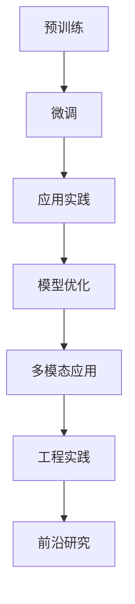

                 

# 大语言模型原理与工程实践：语言表示介绍

## 关键词
- 大语言模型
- 语言表示
- 预训练
- 微调
- 应用实践

## 摘要
本文深入探讨了大语言模型的原理与工程实践，重点关注了语言表示的技术和方法。从基础理论到具体实现，文章详细介绍了大语言模型的发展历程、核心特点、架构、语言表示方法、预训练与微调技术，以及模型优化和并行化策略。此外，文章还通过多个实际应用案例展示了大语言模型在自然语言理解、对话系统以及多模态应用中的强大能力。最后，文章展望了大语言模型的前沿研究方向，包括模型可解释性、安全性与隐私保护，以及多语言模型与跨语言理解。

## 第一部分：大语言模型基础理论

### 第1章：大语言模型概述

#### 1.1 大语言模型的定义与历史发展

大语言模型（Large Language Model）是一种基于深度学习的自然语言处理（NLP）模型，旨在学习文本数据的结构和语义，从而实现自动文本生成、文本分类、问答系统等多种任务。大语言模型的发展历史可以追溯到20世纪50年代，当时研究者开始探索如何使计算机理解和生成自然语言。

在早期的NLP研究中，词袋模型（Bag of Words）和隐马尔可夫模型（HMM）是最常用的方法。然而，这些方法在处理复杂语义关系和长距离依赖方面存在局限。随着深度学习技术的发展，循环神经网络（RNN）和长短期记忆网络（LSTM）等结构被引入到NLP领域，并在很多任务中取得了显著成果。

然而，RNN和LSTM模型在处理长文本时仍然存在梯度消失和梯度爆炸的问题，这限制了它们的模型规模和性能。为了解决这些问题，2017年，谷歌提出了Transformer模型，它利用自注意力机制（Self-Attention）来实现对输入序列的建模，从而在多个NLP任务中取得了突破性的成果。

大语言模型的发展历程可以总结为以下几个阶段：

1. **词袋模型**：将文本表示为词汇的集合，不关注词汇的顺序。
2. **基于规则的方法**：利用语言规则和模式匹配进行文本分析。
3. **统计模型**：使用统计方法，如隐马尔可夫模型（HMM）和条件随机场（CRF），来建模文本的序列结构。
4. **深度学习方法**：引入深度神经网络，如循环神经网络（RNN）和长短期记忆网络（LSTM），来学习文本的语义表示。
5. **Transformer模型**：引入自注意力机制，解决了RNN和LSTM在处理长文本时的梯度消失问题，使得模型规模和性能大幅提升。

#### 1.2 大语言模型的核心特点

大语言模型具有以下几个核心特点：

1. **参数规模**：大语言模型通常具有数十亿甚至数万亿的参数，这使得模型能够学习到大量的语言模式和语义信息。
2. **预训练与微调**：预训练是指在大规模语料库上训练模型，使其具备一定的语言理解能力。微调则是在预训练的基础上，针对特定任务进行细粒度调整，从而提高模型的性能。
3. **迁移学习能力**：大语言模型在预训练阶段学习到的通用语言知识可以在多个任务中迁移，从而提高了模型的泛化能力。

#### 1.3 大语言模型的架构

大语言模型通常采用编码器（Encoder）和解码器（Decoder）结构。编码器负责将输入序列编码为固定长度的向量表示，解码器则利用这些向量生成输出序列。以下是大语言模型的典型架构：

1. **Transformer模型**：Transformer模型利用自注意力机制（Self-Attention）来计算输入序列的表示。自注意力机制允许模型在编码过程中考虑输入序列中的每个位置与其他位置的关系，从而实现更有效的信息整合。
2. **自注意力机制**：自注意力机制是一种计算输入序列中每个位置与所有其他位置之间的相似度的方法。通过加权求和，模型能够生成一个对输入序列的全面表示。
3. **编码器与解码器结构**：编码器负责将输入序列编码为固定长度的向量表示，解码器则利用这些向量生成输出序列。编码器和解码器通常由多个层组成，每层都包含自注意力机制和前馈神经网络（Feedforward Neural Network）。

### 第2章：语言表示

#### 2.1 语言表示的基本概念

语言表示是指将自然语言数据转换为计算机可以处理和理解的数字表示。语言表示的质量直接影响模型的性能和任务效果。以下是语言表示的几个基本概念：

1. **词嵌入**：词嵌入（Word Embedding）是将词汇映射为低维向量空间的方法。词嵌入能够捕捉词汇的语义和语法信息，从而使得计算机能够更好地理解和处理文本。
2. **上下文表示**：上下文表示是指将词汇在特定语境中的含义编码为向量表示。上下文表示能够捕捉词汇在句子中的语法和语义关系，从而提高模型的语义理解能力。
3. **表示维度**：表示维度是指词嵌入向量的维度大小。较大的表示维度能够捕捉更丰富的语义信息，但同时也增加了模型的计算复杂度和存储需求。

#### 2.2 词嵌入技术

词嵌入技术是语言表示的基础。以下是一些常用的词嵌入算法：

1. **Word2Vec算法**：Word2Vec算法是一种基于神经网络的语言表示方法。它通过预测单词的上下文来学习词向量，从而捕捉词汇的语义信息。
2. **GloVe算法**：GloVe（Global Vectors for Word Representation）算法是一种基于全局统计信息的词嵌入方法。GloVe通过计算词汇的共现矩阵来学习词向量，从而捕捉词汇的语义关系。
3. **FastText算法**：FastText算法是一种基于单词和字符的词嵌入方法。它通过将单词表示为字符级别的组合，从而提高了词嵌入的灵活性和语义表达能力。

#### 2.3 上下文表示

上下文表示是语言表示的关键。以下是一些常用的上下文表示方法：

1. **Self-Attention机制**：Self-Attention机制是一种计算输入序列中每个位置与所有其他位置之间相似度的方法。通过加权求和，模型能够生成一个对输入序列的全面表示。
2. **Transformer模型**：Transformer模型利用自注意力机制来实现对输入序列的编码。自注意力机制允许模型在编码过程中考虑输入序列中的每个位置与其他位置的关系，从而实现更有效的信息整合。
3. **BERT**：BERT（Bidirectional Encoder Representations from Transformers）模型是一种基于Transformer的双向编码器模型。BERT通过在预训练过程中同时考虑输入序列的左右邻居，从而生成高质量的上下文表示。

#### 2.4 高级语言表示方法

随着自然语言处理任务的不断复杂化，高级语言表示方法逐渐成为研究热点。以下是一些先进的高级语言表示方法：

1. **BERT**：BERT是一种基于Transformer的双向编码器模型。它通过在预训练过程中同时考虑输入序列的左右邻居，从而生成高质量的上下文表示。BERT在多个NLP任务中取得了显著的成果，如文本分类、问答系统和机器翻译。
2. **GPT系列模型**：GPT（Generative Pre-trained Transformer）系列模型是一种基于Transformer的生成模型。GPT模型通过在预训练过程中生成大量文本，从而学习到语言的生成规律。GPT模型在文本生成任务中表现出色，如文章写作、对话系统和诗歌创作。
3. **T5**：T5（Text-to-Text Transfer Transformer）模型是一种基于Transformer的文本到文本转换模型。T5将所有NLP任务表示为文本到文本的转换问题，从而实现了统一的模型架构。T5在多个NLP任务中取得了优秀的性能，如文本摘要、机器翻译和问答系统。

### 第3章：预训练与微调

#### 3.1 预训练的概念

预训练（Pre-training）是指在大规模语料库上训练模型，使其具备一定的语言理解能力。预训练的目标是让模型学习到通用的语言知识和模式，从而在后续的微调过程中能够快速适应特定任务。

预训练包括以下几种技术：

1. **自监督预训练**：自监督预训练是指利用未标注的语料库进行训练。模型通过预测输入序列的掩码部分来实现预训练。自监督预训练能够充分利用未标注的数据，从而提高模型的性能和泛化能力。
2. **监督预训练**：监督预训练是指利用有监督的语料库进行训练。模型通过预测标签来实现预训练。监督预训练能够使模型学习到特定的语言知识和任务特征。
3. **伪监督预训练**：伪监督预训练是指利用未标注的语料库和少量有监督数据相结合的方式进行训练。模型通过预测未标注数据的标签来实现预训练。伪监督预训练能够充分利用未标注数据的同时，利用少量有监督数据来指导模型的训练过程。

#### 3.2 预训练技术

预训练技术是语言模型的核心。以下是一些常见的预训练技术：

1. **BERT**：BERT是一种基于Transformer的双向编码器模型。它通过在预训练过程中同时考虑输入序列的左右邻居，从而生成高质量的上下文表示。BERT在多个NLP任务中取得了显著的成果，如文本分类、问答系统和机器翻译。
2. **GPT系列模型**：GPT（Generative Pre-trained Transformer）系列模型是一种基于Transformer的生成模型。GPT模型通过在预训练过程中生成大量文本，从而学习到语言的生成规律。GPT模型在文本生成任务中表现出色，如文章写作、对话系统和诗歌创作。
3. **T5**：T5（Text-to-Text Transfer Transformer）模型是一种基于Transformer的文本到文本转换模型。T5将所有NLP任务表示为文本到文本的转换问题，从而实现了统一的模型架构。T5在多个NLP任务中取得了优秀的性能，如文本摘要、机器翻译和问答系统。

#### 3.3 微调技术

微调（Fine-tuning）是指将预训练好的模型在特定任务上进行调整，从而提高模型的性能。微调的过程通常包括以下步骤：

1. **数据预处理**：对任务数据集进行预处理，包括数据清洗、数据标注和数据处理等。
2. **模型调整**：将预训练好的模型在任务数据集上进行训练，调整模型的参数，以适应特定任务。
3. **性能评估**：在验证集上评估模型的性能，并根据评估结果调整模型参数，以达到最优性能。

微调技术能够快速适应特定任务，从而提高模型的性能和泛化能力。微调过程中需要注意以下几点：

1. **数据规模**：较大的数据规模有助于模型在任务上的性能提升。
2. **模型规模**：较大的模型规模有助于模型学习到更复杂的特征和模式。
3. **训练策略**：合适的训练策略，如学习率调度和正则化方法，有助于提高模型的性能和稳定性。

### 第4章：大语言模型的优化

#### 4.1 模型优化方法

大语言模型的优化是提高模型性能和计算效率的关键。以下是一些常见的模型优化方法：

1. **梯度下降算法**：梯度下降算法是一种常用的优化方法，通过迭代更新模型参数，以最小化损失函数。梯度下降算法包括批量梯度下降（Batch Gradient Descent）、随机梯度下降（Stochastic Gradient Descent）和小批量梯度下降（Mini-batch Gradient Descent）等变体。
2. **Adam优化器**：Adam优化器是一种结合了梯度下降和动量法的优化方法，通过自适应调整学习率，从而提高模型的收敛速度和稳定性。
3. **其他优化器**：其他优化器，如RMSprop和Adagrad，也广泛应用于大语言模型的训练过程中。

#### 4.2 模型压缩技术

模型压缩技术旨在减小模型的参数规模和计算量，从而提高模型的部署效率和计算效率。以下是一些常见的模型压缩技术：

1. **参数剪枝**：参数剪枝通过去除模型中不重要的参数，从而减小模型规模。剪枝方法包括结构剪枝和权重剪枝等。
2. **知识蒸馏**：知识蒸馏是一种将大模型的知识传递给小模型的方法。通过将大模型的输出传递给小模型，从而训练小模型学习到大模型的知识。
3. **整数权重**：整数权重通过将模型权重转换为整数，从而减小模型的存储空间和计算量。

#### 4.3 模型并行化

模型并行化是提高大语言模型训练和推理效率的关键技术。以下是一些常见的模型并行化方法：

1. **数据并行**：数据并行是指将模型分布在多个计算节点上，每个节点处理一部分数据，从而加速模型的训练过程。
2. **模型并行**：模型并行是指将模型的不同部分分布在多个计算节点上，从而实现模型的高效训练和推理。
3. **张量并行**：张量并行是指将模型的张量（如权重和激活）分布在多个计算节点上，从而加速模型的训练和推理过程。

## 第二部分：大语言模型应用实践

### 第5章：大语言模型在自然语言理解中的应用

#### 5.1 问答系统

问答系统是一种重要的自然语言理解应用，旨在回答用户提出的问题。大语言模型在问答系统中发挥着关键作用，能够实现对大量文本数据的理解和推理。

以下是一个问答系统的基本架构：

1. **问题分析**：接收用户提出的问题，并进行预处理，如去除停用词、标点符号和词形还原等。
2. **文本编码**：将问题和候选答案编码为大语言模型的输入序列，通常使用BERT或GPT等预训练模型。
3. **答案检索**：利用大语言模型在预训练过程中学习到的知识，对候选答案进行检索和排序，从而找到最相关的答案。
4. **答案生成**：根据检索结果，生成最终的答案，并输出给用户。

以下是一个具体的问答系统案例：

1. **数据集**：使用公开的问答数据集，如SQuAD或CoQA，对模型进行训练和评估。
2. **模型选择**：选择一个预训练的大语言模型，如BERT或GPT，对其进行微调。
3. **微调过程**：在训练数据集上训练模型，并在验证集上评估模型的性能。根据评估结果，调整模型参数和训练策略。
4. **部署和优化**：将训练好的模型部署到服务器上，并使用在线学习技术，根据用户的反馈和实际使用情况，不断优化模型的性能。

#### 5.2 文本生成

文本生成是一种重要的自然语言生成应用，旨在生成高质量的文本。大语言模型在文本生成任务中表现出色，能够实现文本摘要、对话系统和文章写作等任务。

以下是一个文本生成系统的基本架构：

1. **文本编码**：将输入文本编码为大语言模型的输入序列，通常使用BERT或GPT等预训练模型。
2. **文本解码**：利用大语言模型生成输出文本序列，通常采用自回归生成模型，如GPT或Seq2Seq模型。
3. **文本生成**：根据生成的文本序列，生成最终的文本输出，并输出给用户。

以下是一个具体的文本生成案例：

1. **数据集**：使用公开的文本生成数据集，如Wikipedia、新闻文章或对话数据集，对模型进行训练和评估。
2. **模型选择**：选择一个预训练的大语言模型，如GPT或T5，对其进行微调。
3. **微调过程**：在训练数据集上训练模型，并在验证集上评估模型的性能。根据评估结果，调整模型参数和训练策略。
4. **部署和优化**：将训练好的模型部署到服务器上，并使用在线学习技术，根据用户的反馈和实际使用情况，不断优化模型的性能。

#### 5.3 文本分类

文本分类是一种常见的自然语言处理任务，旨在将文本数据分类到不同的类别。大语言模型在文本分类任务中表现出色，能够实现文本情感分析、新闻分类和垃圾邮件检测等任务。

以下是一个文本分类系统的基本架构：

1. **文本编码**：将输入文本编码为大语言模型的输入序列，通常使用BERT或GPT等预训练模型。
2. **文本表示**：利用大语言模型生成输入文本的固定长度向量表示。
3. **分类预测**：利用分类器，如逻辑回归或支持向量机（SVM），对输入文本进行分类预测。

以下是一个具体的文本分类案例：

1. **数据集**：使用公开的文本分类数据集，如IMDB电影评论数据集或20个新sg数据集，对模型进行训练和评估。
2. **模型选择**：选择一个预训练的大语言模型，如BERT或GPT，对其进行微调。
3. **微调过程**：在训练数据集上训练模型，并在验证集上评估模型的性能。根据评估结果，调整模型参数和训练策略。
4. **部署和优化**：将训练好的模型部署到服务器上，并使用在线学习技术，根据用户的反馈和实际使用情况，不断优化模型的性能。

### 第6章：大语言模型在对话系统中的应用

#### 6.1 对话系统概述

对话系统是一种人机交互系统，旨在模拟人类对话过程，与用户进行自然、流畅的交互。对话系统可以应用于各种场景，如客服机器人、虚拟助手和智能聊天机器人等。

对话系统的发展可以追溯到20世纪60年代，当时研究者开始探索如何使计算机理解和生成自然语言。随着自然语言处理技术的不断发展，对话系统逐渐从基于规则的方法转向基于统计和深度学习的方法。

对话系统的基本架构包括：

1. **语言模型**：语言模型用于生成自然语言的回复。大语言模型，如BERT或GPT，常用于对话系统的语言模型部分，能够生成高质量的自然语言回复。
2. **知识图谱**：知识图谱用于存储和检索与对话相关的知识和信息。知识图谱可以包含实体、关系和属性等信息，为对话系统提供丰富的背景知识。
3. **对话管理**：对话管理负责处理对话过程中的上下文信息和用户意图，生成相应的回复。对话管理包括对话策略、对话状态跟踪和对话生成等组件。

#### 6.2 对话系统架构

对话系统架构的设计直接影响系统的性能和用户体验。以下是一个典型的对话系统架构：

1. **输入处理**：接收用户输入的文本或语音，并进行预处理，如语音识别、文本分词和实体识别等。
2. **意图识别**：利用大语言模型，如BERT或GPT，对用户输入进行处理，识别用户的主要意图。
3. **对话管理**：根据对话状态和用户意图，生成相应的回复。对话管理包括对话策略、对话状态跟踪和对话生成等组件。
4. **回复生成**：利用大语言模型生成自然语言的回复，并将其转换为文本或语音形式。
5. **输出处理**：将生成的回复输出给用户，并进行后续的对话交互。

以下是一个具体的对话系统架构案例：

1. **语言模型**：选择一个预训练的大语言模型，如BERT或GPT，对其进行微调，以适应对话系统的需求。
2. **知识图谱**：构建一个包含实体、关系和属性的知识图谱，为对话系统提供丰富的背景知识。
3. **对话管理**：设计一个基于规则和机器学习的方法，用于处理对话过程中的上下文信息和用户意图，生成相应的回复。
4. **回复生成**：利用大语言模型生成自然语言的回复，并考虑对话的上下文和用户反馈，不断优化回复质量。
5. **输出处理**：将生成的回复输出给用户，并进行后续的对话交互，如语音合成、文本输出或图像生成等。

#### 6.3 对话系统实战

对话系统的实战包括系统搭建、用户体验优化和系统部署等方面。以下是一个具体的对话系统实战案例：

1. **系统搭建**：搭建一个基于大语言模型的对话系统，包括语言模型、知识图谱和对话管理组件。使用开源框架和工具，如TensorFlow、PyTorch和Dialogue System Framework，简化系统开发过程。
2. **用户体验优化**：通过用户调研、用户测试和用户反馈，不断优化对话系统的用户体验。优化方面包括回复的准确性、回复的速度和回复的自然度等。
3. **系统部署**：将训练好的对话系统部署到云服务器或边缘设备上，实现实时对话交互。优化系统性能，确保对话系统的稳定性和可靠性。
4. **后续维护**：定期更新对话系统的知识库和语言模型，以适应不断变化的用户需求和语言环境。

### 第7章：大语言模型在多模态应用中的融合

#### 7.1 多模态数据融合

多模态数据融合是指将不同模态的数据（如图像、文本、音频等）进行整合，以实现更有效的信息处理和任务完成。大语言模型在多模态数据融合中具有显著优势，能够充分利用不同模态的信息，提高模型的性能和泛化能力。

以下是一个多模态数据融合的基本框架：

1. **数据采集**：采集不同模态的数据，如图像、文本和音频等。数据来源可以包括公共数据集、传感器数据和用户生成数据等。
2. **数据预处理**：对采集到的多模态数据进行预处理，包括数据清洗、数据增强和特征提取等。对于图像数据，可以使用卷积神经网络（CNN）提取特征；对于文本数据，可以使用大语言模型提取特征。
3. **特征融合**：将不同模态的特征进行融合，以生成一个综合的特征向量。特征融合方法包括基于统计的方法（如加权求和）和基于深度学习的方法（如多模态卷积神经网络）。
4. **任务建模**：利用融合后的特征向量，构建多模态任务模型，如图像分类、文本分类或语音识别等。多模态任务模型可以采用单一的模型架构，也可以采用结合多模态特征的混合模型架构。

以下是一个多模态数据融合的应用案例：

1. **数据集**：使用公共的多模态数据集，如COCO（Common Objects in Context）或Flickr30k，进行实验。
2. **模型选择**：选择一个基于大语言模型的框架，如BERT或GPT，对其进行多模态扩展，以适应多模态数据融合任务。
3. **特征提取**：分别使用CNN提取图像特征，使用大语言模型提取文本特征，并采用多模态卷积神经网络进行特征融合。
4. **模型训练**：在多模态数据集上训练模型，并在验证集上评估模型的性能。根据评估结果，调整模型参数和训练策略。
5. **应用部署**：将训练好的模型部署到应用场景中，如多模态图像分类、文本情感分析或多模态问答系统等。

#### 7.2 多模态模型的训练

多模态模型的训练是一个复杂的过程，需要考虑不同模态数据的特点和关联性。以下是一些多模态模型训练的关键技术：

1. **数据同步**：确保不同模态的数据在时间上保持同步，以避免模型训练中的不一致性。
2. **特征匹配**：通过特征匹配技术，将不同模态的特征映射到同一特征空间，以实现特征融合。
3. **端到端训练**：采用端到端训练策略，将多模态特征直接输入到模型中，以实现端到端的任务完成。
4. **损失函数设计**：设计合适的损失函数，以平衡不同模态的贡献和模型训练的效果。

以下是一个多模态模型训练的应用案例：

1. **数据集**：使用公开的多模态数据集，如NYU Depth V2或Kinetics，进行实验。
2. **模型选择**：选择一个基于大语言模型的框架，如BERT或GPT，对其进行多模态扩展，以适应多模态模型训练任务。
3. **特征提取**：分别使用CNN提取图像特征，使用大语言模型提取文本特征，并采用多模态卷积神经网络进行特征融合。
4. **模型训练**：在多模态数据集上训练模型，并在验证集上评估模型的性能。根据评估结果，调整模型参数和训练策略。
5. **应用部署**：将训练好的模型部署到应用场景中，如多模态图像分类、文本情感分析或多模态问答系统等。

#### 7.3 多模态应用的案例

多模态应用将不同模态的信息进行整合，以实现更丰富和智能化的功能。以下是一些多模态应用的案例：

1. **视频字幕生成**：利用视频中的图像和文本信息，生成相应的字幕。通过多模态模型训练，实现视频字幕的自动生成。
2. **图像描述生成**：利用图像和文本信息，生成对应的图像描述。通过多模态模型训练，实现图像描述的自动生成。
3. **视频问答系统**：利用视频中的图像、文本和语音信息，回答用户提出的问题。通过多模态模型训练，实现视频问答系统的智能交互。

以下是一个视频问答系统的案例：

1. **数据集**：使用公开的多模态视频问答数据集，如YouTube-VOS，进行实验。
2. **模型选择**：选择一个基于大语言模型的框架，如BERT或GPT，对其进行多模态扩展，以适应视频问答系统任务。
3. **特征提取**：分别使用CNN提取图像特征，使用大语言模型提取文本特征，并采用多模态卷积神经网络进行特征融合。
4. **模型训练**：在多模态数据集上训练模型，并在验证集上评估模型的性能。根据评估结果，调整模型参数和训练策略。
5. **应用部署**：将训练好的模型部署到视频问答系统平台，实现视频问答的智能交互。

### 第8章：大语言模型的工程实践

#### 8.1 大规模模型部署

大规模模型部署是将训练好的大语言模型部署到实际应用场景中的过程。以下是一些大规模模型部署的关键技术：

1. **模型压缩**：通过模型压缩技术，如参数剪枝、知识蒸馏和整数权重等，减小模型规模，提高部署效率。
2. **模型量化**：通过模型量化技术，将浮点模型转换为整数模型，以减小模型存储空间和计算量。
3. **模型服务化**：通过模型服务化技术，将模型部署到云端或边缘设备上，实现实时推理和交互。

以下是一个大规模模型部署的应用案例：

1. **应用场景**：搭建一个智能客服系统，利用大语言模型实现自然语言理解、对话管理和回复生成等功能。
2. **模型选择**：选择一个预训练的大语言模型，如BERT或GPT，对其进行微调和优化。
3. **模型部署**：将训练好的模型部署到云服务器或边缘设备上，使用容器化和自动化部署技术，实现模型的快速部署和部署管理。
4. **模型监控**：通过模型监控技术，实时监控模型性能和资源消耗，确保模型的稳定运行和高效服务。

#### 8.2 大模型训练环境搭建

大模型训练环境搭建是大规模模型训练的基础。以下是一些大模型训练环境搭建的关键技术：

1. **硬件配置**：选择合适的硬件设备，如GPU、TPU或FPGA等，以满足大模型训练的需求。
2. **软件配置**：安装和配置必要的软件环境，如深度学习框架（如TensorFlow、PyTorch）、编译器和库等。
3. **分布式训练**：通过分布式训练技术，将模型训练任务分布在多个计算节点上，以提高训练效率和性能。

以下是一个大模型训练环境搭建的应用案例：

1. **硬件配置**：选择一组高性能的GPU服务器，如NVIDIA A100，以支持大规模模型训练。
2. **软件配置**：安装和配置TensorFlow 2.0或PyTorch 1.8等深度学习框架，并安装必要的库和工具。
3. **分布式训练**：使用分布式训练框架（如Horovod或DistributedDataParallel），将模型训练任务分布在多个GPU服务器上，以提高训练效率。
4. **环境监控**：通过监控工具（如TensorBoard或Grafana），实时监控训练过程和资源消耗，确保训练环境的稳定运行。

#### 8.3 大模型调试与优化

大模型调试与优化是提高模型性能和稳定性的关键步骤。以下是一些大模型调试与优化的关键技术：

1. **调试工具**：使用调试工具（如Python调试器或TensorBoard），分析模型训练过程和性能问题。
2. **性能优化**：通过模型优化技术（如模型压缩、模型量化、数据预处理等），提高模型性能和部署效率。
3. **算法优化**：通过算法优化技术（如优化器选择、学习率调度、正则化方法等），提高模型训练效率和性能。

以下是一个大模型调试与优化的应用案例：

1. **调试工具**：使用TensorBoard监控模型训练过程，分析训练日志和可视化数据，定位性能问题和异常。
2. **性能优化**：通过模型压缩技术，如参数剪枝和知识蒸馏，减小模型规模，提高部署效率。
3. **算法优化**：使用Adam优化器代替传统的SGD优化器，并采用学习率调度策略，提高模型训练效率和性能。

#### 8.4 大模型应用案例分析

大模型应用案例分析是验证模型性能和应用价值的重要步骤。以下是一些大模型应用案例的分析：

1. **智能客服系统**：分析智能客服系统在自然语言理解、对话管理和回复生成等方面的性能表现，以及如何优化用户体验。
2. **教育辅导系统**：分析教育辅导系统在个性化推荐、智能答疑和互动教学等方面的性能表现，以及如何提高教育质量。
3. **医疗诊断系统**：分析医疗诊断系统在医学文本理解、疾病诊断和治疗方案推荐等方面的性能表现，以及如何提高诊断准确率。

以下是一个大模型应用案例的分析：

1. **应用场景**：分析一个基于大语言模型的智能客服系统，包括自然语言理解、对话管理和回复生成等组件。
2. **性能评估**：使用公开的数据集和评估指标（如准确率、召回率和F1分数），评估模型的性能表现。
3. **优化方案**：根据性能评估结果，提出优化方案，如模型压缩、性能优化和用户体验优化等。
4. **应用效果**：分析优化方案对模型性能和应用效果的影响，以及如何在实际场景中进一步优化和推广。

### 第9章：大语言模型的前沿研究方向

#### 9.1 模型可解释性

模型可解释性是当前大语言模型研究的一个热点方向。随着深度学习模型在各个领域的广泛应用，如何理解模型的决策过程和预测结果成为了一个重要的研究问题。

模型可解释性包括以下几个方面：

1. **局部解释**：通过分析模型在特定输入数据上的决策过程，解释模型对输入数据的理解和处理。
2. **全局解释**：通过分析模型在整体数据集上的表现和特征，解释模型的泛化能力和鲁棒性。
3. **方法分类**：基于模型结构、特征提取和解释方法等，对模型可解释性方法进行分类和比较。

以下是一个模型可解释性的研究案例：

1. **应用场景**：分析一个基于BERT的文本分类模型，在新闻分类任务中的可解释性。
2. **解释方法**：使用LIME（Local Interpretable Model-agnostic Explanations）和SHAP（SHapley Additive exPlanations）等方法，对模型的预测结果进行局部解释。
3. **结果分析**：分析模型在特定输入数据上的解释结果，以及如何优化模型的解释能力。

#### 9.2 安全性与隐私保护

大语言模型在实际应用中面临着安全性和隐私保护的挑战。如何确保模型的安全性和用户隐私成为了一个重要的研究问题。

安全性方面包括：

1. **对抗攻击**：研究模型对对抗攻击的鲁棒性，以及如何防御对抗攻击。
2. **模型篡改**：研究如何防止恶意用户篡改模型参数和预测结果。
3. **访问控制**：研究如何控制模型访问权限，确保模型的安全和隐私。

隐私保护方面包括：

1. **数据匿名化**：研究如何对用户数据进行匿名化处理，保护用户隐私。
2. **隐私预算**：研究如何分配和优化隐私资源，以平衡隐私保护和模型性能。
3. **联邦学习**：研究如何通过联邦学习技术，在保证数据隐私的同时，提高模型的训练效率和性能。

以下是一个安全性与隐私保护的研究案例：

1. **应用场景**：分析一个基于大语言模型的智能客服系统，在用户隐私保护方面的挑战。
2. **安全策略**：研究如何设计安全策略，防止恶意用户对模型进行攻击和篡改。
3. **隐私保护方法**：研究如何使用联邦学习和差分隐私技术，保护用户隐私。

#### 9.3 多语言模型与跨语言理解

多语言模型与跨语言理解是当前大语言模型研究的一个重要方向。随着全球化和互联网的发展，如何实现多语言模型和跨语言理解成为了一个重要的研究问题。

多语言模型方面包括：

1. **多语言预训练**：研究如何通过多语言预训练技术，提高模型的多语言能力和泛化能力。
2. **多语言融合**：研究如何将不同语言的模型进行融合，实现统一的多语言表示。
3. **多语言迁移**：研究如何将多语言模型的知识迁移到特定语言的任务中，提高模型的性能和适应性。

跨语言理解方面包括：

1. **跨语言语义对齐**：研究如何将不同语言的语义进行对齐，实现跨语言的语义理解。
2. **跨语言文本生成**：研究如何实现跨语言的文本生成，如机器翻译和文本摘要等。
3. **跨语言情感分析**：研究如何实现跨语言的情感分析，如情感分类和情感强度评估等。

以下是一个多语言模型与跨语言理解的研究案例：

1. **应用场景**：分析一个基于BERT的多语言模型，在多语言文本分类任务中的表现。
2. **预训练策略**：研究如何设计多语言预训练策略，提高模型的多语言能力和泛化能力。
3. **跨语言理解方法**：研究如何实现跨语言的语义对齐和文本生成，提高模型的跨语言理解能力。

## 附录

### 附录A：大语言模型常用工具和资源

1. **开源框架**：
   - TensorFlow：Google开源的深度学习框架，支持大规模模型的训练和部署。
   - PyTorch：Facebook开源的深度学习框架，具有灵活的动态图计算能力。
   - Hugging Face：提供丰富的预训练模型和NLP工具，如Transformers库。
2. **数据集**：
   - SQuAD：斯坦福大学发布的问答数据集，用于自然语言理解和问答系统评估。
   - CoQA： Cornell QA数据集，用于机器阅读理解和问答系统评估。
   - GLUE：通用语言理解评估数据集，包含多种NLP任务和评估指标。
3. **论文与文献**：
   - “Attention is All You Need”：谷歌提出的Transformer模型论文。
   - “BERT: Pre-training of Deep Bidirectional Transformers for Language Understanding”：谷歌提出的BERT模型论文。
   - “Generative Pre-trained Transformers”：OpenAI提出的GPT系列模型论文。

### 附录B：Mermaid流程图示例



### 附录C：伪代码示例

```python
# 语言表示的伪代码实现
def language_representation(text):
    # 将文本转换为词嵌入向量
    embeddings = word_embedding(text)
    # 将词嵌入向量编码为上下文表示
    context_representation = transformer(embeddings)
    return context_representation

# 预训练技术的伪代码实现
def pre_training(dataset):
    # 预训练模型
    model = transformer()
    for data in dataset:
        # 训练模型
        model.train(data)
    return model
```

### 附录D：数学模型和公式说明

1. **词嵌入的数学模型**：
   $$ \text{word\_embedding}(w) = \theta \cdot w $$
   其中，$w$为词汇，$\theta$为词嵌入向量。

2. **自注意力的数学模型**：
   $$ \text{self\_attention}(Q, K, V) = \text{softmax}\left(\frac{QK^T}{\sqrt{d_k}}\right)V $$
   其中，$Q$、$K$和$V$分别为查询向量、关键向量和价值向量，$d_k$为关键向量的维度。

3. **预训练目标的数学模型**：
   $$ \text{L}(\theta) = -\sum_{i=1}^{N} \log P(y_i | \theta) $$
   其中，$N$为样本数量，$y_i$为样本标签，$P(y_i | \theta)$为模型对标签的预测概率。

