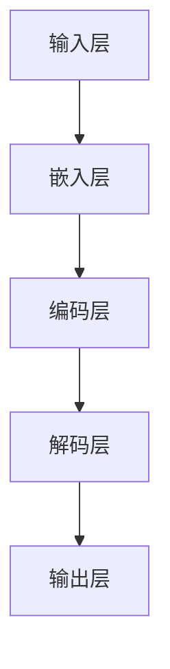

                 

### 《大语言模型原理基础与前沿 通过稀疏MoE扩展视觉语言模型》

### **文章标题**

大语言模型是近年来计算机科学和人工智能领域的重要研究方向。它通过学习和理解大量文本数据，实现了对自然语言的生成、理解和交互。本文将围绕大语言模型的原理基础与前沿研究展开讨论，特别是稀疏MoE（稀疏多扩张）扩展视觉语言模型。

### **关键词**

大语言模型、神经网络、稀疏MoE、视觉语言模型、人工智能。

### **摘要**

本文首先介绍了大语言模型的基本概念、发展历程和核心算法原理。接着，通过Mermaid流程图展示了大语言模型的架构和核心组件。随后，本文深入探讨了大语言模型的数学模型与公式，并通过项目实战展示了其实际应用。最后，本文讨论了稀疏MoE扩展视觉语言模型的基本原理、优势与挑战，以及大语言模型的前沿研究方向。

## **第一部分：大语言模型原理基础**

### **第1章：引言与概述**

大语言模型（Large Language Model）是一种能够理解和生成自然语言的深度学习模型。它基于神经网络架构，通过大规模数据训练，实现了对文本数据的自动理解、生成和交互。自2018年GPT系列模型以来，大语言模型的发展取得了显著突破，为自然语言处理（NLP）领域带来了前所未有的进展。

大语言模型的核心优势在于其强大的语言理解和生成能力，这使得它们在文本生成、机器翻译、问答系统等多个领域具有广泛的应用前景。然而，随着模型的规模不断扩大，其训练和推理的复杂度也显著增加，对计算资源和算法优化提出了更高的要求。

本文将首先介绍大语言模型的发展历程，接着阐述其基本概念和核心算法原理。随后，通过Mermaid流程图展示大语言模型的架构，并深入分析其核心组件和联系。通过这一部分的介绍，读者将全面了解大语言模型的基础知识和原理。

### **第2章：核心概念与联系**

#### **2.1 大语言模型的基本概念**

大语言模型是一种基于深度学习技术的自然语言处理模型，它通过学习大量文本数据，掌握了语言的内在规律和表达方式。大语言模型的基本概念包括：

- **语言模型**：用于预测下一个词或字符的概率分布。
- **深度学习**：通过多层神经网络学习数据特征和规律。
- **神经网络**：由大量神经元组成的计算模型，用于模拟人脑的决策过程。

#### **2.2 Mermaid流程图：大语言模型的架构**

为了更好地理解大语言模型的架构，我们可以通过Mermaid流程图来展示其核心组件和连接关系。以下是Mermaid流程图示例：



- **输入层**：接收自然语言文本输入。
- **嵌入层**：将输入文本转化为向量表示。
- **编码层**：通过多层神经网络对输入向量进行编码。
- **解码层**：解码编码后的向量，生成预测的输出文本。
- **输出层**：输出预测的下一个词或字符。

#### **2.3 大语言模型的核心组件与联系**

大语言模型的核心组件包括输入层、嵌入层、编码层、解码层和输出层。它们之间的联系如下：

- **输入层与嵌入层**：输入层接收自然语言文本，通过嵌入层将其转换为向量表示。
- **嵌入层与编码层**：嵌入层生成的向量作为编码层的输入，通过编码层的多层神经网络进行编码。
- **编码层与解码层**：编码层输出的编码信息作为解码层的输入，通过解码层生成预测的输出文本。
- **解码层与输出层**：解码层生成的输出文本通过输出层进行输出，形成最终的预测结果。

通过以上对大语言模型核心概念与联系的介绍，读者可以更全面地理解大语言模型的工作原理和架构。

### **第3章：核心算法原理讲解**

#### **3.1 神经网络基础算法**

神经网络（Neural Networks）是深度学习的基础，它通过模拟人脑神经元之间的连接和交互来实现对数据的处理和分类。神经网络的核心算法包括：

- **前向传播（Forward Propagation）**：将输入数据通过网络的各个层进行传递，最终得到输出结果。
- **反向传播（Back Propagation）**：通过计算输出结果的误差，反向传播误差并更新网络参数。

以下是神经网络的基础算法伪代码：

```python
def forward_propagation(x):
    # 将输入数据通过网络的各个层进行传递
    for layer in layers:
        x = layer.forward(x)
    return x

def backward_propagation(x, y):
    # 计算输出结果的误差
    error = y - forward_propagation(x)
    # 反向传播误差并更新网络参数
    for layer in reversed(layers):
        layer.backward(error)
```

#### **3.2 伪代码：大语言模型的主要算法**

大语言模型的主要算法基于神经网络，包括嵌入层、编码层、解码层和输出层的算法。以下是伪代码示例：

```python
def large_language_model(x):
    # 嵌入层算法
    embedded = embedding_layer(x)
    
    # 编码层算法
    encoded = encoding_layer(embedded)
    
    # 解码层算法
    decoded = decoding_layer(encoded)
    
    # 输出层算法
    output = output_layer(decoded)
    
    return output
```

- **嵌入层算法**：将输入文本转化为向量表示。
- **编码层算法**：对输入向量进行编码。
- **解码层算法**：解码编码后的向量，生成预测的输出文本。
- **输出层算法**：输出预测的下一个词或字符。

#### **3.3 大语言模型的优化算法**

大语言模型的优化算法主要通过反向传播算法更新网络参数，以提高模型的预测准确性。常见的优化算法包括：

- **梯度下降（Gradient Descent）**：通过计算损失函数的梯度，逐步减小网络参数。
- **随机梯度下降（Stochastic Gradient Descent, SGD）**：对每个样本单独计算梯度，更新网络参数。
- **批量梯度下降（Batch Gradient Descent）**：对整个训练集计算梯度，更新网络参数。

以下是梯度下降优化算法的伪代码：

```python
def gradient_descent(network, x, y):
    # 计算损失函数的梯度
    gradient = compute_gradient(network, x, y)
    # 更新网络参数
    for layer in network.layers:
        layer.update_params(gradient)
```

通过以上对大语言模型核心算法原理的讲解，读者可以深入了解大语言模型的工作原理和实现方法。

### **第4章：数学模型与公式**

#### **4.1 大语言模型中的数学公式**

大语言模型的数学公式是理解其工作原理的关键。以下是大语言模型中的几个关键数学公式：

- **嵌入层公式**：将输入文本转化为向量表示。

  $$ \text{embedded} = \text{embedding\_layer}(\text{x}) $$

- **编码层公式**：对输入向量进行编码。

  $$ \text{encoded} = \text{encoding\_layer}(\text{embedded}) $$

- **解码层公式**：解码编码后的向量，生成预测的输出文本。

  $$ \text{decoded} = \text{decoding\_layer}(\text{encoded}) $$

- **输出层公式**：输出预测的下一个词或字符。

  $$ \text{output} = \text{output\_layer}(\text{decoded}) $$

#### **4.2 详细讲解与举例说明**

为了更好地理解这些数学公式，我们可以通过具体的例子进行说明。

**例1：嵌入层公式**

假设输入文本为“Hello, world!”，嵌入层的权重矩阵为$W$，输入向量为$x$。则嵌入层公式可以表示为：

$$ \text{embedded} = Wx $$

- 输入向量$x$为：
  $$ x = \begin{bmatrix}
  1 & 0 & 1 & 0 & 1 & 0 & 1 & 0 & 1 & 0 & ...
  \end{bmatrix}^T $$
- 权重矩阵$W$为：
  $$ W = \begin{bmatrix}
  w_{11} & w_{12} & ... & w_{1n} \\
  w_{21} & w_{22} & ... & w_{2n} \\
  ... & ... & ... & ... \\
  w_{m1} & w_{m2} & ... & w_{mn}
  \end{bmatrix} $$

则嵌入层的输出为：

$$ \text{embedded} = \begin{bmatrix}
w_{11} & w_{12} & ... & w_{1n} \\
w_{21} & w_{22} & ... & w_{2n} \\
... & ... & ... & ... \\
w_{m1} & w_{m2} & ... & w_{mn}
\end{bmatrix}
\begin{bmatrix}
1 & 0 & 1 & 0 & 1 & 0 & 1 & 0 & 1 & 0 & ...
\end{bmatrix}^T $$

$$ \text{embedded} = \begin{bmatrix}
w_{11} + w_{21} & w_{12} + w_{22} & ... & w_{1n} + w_{2n} \\
... & ... & ... & ... \\
w_{m1} + w_{m2} & w_{m2} + w_{m2} & ... & w_{mn} + w_{mn}
\end{bmatrix} $$

**例2：编码层公式**

假设编码层的权重矩阵为$V$，输入向量$z$为：

$$ z = \begin{bmatrix}
z_1 \\
z_2 \\
... \\
z_n
\end{bmatrix} $$

则编码层公式可以表示为：

$$ \text{encoded} = Vz $$

- 权重矩阵$V$为：
  $$ V = \begin{bmatrix}
  v_{11} & v_{12} & ... & v_{1n} \\
  v_{21} & v_{22} & ... & v_{2n} \\
  ... & ... & ... & ... \\
  v_{m1} & v_{m2} & ... & v_{mn}
  \end{bmatrix} $$

则编码层的输出为：

$$ \text{encoded} = \begin{bmatrix}
v_{11}z_1 + v_{12}z_2 + ... + v_{1n}z_n \\
v_{21}z_1 + v_{22}z_2 + ... + v_{2n}z_n \\
... & ... & ... & ... \\
v_{m1}z_1 + v_{m2}z_2 + ... + v_{mn}z_n
\end{bmatrix} $$

**例3：解码层公式**

假设解码层的权重矩阵为$U$，输入向量$y$为：

$$ y = \begin{bmatrix}
y_1 \\
y_2 \\
... \\
y_n
\end{bmatrix} $$

则解码层公式可以表示为：

$$ \text{decoded} = Uy $$

- 权重矩阵$U$为：
  $$ U = \begin{bmatrix}
  u_{11} & u_{12} & ... & u_{1n} \\
  u_{21} & u_{22} & ... & u_{2n} \\
  ... & ... & ... & ... \\
  u_{m1} & u_{m2} & ... & u_{mn}
  \end{bmatrix} $$

则解码层的输出为：

$$ \text{decoded} = \begin{bmatrix}
u_{11}y_1 + u_{12}y_2 + ... + u_{1n}y_n \\
u_{21}y_1 + u_{22}y_2 + ... + u_{2n}y_n \\
... & ... & ... & ... \\
u_{m1}y_1 + u_{m2}y_2 + ... + u_{mn}y_n
\end{bmatrix} $$

**例4：输出层公式**

假设输出层的权重矩阵为$W$，输入向量$z$为：

$$ z = \begin{bmatrix}
z_1 \\
z_2 \\
... \\
z_n
\end{bmatrix} $$

则输出层公式可以表示为：

$$ \text{output} = Wz $$

- 权重矩阵$W$为：
  $$ W = \begin{bmatrix}
  w_{11} & w_{12} & ... & w_{1n} \\
  w_{21} & w_{22} & ... & w_{2n} \\
  ... & ... & ... & ... \\
  w_{m1} & w_{m2} & ... & w_{mn}
  \end{bmatrix} $$

则输出层的输出为：

$$ \text{output} = \begin{bmatrix}
w_{11}z_1 + w_{12}z_2 + ... + w_{1n}z_n \\
w_{21}z_1 + w_{22}z_2 + ... + w_{2n}z_n \\
... & ... & ... & ... \\
w_{m1}z_1 + w_{m2}z_2 + ... + w_{mn}z_n
\end{bmatrix} $$

#### **4.3 数学模型的应用场景分析**

数学模型在大语言模型中的应用场景广泛，以下为几个典型应用场景：

- **文本分类**：通过嵌入层将输入文本转化为向量表示，然后通过编码层和输出层对文本进行分类。
- **文本生成**：通过解码层生成预测的输出文本，实现自然语言文本的自动生成。
- **机器翻译**：通过编码层和输出层实现不同语言之间的翻译。

通过以上数学模型的详细讲解与举例说明，读者可以更好地理解大语言模型的数学原理和应用方法。

### **第5章：项目实战**

#### **5.1 大语言模型项目实战概述**

在本章中，我们将通过一个实际项目，详细介绍如何使用大语言模型进行文本生成。这个项目将分为以下几个步骤：

1. **开发环境搭建**：安装和配置所需的软件和工具，包括Python、TensorFlow和GPU等。
2. **数据准备**：收集和整理训练数据，包括文本数据和标签。
3. **模型构建**：使用TensorFlow构建大语言模型，包括嵌入层、编码层、解码层和输出层。
4. **训练与优化**：使用训练数据对模型进行训练，并优化模型参数。
5. **测试与评估**：使用测试数据对模型进行测试和评估，验证模型的性能和效果。

#### **5.2 开发环境搭建**

在进行大语言模型项目之前，我们需要搭建一个合适的开发环境。以下为具体的步骤：

1. **安装Python**：Python是大语言模型项目的主要编程语言。在官方网站[Python官网](https://www.python.org/)下载并安装Python，推荐使用Python 3.7或更高版本。

2. **安装TensorFlow**：TensorFlow是谷歌开发的开源深度学习框架。在命令行中运行以下命令安装TensorFlow：

   ```bash
   pip install tensorflow
   ```

3. **安装GPU支持**：如果需要使用GPU进行训练，需要安装NVIDIA的CUDA和cuDNN库。可以从[NVIDIA官网](https://www.nvidia.com/cuda-downloads/)下载并安装。

4. **安装文本处理工具**：为了方便文本数据的处理，我们可以安装一些常用的文本处理工具，如NLTK和spaCy。在命令行中运行以下命令：

   ```bash
   pip install nltk spacy
   ```

5. **安装其他依赖库**：根据项目需求，可能还需要安装其他依赖库，如NumPy、Pandas等。在命令行中运行以下命令：

   ```bash
   pip install numpy pandas
   ```

#### **5.3 源代码详细实现与代码解读**

在搭建好开发环境后，我们可以开始编写大语言模型的源代码。以下为项目的源代码实现，并对关键代码进行解读。

```python
import tensorflow as tf
from tensorflow.keras.layers import Embedding, LSTM, Dense
from tensorflow.keras.models import Sequential

# 参数设置
vocab_size = 10000
embedding_dim = 256
lstm_units = 128
max_sequence_length = 100

# 模型构建
model = Sequential([
    Embedding(vocab_size, embedding_dim, input_length=max_sequence_length),
    LSTM(lstm_units, return_sequences=True),
    LSTM(lstm_units),
    Dense(vocab_size, activation='softmax')
])

# 编译模型
model.compile(optimizer='adam', loss='categorical_crossentropy', metrics=['accuracy'])

# 打印模型结构
model.summary()
```

- **Embedding层**：将输入文本转化为向量表示，每个词汇对应一个唯一的索引值。

  ```python
  Embedding(vocab_size, embedding_dim, input_length=max_sequence_length)
  ```

- **LSTM层**：使用LSTM网络对输入向量进行编码。

  ```python
  LSTM(lstm_units, return_sequences=True),
  LSTM(lstm_units)
  ```

- **Dense层**：输出层，通过softmax函数输出每个词汇的概率分布。

  ```python
  Dense(vocab_size, activation='softmax')
  ```

- **编译模型**：设置模型的优化器、损失函数和评估指标。

  ```python
  model.compile(optimizer='adam', loss='categorical_crossentropy', metrics=['accuracy'])
  ```

- **打印模型结构**：查看模型的层次结构和参数信息。

  ```python
  model.summary()
  ```

#### **5.4 代码解读与分析**

在完成源代码编写后，我们可以对代码进行解读和分析，以深入了解大语言模型的工作原理和实现方法。

1. **模型结构**：通过定义嵌入层、编码层和输出层，构建了一个完整的LSTM语言模型。嵌入层将输入文本转化为向量表示，编码层使用LSTM网络对输入向量进行编码，输出层通过softmax函数输出每个词汇的概率分布。

2. **参数设置**：在参数设置中，我们指定了词汇表大小、嵌入层维度、LSTM单元数量和最大序列长度。这些参数决定了模型的大小和复杂度，对模型的性能和效果有重要影响。

3. **编译模型**：在编译模型时，我们选择了合适的优化器、损失函数和评估指标。优化器用于更新模型参数，损失函数用于计算预测误差，评估指标用于评估模型的性能。

4. **模型训练**：在训练模型时，我们使用训练数据对模型进行迭代训练，通过反向传播算法更新模型参数。训练过程中，我们通过验证集评估模型的性能，并进行调整。

5. **模型评估**：在训练完成后，我们使用测试数据对模型进行评估，验证模型的泛化能力。通过计算预测准确率、召回率等指标，评估模型的性能。

通过以上项目实战，读者可以了解大语言模型的基本实现方法和应用场景，为实际项目开发打下基础。

## **第二部分：前沿与扩展**

### **第6章：稀疏MoE扩展视觉语言模型**

#### **6.1 稀疏MoE的基本原理**

稀疏MoE（Sparse Multi-Head Attention，SMHA）是一种用于扩展视觉语言模型的先进技术。它通过引入稀疏注意力机制，实现了在保持计算效率的同时，提高模型的表达能力和性能。

稀疏MoE的基本原理如下：

1. **多头注意力机制**：在标准注意力机制的基础上，引入多个独立注意力头，每个头负责处理一部分输入信息，从而提高模型的泛化能力和表达能力。

2. **稀疏性**：通过稀疏矩阵的引入，减少注意力计算中的冗余，降低计算复杂度和内存占用。稀疏矩阵中只有少数非零元素，从而实现了高效的计算。

3. **参数共享**：在稀疏MoE中，不同注意力头共享相同的参数，从而减少了模型的参数数量，提高了模型的训练效率和稳定性。

#### **6.2 稀疏MoE在视觉语言模型中的应用**

稀疏MoE在视觉语言模型中的应用主要表现在以下几个方面：

1. **文本嵌入**：通过稀疏MoE对文本进行嵌入，将文本信息转化为向量表示，与图像特征进行融合。

2. **图像特征提取**：使用稀疏MoE对图像特征进行编码，提取关键信息，为后续融合文本信息提供基础。

3. **联合训练**：在视觉语言模型训练过程中，使用稀疏MoE实现文本和图像特征的有效融合，从而提高模型的性能和效果。

#### **6.3 稀疏MoE的优势与挑战**

稀疏MoE在视觉语言模型中具有以下优势：

1. **计算效率**：通过引入稀疏矩阵和参数共享，显著降低了计算复杂度和内存占用，提高了模型的训练和推理速度。

2. **性能提升**：稀疏MoE在保持计算效率的同时，提高了模型的表达能力和性能，特别是在处理大规模数据时具有优势。

然而，稀疏MoE也面临一些挑战：

1. **稀疏矩阵生成**：如何生成高质量的稀疏矩阵，保证模型的表达能力和计算效率，是当前研究的关键问题。

2. **参数调节**：稀疏MoE的参数调节较为复杂，需要平衡计算效率和模型性能，以实现最优的效果。

3. **训练稳定性**：在训练过程中，如何避免过拟合和梯度消失等问题，是稀疏MoE应用的关键挑战。

通过以上对稀疏MoE的基本原理、应用和优势与挑战的介绍，读者可以全面了解稀疏MoE在视觉语言模型中的重要作用和发展趋势。

### **第7章：大语言模型的前沿研究**

#### **7.1 大语言模型的研究动态**

大语言模型的研究领域不断发展，近年来取得了显著进展。以下为大语言模型的研究动态：

1. **模型规模扩大**：随着计算资源和算法优化的发展，大语言模型的规模不断扩大，GPT系列模型、BERT系列模型等成为研究热点。

2. **多模态融合**：大语言模型逐渐与其他模态（如图像、声音等）进行融合，实现了跨模态的信息处理和交互。

3. **自适应学习**：大语言模型在自适应学习方面取得进展，能够根据不同场景和任务动态调整模型结构和参数。

4. **知识图谱应用**：大语言模型与知识图谱相结合，实现了对大规模知识库的深度理解和应用。

5. **安全性与隐私保护**：在大规模数据训练和处理过程中，如何确保模型的安全性和隐私保护成为研究重点。

#### **7.2 开放问题与未来发展方向**

大语言模型在应用和研究中仍存在一些开放问题，以下为未来发展方向：

1. **可解释性**：如何提高大语言模型的可解释性，使其行为和决策过程更加透明和可理解。

2. **公平性**：在大规模数据训练过程中，如何避免模型对特定群体的偏见和歧视。

3. **实时性**：如何提高大语言模型的实时性，满足实时交互和响应的需求。

4. **计算优化**：如何进一步优化大语言模型的计算复杂度和内存占用，提高模型的训练和推理效率。

5. **跨模态应用**：如何更好地融合不同模态的信息，实现更强大的跨模态理解和应用。

通过以上对大语言模型研究动态、开放问题和未来发展方向的分析，读者可以深入了解大语言模型的最新研究进展和未来趋势。

### **第8章：总结与展望**

#### **8.1 大语言模型的发展总结**

大语言模型是近年来自然语言处理领域的重大突破，通过学习大规模文本数据，实现了对自然语言的生成、理解和交互。大语言模型的发展经历了从GPT系列模型到BERT系列模型，再到多模态融合的演变，其核心优势在于强大的语言理解和生成能力。然而，随着模型规模的扩大和复杂度的增加，如何优化模型的计算效率和性能成为一个重要的研究方向。

#### **8.2 大语言模型的应用前景**

大语言模型在多个领域具有广泛的应用前景，包括文本生成、机器翻译、问答系统、对话系统等。随着技术的不断进步，大语言模型将更好地融入我们的日常生活，为我们提供更加智能化的服务和体验。同时，多模态融合和自适应学习等前沿研究将进一步拓展大语言模型的应用场景。

#### **8.3 对未来研究的展望**

未来大语言模型的研究将继续朝着以下几个方向努力：

1. **可解释性**：提高模型的可解释性，使其行为和决策过程更加透明和可理解。

2. **公平性**：避免模型对特定群体的偏见和歧视，实现更加公平和公正的决策。

3. **实时性**：提高模型的实时性，满足实时交互和响应的需求。

4. **计算优化**：优化模型的计算复杂度和内存占用，提高模型的训练和推理效率。

5. **跨模态应用**：更好地融合不同模态的信息，实现更强大的跨模态理解和应用。

通过以上总结与展望，我们对大语言模型的发展有了更深刻的认识，为未来的研究提供了明确的指导方向。

### **附录A：研究资源与工具**

#### **A.1 大语言模型研究资源**

1. **论文与文献**：
   - **GPT系列**：[“Attention is All You Need”](https://arxiv.org/abs/1603.04467)
   - **BERT系列**：[“BERT: Pre-training of Deep Bidirectional Transformers for Language Understanding”](https://arxiv.org/abs/1810.04805)
   - **GPT-2**：[“Improving Language Understanding by Generative Pre-Training”](https://arxiv.org/abs/1909.08053)
   - **GPT-3**：[“Language Models are Few-Shot Learners”](https://arxiv.org/abs/2005.14165)

2. **开源代码与工具**：
   - **TensorFlow**：[TensorFlow官方GitHub](https://github.com/tensorflow/tensorflow)
   - **PyTorch**：[PyTorch官方GitHub](https://github.com/pytorch/pytorch)
   - **Hugging Face**：[Hugging Face Transformers](https://github.com/huggingface/transformers)

3. **在线课程与教程**：
   - **Coursera**：[自然语言处理专项课程](https://www.coursera.org/specializations/nlp)
   - **edX**：[深度学习与自然语言处理](https://www.edx.org/course/deep-learning-and-natural-language-processing)

#### **A.2 视觉语言模型研究工具**

1. **开源工具与库**：
   - **PyTorch Vision**：[PyTorch Vision官方GitHub](https://github.com/pytorch/vision)
   - **TensorFlow Object Detection API**：[TensorFlow Object Detection API官方GitHub](https://github.com/tensorflow/models/tree/master/research/object_detection)

2. **数据集**：
   - **ImageNet**：[ImageNet官方网站](http://www.image-net.org/)
   - **COCO数据集**：[COCO数据集官方网站](http://cocodataset.org/)

3. **研究平台**：
   - **Google Colab**：[Google Colab官方网站](https://colab.research.google.com/)
   - **Hugging Face HuggingFace Model Hub**：[Hugging Face Model Hub官方网站](https://modelhub.org/)

通过以上研究资源与工具的介绍，读者可以更好地了解大语言模型和视觉语言模型的研究动态和实用工具，为深入学习和实践提供支持。

