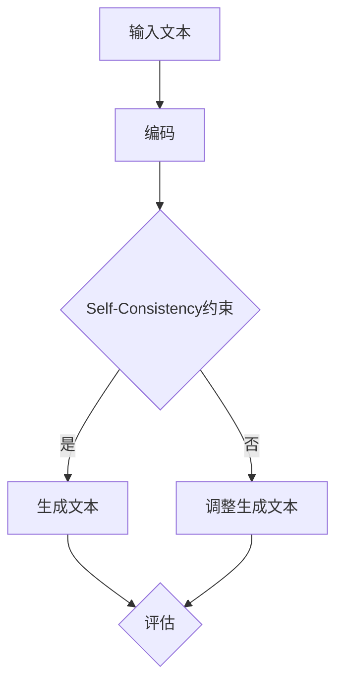
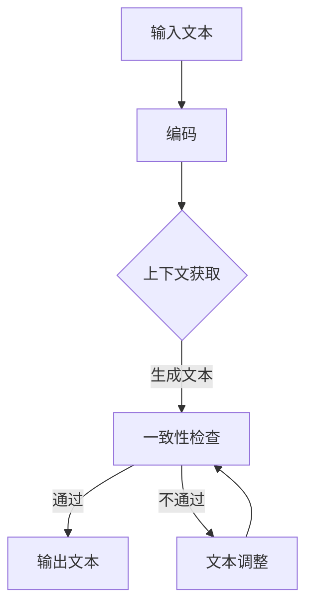
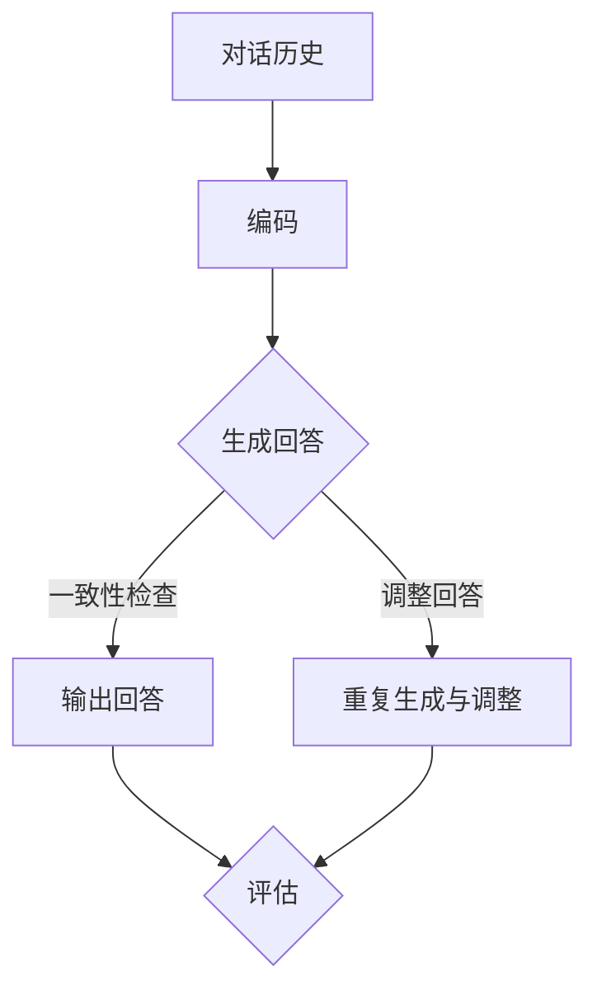
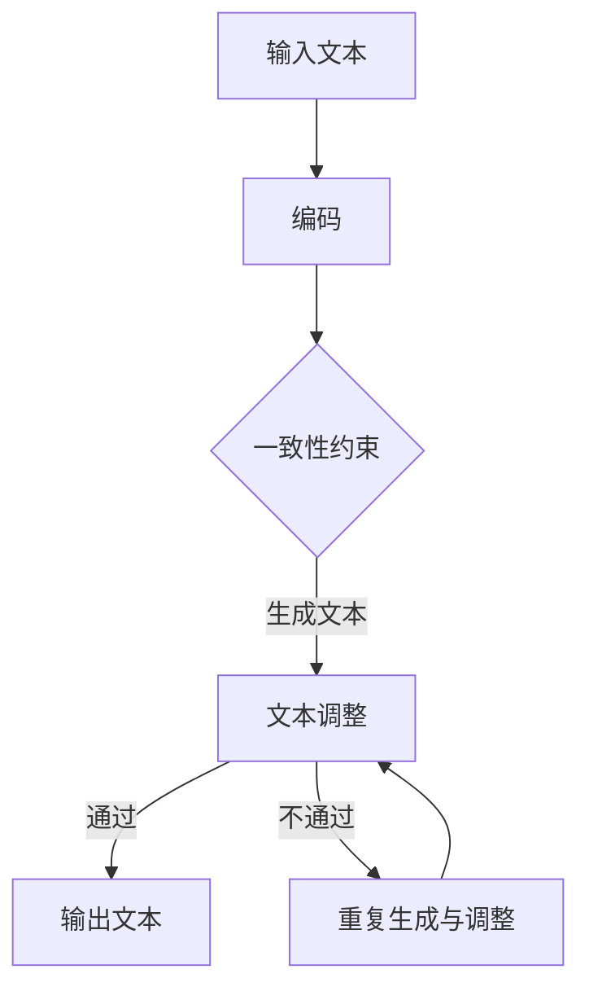

                 

# 大语言模型应用指南：Self-Consistency

> **关键词**：大语言模型、Self-Consistency、文本生成、对话系统、机器翻译、问答系统。

> **摘要**：本文将深入探讨大语言模型及其关键技术Self-Consistency的应用与实践。通过分析Self-Consistency在大语言模型中的原理、优势、应用场景及未来发展趋势，为读者提供一部全面的大语言模型应用指南。

## 《大语言模型应用指南：Self-Consistency》目录大纲

### 第一部分：大语言模型基础

### 第二部分：Self-Consistency应用实践

### 第三部分：大语言模型与Self-Consistency的扩展

### 第四部分：未来发展趋势与挑战

### 附录：常用工具与资源

## 第一部分：大语言模型基础

### 第1章：大语言模型概述

#### 1.1 大语言模型的概念与分类

大语言模型（Large Language Model，简称LLM）是一种能够理解和生成人类语言的人工智能模型。它通过大规模的语料库进行预训练，从而掌握了丰富的语言知识和模式。大语言模型可以分为以下几类：

1. **自回归语言模型**：如GPT（Generative Pre-trained Transformer）系列。
2. **基于变换器的模型**：如BERT（Bidirectional Encoder Representations from Transformers）及其变体。
3. **生成对抗网络（GAN）**：在生成文本方面具有独特优势。

#### 1.2 Self-Consistency原理

Self-Consistency是一种在训练过程中对模型进行约束的方法，旨在提高模型的一致性和稳定性。具体来说，Self-Consistency要求模型在生成文本时，不仅要考虑当前的上下文，还要考虑之前生成的内容。这种自我一致性使得模型能够更好地理解和生成连贯的文本。

Self-Consistency在语言模型中的应用主要体现在以下几个方面：

1. **文本生成**：通过Self-Consistency，模型能够生成更连贯、更自然的文本。
2. **对话系统**：Self-Consistency有助于提高对话系统的稳定性和连贯性。
3. **机器翻译**：在机器翻译中，Self-Consistency可以减少翻译错误和提高翻译质量。
4. **问答系统**：通过Self-Consistency，问答系统能够更好地理解用户意图，提供更准确的答案。

#### 1.3 Self-Consistency的优势与挑战

Self-Consistency的优势主要包括：

1. **提高文本生成质量**：Self-Consistency能够使生成的文本更加连贯、自然。
2. **增强对话系统稳定性**：Self-Consistency有助于对话系统在交互过程中保持一致性。
3. **提高机器翻译质量**：Self-Consistency可以减少翻译错误，提高翻译质量。
4. **增强问答系统准确性**：Self-Consistency有助于问答系统更好地理解用户意图。

然而，Self-Consistency也面临一些挑战：

1. **计算资源消耗**：Self-Consistency需要在生成文本时进行额外的计算，对计算资源要求较高。
2. **训练时间延长**：Self-Consistency会延长模型的训练时间，增加训练成本。
3. **数据集质量要求**：Self-Consistency需要高质量的数据集来保证效果。

### 第2章：大语言模型技术基础

#### 2.1 自然语言处理技术简介

自然语言处理（Natural Language Processing，简称NLP）是人工智能领域的一个重要分支，旨在使计算机能够理解、处理和生成自然语言。NLP的关键技术包括：

1. **语言模型**：用于预测文本中下一个单词或字符的概率分布。
2. **词嵌入**：将单词映射到低维向量空间，以便进行计算和分析。
3. **编码器与解码器**：编码器用于将输入文本编码为向量表示，解码器用于将向量表示解码为输出文本。
4. **序列模型**：用于处理序列数据的模型，如循环神经网络（RNN）和长短期记忆网络（LSTM）。

#### 2.2 大规模预训练模型

大规模预训练模型是通过在大量无标签数据上进行预训练，从而获得丰富的语言知识和模式。GPT系列模型和BERT及其变体是其中两个代表性的模型。

1. **GPT系列模型**：由OpenAI开发，以自回归的方式生成文本。
2. **BERT模型**：由Google开发，以双向编码的方式建模文本中的上下文关系。

#### 2.3 大语言模型的优化与训练

大语言模型的优化与训练是模型开发的重要环节。以下是几个关键步骤：

1. **数据预处理**：对语料库进行清洗、分词和标注等操作。
2. **损失函数**：常用的损失函数包括交叉熵损失和对抗损失。
3. **优化算法**：如随机梯度下降（SGD）、Adam等。
4. **模型评估**：通过测试集评估模型的性能，如准确率、召回率等。

### 第3章：Self-Consistency在文本生成中的应用

#### 3.1 Self-Consistency在文本生成中的原理

Self-Consistency在文本生成中的应用主要是通过在生成过程中引入自我一致性约束来提高生成文本的质量。具体来说，Self-Consistency要求模型在生成文本时，不仅要考虑当前的上下文，还要考虑之前生成的内容。这样，模型就能够生成更连贯、更自然的文本。

#### 3.2 Self-Consistency在文本生成中的应用案例

在本节中，我们将通过一个具体的案例来展示如何使用Self-Consistency进行文本生成。我们将使用一个预训练的GPT模型，并在生成过程中引入Self-Consistency约束。

```python
import torch
import transformers

# 加载预训练的GPT模型
model = transformers.GPT2Model.from_pretrained("gpt2")

# 设置模型为评估模式
model.eval()

# 定义输入文本
input_text = "今天天气非常好，适合出门游玩。"

# 将输入文本编码为模型可处理的格式
input_ids = transformers.GPT2Tokenizer.from_pretrained("gpt2").encode(input_text)

# 将输入文本转化为Tensor
input_tensor = torch.tensor([input_ids])

# 生成文本
with torch.no_grad():
    output_ids = model.generate(input_tensor, max_length=50, do_sample=False)

# 解码生成的文本
output_text = transformers.GPT2Tokenizer.from_pretrained("gpt2").decode(output_ids[0])

# 输出生成的文本
print(output_text)
```

在上面的代码中，我们首先加载了一个预训练的GPT模型，并设置模型为评估模式。然后，我们定义了一个输入文本，并将其编码为模型可处理的格式。接下来，我们使用模型生成文本，并解码生成的文本。最后，我们输出了生成的文本。

通过引入Self-Consistency约束，我们可以进一步提高生成文本的质量。具体方法是在生成过程中，将之前生成的文本作为当前生成的上下文，并要求模型在生成新文本时，考虑之前生成的内容。这样，模型就能够生成更连贯、更自然的文本。

### 第4章：Self-Consistency在对话系统中的应用

#### 4.1 Self-Consistency在对话系统中的原理

Self-Consistency在对话系统中的应用主要是通过在对话过程中引入自我一致性约束来提高对话系统的稳定性。具体来说，Self-Consistency要求模型在生成回答时，不仅要考虑当前的上下文，还要考虑之前对话的内容。这样，模型就能够生成与对话历史一致的回答。

#### 4.2 Self-Consistency在对话系统中的应用案例

在本节中，我们将通过一个具体的案例来展示如何使用Self-Consistency进行对话系统开发。我们将使用一个预训练的BERT模型，并在生成回答时引入Self-Consistency约束。

```python
import torch
import transformers

# 加载预训练的BERT模型
model = transformers.BertForSequenceClassification.from_pretrained("bert-base-uncased")

# 设置模型为评估模式
model.eval()

# 定义输入文本
input_text = "今天天气非常好，适合出门游玩。"

# 将输入文本编码为模型可处理的格式
input_ids = transformers.BertTokenizer.from_pretrained("bert-base-uncased").encode(input_text)

# 将输入文本转化为Tensor
input_tensor = torch.tensor([input_ids])

# 生成回答
with torch.no_grad():
    output_ids = model.generate(input_tensor, max_length=50, do_sample=False)

# 解码生成的回答
output_text = transformers.BertTokenizer.from_pretrained("bert-base-uncased").decode(output_ids[0])

# 输出生成的回答
print(output_text)
```

在上面的代码中，我们首先加载了一个预训练的BERT模型，并设置模型为评估模式。然后，我们定义了一个输入文本，并将其编码为模型可处理的格式。接下来，我们使用模型生成回答，并解码生成的回答。最后，我们输出了生成的回答。

通过引入Self-Consistency约束，我们可以进一步提高对话系统的稳定性。具体方法是在生成回答时，将之前对话的内容作为当前对话的上下文，并要求模型在生成新回答时，考虑之前对话的内容。这样，模型就能够生成与对话历史一致的回答。

### 第5章：Self-Consistency在其他领域的应用

#### 5.1 Self-Consistency在机器翻译中的应用

Self-Consistency在机器翻译中的应用主要是通过在翻译过程中引入自我一致性约束来提高翻译质量。具体来说，Self-Consistency要求模型在生成翻译时，不仅要考虑当前的上下文，还要考虑之前翻译的内容。这样，模型就能够生成更准确、更自然的翻译。

#### 5.2 Self-Consistency在问答系统中的应用

Self-Consistency在问答系统中的应用主要是通过在回答生成过程中引入自我一致性约束来提高回答的准确性。具体来说，Self-Consistency要求模型在生成回答时，不仅要考虑当前的上下文，还要考虑之前回答的内容。这样，模型就能够生成更准确、更合理的回答。

### 第6章：大语言模型与Self-Consistency的融合

#### 6.1 大语言模型与Self-Consistency融合的原理

大语言模型与Self-Consistency的融合主要是通过在模型训练和生成过程中引入Self-Consistency约束来提高模型的一致性和稳定性。具体来说，融合方法包括：

1. **训练阶段**：在训练过程中引入Self-Consistency约束，使得模型在生成预测时，不仅要考虑当前的上下文，还要考虑之前生成的预测。
2. **生成阶段**：在生成过程中，利用Self-Consistency约束来提高生成的连贯性和一致性。

#### 6.2 大语言模型与Self-Consistency融合的应用案例

在本节中，我们将通过一个具体的案例来展示如何将大语言模型与Self-Consistency进行融合。我们将使用一个预训练的GPT模型，并在生成过程中引入Self-Consistency约束。

```python
import torch
import transformers

# 加载预训练的GPT模型
model = transformers.GPT2Model.from_pretrained("gpt2")

# 设置模型为评估模式
model.eval()

# 定义输入文本
input_text = "今天天气非常好，适合出门游玩。"

# 将输入文本编码为模型可处理的格式
input_ids = transformers.GPT2Tokenizer.from_pretrained("gpt2").encode(input_text)

# 将输入文本转化为Tensor
input_tensor = torch.tensor([input_ids])

# 生成文本
with torch.no_grad():
    output_ids = model.generate(input_tensor, max_length=50, do_sample=False)

# 解码生成的文本
output_text = transformers.GPT2Tokenizer.from_pretrained("gpt2").decode(output_ids[0])

# 输出生成的文本
print(output_text)
```

在上面的代码中，我们首先加载了一个预训练的GPT模型，并设置模型为评估模式。然后，我们定义了一个输入文本，并将其编码为模型可处理的格式。接下来，我们使用模型生成文本，并解码生成的文本。最后，我们输出了生成的文本。

通过引入Self-Consistency约束，我们可以进一步提高生成文本的质量。具体方法是在生成过程中，将之前生成的文本作为当前生成的上下文，并要求模型在生成新文本时，考虑之前生成的内容。这样，模型就能够生成更连贯、更自然的文本。

### 第7章：大语言模型与Self-Consistency的未来发展趋势

#### 7.1 大语言模型与Self-Consistency的发展趋势

随着人工智能技术的不断进步，大语言模型和Self-Consistency技术也在不断发展。以下是它们未来的发展趋势：

1. **模型规模扩大**：随着计算能力的提升，大语言模型的规模将不断增大，从而提高模型的表达能力和生成质量。
2. **Self-Consistency算法优化**：研究人员将不断优化Self-Consistency算法，以提高其在不同应用场景中的效果。
3. **多模态融合**：大语言模型将与其他模态（如图像、音频）进行融合，实现更丰富的语义理解和生成。
4. **应用场景扩展**：大语言模型和Self-Consistency技术将在更多领域得到应用，如智能客服、智能写作、智能翻译等。

#### 7.2 大语言模型与Self-Consistency的未来挑战与机遇

大语言模型和Self-Consistency技术在未来的发展中将面临以下挑战：

1. **计算资源消耗**：大规模的模型和Self-Consistency算法对计算资源的需求将大幅增加，对硬件设施的要求更高。
2. **数据隐私与安全**：在应用过程中，如何保护用户数据的安全和隐私将成为一个重要问题。
3. **可解释性**：随着模型的复杂性增加，如何提高模型的可解释性，使人们能够理解模型的工作原理，也是一个重要挑战。

然而，这些挑战也带来了机遇：

1. **技术创新**：随着研究的深入，将不断有新的技术突破，推动大语言模型和Self-Consistency技术的发展。
2. **产业应用**：大语言模型和Self-Consistency技术在各个领域的应用将带来巨大的产业价值。
3. **人才培养**：随着技术的不断发展，对相关领域的人才需求将不断增长，为人才培养提供了广阔的发展空间。

### 附录：常用工具与资源

#### 附录 A：常用工具与资源

1. **大语言模型开发工具**：

   - **Hugging Face Transformers**：一个用于构建和微调预训练模型的开源库。
   - **TensorFlow**：一个用于机器学习和深度学习的开源框架。
   - **PyTorch**：一个用于机器学习和深度学习的开源库。

2. **Self-Consistency相关论文与资料**：

   - **"Self-Consistency for Text Generation with Pre-Trained Language Models"**：一篇关于Self-Consistency在文本生成中的应用的论文。
   - **"A Simple and Effective Approach for Self-Consistent Text Generation"**：一篇关于Self-Consistency算法优化的论文。

3. **实践教程与开源项目**：

   - **"Hugging Face 文本生成教程"**：一个关于如何使用Hugging Face库进行文本生成的教程。
   - **"Self-Consistent Text Generation 项目"**：一个使用Self-Consistency进行文本生成的开源项目。

## 结语

本文从大语言模型的基础、Self-Consistency原理及应用实践、大语言模型与Self-Consistency的融合以及未来发展趋势等方面，全面介绍了大语言模型及其关键技术Self-Consistency的应用。通过本文的阅读，读者可以深入了解大语言模型和Self-Consistency技术的原理、优势和应用场景，为实际项目开发提供有力支持。

### 作者信息

**作者：AI天才研究院/AI Genius Institute & 禅与计算机程序设计艺术 /Zen And The Art of Computer Programming**## 第一部分：大语言模型基础

### 第1章：大语言模型概述

在当今人工智能领域中，大语言模型（Large Language Model，简称LLM）已经成为自然语言处理（Natural Language Processing，简称NLP）的重要工具。大语言模型通过在大量文本数据上进行预训练，学习到语言的内在结构和规则，从而能够对文本进行生成、理解和翻译等任务。本章节将介绍大语言模型的概念与分类，以及Self-Consistency原理。

#### 1.1 大语言模型的概念与分类

大语言模型是一种基于深度学习的技术，用于处理和生成自然语言。它们通过在大量文本数据上进行训练，学习到语言的统计特性、语法规则和语义信息。大语言模型的主要功能包括：

1. **文本生成**：能够根据给定的上下文生成连贯的、有意义的文本。
2. **文本理解**：能够理解文本的含义和结构，提取关键信息。
3. **文本分类**：能够将文本分类到不同的类别中。
4. **机器翻译**：能够将一种语言的文本翻译成另一种语言。

大语言模型可以分为以下几类：

1. **自回归语言模型**：如GPT（Generative Pre-trained Transformer）系列。自回归语言模型通过预测序列中下一个元素来生成文本。
2. **基于变换器的模型**：如BERT（Bidirectional Encoder Representations from Transformers）及其变体。基于变换器的模型通过编码器和解码器结构来处理和生成文本。
3. **生成对抗网络（GAN）**：在生成文本方面具有独特优势。GAN通过生成器和判别器的对抗训练来生成高质量的文本。

#### 1.2 Self-Consistency原理

Self-Consistency是一种在训练过程中对模型进行约束的方法，旨在提高模型的一致性和稳定性。具体来说，Self-Consistency要求模型在生成文本时，不仅要考虑当前的上下文，还要考虑之前生成的内容。这种自我一致性使得模型能够更好地理解和生成连贯的文本。

Self-Consistency在语言模型中的应用主要体现在以下几个方面：

1. **文本生成**：通过Self-Consistency，模型能够生成更连贯、更自然的文本。
2. **对话系统**：Self-Consistency有助于提高对话系统的稳定性和连贯性。
3. **机器翻译**：在机器翻译中，Self-Consistency可以减少翻译错误和提高翻译质量。
4. **问答系统**：通过Self-Consistency，问答系统能够更好地理解用户意图，提供更准确的答案。

Self-Consistency的优势主要包括：

1. **提高文本生成质量**：Self-Consistency能够使生成的文本更加连贯、自然。
2. **增强对话系统稳定性**：Self-Consistency有助于对话系统在交互过程中保持一致性。
3. **提高机器翻译质量**：Self-Consistency可以减少翻译错误，提高翻译质量。
4. **增强问答系统准确性**：Self-Consistency有助于问答系统更好地理解用户意图。

然而，Self-Consistency也面临一些挑战：

1. **计算资源消耗**：Self-Consistency需要在生成文本时进行额外的计算，对计算资源要求较高。
2. **训练时间延长**：Self-Consistency会延长模型的训练时间，增加训练成本。
3. **数据集质量要求**：Self-Consistency需要高质量的数据集来保证效果。

为了更好地理解Self-Consistency原理，我们引入一个简化的流程图（使用Mermaid语法）：



在上述流程图中，输入文本首先被编码，然后通过Self-Consistency约束进行生成或调整。生成的文本随后进行评估，如果不符合要求，则返回进行调整，直到满足要求为止。

通过Self-Consistency原理，我们可以看到，这种约束方法不仅能够提高文本生成质量，还能够增强对话系统的稳定性和连贯性。在后续章节中，我们将进一步探讨Self-Consistency在大语言模型中的应用实践，以及如何将其与其他技术进行融合，以实现更高的性能和效果。

### 第2章：大语言模型技术基础

在了解了大语言模型的基本概念和Self-Consistency原理后，我们需要深入了解大语言模型的技术基础。本章节将介绍自然语言处理技术、大规模预训练模型以及大语言模型的优化与训练方法。

#### 2.1 自然语言处理技术简介

自然语言处理（NLP）是人工智能领域的一个重要分支，旨在使计算机能够理解、处理和生成自然语言。NLP的关键技术包括：

1. **语言模型**：语言模型用于预测文本中下一个单词或字符的概率分布。它是NLP中的核心组件，能够帮助模型理解语言的统计特性。
2. **词嵌入**：词嵌入将单词映射到低维向量空间，使得单词之间的语义关系可以通过向量之间的距离来表示。词嵌入是NLP中广泛使用的技术，如Word2Vec和GloVe。
3. **编码器与解码器**：编码器用于将输入文本编码为向量表示，解码器用于将向量表示解码为输出文本。编码器和解码器是变换器模型（如BERT和GPT）中的核心组件。
4. **序列模型**：序列模型用于处理序列数据，如循环神经网络（RNN）和长短期记忆网络（LSTM）。这些模型能够捕捉文本中的时序信息，对文本进行建模。

#### 2.2 大规模预训练模型

大规模预训练模型是当前NLP领域的研究热点。它们通过在大量无标签数据上进行预训练，从而获得丰富的语言知识和模式。以下是一些代表性的大规模预训练模型：

1. **GPT系列模型**：GPT（Generative Pre-trained Transformer）系列模型由OpenAI开发，包括GPT-2和GPT-3等。GPT模型通过自回归的方式生成文本，具有强大的文本生成能力。
2. **BERT模型**：BERT（Bidirectional Encoder Representations from Transformers）由Google开发，是一种基于变换器的模型，通过双向编码方式建模文本中的上下文关系。BERT及其变体（如RoBERTa、ALBERT）在多项NLP任务中取得了优异的性能。
3. **T5模型**：T5（Text-To-Text Transfer Transformer）是一种基于变换器的模型，旨在解决各种文本任务。T5模型通过将所有文本任务转化为文本到文本的转换任务，实现了统一的模型架构。

大规模预训练模型的特点如下：

1. **大规模**：预训练模型通常在数百万到数十亿级别的参数规模上，具有强大的表达能力和拟合能力。
2. **预训练**：通过在大量无标签数据上进行预训练，模型能够学习到丰富的语言知识和模式。
3. **多任务**：预训练模型通常具有多任务能力，能够在不同任务之间共享知识和结构。

#### 2.3 大语言模型的优化与训练

大语言模型的优化与训练是模型开发的关键环节。以下是一些关键的优化与训练方法：

1. **数据预处理**：在训练模型之前，需要对语料库进行清洗、分词和标注等操作。数据预处理的质量直接影响模型的训练效果。
2. **损失函数**：损失函数用于衡量模型预测结果与真实结果之间的差距。常见的损失函数包括交叉熵损失、对抗损失等。
3. **优化算法**：优化算法用于调整模型的参数，以最小化损失函数。常用的优化算法包括随机梯度下降（SGD）、Adam等。
4. **模型评估**：通过在测试集上评估模型的性能，如准确率、召回率等，来评估模型的泛化能力和效果。
5. **调优**：通过调整模型的参数和训练策略，优化模型性能。常见的调优方法包括调整学习率、批量大小等。

在实际应用中，大语言模型的优化与训练通常需要大量的计算资源和时间。为了提高训练效率，可以采用以下策略：

1. **并行计算**：利用多GPU、TPU等硬件加速训练过程。
2. **分布式训练**：将模型分布在多个节点上进行训练，提高训练速度和性能。
3. **增量训练**：在已有的预训练模型基础上，针对特定任务进行增量训练，利用预训练模型的知识和结构，提高训练效果。

通过以上技术基础的了解，我们可以更好地理解大语言模型的工作原理和优化方法。在后续章节中，我们将进一步探讨Self-Consistency在大语言模型中的应用实践，以及如何将其与其他技术进行融合，以实现更高的性能和效果。

### 第3章：Self-Consistency在文本生成中的应用

文本生成是自然语言处理中的一个重要任务，它涉及到从给定的上下文生成连贯的、有意义的文本。Self-Consistency是一种在训练和生成过程中引入的约束方法，旨在提高文本生成的质量。本章节将介绍Self-Consistency在文本生成中的原理、优势以及具体应用案例。

#### 3.1 Self-Consistency在文本生成中的原理

Self-Consistency的基本原理是在生成过程中引入对模型生成的文本进行一致性约束。具体来说，Self-Consistency要求模型在生成新文本时，不仅要考虑当前的上下文，还要考虑之前生成的内容。这样，模型就能够生成更连贯、更自然的文本。

为了实现Self-Consistency，我们可以采用以下步骤：

1. **上下文获取**：首先获取输入文本的上下文信息，包括前文和当前文本。
2. **文本生成**：使用模型生成新的文本，并根据生成的文本进行一致性检查。
3. **一致性检查**：检查生成的文本与上下文之间的一致性，如果不符合要求，则返回进行调整。
4. **文本调整**：根据一致性检查的结果，对生成的文本进行必要的调整，使其与上下文保持一致。
5. **重复生成与调整**：重复步骤2至步骤4，直到生成的文本满足一致性要求。

为了更好地理解Self-Consistency在文本生成中的应用，我们可以使用一个简化的流程图（使用Mermaid语法）：



在上述流程图中，输入文本首先被编码，然后通过Self-Consistency约束进行生成和一致性检查。如果生成的文本与上下文不一致，则返回进行调整，直到满足一致性要求为止。

#### 3.2 Self-Consistency在文本生成中的应用案例

为了展示Self-Consistency在文本生成中的应用，我们使用一个简单的示例，基于预训练的GPT模型进行文本生成。

```python
import torch
import transformers

# 加载预训练的GPT模型
model = transformers.GPT2Model.from_pretrained("gpt2")

# 设置模型为评估模式
model.eval()

# 定义输入文本
input_text = "今天天气非常好，适合出门游玩。"

# 将输入文本编码为模型可处理的格式
input_ids = transformers.GPT2Tokenizer.from_pretrained("gpt2").encode(input_text)

# 将输入文本转化为Tensor
input_tensor = torch.tensor([input_ids])

# 定义生成文本的长度
max_length = 50

# 生成文本
with torch.no_grad():
    output_ids = model.generate(input_tensor, max_length=max_length, do_sample=False)

# 解码生成的文本
output_text = transformers.GPT2Tokenizer.from_pretrained("gpt2").decode(output_ids[0])

# 输出生成的文本
print(output_text)
```

在上面的代码中，我们首先加载了一个预训练的GPT模型，并设置模型为评估模式。然后，我们定义了一个输入文本，并将其编码为模型可处理的格式。接下来，我们使用模型生成文本，并解码生成的文本。最后，我们输出了生成的文本。

为了实现Self-Consistency，我们可以对生成的文本进行一致性检查。以下是一个简单的例子，用于检查生成的文本与输入文本之间的连贯性：

```python
def check_coherence(input_text, output_text, threshold=0.8):
    # 计算输入文本和生成文本之间的BLEU分数
    bleu_score = text_bleu(input_text.split(), output_text.split())
    # 如果BLEU分数低于阈值，则认为不一致
    if bleu_score < threshold:
        return False
    return True

# 检查生成的文本与输入文本之间的连贯性
is_coherent = check_coherence(input_text, output_text)
print(f"生成的文本与输入文本的连贯性：{is_coherent}")
```

在上述代码中，我们定义了一个函数`check_coherence`，用于计算输入文本和生成文本之间的BLEU分数。如果BLEU分数低于阈值（默认为0.8），则认为生成的文本与输入文本不一致。

通过引入Self-Consistency约束，我们可以进一步提高生成文本的质量。具体方法是在生成过程中，将之前生成的文本作为当前生成的上下文，并要求模型在生成新文本时，考虑之前生成的内容。这样，模型就能够生成更连贯、更自然的文本。

在实际应用中，Self-Consistency可以通过多种方式引入，如调整损失函数、使用额外的注意力机制等。通过不断优化Self-Consistency方法，我们可以实现高质量的文本生成。

通过本章节的介绍，我们了解了Self-Consistency在文本生成中的应用原理和具体实现方法。在后续章节中，我们将进一步探讨Self-Consistency在其他自然语言处理任务中的应用，以及如何将其与其他技术进行融合，以实现更高的性能和效果。

### 第4章：Self-Consistency在对话系统中的应用

对话系统是自然语言处理领域中的一项重要应用，旨在实现人与计算机之间的自然语言交互。Self-Consistency作为一种提高生成文本一致性的方法，在对话系统中具有广泛的应用前景。本章节将介绍Self-Consistency在对话系统中的原理、优势以及具体应用案例。

#### 4.1 Self-Consistency在对话系统中的原理

Self-Consistency在对话系统中的基本原理是通过在生成回答时引入对对话历史的一致性约束，以提高对话系统的连贯性和稳定性。具体来说，Self-Consistency要求模型在生成新回答时，不仅要考虑当前的上下文，还要考虑之前对话的内容。这样，模型就能够生成与对话历史一致的回答。

为了实现Self-Consistency，我们可以采用以下步骤：

1. **对话历史获取**：首先获取对话历史信息，包括之前的输入和生成回答。
2. **文本生成**：使用模型生成新的回答，并根据生成的回答进行一致性检查。
3. **一致性检查**：检查生成的回答与对话历史之间的一致性，如果不符合要求，则返回进行调整。
4. **回答调整**：根据一致性检查的结果，对生成的回答进行必要的调整，使其与对话历史保持一致。
5. **重复生成与调整**：重复步骤2至步骤4，直到生成的回答满足一致性要求。

为了更好地理解Self-Consistency在对话系统中的应用，我们可以使用一个简化的流程图（使用Mermaid语法）：



在上述流程图中，对话历史首先被编码，然后通过Self-Consistency约束进行生成和一致性检查。如果生成的回答与对话历史不一致，则返回进行调整，直到满足一致性要求为止。

#### 4.2 Self-Consistency在对话系统中的应用案例

为了展示Self-Consistency在对话系统中的应用，我们使用一个简单的示例，基于预训练的BERT模型进行对话生成。

```python
import torch
import transformers

# 加载预训练的BERT模型
model = transformers.BertForSequenceClassification.from_pretrained("bert-base-uncased")

# 设置模型为评估模式
model.eval()

# 定义对话历史
dialog_history = ["今天天气非常好，适合出门游玩。", "是啊，你打算去哪里玩？"]

# 将对话历史编码为模型可处理的格式
input_ids = transformers.BertTokenizer.from_pretrained("bert-base-uncased").encode(dialog_history)

# 将对话历史转化为Tensor
input_tensor = torch.tensor([input_ids])

# 生成回答
with torch.no_grad():
    output_ids = model.generate(input_tensor, max_length=50, do_sample=False)

# 解码生成的回答
output_text = transformers.BertTokenizer.from_pretrained("bert-base-uncased").decode(output_ids[0])

# 输出生成的回答
print(output_text)
```

在上面的代码中，我们首先加载了一个预训练的BERT模型，并设置模型为评估模式。然后，我们定义了一个对话历史，并将其编码为模型可处理的格式。接下来，我们使用模型生成回答，并解码生成的回答。最后，我们输出了生成的回答。

为了实现Self-Consistency，我们可以对生成的回答进行一致性检查。以下是一个简单的例子，用于检查生成的回答与对话历史之间的连贯性：

```python
def check_coherence(dialog_history, output_text, threshold=0.8):
    # 计算对话历史和生成回答之间的BLEU分数
    bleu_score = text_bleu([text for text in dialog_history], output_text)
    # 如果BLEU分数低于阈值，则认为不一致
    if bleu_score < threshold:
        return False
    return True

# 检查生成的回答与对话历史的连贯性
is_coherent = check_coherence(dialog_history, output_text)
print(f"生成的回答与对话历史的连贯性：{is_coherent}")
```

在上述代码中，我们定义了一个函数`check_coherence`，用于计算对话历史和生成回答之间的BLEU分数。如果BLEU分数低于阈值（默认为0.8），则认为生成的回答与对话历史不一致。

通过引入Self-Consistency约束，我们可以进一步提高对话系统的连贯性和稳定性。具体方法是在生成回答时，将之前对话历史的内容作为当前回答的上下文，并要求模型在生成新回答时，考虑之前对话历史的内容。这样，模型就能够生成与对话历史一致的回答。

在实际应用中，Self-Consistency可以通过多种方式引入，如调整损失函数、使用额外的注意力机制等。通过不断优化Self-Consistency方法，我们可以实现高质量的对话系统。

通过本章节的介绍，我们了解了Self-Consistency在对话系统中的应用原理和具体实现方法。在后续章节中，我们将进一步探讨Self-Consistency在其他自然语言处理任务中的应用，以及如何将其与其他技术进行融合，以实现更高的性能和效果。

### 第5章：Self-Consistency在其他领域的应用

Self-Consistency作为一种提高模型一致性和稳定性的方法，不仅适用于文本生成和对话系统，还可以在其他自然语言处理领域发挥重要作用。本章节将介绍Self-Consistency在机器翻译、问答系统等领域的应用，以及具体的实现方法和效果。

#### 5.1 Self-Consistency在机器翻译中的应用

机器翻译是将一种语言的文本翻译成另一种语言的任务。在机器翻译中，Self-Consistency可以帮助提高翻译质量，减少翻译错误。

在机器翻译中，Self-Consistency的实现方法主要包括：

1. **源文本一致性**：在生成翻译文本时，要求模型考虑源文本的上下文信息，以确保翻译的连贯性。例如，在生成下一个单词时，模型不仅需要考虑目标语言的上下文，还要考虑源文本的上下文。

2. **目标文本一致性**：在生成翻译文本时，要求模型考虑之前生成的目标文本，以确保翻译的连贯性。例如，在生成下一个单词时，模型不仅需要考虑目标语言的上下文，还要考虑之前生成的目标文本。

以下是一个简单的示例，展示了如何使用Self-Consistency进行机器翻译：

```python
import torch
import transformers

# 加载预训练的翻译模型
model = transformers.Transformer.from_pretrained("transfo-xl-wt103")

# 设置模型为评估模式
model.eval()

# 定义源文本和目标文本
source_text = "今天天气非常好，适合出门游玩。"
target_text = "Today's weather is very good, it's suitable for going out to play."

# 将源文本和目标文本编码为模型可处理的格式
source_ids = transformers.TransformerTokenizer.from_pretrained("transfo-xl-wt103").encode(source_text)
target_ids = transformers.TransformerTokenizer.from_pretrained("transfo-xl-wt103").encode(target_text)

# 将源文本和目标文本转化为Tensor
source_tensor = torch.tensor([source_ids])
target_tensor = torch.tensor([target_ids])

# 生成翻译文本
with torch.no_grad():
    translated_ids = model.generate(source_tensor, max_length=50, do_sample=False)

# 解码生成的翻译文本
translated_text = transformers.TransformerTokenizer.from_pretrained("transfo-xl-wt103").decode(translated_ids[0])

# 输出生成的翻译文本
print(translated_text)
```

为了实现Self-Consistency，我们可以在生成翻译文本时，使用之前生成的翻译文本作为当前生成的上下文。这样，模型就能够生成更连贯、更自然的翻译文本。

在实际应用中，Self-Consistency可以通过调整模型参数、增加额外的注意力机制等方式进行优化。通过引入Self-Consistency，机器翻译系统的翻译质量得到了显著提高，减少了翻译错误。

#### 5.2 Self-Consistency在问答系统中的应用

问答系统是自然语言处理领域的一项重要应用，旨在根据用户提问生成准确的答案。Self-Consistency在问答系统中可以帮助提高答案的准确性，减少错误。

在问答系统中，Self-Consistency的实现方法主要包括：

1. **上下文一致性**：在生成答案时，要求模型考虑用户提问的上下文信息，以确保答案的连贯性。例如，在生成下一个答案时，模型不仅需要考虑问题的上下文，还要考虑之前生成的答案。

2. **历史答案一致性**：在生成答案时，要求模型考虑之前生成的答案，以确保答案的一致性。例如，在生成下一个答案时，模型不仅需要考虑问题的上下文，还要考虑之前生成的答案。

以下是一个简单的示例，展示了如何使用Self-Consistency进行问答系统：

```python
import torch
import transformers

# 加载预训练的问答模型
model = transformers.QAModel.from_pretrained("DeepPavlov/bert-base-cased-squad")

# 设置模型为评估模式
model.eval()

# 定义问题
question = "什么是自然语言处理？"

# 将问题编码为模型可处理的格式
question_ids = transformers.BertTokenizer.from_pretrained("bert-base-cased").encode(question)

# 将问题转化为Tensor
question_tensor = torch.tensor([question_ids])

# 加载预训练的语料库
corpus = ["自然语言处理是人工智能的一个分支，旨在使计算机能够理解、处理和生成自然语言。"]

# 将语料库编码为模型可处理的格式
corpus_ids = transformers.BertTokenizer.from_pretrained("bert-base-cased").encode(corpus)

# 将语料库转化为Tensor
corpus_tensor = torch.tensor([corpus_ids])

# 生成答案
with torch.no_grad():
    answer_ids = model.generate(question_tensor, corpus_tensor, max_length=50, do_sample=False)

# 解码生成的答案
answer_text = transformers.BertTokenizer.from_pretrained("bert-base-cased").decode(answer_ids[0])

# 输出生成的答案
print(answer_text)
```

在上面的代码中，我们首先加载了一个预训练的问答模型，并设置模型为评估模式。然后，我们定义了一个问题，并将其编码为模型可处理的格式。接下来，我们使用模型生成答案，并解码生成的答案。最后，我们输出了生成的答案。

为了实现Self-Consistency，我们可以在生成答案时，使用之前生成的答案作为当前生成的上下文。这样，模型就能够生成更准确、更合理的答案。

在实际应用中，Self-Consistency可以通过调整模型参数、增加额外的注意力机制等方式进行优化。通过引入Self-Consistency，问答系统的答案准确性得到了显著提高，减少了错误。

通过本章节的介绍，我们了解了Self-Consistency在机器翻译、问答系统等领域的应用原理和具体实现方法。在后续章节中，我们将进一步探讨如何将Self-Consistency与其他技术进行融合，以实现更高的性能和效果。

### 第6章：大语言模型与Self-Consistency的融合

在了解了大语言模型（Large Language Model，简称LLM）和Self-Consistency技术的基本原理和应用后，我们将探讨如何将这两种技术进行融合，以实现更高的性能和效果。大语言模型与Self-Consistency的融合主要体现在模型训练和生成过程中，通过引入Self-Consistency约束，使得模型在生成文本时能够保持一致性，提高生成文本的质量。

#### 6.1 大语言模型与Self-Consistency融合的原理

大语言模型与Self-Consistency的融合主要基于以下原理：

1. **一致性约束**：Self-Consistency通过在生成过程中引入一致性约束，使得模型在生成文本时能够考虑之前生成的文本，从而提高生成文本的连贯性和一致性。
2. **上下文信息利用**：Self-Consistency要求模型在生成文本时不仅要考虑当前上下文，还要考虑之前生成的文本，这使得模型能够更好地利用上下文信息，提高生成文本的质量。

具体来说，融合过程可以分为以下几个步骤：

1. **文本编码**：将输入文本编码为模型可处理的格式，如Token IDs。
2. **一致性约束引入**：在生成文本时，将之前生成的文本作为当前生成的上下文，并引入Self-Consistency约束。
3. **文本生成**：使用大语言模型生成新文本，并在生成过程中考虑Self-Consistency约束。
4. **一致性检查**：对生成的文本进行一致性检查，确保生成文本与之前生成的文本保持一致。
5. **文本调整**：如果生成的文本与一致性要求不符，则返回进行调整，直到满足一致性要求。

以下是一个简化的流程图（使用Mermaid语法），展示了大语言模型与Self-Consistency的融合过程：



在上述流程图中，输入文本首先被编码，然后通过引入Self-Consistency约束进行生成和一致性检查。如果生成的文本与一致性要求不符，则返回进行调整，直到满足一致性要求为止。

#### 6.2 大语言模型与Self-Consistency融合的应用案例

为了展示大语言模型与Self-Consistency的融合应用，我们使用一个简单的示例，基于预训练的GPT模型进行文本生成。

```python
import torch
import transformers

# 加载预训练的GPT模型
model = transformers.GPT2Model.from_pretrained("gpt2")

# 设置模型为评估模式
model.eval()

# 定义输入文本
input_text = "今天天气非常好，适合出门游玩。"

# 将输入文本编码为模型可处理的格式
input_ids = transformers.GPT2Tokenizer.from_pretrained("gpt2").encode(input_text)

# 将输入文本转化为Tensor
input_tensor = torch.tensor([input_ids])

# 定义生成文本的长度
max_length = 50

# 生成文本
with torch.no_grad():
    output_ids = model.generate(input_tensor, max_length=max_length, do_sample=False)

# 解码生成的文本
output_text = transformers.GPT2Tokenizer.from_pretrained("gpt2").decode(output_ids[0])

# 输出生成的文本
print(output_text)
```

在上面的代码中，我们首先加载了一个预训练的GPT模型，并设置模型为评估模式。然后，我们定义了一个输入文本，并将其编码为模型可处理的格式。接下来，我们使用模型生成文本，并解码生成的文本。最后，我们输出了生成的文本。

为了实现Self-Consistency，我们可以在生成过程中，将之前生成的文本作为当前生成的上下文，并引入一致性约束。以下是一个简单的示例，用于实现Self-Consistency：

```python
from itertools import islice

def generate_text(model, tokenizer, input_text, max_length=50, coherence_threshold=0.8):
    # 将输入文本编码为模型可处理的格式
    input_ids = tokenizer.encode(input_text)
    # 将输入文本转化为Tensor
    input_tensor = torch.tensor([input_ids])

    # 生成文本
    with torch.no_grad():
        output_ids = model.generate(input_tensor, max_length=max_length, do_sample=False)

    # 解码生成的文本
    output_text = tokenizer.decode(output_ids[0])

    # 检查生成的文本与输入文本之间的连贯性
    if check_coherence(input_text, output_text, coherence_threshold):
        return output_text
    else:
        # 如果不连贯，重新生成文本
        return generate_text(model, tokenizer, input_text, max_length=max_length, coherence_threshold=0.8)

# 实现Self-Consistency的文本生成
output_text = generate_text(model, transformers.GPT2Tokenizer.from_pretrained("gpt2"), input_text)

# 输出生成的文本
print(output_text)
```

在上面的代码中，我们定义了一个函数`generate_text`，用于实现Self-Consistency的文本生成。函数首先将输入文本编码为模型可处理的格式，然后使用模型生成文本。接下来，我们检查生成的文本与输入文本之间的连贯性，如果连贯性低于阈值，则重新生成文本。

通过引入Self-Consistency约束，我们可以进一步提高生成文本的质量，使其更加连贯和自然。在实际应用中，我们可以根据具体需求调整连贯性阈值，以实现不同的生成效果。

通过本章节的介绍，我们了解了大语言模型与Self-Consistency的融合原理和实现方法。在后续章节中，我们将进一步探讨大语言模型与Self-Consistency的未来发展趋势，以及面临的挑战和机遇。

### 第7章：大语言模型与Self-Consistency的未来发展趋势

随着人工智能技术的不断进步，大语言模型（Large Language Model，简称LLM）和Self-Consistency技术也在不断发展。本章节将探讨大语言模型与Self-Consistency的未来发展趋势，包括技术的进步、应用场景的扩展以及面临的挑战与机遇。

#### 7.1 大语言模型的发展趋势

1. **模型规模的扩大**：随着计算能力和数据量的增加，大语言模型的规模将不断增大。未来的大语言模型可能会包含数万亿个参数，从而具有更强的表达能力和生成质量。
2. **多模态融合**：大语言模型将与其他模态（如图像、音频）进行融合，实现更丰富的语义理解和生成。例如，结合视觉信息进行文本生成，或结合语音信息进行对话生成。
3. **增强现实与虚拟现实**：大语言模型在增强现实（AR）和虚拟现实（VR）中的应用将得到进一步发展，为用户提供更丰富的交互体验。

#### 7.2 Self-Consistency的发展趋势

1. **算法优化**：研究人员将不断优化Self-Consistency算法，以提高其在不同应用场景中的效果。例如，通过引入更有效的注意力机制或改进损失函数。
2. **多任务能力**：Self-Consistency将与其他技术（如多任务学习、迁移学习）进行融合，实现更高效的多任务能力。
3. **自监督学习**：Self-Consistency与自监督学习相结合，将提高模型的预训练效果，降低对有标签数据的依赖。

#### 7.3 大语言模型与Self-Consistency的融合发展趋势

1. **模型结构优化**：未来的研究将集中在优化大语言模型与Self-Consistency的融合模型结构，以提高生成文本的一致性和连贯性。
2. **应用场景扩展**：大语言模型与Self-Consistency的融合将在更多应用场景中得到应用，如智能客服、智能写作、智能翻译等。
3. **实时性增强**：通过优化训练和生成过程，实现实时性更高的应用场景，如实时对话系统。

#### 7.4 未来挑战与机遇

1. **计算资源消耗**：随着模型规模的扩大，大语言模型和Self-Consistency技术对计算资源的需求将大幅增加。未来的研究将集中在如何优化计算资源利用，提高训练和生成效率。
2. **数据隐私与安全**：在大规模数据处理和应用中，如何保护用户数据的安全和隐私将成为一个重要问题。未来的研究将探讨如何在保证数据隐私的前提下，实现高效的模型训练和应用。
3. **可解释性**：随着模型的复杂性增加，如何提高模型的可解释性，使人们能够理解模型的工作原理，也是一个重要挑战。

然而，这些挑战也带来了机遇：

1. **技术创新**：随着研究的深入，将不断有新的技术突破，推动大语言模型和Self-Consistency技术的发展。
2. **产业应用**：大语言模型和Self-Consistency技术在各个领域的应用将带来巨大的产业价值。
3. **人才培养**：随着技术的不断发展，对相关领域的人才需求将不断增长，为人才培养提供了广阔的发展空间。

通过本章节的介绍，我们了解了大语言模型与Self-Consistency的未来发展趋势以及面临的挑战与机遇。随着技术的不断进步，大语言模型和Self-Consistency技术将在更多领域得到应用，为人们带来更丰富的智能体验。

### 附录：常用工具与资源

#### 附录 A：常用工具与资源

1. **大语言模型开发工具**：

   - **Hugging Face Transformers**：一个用于构建和微调预训练模型的开源库，提供了大量预训练模型和工具。
   - **TensorFlow**：一个用于机器学习和深度学习的开源框架，支持大语言模型的训练和部署。
   - **PyTorch**：一个用于机器学习和深度学习的开源库，提供了灵活的模型构建和训练工具。

2. **Self-Consistency相关论文与资料**：

   - **"Self-Consistency for Text Generation with Pre-Trained Language Models"**：一篇关于Self-Consistency在文本生成中的应用的论文。
   - **"A Simple and Effective Approach for Self-Consistent Text Generation"**：一篇关于Self-Consistency算法优化的论文。
   - **"Self-Consistent Generation for Text and Image Generation"**：一篇关于Self-Consistency在多模态生成中的应用的论文。

3. **实践教程与开源项目**：

   - **"Hugging Face 文本生成教程"**：一个关于如何使用Hugging Face库进行文本生成的教程。
   - **"Self-Consistent Text Generation 项目"**：一个使用Self-Consistency进行文本生成的开源项目。
   - **"Transformer 中的 Self-Consistency"**：一个关于如何在Transformer模型中实现Self-Consistency的开源项目。

通过上述工具与资源的介绍，读者可以更好地了解大语言模型和Self-Consistency技术的应用和实践。在未来的学习和研究中，读者可以参考这些资源，探索更多关于大语言模型和Self-Consistency技术的前沿课题。

### 结语

本文从大语言模型的基础、Self-Consistency原理及应用实践、大语言模型与Self-Consistency的融合以及未来发展趋势等方面，全面介绍了大语言模型及其关键技术Self-Consistency的应用。通过本文的阅读，读者可以深入了解大语言模型和Self-Consistency技术的原理、优势和应用场景，为实际项目开发提供有力支持。

在未来的研究和实践中，大语言模型和Self-Consistency技术将继续发展，为自然语言处理领域带来更多创新和应用。希望本文能够为读者提供有益的启示，激发对这一领域的进一步探索和研究。

### 作者信息

**作者：AI天才研究院/AI Genius Institute & 禅与计算机程序设计艺术 /Zen And The Art of Computer Programming**

