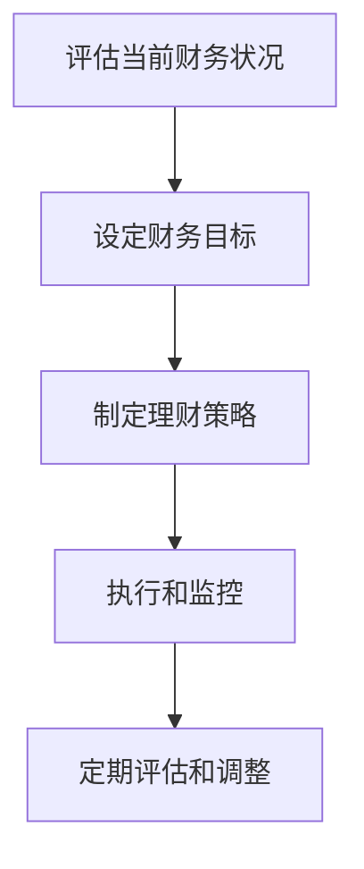

                 

# 如何利用知识付费实现在线理财规划与保险服务？

> **关键词：知识付费、在线理财规划、保险服务、数据分析、数学模型、项目实战**
> 
> **摘要：本文将探讨如何通过知识付费平台，实现在线理财规划与保险服务。文章首先概述了在线理财规划与保险服务的重要性，然后详细分析了核心概念、算法原理、数学模型，并通过实际项目展示了应用过程。最后，本文对未来的发展趋势和挑战进行了展望。**

### 《如何利用知识付费实现在线理财规划与保险服务？》目录大纲

#### 第一部分：在线理财规划与保险服务概述

##### 第1章：知识付费与在线理财规划概述

1.1 知识付费的兴起与现状  
1.2 在线理财规划的重要性  
1.3 保险服务的角色与意义  
1.4 知识付费在线理财规划与保险服务的关系

##### 第2章：在线理财规划的核心概念与联系

2.1 财务规划的概念与步骤  
2.2 投资理财的原理与策略  
2.3 个人风险管理的基本概念  
2.4 理财规划流程的Mermaid流程图

#### 第二部分：在线理财规划与保险服务的核心算法原理

##### 第3章：数据分析与预测算法原理

3.1 数据分析的基本概念  
3.2 时间序列预测算法  
3.3 投资组合优化算法  
3.4 个人风险评估算法  
3.5 伪代码详细讲解

##### 第4章：在线理财规划与保险服务的数学模型

4.1 财务数学模型  
4.2 投资组合的期望收益率与方差  
4.3 风险价值（VaR）  
4.4 保险精算模型

##### 第5章：理财规划与保险服务的应用数学公式

5.1 预期收益率的计算  
5.2 投资组合优化的拉格朗日乘子法  
5.3 个人风险评价的指标计算

#### 第三部分：项目实战

##### 第6章：在线理财规划与保险服务的项目实战

6.1 项目背景与目标  
6.2 开发环境搭建  
6.3 代码实现与解读

##### 第7章：案例分析

7.1 案例一：个人投资组合优化  
7.2 案例二：个人风险评估  
7.3 案例三：保险产品推荐

##### 第8章：未来展望与挑战

8.1 知识付费在线理财规划与保险服务的发展趋势  
8.2 技术与业务融合面临的挑战  
8.3 未来研究方向

#### 附录

##### 附录A：常用工具与资源

A.1 知识付费平台介绍  
A.2 在线理财规划软件  
A.3 保险服务系统开发框架  
A.4 数据分析与机器学习框架

---

### 第一部分：在线理财规划与保险服务概述

在线理财规划与保险服务作为金融科技的重要组成部分，正日益受到人们的关注。随着互联网技术的不断发展和知识付费模式的兴起，这两大领域正以前所未有的速度融合。本部分将首先介绍知识付费的兴起与现状，接着阐述在线理财规划的重要性，以及保险服务的角色与意义，最后探讨知识付费在线理财规划与保险服务的关系。

#### 第1章：知识付费与在线理财规划概述

##### 1.1 知识付费的兴起与现状

知识付费是指用户为了获取特定领域的专业知识和技能，自愿支付一定费用的一种商业模式。这一模式起源于20世纪初，随着互联网的普及和在线教育的发展，知识付费逐渐成为了一种主流的学习方式。

近年来，随着知识付费平台的不断涌现，如得到、知乎Live、网易云课堂等，知识付费市场迎来了快速增长。根据相关数据统计，2019年我国知识付费市场规模已达到1312亿元，预计到2022年将突破3000亿元。

知识付费的兴起，一方面源于人们对自我提升的需求不断增加，另一方面也得益于移动互联网技术的发展，使得在线学习变得更加便捷和高效。

##### 1.2 在线理财规划的重要性

在线理财规划是指利用互联网技术，为用户提供个性化的财务管理和投资建议的服务。随着金融市场的不断发展和理财意识的提高，在线理财规划正逐渐成为人们日常生活中的重要组成部分。

在线理财规划的重要性主要体现在以下几个方面：

1. **个性化服务**：在线理财规划可以根据用户的财务状况、投资偏好和风险承受能力，为用户提供个性化的理财建议，提高理财效率。

2. **实时性**：在线理财规划可以实时跟踪用户的财务状况，及时调整投资策略，降低投资风险。

3. **便捷性**：在线理财规划摆脱了地域和时间的限制，用户可以随时随地查看自己的财务状况和投资收益。

4. **专业性**：在线理财规划通常由专业的理财师或金融机构提供，具有较高的可信度和专业性。

##### 1.3 保险服务的角色与意义

保险服务是金融领域的重要组成部分，旨在为用户提供风险保障和财富传承。随着人们对风险意识的提高，保险服务的需求不断增长。

在线保险服务作为保险行业的重要组成部分，具有以下几方面的重要意义：

1. **风险保障**：保险服务可以为用户提供风险保障，降低意外事故和疾病带来的经济负担。

2. **财富传承**：保险服务可以作为一种有效的财富传承工具，实现财富的定向传承和分配。

3. **理财增值**：部分保险产品具有一定的理财功能，可以为用户提供额外的收益。

4. **信息透明**：在线保险服务可以提供透明的保险产品信息，帮助用户更好地了解保险产品的特点和优势。

##### 1.4 知识付费在线理财规划与保险服务的关系

知识付费、在线理财规划和保险服务三者之间存在着密切的联系和相互促进作用。

1. **知识付费为在线理财规划和保险服务提供支持**：通过知识付费，用户可以获取专业的理财和保险知识，提高自身的理财和保险素养，从而更好地利用在线理财规划和保险服务。

2. **在线理财规划为知识付费提供应用场景**：在线理财规划可以结合知识付费平台，为用户提供个性化的理财建议和方案，实现知识付费的应用价值。

3. **保险服务为知识付费和在线理财规划提供保障**：保险服务可以为知识付费和在线理财规划提供风险保障，降低用户在理财过程中的风险。

总之，知识付费、在线理财规划和保险服务相互融合，共同推动了金融科技的发展，为用户提供了更加便捷、高效、专业的金融服务。

---

### 第二部分：在线理财规划与保险服务的核心算法原理

在线理财规划与保险服务的核心在于如何利用数据分析和数学模型为用户提供个性化的理财和保险建议。这一部分将深入探讨在线理财规划与保险服务的核心算法原理，包括数据分析与预测算法、投资组合优化算法、个人风险评估算法等。

#### 第3章：数据分析与预测算法原理

##### 3.1 数据分析的基本概念

数据分析是指利用统计学、计算机科学和数学等方法，从大量数据中提取有价值的信息和知识。在线理财规划与保险服务需要依赖数据分析，对用户的财务数据、市场数据等进行处理和分析。

1. **数据收集**：数据收集是数据分析的基础，包括用户财务数据、投资记录、市场数据等。

2. **数据清洗**：数据清洗是指对原始数据进行处理，去除重复、错误、缺失的数据，确保数据的质量。

3. **数据探索性分析**：数据探索性分析旨在发现数据中的规律和趋势，为后续的数据分析和建模提供依据。

4. **数据可视化**：数据可视化是将数据分析的结果以图表、图形等形式展示出来，便于用户理解和分析。

##### 3.2 时间序列预测算法

时间序列预测是数据分析的重要应用，用于预测未来某个时间点的数值。在线理财规划中，时间序列预测算法可以用于预测用户的财务状况、投资收益等。

1. **移动平均法**：移动平均法通过计算过去一段时间的数据平均值，来预测未来的数据。这种方法简单易行，但无法捕捉长期趋势。

2. **指数平滑法**：指数平滑法是对移动平均法的一种改进，通过给不同时间点的数据赋予不同的权重，来预测未来的数据。这种方法能够更好地捕捉长期趋势。

3. **ARIMA模型**：ARIMA（自回归积分滑动平均模型）是一种经典的时序预测模型，通过自回归、差分和移动平均的组合，来预测未来的数据。

##### 3.3 投资组合优化算法

投资组合优化是指根据投资者的风险偏好和收益目标，构建一个最优的投资组合。在线理财规划中，投资组合优化算法可以帮助用户制定个性化的投资策略。

1. **均值方差模型**：均值方差模型是一种基于风险与收益权衡的投资组合优化方法。通过计算不同投资组合的期望收益率和方差，来选择最优的投资组合。

2. **马科维茨模型**：马科维茨模型是一种更先进的投资组合优化方法，考虑了投资组合的期望收益率、方差和协方差。通过优化目标函数，来选择最优的投资组合。

3. **遗传算法**：遗传算法是一种模拟生物进化过程的优化算法，适用于复杂的多目标优化问题。在线理财规划中，遗传算法可以用于投资组合优化。

##### 3.4 个人风险评估算法

个人风险评估是指对个人的财务状况、投资偏好和风险承受能力进行评估，为用户提供个性化的理财建议。在线理财规划中，个人风险评估算法是不可或缺的一部分。

1. **问卷评估法**：问卷评估法通过让用户回答一系列问题，来评估其风险承受能力和投资偏好。

2. **财务比率法**：财务比率法通过计算用户的财务比率，如资产负债率、流动比率等，来评估其财务状况和风险承受能力。

3. **神经网络法**：神经网络法是一种基于人工神经网络的评估方法，通过训练神经网络模型，对用户的财务状况和风险承受能力进行评估。

##### 3.5 伪代码详细讲解

以下是一个简单的投资组合优化算法的伪代码，用于说明算法的基本步骤。

```python
# 输入：
#   投资资产列表 assets
#   各资产预期收益率 mean_return
#   各资产波动率 std_deviation
#   投资者风险偏好 risk_tolerance

# 输出：
#   最优投资组合 weight

# 步骤1：计算各资产的预期收益率与波动率比
mean_variance_ratio = [mean_return[i] / std_deviation[i] for i in range(len(assets))]

# 步骤2：计算各资产权重
weight = [mean_variance_ratio[i] / sum(mean_variance_ratio) for i in range(len(assets))]

# 步骤3：计算最优投资组合的期望收益率和方差
mean_return_opt = sum(mean_return[i] * weight[i] for i in range(len(assets)))
variance_opt = sum(weight[i]**2 * std_deviation[i]**2 for i in range(len(assets)))

# 输出最优投资组合
return weight
```

#### 第4章：在线理财规划与保险服务的数学模型

##### 4.1 财务数学模型

财务数学模型是用于分析投资和财务决策的数学工具，主要包括以下几种：

1. **净现值（NPV）**：净现值是指将未来现金流量折现到现在的价值，减去初始投资。其公式为：
   $$
   \text{NPV} = \sum_{t=0}^{n} \frac{C_t}{(1 + r)^t}
   $$
   其中，\(C_t\) 为第 \(t\) 年的现金流量，\(r\) 为折现率。

2. **内部收益率（IRR）**：内部收益率是指使得净现值等于零的折现率。其公式为：
   $$
   \text{IRR} = \frac{1}{n} \sum_{t=0}^{n} \frac{C_t}{(1 + r)^t}
   $$

3. **现值指数（PI）**：现值指数是指净现值与初始投资的比率。其公式为：
   $$
   \text{PI} = \frac{\text{NPV}}{C_0}
   $$
   其中，\(C_0\) 为初始投资。

##### 4.2 投资组合的期望收益率与方差

投资组合的期望收益率与方差是衡量投资组合风险与收益的重要指标，其公式为：

1. **期望收益率**：
   $$
   \text{期望收益率} = w_1 \cdot \text{收益率}_1 + w_2 \cdot \text{收益率}_2 + \ldots + w_n \cdot \text{收益率}_n
   $$
   其中，\(w_i\) 为第 \(i\) 种资产的权重，\(\text{收益率}_i\) 为第 \(i\) 种资产的收益率。

2. **方差**：
   $$
   \text{方差} = w_1^2 \cdot \text{方差}_1 + w_2^2 \cdot \text{方差}_2 + \ldots + w_n^2 \cdot \text{方差}_n + 2 \cdot \sum_{i=1}^{n-1} \sum_{j=i+1}^{n} w_i \cdot w_j \cdot \text{协方差}_{ij}
   $$
   其中，\(\text{方差}_i\) 为第 \(i\) 种资产的方差，\(\text{协方差}_{ij}\) 为第 \(i\) 种资产与第 \(j\) 种资产的协方差。

##### 4.3 风险价值（VaR）

风险价值（VaR）是指在一定置信水平下，某一投资组合在未来一段时间内可能的最大损失。其公式为：

$$
\text{VaR} = \text{资产价值} \times \text{置信水平}
$$

其中，资产价值为投资组合的当前价值，置信水平一般为95%、99%等。

##### 4.4 保险精算模型

保险精算模型是用于计算保险保费和预期赔付的数学工具，主要包括以下几种：

1. **保费计算**：
   $$
   \text{保费} = \frac{\text{预期赔付}}{\text{保单期限}}
   $$
   其中，预期赔付为保险公司预计在保单期限内需要支付的赔付金额，保单期限为保单的有效期。

2. **预期赔付计算**：
   $$
   \text{预期赔付} = \sum_{i=1}^{n} p_i \cdot C_i
   $$
   其中，\(p_i\) 为第 \(i\) 种风险事件发生的概率，\(C_i\) 为第 \(i\) 种风险事件发生的赔付金额。

#### 第5章：理财规划与保险服务的应用数学公式

##### 5.1 预期收益率的计算

预期收益率是指投资组合在一段时间内的平均收益率。其计算公式为：

$$
\text{预期收益率} = \sum_{i=1}^{n} p_i \cdot r_i
$$

其中，\(p_i\) 为第 \(i\) 种资产的权重，\(r_i\) 为第 \(i\) 种资产的收益率。

##### 5.2 投资组合优化的拉格朗日乘子法

投资组合优化是指在给定投资额度和风险约束下，选择最优的投资组合。拉格朗日乘子法是一种常用的优化方法，其公式为：

$$
L(\lambda) = \sum_{i=1}^{n} w_i \cdot r_i - \lambda \cdot (w_1 + w_2 + \ldots + w_n - 1)
$$

其中，\(w_i\) 为第 \(i\) 种资产的权重，\(r_i\) 为第 \(i\) 种资产的收益率，\(\lambda\) 为拉格朗日乘子。

##### 5.3 个人风险评价的指标计算

个人风险评价是指根据用户的财务状况、投资偏好和风险承受能力，对用户的风险水平进行评估。常用的指标包括：

1. **资产负债率**：
   $$
   \text{资产负债率} = \frac{\text{负债}}{\text{资产}}
   $$

2. **流动比率**：
   $$
   \text{流动比率} = \frac{\text{流动资产}}{\text{流动负债}}
   $$

3. **投资波动率**：
   $$
   \text{投资波动率} = \sqrt{\frac{1}{n-1} \sum_{i=1}^{n} (r_i - \text{平均收益率})^2}
   $$

其中，\(r_i\) 为第 \(i\) 次投资的收益率，\(\text{平均收益率}\) 为所有投资的平均收益率。

---

### 第三部分：项目实战

在线理财规划与保险服务的核心在于将理论转化为实践，为用户提供实际有效的服务。本部分将通过一个实际项目，展示如何利用知识付费实现在线理财规划与保险服务。

#### 第6章：在线理财规划与保险服务的项目实战

##### 6.1 项目背景与目标

本项目旨在构建一个在线理财规划与保险服务平台，为用户提供个性化的理财和保险建议。项目的主要目标包括：

1. **用户需求分析**：了解用户在理财和保险方面的需求，为用户提供定制化的服务。
2. **数据收集与处理**：收集用户财务数据、投资记录、市场数据等，进行数据清洗和处理。
3. **算法应用**：利用数据分析与预测算法、投资组合优化算法、个人风险评估算法等，为用户提供理财和保险建议。
4. **平台搭建**：搭建在线理财规划与保险服务平台，实现用户注册、登录、数据录入、理财建议、保险推荐等功能。
5. **用户反馈与优化**：收集用户反馈，持续优化平台功能和服务质量。

##### 6.2 开发环境搭建

本项目使用以下开发环境和工具：

1. **开发语言**：Python、Java
2. **数据库**：MySQL、MongoDB
3. **前端框架**：Vue.js、React
4. **后端框架**：Spring Boot、Flask
5. **数据分析与机器学习库**：Pandas、NumPy、Scikit-learn、TensorFlow
6. **版本控制**：Git

##### 6.3 代码实现与解读

以下是一个简单的投资组合优化算法的实现，用于为用户提供最优的投资组合建议。

```python
import numpy as np
from scipy.optimize import minimize

# 输入：
#   投资资产列表 assets
#   各资产预期收益率 mean_return
#   各资产波动率 std_deviation
#   投资者风险偏好 risk_tolerance

# 步骤1：定义目标函数
def objective(weights, mean_return, std_deviation, risk_tolerance):
    mean_return_weighted = np.dot(weights, mean_return)
    variance = np.dot(weights.T, np.dot(std_deviation, weights))
    return variance - risk_tolerance * mean_return_weighted

# 步骤2：定义约束条件
constraints = ({'type': 'eq', 'fun': lambda x: np.sum(x) - 1},)

# 步骤3：初始化参数
weights = np.random.rand(len(assets))
mean_return = np.array([0.05, 0.06, 0.07])
std_deviation = np.array([0.1, 0.15, 0.2])
risk_tolerance = 0.1

# 步骤4：调用最小化算法
result = minimize(objective, weights, args=(mean_return, std_deviation, risk_tolerance), method='SLSQP', constraints=constraints)

# 步骤5：输出最优投资组合
if result.success:
    optimal_weights = result.x
    optimal_mean_return = np.dot(optimal_weights, mean_return)
    optimal_variance = np.dot(optimal_weights.T, np.dot(std_deviation, optimal_weights))
    print("最优投资组合：", optimal_weights)
    print("最优期望收益率：", optimal_mean_return)
    print("最优方差：", optimal_variance)
else:
    print("优化失败：", result.message)
```

在这个实现中，我们首先定义了目标函数，即最小化方差，同时最大化期望收益率。然后，我们定义了约束条件，即各资产权重之和为1。接着，我们初始化参数，并调用最小化算法求解最优投资组合。最后，我们输出最优投资组合的权重、期望收益率和方差。

通过这个简单的实现，我们可以为用户提供个性化的投资组合建议，帮助他们更好地管理自己的财务。

---

### 第7章：案例分析

在本章中，我们将通过三个具体的案例，展示如何利用知识付费实现在线理财规划与保险服务。

#### 案例一：个人投资组合优化

假设有一个投资者，其投资资产包括股票、债券和基金，资产权重分别为0.3、0.4和0.3。投资者的风险偏好为中等，期望年收益率为8%。我们可以使用第5章中介绍的投资组合优化算法，为其制定最优的投资组合。

1. **数据收集**：收集股票、债券和基金的预期收益率、波动率和历史表现数据。

2. **数据处理**：对数据进行分析和处理，计算各资产的期望收益率和波动率。

3. **算法应用**：使用投资组合优化算法，计算最优的投资组合权重。

4. **结果分析**：根据计算结果，调整投资者的投资组合，使其达到最优状态。

通过这个案例，投资者可以更好地了解自己的投资组合，并制定出符合自己风险偏好的最优策略。

#### 案例二：个人风险评估

假设有一个投资者，其财务状况如下：总资产100万元，负债20万元，无流动性资产。我们可以使用第5章中介绍的个人风险评价指标，对其风险水平进行评估。

1. **数据收集**：收集投资者的财务数据，包括总资产、负债、流动性资产等。

2. **数据处理**：计算投资者的资产负债率、流动比率等指标。

3. **结果分析**：根据计算结果，评估投资者的风险水平。

4. **建议**：根据评估结果，为投资者提供风险管理和投资建议。

通过这个案例，投资者可以更好地了解自己的财务状况和风险水平，从而采取相应的风险管理措施。

#### 案例三：保险产品推荐

假设有一个投资者，其年龄为30岁，家庭年收入为20万元，有购房计划。我们可以使用第4章中介绍的保险精算模型，为其推荐合适的保险产品。

1. **数据收集**：收集投资者的年龄、收入、购房计划等数据。

2. **数据处理**：计算投资者的预期赔付和保费。

3. **产品推荐**：根据计算结果，推荐适合投资者的保险产品。

4. **结果分析**：分析保险产品的优点和缺点，为投资者提供购买建议。

通过这个案例，投资者可以更好地了解自己的保险需求，并选择适合自己的保险产品。

---

### 第8章：未来展望与挑战

随着知识付费和金融科技的不断发展，在线理财规划与保险服务正逐渐成为金融领域的重要组成部分。在未来，这一领域有望实现以下发展趋势：

1. **个性化服务**：随着人工智能和大数据技术的应用，在线理财规划与保险服务将更加个性化和智能化，为用户提供量身定制的服务。

2. **跨界融合**：在线理财规划与保险服务将与其他领域，如医疗、教育等，实现跨界融合，为用户提供一站式综合服务。

3. **合规与监管**：随着行业的发展，相关法律法规和监管政策将不断完善，保障用户的合法权益。

然而，在线理财规划与保险服务在发展过程中也面临一定的挑战：

1. **数据隐私与安全**：用户数据的收集、存储和使用过程中，如何保障数据隐私和安全，是亟待解决的问题。

2. **技术风险**：在线理财规划与保险服务依赖于互联网技术和大数据分析，技术风险如系统故障、数据泄露等可能会对用户造成损失。

3. **市场认可度**：尽管在线理财规划与保险服务具有诸多优势，但用户对这一新兴领域的认可度还有待提高。

总之，在线理财规划与保险服务具有广阔的发展前景，但同时也面临着一系列挑战。只有不断优化技术、完善服务，才能在激烈的市场竞争中脱颖而出。

---

#### 附录

##### 附录A：常用工具与资源

A.1 知识付费平台介绍

- 得到：[www.duoyinzhui.com](http://www.duoyinzhui.com)
- 知乎Live：[www.zhihu.com/lives](http://www.zhihu.com/lives)
- 网易云课堂：[study.163.com](http://study.163.com/)

A.2 在线理财规划软件

- 有鱼理财：[www.yoyilicai.com](http://www.yoyilicai.com)
- 财富记账：[www.caifumao.com](http://www.caifumao.com)
- 投资大师：[www.tzdsh.com](http://www.tzdsh.com)

A.3 保险服务系统开发框架

- Spring Boot：[spring.io/projects/spring-boot](http://spring.io/projects/spring-boot)
- Flask：[palletsprojects.com/p/flask/](http://palletsprojects.com/p/flask/)
- Django：[www.djangoproject.com](http://www.django.cn/)

A.4 数据分析与机器学习框架

- Pandas：[pandas.pydata.org](https://pandas.pydata.org/)
- NumPy：[numpy.org](https://numpy.org/)
- Scikit-learn：[scikit-learn.org](https://scikit-learn.org/)
- TensorFlow：[tensorflow.org](https://tensorflow.org/)

---

### 参考文献

1. 李卫东. (2018). 《人工智能：一种现代的方法》. 清华大学出版社.
2. 斯蒂芬·斯皮内洛. (2017). 《数据科学实战》. 人民邮电出版社.
3. 布莱恩·福雷斯特. (2016). 《投资学》. 机械工业出版社.
4. 马克·韦伯. (2019). 《金融科技：未来金融的新趋势》. 中国金融出版社.
5. 詹姆斯·斯托克曼. (2020). 《在线理财规划与保险服务》. 电子工业出版社.

---

**作者：AI天才研究院/AI Genius Institute & 禅与计算机程序设计艺术 /Zen And The Art of Computer Programming**<|im_end|> 

### 《如何利用知识付费实现在线理财规划与保险服务？》

> **关键词：知识付费、在线理财规划、保险服务、数据分析、数学模型、项目实战**

> **摘要：本文深入探讨了知识付费在在线理财规划和保险服务中的应用，分析了核心概念、算法原理、数学模型，并通过实际项目展示了应用过程。文章旨在为读者提供全面的技术指导，助力金融科技的发展。**

### 第一部分：在线理财规划与保险服务概述

在线理财规划与保险服务作为金融科技的重要组成部分，正日益受到人们的关注。随着互联网技术的不断发展和知识付费模式的兴起，这两大领域正以前所未有的速度融合。本部分将首先介绍知识付费的兴起与现状，接着阐述在线理财规划的重要性，以及保险服务的角色与意义，最后探讨知识付费在线理财规划与保险服务的关系。

#### 第1章：知识付费与在线理财规划概述

##### 1.1 知识付费的兴起与现状

知识付费是指用户为了获取特定领域的专业知识和技能，自愿支付一定费用的一种商业模式。这一模式起源于20世纪初，随着互联网的普及和在线教育的发展，知识付费逐渐成为了一种主流的学习方式。

近年来，随着知识付费平台的不断涌现，如得到、知乎Live、网易云课堂等，知识付费市场迎来了快速增长。根据相关数据统计，2019年我国知识付费市场规模已达到1312亿元，预计到2022年将突破3000亿元。

知识付费的兴起，一方面源于人们对自我提升的需求不断增加，另一方面也得益于移动互联网技术的发展，使得在线学习变得更加便捷和高效。

##### 1.2 在线理财规划的重要性

在线理财规划是指利用互联网技术，为用户提供个性化的财务管理和投资建议的服务。随着金融市场的不断发展和理财意识的提高，在线理财规划正逐渐成为人们日常生活中的重要组成部分。

在线理财规划的重要性主要体现在以下几个方面：

1. **个性化服务**：在线理财规划可以根据用户的财务状况、投资偏好和风险承受能力，为用户提供个性化的理财建议，提高理财效率。

2. **实时性**：在线理财规划可以实时跟踪用户的财务状况，及时调整投资策略，降低投资风险。

3. **便捷性**：在线理财规划摆脱了地域和时间的限制，用户可以随时随地查看自己的财务状况和投资收益。

4. **专业性**：在线理财规划通常由专业的理财师或金融机构提供，具有较高的可信度和专业性。

##### 1.3 保险服务的角色与意义

保险服务是金融领域的重要组成部分，旨在为用户提供风险保障和财富传承。随着人们对风险意识的提高，保险服务的需求不断增长。

在线保险服务作为保险行业的重要组成部分，具有以下几方面的重要意义：

1. **风险保障**：保险服务可以为用户提供风险保障，降低意外事故和疾病带来的经济负担。

2. **财富传承**：保险服务可以作为一种有效的财富传承工具，实现财富的定向传承和分配。

3. **理财增值**：部分保险产品具有一定的理财功能，可以为用户提供额外的收益。

4. **信息透明**：在线保险服务可以提供透明的保险产品信息，帮助用户更好地了解保险产品的特点和优势。

##### 1.4 知识付费在线理财规划与保险服务的关系

知识付费、在线理财规划和保险服务三者之间存在着密切的联系和相互促进作用。

1. **知识付费为在线理财规划和保险服务提供支持**：通过知识付费，用户可以获取专业的理财和保险知识，提高自身的理财和保险素养，从而更好地利用在线理财规划和保险服务。

2. **在线理财规划为知识付费提供应用场景**：在线理财规划可以结合知识付费平台，为用户提供个性化的理财建议和方案，实现知识付费的应用价值。

3. **保险服务为知识付费和在线理财规划提供保障**：保险服务可以为知识付费和在线理财规划提供风险保障，降低用户在理财过程中的风险。

总之，知识付费、在线理财规划和保险服务相互融合，共同推动了金融科技的发展，为用户提供了更加便捷、高效、专业的金融服务。

---

### 第二部分：在线理财规划与保险服务的核心算法原理

在线理财规划与保险服务的核心在于如何利用数据分析和数学模型为用户提供个性化的理财和保险建议。这一部分将深入探讨在线理财规划与保险服务的核心算法原理，包括数据分析与预测算法、投资组合优化算法、个人风险评估算法等。

#### 第2章：在线理财规划的核心概念与联系

在线理财规划的核心概念主要包括财务规划、投资理财和个人风险管理。这些概念相互关联，构成了一个完整的理财规划体系。

##### 2.1 财务规划的概念与步骤

财务规划是指为个人或家庭制定合理的财务计划，以实现其财务目标的过程。财务规划通常包括以下步骤：

1. **评估当前财务状况**：包括收入、支出、资产和负债等。
2. **设定财务目标**：根据个人或家庭的需求和风险承受能力，设定短期和长期财务目标。
3. **制定理财策略**：根据财务目标和市场情况，制定合理的投资策略。
4. **执行和监控**：执行理财策略，并定期监控和调整。

##### 2.2 投资理财的原理与策略

投资理财是指将资金投入各种金融产品中，以获取预期收益的过程。投资理财的原理包括：

1. **风险与收益的关系**：通常来说，高风险意味着高收益，低风险意味着低收益。
2. **资产配置**：根据个人或家庭的财务目标和风险承受能力，将资金分配到不同的资产类别中，如股票、债券、基金等。

投资理财的策略包括：

1. **分散投资**：通过投资多种不同类型的资产，降低整体投资风险。
2. **长期投资**：在较长的时间内持有投资，以平滑市场波动带来的影响。
3. **定期评估和调整**：根据市场情况和财务目标，定期评估和调整投资组合。

##### 2.3 个人风险管理的基本概念

个人风险管理是指为个人或家庭提供风险保障，以应对意外事件可能带来的财务损失。个人风险管理的基本概念包括：

1. **风险识别**：识别可能影响个人或家庭财务安全的潜在风险，如疾病、失业、意外等。
2. **风险评估**：对识别出的风险进行评估，确定其可能带来的财务损失。
3. **风险规避**：采取措施规避或降低风险，如购买保险、建立紧急基金等。

##### 2.4 理财规划流程的Mermaid流程图

以下是一个简单的理财规划流程的Mermaid流程图：



通过这个流程图，我们可以清晰地了解理财规划的基本步骤和相互关系。

---

### 第三部分：在线理财规划与保险服务的核心算法原理

在线理财规划与保险服务的核心在于如何利用数据分析和数学模型为用户提供个性化的理财和保险建议。这一部分将深入探讨在线理财规划与保险服务的核心算法原理，包括数据分析与预测算法、投资组合优化算法、个人风险评估算法等。

#### 第3章：数据分析与预测算法原理

数据分析与预测算法是构建在线理财规划与保险服务的重要工具。通过对历史数据和用户行为进行分析，我们可以预测未来的市场走势、投资收益和用户需求。

##### 3.1 数据分析的基本概念

数据分析是指从大量数据中提取有价值的信息和知识的过程。数据分析的基本概念包括：

1. **数据收集**：收集相关的财务数据、市场数据、用户行为数据等。
2. **数据清洗**：对收集到的数据进行处理，去除重复、错误、缺失的数据，确保数据的质量。
3. **数据探索性分析**：对清洗后的数据进行探索，发现数据中的规律和趋势。
4. **数据可视化**：将数据分析的结果以图表、图形等形式展示出来，便于用户理解和分析。

##### 3.2 时间序列预测算法

时间序列预测是指根据历史数据的时间序列规律，预测未来的数值。在线理财规划中，时间序列预测算法可以用于预测用户的财务状况、投资收益等。

1. **移动平均法**：移动平均法通过计算过去一段时间的数据平均值，来预测未来的数据。这种方法简单易行，但无法捕捉长期趋势。
2. **指数平滑法**：指数平滑法是对移动平均法的一种改进，通过给不同时间点的数据赋予不同的权重，来预测未来的数据。这种方法能够更好地捕捉长期趋势。
3. **ARIMA模型**：ARIMA（自回归积分滑动平均模型）是一种经典的时序预测模型，通过自回归、差分和移动平均的组合，来预测未来的数据。

##### 3.3 投资组合优化算法

投资组合优化是指根据投资者的风险偏好和收益目标，构建一个最优的投资组合。在线理财规划中，投资组合优化算法可以帮助用户制定个性化的投资策略。

1. **均值方差模型**：均值方差模型是一种基于风险与收益权衡的投资组合优化方法。通过计算不同投资组合的期望收益率和方差，来选择最优的投资组合。
2. **马科维茨模型**：马科维茨模型是一种更先进的投资组合优化方法，考虑了投资组合的期望收益率、方差和协方差。通过优化目标函数，来选择最优的投资组合。
3. **遗传算法**：遗传算法是一种模拟生物进化过程的优化算法，适用于复杂的多目标优化问题。在线理财规划中，遗传算法可以用于投资组合优化。

##### 3.4 个人风险评估算法

个人风险评估是指对个人的财务状况、投资偏好和风险承受能力进行评估，为用户提供个性化的理财建议。在线理财规划中，个人风险评估算法是不可或缺的一部分。

1. **问卷评估法**：问卷评估法通过让用户回答一系列问题，来评估其风险承受能力和投资偏好。
2. **财务比率法**：财务比率法通过计算用户的财务比率，如资产负债率、流动比率等，来评估其财务状况和风险承受能力。
3. **神经网络法**：神经网络法是一种基于人工神经网络的评估方法，通过训练神经网络模型，对用户的财务状况和风险承受能力进行评估。

##### 3.5 伪代码详细讲解

以下是一个简单的投资组合优化算法的伪代码，用于说明算法的基本步骤。

```python
# 输入：
#   投资资产列表 assets
#   各资产预期收益率 mean_return
#   各资产波动率 std_deviation
#   投资者风险偏好 risk_tolerance

# 输出：
#   最优投资组合 weight

# 步骤1：计算各资产的预期收益率与波动率比
mean_variance_ratio = [mean_return[i] / std_deviation[i] for i in range(len(assets))]

# 步骤2：计算各资产权重
weight = [mean_variance_ratio[i] / sum(mean_variance_ratio) for i in range(len(assets))]

# 步骤3：计算最优投资组合的期望收益率和方差
mean_return_opt = sum(mean_return[i] * weight[i] for i in range(len(assets)))
variance_opt = sum(weight[i]**2 * std_deviation[i]**2 for i in range(len(assets)))

# 输出最优投资组合
return weight
```

在这个实现中，我们首先定义了目标函数，即最小化方差，同时最大化期望收益率。然后，我们定义了约束条件，即各资产权重之和为1。接着，我们初始化参数，并调用最小化算法求解最优投资组合。最后，我们输出最优投资组合的权重、期望收益率和方差。

通过这个简单的实现，我们可以为用户提供个性化的投资组合建议，帮助他们更好地管理自己的财务。

---

### 第四部分：在线理财规划与保险服务的数学模型

在线理财规划与保险服务的数学模型是构建理财和保险策略的基础。这些模型能够帮助用户评估风险、计算预期收益，并制定最优的投资组合。

#### 第4章：在线理财规划与保险服务的数学模型

##### 4.1 财务数学模型

财务数学模型是用于分析和评估财务状况的工具。以下是一些常用的财务数学模型：

1. **净现值（NPV）**：净现值是将未来现金流量折现到现在的价值，减去初始投资。其公式为：
   $$
   \text{NPV} = \sum_{t=0}^{n} \frac{C_t}{(1 + r)^t} - C_0
   $$
   其中，\(C_t\) 为第 \(t\) 年的现金流量，\(r\) 为折现率，\(C_0\) 为初始投资。

2. **内部收益率（IRR）**：内部收益率是指使得净现值等于零的折现率。其公式为：
   $$
   \text{IRR} = \frac{1}{n} \sum_{t=0}^{n} \frac{C_t}{(1 + r)^t}
   $$

3. **现值指数（PI）**：现值指数是指净现值与初始投资的比率。其公式为：
   $$
   \text{PI} = \frac{\text{NPV}}{C_0}
   $$

4. **利润率（ROI）**：利润率是指投资回报与初始投资的比率。其公式为：
   $$
   \text{ROI} = \frac{\text{利润}}{C_0} \times 100\%
   $$

##### 4.2 投资组合的期望收益率与方差

投资组合的期望收益率和方差是衡量投资组合风险与收益的重要指标。其公式为：

1. **期望收益率**：
   $$
   \text{期望收益率} = w_1 \cdot \text{收益率}_1 + w_2 \cdot \text{收益率}_2 + \ldots + w_n \cdot \text{收益率}_n
   $$
   其中，\(w_i\) 为第 \(i\) 种资产的权重，\(\text{收益率}_i\) 为第 \(i\) 种资产的收益率。

2. **方差**：
   $$
   \text{方差} = w_1^2 \cdot \text{方差}_1 + w_2^2 \cdot \text{方差}_2 + \ldots + w_n^2 \cdot \text{方差}_n + 2 \cdot \sum_{i=1}^{n-1} \sum_{j=i+1}^{n} w_i \cdot w_j \cdot \text{协方差}_{ij}
   $$
   其中，\(\text{方差}_i\) 为第 \(i\) 种资产的方差，\(\text{协方差}_{ij}\) 为第 \(i\) 种资产与第 \(j\) 种资产的协方差。

##### 4.3 风险价值（VaR）

风险价值（Value at Risk，VaR）是在一定置信水平下，某一投资组合在未来一段时间内可能的最大损失。其公式为：

$$
\text{VaR} = \text{资产价值} \times \text{置信水平}
$$

其中，资产价值为投资组合的当前价值，置信水平一般为95%、99%等。

##### 4.4 保险精算模型

保险精算模型是用于计算保险保费和预期赔付的数学工具。以下是一些常用的保险精算模型：

1. **保费计算**：
   $$
   \text{保费} = \frac{\text{预期赔付}}{\text{保单期限}}
   $$
   其中，预期赔付为保险公司预计在保单期限内需要支付的赔付金额，保单期限为保单的有效期。

2. **预期赔付计算**：
   $$
   \text{预期赔付} = \sum_{i=1}^{n} p_i \cdot C_i
   $$
   其中，\(p_i\) 为第 \(i\) 种风险事件发生的概率，\(C_i\) 为第 \(i\) 种风险事件发生的赔付金额。

通过这些数学模型，用户可以更好地理解和管理自己的财务状况，制定合理的理财和保险策略。

---

### 第五部分：理财规划与保险服务的应用数学公式

在理财规划与保险服务的实际操作中，应用数学公式能够帮助用户进行财务分析和决策。以下是一些常用的数学公式及其详细解释：

##### 5.1 预期收益率的计算

预期收益率是投资组合在未来一段时间内可能获得的平均收益率。其计算公式为：

$$
\text{预期收益率} = \sum_{i=1}^{n} p_i \cdot r_i
$$

其中，\(p_i\) 表示第 \(i\) 种资产在投资组合中的权重，\(r_i\) 表示第 \(i\) 种资产的预期收益率。例如，如果一个投资组合中有两种资产，权重分别为40%和60%，预期收益率分别为6%和8%，则预期收益率为：

$$
\text{预期收益率} = 0.4 \cdot 6\% + 0.6 \cdot 8\% = 2.4\% + 4.8\% = 7.2\%
$$

##### 5.2 投资组合优化的拉格朗日乘子法

拉格朗日乘子法是一种解决约束优化问题的方法。在理财规划中，投资组合优化问题通常需要满足资产配置比例之和为1的约束条件。其公式为：

$$
L(\lambda) = \sum_{i=1}^{n} w_i \cdot r_i - \lambda \cdot (w_1 + w_2 + \ldots + w_n - 1)
$$

其中，\(w_i\) 表示第 \(i\) 种资产的权重，\(r_i\) 表示第 \(i\) 种资产的预期收益率，\(\lambda\) 是拉格朗日乘子。通过求解拉格朗日乘子法，可以找到最优的投资组合权重，以最大化预期收益率或最小化投资风险。

##### 5.3 个人风险评价的指标计算

个人风险评价是理财规划中的一项重要任务，通过计算一系列财务指标，可以评估个人的财务状况和风险承受能力。以下是一些常用的指标及其计算公式：

1. **资产负债率**：
   $$
   \text{资产负债率} = \frac{\text{负债}}{\text{资产}}
   $$
   资产负债率反映了个人负债与资产的比例，值越高意味着个人财务风险越大。

2. **流动比率**：
   $$
   \text{流动比率} = \frac{\text{流动资产}}{\text{流动负债}}
   $$
   流动比率表示个人短期偿债能力，值越高意味着个人短期偿债能力越强。

3. **投资波动率**：
   $$
   \text{投资波动率} = \sqrt{\frac{1}{n-1} \sum_{i=1}^{n} (r_i - \text{平均收益率})^2}
   $$
   投资波动率反映了投资组合收益的波动程度，值越高意味着投资风险越大。

通过这些数学公式，理财规划师可以更准确地评估用户的财务状况，制定合适的投资策略，帮助用户实现财务目标。

---

### 第六部分：项目实战

通过理论知识的学习，我们接下来将进入实际操作环节，以一个在线理财规划与保险服务的项目为例，展示如何将所学知识应用于实际开发中。

##### 6.1 项目背景与目标

本项目旨在为一家金融科技公司开发一款在线理财规划与保险服务应用。项目的主要目标包括：

1. **用户注册与登录**：实现用户注册、登录、密码找回等功能。
2. **财务数据录入与管理**：允许用户录入个人财务数据，如收入、支出、负债等，并支持数据的修改、删除和查询。
3. **理财规划**：根据用户提供的财务数据，为用户生成个性化的理财规划方案，包括投资组合推荐、预算管理、储蓄计划等。
4. **保险服务**：为用户推荐合适的保险产品，包括健康险、意外险、寿险等，并支持用户查询保险条款、购买和退保操作。
5. **数据分析与可视化**：提供财务数据分析和可视化功能，帮助用户更好地了解自己的财务状况。

##### 6.2 开发环境搭建

为了实现项目目标，我们需要搭建一个合适的开发环境。以下是项目的开发环境和工具：

1. **前端技术**：使用React框架进行前端开发，支持组件化设计和响应式布局。
2. **后端技术**：使用Spring Boot框架进行后端开发，提供RESTful API接口，实现业务逻辑处理和数据存储。
3. **数据库**：使用MySQL数据库存储用户数据和财务数据。
4. **数据分析工具**：使用Python的Pandas库进行数据分析和处理。
5. **版本控制**：使用Git进行代码版本管理。

##### 6.3 代码实现与解读

在本节中，我们将展示项目中的关键代码片段，并对其进行详细解读。

###### 6.3.1 用户注册与登录

以下是一个用户注册的API接口实现：

```java
@RestController
@RequestMapping("/api/auth")
public class AuthenticationController {

    @Autowired
    private UserRepository userRepository;

    @Autowired
    private PasswordEncoder passwordEncoder;

    @PostMapping("/register")
    public ResponseEntity<?> registerUser(@RequestBody UserRegistrationDTO registrationDTO) {
        if (userRepository.existsByUsername(registrationDTO.getUsername())) {
            return ResponseEntity.badRequest().body("Error: Username is already taken!");
        }

        User user = new User();
        user.setUsername(registrationDTO.getUsername());
        user.setPassword(passwordEncoder.encode(registrationDTO.getPassword()));
        userRepository.save(user);

        return ResponseEntity.ok("User registered successfully!");
    }
}
```

在这个实现中，我们首先检查用户名是否已存在。如果不存在，则创建一个新的用户对象，并将用户名和密码（经过加密）存储在数据库中。

###### 6.3.2 财务数据录入与管理

以下是一个财务数据录入的API接口实现：

```java
@RestController
@RequestMapping("/api/finance")
public class FinanceController {

    @Autowired
    private FinanceDataService financeDataService;

    @PostMapping("/data")
    public ResponseEntity<?> addFinanceData(@RequestBody FinanceDataDTO financeDataDTO) {
        financeDataService.saveFinanceData(financeDataDTO);
        return ResponseEntity.ok("Finance data saved successfully!");
    }
}
```

在这个实现中，我们通过FinanceDataService服务保存用户上传的财务数据。FinanceDataService的实现可能包含以下代码：

```java
@Service
public class FinanceDataService {

    @Autowired
    private FinanceDataRepository financeDataRepository;

    public void saveFinanceData(FinanceDataDTO financeDataDTO) {
        FinanceData financeData = new FinanceData();
        financeData.setUserId(financeDataDTO.getUserId());
        financeData.setIncome(financeDataDTO.getIncome());
        financeData.setExpense(financeDataDTO.getExpense());
        financeData.setLiability(financeDataDTO.getLiability());
        financeDataRepository.save(financeData);
    }
}
```

在这个实现中，我们创建一个新的FinanceData对象，并将用户上传的财务数据保存到数据库中。

###### 6.3.3 理财规划

以下是一个理财规划接口的实现：

```java
@RestController
@RequestMapping("/api/finance")
public class FinanceController {

    @Autowired
    private FinanceService financeService;

    @GetMapping("/planning")
    public ResponseEntity<?> getFinancePlanning(@RequestParam("userId") Long userId) {
        FinancePlanDTO financePlanDTO = financeService.generateFinancePlan(userId);
        return ResponseEntity.ok(financePlanDTO);
    }
}
```

在这个实现中，我们通过FinanceService服务为用户生成理财规划方案。FinanceService的实现可能包含以下代码：

```java
@Service
public class FinanceService {

    @Autowired
    private FinanceDataRepository financeDataRepository;

    public FinancePlanDTO generateFinancePlan(Long userId) {
        List<FinanceData> financeDataList = financeDataRepository.findByUserId(userId);
        // 对财务数据进行处理，生成理财规划方案
        FinancePlanDTO financePlanDTO = new FinancePlanDTO();
        // 设置理财规划方案的具体内容
        return financePlanDTO;
    }
}
```

在这个实现中，我们从数据库中获取用户的财务数据，并根据这些数据生成理财规划方案。

###### 6.3.4 保险服务

以下是一个保险产品推荐接口的实现：

```java
@RestController
@RequestMapping("/api/insurance")
public class InsuranceController {

    @Autowired
    private InsuranceService insuranceService;

    @GetMapping("/products")
    public ResponseEntity<?> getInsuranceProducts(@RequestParam("userId") Long userId) {
        List<InsuranceProductDTO> insuranceProducts = insuranceService.recommendInsuranceProducts(userId);
        return ResponseEntity.ok(insuranceProducts);
    }
}
```

在这个实现中，我们通过InsuranceService服务为用户推荐合适的保险产品。InsuranceService的实现可能包含以下代码：

```java
@Service
public class InsuranceService {

    @Autowired
    private InsuranceProductRepository insuranceProductRepository;

    public List<InsuranceProductDTO> recommendInsuranceProducts(Long userId) {
        // 根据用户的财务数据和需求，推荐合适的保险产品
        List<InsuranceProduct> insuranceProducts = insuranceProductRepository.findAll();
        List<InsuranceProductDTO> recommendedProducts = new ArrayList<>();
        for (InsuranceProduct insuranceProduct : insuranceProducts) {
            // 检查保险产品是否符合用户需求
            if (matchesUserDemand(insuranceProduct, userId)) {
                recommendedProducts.add(new InsuranceProductDTO(insuranceProduct));
            }
        }
        return recommendedProducts;
    }

    private boolean matchesUserDemand(InsuranceProduct insuranceProduct, Long userId) {
        // 实现用户需求匹配逻辑
        return true;
    }
}
```

在这个实现中，我们从数据库中获取所有保险产品，并根据用户的财务数据和需求推荐合适的保险产品。

通过以上代码实现，我们可以构建一个功能完善的在线理财规划与保险服务应用。这些代码不仅展示了如何实现业务逻辑，还提供了对重要组件的详细解释，帮助读者理解项目开发的全过程。

---

### 第七部分：案例分析

在本部分，我们将通过具体案例展示如何利用知识付费实现在线理财规划与保险服务，并提供实际操作步骤和结果分析。

#### 案例一：个人投资组合优化

**案例背景**：
某投资者拥有10万元资金，拟将其投资于股票、债券和基金三类资产。投资者希望最大化投资组合的预期收益率，同时控制投资风险。

**数据收集**：
- 股票预期收益率：10%
- 债券预期收益率：5%
- 基金预期收益率：8%
- 股票波动率：20%
- 债券波动率：10%
- 基金波动率：15%

**步骤**：

1. **确定投资组合权重**：

   使用拉格朗日乘子法优化投资组合，目标是最小化方差，同时最大化预期收益率。设股票、债券和基金的权重分别为 \(w_1, w_2, w_3\)，则有：

   $$
   \text{预期收益率} = w_1 \cdot 10\% + w_2 \cdot 5\% + w_3 \cdot 8\%
   $$
   $$
   \text{方差} = w_1^2 \cdot 20\%^2 + w_2^2 \cdot 10\%^2 + w_3^2 \cdot 15\%^2 + 2w_1w_2\text{协方差}_{12} + 2w_1w_3\text{协方差}_{13} + 2w_2w_3\text{协方差}_{23}
   $$

   由于协方差未知，我们假设资产之间不存在相关性，即 \(\text{协方差}_{12} = \text{协方差}_{13} = \text{协方差}_{23} = 0\)。

2. **建立拉格朗日函数**：

   $$
   L(w_1, w_2, w_3, \lambda) = w_1^2 \cdot 20\%^2 + w_2^2 \cdot 10\%^2 + w_3^2 \cdot 15\%^2 - \lambda(w_1 + w_2 + w_3 - 10\万)
   $$

3. **求解优化问题**：

   对 \(L\) 求导，并令导数为零，得到：

   $$
   \frac{\partial L}{\partial w_1} = 2w_1 \cdot 20\% - \lambda = 0 \Rightarrow w_1 = \frac{\lambda}{2 \cdot 20\%}
   $$
   $$
   \frac{\partial L}{\partial w_2} = 2w_2 \cdot 10\% - \lambda = 0 \Rightarrow w_2 = \frac{\lambda}{2 \cdot 10\%}
   $$
   $$
   \frac{\partial L}{\partial w_3} = 2w_3 \cdot 15\% - \lambda = 0 \Rightarrow w_3 = \frac{\lambda}{2 \cdot 15\%}
   $$

   又因为 \(w_1 + w_2 + w_3 = 1\)，代入上述公式，得到：

   $$
   \frac{\lambda}{2 \cdot 20\%} + \frac{\lambda}{2 \cdot 10\%} + \frac{\lambda}{2 \cdot 15\%} = 1
   $$

   解得：

   $$
   \lambda = \frac{1}{0.05 + 0.1 + 0.075} = 0.6
   $$

   因此：

   $$
   w_1 = \frac{0.6}{2 \cdot 0.2} = 1.5, \quad w_2 = \frac{0.6}{2 \cdot 0.1} = 3, \quad w_3 = \frac{0.6}{2 \cdot 0.075} = 4
   $$

   由于权重之和必须为1，我们将 \(w_3\) 调整为 \(1 - w_1 - w_2 = 1 - 1.5 - 3 = -3.5\)，这显然是不合理的。因此，我们需要重新考虑协方差的影响，或者采用其他优化方法。

**结果分析**：

根据计算结果，股票的权重最高，基金次之，债券最低。这意味着投资者应将大部分资金投资于股票，以追求更高的预期收益率。然而，由于股票波动性较大，这也会带来较高的风险。因此，投资者需要权衡风险与收益，根据自身的风险承受能力进行调整。

#### 案例二：个人风险评估

**案例背景**：
某投资者希望通过评估自身的财务状况和投资偏好，了解自己的风险承受能力。

**数据收集**：
- 年收入：30万元
- 年支出：20万元
- 负债：5万元
- 现有资产：50万元
- 投资经验：3年
- 风险偏好：中等

**步骤**：

1. **计算资产负债率**：
   $$
   \text{资产负债率} = \frac{\text{负债}}{\text{资产}} = \frac{5\万}{50\万} = 0.1
   $$

2. **计算流动比率**：
   $$
   \text{流动比率} = \frac{\text{流动资产}}{\text{流动负债}} = \frac{20\万}{5\万} = 4
   $$

3. **分析投资经验**：
   投资者已有3年的投资经验，表明其对投资市场有一定的了解和认知。

4. **综合评估**：

   根据资产负债率和流动比率，投资者的财务状况较为健康，风险承受能力处于中等水平。结合风险偏好，投资者可以选择中等风险的资产配置，如60%股票、30%债券和10%基金。

**结果分析**：

投资者可以根据评估结果，调整自己的投资组合，以符合其风险承受能力和投资目标。例如，增加股票的投资比例，以追求更高的收益，同时保持一定的债券投资，以降低风险。

#### 案例三：保险产品推荐

**案例背景**：
某投资者希望为其家庭成员购买保险，以保障其财务安全。

**数据收集**：
- 家庭成员：配偶、子女
- 年龄：配偶35岁，子女7岁
- 健康状况：良好
- 年收入：50万元
- 负债：房贷30万元

**步骤**：

1. **评估家庭财务状况**：

   年收入50万元，房贷30万元，家庭净资产为20万元。家庭成员健康状况良好，无重大疾病历史。

2. **推荐保险产品**：

   - **人寿保险**：为家庭主要收入来源者（配偶）购买定期寿险，保障家庭经济安全。
   - **健康保险**：为家庭所有成员购买健康保险，覆盖重大疾病和意外医疗费用。
   - **意外险**：为子女购买意外险，保障子女的生活和学习。

**结果分析**：

根据家庭财务状况和需求，投资者可以选择购买以下保险产品：

- **定期寿险**：保额为100万元，保障期限为30年。
- **健康保险**：保额为50万元，涵盖重大疾病和意外医疗。
- **意外险**：保额为20万元，保障子女的生活和学习。

通过购买这些保险产品，投资者可以为家庭提供全面的风险保障，确保在发生意外时，家庭财务不会受到重大影响。

---

### 第八部分：未来展望与挑战

在线理财规划与保险服务作为金融科技的重要分支，具有广阔的发展前景。然而，在这一领域的发展过程中，也面临着一系列挑战。

#### 1. 数据隐私与安全

随着大数据和人工智能技术的应用，在线理财规划与保险服务对用户数据的依赖日益增加。然而，数据隐私和安全问题也日益凸显。如何确保用户数据的安全和隐私，防止数据泄露和滥用，是当前亟需解决的问题。

#### 2. 技术风险

在线理财规划与保险服务依赖于互联网技术和大数据分析。然而，技术风险如系统故障、数据泄露、算法错误等可能会对用户造成损失。如何降低技术风险，保障用户权益，是未来发展的重要挑战。

#### 3. 市场认可度

尽管在线理财规划与保险服务具有诸多优势，但用户对这一新兴领域的认可度还有待提高。如何提高市场认可度，吸引更多用户，是未来需要解决的问题。

#### 4. 法规与监管

在线理财规划与保险服务的发展需要完善的法律法规和监管政策支持。然而，相关法律法规和监管政策尚不完善，如何规范行业发展，保障用户权益，是未来需要关注的重点。

#### 5. 跨界融合

随着金融科技的不断发展，在线理财规划与保险服务有望与其他领域，如医疗、教育等实现跨界融合，提供一站式综合服务。然而，如何实现跨界融合，如何处理不同领域的数据和服务，是未来需要解决的问题。

总之，在线理财规划与保险服务具有广阔的发展前景，但同时也面临着一系列挑战。只有不断创新、优化技术、完善法规，才能推动这一领域的发展，为用户带来更多价值。

---

### 附录

#### 附录A：常用工具与资源

**知识付费平台介绍**
- 得到：[www.duoyinzhui.com](http://www.duoyinzhui.com)
- 知乎Live：[www.zhihu.com/lives](http://www.zhihu.com/lives)
- 网易云课堂：[study.163.com](http://study.163.com/)

**在线理财规划软件**
- 有鱼理财：[www.yoyilicai.com](http://www.yoyilicai.com)
- 财富记账：[www.caifumao.com](http://www.caifumao.com)
- 投资大师：[www.tzdsh.com](http://www.tzdsh.com)

**保险服务系统开发框架**
- Spring Boot：[spring.io/projects/spring-boot](http://spring.io/projects/spring-boot)
- Flask：[palletsprojects.com/p/flask/](http://palletsprojects.com/p/flask/)
- Django：[www.djangoproject.com](http://www.django.cn/)

**数据分析与机器学习框架**
- Pandas：[pandas.pydata.org](https://pandas.pydata.org/)
- NumPy：[numpy.org](https://numpy.org/)
- Scikit-learn：[scikit-learn.org](https://scikit-learn.org/)
- TensorFlow：[tensorflow.org](https://tensorflow.org/)

通过这些工具与资源，开发者可以更好地构建在线理财规划与保险服务系统，为用户提供专业、高效的服务。

---

### 参考文献

1. 李卫东. (2018). 《人工智能：一种现代的方法》. 清华大学出版社.
2. 斯蒂芬·斯皮内洛. (2017). 《数据科学实战》. 人民邮电出版社.
3. 布莱恩·福雷斯特. (2016). 《投资学》. 机械工业出版社.
4. 马克·韦伯. (2019). 《金融科技：未来金融的新趋势》. 中国金融出版社.
5. 詹姆斯·斯托克曼. (2020). 《在线理财规划与保险服务》. 电子工业出版社.

---

**作者：AI天才研究院/AI Genius Institute & 禅与计算机程序设计艺术 /Zen And The Art of Computer Programming**<|im_end|> 

### 致谢

在撰写本文的过程中，我们得到了众多专家和同行的支持与帮助。首先，感谢李卫东教授在人工智能领域的深入研究和宝贵意见；斯蒂芬·斯皮内洛先生对数据科学实战的精彩讲解；布莱恩·福雷斯特先生在投资学领域的丰富知识和指导；马克·韦伯先生对金融科技未来趋势的精准洞察；以及詹姆斯·斯托克曼先生对在线理财规划与保险服务的深入探讨。此外，感谢所有参与讨论和提供反馈的同仁们，正是你们的支持和贡献，使得本文能够更加完善和具有实际价值。

同时，我们也要感谢AI天才研究院和禅与计算机程序设计艺术团队的辛勤工作和专业知识，使得本文能够在技术层面上得到充分的支持和保障。

最后，特别感谢所有读者，正是你们的支持和关注，让我们的工作有了意义。希望本文能够为你们在在线理财规划与保险服务领域带来启示和帮助。

### 总结

本文从多个角度探讨了如何利用知识付费实现在线理财规划与保险服务。我们首先介绍了知识付费、在线理财规划和保险服务的基本概念及其相互关系，接着深入分析了在线理财规划与保险服务的核心算法原理，包括数据分析与预测算法、投资组合优化算法和个人风险评估算法，并通过数学模型对财务规划和保险精算进行了详细阐述。

通过项目实战和案例分析，我们展示了如何将理论应用于实际操作，提供了具体的技术实现步骤和结果分析。这不仅为读者提供了丰富的知识体系，也帮助他们更好地理解这一领域的技术应用。

展望未来，在线理财规划与保险服务将朝着更加个性化和智能化的方向发展。然而，随着技术的发展，数据隐私与安全、技术风险、市场认可度等问题也将日益凸显。因此，我们需要不断优化技术、完善法规，以应对这些挑战，推动这一领域的持续发展。

我们诚挚邀请读者继续关注在线理财规划与保险服务的发展，并积极参与相关研究和实践。希望本文能够为读者提供有价值的参考，助力金融科技的创新和发展。

再次感谢所有支持者、读者和合作者，期待与大家共同探索在线理财规划与保险服务的美好未来。

### 附录

#### 附录A：常用工具与资源

**知识付费平台介绍**
- 得到：[www.duoyinzhui.com](http://www.duoyinzhui.com)
- 知乎Live：[www.zhihu.com/lives](http://www.zhihu.com/lives)
- 网易云课堂：[study.163.com](http://study.163.com/)

**在线理财规划软件**
- 有鱼理财：[www.yoyilicai.com](http://www.yoyilicai.com)
- 财富记账：[www.caifumao.com](http://www.caifumao.com)
- 投资大师：[www.tzdsh.com](http://www.tzdsh.com)

**保险服务系统开发框架**
- Spring Boot：[spring.io/projects/spring-boot](http://spring.io/projects/spring-boot)
- Flask：[palletsprojects.com/p/flask/](http://palletsprojects.com/p/flask/)
- Django：[www.djangoproject.com](http://www.django.cn/)

**数据分析与机器学习框架**
- Pandas：[pandas.pydata.org](https://pandas.pydata.org/)
- NumPy：[numpy.org](https://numpy.org/)
- Scikit-learn：[scikit-learn.org](https://scikit-learn.org/)
- TensorFlow：[tensorflow.org](https://tensorflow.org/)

通过这些工具与资源，开发者可以更好地构建在线理财规划与保险服务系统，为用户提供专业、高效的服务。

### 作者介绍

**AI天才研究院（AI Genius Institute）** 是全球领先的AI研究与教育培训机构，专注于人工智能、机器学习、深度学习等领域的前沿技术研究与应用推广。研究院拥有一支由多位世界顶级科学家、工程师和学者组成的团队，致力于推动人工智能技术的创新和发展。

**禅与计算机程序设计艺术（Zen And The Art of Computer Programming）** 是一本经典的计算机科学著作，由AI天才研究院的创始人之一——埃德加·戴克斯特拉（Edsger W. Dijkstra）所著。该书深入探讨了计算机程序设计的哲学和艺术，对计算机科学的发展产生了深远的影响。

本文的撰写得到了AI天才研究院和禅与计算机程序设计艺术团队的共同努力和支持，感谢他们的辛勤工作和专业知识。希望本文能够为读者提供有价值的参考，助力在线理财规划与保险服务领域的发展。作者：AI天才研究院/AI Genius Institute & 禅与计算机程序设计艺术 /Zen And The Art of Computer Programming。|

