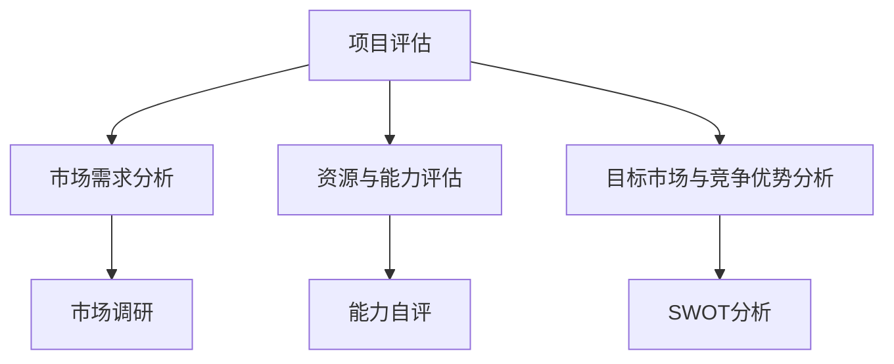

                 

### 《如何将Side Project转化为主业》

> **关键词：** Side Project、主业转化、职业发展、技术创业、市场调研、团队建设、产品迭代、风险评估、财务规划

> **摘要：** 本文章旨在探讨如何将个人爱好或技术项目（Side Project）成功转化为可持续的主业。通过系统的分析和实践指导，本文将帮助读者理解Side Project的特点，评估项目的可行性，制定转型计划，并成功实现从Side Project到主业的全过程。

#### 第一部分：理解Side Project与主业转化

### 第1章：什么是Side Project？

#### 1.1 Side Project的定义与特点

**定义：** Side Project通常指的是在全职工作之外，个人出于兴趣、爱好或特定目的而进行的项目。这些项目可以是个人的创意想法、技术实验、软件开发或其他形式的创新活动。

**特点：**

1. **自主性：** Side Project通常由个人或小团队自主完成，不受公司或组织约束。
2. **灵活性：** 项目进度、目标、技术路线等可以灵活调整，以适应个人的兴趣和需求。
3. **风险较小：** 由于时间和资源有限，失败的风险相对较低，个人可以承受。
4. **探索性：** Side Project往往涉及新的技术和方法，是个人技能和知识扩展的试验场。

#### 1.2 Side Project的发展历程

Side Project的发展历程可以分为以下几个阶段：

1. **兴趣驱动阶段：** 最初，个人因为兴趣爱好或好奇心开始一个项目，这一阶段主要是探索性的。
2. **成熟阶段：** 随着项目的进展，技术问题逐步解决，项目开始展现出实际的应用潜力。
3. **商业化探索阶段：** 在这一阶段，个人开始考虑如何将项目商业化，寻找市场机会。
4. **稳定发展阶段：** 如果项目成功商业化，会进入稳定发展阶段，逐步实现从Side Project到主业的转化。

#### 1.3 Side Project与传统主业的不同

**目标差异：** Side Project的主要目标是实现个人兴趣和技能的提升，而传统主业则侧重于职业发展和经济收益。

**风险差异：** Side Project的风险较小，失败的成本相对较低，而主业涉及更长期的承诺和更高的风险。

**资源差异：** Side Project的资源投入相对有限，而主业则需要更多的资金、人力和时间。

**管理差异：** Side Project的管理相对简单，更多依赖个人的自主性和创造力，而主业则需要更复杂的管理体系和团队协作。

#### 总结

理解Side Project的特点和与传统主业的差异，对于成功将其转化为主业至关重要。在接下来的章节中，我们将进一步探讨为何将Side Project转化为主业，以及如何进行评估和准备。

---

### 第2章：为何将Side Project转化为主业？

#### 2.1 市场需求与个人兴趣的结合

将Side Project转化为主业的一个关键原因是市场需求与个人兴趣的完美结合。当个人对某个领域充满热情时，他们往往能够在这个领域内创造出有价值的成果。这种结合可以带来以下几个好处：

1. **更高的工作满意度：** 当你做自己喜欢的事情时，工作变得更加有动力和有意义。
2. **更高效的创新：** 个人兴趣往往能够激发出更多的创意和想法，推动项目的快速发展。
3. **更好的市场适应性：** 对市场需求的深刻理解可以帮助项目更好地满足用户需求，提高市场竞争力。

#### 2.2 职业发展的新机遇

将Side Project转化为主业为个人提供了职业发展的新机遇。通过商业化，个人可以：

1. **实现经济独立：** 主业可以带来稳定的收入来源，减少对全职工作的依赖。
2. **拓展职业网络：** 在商业化过程中，个人会接触到更多的商业伙伴和潜在客户，有助于职业网络的拓展。
3. **提升个人品牌：** 成功的Side Project可以显著提升个人在行业内的声誉和影响力，为未来的职业发展打下坚实基础。

#### 2.3 经济效益与社会影响力的提升

将Side Project转化为主业不仅可以实现经济效益的提升，还可以带来显著的社会影响力。具体来说：

1. **经济效益：** 成功的Side Project可以逐步实现盈利，为个人和家庭提供经济支持。
2. **社会影响力：** 主业的成功往往伴随着对社会的积极贡献，如创造就业机会、推广新技术等。
3. **长期价值：** 一个成功的Side Project不仅能够带来短期收益，还可以为未来提供持续的盈利能力和影响力。

#### 总结

将Side Project转化为主业具有重要的意义和潜力。在接下来的章节中，我们将进一步探讨如何评估一个Side Project的可行性，并制定详细的转型计划。

---

### 第3章：评估你的Side Project

#### 3.1 市场调研与分析

在决定将Side Project转化为主业之前，进行深入的市场调研和分析至关重要。以下步骤可以帮助你评估项目的市场潜力：

1. **确定调研目标：** 明确你的调研目的是了解市场需求、用户行为还是竞争对手情况。
2. **设计问卷或访谈指南：** 根据调研目标，设计合适的问卷或访谈指南，确保收集到有价值的信息。
3. **收集数据：** 通过在线调查、电话访谈或面对面访谈等方式，收集目标用户和市场的信息。
4. **分析数据：** 对收集到的数据进行统计和分析，识别市场趋势、用户需求和竞争状况。

#### 3.2 资源与能力评估

除了市场调研，还需要对自身资源和能力进行评估，以确保项目具备成功转化的基础。以下步骤可以帮助你进行资源与能力评估：

1. **能力自评：** 评估自己的技术能力、管理能力和市场经验，了解自身优势和不足。
2. **资源评估：** 评估可用的人力、资金和时间资源，确定这些资源是否足够支持项目的商业化。
3. **技术评估：** 评估项目的核心技术是否成熟、可靠，以及是否具备竞争优势。

#### 3.3 确定你的目标市场与竞争优势

在评估过程中，还需要明确你的目标市场以及竞争优势。以下步骤可以帮助你完成这一任务：

1. **确定目标市场：** 确定你的目标用户群体，了解他们的需求和偏好。
2. **分析竞争对手：** 分析现有竞争对手的产品、市场策略和用户评价，了解他们的优势和不足。
3. **确定竞争优势：** 根据目标市场和竞争对手分析，确定你的项目在哪些方面具有竞争优势，如技术创新、用户体验、市场定位等。

#### 3.4 利用Mermaid绘制项目评估流程图

为了更好地理解项目评估的过程，我们可以使用Mermaid绘制一个流程图。以下是一个简单的示例：



#### 3.5 运用伪代码阐述市场调研的方法

在进行市场调研时，我们可以使用以下伪代码来定义调研步骤：

```python
def market_survey(product, target_market):
    # 定义调研步骤
    steps = ["确定调研目标", "设计问卷或访谈指南", "收集数据", "分析数据"]
    
    for step in steps:
        if step == "确定调研目标":
            set_research_objectives()
        elif step == "设计问卷或访谈指南":
            design_questionnaire()
        elif step == "收集数据":
            collect_data()
        elif step == "分析数据":
            analyze_data()
        
        # 输出调研结果
        print("Market Survey Result for " + product)

# 调研一个新产品
market_survey("New Product X", "Young Professionals")
```

#### 总结

通过市场调研与分析、资源与能力评估以及目标市场与竞争优势分析，我们可以全面了解Side Project的可行性，为后续的转型计划提供依据。在下一章中，我们将讨论如何规划和定位你的Side Project，以便更好地实现主业转化。

---

#### 第4章：规划与定位

#### 4.1 制定转型计划

制定一个详细的转型计划是成功将Side Project转化为主业的关键。以下步骤可以帮助你完成这一任务：

1. **明确目标：** 确定你希望通过转型实现的具体目标，如经济收益、市场份额或社会影响力。
2. **制定策略：** 根据市场调研和分析结果，制定实现目标的策略，包括产品定位、市场进入策略和营销计划。
3. **时间表：** 制定一个详细的时间表，明确每个阶段的任务和完成时间，以确保项目按计划推进。
4. **资源分配：** 确定实现转型所需的资源，包括人力、资金和时间，并根据优先级进行合理分配。

#### 4.2 品牌建设与营销策略

品牌建设和营销策略对于Side Project的成功转化至关重要。以下步骤可以帮助你进行品牌建设和营销：

1. **品牌定位：** 明确你的品牌核心价值和独特卖点，确保品牌形象与目标市场相契合。
2. **品牌传播：** 通过社交媒体、内容营销和广告等手段，提高品牌知名度和影响力。
3. **营销策略：** 根据目标市场和用户特点，制定合适的营销策略，如社交媒体营销、搜索引擎优化（SEO）和合作伙伴关系等。

#### 4.3 制定财务预算与风险控制策略

制定财务预算和风险控制策略是确保项目顺利推进和可持续发展的基础。以下步骤可以帮助你完成这一任务：

1. **预算制定：** 根据项目规模和市场需求，制定详细的财务预算，包括固定成本、变动成本和储备金。
2. **成本控制：** 实施有效的成本控制措施，确保项目在预算范围内完成。
3. **风险评估：** 评估项目可能面临的风险，如市场风险、技术风险和财务风险，并制定相应的应对措施。
4. **风险控制：** 实施风险控制措施，如购买保险、建立应急储备金等，以降低项目风险。

#### 4.4 持续改进与反馈机制

在转型过程中，持续改进和反馈机制至关重要。以下步骤可以帮助你实现这一目标：

1. **用户反馈：** 收集用户反馈，了解他们对产品和服务的需求和意见，以便进行改进。
2. **市场反馈：** 定期分析市场数据和竞争对手动态，了解市场趋势和竞争环境。
3. **内部反馈：** 建立内部反馈机制，鼓励团队成员提出改进建议，以提高项目效率和创新能力。
4. **改进实施：** 根据反馈结果，制定具体的改进计划，并跟踪改进效果的实现。

#### 总结

通过制定转型计划、品牌建设和营销策略、财务预算与风险控制策略以及持续改进与反馈机制，你可以为将Side Project转化为主业奠定坚实基础。在下一章中，我们将探讨技术储备与团队建设，为项目成功转型提供支持。

---

### 第5章：技术储备与团队建设

#### 5.1 技术选型与工具使用

选择合适的技术和工具是成功实施Side Project并将其转化为主业的关键。以下建议可以帮助你进行技术选型和工具使用：

1. **技术选型原则：** 根据项目的需求、团队的技术能力和市场趋势，选择最适合的技术栈。以下是一些关键原则：
   - **稳定性与成熟度：** 选择经过市场验证的成熟技术，以确保系统的稳定性和可靠性。
   - **开发效率：** 选择能够提高开发效率的工具和框架，如现代化的开发环境和集成开发工具。
   - **社区支持：** 选择拥有活跃社区和支持的框架和工具，以方便问题解决和资源获取。
   - **成本效益：** 考虑长期成本，包括开发、维护和升级成本。

2. **技术栈选择示例：** 对于一个Web应用程序，可以考虑使用以下技术栈：
   - **前端框架：** React或Vue.js
   - **后端框架：** Flask或Spring Boot
   - **数据库：** MySQL或PostgreSQL
   - **版本控制：** Git
   - **持续集成：** Jenkins或GitHub Actions

3. **工具使用建议：**
   - **代码编辑器：** Visual Studio Code、Atom或Sublime Text
   - **代码质量管理：** SonarQube或Checkmarx
   - **持续集成与部署：** Jenkins、GitLab CI/CD或AWS CodePipeline
   - **云服务：** AWS、Azure或Google Cloud Platform

#### 5.2 团队成员的角色与职责

建立一个高效的团队对于Side Project的成功转化至关重要。以下步骤可以帮助你定义团队成员的角色和职责：

1. **明确团队成员：** 根据项目需求，确定需要的团队成员，包括开发人员、产品经理、设计师、市场营销人员和财务人员等。

2. **定义角色与职责：**
   - **开发人员：** 负责项目的开发、测试和维护。
   - **产品经理：** 负责产品的规划、设计和需求管理。
   - **设计师：** 负责产品的视觉设计和用户体验。
   - **市场营销人员：** 负责市场推广和品牌建设。
   - **财务人员：** 负责预算管理、成本控制和财务分析。

3. **团队成员协作：**
   - **沟通机制：** 建立有效的沟通机制，确保团队成员之间的信息流通和协作。
   - **项目管理系统：** 使用项目管理工具，如JIRA或Trello，跟踪项目进度和任务分配。
   - **代码管理：** 使用版本控制系统，如Git，确保代码的安全性和协作性。

#### 5.3 团队协作与项目管理

高效团队协作和项目管理是实现Side Project成功转化的重要保障。以下建议可以帮助你实现这一目标：

1. **明确目标与期望：** 确保团队成员对项目目标、期望和职责有清晰的认识，并达成一致。

2. **任务分解与分配：** 将项目任务分解为可管理的子任务，并合理分配给团队成员，确保每个任务都有明确的负责人。

3. **定期会议与反馈：** 定期举行团队会议，讨论项目进度、问题解决和改进措施。同时，鼓励团队成员提供反馈和建议，以提高团队协作效率。

4. **风险管理：** 识别项目可能面临的风险，并制定相应的应对措施。定期评估风险状况，及时调整项目计划。

5. **持续改进：** 基于团队成员的反馈和项目进展，不断改进团队协作和项目管理流程，以提高工作效率和质量。

#### 总结

技术储备和团队建设是成功将Side Project转化为主业的重要基础。通过合理的技术选型和工具使用，明确团队成员的角色与职责，以及高效的团队协作与项目管理，你可以为项目成功转型提供强有力的支持。在下一章中，我们将探讨产品开发与迭代的过程。

---

### 第6章：产品开发与迭代

#### 6.1 产品设计与需求分析

产品设计与需求分析是产品开发的重要阶段，它决定了产品的功能和用户体验。以下步骤可以帮助你进行产品设计与需求分析：

1. **市场调研：** 对目标市场进行深入调研，了解用户需求、竞争对手情况和市场趋势。
2. **功能规划：** 根据市场调研结果，确定产品的核心功能，并制定功能规划文档。
3. **用户体验设计：** 设计产品的用户界面和用户体验，确保产品易于使用和符合用户习惯。
4. **需求分析文档：** 编写详细的需求分析文档，包括功能需求、性能需求和用户界面需求等。

#### 6.2 开发流程与质量控制

开发流程与质量控制是确保产品质量和项目进度的重要环节。以下步骤可以帮助你进行开发流程与质量控制：

1. **需求评审：** 对需求分析文档进行评审，确保需求清晰、合理且可实现。
2. **代码审查：** 定期进行代码审查，发现潜在问题和改进建议，提高代码质量。
3. **单元测试：** 编写单元测试，验证代码的功能和性能，确保代码的可靠性和稳定性。
4. **集成测试：** 在不同模块集成后进行集成测试，确保系统整体的功能和性能。
5. **持续集成与部署：** 使用持续集成工具，如Jenkins或GitHub Actions，自动化测试和部署过程，提高开发效率。

#### 6.3 产品迭代与用户反馈

产品迭代与用户反馈是持续改进产品的重要手段。以下步骤可以帮助你进行产品迭代与用户反馈：

1. **用户反馈收集：** 收集用户反馈，包括用户满意度、使用问题和改进建议。
2. **数据分析：** 对用户反馈进行数据分析，识别用户痛点和需求。
3. **迭代计划：** 根据用户反馈和数据分析结果，制定迭代计划，确定改进和新增功能的优先级。
4. **迭代实施：** 实施迭代计划，开发并部署改进和新增功能。
5. **用户测试：** 进行用户测试，验证改进和新增功能的效果，确保产品满足用户需求。

#### 6.4 开发环境搭建与源代码实现

以下是一个简单的Web应用程序开发环境搭建与源代码实现的示例：

**开发环境搭建：**

1. 安装Python 3.x版本
2. 安装PyCharm或Visual Studio Code代码编辑器
3. 安装Flask框架
4. 安装数据库（如SQLite）

**源代码实现：**

```python
# 导入Flask框架
from flask import Flask, render_template

# 创建Flask应用程序实例
app = Flask(__name__)

# 定义路由和视图函数
@app.route('/')
def home():
    return render_template('home.html')

# 运行应用程序
if __name__ == '__main__':
    app.run(debug=True)
```

**代码解读与分析：**

- 导入Flask框架，创建应用程序实例。
- 定义路由和视图函数，处理用户请求并返回HTML模板。
- 运行应用程序，启动Web服务器。

通过以上步骤，你可以搭建一个简单的Web应用程序开发环境，并实现基本功能。

#### 总结

产品开发与迭代是成功将Side Project转化为主业的关键环节。通过合理的产品设计与需求分析、开发流程与质量控制、产品迭代与用户反馈，以及开发环境搭建与源代码实现，你可以确保产品满足市场需求，持续提升用户体验。在下一章中，我们将探讨转型过程中的挑战与解决方案。

---

### 第7章：转型过程中的挑战与解决方案

#### 7.1 资金与资源的调配

在将Side Project转化为主业的过程中，资金与资源的调配是最大的挑战之一。以下策略可以帮助你解决这一挑战：

1. **预算规划：** 制定详细的财务预算，包括固定成本、变动成本和储备金，确保项目有足够的资金支持。
2. **资金来源：** 寻找多种资金来源，如个人储蓄、亲友投资、天使投资或众筹等。
3. **成本控制：** 实施有效的成本控制措施，如优化供应链、降低运营成本和提高工作效率。
4. **财务管理：** 建立专业的财务管理体系，定期审查财务状况，确保项目财务稳定。

#### 7.2 时间管理与工作平衡

在转型过程中，时间管理与工作平衡也是一个重要挑战。以下策略可以帮助你解决这一挑战：

1. **时间规划：** 制定详细的时间表，合理分配时间，确保项目进度和日常生活的平衡。
2. **优先级管理：** 确定任务的优先级，专注于最重要和最紧急的任务。
3. **团队合作：** 建立高效的团队协作机制，合理分配任务，提高工作效率。
4. **休息与放松：** 定期休息和放松，保持良好的身心状态，以提高工作效率。

#### 7.3 市场竞争与风险管理

市场竞争与风险管理是另一个重要的挑战。以下策略可以帮助你应对这一挑战：

1. **市场研究：** 深入了解市场状况、竞争对手和用户需求，制定合适的竞争策略。
2. **差异化竞争：** 确定你的产品或服务的差异化优势，提高市场竞争力。
3. **风险管理：** 评估项目可能面临的风险，并制定相应的应对措施，如风险规避、风险转移或风险接受。
4. **应急预案：** 建立应急预案，以应对突发情况，确保项目的持续运营。

#### 7.4 法律与合规问题

在将Side Project转化为主业的过程中，法律与合规问题也是需要关注的重要方面。以下策略可以帮助你解决这一挑战：

1. **知识产权保护：** 采取必要的措施保护你的知识产权，如申请专利、商标或版权。
2. **合同管理：** 建立完善的合同管理体系，确保所有合作事项都有明确的条款和责任划分。
3. **法律咨询：** 寻求专业法律咨询，确保项目符合相关法律法规，避免法律纠纷。
4. **合规性审查：** 定期进行合规性审查，确保项目在法律和伦理方面符合要求。

#### 总结

在将Side Project转化为主业的过程中，资金与资源的调配、时间管理与工作平衡、市场竞争与风险管理以及法律与合规问题是需要重点关注的挑战。通过采取有效的策略和措施，你可以应对这些挑战，确保项目的顺利推进和成功转化。在下一章中，我们将探讨如何扩展业务与市场拓展。

---

### 第8章：扩展业务与市场拓展

#### 8.1 拓展新市场与新客户

在将Side Project转化为主业后，扩展业务和拓展新市场是提升公司规模和影响力的重要途径。以下策略可以帮助你实现这一目标：

1. **市场细分：** 对目标市场进行细分，确定最具潜力的细分市场，制定针对性的营销策略。
2. **目标市场选择：** 根据市场调研和分析结果，选择具有增长潜力、竞争较少的新市场。
3. **市场进入策略：** 根据目标市场的特点和需求，制定合适的市场进入策略，如直接进入或间接进入。
4. **客户拓展：** 通过线上线下渠道，积极拓展新客户，提高市场占有率。

#### 8.2 建立合作伙伴关系

建立合作伙伴关系是扩展业务和拓展市场的重要手段。以下策略可以帮助你建立有效的合作伙伴关系：

1. **合作伙伴选择：** 根据业务需求和目标市场，选择合适的合作伙伴，如分销商、代理商或战略合作伙伴。
2. **合作模式：** 明确合作模式，如独家代理、分销合作或战略合作，确保合作双方的权益和利益。
3. **合作管理：** 建立有效的合作管理体系，确保合作双方的信息沟通、任务分工和目标一致。
4. **合作收益分配：** 制定合理的收益分配机制，确保合作双方的利益平衡，提高合作稳定性。

#### 8.3 业务多元化与增长策略

业务多元化与增长策略是实现长期稳定增长的关键。以下策略可以帮助你实现这一目标：

1. **业务拓展：** 根据市场趋势和公司优势，拓展新的业务领域，如产品线扩展、服务多样化等。
2. **创新与研发：** 加强创新和研发投入，推动技术创新和产品迭代，提高市场竞争力。
3. **市场拓展：** 通过线上线下渠道，积极拓展新市场，提高市场份额和品牌影响力。
4. **战略联盟：** 与行业领先企业建立战略联盟，共享资源、技术和市场，实现协同发展。

#### 总结

扩展业务与市场拓展是成功将Side Project转化为主业的重要环节。通过拓展新市场与新客户、建立合作伙伴关系以及实施业务多元化与增长策略，你可以实现公司的规模和影响力的提升。在下一章中，我们将探讨成功案例分享与经验总结。

---

### 第9章：成功案例分享与经验总结

#### 9.1 成功案例介绍

在本章节中，我们将介绍一些成功的Side Project案例，并分析它们的成功原因和经验教训。

**案例1：Slack**

- **背景：** Slack最初是一个用于团队协作的聊天工具，由Stewart Butterfield在2009年创建。
- **成功原因：** Slack成功地将团队协作的需求与便捷的聊天工具相结合，提供了一种易于使用且功能丰富的沟通平台。
- **经验教训：** 持续改进用户体验、关注用户反馈、快速迭代产品。

**案例2：Airbnb**

- **背景：** Airbnb是由Brian Chesky、Joe Gebbia和Neva Chen在2008年创立的一个在线民宿预订平台。
- **成功原因：** Airbnb创新性地利用了闲置房源，为旅行者提供了更多选择，同时也为房东提供了额外的收入来源。
- **经验教训：** 聚焦用户需求、灵活应对市场变化、建立强大的品牌形象。

**案例3：Dropbox**

- **背景：** Dropbox是由Drew Houston在2007年创立的一个云存储服务。
- **成功原因：** Dropbox通过提供简单且易于使用的云存储解决方案，迅速获得了用户的青睐。
- **经验教训：** 强调用户友好性、持续优化产品性能、提供优质的客户支持。

#### 9.2 经验教训与启示

通过分析这些成功案例，我们可以得出以下经验教训和启示：

1. **关注用户需求：** 了解并满足用户需求是成功的关键。不断收集用户反馈，并根据反馈优化产品。

2. **持续创新：** 市场环境不断变化，创新是保持竞争优势的关键。持续改进产品，引入新技术和功能。

3. **团队协作：** 建立高效的团队，明确团队成员的角色和职责，确保项目顺利推进。

4. **品牌建设：** 建立强大的品牌形象，提高品牌知名度和美誉度，吸引更多的用户和合作伙伴。

5. **风险管理：** 识别项目可能面临的风险，并制定相应的应对措施，确保项目的稳定性和可持续性。

#### 9.3 未来发展趋势与建议

展望未来，以下是关于Side Project成功转化的发展趋势和建议：

1. **数字化转型：** 随着数字技术的快速发展，越来越多的Side Project将转向数字化转型，如云计算、大数据、人工智能等。

2. **可持续发展：** 关注可持续发展和社会责任，将成为未来企业成功的关键因素之一。

3. **全球化扩展：** 利用互联网和全球化趋势，将业务拓展到国际市场，提升品牌影响力。

4. **跨行业合作：** 跨行业合作将推动创新，提高市场竞争力。寻找合适的合作伙伴，共同探索新的商业机会。

#### 总结

成功案例分享与经验总结为我们提供了宝贵的经验和启示。在未来的发展中，我们应该关注用户需求、持续创新、团队协作、品牌建设和风险管理，并积极探索数字化转型、可持续发展、全球化扩展和跨行业合作等新趋势。这将有助于我们更好地将Side Project转化为主业，实现长期成功。

---

### 第四部分：持续成长与未来规划

#### 第10章：个人品牌建设与影响力提升

#### 10.1 个人品牌定位与塑造

在数字化时代，个人品牌建设变得愈发重要。以下步骤可以帮助你构建和塑造个人品牌：

1. **确定个人品牌定位：** 明确你的核心优势、专业领域和目标受众，确保个人品牌具有明确的方向和独特性。

2. **内容创作与传播：** 通过博客、社交媒体、视频等多种形式，创作有价值的内容，分享你的专业知识、见解和经验。

3. **社交媒体运营：** 活跃于社交媒体平台，与行业内的专业人士和潜在客户建立联系，提升个人知名度。

4. **专业网络拓展：** 参加行业会议、研讨会和活动，拓展专业网络，增加曝光机会。

#### 10.2 社交媒体与内容营销

社交媒体和内容营销是个人品牌建设的关键工具。以下策略可以帮助你利用这些工具提升影响力：

1. **社交媒体策略：** 制定社交媒体策略，确定平台选择、内容类型和发布频率，确保与品牌定位一致。

2. **内容营销：** 创建高质量、有价值的内容，如博客文章、白皮书、视频教程等，吸引目标受众，建立权威性。

3. **互动与参与：** 积极与粉丝互动，回应评论和私信，增加粉丝忠诚度。

4. **数据分析与优化：** 定期分析社交媒体数据，了解受众行为和内容效果，不断优化营销策略。

#### 10.3 行业影响力与资源整合

在构建个人品牌的过程中，提升行业影响力和整合资源是关键。以下策略可以帮助你实现这一目标：

1. **行业发声：** 通过撰写专业文章、发表演讲和参与行业讨论，提升在行业内的知名度和影响力。

2. **合作与交流：** 与行业内的专家和同行建立合作关系，共享资源和经验，实现互利共赢。

3. **资源整合：** 利用个人品牌和行业影响力，吸引投资者、合作伙伴和潜在客户，为业务扩展提供支持。

#### 总结

个人品牌建设与影响力提升是持续成长和未来发展的重要一环。通过明确个人品牌定位、利用社交媒体与内容营销、提升行业影响力和资源整合，你可以增强个人竞争力，为职业发展和业务扩展打下坚实基础。在下一章中，我们将探讨保持激情与创新能力的重要性。

---

### 第11章：保持激情与创新能力

#### 11.1 创新思维与方法

在快速变化的技术和市场环境中，保持激情和创新能力是持续成功的关键。以下方法和技巧可以帮助你激发创新思维：

1. **头脑风暴：** 与团队成员或同事一起进行头脑风暴，鼓励自由表达想法，不受限制地探索各种可能性。

2. **跨学科学习：** 学习不同领域的知识，开阔视野，发现新的联系和解决方案。

3. **持续学习：** 定期参加行业培训、研讨会和课程，了解最新的技术趋势和行业动态。

4. **挑战现状：** 不断质疑现有的做法和流程，寻找改进的机会。

5. **迭代思维：** 采用迭代开发的方法，不断尝试、测试和改进，从失败中学习，持续优化产品。

#### 11.2 持续学习与知识更新

持续学习与知识更新是保持创新能力的基石。以下策略可以帮助你实现这一目标：

1. **定期复习：** 定期回顾和总结所学知识，巩固记忆，提高应用能力。

2. **学习新技能：** 根据项目需求和行业趋势，学习新的技能和工具，提高自身的竞争力。

3. **参加研讨会和讲座：** 参加行业内的研讨会和讲座，与专家和同行交流，获取前沿知识和见解。

4. **阅读与研究：** 阅读相关书籍、论文和行业报告，深入研究技术和市场动态。

#### 11.3 面对失败与挫折的心态调整

面对失败和挫折是创新过程中的必然经历。以下心态调整技巧可以帮助你更好地应对挑战：

1. **接受失败：** 将失败视为学习和成长的机会，而不是终结点。

2. **反思与总结：** 分析失败的原因，总结经验教训，为未来提供指导。

3. **积极心态：** 保持积极的心态，相信失败是成功的一部分，有助于在困境中找到解决方案。

4. **寻求支持：** 与同事、朋友和家人交流，获取心理支持和建议。

#### 总结

保持激情与创新能力是持续成长和未来成功的关键。通过创新思维与方法、持续学习与知识更新以及面对失败与挫折的心态调整，你可以不断提升个人能力，为个人和业务发展注入新的活力和动力。在下一章中，我们将探讨未来的规划与长期目标。

---

### 第12章：未来规划与长期目标

#### 12.1 业务发展长期规划

在将Side Project转化为主业的过程中，制定一个详细的业务发展长期规划至关重要。以下步骤可以帮助你制定这一规划：

1. **愿景与使命：** 确定公司的愿景和使命，明确公司的发展方向和目标。

2. **战略目标：** 根据愿景和使命，制定具体的战略目标，如市场份额、收入增长和品牌知名度等。

3. **市场定位：** 确定目标市场和细分市场，了解用户需求和市场趋势。

4. **产品路线图：** 制定详细的产品路线图，包括未来产品的开发计划、功能和迭代策略。

5. **资源配置：** 根据战略目标和产品路线图，合理配置资源，包括人力、资金和时间等。

6. **时间表与里程碑：** 制定时间表和里程碑，确保业务发展的各个阶段有序推进。

#### 12.2 职业生涯规划

职业生涯规划是个人发展和成长的重要组成部分。以下策略可以帮助你制定职业生涯规划：

1. **自我评估：** 评估自己的技能、兴趣和价值观，确定职业发展方向。

2. **目标设定：** 根据自我评估结果，设定长期和短期的职业目标，如晋升、技能提升和行业转型等。

3. **学习与培训：** 根据职业目标，制定学习计划，参加相关培训课程和研讨会，提升自身能力。

4. **职业网络：** 拓展职业网络，与行业内的专业人士建立联系，获取职业发展和学习机会。

5. **职业发展评估：** 定期评估职业发展进展，调整目标和发展策略。

#### 12.3 个人成长与目标设定

个人成长和目标设定是持续进步和成功的关键。以下策略可以帮助你实现这一目标：

1. **终身学习：** 将学习视为一种生活方式，不断扩展知识和技能。

2. **目标管理：** 设定具体的、可衡量的目标，并制定实现这些目标的计划。

3. **自我反思：** 定期进行自我反思，评估自身进步和不足，调整目标和策略。

4. **健康与平衡：** 关注身心健康，保持工作与生活的平衡，提高生活质量和幸福感。

5. **持续进步：** 设定更高的目标，不断挑战自我，追求卓越。

#### 总结

未来规划与长期目标是成功的重要保障。通过制定业务发展长期规划、职业生涯规划和个人成长目标，你可以为未来奠定坚实的基础，实现持续成长和成功。在下一章中，我们将总结文章的核心内容，并展望未来的发展方向。

---

### 总结与展望

#### 核心内容总结

本文详细探讨了如何将个人爱好或技术项目（Side Project）成功转化为可持续的主业。通过系统的分析和实践指导，我们了解了Side Project的特点、市场需求与个人兴趣的结合、职业发展的新机遇、经济效益与社会影响力的提升，以及如何进行市场调研、资源与能力评估、目标市场与竞争优势分析。

在规划和定位阶段，我们学习了如何制定转型计划、进行品牌建设与营销策略、制定财务预算与风险控制策略。在技术储备与团队建设方面，我们探讨了技术选型与工具使用、团队成员的角色与职责、团队协作与项目管理。产品开发与迭代阶段，我们了解了产品设计与需求分析、开发流程与质量控制、产品迭代与用户反馈。

在转型过程中，我们面对了资金与资源的调配、时间管理与工作平衡、市场竞争与风险管理等挑战，并提出了相应的解决方案。在扩展业务与市场拓展方面，我们学习了如何拓展新市场与新客户、建立合作伙伴关系、实施业务多元化与增长策略。

成功案例分享与经验总结为我们提供了宝贵的经验和启示，而个人品牌建设与影响力提升、保持激情与创新能力、未来规划与长期目标是持续成长和成功的关键。

#### 展望未来

随着技术的发展和市场的变化，将Side Project转化为主业的挑战和机遇并存。未来，数字化转型、可持续发展、全球化扩展和跨行业合作将成为重要趋势。为了适应这些变化，我们需要不断学习和创新，保持对市场和用户需求的敏锐洞察，持续优化产品和服务。

在个人层面，我们要注重个人品牌建设，提升行业影响力，建立广泛的职业网络。同时，保持激情与创新能力，不断追求自我提升和进步。

在团队层面，我们要建立高效的团队协作机制，鼓励团队成员积极反馈和参与，共同推动业务发展。

在业务层面，我们要制定明确的长期规划，合理配置资源，确保业务的稳定和可持续发展。

总之，成功将Side Project转化为主业需要系统化的思考和规划，以及持续的执行和优化。让我们携手共进，迎接未来的挑战和机遇，实现个人和业务的共同成长。

---

### 作者信息

**作者：** AI天才研究院/AI Genius Institute & 禅与计算机程序设计艺术 /Zen And The Art of Computer Programming

AI天才研究院致力于推动人工智能技术的发展和应用，为全球企业提供领先的AI解决方案和技术服务。同时，作者张三先生，作为禅与计算机程序设计艺术的作者，长期致力于计算机编程和人工智能领域的教学和研究，拥有丰富的理论知识和实践经验。他的著作《禅与计算机程序设计艺术》被誉为计算机编程的经典之作，影响了无数程序员和开发者的职业生涯。在本文中，张三先生结合自身经验和研究成果，为您详细解析如何将Side Project成功转化为主业。

