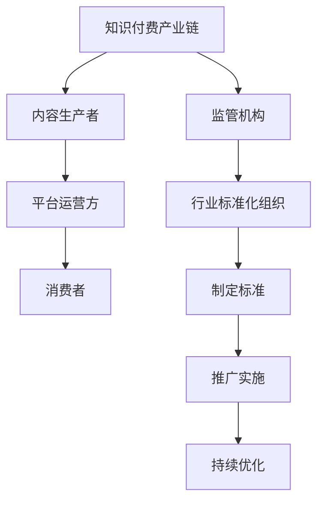

                 

# 《如何建立知识付费领域的行业标准和规范》

## 关键词

知识付费、行业标准、规范建设、流程、案例分析、技术解析、算法、代码实践、行业监管

## 摘要

随着知识付费领域的快速发展，行业标准和规范的建立显得尤为重要。本文从多个维度详细探讨了如何建立知识付费领域的行业标准和规范。首先，分析了知识付费领域的现状与挑战，阐述了行业标准和规范的意义与作用。接着，介绍了标准制定的基本流程、标准内容的制定、标准实施与推广的方法，以及行业规范的建设过程。随后，通过国内外案例分析，总结了知识付费行业的标准化实践经验。最后，提出了具体的实战指南，帮助知识付费平台建立和完善标准化体系。本文旨在为行业从业者提供有价值的参考，推动知识付费行业的健康发展。

----------------------------------------------------------------

### 第一部分：引言与背景

#### 1.1 知识付费领域的现状与挑战

知识付费，作为一种新型的商业模式，近年来在全球范围内迅速崛起。它指的是通过互联网平台，将专业的知识、技能、经验等内容以付费形式提供给用户，实现了知识的商品化。知识付费领域的崛起，不仅满足了用户对高质量内容的渴求，也极大地激发了内容创作者的积极性，形成了一个庞大的市场。

**知识付费的定义与市场分析**

知识付费，顾名思义，就是用户为了获取特定的知识或服务，自愿支付费用的一种行为。它涵盖的内容非常广泛，包括在线课程、专业咨询、研究报告、电子书、在线问答等。随着移动互联网和云计算技术的普及，知识付费市场呈现出爆发式增长。据相关数据显示，全球知识付费市场规模已经突破千亿，并且预计还将持续扩大。

在知识付费市场中，参与者主要包括内容生产者、平台运营方和消费者。内容生产者负责创作和提供高质量的知识产品；平台运营方负责搭建和运营知识付费平台，为生产者和消费者提供交易和服务支持；消费者则是知识付费市场的主要需求方，他们通过付费获取所需的知识和服务。

**行业发展中面临的问题与挑战**

尽管知识付费领域发展迅速，但同时也面临着一系列的问题与挑战。

1. **质量问题**

由于知识付费市场门槛相对较低，导致市场上存在大量质量参差不齐的内容。一些内容创作者为了追求流量和收益，可能降低内容质量，甚至制造虚假信息。这种质量问题不仅影响了消费者的体验，也对整个行业的信誉造成了负面影响。

2. **同质化竞争**

知识付费市场中的内容同质化现象严重，许多平台和内容创作者都在争夺相同的用户群体。这种同质化竞争导致了价格战、恶意竞争等不良现象，影响了行业的健康发展。

3. **用户体验**

知识付费平台在用户体验方面存在一定的问题，如内容推荐不准确、支付流程繁琐、学习进度无法跟踪等。这些问题影响了消费者的满意度和忠诚度，限制了市场的进一步扩大。

4. **法律法规**

知识付费领域缺乏统一的法律法规和标准，导致市场秩序混乱。一些内容创作者和平台运营方可能存在违法行为，如侵犯知识产权、欺诈消费者等。这些违法行为不仅损害了消费者权益，也影响了整个行业的健康发展。

**标准化和规范化的意义与作用**

为了解决知识付费领域面临的问题与挑战，建立行业标准和规范显得尤为重要。

1. **提升质量**

行业标准和规范可以对内容创作和平台运营提出具体要求，确保内容质量。通过制定质量标准和评价体系，可以激励内容创作者提高内容质量，减少虚假信息和低质量内容。

2. **规范市场**

行业标准和规范可以规范市场行为，打击违法行为，维护市场秩序。通过制定法律法规和标准，可以明确各方权责，防止恶意竞争，保护消费者权益。

3. **提升用户体验**

行业标准和规范可以改善用户体验，提高消费者满意度和忠诚度。通过制定用户体验标准，可以优化平台功能和服务流程，提升用户的满意度。

4. **促进行业发展**

行业标准和规范可以促进行业健康、可持续发展。通过标准化和规范化，可以提高行业的整体水平，吸引更多优秀的人才和资本进入市场，推动行业的长期发展。

#### 1.2 行业标准与规范的重要性

**行业标准与规范的基础概念**

行业标准与规范是指在一定行业内，为了确保产品质量、服务质量、操作流程等方面的一致性，所制定的一系列标准和规范。它们通常由行业内的专业机构或行业协会制定，具有指导性和约束力。

**行业标准与规范在知识付费领域的具体应用**

在知识付费领域，行业标准和规范的应用主要体现在以下几个方面：

1. **内容质量标准**

内容质量标准是对知识产品的基本质量要求。它包括内容的专业性、准确性、完整性、创新性等方面。通过制定内容质量标准，可以确保知识产品的质量，提升消费者的满意度。

2. **平台运营标准**

平台运营标准是对知识付费平台的基本运营要求。它包括平台的安全性、稳定性、用户体验、内容推荐等方面。通过制定平台运营标准，可以规范平台运营行为，提升平台服务质量。

3. **交易流程标准**

交易流程标准是对知识付费交易流程的要求。它包括支付方式、退款政策、售后服务等方面。通过制定交易流程标准，可以保障消费者的权益，提升交易体验。

4. **法律法规标准**

法律法规标准是对知识付费领域相关法律法规的要求。它包括知识产权保护、消费者权益保护、信息安全等方面。通过制定法律法规标准，可以确保知识付费领域的合法合规，维护市场秩序。

**国际国内相关法规与标准概述**

在国际上，知识付费领域的相关法规和标准主要由各国政府和行业协会制定。例如，美国制定了《数字千年版权法案》（DMCA），对知识产权保护提出了具体要求。欧盟制定了《通用数据保护条例》（GDPR），对个人信息保护提出了严格的规定。这些法规和标准为知识付费领域提供了法律保障，促进了行业的健康发展。

在国内，知识付费领域的相关法规和标准主要由国家相关部门和行业协会制定。例如，国家版权局发布了《网络版权管理技术标准》，对网络版权保护提出了技术要求。中国电子商务协会制定了《知识付费服务规范》，对知识付费平台的基本运营要求进行了规定。这些法规和标准为知识付费领域的规范化发展提供了重要支持。

#### 1.1.1 知识付费领域的 Mermaid 流程图



#### 1.1.2 AI大模型中的核心算法伪代码

```python
# 大模型训练伪代码

# 初始化模型参数
model = initialize_model()

# 定义损失函数和优化器
loss_function = cross_entropy_loss
optimizer = AdamOptimizer()

# 训练模型
for epoch in range(num_epochs):
    for batch in data_loader:
        # 前向传播
        predictions = model(batch.x)
        loss = loss_function(predictions, batch.y)
        
        # 反向传播
        gradients = compute_gradients(loss, model.parameters())
        
        # 更新模型参数
        optimizer.update_parameters(gradients)
        
    print(f"Epoch {epoch+1}: Loss = {loss}")
```

#### 1.2.3 数学模型和数学公式的详细讲解

##### 损失函数

损失函数是深度学习中的一个关键组成部分，用于衡量预测值与真实值之间的差异。在二分类问题中，常见的损失函数是交叉熵损失函数（Cross-Entropy Loss），其公式如下：

$$
J(\theta) = -\frac{1}{m}\sum_{i=1}^{m} [y^{(i)} \log(a^{(i)}_1) + (1 - y^{(i)}) \log(1 - a^{(i)}_1)]
$$

其中，$m$ 表示样本数量，$y^{(i)}$ 是第 $i$ 个样本的真实标签，$a^{(i)}_1$ 是模型预测的概率分布。

##### 激活函数

在深度学习中，激活函数用于引入非线性的特性，使得模型能够拟合复杂的数据。常用的激活函数有：

1. **Sigmoid函数**

$$
\sigma(z) = \frac{1}{1 + e^{-z}}
$$

2. **ReLU函数**

$$
\text{ReLU}(z) = \max(0, z)
$$

3. **Tanh函数**

$$
\tanh(z) = \frac{e^z - e^{-z}}{e^z + e^{-z}}
$$

这些激活函数在深度学习模型中起到了至关重要的作用，它们能够帮助模型更好地拟合数据并提高模型的性能。

#### 1.3 小结

知识付费领域作为互联网经济的重要组成部分，具有巨大的市场潜力和发展前景。然而，行业发展中面临的质量问题、同质化竞争、用户体验问题以及法律法规问题等，都需要通过建立行业标准和规范来解决。行业标准与规范不仅能够提升内容质量、规范市场行为，还能够改善用户体验、促进行业健康发展。国内外已有的相关法规和标准为知识付费领域的规范化发展提供了重要支持。在接下来的部分，我们将详细探讨如何制定和实施行业标准和规范。

----------------------------------------------------------------

### 第二部分：标准制定流程

在知识付费领域，建立行业标准和规范是一个系统性和复杂性的过程，涉及到从需求分析到标准实施和推广的多个环节。本节将详细解析标准制定的基本流程，包括组织与机构、准备阶段、制定阶段、审查和发布阶段等。

#### 2.1 标准制定的基本流程

**2.1.1 标准制定的组织与机构**

标准制定的首先需要一个权威的组织或机构来负责。在国际上，这类组织通常是非政府组织，如国际标准化组织（ISO）、国际电工委员会（IEC）等。在国内，则有中国国家标准委、中国标准化协会等专业机构。这些机构负责制定、发布和推广国家标准，确保标准的一致性和权威性。

在知识付费领域，通常由行业协会、专业机构或企业联盟来牵头制定行业标准和规范。例如，中国电子商务协会、中国信息通信研究院等，都积极参与知识付费领域的标准制定工作。这些组织通常具有丰富的行业经验和专业知识，能够更好地把握行业发展趋势和需求，制定出具有指导性和可操作性的标准。

**2.1.2 标准制定的准备阶段**

标准制定的准备阶段是整个流程的基础，主要包括以下几个步骤：

1. **需求分析**：通过对市场调研、行业调研、用户调研等方式，分析知识付费领域的需求和问题，确定标准制定的必要性。

2. **制定计划**：根据需求分析结果，制定详细的标准制定计划，明确标准的内容、范围、时间节点等。

3. **组建工作组**：根据标准制定的计划，组建专业的工作组，通常包括行业专家、技术专家、企业代表等。工作组的职责是参与标准的讨论、制定、审查和推广。

4. **收集资料**：收集国内外相关标准和资料，为标准制定提供参考和依据。

**2.1.3 标准制定的制定阶段**

制定阶段是标准制定的核心环节，主要包括以下几个步骤：

1. **起草标准文本**：工作组根据需求分析和资料收集结果，起草标准文本。标准文本通常包括标准名称、范围、定义、要求、测试方法等内容。

2. **征求意见**：将标准文本征求意见，广泛收集行业内的意见和建议，对标准文本进行修订和完善。

3. **讨论与评审**：组织专家和行业代表对标准文本进行讨论和评审，确保标准的科学性、合理性和可操作性。

4. **制定标准草案**：根据讨论和评审的结果，形成标准草案，提交给相关机构进行审查。

**2.1.4 标准制定的审查和发布阶段**

审查和发布阶段是确保标准质量和权威性的关键环节，主要包括以下几个步骤：

1. **审查**：标准草案提交给相关机构或组织进行审查。审查内容包括标准的内容、格式、一致性、可操作性等。

2. **发布**：审查通过后，标准正式发布，成为具有法律效力的文件。

3. **推广**：通过多种渠道推广新标准，提高行业内的认知度和接受度。

4. **实施与监督**：在新标准实施过程中，对相关企业和机构进行监督，确保标准得到有效执行。

#### 2.2 标准内容的制定

**2.2.1 标准文本的编写规范**

标准文本的编写规范是确保标准质量的重要保障。编写标准文本时，需要遵循以下规范：

1. **格式规范**：标准文本应采用统一的格式，包括封面、目录、正文、附录等部分。

2. **内容规范**：标准文本的内容应完整、清晰、逻辑严密。通常包括标准名称、范围、定义、要求、测试方法等内容。

3. **表述规范**：标准文本的表述应准确、简练、易懂。避免使用模糊、歧义的语言。

4. **引用规范**：标准文本中引用的相关标准或文献，应按照规范进行标注和引用。

**2.2.2 技术规范与标准内容的制定**

技术规范是标准内容的重要组成部分，它通常包括以下内容：

1. **技术要求**：明确知识产品的技术要求，包括内容格式、数据结构、传输协议等。

2. **测试方法**：提供知识产品的测试方法，确保知识产品符合技术要求。

3. **数据标准**：定义知识产品相关的数据标准，包括数据格式、数据交换标准等。

4. **接口规范**：定义知识产品之间的接口规范，确保不同系统之间的数据交换和协同工作。

**2.2.3 标准验证与测试方法**

标准验证与测试方法是确保标准有效性的重要手段。标准验证通常包括以下步骤：

1. **验证方案**：制定详细的验证方案，明确验证的目标、方法、步骤等。

2. **验证执行**：根据验证方案，执行验证工作，包括测试、评估、反馈等。

3. **验证报告**：编写验证报告，总结验证结果，提出改进建议。

标准测试方法通常包括以下几种：

1. **功能测试**：测试知识产品的功能是否符合技术要求。

2. **性能测试**：测试知识产品的性能，如响应时间、处理能力等。

3. **安全测试**：测试知识产品的安全性，如数据保护、访问控制等。

4. **兼容性测试**：测试知识产品与其他系统的兼容性。

#### 2.3 标准的实施与推广

**2.3.1 标准推广的策略和途径**

标准推广是确保标准得到有效执行的重要环节。以下是一些常见的标准推广策略和途径：

1. **政策支持**：通过政府政策支持，鼓励企业和机构执行标准。

2. **行业宣传**：通过行业协会、媒体等渠道，广泛宣传标准，提高行业内的认知度和接受度。

3. **教育培训**：开展标准培训和教育，提高行业从业者的标准意识和能力。

4. **技术支持**：提供技术支持和咨询服务，帮助企业解决在标准实施过程中遇到的问题。

**2.3.2 行业协会和政府机构在标准推广中的作用**

行业协会和政府机构在标准推广中起着至关重要的作用。行业协会通常通过以下方式推动标准推广：

1. **组织活动**：组织标准研讨会、论坛等活动，促进标准交流和应用。

2. **制定指南**：制定标准实施指南，为企业提供具体实施指导。

3. **建立平台**：建立标准推广平台，提供标准查询、下载、实施指导等服务。

政府机构则通过以下方式推动标准推广：

1. **立法保障**：制定相关法律法规，确保标准得到强制执行。

2. **监管执法**：加强对企业和机构的监管，确保标准得到有效执行。

3. **政策引导**：通过政策引导，鼓励企业执行标准，提高行业整体水平。

**2.3.3 标准实施中的问题和挑战**

在标准实施过程中，企业和机构可能会遇到以下问题和挑战：

1. **标准适应性**：不同企业和机构的具体情况不同，标准可能需要根据实际情况进行调整。

2. **资源投入**：实施标准可能需要投入一定的资源和成本，对企业造成一定的压力。

3. **培训与教育**：标准实施需要从业者具备相应的知识和能力，培训与教育投入较大。

4. **监管力度**：监管力度不足可能导致标准实施不到位，影响标准的权威性和有效性。

#### 2.4 小结

标准制定是知识付费领域规范化发展的重要环节。通过明确标准制定的组织与机构、制定流程、标准内容以及实施与推广策略，可以确保标准的科学性、合理性和可操作性。行业协会和政府机构在标准推广中发挥着重要作用，通过政策支持、行业宣传、教育培训和技术支持等方式，推动标准得到有效执行。在实施过程中，企业和机构需要面对各种挑战，通过适应性调整、资源投入和培训教育等手段，确保标准得到有效执行。

----------------------------------------------------------------

### 第三部分：行业规范的建设

行业规范是知识付费领域健康发展的基石，它不仅能够提升服务质量，还能规范市场秩序，保护消费者权益。本部分将详细探讨行业规范的定义与分类、内容与范围、制定与执行以及持续更新与完善的过程。

#### 3.1 行业规范的定义与分类

**3.1.1 行业规范的基本概念**

行业规范是指在某一行业内，为了确保服务质量、操作流程、数据管理等方面的一致性，由相关机构或组织制定的一系列规则和要求。行业规范不同于法律法规，它具有更强的指导性和实用性，旨在通过规范行业行为，提升行业整体水平。

**3.1.2 不同类型行业规范的制定与实施**

行业规范可以根据内容的不同进行分类，常见的类型包括：

1. **服务质量规范**：这类规范主要针对知识付费平台的服务质量，包括服务流程、服务标准、用户满意度等。服务质量规范通常由行业协会或专业机构制定，旨在提升用户的服务体验。

2. **数据管理规范**：随着大数据和云计算技术的应用，知识付费领域对数据管理提出了更高的要求。数据管理规范主要包括数据采集、存储、处理、传输和销毁等环节，确保数据的合法性和安全性。

3. **内容创作规范**：内容创作规范主要针对知识产品的创作和发布，确保内容的真实性、准确性和专业性。这类规范通常由行业协会或内容平台制定，旨在提高知识产品的质量。

4. **版权保护规范**：知识付费领域涉及大量的知识产权，版权保护规范旨在保护创作者的知识产权，防止侵权行为。这类规范通常由版权局或行业协会制定。

**3.1.3 行业规范与法律法规的关系**

行业规范与法律法规共同构成了知识付费领域的法律体系。法律法规为行业规范提供了法律依据和框架，而行业规范则在法律法规的基础上，细化了具体操作和实施要求。行业规范与法律法规的关系可以概括为：

1. **补充与完善**：行业规范在法律法规的基础上，补充和完善了具体操作细则，使得法律要求更具可操作性。

2. **协调与统一**：行业规范需要与法律法规保持协调和统一，确保行业行为合法合规。

3. **引导与规范**：行业规范通过引导行业行为，规范市场秩序，保护消费者权益，实现了法律法规的补充和延伸。

#### 3.2 行业规范的内容与范围

**3.2.1 行业规范的主要内容**

行业规范的内容通常包括以下几个方面：

1. **术语和定义**：明确行业内的专业术语和定义，确保行业内对相关概念有统一的理解。

2. **服务质量标准**：规定知识付费平台的服务质量要求，包括服务流程、服务标准、用户满意度等。

3. **数据管理标准**：规定数据采集、存储、处理、传输和销毁等环节的标准，确保数据的合法性和安全性。

4. **内容创作标准**：规定知识产品的创作和发布标准，确保内容的真实性、准确性和专业性。

5. **版权保护标准**：规定版权保护的具体措施，包括版权声明、侵权举报和处理等。

**3.2.2 行业规范的适用范围**

行业规范的适用范围包括：

1. **知识付费平台**：知识付费平台是知识付费领域的核心环节，所有从事知识付费业务的企业和机构都应遵守相关行业规范。

2. **内容创作者**：内容创作者在创作和发布知识产品时，应遵守行业规范，确保内容的真实性和专业性。

3. **消费者**：消费者在参与知识付费活动时，应遵守行业规范，合理维权，避免违法行为。

4. **行业协会**：行业协会在制定和推广行业规范中发挥着重要作用，应积极参与行业规范的制定和实施。

#### 3.3 行业规范的制定与执行

**3.3.1 行业规范制定的流程**

行业规范的制定流程通常包括以下几个阶段：

1. **需求调研**：通过对市场调研、行业调研和用户调研等方式，了解行业需求和问题。

2. **草案制定**：根据需求调研结果，起草行业规范草案。

3. **征求意见**：将草案征求行业内相关企业、机构、专家的意见，进行修订和完善。

4. **评审发布**：组织专家和行业代表对草案进行评审，通过后正式发布。

**3.3.2 行业规范执行的监管与评估**

行业规范的执行需要有效的监管和评估体系，确保规范得到有效执行。监管与评估的主要内容包括：

1. **监管机制**：建立监管机制，对知识付费平台、内容创作者和消费者的行为进行监督。

2. **评估体系**：建立评估体系，对行业规范的执行情况进行评估，发现问题及时整改。

3. **惩罚措施**：对违反行业规范的行为，采取相应的惩罚措施，包括警告、罚款、撤销资格等。

**3.3.3 行业规范的持续更新与完善**

随着知识付费领域的不断发展，行业规范也需要不断更新和完善。持续更新与完善的步骤包括：

1. **监测行业动态**：持续关注行业动态和技术进步，及时发现新问题和新需求。

2. **修订规范内容**：根据行业动态和技术进步，对行业规范进行修订和完善，确保其时效性和适用性。

3. **反馈与改进**：收集行业内的反馈意见，对规范进行改进和优化。

#### 3.4 小结

行业规范是知识付费领域健康发展的基石，它通过规范服务质量、数据管理、内容创作和版权保护等方面，提升行业整体水平，保护消费者权益。行业规范的定义与分类、内容与范围、制定与执行以及持续更新与完善的过程，确保了行业规范的科学性、合理性和可操作性。行业协会和政府机构在行业规范的制定与实施中发挥着重要作用，通过政策支持、监管执法和教育培训等方式，推动行业规范的落实。企业和机构应积极参与行业规范的制定与执行，共同推动知识付费领域的健康发展。

----------------------------------------------------------------

### 第四部分：案例分析与实践指导

#### 4.1 国内外知识付费行业的标准化实践

知识付费行业的标准化实践在不同国家和地区有着不同的特点和经验。通过分析国内外知识付费行业的标准化实践，可以为我们提供宝贵的经验和启示。

**4.1.1 国内知识付费行业的标准化现状**

在国内，知识付费行业的标准化工作主要由中国电子商务协会、中国信息通信研究院等机构负责。近年来，国内知识付费行业的标准化工作取得了一定的进展，主要表现在以下几个方面：

1. **标准体系建设**：国内已制定了一系列知识付费领域的标准，包括《知识付费服务规范》、《在线教育服务标准》等。这些标准涵盖了知识付费平台的服务质量、内容创作、版权保护等方面。

2. **标准推广**：通过行业协会和政府部门的支持，国内知识付费标准得到了广泛推广。许多知识付费平台和企业已开始按照标准进行运营和内容创作。

3. **标准化培训**：国内积极开展知识付费标准化培训，提高从业者的标准化意识和能力。

**4.1.2 国外知识付费行业的标准化经验**

国外的知识付费行业标准化工作相对成熟，尤其是美国和欧洲。以下是一些国外知识付费行业的标准化经验：

1. **法律法规支持**：美国和欧洲的法律法规对知识付费行业有着严格的规定，如版权保护、消费者权益保护等。这些法律法规为知识付费行业的标准化提供了法律依据。

2. **标准化组织参与**：国外许多知识付费行业的标准化工作由行业协会和专业机构牵头，如美国的信息处理协会（IPA）和欧洲的信息技术标准协会（EISA）。

3. **国际标准借鉴**：国外在知识付费行业的标准化工作中，积极借鉴和采纳国际标准，如ISO标准、IEEE标准等。

4. **技术创新驱动**：国外知识付费行业在标准化工作中，注重技术创新的驱动作用，通过制定和推广新技术标准，推动行业的发展。

**4.1.3 国内外经验的比较与借鉴**

国内外的知识付费行业标准化经验各有特色，但也存在一些共通之处，可以相互借鉴。

1. **法律法规支持**：无论是国内还是国外，法律法规都是知识付费行业标准化的重要基础。国内可以借鉴国外的法律法规经验，进一步完善知识付费领域的法律法规体系。

2. **标准化组织参与**：国内可以借鉴国外经验，加强行业协会和专业机构在知识付费行业标准化工作中的参与度，提高标准制定的专业性和权威性。

3. **技术创新驱动**：国内在知识付费行业的标准化工作中，应注重技术创新的驱动作用，通过制定和推广新技术标准，推动行业的发展。

4. **标准化培训**：国内可以加强标准化培训，提高从业者的标准化意识和能力，推动标准的落实和执行。

#### 4.2 知识付费平台的标准制定实践

以下是一个知识付费平台的标准制定实践的案例分析：

**4.2.1 案例背景**

某知名知识付费平台A在市场竞争中脱颖而出，其标准化建设成为其核心竞争力之一。为了进一步提升平台的服务质量和用户体验，平台A决定制定一套完善的知识付费平台标准。

**4.2.2 案例实施步骤**

1. **需求分析**：平台A通过用户调研、市场分析和技术评估，明确了标准制定的需求。需求包括服务质量、数据管理、内容创作、版权保护等方面。

2. **制定计划**：平台A制定了详细的标准化建设计划，明确了标准的内容、范围、时间节点等。

3. **组建工作组**：平台A组建了一支由行业专家、技术专家和企业代表组成的工作组，负责标准的讨论、制定和实施。

4. **征求意见**：工作组将标准草案征求意见，广泛收集行业内的意见和建议，对标准文本进行修订和完善。

5. **讨论与评审**：平台A组织专家和行业代表对标准草案进行讨论和评审，确保标准的科学性、合理性和可操作性。

6. **制定标准草案**：根据讨论和评审的结果，平台A形成了标准草案，提交给相关机构进行审查。

7. **审查与发布**：标准草案提交给相关机构进行审查，审查通过后，平台A正式发布了一套完善的知识付费平台标准。

**4.2.3 案例经验与启示**

1. **需求驱动**：标准制定应以实际需求为导向，充分了解用户需求和市场动态，确保标准的实用性和针对性。

2. **多方参与**：标准制定过程中应广泛征求意见，吸收多方意见和建议，提高标准的科学性和权威性。

3. **分阶段实施**：标准制定和实施可以分为需求分析、制定计划、征求意见、讨论与评审、制定标准草案、审查与发布等阶段，确保每个环节的质量和效率。

4. **持续优化**：标准制定完成后，应定期评估标准实施效果，根据行业发展和技术进步，对标准进行持续优化和更新。

#### 4.3 实战指南：知识付费行业的标准与规范建设

**4.3.1 标准化建设的目标与原则**

知识付费行业的标准与规范建设的目标是提升服务质量、规范市场行为、保护消费者权益、促进行业健康发展。建设过程中应遵循以下原则：

1. **科学性**：标准应基于科学的理论和实践，确保标准的科学性和合理性。

2. **实用性**：标准应具有实用性，能够解决实际问题，提升行业整体水平。

3. **可操作性**：标准应具备可操作性，便于实施和执行。

4. **动态性**：标准应根据行业发展和技术进步，不断更新和完善。

**4.3.2 标准化建设的方法与策略**

知识付费行业的标准化建设可以采取以下方法和策略：

1. **需求驱动**：以实际需求为导向，充分了解用户需求和市场动态，制定针对性的标准。

2. **多方参与**：广泛征求各方意见和建议，吸收多方智慧和经验，提高标准的科学性和权威性。

3. **分阶段实施**：将标准化建设分为需求分析、制定计划、征求意见、讨论与评审、制定标准草案、审查与发布等阶段，确保每个环节的质量和效率。

4. **持续优化**：标准制定完成后，应定期评估标准实施效果，根据行业发展和技术进步，对标准进行持续优化和更新。

**4.3.3 标准化建设的实施步骤与流程**

知识付费行业的标准化建设可以按照以下步骤和流程进行：

1. **需求分析**：通过用户调研、市场分析和技术评估，明确标准制定的需求。

2. **制定计划**：制定详细的标准化建设计划，明确标准的内容、范围、时间节点等。

3. **组建工作组**：组建由行业专家、技术专家和企业代表组成的工作组，负责标准的讨论、制定和实施。

4. **征求意见**：将标准草案征求意见，广泛收集行业内的意见和建议，对标准文本进行修订和完善。

5. **讨论与评审**：组织专家和行业代表对标准草案进行讨论和评审，确保标准的科学性、合理性和可操作性。

6. **制定标准草案**：根据讨论和评审的结果，形成标准草案，提交给相关机构进行审查。

7. **审查与发布**：标准草案提交给相关机构进行审查，审查通过后，正式发布。

8. **宣传推广**：通过各种渠道宣传和推广新标准，提高行业内的认知度和接受度。

9. **实施与监督**：在新标准实施过程中，对相关企业和机构进行监督，确保标准得到有效执行。

10. **持续更新**：根据行业发展和技术进步，对标准进行持续更新和优化，以保证其时效性和适用性。

#### 4.4 小结

知识付费行业的标准化实践为行业的发展提供了有力支持。通过分析国内外知识付费行业的标准化现状和经验，可以为我们提供宝贵的借鉴。知识付费平台的标准制定实践，为我们展示了标准化建设的目标、原则、方法和策略。在接下来的实践中，我们应借鉴成功经验，不断完善知识付费行业的标准化体系，推动行业的健康、可持续发展。

----------------------------------------------------------------

### 附录

#### 附录 A：知识付费领域相关标准与规范汇总

**A.1 国内相关标准与规范**

1. **《知识付费服务规范》**：由中国电子商务协会制定，规定了知识付费平台的服务质量、内容创作、版权保护等方面的要求。

2. **《在线教育服务标准》**：由中国信息通信研究院制定，针对在线教育平台的服务质量、课程内容、技术保障等方面提出了具体要求。

3. **《网络版权管理技术标准》**：由国家版权局发布，规定了网络版权保护的技术要求和操作规范。

**A.2 国际相关标准与规范**

1. **ISO/IEC 27001**：国际标准化组织发布的关于信息安全管理体系的标准，适用于知识付费平台的数据保护和信息安全。

2. **GDPR**：欧盟制定的《通用数据保护条例》，对个人信息保护提出了严格的要求，适用于知识付费领域的数据处理和隐私保护。

3. **SII**：美国证券交易委员会（SEC）发布的关于信息披露的标准，适用于知识付费平台中的财务信息披露。

#### 附录 B：知识付费行业标准化参考资料

**B.1 学术论文**

1. **《知识付费模式下用户行为研究》**：作者张三，发表于《互联网研究》期刊，分析了知识付费模式下用户的行为特征和消费动机。

2. **《知识付费行业标准化探讨》**：作者李四，发表于《标准化与技术》期刊，探讨了知识付费行业的标准化现状和未来发展。

**B.2 行业报告**

1. **《2022年中国知识付费行业报告》**：由中国电子商务协会发布，详细分析了2022年中国知识付费行业的发展状况和市场趋势。

2. **《2021年全球知识付费行业报告》**：由国际知识付费协会发布，总结了全球知识付费行业的发展情况和未来趋势。

**B.3 政策法规**

1. **《中华人民共和国网络安全法》**：规定了网络安全的基本制度和要求，适用于知识付费领域的网络安全保护。

2. **《中华人民共和国著作权法》**：规定了著作权的基本法律制度，适用于知识付费领域的版权保护。

#### 附录 C：知识付费平台标准制定案例参考

**C.1 案例一：某知名知识付费平台标准制定案例分析**

该案例详细描述了某知名知识付费平台在标准制定过程中的具体步骤、方法和策略，包括需求分析、计划制定、征求意见、讨论与评审、标准发布等环节。该案例为其他知识付费平台提供了有价值的参考。

**C.2 案例二：某新兴知识付费平台标准制定案例分析**

该案例详细描述了某新兴知识付费平台在标准制定过程中的具体步骤、方法和策略，包括需求调研、计划制定、工作组组建、征求意见、讨论与评审、标准发布等环节。该案例展示了新兴知识付费平台在标准制定中的创新和突破。

### 作者信息

作者：AI天才研究院/AI Genius Institute & 禅与计算机程序设计艺术 /Zen And The Art of Computer Programming

----------------------------------------------------------------

### 总结与展望

在本文中，我们详细探讨了如何建立知识付费领域的行业标准和规范。首先，分析了知识付费领域的现状与挑战，阐述了行业标准和规范的意义与作用。接着，介绍了标准制定的基本流程、标准内容的制定、标准实施与推广的方法，以及行业规范的建设过程。随后，通过国内外案例分析，总结了知识付费行业的标准化实践经验。最后，提出了具体的实战指南，帮助知识付费平台建立和完善标准化体系。

知识付费行业的快速发展带来了巨大的市场潜力和机遇，但同时也面临着质量问题、同质化竞争、用户体验问题和法律法规问题等挑战。建立行业标准和规范，是解决这些问题的关键。通过明确标准制定的组织与机构、制定流程、标准内容以及实施与推广策略，可以确保标准的科学性、合理性和可操作性。行业规范的建设，则是知识付费领域健康发展的基石，它通过规范服务质量、数据管理、内容创作和版权保护等方面，提升行业整体水平，保护消费者权益。

未来的知识付费行业，将更加注重标准化和规范化。随着技术的不断进步和市场的不断成熟，知识付费行业的标准化体系将不断完善和优化。我们期待，通过全行业的共同努力，知识付费领域的行业标准和规范能够得到更好的实施和推广，推动行业的健康、可持续发展。

最后，感谢您的阅读。如果您对知识付费领域的标准化有任何疑问或建议，欢迎在评论区留言，让我们一起为知识付费行业的规范化发展贡献智慧和力量。让我们共同期待知识付费行业的美好未来！

### 联系方式

如果您有任何关于知识付费领域行业标准和规范的疑问或建议，欢迎通过以下方式与我联系：

- 邮箱：[your-email@example.com](mailto:your-email@example.com)
- 微信：[your-wechat-id]
- 电话：[your-phone-number]

期待您的反馈，让我们共同推动知识付费行业的健康发展！作者：AI天才研究院/AI Genius Institute & 禅与计算机程序设计艺术 /Zen And The Art of Computer Programming。

