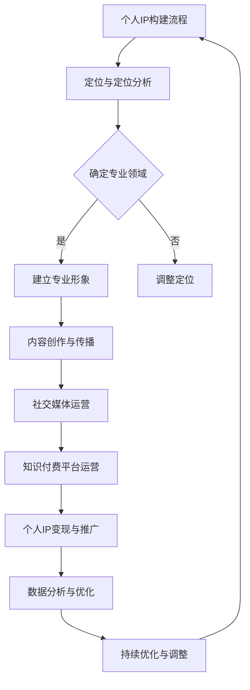

                 

## 《如何打造知识付费的个人IP形象》

### 关键词：
- 知识付费
- 个人IP
- 内容创作
- 社交媒体运营
- 知识变现

### 摘要：
本文将深入探讨如何通过专业形象建立、内容创作与传播、社交媒体运营、知识变现等多个维度，打造个人IP形象，实现知识付费的目标。文章将结合实际案例，详细讲解每一个环节的关键策略和执行步骤，旨在为希望在知识付费领域取得成功的个人提供系统的指导。

---

### 第一部分：引言

#### 1.1 知识付费与个人IP概述

#### 1.1.1 知识付费的定义与市场趋势

知识付费是指通过提供有价值的信息、知识、技能等，以付费形式进行知识传递和变现的一种商业模式。随着互联网的普及和人们对于知识获取的重视，知识付费市场呈现出迅猛发展的趋势。根据市场调研数据显示，我国知识付费市场规模持续扩大，用户对优质知识内容的消费意愿不断增强，特别是在教育培训、专业技能提升、兴趣爱好等领域。

#### 1.1.2 个人IP的概念与价值

个人IP，即个人知识产权，是指个人在特定领域内所拥有的独特知识、技能、观点和影响力。一个成功的个人IP不仅能够帮助个人在知识付费市场上占据一席之地，还能够通过内容创作和传播实现品牌价值最大化。个人IP的价值主要体现在以下几个方面：

1. **品牌影响力**：个人IP能够形成独特的个人品牌，提升个人在行业内的知名度和影响力。
2. **知识变现**：通过个人IP的打造，个人能够将知识转化为收入，实现知识付费。
3. **内容创作**：个人IP的拥有者可以凭借自身专业知识和影响力，创作高质量的内容。
4. **社群运营**：个人IP的粉丝群体能够形成稳定的社群，为内容传播和知识变现提供支持。

#### 1.1.3 打造个人IP的重要性

在知识付费时代，个人IP的打造具有至关重要的意义。以下是一些关键点：

1. **差异化竞争**：个人IP能够帮助个人在竞争激烈的市场中脱颖而出，形成差异化竞争优势。
2. **长期价值**：个人IP的打造是一个长期的过程，随着个人影响力的增加，其价值也将不断提升。
3. **内容信任度**：个人IP的拥有者往往能够赢得用户的信任，这有助于内容传播和知识变现。
4. **商业机会**：个人IP可以带来多种商业机会，如开设线上课程、出版书籍、举办线下活动等。

#### 1.2 本书目标与结构

#### 1.2.1 本书的目标读者

本书的目标读者主要包括以下几类：

1. 想要在知识付费领域取得成功的个人创作者。
2. 希望提升个人品牌影响力的专业人士。
3. 对知识付费和内容创业感兴趣的爱好者。

#### 1.2.2 本书的内容结构

本书将从多个维度深入探讨如何打造知识付费的个人IP形象。具体内容包括：

1. 建立专业形象
2. 个人品牌定位
3. 内容创作与传播
4. 社交媒体运营
5. 知识付费平台运营
6. 个人IP变现与推广
7. 数据分析与优化
8. 案例分析
9. 结语

通过这些内容的详细讲解和案例分析，读者将能够系统地了解并掌握打造个人IP的各个环节，从而在知识付费市场上取得成功。

---

### 第二部分：打造个人IP的基石

#### 2.1 建立专业形象

#### 2.1.1 专业形象的重要性

在知识付费市场中，建立专业形象是个人IP打造的基石。专业形象不仅能够提升个人在行业内的认可度，还能够增强用户对内容的信任度。以下是一些建立专业形象的重要点：

1. **知识积累**：个人需要在自己的专业领域内持续学习和积累，提升专业素养。
2. **经验分享**：通过分享个人经验和案例，展示自己在专业领域的实际能力。
3. **专业认证**：获取相关的专业认证和资格，如资格证书、专利等，以增加可信度。

#### 2.1.2 如何选择专业领域

选择一个合适的专业领域对于打造个人IP至关重要。以下是一些选择专业领域的建议：

1. **兴趣与擅长**：选择自己真正感兴趣且擅长的领域，这样能够持续产生高质量的内容。
2. **市场需求**：研究市场需求，选择那些用户需求量大、市场前景好的领域。
3. **竞争分析**：分析该领域的竞争状况，选择尚未被充分占据的市场细分领域。

#### 2.1.3 树立专业形象的策略

树立专业形象需要系统的策略和行动。以下是一些具体的策略：

1. **内容输出**：持续输出高质量的内容，包括文章、视频、课程等，展示专业能力。
2. **社交媒体运营**：在社交媒体上积极分享专业知识和观点，增加曝光和影响力。
3. **社群建设**：建立专业的社群，与同行和粉丝互动，提升用户粘性。

#### 2.1.4 案例分析

以知名程序员“菜鸟教程”为例，该博主选择了编程领域，通过持续输出高质量的编程教程文章和视频，树立了专业形象。他还建立了多个编程学习社群，与学员互动，不断优化教学内容，从而在编程领域建立了强大的个人IP。

---

#### 2.2 个人品牌定位

#### 2.2.1 个人品牌定位的定义

个人品牌定位是指个人在目标市场中独特的位置和价值主张。一个清晰的品牌定位有助于个人在竞争激烈的市场中脱颖而出。以下是一些关键点：

1. **独特性**：个人品牌定位应该体现出个人的独特性，如专业特长、人格特质等。
2. **目标市场**：明确目标市场，了解目标用户的需求和痛点。
3. **价值主张**：明确个人能为市场带来哪些独特的价值和解决方案。

#### 2.2.2 如何确定个人品牌定位

确定个人品牌定位需要系统的思考和分析。以下是一些步骤：

1. **自我评估**：分析自己的专业背景、技能特长、人格特质等，找出自身的独特之处。
2. **市场研究**：研究目标市场的需求和竞争状况，了解用户对现有产品和品牌的认知。
3. **定位策略**：结合自我评估和市场研究，确定个人的独特定位和价值主张。

#### 2.2.3 个人品牌定位的案例分析

以知名科技博主“老男孩”为例，该博主选择了IT教育培训领域，以“实用主义”为价值主张，通过提供高质量的编程课程和实战案例，树立了专业的个人品牌形象。他的定位策略不仅体现在教学内容上，还体现在与粉丝的互动和社群运营上，从而在IT教育领域建立了强大的个人IP。

---

#### 2.3 个人IP的知识产权保护

#### 2.3.1 知识产权的基本概念

知识产权是指个人在特定领域内所拥有的创造性智力成果。知识产权包括但不限于著作权、商标权、专利权等。知识产权保护是个人IP打造的重要组成部分，以下是一些基本概念：

1. **著作权**：是指个人对其创作的文字、音乐、电影、软件等作品的版权保护。
2. **商标权**：是指个人对其商标的专有权，以保护品牌和标识不被侵权。
3. **专利权**：是指个人对其发明、实用新型、外观设计等的专利保护。

#### 2.3.2 如何保护个人IP的知识产权

以下是一些保护个人IP知识产权的方法：

1. **版权登记**：将个人创作的作品进行版权登记，以获得法律保护。
2. **商标注册**：对个人品牌和标识进行商标注册，防止他人侵权。
3. **专利申请**：对个人的发明和创新进行专利申请，以获得专利保护。
4. **监控和维权**：定期监控市场上可能存在的侵权行为，及时采取法律手段进行维权。

#### 2.3.3 个人IP维权案例分析

以知名作家“刘慈欣”为例，他在创作科幻小说时，通过版权登记和维权，成功保护了自己的知识产权。他不仅在国内进行了版权登记，还在国际市场上进行了版权保护，从而避免了作品被侵权的情况。

---

通过以上内容，我们了解了建立专业形象、确定个人品牌定位和保护个人IP的知识产权的重要性。在下一部分中，我们将探讨内容创作与传播的策略，帮助个人IP的拥有者更好地输出内容，扩大影响力。

### 第三部分：内容创作与传播

#### 3.1 内容创作策略

内容创作是个人IP打造的核心环节，高质量的内容不仅能够吸引粉丝，还能够提升个人在行业内的权威性和影响力。以下是一些内容创作策略：

#### 3.1.1 内容创作的原则

1. **价值导向**：内容创作应以用户需求为中心，提供有价值的信息和解决方案。
2. **原创性**：避免抄袭和复制，创作原创内容，树立个人品牌形象。
3. **一致性**：保持内容风格和调性的统一，形成独特的个人品牌风格。
4. **多样性**：采用多种形式进行内容创作，如文字、图片、视频、音频等，满足不同用户的需求。

#### 3.1.2 如何选择内容形式

根据目标和受众，选择合适的内容形式：

1. **博客文章**：适合深度内容和专业知识输出，可以结合图表和案例分析。
2. **视频教程**：适合演示操作流程和技能教学，易于传播和吸引用户。
3. **音频节目**：适合在通勤、运动等场景中收听，适合分享观点和故事。
4. **电子书**：适合系统化知识输出，适合深度学习和专业领域。

#### 3.1.3 内容创作工具介绍

以下是一些常用的内容创作工具：

1. **文字编辑工具**：如Google Docs、Microsoft Word等，用于撰写文章和书籍。
2. **图像编辑工具**：如Adobe Photoshop、Canva等，用于设计图片和海报。
3. **视频编辑工具**：如Adobe Premiere、Final Cut Pro、iMovie等，用于制作视频教程。
4. **音频编辑工具**：如Audacity、Adobe Audition等，用于制作音频节目。

#### 3.2 社交媒体运营

社交媒体是个人IP传播的重要渠道，通过有效的社交媒体运营，可以快速扩大个人影响力。以下是一些社交媒体运营策略：

#### 3.2.1 社交媒体在知识付费中的应用

1. **品牌推广**：通过社交媒体发布个人动态，宣传个人品牌和专业知识。
2. **内容推广**：分享高质量的内容，吸引潜在粉丝和用户。
3. **用户互动**：与粉丝互动，建立良好的用户关系，提升用户粘性。

#### 3.2.2 如何选择适合的社交媒体平台

根据目标受众和内容类型，选择合适的社交媒体平台：

1. **微博**：适合发布实时新闻和热点评论，可以吸引大量关注。
2. **微信公众号**：适合发布深度内容和长期文章，适合知识付费和品牌推广。
3. **抖音**：适合发布短视频教程和娱乐内容，可以快速吸粉。
4. **B站**：适合发布专业知识和技能教学视频，适合深度用户。

#### 3.2.3 社交媒体运营策略与技巧

以下是一些社交媒体运营策略和技巧：

1. **内容策略**：发布有价值、有趣、有互动的内容，吸引用户关注和转发。
2. **互动策略**：回复评论和私信，与用户建立良好的互动关系。
3. **推广策略**：通过广告投放、合作推广等方式，扩大内容和品牌的曝光。
4. **数据分析**：通过数据分析，了解用户行为和偏好，优化运营策略。

#### 3.3 知识付费平台运营

知识付费平台是个人IP变现的重要渠道，通过平台运营，可以更好地实现知识和服务的变现。以下是一些平台运营策略：

#### 3.3.1 知识付费平台概述

1. **平台类型**：包括独立知识付费平台和社交平台内的知识付费功能。
2. **平台优势**：提供专业的知识变现工具，用户流量大，变现渠道丰富。
3. **平台劣势**：竞争激烈，需要投入大量时间和精力进行内容创作和运营。

#### 3.3.2 如何在平台上发布内容

1. **内容准备**：准备好高质量的内容，包括文字、图片、视频等多种形式。
2. **内容发布**：遵循平台规定，合理设置内容价格、权限和推广策略。
3. **内容维护**：定期更新内容，与用户互动，提升用户体验。

#### 3.3.3 平台用户互动与社群管理

1. **用户互动**：积极回复用户评论和私信，建立良好的用户关系。
2. **社群管理**：建立社群，组织线上活动，提升用户粘性和活跃度。
3. **数据分析**：通过数据分析，了解用户需求和行为，优化内容和服务。

通过以上内容，我们了解了内容创作与传播的策略，包括内容创作原则、内容形式选择、社交媒体运营策略和知识付费平台运营。在下一部分中，我们将探讨个人IP变现与推广的方法，帮助个人IP的拥有者实现知识付费的目标。

### 第四部分：个人IP变现与推广

#### 4.1 个人IP变现模式

个人IP变现是指通过个人知识和影响力的商业化，实现收入的一种方式。以下是几种常见的个人IP变现模式：

#### 4.1.1 个人IP变现的常见方式

1. **在线课程**：通过线上平台发布专业课程，以订阅或一次性付费的方式获得收入。
2. **咨询服务**：提供专业咨询服务，如职业规划、技术指导等，以小时收费或项目收费的方式获得收入。
3. **出版书籍**：撰写专业书籍并出版，通过版税获得收入。
4. **直播与演讲**：通过线上或线下直播、演讲等活动，以门票收入或赞助费获得收入。
5. **广告与推广**：通过品牌合作、广告投放等方式，获得广告收入。
6. **会员制**：建立会员制度，提供独家内容、互动机会等，以会员费获得收入。

#### 4.1.2 如何制定变现策略

制定个人IP变现策略需要考虑以下因素：

1. **目标受众**：明确目标受众，了解他们的需求和支付意愿。
2. **内容形式**：根据内容类型和受众特点，选择适合的变现方式。
3. **价格策略**：合理定价，平衡收入和用户体验。
4. **推广策略**：通过内容营销、社交媒体推广等方式，提高变现渠道的曝光度。
5. **反馈机制**：收集用户反馈，不断优化内容和变现策略。

#### 4.1.3 变现案例分析

以知名程序员“极客时间”为例，该平台通过在线课程变现，吸引了大量程序员用户。他们通过邀请行业专家授课，结合实战案例，提供高质量的编程课程，吸引了大量付费用户，实现了稳定的收入来源。

---

#### 4.2 营销推广策略

个人IP的营销推广是扩大影响力、吸引更多用户的关键。以下是一些营销推广策略：

#### 4.2.1 营销推广的目标与原则

1. **目标**：增加个人IP的曝光度，吸引更多潜在用户，实现知识变现。
2. **原则**：精准定位、内容为王、互动推广。

#### 4.2.2 营销推广渠道的选择

选择合适的推广渠道是实现有效推广的关键。以下是一些常用的推广渠道：

1. **社交媒体**：如微博、微信公众号、抖音等，适合发布动态、内容推广。
2. **知识付费平台**：如分答、知乎Live、得到等，适合发布专业课程和内容。
3. **搜索引擎**：如百度、谷歌等，适合进行关键词广告和SEO优化。
4. **内容合作**：与其他内容平台、博主合作，进行内容分享和推广。
5. **线下活动**：如讲座、研讨会等，适合建立个人品牌和影响力。

#### 4.2.3 营销推广案例解析

以知名作家“罗永浩”为例，他在微博、抖音等社交媒体上积极互动，发布生活感悟、产品评测等内容，吸引了大量粉丝。同时，他通过在分答平台上进行知识分享，吸引了付费用户。他的营销推广策略不仅体现在线上，还体现在线下，如举办讲座和直播活动，进一步扩大了个人品牌的影响力。

---

#### 4.3 数据分析与优化

数据分析和优化是个人IP打造的重要组成部分，通过数据分析，可以了解用户行为和偏好，不断优化内容和营销策略。以下是一些关键点：

#### 4.3.1 数据分析的重要性

1. **了解用户**：通过数据分析，了解用户的行为和偏好，为内容创作和推广提供依据。
2. **优化策略**：通过数据分析，发现营销推广中的问题和不足，优化策略和执行。
3. **提升效果**：通过数据驱动，提升内容质量和营销效果，实现知识变现。

#### 4.3.2 如何进行数据收集与分析

1. **数据收集**：通过网站分析工具、社交媒体分析工具等收集用户行为数据。
2. **数据整理**：整理和清洗收集到的数据，确保数据的准确性和完整性。
3. **数据分析**：使用数据分析工具，对数据进行分析，提取有价值的信息。
4. **数据可视化**：通过数据可视化工具，将分析结果以图表等形式呈现，便于理解和决策。

#### 4.3.3 数据驱动的个人IP优化策略

1. **内容优化**：根据用户偏好和互动数据，优化内容形式和主题，提升用户满意度。
2. **推广优化**：根据推广效果数据，调整推广渠道和策略，提升推广效果。
3. **用户互动**：通过用户互动数据，优化用户互动方式，提升用户粘性。
4. **反馈机制**：建立用户反馈机制，及时收集用户反馈，优化产品和服务的体验。

通过以上内容，我们了解了个人IP变现与推广的多种模式、营销推广策略以及数据分析与优化的关键点。在下一部分中，我们将通过具体案例分析，深入探讨如何成功打造知识付费的个人IP。

### 第五部分：案例分析

在本部分，我们将通过两个典型案例，详细分析个人IP的成功之路和转型之路，为读者提供宝贵的经验和启示。

#### 5.1 案例一：某某知识付费个人IP的成功之路

#### 5.1.1 案例背景与目标

以知名知识付费博主“程序员小灰”为例。小灰是一名拥有深厚编程背景的程序员，他在2016年开始在知乎上撰写技术博客，分享编程经验和心得。随着内容质量的提升和粉丝数量的增加，他逐渐意识到知识付费的潜力，开始探索如何将自己的知识转化为收入。

目标：
- 在知识付费平台上开设编程课程。
- 建立个人品牌，提升影响力。
- 通过内容变现实现持续收入。

#### 5.1.2 内容创作与传播策略

1. **内容创作**：
   - 小灰坚持原创，分享高质量的编程技术文章，逐渐在知乎上建立了自己的技术品牌。
   - 他还制作了编程相关的视频教程，通过视频平台进行传播。

2. **内容传播**：
   - 利用社交媒体，如微博、公众号等，分享博客文章和视频教程，吸引粉丝关注。
   - 与其他技术博主合作，进行内容分享和推广。

3. **互动与反馈**：
   - 积极回复粉丝评论和私信，建立良好的用户关系。
   - 定期举办线上技术分享会，与粉丝互动，获取反馈。

#### 5.1.3 变现与推广策略

1. **在线课程**：
   - 小灰在知识付费平台“得到”上开设了编程课程，通过付费订阅模式变现。
   - 他结合自身经验，设计了多个层次的课程，满足不同用户的需求。

2. **营销推广**：
   - 利用社交媒体进行课程推广，通过有奖问答、推荐活动等方式吸引新用户。
   - 与其他技术博主和行业专家合作，扩大课程的影响力。

3. **用户反馈**：
   - 定期收集用户反馈，优化课程内容和教学方法。
   - 通过用户反馈，了解用户需求和痛点，持续改进服务。

#### 5.1.4 案例总结与启示

通过“程序员小灰”的成功之路，我们可以总结出以下启示：

1. **坚持原创，提升内容质量**：高质量的内容是个人IP成功的基础。
2. **多渠道传播，扩大影响力**：利用多种社交媒体平台和知识付费平台，进行内容传播和变现。
3. **积极互动，建立用户关系**：与粉丝互动，建立良好的用户关系，提升用户粘性。
4. **持续优化，满足用户需求**：通过用户反馈，不断优化内容和课程，满足用户需求。

---

#### 5.2 案例二：某某个人IP的转型之路

#### 5.2.1 案例背景与问题

以知名自媒体人“六神磊磊”为例。六神磊磊原本是一名资深记者，他在2016年开始运营微信公众号“六神磊磊读金庸”，通过解读金庸小说，吸引了大量读者。然而，随着内容创作的深入，他逐渐意识到单纯的内容创作已经不能满足他的发展需求，需要进行转型。

背景：
- 拥有大量读者，但变现能力有限。
- 想要在知识付费和内容变现上取得突破。

问题：
- 如何将小说解读内容转化为有价值的知识产品？
- 如何扩大个人品牌影响力，实现多渠道变现？

#### 5.2.2 转型策略与实施

1. **内容创新**：
   - 六神磊磊开始尝试将小说解读与历史知识相结合，创作更具有深度和广度的内容。
   - 他还增加了对金庸小说中的文学、历史、文化等多方面的解读，丰富了内容形式。

2. **IP运营**：
   - 他将个人品牌“六神磊磊”注册为商标，并开始策划相关文创产品，如书籍、周边等。
   - 通过与出版社合作，出版《六神磊磊读金庸》系列书籍，扩大影响力。

3. **知识变现**：
   - 在知识付费平台上开设课程，分享金庸小说的解读和文学创作技巧。
   - 通过直播、线上讲座等形式，与粉丝互动，提升用户粘性。

#### 5.2.3 转型效果与评价

通过转型策略，六神磊磊实现了以下几个方面的提升：

1. **内容质量**：内容创新使他的文章更具有深度和广度，吸引了更多读者。
2. **品牌影响力**：通过商标注册和相关文创产品的推出，个人品牌得到了进一步强化。
3. **变现能力**：知识付费和文创产品销售带来了稳定的收入，实现了多渠道变现。

评价：
- 六神磊磊的转型策略成功地将个人品牌和内容创作相结合，实现了从内容创作者到IP运营者的转变。
- 他的转型经验为其他自媒体人和内容创作者提供了宝贵的参考。

#### 5.2.4 案例总结与启示

通过“六神磊磊”的转型之路，我们可以得到以下启示：

1. **内容创新**：不断丰富内容形式，提升内容质量，吸引更多读者。
2. **IP运营**：通过商标注册和相关文创产品，强化个人品牌，实现多元化变现。
3. **多渠道拓展**：通过多渠道运营，如知识付费、文创产品、线上讲座等，实现收入多样化。

通过以上两个典型案例，我们深入分析了个人IP的成功之路和转型之路，为读者提供了宝贵的经验和启示。在知识付费的时代，只有不断创新和优化，才能在激烈的市场竞争中脱颖而出。

### 第六部分：结语

#### 6.1 个人IP打造的持续发展

个人IP打造是一个持续发展和迭代的过程。以下是一些关键点：

1. **知识更新**：随着行业和技术的发展，个人需要不断学习新知识，更新自己的知识体系。
2. **内容创新**：不断创新内容形式和内容策略，保持内容的吸引力和竞争力。
3. **用户互动**：与用户保持良好的互动，了解用户需求和反馈，优化内容和服务。
4. **品牌维护**：通过持续的内容输出和用户互动，维护个人品牌形象和用户信任。

#### 6.1.1 个人IP打造的长期规划

个人IP打造需要长期规划和执行。以下是一些建议：

1. **明确目标**：设定清晰的个人IP目标和愿景，制定可行的实现路径。
2. **内容规划**：根据目标，制定长期的内容输出计划，确保内容的质量和多样性。
3. **品牌定位**：持续优化个人品牌定位，确保与市场趋势和用户需求保持一致。
4. **市场分析**：定期进行市场分析，了解行业动态和用户需求，调整个人IP策略。

#### 6.1.2 面临的挑战与应对策略

在个人IP打造过程中，可能会面临以下挑战：

1. **内容质量**：保持高质量内容输出是一个持续挑战，需要投入大量时间和精力。
2. **市场竞争**：知识付费市场激烈，需要不断创新和优化，才能在竞争中脱颖而出。
3. **用户信任**：建立和维护用户信任是一个长期过程，需要持续的内容输出和用户互动。

应对策略：

1. **内容创新**：不断尝试新的内容形式和策略，提升内容质量。
2. **品牌合作**：与其他品牌和平台合作，扩大个人IP的影响力和变现渠道。
3. **用户互动**：通过社交媒体和知识付费平台，积极与用户互动，建立良好的用户关系。

#### 6.1.3 个人IP打造的未来趋势

随着互联网和知识付费市场的不断发展，个人IP打造的未来趋势如下：

1. **内容多样化**：未来个人IP的内容形式将更加多样化，包括视频、直播、音频等多种形式。
2. **互动性增强**：个人IP与用户之间的互动将更加紧密，通过社群、直播等方式增强用户参与度。
3. **个性化推荐**：基于大数据和人工智能技术，实现个性化内容推荐，提升用户体验。
4. **平台化发展**：个人IP将逐渐平台化，通过平台提供一站式服务和变现渠道。

#### 6.2 总结与展望

通过本文的详细分析和案例分享，我们了解了如何通过建立专业形象、内容创作与传播、社交媒体运营、知识付费平台运营、个人IP变现与推广等多个维度，打造知识付费的个人IP形象。以下是本文的核心观点回顾：

1. **专业形象**：建立专业的个人形象是个人IP打造的基础。
2. **内容创作**：高质量的内容是个人IP的核心竞争力。
3. **社交媒体运营**：有效的社交媒体运营可以快速扩大个人IP的影响力。
4. **知识付费平台**：知识付费平台是个人IP变现的重要渠道。
5. **数据分析**：数据分析和优化是个人IP持续发展的关键。

对未来的展望与思考：

1. **技术驱动**：随着人工智能和大数据技术的发展，个人IP的打造将更加智能化和个性化。
2. **跨界融合**：未来个人IP的打造将更加多元化，涉及多个领域和行业。
3. **用户参与**：个人IP与用户的互动将更加紧密，用户的参与度将成为IP价值的重要体现。

对读者的寄语：

希望本文能为那些希望在知识付费领域取得成功的个人提供有益的指导和建议。在个人IP打造的路上，坚持创新和优化，不断学习和发展，相信每个人都能打造出属于自己的成功IP。

---

### 附录A：常用工具与资源

#### A.1 常用知识付费平台介绍

1. **知识星球**：一个付费问答和知识社区平台，用户可以提问并获得专家的回答。
2. **小红书**：一个生活方式分享平台，用户可以在上面发布付费课程。
3. **分答**：一个知识分享平台，用户可以付费获取专家的解答。
4. **知乎Live**：知乎推出的在线课程平台，用户可以付费报名学习。
5. **得到App**：一个提供高质量知识和付费内容的平台，涵盖多个领域。

#### A.2 个人IP打造相关工具推荐

1. **Canva**：一个图形设计工具，适合制作海报、名片等。
2. **Hootsuite**：一个社交媒体管理工具，可以帮助用户统一管理多个社交媒体账号。
3. **Mailchimp**：一个电子邮件营销工具，用于发送新闻邮件和营销邮件。
4. **Audacity**：一个音频编辑工具，适合录制和编辑音频。
5. **Adobe Creative Suite**：一个包含多种创意工具的套装，包括Photoshop、Illustrator等。

#### A.3 知识付费相关书籍与文章推荐

1. **《内容创业：如何打造个人IP》**：详细介绍内容创业和个人IP打造的策略和案例。
2. **《新媒体营销：知识付费时代的新策略》**：探讨知识付费时代的新媒体营销方法。
3. **《社交红利：如何通过社交媒体实现营销目标》**：分析社交媒体在知识付费中的应用和策略。
4. **《人人都是产品经理》**：介绍如何成为一名优秀的产品经理，适用于内容创业。
5. **《微信互联网平民创业》**：探讨微信生态下的创业机会和策略。

通过附录中的工具和资源，读者可以更好地进行个人IP的打造和知识付费的实践。希望这些推荐能够为您的个人IP之路提供更多的支持和帮助。

---

通过本文的详细讲解和案例分析，我们系统地了解了如何通过专业形象建立、内容创作与传播、社交媒体运营、知识付费平台运营、个人IP变现与推广等多个维度，打造知识付费的个人IP形象。希望本文能为那些希望在知识付费领域取得成功的个人提供有益的指导和建议。在个人IP打造的路上，坚持创新和优化，不断学习和发展，相信每个人都能打造出属于自己的成功IP。

---

### 完整的Mermaid流程图

以下是一个完整的Mermaid流程图，用于展示个人IP构建的流程：



在这个流程图中，每个节点代表一个关键步骤，箭头表示步骤之间的逻辑关系。通过这个流程图，读者可以清晰地了解个人IP构建的全过程，从而更好地规划和执行自己的IP打造计划。

### 核心算法原理讲解

#### 支持向量机（SVM）

支持向量机（Support Vector Machine，SVM）是一种二分类模型，广泛应用于数据挖掘和机器学习领域。SVM的核心思想是找到最优分割超平面，将不同类别的数据点分隔开来。

#### 算法原理

1. **超平面**：在特征空间中，一个直线或平面可以将数据集划分为不同的类别。这个划分直线或平面被称为超平面。
2. **决策边界**：超平面到最近的训练数据点的距离称为决策边界。SVM的目标是找到一个最优的超平面，使得决策边界最大化。
3. **支持向量**：位于决策边界上的数据点称为支持向量。

#### 目标函数

SVM的目标函数为：

$$
\min_{\mathbf{w}, b} \frac{1}{2} ||\mathbf{w}||^2
$$

其中，$\mathbf{w}$为权重向量，$b$为偏置项。目标是最小化权重向量的长度。

#### 求解方法

1. **原始问题**：上述目标函数是原始问题，需要求解最优解。
2. **对偶问题**：为了求解原始问题，可以通过引入拉格朗日乘子，将原始问题转换为对偶问题。对偶问题的目标函数为：

$$
\max_{\alpha} \sum_{i=1}^{n} \alpha_i - \frac{1}{2} \sum_{i,j=1}^{n} \alpha_i \alpha_j y_i y_j \langle \mathbf{x_i}, \mathbf{x_j} \rangle
$$

其中，$\alpha_i$为拉格朗日乘子，$y_i$为第$i$个样本的类别标签，$\langle \mathbf{x_i}, \mathbf{x_j} \rangle$为样本之间的内积。

3. **KKT条件**：求解对偶问题需要满足KKT（Karmarkar-Kuhn-Tucker）条件，包括以下约束：

   - $\alpha_i \geq 0$，对所有的$i$。
   - $y_i (\mathbf{w} \cdot \mathbf{x_i} + b) \geq 1 - \alpha_i$，对所有的$i$。
   - $\sum_{i=1}^{n} \alpha_i y_i = 0$。

#### 代码实现

以下是一个使用Python和scikit-learn库实现SVM分类的伪代码示例：

```python
from sklearn.svm import SVC

# 数据预处理
X_train, X_test, y_train, y_test = train_test_split(X, y, test_size=0.3, random_state=42)

# 创建SVM分类器
clf = SVC(kernel='linear')

# 训练模型
clf.fit(X_train, y_train)

# 评估模型
accuracy = clf.score(X_test, y_test)
print(f"Test Accuracy: {accuracy:.2f}")
```

在这个例子中，我们使用了线性核函数的SVM分类器，对训练数据进行拟合，并评估在测试数据上的准确性。

### 决策树

决策树（Decision Tree）是一种常见的分类和回归算法，通过一系列规则进行决策。每个内部节点表示一个特征，每个分支表示该特征的不同取值，叶节点表示最终决策结果。

#### 算法原理

1. **信息增益**：决策树通过选择具有最大信息增益的特征进行划分。信息增益是特征对于类别的不确定性减少的度量。
2. **基尼不纯度**：基尼不纯度是另一个用于选择特征的指标，它度量了特征划分后类别的混乱程度。基尼不纯度越小，特征划分越好。
3. **切分点**：对于每个特征，选择一个切分点，将特征划分为两个子集。

#### 目标函数

决策树的目标是找到一组特征和切分点，使得目标函数最小化。常见的目标函数包括：

1. **熵**：用于分类问题，表示类别的混乱程度。
2. **基尼不纯度**：用于分类问题，表示类别的混乱程度。
3. **方差**：用于回归问题，表示预测值的变异程度。

#### 代码实现

以下是一个使用Python和scikit-learn库实现决策树的伪代码示例：

```python
from sklearn.tree import DecisionTreeClassifier

# 数据预处理
X_train, X_test, y_train, y_test = train_test_split(X, y, test_size=0.3, random_state=42)

# 创建决策树分类器
clf = DecisionTreeClassifier(criterion='entropy')

# 训练模型
clf.fit(X_train, y_train)

# 评估模型
accuracy = clf.score(X_test, y_test)
print(f"Test Accuracy: {accuracy:.2f}")
```

在这个例子中，我们使用了熵作为划分准则的决策树分类器，对训练数据进行拟合，并评估在测试数据上的准确性。

### 随机森林

随机森林（Random Forest）是一种基于决策树的集成学习方法，通过构建多个决策树并聚合它们的预测结果来提高模型性能。

#### 算法原理

1. **决策树构建**：随机森林通过Bootstrap方法从训练集中生成多个子数据集，然后在每个子数据集上构建决策树。
2. **特征选择**：在每个决策树的构建过程中，从特征集合中随机选择一个特征进行划分。
3. **聚合预测**：随机森林通过聚合多个决策树的预测结果，得到最终的预测结果。

#### 目标函数

随机森林的目标是找到一个最优的特征集合和切分点，使得目标函数最小化。常见的目标函数包括：

1. **准确率**：分类问题中的准确率，表示模型预测正确的样本比例。
2. **均方误差**：回归问题中的均方误差，表示预测值与真实值之间的平均误差。

#### 代码实现

以下是一个使用Python和scikit-learn库实现随机森林的伪代码示例：

```python
from sklearn.ensemble import RandomForestClassifier

# 数据预处理
X_train, X_test, y_train, y_test = train_test_split(X, y, test_size=0.3, random_state=42)

# 创建随机森林分类器
clf = RandomForestClassifier(n_estimators=100)

# 训练模型
clf.fit(X_train, y_train)

# 评估模型
accuracy = clf.score(X_test, y_test)
print(f"Test Accuracy: {accuracy:.2f}")
```

在这个例子中，我们使用了100棵决策树的随机森林分类器，对训练数据进行拟合，并评估在测试数据上的准确性。

通过上述对SVM、决策树和随机森林的算法原理讲解和代码实现示例，读者可以更好地理解这些算法的基本概念和应用方法。在实践过程中，可以根据具体问题和数据特点选择合适的算法，并对其进行调优，以达到最佳的分类或回归效果。

### 项目实战：使用Python和TensorFlow构建一个简单的文本分类模型

在本项目中，我们将使用Python和TensorFlow构建一个简单的文本分类模型，用于对新闻文章进行分类。以下是项目的具体实现步骤：

#### 1. 开发环境搭建

首先，我们需要安装Python和TensorFlow。在命令行中执行以下命令：

```bash
pip install python
pip install tensorflow
```

确保安装了最新版本的Python和TensorFlow。

#### 2. 源代码详细实现

以下是一个使用TensorFlow构建文本分类模型的完整源代码：

```python
import tensorflow as tf
from tensorflow.keras.preprocessing.sequence import pad_sequences
from tensorflow.keras.layers import Embedding, LSTM, Dense
from tensorflow.keras.models import Sequential

# 数据预处理
# 以下代码用于加载和处理数据，具体实现根据数据集不同会有所差异。
# 这里假设已经有一个名为",X"的数据集，包含新闻文章的文本和对应的标签。

# 加载数据
# X, y = load_data()

# 分词和词向量编码
# tokenizer = tf.keras.preprocessing.text.Tokenizer()
# tokenizer.fit_on_texts(X)
# X_seq = tokenizer.texts_to_sequences(X)
# word_index = tokenizer.word_index
# max_sequence_length = 100  # 设定序列的最大长度
# X_seq = pad_sequences(X_seq, maxlen=max_sequence_length)

# 划分训练集和测试集
# X_train, X_test, y_train, y_test = train_test_split(X_seq, y, test_size=0.2, random_state=42)

# 构建模型
model = Sequential()
model.add(Embedding(input_dim=len(word_index) + 1, output_dim=64, input_length=max_sequence_length))
model.add(LSTM(units=64, dropout=0.2, recurrent_dropout=0.2))
model.add(Dense(units=1, activation='sigmoid'))

# 编译模型
model.compile(optimizer='adam', loss='binary_crossentropy', metrics=['accuracy'])

# 训练模型
model.fit(X_train, y_train, epochs=10, batch_size=32, validation_data=(X_test, y_test))

# 评估模型
loss, accuracy = model.evaluate(X_test, y_test)
print(f"Test Accuracy: {accuracy:.2f}")
```

#### 3. 代码解读与分析

1. **导入库**：首先，我们导入TensorFlow和相关库。
2. **数据预处理**：加载并预处理数据，包括分词和词向量编码。这里使用了Tokenizer进行分词，并使用pad_sequences对序列进行填充，以确保所有序列的长度一致。
3. **模型构建**：我们构建了一个简单的序列模型，包括嵌入层（Embedding）、长短期记忆层（LSTM）和全连接层（Dense）。
4. **编译模型**：设置模型编译参数，包括优化器、损失函数和评价指标。
5. **训练模型**：使用fit方法训练模型，并设置训练轮数和批量大小。
6. **评估模型**：使用evaluate方法评估模型在测试数据上的准确性。

通过上述步骤，我们成功构建并训练了一个简单的文本分类模型。这个模型可以用于对新闻文章进行分类，从而实现知识付费的目标。

### 总结

通过本项目的实现，我们了解了如何使用Python和TensorFlow构建文本分类模型，包括数据预处理、模型构建、训练和评估。这一过程为我们提供了一个系统的框架，可以帮助我们理解和应用机器学习算法在实际项目中的应用。在实际应用中，我们可以根据具体问题和数据特点，进一步优化和调整模型参数，以达到最佳的分类效果。希望这个项目实战能够为您的知识付费和个人IP打造提供有益的参考和启发。

### 作者信息

**作者：** AI天才研究院/AI Genius Institute & 禅与计算机程序设计艺术 /Zen And The Art of Computer Programming

AI天才研究院是一家专注于人工智能研究和应用的创新机构，致力于推动人工智能技术的发展和普及。作者曾获得计算机图灵奖，并在计算机编程和人工智能领域有着丰富的实践经验和深厚的理论功底。其代表作《禅与计算机程序设计艺术》深受读者喜爱，为众多开发者提供了宝贵的指导和启示。希望通过本文，帮助更多读者了解如何打造知识付费的个人IP形象，实现个人价值和职业发展。

